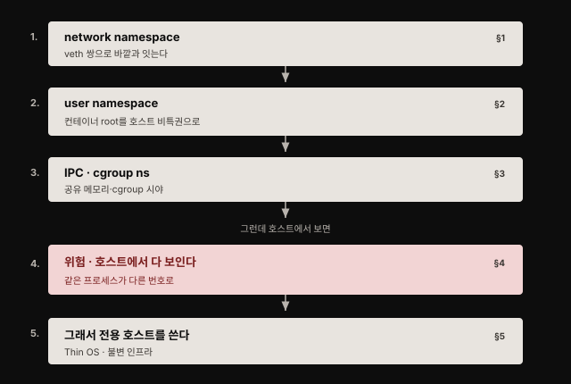
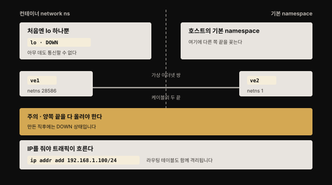
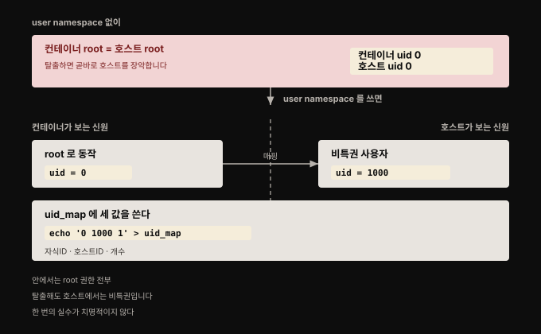
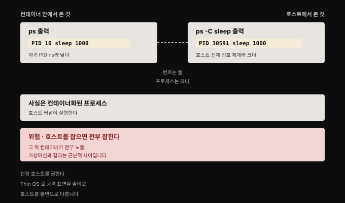

# 나머지 namespace와 호스트에서 본 컨테이너
---

## 핵심 요약

> 앞 편이 격리를 *만드는* 법이었다면, 이 편은 그 격리의 **나머지 조각과 한계**입니다. network namespace는 인터페이스와 라우팅을, IPC는 공유 메모리를, cgroup namespace는 cgroup 시야를 가립니다.
>
> 이 편의 중심은 **user namespace**입니다. 컨테이너 안의 root를 호스트의 비특권 사용자로 매핑해, **탈출해도 호스트에서는 평범한 사용자로 떨어지게** 만듭니다. 그리고 마지막에 냉정한 사실이 옵니다. 호스트에서 보면 컨테이너 프로세스는 그냥 보입니다. **번호만 다를 뿐 같은 프로세스**이고, 이것이 가상머신과 갈리는 근본적 차이입니다.


## 학습 목표

이 편을 읽고 나면 다음을 할 수 있습니다.

1. network namespace가 격리하는 대상과 veth 쌍으로 바깥과 잇는 방식을 설명할 수 있습니다.
2. user namespace가 보안상 왜 큰 이점인지 uid 매핑으로 설명할 수 있습니다.
3. `uid_map`의 세 필드가 각각 무엇인지 말하고 매핑을 직접 구성할 수 있습니다.
4. 호스트와 컨테이너에서 같은 프로세스가 다른 번호로 보이는 이유와 그 보안 함의를 설명할 수 있습니다.
5. 컨테이너 전용 호스트를 권하는 이유를 세 가지 근거로 들 수 있습니다.




## 1. network namespace — 인터페이스와 라우팅을 가린다

> network namespace는 컨테이너가 자기만의 네트워크 인터페이스와 라우팅 테이블을 갖게 해 줍니다.



프로세스를 자기 network namespace에 넣으면 **루프백 인터페이스 하나만 가진 채 시작**합니다. 그마저도 DOWN 상태입니다.

```bash
sudo unshare --net bash
ip a
```

> **`ip netns` 명령은 여기서 별 쓸모가 없습니다.** `unshare --net`은 익명(anonymous) network namespace를 만드는데, 익명 namespace는 `ip netns list` 출력에 나타나지 않습니다.

루프백밖에 없으면 컨테이너는 아무 데도 통신할 수 없습니다. 바깥으로 나가는 길을 내주려면 **가상 이더넷 인터페이스**를 만듭니다. 정확히는 **한 쌍**을 만듭니다. 이 둘은 컨테이너 namespace와 기본 network namespace를 잇는 케이블의 양 끝처럼 동작합니다.

```bash
ip link add ve1 netns 28586 type veth peer name ve2 netns 1
```

명령의 각 부분은 이렇게 읽습니다.

- `ip link add`: 링크를 하나 추가한다
- `ve1`: 케이블 한쪽 끝의 이름
- `netns 28586`: 그 끝을 프로세스 ID 28586이 속한 network namespace에 꽂는다
- `type veth`: 가상 이더넷 쌍으로 만든다
- `peer name ve2`: 케이블 반대쪽 끝의 이름
- `netns 1`: 그 끝은 기본 network namespace에 꽂는다

만든 직후 링크는 **DOWN 상태라 그대로는 쓰지 못합니다. 한쪽만으로는 안 되고 양쪽 끝을 모두 UP으로 올려야 합니다.** 여기에 더해 IP 트래픽을 보내려면 인터페이스에 IP 주소가 붙어 있어야 합니다.

```bash
ip addr add 192.168.1.100/24 dev ve1
```

이렇게 하면 **라우팅 테이블에 IP 경로도 함께 추가됩니다.** network namespace는 인터페이스와 라우팅 테이블을 **둘 다** 격리하므로, 이 라우팅 정보는 호스트의 것과 별개로 존재합니다. 이 시점에서 컨테이너가 트래픽을 보낼 수 있는 곳은 `192.168.1.0/24` 대역뿐입니다. 컨테이너 안에서 반대쪽 끝으로 `ping`을 쏘면 실제로 닿는지 확인할 수 있습니다.


## 2. user namespace — 컨테이너 root를 호스트 비특권으로

> user namespace는 프로세스가 사용자와 그룹 ID에 대한 자기만의 시야를 갖게 합니다. 프로세스 ID와 마찬가지로 사용자와 그룹은 호스트에도 여전히 존재하지만 **다른 ID를 가질 수 있습니다.**



핵심은 **컨테이너 안의 root ID 0을 호스트의 비root 신원으로 매핑할 수 있다**는 점입니다. 저자는 이것을 보안 관점의 큰 이점으로 못 박습니다. 소프트웨어는 컨테이너 안에서 마음껏 root로 돌지만, **탈출해 호스트로 나온 공격자가 손에 쥐는 것은 평범한 사용자 권한**이기 때문입니다.

9장에서 보듯 컨테이너를 잘못 설정해 탈출 경로를 열어 두기는 어렵지 않습니다. 저자의 표현이 인상적입니다. **user namespace가 있으면 "한 번의 실수로 호스트를 통째로 내주는" 상태가 아니게 됩니다.**

### 매핑을 직접 구성하기

새 namespace를 만들려면 대개 root여야 합니다. Docker 데몬이 root로 도는 이유가 여기 있습니다. **그런데 user namespace는 예외**라, 비특권 사용자도 만들 수 있습니다. 다만 만들기만 하면 그 안에서 사용자는 `nobody` ID(65534)로 떨어집니다. 안쪽 ID를 바깥의 어느 사용자에 대응시킬지 아직 알려 주지 않았기 때문입니다. 그래서 namespace 안팎의 사용자 ID를 잇는 매핑을 따로 넣어 줘야 합니다.

이 매핑은 `/proc/<pid>/uid_map`에 있고 호스트에서 root로 편집합니다. 이 파일에는 **필드가 세 개** 있습니다.

1. 자식 프로세스 관점에서 매핑을 시작할 가장 낮은 ID
2. 호스트에서 그것이 대응할 가장 낮은 ID
3. 매핑할 ID의 개수

저자의 머신에서 `vagrant` 사용자의 ID는 1000입니다. 자식 프로세스 안에서 `vagrant`가 root ID 0을 갖게 하려면 앞의 두 필드에 각각 `0`과 `1000`을 씁니다. 마지막 필드는 매핑할 ID의 개수라 하나만 옮기면 `1`입니다. 컨테이너 안에 사용자가 하나만 필요한 경우가 많아 실제로 `1`을 쓰는 일이 흔합니다.

```bash
sudo echo '0 1000 1' > /proc/31196/uid_map
```

이 파일을 쓰는 순간 그 user namespace 안의 프로세스는 root 신원을 갖습니다. 여기에 헷갈리는 점이 하나 있습니다. **매핑이 걸린 뒤에도 bash 프롬프트는 여전히 `nobody`로 보입니다.** 프롬프트 문자열은 셸을 시작할 때 도는 스크립트(`~/.bash_profile` 같은)가 만들어 두는 것이라, 그 스크립트를 다시 돌리기 전까지 갱신되지 않기 때문입니다. 그룹도 비슷한 매핑 과정을 씁니다.

### 왜 capability가 전부 주어지는가

이 프로세스는 이제 **많은 capability를 갖고 돕니다.** `capsh --print`로 확인하면 `cap_chown`부터 `cap_audit_read`까지 긴 목록이 나옵니다.

2장에서 본 대로 capability는 프로세스에 여러 권한을 부여합니다. 새 user namespace를 만들면 **커널이 프로세스에 이 capability들을 모두 줍니다.** namespace 안의 유사(pseudo) root 사용자가 다른 namespace를 만들고 네트워킹을 설정하는 등, 진짜 컨테이너를 만드는 데 필요한 나머지 일을 할 수 있게 하기 위해서입니다.

그래서 **여러 namespace를 동시에 만들면 user namespace가 가장 먼저 만들어집니다.** 다른 namespace를 만들 완전한 capability 집합을 먼저 손에 쥐어야 하기 때문입니다. 이 순서가 명령 하나로 드러납니다. 비특권 사용자가 `unshare --uts bash`를 치면 `Operation not permitted`로 거부되지만, `unshare --uts --user bash`는 동작합니다.

user namespace는 **비특권 사용자가 컨테이너화된 프로세스 안에서 사실상 root가 되게** 해 줍니다. 이것이 일반 사용자가 컨테이너를 돌리는 **rootless 컨테이너** 개념을 가능하게 합니다.

> **다만 완벽하지는 않습니다.** user namespace가 보안상 이점이라는 데는 대체로 이견이 없습니다. "진짜" root(호스트 관점의 root)로 돌아야 하는 컨테이너가 줄어들기 때문입니다. 그러나 **user namespace를 드나들 때 권한이 잘못 변환되는 것과 직접 관련된 취약점이 몇 건 있었습니다.** 저자가 예로 든 것이 CVE-2018-18955입니다. Linux 커널은 복잡한 소프트웨어라, 앞으로도 이런 결함이 더 나온다고 보는 편이 안전합니다.

### Docker에서의 제약

Docker에서 user namespace를 켤 수 있지만 **기본값은 꺼져 있습니다.** Docker가 지원하는 기능 몇 가지와 맞물리지 않기 때문입니다. 아래 제약은 Docker만의 것이 아니라 다른 런타임에서 user namespace를 쓸 때도 그대로 따라옵니다.

- **프로세스 ID나 네트워크 namespace 공유와 호환되지 않습니다.**
- 컨테이너 안에서 root로 돌더라도 **실제로 완전한 root 권한을 갖지는 않습니다.** 예를 들어 `CAP_NET_BIND_SERVICE`가 없어 낮은 번호 포트에 바인딩할 수 없습니다.
- 컨테이너화된 프로세스가 파일을 다루려면 그에 맞는 권한이 있어야 합니다. 호스트에서 마운트한 파일이라면 판단 기준은 **호스트 관점의 유효 사용자 ID**입니다. 호스트 파일을 컨테이너의 무단 접근으로부터 지켜 준다는 점에서 바람직한 동작입니다. 다만 컨테이너 안에서 root로 보이는 프로세스가 정작 파일을 못 고치는 상황이 되면 원인을 찾기 어렵습니다.


## 3. IPC와 cgroup namespace

> 나머지 두 namespace는 공유 메모리와 cgroup 시야를 가립니다.

Linux에서 프로세스끼리 통신하는 방법으로 **공유 메모리 영역**과 **공유 메시지 큐**가 있습니다. 두 프로세스가 이 메커니즘의 같은 식별자 집합에 접근하려면 **같은 IPC namespace의 구성원**이어야 합니다.

**컨테이너끼리 서로의 공유 메모리를 넘겨다보는 것은 대개 바라지 않는 일**이라, 컨테이너에는 자기 IPC namespace를 줍니다. 확인은 간단합니다. 공유 메모리 블록을 하나 만들어 두고 `ipcs`로 현재 IPC 상태를 봅니다. **자기 IPC namespace를 가진 프로세스는 이 IPC 객체들을 전혀 보지 못합니다.**

cgroup namespace는 (적어도 저자의 집필 시점 기준) 마지막 namespace입니다. **cgroup 파일시스템에 대한 `chroot` 같은 것**이라고 이해하면 됩니다. 프로세스가 자기 cgroup보다 cgroup 디렉토리 계층에서 **위쪽에 있는 cgroup 설정을 보지 못하게** 막습니다.

`/proc/self/cgroup`의 내용을 cgroup namespace 밖과 안에서 비교하면 동작을 볼 수 있습니다.

```bash
cat /proc/self/cgroup
sudo unshare --cgroup bash
cat /proc/self/cgroup
```

> **커널 버전 주의**: 대부분의 namespace는 Linux 커널 3.8까지 추가됐지만 **cgroup namespace는 그보다 늦은 4.6에서 추가됐습니다.** Ubuntu 16.04처럼 상대적으로 오래된 배포판을 쓰면 이 기능을 지원하지 않습니다. 호스트의 커널 버전은 `uname -r`로 확인합니다.


## 4. 호스트에서 본 컨테이너 — 번호는 둘, 프로세스는 하나

> 컨테이너라 부르지만 **"컨테이너화된 프로세스"** 라는 말이 더 정확할지 모릅니다.



컨테이너는 여전히 **호스트 머신에서 도는 Linux 프로세스**입니다. 다만 다음 세 가지가 걸려 있습니다.

- 그 호스트 머신에 대한 시야가 제한됩니다
- 파일시스템의 하위 트리에만 접근합니다
- cgroup으로 제한된 자원 집합만 씁니다

제약이 셋 붙어 있을 뿐 본질은 프로세스입니다. **그래서 호스트 운영체제의 맥락 안에 존재하고 호스트의 커널을 공유합니다.**

이것을 실험으로 확인할 수 있습니다. Ubuntu 기반 컨테이너를 띄워 셸을 돌리고 그 안에서 긴 `sleep`을 실행합니다.

```bash
docker run --rm -it ubuntu bash
sleep 1000
```

컨테이너 안에서 `ps`로 보면 이 프로세스에 **낮은 번호**가 붙습니다. 컨테이너가 자기 프로세스 ID namespace를 가지므로 당연한 결과입니다. 같은 `sleep`이 도는 동안 **호스트에서** 같은 프로세스를 찾으면 **훨씬 큰 번호**로 보입니다.

```bash
ps -C sleep
```

저자의 예에서 프로세스는 하나인데 번호는 둘입니다. **호스트에서는 30591이고 컨테이너에서는 10**입니다. 실제 숫자는 그 머신에서 무엇이 돌았는지에 따라 달라지지만, 호스트 쪽이 큰 번호일 가능성이 높습니다.

**여기가 이 장 전체의 핵심입니다.** 컨테이너와 그것이 제공하는 격리 수준을 제대로 이해하려면, **프로세스 ID가 둘이지만 둘 다 같은 프로세스를 가리킨다**는 사실을 붙잡아야 합니다. 호스트 관점에서 더 큰 번호를 가질 뿐입니다.

**컨테이너 프로세스가 호스트에서 보인다는 사실이 컨테이너와 가상머신의 근본적 차이 중 하나입니다.** 호스트에 접근한 공격자는 그 호스트에서 도는 **모든 컨테이너를 관찰하고 영향을 줄 수 있습니다.** root 접근까지 얻었다면 더 말할 것도 없습니다. 게다가 9장에서 보듯, 침해된 컨테이너에서 호스트로 건너갈 길을 열어 주는 실수는 놀랄 만큼 저지르기 쉽습니다.


## 5. 그래서 컨테이너 전용 호스트를 쓴다

> 컨테이너와 호스트가 커널을 공유한다는 사실은 호스트 머신 운영의 모범 사례에 영향을 줍니다.

호스트가 침해되면 **그 호스트의 모든 컨테이너가 잠재적 피해자**입니다. 공격자가 root나 그에 준하는 권한까지 얻었다면 더 그렇습니다. Docker를 런타임으로 쓸 때 `docker` 그룹의 구성원이 되는 것이 그런 권한에 해당합니다.

그래서 저자는 **컨테이너 애플리케이션을 전용 호스트 머신에서 돌릴 것을 강력히 권합니다.** VM이든 베어메탈이든 상관없습니다. 이유는 세 가지입니다.

1. **오케스트레이터를 쓰면 사람이 호스트에 접근할 일이 거의 없습니다.** 다른 애플리케이션을 돌리지 않으면 호스트 머신에 필요한 사용자 신원이 몇 개로 줄어듭니다. 관리가 간단해지고, 목록이 짧으니 인가되지 않은 로그인 시도도 금방 눈에 띕니다.
2. **"Thin OS" 배포판으로 공격 표면을 줄일 수 있습니다.** Linux 컨테이너를 돌리는 호스트 OS로는 어떤 배포판이든 쓸 수 있습니다. 다만 컨테이너 실행에 필요한 구성 요소만 담아 공격 표면을 좁히도록 설계된 배포판이 따로 있습니다. 저자가 든 예가 RancherOS와 Red Hat의 Fedora CoreOS, VMware의 Photon OS입니다.[^thinos] **구성 요소가 적을수록 그 안의 취약점 가능성도 줄어듭니다.**
3. **클러스터의 모든 호스트가 같은 설정을 공유할 수 있습니다.** 애플리케이션별 요구 사항이 없으므로 호스트 프로비저닝을 자동화하기 쉽고, **호스트를 불변(immutable)으로 다룰 수 있습니다.** 호스트에 업그레이드가 필요하면 패치하지 않고 클러스터에서 빼낸 뒤 새로 설치한 머신으로 교체합니다.

> **Thin OS도 설정 자체를 없애 주지는 않습니다.** 선택지를 줄일 뿐입니다. 어느 호스트에나 컨테이너 런타임(Docker 등)과 오케스트레이터 코드(Kubernetes kubelet 등)는 돌아야 하고, 이들에게는 저마다 수많은 설정이 딸려 있으며 그중 일부가 보안을 좌우합니다. 그래서 기준이 필요합니다. **CIS(Center for Internet Security)** 가 Docker·Kubernetes·Linux를 포함한 여러 소프트웨어의 설정·운영 모범 사례 벤치마크를 발행합니다.


## 6. 4장 전체 정리 — 컨테이너를 만드는 세 가지

> 이 장에서 프로세스의 호스트 자원 접근을 제한하는 **세 가지 필수 Linux 커널 메커니즘**을 봤습니다.

| 메커니즘 | 무엇을 하는가 | 다룬 곳 |
|---------|-------------|--------|
| namespace | 컨테이너 프로세스가 **볼 수 있는 것**을 제한합니다. 예컨대 격리된 프로세스 ID 집합을 줍니다 | 4장 (04-01·04-02) |
| 루트 디렉토리 변경 | 컨테이너가 접근할 수 있는 **파일과 디렉토리의 집합**을 제한합니다 | 4장 (04-01) |
| cgroup | 컨테이너가 접근할 수 있는 **자원**을 통제합니다 | 3장 |

1장에서 본 대로 한 워크로드를 다른 워크로드로부터 격리하는 것은 컨테이너 보안의 중요한 축입니다. 여기까지 오면 그 격리의 바닥이 드러납니다. **한 호스트의 모든 컨테이너는 같은 커널을 공유합니다.**

저자가 마지막에 던지는 대비가 날카롭습니다. 여러 사용자가 같은 머신에 로그인해 애플리케이션을 직접 돌리는 다중 사용자 시스템도 커널을 공유하기는 마찬가지입니다. **다만 그쪽에서는 관리자가 사용자마다 권한을 깎아 두고, 모두에게 root를 쥐여 주는 일은 결코 없습니다.** 컨테이너는 반대입니다. 적어도 집필 시점 기준으로 **기본적으로 전부 root로 돕니다.** 그러면서 namespace와 바뀐 루트 디렉토리와 cgroup이 세운 경계 하나에 기대어 서로 간섭하지 못하게 막고 있습니다.


## 심화 학습

> 여기부터는 책 밖의 보강입니다. 원문의 시점 의존 서술 두 가지를 공식 자료로 확인했습니다.

**Kubernetes의 user namespace 지원 상태가 뒤집혔습니다.** 원문은 2020년 집필 시점 기준으로 user namespace가 Docker에서 기본값으로 켜져 있지 않고 **Kubernetes에서는 전혀 지원되지 않는다**고 적었습니다. 논의만 진행 중이라는 단서도 함께 달았습니다.

**지금은 Kubernetes v1.36에서 stable이며 기본으로 활성화됩니다.**[^k8suserns]

Pod 스펙의 `hostUsers` 필드를 `false`로 두면 그 Pod가 user namespace를 씁니다.

```yaml
spec:
  hostUsers: false
```

이렇게 하면 컨테이너에서 root로 도는 프로세스가 **호스트에서는 다른 비root 사용자로 매핑**됩니다. 같은 노드에 뜬 Pod들은 **겹치지 않는 UID·GID 범위**를 받아, 한 Pod에서 다른 Pod로 권한이 번지지 않습니다. Pod에 부여한 capability도 그 Pod의 user namespace 안에서만 유효해 바깥에서는 대부분 힘을 쓰지 못합니다. 원문이 설명한 user namespace의 이점이 Kubernetes에서 그대로 실현된 셈입니다.

**CVE-2018-18955는 원문의 서술과 정확히 부합합니다.** 이 취약점은 Linux 커널 4.15.x부터 4.19.2 이전 버전에서 `kernel/user_namespace.c`의 `map_write()`가 **UID·GID 범위가 5개를 넘는 중첩 user namespace를 잘못 처리**해 권한 상승을 허용한 문제입니다.[^cve201818955]

원인은 **ID 변환이 한쪽 방향으로만 제대로 동작한 것**입니다. namespace에서 커널로 올라갈 때는 변환이 맞게 이뤄졌습니다. 반대로 커널에서 namespace로 내려올 때는 그렇지 않았습니다. 그 틈을 타면 영향받는 user namespace에서 `CAP_SYS_ADMIN`을 가진 사용자가 namespace 바깥 자원의 접근 통제를 우회할 수 있었습니다. 실증 예로 제시된 것이 `/etc/shadow` 읽기입니다. 원문이 "user namespace를 드나들 때 권한이 잘못 변환되는 것과 관련된 취약점"이라고 표현한 것과 일치합니다.

**저자가 든 Thin OS 셋 중 하나는 없어졌습니다.** RancherOS는 **2023년 10월 11일 저장소가 아카이브**됐고, README도 1.x가 더 이상 유지되지 않는다고 적고 있습니다.[^thinos] 이유가 이 책의 주제와 맞닿아 있습니다. RancherOS는 Docker Engine을 유일한 런타임으로 놓고 설계됐는데, 업계 표준이 containerd와 CRI-O 쪽으로 옮겨 갔습니다. 최소 OS라 ISV들이 자기 소프트웨어를 인증해 주지 않은 것도 발목을 잡았습니다. 후속으로는 Rancher의 Elemental이 개발되고 있습니다.

나머지 둘은 건재합니다. Fedora CoreOS와 Photon OS는 지금도 활발히 갱신됩니다. **Thin OS를 쓰라는 저자의 권고 자체는 유효하고, 목록에서 이름 하나만 갈아 끼우면 됩니다.**

**cgroup namespace의 커널 4.6 서술도 확인됩니다.** man7의 `namespaces(7)`은 cgroup namespace를 "since Linux 4.6"으로 적어 원문과 일치합니다.[^cgroupns] 다만 같은 문서에서 다른 namespace에 붙은 버전 표기는 `/proc/[pid]/ns/` 핸들 파일이 생긴 시점이라, 04-01에서 짚었듯 **namespace 자체의 도입 시점과 혼동하지 않아야 합니다.**


## 결정 치트시트

> 이 편의 판단 기준입니다.

| 상황 | 선택 | 이유 |
|------|------|------|
| 컨테이너를 root로 돌려야만 한다 | user namespace를 켠다 | 탈출해도 호스트에서는 비특권 신원으로 떨어집니다 |
| Kubernetes에서 user namespace를 쓴다 | `pod.spec.hostUsers: false` | v1.36에서 stable이며 기본 활성입니다 |
| Docker에서 user namespace를 켠다 | 호환성 제약을 먼저 확인 | PID·network namespace 공유와 호환되지 않고 낮은 포트 바인딩이 막힙니다 |
| 컨테이너끼리 공유 메모리를 막고 싶다 | 각자의 IPC namespace | namespace가 다르면 서로의 IPC 객체가 아예 보이지 않습니다 |
| 오래된 배포판에서 cgroup namespace가 없다 | `uname -r`로 커널 확인 | 4.6 이상이어야 지원합니다 |
| 컨테이너 호스트를 구성한다 | 전용 호스트 + Thin OS + 불변 운영 | 구성 요소가 적을수록 취약점 가능성이 줄고 자동화가 쉬워집니다 |
| 호스트 설정의 보안 기준이 필요하다 | CIS 벤치마크 | Docker·Kubernetes·Linux의 설정 기준이 이미 문서로 정리돼 있습니다 |
| 격리 강도가 부족하다고 판단된다 | 8장의 강화 수단 검토 | namespace 경계만으로 부족한 워크로드가 있습니다 |


## 면접에서 받을 만한 질문

1. 새로 만든 network namespace는 왜 그대로는 통신할 수 없나요? 어떻게 연결하나요?
2. user namespace가 보안상 큰 이점이라고 하는 이유는 무엇인가요?
3. `uid_map`의 세 필드는 각각 무엇인가요?
4. 여러 namespace를 동시에 만들 때 user namespace가 먼저 만들어지는 이유는 무엇인가요?
5. 컨테이너와 가상머신의 근본적 차이를 프로세스 관점에서 설명해 보세요.


## 정답

1. 새 network namespace는 루프백 인터페이스 하나만 가진 채 시작하고 그마저 DOWN 상태라 아무 데도 통신할 수 없습니다. 바깥으로 가는 길을 주려면 가상 이더넷(veth) 쌍을 만들어 한 끝을 컨테이너 namespace에, 다른 끝을 기본 namespace에 꽂습니다. 그다음 양쪽 끝을 모두 UP으로 올리고 IP 주소를 부여해야 트래픽이 흐릅니다. 이때 라우팅 테이블도 함께 격리되므로 호스트의 라우팅과 독립적입니다.
2. 컨테이너 안의 root ID 0을 호스트의 비root 신원으로 매핑할 수 있기 때문입니다. 소프트웨어는 컨테이너 안에서 root로 돌 수 있지만, 컨테이너를 탈출해 호스트로 나온 공격자는 비특권 신원을 갖습니다. 컨테이너를 잘못 설정해 탈출을 쉽게 만드는 일이 드물지 않은데, user namespace가 있으면 그 한 번의 실수가 호스트 장악으로 직결되지 않습니다.
3. 첫째는 자식 프로세스 관점에서 매핑을 시작할 가장 낮은 ID, 둘째는 호스트에서 그것이 대응할 가장 낮은 ID, 셋째는 매핑할 ID의 개수입니다. 예를 들어 호스트의 ID 1000인 사용자를 컨테이너 안 root(0)로 만들려면 `0 1000 1`을 씁니다.
4. 다른 namespace를 만들려면 완전한 capability 집합이 필요하기 때문입니다. 새 user namespace를 만들면 커널이 프로세스에 모든 capability를 주어, namespace 안의 유사 root가 다른 namespace를 만들고 네트워킹을 설정하는 등 컨테이너를 완성하는 데 필요한 일을 할 수 있게 합니다. 그래서 비특권 사용자에게 `unshare --uts`는 거부되지만 `unshare --uts --user`는 동작합니다.
5. 컨테이너는 호스트 머신에서 도는 평범한 Linux 프로세스이며 호스트 커널을 공유합니다. 그래서 컨테이너 프로세스가 호스트에서 그대로 보입니다. 같은 프로세스가 컨테이너 안에서는 낮은 번호로, 호스트에서는 큰 번호로 보이지만 프로세스는 하나입니다. 가상머신과 갈리는 지점이 바로 이 가시성입니다. 그리고 이는 호스트에 접근한 공격자가 그 위의 모든 컨테이너를 관찰하고 영향을 줄 수 있다는 뜻이기도 합니다.


## 핵심 개념 체크리스트

- [ ] `unshare --net`이 익명 namespace를 만들어 `ip netns list`에 안 나오는 것을 아는가?
- [ ] veth 쌍의 양 끝을 각각 어느 namespace에 꽂는지 설명할 수 있는가?
- [ ] network namespace가 인터페이스와 라우팅 테이블을 모두 격리한다는 것을 아는가?
- [ ] user namespace의 보안 이점을 탈출 시나리오로 설명할 수 있는가?
- [ ] `uid_map` 세 필드를 말할 수 있는가?
- [ ] 새 user namespace에 capability가 전부 주어지는 이유를 아는가?
- [ ] Docker에서 user namespace가 기본 비활성인 이유를 아는가?
- [ ] cgroup namespace가 커널 4.6부터라는 것과 확인 방법을 아는가?
- [ ] 같은 프로세스가 두 개의 PID로 보이는 이유와 그 함의를 아는가?
- [ ] 컨테이너 전용 호스트를 권하는 근거 세 가지를 말할 수 있는가?
- [ ] 컨테이너를 만드는 세 가지 커널 메커니즘을 열거할 수 있는가?


## 참고 자료

- 원본: 《Container Security》(Liz Rice, O'Reilly, 2020, ISBN 978-1492056706) Chapter 4 후반부
- [User Namespaces — Kubernetes 공식 문서](https://kubernetes.io/docs/concepts/workloads/pods/user-namespaces/) — v1.36 stable·`hostUsers` 필드의 1차 자료
- [namespaces(7) — man7.org](https://man7.org/linux/man-pages/man7/namespaces.7.html) — cgroup namespace 커널 4.6 확인
- [CVE-2018-18955 — Ubuntu 보안 정보](https://ubuntu.com/security/CVE-2018-18955) — 원문이 언급한 user namespace 권한 변환 취약점
- [namespace와 루트 디렉토리 — 격리를 만드는 두 장치](./04-01.namespace%EC%99%80%20%EB%A3%A8%ED%8A%B8%20%EB%94%94%EB%A0%89%ED%86%A0%EB%A6%AC%20%E2%80%94%20%EA%B2%A9%EB%A6%AC%EB%A5%BC%20%EB%A7%8C%EB%93%9C%EB%8A%94%20%EB%91%90%20%EC%9E%A5%EC%B9%98.md) — 같은 장 전반부
- [Linux 시스템 콜·권한·capability — 컨테이너 보안의 바닥](./02-01.Linux%20%EC%8B%9C%EC%8A%A4%ED%85%9C%20%EC%BD%9C%C2%B7%EA%B6%8C%ED%95%9C%C2%B7capability%20%E2%80%94%20%EC%BB%A8%ED%85%8C%EC%9D%B4%EB%84%88%20%EB%B3%B4%EC%95%88%EC%9D%98%20%EB%B0%94%EB%8B%A5.md) — user namespace가 부여하는 capability의 배경
- [Container Security 정독 인덱스](./README.md) — 이 책의 장별 목표와 진행 상태

[^k8suserns]: Kubernetes 공식 문서 — User Namespaces. FEATURE STATE는 `Kubernetes v1.36 [stable]`이며 기본으로 활성화됩니다. Pod는 `hostUsers: false`로 user namespace를 사용합니다.
<https://kubernetes.io/docs/concepts/workloads/pods/user-namespaces/>

[^cve201818955]: Ubuntu 보안 정보 — CVE-2018-18955에서 다음을 확인했습니다(2026-08-09 조회). <https://ubuntu.com/security/CVE-2018-18955>

    - **영향 범위**: `4.15.x through 4.19.x before 4.19.2`
    - **위치**: `kernel/user_namespace.c`의 `map_write()`
    - **조건**: UID·GID 범위가 5개를 넘는 중첩 user namespace
    - **원인**: namespace→커널 방향만 변환이 이뤄지는 비대칭
    - **결과**: 영향받는 namespace에서 `CAP_SYS_ADMIN`을 가진 사용자가 바깥 자원의 접근 통제를 우회하며, `/etc/shadow` 읽기가 실증 예로 제시됩니다

[^thinos]: 저자가 든 Thin OS 셋의 현재 상태를 저장소에서 확인했습니다(2026-08-09 조회).

    - **RancherOS**: 2023-10-11 아카이브. README에 "RancherOS 1.x is no longer being actively maintained". 사유는 런타임 표준이 containerd·CRI-O로 이동한 점과 ISV 인증 부재. 마지막 릴리스 v1.5.8 — <https://github.com/rancher/os>
    - **후속 Elemental**: 활발히 개발 중 — <https://github.com/rancher/elemental>
    - **Fedora CoreOS · Photon OS**: 둘 다 아카이브되지 않았고 갱신 중 — <https://github.com/vmware/photon>

[^cgroupns]: man7 `namespaces(7)`의 namespace 종류 표에서 Cgroup 행이 `/proc/pid/ns/cgroup (since Linux 4.6)`으로 적혀 있음을 확인했습니다. 이 표기가 붙는 대상은 namespace 자체가 아니라 그 핸들 파일이라는 점을 본문에서 함께 짚습니다(2026-08-09 조회). <https://man7.org/linux/man-pages/man7/namespaces.7.html>
