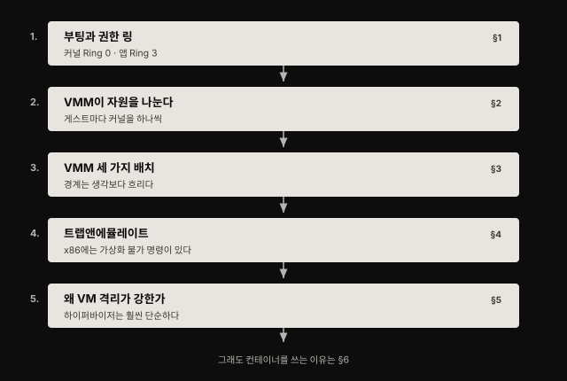
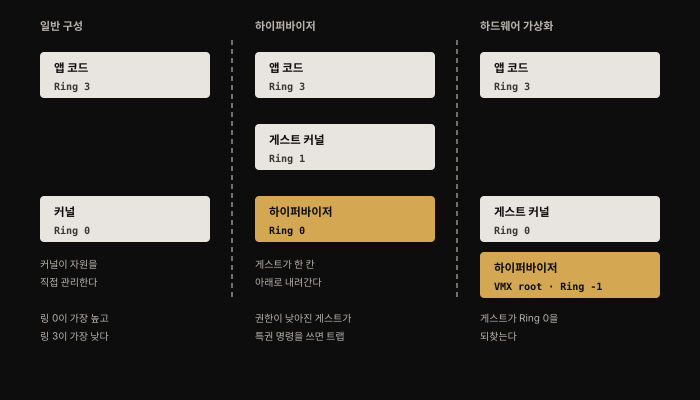
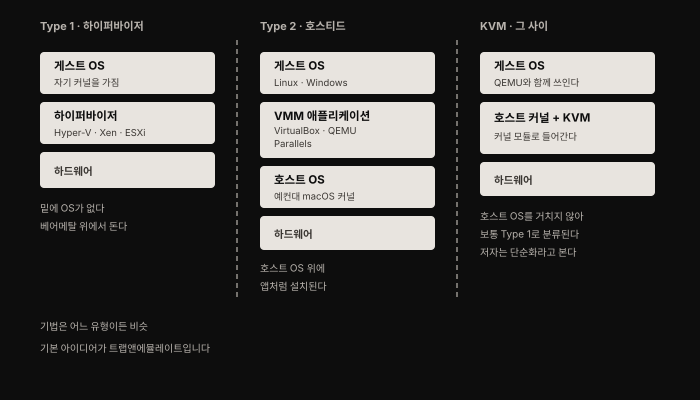
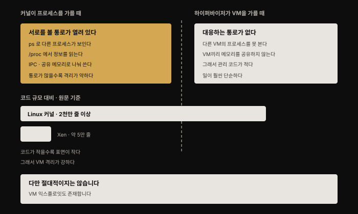

# 가상머신 — 왜 VM 격리가 더 강하다고 하는가
---

## 핵심 요약

> **근본적 차이는 하나입니다. VM은 커널을 포함한 운영체제 전체 복사본을 돌리고, 컨테이너는 호스트의 커널을 공유합니다.** 4장에서 컨테이너가 "제한된 시야를 가진 평범한 Linux 프로세스"임을 봤다면, 이 장은 그 옆에 놓고 볼 대조군을 세웁니다.
>
> 그런데 "VM 격리가 더 강하다"는 통념의 근거가 흥미롭습니다. 하이퍼바이저가 더 똑똑해서가 아니라 **하는 일이 훨씬 단순해서**입니다. 커널은 프로세스끼리 서로를 볼 통로(`ps`·`/proc`·공유 메모리)를 합법적으로 열어 두는데, VM 사이에는 그런 통로가 아예 없습니다. 통로가 없으니 코드가 적고, 코드가 적으니 결함 가능성도 작습니다.

## 학습 목표

이 내용을 읽고 나면:

1. VM과 컨테이너의 근본적 차이를 커널 관점에서 한 문장으로 말할 수 있습니다.
2. x86 권한 링 구조와 하이퍼바이저 도입 시 배치 변화를 설명할 수 있습니다.
3. Type 1·Type 2·KVM의 계층 배치를 구분하고 KVM이 왜 경계에 있는지 설명할 수 있습니다.
4. 트랩앤에뮬레이트의 원리와 x86의 "가상화 불가 명령" 문제를 설명할 수 있습니다.
5. VM 격리가 강하다고 평가되는 이유를 코드 복잡도로 근거를 들어 설명할 수 있습니다.

이 구분은 흑백이 아닙니다. 8장에서 보듯 **컨테이너 주위의 격리 경계를 강화해 VM에 가깝게 만드는 샌드박싱 도구**가 여럿 있습니다. 그 접근법들의 장단점을 이해하려면 VM과 "평범한" 컨테이너의 차이부터 확실히 잡는 것이 좋습니다.

## 1. 부팅과 권한 링

> 물리 서버가 켜질 때 무슨 일이 벌어지는지부터 봅니다. VMM이 끼어드는 자리를 이해하려면 이 그림이 먼저 필요합니다.

물리 서버에는 CPU와 메모리와 네트워크 인터페이스가 있습니다. 머신을 처음 켜면 **BIOS(Basic Input Output System)** 라 불리는 초기 프로그램이 돕니다. BIOS가 하는 일은 셋입니다.

- 가용 메모리가 얼마인지 훑습니다
- 네트워크 인터페이스를 식별합니다
- 디스플레이·키보드·스토리지 같은 다른 장치를 찾아냅니다

실무에서는 이 기능 상당 부분이 **UEFI(Unified Extensible Firmware Interface)** 로 대체됐습니다. 논의를 위해서는 현대적 BIOS 정도로 생각하면 됩니다.

하드웨어 열거가 끝나면 시스템은 **부트로더**를 돌립니다. 부트로더가 운영체제의 커널 코드를 적재해 실행합니다. 2장에서 본 대로 **커널 코드는 애플리케이션 코드보다 높은 권한 수준에서 동작합니다.** 이 권한 덕에 메모리와 네트워크 인터페이스 등을 직접 다룰 수 있습니다. 유저 공간에서 도는 애플리케이션은 그러지 못합니다.

x86 프로세서에서 권한 수준은 **링(ring)** 으로 조직됩니다. **Ring 0이 가장 높고 Ring 3이 가장 낮습니다.** VM이 없는 일반적 구성에서 대부분의 운영체제는 커널이 Ring 0에서, 유저 공간 코드가 Ring 3에서 돕니다.

커널 코드도 다른 코드와 마찬가지로 기계어 명령 형태로 CPU에서 도는데, 이 명령에는 **메모리 접근이나 CPU 스레드 시작 같은 특권 명령**이 포함될 수 있습니다. 커널 초기화의 목표는 루트 파일시스템을 마운트하고 네트워킹을 설정하고 시스템 데몬을 띄우는 것입니다.

초기화가 끝나면 커널은 유저 공간 프로그램을 실행하기 시작합니다. **커널은 유저 공간 프로그램에 필요한 모든 것을 관리할 책임**을 집니다. 프로그램이 도는 CPU 스레드를 시작·관리·스케줄링하고, 프로세스를 나타내는 자기 자료 구조로 그 스레드를 추적합니다.

여기서 이 장 전체와 이어지는 대목이 나옵니다. **커널 기능의 중요한 한 축이 메모리 관리**입니다. 커널은 각 프로세스에 메모리 블록을 할당하고 **프로세스가 서로의 메모리 블록에 접근하지 못하게 보장합니다.**

## 2. VMM이 자원을 나눈다

> 일반적 구성에서는 커널이 머신의 자원을 직접 관리합니다. 가상머신의 세계에서는 **VMM(Virtual Machine Monitor)** 이 첫 계층의 자원 관리를 맡습니다.

VMM은 자원을 쪼개 가상머신들에 할당합니다. **가상머신마다 자기 커널을 하나씩 갖습니다.**

관리하는 가상머신마다 VMM이 하는 일은 셋입니다.

- 메모리와 CPU 자원을 배정합니다
- 가상 네트워크 인터페이스와 다른 가상 장치를 설정합니다
- 이 자원에 접근할 수 있는 게스트 커널을 시작합니다

대비가 선명합니다. 일반 서버에서는 **BIOS가 커널에게** 머신에서 쓸 수 있는 자원의 상세를 알려 줍니다. 가상머신 상황에서는 **VMM이 그 자원을 나눠** 각 게스트 커널에게 그중 접근이 허락된 부분집합의 상세만 알려 줍니다. **게스트 OS 관점에서는 물리 메모리와 장치에 직접 접근한다고 여기지만, 실제로는 VMM이 제공하는 추상에 접근하고 있습니다.**

VMM은 **게스트 OS와 그 애플리케이션이 할당받은 자원의 경계를 넘지 못하게 보장할 책임**을 집니다. 게스트 운영체제에 호스트 머신의 메모리 범위가 배정됐는데 게스트가 어떻게든 그 범위 밖 메모리에 접근하려 하면 금지됩니다.

## 3. Type 1과 Type 2, 그리고 그 사이의 KVM

> VMM에는 크게 두 형태가 있고, 저자의 표현대로 "별로 상상력 없게" Type 1과 Type 2라 불립니다. 그리고 당연하게도 그 사이에 회색 지대가 있습니다.

### Type 1 — 하이퍼바이저

일반 시스템에서는 부트로더가 Linux나 Windows 같은 운영체제 커널을 실행합니다. **순수한 Type 1 환경에서는 그 대신 전용 커널 수준 VMM 프로그램이 돕니다.**

Type 1 VMM은 **하이퍼바이저**라고도 불리며 Hyper-V·Xen·ESX/ESXi가 그 예입니다. 하이퍼바이저는 **하드웨어(베어메탈) 위에서 직접 돌고 그 밑에 운영체제가 없습니다.**

"커널 수준"이란 하이퍼바이저가 **Ring 0에서 돈다**는 뜻입니다. 그리고 **게스트 OS 커널은 Ring 1에서 돌아 하이퍼바이저보다 권한이 낮습니다.** 이 권한 차이가 다음 절의 트랩앤에뮬레이트를 가능하게 하는 조건입니다.

### Type 2 — 호스티드

노트북이나 데스크톱에서 VirtualBox 같은 것으로 가상머신을 돌린다면 그것이 **"호스티드" 또는 Type 2 VM**입니다. 노트북이 macOS를 돌리고 있다면 macOS 커널이 돌고 있는 것이고, VirtualBox를 **별도 애플리케이션으로 설치**하면 그것이 호스트 운영체제와 공존하는 게스트 VM을 관리합니다.

잠시 생각해 보면 의미가 분명해집니다. **macOS 안에서 Linux를 돌린다는 것은 정의상 Linux 커널이 있어야 한다는 뜻입니다.** 그리고 그것은 호스트의 macOS 커널과는 다른 커널이어야 합니다.

VMM 애플리케이션에는 사용자가 상호작용하는 유저 공간 구성 요소가 있습니다. 여기에 더해 가상화를 제공하기 위한 **특권 구성 요소도 함께 설치**합니다. VirtualBox 외에 Parallels와 QEMU도 Type 2의 예입니다.

### KVM — 경계에 있는 것

Type 1에서는 하이퍼바이저가 베어메탈 위에서 돌고, Type 2에서는 VMM이 호스트 OS의 유저 공간에서 돕니다. 그렇다면 **가상머신 관리자를 호스트 OS의 커널 안에서 돌리면** 어떻게 될까요?

**KVM(Kernel-based Virtual Machines)** 이라는 Linux 커널 모듈이 정확히 그렇게 합니다. 일반적으로 KVM은 **게스트 OS가 호스트 OS를 거치지 않아도 되므로 Type 1 하이퍼바이저로 간주**되지만, 저자는 이 분류가 **지나치게 단순하다**고 봅니다.

KVM은 앞서 Type 2로 분류한 **QEMU(Quick Emulation)와 함께 쓰이는 경우가 많습니다.** QEMU는 게스트 OS의 시스템 콜을 호스트 OS의 시스템 콜로 **동적으로 번역**합니다. QEMU가 **KVM이 제공하는 하드웨어 가속을 이용할 수 있다**는 점도 언급할 만합니다.

Type 1이든 Type 2든 그 사이든, VMM은 가상화를 이루기 위해 **비슷한 기법**을 씁니다. 기본 아이디어가 트랩앤에뮬레이트입니다.

## 4. 트랩앤에뮬레이트와 x86의 난점

> 어떤 CPU 명령은 특권 명령이라 Ring 0에서만 실행할 수 있습니다. 더 높은 링에서 시도하면 **트랩**이 발생합니다.

트랩은 애플리케이션 소프트웨어에서 오류 처리기를 부르는 예외와 비슷하다고 생각하면 됩니다. 트랩이 나면 CPU가 **Ring 0 코드에 있는 처리기**를 호출합니다.

**VMM이 Ring 0에서 돌고 게스트 OS 커널 코드가 더 낮은 권한에서 돌면**, 게스트가 실행한 특권 명령이 VMM 안의 처리기를 불러 그 명령을 에뮬레이트하게 할 수 있습니다. 이 방식으로 VMM은 게스트 OS들이 특권 명령을 통해 서로 간섭하지 못하도록 보장합니다.

**그런데 특권 명령은 이야기의 일부일 뿐입니다.** 머신의 자원에 영향을 줄 수 있는 CPU 명령 집합을 **민감(sensitive)** 명령이라 부릅니다. VMM은 게스트 OS를 대신해 이 명령들을 처리해야 하는데, **머신 자원의 진짜 모습을 아는 것은 VMM뿐**이기 때문입니다. 또 다른 부류의 민감 명령도 있습니다. **Ring 0에서 실행될 때와 더 낮은 권한의 링에서 실행될 때 다르게 동작하는** 명령들입니다. 게스트 OS 코드는 Ring 0 동작을 가정하고 작성됐으므로 VMM이 뭔가 해 줘야 합니다.

문제의 핵심은 이것입니다. **모든 민감 명령이 특권 명령이기도 하다면** VMM 프로그래머의 삶이 비교적 편했을 것입니다. 민감 명령마다 트랩 처리기를 쓰면 되니까요. **그러나 x86의 민감 명령이 전부 특권 명령인 것은 아닙니다.** 민감하지만 특권이 아닌 명령을 **"가상화 불가(non-virtualizable)"** 명령이라 부릅니다.

### 가상화 불가 명령을 다루는 세 기법

- **바이너리 변환(binary translation)**: 게스트 OS의 비특권 민감 명령을 VMM이 **실시간으로 찾아내 다시 씁니다.** 복잡한 작업이며, 최신 x86 프로세서는 이를 단순화하기 위해 하드웨어 보조 가상화를 지원합니다.
- **반가상화(paravirtualization)**: 게스트 OS를 즉석에서 수정하는 대신, **게스트 OS 자체를 가상화 불가 명령을 피하도록 다시 씁니다.** 사실상 하이퍼바이저에 시스템 콜을 하는 형태가 됩니다. Xen 하이퍼바이저가 쓰는 기법입니다.
- **하드웨어 가상화**: Intel의 VT-x 같은 것으로, 하이퍼바이저가 **VMX root mode라는 새로운 추가 특권 수준**에서 돌게 합니다. 사실상 **Ring -1**입니다. 덕분에 **VM 게스트 OS 커널이 Ring 0에서 돌 수 있게** 됩니다. 호스트 OS였다면 그랬을 자리를 되찾는 셈입니다.

## 5. 왜 VM 격리가 강하다고 평가되는가

> 애플리케이션이 서로 안전하게 격리되도록 하는 것이 일차적 보안 관심사입니다. 내 애플리케이션이 당신 애플리케이션의 메모리를 읽을 수 있다면 당신의 데이터에 접근할 수 있는 것입니다.

**물리적 격리가 가능한 가장 강한 격리 형태**입니다. 애플리케이션이 완전히 별개의 물리 머신에서 돌면 내 코드가 당신 애플리케이션의 메모리에 접근할 방법이 없습니다.

커널은 유저 공간 프로세스를 관리하며 각 프로세스에 메모리를 배정할 책임을 집니다. 한 애플리케이션이 다른 애플리케이션에 배정된 메모리에 접근하지 못하게 하는 것도 커널의 몫입니다. **커널의 메모리 관리 방식에 버그가 있으면 공격자가 그 버그를 악용해 닿아서는 안 될 메모리에 접근할 수 있습니다.** 커널은 극도로 단련됐지만 동시에 극도로 크고 복잡하며 여전히 진화 중입니다. 저자는 집필 시점에 커널 격리의 심각한 결함이 알려진 바는 없지만, **언젠가 누군가 문제를 찾아내지 않으리라는 쪽에 걸지는 말라**고 조언합니다.

이런 결함은 **하드웨어의 정교함이 커지면서** 생기기도 합니다. 최근 몇 년간 CPU 제조사들은 **투기적 처리(speculative processing)** 를 개발했습니다. 프로세서가 현재 실행 중인 명령보다 앞서 달려가, 그 분기를 실제로 실행할 필요가 생기기 전에 결과가 무엇일지 미리 계산해 두는 기법입니다. 성능은 크게 좋아졌지만 **유명한 Spectre와 Meltdown 익스플로잇의 문을 열었습니다.**

### 하이퍼바이저의 일이 더 단순하다

여기서 이 장의 핵심 논지가 나옵니다. 하이퍼바이저도 메모리와 장치 접근을 관리하고 가상머신을 분리할 책임이 있는데, **왜 커널이 프로세스에 주는 격리보다 하이퍼바이저가 VM에 주는 격리가 더 강하다고 여길까요?** 하이퍼바이저의 결함이 VM 사이 격리에 심각한 문제를 일으킬 수 있다는 것은 분명히 사실입니다.

**차이는 하이퍼바이저의 일이 훨씬, 훨씬 단순하다는 데 있습니다.**

커널에서는 유저 공간 프로세스가 서로를 **어느 정도 볼 수 있도록 허용**됩니다.

- `ps`를 돌려 같은 머신의 실행 중인 프로세스를 볼 수 있습니다
- (적절한 권한이 있으면) `/proc` 디렉토리를 들여다봐 그 프로세스들의 정보에 접근할 수 있습니다
- IPC와 공유 메모리를 통해 **의도적으로 프로세스 간 메모리를 공유**할 수 있습니다

**한 프로세스가 다른 프로세스의 정보를 합법적으로 알 수 있게 하는 이 모든 메커니즘이 격리를 약하게 만듭니다.** 예상치 못한 또는 의도치 않은 상황에서 그 접근을 허용하는 결함이 생길 가능성이 있기 때문입니다.

**가상머신을 돌릴 때는 이에 대응하는 것이 없습니다.** 한 머신에서 다른 머신의 프로세스를 볼 수 없습니다. 하이퍼바이저는 머신끼리 메모리를 공유하는 상황을 다룰 필요가 없으므로 **메모리 관리에 필요한 코드가 더 적습니다.** 가상머신은 애초에 그런 일을 하지 않기 때문입니다. 그 결과 **하이퍼바이저는 완전한 커널보다 훨씬 작고 단순합니다.**

저자가 드는 수치가 이 논지를 못 박습니다. **Linux 커널에는 2천만 줄이 훨씬 넘는 코드가 있고, 대조적으로 Xen 하이퍼바이저는 약 5만 줄입니다.**

**코드가 적고 복잡도가 낮은 곳에는 공격 표면이 작고 악용 가능한 결함의 가능성도 낮습니다.** 이런 이유로 가상머신은 강한 격리 경계를 갖는 것으로 여겨집니다.

> **다만 절대적이지는 않습니다.** VM 익스플로잇이 없는 것은 아닙니다. Darshan Tank·Akshai Aggarwal·Nirbhay Chaubey가 공격 유형의 분류 체계를 기술했고, **NIST가 가상화 환경 강화를 위한 보안 지침**을 발행했습니다.

## 6. 그런데도 컨테이너를 쓰는 이유

> VM의 격리 이점에 설득된 나머지 "그럼 사람들은 왜 컨테이너를 쓰지?"라고 궁금해질 수 있습니다. VM에는 컨테이너 대비 단점이 있습니다.

- **기동 시간이 컨테이너보다 몇 자릿수 더 깁니다.** 컨테이너는 결국 새 Linux 프로세스를 시작하는 것일 뿐, VM처럼 전체 기동·초기화 과정을 거치지 않습니다. VM의 느린 기동은 **오토스케일링에 굼뜨다**는 뜻이고, 하루에도 여러 번 새 코드를 배포하려는 조직에게 빠른 기동은 중요합니다. (다만 **Amazon의 Firecracker는 집필 시점 기준 100ms 수준의 기동 시간**을 제공하는 VM을 내놓았습니다.)
- **컨테이너는 개발자에게 "한 번 빌드해 어디서나 실행"을 빠르고 효율적으로 제공합니다.** VM용 머신 이미지 전체를 빌드해 노트북에서 돌리는 것도 가능합니다. 다만 몹시 느려서, 이 기법은 컨테이너만큼 개발자 커뮤니티에서 확산되지 못했습니다.
- **자원을 미리 지정하고 그만큼 비용을 냅니다.** 오늘날 클라우드에서 VM을 빌리면 CPU와 메모리를 명시해야 하고, 안에서 도는 애플리케이션 코드가 실제로 얼마나 쓰든 그 자원 값을 지불합니다.
- **VM마다 커널 하나를 통째로 돌리는 오버헤드**가 있습니다. 커널을 공유함으로써 컨테이너는 자원 사용과 성능 양쪽에서 크게 효율적일 수 있습니다.

VM과 컨테이너 중에서 고를 때는 **성능·가격·편의성·위험, 그리고 서로 다른 애플리케이션 워크로드 사이에 요구되는 보안 경계의 강도** 같은 요소 사이에서 여러 트레이드오프를 따져야 합니다.

### 컨테이너 격리와 VM 격리의 최종 대비

4장에서 본 대로 컨테이너는 **제한된 시야를 가진 평범한 Linux 프로세스**입니다. namespace·cgroup·루트 변경이라는 메커니즘을 통해 커널이 그들을 서로 격리합니다. 이 메커니즘들은 **프로세스 사이에 격리를 만들기 위해 특별히 만들어진 것**입니다.

**그러나 컨테이너가 커널을 공유한다는 단순한 사실이, 기본 격리를 VM보다 약하게 만듭니다.**

다만 절망할 일은 아닙니다. **추가 보안 기능과 샌드박싱으로 이 격리를 강화할 수 있고**(8장), 컨테이너가 마이크로서비스를 캡슐화하는 경향을 활용하는 효과적인 보안 도구도 있습니다(13장).

이 장의 결론은 이렇습니다. VM 사이 격리가 컨테이너 격리보다 강하다고 여겨지는 이유를 알게 됐고, **그래서 컨테이너가 일반적으로 하드 멀티테넌시 환경에 적합할 만큼 안전하다고 여겨지지 않는다**는 것도 알게 됐습니다. 1장 4절에서 "신뢰하지 않는 상대와 같은 머신에서 컨테이너를 쓰고 싶지는 않을 것"이라고 한 서술의 근거가 여기서 완성됩니다.

## 심화 학습

> 여기부터는 책 밖의 보강입니다. 원문의 수치 두 가지를 현재 기준으로 확인했습니다.

**Linux 커널의 코드 규모는 원문 집필 이후 두 배가 됐습니다.** 원문은 "2천만 줄이 훨씬 넘는다"고 적었는데, **2025년 1월 커널 6.14-rc1에서 4천만 줄을 넘어섰습니다.**[^kernel] 정확히는 40,063,856줄이며, 2015년 이후 10년 만에 두 배가 된 셈입니다. 두 달마다 평균 40만 줄씩 늘고 있습니다.

여기서 주의할 점이 있습니다. **이 수치 변화는 저자의 논지를 약화시키지 않고 오히려 강화합니다.** 커널이 더 커지고 복잡해졌다는 뜻이므로, "코드가 적고 단순할수록 공격 표면이 작다"는 논리에 따르면 커널 격리와 하이퍼바이저 격리의 복잡도 격차는 더 벌어졌습니다. 다만 **"2천만"이라는 숫자를 그대로 인용하면 현재 기준으로는 틀립니다.**

**Firecracker의 기동 시간은 공식 규격으로 확인됩니다.** 원문은 "집필 시점 기준 100ms 수준"이라고 적었고, Firecracker 공식 SPECIFICATION 문서는 **InstanceStart API 호출을 받은 시점부터 게스트 유저 공간의 `/sbin/init` 프로세스가 시작되기까지 125ms 이하**라고 규정합니다. 같은 문서는 vCPU 1개·RAM 128MiB 구성에서 **VMM 스레드의 메모리 오버헤드가 5MiB 이하**라고도 밝힙니다. 두 수치 모두 통합 테스트로 강제됩니다. 원문의 "100ms 수준"은 현재 규격과 부합하는 서술입니다.

## 결정 치트시트

> 격리 수단을 고를 때 쓰는 판단 기준입니다.

| 상황 | 선택 | 이유 |
|------|------|------|
| 신뢰하지 않는 당사자의 워크로드를 함께 돌린다 | VM 이상으로 분리 | 컨테이너는 커널을 공유해 하드 멀티테넌시에 부적합합니다 |
| 빠른 오토스케일링이 필요하다 | 컨테이너 | VM은 기동이 몇 자릿수 느립니다 |
| 하루에 여러 번 배포한다 | 컨테이너 | 빠른 기동과 "한 번 빌드해 어디서나"가 유리합니다 |
| 자원 효율이 중요하다 | 컨테이너 | VM마다 커널 하나를 통째로 돌리는 오버헤드가 없습니다 |
| VM 수준 격리와 빠른 기동이 둘 다 필요하다 | Firecracker 계열 microVM | 125ms 이하 기동에 VM 경계를 함께 얻습니다 |
| 컨테이너를 쓰되 격리를 강화하고 싶다 | 8장의 샌드박싱 도구 | 컨테이너를 VM에 가깝게 만드는 접근입니다 |
| VM 환경 자체를 강화해야 한다 | NIST 가상화 보안 지침 | VM 익스플로잇도 존재하므로 강화 지침이 필요합니다 |

## 면접에서 받을 만한 질문

1. 컨테이너와 가상머신의 근본적 차이를 한 문장으로 말해 보세요.
2. 하이퍼바이저를 쓰면 권한 링 배치가 어떻게 바뀌나요? 하드웨어 가상화에서는 어떻게 되나요?
3. Type 1과 Type 2를 구분하고 KVM이 어디에 속하는지 설명해 보세요.
4. "가상화 불가 명령"이 무엇이고 왜 문제가 되나요?
5. VM 격리가 컨테이너 격리보다 강하다고 하는 근거는 무엇인가요?

## 정답 (자답 후 펼치기)

1. VM은 커널을 포함한 운영체제 전체 복사본을 돌리고, 컨테이너는 호스트 머신의 커널을 공유합니다. 그래서 컨테이너는 결국 호스트에서 도는 평범한 Linux 프로세스이고 VM은 자기 커널을 가진 별도 머신처럼 동작합니다.
2. 일반 구성에서는 커널이 Ring 0, 유저 공간이 Ring 3입니다. 하이퍼바이저를 쓰면 하이퍼바이저가 Ring 0을 차지하고 게스트 OS 커널이 Ring 1로 내려가 권한이 낮아집니다. Intel VT-x 같은 하드웨어 가상화에서는 하이퍼바이저가 VMX root mode(사실상 Ring -1)에서 돌고 게스트 커널이 Ring 0을 되찾습니다.
3. Type 1은 하이퍼바이저가 베어메탈 위에서 직접 돌고 밑에 OS가 없습니다(Hyper-V·Xen·ESXi). Type 2는 호스트 OS 위 유저 공간에 VMM이 애플리케이션처럼 설치됩니다(VirtualBox·Parallels·QEMU). KVM은 호스트 커널 안의 모듈이라 게스트가 호스트 OS를 거치지 않으므로 보통 Type 1로 분류되지만, 저자는 이 분류가 지나치게 단순하다고 봅니다.
4. 머신 자원에 영향을 주는 명령을 민감 명령이라 하고, 그중 특권 명령이 아닌 것을 가상화 불가 명령이라 합니다. 특권 명령은 낮은 링에서 실행하면 트랩이 나서 VMM이 처리기로 에뮬레이트할 수 있는데, 민감하지만 특권이 아닌 명령은 트랩이 나지 않아 VMM이 가로챌 수 없습니다. 그래서 바이너리 변환·반가상화·하드웨어 가상화 같은 다른 기법이 필요합니다.
5. 하이퍼바이저가 더 뛰어나서가 아니라 하는 일이 훨씬 단순하기 때문입니다. 커널은 프로세스끼리 서로를 볼 통로를 합법적으로 열어 둡니다. `ps`로 다른 프로세스를 보고, `/proc`에서 정보를 읽고, IPC와 공유 메모리로 메모리를 나눠 씁니다. 이런 통로가 많을수록 의도치 않은 상황에서 접근이 열릴 결함 가능성이 커집니다. VM 사이에는 그런 통로가 없어 관리 코드가 훨씬 적습니다. 원문 기준 Linux 커널이 2천만 줄 이상인 데 비해 Xen은 약 5만 줄입니다. 코드가 적을수록 공격 표면과 결함 가능성이 작습니다.

## 핵심 개념 체크리스트

- [ ] BIOS·UEFI·부트로더·커널 초기화의 순서를 말할 수 있는가?
- [ ] Ring 0과 Ring 3이 각각 무엇인지 아는가?
- [ ] VMM이 BIOS의 어떤 역할을 대신하는지 설명할 수 있는가?
- [ ] Type 1과 Type 2의 계층 차이를 그릴 수 있는가?
- [ ] KVM이 왜 분류하기 애매한지 설명할 수 있는가?
- [ ] 트랩이 무엇이고 어떻게 에뮬레이션으로 이어지는지 아는가?
- [ ] 민감 명령과 특권 명령의 관계를 설명할 수 있는가?
- [ ] 가상화 불가 명령을 다루는 세 기법을 열거할 수 있는가?
- [ ] 커널이 허용하는 프로세스 간 통로 세 가지를 말할 수 있는가?
- [ ] VM의 단점 네 가지를 들 수 있는가?
- [ ] 왜 컨테이너가 하드 멀티테넌시에 부적합하다고 하는지 아는가?

## 참고 자료

- 원본: 《Container Security》(Liz Rice, O'Reilly, 2020, ISBN 978-1492056706) Chapter 5
- [Firecracker SPECIFICATION](https://github.com/firecracker-microvm/firecracker/blob/main/SPECIFICATION.md) — 기동 125ms 이하·메모리 오버헤드 5MiB 이하 규격
- [Linux 커널 4천만 줄 돌파 — Tom's Hardware](https://www.tomshardware.com/software/linux/linux-kernel-source-expands-beyond-40-million-lines-it-has-doubled-in-size-in-a-decade) — 원문의 2천만 줄 수치가 현재 어떻게 달라졌는지
- [나머지 namespace와 호스트에서 본 컨테이너](./04-02.%EB%82%98%EB%A8%B8%EC%A7%80%20namespace%EC%99%80%20%ED%98%B8%EC%8A%A4%ED%8A%B8%EC%97%90%EC%84%9C%20%EB%B3%B8%20%EC%BB%A8%ED%85%8C%EC%9D%B4%EB%84%88.md) — 컨테이너가 호스트에서 보인다는 대비의 출발점
- [컨테이너 보안 위협 — 위협 모델부터 보안 원칙까지](./01-01.%EC%BB%A8%ED%85%8C%EC%9D%B4%EB%84%88%20%EB%B3%B4%EC%95%88%20%EC%9C%84%ED%98%91%20%E2%80%94%20%EC%9C%84%ED%98%91%20%EB%AA%A8%EB%8D%B8%EB%B6%80%ED%84%B0%20%EB%B3%B4%EC%95%88%20%EC%9B%90%EC%B9%99%EA%B9%8C%EC%A7%80.md) — 1장 4절 멀티테넌시 격리 강도 스펙트럼
- [Container Security 정독 인덱스](./README.md) — 이 책의 장별 목표와 진행 상태

[^kernel]: Tom's Hardware — Linux 커널 소스가 4천만 줄을 넘어섰으며 10년 만에 두 배가 됐습니다(2025년 1월, 커널 6.14-rc1 기준 40,063,856줄).
<https://www.tomshardware.com/software/linux/linux-kernel-source-expands-beyond-40-million-lines-it-has-doubled-in-size-in-a-decade>
