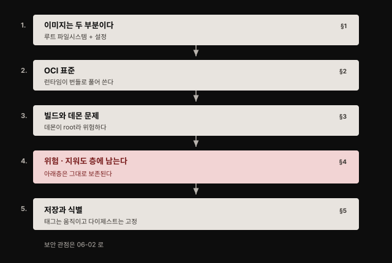
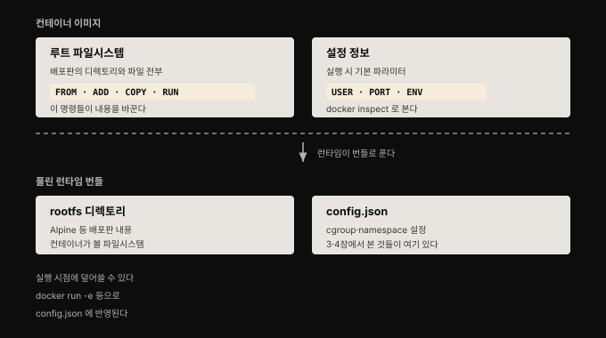
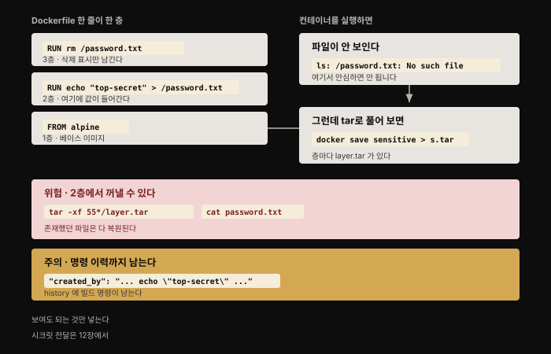
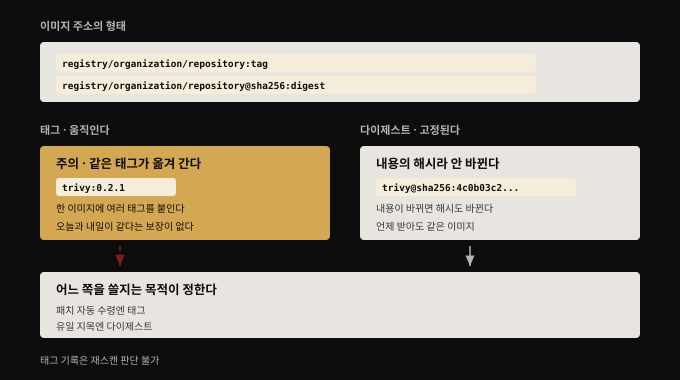

# 컨테이너 이미지 해부 — 두 부분과 층과 식별자

## 핵심 요약

> 컨테이너 이미지는 두 부분입니다. **루트 파일시스템과 설정 정보.** 4장에서 손으로 만든 컨테이너가 Alpine 루트 파일시스템을 썼던 것을 떠올리면, 이미지는 그 파일시스템에 "어떻게 실행할지"를 얹은 묶음입니다.
>
> 보안 관점에서 이 편의 핵심은 **층(layer)의 성질**입니다. Dockerfile의 각 줄이 층을 만들고 **층은 각각 따로 저장됩니다.** 그래서 한 층에서 비밀 파일을 만들고 다음 층에서 지워도, 지운 것은 위층의 표시일 뿐 **아래층에는 그대로 남아 누구나 꺼낼 수 있습니다.** 이미지에 넣은 것은 지웠다고 사라지지 않습니다.


## 학습 목표

이 내용을 읽고 나면:

1. 이미지의 두 부분을 구분하고 어떤 Dockerfile 명령이 각각에 영향을 주는지 말할 수 있습니다.
2. OCI 명세가 무엇을 표준화했고 런타임이 이미지를 어떻게 푸는지 설명할 수 있습니다.
3. `docker build`가 보안상 주의를 요하는 이유를 데몬 구조로 설명할 수 있습니다.
4. 층에서 지운 파일이 왜 남는지 설명하고 그것을 꺼내는 과정을 재현할 수 있습니다.
5. 태그와 다이제스트의 차이를 알고 상황에 맞게 고를 수 있습니다.




## 1. 이미지는 두 부분이다

> 컨테이너 이미지에는 두 부분이 있습니다. 루트 파일시스템과 약간의 설정 정보입니다.



4장의 예제를 따라 했다면 Alpine 루트 파일시스템 복사본을 받아 컨테이너 안 루트의 내용으로 썼을 것입니다. 일반적으로 **컨테이너를 시작하면 컨테이너 이미지로부터 인스턴스화하며, 그 이미지가 루트 파일시스템을 담고 있습니다.**

`docker run -it alpine sh`를 돌려 손으로 만든 컨테이너와 비교해 보면 같은 디렉토리·파일 구조가 보입니다. Alpine 버전이 같다면 완전히 일치합니다.

Dockerfile의 명령은 두 부분에 나뉘어 영향을 줍니다.

- `FROM`·`ADD`·`COPY`·`RUN`: 이미지에 포함되는 **루트 파일시스템의 내용을 바꿉니다**
- `USER`·`PORT`·`ENV`: 루트 파일시스템과 나란히 저장되는 **설정 정보에 영향을 줍니다**

설정 정보는 `docker inspect`로 볼 수 있습니다. 이 설정은 이미지를 실행할 때 기본으로 설정돼야 할 런타임 파라미터를 Docker에게 알려 줍니다. 예를 들어 Dockerfile에서 `ENV` 명령으로 환경변수를 지정하면 그 환경변수가 정의된 채로 실행됩니다.

### 실행 시점에 덮어쓰기

Docker에서는 설정 정보를 **실행 시점에 명령줄 파라미터로 덮어쓸 수 있습니다.** 환경변수를 바꾸거나 새로 설정하려면 `docker run -e`를 씁니다. Kubernetes에서는 Pod 정의의 컨테이너에 `env` 정의로 같은 일을 합니다.

```yaml
spec:
  containers:
  - name: demo
    image: demo-reg.io/some-org/demo-image:1.0
    env:
    - name: DEMO_ENV
      value: "This will replace the default value"
```

이미지가 Dockerfile의 `ENV DEMO_ENV="The original value"`로 빌드됐더라도 이 YAML이 값을 덮어씁니다. **Kubernetes 배포의 컨테이너 런타임이 `runc` 같은 OCI 호환 도구라면, 이 YAML 정의의 값이 OCI 호환 `config.json` 파일에 들어갑니다.**


## 2. OCI 표준 — 이미지와 런타임의 규격

> **OCI(Open Container Initiative)** 는 컨테이너 이미지와 런타임에 대한 표준을 정의하기 위해 만들어졌습니다.

OCI는 Docker에서 이뤄진 많은 작업을 이어받았습니다. 그래서 Docker에서 벌어지는 일과 명세에 정의된 것 사이에 공통점이 상당히 많습니다. **특히 OCI의 목표 하나가 Docker 사용자가 기대하게 된 것과 같은 사용자 경험을 표준이 지원하는 것**이었습니다. 기본 설정 집합으로 이미지를 실행할 수 있는 능력 같은 것입니다.

OCI 명세는 **이미지 포맷**을 다루는데, 컨테이너 이미지가 어떻게 빌드되고 배포되는지를 논합니다.

여기서 중요한 구분이 하나 나옵니다. **`runc` 같은 OCI 호환 런타임은 이미지 포맷 그대로는 작업하지 못합니다.** 먼저 **런타임 파일시스템 번들**로 풀어야 합니다.

```bash
skopeo copy docker://alpine:latest oci:alpine:latest
sudo umoci unpack --image alpine:latest alpine-bundle
```

`skopeo`는 OCI 이미지를 다루고 검사하는 데 유용하며 Docker 이미지에서 OCI 포맷 이미지를 생성할 수 있습니다. `umoci`로 푼 번들에는 **Alpine 배포판 내용이 담긴 `rootfs` 디렉토리와 런타임 설정을 정의하는 `config.json` 파일**이 있습니다. 런타임은 이 번들을 써서 컨테이너를 인스턴스화합니다.

Docker를 쓸 때는 `cat`이나 편집기로 볼 수 있는 파일 형태로 설정 정보에 직접 접근하지는 못하지만, `docker image inspect`로 그것이 있다는 것을 확인할 수 있습니다.

`config.json`을 들여다볼 가치가 있는데, **3장과 4장에서 본 것들이 여기 그대로 있기 때문**입니다. 설정 정보에는 `runc`가 컨테이너를 만들기 위해 해야 할 모든 것이 들어 있습니다. **cgroup으로 제약할 자원 목록과 사용할 namespace 목록**이 포함됩니다.


## 3. 이미지 빌드와 데몬 문제

> 대부분의 사람은 `docker build`로 이미지를 만듭니다. 그런데 이 명령은 보안 관점에서 주의 깊게 볼 필요가 있습니다.

`docker` 명령을 실행하면 **명령줄 도구 자체는 하는 일이 거의 없습니다.** 명령을 API 요청으로 바꿔 **Docker 소켓**이라 불리는 소켓을 통해 **Docker 데몬**에 보냅니다. **그 소켓에 접근할 수 있는 프로세스는 무엇이든 데몬에 API 요청을 보낼 수 있습니다.**

Docker 데몬은 컨테이너와 컨테이너 이미지를 실제로 실행하고 관리하는 장수 프로세스입니다. 4장에서 본 대로 **컨테이너를 만들려면 데몬이 namespace를 만들 수 있어야 하므로 root로 돌아야 합니다.**

여기서 문제가 나옵니다. 이미지를 빌드해 레지스트리에 저장하는 전용 머신을 하나 두고 싶다고 해 봅시다. Docker 방식이라면 그 머신은 데몬을 돌려야 하는데, **데몬은 빌드와 레지스트리 상호작용을 훨씬 넘어서는 많은 능력을 갖고 있습니다.** 추가 보안 도구 없이는 **그 머신에서 `docker build`를 실행할 수 있는 사용자라면 `docker run`으로 원하는 아무 명령이나 실행할 수도 있습니다.**

게다가 추적도 어렵습니다. 누군가 이 특권으로 악의적 행동을 하면 **감사 로그에 사용자 ID가 아니라 데몬 프로세스의 ID가 기록됩니다.**

> **원문 시점 주의**: 저자는 Docker가 이 문제를 해결할 rootless 모드를 작업 중이지만 집필 시점에는 "실험적"으로 여겨진다고 적었습니다.

### 데몬 없는 빌드 도구들

이런 보안 위험을 피하려고 **Docker 데몬에 의존하지 않고 이미지를 빌드하는 대안 도구**가 여럿 나왔습니다.

- **BuildKit**(Moby 프로젝트): rootless 모드로 돌 수 있으며, 앞서 언급한 Docker 실험적 rootless 빌드 모드의 기반입니다
- **podman·buildah**(Red Hat): 비특권 빌드
- **Bazel**(Google): 컨테이너 이미지뿐 아니라 다른 여러 아티팩트를 빌드하며, Docker를 필요로 하지 않는 데다 **결정론적으로 이미지를 생성**해 같은 결과를 재현할 수 있다는 점을 내세웁니다
- **Kaniko**(Google): Docker 데몬 접근 없이 **Kubernetes 클러스터 안에서** 빌드를 실행합니다
- 그 밖에 Jess Frazelle의 도구를 비롯한 "데몬리스" 도구들이 있습니다

저자는 집필 시점 기준으로 **이 중 명확한 승자가 있다고 보기 어렵다**고 적었습니다.


## 4. 층 — 지워도 남는다

> 어떤 도구를 쓰든 대다수의 이미지 빌드는 Dockerfile로 정의됩니다. Dockerfile은 일련의 명령을 주고, **각 명령이 파일시스템 층이나 이미지 설정의 변경을 낳습니다.**



**이미지에 접근할 수 있는 사람은 그 이미지에 포함된 어떤 파일에든 접근할 수 있습니다.** 보안 관점에서 비밀번호나 토큰 같은 민감 정보를 이미지에 넣지 않아야 합니다.

**모든 층이 따로 저장된다는 사실 때문에, 뒤이은 층이 그것을 제거하더라도 민감 데이터를 저장하지 않도록 조심해야 합니다.** 저자가 "이렇게 하지 말라"고 보여 주는 Dockerfile은 이렇습니다.

```dockerfile
FROM alpine
RUN echo "top-secret" > /password.txt
RUN rm /password.txt
```

한 층이 파일을 만들고 다음 층이 그것을 제거합니다. 이 이미지를 빌드해 실행하면 `password.txt`의 흔적을 찾을 수 없습니다.

```bash
docker run --rm -it sensitive ls /password.txt
```

`ls: /password.txt: No such file or directory`가 나옵니다. **그러나 여기에 속으면 안 됩니다. 민감 데이터는 여전히 이미지에 포함돼 있습니다.**

### 직접 꺼내 보기

`docker save`로 이미지를 tar 파일로 내보내면 증명됩니다.

```bash
docker save sensitive > sensitive.tar
tar -xf ../sensitive.tar
```

풀린 내용의 구조는 이렇습니다.

- `manifest.json`: 이미지를 기술하는 최상위 파일입니다. 어느 파일이 설정을 나타내는지, 이 이미지의 태그가 무엇인지, 각 층이 무엇인지 알려 줍니다
- `0c24...json`: 이미지의 설정입니다
- 각 디렉토리: 이미지를 이루는 층 하나씩을 나타냅니다

**설정에는 이 컨테이너를 구성하려고 실행한 명령의 이력이 들어 있습니다.** 이 경우 `echo` 명령을 실행한 단계에서 민감 데이터가 드러납니다.

```bash
cat 0c247*.json | jq '.history'
```

`"created_by": "/bin/sh -c echo \"top-secret\" > /password.txt"`가 그대로 보입니다.

각 층 디렉토리 안에는 **그 층에서의 파일시스템 내용을 담은 또 다른 tar 파일**이 있습니다. 파일을 만든 층에서 `password.txt`를 드러내기는 쉽습니다.

```bash
tar -xf 55*/layer.tar
cat password.txt
```

저자의 결론이 이 절의 핵심입니다. **뒤이은 층이 파일을 삭제하더라도, 어느 층에든 한 번이라도 존재했던 파일은 이미지를 풀어서 쉽게 얻을 수 있습니다. 누구에게든 보여도 괜찮은 것이 아니라면 어느 층에도 넣지 마십시오.**

이 정보를 어떻게 다뤄야 하는지는 12장에서 다룹니다.


## 5. 저장과 식별

> 이미지는 **컨테이너 레지스트리**에 저장됩니다. 레지스트리에 저장하는 것을 push, 가져오는 것을 pull이라 부릅니다.



Docker를 쓴다면 Docker Hub 레지스트리를 써 봤을 것이고, 클라우드 제공자의 서비스로 작업한다면 Amazon Elastic Container Registry나 Google Container Registry에 익숙할 것입니다.

> **원문 시점 주의**: 저자는 집필 시점에 OCI가 **배포 명세(distribution specification)** 를 작업 중이며 진행 중인 작업이라고 적었습니다. 이 명세는 컨테이너가 저장되는 레지스트리와 상호작용하는 인터페이스를 정의하며, 기존 레지스트리들의 선행 작업에 기대고 있습니다.

저장 구조는 이렇습니다. **각 층은 내용의 해시로 식별되는 "blob" 데이터로 따로 저장됩니다.** 저장 공간을 아끼기 위해 **주어진 blob은 한 번만 저장되면 되고**, 여러 이미지가 그것을 참조할 수 있습니다. 레지스트리는 **이미지를 이루는 층 blob의 집합을 식별하는 이미지 매니페스트**도 저장합니다.

**이미지 매니페스트의 해시를 취하면 이미지 전체의 유일한 식별자가 되며, 이것을 이미지 다이제스트라 부릅니다.** 이미지를 다시 빌드했을 때 무엇이든 바뀌면 이 해시도 바뀝니다.

### 이미지를 가리키는 두 방식

이미지 참조는 레지스트리 URL로 시작합니다. (레지스트리 주소가 생략되면 로컬 저장 이미지이거나 Docker Hub의 이미지를 뜻합니다.) 다음은 이 이미지를 소유한 사용자나 조직 계정의 이름, 그다음이 이미지 이름, 그리고 마지막에 **내용을 식별하는 다이제스트**나 **사람이 읽을 수 있는 태그**가 옵니다.

```markdown
<Registry URL>/<Organization or user name>/<repository>@sha256:<digest>
<Registry URL>/<Organization or user name>/<repository>:<tag>
```

레지스트리 URL이 생략되면 Docker Hub 주소인 `docker.io`가 기본값입니다.

**해시로 이미지를 가리키는 것은 사람이 다루기에 다루기 힘들어서 태그를 흔히 씁니다.** 태그는 이미지에 붙이는 **임의의 라벨**일 뿐입니다. 한 이미지에 태그를 몇 개든 붙일 수 있고, **같은 태그를 한 이미지에서 다른 이미지로 옮길 수도 있습니다.** 태그는 이미지에 담긴 소프트웨어의 버전을 나타내는 데 자주 쓰입니다.

여기서 실무적으로 중요한 성질이 나옵니다. **태그는 이미지에서 이미지로 옮겨 다닐 수 있으므로, 오늘 태그로 지정해 받은 것이 내일도 똑같은 결과를 준다는 보장이 없습니다.** 반면 **해시 참조는 동일한 이미지를 줍니다.** 해시가 이미지의 내용으로부터 정의되기 때문이고, 이미지에 어떤 변경이든 생기면 다른 해시가 나옵니다.

**이 성질이 의도한 바로 그것일 수도 있습니다.** 예를 들어 유의적 버전(semantic versioning)의 major·minor 번호를 가리키는 태그를 쓴다면, 패치된 새 버전이 나왔을 때 이미지 관리자가 같은 major·minor 번호로 재태그해 주기를 기대합니다. 그러면 다음에 pull할 때 최신 패치 버전을 받게 됩니다.

**그러나 이미지에 대한 유일한 참조가 중요한 경우도 있습니다.** 저자가 드는 예가 7장에서 다룰 취약점 스캔입니다. **이미지가 취약점 스캔 단계를 거친 경우에만 배포될 수 있는지 검사하는 어드미션 컨트롤러**를 뒀다고 해 봅시다. 이 컨트롤러는 스캔된 이미지의 기록을 확인해야 합니다. **그 기록이 이미지를 태그로 참조한다면 정보를 신뢰할 수 없습니다.** 이미지가 바뀌어 재스캔이 필요한지 알 방법이 없기 때문입니다.


## 결정 치트시트

> 이 편의 판단 기준입니다.

| 상황 | 선택 | 이유 |
|------|------|------|
| 이미지에 비밀 값이 필요하다 | 층에 넣지 않는다 (12장 방식) | 지워도 아래층에 남아 누구나 꺼낼 수 있습니다 |
| 빌드 명령줄에 비밀 값을 쓰려 한다 | 쓰지 않는다 | 이미지 설정의 `history`에 명령이 그대로 기록됩니다 |
| 이미지에 비밀이 들어갔는지 확인한다 | `docker save` 후 층 tar를 푼다 | 실행해서 안 보이는 것은 증명이 되지 않습니다 |
| 빌드 전용 머신을 둔다 | 데몬리스 도구 (BuildKit·Kaniko 등) | Docker 데몬은 빌드를 넘어서는 능력을 갖고 root로 돕니다 |
| 클러스터 안에서 빌드해야 한다 | Kaniko | Docker 데몬 접근 없이 K8s 안에서 빌드합니다 |
| 재현 가능한 빌드가 필요하다 | Bazel | 결정론적 이미지 생성을 내세웁니다 |
| 패치를 자동으로 받고 싶다 | 태그 (major.minor) | 관리자가 재태그하면 최신 패치를 받습니다 |
| 스캔 기록처럼 유일 지목이 필요하다 | 다이제스트 | 태그는 옮겨 다녀 기록을 신뢰할 수 없습니다 |


## 면접에서 받을 만한 질문

1. 컨테이너 이미지는 무엇으로 이뤄져 있나요?
2. OCI 런타임이 이미지를 바로 쓰지 못하고 무엇을 먼저 해야 하나요?
3. `docker build`가 보안상 주의를 요하는 이유는 무엇인가요?
4. Dockerfile에서 파일을 만들고 다음 줄에서 지우면 그 파일은 안전한가요?
5. 태그와 다이제스트 중 어느 것을 언제 써야 하나요?


## 정답 (자답 후 펼치기)

1. 루트 파일시스템과 설정 정보 두 부분입니다. Dockerfile의 `FROM`·`ADD`·`COPY`·`RUN`이 루트 파일시스템의 내용을 바꾸고, `USER`·`PORT`·`ENV`가 함께 저장되는 설정 정보에 영향을 줍니다. 설정은 `docker inspect`로 볼 수 있고 실행 시점에 `docker run -e`나 Kubernetes의 `env` 정의로 덮어쓸 수 있습니다.
2. 런타임 파일시스템 번들로 풀어야 합니다. 풀린 번들에는 배포판 내용이 담긴 `rootfs` 디렉토리와 런타임 설정을 정의하는 `config.json`이 들어 있습니다. `config.json`에는 cgroup으로 제약할 자원 목록과 사용할 namespace 목록처럼 3·4장에서 본 것들이 담깁니다.
3. `docker` 명령줄 도구는 요청을 Docker 소켓으로 데몬에 보낼 뿐이고, 실제 작업은 root로 도는 데몬이 합니다. 컨테이너를 만들려면 namespace를 만들어야 해서 root가 필요하기 때문입니다. 문제는 데몬이 빌드를 훨씬 넘어서는 능력을 갖는다는 점입니다. 빌드 머신에서 `docker build`를 실행할 수 있는 사용자는 `docker run`으로 아무 명령이나 실행할 수도 있고, 감사 로그에는 사용자 ID가 아니라 데몬 프로세스 ID가 남아 추적도 어렵습니다.
4. 안전하지 않습니다. 각 Dockerfile 명령이 층을 만들고 층은 따로 저장되므로, 위층의 삭제는 표시일 뿐 파일을 만든 아래층은 그대로 남습니다. `docker save`로 이미지를 tar로 내보내 그 층의 `layer.tar`를 풀면 파일을 그대로 꺼낼 수 있습니다. 게다가 이미지 설정의 `history`에 빌드 명령이 기록되므로 명령줄에 있던 값도 드러납니다.
5. 목적이 정합니다. 패치를 자동으로 받고 싶다면 major·minor를 가리키는 태그가 맞습니다. 관리자가 패치 이미지를 같은 태그로 재태그하면 다음 pull에서 받게 됩니다. 반면 취약점 스캔 기록처럼 이미지를 유일하게 지목해야 하는 곳에는 다이제스트를 써야 합니다. 태그는 이미지 사이를 옮겨 다닐 수 있어 오늘과 내일이 같다는 보장이 없고, 태그로 관리한 스캔 기록으로는 재스캔이 필요한지 알 수 없습니다.


## 핵심 개념 체크리스트

- [ ] 이미지의 두 부분과 각각에 영향을 주는 Dockerfile 명령을 아는가?
- [ ] 실행 시점에 설정을 덮어쓰는 방법을 아는가?
- [ ] OCI 이미지와 런타임 번들의 관계를 설명할 수 있는가?
- [ ] `config.json`에 3·4장의 무엇이 들어 있는지 아는가?
- [ ] Docker 소켓 접근이 왜 위험한지 설명할 수 있는가?
- [ ] 데몬리스 빌드 도구를 세 개 이상 말할 수 있는가?
- [ ] 층에서 지운 파일을 꺼내는 절차를 재현할 수 있는가?
- [ ] 이미지 설정의 `history`가 무엇을 드러내는지 아는가?
- [ ] 다이제스트가 어떻게 만들어지는지 아는가?
- [ ] 태그가 신뢰할 수 없는 참조인 이유를 말할 수 있는가?


## 참고 자료

- 원본: 《Container Security》(Liz Rice, O'Reilly, 2020, ISBN 978-1492056706) Chapter 6 전반부
- [OCI image-spec](https://github.com/opencontainers/image-spec) — 이미지 포맷 명세
- [OCI distribution-spec](https://github.com/opencontainers/distribution-spec) — 원문 집필 시점에 "작업 중"이던 배포 명세
- [가상머신 — 왜 VM 격리가 더 강하다고 하는가](./05-01.%EA%B0%80%EC%83%81%EB%A8%B8%EC%8B%A0%20%E2%80%94%20%EC%99%9C%20VM%20%EA%B2%A9%EB%A6%AC%EA%B0%80%20%EB%8D%94%20%EA%B0%95%ED%95%98%EB%8B%A4%EA%B3%A0%20%ED%95%98%EB%8A%94%EA%B0%80.md) — 앞 장
- [namespace와 루트 디렉토리 — 격리를 만드는 두 장치](./04-01.namespace%EC%99%80%20%EB%A3%A8%ED%8A%B8%20%EB%94%94%EB%A0%89%ED%86%A0%EB%A6%AC%20%E2%80%94%20%EA%B2%A9%EB%A6%AC%EB%A5%BC%20%EB%A7%8C%EB%93%9C%EB%8A%94%20%EB%91%90%20%EC%9E%A5%EC%B9%98.md) — Alpine 루트 파일시스템 실습의 출발점
- [Container Security 정독 인덱스](./README.md) — 이 책의 장별 목표와 진행 상태
