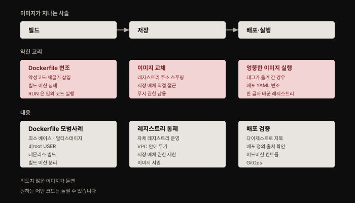
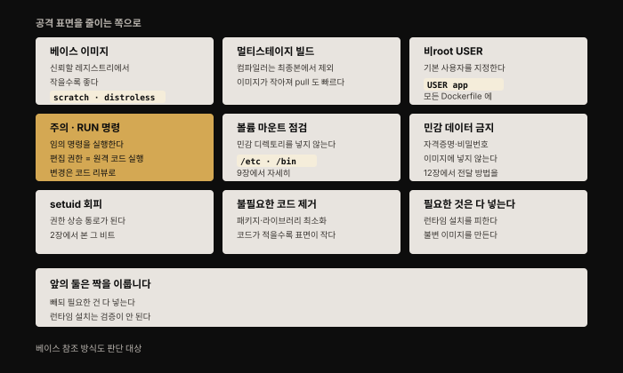
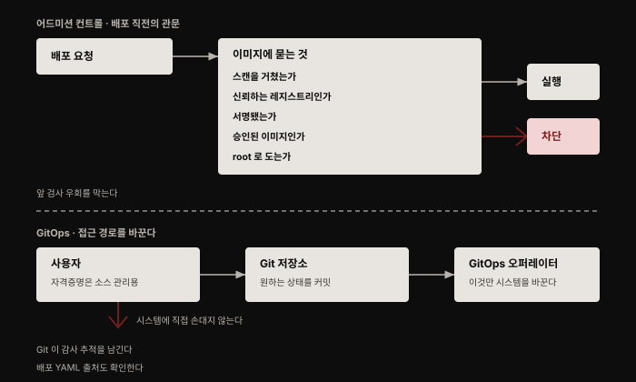

# 이미지 공급망 보안 — 빌드부터 배포까지
---

## 핵심 요약

> 이미지 보안의 핵심 관심사는 **무결성(integrity)** 입니다. **의도한 이미지가 실제로 쓰이도록 보장하는 것**이고, 이것이 무너지면 공격자는 원하는 어떤 코드든 돌릴 수 있습니다.
>
> 1장에서 열거한 공격 벡터 9종 중 **셋이 이 편의 소관**입니다. 잘못 설정된 이미지, 빌드 머신 공격, 공급망 공격. 이 편은 그 셋을 빌드·저장·배포라는 사슬로 늘어놓고 각 고리의 약점과 대응을 봅니다. 특히 **`RUN` 명령을 편집할 수 있는 권한은 사실상 원격 코드 실행 권한**이라는 저자의 경고가 이 편에서 가장 날카로운 대목입니다.


## 학습 목표

이 내용을 읽고 나면:

1. 이미지 무결성이 왜 핵심 관심사인지 공급망 사슬로 설명할 수 있습니다.
2. Dockerfile 보안 모범 사례 여덟 가지를 열거하고 각각의 이유를 말할 수 있습니다.
3. 빌드 머신을 왜 프로덕션만큼 중요하게 다뤄야 하는지 설명할 수 있습니다.
4. 어드미션 컨트롤이 무엇을 검사하고 왜 필요한지 설명할 수 있습니다.
5. GitOps가 보안에 주는 이점을 접근 경로 관점에서 설명할 수 있습니다.




## 1. 이미지 무결성 — 사슬의 약한 고리

> 이미지 보안의 주된 관심사는 **이미지 무결성**입니다. 의도한 이미지가 실제로 쓰이도록 보장하는 것입니다.

**공격자가 의도치 않은 이미지를 배포 환경에서 돌게 만들 수 있다면, 그들은 원하는 어떤 코드든 실행할 수 있습니다.** 이미지를 빌드하고 저장하고 실행하는 사슬에는 여러 잠재적 약점이 있습니다.

애플리케이션 개발자는 자기가 쓰는 코드로 보안에 영향을 줍니다. 정적·동적 분석 도구, 동료 리뷰, 테스트가 개발 중에 들어간 취약함을 식별하는 데 도움이 됩니다. **이것은 컨테이너가 있든 없든 똑같이 적용됩니다.** 이 책은 컨테이너를 다루므로, 저자는 **이미지를 빌드하는 지점에서 들어올 수 있는 약점**으로 논의를 옮깁니다.


## 2. 빌드 시점 — Dockerfile이 곧 실행 권한이다

> 빌드 단계는 Dockerfile을 받아 컨테이너 이미지로 바꿉니다. 그 단계 안에 여러 잠재적 보안 위험이 있습니다.

이미지를 빌드하는 지시는 Dockerfile에서 옵니다. 빌드의 각 단계는 이 지시 중 하나를 실행하는 일이고, **악의적 행위자가 Dockerfile을 수정할 수 있다면 악의적 행동을 취할 수 있습니다.**

- 이미지에 **악성코드나 암호화폐 채굴 소프트웨어를 추가**하기
- 빌드에서 접근 가능한 **네트워크 토폴로지를 열거**하기

당연해 보일 수 있지만, **Dockerfile도 다른 소스 코드와 마찬가지로 공격자가 악의적 지시를 추가하지 못하게 적절한 접근 통제가 필요합니다.**

### Dockerfile 보안 모범 사례



Dockerfile의 내용은 빌드가 만들어 내는 이미지의 보안에 큰 영향을 줍니다. 저자가 드는 권고는 다음과 같습니다.

**베이스 이미지**: Dockerfile의 첫 줄은 새 이미지가 어디서 만들어지는지 나타내는 `FROM` 명령입니다.

- **신뢰할 수 있는 레지스트리의 이미지를 참조**합니다. 임의의 서드파티 베이스 이미지에는 악성 코드가 들어 있을 수 있어, 일부 조직은 사전 승인된 이미지 사용을 의무화합니다
- **베이스 이미지가 작을수록 불필요한 코드가 들어 있을 가능성이 낮고 공격 표면도 작습니다.** `scratch`(독립 실행 바이너리에 적합한 완전히 빈 이미지)에서 빌드하거나 `distroless` 같은 최소 베이스 이미지를 고려합니다. 작은 이미지는 전송도 빠릅니다
- **베이스 이미지를 태그로 가리킬지 다이제스트로 가리킬지 신중히 정합니다.** 다이제스트를 쓰면 빌드가 더 재현 가능해지지만, **보안 업데이트가 담긴 새 베이스 이미지 버전을 받지 못할 가능성이 커집니다.** 다만 누락된 업데이트는 취약점 스캔으로 잡아야 합니다

**멀티스테이지 빌드**: 최종 이미지에서 불필요한 내용을 제거하는 방법입니다. 초기 단계에는 이미지를 빌드하는 데 필요한 패키지와 툴체인을 전부 넣을 수 있습니다. 그런데 **이 도구 상당수는 런타임에 필요하지 않습니다.**

Go로 실행 파일을 쓴다면 실행 프로그램을 만드는 데 Go 컴파일러가 필요합니다. 그러나 **그 프로그램을 실행하는 컨테이너에는 Go 컴파일러가 필요 없습니다.** 한 단계가 컴파일해 바이너리를 만들고 다음 단계는 그 독립 실행 파일에만 접근하게 나누면 배포 이미지의 공격 표면이 훨씬 작아집니다. 보안 외의 이점으로 이미지 자체도 작아져 pull 시간이 줄어듭니다.

**비root `USER`**: Dockerfile의 `USER` 명령은 이 이미지 기반 컨테이너를 실행하는 **기본 사용자 신원이 root가 아님**을 지정합니다. 모든 컨테이너가 root로 돌기를 원하지 않는다면 **모든 Dockerfile에 비root 사용자를 지정**합니다.

**`RUN` 명령**: 여기가 이 절에서 가장 강한 경고입니다. 저자의 표현을 그대로 옮기면 이렇습니다. **Dockerfile의 `RUN` 명령은 임의의 명령을 실행하게 해 줍니다.** 공격자가 기본 보안 설정으로 Dockerfile을 침해할 수 있다면 **그 공격자는 자기가 고른 어떤 코드든 실행할 수 있습니다.** 시스템에서 임의의 컨테이너 빌드를 실행할 수 있는 사람을 신뢰하지 않을 이유가 있다면, **당신은 그들에게 원격 코드 실행 권한을 준 것**입니다.

그래서 **Dockerfile 편집 권한을 신뢰하는 팀원으로 제한하고 이 변경의 코드 리뷰에 각별히 주의**해야 합니다. Dockerfile에 새롭거나 수정된 `RUN` 명령이 들어올 때 검사나 감사 로그를 두는 것도 방법입니다.

**볼륨 마운트**: 특히 데모나 테스트에서 볼륨 마운트로 호스트 디렉토리를 컨테이너에 넣는 일이 잦습니다. 9장에서 보듯 **Dockerfile이 `/etc`나 `/bin` 같은 민감한 디렉토리를 컨테이너에 마운트하지 않는지 확인**하는 것이 중요합니다.

**민감 데이터를 Dockerfile에 넣지 않기**: 자격증명·비밀번호·기타 비밀 데이터를 이미지에 포함하면 **공격자에게 유리해집니다.** 06-01에서 본 대로 층에서 지워도 남기 때문입니다. 자세한 것은 12장에서 다룹니다.

**setuid 바이너리 회피**: 2장에서 논의한 대로 **setuid 비트가 붙은 실행 파일을 포함하지 않는 것이 좋습니다.** 권한 상승으로 이어질 수 있기 때문입니다.

**불필요한 코드 회피**: 컨테이너의 코드가 적을수록 공격 표면이 작습니다. **꼭 필요하지 않다면 패키지·라이브러리·실행 파일을 이미지에 추가하지 않습니다.** 같은 이유로 `scratch`나 `distroless` 계열을 베이스로 삼으면 코드가 극적으로 줄고, 따라서 취약한 코드도 줄어듭니다.

**필요한 것은 전부 포함하기**: 앞 항목의 짝입니다. **애플리케이션이 동작하는 데 필요한 것은 전부 넣습니다.** 컨테이너가 런타임에 추가 패키지를 설치할 가능성을 허용하면, **그 패키지가 정당한지 어떻게 검사하겠습니까?** 설치와 검증을 전부 이미지 빌드 시점에 하고 **불변 이미지**를 만드는 편이 훨씬 낫습니다.


## 3. 빌드 머신 — 프로덕션만큼 중요하다

> 이미지를 빌드하는 머신이 우려스러운 이유는 두 가지입니다.

- **공격자가 빌드 머신을 침해해 코드를 실행할 수 있다면 시스템의 다른 부분에 닿을 수 있는가?** 06-01에서 본 대로 특권 데몬 프로세스를 요구하지 않는 빌드 도구를 탐색할 이유가 여기 있습니다
- **공격자가 빌드의 결과에 영향을 줘, 결국 악의적 이미지를 빌드하고 실행하게 만들 수 있는가?** Dockerfile의 지시를 방해하거나 예기치 않은 빌드를 촉발하는 인가되지 않은 접근은 재앙적 결과를 낳을 수 있습니다. 공격자가 빌드되는 코드에 영향을 줄 수 있다면 **프로덕션 배포에서 도는 컨테이너에 백도어를 심을 수 있습니다**

저자의 결론이 분명합니다. **빌드 머신이 결국 프로덕션 클러스터에서 실행할 코드를 만들어 내므로, 프로덕션 클러스터 자체만큼 중요한 것처럼 공격에 대비해 강화하는 것이 중요합니다.**

구체적으로는 이렇습니다. 빌드 머신에서 불필요한 도구를 제거해 공격 표면을 줄입니다. 사용자의 직접 접근을 제한하고 VPC와 방화벽으로 인가되지 않은 네트워크 접근으로부터 보호합니다. **프로덕션 환경과 별개의 머신이나 클러스터에서 빌드를 실행**해 침해의 영향 범위를 제한하는 것이 좋습니다. 이 호스트에서 네트워크와 클라우드 서비스 접근을 제한해 공격자가 다른 요소에 접근하지 못하게 막습니다.


## 4. 저장 시점 — 레지스트리 통제와 서명

> 이미지가 빌드되면 레지스트리에 저장해야 합니다. **공격자가 이미지를 교체하거나 수정할 수 있다면 결국 그들의 코드를 실행하게 됩니다.**

### 자체 레지스트리 운영

많은 조직이 자체 레지스트리를 유지하거나 클라우드 제공자의 관리형 레지스트리를 쓰며, **허용된 레지스트리의 이미지만 쓸 수 있도록 요구**합니다. 자체 레지스트리(또는 자체 관리형 레지스트리 인스턴스)를 운영하면 **누가 이미지를 push·pull할 수 있는지에 대한 통제와 가시성**이 커집니다. 또 **공격자가 레지스트리 주소를 스푸핑하는 DNS 공격의 가능성도 줄입니다.** 레지스트리가 VPC 안에 있으면 공격자가 접근하기 어려워집니다.

**레지스트리의 저장 매체에 대한 직접 접근을 제한**하는 데도 주의해야 합니다. AWS에서 도는 레지스트리가 이미지 저장에 S3를 쓴다면, **S3 버킷에 제한적 권한을 걸어** 악의적 행위자가 저장된 이미지 데이터에 직접 접근하지 못하게 해야 합니다.

### 이미지 서명

**이미지 서명은 이미지에 신원을 결부시킵니다.** 인증서에 서명하는 것과 거의 같은 방식이며 11장에서 다룹니다.

**이미지 서명은 꽤 복잡해서 직접 만들고 싶은 것은 아닐 가능성이 높습니다.** 여러 레지스트리가 **TUF(The Update Framework) 명세의 Notary 구현**을 기반으로 이미지 서명을 구현합니다.

> **원문 시점 주의**: 저자는 **Notary가 쓰기 어렵다는 평판**이 있어서, 집필 시점에 주요 클라우드 제공자 대부분이 **이 프로젝트의 버전 2**에 참여하고 있는 것이 고무적이라고 적었습니다. 이후 지형이 크게 바뀌었습니다 — 심화 학습에 정리했습니다.

공급망에 대한 우려를 다루는 또 다른 프로젝트로 **in-toto**가 있습니다. 이 프레임워크가 보장하는 것은 셋입니다.

- 기대한 빌드 단계 각각이 완전히 실행됐다
- 올바른 입력에 대해 올바른 출력을 냈다
- 올바른 사람에 의해 올바른 순서로 수행됐다

여러 단계가 사슬로 엮이고 in-toto가 각 단계의 보안 관련 메타데이터를 과정 전체에 걸쳐 운반합니다. 결과적으로 **프로덕션의 소프트웨어가 개발자가 만든 것과 같은 코드를 돌리고 있음을 검증 가능하게** 만듭니다.

서드파티 이미지를 쓰고 싶다면(직접 애플리케이션으로든 빌드의 베이스 이미지로든), **소프트웨어 벤더나 다른 신뢰할 수 있는 출처에서 서명된 이미지를 받고, 자체 레지스트리에 저장하기 전에 직접 테스트**해 볼 수 있습니다.


## 5. 배포 시점 — 올바른 이미지와 어드미션 컨트롤

> 배포 시점의 주된 보안 관심사는 **올바른 이미지가 당겨져 실행되도록 보장**하는 것입니다. 여기에 더해 어드미션 컨트롤로 추가 검사를 할 수 있습니다.



### 올바른 이미지 배포

06-01에서 본 대로 **컨테이너 이미지 태그는 불변이 아닙니다.** 같은 이미지의 다른 버전으로 옮겨질 수 있습니다. **태그가 아니라 다이제스트로 이미지를 참조하면** 그 이미지가 생각하는 그 버전임을 보장하는 데 도움이 됩니다. 다만 빌드 시스템이 유의적 버전으로 이미지에 태그를 붙이고 그것이 엄격히 지켜진다면, **마이너 업데이트마다 이미지 참조를 갱신할 필요가 없어 관리가 쉬우므로 이것으로 충분할 수도 있습니다.**

**태그로 이미지를 참조한다면, 실행 전에 항상 최신 버전을 pull해야 합니다.** 업데이트가 있었을 수 있기 때문입니다. 다행히 이것은 비교적 효율적입니다. **이미지 매니페스트를 먼저 가져오고, 이미지 층은 바뀐 경우에만 가져오면 되기 때문**입니다. Kubernetes에서는 `imagePullPolicy`로 정의합니다. **다이제스트로 이미지를 참조한다면 매번 pull하는 정책은 불필요합니다.** 업데이트가 있으면 다이제스트를 바꿔야 하기 때문입니다.

위험 프로파일에 따라 **이미지 서명을 확인해 출처를 검증**하고 싶을 수도 있습니다.

### 악의적 배포 정의

컨테이너 오케스트레이터를 쓸 때는 각 애플리케이션을 이루는 컨테이너를 정의하는 설정 파일(Kubernetes라면 YAML)이 있습니다. **이 설정 파일의 출처를 검증하는 것이 이미지를 검사하는 것만큼 중요합니다.**

**인터넷에서 YAML을 받았다면 프로덕션 클러스터에서 실행하기 전에 아주 꼼꼼히 확인**하십시오. 저자가 드는 예가 인상적입니다. **레지스트리 URL의 한 글자를 바꾸는 것 같은 작은 변형만으로도 악의적 이미지가 배포 환경에서 돌 수 있습니다.**

### 어드미션 컨트롤

**어드미션 컨트롤러는 자원을 클러스터에 배포하려는 시점에 검사를 수행합니다.** Kubernetes에서 어드미션 컨트롤은 어떤 종류의 자원이든 정책에 비춰 평가할 수 있지만, 이 장에서는 특정 컨테이너 이미지를 기준으로 컨테이너를 허용할지 검사하는 경우만 봅니다. **어드미션 컨트롤 검사에 실패하면 컨테이너는 실행되지 않습니다.**

어드미션 컨트롤러가 컨테이너 이미지에 대해 수행할 수 있는 필수 보안 검사는 이런 것들입니다.

- 이미지가 **취약점·악성코드·기타 정책 위반**에 대해 스캔됐는가
- 이미지가 **신뢰하는 레지스트리**에서 왔는가
- 이미지가 **서명**됐는가
- 이미지가 **승인**된 것인가
- 이미지가 **root로 도는가**

**이 검사들이 중요한 이유는 시스템 앞 단계의 검사를 아무도 우회할 수 없게 보장하기 때문입니다.** 저자가 드는 예가 명확합니다. **CI 파이프라인에 취약점 스캔을 도입해 봐야, 스캔되지 않은 이미지를 가리키는 배포 지시를 사람들이 지정할 수 있다면 이점이 거의 없습니다.**

### GitOps

**GitOps는 시스템 상태에 대한 모든 설정 정보를 애플리케이션 소스 코드와 마찬가지로 소스 관리 아래 두는 방법론**입니다. 사용자가 시스템에 운영상의 변경을 하고 싶을 때 **명령을 직접 적용하지 않고, 원하는 상태를 코드 형태로 체크인**합니다. **GitOps 오퍼레이터**라 불리는 자동화된 시스템이 코드로 정의된 최신 상태를 시스템에 반영합니다.

이것이 보안에 주는 이점이 상당합니다. **사용자는 더 이상 실행 중인 시스템에 직접 접근할 필요가 없습니다.** 모든 것이 소스 코드 관리 시스템을 통해 한 다리 건너 이뤄지기 때문입니다. **사용자 자격증명은 소스 관리 시스템 접근을 허용할 뿐이고, 실행 중인 시스템을 수정할 권한은 자동화된 GitOps 오퍼레이터만 갖습니다.** 게다가 **Git이 모든 변경을 기록하므로 모든 작업에 대한 감사 추적이 남습니다.**


## 심화 학습

> 여기부터는 책 밖의 보강입니다. 원문의 시점 의존 서술 두 가지를 확인했습니다.

**이미지 서명 지형이 크게 바뀌었습니다.** 원문이 "고무적"이라고 적은 **Notary 버전 2는 현재 Notary Project로 이름을 바꿨습니다.** CLI 도구는 `notation` 이고 CNCF **Incubating** 단계입니다. COSE 서명을 OCI 아티팩트로 만들어 ORAS 명세로 이미지에 붙이는 방식입니다.[^notation]

더 큰 변화는 **원문 집필 시점에 존재하지 않던 Sigstore의 등장**입니다. Sigstore는 **2024년 3월 OpenSSF 졸업 프로젝트**가 됐고 컨테이너용 도구가 **cosign** 입니다. 핵심 혁신은 **키리스(keyless) 서명**입니다. 개발자가 키를 직접 보관하지 않고 GitHub·Google 계정 같은 **신원에 단명 인증서를 묶어** 서명합니다.

구성 요소는 셋입니다.

- **cosign**: 서명과 검증
- **Fulcio**: OIDC 신원 기반 인증기관
- **Rekor**: 투명성 로그

둘의 성격이 다릅니다. **`notation`은 기업의 기존 PKI와 X.509 인증서 워크플로에 통합**되도록 설계됐습니다. 반면 **cosign은 오픈소스 커뮤니티를 주 대상**으로 개인 개발자가 OIDC 계정으로 서명할 수 있게 합니다. npm·PyPI·Homebrew·GitHub Artifact Attestations가 Sigstore를 씁니다.

**원문의 "Notary는 쓰기 어렵다"는 문제의식은 유효합니다. 다만 그 답이 Notary v2 하나로 수렴하지는 않았습니다.**

**어드미션 컨트롤의 표준 수단도 바뀌었습니다.** 원문은 어드미션 컨트롤 개념만 소개하고 구체적 구현을 지정하지 않았지만, 당시 Kubernetes의 대표적 수단이던 **PodSecurityPolicy는 제거됐고 Pod Security Admission이 v1.25에서 stable**이 됐습니다.[^psa] 새 방식은 Pod 단위 정책 오브젝트 대신 **네임스페이스 라벨**로 `privileged`·`baseline`·`restricted` 세 수준을 강제합니다.

```yaml
pod-security.kubernetes.io/enforce: restricted
pod-security.kubernetes.io/audit: baseline
pod-security.kubernetes.io/warn: baseline
```

`enforce`는 위반을 거부하고, `audit`은 감사 로그에 남기며, `warn`은 사용자에게 경고를 보여 줍니다. 원문이 말한 다섯 가지 질문 같은 **이미지 기준 정책**은 OPA Gatekeeper나 Kyverno 같은 정책 엔진으로 구현하는 것이 일반적입니다.


## 결정 치트시트

> 공급망 각 단계의 판단 기준입니다.

| 상황 | 선택 | 이유 |
|------|------|------|
| 베이스 이미지를 고른다 | 신뢰 레지스트리의 최소 이미지 | `scratch`·`distroless`는 코드가 적어 표면이 작습니다 |
| 베이스를 태그로 쓸지 다이제스트로 쓸지 | 재현성이면 다이제스트, 보안 업데이트면 태그 | 다이제스트는 새 패치를 자동으로 받지 못합니다 |
| 컴파일러가 필요한 언어를 쓴다 | 멀티스테이지 빌드 | 런타임에 불필요한 툴체인을 최종본에서 뺍니다 |
| Dockerfile 편집 권한을 준다 | 신뢰하는 팀원으로 제한 + 코드 리뷰 | `RUN` 편집 권한은 사실상 원격 코드 실행 권한입니다 |
| 런타임에 패키지를 설치하려 한다 | 빌드 시점으로 옮긴다 | 런타임 설치 패키지의 정당성은 검증할 수 없습니다 |
| 빌드 머신을 구성한다 | 프로덕션과 분리 + 도구 최소화 | 빌드 머신이 프로덕션 코드를 만들어 냅니다 |
| 이미지를 어디에 저장할지 | 자체·관리형 레지스트리를 VPC 안에 | DNS 스푸핑과 무단 push·pull을 줄입니다 |
| 서명을 도입한다 | 기업 PKI면 `notation`, OSS면 cosign | 둘의 설계 대상이 다릅니다 |
| 앞 단계 검사의 우회를 막는다 | 어드미션 컨트롤 | 스캔하지 않은 이미지를 지목하는 배포를 차단합니다 |
| 운영자의 클러스터 직접 접근을 줄인다 | GitOps | 오퍼레이터만 시스템을 바꾸고 Git이 감사 추적을 남깁니다 |


## 면접에서 받을 만한 질문

1. 이미지 보안의 핵심 관심사를 한 문장으로 말해 보세요.
2. Dockerfile의 `RUN` 명령이 왜 특별히 위험한가요?
3. 멀티스테이지 빌드가 보안에 주는 이점은 무엇인가요?
4. 빌드 머신을 프로덕션만큼 중요하게 다뤄야 하는 이유는 무엇인가요?
5. 어드미션 컨트롤이 없으면 무엇이 무력해지나요?


## 정답 (자답 후 펼치기)

1. 이미지 무결성입니다. 의도한 이미지가 실제로 쓰이도록 보장하는 것이고, 공격자가 의도치 않은 이미지를 배포 환경에서 돌게 만들면 원하는 어떤 코드든 실행할 수 있습니다. 빌드에서 저장을 거쳐 실행에 이르는 사슬 전체에 약한 고리가 있습니다.
2. `RUN`은 임의의 명령을 실행하기 때문입니다. 공격자가 Dockerfile을 침해할 수 있다면 자기가 고른 어떤 코드든 실행할 수 있습니다. 저자의 표현대로, 시스템에서 임의의 컨테이너 빌드를 실행할 수 있는 사람을 신뢰하지 않을 이유가 있다면 이미 그들에게 원격 코드 실행 권한을 준 것입니다. 그래서 편집 권한을 신뢰하는 팀원으로 제한하고 변경을 코드 리뷰해야 합니다.
3. 빌드에 필요하지만 런타임에는 필요 없는 것들을 최종 이미지에서 제거할 수 있습니다. Go 프로그램이라면 컴파일 단계에 Go 컴파일러가 필요하지만 실행 컨테이너에는 필요 없습니다. 한 단계가 컴파일해 바이너리를 만들고 다음 단계가 그 실행 파일만 가져가면 배포 이미지의 공격 표면이 훨씬 작아집니다. 이미지가 작아져 pull이 빨라지는 부수 효과도 있습니다.
4. 빌드 머신이 결국 프로덕션 클러스터에서 실행할 코드를 만들어 내기 때문입니다. 공격자가 빌드 머신을 침해하면 시스템의 다른 부분에 닿을 수 있고, 빌드되는 코드에 영향을 줄 수 있다면 프로덕션에서 도는 컨테이너에 백도어를 심을 수 있습니다. 그래서 도구를 최소화해 공격 표면을 줄이고, 직접 접근을 제한하고, VPC·방화벽으로 보호하며, 프로덕션과 별개 머신에서 빌드합니다.
5. 앞 단계의 검사가 무력해집니다. CI 파이프라인에 취약점 스캔을 넣어도, 스캔되지 않은 이미지를 가리키는 배포 지시를 지정할 수 있다면 이점이 거의 없습니다. 어드미션 컨트롤러는 배포 직전에 스캔 여부·레지스트리 신뢰성·서명·승인 여부·root 실행 여부를 확인하고, 실패하면 컨테이너를 실행하지 않습니다.


## 핵심 개념 체크리스트

- [ ] 이미지 무결성이 왜 핵심인지 설명할 수 있는가?
- [ ] Dockerfile 모범 사례 여덟 가지를 열거할 수 있는가?
- [ ] `scratch`와 `distroless`가 무엇이고 왜 권장되는지 아는가?
- [ ] 베이스를 태그로 쓸 때와 다이제스트로 쓸 때의 트레이드오프를 아는가?
- [ ] 멀티스테이지 빌드의 원리를 예로 설명할 수 있는가?
- [ ] `RUN` 편집 권한이 왜 원격 코드 실행 권한인지 아는가?
- [ ] 빌드 머신을 강화하는 구체적 방법을 세 가지 말할 수 있는가?
- [ ] 자체 레지스트리 운영이 어떤 공격을 줄이는지 아는가?
- [ ] in-toto가 무엇을 보장하는지 아는가?
- [ ] 어드미션 컨트롤이 검사하는 항목을 열거할 수 있는가?
- [ ] GitOps가 접근 경로를 어떻게 바꾸는지 설명할 수 있는가?


## 참고 자료

- 원본: 《Container Security》(Liz Rice, O'Reilly, 2020, ISBN 978-1492056706) Chapter 6 후반부
- [Notary Project — notation](https://github.com/notaryproject/notation) — 원문의 "Notary v2"가 현재 어떻게 됐는지
- [Sigstore cosign](https://github.com/sigstore/cosign) — 원문 집필 이후 등장한 키리스 서명
- [Pod Security Admission — Kubernetes 공식 문서](https://kubernetes.io/docs/concepts/security/pod-security-admission/) — PodSecurityPolicy의 후속
- [컨테이너 이미지 해부 — 두 부분과 층과 식별자](./06-01.%EC%BB%A8%ED%85%8C%EC%9D%B4%EB%84%88%20%EC%9D%B4%EB%AF%B8%EC%A7%80%20%ED%95%B4%EB%B6%80%20%E2%80%94%20%EB%91%90%20%EB%B6%80%EB%B6%84%EA%B3%BC%20%EC%B8%B5%EA%B3%BC%20%EC%8B%9D%EB%B3%84%EC%9E%90.md) — 같은 장 전반부
- [컨테이너 보안 위협 — 위협 모델부터 보안 원칙까지](./01-01.%EC%BB%A8%ED%85%8C%EC%9D%B4%EB%84%88%20%EB%B3%B4%EC%95%88%20%EC%9C%84%ED%98%91%20%E2%80%94%20%EC%9C%84%ED%98%91%20%EB%AA%A8%EB%8D%B8%EB%B6%80%ED%84%B0%20%EB%B3%B4%EC%95%88%20%EC%9B%90%EC%B9%99%EA%B9%8C%EC%A7%80.md) — 이 편이 대응하는 공격 벡터의 출처
- [Container Security 정독 인덱스](./README.md) — 이 책의 장별 목표와 진행 상태

[^notation]: Notary Project — notation. Notary v2 는 Notary Project 로 이름을 바꿨고 CLI 도구는 `notation` 입니다. CNCF Incubating 단계입니다.
<https://github.com/notaryproject/notation>

[^psa]: Kubernetes 공식 문서 — Pod Security Admission. FEATURE STATE 는 `Kubernetes v1.25 [stable]` 이며 PodSecurityPolicy 를 대체합니다.
<https://kubernetes.io/docs/concepts/security/pod-security-admission/>
