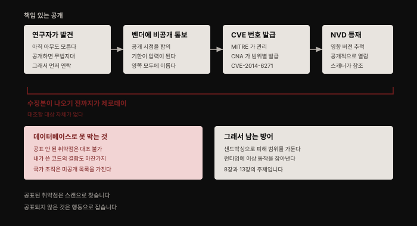
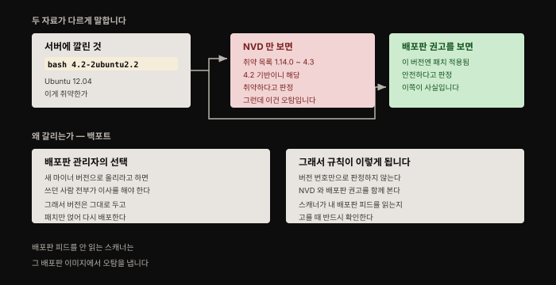
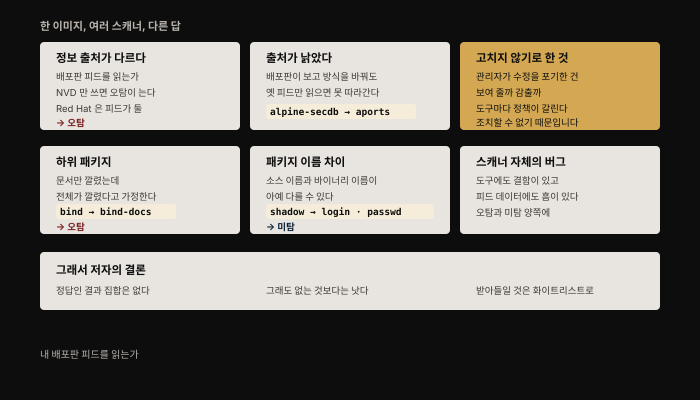
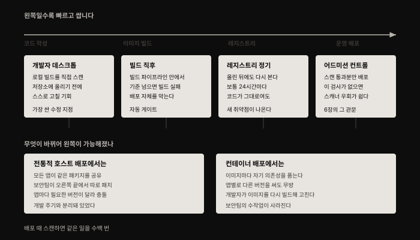

# 이미지 속 소프트웨어 취약점 — CVE부터 스캔 운영까지
---
> 취약점 패치는 오래된 보안 업무입니다. 컨테이너 세계에서도 여전히 중요한데, 저자의 표현으로는 **패치 프로세스 자체가 완전히 재발명됐습니다**. 무엇이 재발명됐는지가 이 장의 핵심입니다.

## 핵심 요약

취약점 관리의 무게중심이 **운영 끝단의 보안팀에서 개발 파이프라인의 왼쪽으로 옮겨 갔습니다**. 호스트에 깔린 공유 패키지를 보안팀이 SSH로 들어가 패치하던 방식이, 이미지마다 자기 의존성을 품는 구조로 바뀌면서 "개발자가 이미지를 다시 빌드하는 일"이 됐기 때문입니다.

이 이동을 떠받치는 것이 이미지 스캐너입니다. 다만 스캐너는 만능이 아닙니다. 같은 이미지를 스캔해도 도구마다 결과가 다르고, 그 차이에는 다섯 가지 구조적 이유가 있습니다. 그리고 어떤 스캐너로도 잡을 수 없는 부류가 남습니다 — 아직 공표되지 않은 제로데이입니다.

## 학습 목표

1. CVE가 무엇이고 어떤 절차로 발급·공표되는지 설명할 수 있습니다.
2. NVD 목록만 보면 왜 오탐이 나는지를 백포트 개념으로 설명할 수 있습니다.
3. 같은 이미지에 대해 스캐너들이 다른 답을 내놓는 다섯 가지 이유를 구분할 수 있습니다.
4. 컨테이너를 불변으로 다뤄야 스캔이 성립하는 이유를 말할 수 있습니다.
5. 파이프라인의 어느 지점에 스캔을 넣을지 판단하고, 스캔으로 막지 못하는 것이 무엇인지 압니다.

## 1. 취약점은 어떻게 공표되는가

취약점은 **공격자가 악의적 행위에 이용할 수 있는, 알려진 소프트웨어 결함**입니다. 저자는 일반 법칙 하나를 먼저 깔아 둡니다. 소프트웨어가 복잡할수록 결함이 있을 가능성이 높고, 그중 일부는 악용 가능합니다.

널리 쓰이는 소프트웨어에 취약점이 있으면 공격자는 그것이 배포된 모든 곳에서 이용할 수 있습니다. 그래서 공개된 소프트웨어, 특히 운영체제 패키지와 언어 라이브러리에서 새 취약점을 찾아 보고하는 연구 산업이 통째로 존재합니다. Shellshock, Meltdown, Heartbleed처럼 이름을 넘어 로고까지 받은 것들이 있는데, 저자는 이들을 "취약점 세계의 록스타"라 부르면서도 매년 보고되는 수천 건 중 아주 작은 일부라는 점을 짚습니다.

### 왜 곧바로 공개하지 않는가

취약점이 확인되면 공격자가 이용하기 전에 수정본을 배포하려는 경주가 시작됩니다. 새 이슈를 즉시 공개해 버리면 공격자에게 무법지대를 열어 주는 셈입니다. 이를 피하려고 자리 잡은 것이 **책임 있는 보안 공개**입니다.

절차는 이렇습니다. 취약점을 찾은 연구자가 해당 소프트웨어의 개발자나 벤더에게 먼저 연락합니다. 양측이 연구자가 결과를 공개할 시점을 합의합니다. 여기서 벤더에게 제때 수정본을 내놓으라는 긍정적 압력이 생깁니다. 공개 전에 수정본이 나와 있는 편이 벤더에게도 사용자에게도 낫기 때문입니다.

### CVE와 그 뒤의 조직

새 이슈에는 "CVE"로 시작하는 고유 식별자가 붙습니다. Common Vulnerabilities and Exposures의 약자이고 뒤에 연도가 옵니다. ShellShock은 2014년에 발견돼 공식적으로 `CVE-2014-6271`입니다.

이 ID를 관리하는 조직이 **MITRE**이며, 여러 **CNA**(CVE Numbering Authority)를 감독합니다. CNA는 정해진 범위 안에서 CVE ID를 발급할 수 있습니다. Microsoft, Red Hat, Oracle 같은 대형 벤더가 자사 제품의 취약점에 대해 ID를 부여할 자격을 가진 CNA입니다. GitHub은 2019년 말에 CNA가 됐습니다.

이 식별자들은 **NVD**(National Vulnerability Database)에서 각 취약점의 영향을 받는 패키지와 버전을 추적하는 데 쓰입니다.

## 2. NVD 목록만 보면 왜 틀리는가

여기까지 읽으면 이야기가 끝난 것처럼 보입니다. 영향받는 패키지 버전 목록이 있으니 내 버전이 그 안에 있으면 노출된 것 아닌가. 저자는 이 지점에서 제동을 겁니다. **그렇게 간단하지 않습니다.** 쓰고 있는 Linux 배포판이 이미 패치된 버전을 갖고 있을 수 있기 때문입니다.

ShellShock으로 예를 들어 봅니다. GNU `bash` 패키지를 덮친 치명적 취약점이었습니다. `CVE-2014-6271`의 NVD 페이지에는 1.14.0부터 4.3까지 긴 취약 버전 목록이 붙어 있습니다. 아주 오래된 Ubuntu 12.04를 돌리고 있는데 서버의 bash 버전이 `4.2-2ubuntu2.2`라면, 4.2 기반이니 NVD 목록에 걸려 취약하다고 생각하기 쉽습니다.

그런데 같은 취약점에 대한 Ubuntu 보안 권고를 보면 **바로 그 버전에 수정이 적용돼 있어 안전합니다**. Ubuntu 관리자들이 12.04 사용자 전부에게 bash의 새 마이너 버전으로 올라가라고 요구하는 대신, 취약점 패치만 적용한 버전을 만들어 배포하기로 결정했기 때문입니다.

여기서 이 장의 첫 번째 실무 규칙이 나옵니다. 서버에 설치된 패키지가 실제로 취약한지 제대로 알려면 **NVD뿐 아니라 자기 배포판에 해당하는 보안 권고까지 함께 참조해야 합니다**. 이 규칙은 뒤에서 "스캐너를 어떻게 고를 것인가"로 그대로 이어집니다.

### 공유 패키지가 만들던 문제

지금까지 다룬 것은 `apt`, `yum`, `rpm`, `apk` 같은 패키지 관리자로 바이너리 형태로 배포되는 패키지입니다. 이 패키지들은 파일시스템 안의 모든 애플리케이션이 공유합니다. 서버나 가상머신에서는 이 공유가 끝없는 문제를 만듭니다. 한 애플리케이션이 특정 버전에 의존하는데 그 버전이 같은 머신에서 돌리려는 다른 애플리케이션과 호환되지 않는 식입니다.

이 의존성 관리 문제가 바로 **컨테이너가 컨테이너마다 별도의 루트 파일시스템을 가짐으로써 해결하는** 문제 중 하나입니다. 이 대비는 뒤에서 "왼쪽으로 당기기"가 가능해진 이유의 뿌리가 됩니다.

### 애플리케이션 레벨의 취약점

취약점은 애플리케이션 레벨에도 있습니다. 대부분의 애플리케이션은 언어별 패키지 관리자로 설치하는 서드파티 라이브러리를 씁니다. Node.js는 `npm`, Python은 `pip`, Java는 `Maven`을 쓰는 식입니다. 이 도구들이 설치하는 서드파티 패키지가 또 하나의 잠재적 취약점 출처입니다.

Go, C, Rust 같은 컴파일 언어에서는 서드파티 의존성이 공유 라이브러리로 설치될 수도 있고, 빌드 시점에 바이너리 안으로 링크될 수도 있습니다.

독립 실행 바이너리는 정의상 외부 의존성이 없습니다. 서드파티 라이브러리에 의존할 수는 있지만 그것들이 실행 파일 안에 빌드돼 들어갑니다. 이 경우 `scratch`(빈) 베이스 이미지 위에 실행 파일 하나만 담은 이미지를 만드는 선택지가 생깁니다.

> 여기서 저자가 조용히 던지는 함정이 있습니다. **의존성이 없으면 공표된 패키지 취약점을 스캔할 대상 자체가 없습니다.** 그렇다고 안전하다는 뜻은 아닙니다. 여전히 공격자가 악용할 결함을 품고 있을 수 있고, 그건 이 장 마지막의 제로데이 주제입니다.

## 3. 스캔이 성립하려면 컨테이너가 불변이어야 합니다

취약점 대응은 리스크 관리의 한 축입니다. 사소하지 않은 소프트웨어를 배포하면 취약점이 딸려 올 가능성이 높습니다. 그것을 통해 공격당할 위험도 함께 옵니다. 이 위험을 관리하려면 네 가지가 필요합니다.

- 어떤 취약점이 있는지 **식별**
- 각각의 **심각도 평가**
- 무엇부터 볼지 **우선순위 결정**
- 고치거나 완화할 **프로세스**

취약점 스캐너는 이 중 첫 번째를 자동화합니다. 각 이슈가 얼마나 심각한지, 수정이 적용된 패키지 버전이 무엇인지도 함께 알려 줍니다.

### 이 장이 말하는 스캔은 포트 스캔이 아닙니다

인터넷을 뒤지면 온갖 취약점 스캔 도구가 나옵니다. `nmap`이나 `nessus`처럼 살아 있는 시스템을 밖에서 찔러 보는 포트 스캔 도구도 그중 하나입니다. 저자는 그것도 가치 있는 접근이지만 이 장의 주제가 아니라고 선을 긋습니다. 여기서 관심 있는 것은 **루트 파일시스템에 설치된 소프트웨어를 살펴보는** 도구입니다.

어떤 취약점이 있는지 알아내려면 먼저 어떤 소프트웨어가 있는지부터 확정해야 합니다. 소프트웨어는 여러 경로로 들어옵니다.

- 루트 파일시스템 자체가 Linux 배포판에서 출발하며, 그 안에 취약점이 있을 수 있습니다.
- `rpm`·`apk` 같은 시스템 패키지 관리자로 설치한 패키지, `pip`·`RubyGems` 같은 언어별 도구로 설치한 패키지가 있습니다.
- `wget`, `curl`, 심지어 FTP로 직접 설치한 소프트웨어가 있을 수 있습니다.

어떤 스캐너는 패키지 관리자에게 물어 설치된 소프트웨어 목록을 얻습니다. 그런 도구를 쓴다면 **직접 설치는 피해야 합니다** — 스캔되지 않기 때문입니다. 세 번째 경로가 그대로 사각지대가 된다는 뜻입니다.

### 왜 컨테이너가 아니라 이미지를 스캔하는가

호스트마다, 또는 배포 전체에 걸쳐 돌고 있는 컨테이너를 하나씩 스캔하는 도구를 상상해 봅니다. 오늘날 클라우드 네이티브 배포에서는 같은 이미지에서 뜬 컨테이너 인스턴스가 수백 개인 경우가 흔합니다. 이 방식은 같은 의존성을 수백 번 들여다보는 셈이라 대단히 비효율적입니다. **그 컨테이너들이 유래한 이미지를 스캔하는 편이 훨씬 효율적입니다.**

다만 이 접근은 전제가 하나 필요합니다. 컨테이너가 이미지에 있던 소프트웨어만 돌리고 그 외에는 아무것도 돌리지 않아야 합니다. 각 컨테이너에서 도는 코드가 **불변**이어야 한다는 뜻입니다.

### 실행 중에 코드를 받아 오면 안 되는 이유

컨테이너가 시작된 뒤 자기 파일시스템에 소프트웨어를 추가로 내려받는 것을 막는 장치는 보통 없습니다. 실제로 컨테이너 초기에는 이 패턴을 흔히 볼 수 있었습니다. 이미지를 다시 빌드하지 않고 최신 버전으로 갱신하는 방법으로 여겨졌기 때문입니다. 저자는 이 발상이 떠오른 적 없다면 지금 즉시 기억에서 지우라고 씁니다. 나쁜 생각으로 통하는 이유가 여럿입니다.

- 런타임에 코드를 내려받으면 인스턴스마다 다른 버전이 돌 수 있는데, **어느 인스턴스가 무슨 버전인지 알기 어렵습니다**.
- 저장된 코드 버전이 없으면 동일한 사본을 다시 만들기가 어렵거나 불가능합니다. 현장 이슈를 재현하려 할 때 문제가 됩니다.
- 언제 어디서든 내려받을 수 있다면 각 컨테이너에서 도는 소프트웨어의 출처를 통제하고 보증하기가 어려워집니다.
- 이미지를 빌드해 레지스트리에 저장하는 일은 CI/CD 파이프라인에서 자동화하기 쉽습니다. 같은 파이프라인에 취약점 스캔이나 공급망 검증 같은 보안 검사를 얹기도 쉽습니다.

많은 운영 배포는 강제 없이 모범 사례로만 불변성을 지킵니다. 이를 자동으로 강제하는 도구도 있습니다. **스캔 시점에 이미지 안에 없던 실행 파일이 컨테이너에서 실행되는 것을 막는** 방식이며, 이를 **드리프트 방지**라 부릅니다. 13장의 주제입니다.

불변성을 얻는 다른 방법은 읽기 전용 파일시스템으로 컨테이너를 돌리는 것입니다. 애플리케이션 코드가 쓰기 가능한 로컬 저장소를 필요로 하면 쓰기 가능한 임시 파일시스템을 마운트해 줍니다. 이 경우 애플리케이션이 그 임시 파일시스템에만 쓰도록 코드를 고쳐야 할 수 있습니다.

### 한 번 스캔으로 끝나지 않는 이유

컨테이너를 불변으로 다루면 이미지만 스캔해도 모든 컨테이너에 있을 취약점을 찾을 수 있습니다. 그런데 한 시점에 한 번 스캔하는 것으로는 충분하지 않습니다.

저자는 Heartbleed를 예로 듭니다. 널리 쓰이는 OpenSSL 패키지의 치명적 취약점이었고 2014년 4월에 드러났습니다. TLS 연결을 살려 두는 하트비트 요청·응답 흐름의 문제를 악용했습니다.

동작은 이렇습니다. 공격자가 조작된 하트비트 요청을 보내 **작은 데이터를 큰 버퍼에 담아 달라고** 요청합니다. OpenSSL 코드에 길이 검사가 없었습니다. 그래서 응답은 그 작은 데이터를 준 다음 **버퍼의 나머지를 당시 활성 메모리에 있던 것으로 채워** 돌려줬습니다. 그 메모리에 민감한 데이터가 들어 있을 수 있었습니다. 비밀번호·사회보장번호·의료 기록이 유출된 심각한 침해 사건들이 나중에 Heartbleed로 추적됐습니다.

Heartbleed만큼 심각한 사례는 드물지만, **서드파티 의존성을 쓴다면 언젠가 그 안에서 새 취약점이 드러난다고 가정하는 편이 합리적입니다**. 언제일지는 알 방법이 없습니다. 내 코드가 그대로여도 의존성 안에서 새 취약점이 발견될 수 있습니다.

그래서 정기 재스캔이 필요합니다. 다시 스캔하면 도구가 NVD와 다른 보안 권고 출처에서 얻은 **가장 최신 지식**으로 이미지 내용을 다시 대조합니다. 흔히 쓰이는 방식은 새로 빌드되는 이미지를 자동 파이프라인에서 스캔하는 것에 더해 **배포된 모든 이미지를 24시간마다 다시 스캔하는 것**입니다.

## 4. 왜 스캐너마다 답이 다른가

컨테이너 이미지 스캔 도구는 여럿입니다. Trivy, Clair, Anchore 같은 오픈소스 구현이 있고 JFrog, Palo Alto, Aqua 같은 회사의 상용 솔루션이 있습니다. Docker Trusted Registry, CNCF 프로젝트인 Harbor, 주요 퍼블릭 클라우드가 제공하는 레지스트리처럼 스캔을 내장 기능으로 포함한 레지스트리 솔루션도 많습니다.

그런데 서로 다른 스캐너에서 얻는 결과가 상당히 다릅니다. 저자는 그 이유를 다섯 갈래로 나눕니다.

| 원인 | 무슨 일이 벌어지나 | 결과 |
|------|------------------|------|
| **정보 출처** | 배포판별 보안 권고를 읽지 않고 NVD만 쓰면 백포트를 모릅니다. Red Hat은 피드가 둘이고, OVAL 피드에는 수정이 있는 취약점만 들어갑니다 | 오탐 |
| **낡은 출처** | 배포판이 취약점 보고 방식을 바꿔도 옛 피드만 읽으면 갱신을 놓칩니다. Alpine이 `alpine-secdb` 갱신을 멈추고 `aports`로 옮긴 사례 | 오탐·미탐 |
| **고치지 않기로 한 것** | 관리자가 수정을 포기한 취약점을 결과에 넣을지가 도구 개발자의 판단입니다. 조치할 수 없기 때문에 보기 싫다는 요구가 실제로 있습니다 | 정책 차이 |
| **하위 패키지** | Ubuntu의 `bind`가 문서 하위 패키지만 설치됐는데 전체가 설치됐다고 가정하면, 있을 수 없는 취약점을 보고합니다 | 오탐 |
| **패키지 이름 차이** | 소스 이름과 실제 바이너리 이름이 다릅니다. Debian의 `shadow` 패키지에는 `login`·`passwd`·`uidmap` 바이너리가 들어 있습니다 | 미탐 |

여기에 스캐너 자체의 버그나 보안 권고 피드의 결함으로 생기는 오탐·미탐이 더해집니다.

> 저자는 자기가 몸담은 회사 이야기를 근거로 씁니다. Aqua에서 "고치지 않기로 한" 취약점을 보고 싶지 않다는 고객 요구를 듣고 선택 옵션을 제공했다는 대목입니다. 그리고 결론을 이렇게 냅니다. **취약점 스캔에서 "올바른" 결과 집합 같은 것은 없습니다.**

그렇다고 스캐너를 안 쓰는 편이 낫다는 말은 아닙니다. 스캐너를 두고 정기적으로 돌리지 않으면 내 소프트웨어가 쉬운 먹잇감인지 알 방법이 아예 없습니다. 저자의 표현으로 **이 문제에서 시간은 치유자가 아닙니다** — 치명적이었던 Shellshock은 수십 년 묵은 코드에서 발견됐습니다. 복잡한 의존성에 기대고 있다면 언젠가 그 안에서 취약점이 나온다고 예상해야 합니다. 오탐이 성가시면 개별 항목을 화이트리스트에 넣어 앞으로 받아들일지 스스로 정하게 해 주는 도구도 있습니다.

여기서 도구를 고를 때 물어야 할 질문이 정리됩니다. **베이스 이미지로 선호하는 배포판이 있거나 distroless 같은 방식을 쓴다면, 스캐너가 그것을 지원하는지 확인해야 합니다.**

## 5. 파이프라인의 어디에 넣을 것인가

파이프라인을 왼쪽 끝에 "코드 작성", 오른쪽 끝에 "운영 배포"를 놓고 봅니다. 이 파이프라인에서는 **가능한 한 이른 시점에 문제를 걷어내는 편이 낫습니다**. 더 빠르고 싸기 때문입니다. 버그를 찾아 고치는 일이 배포 후보다 개발 중일 때 훨씬 시간과 비용이 덜 드는 것과 정확히 같은 이치입니다.

### 무엇이 바뀌어 왼쪽이 가능해졌나

전통적인 호스트 기반 배포에서는 호스트에서 도는 모든 소프트웨어가 같은 패키지를 공유했습니다. 조직의 보안팀이 그 패키지들을 정기적으로 보안 수정과 함께 갱신하는 책임을 졌습니다. 이 활동은 각 애플리케이션 생애주기의 개발·테스트 단계와 대체로 분리돼 있었고, 파이프라인에서 한참 오른쪽에 있었습니다. 서로 다른 애플리케이션이 같은 패키지를 쓰면서 다른 버전을 필요로 해 세심한 의존성 관리와 코드 변경이 필요한 경우도 잦았습니다.

컨테이너 기반 배포는 다릅니다. 이미지마다 자기 의존성을 포함하므로 애플리케이션 컨테이너마다 필요한 버전을 따로 가질 수 있습니다. 앱 코드와 의존성 집합 사이의 호환성을 걱정할 필요가 없습니다. **이 점과 이미지 스캔 도구의 존재가 합쳐져 취약점 관리를 파이프라인 왼쪽으로 당길 수 있게 했습니다.**

팀은 취약점 스캔을 자동화된 단계로 넣을 수 있습니다. 취약점을 해결해야 할 때 개발자가 패치된 버전을 포함하도록 애플리케이션 이미지를 갱신해 다시 빌드하면 됩니다. **보안팀이 더 이상 수작업으로 할 필요가 없습니다.**

### 네 지점

| 지점 | 무엇을 하나 | 왜 여기인가 |
|------|-----------|-----------|
| **개발자 데스크톱** | 데스크톱에 올리기 쉬운 스캐너라면 개발자가 로컬 빌드를 직접 스캔 | 소스 저장소에 푸시하기 전에 스스로 고칠 기회 |
| **빌드 직후** | 이미지 빌드 직후 스캔 단계를 넣고, 심각도가 기준을 넘으면 **빌드를 실패시킴** | 배포 자체를 막는 자동 게이트 |
| **레지스트리** | 푸시된 이미지를 정기적으로 다시 스캔 | 한동안 다시 빌드하지 않은 이미지에서 새 취약점이 나올 수 있음 |
| **어드미션 컨트롤** | 스캔을 통과한 이미지만 배포되게 검사 | 이 검사가 없으면 스캐너를 우회하기가 비교적 쉬움 |

저자는 빌드 실패 예로 Dockerfile에서 이미지를 빌드한 뒤 스캔하는 AWS CodeBuild 프로젝트를 듭니다. 고심각도 취약점이 검출돼 빌드가 실패한 화면입니다.

배포 시점까지 스캔을 미루지 않는 이유는 단순합니다. 그렇게 하면 **컨테이너가 뜰 때마다 모든 인스턴스를 스캔하게 되는데, 이 인스턴스들은 전부 같은 이미지에서 나옵니다**. 컨테이너를 불변으로 다룰 수 있다면 스캔해야 할 대상은 컨테이너가 아니라 이미지입니다.

### 취약한 이미지가 도는 것을 막기

스캐너로 이미지에 유의미한 취약점이 있는지 확인하는 것과, 취약한 이미지가 실제로 배포되지 않게 하는 것은 별개입니다. 후자는 [6장에서 다룬 어드미션 컨트롤](./06-02.%EC%9D%B4%EB%AF%B8%EC%A7%80%20%EA%B3%B5%EA%B8%89%EB%A7%9D%20%EB%B3%B4%EC%95%88%20%E2%80%94%20%EB%B9%8C%EB%93%9C%EB%B6%80%ED%84%B0%20%EB%B0%B0%ED%8F%AC%EA%B9%8C%EC%A7%80.md) 단계에서 처리합니다. 스캔된 이미지만 배포되게 하는 검사가 없으면 스캐너를 우회하기가 비교적 쉽습니다.

상용 취약점 스캐너는 일반적으로 어드미션 컨트롤과 스캔 결과를 연결해 주는 더 넓은 플랫폼의 일부로 팔립니다. Kubernetes 배포에서는 Open Policy Agent로 커스텀 어드미션 컨트롤 검사를 강제할 수 있고, 여기에 이미지가 취약점 스캔을 통과했는지 확인하는 항목을 넣을 수 있습니다.

## 6. 스캔으로 막지 못하는 것 — 제로데이

지금까지는 애플리케이션 코드가 의존하는 것들의 **알려진** 취약점을 다뤘습니다. 여기서 빠지는 중요한 부류가 제로데이입니다.

새 취약점이 발견되면 문제를 해결하는 수정본이 공개되기까지 시간이 걸립니다. 수정본이 나오기 전까지 그 취약점을 **제로데이**라 부릅니다. 수정본 공개로부터 하루도 지나지 않았다는 뜻입니다.

> 저자가 괄호로 덧붙인 대목이 있습니다. 보안 패치 적용까지 30일 정도 기다리는 것이 용인되던 때가 그리 오래전이 아니라며, 그 시간 동안 시도될 수 있는 공격의 수를 생각하면 아찔하다고 씁니다.

서드파티 라이브러리가 악용 가능한 버그를 가질 수 있다면 **내 팀이 쓰는 코드도 마찬가지**입니다. 코드 리뷰, 정적 분석, 테스트가 보안 이슈를 찾는 데 도움이 되지만 일부는 빠져나갑니다. 조직과 데이터의 가치에 따라, 그 결함을 찾는 데 공을 들일 만한 악의적 행위자가 있을 수 있습니다.

좋은 소식과 나쁜 소식이 함께 옵니다. 취약점이 공표되지 않았다면 세상 대부분의 잠재적 공격자도 나만큼이나 그것을 모릅니다. 반면 **정교한 공격자와 국가 조직은 아직 공표되지 않은 취약점 목록을 갖고 있다고 봐야 합니다.** 저자는 이것을 스노든의 폭로로 알게 된 사실이라고 적습니다.

여기서 이 장의 한계가 분명해집니다. **취약점 데이터베이스와 아무리 대조해도 아직 공표되지 않은 취약점은 식별할 수 없습니다.** 익스플로잇의 유형과 심각도에 따라 8장의 샌드박싱이 애플리케이션과 데이터를 보호해 줄 수 있습니다. 그리고 제로데이 익스플로잇에 대한 최선의 희망은 **런타임에 이상 동작을 탐지하고 차단하는 것**이며, 13장의 주제입니다.

## Spring 앱 개발 관점

이 장은 이 책에서 Spring 개발자와 가장 가까운 장입니다. 스캔 대상이 커널 기능이 아니라 **내가 `build.gradle`에 적은 의존성**이기 때문입니다.

### 스캔 층이 둘이라는 점

Spring Boot 앱을 컨테이너로 배포하면 취약점이 나올 수 있는 층이 둘입니다. 하나는 베이스 이미지의 OS 패키지이고, 다른 하나는 JAR 안에 들어간 서드파티 라이브러리입니다. 원문이 `npm`·`pip`·`Maven`을 나란히 든 그 두 번째 층이 Java 진영에서는 훨씬 무겁습니다. Spring Boot 앱 하나가 수십 개의 전이 의존성을 끌고 오기 때문입니다.

여기서 이 장의 "직접 설치한 소프트웨어는 스캔되지 않는다"는 경고가 Java식으로 번역됩니다. **패키지 관리자에게 물어보는 방식의 스캐너는 `apt`·`apk` 목록은 보지만 JAR 안의 라이브러리는 별도 처리가 필요합니다.** Trivy처럼 이미지 안의 JAR 파일을 열어 Maven 좌표를 읽어 내는 스캐너를 골라야 두 번째 층이 사각지대가 되지 않습니다.

### 왼쪽으로 당기기가 Gradle에서는 이미 익숙합니다

이 장이 말하는 "왼쪽으로 당기기"는 Java 개발자에게 낯선 개념이 아닙니다. OWASP Dependency-Check나 Gradle 의존성 검증처럼 빌드 단계에서 의존성 취약점을 잡는 도구를 이미 씁니다. 이 장이 더하는 것은 **그 검사가 애플리케이션 의존성에서 끝나면 절반이라는 점**입니다. 베이스 이미지의 OS 패키지는 `build.gradle`에 나타나지 않으므로, 빌드 스캔과 이미지 스캔은 서로를 대체하지 못합니다.

### 재빌드가 곧 패치라는 구조

이 장의 가장 실무적인 결론은 **"패치 = 이미지 재빌드"** 입니다. Spring Boot 앱에서는 이것이 구체적으로 두 가지 중 하나입니다. 의존성 버전을 올려 다시 빌드하거나, 베이스 이미지 태그를 최신 패치본으로 바꿔 다시 빌드하는 것입니다.

이때 6장에서 본 태그와 다이제스트의 차이가 다시 걸립니다. 베이스 이미지를 다이제스트로 고정해 두면 재현성은 얻지만 **베이스의 보안 패치가 자동으로 따라오지 않습니다**.

그래서 다이제스트 고정과 정기 재스캔은 짝으로 운영해야 합니다. 고정해 두고 스캔하지 않으면 취약점이 그대로 얼어붙습니다.

## 심화 학습

> 이 절은 책 밖 보강입니다. 1판은 2020년 기준이고, 이 장은 **책 전체에서 시점 의존도가 가장 높습니다** — 데이터 출처·도구·프로젝트가 모두 이후 크게 바뀌었습니다. 아래는 2026년 8월 기준 1차 자료로 확인한 내용입니다.

### NVD가 더 이상 전부를 분석하지 않습니다

이 장의 뼈대는 "NVD를 보되 배포판 권고도 함께 보라"입니다. 그 뼈대는 유효하지만, **NVD 쪽의 전제가 무너졌습니다.**

CVE 제출 건수가 2020년부터 2025년 사이 263% 늘었습니다. NIST는 2025년에 약 42,000건을 보강해 이전 어느 해보다 45% 많이 처리했는데도 유입을 따라가지 못했습니다. 2026년 4월 15일 NIST는 **선별 보강으로의 전환**을 공식 발표했습니다.[^nvd]

- 즉시 전체 보강을 받는 것은 CISA **KEV**(Known Exploited Vulnerabilities) 목록에 오른 CVE(목표 1영업일 내), 연방 정부 소프트웨어, 행정명령 14028의 핵심 소프트웨어입니다.
- 그 외 제출분은 등재는 되지만 **"Lowest Priority — 즉시 보강 예정 없음"** 으로 표시됩니다.
- 2026년 3월 1일 이전 백로그는 "Not Scheduled" 상태로 넘어갔습니다.
- CNA가 이미 심각도 점수를 제공한 경우 NIST가 중복 점수를 관례적으로 붙이지 않습니다.

실무적 함의가 큽니다. CPE 같은 보강 메타데이터가 없으면 **스캐너가 프로그램적으로 대조할 근거가 사라집니다**. 이 장이 "NVD만 보면 오탐"이라고 경고했다면, 지금은 여기에 **"NVD만 보면 미탐"** 이 추가됐습니다. 저자의 원래 처방(배포판 권고를 함께 보라)이 선택이 아니라 필수가 된 셈입니다.

### 도구 지형 — 책이 든 이름 중 하나는 사라졌습니다

| 책의 언급 | 2026년 8월 상태 | 근거 |
|----------|----------------|------|
| Trivy | 활발 (GitHub 37.3k stars, 최근 푸시 2026-08-06) | GitHub API |
| Clair | 활발 (11.0k stars, 2026-08-04) | GitHub API |
| Anchore | 도구가 교체됨. 책이 가리킨 `anchore-engine`은 **아카이브됨**(2023-01 이후 동결), 후속은 `grype`(12.7k stars, 2026-08-07) | GitHub API |
| Kritis ("Google이 작업 중") | **사실상 중단**. master 브랜치 마지막 커밋 2022-10-20, 릴리스 0건. 기능은 GCP **Binary Authorization** 상용 서비스로 흡수 | GitHub API |

"Google is also working on this capability as part of the Kritis project"는 2020년 시점의 진행형 서술이었습니다. 그 진행은 멈췄습니다. 지금 같은 자리를 채우는 것은 원문도 언급한 **Open Policy Agent**, 그리고 6장 심화에서 정리한 Kyverno·Gatekeeper 계열입니다.

### Alpine 피드 — 책의 서술은 그 시점의 스냅숏이었습니다

원문은 Alpine이 `alpine-secdb` 갱신을 멈추고 `aports`로 옮겼으며 일부 스캐너가 여전히 몇 달째 갱신되지 않은 옛 피드만 읽는다고 적었습니다. 확인해 보면 **`secdb`는 현재 정상 갱신되고 있습니다** — `edge`가 2026-08-06, `v3.21`~`v3.23`이 2026-08-07 갱신입니다.[^secdb]

즉 "Alpine이 secdb를 버렸다"가 아니라 **집필 시점에 일시적으로 갱신이 멈춰 있었다**고 읽는 것이 정확합니다. 다만 저자가 이 사례로 말하려던 교훈(**스캐너가 읽는 피드가 살아 있는지 확인하라**)은 그대로 유효하고, 오래된 릴리스 디렉토리들(`v3.10`은 2022년, `v3.2`는 2021년이 마지막)이 그 교훈을 여전히 보여 줍니다.

### 책에 없는 축 — SBOM과 VEX

원문 집필 이후 자리 잡은 것이 **SBOM**(Software Bill of Materials)입니다. 이 장의 접근은 "스캐너가 이미지를 열어 무엇이 들어 있는지 알아낸다"인데, SBOM은 그 목록을 **빌드 시점에 생성해 산출물로 남깁니다**. 스캔할 때마다 이미지를 다시 해부하지 않고 목록과 취약점 피드를 대조하는 방식이라, 이 장의 "무엇이 설치돼 있는지부터 확정해야 한다"는 첫 단계를 빌드 쪽으로 한 번 더 당긴 셈입니다.

**VEX**(Vulnerability Exploitability eXchange)는 이 장의 "고치지 않기로 한 취약점" 논의와 직결됩니다. 저자는 그것을 보여 줄지 말지가 도구 개발자의 철학적 질문이라고 했는데, VEX는 그 판단을 **소프트웨어 공급자가 기계 판독 가능한 문서로 선언**하게 합니다. "이 CVE는 우리 제품에 존재하지만 해당 코드 경로가 실행되지 않아 악용 불가"를 표준 형식으로 표현하는 것입니다. 저자가 "올바른 결과 집합은 없다"고 한 문제에 대한, 2020년 이후의 구조적 응답으로 볼 수 있습니다.

## 결정 치트시트

| 상황 | 판단 | 근거 |
|------|------|------|
| 스캐너를 고르는 중 | **내 베이스 이미지 배포판의 보안 피드를 읽는지** 먼저 확인 | 안 읽으면 백포트를 몰라 오탐이 쏟아짐 |
| distroless·scratch 기반 | 스캐너가 그 방식을 지원하는지 확인. Java라면 JAR 내부를 읽는지도 | 지원 없으면 결과가 무의미 |
| 스캔 지점을 하나만 고른다면 | **빌드 직후**. 심각도 기준으로 빌드 실패 | 배포 자체를 막는 유일한 자동 게이트 |
| 이미지를 한동안 다시 빌드하지 않았다 | 정기 재스캔 필수(관행은 24시간) | 코드가 그대로여도 새 취약점이 나옴 |
| 컨테이너가 런타임에 코드를 내려받는다 | 먼저 그것부터 없앰 | 불변이 아니면 이미지 스캔 결과가 실제와 무관해짐 |
| 오탐이 반복돼 팀이 무시하기 시작 | 화이트리스트로 명시적으로 수용 | 무시가 습관이 되면 진짜를 놓침 |
| 의존성 없는 단일 바이너리라 스캔할 게 없다 | 안전하다고 결론짓지 않음 | 제로데이는 여전히 남음 → 8장·13장 |

## 면접에서 받을 만한 질문

1. NVD에 내 패키지 버전이 취약 목록으로 올라 있습니다. 취약하다고 결론지어도 됩니까?
2. 같은 이미지를 두 스캐너로 돌렸더니 결과가 다릅니다. 어느 쪽이 맞습니까?
3. 컨테이너가 아니라 이미지를 스캔하는 이유는 무엇입니까? 이 방식이 성립하려면 무엇이 전제돼야 합니까?
4. 코드를 한 줄도 안 바꿨는데 매일 다시 스캔해야 하는 이유는 무엇입니까?
5. 취약점 스캔으로 막을 수 없는 공격은 무엇이고, 그것은 무엇으로 막습니까?

## 정답

**1.** 아닙니다. 배포판이 **백포트**했을 수 있습니다. Ubuntu 12.04의 `bash 4.2-2ubuntu2.2`는 NVD의 ShellShock 취약 목록(1.14.0~4.3)에 걸리는 4.2 기반이지만, Ubuntu가 마이너 버전을 올리는 대신 패치만 적용해 배포한 버전이라 안전합니다. 판정하려면 NVD와 **자기 배포판의 보안 권고**를 함께 봐야 합니다.

**2.** 어느 한쪽이 맞다고 말할 수 없습니다. 저자의 표현으로 "올바른 결과 집합 같은 것은 없습니다". 차이의 원인은 다섯 가지입니다.

- 정보 출처 — 배포판 피드를 읽는지, NVD만 쓰는지
- 출처의 신선도 — 배포판이 피드를 옮겼는데 옛것만 읽는지
- 수정 예정 없는 취약점을 보여 주는지에 대한 정책 차이
- 하위 패키지 처리 — `bind`의 문서 하위 패키지만 깔렸는데 전체로 가정하면 오탐
- 패키지 이름 차이 — Debian `shadow`가 `login`·`passwd`를 담고 있어 미탐 가능

**3.** 같은 이미지에서 뜬 컨테이너가 수백 개인 것이 흔하므로, 컨테이너를 하나씩 스캔하면 같은 의존성을 수백 번 보게 됩니다. 전제는 **컨테이너 불변성**입니다. 컨테이너가 실행 후 소프트웨어를 추가로 내려받으면 이미지 스캔 결과가 실제로 도는 것과 달라집니다. 강제 수단은 드리프트 방지(13장)와 읽기 전용 파일시스템입니다.

**4.** 내 코드가 그대로여도 **의존성 안에서 새 취약점이 발견될 수 있기 때문**입니다. 연구자들은 수년간 존재하던 결함을 찾아냅니다. Heartbleed는 널리 쓰이던 OpenSSL에서 2014년 4월에 드러났고, Shellshock은 수십 년 묵은 코드에서 나왔습니다. 재스캔은 도구가 **가장 최신 취약점 지식**으로 같은 이미지를 다시 대조하게 합니다. 관행은 24시간 주기입니다.

**5.** **제로데이**입니다. 수정본이 공개되기 전이라 취약점 데이터베이스에 대조할 대상 자체가 없습니다. 내 팀이 쓴 코드의 결함도 같은 부류입니다. 대응은 둘입니다 — 8장의 **샌드박싱**으로 익스플로잇이 닿는 범위를 가두고, 13장의 **런타임 이상 동작 탐지**로 잡습니다.

## 핵심 개념 체크리스트

- [ ] CVE 발급 절차와 MITRE·CNA·NVD의 역할을 구분해 설명할 수 있다
- [ ] 책임 있는 공개가 왜 존재하는지 말할 수 있다
- [ ] 백포트 때문에 버전 번호만으로 취약 여부를 판정할 수 없음을 안다
- [ ] 스캐너 결과가 갈리는 다섯 원인을 오탐·미탐으로 분류할 수 있다
- [ ] 이미지를 스캔하는 이유와 그 전제(불변성)를 연결해 설명할 수 있다
- [ ] 런타임에 코드를 내려받으면 안 되는 네 가지 이유를 안다
- [ ] 파이프라인 네 지점의 스캔 목적 차이를 안다
- [ ] 제로데이가 스캔의 사각지대인 이유와 그 대안을 안다

## 참고 자료

- 《Container Security: Fundamental Technology Concepts that Protect Containerized Applications》(Liz Rice, O'Reilly, 2020, 1판) Chapter 7 — 이 노트의 원문
- [NVD](https://nvd.nist.gov/) — 이 장이 다루는 취약점 데이터베이스
- [CVE Program (MITRE)](https://www.cve.org/) — CVE 식별자와 CNA 제도의 1차 자료
- [CISA KEV Catalog](https://www.cisa.gov/known-exploited-vulnerabilities-catalog) — NIST 선별 보강의 우선순위 기준이 된 목록
- [06-01. 컨테이너 이미지 해부](./06-01.%EC%BB%A8%ED%85%8C%EC%9D%B4%EB%84%88%20%EC%9D%B4%EB%AF%B8%EC%A7%80%20%ED%95%B4%EB%B6%80%20%E2%80%94%20%EB%91%90%20%EB%B6%80%EB%B6%84%EA%B3%BC%20%EC%B8%B5%EA%B3%BC%20%EC%8B%9D%EB%B3%84%EC%9E%90.md) — 태그와 다이제스트의 차이, 재빌드 패치와 짝을 이루는 개념
- [06-02. 이미지 공급망 보안](./06-02.%EC%9D%B4%EB%AF%B8%EC%A7%80%20%EA%B3%B5%EA%B8%89%EB%A7%9D%20%EB%B3%B4%EC%95%88%20%E2%80%94%20%EB%B9%8C%EB%93%9C%EB%B6%80%ED%84%B0%20%EB%B0%B0%ED%8F%AC%EA%B9%8C%EC%A7%80.md) — 어드미션 컨트롤과 서명, 이 장의 스캔이 물리는 지점
- [02-01. Linux 시스템 콜·권한·capability](./02-01.Linux%20%EC%8B%9C%EC%8A%A4%ED%85%9C%20%EC%BD%9C%C2%B7%EA%B6%8C%ED%95%9C%C2%B7capability%20%E2%80%94%20%EC%BB%A8%ED%85%8C%EC%9D%B4%EB%84%88%20%EB%B3%B4%EC%95%88%EC%9D%98%20%EB%B0%94%EB%8B%A5.md) — 스캐너가 추가로 검출하는 setuid 비트의 배경
- [Container Security 정독 인덱스](./README.md) — 이 책의 장별 진행 상태

[^nvd]: NIST, "NIST Updates NVD Operations to Address Record CVE Growth" (2026-04-15 발표). 선별 보강 기준·"Lowest Priority" 표시·백로그의 "Not Scheduled" 전환은 이 발표문에서 확인했습니다. <https://www.nist.gov/news-events/news/2026/04/nist-updates-nvd-operations-address-record-cve-growth>

[^secdb]: Alpine 보안 데이터베이스 디렉토리 인덱스에서 릴리스별 최종 갱신 시각을 직접 확인했습니다(2026-08-08 조회). <https://secdb.alpinelinux.org/>
