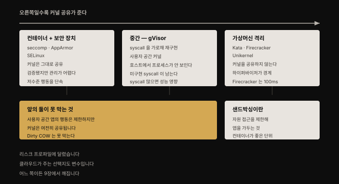
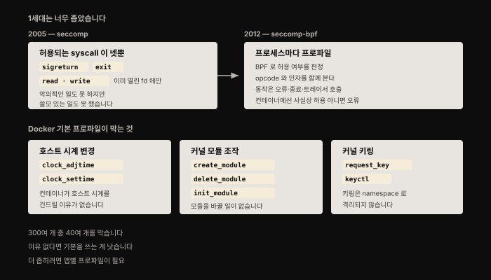
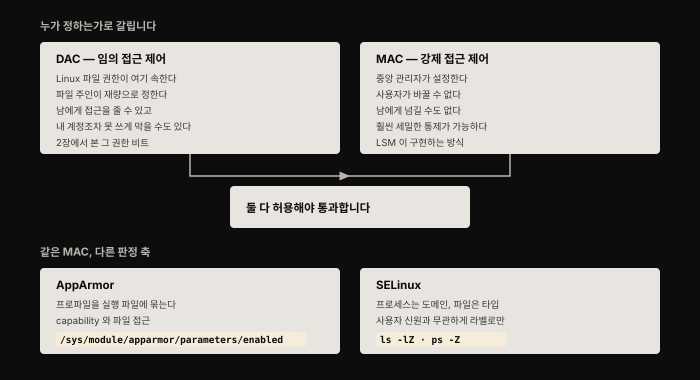
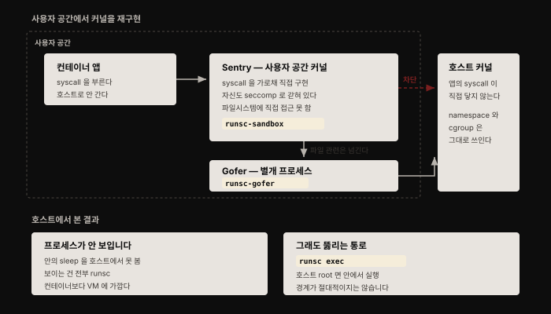

# 컨테이너 격리 강화 — 샌드박싱의 세 갈래
---
> 3장과 4장에서 컨테이너가 같은 호스트 위에서도 워크로드 사이에 어느 정도 분리를 만든다는 것을 봤습니다. 이 장은 그 격리를 **더 강하게 만드는 고급 수단**을 다룹니다.

## 핵심 요약

두 워크로드가 서로 간섭하지 못하게 하는 접근은 둘입니다. **서로를 인식하지 못하게 격리**하거나, 인식하더라도 **취할 수 있는 행동을 제한**하는 것입니다. 후자, 즉 자원 접근을 제한해 애플리케이션을 가두는 것이 **샌드박싱**입니다.

이 장의 수단들은 하나의 축 위에 놓입니다. seccomp·AppArmor·SELinux는 일반 컨테이너 위에 보안 장치를 덧대되 **커널은 그대로 공유**합니다. gVisor는 시스템 콜을 가로채 사용자 공간에서 다시 구현해 컨테이너와 VM 사이에 놓입니다. Kata·Firecracker·Unikernel은 하이퍼바이저 격리를 써서 **커널을 공유하지 않습니다**.


## 학습 목표

1. 샌드박싱이 무엇이고 왜 컨테이너가 그 편리한 단위인지 설명할 수 있습니다.
2. seccomp의 두 세대 차이와 BPF 필터의 판정 방식을 말할 수 있습니다.
3. 임의 접근 제어와 강제 접근 제어를 구분하고 AppArmor·SELinux의 판정 축 차이를 압니다.
4. gVisor의 Sentry·Gofer 구조와 그 한계 둘을 설명할 수 있습니다.
5. VM 기반 격리 세 가지가 부팅 시간 문제를 각각 어떻게 다루는지 비교할 수 있습니다.




## 1. 샌드박싱이라는 발상

애플리케이션을 컨테이너로 돌리면 **컨테이너 자체가 샌드박싱하기 편한 대상**이 됩니다. 컨테이너를 띄울 때마다 그 안에서 어떤 애플리케이션 코드가 돌아야 하는지를 알고 있기 때문입니다.

애플리케이션이 침해되면 공격자는 그 애플리케이션의 정상 동작을 벗어난 코드를 돌리려 할 것입니다. 샌드박싱 메커니즘을 쓰면 **그 코드가 할 수 있는 일을 제한**해 시스템에 영향을 줄 능력을 좁힐 수 있습니다. 저자가 "컨테이너가 편리한 객체"라고 표현한 이유가 여기 있습니다 — 정상 동작의 범위를 미리 안다는 것이 곧 프로파일을 만들 수 있다는 뜻입니다.


## 2. seccomp — 시스템 콜을 좁히다

[2장에서 본](./02-01.Linux%20%EC%8B%9C%EC%8A%A4%ED%85%9C%20%EC%BD%9C%C2%B7%EA%B6%8C%ED%95%9C%C2%B7capability%20%E2%80%94%20%EC%BB%A8%ED%85%8C%EC%9D%B4%EB%84%88%20%EB%B3%B4%EC%95%88%EC%9D%98%20%EB%B0%94%EB%8B%A5.md) 대로 시스템 콜은 애플리케이션이 커널에 작업을 요청하는 인터페이스입니다. **seccomp는 애플리케이션이 호출할 수 있는 시스템 콜의 집합을 제한하는 메커니즘**입니다.



### 1세대는 지나치게 좁았습니다

2005년 Linux 커널에 처음 들어간 seccomp("secure computing mode")에서는 이 모드로 전환한 프로세스가 아주 적은 시스템 콜만 쓸 수 있었습니다.

- `sigreturn` — 시그널 핸들러에서 복귀
- `exit` — 프로세스 종료
- `read`와 `write` — 다만 **보안 모드로 전환하기 전에 이미 열려 있던** 파일 디스크립터에 대해서만

신뢰할 수 없는 코드를 이 모드에서 돌리면 악의적인 일을 해낼 수 없었습니다. 그런데 부작용이 있었습니다. **쓸모 있는 일도 거의 아무것도 할 수 없었습니다.** 샌드박스가 지나치게 제한적이었던 것입니다.

### 2세대 — seccomp-bpf

2012년 커널에 **seccomp-bpf**라는 새 접근이 추가됐습니다. Berkeley Packet Filter를 써서 프로세스에 적용된 seccomp 프로파일을 근거로 특정 시스템 콜이 허용되는지를 판정합니다. **프로세스마다 자기 프로파일을 가질 수 있습니다.**

BPF seccomp 필터는 시스템 콜 opcode와 호출 인자를 함께 보고 판정합니다. 저자는 여기서 한 겹 더 정확하게 짚습니다. 프로파일은 단순히 허용·차단이 아니라 **syscall이 필터에 걸렸을 때 무엇을 할지**를 지정하며, 가능한 동작에는 오류 반환, 프로세스 종료, 트레이서 호출이 있습니다. 다만 컨테이너 세계의 대부분 용도에서는 허용하거나 오류를 반환하는 둘 중 하나라, **화이트리스트 또는 블랙리스트로 생각해도 무방합니다**.

### 컨테이너가 부를 이유가 없는 시스템 콜들

이 방식이 컨테이너 세계에서 특히 유용한 이유가 있습니다. 컨테이너화된 애플리케이션이 **아주 예외적인 상황이 아니면 시도할 이유가 없는** 시스템 콜이 여럿이기 때문입니다.

| 막는 대상 | 시스템 콜 | 왜 |
|----------|----------|-----|
| 호스트 시계 변경 | `clock_adjtime` · `clock_settime` | 컨테이너 앱이 호스트 머신의 시각을 바꿀 이유가 없습니다 |
| 커널 모듈 조작 | `create_module` · `delete_module` · `init_module` | 컨테이너가 커널 모듈을 변경할 일이 없습니다 |
| 커널 키링 접근 | `request_key` · `keyctl` | Linux 커널의 키링은 **namespace로 격리되지 않습니다** |

세 번째가 특히 중요합니다. namespace로 격리되지 않는다는 것은 컨테이너 안에서 접근하면 호스트 전체의 키링에 닿는다는 뜻입니다.

**Docker 기본 seccomp 프로파일은 300개가 넘는 syscall 중 40개 이상을 막습니다**(위 예시 전부 포함). 그러면서도 대다수 컨테이너 앱에 나쁜 영향이 없습니다. 저자의 권고는 분명합니다 — 그러지 않을 이유가 없다면 이 기본 프로파일을 쓰는 것이 좋습니다.

> **원문 정오**: 원문은 "Kubernetes에서는 seccomp 프로파일이 기본 적용되지 않으며, 집필 시점에 seccomp 지원은 **Alpha 기능**이고 **PodSecurityPolicy 객체의 애노테이션**으로 적용한다"고 적었습니다. 지금은 둘 다 바뀌었습니다. seccomp는 **Kubernetes v1.19에서 stable(GA)** 이 됐고, 애노테이션 대신 `securityContext.seccompProfile` 필드를 씁니다. PodSecurityPolicy 자체가 제거됐습니다. 자세한 것은 심화 학습에서 다룹니다.

### 앱에 맞춘 프로파일 만들기

기본 프로파일보다 더 좁히고 싶을 수 있습니다. 이상적으로는 **애플리케이션마다 필요한 syscall만 정확히 허용하는** 맞춤 프로파일이 있어야 합니다. 원문이 제시하는 접근은 셋입니다.

- **`strace`로 추적** — 애플리케이션이 부르는 모든 시스템 콜을 뽑아냅니다. Jess Frazelle이 Docker 기본 seccomp 프로파일을 만들고 테스트할 때 쓴 방법입니다.
- **eBPF 기반 도구** — seccomp가 BPF를 쓴다는 점을 생각하면, 확장판인 eBPF로 syscall 목록을 얻는 것이 자연스럽습니다. `falco2seccomp`나 `Tracee` 같은 도구가 컨테이너가 만들어 내는 시스템 콜을 나열해 줍니다.
- **상용 도구** — 직접 만드는 것이 부담이면, 개별 워크로드를 관찰해 맞춤 seccomp 프로파일을 자동 생성하는 상용 컨테이너 보안 도구를 고려할 수 있습니다.

> 원문의 NOTE 하나가 인상적입니다. Jess Frazelle이 `contained.af`에서 seccomp 프로파일로 컨테이너+seccomp 격리의 강도를 시연했는데, 수년간의 시도에도 집필 시점까지 뚫리지 않았다고 적습니다.


## 3. AppArmor와 SELinux — 강제 접근 제어

**AppArmor**("Application Armor")는 Linux 커널에서 활성화할 수 있는 여러 **LSM**(Linux Security Module) 중 하나입니다. AppArmor에서는 프로파일을 실행 파일에 연결해, 그 파일이 **capability와 파일 접근 권한** 측면에서 무엇을 할 수 있는지를 정합니다. 둘 다 2장에서 다룬 개념입니다.

커널에서 AppArmor가 켜져 있는지는 `/sys/module/apparmor/parameters/enabled` 파일을 보면 됩니다. `y`가 있으면 활성 상태입니다.



### 누가 정하는가 — DAC와 MAC

AppArmor를 비롯한 LSM은 **강제 접근 제어**(mandatory access control)를 구현합니다. 강제 접근 제어는 **중앙 관리자가 설정**하며, 한번 설정되면 다른 사용자가 그 제어를 수정하거나 남에게 넘길 수 없습니다.

이것이 Linux 파일 권한과 대비됩니다. 파일 권한은 **임의 접근 제어**(discretionary access control)입니다. 내 계정이 파일을 소유하고 있으면 다른 사용자에게 접근을 줄 수 있고(강제 접근 제어가 덮어쓰지 않는 한), 실수로 고치는 것을 막으려고 내 계정조차 쓰지 못하게 만들 수도 있습니다. **권한을 쥔 쪽의 재량**이라는 뜻입니다.

강제 접근 제어를 쓰면 관리자가 시스템에서 무엇이 일어날 수 있는지를 훨씬 세밀하게 통제할 수 있고, **개별 사용자가 이를 뒤집을 수 없습니다**.

### complain 모드 — 프로파일을 길들이는 법

AppArmor에는 **complain 모드**가 있습니다. 실행 파일을 프로파일에 대고 돌리면 위반 사항이 로그로 남습니다. 이 로그로 프로파일을 갱신해 나가다가, 마침내 새 위반이 보이지 않는 시점에 프로파일을 **강제(enforce)로 전환**한다는 발상입니다.

프로파일이 준비되면 `/etc/apparmor` 디렉토리에 설치하고 `apparmor_parser`로 로드합니다. 로드된 프로파일은 `/sys/kernel/security/apparmor/profiles`에서 확인합니다. 컨테이너에 적용하려면 다음처럼 실행합니다.

```bash
docker run --security-opt="apparmor:<profile name>" ...
```

Containerd와 CRI-O도 AppArmor를 지원합니다.

### SELinux — 라벨로 판정합니다

**SELinux**도 LSM의 한 종류로, Red Hat이 개발했습니다. 이름은 "Security-Enhanced Linux"의 줄임말입니다. 저자는 위키피디아를 근거로 그 뿌리가 미국 국가안보국의 프로젝트에 있다고 덧붙입니다. 호스트에서 RHEL이나 CentOS 같은 Red Hat 계열 배포판을 돌리고 있다면 SELinux가 이미 켜져 있을 가능성이 높습니다.

SELinux는 프로세스가 파일 및 다른 프로세스와 상호작용할 때 무엇을 할 수 있는지를 제약합니다. 각 프로세스는 **SELinux 도메인** 아래에서 돌고(프로세스가 도는 컨텍스트라고 생각하면 됩니다), 모든 파일에는 **타입**이 있습니다. 확인 방법은 이렇습니다.

```bash
ls -lZ    # 파일의 SELinux 정보
ps -Z     # 프로세스의 SELinux 정보
```

**SELinux 권한과 일반 DAC 권한의 핵심 차이는 사용자 신원과 아무 관련이 없다는 점입니다.** 전적으로 라벨로 기술됩니다. 다만 둘은 함께 작동하므로, **어떤 동작이든 DAC와 SELinux 양쪽 모두가 허용해야** 수행됩니다.

정책을 강제하려면 머신의 모든 파일에 SELinux 정보가 라벨링돼 있어야 합니다. 정책은 특정 도메인의 프로세스가 특정 타입의 파일에 어떤 접근을 갖는지를 규정합니다. 실무적으로는 **애플리케이션이 자기 파일에만 접근하도록 제한하고 다른 프로세스가 그 파일에 접근하지 못하게** 만들 수 있다는 뜻입니다. 애플리케이션이 침해돼도 영향을 줄 수 있는 파일의 범위가 좁아집니다. **일반적인 임의 접근 제어라면 허용했을 접근까지 막힙니다.** SELinux에도 정책 위반을 강제하는 대신 로그로 남기는 모드가 있습니다.

효과적인 SELinux 프로파일을 만들려면 애플리케이션이 정상 경로와 오류 경로 양쪽에서 접근할 파일 집합을 깊이 알아야 합니다. 그래서 저자는 이 일이 **앱 개발자의 몫으로 남는 편이 낫다**고 봅니다. 일부 벤더는 자사 애플리케이션용 프로파일을 제공합니다.

### 셋의 공통 한계

seccomp·AppArmor·SELinux는 모두 프로세스의 행동을 **저수준에서 단속**합니다. 그런데 여기에 공통된 부담이 있습니다.

필요한 시스템 콜이나 capability의 정확한 집합으로 완전한 프로파일을 만드는 일은 어렵습니다. 게다가 **애플리케이션이 조금만 바뀌어도 프로파일을 크게 고쳐야** 할 수 있습니다. 앱이 변할 때마다 프로파일을 맞춰 두는 관리 부담이 커지고, 인간의 본성상 **느슨한 프로파일을 쓰거나 아예 꺼 버리는 쪽으로 흐르는 경향**이 생깁니다. 저자가 요약에서 이 셋을 "검증되고 실전을 거쳤지만 효과적으로 관리하기 어렵기로 유명하다"고 적은 이유입니다.

그래서 앱별 프로파일을 만들 여력이 없다면 **Docker 기본 seccomp·AppArmor 프로파일이 유용한 가드레일**이 됩니다.

> 여기서 저자가 짚는 한계가 이 장 전반부의 결론입니다. 이 보호 장치들은 **사용자 공간 애플리케이션이 할 수 있는 일을 제한할 뿐, 커널은 여전히 공유됩니다.** Dirty COW 같은 **커널 자체의 취약점은 이 도구들 중 어느 것으로도 막지 못합니다.**


## 4. gVisor — 사용자 공간에서 커널을 다시 구현하다

Google의 **gVisor**는 하이퍼바이저가 게스트 VM의 시스템 콜을 가로채는 것과 거의 같은 방식으로 컨테이너를 샌드박싱합니다.

gVisor 문서는 스스로를 **"사용자 공간 커널"**(user-space kernel)이라 부릅니다. 저자는 이것이 용어상 모순처럼 들린다면서도, 여러 Linux 시스템 콜이 **반가상화**를 통해 사용자 공간에서 구현된다는 뜻이라고 설명합니다.

5장에서 본 대로 반가상화는 원래 호스트 커널이 실행했을 명령을 다시 구현하는 것입니다.



### Sentry와 Gofer

구조는 이렇습니다. **Sentry**라는 gVisor 구성 요소가 애플리케이션의 syscall을 가로챕니다. Sentry 자신도 seccomp로 강하게 샌드박싱되어 있어서 **파일시스템 자원에 직접 접근하지 못합니다**. 파일 접근과 관련된 시스템 콜이 필요하면 **Gofer**라는 완전히 별개의 프로세스로 넘깁니다.

파일시스템 접근과 무관한 시스템 콜도 호스트 커널로 그대로 전달되지 않습니다. **Sentry 안에서 다시 구현됩니다.** 저자의 표현으로 본질적으로 사용자 공간에서 도는 게스트 커널입니다.

### 직접 관찰한 결과

gVisor 프로젝트는 OCI 형식 번들과 호환되는 `runsc` 실행 파일을 제공합니다. 6장에서 만난 일반 `runc` OCI 런타임과 거의 같게 동작합니다. 원문은 Alpine 번들로 직접 실행해 봅니다.

```bash
cd alpine-bundle
mv config.json config.json.runc
runsc spec
sudo runsc run sh
```

두 번째 터미널에서 `runsc list`와 `runsc ps <ID>`로 컨테이너와 그 안의 프로세스를 확인할 수 있습니다. 컨테이너 안에서 `sleep`을 돌려 두면 `runsc ps`에는 그 `sleep`이 보입니다.

**흥미로운 것은 호스트 관점으로 넘어갔을 때입니다.** `ps fax`로 보면 `runsc run` 프로세스가 두 프로세스를 낳았습니다. 하나는 Gofer(`runsc-gofer`)이고 다른 하나는 `runsc-sandbox`인데 문서에서 Sentry라 부르는 것입니다. sandbox에는 자식이 있고 그 자식에게 다시 셋의 자식이 있습니다. 이 자식·손자 프로세스의 정보를 호스트에서 보면 **넷 모두 `runsc` 실행 파일을 돌리고 있습니다**.

주목할 점은 이 프로세스들 중 어느 것도 **컨테이너 안에서 돌고 있음을 아는 `sleep` 실행 파일을 가리키지 않는다**는 것입니다. 호스트에서 직접 찾아도 나오지 않습니다.

```bash
sudo ps -eaf | grep sleep
```

`grep` 자기 자신 말고는 아무것도 잡히지 않습니다. **gVisor 샌드박스 안의 프로세스를 호스트에서 볼 수 없다는 것**은 일반 컨테이너보다 VM의 동작에 훨씬 가깝습니다. 그리고 이것이 샌드박스 안 프로세스에 추가 보호를 줍니다. **공격자가 호스트에서 root를 얻어도 호스트와 실행 중인 프로세스 사이에 비교적 강한 경계가 남습니다.**

> 다만 저자가 곧바로 단서를 답니다. `runsc` 명령 자체가 없었다면 그랬을 것이라는 말입니다. `runsc`에는 `exec` 하위 명령이 있어서, **호스트의 root로 실행 중인 컨테이너 안에서 작업할 수 있습니다.** 경계가 절대적이지는 않다는 뜻입니다.

### 두 가지 한계

이 격리가 강력해 보이지만 원문은 유의미한 한계 둘을 명시합니다.

| 한계 | 내용 |
|------|------|
| **미구현 syscall** | 모든 Linux syscall이 gVisor에 구현돼 있지는 않습니다. 앱이 미구현 syscall을 쓰려 하면 gVisor 안에서 돌 수 없습니다. 집필 시점 기준 **97개**가 gVisor에서 제공되지 않았고, 이는 Docker 기본 seccomp 프로파일이 막는 **약 44개**와 대비됩니다 |
| **성능** | 많은 경우 `runc`에 거의 근접하지만, **앱이 시스템 콜을 많이 부르면 성능에 영향**이 갈 수 있습니다. gVisor 프로젝트가 성능 가이드를 제공합니다 |

여기에 하나가 더 붙습니다. gVisor는 커널을 다시 구현하기 때문에 **크고 복잡하며, 그 복잡성 자체가 자기 취약점을 포함할 상대적으로 높은 가능성**을 시사합니다. 원문은 Max Justicz가 발견한 권한 상승 사례를 예로 듭니다.

마지막으로 범위를 분명히 합니다. **gVisor가 바꾸는 것은 애플리케이션이 시스템 콜에 접근하는 방식뿐입니다.** namespace, cgroup, 루트 변경은 여전히 컨테이너를 격리하는 데 쓰입니다.


## 5. VM 격리를 빌려 오는 세 방식

### Kata Containers — 컨테이너를 VM 안에서

4장에서 본 것처럼 일반 컨테이너를 돌리면 컨테이너 런타임이 **호스트 안에서 새 프로세스**를 시작합니다. Kata Containers의 발상은 **컨테이너를 별도의 가상머신 안에서 돌리는 것**입니다. 이 접근은 일반 OCI 형식 컨테이너 이미지에서 애플리케이션을 돌리면서도 **가상머신의 격리를 전부** 얻게 해 줍니다.

Kata는 컨테이너 런타임과 애플리케이션 코드가 도는 별도 대상 호스트 사이에 **프록시**를 씁니다. 런타임 프록시가 QEMU로 별도 가상머신을 만들어 대신 컨테이너를 돌립니다.

Kata에 대한 비판 하나는 **가상머신이 부팅되기를 기다려야 한다**는 것입니다. 그래서 다음 주제가 나옵니다.

### Firecracker — 100ms에 뜨는 VM

5장의 "가상머신의 단점"에서 본 대로 VM은 시작이 느려서, 컨테이너에서 흔히 도는 **단명 워크로드에는 적합하지 않습니다**. 그런데 아주 빨리 부팅되는 가상머신이 있다면 어떨까요.

**Firecracker**는 하이퍼바이저를 통한 안전한 격리와 커널 비공유의 이점을 주면서 **시작 시간이 100ms 안팎**이라 컨테이너에 훨씬 적합합니다. AWS가 Lambda와 Fargate 서비스에 (저자의 이해로는 점진적으로) 채택하면서 **실전에서 단련되고 있다**는 이점도 있습니다.

이렇게 빨리 뜨는 이유는 설계자들이 **일반적으로 커널에 포함되지만 컨테이너에는 필요 없는 기능을 걷어냈기** 때문입니다. 시스템 부팅에서 가장 느린 부분 중 하나가 **장치 열거**인데, 컨테이너화된 애플리케이션이 많은 장치를 쓸 이유는 드뭅니다. 절감의 대부분은 필수 장치만 남긴 **최소 장치 모델**에서 나옵니다.

Firecracker는 사용자 공간에서 돌며, Firecracker VMM 아래 돌 게스트를 설정하는 **REST API**를 제공합니다. 게스트 OS에 **KVM 기반 하드웨어 가상화**를 쓰기 때문에, 노트북의 Type 2 기반 게스트 OS 안에서는 돌릴 수 없습니다. 하드웨어와 소프트웨어 조합이 **중첩 가상화**를 지원하지 않는 한 그렇습니다.

### Unikernel — 필요한 부분만 남긴 OS

가상머신 이미지에서 도는 운영체제는 어떤 애플리케이션에나 재사용할 수 있는 **범용** 제품입니다. 앱이 그 운영체제의 모든 기능을 쓸 가능성은 낮습니다. **쓰지 않는 부분을 덜어낼 수 있다면 공격 표면이 작아집니다.**

Unikernel의 발상은 **애플리케이션과 그 앱이 필요로 하는 운영체제 부분만으로 이뤄진 전용 머신 이미지**를 만드는 것입니다. 이 머신 이미지는 하이퍼바이저 위에서 직접 돌 수 있어 일반 VM과 같은 수준의 격리를 주면서, Firecracker에서 본 것과 비슷한 **가벼운 시작 시간**을 냅니다.

모든 애플리케이션은 동작에 필요한 모든 것을 갖춘 Unikernel 이미지로 컴파일돼야 합니다. 하이퍼바이저는 표준 Linux VM 이미지를 부팅하듯 이 머신을 띄웁니다.

IBM의 **Nabla** 프로젝트가 컨테이너에 Unikernel 기법을 씁니다. Nabla 컨테이너는 **오직 7개의 시스템 콜**만 쓰는 극도로 제한된 집합을 사용하고, 이를 seccomp 프로파일로 단속합니다. 애플리케이션의 다른 모든 시스템 콜은 Unikernel 라이브러리 OS 구성 요소 안에서 처리됩니다. **커널의 아주 적은 부분만 접근**해 공격 표면을 줄이는 것입니다. 단점은 **애플리케이션을 Nabla 컨테이너 형태로 다시 빌드해야** 한다는 점입니다.


## 6. 무엇을 고를 것인가

저자는 요약에서 이 장의 선택지를 세 범주로 정리합니다.

| 범주 | 수단 | 성격 |
|------|------|------|
| 일반 컨테이너 + 보안 장치 | seccomp · AppArmor · SELinux | **검증되고 실전을 거쳤지만**, 효과적으로 관리하기 어렵기로 유명합니다 |
| 가상머신 격리 | Firecracker · Unikernel | 새로운 해법으로, VM의 격리를 줍니다 |
| 그 중간 | gVisor | 컨테이너와 VM 사이 어딘가에 놓이는 샌드박싱 |

무엇이 맞는지는 **리스크 프로파일**에 달렸고, 쓰고 있는 퍼블릭 클라우드나 관리형 솔루션이 제공하는 선택지에 영향을 받습니다.

> 그리고 저자는 이 장을 경고로 닫습니다. **어떤 컨테이너 런타임을 쓰고 그것이 어떤 격리를 강제하든, 사용자가 그 격리를 쉽게 침해할 수 있는 방법들이 있습니다.** 9장이 그 방법들을 다룹니다.


## 심화 학습

> 이 절은 책 밖 보강입니다. 1판은 2020년 기준이고, 이 장은 **Kubernetes 쪽 서술이 특히 크게 바뀌었습니다**. 아래는 2026년 8월 기준 1차 자료로 확인한 내용입니다.

### seccomp·AppArmor가 애노테이션을 벗어나 정식 필드가 됐습니다

이 장에서 저자가 두 번 반복한 아쉬움이 있습니다. Docker는 기본 프로파일을 쓰는데 **Kubernetes는 기본 적용을 안 하고, 애노테이션으로 붙여야 한다**는 것입니다. 그 서술이 지금은 성립하지 않습니다.

| 항목 | 원문(2020) | 현재 | 근거 |
|------|-----------|------|------|
| seccomp 지원 | **Alpha** 기능 | **v1.19 stable(GA)** | Kubernetes 공식 문서[^seccomp] |
| seccomp 적용 방법 | PodSecurityPolicy **애노테이션** | `securityContext.seccompProfile` 필드 | 같은 문서 |
| AppArmor 지원 | 애노테이션 필요 | **v1.31 stable**, 기본 활성 | Kubernetes 공식 문서[^apparmor] |
| AppArmor 적용 방법 | 애노테이션 | `securityContext.appArmorProfile` 필드(v1.30+) | 같은 문서 |

지금은 이렇게 씁니다.

```yaml
spec:
  securityContext:
    seccompProfile:
      type: RuntimeDefault
    appArmorProfile:
      type: RuntimeDefault
```

**다만 저자의 문제의식 자체는 여전히 유효합니다.** `RuntimeDefault`가 자동으로 붙지는 않습니다. kubelet에 `seccompDefault` 설정을 켜야 프로파일을 지정하지 않은 Pod가 `RuntimeDefault`를 쓰고, 그렇지 않으면 기본값은 여전히 **`Unconfined`**(제약 없음)입니다. 즉 "Kubernetes는 기본으로 seccomp를 안 건다"는 지적은 **켜는 방법이 생겼을 뿐 기본값은 그대로**입니다.

### 프로젝트 지형 — 하나는 archive, 하나는 방치

| 원문의 언급 | 2026년 8월 상태 |
|------------|----------------|
| gVisor | 활발 (19.0k stars, 최근 커밋 2026-08-08) |
| Kata Containers | 활발 (8.5k stars, 2026-08-07) |
| Firecracker | 활발 (35.9k stars, 2026-08-07) |
| **Nabla (`runnc`)** | **아카이브됨.** 마지막 커밋 2021-09-14 |
| **`bane`** (AppArmor 프로파일 생성 도구) | 아카이브는 아니지만 **2020-09 이후 커밋 없음** |

원문이 AppArmor 프로파일 작성 도구로 권한 `bane`은 6년째 멈춰 있고, Unikernel 컨테이너의 대표 사례로 든 Nabla는 아카이브됐습니다. **Unikernel 접근 자체가 컨테이너 진영에서 주류가 되지 못했다**는 신호로 읽는 편이 정확합니다. 반면 VM 격리 축에서는 Firecracker와 Kata가 살아남았습니다 — 저자가 지적한 "다시 빌드해야 한다"는 Nabla의 단점이 결국 채택의 벽이 됐다고 볼 수 있습니다.

### syscall 개수로 호환성을 재지 말라 — gVisor 자신의 경고

원문은 gVisor의 한계를 "미구현 syscall 97개 vs Docker seccomp 차단 44개"라는 숫자 대비로 설명했습니다. 지금 gVisor 공식 문서는 **그 방식의 비교를 명시적으로 경계합니다**.[^gvisor]

공식 문서는 gVisor가 "Linux syscall ABI의 부분집합만 구현"하며 미구현분은 "대부분 gVisor가 이미 지원하는 syscall의 대안"이라고 설명한 뒤, **지원 syscall 목록을 훑는 것이 실제 호환성의 좋은 척도가 아니라고** 못 박습니다. 대부분의 언어 런타임이 사용 가능한 syscall 변종을 자동으로 탐지해 고르기 때문입니다.

즉 원문의 숫자는 그 시점의 사실이지만, **그 숫자로 "97개나 못 쓴다"고 읽으면 과장**이 됩니다. 판단 기준은 개수가 아니라 "내 앱이 실제로 도는가"입니다.


## 결정 치트시트

| 상황 | 판단 | 근거 |
|------|------|------|
| 앱별 프로파일 만들 여력이 없다 | Docker 기본 seccomp·AppArmor를 그대로 | 40여 개를 막으면서 대부분의 앱에 무해 |
| Kubernetes를 쓰는 중 | `seccompProfile: RuntimeDefault`를 명시 | 안 쓰면 기본값이 `Unconfined` |
| 프로파일을 새로 만들어야 한다 | complain 모드·`strace`·eBPF로 관찰부터 | 추측으로 만들면 앱이 깨짐 |
| 커널 취약점까지 걱정된다 | seccomp·LSM으로는 부족 → VM 격리 | 셋 다 커널을 공유, Dirty COW를 못 막음 |
| 멀티테넌트에 신뢰 못 할 코드를 돌린다 | gVisor 또는 Kata·Firecracker | 호스트 root에서도 프로세스가 안 보이는 수준 |
| syscall을 많이 부르는 앱 | gVisor는 성능 확인 필요 | syscall 경로가 전부 재구현됨 |
| VM 부팅 지연이 문제 | Firecracker | 100ms 안팎, 최소 장치 모델 |
| 앱을 다시 빌드할 수 있다 | Unikernel도 후보였음 | 단 Nabla는 현재 아카이브 |


## 면접에서 받을 만한 질문

1. seccomp가 2005년 처음 나왔을 때와 2012년 seccomp-bpf는 무엇이 달랐습니까?
2. 임의 접근 제어와 강제 접근 제어의 차이는 무엇이고, 둘은 어떻게 함께 작동합니까?
3. gVisor에서 컨테이너 안 프로세스가 호스트의 `ps`에 안 보이는 이유는 무엇입니까? 그렇다면 경계가 완전합니까?
4. seccomp·AppArmor·SELinux를 다 걸어도 막지 못하는 공격은 무엇입니까?
5. Firecracker가 일반 VM보다 훨씬 빨리 뜨는 이유는 무엇입니까?


## 정답

**1.** 1세대는 전환한 프로세스가 **`sigreturn`·`exit`·`read`·`write` 넷만** 쓸 수 있었고, `read`/`write`조차 **전환 전에 이미 열려 있던 fd**에만 가능했습니다. 악의적인 일도 못 하지만 쓸모 있는 일도 거의 못 하는 지나치게 좁은 샌드박스였습니다. seccomp-bpf는 **BPF로 프로세스마다 프로파일**을 갖게 해, syscall opcode와 인자를 보고 판정합니다. 동작은 오류 반환·프로세스 종료·트레이서 호출이지만 컨테이너에서는 사실상 허용/오류 둘입니다.

**2.** DAC는 **파일 주인의 재량**입니다. 내 파일이면 남에게 접근을 주거나 내 계정조차 막을 수 있습니다. MAC는 **중앙 관리자가 설정**하고 사용자가 수정하거나 남에게 넘길 수 없습니다. 둘은 함께 작동해서 **양쪽 모두가 허용해야** 동작이 수행됩니다. SELinux 권한은 사용자 신원과 무관하게 **라벨(도메인·타입)로만** 판정한다는 점이 DAC와 다릅니다.

**3.** 시스템 콜이 **Sentry 안에서 재구현**되고 호스트 커널로 전달되지 않기 때문입니다. 호스트에서 보이는 것은 `runsc` 실행 파일을 돌리는 프로세스들뿐이고, 컨테이너 안의 `sleep`은 `ps -eaf | grep sleep`으로도 안 잡힙니다. 일반 컨테이너보다 VM에 가까운 모습입니다. 다만 **경계는 완전하지 않습니다** — `runsc exec`로 호스트 root가 실행 중인 컨테이너 안에서 명령을 돌릴 수 있습니다.

**4.** **커널 자체의 취약점**입니다. 이 셋은 사용자 공간 애플리케이션이 할 수 있는 일을 제한할 뿐 **커널은 여전히 공유**됩니다. 원문이 든 예가 Dirty COW입니다. 이걸 막으려면 커널을 공유하지 않는 VM 기반 격리(Kata·Firecracker·Unikernel)로 가야 합니다.

**5.** 커널에 일반적으로 포함되지만 **컨테이너에는 필요 없는 기능을 걷어냈기** 때문입니다. 부팅에서 가장 느린 부분 중 하나가 **장치 열거**인데 컨테이너 앱은 많은 장치를 쓸 이유가 드뭅니다. 절감의 대부분은 필수 장치만 남긴 **최소 장치 모델**에서 옵니다. 그 결과 시작 시간이 100ms 안팎입니다.


## 핵심 개념 체크리스트

- [ ] 샌드박싱의 정의와 컨테이너가 그 단위로 편리한 이유를 말할 수 있다
- [ ] seccomp 1세대의 네 syscall과 그것이 왜 부족했는지 안다
- [ ] BPF 필터가 opcode와 인자를 보고 판정한다는 것과 가능한 동작 셋을 안다
- [ ] Docker 기본 프로파일이 막는 대표 syscall 셋과 각각의 이유를 안다
- [ ] DAC와 MAC를 구분하고 둘이 함께 작동함을 설명할 수 있다
- [ ] AppArmor의 complain 모드가 프로파일을 만드는 절차임을 안다
- [ ] SELinux가 도메인·타입 라벨로 판정하며 사용자 신원과 무관함을 안다
- [ ] Sentry와 Gofer의 역할 분담을 설명할 수 있다
- [ ] gVisor의 한계 둘(미구현 syscall·성능)과 자체 복잡성 문제를 안다
- [ ] Kata·Firecracker·Unikernel이 부팅 시간 문제를 각각 어떻게 다루는지 비교할 수 있다


## 참고 자료

- 《Container Security: Fundamental Technology Concepts that Protect Containerized Applications》(Liz Rice, O'Reilly, 2020, 1판) Chapter 8 — 이 노트의 원문
- [Kubernetes — Restrict a Container's Syscalls with seccomp](https://kubernetes.io/docs/tutorials/security/seccomp/) — seccomp GA 상태와 `seccompProfile` 필드
- [Kubernetes — Restrict a Container's Access to Resources with AppArmor](https://kubernetes.io/docs/tutorials/security/apparmor/) — AppArmor stable 상태와 `appArmorProfile` 필드
- [gVisor — Compatibility](https://gvisor.dev/docs/user_guide/compatibility/) — syscall 개수로 호환성을 재지 말라는 공식 설명
- [02-01. Linux 시스템 콜·권한·capability](./02-01.Linux%20%EC%8B%9C%EC%8A%A4%ED%85%9C%20%EC%BD%9C%C2%B7%EA%B6%8C%ED%95%9C%C2%B7capability%20%E2%80%94%20%EC%BB%A8%ED%85%8C%EC%9D%B4%EB%84%88%20%EB%B3%B4%EC%95%88%EC%9D%98%20%EB%B0%94%EB%8B%A5.md) — 이 장이 제한하는 syscall과 capability의 원리
- [05-01. 가상머신](./05-01.%EA%B0%80%EC%83%81%EB%A8%B8%EC%8B%A0%20%E2%80%94%20%EC%99%9C%20VM%20%EA%B2%A9%EB%A6%AC%EA%B0%80%20%EB%8D%94%20%EA%B0%95%ED%95%98%EB%8B%A4%EA%B3%A0%20%ED%95%98%EB%8A%94%EA%B0%80.md) — 반가상화와 VM 부팅 비용, 이 장 후반부의 전제
- [Container Security 정독 인덱스](./README.md) — 이 책의 장별 진행 상태

[^seccomp]: Kubernetes 공식 문서 "Restrict a Container's Syscalls with seccomp" — `FEATURE STATE: Kubernetes v1.19 [stable]`, `securityContext.seccompProfile` 필드, `seccompDefault` kubelet 설정이 없으면 기본값이 `Unconfined`라는 서술을 확인했습니다(2026-08-09 조회). <https://kubernetes.io/docs/tutorials/security/seccomp/>

[^apparmor]: Kubernetes 공식 문서 "Restrict a Container's Access to Resources with AppArmor" — `FEATURE STATE: Kubernetes v1.31 [stable]`(기본 활성), v1.30 이전의 애노테이션 방식이 `securityContext.appArmorProfile`로 대체됐다는 서술을 확인했습니다(2026-08-09 조회). <https://kubernetes.io/docs/tutorials/security/apparmor/>

[^gvisor]: gVisor 공식 문서 "Compatibility" — "gVisor only implements a subset of the Linux syscall ABI"와 지원 syscall 목록이 실제 호환성의 좋은 척도가 아니라는 설명을 확인했습니다(2026-08-09 조회). <https://gvisor.dev/docs/user_guide/compatibility/>
