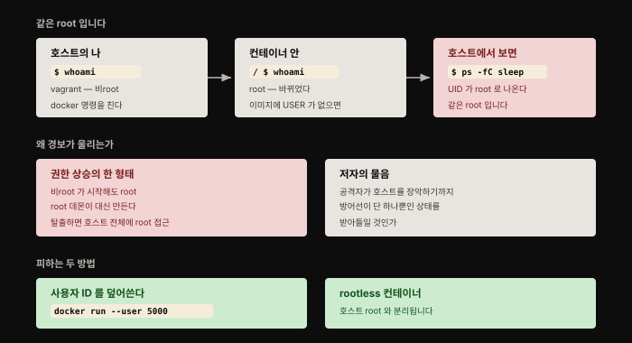
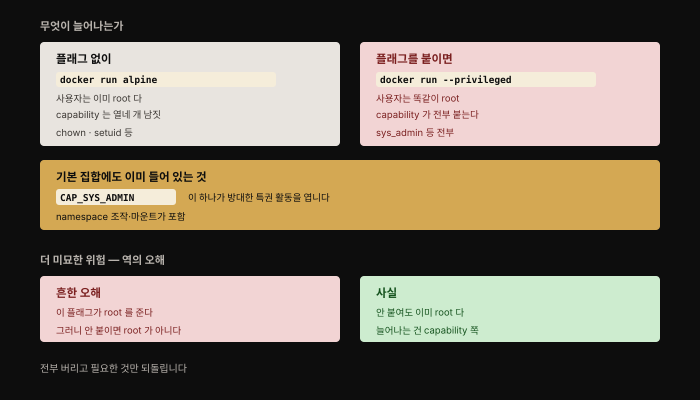
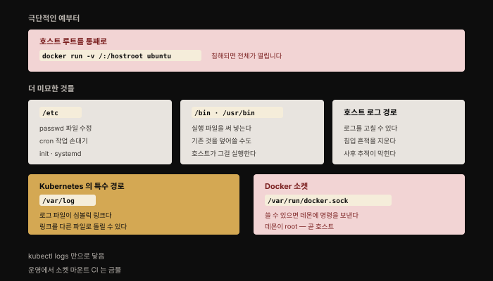
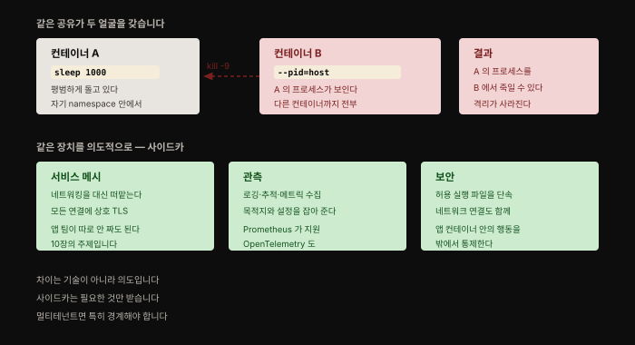

# 컨테이너 격리 깨뜨리기 — 설정 하나로 무너지는 경계
---
> 4장에서 컨테이너가 어떻게 만들어지고 머신에 대해 제한된 시야를 갖는지 봤습니다. 이 장은 그 격리가 **사실상 깨지도록 설정하는 일이 얼마나 쉬운지**를 보여 줍니다.

## 핵심 요약

이 장의 설정들은 **전부 정당한 이유로 제공됩니다**. 사이드카에 네트워킹을 넘기려고 namespace를 공유하고, CI가 이미지를 빌드하려고 Docker 소켓을 마운트합니다. 문제는 같은 장치가 **취약점 하나 없이도 컨테이너 탈출을 가능하게** 만든다는 데 있습니다.

출발점은 이 세계에서 가장 위험한 기본값입니다. **컨테이너는 기본으로 root로 돕니다.** 그리고 user namespace를 쓰지 않는 한 그 root는 **호스트의 root와 같습니다**.


## 학습 목표

1. 컨테이너 안의 root가 왜 호스트의 root와 같은지 직접 확인하는 방법을 압니다.
2. `--privileged`가 실제로 무엇을 바꾸는지 설명하고 흔한 오해를 반박할 수 있습니다.
3. 민감한 호스트 디렉토리 마운트가 만드는 탈출 경로를 열거할 수 있습니다.
4. Docker 소켓 접근이 왜 호스트 root와 등가인지 말할 수 있습니다.
5. 같은 namespace 공유가 위험이 되는 경우와 사이드카로 정당한 경우를 구분할 수 있습니다.




## 1. 컨테이너는 기본으로 root로 돕니다

이미지가 비root 사용자를 지정하지 않았고 실행할 때도 사용자를 주지 않으면, 컨테이너는 **기본적으로 root로 돕니다**. 여기서 한 걸음 더 나갑니다. user namespace를 쓰지 않는 한 이 root는 컨테이너 안에서만 root인 것이 아닙니다. **호스트의 root이기도 합니다.** 확인은 어렵지 않습니다.

비root 사용자로 Alpine 컨테이너 안에서 셸을 열고 신원을 확인해 봅니다.

```bash
whoami
# vagrant
docker run -it alpine sh
```

컨테이너 안에서 `whoami`를 치면 **`root`** 가 나옵니다. 비root 사용자가 `docker` 명령으로 컨테이너를 만들었는데도 안쪽 신원은 root입니다. 이것이 호스트의 root와 같은지 확인하려면 컨테이너 안에서 `sleep 100`을 돌려 두고 다른 터미널에서 조회합니다.

```bash
ps -fC sleep
# UID    PID   PPID  C STIME TTY      TIME CMD
# root 30619  30557  0 16:44 pts/0    00:00:00 sleep 100
```

**호스트 관점에서 이 프로세스의 소유자가 root입니다.** 컨테이너 안의 root가 호스트의 root입니다.

> `docker` 대신 `runc`를 쓰면 이 시연이 덜 극적입니다. `runc`로는 애초에 컨테이너를 돌리는 사람이 호스트에서 root여야 하기 때문입니다. 곧 다룰 rootless 컨테이너만 예외입니다. 이유는 하나입니다. **namespace를 만들 만큼의 capability를 가진 것이 대개 root뿐**입니다. Docker에서는 root로 도는 **Docker 데몬**이 그 일을 대신 해 줍니다.

비root 사용자가 시작했는데 컨테이너는 root로 돕니다. 이것 자체가 **권한 상승의 한 형태**입니다. 컨테이너가 root로 도는 것이 곧바로 사고는 아니지만, 보안 관점에서는 짚고 넘어갈 신호입니다.

공격자가 root로 도는 컨테이너를 탈출하면 **호스트에 대한 완전한 root 접근**을 얻습니다. 그 머신의 무엇이든 건드릴 수 있다는 뜻입니다. 그래서 저자는 이렇게 되묻습니다. 공격자가 호스트를 장악하기까지 **방어선이 하나뿐인 상태**를 감수하겠느냐고.

### 사용자 ID를 덮어쓰기

런타임에 사용자 ID를 지정해 이를 덮어쓸 수 있습니다. `runc`에서는 번들 안 `config.json`의 `process.user.uid`를 바꿉니다.

```json
"process": {
    "terminal": true,
    "user": {
        "uid": 5000
    }
}
```

`sudo`로 root로 실행해도 컨테이너의 사용자 ID는 5000이고, 호스트에서 확인하면 `UID` 열이 `5000`으로 나옵니다.

Docker 이미지도 같은 정보를 담고 있어 `--user` 옵션으로 덮어씁니다.

```bash
docker run -it --user 5000 ubuntu bash
# I have no name!@b7ca6ec82aa4:/$
```

이미지에 내장된 사용자 ID는 Dockerfile의 `USER` 명령으로 바꿉니다. 다만 저자가 짚는 현실이 있습니다. **공개 저장소의 대다수 컨테이너 이미지가 `USER` 설정이 없어 root로 돌게 구성돼 있습니다.** 사용자 ID가 지정되지 않으면 기본이 root입니다.

### 컨테이너 안에서 root가 필요하다고 여겨지는 이유

서버에서 직접 돌도록 설계됐던 소프트웨어를 그대로 감싼 이미지가 많습니다. Nginx가 그 예입니다. Docker가 유행하기 훨씬 전부터 있던 서버이고, 지금은 Docker Hub 이미지로도 제공됩니다. 그런데 **집필 시점의 표준 Nginx 이미지는 기본이 root**였습니다. `docker top`으로 보면 master 프로세스가 root로 돕니다.

이유가 있습니다. 서버에서 돌 때 nginx는 전통적인 웹 포트 80에서 요청을 받습니다. 2장에서 본 대로 **1024 미만의 낮은 번호 포트를 여는 데는 `CAP_NET_BIND_SERVICE`가 필요**합니다. 그것을 확실히 갖추는 가장 손쉬운 길이 root로 돌리는 것이었습니다.

그런데 **컨테이너에서는 이 요구가 훨씬 덜 합리적입니다.** 포트 매핑이 있으니 nginx 코드는 아무 포트에서나 듣고, 필요하면 그것을 호스트의 80번에 매핑하면 됩니다.

root 실행이 문제라는 것을 알아챈 벤더들이 지금은 비특권 사용자로 도는 이미지를 함께 내놓습니다. Nginx라면 `nginx-unprivileged` 저장소가 그것입니다. 애플리케이션에 따라서는 Dockerfile 몇 줄 고치는 것으로 끝나지 않고 코드까지 손봐야 합니다. 그 부담을 대신 진 곳도 있습니다. **Bitnami가 여러 인기 애플리케이션의 비root 이미지를 만들어 유지**하고 있습니다.

이미지가 root로 구성되는 또 다른 이유는 `yum`이나 `apt` 같은 패키지 관리자로 소프트웨어를 설치하기 위해서입니다. **이미지 빌드 중에는 완전히 타당합니다.** 다만 패키지 설치가 끝난 뒤 Dockerfile의 나중 단계에서 `USER` 명령을 두면 비root로 돌게 구성할 수 있습니다.

### 런타임 설치를 허용하면 안 되는 이유

저자는 컨테이너가 **런타임에 소프트웨어 패키지를 설치하도록 허용하지 말라**고 강하게 권합니다. 이유가 여럿입니다.

- **비효율적입니다.** 빌드 시점에 한 번만 하면 될 일을 인스턴스를 만들 때마다 반복합니다.
- **런타임에 설치된 패키지는 취약점 스캔을 거치지 않았습니다**([7장](./07-01.%EC%9D%B4%EB%AF%B8%EC%A7%80%20%EC%86%8D%20%EC%86%8C%ED%94%84%ED%8A%B8%EC%9B%A8%EC%96%B4%20%EC%B7%A8%EC%95%BD%EC%A0%90%20%E2%80%94%20CVE%EB%B6%80%ED%84%B0%20%EC%8A%A4%EC%BA%94%20%EC%9A%B4%EC%98%81%EA%B9%8C%EC%A7%80.md)).
- 스캔 문제보다 **더 나쁜 것이 추적 불가입니다.** 인스턴스마다 어떤 버전이 깔렸는지 알 수 없으니, 취약점을 알아채도 **어느 컨테이너를 죽이고 다시 배포해야 할지 모릅니다.**
- 애플리케이션에 따라 **읽기 전용으로 돌릴 수 있습니다**(`docker run --read-only`). 공격자가 코드를 심기 어려워집니다.
- 런타임에 패키지를 더한다는 것은 **불변으로 다루지 않는다는 뜻**입니다.

> **원문 정오**: 읽기 전용 실행의 Kubernetes 쪽 설명에서 원문은 "PodSecurityPolicy의 `ReadOnlyRootFileSystem`을 true로 설정"을 들었습니다. **PodSecurityPolicy는 v1.25에서 제거됐습니다.** 지금은 `securityContext.readOnlyRootFilesystem: true`를 Pod·컨테이너 스펙에 직접 씁니다. 정책으로 강제하려면 Pod Security Admission이나 OPA Gatekeeper·Kyverno를 씁니다. [6장·8장에서 정리한 흐름](./08-01.%EC%BB%A8%ED%85%8C%EC%9D%B4%EB%84%88%20%EA%B2%A9%EB%A6%AC%20%EA%B0%95%ED%99%94%20%E2%80%94%20%EC%83%8C%EB%93%9C%EB%B0%95%EC%8B%B1%EC%9D%98%20%EC%84%B8%20%EA%B0%88%EB%9E%98.md)과 같습니다.

root만 할 수 있는 또 하나가 **커널 수정**입니다. 저자는 컨테이너에 이를 허용하겠다면 "본인 책임"이라고 적습니다.


## 2. rootless 컨테이너

4장의 예제를 따라 해 봤다면 컨테이너를 만드는 동작 일부에 **root 권한이 필요**하다는 것을 압니다. 여러 사용자가 한 머신에 로그인하는 전통적 공유 환경에서는 이 요구가 받아들여지지 않습니다. 학생과 교직원이 계정을 나눠 쓰는 대학 시스템을 떠올리면 됩니다. 컨테이너를 돌리겠다는 이유로 root를 내주는 관리자는 없습니다. 그 권한이면 다른 사용자의 코드와 데이터에 무슨 짓이든 할 수 있기 때문입니다.

**Rootless Containers 이니셔티브**가 비root 사용자도 컨테이너를 돌릴 수 있게 하는 커널 변경을 작업해 왔습니다.

> Docker 시스템에서는 컨테이너를 돌리는 데 root일 필요가 없고 **`docker` 그룹의 멤버**면 됩니다. Docker 소켓으로 데몬에 명령을 보낼 권한을 가진 그룹입니다. 저자가 경고하는 것은 **이것이 호스트 root를 갖는 것과 등가**라는 점입니다. 그 그룹의 누구든 컨테이너를 시작할 수 있고 기본적으로 root로 돕니다. `docker run -v /:/host <image>`처럼 호스트 루트를 마운트하면 호스트 파일시스템 전체에 접근합니다.

rootless 컨테이너는 [4장에서 본 user namespace](./04-02.%EB%82%98%EB%A8%B8%EC%A7%80%20namespace%EC%99%80%20%ED%98%B8%EC%8A%A4%ED%8A%B8%EC%97%90%EC%84%9C%20%EB%B3%B8%20%EC%BB%A8%ED%85%8C%EC%9D%B4%EB%84%88.md) 기능을 씁니다. **호스트의 평범한 비root 사용자 ID가 컨테이너 안에서 root로 매핑**됩니다. 그래서 어떤 식으로든 탈출이 일어나도 공격자가 손에 쥐는 것은 root가 아닙니다. **의미 있는 보안 강화**입니다.

`podman` 구현이 rootless를 지원하며, Docker처럼 **특권 데몬 프로세스를 쓰지 않습니다**. 이 장 첫머리의 예제가 `docker`를 `podman`으로 별칭 지정한 환경에서 다르게 동작하는 이유입니다.

### 만능은 아닙니다 — capability의 namespace 성질

일반 컨테이너에서 root로 잘 돌던 이미지가 rootless에서 똑같이 동작하지는 않습니다. **컨테이너 관점에서는 root로 보이는데도** 그렇습니다. Linux capability의 미묘한 성질 때문입니다.

user namespace 문서가 말하듯, user namespace는 사용자·그룹 ID뿐 아니라 **capability를 포함한 다른 속성도 격리**합니다. 즉 user namespace 안 프로세스에 capability를 더하거나 뺄 수 있고, **그것은 그 namespace 안에서만 적용됩니다**.

저자가 드는 예가 명료합니다. 낮은 번호 포트 바인딩에는 `CAP_NET_BIND_SERVICE`가 필요합니다.

| 상황 | 결과 |
|------|------|
| 일반 컨테이너 + `CAP_NET_BIND_SERVICE` + 호스트 네트워크 공유 | 호스트의 **아무 포트에나 바인딩 가능** |
| rootless 컨테이너 + 같은 capability + 호스트 네트워크 공유 | **낮은 번호 포트에 바인딩 불가** — capability가 컨테이너의 user namespace 밖에서는 적용되지 않음 |

대체로 **capability의 namespace화는 좋은 일입니다.** 컨테이너화된 프로세스가 겉보기에 root로 돌면서도, 시간 변경이나 머신 재부팅처럼 시스템 수준 capability가 필요한 일은 못 하게 됩니다. **일반 컨테이너에서 도는 대다수 애플리케이션은 rootless에서도 잘 돕니다.**

또 하나의 결과가 있습니다. rootless에서 프로세스는 컨테이너 관점에서 root로 보이지만 **호스트 관점에서는 일반 사용자**입니다. 그래서 사용자 재매핑이 없을 때와 **같은 파일 접근 권한을 갖지 않을 수 있습니다**. 이를 우회하려면 파일시스템이 user namespace 안에서 파일·그룹 소유권을 재매핑하는 기능을 지원해야 합니다.

> **버전 차이**: 원문은 "rootless 컨테이너가 아직 초기 단계이며, `runc`·`podman`에 지원이 있고 **Docker는 실험적**이고, **Kubernetes에서는 아직 선택지가 아니다**(Usernetes라는 개념 증명은 있음)"라고 적었습니다. 지금은 부분적으로 바뀌었습니다 — 심화 학습에서 다룹니다.

컨테이너 안에서 root로 도는 것 자체가 곧 문제는 아닙니다. 공격자는 여전히 **탈출 방법을 찾아야** 하기 때문입니다. 컨테이너 탈출 취약점이 이따금 발견돼 왔고 앞으로도 그럴 것입니다. 그런데 **런타임 취약점만이 탈출을 가능하게 하는 것은 아닙니다.** 이 장의 나머지가 **취약점 없이도** 탈출을 쉽게 만드는 위험한 설정들을 다룹니다. 그런 나쁜 설정과 root 실행이 겹치면 재앙의 조리법이 됩니다.


## 3. `--privileged` — 가장 위험한 플래그

Docker를 비롯한 런타임은 컨테이너를 띄울 때 `--privileged` 옵션을 붙일 수 있게 합니다. Andrew Martin은 이를 **"컴퓨팅 역사상 가장 위험한 플래그"** 라 불렀습니다. 그럴 만한 이유가 있습니다. 힘이 센 데다 **무엇을 하는지가 널리 오해받고 있습니다**.



`--privileged`가 컨테이너를 root로 돌리는 것과 같다고들 생각합니다. 그런데 우리는 이미 **컨테이너가 기본으로 root로 돈다**는 것을 압니다. 그러면 이 플래그는 무엇을 더 주는 걸까요.

답은 capability에 있습니다. Docker에서 프로세스가 root 사용자 ID로 도는 것은 맞습니다. 다만 **평소 root가 쥐는 Linux capability 중 상당수는 애초에 빠져 있습니다**. `capsh` 유틸리티로 양쪽을 찍어 보면 차이가 드러납니다.

| 플래그 없이 | `--privileged` |
|------------|----------------|
| `cap_chown`, `cap_dac_override`, `cap_fowner`, `cap_setuid`, `cap_net_bind_service`, `cap_net_raw`, `cap_sys_chroot` 등 **열네 개 남짓** | 위의 것에 더해 `cap_sys_admin`, `cap_sys_module`, `cap_sys_rawio`, `cap_sys_ptrace`, `cap_sys_boot`, `cap_sys_time`, `cap_mac_admin`, `cap_audit_read` 등 **전부** |

플래그 없이 주어지는 정확한 집합은 **구현에 따라 다릅니다**. Docker는 열네 개를 문서로 명시하고, `runc`가 `runc spec`으로 만드는 기본 번들은 그보다 훨씬 좁습니다.[^default-caps]

그중 특히 위험한 것이 **`CAP_SYS_ADMIN`** 입니다. 이 하나가 **namespace 조작과 파일시스템 마운트를 비롯한 방대한 특권 활동**을 엽니다. Eric Chiang은 이 capability를 가진 컨테이너가 `/dev`의 장치를 자기 파일시스템에 마운트해 호스트로 탈출하는 예를 보였습니다. `--privileged`가 위험한 이유가 바로 이것입니다. 기본 집합에는 없던 이 capability가 플래그 한 번에 붙습니다.

> **원문 정오**: 원문은 이 대목에서 **기본 집합에 이미 `CAP_SYS_ADMIN`이 포함된다**고 적었습니다. 그러나 1차 자료 둘이 이를 반증합니다. Docker 공식 문서의 기본 부여 목록 열네 개에 `SYS_ADMIN`이 없고, 오히려 "기본으로 주어지지 않아 `--cap-add`로 붙여야 하는" 쪽에 명시돼 있습니다. `runc spec`이 만드는 기본 번들은 셋뿐이라 더 좁습니다.[^default-caps] 바로 위 표에서도 `cap_sys_admin`은 `--privileged` 열에 있습니다. **이 문장이 사실이라면 `--privileged`의 위험은 크게 줄어들어 이 절의 논지 자체가 흔들립니다.** 저자의 논지 쪽이 맞고 이 서술만 어긋난 것으로 판단해, 본문은 실제 동작에 맞춰 적었습니다.

Docker가 `--privileged`를 도입한 것은 **"Docker in Docker"** 를 가능하게 하기 위해서였습니다. 컨테이너로 도는 빌드 도구와 CI/CD 시스템은 이미지를 만들려고 Docker 데몬에 닿아야 합니다. 그래서 이 플래그가 널리 쓰입니다. 다만 저자는 Docker in Docker와 이 플래그 전반을 **신중하게** 다루라고 조언합니다.

### 더 미묘한 위험 — 역도 참이라는 오해

오해는 한 방향으로 끝나지 않습니다. 사람들은 이 플래그가 있어야 컨테이너가 root 권한을 갖는다고 생각합니다. 그러면 **자연스럽게 그 역도 믿게 됩니다.** 즉 **이 플래그를 안 붙였으니 저 컨테이너는 root가 아니라고** 여깁니다. 앞 절이 보여 준 대로 사실이 아닙니다.

이 플래그를 쓸 이유가 있더라도, 저자는 **정말 필요한 컨테이너에만 부여되도록 통제하거나 최소한 감사**할 것을 권합니다. 그리고 **개별 capability를 지정하는 쪽을 고려**하라고 합니다.

8장에서 언급한 **Tracee**로 `cap_capable` 이벤트를 추적하면 특정 컨테이너가 커널에 요청하는 capability를 볼 수 있습니다. 어떤 capability가 필요한지 알고 나면 **최소 권한 원칙**을 따라 런타임에 정확한 집합만 부여합니다. 권장 방식은 **전부 버리고 필요한 것만 되돌리는 것**입니다.

```bash
docker run --cap-drop=all --cap-add=<cap1> --cap-add=<cap2> <image> ...
```


## 4. 민감한 디렉토리 마운트

`-v` 옵션으로 호스트 디렉토리를 컨테이너에 마운트할 수 있습니다. 그리고 **호스트의 루트 디렉토리를 마운트하는 것을 막을 방법이 없습니다.**



```bash
docker run -it -v /:/hostroot ubuntu bash
```

컨테이너 안에서 `ls /hostroot/`를 하면 호스트의 루트 파일시스템이 그대로 보입니다. **이 컨테이너를 침해한 공격자는 호스트에서 root이며 호스트 파일시스템 전체에 접근합니다.**

파일시스템 전체를 마운트하는 것은 극단적인 예입니다. 저자는 이보다 눈에 덜 띄는 사례들을 함께 나열합니다.

| 마운트 대상 | 무엇이 가능해지나 |
|------------|-----------------|
| `/etc` | 컨테이너 안에서 호스트의 `/etc/passwd` 수정, cron 작업이나 `init`·`systemd` 건드리기 |
| `/bin`·`/usr/bin`·`/usr/sbin` | 호스트 디렉토리에 실행 파일 쓰기 — **기존 실행 파일 덮어쓰기 포함** |
| 호스트 로그 디렉토리 | 로그를 수정해 **자기 행적의 흔적을 지우기** |
| `/var/log` (Kubernetes) | `kubectl logs` 권한을 가진 **누구에게나** 호스트 파일시스템 전체 접근 |

마지막 것이 특히 교묘합니다. `/var/log` 아래의 컨테이너 로그 파일은 실제 파일이 아니라 파일시스템 다른 곳을 가리키는 **심볼릭 링크**입니다. 그리고 **컨테이너가 그 링크의 목적지를 아무 파일로나 바꾸는 것을 막을 방법이 없습니다.**

### Docker 소켓 마운트

Docker 환경에는 사실상 모든 일을 하는 **Docker 데몬 프로세스**가 있습니다. `docker` CLI를 실행하면 `/var/run/docker.sock`에 있는 Docker 소켓으로 데몬에 명령을 보냅니다.

**그 소켓에 쓸 수 있는 주체는 무엇이든 데몬에 명령을 보낼 수 있습니다.** 데몬은 root로 돌고, 요청받은 소프트웨어를 기꺼이 빌드하고 실행해 줍니다. 앞에서 봤듯 **호스트에서 root로 컨테이너를 돌리는 것**을 포함해서입니다. 따라서 **Docker 소켓 접근은 사실상 호스트 root 접근과 등가입니다**.

소켓 마운트가 가장 흔히 쓰이는 곳이 Jenkins 같은 CI 도구입니다. 파이프라인 도중 이미지를 빌드하라고 Docker에 지시하려면 소켓이 있어야 합니다. **용도는 정당하지만, 그 대가로 공격자가 파고들 틈이 하나 열립니다.** Jenkinsfile을 고칠 수 있는 사람은 Docker에 아무 명령이나 시킬 수 있습니다. 그중에는 **기저 클러스터의 root 접근을 얻어 내는 명령**도 있습니다. 그래서 저자는 **운영 클러스터에서 Docker 소켓을 마운트한 CI/CD 파이프라인을 돌리는 것은 대단히 나쁜 관행**이라고 못 박습니다.


## 5. namespace 공유 — 같은 장치의 두 얼굴

컨테이너가 호스트와 같은 namespace 일부를 쓰게 할 이유가 가끔 있습니다. 예를 들어 Docker 컨테이너에서 프로세스를 돌리되 **호스트의 프로세스 정보에 접근**하게 하고 싶다면 `--pid=host`로 요청합니다.



컨테이너화된 프로세스는 어차피 전부 호스트에서 보입니다. 그러니 호스트의 프로세스 namespace를 컨테이너에 넘겨주면 **그 컨테이너는 다른 컨테이너의 프로세스까지 들여다보게 됩니다.** 원문의 시연은 이렇습니다.

```bash
docker run --name sleep --rm -d alpine sleep 1000
docker run --pid=host --name alpine --rm -it alpine sh
```

두 번째 컨테이너 안에서 `ps | grep sleep`을 하면 **첫 번째 컨테이너의 `sleep` 프로세스가 보입니다**. 보이는 데서 그치지 않습니다. 두 번째 컨테이너에서 `kill -9 <pid>`를 치면 **첫 번째 컨테이너의 프로세스가 죽습니다.**

### 사이드카 — 같은 장치를 의도적으로

namespace나 볼륨을 공유하는 것이 **언제나 나쁜 발상은 아닙니다**. 사이드카 컨테이너는 애플리케이션 컨테이너의 namespace 하나 이상에 **일부러 접근 권한을 받아** 그 애플리케이션의 기능을 대신 떠맡습니다. 마이크로서비스 아키텍처에서 모든 서비스에 재사용할 기능을 사이드카 이미지로 묶는 것이 흔한 패턴입니다.

| 사이드카 종류 | 하는 일 |
|--------------|--------|
| **서비스 메시** | 애플리케이션 대신 네트워킹을 떠맡습니다. 모든 연결에 상호 TLS를 보장할 수 있어, **사이드카와 함께 배포되기만 하면** 각 앱 팀이 코드에서 TLS를 구현할 필요가 없습니다 |
| **관측** | 로깅·추적·메트릭 수집의 목적지와 설정을 잡아 줍니다. Prometheus와 OpenTelemetry가 익스포트용 사이드카를 지원합니다 |
| **보안** | 애플리케이션 컨테이너 안에서 허용되는 실행 파일과 네트워크 연결을 단속합니다 |

**차이는 기술이 아니라 의도입니다.** 사이드카는 필요한 namespace만 골라서 받고, 그 대가로 얻는 기능이 분명합니다.


## 6. 이 장의 결론

이 장은 정상적으로 제공되던 격리가 **잘못된 설정으로 침해되는 여러 방식**을 다뤘습니다. 저자가 마지막에 강조하는 균형이 중요합니다.

> **모든 설정 옵션은 좋은 이유로 제공됩니다.** 호스트 디렉토리를 컨테이너에 마운트하는 것은 대단히 유용할 수 있고, 때로는 컨테이너를 root로 돌리거나 `--privileged`가 주는 추가 capability가 정말 필요합니다.

그러나 보안이 걱정된다면 **이런 잠재적으로 위험한 설정이 쓰이는 범위를 최소화**하고, **그런 일이 벌어질 때 잡아내는 도구를 갖춰야** 합니다.

멀티테넌트 환경이라면 더 주의해야 합니다. 저자의 마지막 경고가 날카롭습니다. **`--privileged` 컨테이너는 같은 호스트에 뜬 다른 모든 컨테이너에 완전히 접근할 수 있습니다.** Kubernetes namespace를 나눠 두었더라도 소용없습니다. 그런 구분은 이 플래그 앞에서 **표면적인 통제**에 그칩니다.


## 심화 학습

> 이 절은 책 밖 보강입니다. 1판은 2020년 기준이라 rootless 쪽 서술이 특히 많이 바뀌었습니다. 아래는 2026년 8월 기준 1차 자료로 확인한 내용입니다.

### rootless는 "초기 단계"를 벗어났습니다 — 다만 Kubernetes는 여전히 alpha

원문의 "rootless 컨테이너는 아직 상대적 초기 단계"라는 평가는 세 갈래로 나뉘어 갱신됩니다.

| 항목 | 원문(2020) | 현재 | 근거 |
|------|-----------|------|------|
| Docker | **실험적**(experimental) | **v20.10에서 실험 딱지를 뗌**. 설치 도구(`dockerd-rootless-setuptool.sh`) 제공 | Docker Engine 20.10 릴리스 노트[^rootless] |
| `runc`·`podman` | 지원 있음 | 그대로 지원 | — |
| Kubernetes | **아직 선택지가 아님**(Usernetes는 PoC) | **존재하지만 여전히 alpha** — `KubeletInUserNamespace` 피처 게이트, containerd 1.4+ / CRI-O 1.22+ | Kubernetes 공식 문서[^kubelet-userns] |

**Kubernetes 쪽은 절반만 갱신됩니다.** v1.22에 들어왔으니 "선택지가 아니다"는 더 이상 정확하지 않지만, **4년 넘게 alpha에 머물러 있고** cgroup v2 필수에 AppArmor 비활성화 같은 제약이 붙습니다. 저자의 "아직 성숙하지 않았다"는 판단 자체는 Kubernetes에 한해 여전히 유효한 셈입니다.

> 이것을 [4장에서 기록한 정오](./04-02.%EB%82%98%EB%A8%B8%EC%A7%80%20namespace%EC%99%80%20%ED%98%B8%EC%8A%A4%ED%8A%B8%EC%97%90%EC%84%9C%20%EB%B3%B8%20%EC%BB%A8%ED%85%8C%EC%9D%B4%EB%84%88.md)와 헷갈리지 않아야 합니다. 그쪽은 **Pod가 user namespace를 쓰는 것**(`hostUsers: false`, v1.36 stable)이고, 여기는 **kubelet 자체를 비root로 돌리는 것**입니다. 앞의 것은 안정화됐고 뒤의 것은 alpha입니다.

### 원문이 든 예시의 현재 상태

| 예시 | 확인 결과 |
|------|----------|
| 표준 Nginx 이미지가 root 기본 | **여전히 그렇습니다.** 공식 `docker-nginx` Dockerfile에 `USER` 지시어가 **0건**입니다 |
| `nginx-unprivileged` 저장소 | 살아 있습니다. 다만 조직이 `nginxinc/`에서 **`nginx/`로 이동**했습니다(최근 푸시 2026-07-15) |

원문이 "적어도 집필 시점에는"이라고 단서를 달았던 Nginx 기본값은 **6년이 지나도 바뀌지 않았습니다**. 이 장의 실무적 교훈이 낡지 않았다는 뜻입니다.

### Docker 소켓 경고는 오히려 강해졌습니다

이 장의 "소켓 접근 = 호스트 root" 경고는 지금 더 무겁습니다. 원문 이후 **소켓 마운트를 우회하는 대안이 자리를 잡았기** 때문입니다. CI에서 이미지를 빌드하겠다고 소켓을 내줄 필요가 없어졌습니다. 데몬 없이 빌드하는 도구를 쓰면 이 위험이 통째로 사라집니다. 6장 심화에서 정리한 **BuildKit rootless·Kaniko·Buildah** 계열이 그것입니다. 저자가 정당한 용도라며 받아들였던 그 절충이 **이제는 굳이 감수할 이유가 없는 절충**이 됐습니다.


## 결정 치트시트

| 상황 | 판단 | 근거 |
|------|------|------|
| 이미지를 새로 만든다 | Dockerfile 마지막에 `USER` 지정 | 없으면 기본이 root, 그 root는 호스트 root |
| 공개 이미지를 쓴다 | `USER` 유무를 확인, 없으면 `--user`로 덮어씀 | 대다수 공개 이미지가 root |
| `--privileged`를 쓰려 한다 | 먼저 필요한 capability를 Tracee로 확인 | 대개 개별 capability로 충분 |
| capability를 부여한다 | `--cap-drop=all` 후 필요한 것만 `--cap-add` | 최소 권한 원칙 |
| 호스트 디렉토리를 마운트한다 | `/etc`·`/bin`·로그 경로·`/var/log`는 특히 경계 | 각각 별개의 탈출 경로 |
| CI가 이미지를 빌드해야 한다 | 소켓 대신 데몬리스 빌드 도구 | 소켓 접근은 호스트 root와 등가 |
| 운영 클러스터의 CI 파이프라인 | Docker 소켓 마운트 금지 | 저자가 "대단히 나쁜 관행"으로 명시 |
| 멀티테넌트 환경 | `--privileged` 컨테이너를 별도로 감사 | K8s namespace로 막히지 않음 |
| 런타임에 패키지를 설치한다 | 빌드 시점으로 옮기고 `--read-only` 검토 | 스캔 안 됨, 버전 추적 불가 |


## 면접에서 받을 만한 질문

1. 비root 사용자가 `docker run`을 했는데 컨테이너 안에서 `whoami`가 root입니다. 왜 그렇고, 이것이 왜 위험합니까?
2. `--privileged`를 붙이면 컨테이너가 root가 되는 것입니까?
3. Docker 소켓을 컨테이너에 마운트하는 것이 왜 호스트 root를 주는 것과 같습니까?
4. Kubernetes에서 `/var/log`를 마운트하면 무엇이 문제입니까?
5. 사이드카도 namespace를 공유하는데, `--pid=host`와 무엇이 다릅니까?


## 정답

**1.** 이미지에 `USER` 설정이 없고 실행 시 사용자를 지정하지 않으면 **기본이 root**이기 때문입니다. Docker에서는 **root로 도는 Docker 데몬**이 대신 컨테이너를 만들어 주므로 비root가 시작해도 안쪽은 root입니다. user namespace를 쓰지 않는 한 이것은 **호스트의 root와 같습니다** — 호스트에서 `ps -fC sleep`으로 확인하면 UID가 root로 나옵니다. 위험한 이유는 공격자가 이 컨테이너를 탈출하면 **호스트 전체에 대한 root 접근**을 얻기 때문입니다. 방어선이 하나뿐인 상태가 됩니다.

**2.** 아닙니다. **컨테이너는 그 플래그가 없어도 이미 root로 돕니다.** 이 플래그가 바꾸는 것은 **capability 집합**입니다. 플래그 없이는 열네 개 남짓(`cap_chown`, `cap_setuid`, `cap_net_raw` 등)만 붙고, 붙이면 `cap_sys_admin`·`cap_sys_module`·`cap_sys_boot` 등 전부가 붙습니다. 더 위험한 오해는 그 **역**입니다 — "이 플래그가 없으니 root가 아니다"라고 믿는 것입니다.

**3.** 소켓(`/var/run/docker.sock`)에 **쓸 수 있는 주체는 Docker 데몬에 명령을 보낼 수 있고**, 데몬은 **root로 돌면서** 요청받은 것을 빌드하고 실행해 주기 때문입니다. 여기에는 호스트에서 root로 컨테이너를 돌리는 것이 포함되고, 호스트 루트를 마운트한 컨테이너를 띄우면 파일시스템 전체에 접근합니다. 같은 이유로 **`docker` 그룹 멤버십도 호스트 root와 등가**입니다.

**4.** 컨테이너 로그 파일이 `/var/log`에서 파일시스템의 다른 곳을 가리키는 **심볼릭 링크**인데, **컨테이너가 그 링크를 임의의 다른 파일로 돌리는 것을 막을 수 없기** 때문입니다. 그 결과 **`kubectl logs` 권한을 가진 누구에게나** 호스트 파일시스템 전체 접근을 열어 줄 수 있습니다.

**5.** 기술적으로는 같은 namespace 공유이고, **차이는 범위와 의도**입니다. `--pid=host`는 호스트의 프로세스 namespace를 통째로 공유해 **다른 컨테이너의 프로세스까지 보이고 `kill`까지 가능**합니다. 사이드카는 **특정 애플리케이션 컨테이너의 필요한 namespace만** 골라 받아 네트워킹·관측·보안 기능을 대신 떠맡습니다. 얻는 기능이 분명하고 범위가 한정돼 있다는 점이 다릅니다.


## 핵심 개념 체크리스트

- [ ] 컨테이너 안 root가 호스트 root와 같음을 `ps`로 확인하는 절차를 안다
- [ ] Docker 데몬이 대신 컨테이너를 만들기에 권한 상승이 됨을 설명할 수 있다
- [ ] Nginx가 root를 요구했던 이유(`CAP_NET_BIND_SERVICE`)와 컨테이너에서 불필요한 이유를 안다
- [ ] 런타임 패키지 설치를 금해야 하는 이유 다섯을 안다
- [ ] rootless에서 capability가 namespace 안에서만 적용됨을 설명할 수 있다
- [ ] `--privileged`가 root가 아니라 capability를 바꾼다는 것과 역의 오해를 안다
- [ ] `CAP_SYS_ADMIN`이 기본 집합에는 없고 `--privileged`로 붙는다는 것을 안다
- [ ] `/etc`·`/bin`·로그·`/var/log` 마운트가 각각 만드는 탈출 경로를 구분한다
- [ ] Docker 소켓 접근과 `docker` 그룹 멤버십이 호스트 root와 등가임을 안다
- [ ] namespace 공유가 위험이 되는 경우와 사이드카를 구분할 수 있다


## 참고 자료

- 《Container Security: Fundamental Technology Concepts that Protect Containerized Applications》(Liz Rice, O'Reilly, 2020, 1판) Chapter 9 — 이 노트의 원문
- [Docker — Rootless mode](https://docs.docker.com/engine/security/rootless/) — rootless 설치와 동작
- [Kubernetes — Running Kubernetes Node Components as a Non-root User](https://kubernetes.io/docs/tasks/administer-cluster/kubelet-in-userns/) — `KubeletInUserNamespace` alpha 상태와 런타임 요구사항
- [nginx-unprivileged](https://github.com/nginx/docker-nginx-unprivileged) — 비root Nginx 이미지 (조직이 `nginx/`로 이동)
- [Docker — Runtime privilege and Linux capabilities](https://docs.docker.com/engine/containers/run/) — 기본 부여 capability 열네 개 목록과 `--cap-add`로만 붙는 목록의 구분
- [08-01. 컨테이너 격리 강화](./08-01.%EC%BB%A8%ED%85%8C%EC%9D%B4%EB%84%88%20%EA%B2%A9%EB%A6%AC%20%EA%B0%95%ED%99%94%20%E2%80%94%20%EC%83%8C%EB%93%9C%EB%B0%95%EC%8B%B1%EC%9D%98%20%EC%84%B8%20%EA%B0%88%EB%9E%98.md) — 이 장이 깨뜨리는 격리를 강화하는 쪽, 짝을 이루는 장
- [04-02. 나머지 namespace와 호스트에서 본 컨테이너](./04-02.%EB%82%98%EB%A8%B8%EC%A7%80%20namespace%EC%99%80%20%ED%98%B8%EC%8A%A4%ED%8A%B8%EC%97%90%EC%84%9C%20%EB%B3%B8%20%EC%BB%A8%ED%85%8C%EC%9D%B4%EB%84%88.md) — user namespace와 호스트 관점 관찰의 원리
- [02-01. Linux 시스템 콜·권한·capability](./02-01.Linux%20%EC%8B%9C%EC%8A%A4%ED%85%9C%20%EC%BD%9C%C2%B7%EA%B6%8C%ED%95%9C%C2%B7capability%20%E2%80%94%20%EC%BB%A8%ED%85%8C%EC%9D%B4%EB%84%88%20%EB%B3%B4%EC%95%88%EC%9D%98%20%EB%B0%94%EB%8B%A5.md) — capability의 원리
- [Container Security 정독 인덱스](./README.md) — 이 책의 장별 진행 상태

[^default-caps]: 두 런타임의 기본값이 다르다는 점이 본문 "구현에 따라 다르다"의 실제 내용입니다(2026-08-09 조회).

  - **Docker (14개)**: `AUDIT_WRITE`, `CHOWN`, `DAC_OVERRIDE`, `FOWNER`, `FSETID`, `KILL`, `MKNOD`, `NET_BIND_SERVICE`, `NET_RAW`, `SETFCAP`, `SETGID`, `SETPCAP`, `SETUID`, `SYS_CHROOT` — <https://docs.docker.com/engine/containers/run/>
  - **`runc spec` 기본 번들 (3개)**: `CAP_AUDIT_WRITE`, `CAP_KILL`, `CAP_NET_BIND_SERVICE` — `libcontainer/specconv/example.go`, <https://github.com/opencontainers/runc/blob/main/libcontainer/specconv/example.go>

[^rootless]: Docker Engine 20.10에서 rootless 모드가 실험적 단계를 벗어났습니다(moby/moby#40759). 설치 도구 `dockerd-rootless-setuptool.sh`가 함께 추가됐고, cgroup v2 호스트에서 자원 제한과 FUSE-OverlayFS 지원이 들어왔습니다(2026-08-09 조회). <https://docs.docker.com/engine/security/rootless/>

[^kubelet-userns]: Kubernetes 공식 문서 "Running Kubernetes Node Components as a Non-root User" — `FEATURE STATE: Kubernetes v1.22 [alpha]`, `KubeletInUserNamespace` 피처 게이트, containerd 1.4+ / CRI-O 1.22+ 지원, cgroup v2 필수라는 서술을 확인했습니다(2026-08-09 조회). <https://kubernetes.io/docs/tasks/administer-cluster/kubelet-in-userns/>
