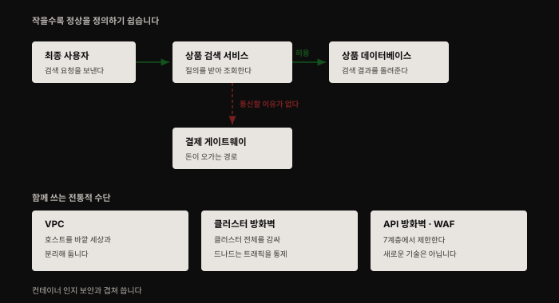
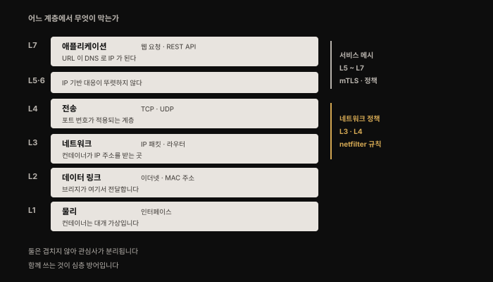
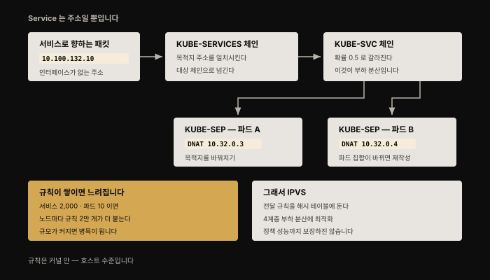
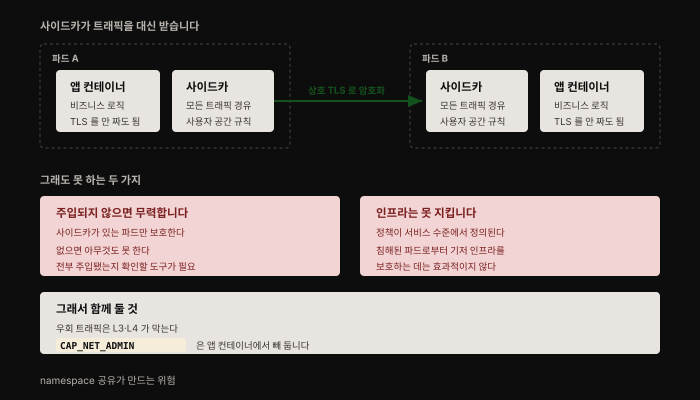

# 컨테이너 네트워크 보안 — 계층별로 나눠 막기
---
> 외부 공격은 전부 네트워크를 타고 들어옵니다. 이 장은 네트워킹을 총망라하지 않고, **컨테이너 배포의 네트워크 보안을 사고할 수 있는 멘탈 모델**을 주는 데 목적을 둡니다.

## 핵심 요약

컨테이너 방화벽이 전통적 방화벽보다 세밀할 수 있는 이유는 기술이 아니라 **단위의 크기**입니다. 애플리케이션이 작은 구성 요소로 쪼개지면 **정상 동작이 무엇인지 정의하기가 훨씬 쉬워집니다**. 상품 검색 컨테이너가 결제 게이트웨이와 통신할 이유는 없고, 그 "이유 없음"이 곧 규칙이 됩니다.

이 장의 수단은 **계층으로 나뉩니다**. 네트워크 정책은 L3·L4에서 `netfilter` 규칙으로 동작하고, 서비스 메시는 L5~L7에서 사이드카 프록시로 동작합니다. 겹치지 않기 때문에 **함께 쓰는 것이 심층 방어**입니다.


## 학습 목표

1. 컨테이너 방화벽이 세밀할 수 있는 이유를 마이크로서비스 구조와 연결해 설명할 수 있습니다.
2. OSI 계층별로 어떤 보안 수단이 어디서 동작하는지 짚을 수 있습니다.
3. Kubernetes Service가 `iptables` 규칙으로 구현되는 과정을 추적할 수 있습니다.
4. NetworkPolicy를 Kubernetes가 직접 강제하지 않는다는 사실과 그 함의를 압니다.
5. 서비스 메시가 주는 보안 이점과 두 가지 한계를 구분할 수 있습니다.




## 1. 컨테이너 방화벽

컨테이너는 마이크로서비스 아키텍처와 함께 가는 경우가 많습니다. 애플리케이션이 **서로 독립적으로 배포되는 작은 구성 요소**로 쪼개지면 보안 관점에서 실질적 이점이 생깁니다. **작은 구성 요소에서는 정상 동작이 무엇인지 정의하기가 훨씬 쉽기 때문입니다.**

어떤 컨테이너든 통신해야 할 상대는 제한된 집합뿐이고, 바깥 세상과 접촉해야 하는 컨테이너는 일부에 불과합니다. 저자가 드는 예가 전자상거래 애플리케이션입니다. 상품 검색 요청을 처리하는 마이크로서비스는 최종 사용자의 검색 요청을 받아 상품 데이터베이스에서 조회합니다. **이 서비스를 이루는 컨테이너가 결제 게이트웨이와 통신할 이유는 없습니다.**

컨테이너 방화벽은 컨테이너 집합을 드나드는 트래픽을 제한합니다. Kubernetes 같은 오케스트레이터에서는 "컨테이너 방화벽"이라는 말을 거의 쓰지 않고, 대신 **네트워크 플러그인이 강제하는 네트워크 정책**이라고 부릅니다. 원리는 같습니다 — 승인된 목적지로만 트래픽이 흐르게 제한하는 것입니다.

여기에 하나가 더 붙습니다. 전통적 방화벽이 그렇듯 컨테이너 방화벽도 **규칙 밖의 연결 시도를 보고**하므로, 공격 가능성을 조사할 때 쓸 근거가 남습니다.

이 수단은 전통적 배포에서 쓰던 것들과 함께 쓸 수 있습니다.

| 수단 | 하는 일 |
|------|--------|
| **VPC** | 호스트를 바깥 세상으로부터 격리합니다. 컨테이너 환경을 VPC에 배포하는 것이 아주 흔합니다 |
| **클러스터 방화벽** | 클러스터 전체를 감싸 드나드는 트래픽을 통제합니다 |
| **API 방화벽 · WAF** | L7에서 트래픽을 제한합니다 |

**어느 것도 새로운 기술이 아닙니다.** 다만 여기에 컨테이너를 인지하는 보안을 겹치면 심층 방어가 두터워집니다.


## 2. OSI 모델 — 어느 계층에서 무엇이 막는가

1984년 발표된 OSI 모델은 지금도 자주 참조되지만, **일곱 계층이 IP 기반 네트워크에 모두 대응하지는 않습니다.**



| 계층 | 무엇이 오가나 | 주소 체계 |
|------|-------------|----------|
| **L7 애플리케이션** | 웹 요청, REST API 요청 | URL — DNS가 도메인 이름을 IP 주소로 매핑 |
| **L4 전송** | TCP·UDP 패킷 | **포트 번호가 적용되는 계층** |
| **L3 네트워크** | IP 패킷, IP 라우터가 동작 | IP 주소 — 컨테이너가 네트워크에 참여하면 하나 받습니다 |
| **L2 데이터 링크** | 이더넷 프레임 | **MAC 주소** |
| **L1 물리** | 인터페이스 | 컨테이너 인터페이스는 대개 **가상**입니다 |

L3에서는 IPv4든 IPv6든 이 장의 목적에는 구현 세부사항일 뿐입니다. L2 프로토콜에는 이더넷·WiFi·(역사를 거슬러) 토큰 링이 있는데, 컨테이너 네트워킹에서 주로 쓰이는 것이 이더넷이라 이 장은 이더넷만 다룹니다.

L1이 "물리" 계층이라 불리지만 **인터페이스는 가상일 수 있습니다.** 5장에서 본 대로 VMM이 게스트 커널에 물리 장치로 매핑되는 가상 장치를 줍니다. AWS EC2 인스턴스에서 네트워크 인터페이스를 받는다면 그런 가상 인터페이스 하나를 받는 것입니다.

### 패킷 하나가 나가는 과정

애플리케이션이 목적지 URL로 요청을 보내려 합니다. 애플리케이션이니 L7에서 시작합니다.

1. **DNS 조회** — URL의 호스트 이름에 해당하는 IP 주소를 찾습니다. 로컬에 정의돼 있을 수도(`/etc/hosts`), 원격 DNS 서비스에 요청할 수도 있습니다. 애플리케이션이 이미 IP 주소를 안다면 이 단계는 건너뜁니다.
2. **L3 라우팅 결정** — 두 부분입니다. 목적지에 닿기까지 여러 홉이 있을 수 있는데 **다음 홉의 IP 주소는 무엇인가**, 그리고 **그 다음 홉 IP에 대응하는 인터페이스는 무엇인가**.
3. **이더넷 프레임 변환과 ARP** — 다음 홉 IP 주소를 MAC 주소로 매핑해야 합니다. 이때 쓰는 것이 **ARP**(Address Resolution Protocol)입니다. ARP 캐시에 없으면 ARP로 알아냅니다.
4. **인터페이스로 송출** — 지점 간 연결일 수도 있고, 인터페이스가 **브리지**에 연결돼 있을 수도 있습니다.

브리지를 이해하는 가장 쉬운 방법은 이더넷 케이블이 여러 개 꽂힌 물리 장치를 상상하는 것입니다. 각 케이블의 반대편은 어떤 장치의 네트워크 카드에 연결됩니다. 모든 물리 네트워크 카드에는 제조사가 새겨 넣은 고유 MAC 주소가 있고, 브리지는 각 케이블 끝의 MAC 주소를 학습합니다.

**컨테이너 네트워킹에서는 브리지가 별도 물리 장치가 아니라 소프트웨어로 구현됩니다.** 이더넷 케이블은 가상 이더넷 인터페이스로 대체됩니다.

메시지가 반대편에 닿으면 IP 패킷이 추출돼 L3로 올라갑니다. 최종 목적지면 수신 애플리케이션으로 전달되고, 다음 홉일 뿐이라면 네트워킹 스택이 또 한 번 라우팅 결정을 합니다.


## 3. 컨테이너의 IP 주소

컨테이너는 호스트의 IP 주소를 공유할 수도 있고, **각자 자기 network namespace 안에서 자기 네트워크 스택을 돌릴** 수도 있습니다.

Kubernetes에서는 **파드마다 자기 IP 주소를 갖습니다.** 파드에 컨테이너가 여럿이면 그 컨테이너들이 **같은 IP 주소를 공유**한다고 추론할 수 있습니다. 파드 안 모든 컨테이너가 같은 network namespace를 공유하기 때문입니다. 노드마다 주소 범위(CIDR 블록)가 설정되고, 파드가 노드에 스케줄되면 그 범위에서 주소 하나를 받습니다.

> 저자가 단서를 답니다. 노드에 항상 주소 범위가 미리 할당되는 것은 아닙니다. AWS에서는 플러그인 가능한 IP 주소 관리 모듈이 **기저 VPC와 연관된 범위에서 동적으로** 파드 IP를 할당합니다.

### NAT가 없다는 규칙

Kubernetes는 **클러스터 안 파드끼리 NAT 없이 직접 연결될 수 있어야** 한다고 요구합니다. NAT는 IP 주소를 매핑해 실제 주소가 아닌 다른 주소로 목적지를 보이게 하는 기법입니다. 저자는 여기서 곁가지 하나를 답니다 — **IPv4가 원래 예측보다 훨씬 오래 쓰이는 이유 중 하나가 NAT**입니다. IP 주소를 쓰는 장치 수가 IPv4 주소 공간을 한참 넘어섰는데도, NAT 덕에 사설 네트워크 안에서 대다수 주소를 재사용할 수 있기 때문입니다.

Kubernetes에서 네트워크 보안 정책과 분할이 두 파드의 통신을 막을 수는 있지만, **통신할 수 있다면 서로의 IP 주소를 NAT 매핑 없이 투명하게 봅니다.** 다만 파드와 바깥 세상 사이에는 여전히 NAT가 있을 수 있습니다.

**Kubernetes Service는 NAT의 한 형태입니다.** Service는 그 자체로 자원이고 자기 IP 주소를 받는데, **그것은 IP 주소일 뿐입니다** — Service에는 인터페이스가 없고 실제로 트래픽을 듣거나 보내지 않습니다. 주소는 라우팅 목적으로만 쓰입니다. Service는 실제 일을 하는 여러 파드와 연결되므로, Service IP로 보낸 패킷은 그중 한 파드로 전달돼야 합니다.

### 네트워크 격리

**두 구성 요소는 같은 네트워크에 연결돼 있을 때만 통신할 수 있습니다.** 전통적 호스트 기반 환경에서는 애플리케이션마다 별도 VLAN을 두어 격리했을 수 있습니다.

컨테이너 세계에서 Docker는 `docker network` 명령으로 여러 네트워크를 쉽게 만들 수 있게 했지만, **Kubernetes 모델에는 자연스럽게 맞지 않습니다.** Kubernetes에서는 (네트워크 정책과 보안 도구를 빼면) 모든 파드가 다른 모든 파드에 IP 주소로 접근할 수 있기 때문입니다.

> 저자가 덧붙이는 관찰이 흥미롭습니다. Kubernetes에서는 **제어 구성 요소도 파드로 돌고 애플리케이션 파드와 같은 네트워크에 연결**돼 있습니다. 통신 업계 출신이라면 놀랄 만한 대목인데, 전화망에서는 주로 보안 이유로 **제어 평면과 데이터 평면을 분리**하는 데 많은 공을 들였기 때문입니다.

그 대신 Kubernetes는 **L3·L4에서 동작하는 네트워크 정책**으로 컨테이너 네트워킹을 강제합니다.


## 4. netfilter — 규칙은 커널 안에 있습니다

L3 라우팅은 IP 패킷의 다음 홉을 정하는 일입니다. 그런데 이는 L3 규칙으로 할 수 있는 일의 일부일 뿐입니다. 이 수준에서 **패킷을 버리거나 IP 주소를 조작**해 부하 분산·NAT·방화벽·네트워크 보안 정책을 구현할 수 있습니다. 규칙은 L4에서 포트 번호까지 고려할 수도 있습니다.

이 규칙들이 기대는 커널 기능이 **`netfilter`** 입니다. Linux 커널 2.4 버전에 처음 들어간 패킷 필터링 프레임워크로, **출발지와 목적지 주소를 근거로 패킷을 어떻게 할지 정의하는 규칙 집합**을 씁니다.

사용자 공간에서 `netfilter` 규칙을 설정하는 방법은 여럿인데, 흔한 둘이 `iptables`와 `IPVS`입니다.



### iptables

`iptables`는 커널이 `netfilter`로 처리하는 IP 패킷 처리 규칙을 설정하는 방법입니다. 테이블 종류가 여럿인데 컨테이너 맥락에서 흥미로운 둘은 이렇습니다.

- **filter** — 패킷을 버릴지 전달할지 결정
- **nat** — 주소를 변환

root로 `iptables -t <table type> -L`을 돌리면 현재 규칙을 볼 수 있습니다.

### Service가 규칙이 되는 과정

Kubernetes에서 **kube-proxy가 `iptables` 규칙으로 서비스 트래픽의 부하 분산을 처리**합니다. Service 이름이 DNS로 IP 주소가 되고, 그 Service IP로 향하는 패킷이 도착하면 **목적지 주소를 일치시키는 규칙이 그 주소를 해당 파드 중 하나의 주소로 바꿔치기**합니다. Service 뒤의 파드 집합이 바뀌면 **각 호스트의 규칙이 그에 맞게 다시 쓰입니다**.

원문은 nginx를 두 개 복제본으로 띄운 클러스터에서 이를 직접 추적합니다. `iptables -t nat -L`의 출력에서 세 단계가 보입니다.

```bash
# iptables -t nat -L 출력 일부
Chain KUBE-SERVICES
  KUBE-SVC-SV7AMNAGZFKZEMQ4  tcp -- anywhere  10.100.132.10  /* default/my-nginx:http cluster IP */
```

Service IP(`10.100.132.10`)에 대응하는 규칙이 `KUBE-SERVICES` 체인에 있고, 대상 체인을 지정합니다. 그 체인을 따라가면 이렇습니다.

```bash
# 대상 체인을 따라간 결과
Chain KUBE-SVC-SV7AMNAGZFKZEMQ4
  KUBE-SEP-XZGVVMRRSKK6PWWN  all -- anywhere  anywhere  statistic mode random probability 0.50000000000
  KUBE-SEP-PUXUHBP3DTPPX72C  all -- anywhere  anywhere
```

**확률 0.5로 두 대상에 트래픽이 갈립니다.** 그리고 그 대상들이 실제 파드 IP(`10.32.0.3`, `10.32.0.4`)로 **DNAT**하는 규칙을 갖습니다. 이것이 Service 부하 분산의 실체입니다.

### iptables의 한계와 IPVS

문제는 **호스트마다 복잡한 규칙이 많아지면 성능이 떨어진다**는 점입니다. 실제로 kube-proxy의 `iptables` 사용은 대규모 Kubernetes 운영에서 **성능 병목으로 지목**됐습니다. 원문이 인용하는 수치가 구체적입니다 — **서비스 2,000개에 각각 파드 10개면 모든 노드에 `iptables` 규칙 2만 개가 추가로 붙습니다.**

이를 해결하려고 Kubernetes는 서비스 부하 분산에 **IPVS**를 쓸 수 있게 됐습니다. IP Virtual Server는 L4 부하 분산 또는 L4 LAN 스위칭이라 불리며, `iptables`와 비슷한 규칙 구현이지만 **전달 규칙을 해시 테이블에 저장해 부하 분산에 최적화**돼 있습니다.

다만 저자가 선을 긋습니다. 이 최적화가 kube-proxy 용례에서는 뛰어난 성능을 내지만, **네트워크 정책을 구현하는 플러그인의 성능까지 여기서 결론 내릴 수는 없습니다.**

> 중요한 귀결이 하나 있습니다. IPVS든 `iptables`든 `netfilter` 규칙은 **커널 안에서 동작**합니다. 커널이 호스트의 모든 컨테이너에 공유된다는 점을 떠올리면, 이것으로 보안 정책을 강제할 때 그 일은 **각 컨테이너 안이 아니라 호스트 수준에서** 일어난다는 뜻입니다.


## 5. 네트워크 정책

Kubernetes의 네트워크 정책은 **서로 다른 파드를 드나들 수 있는 트래픽**을 정의합니다. 포트·IP 주소·서비스·라벨 붙은 파드를 기준으로 정의할 수 있습니다. 메시지가 오갈 때 정책이 승인하지 않으면 네트워크는 **연결 수립을 거부하거나 패킷을 버립니다**. 앞의 전자상거래 예에서는 상품 검색 컨테이너에서 결제 서비스로 향하는 트래픽을 막는 정책이 될 것입니다.

Kubernetes 밖에서는 "컨테이너 방화벽"이나 **"네트워크 마이크로세그먼테이션"** 이라 부르기도 하지만 기본 원리는 같습니다.

원문은 NetworkPolicy가 실제 `iptables` 규칙이 되는 것을 보여 줍니다. `access=true` 라벨이 붙은 파드만 `my-nginx`에 접근하게 하는 정책은 이렇습니다.

```yaml
apiVersion: networking.k8s.io/v1
kind: NetworkPolicy
metadata:
  name: access-nginx
spec:
  podSelector:
    matchLabels:
      app: my-nginx
  ingress:
  - from:
     - podSelector:
         matchLabels:
           access: "true"
```

이것을 만들면 filter 테이블에 `WEAVE-NPC-INGRESS` 체인의 규칙이 추가됩니다. `match-set` 규칙 자체는 사람이 읽기 어렵지만, 주석이 기대와 일치합니다 — **default 네임스페이스의 `access=true` 파드에서 default 네임스페이스의 `app=my-nginx` 파드로 가는 트래픽을 허용**한다는 것입니다.

> 여기서 중요한 사실이 하나 드러납니다. **`iptables` 규칙을 만드는 것은 Kubernetes 핵심 구성 요소가 아니라 네트워킹 플러그인입니다.** 체인 이름에서 짐작되듯 원문의 예는 Weave를 쓰고 있습니다.

### 손으로 쓰지 말 것

원문은 빈 Ubuntu에서 규칙을 직접 만들어 봅니다. 8000번 포트에 응답하는 `netcat`을 띄우고 `curl`로 확인한 뒤, 거부 규칙을 넣습니다.

```bash
sudo iptables -I INPUT -j REJECT -p tcp --dport=8000
```

그러면 `curl`이 `Connection refused`로 실패합니다. `iptables`로 트래픽을 제한할 수 있다는 시연입니다.

**그런데 저자는 이것을 손으로 하지 말라고 권합니다.** 이유가 구체적입니다.

- 정책을 설정할 **더 쉬운 인터페이스**를 얻는 편이 낫습니다.
- 다중 노드 시스템에서는 **노드마다 규칙이 다릅니다**.
- 규칙이 대단히 많습니다 — 저자의 단일 Kubernetes 노드에서 Calico 플러그인으로 애플리케이션 파드 몇 개만 돌리고 **네트워크 정책이 하나도 없는데도** `iptables -L`이 filter 테이블 규칙 **300줄 넘게** 내놓습니다.
- **컨테이너는 단명하는 경향**이 있어 생성·소멸에 따라 규칙을 다시 써야 합니다.

규칙 자체는 고성능이지만 **쓰는 일이 복잡한 작업**이고, 자동화될 때만 감당할 수 있습니다.

### 무엇이 자동화해 주는가

Kubernetes에는 NetworkPolicy 오브젝트가 있습니다. **다만 Kubernetes 자신이 이를 강제하지 않습니다.** 이를 지원하는 네트워크 플러그인을 쓸 때만 효력이 있습니다. 플러그인에 따라 더 유연하거나 관리하기 쉬운 상용 버전으로 업그레이드하는 선택지가 있을 수 있습니다.

상용 컨테이너 보안 플랫폼 중에는 Kubernetes 네트워크 플러그인으로 설치되지 않으면서 사실상 같은 일을 하는 컨테이너 방화벽을 포함한 것도 있습니다. 이런 제품은 **특정 이미지의 정상 트래픽이 어떤 모습인지 학습해 정책을 자동 생성**하는 기능을 가질 수 있습니다.

### 모범 사례 네 가지

| 사례 | 내용 |
|------|------|
| **기본 거부(ingress)** | 최소 권한 원칙에 따라 네임스페이스마다 **인그레스를 기본 거부**하는 정책을 두고, 기대하는 트래픽만 허용을 추가합니다 |
| **기본 거부(egress)** | 이그레스는 파드에서 **나가는** 트래픽입니다. 컨테이너가 침해되면 공격자가 네트워크로 주변 환경을 탐색할 수 있으므로 이쪽도 기본 거부로 둡니다 |
| **파드 간 트래픽 제한** | 파드는 보통 애플리케이션을 나타내는 라벨이 붙습니다. **허용된 애플리케이션 사이에서만** 흐르도록 제한합니다 |
| **포트 제한** | 애플리케이션마다 **특정 포트로만** 트래픽을 받게 제한합니다 |

이그레스 기본 거부가 특히 중요합니다. [9장에서 본](./09-01.%EC%BB%A8%ED%85%8C%EC%9D%B4%EB%84%88%20%EA%B2%A9%EB%A6%AC%20%EA%B9%A8%EB%9C%A8%EB%A6%AC%EA%B8%B0%20%E2%80%94%20%EC%84%A4%EC%A0%95%20%ED%95%98%EB%82%98%EB%A1%9C%20%EB%AC%B4%EB%84%88%EC%A7%80%EB%8A%94%20%EA%B2%BD%EA%B3%84.md) 침해 이후 시나리오를 네트워크 쪽에서 끊는 수단이기 때문입니다.


## 6. 서비스 메시 — 애플리케이션 계층의 통제

서비스 메시는 애플리케이션이 서로 연결되는 방식에 대한 통제와 기능을 **애플리케이션 계층(OSI L5~L7)에서** 제공합니다. Istio, Envoy, Linkerd 같은 프로젝트와 AWS App Mesh 같은 관리형 선택지가 있습니다.



Kubernetes에서 동작하는 방식은 이렇습니다. **각 애플리케이션 파드에 사이드카 컨테이너로 주입**되고, 그 사이드카가 파드 안 다른 컨테이너를 대신해 네트워킹을 처리합니다. **파드를 드나드는 모든 트래픽이 이 프록시를 거치고**, 규칙 적용은 프록시 안 **사용자 공간**에서 일어납니다.

이 사이드카 프록시에 **상호 TLS**를 쓰도록 설정할 수 있습니다. 배포 안의 연결이 안전하게 암호화되므로, **공격자가 배포 안에 발판을 얻더라도 트래픽을 가로채기가 훨씬 어려워집니다.** (mTLS 자체는 11장 주제입니다.)

서비스 메시는 보통 **애플리케이션 계층 네트워크 정책**을 강제하는 선택지도 줍니다. 애플리케이션 계층에서 동작하므로 이 장 앞부분의 L1~L4 정책과 **관심사가 명확히 분리**됩니다.

### 두 가지 한계

mTLS와 정책 지원은 강력한 보안 이점이지만, 저자는 반드시 알아 둘 것 둘을 짚습니다.

- **사이드카가 주입된 파드에만** 보안 지원을 줄 수 있습니다. **없으면 아무것도 하지 못합니다.**
- 서비스 메시 네트워크 정책은 **서비스 수준에서 정의**되므로, **침해된 파드로부터 기저 인프라를 보호하는 데는 효과적이지 않습니다.**

그래서 기업의 모범 사례는 **심층 방어**입니다. 서비스 메시와 나란히 둘을 함께 둡니다. 하나는 **사이드카가 모든 컨테이너에 있는지 확인하는 도구**이고, 다른 하나는 서비스 IP를 거치지 않고 **컨테이너 사이나 컨테이너와 외부 주소 사이에 직접 흐르는 트래픽**을 막거나 제한하는 보완적 네트워크 보안 솔루션입니다.

### 사이드카를 겨냥한 공격

마지막 경고가 [9장의 namespace 공유 논의](./09-01.%EC%BB%A8%ED%85%8C%EC%9D%B4%EB%84%88%20%EA%B2%A9%EB%A6%AC%20%EA%B9%A8%EB%9C%A8%EB%A6%AC%EA%B8%B0%20%E2%80%94%20%EC%84%A4%EC%A0%95%20%ED%95%98%EB%82%98%EB%A1%9C%20%EB%AC%B4%EB%84%88%EC%A7%80%EB%8A%94%20%EA%B2%BD%EA%B3%84.md)와 곧장 이어집니다.

서비스 메시 사이드카는 파드 안에서 애플리케이션 컨테이너와 나란히 삽니다. **애플리케이션 컨테이너가 침해되면 사이드카가 강제하는 규칙을 우회하거나 수정하려 들 수 있습니다.** 사이드카와 애플리케이션 컨테이너는 **같은 network namespace를 공유**하므로, 애플리케이션 컨테이너에서 **`CAP_NET_ADMIN` capability를 빼 두는 것이 좋습니다.** 침해돼도 공유된 네트워킹 스택을 고치지 못하게 하기 위해서입니다.


## 7. 이 장의 결론

컨테이너는 배포 안에서 **아주 세밀한 방화벽 구성**을 가능하게 합니다. 저자는 이 세밀함이 지키는 보안 원칙 셋을 꼽습니다.

- **직무 분리 · 최소 권한** — 컨테이너에 제한된 통신 능력만 허용
- **폭발 반경 제한** — 침해된 컨테이너가 모든 이웃을 공격하지 못하게
- **심층 방어** — 컨테이너 방화벽 + 서비스 메시 + 클러스터 전체 전통 방화벽


## 심화 학습

> 이 절은 책 밖 보강입니다. 이 장은 **Kubernetes 의존도가 가장 높아** 시점 검증이 특히 필요했습니다. 아래는 2026년 8월 기준 1차 자료로 확인한 내용입니다.

### 여전히 유효한 핵심 — "Kubernetes는 NetworkPolicy를 강제하지 않는다"

이 장에서 가장 중요한 실무 사실은 6년이 지나도 그대로입니다. Kubernetes 공식 문서가 지금도 이렇게 못 박습니다.[^netpol]

> **"Creating a NetworkPolicy resource without a controller that implements it will have no effect."**

정책을 만들어 두고 **막힌다고 착각하는 사고**가 여기서 나옵니다. 플러그인이 지원하는지 먼저 확인해야 한다는 저자의 경고는 낡지 않았습니다.

### 원문의 예제 플러그인이 사라졌습니다

원문의 NetworkPolicy → `iptables` 시연은 **Weave**를 씁니다(`WEAVE-NPC-INGRESS` 체인). 그런데 **Weave 저장소는 2024년 8월 아카이브됐습니다.**

| 프로젝트 | 상태 |
|---------|------|
| **Weave** | **아카이브됨** (2024-08) |
| Calico | 활발 (7.3k stars, 2026-08-08) |
| Cilium | 활발 (24.9k stars, 2026-08-08) |

원문이 마지막 실험에서 Calico를 쓴 것은 지금도 유효하지만, **Weave 기반 체인 이름은 재현되지 않습니다.** 개념(플러그인이 정책을 `netfilter` 규칙으로 번역한다)은 그대로이고 **구현체 이름만 바뀐 경우**입니다.

한 가지 더 짚을 것이 있습니다. Cilium이 **eBPF 기반**으로 `iptables`를 상당 부분 우회하는 접근을 대중화했습니다. 이 장이 "규칙은 `netfilter`로 구현된다"고 전제하는데, **eBPF 경로는 그 전제 자체를 바꿉니다.** 저자가 8장에서 eBPF를 syscall 관찰 도구로 소개했던 것이, 네트워크 쪽에서는 데이터 평면 구현으로까지 갔습니다.

### 책에 없는 축 — 클러스터 범위 관리자 정책

원문 집필 시점의 NetworkPolicy에는 구조적 공백이 있었습니다. **네임스페이스 범위**라, 클러스터 관리자가 "이건 전 클러스터에서 무조건 막는다"를 표현할 방법이 없었습니다. 개발자가 만든 정책을 관리자가 덮어쓸 수도 없었습니다.

이를 메우려고 sig-network가 **AdminNetworkPolicy**(클러스터 범위 CRD)를 만들었습니다. 현재 `v1alpha1`이고 beta로 가는 중이며, 최근에는 Admin과 Baseline을 `tier` 필드로 합친 **ClusterNetworkPolicy** 형태로 재편되고 있습니다. 즉 **아직 확정된 표준이 아닙니다** — 쓰려면 out-of-tree CRD로 도입해야 합니다.

정리하면, 저자가 다룬 NetworkPolicy는 **개발자용**이고 그 위에 **관리자용 계층**이 추가되는 중입니다.

### 사이드카가 유일한 답이 아니게 됐습니다

이 장은 서비스 메시를 **"사이드카로 주입된다"**고 단정합니다. 2020년에는 맞았지만, 지금은 축이 하나 더 있습니다.

**Istio 앰비언트 모드가 v1.24에서 GA**가 됐습니다(2024-11-07).[^ambient] 파드마다 사이드카를 넣는 대신 **노드마다 L4 프록시(`ztunnel`)** 를 두고, L7 처리가 필요하면 네임스페이스 단위로 웨이포인트 프록시를 추가하는 구조입니다. mTLS는 `ztunnel`이 HBONE 프로토콜로 처리합니다.

이것이 이 장의 **첫 번째 한계를 직접 겨냥합니다.** 저자가 "사이드카가 없으면 아무것도 못 한다"고 지적한 문제가, 사이드카를 파드에서 걷어내 인프라 계층으로 옮기면서 성격이 달라졌습니다. 다만 **두 번째 한계(기저 인프라는 못 지킨다)는 그대로**입니다 — 여전히 서비스 수준 정책이기 때문입니다.


## 결정 치트시트

| 상황 | 판단 | 근거 |
|------|------|------|
| NetworkPolicy를 작성했다 | **플러그인이 지원하는지부터 확인** | 컨트롤러 없으면 아무 효력이 없음 |
| 새 네임스페이스를 만든다 | ingress·**egress 둘 다 기본 거부**부터 | 침해 후 탐색을 네트워크에서 끊음 |
| 정책을 손으로 `iptables`에 쓰려 한다 | 하지 않음 | 노드마다 다르고 컨테이너 생성·소멸마다 재작성 필요 |
| 서비스가 수천 개 규모 | IPVS 검토 | 규칙 2만 개 수준에서 `iptables`가 병목 |
| 서비스 메시를 도입했다 | **사이드카 주입 여부를 확인하는 도구**를 함께 | 주입 안 된 파드는 보호 범위 밖 |
| 서비스 메시만으로 충분한가 | 아님 — L3·L4 정책을 병행 | 서비스 IP를 우회하는 직접 트래픽이 남음 |
| 사이드카를 쓰는 파드 | 앱 컨테이너에서 `CAP_NET_ADMIN` 제거 | 같은 network namespace를 공유 |
| 클러스터 전체 강제 정책이 필요 | AdminNetworkPolicy 검토(단 `v1alpha1`) | 기본 NetworkPolicy는 네임스페이스 범위 |


## 면접에서 받을 만한 질문

1. 컨테이너 방화벽이 전통적 방화벽보다 세밀할 수 있는 이유는 무엇입니까?
2. NetworkPolicy를 만들었는데 트래픽이 그대로 흐릅니다. 무엇을 의심해야 합니까?
3. Kubernetes Service로 보낸 패킷이 파드에 닿기까지 무슨 일이 일어납니까?
4. kube-proxy에서 `iptables` 대신 IPVS를 쓰는 이유는 무엇입니까?
5. 서비스 메시로 mTLS를 걸었습니다. 네트워크 정책은 이제 필요 없습니까?


## 정답

**1.** 기술이 아니라 **단위의 크기** 때문입니다. 마이크로서비스로 쪼개지면 각 구성 요소의 **정상 동작을 정의하기가 훨씬 쉬워집니다**. 어떤 컨테이너든 통신할 상대가 제한된 집합뿐이고 바깥과 접촉할 컨테이너는 일부뿐입니다. 상품 검색 서비스가 결제 게이트웨이와 통신할 이유가 없다는 것이 그대로 규칙이 됩니다.

**2.** **네트워크 플러그인이 NetworkPolicy를 지원하는지**를 먼저 의심해야 합니다. Kubernetes 자신은 정책을 강제하지 않고, 이를 구현하는 컨트롤러가 없으면 리소스를 만들어도 **아무 효력이 없습니다**. 규칙을 실제로 만드는 것은 핵심 구성 요소가 아니라 플러그인입니다.

**3.** Service IP는 **인터페이스가 없는 라우팅용 주소**일 뿐이고, 실제 처리는 kube-proxy가 만든 `iptables` 규칙이 합니다. 순서는 이렇습니다.

- `KUBE-SERVICES` 체인이 목적지 주소를 일치시켜 대상 체인으로 넘깁니다
- `KUBE-SVC` 체인에서 **확률 기반으로 갈라집니다**(복제본 2개면 0.5)
- `KUBE-SEP` 체인의 **DNAT**가 목적지를 실제 파드 IP로 바꿔치기합니다

파드 집합이 바뀌면 각 호스트의 규칙이 다시 쓰입니다.

**4.** **규모에서 오는 성능 문제** 때문입니다. 호스트마다 규칙이 복잡해지면 성능이 떨어지고, 실제로 대규모 운영에서 병목으로 지목됐습니다. 서비스 2,000개에 파드 10개씩이면 **노드마다 규칙 2만 개**가 추가됩니다. IPVS는 전달 규칙을 **해시 테이블**에 저장해 L4 부하 분산에 최적화돼 있습니다. 다만 이것으로 **네트워크 정책 플러그인의 성능까지 결론 낼 수는 없습니다**.

**5.** 필요합니다. 서비스 메시에는 두 한계가 있습니다. **사이드카가 주입된 파드만** 보호하므로 없는 파드는 무방비이고, 정책이 **서비스 수준에서 정의**되므로 침해된 파드로부터 **기저 인프라를 보호하지 못합니다**. 그래서 사이드카 주입을 확인하는 도구와, **서비스 IP를 거치지 않고 직접 흐르는 트래픽**을 막는 L3·L4 정책을 함께 둡니다. 덧붙여 앱 컨테이너에서 `CAP_NET_ADMIN`을 빼야 침해 시 공유 네트워킹 스택을 고치지 못합니다.


## 핵심 개념 체크리스트

- [ ] 컨테이너 방화벽의 세밀함이 마이크로서비스 단위에서 온다는 것을 설명할 수 있다
- [ ] OSI 각 계층에서 무엇이 오가고 어떤 주소를 쓰는지 안다
- [ ] 패킷이 나갈 때 DNS → L3 라우팅 → ARP → 브리지 순서를 짚을 수 있다
- [ ] Kubernetes가 파드 간 NAT 없는 연결을 요구한다는 것과 Service가 NAT임을 안다
- [ ] `netfilter`가 커널 기능이고 규칙이 호스트 수준에서 동작함을 안다
- [ ] Service가 `KUBE-SERVICES` → `KUBE-SVC` → `KUBE-SEP` → DNAT로 구현됨을 안다
- [ ] `iptables`의 규모 문제와 IPVS의 해시 테이블 접근을 비교할 수 있다
- [ ] **Kubernetes가 NetworkPolicy를 직접 강제하지 않는다**는 것을 안다
- [ ] 정책 모범 사례 네 가지(ingress·egress 기본 거부, 파드 간·포트 제한)를 안다
- [ ] 서비스 메시의 두 한계와 `CAP_NET_ADMIN` 제거 권고를 설명할 수 있다


## 참고 자료

- 《Container Security: Fundamental Technology Concepts that Protect Containerized Applications》(Liz Rice, O'Reilly, 2020, 1판) Chapter 10 — 이 노트의 원문
- [Kubernetes — Network Policies](https://kubernetes.io/docs/concepts/services-networking/network-policies/) — 플러그인 없이는 효력이 없다는 공식 서술
- [Istio — Ambient Mode Overview](https://istio.io/latest/docs/ambient/overview/) — 사이드카 없는 데이터 평면과 `ztunnel`
- [Network Policy API (sig-network)](https://network-policy-api.sigs.k8s.io/) — AdminNetworkPolicy·ClusterNetworkPolicy 진행 상황
- [09-01. 컨테이너 격리 깨뜨리기](./09-01.%EC%BB%A8%ED%85%8C%EC%9D%B4%EB%84%88%20%EA%B2%A9%EB%A6%AC%20%EA%B9%A8%EB%9C%A8%EB%A6%AC%EA%B8%B0%20%E2%80%94%20%EC%84%A4%EC%A0%95%20%ED%95%98%EB%82%98%EB%A1%9C%20%EB%AC%B4%EB%84%88%EC%A7%80%EB%8A%94%20%EA%B2%BD%EA%B3%84.md) — 사이드카 namespace 공유와 `CAP_NET_ADMIN` 논의의 짝
- [『Networking and Kubernetes』 정독본](../networking-and-kubernetes/README.md) — 같은 주제를 **패킷 중심**으로 다루는 형제 책. OSI·`netfilter`·Service 구현의 기초 설명은 그쪽이 정본
- [Container Security 정독 인덱스](./README.md) — 이 책의 장별 진행 상태

[^netpol]: Kubernetes 공식 문서 "Network Policies" — "Creating a NetworkPolicy resource without a controller that implements it will have no effect."와 ingress·egress 기본이 non-isolated라는 서술을 확인했습니다(2026-08-09 조회). <https://kubernetes.io/docs/concepts/services-networking/network-policies/>

[^ambient]: Istio 앰비언트 모드는 v1.24에서 GA에 도달했습니다(2024-11-07 발표). 노드 단위 L4 프록시 `ztunnel`이 HBONE으로 mTLS를 처리하고, L7 처리는 네임스페이스 단위 웨이포인트 프록시가 맡습니다(2026-08-09 조회). <https://istio.io/latest/blog/2024/ambient-reaches-ga/>
