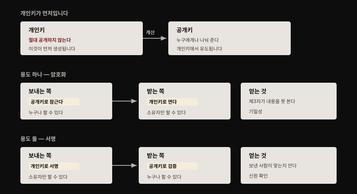
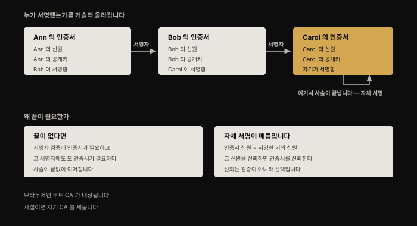
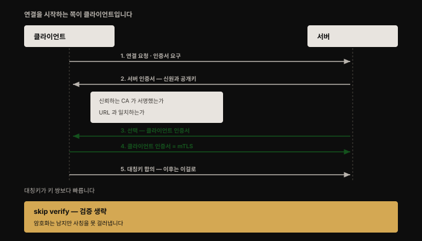
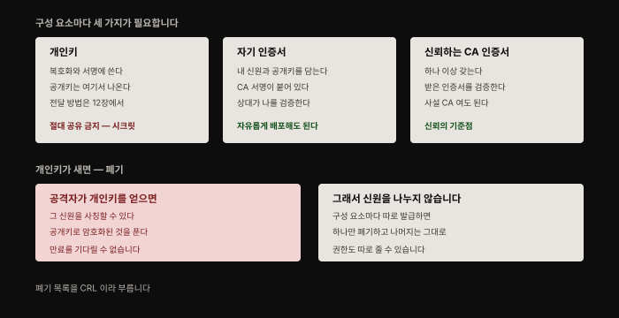

# TLS로 컴포넌트 안전하게 연결하기 — 키·인증서·CA의 역할
---
> 저자가 직접 밝힙니다. 키와 인증서 동작 방식을 이미 안다면 **이 장은 건너뛰어도 됩니다** — 컨테이너에 특화된 내용이 없기 때문입니다. 그럼에도 책에 넣은 이유는, 컨테이너와 클라우드 네이티브 도구를 처음 파기 시작할 때 이 개념들을 처음 마주치는 사람이 많고 **그 지점이 혼란의 진원지**라서입니다.

## 핵심 요약

이 장의 목적은 기능 소개가 아니라 **역할 정리**입니다. 설치 문서는 "무엇을 하라"만 알려 주고 **"왜"와 "어떻게"는 설명하지 않는 경향**이 있어서, Kubernetes나 etcd의 인증서 설정이 악명 높게 헷갈립니다.

정리하면 이렇습니다. **개인키는 내가 쥐고 절대 안 내놓는 것**, **인증서는 내가 자유롭게 뿌리는 것**, **CA 인증서는 남을 검증하는 기준점**입니다. 이 셋의 역할이 갈리는 지점만 잡으면 나머지는 따라옵니다.


## 학습 목표

1. 공개키·개인키 쌍의 두 용도(암호화·서명)와 방향이 반대라는 점을 설명할 수 있습니다.
2. X.509 인증서에 무엇이 담기는지 열거할 수 있습니다.
3. 인증서 체인이 왜 자체 서명 인증서에서 끝나야 하는지 말할 수 있습니다.
4. TLS 핸드셰이크 흐름과 mTLS가 더하는 단계를 구분할 수 있습니다.
5. 구성 요소마다 필요한 세 가지를 구분하고 각각을 어떻게 다뤄야 하는지 압니다.




## 1. 안전한 연결이란 무엇인가

일상에서 안전한 연결을 보는 곳이 웹 브라우저입니다. 인터넷 뱅킹에 접속했는데 자물쇠 표시가 없다면 연결이 안전하지 않다는 뜻이므로 로그인 정보를 넣으면 안 됩니다. 웹사이트와 안전한 연결을 맺는 데는 **두 부분**이 있습니다.

- **신원 확인** — 지금 보고 있는 웹사이트가 정말 내 은행 소유인지 알아야 합니다. 브라우저가 **인증서를 검증**해 사이트의 신원을 확인합니다.
- **암호화** — 은행 정보에 접근할 때 제3자가 그 통신 채널을 가로채거나, 더 나쁘게는 간섭하지 못하게 해야 합니다.

안전한 웹 연결은 HTTPS를 씁니다. 이름 그대로 **평범한 HTTP 연결을 안전하게 만든 것**이고, 그 안전함은 전송 계층에서 **TLS**(Transport Layer Security)라는 프로토콜로 더해집니다.

### S는 SSL 아니었나

저자가 여기서 흔한 혼동을 정리합니다. "S가 SSL(Secure Sockets Layer)의 약자 아니었나" 싶다면 **완전히 틀린 것은 아닙니다.** 전송 계층은 한 쌍의 네트워크 소켓 사이를 잇는 계층이고, **TLS는 예전에 SSL이라 불리던 프로토콜의 현대적 이름**입니다.

| 시점 | 사건 |
|------|------|
| 1995 | Netscape가 첫 SSL 명세를 **v2로** 발표. 초기 버전 1은 결함이 심각해 아예 공개되지 않았습니다 |
| 1999 | IETF가 Netscape의 SSL v3.0을 대체로 기반 삼아 **TLS v1.0** 표준을 만듦 |
| 현재 | 업계는 주로 **TLS v1.3**을 씁니다 |

> 저자가 덧붙이는 한마디가 재밌습니다. TLS로 옮겨 온 지 20년이 지났는데도 우리는 여전히 이 인증서들을 "SSL 인증서"라 부르는 경향이 있습니다. **정확히 부르고 싶다면 "X.509 인증서"** 라고 해야 합니다.


## 2. X.509 인증서와 키 쌍

"X.509"는 이 인증서를 정의하는 **ITU**(국제전기통신연합) 표준의 이름입니다. 인증서는 **소유자의 신원 정보**와 **소유자와 통신할 때 쓸 공개 암호화 키**를 담은 구조화된 데이터입니다. 이 공개키는 공개키·개인키 쌍의 절반입니다.

인증서에 담기는 핵심 정보는 넷입니다.

| 항목 | 내용 |
|------|------|
| **주체(subject) 이름** | 이 인증서가 식별하는 주체의 이름. 보통 도메인 이름 형태입니다. 실무에서는 **Subject Alternative Names** 필드를 써서 하나 이상의 이름으로 주체를 식별해야 합니다 |
| **주체의 공개키** | 이 주체와 통신할 때 쓸 공개키 |
| **발급한 CA의 이름** | 인증서를 발급한 인증 기관 |
| **유효 기간** | 인증서가 만료되는 날짜와 시각 |

### 키 쌍의 두 용도 — 방향이 반대입니다

이름 그대로 **공개키는 누구와도 공유할 수 있습니다.** 대응하는 개인키는 **소유자가 절대 공개해서는 안 됩니다.**

순서가 중요합니다. **개인키가 먼저 생성되고, 거기서 대응하는 공개키를 계산해 냅니다.** 이 쌍은 두 가지로 쓰입니다.

- **암호화** — 공개키로 메시지를 암호화하면 **대응하는 개인키를 가진 사람만** 복호화할 수 있습니다.
- **서명** — 개인키로 메시지에 서명하면 **대응하는 공개키를 가진 누구든** 그것이 개인키 소유자에게서 왔는지 검증할 수 있습니다.

두 용도의 **방향이 반대**라는 점이 이해의 핵심입니다. 암호화는 보내는 쪽이 공개키를 쓰고 받는 쪽이 개인키를 쓰며, 서명은 정확히 그 반대입니다. 안전한 연결을 세울 때 **이 두 능력이 모두** 쓰입니다.

### 그런데 공개키를 어떻게 믿나

저자가 여기서 이 장의 본론으로 넘어가는 질문을 던집니다. 내가 키 쌍을 만들어 공개키를 당신에게 주면 당신은 나에게 암호화된 메시지를 보낼 수 있습니다. **그런데 내가 보낸 그 공개키가 정말 나에게서 왔는지, 사칭자에게서 온 것은 아닌지 당신이 어떻게 압니까?**

내가 나라는 것을 확립하려면 **당신이 신뢰하는 제3자**가 개입해 내 신원을 보증해야 합니다. 이것이 인증 기관의 기능입니다.


## 3. 인증 기관 — 신뢰는 어디서 끝나는가

**CA**(Certificate Authority)는 인증서에 서명해 **그 안에 담긴 신원이 올바름을 검증**하는 신뢰받는 주체입니다. 저자의 원칙이 간결합니다 — **신뢰하는 기관이 서명한 인증서만 신뢰해야 합니다.**

특정 목적지로 TLS 연결을 열면, 연결을 시작한 클라이언트가 반대편에서 인증서를 받습니다. 이것으로 **의도한 상대와 이야기하고 있는지** 확인할 수 있습니다. 은행에 접속하면 브라우저가 인증서가 은행 URL과 맞는지, 그리고 **어떤 CA가 서명했는지** 확인합니다.



### 끝없는 사슬 문제

여기서 논리적 문제가 생깁니다. 다른 구성 요소가 CA를 안전하게 식별할 수 있어야 하므로 **CA도 인증서로 표현됩니다.** 그런데 그 인증서도 어떤 CA가 서명해야 하고, 서명자의 신원을 검증하려면 **또 다른 인증서**가 필요합니다. 이런 식이면 **끝없는 인증서 사슬**을 쌓게 됩니다. 결국 **신뢰할 수 있는 인증서 하나**가 있어야 합니다.

실제로 사슬은 **자체 서명 인증서**(self-signed certificate)에서 끝납니다. CA가 **자기 자신에게 서명한** X.509 인증서입니다. 다시 말해 **인증서가 나타내는 신원과, 서명에 쓰인 개인키의 신원이 같습니다.** 그 신원을 신뢰할 수 있다면 그 인증서를 신뢰할 수 있습니다.

원문의 예가 명료합니다. Ann의 인증서는 Bob이 서명하고 Bob의 것은 Carol이 서명합니다. **사슬은 Carol의 자체 서명 인증서에서 끝납니다.**

> 여기서 얻는 통찰이 하나 있습니다. 사슬의 끝에서 신뢰는 **검증되는 것이 아니라 선택되는 것**입니다. 자체 서명 인증서는 수학적으로 아무것도 증명하지 않습니다 — 그 신원을 믿기로 **결정**하는 것이 전부입니다.

### 공개 CA와 사설 CA

웹 브라우저에는 **루트 CA**라 불리는 잘 알려진 신뢰받는 기관들의 인증서가 **미리 설치**돼 있습니다. 브라우저는 이 루트 CA 중 하나가 서명한 인증서(또는 인증서 체인)를 신뢰합니다. 신뢰하는 CA가 서명하지 않았다면 사이트를 안전하지 않다고 표시합니다.

인터넷을 통해 사람들이 접속할 웹사이트를 세운다면 **신뢰받는 공개 CA가 서명한 인증서**가 필요합니다. 유료로 발급해 주는 벤더가 여럿 있고, **Let's Encrypt에서 무료로** 받을 수도 있습니다.

**반면 Kubernetes나 etcd 같은 분산 시스템 구성 요소를 세울 때는 다릅니다.** 인증서 검증에 쓸 CA 집합을 직접 지정하게 되는데, 시스템이 내 사설 통제 아래 있다면 **일반 대중(이나 그들의 브라우저)이 이 구성 요소를 신뢰하는지는 중요하지 않습니다.** 중요한 것은 **구성 요소들이 서로를 신뢰할 수 있는가**입니다. 그래서 공개 신뢰 CA를 쓸 필요 없이 **자체 서명 인증서로 자기 CA를 아주 간단히 세울 수 있습니다.**

### 인증서 서명 요청(CSR)

자기 CA를 쓰든 공개 CA를 쓰든, 어떤 인증서를 만들어 달라고 CA에 알려야 합니다. 이때 쓰는 것이 **CSR**(Certificate Signing Request)이며 담기는 정보는 셋입니다.

- 인증서가 담게 될 **공개키**
- 이 인증서가 동작해야 할 **도메인 이름**
- 이 인증서가 나타낼 **신원 정보**(회사·조직 이름 등)

CSR을 만들어 CA에 보내 X.509 인증서를 요청합니다. 인증서에는 **이 정보에 CA의 서명이 더해진 것**이 담기므로, CSR에 이것들이 들어가는 게 완전히 이치에 맞습니다.

> `openssl` 같은 도구는 키 쌍과 CSR을 한 번에 만들 수 있습니다. 헷갈릴 수 있는 점은 `openssl`이 **CSR 생성 입력으로 개인키를 받는다**는 것인데, **공개키가 개인키에서 유도된다**는 것을 떠올리면 납득됩니다.
>
> 여기서 저자가 짚는 구분이 중요합니다. 이 신원으로 도는 구성 요소는 **복호화와 서명에 개인키를 쓰지만 공개키 자체는 결코 쓰지 않습니다.** 공개키가 필요한 것은 **통신 상대 쪽**이고, 그들은 그것을 **인증서에서** 얻습니다. 즉 이 구성 요소에 필요한 것은 **개인키와, 남에게 보낼 인증서** 둘입니다.


## 4. TLS 연결이 맺어지는 과정

전송 계층 연결은 **어떤 구성 요소가 시작해야** 합니다. 그 구성 요소를 **클라이언트**, 통신 상대를 **서버**라 부릅니다.

저자가 단서를 답니다. 이 클라이언트·서버 관계는 **전송 계층에서만 성립**할 수 있고, 더 높은 계층에서는 두 구성 요소가 **대등할 수 있습니다.**



흐름은 이렇습니다.

1. 클라이언트가 소켓을 열고 서버에 네트워크 연결을 요청합니다. 안전한 연결을 원하므로 **서버가 인증서를 보내 달라**고 요청합니다.
2. 인증서가 두 가지 중요한 정보를 전달합니다 — **서버의 신원**과 **서버의 공개키**.
3. 클라이언트가 **서버 인증서를 신뢰하는 CA가 서명했는지** 확인합니다. 그렇다면 서버를 신뢰할 수 있다는 확인입니다.
4. 클라이언트는 이어서 **서버의 공개키로** 보낼 메시지를 암호화할 수 있습니다.
5. 클라이언트와 서버가 **이 연결의 나머지 메시지에 쓸 대칭키를 합의**합니다. **비대칭 키 쌍보다 성능이 좋기 때문입니다.**

### skip verify를 운영에 쓰지 말 것

"skip verify"라는 말을 마주쳤을 수 있습니다. 클라이언트가 **인증서가 알려진 CA의 서명을 받았는지 검증하는 단계를 건너뛰게** 하는 전송 계층 옵션입니다. 클라이언트가 인증서가 주장하는 신원을 **그냥 맞다고 가정**합니다.

비운영 환경에서는 편리합니다. CA 정보를 클라이언트에 설정하는 수고를 덜고 자체 서명 인증서를 그냥 쓸 수 있기 때문입니다. **구성 요소 사이 통신은 여전히 암호화되지만, 상대가 사칭자가 아니라는 확신은 가질 수 없습니다.** 저자의 당부가 분명합니다 — **운영에서는 skip-verify 옵션을 쓰지 마십시오.**

### 서버는 클라이언트를 어떻게 믿나

클라이언트가 서버를 검증하고 나면 신뢰할 수 있습니다. **그런데 서버는 클라이언트를 어떻게 신뢰합니까?**

은행처럼 계정이 있는 웹사이트라면, 잔액을 알려 주기 전에 서버가 내 신원을 검증하는 것이 중요합니다. 이런 진짜 클라이언트·서버 관계에서는 보통 **L7 인증**으로 처리합니다. 사용자 이름과 비밀번호를 넣고, 문자 코드나 Yubikey의 일회용 비밀번호, 인증 앱으로 다중 인증을 보탭니다.

**클라이언트 신원을 검증하는 또 하나의 방법이 X.509 인증서**입니다. 서버가 자기 신원을 확인시키는 데 인증서를 썼으니, **반대 방향으로 같은 일을 못 할 이유가 없습니다.** 이렇게 하면 그것이 **상호 TLS(mTLS)** 입니다. 이는 **서버 쪽에서 설정하는 선택지**입니다.


## 5. 컨테이너 사이의 안전한 연결

여기까지는 컨테이너에 특화된 것이 없습니다. 저자는 이 지식이 필요해지는 상황 셋을 정리합니다.

| 상황 | 무엇이 필요한가 |
|------|---------------|
| **Kubernetes 등을 설치·관리** | 안전한 연결 옵션을 마주치게 됩니다. `kubeadm` 같은 설치 도구가 **제어 평면 구성 요소 사이 TLS를 쉽게** 만들어 인증서를 자동 설정해 줍니다. 다만 이것이 **컨테이너와 바깥 세상 사이 트래픽을 보호해 주지는 않습니다** |
| **개발자로서 앱 코드 작성** | 다른 구성 요소와 안전한 연결을 맺는 코드를 쓴다면, **앱 코드가 내가 만들어야 할 인증서에 접근**할 수 있어야 합니다 |
| **서비스 메시 사용** | 직접 코드를 쓰는 대신 **서비스 메시가 대신** 해 주게 할 수 있습니다 |

> 인증서는 **배포를 위한 것**이지만, 그것을 쓰려면 각 구성 요소가 **대응하는 자기 개인키에도 접근**할 수 있어야 합니다. 개인키 같은 시크릿 데이터를 컨테이너에 전달하는 방법이 **12장의 주제**입니다.

### 인증서 폐기

공격자가 어떻게든 **개인키를 손에 넣었다고** 해 봅시다. 이제 그 키와 연관된 신원을 **사칭할 수 있습니다.** 대응하는 인증서에 박힌 공개키로 암호화된 메시지를 성공적으로 복호화할 수 있기 때문입니다. 이를 막으려면 **만료일을 기다리지 않고 즉시 인증서를 무효화하는 방법**이 필요합니다.

이 무효화를 **인증서 폐기**라 하고, 더 이상 받아들이면 안 되는 인증서의 목록인 **CRL**(Certificate Revocation List)을 유지해 달성합니다.

여기서 저자가 실무 권고를 하나 답니다. **여러 구성 요소나 사용자가 신원(과 그 인증서)을 공유하지 않도록** 하십시오. 구성 요소마다 개별 신원과 인증서를 설정하는 것이 관리 부담처럼 보일 수 있지만, 그렇게 하면 **한 신원의 인증서만 폐기하고 나머지 정당한 사용자 전부에게 새로 재발급할 필요가 없습니다.** 덤으로 **신원마다 별도 권한 집합**을 줄 수 있어 관심사도 분리됩니다.

> **Kubernetes에서의 인증서**: 각 노드의 kubelet이 API 서버에 자신을 인증하고 정말 인가된 kubelet임을 확인하는 데 인증서를 씁니다. 이 인증서는 **회전(rotate)** 할 수 있습니다. 인증서는 클라이언트가 Kubernetes API 서버에 자신을 인증하는 수단 중 하나이기도 합니다.
>
> 집필 시점에 **Kubernetes는 인증서 폐기를 지원하지 않습니다.** 대신 **RBAC 설정으로** 그 인증서와 연관된 클라이언트의 API 접근을 막을 수 있습니다.


## 6. 구성 요소마다 필요한 세 가지



저자가 요약에서 정리하는 결론입니다. X.509 인증서로 인증하는 **각 컨테이너 또는 구성 요소는 세 가지가 필요**합니다.

| 필요한 것 | 어떻게 다루나 |
|----------|-------------|
| **개인키** | **절대 공유하지 않고 시크릿으로** 다뤄야 합니다 |
| **자기 인증서** | **자유롭게 배포**할 수 있고, 다른 구성 요소가 이것으로 내 신원을 검증합니다 |
| **신뢰하는 CA의 인증서** 하나 이상 | 다른 구성 요소에게서 받은 인증서를 **검증하는 데** 씁니다 |

중간자 공격을 피하려면 **소프트웨어 구성 요소 사이의 네트워크 연결을 신뢰할 수 있어야** 합니다. **mTLS 기반의 안전한 연결이 검증된 방법**입니다. 애플리케이션 컨테이너 사이에 mTLS를 세우는 것이 좋고, 분산 시스템 구성 요소를 관리한다면 그것들 사이에도 안전한 연결이 필요합니다.


## Spring 앱 개발 관점

이 장은 이 책에서 **Spring 개발자가 설정 파일로 직접 마주치는** 내용입니다. 위의 "세 가지"가 Spring Boot 설정에서 어떻게 갈리는지가 이해의 지름길입니다.

### 세 가지가 설정에서 어디에 오는가

Spring Boot에서 서버 TLS를 켜면 **키스토어**를 지정합니다. 여기 들어가는 것이 **개인키와 자기 인증서**, 즉 위 표의 첫 둘입니다. 세 번째(신뢰하는 CA 인증서)는 **트러스트스토어**에 들어갑니다.

```yaml
server:
  ssl:
    # 내 개인키 + 내 인증서 — 남에게 나를 증명
    key-store: classpath:keystore.p12
    key-store-password: ${KEYSTORE_PASSWORD}
    # 신뢰하는 CA — 남을 검증
    trust-store: classpath:truststore.p12
    trust-store-password: ${TRUSTSTORE_PASSWORD}
    # 클라이언트 인증서도 요구 = mTLS
    client-auth: need
```

**키스토어와 트러스트스토어가 헷갈리는 이유가 여기서 풀립니다.** 이름이 비슷해서 둘 다 "키를 담는 곳"으로 보이지만, 역할은 정반대입니다 — **키스토어는 나를 증명하는 것**이고 **트러스트스토어는 남을 검증하는 기준점**입니다. 이 장의 세 가지 구분이 그대로 두 파일로 갈립니다.

`client-auth: need`가 이 장이 말한 **mTLS를 켜는 스위치**입니다. 저자가 "서버 쪽에서 설정하는 선택지"라고 한 것이 Spring에서는 이 한 줄입니다.

### 개인키는 이미지에 넣지 않습니다

여기서 앞 장들과 연결됩니다. 키스토어에는 **개인키가 들어 있으므로 시크릿입니다.** [6장에서 본 "이미지에 자격증명을 넣지 말라"](./06-02.%EC%9D%B4%EB%AF%B8%EC%A7%80%20%EA%B3%B5%EA%B8%89%EB%A7%9D%20%EB%B3%B4%EC%95%88%20%E2%80%94%20%EB%B9%8C%EB%93%9C%EB%B6%80%ED%84%B0%20%EB%B0%B0%ED%8F%AC%EA%B9%8C%EC%A7%80.md)가 그대로 적용됩니다. `classpath:`로 JAR에 넣어 빌드하면 **이미지를 얻은 사람이 개인키를 얻습니다.**

운영에서는 파일 경로(`file:/etc/tls/keystore.p12`)로 두고 **Kubernetes Secret을 볼륨으로 마운트**하는 방식이 정석입니다. 그 전달 방법이 정확히 **12장의 주제**입니다.

### 서비스 메시를 쓴다면 이 설정이 사라집니다

[10장에서 본 대로](./10-01.%EC%BB%A8%ED%85%8C%EC%9D%B4%EB%84%88%20%EB%84%A4%ED%8A%B8%EC%9B%8C%ED%81%AC%20%EB%B3%B4%EC%95%88%20%E2%80%94%20%EA%B3%84%EC%B8%B5%EB%B3%84%EB%A1%9C%20%EB%82%98%EB%88%A0%20%EB%A7%89%EA%B8%B0.md) 서비스 메시가 사이드카에서 mTLS를 처리하면, **애플리케이션은 평문 HTTP로 말하고 사이드카가 암호화**합니다. 저자가 "각 앱 팀이 코드에서 TLS를 구현할 필요가 없다"고 한 것이 이것입니다.

즉 Spring 쪽 선택지가 둘입니다. **앱에서 직접 TLS를 설정**하거나(위 YAML), **메시에 넘기고 앱은 평문**으로 두거나입니다. 후자를 고르면 인증서 회전도 메시가 맡습니다.

다만 10장에서 본 한계가 그대로 붙습니다. **사이드카가 주입된 파드에만** 적용됩니다.

### 개발 환경에서 흔한 함정

`skip verify`의 Java 판이 **`TrustManager`를 모두 통과시키도록 덮어쓰는 코드**입니다. 로컬에서 자체 서명 인증서를 쓰다가 검증 오류가 나면 검색으로 이런 코드를 찾아 붙이기 쉬운데, **그것이 운영 코드에 남으면 이 장이 경고한 바로 그 상태**가 됩니다. 암호화는 되지만 사칭을 걸러내지 못합니다.

바른 해법은 검증을 끄는 것이 아니라 **사설 CA 인증서를 트러스트스토어에 넣는 것**입니다. 저자가 "사설 시스템이면 자기 CA를 세우면 된다"고 한 그 방법입니다.


## 심화 학습

> 이 절은 책 밖 보강입니다. 이 장은 개념 중심이라 **본문 대부분이 그대로 유효**합니다. 아래는 2026년 8월 기준 1차 자료로 확인한 갱신분입니다.

### TLS 1.0·1.1이 공식 폐기됐습니다

원문은 "업계가 지금은 주로 TLS v1.3을 쓴다"까지만 적었습니다. 그 뒤 **IETF가 TLS 1.0과 1.1을 공식 폐기**했습니다.

**RFC 8996**(2021년 3월, BCP 195)이 이를 규정합니다.[^rfc8996] 규범적 문구가 강합니다.

> "TLS 1.0 MUST NOT be used. Negotiation of TLS 1.0 from any version of TLS MUST NOT be permitted."

TLS 1.1에도 같은 문장이 붙고, DTLS 1.0도 함께 폐기되어 **Historic 상태**로 옮겨졌습니다. 원문 집필 시점(2020)에는 아직 없던 문서라, **"권장하지 않음"이 "쓰면 안 됨"으로 굳어진 것**이 이 장 이후의 변화입니다.

실무에서는 이미 정리됐습니다 — 주요 브라우저가 2020년에 TLS 1.0/1.1을 껐고, AWS는 2024년, Azure는 2025년에 지원을 중단했습니다.

### Kubernetes는 여전히 인증서 폐기를 지원하지 않습니다

원문의 "집필 시점에 Kubernetes는 인증서 폐기를 지원하지 않는다"는 서술은 **지금도 그대로입니다.** 공식 CSR 문서를 확인하면 인증서의 **생성·승인·서명**과 오래된 CSR 오브젝트의 **가비지 컬렉션**은 다루지만, **폐기나 CRL에 대한 언급이 없습니다.**[^k8s-csr]

즉 저자의 대안 권고(**RBAC로 해당 클라이언트의 API 접근을 차단**)가 6년이 지나도 여전히 표준 대응입니다. 이 장에서 **가장 오래 살아남은 실무 지식** 중 하나인 셈입니다.

여기서 앞 절의 권고가 왜 중요한지 드러납니다. 폐기 수단이 없다는 것은 **신원을 공유하면 사고 시 되돌릴 방법이 없다**는 뜻입니다. 구성 요소마다 신원을 따로 두라는 조언이 Kubernetes에서는 선택이 아니라 사실상 필수입니다.

### 책에 없는 축 — 짧은 수명 인증서와 SPIFFE

폐기가 어렵다는 문제에 대한 업계의 응답이 **인증서 수명을 짧게 가져가는 것**입니다. 폐기 목록을 관리하는 대신 **몇 시간에서 며칠 단위로 만료시키고 자동 회전**하면, 키가 유출돼도 노출 창이 짧습니다.

이 방향의 표준이 **SPIFFE**(Secure Production Identity Framework For Everyone)와 그 구현인 SPIRE입니다. 워크로드에 **SVID**라는 짧은 수명 신원 문서를 발급하고 자동 회전합니다. 이 장이 "구성 요소마다 개별 신원을 두라"고 한 권고를, **사람이 관리하지 않아도 되게 자동화한 것**으로 볼 수 있습니다. 서비스 메시의 mTLS도 내부적으로 이 방식을 씁니다.

원문이 언급한 kubelet 인증서 회전이 같은 발상의 초기 형태이고, 그 발상이 워크로드 신원 전반으로 확장된 셈입니다.


## 결정 치트시트

| 상황 | 판단 | 근거 |
|------|------|------|
| 인터넷 공개 사이트 | 공개 CA 인증서 (Let's Encrypt 무료) | 브라우저가 루트 CA 목록으로 검증 |
| 사설 클러스터 내부 통신 | **자체 서명으로 자기 CA를 세움** | 대중의 신뢰는 무관, 구성 요소끼리만 믿으면 됨 |
| 로컬에서 인증서 오류가 난다 | skip verify가 아니라 **사설 CA를 트러스트스토어에** | 검증을 끄면 사칭을 못 걸러냄 |
| 운영 환경 | **skip verify 금지** | 암호화는 남지만 신원 보증이 사라짐 |
| 서버가 클라이언트도 검증해야 한다 | mTLS (`client-auth: need`) | 서버 쪽에서 켜는 설정 |
| Spring에서 키스토어·트러스트스토어 구분 | **키스토어=나를 증명 / 트러스트스토어=남을 검증** | 이 장의 세 가지 구분이 두 파일로 갈림 |
| 개인키를 이미지에 넣을까 | 넣지 않음 — Secret 마운트 | 이미지를 얻으면 키를 얻음 (12장) |
| 여러 서비스가 인증서를 공유 중 | 신원을 분리 | 하나만 폐기 가능, 권한도 분리 |
| Kubernetes에서 인증서를 무효화해야 한다 | **RBAC로 접근 차단** | K8s는 폐기를 지원하지 않음 |


## 면접에서 받을 만한 질문

1. 공개키와 개인키는 각각 무엇에 씁니까? 방향이 왜 두 가지입니까?
2. 인증서 체인은 왜 자체 서명 인증서에서 끝납니까? 그것을 신뢰할 근거는 무엇입니까?
3. TLS 핸드셰이크에서 대칭키를 따로 합의하는 이유는 무엇입니까?
4. skip verify를 켜면 무엇이 남고 무엇이 사라집니까?
5. 구성 요소마다 신원을 따로 두라는 권고의 실무적 이유는 무엇입니까?


## 정답

**1.** 용도가 둘이고 **방향이 반대**입니다. **암호화**는 공개키로 잠그고 **대응하는 개인키를 가진 사람만** 풉니다(기밀성). **서명**은 개인키로 서명하고 **대응하는 공개키를 가진 누구나** 검증합니다(신원 확인). 생성 순서는 **개인키가 먼저**이고 거기서 공개키를 계산해 냅니다. 개인키는 절대 공개하지 않습니다.

**2.** CA도 인증서로 표현되는데, 그 인증서의 서명자를 검증하려면 또 인증서가 필요합니다. 그렇게 **끝없는 사슬**이 됩니다. 자체 서명 인증서는 **인증서가 나타내는 신원과 서명에 쓰인 개인키의 신원이 같아** 사슬을 끊습니다. 신뢰할 근거는 **수학적 증명이 아니라 선택**입니다 — 브라우저는 루트 CA 목록을 미리 담고 있고, 사설 시스템이라면 내가 세운 CA를 내가 믿기로 정하는 것입니다.

**3.** **성능** 때문입니다. 비대칭 공개키·개인키 쌍은 연산 비용이 커서, 연결 초기에 신원 확인과 키 교환에만 쓰고 **이후 이 연결에서 오가는 메시지에는 합의한 대칭키**를 씁니다.

**4.** **암호화는 남고 신원 보증이 사라집니다.** 클라이언트가 인증서를 알려진 CA가 서명했는지 검증하는 단계를 건너뛰고 **인증서가 주장하는 신원을 그냥 맞다고 가정**합니다. 통신 내용은 여전히 암호화되지만 **상대가 사칭자가 아니라는 확신은 없습니다.** 비운영에서는 편리하지만 운영에서는 쓰면 안 됩니다.

**5.** **폐기 때문입니다.** 개인키가 유출되면 그 신원을 사칭할 수 있어 만료를 기다리지 않고 무효화해야 하는데, 신원을 공유하고 있으면 **하나를 폐기할 때 정당한 사용자 전부에게 재발급**해야 합니다. 따로 두면 문제가 된 하나만 폐기하면 됩니다. 덤으로 **신원마다 별도 권한**을 줄 수 있어 관심사가 분리됩니다. Kubernetes는 폐기를 지원하지 않아 RBAC 차단으로 대응하므로, 신원 분리가 더욱 중요합니다.


## 핵심 개념 체크리스트

- [ ] 키 쌍의 두 용도와 각각의 방향을 설명할 수 있다
- [ ] 개인키가 먼저 생성되고 공개키가 거기서 유도됨을 안다
- [ ] X.509 인증서에 담기는 네 항목을 열거할 수 있다
- [ ] SSL과 TLS의 관계와 "X.509 인증서"가 정확한 이름임을 안다
- [ ] 인증서 체인이 자체 서명에서 끝나는 이유를 설명할 수 있다
- [ ] 공개 CA와 사설 CA를 언제 각각 쓰는지 판단할 수 있다
- [ ] CSR에 무엇이 담기는지, 왜 개인키를 입력으로 받는지 안다
- [ ] TLS 핸드셰이크 흐름과 대칭키 합의 이유를 안다
- [ ] skip verify가 무엇을 남기고 무엇을 없애는지 안다
- [ ] 구성 요소마다 필요한 세 가지와 각각의 취급 방식을 구분한다
- [ ] Kubernetes가 인증서 폐기를 지원하지 않아 RBAC로 대응함을 안다


## 참고 자료

- 《Container Security: Fundamental Technology Concepts that Protect Containerized Applications》(Liz Rice, O'Reilly, 2020, 1판) Chapter 11 — 이 노트의 원문
- [RFC 8996 — Deprecating TLS 1.0 and TLS 1.1](https://www.rfc-editor.org/rfc/rfc8996.html) — 2021년 3월, BCP 195
- [Kubernetes — Certificate Signing Requests](https://kubernetes.io/docs/reference/access-authn-authz/certificate-signing-requests/) — 폐기 미지원 확인
- [Let's Encrypt](https://letsencrypt.org/) — 원문이 언급한 무료 공개 CA
- [10-01. 컨테이너 네트워크 보안](./10-01.%EC%BB%A8%ED%85%8C%EC%9D%B4%EB%84%88%20%EB%84%A4%ED%8A%B8%EC%9B%8C%ED%81%AC%20%EB%B3%B4%EC%95%88%20%E2%80%94%20%EA%B3%84%EC%B8%B5%EB%B3%84%EB%A1%9C%20%EB%82%98%EB%88%A0%20%EB%A7%89%EA%B8%B0.md) — 서비스 메시가 이 장의 mTLS를 대신 처리하는 방식
- [06-02. 이미지 공급망 보안](./06-02.%EC%9D%B4%EB%AF%B8%EC%A7%80%20%EA%B3%B5%EA%B8%89%EB%A7%9D%20%EB%B3%B4%EC%95%88%20%E2%80%94%20%EB%B9%8C%EB%93%9C%EB%B6%80%ED%84%B0%20%EB%B0%B0%ED%8F%AC%EA%B9%8C%EC%A7%80.md) — 개인키를 이미지에 넣지 말아야 하는 이유
- [Container Security 정독 인덱스](./README.md) — 이 책의 장별 진행 상태

[^rfc8996]: RFC 8996 "Deprecating TLS 1.0 and TLS 1.1" — 2021년 3월 발행, Best Current Practice(BCP 195). "TLS 1.0 MUST NOT be used"·"TLS 1.1 MUST NOT be used"라는 규범 문구와 DTLS 1.0 동시 폐기, Historic 상태 이관을 확인했습니다(2026-08-09 조회). <https://www.rfc-editor.org/rfc/rfc8996.html>

[^k8s-csr]: Kubernetes 공식 문서 "Certificate Signing Requests" — 인증서 생성·승인·서명과 CSR 가비지 컬렉션은 다루지만 폐기·CRL 관련 서술이 없음을 확인했습니다(2026-08-09 조회). <https://kubernetes.io/docs/reference/access-authn-authz/certificate-signing-requests/>
