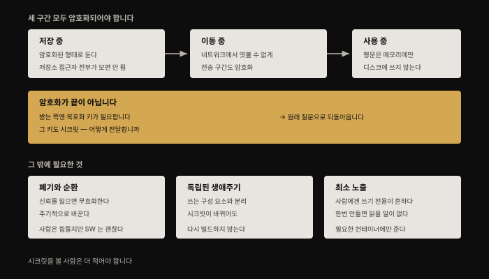
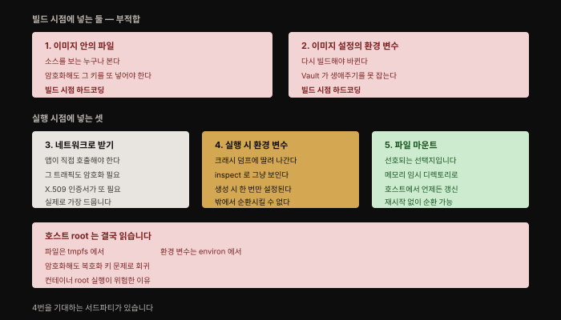
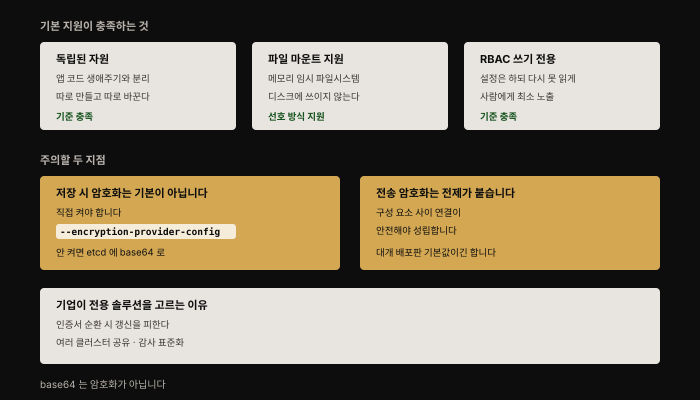
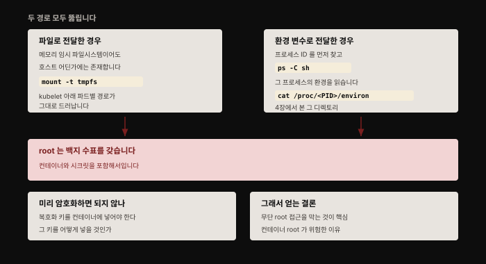

# 컨테이너에 시크릿 전달하기 — 다섯 경로와 root라는 천장
---
> 애플리케이션 코드는 일을 하려면 자격증명이 필요합니다. 데이터베이스 비밀번호, API 접근 토큰 같은 것들입니다. **자격증명은 자원 접근을 제한하려고 존재**하므로, 그 자격증명 자체가 "비밀"로 남고 정말 필요한 사람과 구성 요소만 접근할 수 있어야 합니다.

## 핵심 요약

이 장은 두 질문으로 이뤄집니다. **시크릿은 어떤 성질을 갖춰야 하는가**, 그리고 **컨테이너에 그것을 어떻게 넣는가**입니다.

경로는 다섯인데 결론은 간명합니다. **빌드 시점에 넣는 둘은 탈락**이고(하드코딩), 실행 시점의 셋 중 **파일 마운트가 선호되는 방식**입니다. 환경 변수는 크래시 덤프와 `inspect`로 새고, 무엇보다 **생성 시 한 번만 설정돼 밖에서 순환시킬 수 없습니다**.

그리고 어느 경로를 골라도 넘지 못하는 천장이 있습니다. **호스트의 root는 전부 읽습니다.**


## 학습 목표

1. 시크릿이 갖춰야 할 성질을 저장·이동·사용 세 구간으로 나눠 설명할 수 있습니다.
2. "암호화하면 되지 않나"가 왜 순환 문제인지 말할 수 있습니다.
3. 컨테이너에 정보를 넣는 다섯 경로와 각각의 적합성을 판정할 수 있습니다.
4. 환경 변수가 권장되지 않는 세 가지 이유를 압니다.
5. Kubernetes 기본 시크릿이 충족하는 기준과 남는 구멍을 구분할 수 있습니다.




## 1. 시크릿의 성질

가장 뚜렷한 성질은 **비밀이어야 한다**는 것입니다. 접근이 허용된 사람(이나 대상)만 볼 수 있어야 합니다. 보통 **시크릿 데이터를 암호화하고 복호화 키를 볼 권한이 있는 주체에게만 공유해** 이를 보장합니다.

구간별로 요구가 갈립니다.

| 구간 | 요구 |
|------|------|
| **저장 중** | 암호화된 형태로 저장해야 합니다. 데이터 저장소에 접근할 수 있는 **모든 사용자가 볼 수 있으면 안 됩니다** |
| **이동 중** | 저장소에서 쓰이는 곳으로 옮길 때도 암호화되어 **네트워크에서 엿볼 수 없어야** 합니다 |
| **사용 중** | 이상적으로는 **암호화되지 않은 상태로 디스크에 절대 쓰이지 않아야** 하고, 애플리케이션이 평문을 필요로 할 때는 **메모리에만** 두는 것이 최선입니다 |

### 암호화가 끝이 아닌 이유

여기서 이 장의 뼈대가 되는 논리가 나옵니다. 시크릿을 암호화했으니 이제 안전하게 다른 구성 요소에 넘길 수 있다고 생각하기 쉽습니다. **그런데 받는 쪽은 받은 정보를 복호화할 줄 알아야 하고, 그러려면 복호화 키가 필요합니다.**

**이 키 자체가 시크릿입니다.** 받는 쪽은 그것을 어떻게든 손에 넣어야 하고, 그러면 **"이 한 단계 위의 시크릿을 어떻게 안전하게 전달하나"라는 원래 질문으로 되돌아옵니다.**

이 순환은 이 장 전체에서 반복해 등장합니다. 저자가 뒤에서 두 번 더 같은 논리로 되돌아오는데, **암호화는 시크릿 전달 문제를 해결하지 않고 한 칸 미룰 뿐**이라는 점이 핵심입니다.

### 폐기와 순환

**폐기**할 수 있어야 합니다. 더 이상 신뢰해서는 안 될 때 무효화하는 것입니다. 무단 접근이 있었다고 알거나 의심될 때, 또는 **팀에서 누군가 떠나는** 것 같은 단순한 운영상 이유로도 필요합니다.

**순환**(변경)도 필요합니다. 시크릿이 침해됐는지 반드시 알 수 있는 것은 아니므로, 이따금 바꿔 두면 자격증명을 손에 넣은 공격자가 **그것이 더 이상 통하지 않는다는 것을 발견하게** 됩니다.

> 저자가 여기서 흥미로운 대비를 답니다. **사람에게 비밀번호를 주기적으로 바꾸라고 강요하는 것이 나쁜 생각이라는 점은 이제 잘 알려져 있습니다.** 반면 **소프트웨어 구성 요소는 자주 바뀌는 자격증명을 얼마든지 감당합니다.**

### 독립된 생애주기와 최소 노출

시크릿의 생애주기는 **그것을 쓰는 구성 요소의 생애주기와 독립적**이어야 합니다. 그래야 **시크릿이 바뀔 때 구성 요소를 다시 빌드하고 재배포하지 않아도** 됩니다.

노출 범위도 좁아야 합니다. 시크릿에 접근해야 할 사람의 집합은 **그 시크릿을 쓸 애플리케이션 소스 코드에 접근해야 할 사람들보다, 또는 배포와 관리를 수행할 수 있는 사람들보다 훨씬 작은** 경우가 많습니다. 저자의 예가 명료합니다 — **은행에서 개발자가 계좌 정보에 접근할 수 있는 운영 시크릿에 접근해야 할 이유는 없습니다.**

> 여기서 실무 관행 하나가 나옵니다. 시크릿 접근이 사람에게는 **쓰기 전용**인 경우가 꽤 흔합니다. 시크릿이 (종종 자동으로 무작위 생성되어) 한번 만들어지면, **사람이 그것을 다시 읽어 낼 정당한 이유가 아예 없을 수 있습니다.**

제한 대상은 사람만이 아닙니다. 이상적으로는 **시크릿을 읽을 수 있는 소프트웨어 구성 요소도 그것이 필요한 것들뿐**이어야 합니다. 컨테이너 맥락에서는 **정상 동작에 그것이 실제로 필요한 컨테이너에만** 시크릿을 노출한다는 뜻입니다.


## 2. 컨테이너에 정보를 넣는 다섯 경로

컨테이너가 **의도적으로 격리된 대상**이라는 점을 생각하면, 실행 중인 컨테이너에 정보를 넣는 방법이 제한적인 것은 놀랍지 않습니다. 저자는 다섯을 나열합니다.



| # | 경로 | 시점 |
|---|------|------|
| 1 | 이미지 루트 파일시스템의 **파일**로 포함 | 빌드 |
| 2 | 이미지에 딸린 설정의 **환경 변수** | 빌드 |
| 3 | **네트워크 인터페이스**로 수신 | 실행 |
| 4 | 컨테이너 실행 시점에 **환경 변수 정의·덮어쓰기**(`docker run -e`) | 실행 |
| 5 | 호스트의 **볼륨을 마운트**해 읽기 | 실행 |

### 1·2 — 이미지에 넣는 것은 부적합합니다

앞의 둘은 **빌드 시점에 시크릿을 하드코딩해야 하므로** 시크릿 데이터에 적합하지 않습니다. 가능은 하지만 일반적으로 나쁜 생각으로 여겨집니다.

- **이미지 소스 코드에 접근할 수 있는 누구나 시크릿을 봅니다.** 평문 대신 암호화하면 되지 않을까 싶겠지만, 그러면 **컨테이너가 복호화할 수 있도록 또 다른 시크릿을 어떻게든 넣어야** 합니다. 그 두 번째 시크릿은 무슨 방법으로 넣을 것입니까.
- **이미지를 다시 빌드하지 않으면 시크릿을 바꿀 수 없습니다.** 이 둘은 분리하는 편이 낫습니다. 게다가 CyberArk나 HashiCorp Vault 같은 **중앙집중식 자동 시크릿 관리 시스템이 소스에 하드코딩된 시크릿의 생애주기를 통제할 수 없습니다.**

> 저자가 현실을 짚습니다. **소스 코드에 시크릿이 박혀 있는 경우를 놀랍도록 흔하게 봅니다.** 이유 하나는 개발자들이 그것이 나쁜 생각이라는 것을 다 알지는 못해서이고, 다른 하나는 **개발·테스트 중에 지름길로 코드에 직접 넣어 두고 나중에 빼려다가 그냥 잊어버리기 때문**입니다.

### 3 — 네트워크로 받기

세 번째는 애플리케이션 코드가 정보를 가져오거나 받으려고 **적절한 네트워크 호출을 해야** 합니다. 그래서 저자가 **실제 현장에서 가장 드물게 본** 접근입니다.

게다가 시크릿을 나르는 **네트워크 트래픽을 암호화하는 문제**가 붙는데, 이는 11장에서 본 **X.509 인증서라는 또 하나의 시크릿**을 필요로 합니다.

이 부분은 **서비스 메시에 넘길 수 있습니다.** 네트워크 연결이 상호 TLS를 쓰도록 설정할 수 있기 때문입니다.

### 4 — 환경 변수가 권장되지 않는 이유

네 번째, 환경 변수로 시크릿을 넘기는 것은 **일반적으로 눈총을 받습니다**. 이유가 둘입니다.

- **많은 언어와 프레임워크에서 크래시가 나면 디버그 정보를 덤프하는데 여기에 모든 환경 설정이 딸려 나올 수 있습니다.** 이 정보가 로깅 시스템으로 넘어가면 **로그에 접근할 수 있는 누구나** 환경 변수로 넘긴 시크릿을 봅니다.
- **`docker inspect`(또는 동등한 명령)를 돌릴 수 있으면 컨테이너에 정의된 환경 변수를 전부 봅니다.** 빌드 시점이든 런타임이든 상관없습니다. **컨테이너 속성을 들여다볼 정당한 이유가 있는 관리자가 시크릿까지 접근해야 하는 것은 아닙니다.**

원문은 이를 직접 보여 줍니다.

```bash
# 이미지에 정의된 환경 변수
docker image inspect --format '{{.Config.Env}}' nginx

# 실행 시 넘긴 것까지 포함해 그대로 노출됩니다
docker run -e EXTRA_ENV=HELLO --rm -d nginx
docker container inspect --format '{{.Config.Env}}' <컨테이너 ID>
```

두 번째 명령의 출력에는 **`EXTRA_ENV=HELLO`가 그대로** 들어 있습니다.

**12-factor 앱 선언**이 환경 변수로 설정을 넘기라고 권장하기 때문에, 실무에서는 **일부 시크릿 값을 포함해 이 방식으로 설정되기를 기대하는 서드파티 컨테이너**를 돌리게 될 수 있습니다. 위험을 완화하는 방법이 둘 있습니다(리스크 프로파일에 따라 할 만할 수도, 아닐 수도 있습니다).

- **출력 로그를 처리해** 시크릿 값을 제거하거나 가립니다.
- **앱 컨테이너를 수정하거나 사이드카 컨테이너를 써서** 안전한 저장소(Vault, CyberArk Conjur, 클라우드 사업자의 키 관리 시스템)에서 시크릿을 가져오게 합니다.

> 저자가 마지막으로 짚는 한계가 결정적입니다. **프로세스의 환경은 프로세스가 생성되는 시점에 딱 한 번 설정됩니다.** 시크릿을 순환시키고 싶어도 **밖에서 컨테이너의 환경을 다시 설정할 수 없습니다.** 앞서 "순환 가능해야 한다"고 한 성질을 환경 변수는 구조적으로 만족하지 못하는 것입니다.

### 5 — 파일 마운트가 선호되는 방식입니다

**시크릿을 넘기는 선호 방식은 컨테이너가 마운트된 볼륨을 통해 접근할 수 있는 파일에 쓰는 것**입니다. 이상적으로 이 마운트된 볼륨은 **디스크에 쓰이지 않고 메모리에 유지되는 임시 디렉토리**여야 합니다. 여기에 안전한 시크릿 저장소를 결합하면 **시크릿이 암호화되지 않은 채로 "저장된 상태"로 남는 일이 없습니다.**

이 방식의 결정적 이점이 순환입니다. 파일이 호스트에서 컨테이너로 마운트되므로 **컨테이너를 재시작하지 않고도 호스트 쪽에서 언제든 갱신할 수 있습니다.** 애플리케이션이 옛 시크릿이 통하지 않을 때 파일에서 새 시크릿을 가져올 줄 안다면, **컨테이너 재시작 없이 시크릿을 순환**시킬 수 있습니다.


## 3. Kubernetes 기본 시크릿

Kubernetes를 쓴다면 좋은 소식은 **기본 시크릿 지원이 이 장 앞부분에서 말한 기준 상당수를 충족**한다는 것입니다.



| 기준 | Kubernetes의 대응 |
|------|-----------------|
| 독립된 생애주기 | 시크릿이 **독립된 자원**으로 생성되어 애플리케이션 코드의 생애주기에 묶이지 않습니다 |
| 저장 시 암호화 | 가능하지만 **기본 활성이 아니라 명시적으로 켜야** 합니다 |
| 전송 중 암호화 | 구성 요소 사이 전송 중에는 암호화됩니다. 다만 **구성 요소 사이에 안전한 연결이 있어야** 하고, 대부분의 배포판에서는 기본적으로 그렇습니다 |
| 파일 방식 | 환경 변수뿐 아니라 **파일 방식도 지원**해, **메모리에 유지되고 디스크에 절대 쓰이지 않는 임시 파일시스템**에 파일로 마운트합니다 |
| 최소 노출 | **RBAC**을 설정해 사용자가 시크릿을 설정할 수는 있지만 다시 읽지는 못하게 **쓰기 전용 권한**을 줄 수 있습니다 |

> 여기서 반드시 알아야 할 사실이 있습니다. **기본적으로 Kubernetes에서 시크릿 값은 etcd 데이터 저장소에 base64로 인코딩될 뿐 암호화되지 않은 채 저장됩니다.** etcd가 데이터 저장소를 암호화하도록 설정할 수 있지만, **복호화 키를 호스트에 저장하지 않도록 주의**해야 합니다. 앞서 본 순환 문제가 여기서 또 나타납니다.

**base64는 인코딩이지 암호화가 아닙니다.** 되돌리는 데 어떤 키도 필요 없습니다.

### 기업이 전용 솔루션을 고르는 이유

저자의 경험상 **대부분의 기업은 시크릿 저장에 서드파티 상용 솔루션을 선택**합니다. 클라우드 사업자의 것(AWS KMS나 Azure·GCP 대응물)이거나 HashiCorp·CyberArk 같은 벤더의 것입니다. 이점이 셋입니다.

- **인증서 순환** — Kubernetes 구성 요소 자체가 쓰는 인증서를 순환하면 **Kubernetes 시크릿 전부를 갱신해야** 합니다. 전용 시크릿 관리 솔루션을 쓰면 이를 피할 수 있습니다.
- **여러 클러스터가 공유**할 수 있습니다. 시크릿 값을 애플리케이션 클러스터의 생애주기와 무관하게 순환시킬 수 있습니다.
- **표준화** — 조직이 시크릿을 다루는 방식 하나로 통일하고, 관리 모범 사례와 **일관된 로그·감사**를 갖추기 쉬워집니다.


## 4. root라는 천장

여기가 이 장의 결론이자 앞 장들과 이어지는 지점입니다. **시크릿이 마운트된 파일로 전달되든 환경 변수로 전달되든, 호스트의 root 사용자는 접근할 수 있습니다.**



### 파일이면 — tmpfs 경로가 드러납니다

시크릿이 파일에 담겨 있다면 그 파일은 **호스트 파일시스템 어딘가에 존재**합니다. 임시 디렉토리에 있더라도 root는 접근할 수 있습니다. Kubernetes 노드에서 마운트된 임시 파일시스템을 나열하면 이렇게 나옵니다.

```bash
mount -t tmpfs
# tmpfs on /var/lib/kubelet/pods/<파드 UID>/volumes/kubernetes.io~secret/coredns-token-gxsqd type tmpfs (rw,relatime)
# tmpfs on /var/lib/kubelet/pods/<파드 UID>/volumes/kubernetes.io~secret/kube-proxy-token-bvktc type tmpfs (rw,relatime)
```

**이 출력의 디렉토리 이름을 쓰면 root는 그 안의 시크릿 파일에 어렵지 않게 접근합니다.**

### 환경 변수면 — /proc에서 읽힙니다

환경 변수에 담긴 시크릿을 뽑아내는 것도 **거의 같은 수준으로 간단**합니다. 컨테이너를 환경 변수와 함께 띄우고 다른 터미널에서 프로세스 ID를 찾은 뒤, [4장에서 본](./04-02.%EB%82%98%EB%A8%B8%EC%A7%80%20namespace%EC%99%80%20%ED%98%B8%EC%8A%A4%ED%8A%B8%EC%97%90%EC%84%9C%20%EB%B3%B8%20%EC%BB%A8%ED%85%8C%EC%9D%B4%EB%84%88.md) `/proc` 디렉토리를 읽습니다.

```bash
docker run --rm -it -e SECRET=mysecret ubuntu sh
# 다른 터미널에서
ps -C sh
sudo cat /proc/<프로세스 ID>/environ
# PATH=...HOSTNAME=...TERM=xtermSECRET=mysecretHOME=/root
```

**환경으로 넘긴 어떤 시크릿이든 이렇게 읽힙니다.**

> 저자가 여기서 또 순환 논리로 돌아옵니다. "**먼저 암호화하는 편이 낫지 않을까**" 싶다면, **그 복호화 키를 컨테이너에 어떻게 넣을지 생각해 보라**는 것입니다. 이 장에서 세 번째로 같은 벽에 부딪히는 지점입니다.

### 이 장이 9장과 만나는 자리

저자가 마지막 문단에서 강조를 아끼지 않습니다.

> **호스트 머신에 root 접근을 가진 사람은 그 머신의 모든 것에 백지 수표를 갖습니다.** 모든 컨테이너와 그 시크릿을 포함해서입니다.

그래서 **배포 안에서 무단 root 접근을 막는 것이 그토록 중요**하고, **컨테이너 안에서 root로 도는 것이 그토록 위험**합니다.

9장에서 본 대로 **컨테이너 안의 root가 호스트의 root이므로, 그 호스트의 모든 것을 침해하기까지 한 걸음밖에 남지 않습니다.**

즉 이 장의 시크릿 논의는 **9장의 root 논의 없이는 완결되지 않습니다.** 시크릿 전달 방식을 아무리 고르게 다듬어도, root 경계가 무너지면 전부 무의미해집니다.


## Spring 앱 개발 관점

이 장은 Spring 개발자가 **매일 마주치는 결정**입니다. `application.yml`에 DB 비밀번호를 어떻게 넣을 것인가가 정확히 이 장의 질문입니다.

### 다섯 경로가 Spring에서는 이렇게 나타납니다

| 이 장의 경로 | Spring에서의 모습 | 판정 |
|-------------|-----------------|------|
| 1. 이미지 안의 파일 | `application.yml`에 평문 비밀번호를 적고 JAR에 빌드 | **금지** — 소스와 이미지를 가진 누구나 읽음 |
| 2. 이미지 설정의 환경 변수 | Dockerfile의 `ENV DB_PASSWORD=...` | **금지** — 다시 빌드해야 바뀜 |
| 4. 실행 시 환경 변수 | `SPRING_DATASOURCE_PASSWORD` 주입 | **주의** — 아래 참조 |
| 5. 파일 마운트 | Secret을 볼륨으로 마운트 후 경로 참조 | **권장** |

**Spring Boot의 relaxed binding이 4번을 아주 편하게 만듭니다.** `spring.datasource.password`가 `SPRING_DATASOURCE_PASSWORD` 환경 변수로 자동 매핑되므로 코드를 한 줄도 안 바꾸고 주입됩니다. 편해서 널리 쓰이지만, **이 장이 든 세 위험이 그대로 붙습니다.**

특히 Spring에서 첫 번째 위험이 현실적입니다. **스타트업 실패 시 Spring이 찍는 스택 트레이스와 진단 로그**, 그리고 Actuator의 `/actuator/env` 엔드포인트가 환경을 노출할 수 있습니다. Actuator는 기본적으로 값을 마스킹하지만, **마스킹 설정을 풀어 둔 경우가 드물지 않습니다.**

### 파일 마운트를 Spring에서 쓰는 법

Spring Boot는 파일 기반 시크릿을 직접 지원합니다. Kubernetes Secret을 볼륨으로 마운트하면 **디렉토리 안에 키 이름의 파일들**이 생기는데, 이것을 설정으로 읽어들일 수 있습니다.

```yaml
spring:
  config:
    import: "optional:configtree:/etc/secrets/"
```

`/etc/secrets/spring.datasource.password` 파일이 있으면 그 값이 해당 프로퍼티가 됩니다. 이 방식이 이 장의 5번이고, **메모리 tmpfs에 마운트되어 디스크에 쓰이지 않는다**는 이점이 그대로 따라옵니다.

### 순환이 되는가 — 이 장의 진짜 기준

저자가 환경 변수의 결정적 한계로 든 것이 **"생성 시 한 번만 설정돼 밖에서 순환시킬 수 없다"** 입니다. 이것이 Spring에서 구체적인 차이를 만듭니다.

- **환경 변수로 주입하면** — 시크릿을 바꾸려면 **파드를 다시 띄워야** 합니다. 프로세스의 환경은 밖에서 못 고칩니다.
- **파일로 마운트하면** — kubelet이 마운트된 Secret 파일을 갱신하므로 **파드 재시작 없이 값이 바뀝니다.** 다만 **애플리케이션이 그것을 다시 읽어야** 의미가 있습니다. 저자가 "애플리케이션이 새 시크릿을 가져올 줄 안다면"이라고 단서를 단 부분입니다.

Spring에서 그 다시 읽기를 담당하는 것이 `@RefreshScope`와 Actuator의 refresh 엔드포인트, 또는 DataSource 수준의 자격증명 갱신입니다. **파일 마운트를 골랐다고 자동으로 순환이 되는 것이 아니라, 앱이 갱신을 처리해야 완성**됩니다.

### 개인키도 같은 문제입니다

11장의 키스토어가 여기서 만납니다. **키스토어에는 개인키가 들어 있으므로 시크릿**이고, `classpath:`로 JAR에 넣으면 이 장의 1번(이미지 안의 파일)이 됩니다. 운영에서는 `file:/etc/tls/keystore.p12`로 두고 Secret을 마운트하는 것이 5번 경로입니다.


## 심화 학습

> 이 절은 책 밖 보강입니다. 이 장은 원리 중심이라 본문이 대체로 유효한데, **Kubernetes 시크릿 생태계에 큰 추가**가 있었습니다. 아래는 2026년 8월 기준 1차 자료로 확인한 내용입니다.

### "저장 시 암호화는 기본이 아니다"는 그대로입니다

원문의 "적어도 집필 시점에는 opt-in이라 기본 활성이 아니다"는 서술이 **6년 뒤에도 정확합니다.** Kubernetes 공식 문서가 지금도 이렇게 적습니다.[^encrypt]

> **"By default, the API server stores plain-text representations of resources into etcd, with no at-rest encryption."**

확인 방법도 명시돼 있습니다. `kube-apiserver`를 `--encryption-provider-config` 인자 없이 돌리고 있으면 저장 시 암호화가 **꺼져 있는 것**이고, 그 인자를 쓰더라도 참조 파일의 첫 프로바이더가 `identity`면 **역시 꺼진 것**입니다(기본 `identity` 프로바이더는 기밀성을 전혀 제공하지 않습니다).

기능 자체는 stable이지만 **기본값이 아니라는 점이 핵심**입니다. "Kubernetes Secret을 쓰니 암호화된다"는 오해가 여기서 나옵니다.

### 책에 없는 축 — 외부 저장소를 파일로 마운트하기

원문은 Vault·CyberArk를 "전용 솔루션"으로 언급하되, **그것을 컨테이너에 연결하는 표준 방법**은 다루지 않았습니다. 집필 이후 그 자리를 메우는 도구가 자리 잡았습니다.

**Secrets Store CSI Driver**(kubernetes-sigs)는 외부 시크릿 저장소의 값을 **파드에 볼륨으로 마운트**합니다.[^csi] 핵심 기능은 **Stable**이고, Kubernetes Secret으로 동기화하는 기능과 자동 순환은 **여전히 Alpha**입니다.

이것이 이 장과 정확히 맞물립니다. 저자가 **"선호되는 방식은 파일 마운트"** 라고 했고 **"전용 시크릿 관리 솔루션이 낫다"** 고 했는데, CSI Driver가 **그 둘을 하나로 잇습니다** — 외부 저장소의 시크릿이 Kubernetes Secret을 거치지 않고 곧장 파일로 마운트됩니다. etcd에 base64로 남는 문제 자체를 우회하는 셈입니다.

**External Secrets Operator**(6.8k stars, 활발)는 반대 방향입니다. 외부 저장소의 값을 **Kubernetes Secret으로 동기화**해 주므로 기존 워크로드를 안 고쳐도 되지만, **etcd에는 여전히 Secret이 남습니다.** 둘의 차이가 곧 트레이드오프입니다.

### root 천장은 여전히 유효합니다

이 장의 결론(호스트 root는 전부 읽는다)은 **어떤 도구로도 바뀌지 않았습니다.** CSI Driver로 마운트해도 그 tmpfs 경로는 호스트에 있고, root는 읽습니다.

바뀐 것은 9장 심화에서 정리한 **root 경계 자체를 좁히는 수단**들입니다. Pod의 user namespace(`hostUsers: false`, v1.36 stable)와 rootless 런타임이 그것입니다.

즉 **시크릿 전달 방식을 개선하는 것과 root 경계를 좁히는 것은 별개의 축**이고, 이 장의 논리대로라면 **후자 없이는 전자가 완결되지 않습니다.**


## 결정 치트시트

| 상황 | 판단 | 근거 |
|------|------|------|
| `application.yml`에 비밀번호를 적으려 한다 | 하지 않음 | 이미지·소스를 가진 누구나 읽음 |
| 시크릿을 암호화해서 이미지에 넣을까 | 소용없음 | **복호화 키를 어떻게 넣을 것인가**로 회귀 |
| 환경 변수 주입이 편한데 | 위험 셋을 감수하는지 판단 | 크래시 덤프·`inspect`·**순환 불가** |
| 서드파티 컨테이너가 환경 변수를 요구 | 로그 마스킹 + 사이드카로 저장소 연동 | 12-factor 관행상 불가피한 경우 |
| 시크릿을 순환시켜야 한다 | **파일 마운트** + 앱의 재읽기 | 환경은 생성 시 한 번만 설정됨 |
| 파일로 마운트했다 | 앱이 갱신을 읽는지 확인 | 마운트만으로는 순환이 완성되지 않음 |
| Kubernetes Secret을 쓴다 | **저장 시 암호화를 직접 켠다** | 기본은 etcd에 base64만 |
| "base64니까 안전한가" | 아님 | 인코딩이지 암호화가 아님 |
| 외부 저장소를 쓰고 싶다 | CSI Driver(파일 직결) 또는 ESO(Secret 동기화) | etcd에 남기느냐가 갈림 |
| 시크릿 방식을 다 갖췄다 | **root 경계도 함께 좁힌다** | root는 어느 경로든 읽음 |


## 면접에서 받을 만한 질문

1. 시크릿을 암호화해서 이미지에 넣으면 안전하지 않습니까?
2. 환경 변수로 시크릿을 넘기는 것이 왜 권장되지 않습니까?
3. 파일 마운트가 선호되는 이유는 무엇입니까?
4. Kubernetes Secret은 암호화되어 저장됩니까?
5. 시크릿 전달을 완벽하게 해도 남는 위험은 무엇입니까?


## 정답

**1.** 아닙니다. **받는 쪽이 복호화하려면 복호화 키가 필요한데, 그 키 자체가 시크릿**입니다. 그것을 컨테이너에 어떻게 넣을 것인가라는 **원래 질문으로 되돌아옵니다.** 암호화는 문제를 해결하지 않고 한 칸 미룰 뿐입니다. 덧붙여 이미지에 넣으면 **다시 빌드해야 바뀌고**, Vault 같은 관리 시스템이 생애주기를 통제할 수 없습니다.

**2.** 세 가지입니다. **크래시 시 디버그 덤프에 환경 설정이 딸려 나가** 로그 접근자에게 노출될 수 있고, **`docker inspect`로 그냥 보이며**(컨테이너 속성을 볼 정당한 이유가 있는 관리자가 시크릿까지 봐야 하는 것은 아닙니다), 결정적으로 **프로세스의 환경은 생성 시 한 번만 설정되어 밖에서 순환시킬 수 없습니다.**

**3.** 마운트된 볼륨의 파일로 주면 **메모리 임시 디렉토리에 둘 수 있어 디스크에 쓰이지 않고**, **호스트 쪽에서 언제든 갱신할 수 있어 컨테이너 재시작 없이 순환**이 가능합니다. 단 애플리케이션이 **새 시크릿을 다시 읽을 줄 알아야** 순환이 완성됩니다.

**4.** **기본적으로는 아닙니다.** etcd에 **base64로 인코딩될 뿐 암호화되지 않은 채** 저장됩니다. base64는 인코딩이지 암호화가 아니라 키 없이 되돌릴 수 있습니다. 저장 시 암호화는 **명시적으로 켜야** 하며, `--encryption-provider-config` 없이 API 서버를 돌리고 있다면 꺼진 상태입니다.

**5.** **호스트 root**입니다. 파일로 줬다면 tmpfs 경로를 찾아 읽고, 환경 변수로 줬다면 `/proc/<PID>/environ`에서 읽습니다. **root 접근을 가진 사람은 그 머신의 모든 것에 백지 수표를 갖습니다.** 그래서 무단 root 접근을 막는 것과 **컨테이너 안에서 root로 돌지 않는 것**이 중요합니다 — 컨테이너의 root가 호스트의 root이므로 침해까지 한 걸음입니다.


## 핵심 개념 체크리스트

- [ ] 시크릿의 요구를 저장·이동·사용 세 구간으로 나눠 말할 수 있다
- [ ] 암호화가 복호화 키라는 순환 문제를 낳는다는 것을 안다
- [ ] 폐기와 순환이 왜 필요한지, 사람과 소프트웨어의 차이를 안다
- [ ] 시크릿 생애주기가 구성 요소와 독립적이어야 하는 이유를 안다
- [ ] 사람에게는 쓰기 전용 접근이 흔하다는 관행을 안다
- [ ] 다섯 경로를 열거하고 빌드 시점 둘이 왜 탈락인지 설명할 수 있다
- [ ] 환경 변수의 세 위험, 특히 순환 불가를 안다
- [ ] 파일 마운트가 재시작 없는 순환을 가능하게 하는 원리를 안다
- [ ] Kubernetes Secret이 기본적으로 etcd에 base64로만 저장됨을 안다
- [ ] 호스트 root가 두 경로 모두에서 시크릿을 읽는 방법을 안다
- [ ] 이 장의 결론이 9장의 root 논의와 이어짐을 설명할 수 있다


## 참고 자료

- 《Container Security: Fundamental Technology Concepts that Protect Containerized Applications》(Liz Rice, O'Reilly, 2020, 1판) Chapter 12 — 이 노트의 원문
- [Kubernetes — Encrypting Confidential Data at Rest](https://kubernetes.io/docs/tasks/administer-cluster/encrypt-data/) — 기본이 평문 저장임을 명시한 공식 문서
- [Kubernetes — Secrets](https://kubernetes.io/docs/concepts/configuration/secret/) — 기본 시크릿의 보안 속성
- [Secrets Store CSI Driver](https://secrets-store-csi-driver.sigs.k8s.io/) — 외부 저장소를 파일로 마운트, 핵심 기능 Stable
- [11-01. TLS로 컴포넌트 안전하게 연결하기](./11-01.TLS%EB%A1%9C%20%EC%BB%B4%ED%8F%AC%EB%84%8C%ED%8A%B8%20%EC%95%88%EC%A0%84%ED%95%98%EA%B2%8C%20%EC%97%B0%EA%B2%B0%ED%95%98%EA%B8%B0%20%E2%80%94%20%ED%82%A4%C2%B7%EC%9D%B8%EC%A6%9D%EC%84%9C%C2%B7CA%EC%9D%98%20%EC%97%AD%ED%95%A0.md) — 이 장이 전달해야 할 개인키가 왜 필요한지
- [09-01. 컨테이너 격리 깨뜨리기](./09-01.%EC%BB%A8%ED%85%8C%EC%9D%B4%EB%84%88%20%EA%B2%A9%EB%A6%AC%20%EA%B9%A8%EB%9C%A8%EB%A6%AC%EA%B8%B0%20%E2%80%94%20%EC%84%A4%EC%A0%95%20%ED%95%98%EB%82%98%EB%A1%9C%20%EB%AC%B4%EB%84%88%EC%A7%80%EB%8A%94%20%EA%B2%BD%EA%B3%84.md) — 이 장의 root 결론이 기대는 근거
- [Container Security 정독 인덱스](./README.md) — 이 책의 장별 진행 상태

[^encrypt]: Kubernetes 공식 문서 "Encrypting Confidential Data at Rest"에서 다음을 확인했습니다(2026-08-09 조회). <https://kubernetes.io/docs/tasks/administer-cluster/encrypt-data/>

    - "By default, the API server stores plain-text representations of resources into etcd, with no at-rest encryption."
    - `--encryption-provider-config` 없이 실행하면 암호화가 꺼진 상태라는 판별법
    - 기본 `identity` 프로바이더가 기밀성을 제공하지 않는다는 서술

[^csi]: Secrets Store CSI Driver 공식 문서 — 외부 시크릿 저장소의 시크릿·키·인증서를 파드에 볼륨으로 마운트하며, 핵심 드라이버 기능은 Stable이고 Kubernetes Secret 동기화와 자동 순환은 Alpha라는 서술을 확인했습니다(2026-08-09 조회). <https://secrets-store-csi-driver.sigs.k8s.io/>
