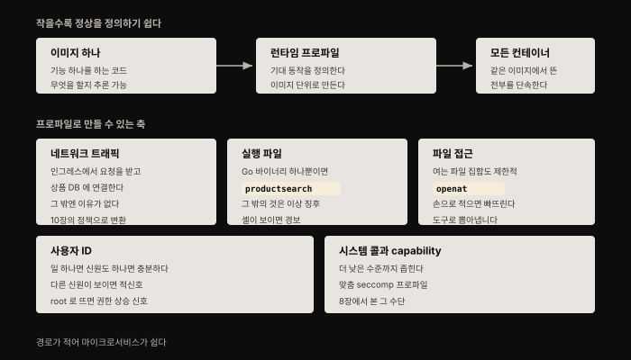
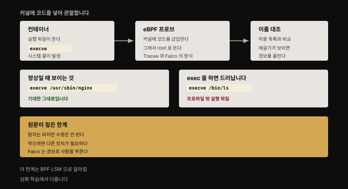
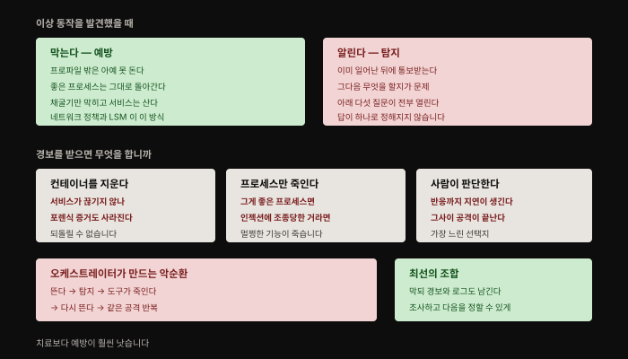
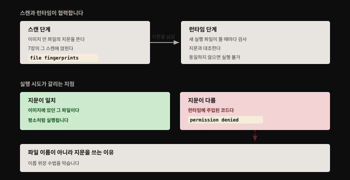

# 컨테이너 런타임 보호 — 정상을 정의해 이상을 잡다
---
> 컨테이너의 특징 하나는 **마이크로서비스 아키텍처에 잘 맞는다**는 것입니다. 큰 시스템을 인터페이스가 잘 정의된 작은 구성 요소로 쪼개면 설계·코딩·테스트가 쉬워지는데, **알고 보니 보안에도 그렇습니다.**

## 핵심 요약

이 장의 발상은 하나입니다. **작은 서비스는 정상 동작을 정의할 수 있고, 정의할 수 있으면 벗어난 것을 잡을 수 있습니다.**

이미지 하나가 기능 하나를 한다면 그것이 무엇을 해야 하는지 추론할 수 있고, 같은 이미지에서 뜬 컨테이너는 전부 같게 동작해야 하므로 **프로파일을 이미지 단위로 만들어 모든 컨테이너를 단속**할 수 있습니다. 축은 다섯입니다 — 네트워크 트래픽, 실행 파일, 파일 접근, 사용자 ID, 그리고 시스템 콜·capability입니다.

마지막에 남는 질문이 실무적으로 가장 어렵습니다. **이상을 발견했을 때 막을 것인가, 알릴 것인가.** 저자의 답은 분명합니다 — **치료보다 예방**입니다.


## 학습 목표

1. 이미지 단위 런타임 프로파일이 성립하는 전제를 설명할 수 있습니다.
2. 프로파일로 만들 수 있는 다섯 축과 각각의 이상 신호를 압니다.
3. eBPF로 실행 파일을 관찰하는 원리와 원문이 지적한 한계를 말할 수 있습니다.
4. 경보 자동 처리의 다섯 딜레마를 열거하고 왜 정답이 없는지 설명할 수 있습니다.
5. 드리프트 방지가 스캔과 런타임을 어떻게 잇는지, 왜 파일 이름이 아닌 지문인지 압니다.




## 1. 이미지 프로파일이라는 발상

어떤 컨테이너 이미지가 마이크로서비스의 코드를 담고 **그 마이크로서비스가 작은 기능 하나를 한다면, 그것이 무엇을 해야 하는지 추론하기가 비교적 쉽습니다.** 코드가 이미지에 빌드되므로 **그 이미지에 대응하는 런타임 프로파일**을 만들어 무엇을 할 수 있어야 하는지 정의할 수 있습니다.

여기에 핵심 전제가 하나 붙습니다. **주어진 이미지에서 만들어진 모든 컨테이너는 같은 방식으로 동작해야 합니다.** 그러므로 기대 동작의 프로파일을 **이미지에 대해** 정의하고, 그것으로 **그 이미지 기반 모든 컨테이너의 트래픽을 단속**하는 것이 이치에 맞습니다.

> Kubernetes 배포에서는 런타임 보안이 **파드 단위**로 단속될 수 있습니다. 파드는 본질적으로 네트워크 namespace를 공유하는 컨테이너 모음이라, **런타임 보안의 기저 메커니즘은 동일합니다.**

원문은 [10장의 전자상거래 예](./10-01.%EC%BB%A8%ED%85%8C%EC%9D%B4%EB%84%88%20%EB%84%A4%ED%8A%B8%EC%9B%8C%ED%81%AC%20%EB%B3%B4%EC%95%88%20%E2%80%94%20%EA%B3%84%EC%B8%B5%EB%B3%84%EB%A1%9C%20%EB%82%98%EB%88%A0%20%EB%A7%89%EA%B8%B0.md)를 이어 씁니다. 상품 검색 마이크로서비스가 고객이 입력한 검색어를 받아 상품 데이터베이스에서 조회하고 응답을 돌려주는 구조입니다.

### 축 하나 — 네트워크 트래픽

서비스 설명만으로 추론할 수 있습니다. 이 컨테이너들은 **특정 인그레스나 로드 밸런서에서 오는 웹 요청을 받아 응답**해야 하고, **상품 데이터베이스로 연결을 시작**해야 합니다. 로깅이나 헬스체크 같은 공통 플랫폼 기능을 빼면 **다른 네트워크 트래픽을 다루거나 시작할 이유가 정말 없습니다.**

이 서비스에 허용되는 트래픽을 정의한 프로파일을 그리는 일은 그리 부담스럽지 않고, 그것으로 10장에서 본 네트워크 수준 규칙을 정의할 수 있습니다. 일부 보안 도구는 **기록 모드**로 동작해 일정 기간 서비스를 드나드는 메시지를 관찰하고 **정상 트래픽 흐름의 프로파일을 자동으로 쌓아 올립니다.**

### 축 둘 — 실행 파일

상품 검색 마이크로서비스에서 실행 프로그램이 몇 개나 돌아야 할까요. 코드가 `productsearch`라는 **Go 실행 파일 하나**로 작성됐다면, 이 컨테이너 안에서 도는 실행 파일을 관찰했을 때 **`productsearch`만 보여야 합니다.** 그 밖의 것은 **이상 징후이고 공격의 신호일 수 있습니다.**

Python이나 Ruby 같은 스크립트 언어로 작성됐어도 추론은 가능합니다. **이 서비스가 다른 명령을 실행하려고 셸을 띄울 필요가 있는가?** 없다면 상품 검색 컨테이너에서 `bash`·`sh`·`zsh`가 도는 것을 본 순간 **경보를 울려야 합니다.**

> 이것이 성립하려면 전제가 둘입니다. **컨테이너를 불변으로 다뤄야** 하고, **운영 시스템의 컨테이너에 직접 셸을 열지 않아야** 합니다. 저자의 지적이 날카롭습니다 — 보안 관점에서 **공격자가 애플리케이션 취약점으로 리버스 셸을 여는 것과, 관리자가 "유지보수"를 하려고 셸을 여는 것 사이에는 거의 차이가 없습니다.**

### 축 셋 — 파일 접근

실행 파일을 시작하는 시스템 콜을 관찰하듯 **파일에 접근하는 시스템 콜도 관찰**할 수 있습니다. 일반적으로 어떤 마이크로서비스가 접근할 것으로 기대되는 **파일 위치의 집합도 비교적 제한적**입니다.

원문은 nginx 컨테이너에서 뽑은 `openat` 목록을 그대로 싣는데, `/etc/ld.so.cache`부터 각종 공유 라이브러리, `/etc/nginx/nginx.conf`, `/var/log/nginx/access.log`까지 **20개가 넘습니다.**

> 여기서 저자가 짚는 실무적 통찰이 있습니다. **이 목록은 경험 많은 프로그래머라도 손으로 프로파일을 그리려 하면 몇 개를 빠뜨릴 만큼 깁니다.** 그래서 도구로 뽑아내야 합니다.

### 축 넷 — 사용자 ID

[6장에서 논의한](./09-01.%EC%BB%A8%ED%85%8C%EC%9D%B4%EB%84%88%20%EA%B2%A9%EB%A6%AC%20%EA%B9%A8%EB%9C%A8%EB%A6%AC%EA%B8%B0%20%E2%80%94%20%EC%84%A4%EC%A0%95%20%ED%95%98%EB%82%98%EB%A1%9C%20%EB%AC%B4%EB%84%88%EC%A7%80%EB%8A%94%20%EA%B2%BD%EA%B3%84.md) 대로 컨테이너 안 프로세스가 어떤 사용자 ID로 도는지 정의할 수 있으므로, 이것도 런타임에 단속할 수 있는 축입니다.

일반 법칙은 이렇습니다. **컨테이너가 일 하나를 한다면 신원 하나로만 동작하면 충분합니다.** 다른 신원을 쓰는 것을 관찰했다면 **또 하나의 적신호**이고, **프로세스가 예상치 못하게 root로 돌고 있다면 이 권한 상승은 훨씬 더 큰 우려 사유**입니다.

### 축 다섯 — 시스템 콜과 capability

더 낮은 수준으로 내려가 `productsearch`가 **필요로 하는 시스템 콜과 capability의 집합**을 프로파일링할 수 있습니다. 이것으로 그 컨테이너에 특화된 **"꼭 맞는" seccomp나 AppArmor 프로파일**을 만들 수 있습니다([8장](./08-01.%EC%BB%A8%ED%85%8C%EC%9D%B4%EB%84%88%20%EA%B2%A9%EB%A6%AC%20%EA%B0%95%ED%99%94%20%E2%80%94%20%EC%83%8C%EB%93%9C%EB%B0%95%EC%8B%B1%EC%9D%98%20%EC%84%B8%20%EA%B0%88%EB%9E%98.md)).

원문이 Tracee로 nginx 컨테이너에서 뽑은 capability 목록은 일곱입니다.

```bash
CAP_CHOWN
CAP_DAC_OVERRIDE
CAP_DAC_READ_SEARCH
CAP_NET_BIND_SERVICE
CAP_SETGID
CAP_SETUID
CAP_SYS_ADMIN
```

> 저자가 이 절을 닫으며 중요한 이유를 답니다. **이런 프로파일을 만드는 일은 모놀리스보다 마이크로서비스 애플리케이션에서 훨씬 쉽습니다.** 마이크로서비스를 지나는 **가능한 경로의 수가 극적으로 적기** 때문입니다. 정상 경로뿐 아니라 **오류 경로까지 훑어** 모든 파일 접근·시스템 콜·실행 파일이 빠짐없이 반영됐는지 확인하기도 비교적 쉽습니다.


## 2. eBPF로 실행 파일 관찰하기

컨테이너 안에서 실행되는 실행 파일을 어떻게 포착할까요. 이를 위한 기술 하나가 **eBPF**입니다.



[8장에서 만난](./08-01.%EC%BB%A8%ED%85%8C%EC%9D%B4%EB%84%88%20%EA%B2%A9%EB%A6%AC%20%EA%B0%95%ED%99%94%20%E2%80%94%20%EC%83%8C%EB%93%9C%EB%B0%95%EC%8B%B1%EC%9D%98%20%EC%84%B8%20%EA%B0%88%EB%9E%98.md) Tracee가 eBPF를 씁니다. **eBPF는 Tracee가 커널에 코드를 삽입할 수 있게 하므로 root로 실행해야 합니다.**

원문의 시연은 간결합니다. nginx 컨테이너를 띄우면 Tracee가 기대대로 nginx 실행 파일이 시작되는 것을 보여 줍니다.

```bash
docker run --rm -d --name nginx nginx
# EVENT   ARGS
# execve  /usr/sbin/nginx
```

이제 컨테이너 안에서 다른 명령을 실행하면 그 실행 파일이 출력에 나타납니다.

```bash
docker exec -it nginx ls
# EVENT   ARGS
# execve  /usr/sbin/nginx
# execve  /bin/ls
```

**공격자가 암호화폐 채굴기를 이 컨테이너 안에 넣었다고 상상해 봅니다.** 채굴기 실행 파일이 시작될 때 Tracee 같은 도구가 그것을 포착할 수 있습니다. 런타임 보안 도구는 eBPF나 독자 기술로 이런 관찰을 수행해 **실행 파일 이름을 허용 목록이나 차단 목록과 비교**합니다.


## 3. 도구와 그 한계

이 장까지 오면서 본 도구들이 이미 있습니다.

- [8장](./08-01.%EC%BB%A8%ED%85%8C%EC%9D%B4%EB%84%88%20%EA%B2%A9%EB%A6%AC%20%EA%B0%95%ED%99%94%20%E2%80%94%20%EC%83%8C%EB%93%9C%EB%B0%95%EC%8B%B1%EC%9D%98%20%EC%84%B8%20%EA%B0%88%EB%9E%98.md) — 컨테이너마다 AppArmor·SELinux·seccomp 프로파일을 설정
- [10장](./10-01.%EC%BB%A8%ED%85%8C%EC%9D%B4%EB%84%88%20%EB%84%A4%ED%8A%B8%EC%9B%8C%ED%81%AC%20%EB%B3%B4%EC%95%88%20%E2%80%94%20%EA%B3%84%EC%B8%B5%EB%B3%84%EB%A1%9C%20%EB%82%98%EB%88%A0%20%EB%A7%89%EA%B8%B0.md) — 네트워크 정책이나 서비스 메시로 트래픽을 단속

실행 파일·파일 접근·사용자 ID를 런타임에 단속하는 도구는 따로 있습니다. **대부분 상용이지만 오픈소스 선택지 하나가 CNCF 프로젝트 Falco**입니다. eBPF로 컨테이너 동작을 관찰하다가 **예상치 못한 실행 파일이 도는 것 같은 이상이 생기면 경보를 발생**시킵니다.

> **여기가 이 장의 가장 중요한 한계 서술입니다.** 이 접근은 이상 동작 탐지에 강력하지만 **강제(enforcement)에는 한계가 있습니다.** 저자의 근거가 명확합니다 — **eBPF는 시스템 콜을 탐지할 수는 있어도 수정할 수는 없기 때문입니다.** 그래서 공격을 관찰하고 알리는 데는 효율적이고 강력하지만, **실제로 막으려면 다른 장치가 필요합니다.** Falco는 경보를 발생시키고, 그것으로 도는 시스템을 자동 재설정하거나 사람을 부르게 합니다.

이 서술은 **집필 시점(2020) 기준으로는 정확했지만 지금은 달라졌습니다.** 심화 학습에서 다룹니다.

### 막을 것인가, 알릴 것인가

무슨 도구를 쓰든 마지막에 고려할 것이 있습니다. **이상 동작을 발견했을 때 도구가 어떤 조치를 취하기를 원하는가.**



이상적으로는 **애초에 일어나지 못하게 막는 것**입니다. 네트워크 정책과 seccomp·SELinux·AppArmor 프로파일을 적용할 때 그런 일이 일어납니다. **진짜 런타임 보호를 제공하는 상용 도구는 컨테이너에 후킹하는 독자 기술로** 이상 실행 파일 실행, 잘못된 사용자 ID 사용, 예상치 못한 파일·네트워크 접근을 막을 수 있습니다. 보통 이런 도구는 **예방 조치 대신 경보만 띄우는 모드**도 제공하는데, **시험 단계에서 프로파일이 제대로 잡혔는지 확인**하는 데 유용합니다.

막지 못하는 도구를 쓰면 경보를 받게 되는데, **그 경보를 어떻게 처리할지가 복잡한 질문**입니다. 저자가 나열하는 딜레마는 다섯입니다.

| 선택 | 따라오는 질문 |
|------|-------------|
| **컨테이너를 자동 삭제** | 사용자 서비스에 영향이 가지 않는가. 그리고 **포렌식에 유용할 증거를 지우지 않는가** |
| **문제 프로세스만 종료** | 그것이 **인젝션 공격으로 조종당한 "좋은" 프로세스**라면 어떻게 하는가 |
| **오케스트레이터가 새로 띄우게** | 새 인스턴스가 **같은 공격을 다시 받으면** 어떻게 되는가 |
| **이전 버전으로 롤백** | 새 버전이라면 되돌릴 수 있는가 |
| **사람이 조사하게** | 반응까지 **상당한 지연**이 생기고, 그 지연이 **공격이 데이터를 빼내거나 피해를 만들기에 충분한 시간**일 수 있다 |

세 번째가 특히 고약합니다. **컨테이너가 뜬다 → 나쁜 동작이 탐지된다 → 보안 도구가 죽인다 → 복제본 수를 맞추려 오케스트레이터가 다시 만든다**로 이어지는 **악순환**에 빠질 수 있습니다.

> 저자의 결론이 단호합니다. **보안 경보를 자동으로 처리하는 방법에 정답은 없습니다.** 얼마가 걸리든 그 시간이 공격자가 해를 끼치기에 충분할 수 있습니다. **이 점에서 치료보다 예방이 훨씬 낫습니다.**

막을 수 있다면 **컨테이너가 하던 대로 계속 돌 가능성**이 생깁니다. 공격자가 상품 검색 컨테이너를 침해해 채굴기를 돌리려 해도, **그 실행 파일이 프로파일에 없으므로 아예 실행되지 못하고 "좋은" 프로세스들은 평소처럼 돕니다.**

**최선은 이상 동작을 막으면서도 경보나 로그를 남기는 도구**입니다. 그래야 조사해서 진짜 공격인지 판단하고 다음 조치를 정할 수 있습니다.


## 4. 드리프트 방지

7장에서 본 대로 컨테이너를 **불변으로 다루는 것이 모범 사례**입니다. 컨테이너는 이미지에서 생성되고 그 뒤로 내용이 바뀌면 안 됩니다. 앞에서는 이것을 **취약점 탐지의 관점**으로 다뤘습니다 — 이미지에 포함되지 않은 코드는 스캔할 수 없으니 스캔하고 싶은 것을 전부 포함시켜야 한다는 논리였습니다.

**컨테이너를 불변으로 다루면 런타임 코드 주입을 탐지하는 강력한 선택지가 하나 더 생깁니다.** 그것이 **드리프트 방지**이고, 저자는 이를 **컨테이너용 런타임 보안 솔루션이라면 마땅히 제공해야 할 기능**으로 봅니다.



이 기능은 **스캔 단계와 런타임 단계의 협력**을 필요로 합니다.

1. **스캐너가 스캔의 일부로 이미지 안 파일들의 지문을 뜹니다.**
2. **런타임에 강제 도구가 컨테이너가 새 실행 파일 프로세스를 시작할 때마다 검사를 추가합니다.** 실행 파일을 스캔 단계의 지문과 비교하고, **파일이 동일하지 않으면 실행이 허용되지 않습니다**(컨테이너 안에서 "permission denied" 오류).

> 설계의 핵심이 마지막 문장에 있습니다. **파일 이름 목록이 아니라 파일 지문을 쓰기 때문에**, 공격자가 **주입한 실행 파일을 정당한 것으로 위장하려는 시도를 막을 수 있습니다.** 이름만 대조했다면 `productsearch`라는 이름으로 채굴기를 심는 것으로 우회됐을 것입니다.

이것이 7장과 13장을 잇는 지점입니다. **스캔은 배포 전에 한 번 하는 일**이었는데, 그 스캔의 산출물(지문)이 **런타임 강제의 근거**가 됩니다.


## 5. 이 장의 결론

이 장에서 설명한 것 같은 **세밀한 런타임 보호 능력**은 전문 컨테이너 보안 도구를 매력적인 선택지로 만듭니다. 저자는 특히 **은행이나 의료 기관처럼 잃을 것이 많은 조직**에 그렇다고 덧붙입니다.


## 심화 학습

> 이 절은 책 밖 보강입니다. 이 장은 **원문의 핵심 한계 서술이 그 뒤 뒤집힌** 드문 경우입니다. 아래는 2026년 8월 기준 1차 자료로 확인한 내용입니다.

### eBPF는 이제 막을 수 있습니다 — BPF LSM

원문의 가장 중요한 기술적 서술은 이것이었습니다.

> **"eBPF can detect but can't modify system calls."**

**지금은 성립하지 않습니다.** 커널 문서가 **BPF LSM 프로그램**을 이렇게 설명합니다.[^bpflsm] 이 프로그램들은 LSM 훅에 붙어 **시스템 전역의 강제 접근 제어 정책을 eBPF로 구현**할 수 있게 하고, 예제 코드가 **`return -EPERM;`으로 동작을 거부**하는 것을 그대로 보여 줍니다. 관찰 전용이 아니라 **차단할 수 있습니다.**

시점이 흥미롭습니다. **BPF LSM은 커널 5.7(2020년 5월)에 병합**됐는데, 이 책이 나온 해와 같습니다. 즉 **저자의 서술은 집필 시점에 정확했고, 기술이 바로 그 무렵 바뀌기 시작한 것**입니다.

이것이 8장에서 본 LSM 논의와 이어집니다. AppArmor·SELinux가 LSM으로 강제 접근 제어를 구현했는데, **BPF LSM은 그 자리에 eBPF 프로그램을 붙일 수 있게 한 것**입니다. 8장의 "프로파일 관리가 어렵다"는 부담과 13장의 "eBPF는 못 막는다"는 한계가 **한 지점에서 함께 풀린 셈**입니다.

### 도구 지형 — Falco는 졸업하고, 새 축이 생겼습니다

| 원문의 언급 | 2026년 8월 상태 |
|------------|----------------|
| **Falco** ("CNCF 프로젝트") | **CNCF Graduated 프로젝트**로 승격(9.2k stars, 2026-08-03). 여전히 **탐지 중심** |
| **Tracee** | 활발 (4.6k stars, 2026-08-07) |
| (원문에 없음) | **Tetragon**(Cilium, 4.9k stars) — `bpf_send_signal()`로 **커널 공간에서 kill 시그널**을 보내 사후 차단 |

저자가 "탐지와 강제 사이"라고 남긴 공백을 **두 방향**이 메웠습니다. **BPF LSM**은 exec·file open 경로에서 **인라인으로 `EPERM`을 반환**해 진짜 예방에 가깝고, **Tetragon의 시그널 방식**은 실행을 잠깐 허용한 뒤 죽이므로 **사후 완화**에 가깝습니다. 저자가 강조한 "예방이 치료보다 낫다"는 기준으로 보면 **둘의 성격이 다릅니다.**

### 원문의 파드 단위 서술 — PodSecurityPolicy

원문 NOTE는 파드 단위 런타임 보안의 예로 **PodSecurityPolicy**를 들었습니다. 8장·9장에서 이미 기록한 대로 **PSP는 v1.25에서 제거**됐고 Pod Security Admission이 그 자리를 대신합니다. 다만 저자가 그 NOTE에서 말하려던 논지("파드는 네트워크 namespace를 공유하는 컨테이너 모음이라 기저 메커니즘은 같다")는 **그대로 유효**합니다.


## 결정 치트시트

| 상황 | 판단 | 근거 |
|------|------|------|
| 프로파일을 손으로 그리려 한다 | 도구의 **기록 모드**로 뽑아냄 | nginx만 해도 파일 20개+, 사람은 빠뜨림 |
| 컨테이너에 셸을 열어 유지보수 | 하지 않음 | 공격자의 리버스 셸과 구분되지 않음 |
| 프로파일링 대상이 모놀리스 | 마이크로서비스보다 훨씬 어려움을 감안 | 가능한 경로 수가 압도적으로 많음 |
| 탐지만 되고 차단이 안 되는 도구 | 경보 처리 정책을 **미리** 정해 둠 | 사고 시점에 정하면 늦음 |
| 경보 시 컨테이너 자동 삭제 | 포렌식 증거 손실을 감수하는지 판단 | 되돌릴 수 없음 |
| 오케스트레이터가 계속 재생성 | 악순환을 끊을 장치를 함께 | 죽여도 같은 공격을 다시 받음 |
| 도구를 고를 수 있다 | **막으면서 로그도 남기는 것** | 저자가 꼽은 최선 |
| 코드 주입을 막고 싶다 | **드리프트 방지**(스캔 지문 + 런타임 대조) | 이름이 아닌 지문이라 위장 불가 |
| 시험 도입 단계 | 경보 전용 모드로 먼저 | 프로파일이 맞는지 확인 |


## 면접에서 받을 만한 질문

1. 이미지 단위로 런타임 프로파일을 만들 수 있는 근거는 무엇입니까?
2. 컨테이너에서 `bash`가 도는 것을 왜 경보 대상으로 봅니까?
3. eBPF 기반 도구의 한계는 무엇이었고, 지금은 어떻습니까?
4. 이상 동작 경보를 자동으로 처리하기 어려운 이유를 설명해 보십시오.
5. 드리프트 방지는 어떻게 동작하고, 왜 파일 이름이 아니라 지문을 씁니까?


## 정답

**1.** **같은 이미지에서 만들어진 모든 컨테이너는 같게 동작해야 하기 때문**입니다. 이미지가 기능 하나를 하는 마이크로서비스 코드를 담고 있다면 무엇을 해야 하는지 추론할 수 있고, 그 기대 동작을 이미지 단위로 정의해 **그 이미지 기반 모든 컨테이너를 단속**할 수 있습니다. 마이크로서비스가 모놀리스보다 쉬운 이유는 **가능한 경로 수가 극적으로 적어서** 오류 경로까지 훑기가 수월하기 때문입니다.

**2.** 서비스가 **셸을 띄울 필요가 없다면 그것은 프로파일 밖 실행 파일**이고 공격의 신호일 수 있습니다. 다만 이 판단이 성립하려면 전제가 둘입니다 — **컨테이너를 불변으로 다루고**, **운영 컨테이너에 사람이 셸을 열지 않아야** 합니다. 저자의 지적대로 보안 관점에서 **공격자의 리버스 셸과 관리자의 유지보수 셸은 구분되지 않습니다.**

**3.** 원문 기준 한계는 **"eBPF는 시스템 콜을 탐지할 수 있어도 수정할 수 없다"** 였습니다. 그래서 관찰·경보에는 강력하지만 **실제로 막으려면 다른 장치가 필요**했고, Falco도 경보 중심이었습니다. 지금은 **BPF LSM**이 이를 뒤집었습니다 — LSM 훅에 붙는 eBPF 프로그램이 **`-EPERM`을 반환해 동작을 거부**할 수 있습니다. 커널 5.7(2020-05)에 병합됐으니 **책이 나온 무렵 바뀌기 시작한** 셈입니다.

**4.** 어떤 선택지에도 대가가 있기 때문입니다. **컨테이너를 지우면** 서비스가 끊기고 **포렌식 증거도 사라집니다.** **프로세스만 죽이면** 그것이 인젝션으로 조종당한 정상 프로세스일 수 있습니다. **오케스트레이터가 다시 띄우면** 같은 공격을 받아 **뜨고 죽는 악순환**이 생깁니다. **사람이 판단하면** 지연이 생기고 그사이 공격이 목적을 달성할 수 있습니다. 그래서 저자의 결론은 **정답이 없으니 예방이 낫다**입니다.

**5.** **스캔 단계에서 이미지 안 파일들의 지문을 뜨고**, **런타임에 새 실행 파일이 시작될 때마다 그 지문과 대조**합니다. 동일하지 않으면 실행을 막고 `permission denied`를 냅니다. **파일 이름이 아니라 지문을 쓰는 이유는 위장을 막기 위해서**입니다 — 이름만 봤다면 공격자가 주입한 실행 파일에 정당한 이름을 붙여 우회할 수 있습니다.


## 핵심 개념 체크리스트

- [ ] 이미지 단위 프로파일이 성립하는 전제(같은 이미지 = 같은 동작)를 안다
- [ ] 프로파일 다섯 축과 각각의 이상 신호를 열거할 수 있다
- [ ] 셸 실행이 경보인 이유와 그 전제 둘을 안다
- [ ] 파일 접근 목록을 손으로 못 만드는 이유를 안다
- [ ] 마이크로서비스가 모놀리스보다 프로파일링이 쉬운 이유를 설명할 수 있다
- [ ] eBPF가 커널에 코드를 삽입하므로 root가 필요함을 안다
- [ ] 원문의 "탐지는 되나 강제는 안 된다"와 BPF LSM 이후의 변화를 구분한다
- [ ] 경보 자동 처리의 다섯 딜레마와 악순환 구조를 안다
- [ ] 최선이 "막으면서 로그도 남기는 것"임을 안다
- [ ] 드리프트 방지가 스캔과 런타임을 잇는 구조와 지문을 쓰는 이유를 안다


## 참고 자료

- 《Container Security: Fundamental Technology Concepts that Protect Containerized Applications》(Liz Rice, O'Reilly, 2020, 1판) Chapter 13 — 이 노트의 원문
- [Linux Kernel — BPF LSM Programs](https://docs.kernel.org/bpf/prog_lsm.html) — `-EPERM` 반환으로 동작을 거부하는 공식 문서
- [Falco](https://falco.org/) — CNCF Graduated 런타임 보안 프로젝트
- [Tetragon](https://tetragon.io/) — 커널 공간 시그널 기반 강제, 원문에 없던 축
- [08-01. 컨테이너 격리 강화](./08-01.%EC%BB%A8%ED%85%8C%EC%9D%B4%EB%84%88%20%EA%B2%A9%EB%A6%AC%20%EA%B0%95%ED%99%94%20%E2%80%94%20%EC%83%8C%EB%93%9C%EB%B0%95%EC%8B%B1%EC%9D%98%20%EC%84%B8%20%EA%B0%88%EB%9E%98.md) — seccomp·LSM 프로파일, 이 장이 자동 생성하려는 대상
- [07-01. 이미지 속 소프트웨어 취약점](./07-01.%EC%9D%B4%EB%AF%B8%EC%A7%80%20%EC%86%8D%20%EC%86%8C%ED%94%84%ED%8A%B8%EC%9B%A8%EC%96%B4%20%EC%B7%A8%EC%95%BD%EC%A0%90%20%E2%80%94%20CVE%EB%B6%80%ED%84%B0%20%EC%8A%A4%EC%BA%94%20%EC%9A%B4%EC%98%81%EA%B9%8C%EC%A7%80.md) — 불변 컨테이너와 스캔, 드리프트 방지의 앞단
- [Container Security 정독 인덱스](./README.md) — 이 책의 장별 진행 상태

[^bpflsm]: Linux 커널 공식 문서 "BPF LSM Programs"에서 다음을 확인했습니다(2026-08-09 조회). <https://docs.kernel.org/bpf/prog_lsm.html>

    - LSM 훅에 eBPF 프로그램을 붙여 시스템 전역의 강제 접근 제어·감사 정책을 구현할 수 있음
    - 예제가 `return -EPERM;`으로 동작을 거부 — 관찰 전용이 아님
    - 이전 BPF 프로그램의 반환값을 `ret`으로 받아 연쇄 판정
