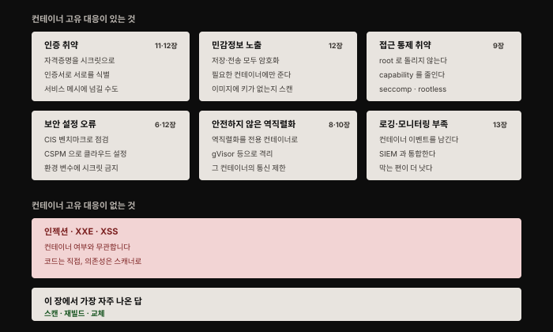
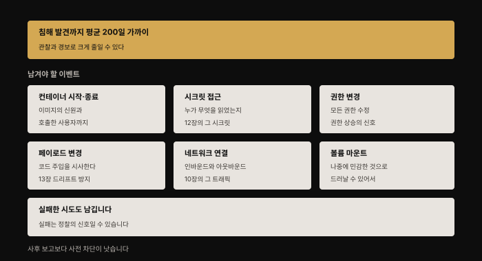
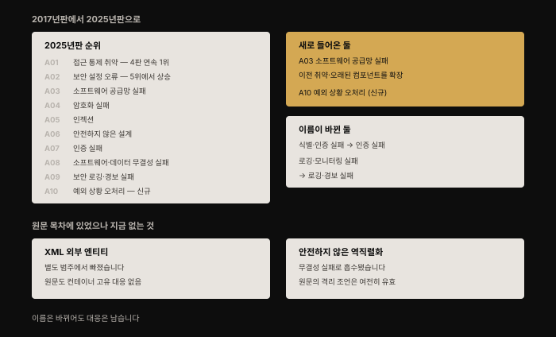

# 컨테이너와 OWASP Top 10 — 웹 리스크를 컨테이너 대응으로 잇다
---
> **OWASP**(Open Web Application Security Project)는 주기적으로 **웹 애플리케이션 보안 리스크 상위 열 가지** 목록을 발표합니다. 컨테이너화됐든 아니든 모든 애플리케이션이 웹 애플리케이션은 아니지만, **어떤 공격을 가장 걱정해야 하는지 판단하는 데 훌륭한 자료**입니다.

## 핵심 요약

이 장은 새 개념을 소개하지 않습니다. **앞선 열세 장의 내용을 OWASP 목록이라는 남의 축에 다시 꿰는 복습 장**입니다. 그래서 이 책에서 가장 짧습니다(1,412단어).

읽는 값은 **분류**에 있습니다. 열 가지 중 **일부는 컨테이너에 고유한 것이 전혀 없어** 애플리케이션 코드로 대응해야 하고, 나머지는 앞 장들에서 본 컨테이너 고유 수단이 붙습니다.

그리고 저자가 마지막에 스스로 짚습니다. **이 장에서 가장 자주 나온 컨테이너 고유 권고는 "이미지를 스캔하라"** 였고, 그것이 **투입 대비 효과가 가장 큰** 예방 도구라는 것입니다.

## 학습 목표

1. OWASP 목록에서 컨테이너 고유 대응이 있는 항목과 없는 항목을 구분할 수 있습니다.
2. 각 리스크에 대응하는 앞 장의 수단을 짚을 수 있습니다.
3. 운영 배포에서 남겨야 할 컨테이너 이벤트 일곱 가지를 압니다.
4. CIS 벤치마크와 CSPM이 각각 무엇을 점검하는지 압니다.
5. 이 책 전체에서 비용 대비 효과가 가장 큰 조치가 무엇인지 말할 수 있습니다.

## 1. 컨테이너 고유 대응이 없는 것들

먼저 **컨테이너 여부와 무관한 항목**부터 정리하는 편이 낫습니다. 저자가 반복해 같은 말을 하기 때문입니다.

| 리스크 | 저자의 판정 |
|--------|-----------|
| **인젝션** | 코드에 인젝션 결함이 있으면 공격자가 **데이터로 위장한 명령을 실행**시킬 수 있습니다. **컨테이너에 고유한 것이 없습니다.** 다만 이미지 스캔이 의존성의 알려진 인젝션 취약점을 드러낼 수는 있습니다 |
| **XML 외부 엔티티** | 취약한 XML 처리기 범주에도 **컨테이너 고유한 것이 없습니다.** 자기 코드는 OWASP 조언대로 분석하고, 의존성은 이미지 스캐너로 봅니다 |
| **크로스 사이트 스크립팅(XSS)** | 애플리케이션 계층에서 작동하므로 **컨테이너에서 돌린다는 사실이 이 리스크에 영향을 주지 않습니다.** 의존성은 스캐너로 |

> 저자는 인젝션 설명에 **xkcd의 불멸의 캐릭터 "Little Bobby Tables"** 를 예로 듭니다. 학생 이름에 SQL 구문을 넣어 학교 데이터베이스를 날려 버린 그 만화입니다.

세 항목의 공통 처방이 같습니다 — **자기 코드는 직접 검토하고, 의존성은 이미지 스캐너로 본다.**

## 2. 컨테이너 고유 대응이 있는 것들

### 인증 취약

이 범주는 **깨진 인증과 침해된 자격증명**을 다룹니다. 애플리케이션 수준에서는 전통적 배포의 모놀리스와 같은 조언이 적용되지만, **컨테이너 고유의 고려 사항이 둘** 있습니다.

- 각 컨테이너가 필요로 하는 **자격증명은 시크릿으로 다뤄야** 합니다. 조심스럽게 저장하고 런타임에 컨테이너로 전달해야 합니다([12장](./12-01.%EC%BB%A8%ED%85%8C%EC%9D%B4%EB%84%88%EC%97%90%20%EC%8B%9C%ED%81%AC%EB%A6%BF%20%EC%A0%84%EB%8B%AC%ED%95%98%EA%B8%B0%20%E2%80%94%20%EB%8B%A4%EC%84%AF%20%EA%B2%BD%EB%A1%9C%EC%99%80%20root%EB%9D%BC%EB%8A%94%20%EC%B2%9C%EC%9E%A5.md)).
- 애플리케이션을 여러 컨테이너 구성 요소로 쪼개면 **서로를 식별해야** 하는데, 보통 **인증서**를 쓰고 안전한 연결로 통신합니다. 컨테이너가 직접 처리할 수도, **서비스 메시에 넘길** 수도 있습니다([11장](./11-01.TLS%EB%A1%9C%20%EC%BB%B4%ED%8F%AC%EB%84%8C%ED%8A%B8%20%EC%95%88%EC%A0%84%ED%95%98%EA%B2%8C%20%EC%97%B0%EA%B2%B0%ED%95%98%EA%B8%B0%20%E2%80%94%20%ED%82%A4%C2%B7%EC%9D%B8%EC%A6%9D%EC%84%9C%C2%B7CA%EC%9D%98%20%EC%97%AD%ED%95%A0.md)).

### 민감정보 노출

애플리케이션이 접근할 수 있는 **개인·금융·기타 민감 데이터를 보호하는 일**이 특히 중요합니다.

컨테이너화 여부와 무관하게 민감 정보는 **강한 암호 알고리즘으로 저장 시점과 전송 중 모두 암호화**해야 합니다. 저자가 여기에 시간 축을 하나 덧붙입니다 — **처리 능력이 올라가면서 무차별 대입으로 암호를 깨는 것이 실현 가능해지므로, 오래된 알고리즘은 더 이상 안전하지 않다고 여겨지기 시작합니다.**

데이터가 암호화돼 있으니 애플리케이션은 **접근할 자격증명이 필요**합니다. 최소 권한과 직무 분리 원칙에 따라 **정말 접근이 필요한 컨테이너로만 자격증명을 제한**합니다. 그리고 **이미지에 키·비밀번호·민감 데이터가 박혀 있는지 스캔**하는 것을 고려하라고 권합니다.

### 접근 통제 취약

이 범주는 **사용자나 구성 요소에 불필요하게 부여된 권한의 남용**과 관련됩니다. [9장에서 논의한](./09-01.%EC%BB%A8%ED%85%8C%EC%9D%B4%EB%84%88%20%EA%B2%A9%EB%A6%AC%20%EA%B9%A8%EB%9C%A8%EB%A6%AC%EA%B8%B0%20%E2%80%94%20%EC%84%A4%EC%A0%95%20%ED%95%98%EB%82%98%EB%A1%9C%20%EB%AC%B4%EB%84%88%EC%A7%80%EB%8A%94%20%EA%B2%BD%EA%B3%84.md) 대로 컨테이너에 최소 권한을 적용하는 방법이 넷입니다.

- **컨테이너를 root로 돌리지 않습니다.**
- 각 컨테이너에 부여되는 **capability를 제한**합니다.
- **seccomp·AppArmor·SELinux**를 씁니다.
- 가능하다면 **rootless 컨테이너**를 씁니다.

> 저자가 여기서 정직한 단서를 답니다. 이 접근들은 **공격의 폭발 반경을 제한할 수 있지만, 어느 것도 애플리케이션 수준의 사용자 권한과는 관련이 없습니다.** 전통적 배포에서와 같은 조언을 **여전히 적용해야** 합니다.

### 보안 설정 오류

많은 공격이 **엉성하게 설정된 시스템을 이용**합니다. OWASP가 강조하는 예가 불완전한 설정, 열린 클라우드 스토리지, **민감 정보가 담긴 장황한 오류 메시지**인데, 셋 다 컨테이너·클라우드 네이티브에 특화된 완화책이 있습니다.

| 수단 | 무엇을 점검하나 |
|------|---------------|
| **CIS 벤치마크** | 시스템이 모범 사례대로 설정됐는지 평가합니다. **Docker·Kubernetes·기저 Linux 호스트**용 벤치마크가 각각 있습니다. 모든 권고를 따르는 것이 내 환경에 적절하지 않을 수 있지만 **아주 좋은 출발점**입니다 |
| **CSPM** | 퍼블릭 클라우드를 쓴다면 설정을 검사해 **공개 접근 가능한 스토리지 버킷**이나 **부실한 비밀번호 정책** 같은 것을 찾습니다. Gartner가 이 검사를 Cloud Security Posture Management라 부릅니다 |
| **환경 변수 제한** | [12장에서 본](./12-01.%EC%BB%A8%ED%85%8C%EC%9D%B4%EB%84%88%EC%97%90%20%EC%8B%9C%ED%81%AC%EB%A6%BF%20%EC%A0%84%EB%8B%AC%ED%95%98%EA%B8%B0%20%E2%80%94%20%EB%8B%A4%EC%84%AF%20%EA%B2%BD%EB%A1%9C%EC%99%80%20root%EB%9D%BC%EB%8A%94%20%EC%B2%9C%EC%9E%A5.md) 대로 환경 변수로 시크릿을 나르면 **로그로 쉽게 노출**되므로, **민감하지 않은 정보에만** 쓰기를 권합니다 |

> 저자가 이 대목에서 **이해관계를 스스로 밝힙니다.** 예로 든 CloudSploit이 자기 고용주인 Aqua Security가 운영하는 도구라는 점을 괄호로 명시합니다.

각 컨테이너 이미지의 일부를 이루는 **설정 정보**도 이 범주로 볼 수 있는데, 안전한 이미지 빌드 모범 사례와 함께 [6장](./06-02.%EC%9D%B4%EB%AF%B8%EC%A7%80%20%EA%B3%B5%EA%B8%89%EB%A7%9D%20%EB%B3%B4%EC%95%88%20%E2%80%94%20%EB%B9%8C%EB%93%9C%EB%B6%80%ED%84%B0%20%EB%B0%B0%ED%8F%AC%EA%B9%8C%EC%A7%80.md)에서 다뤘습니다.

### 안전하지 않은 역직렬화

악의적 사용자가 **조작된 객체를 제공**하면 애플리케이션이 그것을 해석해 사용자에게 추가 권한을 주거나 동작을 바꾸는 공격입니다.

> 저자가 자기 경험을 답니다. **2011년 씨티은행 고객이었을 때** 로그인한 사용자가 **URL만 바꾸면 다른 사람의 계좌에 접근할 수 있는** 취약점을 직접 목격했다고 씁니다.

이것도 컨테이너 여부에 대체로 영향받지 않지만, **영향을 제한하는 컨테이너 고유 접근**이 둘 있습니다.

- OWASP의 예방 조언에는 **역직렬화를 수행하는 코드를 격리해 낮은 권한 환경에서 돌리라**는 권고가 있습니다. 그 역직렬화 단계를 **전용 컨테이너 마이크로서비스로** 수행하면 그런 격리를 줄 수 있고, [8장에서 본](./08-01.%EC%BB%A8%ED%85%8C%EC%9D%B4%EB%84%88%20%EA%B2%A9%EB%A6%AC%20%EA%B0%95%ED%99%94%20%E2%80%94%20%EC%83%8C%EB%93%9C%EB%B0%95%EC%8B%B1%EC%9D%98%20%EC%84%B8%20%EA%B0%88%EB%9E%98.md) **Firecracker·gVisor·Unikernel**을 쓰면 특히 그렇습니다. **비root로, capability를 최소로, 꼭 맞는 seccomp 프로파일과 함께** 돌리는 것도 권한을 제한합니다.
- 또 하나의 OWASP 권고는 **역직렬화하는 컨테이너의 네트워크 트래픽을 제한**하는 것입니다([10장](./10-01.%EC%BB%A8%ED%85%8C%EC%9D%B4%EB%84%88%20%EB%84%A4%ED%8A%B8%EC%9B%8C%ED%81%AC%20%EB%B3%B4%EC%95%88%20%E2%80%94%20%EA%B3%84%EC%B8%B5%EB%B3%84%EB%A1%9C%20%EB%82%98%EB%88%A0%20%EB%A7%89%EA%B8%B0.md)).

### 알려진 취약점이 있는 컴포넌트

저자가 이 항목을 이렇게 엽니다. **"책의 이 단계쯤 왔으면 내 조언을 예상할 수 있기를 바랍니다."**

**이미지 스캐너로 컨테이너 이미지의 알려진 취약점을 식별**하는 것입니다. 여기에 프로세스나 도구가 두 가지 더 필요합니다.

- **최신 수정 패키지를 쓰도록 이미지를 다시 빌드**하기
- **취약한 이미지 기반으로 도는 컨테이너를 식별하고 교체**하기

[7장에서 본](./07-01.%EC%9D%B4%EB%AF%B8%EC%A7%80%20%EC%86%8D%20%EC%86%8C%ED%94%84%ED%8A%B8%EC%9B%A8%EC%96%B4%20%EC%B7%A8%EC%95%BD%EC%A0%90%20%E2%80%94%20CVE%EB%B6%80%ED%84%B0%20%EC%8A%A4%EC%BA%94%20%EC%9A%B4%EC%98%81%EA%B9%8C%EC%A7%80.md) "패치 = 이미지 재빌드"가 여기서 다시 나옵니다.

## 3. 로깅과 모니터링 부족

OWASP 사이트가 공유하는 통계를 저자는 **"무서운"** 것이라 부릅니다. **침해가 식별되기까지 평균 거의 200일이 걸린다**는 것입니다. **충분한 관찰과 예상치 못한 동작에 대한 경보를 결합하면 그 기간을 극적으로 줄일 수 있어야** 합니다.

어떤 운영 배포에서든 남겨야 할 컨테이너 이벤트가 일곱입니다.

| 이벤트 | 왜 |
|--------|-----|
| **컨테이너 시작·종료** | **이미지의 신원과 호출한 사용자**를 포함해서 |
| **시크릿 접근** | 누가 무엇을 읽었는지 |
| **권한 변경** | 모든 권한 수정 — 권한 상승의 신호 |
| **컨테이너 페이로드 변경** | **코드 주입을 시사**할 수 있습니다([13장 드리프트 방지](./13-01.%EC%BB%A8%ED%85%8C%EC%9D%B4%EB%84%88%20%EB%9F%B0%ED%83%80%EC%9E%84%20%EB%B3%B4%ED%98%B8%20%E2%80%94%20%EC%A0%95%EC%83%81%EC%9D%84%20%EC%A0%95%EC%9D%98%ED%95%B4%20%EC%9D%B4%EC%83%81%EC%9D%84%20%EC%9E%A1%EB%8B%A4.md)) |
| **인바운드·아웃바운드 네트워크 연결** | 트래픽의 흐름 |
| **볼륨 마운트** | 나중에 **민감한 것으로 드러날 마운트를 분석**하기 위해 |
| **실패한 동작** | 연결 시도·파일 쓰기·권한 변경의 실패는 **공격자가 정찰 중이라는 신호**일 수 있습니다 |

마지막 항목이 특히 중요합니다. **성공한 일만 기록하면 정찰 단계를 통째로 놓칩니다.**

대부분의 진지한 상용 컨테이너 보안 도구는 **SIEM**(security information and event management)과 통합해 중앙화된 시스템으로 인사이트와 경보를 제공합니다.

저자가 여기서도 같은 결론으로 돌아옵니다. **사후에 공격을 관찰하고 보고하는 것보다, 런타임 프로파일에 근거해 애초에 일어나지 못하게 막는 편이 낫습니다**(13장).

## 4. 이 책 전체의 결론

저자가 마지막 문단에서 스스로 관찰을 정리합니다.

> **이 장에서 가장 자주 나온 컨테이너 고유 권고는 "알려진 취약점을 찾아 컨테이너 이미지를 스캔하라"** 였습니다.

그리고 정직하게 한계를 답니다. **일부는 못 잡습니다** — 특히 **내가 쓴 애플리케이션 코드의 악용 가능한 결함**이 그렇습니다. 그럼에도 **컨테이너 배포에 도입할 수 있는 어떤 예방 도구보다 투입 대비 효과가 클 것**이라고 결론짓습니다.

이것이 이 책 전체를 관통하는 실무적 우선순위입니다. namespace·cgroup·seccomp·mTLS를 모두 배웠지만, **하나만 먼저 도입해야 한다면 이미지 스캔**이라는 것입니다.

## 심화 학습

> 이 절은 책 밖 보강입니다. **이 장은 이 책에서 시점 의존도가 구조적으로 가장 높습니다** — 장 전체가 OWASP 목록이라는 외부 문서의 순서를 뼈대로 삼기 때문입니다. 아래는 2026년 8월 기준 1차 자료로 확인한 내용입니다.

### 목록이 두 번 개정됐습니다

원문이 기준한 것은 **2017년판**이고, 이후 **2021년판**과 **2025년판**으로 두 번 바뀌었습니다. **2025년판이 현재 최신**입니다.[^owasp]

현재 목록은 이렇습니다.

| 순위 | 범주 | 비고 |
|------|------|------|
| A01 | Broken Access Control | **네 판 연속 1위** |
| A02 | Security Misconfiguration | 2021년 5위에서 **상승** |
| A03 | **Software Supply Chain Failures** | **신규** — 이전 "취약·오래된 컴포넌트"를 확장 |
| A04 | Cryptographic Failures | 2위에서 하락 |
| A05 | Injection | 3위에서 하락 |
| A06 | Insecure Design | 4위에서 하락 |
| A07 | Authentication Failures | "식별·인증 실패"에서 **개명** |
| A08 | Software or Data Integrity Failures | |
| A09 | Security Logging & Alerting Failures | "로깅·모니터링"에서 **개명** — 경보 강조 |
| A10 | **Mishandling of Exceptional Conditions** | **완전 신규** — 오류 처리·논리 오류·fail open |

**원문의 절 제목 중 둘은 지금 별도 범주로 존재하지 않습니다.** XML 외부 엔티티는 빠졌고, 안전하지 않은 역직렬화는 무결성 실패로 흡수됐습니다.

### 그런데 컨테이너 대응은 대체로 살아남았습니다

**범주 이름이 바뀌었다고 저자의 매핑이 무효가 되지는 않습니다.** 오히려 몇몇은 **이 책의 논지를 강화하는 방향**으로 움직였습니다.

- **A03 소프트웨어 공급망 실패가 3위로 신설**된 것은 저자가 [6장](./06-02.%EC%9D%B4%EB%AF%B8%EC%A7%80%20%EA%B3%B5%EA%B8%89%EB%A7%9D%20%EB%B3%B4%EC%95%88%20%E2%80%94%20%EB%B9%8C%EB%93%9C%EB%B6%80%ED%84%B0%20%EB%B0%B0%ED%8F%AC%EA%B9%8C%EC%A7%80.md)·[7장](./07-01.%EC%9D%B4%EB%AF%B8%EC%A7%80%20%EC%86%8D%20%EC%86%8C%ED%94%84%ED%8A%B8%EC%9B%A8%EC%96%B4%20%EC%B7%A8%EC%95%BD%EC%A0%90%20%E2%80%94%20CVE%EB%B6%80%ED%84%B0%20%EC%8A%A4%EC%BA%94%20%EC%9A%B4%EC%98%81%EA%B9%8C%EC%A7%80.md)에 두 장을 할애한 주제가 **업계 전체에서 3위 리스크로 격상**됐다는 뜻입니다. "이미지 스캔이 가장 효과가 크다"는 저자의 마지막 결론과 정확히 같은 방향입니다.
- **A02 보안 설정 오류가 5위에서 2위로** 올라온 것도, 저자가 CIS 벤치마크·CSPM으로 대응하라고 한 항목의 무게가 커진 것입니다. [9장의 위험한 설정들](./09-01.%EC%BB%A8%ED%85%8C%EC%9D%B4%EB%84%88%20%EA%B2%A9%EB%A6%AC%20%EA%B9%A8%EB%9C%A8%EB%A6%AC%EA%B8%B0%20%E2%80%94%20%EC%84%A4%EC%A0%95%20%ED%95%98%EB%82%98%EB%A1%9C%20%EB%AC%B4%EB%84%88%EC%A7%80%EB%8A%94%20%EA%B2%BD%EA%B3%84.md)이 그대로 이 범주에 들어갑니다.
- **A09가 "로깅·경보"로 개명**된 것은 저자가 이 장에서 강조한 **"관찰만으로는 부족하고 경보와 결합해야 한다"**, 나아가 **"막는 편이 낫다"** 는 논지와 일치합니다.

정리하면 **범주 라벨은 다시 그려야 하지만 컨테이너 대응 수단은 그대로 쓸 수 있습니다.** 이 장을 읽을 때는 **목록의 순서가 아니라 "어떤 리스크에 컨테이너 고유 수단이 붙는가"라는 분류 자체**를 가져가는 것이 맞습니다.

## 결정 치트시트

| 상황 | 판단 | 근거 |
|------|------|------|
| 보안 도구를 하나만 도입할 수 있다 | **이미지 스캐너** | 저자가 꼽은 투입 대비 최대 효과 |
| 인젝션·XSS가 걱정된다 | 컨테이너 수단으로 안 됨 — **코드 검토** | 애플리케이션 계층 리스크 |
| 설정이 안전한지 모르겠다 | **CIS 벤치마크**(Docker·K8s·호스트) | 전부 따를 필요는 없어도 좋은 출발점 |
| 퍼블릭 클라우드를 쓴다 | **CSPM**으로 버킷·비밀번호 정책 점검 | 열린 스토리지가 흔한 사고 |
| 역직렬화 코드가 있다 | **전용 컨테이너로 분리** + 강한 격리 | OWASP 권고를 컨테이너로 구현 |
| 로그에 무엇을 남길지 모르겠다 | 일곱 이벤트 + **실패한 시도** | 실패 기록이 정찰을 잡음 |
| 경보 시스템을 갖췄다 | 그다음은 **차단** | 사후 보고보다 예방 |
| OWASP 목록을 참조한다 | **2025년판**을 봄 | 원문은 2017년판 기준 |

## 면접에서 받을 만한 질문

1. OWASP Top 10 중 컨테이너로 대응할 수 없는 항목은 무엇이고 왜 그렇습니까?
2. 컨테이너 접근 통제를 강화하는 네 가지 방법은 무엇입니까? 그것으로 충분합니까?
3. 운영 컨테이너에서 실패한 동작을 굳이 기록해야 하는 이유는 무엇입니까?
4. CIS 벤치마크와 CSPM은 각각 무엇을 점검합니까?
5. 이 책 전체에서 저자가 꼽은 가장 효율적인 예방 조치는 무엇입니까?

## 정답

**1.** **인젝션·XML 외부 엔티티·크로스 사이트 스크립팅**입니다. 셋 다 **애플리케이션 계층에서 일어나므로** 컨테이너에서 돌린다는 사실이 리스크에 영향을 주지 않습니다. 컨테이너가 할 수 있는 것은 **이미지 스캐너로 의존성의 알려진 취약점을 찾는 정도**이고, 자기 코드의 결함은 OWASP 조언대로 직접 검토·테스트해야 합니다.

**2.** **root로 돌리지 않기**, **capability 제한**, **seccomp·AppArmor·SELinux 적용**, **가능하면 rootless 컨테이너**입니다. 충분하지 않습니다 — 저자가 명시하듯 이것들은 **공격의 폭발 반경을 제한**할 뿐, **애플리케이션 수준의 사용자 권한과는 무관**하므로 전통적 배포와 같은 조언을 여전히 적용해야 합니다.

**3.** **공격자가 시스템을 정찰하고 있다는 신호**일 수 있기 때문입니다. 네트워크 연결 시도, 파일 쓰기, 사용자 권한 변경이 **실패했다는 것 자체**가 누군가 경계를 더듬고 있다는 뜻입니다. 성공한 동작만 기록하면 **침입 이전 단계를 통째로 놓칩니다.**

**4.** **CIS 벤치마크**는 시스템 설정이 모범 사례를 따르는지 평가하며 **Docker·Kubernetes·기저 Linux 호스트**용이 각각 있습니다. **CSPM**(Cloud Security Posture Management)은 퍼블릭 클라우드 설정을 검사해 **공개 접근 가능한 스토리지 버킷이나 부실한 비밀번호 정책** 같은 것을 찾습니다. 전자는 호스트·런타임 설정, 후자는 클라우드 계정 설정입니다.

**5.** **컨테이너 이미지 스캔**입니다. 이 장에서 컨테이너 고유 권고로 가장 자주 등장했고, 저자는 **컨테이너 배포에 도입할 수 있는 어떤 예방 도구보다 투입 대비 효과가 클 것**이라고 결론짓습니다. 다만 한계도 명시합니다 — **내가 쓴 애플리케이션 코드의 악용 가능한 결함은 잡지 못합니다.**

## 핵심 개념 체크리스트

- [ ] 컨테이너 고유 대응이 없는 세 항목과 그 이유를 안다
- [ ] 인증 취약에 붙는 컨테이너 고려 사항 둘(시크릿·인증서)을 안다
- [ ] 민감정보 노출에서 시간이 흐르면 알고리즘이 낡는다는 논지를 안다
- [ ] 접근 통제 강화 네 방법과 그 한계를 함께 설명할 수 있다
- [ ] CIS 벤치마크와 CSPM의 점검 대상 차이를 안다
- [ ] 역직렬화를 전용 컨테이너로 격리하는 발상을 안다
- [ ] 남겨야 할 컨테이너 이벤트 일곱과 실패 기록의 의미를 안다
- [ ] 저자가 꼽은 최대 효율 조치가 이미지 스캔임을 안다
- [ ] 원문이 2017년판 기준이고 현재는 2025년판임을 안다

## 참고 자료

- 《Container Security: Fundamental Technology Concepts that Protect Containerized Applications》(Liz Rice, O'Reilly, 2020, 1판) Chapter 14 — 이 노트의 원문
- [OWASP Top 10](https://owasp.org/www-project-top-ten/) — 프로젝트 허브
- [OWASP Top 10:2025](https://owasp.org/Top10/2025/) — 현재 최신판
- [CIS Benchmarks](https://www.cisecurity.org/cis-benchmarks) — Docker·Kubernetes·Linux 호스트 설정 점검
- [07-01. 이미지 속 소프트웨어 취약점](./07-01.%EC%9D%B4%EB%AF%B8%EC%A7%80%20%EC%86%8D%20%EC%86%8C%ED%94%84%ED%8A%B8%EC%9B%A8%EC%96%B4%20%EC%B7%A8%EC%95%BD%EC%A0%90%20%E2%80%94%20CVE%EB%B6%80%ED%84%B0%20%EC%8A%A4%EC%BA%94%20%EC%9A%B4%EC%98%81%EA%B9%8C%EC%A7%80.md) — 저자가 꼽은 최대 효율 조치의 본편
- [13-01. 컨테이너 런타임 보호](./13-01.%EC%BB%A8%ED%85%8C%EC%9D%B4%EB%84%88%20%EB%9F%B0%ED%83%80%EC%9E%84%20%EB%B3%B4%ED%98%B8%20%E2%80%94%20%EC%A0%95%EC%83%81%EC%9D%84%20%EC%A0%95%EC%9D%98%ED%95%B4%20%EC%9D%B4%EC%83%81%EC%9D%84%20%EC%9E%A1%EB%8B%A4.md) — 로깅·경보와 드리프트 방지
- [Container Security 정독 인덱스](./README.md) — 이 책의 장별 진행 상태

[^owasp]: OWASP 공식 문서에서 2025년판이 최신이며 아래 변화가 있음을 확인했습니다(2026-08-09 조회). <https://owasp.org/Top10/2025/0x00_2025-Introduction/>

  - A01 Broken Access Control이 네 판 연속 1위, A02 Security Misconfiguration이 5위에서 2위로 상승
  - A03 Software Supply Chain Failures는 이전 "Vulnerable and Outdated Components"를 확장한 신규 범주
  - A10 Mishandling of Exceptional Conditions는 완전 신규 — 오류 처리·논리 오류·fail open을 다룸
  - A07은 "Identification and Authentication Failures"에서 "Authentication Failures"로, A09는 "Logging and Monitoring"에서 "Logging & Alerting"으로 개명
