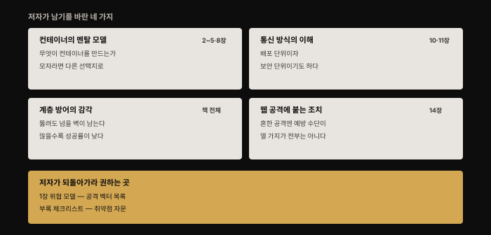
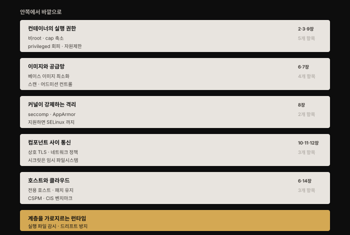
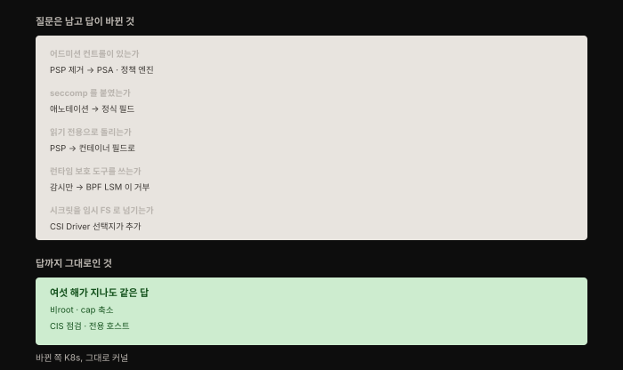

# 맺음말과 보안 체크리스트 — 열아홉 개 질문으로 되짚기
---
> 저자는 책을 두 개의 짧은 글로 닫습니다. 맺음말은 독자가 무엇을 얻었기를 바라는지 적고, 부록 체크리스트는 그것을 배포 앞에서 스스로 물을 열아홉 개 질문으로 바꿉니다. 새 개념은 없습니다. 대신 앞의 열네 장을 **점검 가능한 형태**로 다시 꺼내 놓습니다.

## 핵심 요약

이 부록의 값어치는 목록 자체가 아니라 **목록이 질문으로 되어 있다는 점**에 있습니다. "비root로 돌려라"가 아니라 "비root로 돌리고 있습니까"입니다. 명령문은 시간이 지나면 낡지만 질문은 낡지 않습니다. 실제로 여섯 해가 지난 지금 몇몇 항목의 **답**은 바뀌었어도 **질문**은 하나도 버릴 것이 없습니다.

저자 스스로 이 목록이 전부가 아니라고 못 박습니다. "이 목록이 절대적으로 빠짐없지는 않습니다"라고 적고, 환경에 따라 모든 항목이 말이 되지는 않을 수 있다고 덧붙입니다. 다만 **생각이라도 해 봤다면 좋은 출발**이라는 것이 저자의 표현입니다.

## 학습 목표

1. 맺음말이 되짚는 네 갈래를 앞 장들과 연결해 설명할 수 있습니다.
2. 체크리스트 열아홉 항목을 방어 계층으로 묶어 배치할 수 있습니다.
3. 각 항목이 이 정독본의 어느 편에 대응하는지 찾아갈 수 있습니다.
4. 여섯 해 사이에 **답이 바뀐 항목**과 **그대로인 항목**을 구분할 수 있습니다.
5. 왜 바뀐 쪽이 전부 쿠버네티스 기능이고 그대로인 쪽이 전부 커널 경계인지 설명할 수 있습니다.

## 1. 맺음말이 되짚는 네 갈래

저자는 독자가 네 가지를 얻었기를 바란다고 적습니다. 순서가 곧 이 책의 뼈대입니다.

첫째는 **컨테이너가 무엇인가에 대한 튼튼한 멘탈 모델**입니다. 저자는 이것이 "컨테이너 배포를 어떻게 지킬지 논의할 때 도움이 될 것"이라고 말합니다. 논의라는 단어가 중요합니다. 보안 결정은 혼자 내리지 않고, 근거를 설명하지 못하면 관철되지 않기 때문입니다. 여기에 더해 일반 컨테이너의 격리가 워크로드 사이를 갈라놓기에 모자랄 때 **다른 선택지를 알고 있어야 한다**고 덧붙입니다. 8장의 gVisor·Kata·Firecracker가 그 선택지였습니다.

둘째는 **컨테이너가 서로 그리고 바깥과 어떻게 통신하는지**에 대한 이해입니다. 저자는 네트워킹이 그 자체로 방대한 주제라고 인정하면서, 여기서 가장 중요한 것 하나를 꼽습니다. 컨테이너는 **배포의 단위일 뿐 아니라 보안의 단위이기도 하다**는 것입니다. 이 한 문장이 10장 전체의 요지입니다. 컨테이너를 경계로 삼을 수 있으니 기대한 트래픽만 흐르도록 제한할 길이 여럿 생깁니다.

셋째는 **계층 방어의 감각**입니다. 침해가 일어났을 때 계층 방어가 도움이 된다는 것을 이제 알 것이라고 저자는 적습니다. 공격자가 배포의 취약점 하나를 이용해도 **넘지 못할 벽이 아직 남아 있고**, 계층이 많을수록 공격이 성공할 가능성이 낮아집니다. 이것이 1장의 보안 원칙 다섯 가지 중 심층 방어였고, 부록 체크리스트를 계층으로 묶어 읽어야 하는 이유이기도 합니다.

넷째는 14장에서 본 것입니다. 가장 흔히 악용되는 웹 공격에 대해 **컨테이너 고유의 예방 조치**를 붙일 수 있다는 것입니다. 다만 저자는 곧바로 단서를 답니다. 그 열 가지 목록이 배포의 모든 약점을 덮지는 않는다는 것입니다. 그래서 1장의 컨테이너 위협 모델로 돌아가 컨테이너 고유의 공격 벡터를 다시 훑어보라고 권하고, 부록의 질문 목록으로 **어디가 가장 취약한지 스스로 가늠하라**고 안내합니다.

맺음말의 마지막은 기술이 아니라 사람 쪽입니다. 저자는 침해를 당했든 막아 냈든 **그 이야기를 듣고 싶다**고 적고 피드백 창구를 남깁니다. 보안이 각자 조용히 감당하는 일이 되기 쉬운데, 사례가 공유되지 않으면 다음 사람이 같은 곳에서 또 뚫린다는 인식이 깔려 있습니다.

## 2. 체크리스트를 계층으로 묶어 읽기

저자는 열아홉 항목을 평평한 목록으로 제시합니다. 순서에 특별한 뜻을 두지 않았고, 그래서 그대로 읽으면 권한 이야기와 호스트 이야기가 섞여 나옵니다. 심층 방어라는 셋째 갈래를 살리려면 **안쪽에서 바깥으로** 다시 묶는 편이 낫습니다.

가장 안쪽은 **컨테이너 자신의 실행 권한**입니다. 비root로 돌리는가, `--privileged`를 붙인 것이 있는가, 이미지마다 필요 없는 capability를 떨구고 있는가, 가능한 곳은 읽기 전용으로 돌리는가, 자원 한계를 걸었는가. 다섯 항목이 여기 듭니다. 이 층이 뚫리면 뒤의 어떤 조치도 시간을 벌어 주는 정도에 그치므로, 저자가 목록의 맨 앞에 둔 것이 자연스럽습니다.

그 바깥은 **이미지와 공급망**입니다. 어떤 베이스 이미지를 쓰는가, `scratch`나 distroless나 Alpine이나 RHEL minimal 같은 선택지를 쓸 수 있는가, 이미지를 스캔하고 있으며 취약점이 발견됐을 때 **다시 빌드해 재배포하는 절차나 도구가 있는가**, 실행 코드가 전부 빌드 시점에 들어가고 런타임에 설치되지 않도록 불변성을 강제하는가, 승인된 이미지만 프로덕션에 뜨도록 어드미션 컨트롤을 두었는가. 스캔 항목이 특히 눈에 띄는데, 저자가 스캔 자체보다 **재빌드 절차의 유무**를 함께 묻기 때문입니다. 취약점을 찾아 놓고 고치지 않는 스캐너는 목록만 늘립니다.

그 바깥은 **커널이 강제하는 격리**입니다. seccomp나 AppArmor 프로파일을 쓰는가, 호스트 운영체제가 SELinux를 지원한다면 켜 두었고 애플리케이션마다 맞는 프로파일이 붙어 있는가. 저자는 여기서 현실적인 단계를 제시합니다. Docker 기본 프로파일이 좋은 출발점이고, **더 나은 것은 애플리케이션마다 프로파일을 맞춰 씌우는 것**이라는 표현입니다.

그 바깥은 **컴포넌트 사이 통신**입니다. 상호 TLS로 연결하는가, 컴포넌트 사이 트래픽을 제한하는 네트워크 정책이 있는가, 시크릿을 임시 파일시스템으로 넘기고 저장·전송 모두 암호화하며 저장과 순환을 맡는 시크릿 관리 시스템을 쓰는가. 저자는 상호 TLS를 애플리케이션 코드로 구현하든 서비스 메시로 구현하든 상관없다고 적어, 수단이 아니라 **성질**을 묻습니다.

가장 바깥은 **호스트와 클라우드**입니다. 호스트를 컨테이너 전용으로 쓰고 다른 애플리케이션과 섞지 않는가, 보안 릴리스를 최신으로 유지하는가, CSPM 도구로 바닥 클라우드 인프라의 보안 설정을 정기 점검하는가, 호스트와 컨테이너가 Linux·Docker·Kubernetes용 CIS 벤치마크 같은 모범 사례대로 설정돼 있는가. 컨테이너 호스트 전용 운영체제를 고려하라는 권고도 여기 붙습니다.

이 다섯 계층에 속하지 않고 **전체를 가로지르는 축이 하나** 있습니다. 런타임입니다. 컨테이너 안에서 기대한 실행 파일만 도는지 보장하는 런타임 보호 도구를 쓰는가, 드리프트 방지 기능이 있는가. 앞의 다섯 계층이 "무엇을 미리 막아 두었는가"를 묻는다면 이 축은 "지금 무슨 일이 벌어지고 있는가"를 묻기 때문에 층으로 세울 수 없습니다.

## 3. 질문은 남고 답이 바뀐 것

체크리스트는 질문 목록이라 오래 갑니다. 다만 답하는 수단은 여섯 해 사이에 여럿 바뀌었습니다. 이 정독본이 각 장에서 기록해 온 버전 차이가 여기서 한자리에 모입니다.

**어드미션 컨트롤** 항목이 가장 크게 움직였습니다. 원문 시점의 대표 수단이던 PodSecurityPolicy는 v1.21에서 폐기 예고되고 **v1.25에서 제거**됐습니다. 지금 그 자리는 내장 어드미션 컨트롤러인 Pod Security Admission이 `privileged`·`baseline`·`restricted` 세 등급으로 채우고, 이미지 출처 같은 조건부 정책은 OPA Gatekeeper나 Kyverno가 맡습니다.[^psa]

**seccomp·AppArmor 프로파일** 항목은 붙이는 방법이 바뀌었습니다. 애노테이션으로 얹던 것이 `securityContext`의 정식 필드가 됐습니다. **읽기 전용** 항목도 같은 이동을 겪어, PodSecurityPolicy의 필드에서 컨테이너의 `securityContext.readOnlyRootFilesystem`으로 옮겨졌습니다.

**런타임 보호 도구** 항목은 8장과 13장이 함께 걸린 지점입니다. 원문은 eBPF가 시스템 콜을 관찰할 수는 있어도 바꾸지는 못한다고 적었는데, 커널 5.7에 병합된 BPF LSM이 `-EPERM`을 돌려주며 **거부까지 하게** 됐습니다. 원문 집필과 거의 같은 시기에 뒤집힌 셈입니다.

**시크릿 전달** 항목은 답이 바뀌었다기보다 선택지가 하나 늘었습니다. 임시 파일시스템으로 넘기라는 저자의 선호 위에 Secrets Store CSI Driver가 얹혀, 외부 시크릿 저장소의 값을 볼륨으로 직접 마운트해 **etcd를 우회**할 수 있게 됐습니다.

반면 **답까지 그대로인 항목**도 뚜렷합니다. 비root 실행, `--privileged` 회피, capability 축소, CIS 벤치마크 점검, 컨테이너 전용 호스트. 이 다섯은 여섯 해 뒤에도 답이 같습니다.

여기서 한 가지 결이 보입니다. **바뀐 쪽은 전부 쿠버네티스가 준 기능이고, 그대로인 쪽은 전부 커널이 준 경계**입니다. 오케스트레이터의 API는 릴리스마다 다시 그려지지만 프로세스 권한과 capability는 그렇게 움직이지 않습니다. 이 책이 커널 프리미티브에서 시작해 위로 올라간 구성을 택한 것이 결과적으로 유효 기간이 긴 순서였던 셈입니다.

## 4. 이 정독본에서 항목별로 찾아가기

체크리스트를 실제 점검에 쓰려면 각 질문에서 해당 편으로 바로 갈 수 있어야 합니다. 원문이 절 제목으로 걸어 둔 참조를 이 정독본의 편으로 옮기면 다음과 같습니다.

| 체크리스트 질문 | 원문 참조 | 이 정독본 |
|----------------|----------|----------|
| 비root로 돌리는가 | Containers Run as Root by Default | [09-01](./09-01.%EC%BB%A8%ED%85%8C%EC%9D%B4%EB%84%88%20%EA%B2%A9%EB%A6%AC%20%EA%B9%A8%EB%9C%A8%EB%A6%AC%EA%B8%B0%20%E2%80%94%20%EC%84%A4%EC%A0%95%20%ED%95%98%EB%82%98%EB%A1%9C%20%EB%AC%B4%EB%84%88%EC%A7%80%EB%8A%94%20%EA%B2%BD%EA%B3%84.md) |
| `--privileged`·capability | The --privileged Flag and Capabilities | [02-01](./02-01.Linux%20%EC%8B%9C%EC%8A%A4%ED%85%9C%20%EC%BD%9C%C2%B7%EA%B6%8C%ED%95%9C%C2%B7capability%20%E2%80%94%20%EC%BB%A8%ED%85%8C%EC%9D%B4%EB%84%88%20%EB%B3%B4%EC%95%88%EC%9D%98%20%EB%B0%94%EB%8B%A5.md) · [09-01](./09-01.%EC%BB%A8%ED%85%8C%EC%9D%B4%EB%84%88%20%EA%B2%A9%EB%A6%AC%20%EA%B9%A8%EB%9C%A8%EB%A6%AC%EA%B8%B0%20%E2%80%94%20%EC%84%A4%EC%A0%95%20%ED%95%98%EB%82%98%EB%A1%9C%20%EB%AC%B4%EB%84%88%EC%A7%80%EB%8A%94%20%EA%B2%BD%EA%B3%84.md) |
| 읽기 전용·불변 컨테이너 | Immutable Containers | [09-01](./09-01.%EC%BB%A8%ED%85%8C%EC%9D%B4%EB%84%88%20%EA%B2%A9%EB%A6%AC%20%EA%B9%A8%EB%9C%A8%EB%A6%AC%EA%B8%B0%20%E2%80%94%20%EC%84%A4%EC%A0%95%20%ED%95%98%EB%82%98%EB%A1%9C%20%EB%AC%B4%EB%84%88%EC%A7%80%EB%8A%94%20%EA%B2%BD%EA%B3%84.md) |
| 민감 디렉토리·Docker 소켓 마운트 | Mounting Sensitive Directories · the Docker Socket | [09-01](./09-01.%EC%BB%A8%ED%85%8C%EC%9D%B4%EB%84%88%20%EA%B2%A9%EB%A6%AC%20%EA%B9%A8%EB%9C%A8%EB%A6%AC%EA%B8%B0%20%E2%80%94%20%EC%84%A4%EC%A0%95%20%ED%95%98%EB%82%98%EB%A1%9C%20%EB%AC%B4%EB%84%88%EC%A7%80%EB%8A%94%20%EA%B2%BD%EA%B3%84.md) |
| CI/CD를 프로덕션 클러스터에서 돌리는가 | The Dangers of docker build | [06-02](./06-02.%EC%9D%B4%EB%AF%B8%EC%A7%80%20%EA%B3%B5%EA%B8%89%EB%A7%9D%20%EB%B3%B4%EC%95%88%20%E2%80%94%20%EB%B9%8C%EB%93%9C%EB%B6%80%ED%84%B0%20%EB%B0%B0%ED%8F%AC%EA%B9%8C%EC%A7%80.md) |
| 이미지 스캔과 재빌드 절차 | Chapter 7 | [07-01](./07-01.%EC%9D%B4%EB%AF%B8%EC%A7%80%20%EC%86%8D%20%EC%86%8C%ED%94%84%ED%8A%B8%EC%9B%A8%EC%96%B4%20%EC%B7%A8%EC%95%BD%EC%A0%90%20%E2%80%94%20CVE%EB%B6%80%ED%84%B0%20%EC%8A%A4%EC%BA%94%20%EC%9A%B4%EC%98%81%EA%B9%8C%EC%A7%80.md) |
| seccomp·AppArmor·SELinux | Chapter 8 · SELinux | [08-01](./08-01.%EC%BB%A8%ED%85%8C%EC%9D%B4%EB%84%88%20%EA%B2%A9%EB%A6%AC%20%EA%B0%95%ED%99%94%20%E2%80%94%20%EC%83%8C%EB%93%9C%EB%B0%95%EC%8B%B1%EC%9D%98%20%EC%84%B8%20%EA%B0%88%EB%9E%98.md) |
| 베이스 이미지 최소화 | Dockerfile Best Practices for Security | [06-01](./06-01.%EC%BB%A8%ED%85%8C%EC%9D%B4%EB%84%88%20%EC%9D%B4%EB%AF%B8%EC%A7%80%20%ED%95%B4%EB%B6%80%20%E2%80%94%20%EB%91%90%20%EB%B6%80%EB%B6%84%EA%B3%BC%20%EC%B8%B5%EA%B3%BC%20%EC%8B%9D%EB%B3%84%EC%9E%90.md) · [06-02](./06-02.%EC%9D%B4%EB%AF%B8%EC%A7%80%20%EA%B3%B5%EA%B8%89%EB%A7%9D%20%EB%B3%B4%EC%95%88%20%E2%80%94%20%EB%B9%8C%EB%93%9C%EB%B6%80%ED%84%B0%20%EB%B0%B0%ED%8F%AC%EA%B9%8C%EC%A7%80.md) |
| 자원 한계 | Setting Resource Limits | [03-01](./03-01.Control%20Group%20%E2%80%94%20%EC%9E%90%EC%9B%90%EC%9D%84%20%EC%A0%9C%ED%95%9C%ED%95%B4%20%EA%B5%B6%EA%B8%B0%EA%B8%B0%EB%A5%BC%20%EB%A7%89%EB%8B%A4.md) |
| 어드미션 컨트롤 | Admission Control | [06-02](./06-02.%EC%9D%B4%EB%AF%B8%EC%A7%80%20%EA%B3%B5%EA%B8%89%EB%A7%9D%20%EB%B3%B4%EC%95%88%20%E2%80%94%20%EB%B9%8C%EB%93%9C%EB%B6%80%ED%84%B0%20%EB%B0%B0%ED%8F%AC%EA%B9%8C%EC%A7%80.md) |
| 상호 TLS | Chapter 11 | [11-01](./11-01.TLS%EB%A1%9C%20%EC%BB%B4%ED%8F%AC%EB%84%8C%ED%8A%B8%20%EC%95%88%EC%A0%84%ED%95%98%EA%B2%8C%20%EC%97%B0%EA%B2%B0%ED%95%98%EA%B8%B0%20%E2%80%94%20%ED%82%A4%C2%B7%EC%9D%B8%EC%A6%9D%EC%84%9C%C2%B7CA%EC%9D%98%20%EC%97%AD%ED%95%A0.md) |
| 네트워크 정책 | Chapter 10 | [10-01](./10-01.%EC%BB%A8%ED%85%8C%EC%9D%B4%EB%84%88%20%EB%84%A4%ED%8A%B8%EC%9B%8C%ED%81%AC%20%EB%B3%B4%EC%95%88%20%E2%80%94%20%EA%B3%84%EC%B8%B5%EB%B3%84%EB%A1%9C%20%EB%82%98%EB%88%A0%20%EB%A7%89%EA%B8%B0.md) |
| 시크릿 전달·암호화·순환 | Chapter 12 | [12-01](./12-01.%EC%BB%A8%ED%85%8C%EC%9D%B4%EB%84%88%EC%97%90%20%EC%8B%9C%ED%81%AC%EB%A6%BF%20%EC%A0%84%EB%8B%AC%ED%95%98%EA%B8%B0%20%E2%80%94%20%EB%8B%A4%EC%84%AF%20%EA%B2%BD%EB%A1%9C%EC%99%80%20root%EB%9D%BC%EB%8A%94%20%EC%B2%9C%EC%9E%A5.md) |
| 런타임 보호·드리프트 방지 | Chapter 13 · Drift Prevention | [13-01](./13-01.%EC%BB%A8%ED%85%8C%EC%9D%B4%EB%84%88%20%EB%9F%B0%ED%83%80%EC%9E%84%20%EB%B3%B4%ED%98%B8%20%E2%80%94%20%EC%A0%95%EC%83%81%EC%9D%84%20%EC%A0%95%EC%9D%98%ED%95%B4%20%EC%9D%B4%EC%83%81%EC%9D%84%20%EC%9E%A1%EB%8B%A4.md) |
| 컨테이너 전용 호스트 | Container Host Machines | [06-02](./06-02.%EC%9D%B4%EB%AF%B8%EC%A7%80%20%EA%B3%B5%EA%B8%89%EB%A7%9D%20%EB%B3%B4%EC%95%88%20%E2%80%94%20%EB%B9%8C%EB%93%9C%EB%B6%80%ED%84%B0%20%EB%B0%B0%ED%8F%AC%EA%B9%8C%EC%A7%80.md) |
| CSPM·CIS 벤치마크 | Security Misconfiguration | [14-01](./14-01.%EC%BB%A8%ED%85%8C%EC%9D%B4%EB%84%88%EC%99%80%20OWASP%20Top%2010%20%E2%80%94%20%EC%9B%B9%20%EB%A6%AC%EC%8A%A4%ED%81%AC%EB%A5%BC%20%EC%BB%A8%ED%85%8C%EC%9D%B4%EB%84%88%20%EB%8C%80%EC%9D%91%EC%9C%BC%EB%A1%9C%20%EC%9E%87%EB%8B%A4.md) |

원문이 참조로 지목한 절이 여러 장에 걸친 경우 편을 둘 적었습니다. 표에서 **9장이 네 번 나오는 것**이 눈에 띕니다. 격리를 깨뜨리는 설정을 다룬 장이라 점검 항목이 그만큼 몰립니다.

## 심화 학습

**저자가 목록의 불완전함을 먼저 말한 이유.** 체크리스트라는 형식은 위험을 하나 안고 있습니다. 항목을 다 채우면 안전하다는 착각을 주는 것입니다. 저자가 첫 문단에서 "절대적으로 빠짐없지는 않습니다"라고 못 박고 환경에 따라 모든 항목이 말이 되지는 않는다고 덧붙인 것은 이 착각을 미리 끊으려는 장치로 읽힙니다. 1장에서 위협 모델링을 먼저 가르친 것과 짝이 맞습니다. **위협 모델이 있어야 체크리스트에서 무엇을 건너뛸지 판단할 수 있고**, 그것 없이 목록만 들면 상황과 무관하게 전 항목을 채우거나 아무 근거 없이 몇 개를 빼게 됩니다.

**항목이 도구가 아니라 성질을 묻는 형태인 점.** 저자는 특정 제품명을 거의 쓰지 않습니다. "상호 TLS로 연결하는가"라고 묻고 애플리케이션 코드든 서비스 메시든 상관없다고 적습니다. "런타임 보호 도구를 쓰는가"라고 묻지 Falco를 쓰라고 하지 않습니다. 앞 절에서 본 것처럼 여섯 해 사이에 답의 절반이 바뀌었는데도 질문이 하나도 낡지 않은 이유가 이 서술 방식에 있습니다. **도구 이름을 적었으면 지금쯤 절반이 아카이브된 저장소를 가리키고 있었을 것입니다.** 실제로 이 정독본이 기록한 버전 차이 스무 건 남짓 중 상당수가 도구의 생사에 관한 것이었습니다.

**점검 결과를 어디에 남길 것인가.** 원문은 질문만 주고 기록 방식은 다루지 않습니다. 실무에서는 이 열아홉 질문을 사람이 매번 훑는 대신 기계가 반복하게 만드는 쪽이 낫습니다. 계층마다 맡을 자리가 다릅니다. 커널·권한 계층은 Pod Security Admission이나 정책 엔진이 어드미션 시점에 막습니다. 이미지 계층은 CI 파이프라인의 스캔 단계가 맡습니다. 호스트·클라우드 계층은 CIS 벤치마크 도구와 CSPM이 주기 점검을 돌립니다. 이렇게 나누면 사람이 손으로 확인할 것은 **위협 모델이 바뀌었을 때 어떤 항목을 새로 켜고 끌지 판단하는 일**만 남습니다.

## 결정 치트시트

| 상황 | 우선 확인할 계층 | 근거 |
|------|----------------|------|
| 새 서비스를 처음 올린다 | 실행 권한 → 이미지 | 가장 안쪽이 뚫리면 뒤 계층은 시간만 벌어 줍니다 |
| 이미 도는 배포를 점검한다 | 런타임 축 먼저 | 지금 무슨 일이 벌어지는지가 설정보다 급합니다 |
| 규제·감사 대응이 필요하다 | 호스트·클라우드 | CIS 벤치마크가 외부에 제시할 기준을 줍니다 |
| 멀티테넌시 환경이다 | 커널 격리 → 통신 | 워크로드 사이 경계가 신뢰 경계와 겹칩니다 |
| 도구를 하나만 도입할 수 있다 | 이미지 스캔 | 14장에서 저자가 최대 효율로 꼽은 조치입니다 |

## 면접에서 받을 만한 질문

1. 컨테이너 보안 체크리스트를 만든다면 어떤 순서로 배치하겠습니까. 그 순서의 근거는 무엇입니까.
2. 여섯 해 전에 쓰인 컨테이너 보안 점검 항목 중 지금도 유효한 것과 갱신이 필요한 것을 구분하는 기준이 있습니까.
3. 이미지를 스캔하고 있다는 답만으로 부족한 이유는 무엇입니까.
4. 보안 체크리스트를 전부 통과했는데도 뚫릴 수 있습니까. 그렇다면 무엇이 빠진 것입니까.

## 정답

1. **안쪽에서 바깥으로** 배치합니다. 컨테이너의 실행 권한(비root·capability·읽기 전용·자원 한계), 이미지와 공급망, 커널 격리(seccomp·AppArmor·SELinux), 컴포넌트 사이 통신(mTLS·네트워크 정책·시크릿), 호스트와 클라우드 순입니다. 근거는 심층 방어입니다. 안쪽이 뚫려도 바깥 계층이 남아야 공격이 끝까지 가지 못합니다. 여기에 계층으로 세울 수 없는 런타임 축을 따로 둡니다. 지금 벌어지는 일을 보는 관점이라 특정 층에 속하지 않기 때문입니다.

2. **누가 그 수단을 제공하는가**로 갈립니다. 오케스트레이터가 준 기능은 릴리스마다 바뀝니다. PodSecurityPolicy가 제거되고 Pod Security Admission으로 대체된 것, seccomp·AppArmor·읽기 전용이 애노테이션에서 `securityContext` 필드로 옮겨진 것이 그 예입니다. 반대로 커널이 준 경계는 잘 움직이지 않습니다. 비root 실행, capability 축소, `--privileged` 회피는 여섯 해 뒤에도 답이 같습니다. 그래서 갱신을 점검할 때는 쿠버네티스 API를 가리키는 항목부터 확인합니다.

3. 스캔은 **발견**일 뿐 **조치**가 아니기 때문입니다. 저자도 이 항목에서 스캔 여부와 함께 "취약점이 발견된 이미지를 다시 빌드해 재배포하는 절차나 도구가 있는가"를 같이 묻습니다. 재빌드 경로가 없으면 스캐너는 줄어들지 않는 목록만 쌓습니다. 7장에서 본 것처럼 컨테이너 세계의 패치는 돌아가는 것을 고치는 것이 아니라 **새 이미지를 말아 갈아 끼우는 것**이라 이 절차가 곧 대응 능력 자체입니다.

4. 뚫릴 수 있습니다. 저자 스스로 이 목록이 빠짐없지 않다고 적었습니다. 빠질 수 있는 것은 크게 둘입니다. 하나는 **애플리케이션 계층의 결함**으로, 14장에서 본 인젝션이나 XSS는 컨테이너 고유의 대응이 없어 코드로 막아야 합니다. 다른 하나는 **환경 고유의 위협**입니다. 체크리스트는 일반적인 배포를 가정하므로, 1장의 위협 모델링으로 자기 환경의 행위자와 공격 벡터를 따로 세워야 목록에 없는 항목이 드러납니다.

## 핵심 개념 체크리스트

- [ ] 맺음말이 되짚는 네 갈래를 각각 어느 장과 연결되는지와 함께 말할 수 있다
- [ ] 체크리스트 열아홉 항목을 다섯 계층 + 런타임 축으로 묶을 수 있다
- [ ] "컨테이너는 배포의 단위이자 보안의 단위"라는 문장의 함의를 설명할 수 있다
- [ ] 스캔 항목이 재빌드 절차를 함께 묻는 이유를 말할 수 있다
- [ ] 답이 바뀐 항목이 전부 쿠버네티스 기능이고 그대로인 항목이 전부 커널 경계인 이유를 설명할 수 있다
- [ ] 체크리스트가 도구명이 아니라 성질을 묻는 형태인 것의 이점을 말할 수 있다
- [ ] 체크리스트를 다 채워도 남는 두 종류의 빈틈을 지적할 수 있다

## 참고 자료

- 《Container Security》(Liz Rice, O'Reilly, 2020) — Conclusions · Appendix. Security Checklist
- [Pod Security Admission — Kubernetes 공식 문서](https://kubernetes.io/docs/concepts/security/pod-security-admission/) — PodSecurityPolicy 대체, v1.25 stable, 세 등급 (2026-08-09 조회)
- [1장 정독 노트](./01-01.%EC%BB%A8%ED%85%8C%EC%9D%B4%EB%84%88%20%EB%B3%B4%EC%95%88%20%EC%9C%84%ED%98%91%20%E2%80%94%20%EC%9C%84%ED%98%91%20%EB%AA%A8%EB%8D%B8%EB%B6%80%ED%84%B0%20%EB%B3%B4%EC%95%88%20%EC%9B%90%EC%B9%99%EA%B9%8C%EC%A7%80.md) — 저자가 되돌아가라고 권한 위협 모델
- [14장 정독 노트](./14-01.%EC%BB%A8%ED%85%8C%EC%9D%B4%EB%84%88%EC%99%80%20OWASP%20Top%2010%20%E2%80%94%20%EC%9B%B9%20%EB%A6%AC%EC%8A%A4%ED%81%AC%EB%A5%BC%20%EC%BB%A8%ED%85%8C%EC%9D%B4%EB%84%88%20%EB%8C%80%EC%9D%91%EC%9C%BC%EB%A1%9C%20%EC%9E%87%EB%8B%A4.md) — 목록이 전부가 아니라는 단서의 출처
- [Container Security 정독 인덱스](./README.md)

[^psa]: PodSecurityPolicy는 v1.21에서 폐기 예고되어 v1.25에서 제거됐습니다. 같은 v1.25에서 Pod Security Admission이 stable이 됐습니다. 네임스페이스 레이블 `pod-security.kubernetes.io/enforce`로 `privileged`·`baseline`·`restricted` 중 하나를 겁니다. `audit`·`warn` 모드를 쓰면 차단 없이 관찰만 할 수도 있습니다.
