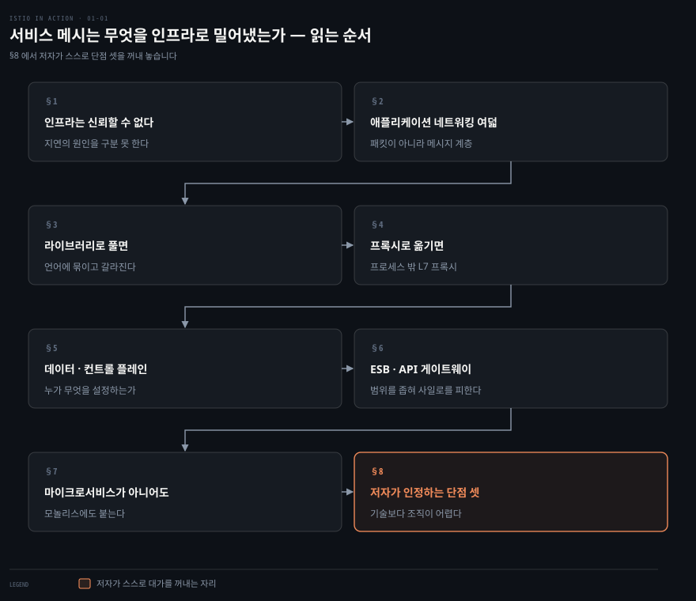
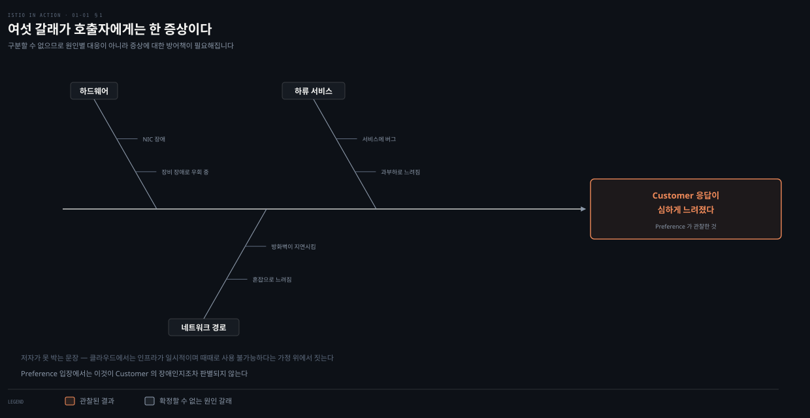
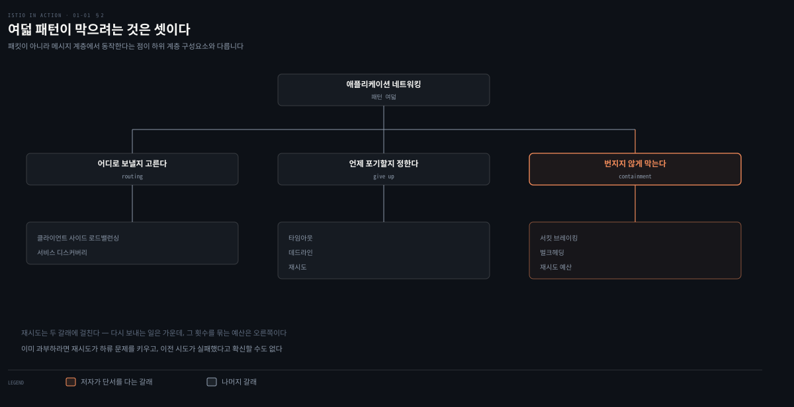
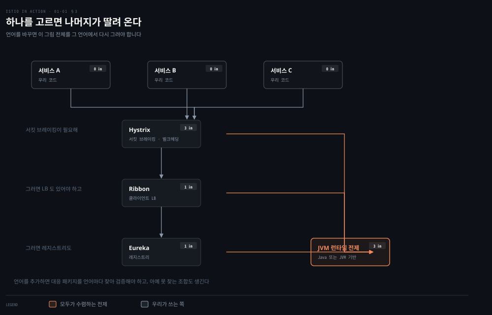
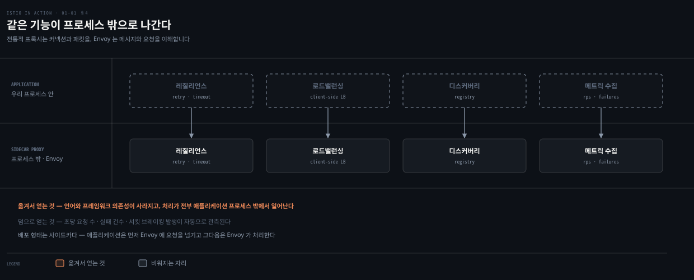
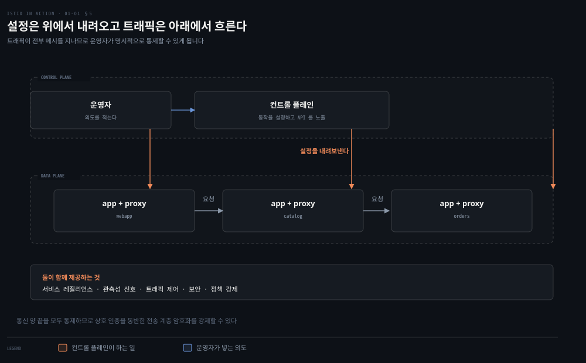
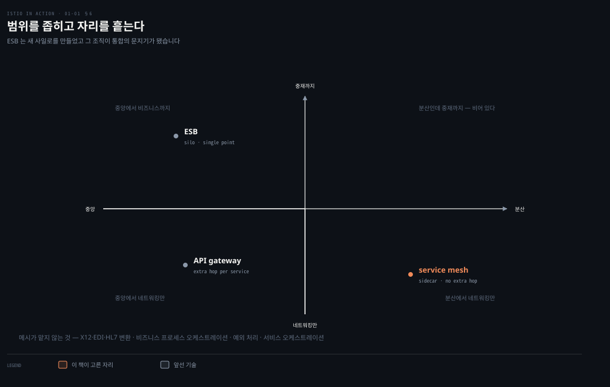
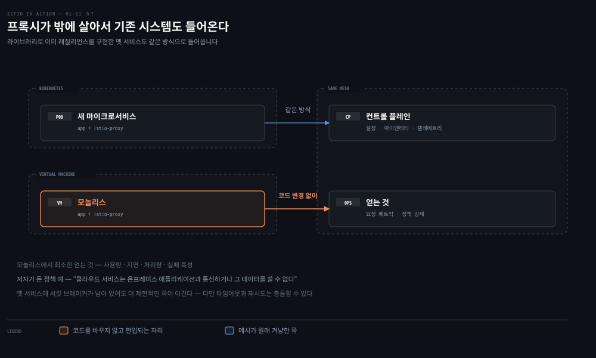
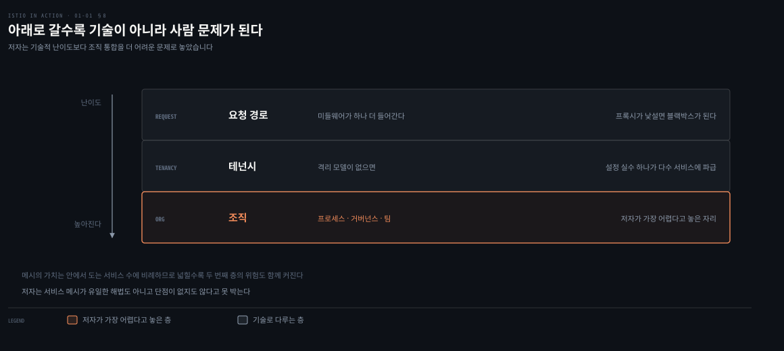

# 서비스 메시는 무엇을 인프라로 밀어냈는가

---

> 1장은 서비스 메시가 무엇을 인프라로 옮겼는지를 논증하는 장입니다. 클라우드 인프라를 믿을 수 없다는 전제에서 출발해 그 대응을 라이브러리로 풀었을 때 무엇이 깨지는지 보이고, 같은 기능을 프로세스 밖 프록시로 내리면 언어 제약이 사라진다고 잇습니다. 마지막 절에서 저자가 스스로 단점 셋을 꺼내 놓습니다.


## 핵심 요약

> 이 장 전체가 매달린 하나의 생각은 **재시도·타임아웃·서킷 브레이킹 같은 애플리케이션 네트워킹은 비즈니스를 차별화하지 않으므로 애플리케이션 밖으로 밀어내야 한다**는 것입니다.

저자는 그 밀어내기를 세 단계로 논증합니다. 먼저 클라우드 인프라를 신뢰할 수 없다는 전제를 깝니다. 그다음 그 대응을 라이브러리로 풀었을 때 무엇이 깨지는지를 NetflixOSS 사례로 보입니다. 마지막으로 같은 기능을 프로세스 밖 프록시로 옮기면 언어 제약이 사라진다고 잇습니다. Istio는 그 프록시(Envoy)를 데이터 플레인으로 두고 컨트롤 플레인이 설정을 내려보내는 구현입니다.


## 학습 목표

이 내용을 읽고 나면:

1. 애플리케이션 네트워킹이 왜 비즈니스 차별화 요소가 아닌지 설명할 수 있습니다.
2. 레질리언스를 라이브러리로 구현할 때 생기는 제약 세 가지를 근거와 함께 말할 수 있습니다.
3. 데이터 플레인과 컨트롤 플레인의 역할을 구분해 설명할 수 있습니다.
4. 서비스 메시가 ESB·API 게이트웨이와 무엇이 같고 무엇이 다른지 비교할 수 있습니다.
5. 저자가 인정한 서비스 메시의 단점 세 가지를 들어 도입 여부를 판단할 수 있습니다.

아래는 이 문서 전체를 읽는 순서로 이은 지도입니다. 칸마다 절 번호와 그 절이 답하는 질문 하나를 적었습니다. 색이 붙은 칸이 저자가 스스로 단점을 꺼내 놓는 자리입니다.




## 이 문서가 다루지 않는 것

> 1장은 개념을 세우는 장이라 구현이 거의 없습니다. 구현 쪽은 이미 정리된 노트가 SSOT이므로 링크로 넘깁니다.

- `istiod`의 내부 구조와 xDS 여섯 API의 동작 → [Envoy가 맡는 일과 Istio가 보태는 일](03-01.Envoy%EA%B0%80%20%EB%A7%A1%EB%8A%94%20%EC%9D%BC%EA%B3%BC%20Istio%EA%B0%80%20%EB%B3%B4%ED%83%9C%EB%8A%94%20%EC%9D%BC.md)
- 2절의 패턴 여덟 가지가 실제 CRD로 어떻게 선언되는지 → [실패를 견디는 일을 프록시로 옮겼을 때](06-01.%EC%8B%A4%ED%8C%A8%EB%A5%BC%20%EA%B2%AC%EB%94%94%EB%8A%94%20%EC%9D%BC%EC%9D%84%20%ED%94%84%EB%A1%9D%EC%8B%9C%EB%A1%9C%20%EC%98%AE%EA%B2%BC%EC%9D%84%20%EB%95%8C.md)
- 설치 절차와 컨트롤 플레인 컴포넌트 → [배포와 릴리스를 가르는 첫 실습](02-01.%EB%B0%B0%ED%8F%AC%EC%99%80%20%EB%A6%B4%EB%A6%AC%EC%8A%A4%EB%A5%BC%20%EA%B0%80%EB%A5%B4%EB%8A%94%20%EC%B2%AB%20%EC%8B%A4%EC%8A%B5.md) §1
- 같은 트래픽을 패킷·커널 계층에서 본 관점 → [Networking and Kubernetes 정독 인덱스](../networking-and-kubernetes/README.md)

남는 것은 **저자가 왜 그렇게 설계했다고 말하는가**입니다. 기능 목록이 아니라 그 기능을 애플리케이션 밖으로 옮긴 판단과 그 대가가 이 노트의 몫입니다.


## 1. 문제의 출발점 — 인프라는 원래 신뢰할 수 없습니다
> 클라우드에서는 인프라가 일시적이며 때때로 사용 불가능하다는 가정 위에서 애플리케이션을 짓습니다. 호출자가 하류 지연의 원인을 구분할 수 없다는 사실이 그 설계를 강제합니다.



저자는 ACME라는 가상 회사의 실패담으로 시작합니다. 모놀리스에서 서비스 A·B를 떼어내고 신규 서비스 C를 추가한 뒤 세 가지 문제를 만났습니다.

1. 서비스마다 요청 처리 시간이 들쭉날쭉했고, 피크 시간대에는 아예 트래픽을 못 받는 서비스가 생겼습니다. 서비스 B가 느려지면 서비스 A도 특정 요청에서만 함께 느려졌습니다.
2. 자동화 테스트가 못 잡은 버그가 배포로 흘러들어 갔습니다. 블루-그린 배포로 위험을 낮추려 했지만 오히려 한 번에 전환되는 "빅뱅" 릴리스가 됐습니다.
3. 팀마다 보안을 다르게 구현했습니다. A팀은 인증서와 개인키를, B팀은 토큰과 서명 검증을 쓰는 자체 프레임워크를 만들었고, C팀은 사내 방화벽 뒤라는 이유로 아무것도 하지 않았습니다.

세 번째 문제가 특히 중요합니다. 같은 조직 안에서 같은 관심사를 세 팀이 세 방식으로 구현했습니다. 그중 하나는 아예 구현하지 않기로 결정했습니다. 이것이 이 장의 논지를 떠받칩니다. 횡단 관심사를 각 팀에 맡기면 구현이 갈라집니다. 갈라진 구현은 장애 상황에서 원인을 추적하기 어렵게 만듭니다.

저자가 클라우드 환경의 전제로 못 박는 문장은 다음입니다. 과거에는 인프라를 고가용으로 만들고 그 위에서 가용성을 가정하며 애플리케이션을 지었습니다. 클라우드에서는 인프라가 일시적이며 때때로 사용 불가능하다는 가정 위에서 애플리케이션을 지어야 합니다.

이어지는 예시는 단순합니다. Preference 서비스가 Customer 서비스를 호출하는데 응답이 심하게 느려집니다. 원인 후보는 여섯 가지입니다.

- Customer 서비스에 과부하가 걸려 느리게 동작합니다.
- Customer 서비스에 버그가 있습니다.
- 네트워크의 방화벽이 트래픽을 지연시킵니다.
- 네트워크가 혼잡해 트래픽이 느려집니다.
- 네트워크 하드웨어에 장애가 나 트래픽을 우회시키는 중입니다.
- Customer 서비스 하드웨어의 네트워크 카드에 장애가 발생했습니다.

핵심은 **호출자가 이 여섯 가지를 구분할 수 없다**는 것입니다. Preference 서비스 입장에서는 이것이 Customer 서비스의 장애인지조차 판별되지 않습니다. 구분할 수 없으므로 원인별 대응이 아니라 증상에 대한 일반적 방어책이 필요해집니다.


## 2. 애플리케이션 네트워킹 패턴 여덟 가지
> 저자가 든 여덟은 네트워킹 하위 계층의 유사 구성요소와 겹치지만, 패킷이 아니라 메시지 계층에서 동작한다는 점이 다릅니다.



저자는 이런 상황을 완화하려고 진화한 패턴을 여덟 개로 정리합니다. 이들을 묶어 **애플리케이션 네트워킹**이라 부릅니다. 네트워킹 스택 하위 계층의 유사 구성요소와 겹치지만, 패킷이 아니라 **메시지 계층에서 동작한다**는 점이 다르다고 선을 긋습니다.

- **클라이언트 사이드 로드밸런싱**: 가능한 엔드포인트 목록을 클라이언트에 주고 어디를 호출할지 클라이언트가 정하게 합니다.
- **서비스 디스커버리**: 특정 논리 서비스의 정상 엔드포인트 목록을 주기적으로 갱신해 찾는 메커니즘입니다.
- **서킷 브레이킹**: 오작동으로 보이는 서비스에 일정 기간 부하를 흘리지 않습니다.
- **벌크헤딩**: 서비스 호출 시 커넥션·스레드·세션 같은 클라이언트 리소스 사용을 명시적 임계값으로 제한합니다.
- **타임아웃**: 요청·소켓·활성 확인에 시간 제한을 강제합니다.
- **재시도**: 실패한 요청을 다시 보냅니다.
- **재시도 예산**: 재시도에 제약을 겁니다. 예를 들어 10초 창에서 호출의 50%만 재시도하도록 제한합니다.
- **데드라인**: 응답이 언제까지 유용한지 요청에 문맥을 줍니다. 데드라인을 벗어나면 처리를 무시합니다.

재시도를 다룰 때 저자가 붙이는 단서가 중요합니다. 이미 과부하 상태라면 재시도가 하류 문제를 키울 뿐이고, 재시도하는 쪽은 이전 시도가 성공하지 않았다고 확신할 수도 없습니다. 그래서 재시도 예산이라는 별도 패턴이 필요해집니다.


## 3. 라이브러리로 풀면 무엇이 깨지는가
> 하나를 고르면 나머지가 딸려 오고, 언어를 바꾸면 그 전체를 다시 그려야 합니다. 저자가 라이브러리 방식의 결정적 한계로 지목하는 자리입니다.



이 문제를 먼저 푼 곳은 대형 인터넷 기업들이었습니다. Google은 Stubby를, Twitter는 Finagle을 만들었고, Netflix는 2012년 자사 마이크로서비스 라이브러리를 오픈소스로 공개했습니다. NetflixOSS의 구성은 다음과 같습니다.

- **Hystrix**: 서킷 브레이킹과 벌크헤딩
- **Ribbon**: 클라이언트 사이드 로드밸런싱
- **Eureka**: 서비스 등록과 디스커버리
- **Zuul**: 동적 엣지 프록시

사용하려면 의존성을 추가하고 클래스패스에 넣은 뒤 애플리케이션 코드에서 직접 호출해야 합니다. 의존성 관리 시스템에 Hystrix를 끌어오는 선언은 다음과 같습니다.

```xml
<dependency>
    <groupId>com.netflix.hystrix</groupId>
    <artifactId>hystrix-core</artifactId>
    <version>x.y.z</version>
</dependency>
```

그다음 명령을 기반 클래스 `HystrixCommand`로 감쌉니다.

```java
public class CommandHelloWorld extends HystrixCommand<String> {
    private final String name;

    public CommandHelloWorld(String name) {
        super(HystrixCommandGroupKey.Factory.asKey("ExampleGroup")
        this.name = name;
    }

    @Override
    protected String run() {
        // a real example would do work like a network call here
        return "Hello " + name + "!";
    }
}
```

> **원문 정오**: 위 코드의 `super(...)` 호출은 원문 PDF에서 닫는 괄호와 세미콜론이 빠진 채 인쇄돼 있습니다. 그대로 옮기면 컴파일되지 않습니다. 실제로는 `super(HystrixCommandGroupKey.Factory.asKey("ExampleGroup"));` 이어야 합니다. 원문 대조 시 혼동을 막으려고 인쇄 상태 그대로 두고 여기에 병기합니다.

책이 쓰인 뒤 Hystrix의 상태가 바뀌었습니다. 그 사실과 그것이 이 장의 논지에 무엇을 하는지는 아래 심화 학습에 적었습니다.

저자가 지적하는 라이브러리 방식의 문제는 세 가지입니다.

**첫째, 새 서비스가 남이 내린 결정에 구속됩니다.** Hystrix를 쓰려면 Java나 JVM 기반 기술이어야 합니다. 서킷 브레이킹과 로드밸런싱은 대개 함께 가므로 Ribbon도 필요하고, Ribbon으로 로드밸런싱하려면 엔드포인트를 찾을 레지스트리가 있어야 하니 Eureka까지 따라옵니다. 하나를 고르면 나머지가 딸려 오는 구조입니다.

**둘째, 언어를 바꾸면 같은 작업을 처음부터 반복해야 합니다.** 사용자 대면 API에는 NodeJS가 낫다고 판단했다고 해봅시다. 나머지가 Java와 NetflixOSS라면 대응되는 패키지(`resilient`, `hystrixjs` 같은)를 언어마다 찾아 검증하고 스택에 편입해야 합니다. 각 라이브러리는 구현이 다르고 가정도 다릅니다. 대응물을 아예 못 찾는 조합도 생깁니다. 그러면 일부 언어만 부분 구현된 상태로 남아 장애 시나리오를 추론하기 어려워집니다.

**셋째, 여러 언어에 걸친 라이브러리를 유지하는 일 자체가 어렵습니다.** 모든 구현이 일관되고 정확해야 하는데, 하나만 어긋나도 시스템에 예측 불가능성이 들어옵니다. 서비스 전체에 업데이트를 동시에 밀어 넣는 일도 만만치 않습니다.

정리하면 탈중앙화 자체는 클라우드 아키텍처에 맞는 방향이지만, 그 대가로 따라오는 운영 부담과 제약을 대부분의 조직이 감당하기 어렵다는 것이 저자의 결론입니다.


## 4. 프록시로 옮기면 무엇이 달라지는가
> 같은 기능이 프로세스 밖으로 나갑니다. 커넥션과 패킷이 아니라 메시지와 요청을 이해하는 L7 프록시가 그 자리를 채웁니다.



해법은 이 관심사들을 인프라로 내리는 것입니다. 다만 기존 프록시로는 부족합니다. HAProxy나 Apache의 `mod_proxy` 같은 전통적 인프라 프록시는 커넥션과 패킷을 이해합니다. 여기서 필요한 것은 메시지와 요청 같은 애플리케이션 구성물을 이해하는 프록시입니다. 저자의 표현으로는 **레이어 7 프록시**입니다.

그 자리를 채운 것이 Envoy입니다. Lyft가 자사 SOA 인프라의 일부로 개발했습니다. 재시도·타임아웃·서킷 브레이킹·클라이언트 사이드 로드밸런싱·서비스 디스커버리·보안·메트릭 수집을 **언어나 프레임워크 의존성 없이** 구현합니다. 이 처리는 전부 애플리케이션 프로세스 밖에서 이뤄집니다.

Envoy의 가치는 레질리언스에 그치지 않습니다. 초당 요청 수, 실패 건수, 서킷 브레이킹 발생 같은 네트워킹 메트릭을 함께 잡아내므로, 서비스 사이에서 무슨 일이 일어나는지 자동으로 관측할 수 있게 됩니다. 저자는 예상하지 못한 복잡성이 드러나기 시작하는 지점이 바로 여기라고 씁니다.

배포 형태는 사이드카입니다. Kubernetes라면 애플리케이션과 서비스 프록시를 하나의 Pod에 함께 배포합니다. 애플리케이션이 외부와 통신하려면 먼저 Envoy에 요청을 넘깁니다. 그다음은 Envoy가 상류와의 통신을 처리합니다. 이 프록시와 애플리케이션의 조합이 서비스 메시라는 통신 버스의 토대가 됩니다.

원서는 이 사이드카를 유일한 배포 형태로 전제합니다. 지금은 그렇지 않고, 그 차이는 아래 심화 학습에 적었습니다.


## 5. 데이터 플레인과 컨트롤 플레인
> 프록시가 늘어나면 그 집단을 설정하고 관리하는 일이 새 문제가 됩니다. 여기서 두 평면이 갈립니다.



프록시가 늘어나면 새 문제가 생깁니다. 애플리케이션마다 프록시 동작에 대한 요구가 다른데, 서비스가 많아질수록 대규모 프록시 집단을 설정하고 관리하기가 어려워집니다. 여기서 두 평면이 갈립니다.

서비스 메시는 애플리케이션을 대신해 네트워크 트래픽을 투명하게, 프로세스 밖에서 처리하는 분산 애플리케이션 인프라입니다. 구성은 다음과 같습니다.

- **데이터 플레인**: 서비스 프록시들이 이룹니다. 메시를 통과하는 트래픽을 수립·보안·제어합니다.
- **컨트롤 플레인**: 메시의 두뇌입니다. 데이터 플레인의 동작을 설정하며, 운영자가 네트워크 동작을 조작할 API를 노출합니다.

둘이 함께 제공하는 것은 서비스 레질리언스, 관측성 신호, 트래픽 제어, 보안, 정책 강제입니다.

트래픽이 전부 메시를 지나므로 운영자는 트래픽을 명시적으로 통제할 수 있습니다. 새 버전을 라이브 트래픽의 1%에만 노출하는 것 같은 일이 가능해집니다. 반대 방향으로는 요청 급증·지연·처리량·실패를 추적해 시스템 상태를 그려낼 수 있습니다. 그리고 통신 양 끝을 모두 통제하므로 상호 인증을 동반한 전송 계층 암호화, 즉 mTLS를 강제할 수 있습니다.

Istio는 이 서비스 메시의 오픈소스 구현이며 Google·IBM·Lyft가 시작했습니다. 데이터 플레인은 Envoy를 쓰고, 컨트롤 플레인은 최종 사용자·운영자용 API, 프록시 설정 API, 보안 설정, 정책 선언을 제공하는 컴포넌트들로 이뤄집니다. 원래 Kubernetes 위에서 돌도록 만들어졌지만 배포 플랫폼에 중립적인 관점으로 작성돼, OpenShift나 가상 머신 같은 전통적 배포 환경에도 적용됩니다.

> `istiod`가 이 설정을 실어 나르는 방식은 이 장에서 다루지 않습니다. 3장이 xDS 여섯 API와 ADS를 다루므로 [Envoy가 맡는 일과 Istio가 보태는 일](03-01.Envoy%EA%B0%80%20%EB%A7%A1%EB%8A%94%20%EC%9D%BC%EA%B3%BC%20Istio%EA%B0%80%20%EB%B3%B4%ED%83%9C%EB%8A%94%20%EC%9D%BC.md) §5가 그 부분의 SSOT입니다.


## 6. ESB·API 게이트웨이와 무엇이 다른가
> 차이는 범위와 배치입니다. ESB 는 관심사를 섞어 새 사일로를 만들었고, 내부 API 앞의 게이트웨이는 홉을 하나 더 만듭니다.



이 절이 1장에서 가장 값진 부분입니다. Istio를 다뤄 본 사람에게도 새로운 관점이기 때문입니다.

저자는 SOA 시대의 ESB를 인용문으로 먼저 소환합니다. ESB는 SOA 논리 아키텍처의 "조용한 동반자"이며, 그 존재가 애플리케이션 서비스에 투명해야 한다고 정의됐습니다. 서비스 호출을 단순화하는 것이 근본 역할이라는 점도 마찬가지입니다. 여기까지는 서비스 메시가 기대하는 동작과 같습니다.

차이는 네 가지입니다.

- ESB는 조직 안에 **새로운 사일로**를 만들었고, 그 조직이 기업 내 서비스 통합의 문지기가 됐습니다.
- 배포와 구현이 고도로 **중앙집중적**이었습니다.
- 애플리케이션 네트워킹과 **서비스 중재(mediation) 관심사를 섞었습니다.**
- 복잡한 상용 벤더 소프트웨어에 기반한 경우가 많았습니다.

그래서 서비스 메시의 역할은 애플리케이션 네트워킹 관심사에 **한정됩니다**. 다음 네 가지는 서비스 메시에 속하지 않습니다.

- X12·EDI·HL7 같은 복잡한 비즈니스 변환
- 비즈니스 프로세스 오케스트레이션
- 프로세스 예외 처리
- 서비스 오케스트레이션

데이터 플레인이 애플리케이션 옆에 분산 배치되므로 ESB 아키텍처에서 흔하던 단일 실패 지점과 병목도 사라집니다. 책임 구조도 함께 바뀝니다. 운영자와 서비스 팀 양쪽이 SLO를 수립하고 그것을 뒷받침하도록 서비스 메시를 설정할 책임을 집니다. 통합 책임이 중앙 팀의 전유물이 아니라 모든 서비스 개발자가 나눠 지는 일이 됩니다.

API 게이트웨이와의 비교도 같은 축입니다. API 게이트웨이는 공개 API의 대외 엔드포인트를 제공하며 보안·레이트 리미팅·쿼터 관리·메트릭 수집을 맡습니다. 문제는 이것을 **내부 API에까지 쓸 때** 생깁니다.

| 비교 항목 | 내부 API에 쓴 API 게이트웨이 | 서비스 메시 |
|-----------|------------------------------|-------------|
| 홉 수 | 서비스마다 두 번. 게이트웨이까지 한 번, 실제 서비스까지 한 번 | 프록시가 서비스와 같은 자리에 있어 추가 홉 없음 |
| 구조 | 트래픽이 지나는 중앙 시스템이라 병목 위험 | 탈중앙화. 각 애플리케이션이 자기 워크로드에 맞게 프록시 설정 |
| 전송 보안 | 애플리케이션이 보안 설정에 참여하지 않으면 종단 간 확보 불가 | 애플리케이션이 모르는 채로 종단 간 확보 |
| 레질리언스 | 서킷 브레이커·벌크헤딩을 구현하지 않는 경우가 많음 | 기본 기능으로 포함 |

저자는 여기서 한 걸음 더 나갑니다. 서비스 프록시가 API 게이트웨이 기능을 강제·구현하는 자리가 되고 있다고 봅니다. 그래서 Istio 같은 기술이 성숙하면 **전용 API 게이트웨이 프록시 없이 서비스 메시 위에 API 관리가 얹히는** 방향으로 갈 것이라고 전망합니다.


## 7. 마이크로서비스가 아니어도 되는가
> 프록시가 애플리케이션 밖에 살기 때문에 기존 시스템을 바꾸지 않고 편입시킬 수 있습니다. 모놀리스도 최소한 요청 메트릭을 냅니다.



저자는 Istio가 마이크로서비스나 SOA 스타일 아키텍처를 겨냥하지만 거기에 한정되지 않는다고 명시합니다. 근거는 프록시가 애플리케이션 밖에 살기 때문에 기존 시스템을 바꾸지 않고도 편입시킬 수 있다는 점입니다.

모놀리스가 있다면 인스턴스마다 서비스 프록시를 함께 배포해 트래픽을 투명하게 처리하게 할 수 있습니다. 최소한 요청 메트릭을 얻어 사용량·지연·처리량·실패 특성을 파악하는 데 쓸 수 있습니다. 어느 서비스가 이 모놀리스와 통신해도 되는지에 대한 정책 강제 같은 상위 기능에도 참여시킬 수 있습니다. 저자가 드는 하이브리드 클라우드 예시는 "클라우드 서비스는 온프레미스 애플리케이션과 통신하거나 그 데이터를 사용할 수 없다"는 정책입니다.

NetflixOSS 같은 라이브러리로 이미 레질리언스를 구현한 옛 마이크로서비스도 마찬가지입니다. Istio와 애플리케이션이 서킷 브레이커를 둘 다 구현하고 있어도 더 제한적인 정책이 발동하므로 동작에는 문제가 없습니다. 다만 타임아웃과 재시도는 충돌할 수 있으며, 저자는 Istio를 써서 프로덕션에 가기 전에 이 충돌을 찾아내라고 권합니다.


## 8. 저자가 인정하는 단점 세 가지
> 저자는 서비스 메시가 유일한 해법도 아니고 단점이 없지도 않다고 못 박습니다. 셋 중 마지막이 기술이 아니라 조직 문제입니다.



이 절이 1장의 마지막 무게중심입니다. 저자는 서비스 메시가 유일한 해법도 아니고 단점이 없지도 않다고 못 박습니다.

1. **요청 경로에 미들웨어가 하나 더 들어갑니다.** 프록시에 익숙하지 않은 사람에게는 블랙박스가 되어 애플리케이션 동작을 디버깅하기 더 어려워집니다. Envoy가 네트워크 상황을 많이 노출하도록 설계돼 있어 없을 때보다 낫지만, Envoy 운영 경험이 없으면 복잡해 보이고 기존 디버깅 관행을 방해할 수 있습니다.
2. **테넌시 문제가 생깁니다.** 메시의 가치는 메시 안에서 도는 서비스에 비례하므로 서비스가 많을수록 가치가 커집니다. 그런데 물리적 메시 배포의 테넌시·격리 모델에 정책과 자동화, 사전 고려가 없으면 **메시를 잘못 설정했을 때 많은 서비스가 한꺼번에 영향을 받는** 상황에 놓입니다.
3. **또 하나의 계층이 곧 또 하나의 복잡성입니다.** 요청 경로에 있으므로 서비스 아키텍처의 근본적으로 중요한 조각이 됩니다. 이를 어떻게 설정하고 운영할지, 무엇보다 **기존 조직 프로세스·거버넌스·팀 사이에 어떻게 통합할지**가 어렵습니다.

세 번째 단점의 마지막 구절이 특히 실무적입니다. 저자는 기술적 난이도보다 조직 통합을 더 어려운 문제로 놓았습니다.


## 심화 학습

> 책 밖의 보강만 둡니다. 각 항목은 공식 1차 자료로 확인한 것입니다.

**사이드카가 유일한 배포 형태가 아닙니다.** 원서는 파드마다 프록시를 붙이는 형태를 전제합니다. 지금의 Istio에는 앰비언트 모드가 있어 파드마다 프록시를 두지 않습니다. 노드마다 하나씩 도는 ztunnel이 그 자리를 대신하는데, 공식 문서는 ztunnel의 범위를 "mTLS·인증·L4 인가·텔레메트리 같은 L3·L4 기능"으로 못 박고 "워크로드의 HTTP 트래픽을 종료하거나 헤더를 해석하지 않는다"고 적습니다.[^ambient] L7이 필요하면 웨이포인트 프록시를 따로 세웁니다.

이 차이가 1장의 논지를 흔들지는 않습니다. "프로세스 밖으로 밀어낸다"는 앰비언트에서도 그대로입니다. 다만 원서가 전제한 "인스턴스마다 프록시를 원자 단위로 동반"이라는 형태는 유지되지 않고, L4는 노드가 공유 처리합니다.

**Hystrix는 유지보수 모드입니다.** 책은 Hystrix를 현역 라이브러리로 놓고 설명합니다. Netflix는 저장소 README에서 더 이상 활발히 개발하지 않으며 이슈 검토·PR 병합·새 버전 릴리스를 하지 않는다고 밝히고, 신규 프로젝트에는 resilience4j 같은 활성 프로젝트를 권합니다.[^hystrix]

다만 이 장이 Hystrix로 보이려는 것은 특정 라이브러리의 수명이 아니라 **라이브러리 방식의 구조적 한계**입니다. 언어 구속·언어별 재구현·다언어 유지보수라는 세 논지는 이 변화로 약해지지 않습니다. 오히려 "라이브러리는 수명이 있고 그 수명이 끝나면 전 서비스가 함께 옮겨야 한다"는 논거가 하나 더 붙습니다.


## 결정 치트시트

> 1장의 판단 기준을 압축했습니다. 저자가 본문에서 밝힌 근거만 옮겼습니다.

| 상황 | 판단 | 근거 |
|------|------|------|
| 단일 언어 스택이고 서비스가 소수 | 라이브러리로 충분할 수 있음 | 언어 제약이 비용으로 작동하지 않고, 메시가 더하는 계층·운영 복잡성이 이득을 넘을 수 있음 |
| 폴리글랏이고 언어마다 대응 라이브러리를 찾아야 함 | 서비스 메시 | 언어별 구현이 갈라져 장애 추론이 어려워지는 것이 라이브러리 방식의 결정적 한계 |
| 모놀리스·레거시가 남아 있는 브라운필드 | 서비스 메시가 유리 | 프로세스 밖에서 동작하므로 기존 시스템 변경 없이 편입 가능 |
| 내부 API에 API 게이트웨이를 두고 있음 | 서비스 메시로 대체 검토 | 홉이 두 번 발생하고, 애플리케이션 참여 없이는 전송 보안을 종단 간 확보 불가 |
| 비즈니스 변환·프로세스 오케스트레이션이 필요 | 서비스 메시 밖에서 해결 | X12·EDI·HL7 변환과 오케스트레이션은 메시의 책임이 아님 |
| 메시 운영·테넌시 모델을 설계할 인력이 없음 | 도입 보류 | 정책·자동화·사전 고려 없이는 설정 실수 하나가 다수 서비스에 파급 |


## 적용 관점

> 실무 규칙 하나가 남습니다. 레질리언스 설정을 볼 때 애플리케이션 코드와 메시 설정을 함께 확인하는 것입니다.

이 장을 읽고 실제로 바꿀 행동 하나를 규칙으로 잡습니다. **레질리언스 설정을 볼 때 애플리케이션 코드와 메시 설정을 함께 확인합니다.** 타임아웃과 재시도는 양쪽에 동시에 존재할 수 있으므로 한쪽만 보고 판단하지 않습니다.

저자가 7절에서 짚은 지점입니다. 서킷 브레이커는 더 제한적인 쪽이 이겨서 안전하지만 타임아웃·재시도는 충돌할 수 있고, 그 충돌은 프로덕션 전에 찾아야 합니다. 라이브러리 기반 레질리언스가 남아 있는 서비스를 메시에 편입할 때 바로 걸리는 문제입니다.


## 면접에서 받을 만한 질문
> 답을 먼저 떠올린 뒤 아래 정답 절을 펼칩니다.

1. 이 장을 한 줄로 정의하면 무엇입니까?
2. 재시도·타임아웃·서킷 브레이킹을 애플리케이션 코드 밖으로 옮기려는 목표를 한 문장으로 말해 보십시오.
3. 데이터 플레인과 컨트롤 플레인은 각각 무엇을 맡습니까?
4. 서비스 메시는 ESB·API 게이트웨이와 각각 어디에서 갈립니까?
5. 레질리언스를 라이브러리로 구현하면 안 되는 이유는 무엇입니까?
6. 마이크로서비스가 아니면 Istio를 쓸 이유가 없습니까?
7. 서비스 메시의 단점은 무엇입니까?


## 정답 (자답 후 펼치기)

> 위 §면접에서 받을 만한 질문 의 7 개에 *먼저 자답한 뒤* 읽으십시오. 자답 없이 먼저 읽으면 학습 효과가 0 입니다. 질문 번호와 1:1 로 대응합니다.

### 정답 1 — 한 줄 정의

"서비스 메시란 애플리케이션을 대신해 네트워크 트래픽을 투명하게, 프로세스 밖에서 처리하는 분산 애플리케이션 인프라입니다."

### 정답 2 — 이 기능들을 코드 밖으로 옮기려는 목표는 무엇입니까

재시도·타임아웃·서킷 브레이킹은 필요하지만 비즈니스를 차별화하지 않는 횡단 관심사이므로, 언어·프레임워크에 중립적인 방식으로 구현해 정책으로 적용하는 것이 목표입니다.

### 정답 3 — 데이터 플레인과 컨트롤 플레인은 각각 무엇을 맡습니까

데이터 플레인은 트래픽을 수립·보안·제어하는 프록시 집합이고, 컨트롤 플레인은 그 동작을 설정하며 운영자에게 API를 노출합니다.

### 정답 4 — 서비스 메시는 ESB·API 게이트웨이와 각각 어디에서 갈립니까

서비스 메시는 ESB와 달리 애플리케이션 네트워킹에만 관여하며 비즈니스 변환·오케스트레이션을 맡지 않고, API 게이트웨이와 달리 추가 홉 없이 종단 간 전송 보안을 확보합니다.

### 정답 5 — 레질리언스를 라이브러리로 구현하면 안 되는 이유는 무엇입니까

안 되는 것은 아니지만 세 가지 비용이 따릅니다. 새 서비스가 기존 라이브러리 선택에 구속됩니다. 언어를 추가할 때마다 대응 라이브러리를 찾아 검증해야 합니다. 여러 언어의 구현을 일관되게 유지하는 부담도 조직에 남습니다. 구현이 갈라지면 장애 상황에서 원인을 추론하기 어려워지는 것이 가장 큰 손실입니다.

### 정답 6 — 마이크로서비스가 아니면 Istio를 쓸 이유가 없습니까

있습니다. 프록시가 애플리케이션 프로세스 밖에 있으므로 모놀리스 인스턴스 옆에도 배포할 수 있습니다. 최소한 요청 메트릭으로 사용량·지연·처리량·실패 특성을 얻고, 어느 서비스가 통신해도 되는지에 대한 정책 강제에도 쓸 수 있습니다.

### 정답 7 — 서비스 메시의 단점은 무엇입니까

세 가지입니다. 요청 경로에 프록시가 들어가므로 익숙하지 않으면 디버깅이 어려워집니다. 테넌시·격리 모델을 설계하지 않으면 설정 실수 하나가 다수 서비스에 파급됩니다. 계층이 하나 늘어난 만큼 조직 프로세스와 거버넌스에 통합하는 일도 어렵습니다.


## 핵심 개념 체크리스트

- [ ] 애플리케이션 네트워킹 패턴 여덟 가지를 나열하고 각각이 무엇을 막는지 말할 수 있는가?
- [ ] 호출자가 하류 지연의 원인을 구분할 수 없다는 사실이 왜 설계를 바꾸는지 설명할 수 있는가?
- [ ] 라이브러리 방식의 제약 세 가지를 NetflixOSS 사례로 설명할 수 있는가?
- [ ] 데이터 플레인과 컨트롤 플레인의 책임을 섞지 않고 말할 수 있는가?
- [ ] ESB와 서비스 메시의 차이 네 가지를 들 수 있는가?
- [ ] 내부 API에 API 게이트웨이를 쓸 때 생기는 홉·보안 문제를 설명할 수 있는가?
- [ ] 도입을 보류해야 할 상황을 저자의 단점 세 가지에 근거해 판단할 수 있는가?


## 관련 문서

- [Envoy가 맡는 일과 Istio가 보태는 일](03-01.Envoy%EA%B0%80%20%EB%A7%A1%EB%8A%94%20%EC%9D%BC%EA%B3%BC%20Istio%EA%B0%80%20%EB%B3%B4%ED%83%9C%EB%8A%94%20%EC%9D%BC.md) — 이 장이 개념으로만 남긴 `istiod`와 xDS의 실제 동작
- [실패를 견디는 일을 프록시로 옮겼을 때](06-01.%EC%8B%A4%ED%8C%A8%EB%A5%BC%20%EA%B2%AC%EB%94%94%EB%8A%94%20%EC%9D%BC%EC%9D%84%20%ED%94%84%EB%A1%9D%EC%8B%9C%EB%A1%9C%20%EC%98%AE%EA%B2%BC%EC%9D%84%20%EB%95%8C.md) — 2절 패턴 여덟 가지가 실제 CRD로 어떻게 선언되는지
- [거의 안전한 기본값을 닫아 가는 순서](09-01.%EA%B1%B0%EC%9D%98%20%EC%95%88%EC%A0%84%ED%95%9C%20%EA%B8%B0%EB%B3%B8%EA%B0%92%EC%9D%84%20%EB%8B%AB%EC%95%84%20%EA%B0%80%EB%8A%94%20%EC%88%9C%EC%84%9C.md) — 5절이 한 줄로 넘긴 mTLS 를 신원 발급부터 푸는 장
- [Networking and Kubernetes 정독 인덱스](../networking-and-kubernetes/README.md) — 같은 트래픽을 패킷·커널 계층에서 본 관점


## 참고 자료

- 원본: 《Istio in Action》 1장 "Introducing the Istio service mesh" (Christian E. Posta·Rinor Maloku, Manning)
- [Envoy 공식 사이트](https://www.envoyproxy.io/) — 본문에서 저자가 제시한 주소
- [Istio Ambient 모드 개요](https://istio.io/latest/docs/ambient/overview/) — 원서가 전제하지 않은 두 번째 배포 형태


[^ambient]: Istio — Ambient 모드 개요. ztunnel 의 L3·L4 범위와 웨이포인트 프록시의 L7 역할. <https://istio.io/latest/docs/ambient/overview/>
[^hystrix]: [Netflix/Hystrix 저장소 README](https://github.com/Netflix/Hystrix) (2026-08-11 조회). 원문은 "Hystrix is no longer in active development, and is currently in maintenance mode"라고 적습니다. 후속 조치도 명시합니다 — "Netflix will no longer actively review issues, merge pull-requests, and release new versions of Hystrix". 대안으로는 "open and active projects like resilience4j"를 신규 내부 프로젝트에 활용하며 다른 곳에도 같은 선택을 권하기 시작했다고 적습니다. 기존 Netflix 애플리케이션에서는 1.5.18 버전으로 남아 있습니다. 다만 이 README는 Hystrix의 상태만 말합니다. 서비스 메시와의 우열은 다루지 않으므로 이 각주를 라이브러리 방식 대 프록시 방식의 판단 근거로 확대 해석하지 않습니다.
