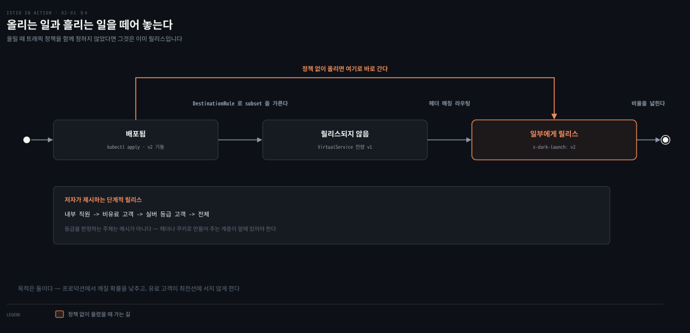

# 배포와 릴리스를 가르는 첫 실습

## 핵심 요약

> 이 장 전체가 매달린 하나의 생각은 **배포(deployment)와 릴리스(release)는 다른 사건이며, 서비스 메시가 그 둘을 실제로 분리해 준다**는 것입니다.
>
> 저자는 설치부터 시작해 예제 두 개를 메시에 넣고, 관측성·재시도·헤더 라우팅을 차례로 보입니다. 앞의 셋은 뒤의 하나를 위한 준비입니다. 코드를 프로덕션에 올리는 일과 그 코드에 실제 트래픽을 흘리는 일을 갈라 놓으면, 위험한 변경을 고객이 아니라 내가 먼저 만나게 만들 수 있습니다.


## 학습 목표

이 내용을 읽고 나면:

1. 배포와 릴리스의 차이를 정의하고 왜 분리해야 하는지 설명할 수 있습니다.
2. 컨트롤 플레인이 지는 아홉 가지 책임을 나열할 수 있습니다.
3. `istiod`가 사용자 의도를 Envoy 설정으로 번역하는 경로를 설명할 수 있습니다.
4. 블랙박스 관측이 무엇을 얻고 무엇을 놓치는지 판단할 수 있습니다.
5. 다크 런치를 헤더 매칭으로 구현하는 방식과 그 전제를 말할 수 있습니다.


## 이 문서가 다루지 않는 것

> 2장은 실습 비중이 큽니다. 설치 명령·CRD 필드·`istioctl` 사용법은 이미 정리된 노트가 SSOT이므로 여기서 되풀이하지 않습니다.

- 설치 절차, `istioctl x precheck`, `verify-install`, 사이드카 자동 주입 라벨 → `Istio 설치` <!-- 링크 끊김(2026-08): ../../service-mesh/03_istio/01-01.Istio 설치.md -->
- VirtualService·DestinationRule 필드 레퍼런스와 카나리 구현 → `Istio 트래픽 관리` <!-- 링크 끊김(2026-08): ../../service-mesh/03_istio/04-01.Istio 트래픽 관리.md -->
- 재시도·타임아웃 설정값의 상호작용 → `Istio 레질리언스` <!-- 링크 끊김(2026-08): ../../service-mesh/03_istio/05-01.Istio 레질리언스.md -->
- xDS 네 API의 동작 → `Istio 아키텍처` <!-- 링크 끊김(2026-08): ../../service-mesh/03_istio/02-01.Istio 아키텍처.md -->

이 문서에는 저자가 그 실습으로 **무엇을 보이려 했는지**만 남깁니다.


## 본문 정리



도식은 같은 코드가 프로덕션에 올라간 뒤 트래픽을 언제 받는지를 두 축으로 갈라 봅니다. 위쪽은 배포와 릴리스가 한 사건인 경우입니다. 아래쪽은 메시가 둘을 분리한 경우입니다. 색이 붙은 곳은 위쪽의 위험 구간 하나뿐입니다. 유료 고객이 새 코드의 첫 시험대가 되는 지점입니다.

### 1. 컨트롤 플레인이 지는 아홉 가지 책임

1장이 컨트롤 플레인을 "메시의 두뇌"라고만 했다면, 2장은 그 두뇌가 실제로 무엇을 하는지 목록으로 폅니다. 저자가 든 책임은 아홉 가지입니다.

- 운영자가 원하는 라우팅·레질리언스 동작을 지정하는 API
- 데이터 플레인이 자기 설정을 받아 가는 API
- 데이터 플레인을 위한 서비스 디스커버리 추상화
- 사용 정책(usage policy)을 지정하는 API
- 인증서 발급과 순환
- 워크로드 아이덴티티 할당
- 통합 텔레메트리 수집
- 서비스 프록시 사이드카 주입
- 네트워크 경계와 그 접근 방법의 명세

이 책임의 대부분이 `istiod`라는 단일 컴포넌트에 구현돼 있습니다. 목록을 굳이 옮긴 이유는, 이것이 "서비스 메시를 도입하면 무엇을 위임하게 되는가"의 구체적 답이기 때문입니다. 1장의 단점 세 가지 중 "또 하나의 계층이 곧 또 하나의 복잡성"이 무엇을 뜻하는지도 이 목록을 봐야 실감이 됩니다. 아홉 가지를 한 컴포넌트에 맡기는 결정입니다.

### 2. 의도에서 Envoy 설정까지

`istiod`가 하는 일을 한 문장으로 줄이면, 사용자가 쓴 높은 수준의 설정을 각 프록시에 맞는 낮은 수준의 설정으로 번역하는 것입니다. 저자는 같은 라우팅 규칙을 두 형태로 나란히 보여 이 번역을 드러냅니다.

운영자가 쓰는 쪽은 의도만 담습니다.

```yaml
apiVersion: networking.istio.io/v1alpha3
kind: VirtualService
metadata:
  name: catalog-service
spec:
  hosts:
  - catalog.prod.svc.cluster.local
  http:
  - match:
    - headers:
        x-dark-launch:
          exact: "v2"
    route:
    - destination:
        host: catalog.prod.svc.cluster.local
        subset: v2
  - route:
    - destination:
        host: catalog.prod.svc.cluster.local
        subset: v1
```

프록시가 받는 쪽은 클러스터 이름과 경로 접두사로 풀린 형태입니다.

```json
{
  "match": {
    "headers": [{ "name": "x-dark-launch", "value": "v2" }],
    "prefix": "/"
  },
  "route": {
    "cluster": "outbound|80|v2|catalog.prod.svc.cluster.local",
    "use_websocket": false
  }
}
```

위쪽은 "무엇을 원하는가"이고 아래쪽은 "어떻게 할 것인가"입니다. 운영자가 아래쪽을 직접 쓰지 않는다는 점이 이 구조의 값입니다. Istio 설정은 Kubernetes 커스텀 리소스(CRD)로 구현돼 있어서, Kubernetes 코드를 고치지 않고 API를 확장하는 방식으로 얹힙니다. 그래서 `kubectl`로 적용·생성·삭제하는 기존 습관이 그대로 통합니다.

> 이 번역을 실어 나르는 xDS API의 동작은 3장이 다룹니다. 자체 정리는 `Istio 아키텍처` <!-- 링크 끊김(2026-08): ../../service-mesh/03_istio/02-01.Istio 아키텍처.md --> 노트에 있습니다.

### 3. 블랙박스 관측 — 얻는 것과 못 얻는 것

프록시가 커넥션 양 끝에 앉아 있으므로 애플리케이션 코드를 건드리지 않고도 텔레메트리가 나옵니다. 저자가 강조하는 표현은 애플리케이션이 프록시에게 **블랙박스**라는 것입니다. 관측은 애플리케이션이 무슨 일을 했다고 *생각하는지*가 아니라 네트워크에서 실제로 관찰된 동작을 향합니다.

이 관점이 왜 중요한지는 저자의 문장이 직접 말합니다. 계측을 아무리 열심히 해도 그것은 애플리케이션의 자기 보고입니다. 프록시가 보는 것은 실제로 오간 요청입니다. 둘이 어긋날 때 진실은 후자 쪽입니다.

다만 저자는 여기서 곧바로 한계를 답니다. 분산 추적에서 **Istio가 대신해 줄 수 없는 부분**이 남습니다.

Istio는 서비스 *사이*로 추적 정보를 전파하고 스팬을 추적 엔진에 보냅니다. 그러나 애플리케이션 *안에서* 추적 메타데이터를 이어 주는 일은 애플리케이션의 책임입니다. Istio는 특정 서비스 안에서 무슨 일이 일어나는지 알 수 없으므로, 들어온 요청과 나가는 요청의 인과를 짝지을 수 없습니다. 들어온 헤더를 나가는 요청에 넣어 주는 일은 애플리케이션이 해야 합니다.

이것이 "코드 변경 없이"라는 말의 정확한 경계입니다. 레질리언스와 상위 메트릭은 정말 코드 변경이 없지만, 분산 추적은 최소한의 협조를 요구합니다.

> 트레이스 헤더 전파의 구체적 구현은 `Istio 관측성` <!-- 링크 끊김(2026-08): ../../service-mesh/03_istio/07-01.Istio 관측성.md --> 노트가 다룹니다.

### 4. 배포와 릴리스를 가르는 이유

이 장의 결론입니다. 저자는 두 낱말을 명확히 갈라 정의합니다.

- **배포(deployment)**: 새 코드를 프로덕션에 가져다 놓는 일입니다. 올려 둔 상태에서 테스트를 돌려 프로덕션에 적합한지 평가할 수 있습니다.
- **릴리스(release)**: 그 코드에 실제 트래픽을 흘리는 일입니다.

둘을 분리하는 목적은 두 가지입니다. 프로덕션에서 무언가 깨질 확률을 낮추고, **유료 고객이 위험한 변경의 최전선에 서지 않게** 하는 것입니다. 저자가 제시하는 단계적 릴리스는 내부 직원에게만 새 배포를 태워 동작을 지켜보는 데서 시작합니다. 그다음 비유료 고객, 실버 등급 고객 순으로 트래픽을 넓혀 갑니다.

여기서 1장과 이어집니다. 1장은 서비스 메시가 "라이브 트래픽의 1%에만 새 버전을 노출"할 수 있다고 했는데, 2장은 그 능력이 왜 필요한지를 배포와 릴리스의 분리로 설명합니다. 능력이 먼저가 아니라 문제가 먼저입니다.

실습에서 이 분리는 두 단계로 나타납니다. `catalog`의 v2를 띄우는 것이 배포입니다. 이때 Kubernetes는 기본적으로 두 버전 사이에 제한적인 형태의 부하 분산을 합니다. 그래서 배포만으로 이미 일부 응답이 v2에서 나옵니다. 저자가 DestinationRule로 버전을 구분하고 VirtualService로 전량 v1에 묶는 것은 **배포됐지만 릴리스되지 않은 상태**를 만들기 위해서입니다.

그 상태에서 특정 헤더를 가진 요청만 v2로 보냅니다.

```bash
curl http://localhost/api/catalog -H "x-dark-launch: v2"
```

이 요청만 `imageUrl` 필드가 붙은 v2 응답을 받고, 나머지 트래픽은 전부 v1으로 갑니다. 다크 런치라고 부르는 방식입니다.

전제도 함께 봐야 합니다. 이 방식이 성립하려면 호출자가 헤더를 넣을 수 있어야 합니다. 내부 직원이나 테스트 클라이언트라면 쉽지만, 최종 사용자를 등급으로 가르려면 그 등급을 헤더나 쿠키로 만들어 주는 계층이 앞에 있어야 합니다. 저자가 "특정 클래스의 사용자를 라우팅한다"고 말할 때 그 클래스를 판정하는 주체는 메시가 아닙니다.


## 결정 치트시트

> 2장에서 끌어낼 수 있는 판단 기준입니다. 저자가 본문에서 밝힌 근거만 옮겼습니다.

| 상황 | 판단 | 근거 |
|------|------|------|
| 새 버전을 올렸는데 트래픽이 섞여 들어감 | DestinationRule + VirtualService로 전량 구버전 고정 | 배포만으로 Kubernetes가 이미 부하를 나눠 보냄 |
| 새 기능을 일부에게만 보이고 싶음 | 헤더 매칭 다크 런치 | 요청 단위로 경로·헤더·쿠키를 매칭할 수 있음 |
| 애플리케이션 자기 보고와 실제 동작이 다름 | 프록시 텔레메트리를 신뢰 | 프록시는 네트워크에서 관찰된 것을 봄 |
| 분산 추적이 서비스 경계에서 끊김 | 애플리케이션의 헤더 전파를 점검 | Istio는 서비스 내부의 인과를 알 수 없음 |
| 컨트롤 플레인이 잠시 내려감 | 데이터 플레인은 계속 동작 | 단절 기간을 견디도록 구현돼 있음 |


## 적용 관점

이 장을 읽고 실제로 바꿀 행동 하나를 **규칙**으로 잡습니다.

> 새 버전을 올릴 때 "배포했다"와 "릴리스했다"를 말로 구분합니다. 올리는 시점에 트래픽 정책을 함께 정하지 않았다면 그것은 배포가 아니라 이미 릴리스입니다.

Spring 앱을 운영하는 관점에서 보면, `kubectl apply`로 새 Deployment를 올리는 순간 Service가 이미 그쪽으로 부하를 나눕니다. 즉 기본값은 "배포 = 릴리스"입니다. 둘을 가르려면 올리기 *전에* subset과 라우팅 규칙이 있어야 합니다. 이 순서를 뒤집으면 분리는 실패합니다.


## 면접 대비

### 한 줄 정의

"배포는 새 코드를 프로덕션에 가져다 놓는 일이고, 릴리스는 그 코드에 실제 트래픽을 흘리는 일입니다."

### 핵심 포인트 세 가지

1. 두 사건을 분리하면 프로덕션에서 테스트한 뒤 트래픽을 주는 순서가 가능해지고, 유료 고객이 위험한 변경의 최전선에 서지 않습니다.
2. Kubernetes만으로는 배포가 곧 릴리스입니다. Service가 새 Pod에 바로 부하를 나누므로, 분리하려면 DestinationRule로 버전을 구분하고 VirtualService로 트래픽을 묶어야 합니다.
3. 관측은 블랙박스로 얻지만 분산 추적만은 예외입니다. 서비스 내부의 헤더 전파는 애플리케이션이 책임집니다.

### 자주 묻는 질문

Q: 코드 변경 없이 관측성을 얻는다는 말은 어디까지 사실입니까?
A: 상위 메트릭과 서비스 간 스팬 수집까지는 사실입니다. 다만 한 서비스에 들어온 요청과 그 서비스가 내보내는 요청을 이어 주는 일은 애플리케이션이 해야 합니다. Istio는 프로세스 내부를 볼 수 없어 인과를 짝지을 수 없기 때문입니다.

Q: 다크 런치와 카나리는 어떻게 다릅니까?
A: 이 장의 다크 런치는 헤더 같은 요청 속성으로 대상을 *고르는* 방식입니다. 카나리는 비율로 트래픽을 *나누는* 방식입니다. 전자는 누가 보는지 특정할 수 있고 후자는 노출량을 조절합니다. 저자는 2장에서 전자를 보이고 비율 기반은 5장으로 넘깁니다.

Q: 컨트롤 플레인이 단일 장애점 아닙니까?
A: 데모 설치는 컴포넌트마다 레플리카가 하나뿐이지만, 실제로는 다중 레플리카의 고가용 구조로 배포하도록 의도돼 있습니다. 그리고 컨트롤 플레인 전체가 내려가도 데이터 플레인은 단절 기간 동안 계속 동작할 만큼 견디게 구현돼 있습니다.


## 핵심 개념 체크리스트

- [ ] 배포와 릴리스를 각각 한 문장으로 정의할 수 있는가?
- [ ] 배포만 했는데 이미 릴리스가 되어 버리는 상황을 설명할 수 있는가?
- [ ] 컨트롤 플레인의 아홉 가지 책임 중 다섯 개 이상을 말할 수 있는가?
- [ ] 운영자가 쓰는 설정과 프록시가 받는 설정의 차이를 예로 들 수 있는가?
- [ ] 블랙박스 관측이 애플리케이션 자기 보고보다 나은 이유를 말할 수 있는가?
- [ ] 분산 추적에서 애플리케이션이 책임지는 부분이 무엇인지 아는가?
- [ ] 다크 런치가 성립하기 위한 전제를 말할 수 있는가?


## 관련 문서

- [서비스 메시는 무엇을 인프라로 밀어냈는가](01-01.서비스%20메시는%20무엇을%20인프라로%20밀어냈는가.md) — 이 장이 실습으로 보이는 능력들이 왜 필요했는지의 배경
- `Istio 설치` <!-- 링크 끊김(2026-08): ../../service-mesh/03_istio/01-01.Istio 설치.md --> — 2장 실습의 설치 절차 SSOT
- `Istio 트래픽 관리` <!-- 링크 끊김(2026-08): ../../service-mesh/03_istio/04-01.Istio 트래픽 관리.md --> — VirtualService·DestinationRule 필드와 카나리 구현
- `Istio 관측성` <!-- 링크 끊김(2026-08): ../../service-mesh/03_istio/07-01.Istio 관측성.md --> — 트레이스 헤더 전파의 구체적 구현


## 참고 자료

- 원본: 《Istio in Action》 2장 "First steps with Istio" (Christian E. Posta·Rinor Maloku, Manning)
- [책 예제 소스 코드](https://github.com/istioinaction/book-source-code) — 본문에서 저자가 제시한 주소
