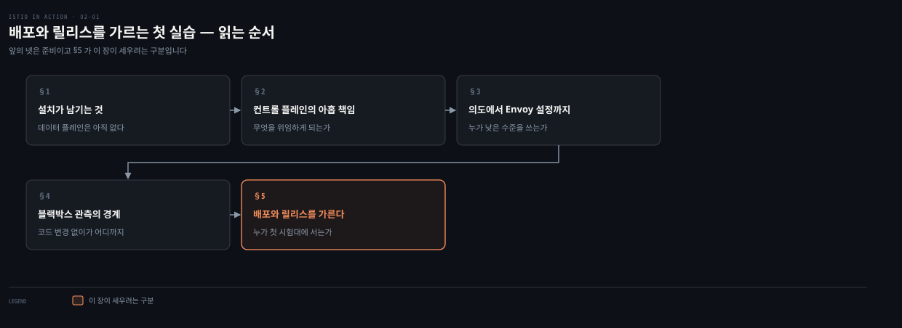
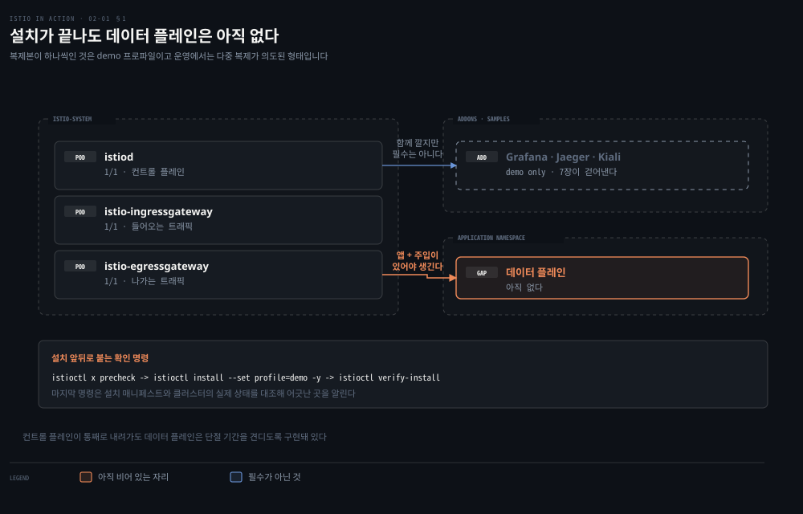
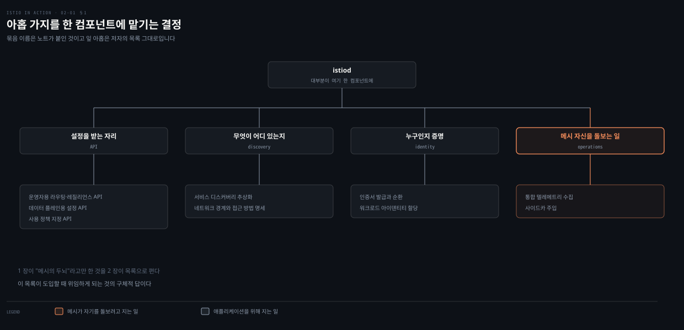
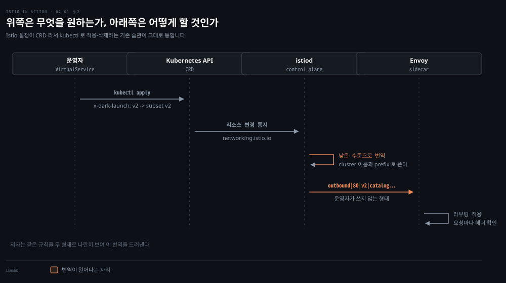
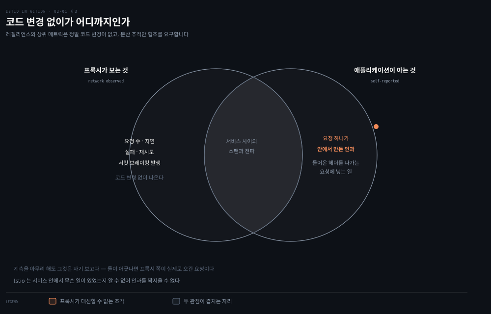

# 배포와 릴리스를 가르는 첫 실습

---

> 2장은 설치와 첫 실습의 장처럼 보이지만, 저자가 실제로 세우는 것은 낱말 하나입니다. 코드를 프로덕션에 올리는 일과 그 코드에 트래픽을 흘리는 일이 다른 사건이라는 것입니다. 앞의 세 절이 그 결론을 위한 준비입니다.


## 핵심 요약

> 이 장 전체가 매달린 하나의 생각은 **배포(deployment)와 릴리스(release)는 다른 사건이며, 서비스 메시가 그 둘을 실제로 분리해 준다**는 것입니다.

저자는 설치부터 시작해 예제 두 개를 메시에 넣고, 관측성·재시도·헤더 라우팅을 차례로 보입니다. 앞의 셋은 뒤의 하나를 위한 준비입니다. 코드를 프로덕션에 올리는 일과 그 코드에 실제 트래픽을 흘리는 일을 갈라 놓으면, 위험한 변경을 고객이 아니라 내가 먼저 만나게 만들 수 있습니다.


## 학습 목표

이 내용을 읽고 나면:

1. 배포와 릴리스의 차이를 정의하고 왜 분리해야 하는지 설명할 수 있습니다.
2. 설치가 끝난 시점에 무엇이 서 있고 무엇이 아직 없는지 말할 수 있습니다.
3. 컨트롤 플레인이 지는 아홉 가지 책임을 나열할 수 있습니다.
4. `istiod`가 사용자 의도를 Envoy 설정으로 번역하는 경로를 설명할 수 있습니다.
5. 블랙박스 관측이 무엇을 얻고 무엇을 놓치는지 판단할 수 있습니다.
6. 다크 런치를 헤더 매칭으로 구현하는 방식과 그 전제를 말할 수 있습니다.

아래는 이 문서 전체를 읽는 순서로 이은 지도입니다. 칸마다 절 번호와 그 절의 요점 하나를 적었습니다. 색이 붙은 칸이 이 장의 결론이 놓이는 자리입니다.




## 이 문서가 다루지 않는 것

> 2장은 실습 비중이 큽니다. 설치 명령·CRD 필드·`istioctl` 사용법은 이미 정리된 노트가 SSOT이므로 여기서 되풀이하지 않습니다.

- VirtualService·DestinationRule 필드 레퍼런스와 가중치 라우팅 → [위험에 노출되는 트래픽을 줄여 가는 순서](05-01.%EC%9C%84%ED%97%98%EC%97%90%20%EB%85%B8%EC%B6%9C%EB%90%98%EB%8A%94%20%ED%8A%B8%EB%9E%98%ED%94%BD%EC%9D%84%20%EC%A4%84%EC%97%AC%20%EA%B0%80%EB%8A%94%20%EC%88%9C%EC%84%9C.md)
- 재시도·타임아웃 설정값의 상호작용 → [실패를 견디는 일을 프록시로 옮겼을 때](06-01.%EC%8B%A4%ED%8C%A8%EB%A5%BC%20%EA%B2%AC%EB%94%94%EB%8A%94%20%EC%9D%BC%EC%9D%84%20%ED%94%84%EB%A1%9D%EC%8B%9C%EB%A1%9C%20%EC%98%AE%EA%B2%BC%EC%9D%84%20%EB%95%8C.md)
- xDS 여섯 API 와 ADS 의 동작 → [Envoy가 맡는 일과 Istio가 보태는 일](03-01.Envoy%EA%B0%80%20%EB%A7%A1%EB%8A%94%20%EC%9D%BC%EA%B3%BC%20Istio%EA%B0%80%20%EB%B3%B4%ED%83%9C%EB%8A%94%20%EC%9D%BC.md)
- 관측 애드온을 운영용으로 바꾸는 이야기 → [미리 정하지 않았던 것을 나중에 세려면](07-01.%EB%AF%B8%EB%A6%AC%20%EC%A0%95%ED%95%98%EC%A7%80%20%EC%95%8A%EC%95%98%EB%8D%98%20%EA%B2%83%EC%9D%84%20%EB%82%98%EC%A4%91%EC%97%90%20%EC%84%B8%EB%A0%A4%EB%A9%B4.md)

설치 절차는 §1에 남깁니다. 이 폴더 밖에 그것을 맡던 노트가 있었으나 2026-08-17에 폴더째 지워졌으므로, 위임하지 않고 원문에서 직접 옮겼습니다.

나머지는 저자가 그 실습으로 **무엇을 보이려 했는지**만 남깁니다.


## 1. 설치가 남기는 것
> 이 절은 원래 이 폴더 밖의 설치 노트로 넘기던 자리입니다. 그 노트가 사라졌으므로 원문 2.1에서 옮깁니다.



설치 도구는 `istioctl`입니다. 배포판을 받아 풀면 디렉터리 넷이 나오고 각각 쓸모가 다릅니다. `bin`에 `istioctl`이 있고, `samples`에 튜토리얼과 예제 앱이, `tools`에 트러블슈팅 도구와 자동완성이, `manifests`에 Helm 차트와 `istioctl` 프로파일이 들어 있습니다. 저자는 마지막 것을 직접 쓸 일이 대개 없다고 적습니다.

설치 앞뒤로 확인 명령이 하나씩 붙습니다.

```bash
istioctl x precheck                      # 설치 전 — 클러스터가 전제를 만족하는지
istioctl install --set profile=demo -y   # 설치
istioctl verify-install                  # 설치 후 — 매니페스트와 실제 상태를 대조
```

`verify-install`이 하는 일이 이 셋 중 눈여겨볼 만합니다. 설치 매니페스트와 클러스터에 실제로 올라간 것을 비교해 어긋난 곳을 알립니다. 적용했다는 사실과 적용됐다는 사실을 가르는 명령입니다.

설치가 끝나면 `istio-system`에 파드 셋이 섭니다. `istiod`와 인그레스 게이트웨이, 이그레스 게이트웨이입니다. 여기서 저자가 짚는 것이 이 절의 요점입니다. **이 시점에 데이터 플레인은 아직 없습니다.** 1장에서 서비스 메시를 데이터 플레인과 컨트롤 플레인으로 갈랐는데, 지금 선 것은 컨트롤 플레인과 게이트웨이뿐입니다. 애플리케이션을 올리고 프록시를 주입해야 데이터 플레인이 생깁니다.

저자는 독자가 던질 질문을 먼저 꺼냅니다. 컴포넌트마다 복제본이 하나씩인데 이것은 단일 실패 지점이 아니냐는 것입니다. 답이 둘로 나뉩니다.

- 운영에서는 각 컴포넌트를 여러 복제본으로 두는 고가용 구조가 의도된 형태입니다.
- 컨트롤 플레인이 통째로 내려가도 **데이터 플레인은 단절 기간을 견디도록** 구현돼 있습니다.

두 번째가 이 책 전체에서 되풀이되는 성질입니다. 설정을 받아 두었으면 프록시는 그것으로 계속 돕니다.

마지막에 애드온을 깝니다. 저자가 붙이는 단서가 중요합니다. 이 지원 컴포넌트들은 엄밀히 필수는 아니지만 실제 배포라면 깔아야 하고, **여기서 까는 버전은 데모용이지 운영용이 아닙니다.**

```bash
kubectl apply -f ./samples/addons
```

7장이 이 문장을 회수합니다. 관측을 제대로 하려는 자리에서 저자는 이 애드온을 지우고 kube-prometheus 스택으로 갈아탑니다. 2장에서 미리 달아 둔 단서가 다섯 장 뒤에 실행되는 셈입니다.

설치 중에 서드파티 JWT 인증을 지원하지 않는다는 알림이 뜰 수 있습니다. 로컬 개발에서는 괜찮지만 운영에서는 아니고, 운영 클러스터에서 이 알림이 뜨면 서드파티 서비스 어카운트 토큰을 설정하라는 것이 저자의 안내입니다. 대부분의 클라우드 제공자에서는 그것이 기본값이라 손댈 일이 없다는 단서도 함께 답니다.


## 2. 컨트롤 플레인이 지는 아홉 가지 책임
> 1 장이 "메시의 두뇌"라고만 한 것을 2 장이 목록으로 폅니다. 이것이 도입할 때 무엇을 위임하게 되는가의 구체적 답입니다.



1장이 컨트롤 플레인을 "메시의 두뇌"라고만 했다면, 2장은 그 두뇌가 실제로 무엇을 하는지 목록으로 폅니다. 저자가 든 책임은 아홉 가지입니다.

- 운영자가 원하는 라우팅·레질리언스 동작을 지정하는 API
- 데이터 플레인이 자기 설정을 받아 가는 API
- 데이터 플레인을 위한 서비스 디스커버리 추상화
- 사용 정책(usage policy)을 지정하는 API
- 인증서 발급과 순환
- 워크로드 아이덴티티 할당
- 통합 텔레메트리 수집
- 서비스 프록시 사이드카 주입
- 네트워크 경계와 그 접근 방법의 명세

이 책임의 대부분이 `istiod`라는 단일 컴포넌트에 구현돼 있습니다. 목록을 굳이 옮긴 이유는, 이것이 "서비스 메시를 도입하면 무엇을 위임하게 되는가"의 구체적 답이기 때문입니다. 1장의 단점 세 가지 중 "또 하나의 계층이 곧 또 하나의 복잡성"이 무엇을 뜻하는지도 이 목록을 봐야 실감이 됩니다. 아홉 가지를 한 컴포넌트에 맡기는 결정입니다.


## 3. 의도에서 Envoy 설정까지
> `istiod` 가 하는 일은 사용자가 쓴 높은 수준의 설정을 프록시마다 맞는 낮은 수준 설정으로 번역하는 것입니다. 운영자가 그 결과물을 쓰지 않는 것이 이 구조의 값입니다.



`istiod`가 하는 일을 한 문장으로 줄이면, 사용자가 쓴 높은 수준의 설정을 각 프록시에 맞는 낮은 수준의 설정으로 번역하는 것입니다. 저자는 같은 라우팅 규칙을 두 형태로 나란히 보여 이 번역을 드러냅니다.

운영자가 쓰는 쪽은 의도만 담습니다.

```yaml
apiVersion: networking.istio.io/v1alpha3
kind: VirtualService
metadata:
  name: catalog-service
spec:
  hosts:
  - catalog.prod.svc.cluster.local
  http:
  - match:
    - headers:
        x-dark-launch:
          exact: "v2"
    route:
    - destination:
        host: catalog.prod.svc.cluster.local
        subset: v2
  - route:
    - destination:
        host: catalog.prod.svc.cluster.local
        subset: v1
```

프록시가 받는 쪽은 클러스터 이름과 경로 접두사로 풀린 형태입니다.

```json
{
  "match": {
    "headers": [{ "name": "x-dark-launch", "value": "v2" }],
    "prefix": "/"
  },
  "route": {
    "cluster": "outbound|80|v2|catalog.prod.svc.cluster.local",
    "use_websocket": false
  }
}
```

위쪽은 "무엇을 원하는가"이고 아래쪽은 "어떻게 할 것인가"입니다. 운영자가 아래쪽을 직접 쓰지 않는다는 점이 이 구조의 값입니다. Istio 설정은 Kubernetes 커스텀 리소스(CRD)로 구현돼 있어서, Kubernetes 코드를 고치지 않고 API를 확장하는 방식으로 얹힙니다. 그래서 `kubectl`로 적용·생성·삭제하는 기존 습관이 그대로 통합니다.

> 이 번역을 실어 나르는 xDS API의 동작은 3장이 다룹니다. [Envoy가 맡는 일과 Istio가 보태는 일](03-01.Envoy%EA%B0%80%20%EB%A7%A1%EB%8A%94%20%EC%9D%BC%EA%B3%BC%20Istio%EA%B0%80%20%EB%B3%B4%ED%83%9C%EB%8A%94%20%EC%9D%BC.md) §5가 그 부분의 SSOT입니다.


## 4. 블랙박스 관측 — 얻는 것과 못 얻는 것
> 관측은 애플리케이션의 자기 보고가 아니라 네트워크에서 실제로 관찰된 동작을 향합니다. 다만 분산 추적만은 애플리케이션의 협조를 요구합니다.



프록시가 커넥션 양 끝에 앉아 있으므로 애플리케이션 코드를 건드리지 않고도 텔레메트리가 나옵니다. 저자가 강조하는 표현은 애플리케이션이 프록시에게 **블랙박스**라는 것입니다. 관측은 애플리케이션이 무슨 일을 했다고 *생각하는지*가 아니라 네트워크에서 실제로 관찰된 동작을 향합니다.

이 관점이 왜 중요한지는 저자의 문장이 직접 말합니다. 계측을 아무리 열심히 해도 그것은 애플리케이션의 자기 보고입니다. 프록시가 보는 것은 실제로 오간 요청입니다. 둘이 어긋날 때 진실은 후자 쪽입니다.

다만 저자는 여기서 곧바로 한계를 답니다. 분산 추적에서 **Istio가 대신해 줄 수 없는 부분**이 남습니다.

Istio는 서비스 *사이*로 추적 정보를 전파하고 스팬을 추적 엔진에 보냅니다. 그러나 애플리케이션 *안에서* 추적 메타데이터를 이어 주는 일은 애플리케이션의 책임입니다. Istio는 특정 서비스 안에서 무슨 일이 일어나는지 알 수 없으므로, 들어온 요청과 나가는 요청의 인과를 짝지을 수 없습니다. 들어온 헤더를 나가는 요청에 넣어 주는 일은 애플리케이션이 해야 합니다.

이것이 "코드 변경 없이"라는 말의 정확한 경계입니다. 레질리언스와 상위 메트릭은 정말 코드 변경이 없지만, 분산 추적은 최소한의 협조를 요구합니다.

> 트레이스 헤더 전파의 구체적 구현은 8장이 다룹니다. [메시가 절반까지만 해 주는 일](08-01.%EB%A9%94%EC%8B%9C%EA%B0%80%20%EC%A0%88%EB%B0%98%EA%B9%8C%EC%A7%80%EB%A7%8C%20%ED%95%B4%20%EC%A3%BC%EB%8A%94%20%EC%9D%BC.md) §3이 프록시의 몫과 애플리케이션의 몫이 갈리는 자리를 폅니다.


## 5. 배포와 릴리스를 가르는 이유
> 코드를 올리는 일과 그 코드에 트래픽을 흘리는 일은 다른 사건입니다. 둘을 가르는 목적은 유료 고객이 위험한 변경의 최전선에 서지 않게 하는 것입니다.


이 장의 결론입니다. 저자는 두 낱말을 명확히 갈라 정의합니다.

- **배포(deployment)**: 새 코드를 프로덕션에 가져다 놓는 일입니다. 올려 둔 상태에서 테스트를 돌려 프로덕션에 적합한지 평가할 수 있습니다.
- **릴리스(release)**: 그 코드에 실제 트래픽을 흘리는 일입니다.

둘을 분리하는 목적은 두 가지입니다. 프로덕션에서 무언가 깨질 확률을 낮추고, **유료 고객이 위험한 변경의 최전선에 서지 않게** 하는 것입니다. 저자가 제시하는 단계적 릴리스는 내부 직원에게만 새 배포를 태워 동작을 지켜보는 데서 시작합니다. 그다음 비유료 고객, 실버 등급 고객 순으로 트래픽을 넓혀 갑니다.

여기서 1장과 이어집니다. 1장은 서비스 메시가 "라이브 트래픽의 1%에만 새 버전을 노출"할 수 있다고 했는데, 2장은 그 능력이 왜 필요한지를 배포와 릴리스의 분리로 설명합니다. 능력이 먼저가 아니라 문제가 먼저입니다.

실습에서 이 분리는 두 단계로 나타납니다. `catalog`의 v2를 띄우는 것이 배포입니다. 이때 Kubernetes는 기본적으로 두 버전 사이에 제한적인 형태의 부하 분산을 합니다. 그래서 배포만으로 이미 일부 응답이 v2에서 나옵니다. 저자가 DestinationRule로 버전을 구분하고 VirtualService로 전량 v1에 묶는 것은 **배포됐지만 릴리스되지 않은 상태**를 만들기 위해서입니다.

그 상태에서 특정 헤더를 가진 요청만 v2로 보냅니다.

```bash
curl http://localhost/api/catalog -H "x-dark-launch: v2"
```

이 요청만 `imageUrl` 필드가 붙은 v2 응답을 받고, 나머지 트래픽은 전부 v1으로 갑니다. 다크 런치라고 부르는 방식입니다.

전제도 함께 봐야 합니다. 이 방식이 성립하려면 호출자가 헤더를 넣을 수 있어야 합니다. 내부 직원이나 테스트 클라이언트라면 쉽지만, 최종 사용자를 등급으로 가르려면 그 등급을 헤더나 쿠키로 만들어 주는 계층이 앞에 있어야 합니다. 저자가 "특정 클래스의 사용자를 라우팅한다"고 말할 때 그 클래스를 판정하는 주체는 메시가 아닙니다.


## 심화 학습

> 책 밖의 보강만 둡니다. 각 항목은 공식 1차 자료로 확인한 것입니다.

**트래픽 API의 버전이 올라갔습니다.** 저자의 예제는 `networking.istio.io/v1alpha3`입니다. 현재 레퍼런스는 `VirtualService`와 `DestinationRule` 모두 `networking.istio.io/v1`을 씁니다.[^vs-ref] 필드 구조는 그대로라 위 예제를 읽는 데는 지장이 없지만, 새로 쓰는 매니페스트에는 `v1`을 적습니다.

**헤더 키에는 규칙이 있습니다.** 저자는 `x-dark-launch`를 쓰면서 조건을 적지 않습니다. 공식 문서는 헤더 키가 소문자여야 하고 구분자로 하이픈을 써야 한다고 못 박습니다.[^vs-ref] 대문자가 섞인 키를 쓰면 매칭이 조용히 안 걸립니다.

**값 매칭은 세 가지입니다.** 저자가 쓴 `exact` 말고 `prefix`와 RE2 문법의 `regex`가 있습니다.[^vs-ref] 등급을 헤더로 실어 가르는 경우처럼 값이 여러 개일 때 쓸 수 있는 여지입니다.


## 결정 치트시트

> 2장에서 끌어낼 수 있는 판단 기준입니다. 저자가 본문에서 밝힌 근거만 옮겼습니다.

| 상황 | 판단 | 근거 |
|------|------|------|
| 새 버전을 올렸는데 트래픽이 섞여 들어감 | DestinationRule + VirtualService로 전량 구버전 고정 | 배포만으로 Kubernetes가 이미 부하를 나눠 보냄 |
| 새 기능을 일부에게만 보이고 싶음 | 헤더 매칭 다크 런치 | 요청 단위로 경로·헤더·쿠키를 매칭할 수 있음 |
| 애플리케이션 자기 보고와 실제 동작이 다름 | 프록시 텔레메트리를 신뢰 | 프록시는 네트워크에서 관찰된 것을 봄 |
| 분산 추적이 서비스 경계에서 끊김 | 애플리케이션의 헤더 전파를 점검 | Istio는 서비스 내부의 인과를 알 수 없음 |
| 컨트롤 플레인이 잠시 내려감 | 데이터 플레인은 계속 동작 | 단절 기간을 견디도록 구현돼 있음 |


## 적용 관점

> 실무 규칙 하나가 남습니다. 새 버전을 올릴 때 "배포했다"와 "릴리스했다"를 말로 구분하는 것입니다.

이 장을 읽고 실제로 바꿀 행동 하나를 규칙으로 잡습니다. **올리는 시점에 트래픽 정책을 함께 정하지 않았다면 그것은 배포가 아니라 이미 릴리스입니다.**

Spring 앱을 운영하는 관점에서 보면, `kubectl apply`로 새 Deployment를 올리는 순간 Service가 이미 그쪽으로 부하를 나눕니다. 즉 기본값은 "배포 = 릴리스"입니다. 둘을 가르려면 올리기 *전에* subset과 라우팅 규칙이 있어야 합니다. 이 순서를 뒤집으면 분리는 실패합니다.


## 면접에서 받을 만한 질문
> 답을 먼저 떠올린 뒤 아래 정답 절을 펼칩니다.

1. 이 장을 한 줄로 정의하면 무엇입니까?
2. 두 사건을 분리하면 프로덕션에서 테스트한 뒤 트래픽을 주는 순서가 가능해지고, 유료 고객이 위험한 변경의 최전선에 서지 않습니다 — 이것을 근거와 함께 설명해 보십시오.
3. Kubernetes만으로는 배포가 곧 릴리스입니다 — 이것을 근거와 함께 설명해 보십시오.
4. 관측은 블랙박스로 얻지만 분산 추적만은 예외입니다 — 이것을 근거와 함께 설명해 보십시오.
5. 코드 변경 없이 관측성을 얻는다는 말은 어디까지 사실입니까?
6. 다크 런치와 카나리는 어떻게 다릅니까?
7. 컨트롤 플레인이 단일 장애점 아닙니까?


## 정답 (자답 후 펼치기)

### 정답 1 — 한 줄 정의

"배포는 새 코드를 프로덕션에 가져다 놓는 일이고, 릴리스는 그 코드에 실제 트래픽을 흘리는 일입니다."

### 정답 2 — 핵심 포인트

두 사건을 분리하면 프로덕션에서 테스트한 뒤 트래픽을 주는 순서가 가능해지고, 유료 고객이 위험한 변경의 최전선에 서지 않습니다.

### 정답 3 — 핵심 포인트

Kubernetes만으로는 배포가 곧 릴리스입니다. Service가 새 Pod에 바로 부하를 나누므로, 분리하려면 DestinationRule로 버전을 구분하고 VirtualService로 트래픽을 묶어야 합니다.

### 정답 4 — 핵심 포인트

관측은 블랙박스로 얻지만 분산 추적만은 예외입니다. 서비스 내부의 헤더 전파는 애플리케이션이 책임집니다.

### 정답 5 — 코드 변경 없이 관측성을 얻는다는 말은 어디까지 사실입니까

상위 메트릭과 서비스 간 스팬 수집까지는 사실입니다. 다만 한 서비스에 들어온 요청과 그 서비스가 내보내는 요청을 이어 주는 일은 애플리케이션이 해야 합니다. Istio는 프로세스 내부를 볼 수 없어 인과를 짝지을 수 없기 때문입니다.

### 정답 6 — 다크 런치와 카나리는 어떻게 다릅니까

이 장의 다크 런치는 헤더 같은 요청 속성으로 대상을 *고르는* 방식입니다. 카나리는 비율로 트래픽을 *나누는* 방식입니다. 전자는 누가 보는지 특정할 수 있고 후자는 노출량을 조절합니다. 저자는 2장에서 전자를 보이고 비율 기반은 5장으로 넘깁니다.

### 정답 7 — 컨트롤 플레인이 단일 장애점 아닙니까

데모 설치는 컴포넌트마다 레플리카가 하나뿐이지만, 실제로는 다중 레플리카의 고가용 구조로 배포하도록 의도돼 있습니다. 그리고 컨트롤 플레인 전체가 내려가도 데이터 플레인은 단절 기간 동안 계속 동작할 만큼 견디게 구현돼 있습니다.


## 핵심 개념 체크리스트

- [ ] 배포와 릴리스를 각각 한 문장으로 정의할 수 있는가?
- [ ] 배포만 했는데 이미 릴리스가 되어 버리는 상황을 설명할 수 있는가?
- [ ] 컨트롤 플레인의 아홉 가지 책임 중 다섯 개 이상을 말할 수 있는가?
- [ ] 운영자가 쓰는 설정과 프록시가 받는 설정의 차이를 예로 들 수 있는가?
- [ ] 블랙박스 관측이 애플리케이션 자기 보고보다 나은 이유를 말할 수 있는가?
- [ ] 분산 추적에서 애플리케이션이 책임지는 부분이 무엇인지 아는가?
- [ ] 다크 런치가 성립하기 위한 전제를 말할 수 있는가?


## 관련 문서

- [서비스 메시는 무엇을 인프라로 밀어냈는가](01-01.%EC%84%9C%EB%B9%84%EC%8A%A4%20%EB%A9%94%EC%8B%9C%EB%8A%94%20%EB%AC%B4%EC%97%87%EC%9D%84%20%EC%9D%B8%ED%94%84%EB%9D%BC%EB%A1%9C%20%EB%B0%80%EC%96%B4%EB%83%88%EB%8A%94%EA%B0%80.md) — 이 장의 아홉 책임이 무엇을 위임하는 것인지 세운 장
- [Envoy가 맡는 일과 Istio가 보태는 일](03-01.Envoy%EA%B0%80%20%EB%A7%A1%EB%8A%94%20%EC%9D%BC%EA%B3%BC%20Istio%EA%B0%80%20%EB%B3%B4%ED%83%9C%EB%8A%94%20%EC%9D%BC.md) — §3의 번역을 실어 나르는 xDS
- [위험에 노출되는 트래픽을 줄여 가는 순서](05-01.%EC%9C%84%ED%97%98%EC%97%90%20%EB%85%B8%EC%B6%9C%EB%90%98%EB%8A%94%20%ED%8A%B8%EB%9E%98%ED%94%BD%EC%9D%84%20%EC%A4%84%EC%97%AC%20%EA%B0%80%EB%8A%94%20%EC%88%9C%EC%84%9C.md) — §5의 다크 런치를 가중치·미러링까지 넓히는 장
- [메시가 절반까지만 해 주는 일](08-01.%EB%A9%94%EC%8B%9C%EA%B0%80%20%EC%A0%88%EB%B0%98%EA%B9%8C%EC%A7%80%EB%A7%8C%20%ED%95%B4%20%EC%A3%BC%EB%8A%94%20%EC%9D%BC.md) — §4가 남긴 헤더 전파의 몫
- [Istio in Action 정독 인덱스](README.md)


## 참고 자료

- 원본: 《Istio in Action》 2장 "First steps with Istio" (Christian E. Posta·Rinor Maloku, Manning)
- [책 예제 소스 코드](https://github.com/istioinaction/book-source-code) — 본문에서 저자가 제시한 주소


[^vs-ref]: Istio — VirtualService 레퍼런스. `networking.istio.io/v1`, 소문자·하이픈 헤더 키 규칙, `exact`·`prefix`·`regex` 세 매칭. <https://istio.io/latest/docs/reference/config/networking/virtual-service/>
