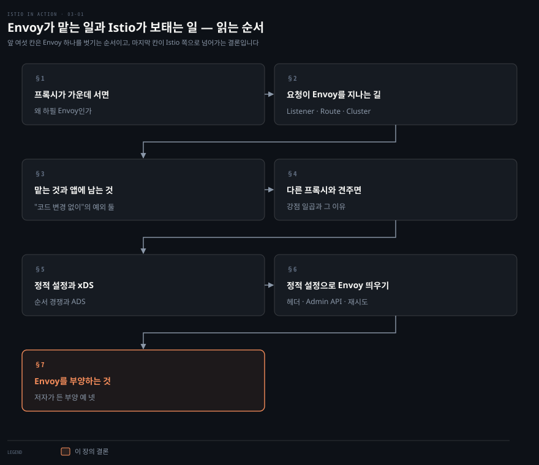
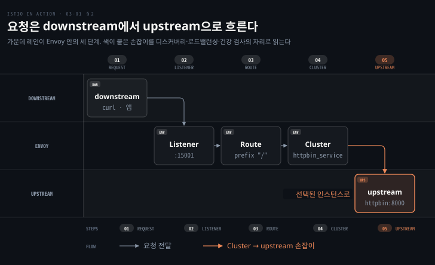
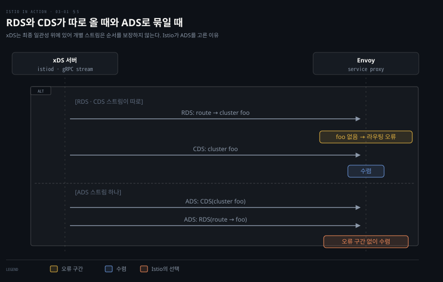
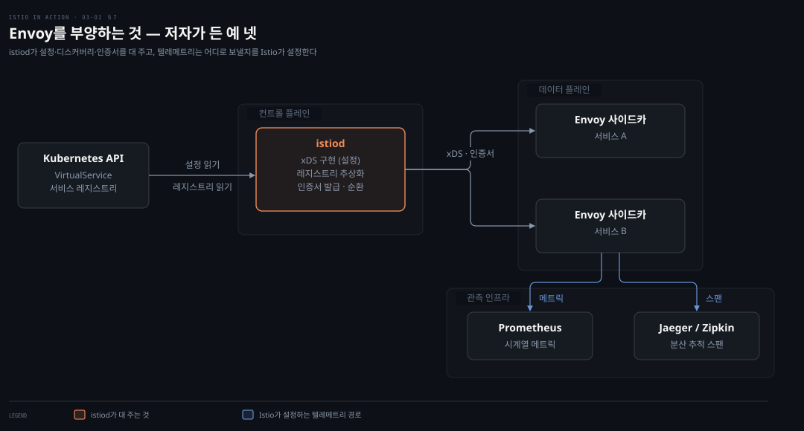

# Envoy가 맡는 일과 Istio가 보태는 일

---

> 3장은 Istio를 잠시 내려놓고 Envoy 하나만 Docker로 띄워 봅니다. 2장에서 Istio 기능이라고 불렀던 것 대부분이 실은 Envoy가 하는 일입니다. Istio는 그 Envoy 여러 대를 설정하고 부양하는 컨트롤 플레인이라는 것을 확인하는 장입니다.


## 핵심 요약

> 이 장 전체가 매달린 하나의 생각은 **Istio 기능의 대부분은 Envoy가 하고, Istio는 그 Envoy 무리를 먹여 살리는 인프라**라는 것입니다.

저자는 Envoy를 세 층으로 벗깁니다. 먼저 프록시가 클라이언트와 서버 사이에 서면 무엇이 가능해지는지, 그 위에 L7을 이해하는 Envoy가 어떤 기능을 얹는지를 폅니다. 그다음 그 기능을 정적 파일로 켜 보고 Admin API로 들여다봅니다. 마지막으로 정적 파일 대신 xDS로 설정을 내려보내는 주체가 곧 컨트롤 플레인이라고 잇습니다. 이 순서를 따라가면 4장부터 나오는 Istio API가 무엇을 번역하는지 보입니다.


## 학습 목표

이 내용을 읽고 나면:

1. Envoy가 만들어진 두 원칙을 말하고 L3/L4 프록시와 무엇이 다른지 설명할 수 있습니다.
2. 요청이 Listener·Route·Cluster를 지나 downstream에서 upstream으로 흐르는 경로를 그릴 수 있습니다.
3. Envoy가 맡는 기능과 여전히 애플리케이션 책임으로 남는 부분을 갈라 말할 수 있습니다.
4. xDS 여섯 API의 역할과 ADS가 필요한 이유를 순서 경쟁 사례로 설명할 수 있습니다.
5. Admin API의 `/stats`로 재시도가 실제로 일어났는지 확인할 수 있습니다.

아래는 이 문서 전체를 읽는 순서로 이은 지도입니다. 칸마다 절 번호와 그 절이 답하는 질문 하나를 적었습니다. 색이 붙은 마지막 칸이 이 장의 결론입니다.




## 이 문서가 다루지 않는 것

> 3장은 Envoy 단독 사용·정적 설정·Admin API를 다룹니다. 이 셋은 기존 노트와 겹치지 않아 여기 그대로 남깁니다. 저자가 뒤 장으로 미룬 주제는 그 장에서 정리합니다.

- 메트릭 수집의 세부와 Prometheus 연동 → 7장
- Envoy 필터 작성·Lua·Wasm 확장, 전역 rate limiting 연동 → 14장
- 클러스터 진입 게이트웨이 → 4장
- xDS 프로토콜 자체의 규격 → [Envoy xDS 프로토콜 문서](https://www.envoyproxy.io/docs/envoy/latest/api-docs/xds_protocol)

3장에서 xDS는 "정적 설정을 누가 대신 내려보내는가"라는 질문의 답으로만 등장합니다. 이 문서도 그 범위만 남깁니다.


## 1. 프록시가 가운데 서면 무엇이 가능해지는가
> 1장은 서비스 프록시를 "애플리케이션 옆에서 프로세스 밖으로 도는 것"이라고만 했습니다. 3장은 그 프록시가 왜 하필 Envoy인지를 출신부터 설명합니다.

Envoy는 Lyft가 분산 시스템의 애플리케이션 네트워킹 문제를 풀려고 만들었습니다. 2016년 9월에 오픈소스로 공개했습니다. 1년 뒤인 2017년 9월에 CNCF에 합류했습니다. 언어는 C++입니다. 저자는 성능도 이유지만 더 중요한 이유로 **높은 부하에서 안정적이고 결정적으로 동작하게 하려는 것**을 듭니다. 3.1.2의 비교표에서 "C++ / non-garbage-collected"가 강점으로 다시 나오는 이유입니다.

저자가 옮긴 Envoy 발표문의 두 원칙은 다음입니다.

> 네트워크는 애플리케이션에 투명해야 합니다. 네트워크와 애플리케이션 문제가 발생했을 때 원인을 찾기 쉬워야 합니다.
>
> — Envoy 발표문 (원문 인용을 옮김)

첫 문장이 1장의 "네트워킹을 인프라로 밀어낸다"와 같은 말입니다. 두 번째 문장이 3장에서 새로 더해지는 축입니다. 투명하게 감추기만 하면 문제가 났을 때 더 막막해집니다. 그래서 Envoy는 감추는 동시에 텔레메트리와 Admin API로 속을 드러냅니다.

프록시 자체의 정의는 단순합니다. 클라이언트와 서버 사이에 놓인 중개자입니다. 가운데 있으니 보안·프라이버시·정책을 얹을 수 있습니다. 저자가 든 첫 효용은 **클라이언트가 알아야 할 것을 줄이는 일**입니다. 서비스가 동일한 인스턴스 여러 개로 떠 있을 때, 클라이언트는 어느 IP를 불러야 할지 몰라도 됩니다. 프록시가 단일 식별자로 서서 인스턴스 사이에 부하를 나눕니다. 건강 검사로 고장 난 인스턴스를 비켜 가는 것도 프록시입니다.

여기까지는 어느 리버스 프록시나 합니다. Envoy가 다른 지점은 **애플리케이션 계층을 이해한다**는 점입니다. HTTP 1.1·HTTP 2·gRPC를 기본으로 알아듣습니다. 그래서 요청 단위 타임아웃, 재시도, 재시도별 타임아웃, 서킷 브레이킹을 붙일 수 있습니다. 커넥션만 아는 L3/L4 프록시는 요청이 어디서 끝나는지 모르니 이런 일을 할 수 없습니다. 필터를 더 쓰면 MongoDB·DynamoDB·AMQP 같은 프로토콜도 이해합니다.

프로세스 밖에서 돌기 때문에 언어와 프레임워크를 가리지 않습니다. 저자는 마이크로서비스가 아니어도 된다고 못 박습니다. 모놀리스든 레거시든 HTTP처럼 Envoy가 아는 프로토콜로 말하기만 하면 됩니다.

역할도 셋으로 나뉩니다.

- 클러스터 가장자리의 프록시: ingress 진입점
- 호스트 하나 또는 서비스 묶음이 공유하는 프록시
- 서비스 인스턴스마다 하나씩 붙는 프록시: Istio의 사이드카

Istio는 유연성·성능·제어를 최대로 얻으려고 세 번째를 택했습니다. 다만 저자는 사이드카를 쓴다고 가장자리를 다른 구현으로 둘 필요는 없다고 덧붙입니다. 가장자리와 사이드카가 같은 구현이면 운영과 추론이 쉬워집니다. 4장의 Istio 게이트웨이가 Envoy 위에 있는 이유입니다.


## 2. 요청이 Envoy를 지나는 길
> Envoy의 기능 목록을 읽기 전에 세 개념을 잡아야 합니다. 저자가 "높은 수준에서 익숙해져야 한다"고 지목한 개념입니다.



도식은 요청 하나가 지나는 자리를 세 레인으로 나눴습니다. 위 레인이 요청을 보내는 downstream, 가운데가 Envoy 안의 세 단계, 아래가 요청을 받는 upstream입니다. 방향 용어는 다른 프록시와 같습니다. 트래픽은 **downstream** 시스템에서 리스너로 들어와 라우트를 거쳐 클러스터에 닿습니다. 클러스터가 그것을 **upstream** 시스템으로 보냅니다. 색이 붙은 마지막 손잡이가 클러스터에서 upstream으로 넘어가는 지점입니다. 다음 절의 서비스 디스커버리·로드밸런싱·건강 검사는 이 손잡이에 걸린 일로 읽으면 자리가 잡힙니다.

- **Listener**: 바깥 세상에 포트를 열어 애플리케이션이 접속하게 합니다. 포트 80의 리스너가 트래픽을 받아 설정된 동작을 적용하는 식입니다.
- **Route**: 리스너로 들어온 트래픽을 어떻게 다룰지 정하는 규칙입니다. `/catalog`에 매칭되면 catalog 클러스터로 보내는 식입니다.
- **Cluster**: Envoy가 트래픽을 보낼 수 있는 upstream 서비스입니다. `catalog-v1`과 `catalog-v2`를 별개 클러스터로 두고 라우트가 둘 중 하나를 고릅니다.


저자는 이것을 "L7 트래픽에 대해 Envoy가 하는 일의 개념적 이해"라고 부르고 세부는 14장으로 미룹니다. 3장에서는 이 세 단어가 설정 파일의 뼈대가 된다는 것만 알면 됩니다. 라우트는 리스너의 HTTP 필터 안에 중첩됩니다.


## 3. Envoy가 맡는 것과 앱에 남는 것
> 저자는 3.1.1에서 기능을 열한 묶음으로 나열합니다. 여기서는 순서대로 옮기지 않고 한 축으로 다시 묶었습니다. **이 기능을 Envoy에 넘기면 애플리케이션에서 무엇이 사라지고 무엇이 남는가**입니다. 1장이 "라이브러리에서 프록시로 옮긴다"고 했으니, 옮긴 뒤에도 남는 것이 무엇인지가 실무에서 가장 먼저 부딪히는 질문입니다.

| 기능 묶음 | Envoy가 맡는 것 | 애플리케이션에 남는 것 |
|---|---|---|
| 서비스 디스커버리 | 단순 REST 디스커버리 API로 엔드포인트를 찾음. Consul·ZooKeeper·Eureka를 감쌀 수 있고 Istio 컨트롤 플레인이 이 API를 구현 | 없음. 단, 카탈로그가 **최종 일관성**이라 가장 최신 상태를 알 수 없다는 전제를 받아들여야 함 |
| 로드밸런싱 | Random·Round robin·Weighted least request·Consistent hashing(sticky). locality-aware로 같은 지역 안에 트래픽을 묶음 | 없음 |
| 라우팅 | 가상 호스트·경로 접두사·헤더·우선순위 기반 라우팅, 라우팅용 재시도·타임아웃, 장애 주입 | 없음 |
| 트래픽 전환·섀도잉 | 가중치 기반 분할, 라이브 트래픽 복제를 fire-and-forget으로 새 버전에 보냄 | 없음 |
| 네트워크 레질리언스 | 요청 타임아웃, 재시도별 타임아웃을 둔 재시도, 벌크헤드(커넥션·in-flight 요청 상한과 fast-fail, jitter), 이상치 감지로 엔드포인트 퇴출 | **파라미터 조정은 앱 책임.** 재시도 증폭이 연쇄 장애로 가니 제한 필요. **앱 수준 재시도가 여전히 필요할 수 있음** |
| HTTP/2·gRPC | 1.1↔2 양방향 프록시, gRPC 네이티브 지원 | 없음 |
| 메트릭 | counter·gauge·histogram으로 downstream·서버·upstream 차원 추적. StatsD·Datadog(DogStatsD)·Hystrix 형식·generic metrics service로 내보냄 | 없음 |
| 분산 추적 | OpenTracing 엔진에 스팬 보고. `x-request-id` 생성, 추적 시작 시 `x-b3*` 초기 헤더 생성 | **Zipkin 헤더 다섯 개를 다음 호출로 전파**하는 일 |
| TLS | 가장자리와 메시 내부에서 종료, upstream으로 **origination**. mTLS까지 | 없음. 언어별 keystore·truststore 설정이 사라짐 |
| Rate limiting | 전역 rate-limiting 서비스와 네트워크(커넥션)·HTTP(요청) 두 수준에서 연동 | 없음. 전역 rate-limiting 서비스는 별도 인프라 |
| 확장 | C++ 필터를 컴파일해 넣거나 Lua·Wasm으로 덜 침습적으로 확장 | 없음. 필터·Lua·Wasm은 Envoy 쪽 확장 |

표에서 저자가 애플리케이션 책임을 명시한 행은 둘입니다. 레질리언스와 분산 추적입니다. 이 둘이 "코드 변경 없이"라는 말의 예외입니다. 2장이 분산 추적의 헤더 전파를 예외로 짚었는데, 3장은 거기에 재시도를 더합니다. 카나리가 실사용자 트래픽을 다룬다는 저자의 말은 앱 책임이 아니라 릴리스 위험에 대한 서술이라 표에 넣지 않았습니다.

재시도 행을 조금 더 봅니다. 저자는 재시도를 Envoy에 맡길 수 있다고 하면서 곧바로 세 가지를 붙입니다. 파라미터를 세밀하게 조정하는 것은 애플리케이션 책임입니다. 재시도 증폭은 연쇄 장애로 이어지므로 Envoy가 제한 수단을 제공합니다. 그리고 애플리케이션 수준 재시도가 여전히 필요할 수 있어 완전히 떠넘길 수 없습니다. 저자는 왜 그런지 이유를 적지 않습니다. 3.3.2 실습의 `retry_on: 5xx`에서 유추하면, Envoy가 재시도 조건으로 보는 것은 응답 코드 같은 신호입니다. 그래서 비즈니스 의미로 실패한 200 응답은 Envoy가 알 수 없으리라는 것이 이 노트의 추론입니다.

추적 행의 다섯 헤더는 다음입니다. Envoy는 이 헤더가 있으면 스팬을 이어 붙입니다. 서비스 안에서 들어온 헤더를 나가는 요청에 옮겨 적는 일은 애플리케이션이 해야 합니다.

- `x-b3-traceid`
- `x-b3-spanid`
- `x-b3-parentspanid`
- `x-b3-sampled`
- `x-b3-flags`

메트릭 행에는 저자가 표 3.1로 여섯 개를 예시했습니다. 그중 `upstream_rq_retry`가 3.3.2의 Admin API 출력에 다시 나옵니다.

| 통계 | 뜻 |
|---|---|
| `downstream_cx_total` | 총 커넥션 수 |
| `downstream_cx_http1_active` | 활성 HTTP/1.1 커넥션 수 |
| `downstream_rq_http2_total` | HTTP/2 요청 총수 |
| `cluster.<name>.upstream_cx_overflow` | 클러스터의 커넥션 서킷 브레이커가 넘친 횟수 |
| `cluster.<name>.upstream_rq_retry` | 요청 재시도 총수 |
| `cluster.<name>.ejections_detected_consecutive_5xx` | 연속 5xx로 감지된 퇴출 수 (강제되지 않은 것 포함) |


## 4. 다른 프록시와 견주면
> 저자는 Envoy의 자리를 **애플리케이션 프록시 또는 서비스 프록시**로 못 박습니다. 애플리케이션끼리 프록시를 통해 대화하게 하고 신뢰성과 관측성을 푸는 역할입니다. 다른 프록시들은 로드밸런서와 웹 서버에서 출발해 점차 능력을 키워 온 것들입니다. 그중 일부는 커뮤니티가 느리거나 클로즈드 소스라서 애플리케이션 간 시나리오에 쓸 만해지기까지 시간이 걸렸다고 씁니다.

저자가 든 Envoy의 강점 일곱 가지입니다.

- WebAssembly 확장성
- 열린 커뮤니티
- 유지보수와 확장을 위해 모듈화된 코드베이스
- upstream·downstream 양쪽 HTTP/2 지원
- 깊은 프로토콜 메트릭 수집
- C++ / 가비지 컬렉션 없음
- 동적 설정, hot restart 불필요

마지막 항목이 다음 절과 이어집니다. 설정을 바꿀 때 프로세스를 다시 띄우지 않아도 되는 것이 xDS의 존재 이유입니다. 저자는 더 자세한 비교로 Envoy 공식 비교 문서, Turbine Labs의 Nginx→Envoy 전환기, Cindy Sridharan의 초기 평가, Ambassador가 HAProxy·Nginx 대신 Envoy를 고른 이유 글 네 편을 답니다.


## 5. 정적 설정과 xDS
> Envoy는 JSON 또는 YAML 설정 파일로 움직입니다. 파일에는 리스너·라우트·클러스터와 함께 서버 설정이 들어갑니다. Admin API를 켤지, 접근 로그를 어디에 쓸지, 추적 엔진을 무엇으로 할지 같은 항목입니다. 설정 API에는 버전이 있습니다. 초기의 v1과 v2는 폐기됐고 v3가 현재 버전입니다. 저자는 v3만 다룬다고 밝힙니다. Istio가 쓰는 버전이기 때문입니다.



도식이 보이는 것이 이 절의 둘째 논점입니다. xDS는 **최종 일관성** 위에 서 있습니다. 올바른 설정은 결국 수렴하지만 그 사이에 순서 경쟁이 생깁니다. 저자의 예는 이렇습니다. Envoy가 RDS로 새 라우트를 받았는데 그 라우트가 가리키는 클러스터 `foo`는 아직 CDS로 오지 않았습니다. CDS가 갱신될 때까지 그 라우트는 라우팅 오류를 냅니다. 위 구간이 그 상황입니다. ADS는 이 순서 경쟁 때문에 도입됐습니다. 모든 변경을 스트림 하나에 순서대로 실어 이런 경쟁을 막습니다. 아래 구간처럼 클러스터를 먼저, 라우트를 뒤에 오게 할 수 있습니다. Istio는 프록시 설정 변경에 ADS를 씁니다.

v3 API는 gRPC 위에 있습니다. 왜 gRPC인지가 이 절의 첫 논점입니다. 스트리밍이 되면 Envoy가 주기적으로 API를 폴링할 필요가 없어집니다. 서버가 변경을 밀어 넣으니 프록시들이 올바른 설정으로 **수렴하는 시간이 줄어듭니다.** Envoy 수십, 수백 대를 관리할 때 이 차이가 커집니다.

가장 단순한 정적 설정은 세 요소가 그대로 보입니다. 저자의 첫 예제를 구조만 남기고 옮깁니다.

```yaml
# 3.2.1 첫 예제 — 구조만. 리스너 하나, 라우트 하나, 클러스터 하나
static_resources:
  listeners:
  - name: httpbin-demo
    address:
      socket_address: { address: 0.0.0.0, port_value: 15001 }   # 15001 포트에 소켓
    filter_chains:
    - filters:
      - name: envoy.http_connection_manager                      # HTTP 필터
        config:
          stat_prefix: egress_http
          route_config:
            name: httpbin_local_route
            virtual_hosts:
            - name: httpbin_local_service
              domains: ["*"]                                     # 모든 가상 호스트
              routes:
              - match: { prefix: "/" }
                route:
                  auto_host_rewrite: true
                  cluster: httpbin_service                       # 이 클러스터로
          http_filters:
          - name: envoy.router
  clusters:
  - name: httpbin_service                                        # upstream 클러스터
    connect_timeout: 5s
    type: LOGICAL_DNS
    dns_lookup_family: V4_ONLY
    lb_policy: ROUND_ROBIN
    hosts: [{ socket_address: { address: httpbin, port_value: 8000 }}]
```

리스너가 15001 포트에 소켓을 열고 필터 체인을 붙입니다. 필터는 `http_connection_manager`에 라우팅 지시를 넣습니다. 가상 호스트 `*`에 매칭되는 모든 트래픽을 `httpbin_service` 클러스터로 보내는 규칙입니다. 클러스터는 엔드포인트 디스커버리로 `LOGICAL_DNS`, 로드밸런싱으로 `ROUND_ROBIN`을 씁니다. 리스너·라우트·클러스터가 전부 파일에 적혀 있으니 **완전 정적 설정**입니다.

> **원문 정오**: 저자는 3.2에서 "v3만 다룬다"고 했습니다. 그런데 이 첫 예제는 `envoy.http_connection_manager`·`config:`·`hosts:` 같은 v2 시절 문법입니다. 3.3에서 실제로 실행하는 `simple.yaml`은 `envoy.filters.network.http_connection_manager`·`typed_config`·`load_assignment`를 쓰는 v3 문법이라 두 예제가 같은 장 안에서 문법이 다릅니다. Envoy v3 문서는 `load_assignment`가 v2 API의 `hosts` 필드를 대체한다고 적고 있습니다.[^envoy-cluster] 따라 칠 때는 3.3 쪽을 기준으로 삼습니다.

이제 정적 설정을 누가 대신 써 주는가로 넘어갑니다. Envoy는 부트스트랩 파일 하나만 있으면 나머지를 API로 받아 옵니다. 다운타임이나 재시작 없이 설정을 바꾸는 방법입니다. 그 API가 여섯입니다.

| API | 역할 | 관계 |
|---|---|---|
| LDS (Listener discovery service) | 이 프록시가 어떤 리스너를 열어야 하는지 조회 | |
| RDS (Route discovery service) | 리스너 설정 중 어떤 라우트를 쓸지 | LDS의 부분집합. 정적·동적을 섞을 때 씀 |
| CDS (Cluster discovery service) | 어떤 클러스터를 어떤 설정으로 가질지 | |
| EDS (Endpoint discovery service) | 특정 클러스터가 어떤 엔드포인트를 쓸지 | CDS의 부분집합 |
| SDS (Secret discovery service) | 인증서 배포 | |
| ADS (Aggregate discovery service) | 위 API들의 모든 변경을 **직렬화한 스트림 하나** | 이 하나로 순서대로 다 받음 |

이 여섯을 묶어 xDS라고 부릅니다. 전부 쓸 필요는 없고 하나만 쓰거나 조합해도 됩니다.


리스너만 동적으로 받는 최소 예제는 두 조각으로 이뤄집니다. 어떤 API를 어디서 받을지, 그 API가 사는 클러스터는 어디인지입니다.

```yaml
# 3.2.2 LDS 예제 — 리스너는 API로 받고, API가 사는 클러스터만 정적으로
dynamic_resources:
  lds_config:                         # 리스너 설정을 LDS로
    api_config_source:
      api_type: GRPC
      grpc_services:
      - envoy_grpc:
          cluster_name: xds_cluster   # 이 클러스터에 LDS가 있다
clusters:
- name: xds_cluster                   # LDS를 구현한 gRPC 클러스터
  connect_timeout: 0.25s
  type: STATIC
  lb_policy: ROUND_ROBIN
  http2_protocol_options: {}
  hosts: [{ socket_address: { address: 127.0.0.3, port_value: 5678 }}]
```

리스너를 파일에 하나도 적지 않았습니다. 대신 `xds_cluster` 하나만 정적으로 적습니다. 리스너는 그 클러스터의 LDS API에서 런타임에 받아 옵니다. 정적 설정이 완전히 사라지지 않는다는 점이 핵심입니다. **API가 어디 있는지만은 파일에 있어야 합니다.**

Istio가 서비스 프록시에 주는 부트스트랩은 이 구조를 ADS로 바꾼 형태입니다.

```yaml
# Istio 부트스트랩 — 리스너·클러스터 모두 ADS로, ADS가 사는 곳만 정적으로
bootstrap:
  dynamicResources:
    ldsConfig:
      ads: {}                          # 리스너는 ADS로
    cdsConfig:
      ads: {}                          # 클러스터도 ADS로
    adsConfig:
      apiType: GRPC
      grpcServices:
      - envoyGrpc:
          clusterName: xds-grpc        # xds-grpc 클러스터에 ADS가 있다
      refreshDelay: 1.000s
  staticResources:
    clusters:
    - name: xds-grpc                   # 그 클러스터의 정의
      type: STRICT_DNS
      connectTimeout: 10.000s
      hosts:
      - socketAddress:
          address: istio-pilot.istio-system
          portValue: 15010
      circuitBreakers:                 # 컨트롤 플레인 연결의 신뢰성 설정
        thresholds:
        - maxConnections: 100000
          maxPendingRequests: 100000
          maxRequests: 100000
        - priority: HIGH
          maxConnections: 100000
          maxPendingRequests: 100000
          maxRequests: 100000
      http2ProtocolOptions: {}
```

`istio-pilot.istio-system:15010`이 컨트롤 플레인 주소입니다. 이 이름은 책이 쓰인 시점의 것입니다. 2장에서 본 `istiod`가 지금 이 자리에 있습니다. 부트스트랩의 서킷 브레이커 상한 10만은 원문이 "신뢰성과 서킷 브레이킹 설정"이라고만 주석하고 이유는 적지 않습니다. 컨트롤 플레인과의 연결이 Envoy 쪽 보호 장치에 걸려 끊기지 않게 하려는 값이라는 것은 이 노트의 추측입니다.


## 6. 정적 설정으로 Envoy 띄우기
> 저자는 이해를 굳히려고 Envoy를 Istio 없이 Docker에서 띄웁니다. 세 이미지를 씁니다.

```bash
docker pull envoyproxy/envoy:v1.19.0
docker pull curlimages/curl
docker pull citizenstig/httpbin
```

httpbin은 호출에 쓰인 헤더를 돌려주거나 지연·오류를 만들어 주는 서비스입니다. 실습 구조는 세 단계입니다.

1. httpbin을 띄웁니다.
2. 모든 트래픽을 httpbin으로 넘기는 Envoy를 띄웁니다.
3. curl로 Envoy를 부릅니다.

```bash
docker run -d --name httpbin citizenstig/httpbin
docker run -it --rm --link httpbin curlimages/curl curl -X GET http://httpbin:8000/headers
```

```bash
{
  "headers": {
    "Accept": "*/*",
    "Host": "httpbin:8000",
    "User-Agent": "curl/7.80.0"
  }
}
```

Envoy는 설정 없이 띄우면 바로 종료합니다. 저자가 일부러 보여 주는 실패입니다.

```bash
docker run -it --rm envoyproxy/envoy:v1.19.0 envoy
```

```bash
[2021-11-21 21:28:37.347][1][info][main] [source/server/server.cc:855] exiting
At least one of --config-path or --config-yaml or Options::configProto() should be non-empty
```

`envoy --help`로 보이는 플래그 중 저자가 짚은 것은 넷입니다. 설정 파일을 주는 `-c`, 프록시가 배치된 가용 영역을 적는 `--service-zone`, 프록시에 고유 이름을 주는 `--service-node`, 로그 상세도를 정하는 `--log-level`입니다.

실행에 쓰는 `ch3/simple.yaml`은 5절의 첫 예제와 같은 구조이되 v3 문법입니다. 다른 부분만 적습니다.

```yaml
# ch3/simple.yaml — 5절 첫 예제와 다른 부분만
filters:
- name: envoy.filters.network.http_connection_manager
  typed_config:
    "@type": type.googleapis.com/envoy.extensions.filters.network.http_connection_manager.v3.HttpConnectionManager
    stat_prefix: ingress_http
    http_filters:
    - name: envoy.filters.http.router
    # route_config 는 동일 …
clusters:
- name: httpbin_service
  connect_timeout: 5s
  type: LOGICAL_DNS
  dns_lookup_family: V4_ONLY
  lb_policy: ROUND_ROBIN
  load_assignment:                   # hosts 대신
    cluster_name: httpbin
    endpoints:
    - lb_endpoints:
      - endpoint:
          address:
            socket_address:
              address: httpbin
              port_value: 8000
```

파일을 통째로 `--config-yaml`에 넘겨 띄웁니다.

```bash
docker run --name proxy --link httpbin envoyproxy/envoy:v1.19.0 --config-yaml "$(cat ch3/simple.yaml)"
docker logs proxy
```

```bash
[2018-08-09 22:57:50.769][5][info][config] all dependencies initialized. starting workers
[2018-08-09 22:57:50.769][5][info][main] starting main dispatch loop
```

프록시가 15001에서 듣습니다. 이제 httpbin이 아니라 프록시를 부릅니다.

```bash
docker run -it --rm --link proxy curlimages/curl curl -X GET http://proxy:15001/headers
```

```bash
{
  "headers": {
    "Accept": "*/*",
    "Content-Length": "0",
    "Host": "httpbin",
    "User-Agent": "curl/7.80.0",
    "X-Envoy-Expected-Rq-Timeout-Ms": "15000",
    "X-Request-Id": "45f74d49-7933-4077-b315-c15183d1da90"
  }
}
```

요청은 httpbin에 닿았고 헤더 둘이 새로 생겼습니다. 저자는 "사소해 보여도 Envoy가 이미 많은 일을 하고 있다"고 씁니다.

- `X-Request-Id`: 클러스터 안에서, 그리고 요청이 여러 홉을 거칠 때 호출을 **상관**시키는 값입니다. 3절의 추적 행에서 Envoy가 생성한다고 한 그 헤더입니다.
- `X-Envoy-Expected-Rq-Timeout-Ms`: 이 요청이 15,000ms 뒤에 타임아웃될 것이라는 **힌트**입니다. upstream과 그 뒤 홉이 이 값으로 deadline을 구현할 수 있습니다. deadline이 지났으면 처리를 멈춰 자원을 풀어 주는 것이 목적입니다.

두 번째 헤더가 왜 중요한지는 Envoy 혼자로는 안 보입니다. 타임아웃은 Envoy가 끊습니다. 그런데 이미 끊긴 요청을 upstream이 계속 처리하면 자원이 샙니다. 그래서 Envoy는 의도를 헤더로 알리고 **끊는 일은 upstream이 협조**할 수 있게 합니다. 3절 표의 오른쪽 열이 여기서 하나 더 늘어나는 셈입니다. Envoy 문서는 이 헤더를 "라우터가 요청이 완료되길 기대하는 시간이며 upstream이 조기 종료 같은 결정을 내리게 하려고 설정한다"고 적습니다.[^envoy-router]

라우트에 `timeout: 1s`를 더한 `simple_change_timeout.yaml`로 다시 띄우면 같은 호출의 헤더가 `1000`으로 바뀝니다. 설정 한 줄이 upstream에 전달되는 힌트까지 바꾼다는 확인입니다.

```yaml
- match: { prefix: "/" }
  route:
    auto_host_rewrite: true
    cluster: httpbin_service
    timeout: 1s
```

**Admin API**는 프록시가 어떻게 동작하는지, 메트릭과 설정이 무엇인지 보여 줍니다. 15000 포트입니다.

```bash
docker run -it --rm --link proxy curlimages/curl curl -X GET http://proxy:15000/stats | grep retry
```

```bash
cluster.httpbin_service.retry_or_shadow_abandoned: 0
cluster.httpbin_service.upstream_rq_retry: 0
cluster.httpbin_service.upstream_rq_retry_overflow: 0
cluster.httpbin_service.upstream_rq_retry_success: 0
```

`/stats` 없이 루트를 부르면 엔드포인트 목록이 나옵니다. 저자가 살펴보라고 든 것은 일곱입니다.

| 엔드포인트 | 내용 |
|---|---|
| `/certs` | 머신의 인증서 |
| `/clusters` | 설정된 클러스터 |
| `/config_dump` | Envoy 설정 덤프 |
| `/listeners` | 설정된 리스너 |
| `/logging` | 로깅 설정 조회·변경 |
| `/stats` | Envoy 통계 |
| `/stats/prometheus` | Prometheus 형식의 통계 |

마지막 실습이 **재시도**입니다. 라우트에 재시도 정책을 붙인 `simple_retry.yaml`로 프록시를 다시 띄웁니다.

```yaml
- match: { prefix: "/" }
  route:
    auto_host_rewrite: true
    cluster: httpbin_service
    retry_policy:
      retry_on: 5xx        # 5xx 응답이면 재시도
      num_retries: 3       # 횟수
```

httpbin의 `/status/500`은 항상 500을 냅니다. 프록시를 통해 그 경로를 부릅니다.

```bash
docker run -it --rm --link proxy curlimages/curl curl -v http://proxy:15001/status/500
```

저자는 호출이 끝났을 때 응답이 보이지 않아야 한다고 씁니다. 그리고 무슨 일이 있었는지 Admin API에 묻습니다.

```bash
docker run -it --rm --link proxy curlimages/curl curl -X GET http://proxy:15000/stats | grep retry
```

```bash
cluster.httpbin_service.retry.upstream_rq_500: 3
cluster.httpbin_service.retry.upstream_rq_5xx: 3
cluster.httpbin_service.retry_or_shadow_abandoned: 0
cluster.httpbin_service.upstream_rq_retry: 3
cluster.httpbin_service.upstream_rq_retry_overflow: 0
cluster.httpbin_service.upstream_rq_retry_success: 0
```

Envoy는 upstream에서 500을 받았고 `upstream_rq_retry: 3`이 말하듯 세 번 다시 시도했습니다. 세 번 다 500이라 `upstream_rq_retry_success`는 0입니다. 재시도가 일어났다는 사실을 애플리케이션 코드 한 줄 없이, 그리고 애플리케이션 로그가 아니라 프록시의 카운터로 확인했습니다. 3절 표의 "메트릭" 행과 "레질리언스" 행이 여기서 만납니다.

저자는 여기까지를 "기본적인 능력의 시연"이라고 부르고 한계를 답니다. 정적 파일로는 추론이 쉽습니다. 그래도 Istio는 동적 설정을 씁니다. 저마다 복잡한 설정을 가진 Envoy 대군을 관리하려면 그 방법밖에 없기 때문입니다.


## 7. Envoy를 부양하는 것
> 이 장의 결론이자 제목의 두 번째 절반입니다. Envoy는 2장과 이 책 전체에서 다루는 Istio 기능의 대부분을 실제로 수행합니다. 그런데 Envoy에서 값을 최대로 뽑으려면 **부양 인프라**가 필요합니다. 사용자 설정, 보안 정책, 런타임 설정을 대는 그 컴포넌트들이 곧 컨트롤 플레인입니다. 저자는 데이터 플레인에서도 Envoy가 모든 일을 혼자 하지는 않는다고 덧붙이고 부록 B로 넘깁니다.



도식은 저자가 든 예 넷을 한 장에 모았습니다. 색이 붙은 `istiod`가 그중 셋(설정·디스커버리·인증서)을 맡습니다. 넷째인 텔레메트리는 Envoy가 Prometheus·Jaeger로 보내도록 Istio가 설정합니다.

- **설정**: Envoy는 정적 파일로도, xDS로도 설정할 수 있었습니다. Istio는 그 xDS API를 `istiod`에 구현했습니다. `istiod`는 Kubernetes API에서 VirtualService 같은 Istio 설정을 읽어 프록시를 동적으로 설정합니다. 2장에서 본 "의도에서 Envoy 설정으로"의 번역기가 이것입니다.
- **디스커버리**: Envoy의 서비스 디스커버리는 어떤 형태든 서비스 레지스트리를 전제합니다. `istiod`는 그 API를 구현하면서 특정 레지스트리 구현을 Envoy에게서 감춥니다. Kubernetes 위에서는 Kubernetes의 서비스 레지스트리를 씁니다. Envoy는 그 사실을 모릅니다.
- **인증서**: Envoy가 TLS를 종료하고 시작하려면 인증서를 만들고 서명하고 순환하는 인프라가 있어야 합니다. `istiod`가 애플리케이션별 인증서를 배달해 서비스 간 mTLS를 세웁니다.

넷째 예가 텔레메트리 연동입니다. Envoy가 뿜는 메트릭은 어딘가로 가야 합니다. 어디로 보낼지는 Envoy가 설정받아야 합니다. 원문은 그 설정 주체를 "Istio"라고만 씁니다. 수집 백엔드는 `istiod` 밖에 있지만 어디로 보낼지의 설정은 컨트롤 플레인 몫입니다. Istio는 데이터 플레인을 Prometheus 같은 시계열 시스템과 연동하도록 설정합니다. 분산 추적 스팬도 마찬가지로 Jaeger로 보내게 설정합니다. Zipkin도 쓸 수 있습니다.

저자의 마지막 문장이 이 문서 제목의 근거입니다. 이후 장부터는 Envoy를 **Istio 서비스 프록시**라고 부르고 그 능력을 Istio API를 통해 봅니다. 다만 그 능력 중 많은 것이 실은 Envoy에서 나오고 Envoy가 구현한 것이라고 이해하라는 당부입니다.


## 심화 학습

> 책이 쓰인 뒤 바뀐 것만 적습니다. 원문을 고치지 않고 나란히 둡니다.

- **`istio-pilot` → `istiod`**: 5절 부트스트랩의 `istio-pilot.istio-system`은 Istio 1.5(2020-03) 이전 컨트롤 플레인 이름입니다. 1.5부터 Pilot·Galley·Citadel·사이드카 인젝터가 `istiod` 하나로 합쳐졌습니다.[^istiod] 2장의 아홉 책임이 한 컴포넌트에 있는 이유가 이 통합입니다.
- **OpenTracing → 개별 트레이서**: 책은 "OpenTracing 엔진에 스팬을 보고한다"고 씁니다. 현재 Envoy 문서의 트레이서 목록은 Zipkin·Jaeger·Datadog·SkyWalking·AWS X-Ray·Fluentd입니다. OpenTracing은 나오지 않습니다. B3 헤더 다섯 개를 서비스가 전파해야 한다는 조건은 그대로입니다.[^envoy-tracing] OpenTelemetry 트레이서(`envoy.tracers.opentelemetry`)도 별도 설정으로 있습니다. 문서는 아직 프로덕션 용도가 아니라고 표시합니다.[^envoy-otel]
- **라우트 타임아웃 기본값**: 6절의 `15000`은 라우트 `timeout`을 지정하지 않았을 때의 기본값 15초입니다. Envoy 문서가 명시합니다.[^envoy-router] 책은 값만 보여 주고 기본값이라고는 쓰지 않습니다.
- **Admin API와 10장**: 10장 10.3.1 "Envoy administration interface"가 이 인터페이스를 15000 포트로 port-forward 해 `config_dump`를 읽습니다. 같은 절의 `istioctl proxy-config`는 그 설정을 조회·필터하는 명령입니다. 3장의 엔드포인트 표가 10장 도구의 바탕입니다. (10장 PDF 원문 확인)
- **Admin API 보안**: 책은 Admin API를 관찰 도구로만 소개합니다. Envoy 문서는 관리 인터페이스 접근을 **반드시 보안된 네트워크로만** 허용하라고 씁니다.[^envoy-admin] `/logging`처럼 상태를 바꾸는 엔드포인트가 있기 때문입니다.


## 결정 치트시트

> 3장에서 끌어낼 수 있는 판단 기준입니다. 저자가 본문에서 밝힌 근거만 옮겼습니다.

| 상황 | 판단 | 근거 |
|---|---|---|
| 재시도·타임아웃을 Envoy로 옮기려 함 | 옮기되 앱 재시도 코드를 다 걷어내지 않음 | 파라미터 조정은 앱 책임이고 앱 수준 재시도가 여전히 필요할 수 있음 |
| 재시도를 켰더니 장애가 번짐 | 재시도 횟수·조건을 제한 | 재시도 증폭은 연쇄 장애로 이어짐 |
| 분산 추적이 서비스 경계에서 끊김 | `x-b3-*` 다섯 헤더 전파를 앱에서 점검 | Envoy는 스팬을 보내지만 헤더 전파는 앱 책임 |
| upstream이 이미 타임아웃된 요청을 계속 처리 | `X-Envoy-Expected-Rq-Timeout-Ms`로 deadline 구현 | Envoy가 힌트를 주고 끊는 일은 upstream이 함 |
| Envoy 몇 대를 손으로 관리 | 정적 설정으로 충분 | 추론하기 쉽고 파일이 곧 설정 |
| Envoy 대군을 재시작 없이 바꿔야 함 | xDS, 그중에서도 ADS | 순서 경쟁을 스트림 하나로 없앰. Istio의 선택 |
| 재시도가 실제로 일어났는지 모름 | Admin API `/stats`에서 `upstream_rq_retry` 확인 | 앱 로그가 아니라 프록시 카운터가 사실 |
| 프록시를 가장자리와 사이드카에 따로 두려 함 | 같은 구현으로 통일 | 운영과 추론이 쉬워짐. Istio 게이트웨이가 Envoy인 이유 |


## 적용 관점

> 이 장을 읽고 실제로 바꿀 행동 하나를 **규칙**으로 잡습니다. Envoy가 대신할 수 없는 자리를 아는 채로 재시도를 옮기는 규칙입니다.

> Envoy에 재시도를 켜는 PR에는 "앱 쪽 재시도 코드를 남기는 이유"를 한 줄 적습니다. 걷어낼 수 있으면 걷어냅니다. 못 걷어낸다면 Envoy가 볼 수 없는 실패 조건이 무엇인지 그 줄에 적습니다.

Spring 앱을 운영하는 관점에서 Envoy가 대신할 수 없는 두 자리가 3장에서 드러납니다. 하나는 비즈니스 의미로 실패한 200 응답의 재시도입니다. 실습의 `retry_on: 5xx`처럼 Envoy는 응답 코드 같은 신호로 재시도를 판단하니, 그 판단은 앱 몫이라는 것이 이 노트의 추론입니다.

다른 하나는 추적 헤더 전파입니다. Spring Boot는 OpenTelemetry와 Brave 트레이서를 자동 설정하고 B3 전파를 지원하므로, 이 자리는 코드가 아니라 설정으로 메울 수 있습니다.[^spring-tracing] 어느 쪽이든 "코드 변경 없이"가 아니라 "앱이 무엇을 남기는지 아는 채로"가 정확한 표현입니다.


## 면접에서 받을 만한 질문
> 답을 먼저 떠올린 뒤 아래 정답 절을 펼칩니다.

1. 이 장을 한 줄로 정의하면 무엇입니까?
2. Envoy가 L3/L4 프록시와 다른 점은 HTTP·gRPC를 이해한다는 점입니다 — 이것을 근거와 함께 설명해 보십시오.
3. 요청은 downstream에서 Listener로 들어와 Route를 거쳐 Cluster에 닿고 upstream으로 나갑니다 — 이것을 근거와 함께 설명해 보십시오.
4. xDS는 최종 일관성이라 RDS와 CDS가 따로 오면 순서 경쟁이 생깁니다 — 이것을 근거와 함께 설명해 보십시오.
5. Envoy에 재시도를 맡기면 애플리케이션 재시도는 없애도 됩니까?
6. 정적 설정과 xDS 중 무엇을 씁니까?
7. Admin API는 무엇에 씁니까?


## 정답 (자답 후 펼치기)

### 정답 1 — 한 줄 정의

"Envoy는 애플리케이션 프로세스 밖에서 L7을 이해하는 서비스 프록시이고, Istio는 그 Envoy 무리에 xDS로 설정과 인증서와 디스커버리를 대 주는 컨트롤 플레인입니다."

### 정답 2 — 핵심 포인트

Envoy가 L3/L4 프록시와 다른 점은 HTTP·gRPC를 이해한다는 점입니다. 그래서 요청 단위 타임아웃·재시도·서킷 브레이킹이 가능합니다.

### 정답 3 — 핵심 포인트

요청은 downstream에서 Listener로 들어와 Route를 거쳐 Cluster에 닿고 upstream으로 나갑니다. 이 세 단어가 설정 파일의 뼈대입니다.

### 정답 4 — 핵심 포인트

xDS는 최종 일관성이라 RDS와 CDS가 따로 오면 순서 경쟁이 생깁니다. ADS는 그 변경을 스트림 하나로 직렬화합니다. Istio가 이것을 씁니다.

### 정답 5 — Envoy에 재시도를 맡기면 애플리케이션 재시도는 없애도 됩니까

저자는 아니라고 답합니다. 파라미터 조정은 앱 책임이고, 앱 수준 재시도가 여전히 필요할 수 있다고 명시합니다. Envoy는 `5xx` 같은 응답 신호로만 재시도 여부를 알 수 있습니다. 반대로 재시도 증폭이 연쇄 장애를 만들 수 있어 제한도 함께 걸어야 합니다.

### 정답 6 — 정적 설정과 xDS 중 무엇을 씁니까

파일 하나로 추론할 수 있는 규모면 정적 설정이 쉽습니다. Istio처럼 Envoy 대군을 재시작 없이 관리해야 하면 xDS입니다. xDS를 쓰더라도 API가 어디 있는지만은 부트스트랩 파일에 정적으로 적어야 합니다.

### 정답 7 — Admin API는 무엇에 씁니까

프록시의 동작·메트릭·설정을 들여다봅니다. `/stats`로 재시도 카운터를 확인하고, `/config_dump`로 실제 적용된 설정을 봅니다. 10장의 트러블슈팅이 이 엔드포인트 위에서 이뤄집니다.


## 핵심 개념 체크리스트

- [ ] Envoy의 두 원칙을 말하고 두 번째 원칙이 왜 필요한지 설명할 수 있는가?
- [ ] Listener·Route·Cluster를 각각 한 문장으로 정의할 수 있는가?
- [ ] downstream과 upstream이 무엇을 가리키는지 헷갈리지 않는가?
- [ ] "코드 변경 없이"의 예외 둘(재시도 파라미터와 앱 재시도, 추적 헤더 전파)을 들 수 있는가?
- [ ] xDS 여섯 API 중 부분집합 관계 둘(RDS⊂LDS, EDS⊂CDS)을 말할 수 있는가?
- [ ] ADS가 없을 때 생기는 순서 경쟁을 예로 들 수 있는가?
- [ ] `X-Envoy-Expected-Rq-Timeout-Ms`가 힌트인 이유와 upstream이 할 일을 말할 수 있는가?
- [ ] `upstream_rq_retry: 3`이 무엇을 증명하는지 설명할 수 있는가?
- [ ] 저자가 든 부양 컴포넌트의 예 넷(설정·디스커버리·텔레메트리 연동·인증서)을 들 수 있는가?


## 관련 문서

- [서비스 메시는 무엇을 인프라로 밀어냈는가](01-01.서비스%20메시는%20무엇을%20인프라로%20밀어냈는가.md) — 라이브러리에서 프록시로 옮긴 결정. 3장은 그 프록시의 정체를 다룹니다
- [배포와 릴리스를 가르는 첫 실습](02-01.배포와%20릴리스를%20가르는%20첫%20실습.md) — istiod가 의도를 Envoy 설정으로 번역하는 장면. 3장은 그 번역의 목적지인 xDS를 다룹니다
- [Envoy xDS 프로토콜 문서](https://www.envoyproxy.io/docs/envoy/latest/api-docs/xds_protocol) — 이 장이 개념으로 남긴 xDS 의 규격


## 참고 자료

- 원본: 《Istio in Action》 3장 "Istio's data plane: The Envoy proxy" (Christian E. Posta·Rinor Maloku, Manning)
- [Envoy 공식 문서](https://www.envoyproxy.io/docs/envoy/latest/) — 저자가 더 자세한 내용의 출처로 지목한 곳
- [책 예제 소스 코드](https://github.com/istioinaction/book-source-code) — `ch3/simple.yaml` 등 실습 파일


[^envoy-cluster]: Envoy — `config.cluster.v3.Cluster`의 `load_assignment` 필드. "Setting this is required for specifying members of STATIC, STRICT_DNS or LOGICAL_DNS clusters. … This field supersedes the hosts field in the v2 API." <https://www.envoyproxy.io/docs/envoy/latest/api-v3/config/cluster/v3/cluster.proto>
[^envoy-router]: Envoy — Router filter의 `x-envoy-expected-rq-timeout-ms`("the time in milliseconds the router expects the request to be completed … so that the upstream host … can make decisions based on the request timeout, e.g., early exit")와 재시도 기본값("By default, Envoy will not perform retries unless you've configured them"). 라우트 `timeout` 기본 15s는 `RouteAction.timeout` 항목. <https://www.envoyproxy.io/docs/envoy/latest/configuration/http/http_filters/router_filter> · <https://www.envoyproxy.io/docs/envoy/latest/api-v3/config/route/v3/route_components.proto>
[^istiod]: Istio 블로그 — "Introducing istiod: simplifying the control plane"(2020-03-19). "istiod unifies functionality that Pilot, Galley, Citadel and the sidecar injector previously performed, into a single binary." <https://istio.io/latest/blog/2020/istiod/>
[^envoy-tracing]: Envoy — Tracing 아키텍처 개요. 트레이서 목록과 "When using the Zipkin tracer, Envoy relies on the service to propagate the B3 HTTP headers (x-b3-traceid, x-b3-spanid, x-b3-parentspanid, x-b3-sampled, and x-b3-flags)." <https://www.envoyproxy.io/docs/envoy/latest/intro/arch_overview/observability/tracing>
[^envoy-otel]: Envoy — `config.trace.v3.OpenTelemetryConfig`(`envoy.tracers.opentelemetry`). <https://www.envoyproxy.io/docs/envoy/latest/api-v3/config/trace/v3/opentelemetry.proto>
[^envoy-admin]: Envoy — Administration interface. "It is critical that access to the administration interface is only allowed via a secure network." <https://www.envoyproxy.io/docs/envoy/latest/operations/admin>
[^spring-tracing]: Spring Boot — Actuator Tracing. "Spring Boot ships auto-configuration for the following tracers: OpenTelemetry with OTLP, OpenZipkin Brave with Zipkin." B3 전파는 baggage 절에서 언급. <https://docs.spring.io/spring-boot/reference/actuator/tracing.html>
