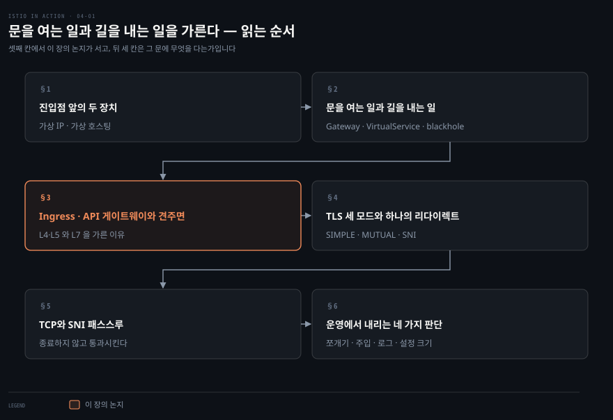
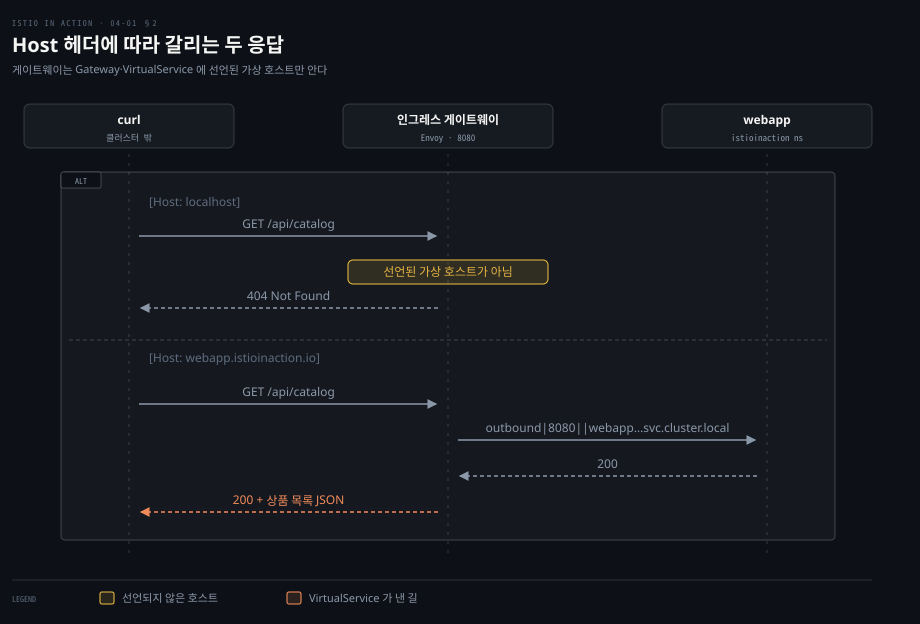
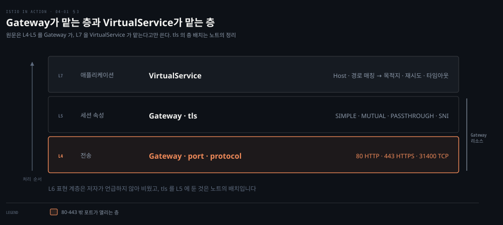
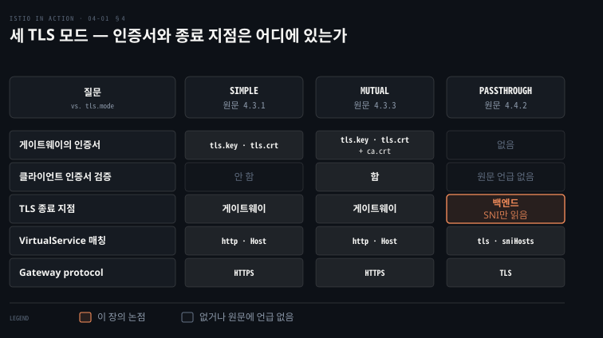

# 문을 여는 일과 길을 내는 일을 가른다

---

> 4장은 클러스터 밖의 클라이언트를 안의 서비스에 잇는 진입점을 다룹니다. Istio는 그 진입점을 "무엇을 받아들일지"를 정하는 Gateway와 "어디로 보낼지"를 정하는 VirtualService로 갈라 놓았습니다. 이 문서는 그 분리가 왜 필요했는지와, TLS 세 모드·TCP·운영 팁에서 저자가 내린 판단만 남깁니다.


## 핵심 요약

> 이 장 전체가 매달린 하나의 생각은 **진입점에서 L4·L5 속성(포트·프로토콜·TLS)을 다루는 일과 L7 라우팅을 다루는 일을 서로 다른 리소스로 갈라야 한다**는 것입니다. 저자가 4.2.4에서 한 문장으로 밝힌 설계 결정을 이 노트는 장의 척추로 읽습니다.

저자는 먼저 가상 IP와 가상 호스팅이라는 오래된 두 장치를 복습합니다. 그다음 Istio 인그레스 게이트웨이가 사이드카가 아닌 Envoy 하나일 뿐임을 보입니다. 그 위에서 Gateway는 문을 열고 VirtualService는 길을 냅니다. Kubernetes Ingress v1 명세의 한계 셋이 이 분리의 이유입니다. 뒷부분은 그 문에 TLS 세 모드를 다는 법, HTTP가 아닌 TCP를 통과시키는 법, 게이트웨이를 여러 개로 쪼개고 주입하고 설정을 줄이는 운영 판단입니다.


## 학습 목표

이 내용을 읽고 나면:

1. 가상 IP와 가상 호스팅이 각각 어떤 문제를 풀었는지, 프로토콜마다 호스트를 가르는 단서가 무엇인지 말할 수 있습니다.
2. Gateway와 VirtualService가 각각 어느 계층을 맡는지 설명하고 왜 Kubernetes Ingress v1 대신 새 리소스를 만들었는지 세 가지 근거를 들 수 있습니다.
3. SIMPLE·MUTUAL·PASSTHROUGH 세 TLS 모드에서 인증서가 어디에 있고 어디서 TLS가 끝나는지 비교할 수 있습니다.
4. 평문 TCP를 게이트웨이로 통과시킬 때 무엇을 잃는지와 SNI 패스스루가 그 사이를 어떻게 메우는지 설명할 수 있습니다.
5. 게이트웨이 쪼개기, 주입, 접근 로그, 설정 크기까지 운영 팁 네 가지의 이유를 말할 수 있습니다.

아래는 이 문서 전체를 읽는 순서로 이은 지도입니다. 칸마다 절 번호와 그 절이 답하는 질문 하나를 적었습니다. 색이 붙은 칸이 이 장의 논지가 서는 자리입니다.




## 이 문서가 다루지 않는 것

> 4장은 기존 `03_istio` Ingress Gateway 노트와 주제가 1:1로 겹칩니다. README의 경계 규칙대로 리소스 필드와 실습 절차는 그쪽에 맡깁니다. 여기에는 저자의 판단만 남깁니다.

- Gateway·VirtualService 필드 레퍼런스 → [Istio Gateway 레퍼런스](https://istio.io/latest/docs/reference/config/networking/gateway/)
- 인증서 생성 절차와 `curl` 플래그 세부 → 책의 `ch4/certs/` 와 원문 4.3
- VirtualService 라우팅 규칙 전체 → 5장
- 메시 안 서비스 간 mTLS와 SPIFFE → 9장·부록 C
- Sidecar 리소스로 프록시 설정 줄이기 → 11장
- `pilot-agent`의 DNS 프록시 → 13장


## 1. 진입점 앞의 두 장치
> 클러스터 안의 서비스끼리 대화하기 전에 무언가가 그 대화를 촉발합니다. 상품을 사는 사용자든 API를 부르는 클라이언트든 전부 클러스터 밖에서 옵니다. 그래서 4장의 질문은 하나입니다. 밖의 트래픽을 어떻게 안으로 들이는가.

네트워크 커뮤니티는 이 자리를 **ingress point**라고 부릅니다. 밖에서 시작해 안의 엔드포인트로 향하는 트래픽이 먼저 닿는 문지기입니다. 어떤 트래픽을 들일지 규칙을 강제합니다. 허용하면 안의 올바른 엔드포인트로 프록시합니다. 아니면 거절합니다.

저자는 그 문지기 앞에 놓인 장치 둘을 복습합니다.

**가상 IP**부터입니다. `api.istioinaction.io`를 외부에 열려면 먼저 DNS가 그 이름을 IP로 풀어야 합니다. 그 IP를 서비스 인스턴스 하나에 직접 매핑하면 어떻게 될까요. 그 인스턴스가 죽는 순간 클라이언트는 오류를 봅니다. 운영자가 DNS를 다른 IP로 바꿀 때까지 오류가 이어집니다. 느리고 실수하기 쉽고 가용성이 낮습니다. 그래서 이름은 서비스를 대표하는 **가상 IP**에 매핑합니다. 가상 IP는 리버스 프록시에 묶습니다. 리버스 프록시는 특정 서비스에 대응하지 않는 중개자라 뒤의 인스턴스가 바뀌어도 이름은 그대로입니다. 부하 분산도 여기서 합니다.

**가상 호스팅**이 그다음입니다. 가상 IP 하나에 호스트 이름 여러 개를 매핑할 수 있습니다. `prod.istioinaction.io`와 `api.istioinaction.io`가 같은 IP로 풀리면 같은 리버스 프록시가 받습니다. 프록시가 요청을 어느 서비스 묶음으로 보낼지 가르려면 단서가 필요한데, 그 단서는 프로토콜마다 다릅니다.

| 프로토콜 | 호스트를 가르는 단서 |
|---|---|
| HTTP/1.1 | `Host` 헤더 |
| HTTP/2 | `:authority` 헤더 |
| TCP + TLS | ClientHello의 SNI(Server Name Indication) |

저자는 SNI를 뒤에서 다시 본다고 예고합니다. 실제로 4.3의 TLS 다중 호스트와 4.4의 SNI 패스스루가 세 번째 줄 위에 서 있습니다. Istio의 엣지 인그레스는 가상 IP 라우팅과 가상 호스팅으로 트래픽을 클러스터 안으로 들입니다.


## 2. 문을 여는 일과 길을 내는 일
> Istio 인그레스 게이트웨이는 네트워크 ingress point 역할을 맡아 밖에서 온 트래픽의 접근을 지키고 통제합니다. 부하 분산과 가상 호스트 라우팅도 여기서 합니다. 구현은 Envoy 프록시 하나입니다. 3장에서 본 그 Envoy가 서비스 사이가 아니라 가장자리에 서 있을 뿐이라, 3장의 기능이 전부 게이트웨이에서도 됩니다.



도식은 저자가 실패부터 보이는 실습입니다. `curl http://localhost/api/catalog`는 응답이 없습니다. 헤더를 찍어 보면 `Host: localhost`로 갔습니다. 게이트웨이도 VirtualService도 그 호스트를 모르니 404입니다. `-H "Host: webapp.istioinaction.io"`를 붙이면 200이 옵니다. 1절의 표에서 HTTP/1.1의 단서가 `Host` 헤더였던 것이 여기서 실제로 작동합니다. 게이트웨이는 선언된 가상 호스트만 압니다.

게이트웨이 Pod 안을 보면 `pilot-agent`와 `envoy` 두 프로세스가 돕니다. `pilot-agent`가 Envoy를 부트스트랩합니다. 13장에서 보듯 DNS 프록시도 맡습니다. 데모 설치의 `istio-egressgateway`는 밖으로 나가는 트래픽을 맡는 쌍둥이이고 같은 리소스로 설정합니다.

트래픽을 들이는 데 쓰는 리소스가 둘입니다.

- **Gateway**: 어떤 포트를 열지, 그 포트에서 어떤 프로토콜을 기대할지, 어떤 가상 호스트를 허용할지 정합니다. 문을 여는 일입니다.
- **VirtualService**: 들어온 트래픽을 메시 안 어느 서비스로 보낼지 정합니다. 길을 내는 일입니다. `gateways:` 필드로 어느 Gateway에서 온 트래픽에 적용할지 묶습니다.

저자의 첫 예제는 80 포트에 HTTP로 `webapp.istioinaction.io` 하나를 여는 Gateway입니다. 적용한 직후 `istioctl proxy-config listener`로 보면 8080 리스너가 열려 있습니다. 그런데 `istioctl proxy-config route --name http.8080`으로 라우트를 보면 `blackhole:80` 하나뿐입니다. 모든 요청을 404로 보내는 기본 라우트입니다. **문은 열렸지만 길이 없는 상태**입니다.

VirtualService를 넣으면 같은 명령의 출력에 `webapp.istioinaction.io` 도메인을 `outbound|8080||webapp.istioinaction.svc.cluster.local` 클러스터로 보내는 Envoy 라우트가 생깁니다. 2장에서 본 "의도를 Envoy 설정으로 번역"이 게이트웨이에서도 똑같이 일어납니다.


운영에서 부딪히는 사실 둘을 저자가 덧붙입니다. 게이트웨이 Pod는 클러스터 밖에 노출된 포트나 IP에서 들어야 하므로 클라우드에서는 `LoadBalancer` 타입 서비스가 필요합니다. 그리고 기본 `istio-ingressgateway`는 80이 아니라 **8080에서 듣습니다.** 시스템 포트를 안 쓰니 특권이 필요 없습니다. 밖에서 보이는 80은 앞의 서비스나 로드밸런서가 붙인 포트입니다.


## 3. Kubernetes Ingress·API 게이트웨이와 견주면
> Kubernetes 위에서 도는데 왜 Ingress v1을 그대로 쓰지 않을까요. Istio는 Ingress v1을 지원하지만 저자는 명세 자체의 한계 셋을 듭니다.



도식은 그 분리를 계층으로 쌓은 그림입니다. 아래 두 층이 Gateway 리소스 하나에 들어갑니다. 맨 위 층이 VirtualService입니다. 색이 붙은 맨 아래 층에서 80과 443 밖의 포트를 여는 일이 됩니다. Ingress v1의 첫째 한계가 걸리는 자리로 읽었습니다.

1. Ingress v1은 HTTP 워크로드를 겨냥한 단순한 명세입니다. 명세가 ingress point로 고려하는 포트가 80과 443뿐입니다. Kafka나 NATS.io로 직접 TCP 연결을 열고 싶어도 Ingress로는 안 됩니다.
2. 명세가 심하게 덜 정해져 있습니다. 복잡한 라우팅 규칙, 트래픽 분할, 섀도잉을 적는 공통 방법이 없어 HAProxy·Nginx 같은 구현마다 다르게 상상합니다.
3. 그 빈자리를 벤더들이 저마다의 애노테이션으로 메웠습니다. 애노테이션은 이식되지 않습니다. Istio가 그 길을 따랐다면 Envoy의 힘을 다 담기 위해 애노테이션이 훨씬 더 늘었을 것이라고 저자는 씁니다.

그래서 Istio는 백지에서 시작해 **L4 전송·L5 세션 속성을 L7 애플리케이션 라우팅에서 떼어 냈습니다.** Gateway가 L4·L5를, VirtualService가 L7을 맡습니다.


저자는 Kubernetes 커뮤니티가 Ingress v1을 대체할 **Gateway API**를 만들고 있다고 덧붙입니다. 이 책의 Istio Gateway·VirtualService와는 다른 API입니다. Istio 쪽이 먼저 나와 Gateway API에 여러 면에서 영감을 줬다고 씁니다.

**API 게이트웨이**와의 경계도 긋습니다. API 게이트웨이는 서비스 묶음을 소비하는 클라이언트를 구현 세부에서 떼어 놓는 장치입니다. 그러려면 네 가지가 필요합니다.

- OIDC·OAuth 2.0·LDAP 같은 방식의 클라이언트 식별
- SOAP↔REST·gRPC↔REST, 본문·헤더 텍스트 변환 같은 메시지 변환
- 비즈니스 수준의 rate limiting
- 셀프 가입 또는 개발자 포털

Istio 인그레스 게이트웨이는 이것들을 기본으로 하지 않습니다. 저자는 그 역할에는 Envoy 위에 지은 Solo.io Gloo Edge 같은 것을 보라고 합니다.


## 4. TLS 세 모드와 하나의 리다이렉트
> 밖에서 안으로 잇는 순간 게이트웨이의 기본 임무 하나가 신뢰를 세우는 일입니다. 클라이언트가 만나는 서비스가 정말 그 서비스인지 확신을 줍니다. 아무도 엿듣지 못하게 암호화합니다. Istio 게이트웨이가 할 수 있는 일은 넷입니다.



도식은 세 모드를 네 질문으로 가른 행렬입니다. 게이트웨이가 인증서를 갖는가, 클라이언트 인증서를 검증하는가, TLS가 어디서 끝나는가, VirtualService는 무엇으로 매칭하는가. 색이 붙은 칸이 PASSTHROUGH의 종료 지점입니다. 게이트웨이가 TLS를 열지 않고 SNI만 읽는 유일한 모드입니다.

- 들어오는 TLS/SSL 종료
- 백엔드 서비스로 통과
- 비-TLS 트래픽을 TLS 포트로 리다이렉트
- mTLS


**SIMPLE**은 표준 TLS입니다. 서버 인증서로 중간자 공격(MITM)을 완화합니다. 인증서와 키를 Kubernetes secret으로 만들고 Gateway의 `tls.credentialName`으로 가리킵니다. 저자가 짚는 제약 둘과 권고 하나입니다.

- 책이 쓰인 Istio 1.13.0 기준으로 게이트웨이가 쓸 secret은 **게이트웨이와 같은 네임스페이스**에 있어야 합니다. 기본 게이트웨이가 `istio-system`에 있으니 secret도 거기 둡니다.
- Kubernetes secret은 사실상 평문으로 저장되므로 비밀이 아닙니다. 키와 인증서는 더 적절한 저장 방식을 고려하라고 합니다.
- 프로덕션에서는 인그레스 게이트웨이를 `istio-system`과 분리된 자기 네임스페이스에서 돌리라고 합니다.

실습의 `curl`이 두 번 실패하는 장면이 교훈입니다. 첫 실패는 기본 CA 체인으로 서버 인증서를 검증할 수 없어서입니다. `--cacert`를 줘도 두 번째로 실패합니다. 인증서가 `webapp.istioinaction.io`용인데 `localhost`를 불렀기 때문입니다. `--resolve webapp.istioinaction.io:443:127.0.0.1`로 이름은 인증서대로 부르되 실제 접속은 localhost로 보내야 200이 옵니다. 저자는 인증서를 서버가 자기 신원을 알리는 수단이라고 정의했습니다. 그 신원이 **호스트 이름에 묶여 있음**을 이 명령이 보여 줍니다.

밖에서 게이트웨이까지는 암호화됐습니다. 게이트웨이가 TLS를 종료한 뒤 `webapp`까지의 구간은 어떨까요. 그 답은 9장의 몫입니다.

> **원문 정오**: 이 구간에 대해 본문과 그림 4.9 캡션이 어긋납니다. 본문은 "`istio-ingressgateway`와 `webapp` 사이 홉은 서비스 아이덴티티로 암호화된다"고 씁니다. 그림 4.9 캡션은 "메시 안 트래픽은 아직 보안되지 않았다"고 씁니다. 둘 다 9장으로 미루므로 여기서 결론짓지 않습니다.

인증서 워크플로는 외부 CA나 사내 PKI와 통합하고 싶을 텐데, 그때 cert-manager 같은 것을 보라고 합니다.

**리다이렉트**는 SIMPLE 위에 한 줄을 얹은 설정입니다. 80 포트 서버에 `tls.httpsRedirect: true`를 두면 HTTP 요청에 `301 Moved Permanently`와 `location: https://…`가 돌아옵니다. 이제 게이트웨이로 오는 트래픽은 전부 암호화된다고 기대할 수 있습니다.

**MUTUAL**은 방향을 하나 더 더합니다. SIMPLE에서는 서버가 자기를 증명했습니다. 밖의 클라이언트가 누구인지 클러스터가 먼저 확인하고 싶을 때가 있습니다. 게이트웨이에 클라이언트 인증서를 검증할 CA 체인을 줘야 하므로 secret이 `tls.key`·`tls.crt`에 `ca.crt`를 더한 generic secret이 됩니다. `tls.mode: MUTUAL`로 바꾸면 SIMPLE 때의 `curl`은 `handshake failure`로 거절됩니다. `--cert`·`--key`로 클라이언트 인증서를 줘야 200이 옵니다.

인증서는 어떻게 게이트웨이에 닿을까요. 저자는 상자 글에서 답합니다. 게이트웨이는 `istio-agent`에 내장된 **SDS**(secret discovery service)로 인증서를 받습니다. 3장의 xDS 여섯 개 중 하나입니다. 동적 API라 갱신이 자동으로 전파돼야 합니다. 그래도 새 설정이 안 먹으면 `istio-ingressgateway` Pod를 다시 띄워 보라고 합니다.

**같은 443에 여러 호스트**를 얹는 것도 됩니다. 같은 포트·같은 프로토콜의 서버 항목을 이름만 달리해 여러 개 두고 각자 자기 `credentialName`을 가리킵니다. 포트는 하나인데 게이트웨이가 어느 인증서를 내밀지 어떻게 알까요. 답이 1절 표의 세 번째 줄입니다. HTTPS 연결이 만들어질 때 클라이언트가 TLS 핸드셰이크의 ClientHello로 어느 서비스를 찾는지 먼저 밝힙니다. Istio 게이트웨이, 정확히는 Envoy가 SNI를 구현해 올바른 인증서를 내밀고 올바른 서비스로 보냅니다.


## 5. TCP와 SNI 패스스루
> Istio 게이트웨이는 HTTP/HTTPS만이 아니라 TCP로 닿는 어떤 트래픽이든 열 수 있습니다. MongoDB 같은 데이터베이스나 Kafka 같은 메시지 큐를 게이트웨이로 내보내는 식입니다. 대가가 있습니다. 평문 TCP로 다루면 재시도, 요청 수준 서킷 브레이킹, 복잡한 라우팅 같은 기능을 못 씁니다. Istio가 어떤 프로토콜인지 모르기 때문입니다. MongoDB처럼 Istio가 아는 프로토콜이면 예외입니다.

TCP 노출의 형태는 HTTP와 같되 둘이 다릅니다. Gateway 서버에 `protocol: TCP`와 열 포트(예제는 31400)를 적고 `hosts: "*"`를 둡니다. VirtualService는 `tcp:` 아래에서 **들어온 포트로 매칭**해야 합니다. 저자는 이유를 적지 않습니다. 1절 표대로 평문 TCP에는 호스트를 가를 단서가 없어서라고 읽힙니다. 31400도 80·443처럼 NodePort나 클라우드 LoadBalancer로 밖에 노출돼야 합니다. 저자는 텔넷으로 접속해 친 글자가 그대로 돌아오는 echo 서비스로 확인합니다.

**SNI 패스스루**는 4절의 SNI와 이 절의 TCP를 합친 방식입니다. TLS 트래픽을 게이트웨이에서 종료하지 않습니다. SNI 호스트 이름만 보고 백엔드로 라우팅합니다. 연결은 게이트웨이를 "통과"하고 실제 서비스가 TLS를 종료합니다. 그래서 게이트웨이에 인증서를 둘 필요가 없습니다. Gateway 서버는 `protocol: TLS`에 `tls.mode: PASSTHROUGH`이고 `hosts:`에 SNI 호스트를 적습니다. VirtualService는 `tls:` 아래에서 포트와 `sniHosts`로 매칭합니다.

이 방식이 여는 문이 넓습니다. TLS 위의 TCP 서비스, 즉 데이터베이스·메시지 큐·캐시가 들어옵니다. HTTPS/TLS를 스스로 종료하도록 만들어진 레거시 애플리케이션까지 메시에 참여할 수 있습니다. 저자는 같은 31400 포트에 SNI가 다른 서비스 둘을 둡니다. 호스트 이름과 CA 체인을 바꿔 부르면 응답 본문의 서비스 이름이 바뀌는 것으로 라우팅을 증명합니다.


## 6. 운영에서 내리는 네 가지 판단
> 데모 설치의 인그레스·이그레스 게이트웨이는 결국 사이드카가 아닌 Envoy 프록시입니다. 그래서 단순한 Envoy 배포로 여러 용도에 쓸 수 있습니다. 저자가 남긴 팁 넷을 판단 기준으로 옮깁니다.

**게이트웨이를 쪼갠다.** 이 장은 인그레스 게이트웨이를 단일 진입점으로 놓았습니다. 그러나 진입점은 여러 개일 수 있고 때로는 그래야 합니다. 저자가 든 사정은 넷입니다.

- 성능에 더 민감한 서비스
- 더 높은 가용성이 필요한 서비스
- 컴플라이언스 때문에 격리해야 하는 서비스
- 다른 팀에 영향 없이 자기 게이트웨이를 소유하고 싶은 팀

컴플라이언스·도메인·팀 같은 경계에 맞춰 게이트웨이를 여럿 두라는 권고입니다. 방법은 `IstioOperator`로 `profile: empty`에 새 `ingressGateways` 항목을 켜는 설치입니다. 대가는 노출입니다. 새 게이트웨이는 대개 로드밸런서나 다른 네트워크 설정으로 밖에 노출해야 합니다. 퍼블릭 클라우드에서는 `LoadBalancer` 하나마다 비용이 붙습니다.

**게이트웨이를 주입한다.** `IstioOperator`를 만질 권한은 기존 Istio 설치를 바꿀 수 있는 권한이라 팀에 함부로 줄 수 없습니다. 대신 **게이트웨이 주입**이 있습니다. 뼈대만 있는 Deployment를 배포하면 사이드카 주입과 같은 방식으로 Istio가 나머지를 채웁니다. 뼈대의 핵심은 넷입니다.

```yaml
# 뼈대 Deployment 의 핵심 — 나머지는 Istio 가 채운다
template:
  metadata:
    annotations:
      sidecar.istio.io/inject: "true"       # 주입을 켠다
      inject.istio.io/templates: gateway    # 사이드카가 아니라 gateway 템플릿으로
  spec:
    containers:
    - name: istio-proxy                     # 이름이 이래야 한다
      image: auto                           # 이미지는 Istio 가 채운다
```

어떤 템플릿이 있는지는 `istio-system`의 `istio-sidecar-injector` configmap에서 봅니다. 적용하면 Deployment·Service·SDS용 Role·RoleBinding까지 생깁니다.

**접근 로그는 켤 곳만 켠다.** 데모 프로필은 게이트웨이와 서비스 프록시가 접근 로그를 표준 출력에 찍습니다. **프로덕션 default 프로필에서는 꺼져 있습니다.** 이유는 규모입니다. 워크로드 수백·수천 개가 각각 많은 트래픽을 처리합니다. 요청 하나가 여러 홉을 거칩니다. 전부 찍으면 어떤 로깅 시스템이든 버겁습니다.

`meshConfig.accessLogFile=/dev/stdout`으로 전체를 켤 수도 있습니다. 그러나 저자는 Istio 1.12에서 Alpha로 들어온 **Telemetry API**로 관심 있는 워크로드에만 켜라고 합니다. 예제는 `app: istio-ingressgateway` 라벨을 고르는 selector에 `accessLogging.providers: envoy`, `disabled: false`입니다.

이 대목에서 저자가 Istio 설정의 적용 범위 셋과 우선순위를 정리합니다. 텔레메트리만이 아니라 사이드카·피어 인증 설정에도 같은 규칙이 듭니다.

| 범위 | 어디에 두는가 | selector | 우선순위 |
|---|---|---|---|
| 메시 전체 | Istio 설치 네임스페이스 | 없음 | 가장 낮음 |
| 네임스페이스 전체 | 설정할 워크로드의 네임스페이스 | 없음 | 메시 전체를 덮음 |
| 워크로드 | 워크로드의 네임스페이스 | 있음 | 위 둘을 모두 덮음 |

기본 provider는 `prometheus`·`stackdriver`·`envoy` 셋입니다. 메시 설정의 `ExtensionProvider` API로 커스텀 provider를 정의할 수 있습니다.

**게이트웨이 설정을 줄인다.** Istio는 기본으로 모든 프록시가 메시의 모든 서비스를 알게 설정합니다. 서비스가 많으면 데이터 플레인 설정이 커져 자원·성능·확장성 문제가 됩니다. 사이드카 쪽은 11장의 `Sidecar` 리소스로 줄이는데, **`Sidecar` 리소스는 게이트웨이에는 적용되지 않습니다.** 새 게이트웨이는 메시의 라우팅 가능한 모든 서비스로 설정됩니다.

게이트웨이용 해법은 `PILOT_FILTER_GATEWAY_CLUSTER_CONFIG` 플래그입니다. 그 게이트웨이에 적용되는 VirtualService가 실제로 참조하는 클러스터만 남깁니다. 저자는 이 기능이 최근까지 기본으로 꺼져 있었다고 씁니다. 버전에 따라 켜져 있는지 확인하되, 어느 경우든 `IstioOperator`의 `pilot.k8s.env`로 명시적으로 켤 수 있다고 합니다.


## 심화 학습

> 책이 쓰인 뒤 바뀐 것만 적습니다. 원문을 고치지 않고 나란히 둡니다.

- **TLS 모드가 여섯이 됐다**: 책은 SIMPLE·MUTUAL·PASSTHROUGH 셋을 다룹니다. 현재 Gateway 레퍼런스에는 `AUTO_PASSTHROUGH`(VirtualService 없이 SNI로 통과), `ISTIO_MUTUAL`(Istio가 만든 인증서로 mTLS), `OPTIONAL_MUTUAL`(클라이언트 인증서를 요청하되 선택)이 더 있습니다.[^istio-gateway] 책의 셋은 그대로 있습니다.
- **Gateway API는 v1이 됐다**: 책이 "만들고 있다"고 쓴 Kubernetes Gateway API는 `gateway.networking.k8s.io/v1`이 됐습니다. GatewayClass·Gateway·HTTPRoute·GRPCRoute 네 종류가 안정 상태입니다.[^gateway-api] Istio는 이 API를 지원하고 **장래에 트래픽 관리의 기본 API로 삼을 의도**를 밝힙니다.[^istio-gwapi] 이 노트의 Gateway·VirtualService는 그 전환 이전의 API입니다.
- **Telemetry API는 v1이 됐다**: 책의 `telemetry.istio.io/v1alpha1`은 현재 `v1`입니다. 워크로드 → 네임스페이스 → 루트 네임스페이스 순으로 덮어쓰는 우선순위와, 네임스페이스당 selector 없는 리소스는 하나만 허용된다는 규칙이 레퍼런스에 명시돼 있습니다.[^istio-telemetry]
- **`PILOT_FILTER_GATEWAY_CLUSTER_CONFIG`의 기본값**: 책 기준 Istio 1.13 소스에서 이 플래그의 기본값은 `false`입니다.[^istio-113-src] 현재 master 소스에서는 `pilot/pkg/features/experimental.go`로 옮겨졌고 이름과 기본값 `false`는 그대로입니다.[^istio-master-src] 저자의 "버전에 따라 확인하라"는 말은 지금도 유효합니다.
- **게이트웨이 네임스페이스 분리는 공식 권고가 됐다**: 저자의 "프로덕션에서는 자기 네임스페이스에서" 권고는 현재 공식 문서가 "보안 모범 사례로 컨트롤 플레인과 다른 네임스페이스에 배포하라"고 적습니다.[^istio-gw-setup] 게이트웨이 주입은 책이 애노테이션 둘(`sidecar.istio.io/inject`·`inject.istio.io/templates`)로 씁니다. 공식 문서 예제는 `inject.istio.io/templates: gateway` 애노테이션 하나에 `istio: ingressgateway`·`sidecar.istio.io/inject: "true"` 라벨 둘입니다. `image: auto`는 같습니다.
- **공식 예제도 secret을 `istio-system`에 만든다**: 공식 secure-ingress 작업 문서는 secret을 `istio-system`에 만들고 `credentialName`이 secret 이름과 같아야 한다고 씁니다. 다만 "게이트웨이와 같은 네임스페이스여야 한다"는 문장은 현재 문서에서 찾지 못해 책의 1.13 기준 제약이 지금도 그런지는 확인하지 못했습니다. mTLS secret의 키 셋(`tls.key`·`tls.crt`·`ca.crt`)도 책과 같습니다.[^istio-secure-ingress]


## 결정 치트시트

> 4장에서 끌어낼 수 있는 판단 기준입니다. 저자가 본문에서 밝힌 근거만 옮겼습니다.

| 상황 | 판단 | 근거 |
|---|---|---|
| 포트·프로토콜·TLS를 바꿔야 함 | Gateway 리소스 | Gateway가 L4·L5를 맡음 |
| 호스트·경로별로 보낼 곳을 바꿔야 함 | VirtualService | VirtualService가 L7을 맡음 |
| 문은 열렸는데 전부 404 | VirtualService와 `Host` 헤더 확인 | 기본 라우트는 blackhole, 게이트웨이는 선언된 호스트만 앎 |
| 80·443 밖 포트나 TCP를 열어야 함 | Istio Gateway | Ingress v1은 80·443과 HTTP만 고려 |
| 인증·메시지 변환·개발자 포털이 필요 | 별도 API 게이트웨이 | Istio 인그레스는 이것들을 기본으로 안 함 |
| 밖에서 오는 트래픽을 암호화 | `tls.mode: SIMPLE` + `httpsRedirect` | 서버 인증서로 MITM 완화, 301로 HTTPS로 유도 |
| 클라이언트가 누구인지 먼저 확인 | `tls.mode: MUTUAL` + `ca.crt` | 게이트웨이가 클라이언트 인증서를 검증 |
| 백엔드가 TLS를 직접 끝내야 함 (DB·MQ·레거시) | `tls.mode: PASSTHROUGH` + `sniHosts` | 게이트웨이는 SNI만 읽고 종료하지 않음 |
| 평문 TCP를 열어야 함 | `protocol: TCP` + 포트 매칭 | 프로토콜을 모르니 재시도·서킷 브레이킹은 포기 |
| 팀·컴플라이언스별로 진입점을 나눠야 함 | 게이트웨이 추가, 권한이 없으면 주입 | `IstioOperator` 권한은 설치를 바꿀 수 있음. LB 비용은 별도 |
| 프로덕션에서 접근 로그가 안 보임 | Telemetry API로 워크로드만 켬 | default 프로필은 로그 꺼짐, 전체 켜면 로깅 시스템이 버거움 |
| 게이트웨이 설정이 너무 큼 | `PILOT_FILTER_GATEWAY_CLUSTER_CONFIG` | `Sidecar` 리소스는 게이트웨이에 안 먹음 |


## 적용 관점

> 이 장을 읽고 실제로 바꿀 행동 하나를 **체크리스트**로 잡습니다. 게이트웨이 변경을 리뷰할 때 두 리소스를 따로 읽는 습관입니다.

> 게이트웨이 PR을 볼 때 두 질문을 순서대로 던집니다. 이 변경이 **무엇을 받아들이는가**를 바꾸는가(Gateway: 포트·프로토콜·호스트·TLS 모드). 이 변경이 **어디로 보내는가**를 바꾸는가(VirtualService: 호스트·경로·목적지). 한 PR이 둘을 다 바꾸면 왜 함께 바뀌어야 하는지 설명을 요구합니다.

Spring 앱을 운영하는 관점에서 4장이 바꾸는 것은 TLS의 위치입니다. 게이트웨이가 SIMPLE로 TLS를 종료하면 앱의 keystore 설정은 게이트웨이 뒤에서 필요 없어집니다. 다만 게이트웨이와 앱 사이 구간은 별개 문제입니다. 본문과 그림 4.9 캡션이 어긋나는 그 구간의 답은 9장의 mTLS입니다. 반대로 앱이 TLS를 직접 끝내야 하는 사정이 있으면 PASSTHROUGH가 답입니다. 그때는 keystore가 앱에 남습니다.


## 면접에서 받을 만한 질문
> 답을 먼저 떠올린 뒤 아래 정답 절을 펼칩니다.

1. 이 장을 한 줄로 정의하면 무엇입니까?
2. Istio가 Ingress v1 대신 새 리소스를 만든 이유는 셋입니다 — 이것을 근거와 함께 설명해 보십시오.
3. TLS 세 모드는 인증서 위치와 종료 지점으로 가릅니다 — 이것을 근거와 함께 설명해 보십시오.
4. 프로덕션 default 프로필은 접근 로그가 꺼져 있습니다 — 이것을 근거와 함께 설명해 보십시오.
5. Gateway를 만들었는데 요청이 전부 404입니다. 무엇부터 봅니까?
6. 같은 443 포트로 호스트 여러 개에 각각 다른 인증서를 내밀 수 있습니까?
7. 데이터베이스를 게이트웨이로 내보내면 Istio의 레질리언스 기능을 쓸 수 있습니까?


## 정답 (자답 후 펼치기)

### 정답 1 — 한 줄 정의

"Istio 인그레스 게이트웨이는 사이드카가 아닌 Envoy 하나이고, Gateway 리소스가 포트·프로토콜·허용 호스트·TLS로 무엇을 받아들일지, VirtualService가 호스트·경로 매칭으로 어디로 보낼지를 정합니다."

### 정답 2 — 핵심 포인트

Istio가 Ingress v1 대신 새 리소스를 만든 이유는 셋입니다. 80·443과 HTTP만 고려합니다. 명세가 덜 정해져 구현마다 다릅니다. 빈자리를 벤더 애노테이션이 메워 이식되지 않습니다.

### 정답 3 — 핵심 포인트

TLS 세 모드는 인증서 위치와 종료 지점으로 가릅니다. SIMPLE과 MUTUAL은 게이트웨이가 종료하고 MUTUAL은 `ca.crt`로 클라이언트까지 검증합니다. PASSTHROUGH는 SNI만 읽고 백엔드가 종료합니다.

### 정답 4 — 핵심 포인트

프로덕션 default 프로필은 접근 로그가 꺼져 있습니다. Telemetry API로 워크로드 단위로 켭니다. 설정 범위는 메시 → 네임스페이스 → 워크로드 순으로 좁은 쪽이 이깁니다.

### 정답 5 — Gateway를 만들었는데 요청이 전부 404입니다. 무엇부터 봅니까

게이트웨이의 기본 라우트가 blackhole이라 VirtualService가 없으면 404입니다. VirtualService가 있다면 `Host` 헤더입니다. 게이트웨이는 Gateway와 VirtualService에 선언된 가상 호스트만 알아서, `Host: localhost`로 부르면 저자의 실습처럼 404가 납니다.

### 정답 6 — 같은 443 포트로 호스트 여러 개에 각각 다른 인증서를 내밀 수 있습니까

됩니다. 같은 포트·같은 프로토콜의 서버 항목을 이름만 달리해 여러 개 두고 각자 `credentialName`을 가리킵니다. 어느 인증서를 내밀지는 TLS ClientHello의 SNI로 압니다. Envoy가 SNI를 구현하기 때문입니다.

### 정답 7 — 데이터베이스를 게이트웨이로 내보내면 Istio의 레질리언스 기능을 쓸 수 있습니까

평문 TCP로 다루면 못 씁니다. Istio가 프로토콜을 모르니 재시도·요청 수준 서킷 브레이킹·복잡한 라우팅이 빠집니다. MongoDB처럼 Istio가 아는 프로토콜이면 예외입니다. TLS 위의 DB라면 SNI 패스스루로 종료 없이 통과시키는 길이 있습니다.


## 핵심 개념 체크리스트

- [ ] 가상 IP를 인스턴스 IP 대신 쓰는 이유를 장애 상황으로 설명할 수 있는가?
- [ ] HTTP/1.1·HTTP/2·TCP+TLS에서 호스트를 가르는 단서 셋을 말할 수 있는가?
- [ ] Gateway와 VirtualService가 맡는 계층을 각각 말할 수 있는가?
- [ ] blackhole 라우트가 무엇이고 언제 사라지는지 설명할 수 있는가?
- [ ] 기본 인그레스 게이트웨이가 80이 아니라 8080에서 듣는 이유를 아는가?
- [ ] Ingress v1의 한계 셋을 들 수 있는가?
- [ ] SIMPLE·MUTUAL·PASSTHROUGH에서 TLS가 어디서 끝나는지 비교할 수 있는가?
- [ ] `--resolve`가 왜 필요했는지 인증서의 이름으로 설명할 수 있는가?
- [ ] 평문 TCP로 열 때 잃는 기능을 말할 수 있는가?
- [ ] 게이트웨이 주입이 `IstioOperator`보다 나은 상황을 말할 수 있는가?
- [ ] Istio 설정의 범위 셋과 우선순위를 말할 수 있는가?
- [ ] `Sidecar` 리소스가 게이트웨이에 안 먹을 때의 대안을 아는가?


## 관련 문서

- [Envoy가 맡는 일과 Istio가 보태는 일](03-01.Envoy가%20맡는%20일과%20Istio가%20보태는%20일.md) — 게이트웨이가 곧 3장의 Envoy입니다. SDS는 3장 xDS의 하나입니다
- [배포와 릴리스를 가르는 첫 실습](02-01.배포와%20릴리스를%20가르는%20첫%20실습.md) — 의도가 Envoy 라우트로 번역되는 장면이 게이트웨이에서 되풀이됩니다
- [Istio Gateway 레퍼런스](https://istio.io/latest/docs/reference/config/networking/gateway/) — 리소스 필드의 SSOT


## 참고 자료

- 원본: 《Istio in Action》 4장 "Istio gateways: Getting traffic into a cluster" (Christian E. Posta·Rinor Maloku, Manning)
- [책 예제 소스 코드](https://github.com/istioinaction/book-source-code) — `ch4/` 의 Gateway·VirtualService·인증서 파일
- [Kubernetes Gateway API](https://gateway-api.sigs.k8s.io) — 저자가 본문에서 지목한 주소
- [cert-manager](https://cert-manager.io/docs) — 저자가 인증서 워크플로 통합용으로 지목한 도구


[^istio-gateway]: Istio — Gateway 레퍼런스 `ServerTLSSettings.TLSmode`. PASSTHROUGH "The SNI string presented by the client will be used as the match criterion in a VirtualService TLS route", SIMPLE "In this mode client certificate is not requested", MUTUAL, AUTO_PASSTHROUGH, ISTIO_MUTUAL, OPTIONAL_MUTUAL. `httpsRedirect` "the load balancer will send a 301 redirect for all http connections". <https://istio.io/latest/docs/reference/config/networking/gateway/>
[^gateway-api]: Kubernetes 문서 — Gateway API. `gateway.networking.k8s.io/v1`의 안정 종류 GatewayClass·Gateway·HTTPRoute·GRPCRoute. <https://kubernetes.io/docs/concepts/services-networking/gateway/>
[^istio-gwapi]: Istio — Kubernetes Gateway API 작업 문서. "Istio supports the Kubernetes Gateway API and intends to make it the default API for traffic management in the future." <https://istio.io/latest/docs/tasks/traffic-management/ingress/gateway-api/>
[^istio-telemetry]: Istio — Telemetry 레퍼런스(`telemetry.istio.io/v1`). 워크로드 → 네임스페이스 → 루트 네임스페이스 순 적용, 네임스페이스당 selector 없는 리소스 하나. <https://istio.io/latest/docs/reference/config/telemetry/>
[^istio-113-src]: Istio 소스 `release-1.13` 브랜치 `pilot/pkg/features/pilot.go` — `env.RegisterBoolVar("PILOT_FILTER_GATEWAY_CLUSTER_CONFIG", false, "")`. <https://github.com/istio/istio/blob/release-1.13/pilot/pkg/features/pilot.go>
[^istio-master-src]: Istio 소스 `master` 브랜치 `pilot/pkg/features/experimental.go` — `env.Register("PILOT_FILTER_GATEWAY_CLUSTER_CONFIG", false, "If enabled, Pilot will send only clusters that referenced in gateway virtual services attached to gateway")`. <https://github.com/istio/istio/blob/master/pilot/pkg/features/experimental.go>
[^istio-gw-setup]: Istio — Installing Gateways. "As a security best practice, it is recommended to deploy the gateway in a different namespace from the control plane." 예제 YAML 은 애노테이션 `inject.istio.io/templates: gateway`, 라벨 `istio: ingressgateway`·`sidecar.istio.io/inject: "true"`, `image: auto`. <https://istio.io/latest/docs/setup/additional-setup/gateway/>
[^istio-secure-ingress]: Istio — Secure Gateways 작업 문서. `kubectl create -n istio-system secret tls …`, `credentialName`은 secret 이름과 같아야 함, mTLS secret은 `tls.key`·`tls.crt`·`ca.crt`. <https://istio.io/latest/docs/tasks/traffic-management/ingress/secure-ingress/>
