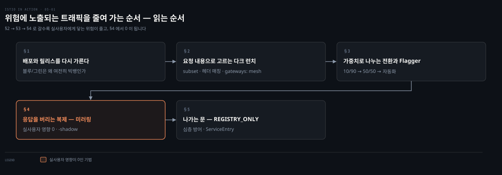
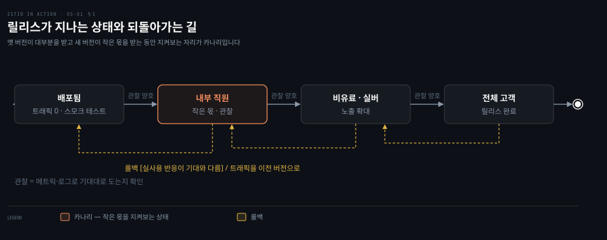
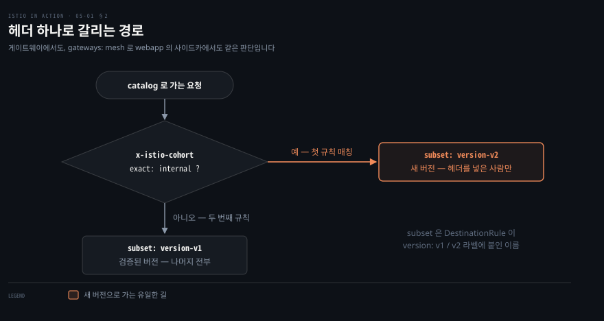
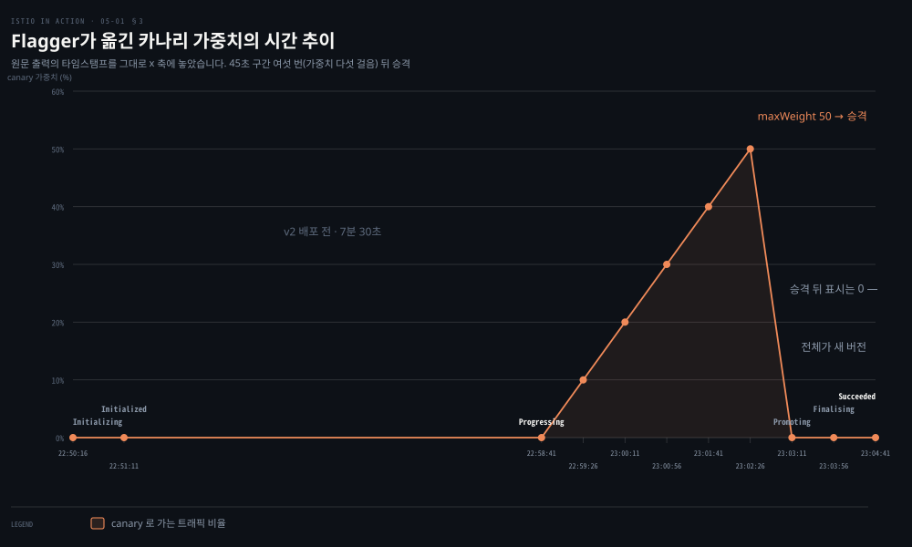
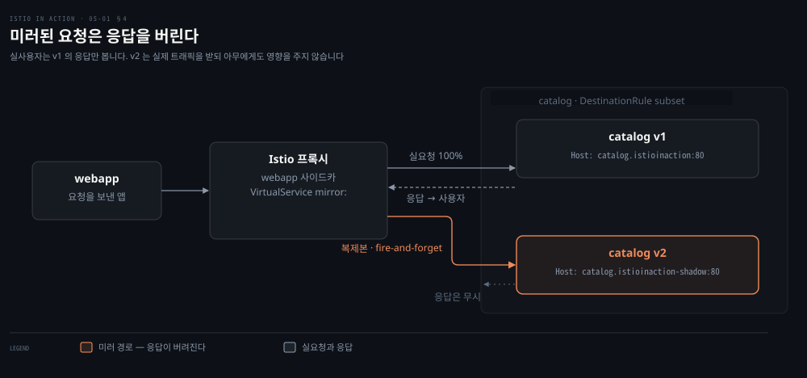
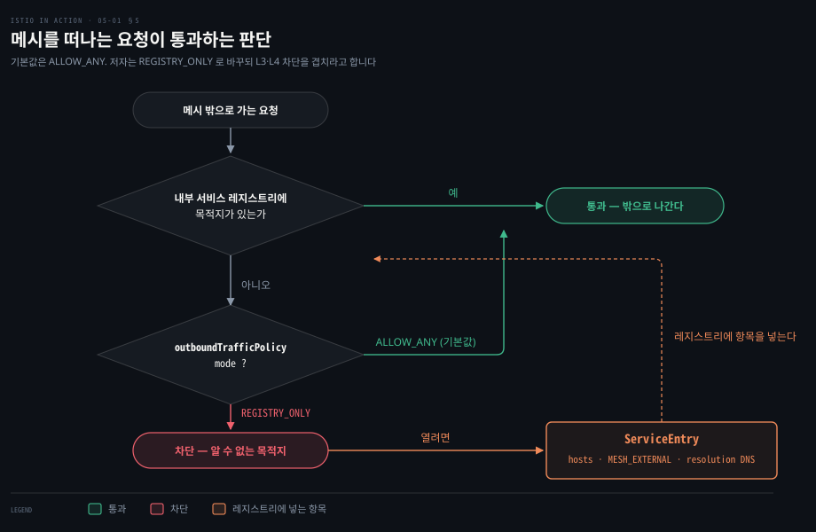

# 위험에 노출되는 트래픽을 줄여 가는 순서

---

> 5장은 새 코드를 프로덕션에 내보낼 때 실사용자 트래픽 중 얼마를 위험에 노출할지를 단계별로 줄이는 방법을 다룹니다. 헤더로 고른 사용자만 보내는 다크 런치, 가중치로 비율을 나누는 트래픽 전환, 그것을 메트릭으로 자동화하는 Flagger, 응답을 버리는 복제인 미러링 순입니다. 마지막에 메시 밖으로 나가는 트래픽을 막고 여는 문을 다룹니다.


## 핵심 요약

> 이 장 전체가 매달린 하나의 생각은 **릴리스는 전부 아니면 전무가 아니고 각 기법은 새 코드가 해칠 수 있는 실사용자 트래픽의 몫을 한 단계씩 줄인다**는 것입니다. 저자가 세 기법을 나열한 순서를 이 노트는 위험이 줄어드는 사다리로 읽습니다.

저자는 1장의 블루/그린이 남긴 "빅뱅"에서 시작합니다. 배포와 릴리스를 가르면 릴리스는 사업 결정이 되고 점진적으로 열 수 있습니다. 헤더 매칭은 *누가* 새 버전을 보는지 고릅니다. 가중치는 *얼마나*를 정합니다. 미러링은 실사용자에게 아무 영향 없이 실제 트래픽을 새 버전에 흘립니다. 셋 다 애플리케이션이 여러 버전으로 동시에 돌 수 있어야 하고, 미러링은 거기에 실모드·미러 모드 둘이 더해진다는 전제가 붙습니다. 마지막 절은 방향을 뒤집어, 메시를 떠나는 트래픽을 기본 차단하고 `ServiceEntry`로만 여는 방어를 더합니다.


## 학습 목표

이 내용을 읽고 나면:

1. 블루/그린 배포가 왜 여전히 빅뱅인지와, 배포와 릴리스를 가르면 무엇이 달라지는지 설명할 수 있습니다.
2. DestinationRule의 subset과 VirtualService의 헤더 매칭으로 특정 사용자만 새 버전에 보내는 다크 런치를 콜 그래프 깊은 곳에도 적용할 수 있습니다.
3. 가중치 라우팅의 제약(합 100, subset 선언)을 말하고 Flagger가 어떤 메트릭과 임계로 카나리를 진행·롤백하는지 설명할 수 있습니다.
4. 미러링이 앞의 두 기법과 무엇이 다른지, 미러된 요청을 애플리케이션이 어떻게 알아보는지 말할 수 있습니다.
5. `outboundTrafficPolicy`를 `REGISTRY_ONLY`로 바꾸는 이유와 한계, `ServiceEntry`가 레지스트리에 무엇을 넣는지 설명할 수 있습니다.

아래는 이 문서 전체를 읽는 순서로 이은 지도입니다. 칸마다 절 번호와 그 절이 답하는 질문 하나를 적었습니다. 색이 붙은 칸이 실사용자에게 영향이 0인 유일한 기법입니다.




## 이 문서가 다루지 않는 것

> 5장은 기존 `03_istio` 트래픽 관리 노트와 겹칩니다. 리소스 필드와 실습 절차는 그쪽에 맡기고 저자의 판단만 남깁니다.

- VirtualService·DestinationRule 필드 레퍼런스 → [Istio VirtualService 레퍼런스](https://istio.io/latest/docs/reference/config/networking/virtual-service/) · [DestinationRule 레퍼런스](https://istio.io/latest/docs/reference/config/networking/destination-rule/)
- 2장의 다크 런치 실습 자체 → [배포와 릴리스를 가르는 첫 실습](02-01.배포와%20릴리스를%20가르는%20첫%20실습.md). 5장은 같은 실습을 메시 안으로 옮기고 가중치·미러링으로 넓힙니다
- Flagger의 Helm 설치 절차와 Prometheus 애드온 설치 → 원문 5.3.1과 Flagger 문서
- 타임아웃·재시도·서킷 브레이커 → 6장


## 1. 배포와 릴리스를 다시 가른다
> 4장이 트래픽을 클러스터 안으로 들였다면, 5장의 질문은 셋입니다. 들어온 요청은 어느 서비스로 가는가, 서비스는 안팎의 다른 서비스와 어떻게 대화하는가, 그리고 가장 중요하게 **새 버전을 낼 때 어떻게 고객에게 최소한의 영향만 주는가**입니다. Istio 프록시가 서비스 사이의 통신을 가로채므로 요청 하나 단위로 트래픽을 통제할 수 있습니다. 이 장은 그것을 왜 하고 싶은지, 어떻게 하는지, 무엇을 얻는지를 다룹니다.



도식은 저자의 그림 5.2~5.5를 하나의 상태 전이도로 그렸습니다. 배포된 상태에서 내부 직원에게만 엽니다. 관찰 결과가 좋으면 비유료·실버 등급 고객으로 넓힙니다. 결국 전체에 닿습니다. 어느 상태에서든 실사용자 반응으로 기대와 다른 점이 보이면 트래픽을 이전 버전으로 되돌리는 것이 롤백입니다. 색이 붙은 상태가 저자가 **카나리**를 정의하는 자리입니다. 옛 버전이 대부분을 받고 새 버전이 작은 몫을 받는 동안 그 몫을 지켜봅니다.

출발점은 1장의 ACME입니다. ACME는 블루/그린 배포를 시도했습니다. v2(그린)를 v1(블루) 옆에 프로덕션에 두고 릴리스 시점에 트래픽을 넘깁니다. 문제가 나면 v1로 되돌리니 장애는 줄었습니다. 그런데 넘기는 순간에는 여전히 **모든 코드 변경이 한꺼번에 나가는 빅뱅**입니다. 여기서 저자는 배포와 릴리스를 정의합니다.

- **배포**: 새 코드를 프로덕션 자원에 설치하되 트래픽은 보내지 않습니다. 사용자 요청을 받지 않으니 사용자에게 영향이 없습니다. 이 상태에서 스모크 테스트를 돌리고 메트릭·로그로 기대대로 도는지 확인합니다.
- **릴리스**: 실사용자 트래픽을 새 배포로 가져오는 일입니다. 전부 아니면 전무가 아니라 **사업 결정**입니다.


ACME의 과거는 두 개념을 합쳐 놓은 것이었습니다. 롤링 업그레이드로 옛 버전을 새 버전으로 바꿨습니다. 새 버전이 클러스터에 들어오는 즉시 프로덕션 트래픽을 받았습니다. 그래서 사용자는 새 코드와 그 버그를 동시에 만났습니다. 둘을 가르면 어떤 사용자를 어떻게 노출할지 세밀하게 통제할 수 있습니다. 그것이 곧 위험을 줄이는 방법입니다. 2장이 같은 정의를 실습으로 보였다면 5장은 그 정의 위에 기법을 셋 쌓습니다.


## 2. 요청 내용으로 고르는 다크 런치
> 첫 기법은 요청의 내용, 곧 헤더를 보고 경로를 정하는 방식입니다. 대다수 사용자는 검증된 버전으로 가고 특정 부류만 새 버전으로 갑니다. 저자는 이것을 **다크 런치**라고 부릅니다. 그러려면 Istio에 어느 워크로드가 v1이고 어느 것이 v2인지 알려 줘야 합니다. Deployment 라벨이 `app: catalog`에 `version: v1`과 `version: v2`로 갈려 있으니, DestinationRule이 그 라벨을 **subset**으로 이름 붙입니다.



도식은 VirtualService의 판단을 순서대로 그린 그림입니다. 첫 규칙의 매칭이 되면 v2, 안 되면 두 번째 규칙인 v1입니다. 색이 붙은 가지가 새 버전으로 가는 유일한 길입니다. 헤더를 넣을 수 있는 사람만 그 길을 탑니다. 저자는 헤더 이름 자체는 팀이 정하는 것이라고 덧붙입니다. 애플리케이션이 주입한 헤더일 수도, `Agent` 같은 알려진 헤더나 쿠키 값일 수도 있습니다. 어떤 헤더를 넣을지 결정 엔진에 맡길 수도 있습니다. Istio의 라우팅 능력은 Envoy에서 옵니다.

```yaml
# ch5/catalog-dest-rule.yaml — 라벨을 subset 이름으로
apiVersion: networking.istio.io/v1alpha3
kind: DestinationRule
metadata:
  name: catalog
spec:
  host: catalog
  subsets:
  - name: version-v1
    labels:
      version: v1
  - name: version-v2
    labels:
      version: v2
```

VirtualService는 그 subset으로 목적지를 고릅니다. 먼저 전량을 `version-v1`로 묶어 다크 런치 이전의 평상시 상태를 만듭니다. 그다음 `x-istio-cohort: internal` 헤더가 정확히 일치하는 요청만 `version-v2`로 보내는 규칙을 앞에 둡니다.


지금까지는 게이트웨이에서 라우팅했습니다. 같은 규칙을 **콜 그래프 깊은 곳**에도 둘 수 있습니다. 2장의 구조를 복원해 게이트웨이가 `webapp`으로 보내고 `webapp`이 `catalog`를 부르게 한 뒤, `catalog`용 VirtualService를 만듭니다. 4장과 다른 점은 `gateways:` 필드의 값이 `mesh`라는 점입니다. 저자의 주석대로 **메시의 모든 사이드카에 적용**된다는 뜻입니다. `webapp`의 사이드카가 이 규칙을 받아, 헤더가 있으면 `catalog` v2로 보냅니다.


## 3. 가중치로 나누는 전환과 Flagger
> 두 번째 기법은 헤더가 아니라 **비율**입니다. 내부 직원에게 다크 런치한 v2를 모두에게 천천히 열고 싶을 때, `catalog`로 가는 전체 트래픽의 10%를 v2로 보내고 90%를 v1에 남깁니다. v2 코드의 부정적 영향이 전체 트래픽의 얼마에 닿는지를 통제하는 방식입니다. 롤백은 가중치를 되돌리는 일이라 필요하면 0%까지 내립니다.



도식은 저자가 `kubectl get canary -w`로 받은 출력을 시간축에 그대로 놓은 그림입니다. `Initialized` 뒤 7분 30초 비어 있는 구간은 v2를 배포하기 전입니다. `Progressing`에 들어가면 45초마다 10%씩 올라 50%에 닿습니다.

```yaml
# ch5/catalog-vs-v2-10-90-mesh.yaml — 같은 host 에 가중치 둘
http:
- route:
  - destination:
      host: catalog
      subset: version-v1
    weight: 90
  - destination:
      host: catalog
      subset: version-v2
    weight: 10
```

저자는 100번 호출해 `imageUrl`이 있는 응답을 세는 명령으로 확인합니다. 10에 가까운 값이 나옵니다. 50/50으로 바꾸면 50에 가깝습니다. 제약이 둘입니다. 가중치 합은 100이어야 하며 아니면 라우팅을 예측할 수 없습니다. v1·v2 밖의 버전이 있으면 그것도 DestinationRule의 subset으로 선언돼 있어야 합니다.

저자의 경고가 이 절의 무게 중심입니다. 천천히 여는 동안 새 버전과 옛 버전 **둘 다** 안정성·성능·정확성을 관찰해야 합니다. 그리고 이 방식을 쓰려면 서비스가 **여러 버전이 동시에 도는 것을 견디도록** 만들어져 있어야 합니다. 상태가 많을수록, 외부 상태에 기대는 서비스일수록 어렵습니다. 기법은 Istio가 주지만 그 전제는 애플리케이션 설계의 몫입니다.

여기까지는 CLI로 설정 파일을 여러 벌 만들어 손으로 바꿨습니다. 릴리스가 수백 개 동시에 돌아가면 사람 손은 오류의 원천입니다. 그래서 저자는 **Flagger**를 붙입니다. Stefan Prodan이 만든 카나리 자동화 도구로, 릴리스를 어떻게 진행하고 언제 더 열고 언제 롤백할지를 선언하면 필요한 설정을 대신 만듭니다. 메트릭으로 건강을 판단하므로 Prometheus가 Istio 데이터 플레인을 긁고 있어야 합니다.

```yaml
# ch5/flagger/catalog-release.yaml — 진행 규칙만 발췌
analysis:
  interval: 45s        # 45초마다 판단
  threshold: 5         # 다섯 구간 넘게 이탈이면 중단·롤백
  maxWeight: 50        # 50% 에 닿으면 100% 로 전환
  stepWeight: 10       # 한 걸음에 10%
  metrics:
  - name: request-success-rate
    thresholdRange:
      min: 99          # 1분 창에서 성공률 99% 미만이면 이탈
    interval: 1m
  - name: request-duration
    thresholdRange:
      max: 500         # P99 500ms 초과면 이탈
    interval: 30s
```

`Canary` 리소스가 어느 Deployment를 대상으로 삼을지, 어떤 Service와 VirtualService를 만들지, 어떻게 진행할지를 담습니다. 적용하면 Flagger가 Deployment·Service·VirtualService 같은 리소스를 만듭니다. VirtualService는 `catalog-primary` 100 · `catalog-canary` 0으로 시작합니다. 원본 `catalog` Deployment가 바뀌는 것을 지켜보다가 v2가 들어오면 canary Deployment와 Service를 만들고 가중치를 조정합니다.


그다음 `Promoting`·`Finalising`·`Succeeded`로 넘어가며 표시 가중치는 0으로 돌아옵니다. canary가 primary로 승격돼 전체 트래픽이 새 버전으로 갔다는 뜻입니다. 메트릭이 다섯 구간 넘게 이탈하면 이 곡선은 오른쪽 끝에 닿지 못하고 롤백됩니다. Flagger는 다크 런치 테스트와 미러링도 자동화할 수 있다고 저자는 덧붙입니다.


## 4. 응답을 버리는 복제 — 미러링
> 앞의 두 기법은 위험을 줄이지만 둘 다 **실사용자 트래픽을 씁니다.** 영향의 범위를 통제할 뿐 영향이 0은 아닙니다. 세 번째 기법은 프로덕션 트래픽을 복제해 새 배포로 보내되 고객 요청 경로 **밖에서** 보냅니다. 실제 트래픽으로 새 코드의 동작을 확인하면서 사용자에게는 아무 영향이 없습니다. 저자는 이것이 앞의 둘보다 위험을 더 줄인다고 씁니다.



도식은 요청 하나가 둘로 갈리는 자리를 그린 그림입니다. `webapp`의 Istio 프록시가 실요청을 v1로 보내고 그 응답을 돌려주는 동시에, 복제본을 v2로 보내고 v2의 응답은 성공이든 실패든 무시합니다. 색이 붙은 선이 그 복제본입니다. 설정은 VirtualService에 `mirror:` 절 하나입니다.

```yaml
# ch5/catalog-vs-v2-mirror.yaml — 실트래픽은 v1, 복제본은 v2
http:
- route:
  - destination:
      host: catalog
      subset: version-v1
    weight: 100
  mirror:
    host: catalog
    subset: version-v2
```

저자는 v1과 v2의 컨테이너 로그를 나란히 보여 줍니다. 요청 하나마다 두 로그에 모두 줄이 생깁니다. v1 쪽이 실요청이자 우리가 받는 응답입니다. v2 로그의 호스트가 다릅니다. `catalog.istioinaction-shadow:80`처럼 **`-shadow` 접미사**가 붙어 있습니다.

> **원문 정오**: 저자의 로그 출력은 `catalog.istioinaction-shadow:80`인데, 이어지는 산문은 "`Host: catalog:8080` 대신 `Host: catalog-shadow:8080`"이라고 씁니다. 호스트 이름의 네임스페이스 접미사와 포트가 로그와 산문에서 다릅니다. 이 노트는 로그 값을 따릅니다. 미러된 트래픽임을 알리는 표식이라, 이 접미사를 받은 서비스는 요청을 미러로 인식하고 그에 맞게 처리할 수 있습니다. 저자가 든 예는 응답이 버려질 것이므로 트랜잭션을 롤백하거나 자원을 많이 쓰는 호출을 하지 않는 것입니다.

여기서 3절의 전제가 다시 나옵니다. 애플리케이션에 요구되는 것이 셋입니다.

- 이 맥락을 안다
- 실모드와 미러 모드 둘 다로 돈다
- 여러 버전으로 돈다

셋 다 필요할 수도 있습니다.


## 5. 나가는 문 — REGISTRY_ONLY와 ServiceEntry
> 앞의 절들이 들어오는 트래픽과 안의 트래픽을 다뤘다면, 마지막 절은 **메시를 떠나는 트래픽**입니다. 기본값은 허용입니다. 애플리케이션이 메시가 관리하지 않는 외부 사이트나 서비스를 부르면 Istio는 그대로 내보냅니다. 모든 트래픽이 사이드카를 거치니 이 기본값을 뒤집어 전부 막을 수도 있습니다.



도식은 나가는 요청이 만나는 판단을 순서대로 그린 그림입니다. 원문 5.5의 서술과 메시 설정 레퍼런스의 정의를 합쳐 노트가 도출한 순서입니다. 목적지가 Istio의 내부 서비스 레지스트리에 있으면 나갑니다. 없으면 `outboundTrafficPolicy`가 가릅니다. `ALLOW_ANY`면 그래도 나갑니다. `REGISTRY_ONLY`면 막힙니다. 막힌 목적지를 열려면 `ServiceEntry`로 레지스트리에 항목을 넣습니다. 색이 붙은 상자가 그 항목입니다.

막는 이유는 **심층 방어**입니다. 메시 안의 서비스가 침해당했을 때 공격자가 자기 서버로 "전화 걸기"를 못 하게 하는 기본 자세입니다. 취약점으로 서비스를 장악한 공격자는 코드를 주입하거나 서비스를 조작해 자기가 통제하는 서버에 닿으려 합니다. 그것이 되면 회사의 민감 데이터와 지식재산을 빼돌립니다. 다만 저자는 Istio로 막는 것만으로는 **충분하지 않다**고 못 박습니다. 침해된 Pod는 프록시를 우회할 수 있습니다. 그래서 L3·L4 같은 추가 차단 장치를 겹쳐야 합니다.


```bash
istioctl install --set profile=demo --set meshConfig.outboundTrafficPolicy.mode=REGISTRY_ONLY
```

저자는 실험이니 `istioctl install`로 바꾸지만 실제 배포에서는 `IstioOperator`나 `istio-system`의 `istio` configmap을 직접 고칠 것이라고 씁니다.

레지스트리가 무엇인지가 이 절의 개념입니다. Istio는 메시가 아는 모든 서비스, 메시 안에서 접근할 수 있는 모든 서비스의 **내부 서비스 레지스트리**를 만듭니다. 메시 안 서비스가 서로를 찾을 때 쓰는 디스커버리 레지스트리의 정본입니다. 컨트롤 플레인이 어느 플랫폼에 놓였는지를 가정해 만드는데, Kubernetes 위에서는 Kubernetes `Service` 객체를 API로 읽어 카탈로그를 채웁니다. 3장 3.4에서 "istiod가 레지스트리 구현을 Envoy에게서 감춘다"고 한 그 레지스트리입니다. 외부 서비스는 여기 없으니 알려 줘야 합니다.

```yaml
# ch5/forum-serviceentry.yaml — 외부 호스트를 레지스트리에 넣는다
apiVersion: networking.istio.io/v1alpha3
kind: ServiceEntry
metadata:
  name: jsonplaceholder
spec:
  hosts:
  - jsonplaceholder.typicode.com
  ports:
  - number: 80
    name: http
    protocol: HTTP
  resolution: DNS
  location: MESH_EXTERNAL
```

실습은 실패부터 보입니다. 외부 포럼 API `jsonplaceholder.typicode.com`을 부르는 `forum` 서비스를 띄우고 `/api/users`를 부르면 `error calling Forum service`가 옵니다. `ServiceEntry`를 적용하면 사용자 목록이 돌아옵니다. 레지스트리에 항목이 생기면서 메시 안 클라이언트가 그 호스트를 불러도 된다는 것이 명시된 결과입니다. 저자는 외부 서비스에도 정교한 라우팅을 걸 수 있다고 합니다. 다만 먼저 `ServiceEntry` 개념이 있어야 한다는 데서 이 장을 멈춥니다.


## 심화 학습

> 책이 쓰인 뒤 바뀌었거나 책이 생략한 것만 적습니다. 원문을 고치지 않고 나란히 둡니다.

- **미러링 비율**: 책은 `mirror:`로 전량을 복제합니다. VirtualService 레퍼런스에는 `mirrorPercentage`가 있어 비율을 정할 수 있습니다. 없으면 100%입니다. 여러 목적지로 복제하는 `mirrors`도 있습니다. 어느 쪽이든 응답을 기다리지 않는 best-effort입니다.[^istio-vs]
- **가중치 합이 100이 아닐 때**: 책은 "예측할 수 없다"고만 씁니다. 현재 레퍼런스는 목적지가 `weight/(가중치 합)`만큼 받는다고 정의합니다. 목적지가 하나면 전량이고 가중치 0이면 못 받습니다.[^istio-vs] 책의 "합은 100"은 그 정의 위에서 읽으면 관행에 가깝습니다.
- **`-shadow` 접미사의 출처**: Envoy의 `RequestMirrorPolicy`가 미러할 때 host/authority 헤더에 `-shadow`를 붙입니다. 로깅용이라고 문서가 밝힙니다. `disable_shadow_host_suffix_append`로 끌 수 있습니다. "fire and forget"이라 primary 응답을 기다리지 않는다는 문장도 같은 곳에 있습니다.[^envoy-mirror] 3장의 "Istio 기능은 대부분 Envoy가 한다"의 사례입니다.
- **`outboundTrafficPolicy`의 정의**: 메시 설정 레퍼런스는 `REGISTRY_ONLY`를 "알 수 없는 아웃바운드 트래픽은 버려지고 목적지는 `ServiceEntry`로 명시 선언해야 한다"로 정의합니다. `ALLOW_ANY`는 "허용하되 관측성 저하 같은 제한된 기능"입니다. 기본값은 `ALLOW_ANY`입니다.[^istio-mesh] 책이 말한 "기본은 허용"의 근거입니다.
- **Flagger의 현재 자리**: 책도 `fluxcd/flagger` 저장소 주소를 쓰지만 소속을 말하지는 않습니다. 저장소가 GitHub `fluxcd` 조직 아래에 있습니다. 문서는 `threshold`를 "롤백 전 허용되는 실패 검사 횟수", `request-success-rate`를 "5xx 아닌 응답 비율", `request-duration`을 "P99 밀리초"로 정의합니다. 실패 검사가 임계에 닿으면 트래픽을 primary로 되돌리고 canary를 0으로 줄이며 실패로 표시합니다.[^flagger] 책은 "다섯 구간 넘게(more than five)", 문서는 "임계에 닿으면(reaches)"이라 경계값이 하나 다릅니다.


## 결정 치트시트

> 5장에서 끌어낼 수 있는 판단 기준입니다. 저자가 본문에서 밝힌 근거만 옮겼습니다.

| 상황 | 판단 | 근거 |
|---|---|---|
| 새 버전을 올렸는데 응답이 v1·v2로 섞임 | DestinationRule subset + VirtualService로 전량 v1 고정 | 다크 런치 이전의 평상시 상태 |
| 특정 부류만 새 버전을 보게 하고 싶음 | 헤더 `exact` 매칭 → v2 subset | 요청 내용으로 경로를 정함 |
| 게이트웨이가 아니라 서비스 사이에서 가르고 싶음 | VirtualService `gateways: [mesh]` | 메시의 모든 사이드카에 적용 |
| 모두에게 천천히 열고 싶음 | 가중치 10/90 → 50/50 → 100 | 영향받는 트래픽 비율을 통제 |
| 릴리스 수백 개를 손으로 못 돌림 | Flagger `Canary` | 메트릭 임계로 진행·롤백을 자동화 |
| 실사용자에게 영향 없이 새 코드를 시험 | `mirror:` | 복제본의 응답은 무시됨 |
| 미러된 요청이 부작용을 내면 안 됨 | 앱이 `-shadow` Host를 보고 트랜잭션 롤백·무거운 호출 회피 | 미러 트래픽은 Host에 표식이 붙음 |
| 서비스가 상태를 많이 가짐 | 세 기법 모두 적용 전 다중 버전 동시 실행 가능성부터 확인 | 상태가 많을수록 어려움 |
| 침해된 서비스의 외부 통신을 막고 싶음 | `REGISTRY_ONLY` + L3·L4 차단 병행 | Istio 차단만으로는 불충분, Pod가 프록시를 우회 가능 |
| 메시 밖 서비스를 불러야 함 | `ServiceEntry` (`MESH_EXTERNAL`, `resolution: DNS`) | 레지스트리에 항목이 있어야 나감 |


## 적용 관점

> 이 장을 읽고 실제로 바꿀 행동 하나를 **체크리스트**로 잡습니다. 트래픽 기법을 켜기 전에 애플리케이션 쪽 전제를 먼저 확인하는 목록입니다.

> 카나리·미러링을 켜는 PR 앞에 세 줄을 묻습니다. 이 서비스는 v1과 v2가 같은 DB를 동시에 써도 되는가. `-shadow` Host를 받으면 쓰기와 외부 호출을 건너뛰는가. 새 버전과 옛 버전의 메트릭을 나란히 보는 대시보드가 있는가. 하나라도 "아니오"면 Istio 설정보다 앱 코드가 먼저입니다.

Spring 앱을 운영하는 관점에서 미러링은 가장 매력적이면서 가장 조심할 기법입니다. 프록시는 응답을 버리지만 앱은 요청을 끝까지 처리합니다. 저자가 든 예는 `-shadow` 접미사를 보고 트랜잭션을 롤백하거나 자원을 많이 쓰는 호출을 피하는 것입니다. Spring 앱으로 옮기면 결제·메일 같은 외부 호출이 그 자리입니다. 그 분기가 앱에 있어야 미러링이 "영향 0"이 됩니다. 그 분기가 없으면 미러링은 쓰기 요청을 두 번 실행하는 장치가 됩니다.


## 면접에서 받을 만한 질문
> 답을 먼저 떠올린 뒤 아래 정답 절을 펼칩니다.

1. 이 장을 한 줄로 정의하면 무엇입니까?
2. 버전 라우팅에서 `DestinationRule` 과 `VirtualService` 는 각각 무엇을 맡습니까? `gateways: [mesh]` 는 무엇을 뜻합니까?
3. 가중치 기반 카나리에서 지켜야 하는 제약은 무엇이고, Flagger 는 그 가중치를 어떤 기준으로 올리고 내립니까?
4. 미러링이 실사용자에게 영향을 주지 않는 이유는 무엇이며, 그럼에도 애플리케이션이 준비해야 하는 것은 무엇입니까?
5. 블루/그린이 있는데 왜 카나리가 필요합니까?
6. 미러링이면 새 코드를 아무 위험 없이 시험할 수 있습니까?
7. `REGISTRY_ONLY`로 막으면 침해된 서비스의 외부 통신이 차단됩니까?


## 정답 (자답 후 펼치기)

> 위 §면접에서 받을 만한 질문 의 7 개에 *먼저 자답한 뒤* 읽으십시오. 자답 없이 먼저 읽으면 학습 효과가 0 입니다. 질문 번호와 1:1 로 대응합니다.

### 정답 1 — 한 줄 정의

"다크 런치는 헤더로 고른 사용자만 새 버전에 보냅니다. 트래픽 전환은 가중치로 비율을 나눕니다. 미러링은 실트래픽을 복제해 새 버전에 보내되 응답을 버립니다. 셋 다 새 코드가 해칠 수 있는 실사용자 트래픽의 몫을 줄이는 기법입니다."

### 정답 2 — DestinationRule 과 VirtualService 는 각각 무엇을 맡습니까

DestinationRule이 라벨을 subset으로 이름 붙이고 VirtualService가 그 subset으로 경로를 정합니다. `gateways: [mesh]`면 게이트웨이가 아니라 메시의 모든 사이드카에 적용됩니다.

### 정답 3 — 가중치 카나리의 제약과 Flagger 의 판단 기준은 무엇입니까

가중치는 합이 100이어야 하고 모든 버전이 subset으로 선언돼야 합니다. Flagger는 성공률과 P99 지연 임계로 45초마다 10%씩 올립니다. 이탈이 임계 횟수를 넘으면 롤백합니다.

### 정답 4 — 미러링이 안전한 이유와 애플리케이션이 준비할 것은 무엇입니까

미러링은 복제본의 응답을 프록시가 무시하므로 실사용자에게 영향이 없습니다. 그러나 앱은 `-shadow` Host를 보고 부작용을 피해야 합니다. 세 기법 모두 앱이 여러 버전으로 동시에 돌 수 있어야 하고, 미러링은 실모드·미러 모드까지 견뎌야 합니다.

### 정답 5 — 블루/그린이 있는데 왜 카나리가 필요합니까

블루/그린은 되돌리기는 쉽지만 넘기는 순간 모든 변경이 한꺼번에 나가는 빅뱅입니다. 배포와 릴리스를 가르면 릴리스를 내부 직원 → 일부 고객 → 전체로 점진적으로 열 수 있고, 어느 단계에서든 트래픽만 되돌리면 롤백입니다.

### 정답 6 — 미러링이면 새 코드를 아무 위험 없이 시험할 수 있습니까

사용자 응답에는 영향이 없습니다. 그러나 미러된 요청도 새 버전이 끝까지 처리하므로, 쓰기나 외부 호출이 있으면 부작용이 납니다. 프록시가 `Host`에 `-shadow`를 붙여 주니 앱이 그것을 보고 트랜잭션을 롤백하거나 무거운 호출을 피해야 합니다.

### 정답 7 — `REGISTRY_ONLY`로 막으면 침해된 서비스의 외부 통신이 차단됩니까

프록시를 거치는 통신은 막힙니다. 그러나 저자는 충분하지 않다고 씁니다. 침해된 Pod는 프록시를 우회할 수 있어 L3·L4 차단을 겹쳐야 합니다. 막은 뒤 필요한 외부 서비스는 `ServiceEntry`로 레지스트리에 넣어 엽니다.


## 핵심 개념 체크리스트

- [ ] 블루/그린이 여전히 빅뱅인 이유를 말할 수 있는가?
- [ ] 배포와 릴리스를 각각 정의하고 릴리스가 사업 결정인 이유를 말할 수 있는가?
- [ ] DestinationRule의 subset이 무엇을 이름 붙이는지 설명할 수 있는가?
- [ ] `gateways: [mesh]`의 뜻을 말할 수 있는가?
- [ ] 가중치 라우팅의 제약 둘을 말할 수 있는가?
- [ ] Flagger `Canary`의 `interval`·`threshold`·`maxWeight`·`stepWeight`가 각각 무엇을 정하는지 아는가?
- [ ] 미러링이 앞의 두 기법과 다른 점을 한 문장으로 말할 수 있는가?
- [ ] `-shadow` 접미사를 받은 앱이 무엇을 해야 하는지 말할 수 있는가?
- [ ] `REGISTRY_ONLY`만으로 충분하지 않은 이유를 말할 수 있는가?
- [ ] Istio 내부 레지스트리가 Kubernetes에서 무엇으로 채워지는지 아는가?


## 관련 문서

- [문을 여는 일과 길을 내는 일을 가른다](04-01.문을%20여는%20일과%20길을%20내는%20일을%20가른다.md) — 4장이 게이트웨이에서 연 VirtualService를 5장은 메시 안으로 옮깁니다
- [배포와 릴리스를 가르는 첫 실습](02-01.배포와%20릴리스를%20가르는%20첫%20실습.md) — 같은 정의를 2장은 실습으로, 5장은 세 기법으로 폅니다
- [Envoy가 맡는 일과 Istio가 보태는 일](03-01.Envoy가%20맡는%20일과%20Istio가%20보태는%20일.md) — 미러링의 `-shadow` 접미사와 섀도잉 기능이 Envoy에서 옵니다
- [Istio VirtualService 레퍼런스](https://istio.io/latest/docs/reference/config/networking/virtual-service/) — 라우팅 필드의 SSOT


## 참고 자료

- 원본: 《Istio in Action》 5장 "Traffic control: Fine-grained traffic routing" (Christian E. Posta·Rinor Maloku, Manning)
- [책 예제 소스 코드](https://github.com/istioinaction/book-source-code) — `ch5/` 의 VirtualService·DestinationRule·Flagger 파일
- [Flagger](https://flagger.app) — 저자가 본문에서 지목한 주소


[^istio-vs]: Istio — VirtualService 레퍼런스. `mirror` "Mirror HTTP traffic to a another destination in addition to forwarding the requests to the intended destination", `mirrorPercentage` "If this field is absent, all the traffic (100%) will be mirrored", `weight` "A destination will receive weight/(sum of all weights) requests", `gateways` "The reserved word mesh is used to imply all the sidecars in the mesh". <https://istio.io/latest/docs/reference/config/networking/virtual-service/>
[^envoy-mirror]: Envoy — `RouteAction.RequestMirrorPolicy`. "The current implementation is 'fire and forget'", "During shadowing, the host/authority header is altered such that -shadow is appended … For example, cluster1 becomes cluster1-shadow." <https://www.envoyproxy.io/docs/envoy/latest/api-v3/config/route/v3/route_components.proto>
[^istio-mesh]: Istio — MeshConfig `OutboundTrafficPolicy.Mode`. `REGISTRY_ONLY` "unknown outbound traffic will be dropped. Traffic destinations must be explicitly declared into the service registry through ServiceEntry configurations", `ALLOW_ANY` "any traffic to unknown destinations will be allowed … reduced observability", 기본값 `ALLOW_ANY`. <https://istio.io/latest/docs/reference/config/istio.mesh.v1alpha1/>
[^flagger]: Flagger — Istio Canary Deployments 튜토리얼. "threshold: max number of failed metric checks before rollback", "request-success-rate: minimum req success rate (non 5xx responses) percentage", "request-duration: maximum req duration P99 milliseconds", "When the number of failed checks reaches the canary analysis threshold, the traffic is routed back to the primary, the canary is scaled to zero and the rollout is marked as failed." <https://docs.flagger.app/tutorials/istio-progressive-delivery>
