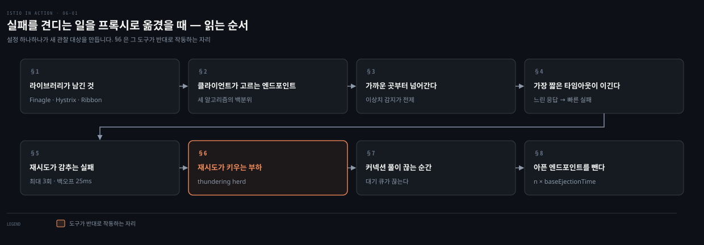
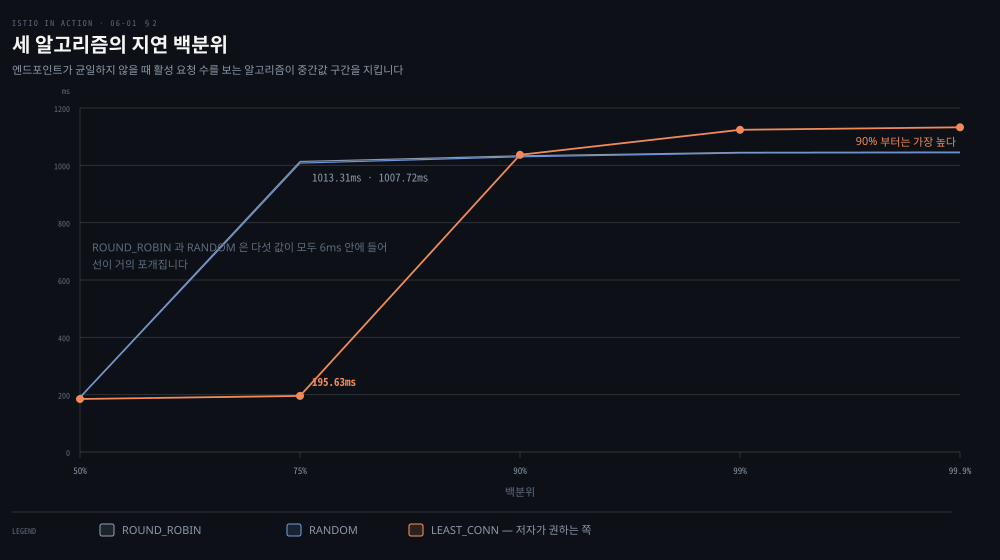
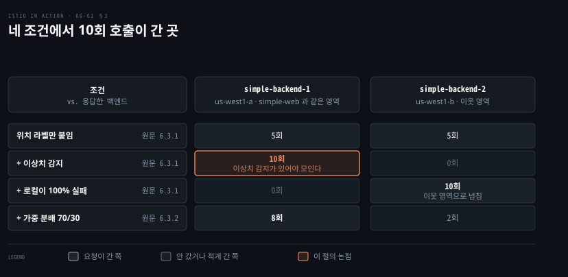
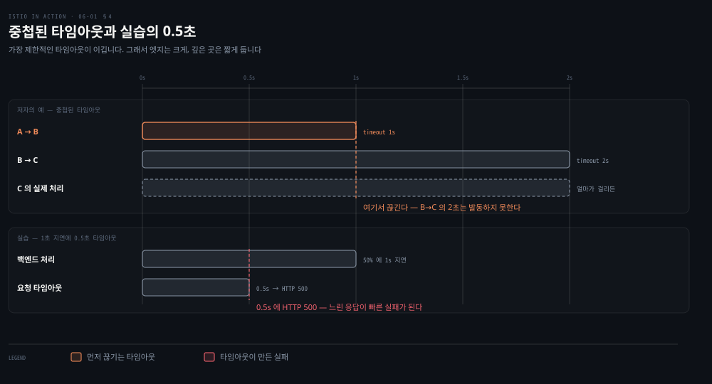
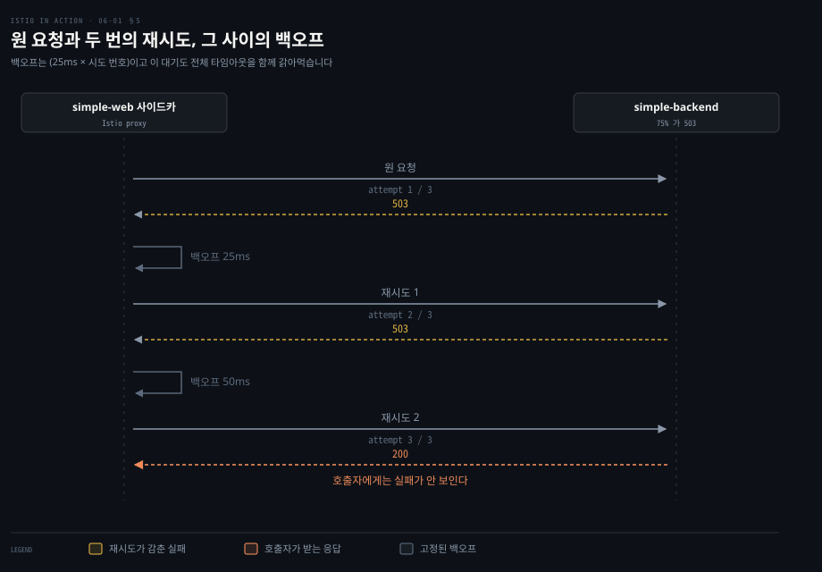
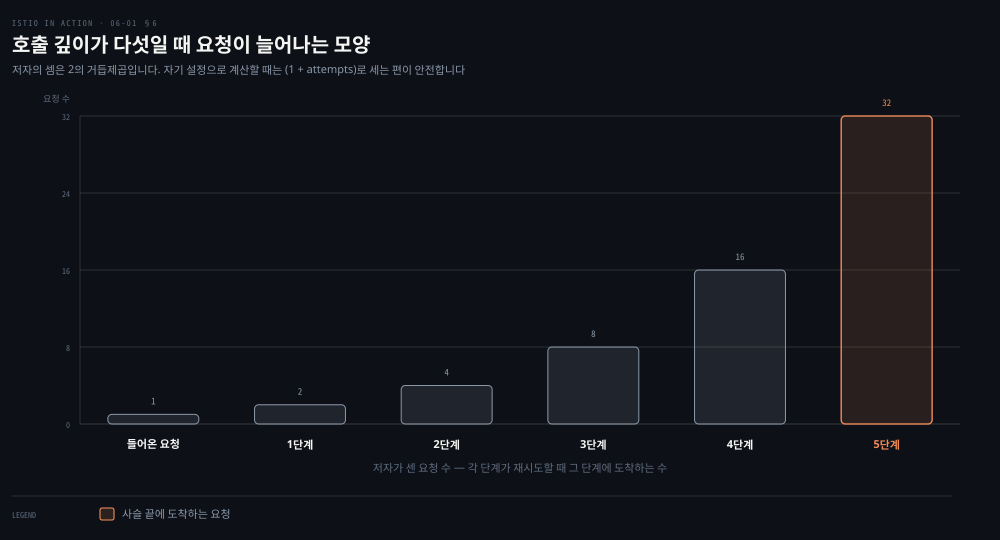
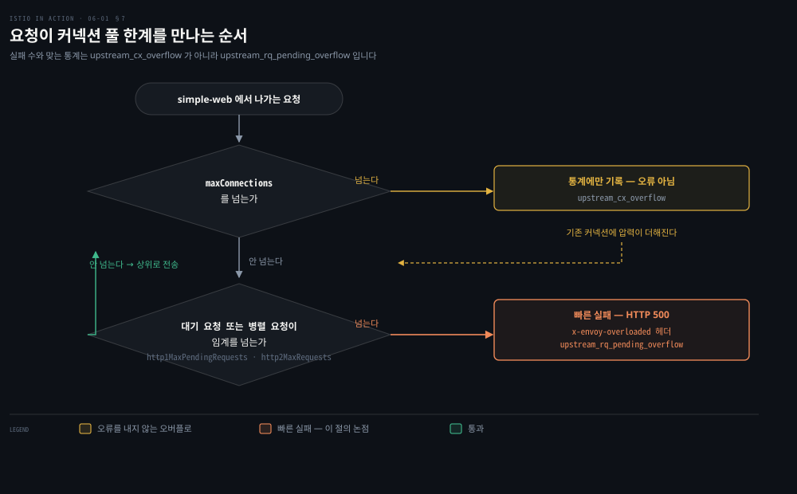
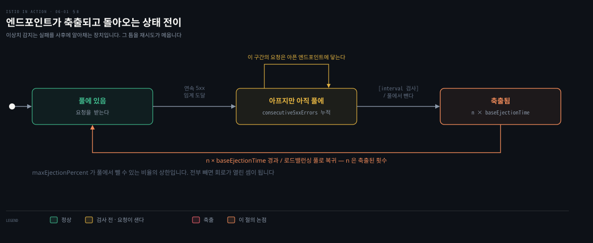

# 실패를 견디는 일을 프록시로 옮겼을 때

---

> 6장은 1장이 "라이브러리에서 프록시로 옮긴다"고 선언한 그 기능들을 실제로 설정해 봅니다. 클라이언트 사이드 로드밸런싱, 지역 인식, 타임아웃과 재시도, 서킷 브레이킹 넷입니다. 저자는 Fortio로 부하를 걸어 각 설정의 효과를 숫자로 보입니다. 같은 도구가 잘못 쓰이면 장애를 키운다는 것도 함께 보입니다.


## 핵심 요약

> 이 장 전체가 매달린 하나의 생각은 **레질리언스 설정은 실패를 없애지 않고 실패의 비용을 옮길 뿐이므로, 옮긴 곳에서 무슨 일이 벌어지는지 숫자로 봐야 한다**는 것입니다. 저자가 매 절을 부하 테스트 수치로 닫는 이유를 이 노트는 그렇게 읽습니다.

저자는 Finagle·Hystrix·Ribbon이 언어마다 갈라진 문제에서 출발합니다. 그 넷을 프록시로 옮기면 언어 제약은 사라집니다. 그런데 로드밸런싱 알고리즘은 백분위마다 다른 답을 줍니다. 지역 인식은 이상치 감지 없이는 작동하지 않습니다. 재시도는 호출 깊이만큼 부하를 곱합니다. 서킷 브레이킹은 끊는 순간을 통계로 확인해야 합니다. 이 노트는 다섯을 이렇게 묶습니다. 설정 하나하나가 새로운 관찰 대상을 만듭니다.


## 학습 목표

이 내용을 읽고 나면:

1. 레질리언스를 라이브러리로 풀었을 때의 문제 셋과, 프록시로 옮겨도 남는 부담을 말할 수 있습니다.
2. ROUND_ROBIN·RANDOM·LEAST_CONN이 지연 백분위마다 왜 다른 결과를 내는지 설명할 수 있습니다.
3. 지역 인식 로드밸런싱이 이상치 감지를 요구하는 이유와 가중 분배가 필요한 상황을 말할 수 있습니다.
4. 타임아웃이 중첩될 때 어느 것이 먼저 걸리는지, 재시도가 전체 타임아웃과 어떻게 충돌하는지 계산할 수 있습니다.
5. 서킷 브레이킹의 두 통제(커넥션 풀·이상치 감지)를 구분하고 발동 여부를 어떤 통계로 확인하는지 압니다.

아래는 이 문서 전체를 읽는 순서로 이은 지도입니다. 칸마다 절 번호와 그 절이 답하는 질문 하나를 적었습니다. 색이 붙은 칸이 같은 도구가 장애를 키우는 쪽으로 뒤집히는 자리입니다.




## 이 문서가 다루지 않는 것

> 6장은 기존 `03_istio` 레질리언스 노트와 겹칩니다. 필드 레퍼런스와 실습 절차는 그쪽에 맡기고 저자의 판단과 실측만 남깁니다.

- 커넥션 풀·이상치 탐지 필드 레퍼런스 → [Istio DestinationRule 레퍼런스](https://istio.io/latest/docs/reference/config/networking/destination-rule/)
- Fortio·Fake Service 설치와 UI 조작 → 원문 6.2와 각 프로젝트 문서
- EnvoyFilter로 Envoy HTTP 필터를 설정하는 일반 방법 → 14장
- 멀티 클러스터의 지역 인식 로드밸런싱 → 12장
- 메트릭 수집과 대시보드 → 7·8장


## 1. 라이브러리가 풀고 남긴 것
> 분산 시스템은 예측할 수 없는 방식으로 실패합니다. 그때마다 사람이 트래픽을 손으로 옮길 수는 없습니다. 그래서 서비스가 스스로 반응하도록 동작을 심어야 합니다. 저자가 드는 시나리오는 단순합니다. 서비스 A가 서비스 B를 부르는데 특정 엔드포인트가 느려집니다. 그러면 A는 그것을 알아채고 다른 엔드포인트나 다른 가용 영역으로 우회해야 합니다. B가 간헐적으로 실패하면 재시도해야 합니다. 그런데 재시도가 부하를 증폭시키면 B가 무너집니다. 그 여파가 A와 A에 기대는 모두에게 번집니다.

이 패턴들을 코드로 풀던 시절의 결과물이 프레임워크였습니다.

| 프레임워크 | 출처 | 맡은 일 |
|---|---|---|
| Finagle | Twitter, 2011 오픈소스 | Scala/Java/JVM에서 타임아웃·재시도·서킷 브레이킹 같은 RPC 레질리언스 패턴 |
| Hystrix | Netflix | 서킷 브레이킹 |
| Ribbon | Netflix | 클라이언트 사이드 로드밸런싱 |

Java 커뮤니티에서 인기가 높아 Spring Framework가 Spring Cloud로 NetflixOSS 스택을 받아들였습니다. 저자가 드는 문제는 셋입니다.

1. 언어·프레임워크·인프라의 조합마다 구현이 갈립니다. Java에는 좋았지만 Node.js·Go·Python 개발자는 각자의 변형을 찾거나 만들어야 했습니다.
2. 어떤 라이브러리는 애플리케이션 코드에 침습적이었습니다. 네트워킹 코드가 여기저기 뿌려져 실제 비즈니스 로직을 가렸습니다.
3. 여러 언어와 프레임워크에 걸쳐 유지보수하는 일이 운영을 압박합니다. 모든 조합의 기능 동등성을 동시에 맞춰야 합니다.

Istio의 서비스 프록시는 애플리케이션 옆에서 모든 네트워크 트래픽을 다룹니다. 프록시가 HTTP 요청 같은 애플리케이션 수준 메시지를 이해하므로 레질리언스 기능을 프록시 안에 구현할 수 있습니다. 저자가 "기본으로 제공한다"고 나열한 넷이 이 장의 목차입니다.

- 클라이언트 사이드 로드밸런싱
- 지역 인식 로드밸런싱
- 타임아웃과 재시도
- 서킷 브레이킹

**구현이 분산돼 있다는 점**을 저자는 따로 짚습니다. 데이터 플레인 프록시는 애플리케이션 인스턴스와 같은 자리에 있어 중앙 게이트웨이가 필요 없습니다. 라이브러리 방식과 같은 구조입니다. 과거에는 이 횡단 관심사를 요청 경로 가운데의 중앙 장비로 풀었습니다. 하드웨어 로드밸런서, 메시징 시스템, ESB, API 관리 같은 것들입니다. 비싸고 바꾸기 어려웠습니다. 정적인 환경을 전제로 만들어져 탄력적인 클라우드에서는 확장도 대응도 잘 되지 않았습니다.

실습에는 앞 장들의 예제 대신 Nic Jackson의 **Fake Service**를 씁니다. 서비스가 프로덕션에서 어떻게 행동하는지를 흉내 내려고 만든 프로젝트라, 지연과 실패율을 원하는 대로 넣을 수 있습니다. `simple-web`이 `simple-backend`를 부르는 구조입니다.


## 2. 클라이언트가 엔드포인트를 고른다
> 클라이언트 사이드 로드밸런싱은 클라이언트에게 그 서비스의 엔드포인트 목록을 알려 줍니다. 어떤 알고리즘으로 고를지도 클라이언트가 정합니다. 중앙 로드밸런서에 기대지 않아도 되니 병목과 장애점이 줄어듭니다. 불필요한 홉 없이 특정 엔드포인트로 곧장 요청할 수도 있습니다. Istio는 서비스·엔드포인트 디스커버리로 클라이언트 프록시에 최신 목록을 채워 줍니다. 알고리즘은 DestinationRule로 고릅니다.



도식은 저자가 얻은 백분위 다섯 개를 그대로 옮긴 것입니다. 가로축은 백분위, 세로축은 밀리초입니다. 세 선이 50%에서는 겹칩니다. 갈리는 곳은 75%입니다. 색이 붙은 LEAST_CONN만 195.63ms에 머물고 나머지 둘은 1초를 넘습니다. 대신 90%부터는 LEAST_CONN이 가장 높습니다.

```yaml
# ch6/simple-backend-dr-rr.yaml
apiVersion: networking.istio.io/v1beta1
kind: DestinationRule
metadata:
  name: simple-backend-dr
spec:
  host: simple-backend.istioinaction.svc.cluster.local
  trafficPolicy:
    loadBalancer:
      simple: ROUND_ROBIN     # RANDOM · LEAST_CONN 으로 바꿔 가며 잰다
```

알고리즘이 왜 중요한지는 지연이 고르지 않을 때 드러납니다. 저자는 응답 시간이 흔들리는 이유를 서비스 안팎으로 나눕니다.

- 서비스 안: 요청 크기, 처리 복잡도, 데이터베이스 사용, 시간이 걸리는 다른 서비스 호출
- 서비스 밖: 예상치 못한 stop-the-world 가비지 컬렉션, 자원 경합(CPU·네트워크), 네트워크 혼잡

실험은 이렇습니다. `simple-backend-1`에 최대 1초 지연을 넣습니다. 엔드포인트 하나가 긴 GC를 겪는 상황을 흉내 낸 것입니다. 그 상태에서 Fortio로 커넥션 10개를 통해 초당 1,000 요청을 60초간 보냅니다. 알고리즘만 바꿔 가며 세 번 잽니다.


| 백분위 | ROUND_ROBIN | RANDOM | LEAST_CONN |
|---|---|---|---|
| 50% | 191.47ms | 189.53ms | 184.79ms |
| 75% | 1013.31ms | 1007.72ms | **195.63ms** |
| 90% | 1033.15ms | 1029.68ms | 1036.89ms |
| 99% | 1045.05ms | 1042.85ms | 1124.00ms |
| 99.9% | 1046.24ms | 1044.17ms | 1132.71ms |

이유는 알고리즘이 무엇을 보느냐에 있습니다. 라운드 로빈은 엔드포인트를 차례로 돕니다. 랜덤은 균등하게 하나를 고릅니다. 둘 다 구현과 이해가 쉽습니다. 문제는 **로드밸런싱 풀의 엔드포인트가 대개 균일하지 않다**는 것입니다. 같은 서비스와 같은 자원으로 떠 있어도 어느 하나가 GC나 자원 경합으로 느려질 수 있습니다. 라운드 로빈과 랜덤은 이 런타임 동작을 전혀 셈에 넣지 않습니다.

최소 커넥션 로드밸런서는 엔드포인트의 지연을 셈에 넣습니다. 요청을 보내면서 큐 깊이를 감시해 활성 요청 수를 추적합니다. 그리고 진행 중인 요청이 가장 적은 엔드포인트를 고릅니다. 그래서 못 도는 엔드포인트를 피하고 빨리 응답하는 쪽으로 기웁니다.

저자가 상자 글로 붙인 정정이 중요합니다. Istio 설정은 `LEAST_CONN`이라고 부릅니다. 그런데 **Envoy가 추적하는 것은 커넥션이 아니라 요청 깊이**입니다. 그리고 전수 조사를 하지 않습니다. 무작위로 엔드포인트 둘을 뽑아 활성 요청이 적은 쪽을 고릅니다. 이것을 **power of two choices**라고 부르며, 이런 로드밸런서를 구현할 때 전수 조사 대비 좋은 트레이드오프로 알려져 있습니다.


## 3. 가까운 곳부터, 아플 때만 넘어간다
> 컨트롤 플레인의 역할 하나가 서비스의 위상을 아는 것입니다. 그 위상을 알면 서비스가 어디 있는지를 근거로 라우팅과 로드밸런싱을 자동으로 정할 수 있습니다. `simple-backend`가 `us-west`·`us-east`·`europe-west`에 걸쳐 있고 `simple-web`이 `us-west`에 있다면, 호출이 `us-west` 안에 머무는 편이 낫습니다. 영역이나 리전을 넘으면 지연과 비용이 함께 오릅니다.



도식은 같은 호출 열 번을 네 조건에서 반복한 결과입니다. 행이 조건, 열이 두 백엔드입니다. 위치 라벨만 붙였을 때는 트래픽이 두 영역에 그냥 갈립니다. 색이 붙은 칸이 이 절의 논점입니다. 이상치 감지를 더한 뒤에야 열 번 모두 같은 영역으로 모입니다.

Kubernetes에서는 노드 라벨이 위치를 말해 줍니다. 예전 라벨은 `failure-domain.beta.kubernetes.io/region`과 `.../zone`입니다. 최근 API에서는 `topology.kubernetes.io/region`·`topology.kubernetes.io/zone`으로 바뀌었습니다. 클라우드 벤더가 여전히 옛 라벨을 쓰기도 해서 **Istio는 둘 다 봅니다.** 실습 환경이 Docker Desktop이라 노드 라벨로 보이기가 어렵다고 저자는 씁니다. 대신 Pod에 `istio-locality: us-west1.us-west1-a` 라벨을 직접 붙여 위치를 지정합니다.


빠진 조각은 **헬스 체크**입니다. 저자의 문장 그대로, 헬스 체크가 없으면 Istio는 로드밸런싱 풀의 어느 엔드포인트가 아픈지, 어떤 기준으로 다음 지역으로 넘길지 모릅니다. **이상치 감지**가 그 수동적 헬스 체크입니다. 엔드포인트가 돌려주는 오류를 추적해 아프다고 표시합니다. 그것을 DestinationRule에 넣자 열 번 모두 같은 영역의 `simple-backend-1`로 갔습니다.

`simple-backend-1`이 100% HTTP 500을 내도록 바꾸면 열 번 모두 `simple-backend-2`로 넘어갑니다. 같은 지역의 엔드포인트가 충분히 아프면 로드밸런싱이 다음으로 가까운 지역으로 자동으로 넘칩니다.

기본 동작을 조절할 수도 있습니다. 기본값은 같은 지역에 전부 보내고 실패할 때만 넘기는 것입니다. 특정 지역이 성수기 트래픽으로 과부하가 예상되면 미리 나눌 수 있습니다.

```yaml
# ch6/simple-backend-dr-outlier-locality.yaml — 출발 지역과 배분 비율
trafficPolicy:
  loadBalancer:
    localityLbSetting:
      distribute:
      - from: us-west1/us-west1-a/*          # 이 지역에서 나가는 트래픽을
        to:
          "us-west1/us-west1-a/*": 70        # 70% 는 같은 영역에
          "us-west1/us-west1-b/*": 30        # 30% 는 이웃 영역에
```

저자는 이것이 5장의 트래픽 라우팅과 다르다고 못 박습니다. 5장은 서비스의 **subset** 사이를 통제했습니다. 서비스 등급이나 버전이 다를 때 쓰는 방식입니다. 여기서는 subset과 무관하게 **배포된 위상**을 근거로 가중치를 줍니다. 둘은 배타적이지 않아 겹쳐 쓸 수 있습니다.

기본 활성이라는 점도 함께 봐야 합니다. 지역 인식 로드밸런싱은 켜져 있고 `meshConfig.localityLbSetting.enabled`를 `false`로 해야 꺼집니다. 저자는 Karl Stoney의 글을 인용해 경고합니다. 어느 한 지역에서 **대상 서비스 인스턴스가 호출하는 서비스 인스턴스보다 적으면** 대상이 과부하에 빠져 전체 로드밸런싱이 의도보다 덜 고르게 될 수 있습니다. 결국 자기 부하 특성과 위상에 맞춰 조정해야 합니다.


## 4. 타임아웃은 가장 짧은 것이 이긴다
> 분산 환경에서 가장 다루기 어려운 것이 지연입니다. 느려지면 자원이 오래 잡히고 서비스가 밀리며 연쇄 장애로 번질 수 있습니다. 그래서 커넥션이나 요청, 또는 둘 다에 타임아웃을 걸어야 합니다.



도식은 두 묶음입니다. 위는 저자의 A·B·C 예시입니다. 막대 길이가 곧 타임아웃 예산입니다. 색이 붙은 A→B의 1초가 먼저 끊깁니다. 아래는 실습입니다. `simple-backend`가 절반의 호출에 1초 지연을 넣는 상태에서 VirtualService에 0.5초 타임아웃을 겁니다.

저자가 짚는 핵심은 타임아웃끼리의 상호작용입니다. A가 B를 1초 타임아웃으로 부르고 B가 C를 2초 타임아웃으로 부르면 어느 쪽이 먼저 걸릴까요. **가장 제한적인 것이 먼저 걸립니다.** B에서 C로 가는 호출의 타임아웃은 영영 발동하지 않을 수 있습니다. 그래서 일반적으로 트래픽이 들어오는 **엣지에서는 큰 타임아웃**을, 콜 그래프 **깊은 곳에서는 짧은 타임아웃**을 두는 것이 말이 됩니다.


```yaml
# ch6/simple-backend-vs-timeout.yaml
http:
- route:
  - destination:
      host: simple-backend
  timeout: 0.5s
```

결과가 이 절의 교훈입니다. 최대 시간은 0.5초로 잡혔지만 **그 호출들은 HTTP 500으로 실패**합니다. 타임아웃은 느린 응답을 빠른 실패로 바꿉니다. 성공으로 바꾸지 않습니다. 그래서 다음 절의 재시도가 필요합니다.

> **원문 정오**: 저자는 지연을 넣기 전 응답이 "대체로 10~20ms"라고 씁니다. 그런데 바로 아래 붙인 `time` 출력은 `real 0m0.170s`로 170ms 안팎입니다. 뒤의 실습에서 1초 지연이 붙었을 때 `1.117s`가 나오는 것과 비교하면 기준선은 170ms 쪽이 맞습니다. 10~20ms는 `curl` 왕복을 뺀 서버 처리 시간을 말한 것으로 보이지만 원문에 그 구분은 없습니다.


## 5. 재시도가 감추는 실패
> 간헐적 네트워크 실패를 만나면 재시도하고 싶어집니다. 재시도하지 않으면 흔하고 예상 가능한 실패가 그대로 사용자 경험이 됩니다. 반대편도 있습니다. 고삐 없는 재시도는 시스템 건강을 해치고 연쇄 장애를 부릅니다. 서비스가 실제로 과부하라면 재시도는 그 상황을 증폭할 뿐입니다.



도식은 그 사이에 무슨 일이 일어나는지 시간 순으로 그린 것입니다. `attempts: 2`는 **최대 세 번 전달**을 뜻합니다. 원 요청 한 번과 재시도 두 번입니다. 재시도 사이에 Istio는 25ms를 기준으로 물러납니다. 각 재시도는 (25ms × 시도 번호)만큼 기다려 시도를 흩뜨립니다. 이 기준값은 현재 고정입니다.

**Istio는 재시도가 기본으로 켜져 있고 최대 두 번 재시도합니다.** 저자는 기본 동작을 알아야 조정할 수 있다며 먼저 끕니다. 1.12.0부터는 메시 설정 한 줄입니다. 그 이전 버전은 VirtualService마다 바꿔야 합니다.

```bash
istioctl install --set profile=demo --set meshConfig.defaultHttpRetryPolicy.attempts=0
```

기본 재시도가 적용되는 상황은 정해져 있습니다. 저자의 설명대로 이 조건들은 **네트워크 연결이 성립하지 못해 요청이 첫 시도에 아예 전달되지 못했음**을 뜻하므로 재시도가 안전합니다.

- `connect-failure`
- `refused-stream`
- `unavailable` (gRPC 상태 코드 14)
- `cancelled` (gRPC 상태 코드 1)
- `retriable-status-codes` (Istio 기본값은 HTTP 503)

`simple-backend-1`이 호출의 75%에 HTTP 503을 내도록 두고 열 번 부르면 두 번 실패합니다. 재시도를 2회로 명시하면 실패가 사라집니다. 실패가 없어진 것이 아니라 **호출자에게 올라오지 않을 뿐**입니다.


설정할 수 있는 항목은 넷입니다.

```yaml
# ch6 재시도 정책 — 기본으로 노출된 네 가지
retries:
  attempts: 2                                              # 최대 재시도 횟수
  retryOn: gateway-error,connect-failure,retriable-4xx      # 어떤 오류에 재시도할지
  perTryTimeout: 300ms                                      # 시도 하나의 타임아웃
  retryRemoteLocalities: true                               # 다른 지역 엔드포인트로 재시도할지
```

`retryOn`이 중요한 이유는 **HTTP 500이 기본 재시도 대상이 아니기 때문**입니다. `simple-backend`가 500을 내도록 바꾸면 기본 재시도로는 잡히지 않고 실패가 그대로 올라옵니다. `retryOn: 5xx`로 바꿔야 사라집니다.

`perTryTimeout`은 4절과 이어집니다. **시도별 타임아웃 × 총 시도 횟수가 전체 요청 타임아웃보다 작아야 합니다.** 전체 1초에 3회 시도·시도당 500ms는 성립하지 않습니다. 전체 타임아웃이 먼저 걸려 재시도가 기회를 다 쓰지 못합니다. 재시도 사이의 백오프 지연도 전체 타임아웃을 함께 갉아먹습니다.

`retryRemoteLocalities`는 3절과 이어집니다. 기본적으로 재시도는 자기 지역의 엔드포인트를 향합니다. `true`로 두면 다른 지역으로 넘칠 수 있습니다. 이상치 감지가 로컬 엔드포인트를 아프다고 판정하기 **전에** 쓸모가 있습니다.


## 6. 재시도가 키우는 부하
> 기본값을 그대로 두면 어떻게 될까요. 저자는 순진한 재시도 설정이 **"천둥소리를 내는 무리(thundering herd)"** 문제로 이어진다고 씁니다.



도식은 저자의 계산을 막대로 옮긴 것입니다. 호출 사슬이 다섯 단계 깊고 각 단계가 두 번씩 재시도할 수 있으면, 들어온 요청 하나가 사슬 끝에서 32개가 됩니다. 사슬 끝의 자원이 이미 과부하라면 이 추가 부하가 그 자원을 무너뜨립니다.

> **원문 정오**: 이 32라는 수는 저자 자신의 앞 문장과 어긋납니다. 같은 절에서 "`attempts: 2`면 요청은 실제로 최대 세 번 전달된다"고 했습니다. 
>
> 그러면 다섯 단계는 3⁵ = 243이 되어야 일관됩니다. 32는 2⁵이며 단계마다 요청이 두 배가 된다고 셈한 값입니다. 어느 쪽이든 지수적으로 증가한다는 논지는 같지만, 자기 설정으로 계산해 볼 때는 (1 + attempts)의 거듭제곱으로 세는 편이 안전합니다.

대응책을 저자는 셋 늘어놓고 각각에 단서를 답니다.

1. 아키텍처 **엣지의 재시도를 1회나 0회로 제한**하고 콜 스택 깊은 곳에서만 재시도합니다. 중간 컴포넌트는 재시도하지 않습니다. 저자는 곧바로 "이것도 잘 안 될 수 있다"고 덧붙입니다.
2. 전체 재시도 총량에 상한을 두는 **재시도 예산**을 씁니다. 그런데 예산은 아직 Istio API에 노출되지 않았습니다.
3. Istio 안의 우회 방법이 있지만 책의 범위를 벗어난다고 저자는 씁니다.

노출되지 않은 값을 만져야 할 때 쓰는 문이 **EnvoyFilter**입니다. 백오프 기준값 25ms와 재시도 가능 상태 코드가 그런 값입니다.

```yaml
# ch6/simple-backend-ef-retry-status-codes.yaml — Envoy 설정을 직접 병합
patch:
  operation: MERGE
  value:
    route:
      retry_policy:
        retry_back_off:
          base_interval: 50ms      # 기준 백오프를 늘린다
        retriable_status_codes:    # 재시도할 코드를 더한다
        - 408
        - 400
```

이것을 쓰려면 VirtualService의 `retryOn`에 `retriable-status-codes`를 더해야 합니다. 그러면 HTTP 408을 내도록 바꾼 백엔드에도 200이 유지됩니다.

저자의 경고를 그대로 옮깁니다. **EnvoyFilter API는 "유리를 깨는" 해법입니다.** Istio API는 하부 데이터 플레인을 추상화한 것입니다. 하부 Envoy API는 Istio 릴리스 사이에 언제든 바뀔 수 있습니다. 프로덕션에 넣는 Envoy 필터는 반드시 검증해야 하며 하위 호환을 가정하면 안 됩니다.

같은 문으로 **요청 헤징**도 켤 수 있습니다. 요청이 임계에 닿아 타임아웃되면 Envoy가 다른 호스트로 요청을 하나 더 보내 원래 요청과 "경주"시킵니다. 경주한 요청이 먼저 성공하면 그 응답이 하위 호출자에게 갑니다. 원래 요청이 먼저 돌아오면 그것이 갑니다. 설정은 `hedge_policy.hedge_on_per_try_timeout: true`입니다.

이 절의 결론은 저자의 문장에 있습니다. 좋은 타임아웃과 재시도 정책을 정하는 일은 어렵습니다. 특히 그것들이 사슬로 엮일 때 그렇습니다. 잘못 설정하면 바람직하지 않은 동작을 시스템 규모로 증폭해 연쇄 장애를 만듭니다. 그래서 마지막 조각은 재시도를 아예 건너뛰는 것입니다. 부하를 더 밀어 넣는 대신 한동안 부하를 제한해 상위 시스템이 회복할 시간을 줍니다.


## 7. 느린 서비스를 막는 커넥션 풀
> 커넥션 풀 설정은 느린 상류가 호출자의 리소스를 잠식하지 못하게 막습니다. 서킷 브레이킹과 짝을 이루는 자리입니다.



도식은 요청 하나가 지나는 판단을 순서대로 그린 그림입니다. 색이 붙은 자리가 실제로 실패를 만드는 지점입니다. 저자가 강조하는 사실이 여기 있습니다. **커넥션 오버플로 자체로는 오류가 올라오지 않습니다.** 순서는 이렇습니다.

**Istio에는 "circuit breaker"라는 이름의 설정이 없습니다.** 대신 백엔드 서비스로 가는 부하를 제한하는 통제 둘로 서킷 브레이커를 구현합니다. 첫째는 커넥션과 미처리 요청의 수를 관리합니다. 둘째는 아픈 엔드포인트를 한동안 뺍니다.

첫째부터 봅니다. 어떤 서비스로 진행 중인 요청이 열 개인데 같은 인바운드 부하에서 그 수가 계속 는다면, 요청을 더 보내는 것은 말이 되지 않습니다. 상위 서비스를 압도할 뿐입니다. DestinationRule의 `connectionPool`이 그 쌓임을 제한합니다. 너무 많이 쌓이면 **짧게 끊어(fail fast)** 클라이언트에 돌려보냅니다.

```yaml
# ch6/simple-backend-dr-conn-limit.yaml — 실습용 최소값
trafficPolicy:
  connectionPool:
    tcp:
      maxConnections: 1              # 커넥션 오버플로를 보고할 임계
    http:
      maxRequestsPerConnection: 1    # 커넥션당 요청 수
      maxRetries: 1
      http2MaxRequests: 1            # 클러스터 전체의 병렬 요청 최대치
      http1MaxPendingRequests: 1     # 커넥션을 못 잡고 대기하는 요청 수
```

세 값의 뜻을 저자가 풀어 줍니다.

- `maxConnections`: 커넥션 오버플로를 보고하는 임계입니다. 실제 최대 커넥션 수는 로드밸런싱 풀의 **엔드포인트당 하나에 이 값을 더한 것**으로 봐야 합니다. 이 값을 넘을 때마다 Envoy가 메트릭에 보고합니다.
- `http1MaxPendingRequests`: 쓸 커넥션을 잡지 못하고 대기 중인 요청의 허용 수입니다.
- `http2MaxRequests`: **이름이 잘못 붙었습니다.** HTTP2인지 HTTP1.1인지와 무관하게 클러스터의 모든 엔드포인트에 걸친 병렬 요청의 최대치를 통제합니다.


1. 커넥션이 넘치면 기존 커넥션에 압력이 더해집니다.
2. 그 압력으로 대기 큐가 자랍니다.
3. 대기 요청이나 병렬 요청이 임계를 넘을 때 빠른 실패가 납니다.

실측이 이 설명을 뒷받침합니다. 저자는 먼저 `simple-backend-2`를 레플리카 0으로 내려 백엔드 Pod를 하나만 남깁니다. 그 상태에서 커넥션 1개·초당 1요청으로는 30회 전부 성공합니다. 커넥션 2개·초당 2요청으로 올리면 성공 31회(55.4%)·실패 25회(44.6%)가 됩니다.

실패의 원인을 확신하려면 통계를 봐야 합니다. Istio는 수집 부담을 줄이려고 Envoy의 통계를 기본적으로 잘라 냅니다. 그래서 보고 싶은 클러스터를 애노테이션으로 지정해 되살립니다.

```yaml
# ch6/simple-web-stats-incl.yaml — 이 클러스터의 통계만 되살린다
annotations:
  sidecar.istio.io/statsInclusionPrefixes: "cluster.outbound|80||simple-backend.istioinaction.svc.cluster.local"
```

카운터를 초기화하고 같은 부하를 다시 걸면 실패 23회가 나옵니다. 통계의 `upstream_rq_pending_overflow`가 정확히 23입니다. `upstream_cx_overflow`는 59입니다. 커넥션 오버플로가 더 많습니다. 그런데 실패 수와 일치하는 것은 대기 큐 쪽입니다. 앞 문단의 설명이 숫자로 확인됩니다.

| 설정 (카운터 리셋 후 런) | 성공률 | `upstream_cx_overflow` | `upstream_rq_pending_overflow` |
|---|---|---|---|
| 전부 1 | 57.4% | 59 | 23 |
| `http2MaxRequests: 2` | 94.1% | 32 | 2 |
| `http1MaxPendingRequests: 2` 추가 | 100% | — | — |

호출자는 이 실패를 어떻게 알아볼까요. 서킷 브레이킹 임계에 걸려 실패하면 Istio 프록시가 **`x-envoy-overloaded` 헤더**를 붙입니다. 저자의 조언은 명확합니다. 애플리케이션 코드는 네트워크가 실패할 수 있다는 전제로 써야 합니다. 이 헤더를 보는 코드라면 폴백 전략 같은 결정을 내릴 수 있습니다.


## 8. 아픈 엔드포인트를 빼는 이상치 감지
> 둘째 통제는 로드밸런싱 풀에 있는 엔드포인트의 건강을 관찰해 못 도는 것을 한동안 빼는 일입니다. 서비스 풀의 어떤 호스트가 실패하고 있으면 그쪽으로 트래픽을 보내지 않습니다. **호스트를 모두 소진하면 회로가 한동안 "열린" 셈**이 됩니다.



도식은 엔드포인트 하나의 상태를 따라간 그림입니다. 색이 붙은 전이가 저자가 설명한 곱셈입니다. 엔드포인트가 축출되면 **n × `baseEjectionTime`** 동안 빠져 있습니다. 여기서 n은 그 엔드포인트가 축출된 횟수입니다. 시간이 지나면 로드밸런싱 풀로 돌아옵니다. 같은 엔드포인트가 반복해서 아프면 빠져 있는 시간이 길어집니다.

```yaml
# ch6/simple-backend-dr-outlier-5s.yaml — 실습용 극단값
trafficPolicy:
  outlierDetection:
    consecutive5xxErrors: 1     # 나쁜 요청 한 번이면 축출
    interval: 5s                # 이 주기로 호스트를 검사한다
    baseEjectionTime: 5s        # 축출 시간의 기본 단위
    maxEjectionPercent: 100     # 풀의 몇 %까지 뺄 수 있는가
```


실측은 이렇습니다. 재시도를 끄고 `simple-backend-1`이 호출의 75%에 HTTP 500을 내게 한 상태에서 커넥션 10개·초당 20요청으로 30초를 겁니다.

| 조건 | 성공 | 실패 |
|---|---|---|
| 이상치 감지 없음 | 412회 (68.7%) | 188회 (31.3%) |
| 이상치 감지 켬 | 589회 (98.2%) | 11회 (1.8%) |
| 이상치 감지 + 기본 재시도 2회 | 오류 없음 | — |

남은 11회의 원인을 저자는 통계로 설명합니다. `ejections_enforced_consecutive_5xx`가 3이므로 `simple-backend-1`은 세 번 축출됐습니다. 여기에 `interval`이 5초라는 조건이 붙습니다. **그 5초 동안 요청은 아픈 호스트에 닿고, 다음 검사가 올 때까지 실패가 이어집니다.** 저자는 여기까지 씁니다. 이상치 감지를 저자가 "수동적(passive)"이라고 부른 이유가 이 틈에 있다고 이 노트는 읽습니다.

그 틈을 메우는 것이 재시도입니다. 기본 재시도 2회를 되돌리면 오류가 사라집니다. 저자가 이상치 감지를 격리해 보이려고 재시도를 껐다가 마지막에 다시 켠 이유가 이것입니다. **둘은 서로를 보완합니다.** 이상치 감지가 아픈 호스트를 빼는 동안 재시도가 그 사이에 새는 요청을 건집니다.


## 심화 학습

> 책이 쓰인 뒤 바뀌었거나 책이 밝히지 않은 기본값만 적습니다. 원문을 고치지 않고 나란히 둡니다.

- **`LEAST_CONN`은 폐기됐습니다**: 현재 DestinationRule 레퍼런스는 `LEAST_CONN`을 "Deprecated. Use `LEAST_REQUEST` instead."로 표시합니다. 새 이름 `LEAST_REQUEST`의 설명은 "거의 모든 경우에 `ROUND_ROBIN`보다 안전하고 낫다"입니다. `ROUND_ROBIN`에는 "많은 상황에서 일반적으로 안전하지 않다"는 경고가 붙어 있습니다.[^istio-dr] 6장의 실측이 그 평가와 같은 방향입니다.
- **power of two choices의 정의**: Envoy 문서는 이 알고리즘을 "설정된 수(기본 2)만큼 무작위 호스트를 골라 활성 요청이 가장 적은 쪽을 고르는 O(1) 알고리즘"이라고 씁니다. 저자가 말하지 않은 이점도 적혀 있습니다. **무리 짓기(herding) 동작에 대한 저항**입니다.[^envoy-lb]
- **`consecutiveErrors`는 폐기됐습니다**: 저자는 6.3.1에서 `consecutiveErrors`를, 6.3.2와 6.5.2에서 `consecutive5xxErrors`를 씁니다. 같은 장 안에서 필드가 갈립니다. 현재 API 소스에서 `consecutive_errors`는 `[deprecated = true]`로 표시돼 있습니다.[^istio-api] 새로 쓸 때는 `consecutive5xxErrors`를 씁니다.
- **책의 값은 전부 실습용 극단값입니다**: 레퍼런스가 밝힌 기본값과 나란히 두면 차이가 큽니다.[^istio-dr] 그대로 프로덕션에 옮기면 정상 엔드포인트까지 빠지거나 정상 트래픽이 끊깁니다.

  | 필드 | 책의 실습값 | 레퍼런스 기본값 |
  |---|---|---|
  | `consecutive5xxErrors` | 1 | 5 |
  | `interval` | 5s | 10s |
  | `baseEjectionTime` | 5s | 30s |
  | `maxEjectionPercent` | 100 | 10 |
  | `http1MaxPendingRequests` | 1 | 2³²−1 |
  | `http2MaxRequests` | 1 | 2³²−1 |
  | `maxRequestsPerConnection` | 1 | 0 (무제한) |

- **기본 재시도와 지역 인식은 책 그대로입니다**: 메시 설정 레퍼런스가 `defaultHttpRetryPolicy`의 기본 재시도 횟수를 2로 정의합니다. 대상 오류도 책과 같습니다. `localityLbSetting`은 "지정하지 않으면 지역 기반 로드밸런싱이 기본으로 활성화된다"입니다. 이상치 감지가 있어야 제대로 동작한다는 조건도 함께 적혀 있습니다.[^istio-mesh6]
- **`x-envoy-overloaded`의 정확한 조건**: Envoy 문서는 이 헤더를 "요청이 유지보수 모드 **또는** 상위 서킷 브레이킹으로 버려졌을 때 하위 응답에 설정된다"고 씁니다.[^envoy-router6] 책은 서킷 브레이킹만 말합니다. 헤더가 붙었다고 서킷 브레이킹이라고 단정할 수는 없습니다.
- **`maxRetries`와 `attempts`는 다른 것입니다**: DestinationRule `connectionPool.http.maxRetries`는 그 클러스터에 동시에 떠 있을 수 있는 재시도의 상한입니다. 서킷 브레이커 축입니다. VirtualService `retries.attempts`는 요청 하나가 몇 번 다시 시도되는지입니다. 책은 6.5.1의 `maxRetries: 1`을 "앞 절에서 다뤘다"며 넘어가지만 앞 절이 다룬 것은 `attempts` 쪽입니다.
- **재시도 예산**: 저자는 예산이 Istio API에 노출되지 않았다고 씁니다. Envoy 쪽에는 서킷 브레이커의 재시도 예산이 있고 `upstream_rq_retry_overflow` 통계가 "서킷 브레이킹이나 재시도 예산 초과로 재시도되지 않은 요청 총수"를 셉니다.[^envoy-router6] 확인한 범위의 DestinationRule 레퍼런스에는 대응 필드가 없었습니다.


## 결정 치트시트

> 6장에서 끌어낼 수 있는 판단 기준입니다. 저자가 본문에서 밝힌 근거만 옮겼습니다.

| 상황 | 판단 | 근거 |
|---|---|---|
| 엔드포인트 일부가 GC·자원 경합으로 느려짐 | `LEAST_CONN` | 활성 요청 수를 보므로 못 도는 엔드포인트를 피함. 현재 이름은 `LEAST_REQUEST`[^istio-dr] |
| 영역·리전을 넘는 호출의 지연과 비용이 큼 | 지역 인식 로드밸런싱(기본 활성) | 가까운 지역을 우선 |
| 지역 라벨을 붙였는데 트래픽이 갈림 | 이상치 감지를 함께 설정 | 헬스 체크 없이는 아픈 엔드포인트를 모름 |
| 한 지역에 성수기 과부하가 예상됨 | `localityLbSetting.distribute` 가중치 | 위상 기반 분배, subset 라우팅과 겹쳐 쓸 수 있음 |
| 콜 그래프 깊은 곳의 타임아웃이 발동하지 않음 | 엣지는 크게, 깊은 곳은 짧게 | 가장 제한적인 타임아웃이 먼저 걸림 |
| 타임아웃을 걸었더니 500이 늘어남 | 재시도와 함께 설계 | 0.5초 타임아웃을 걸자 최대 시간은 0.5초가 됐지만 그 호출들이 HTTP 500으로 실패함 |
| HTTP 500이 재시도되지 않음 | `retryOn: 5xx` 명시 | 기본 재시도 대상은 503과 연결 실패 계열 |
| 재시도를 켰는데 전체 타임아웃이 먼저 걸림 | `perTryTimeout × 시도 수 + 백오프 < 전체 타임아웃` | 백오프도 전체 타임아웃을 갉아먹음 |
| 호출 사슬이 깊은데 모든 계층이 재시도 중 | 엣지를 1회나 0회로 제한 | 계층마다 곱해져 부하가 지수로 늘어남 |
| 백오프 간격·재시도 코드를 바꿔야 함 | EnvoyFilter (검증 필수) | Istio API 미노출. 하위 호환 가정 금지 |
| 느린 서비스 때문에 요청이 쌓임 | `connectionPool` 한계로 빠른 실패 | 대기·병렬 요청이 임계를 넘으면 끊음 |
| 서킷 브레이킹이 발동했는지 모름 | `upstream_rq_pending_overflow` 통계 | 커넥션 오버플로만으로는 오류가 안 남 |
| 특정 호스트만 계속 실패함 | `outlierDetection` | 아픈 호스트를 n × `baseEjectionTime` 동안 뺌 |
| 이상치 감지를 켰는데 실패가 남음 | 재시도를 함께 켬 | 검사 주기 사이에 새는 요청은 재시도가 건짐 |


## 적용 관점

> 이 장을 읽고 실제로 바꿀 행동 하나를 **규칙**으로 잡습니다. 레질리언스 설정을 켤 때 그 효과를 볼 지표를 함께 정하는 규칙입니다.

> 레질리언스 설정을 추가하는 PR에는 "이 설정이 발동했는지 무엇으로 확인하는가"를 한 줄 적습니다. 서킷 브레이킹이면 `upstream_rq_pending_overflow`, 이상치 감지면 `ejections_enforced_*`, 재시도면 `upstream_rq_retry_overflow`입니다.[^envoy-router6] 확인할 지표를 못 적으면 그 설정은 켜지 않습니다.

Spring 앱을 운영하는 관점에서 6장은 1장의 결론을 되돌아보게 합니다. Hystrix와 Ribbon을 걷어내고 프록시에 맡기면 **언어 제약과 라이브러리 유지보수는 사라집니다.** 대신 새 부담이 생깁니다.

- 알고리즘 선택은 지연 분포를 재야 정할 수 있습니다.
- 재시도 횟수는 콜 그래프 깊이를 알아야 정할 수 있습니다.
- 커넥션 풀 한계는 부하 테스트로만 맞출 수 있습니다.

코드에서 없어진 것이 판단까지 없앤 것은 아닙니다. 6장의 절마다 Fortio 수치가 붙어 있는 이유가 그것입니다.


## 면접에서 받을 만한 질문
> 답을 먼저 떠올린 뒤 아래 정답 절을 펼칩니다.

1. 이 장을 한 줄로 정의하면 무엇입니까?
2. 라운드 로빈·랜덤과 달리 최소 요청이 보는 것은 무엇이며, 그 고르는 방식을 무엇이라 부릅니까?
3. 재시도를 켜면 무엇이 늘어납니까? `attempts: 2` 는 전달을 몇 번까지 시도하며, 백오프와 전체 타임아웃은 어떻게 얽힙니까?
4. Istio 의 서킷 브레이킹을 이루는 두 설정은 각각 무엇을 끊습니까? 발동 여부는 어떻게 확인합니까?
5. 지역 인식 로드밸런싱을 켰는데 트래픽이 다른 영역으로도 갑니다.
6. 재시도를 몇 번으로 두어야 합니까?
7. 요청이 실패했는데 서킷 브레이킹 때문인지 어떻게 압니까?


## 정답 (자답 후 펼치기)

> 위 §면접에서 받을 만한 질문 의 7 개에 *먼저 자답한 뒤* 읽으십시오. 자답 없이 먼저 읽으면 학습 효과가 0 입니다. 질문 번호와 1:1 로 대응합니다.

### 정답 1 — 한 줄 정의

"Istio는 클라이언트 사이드 로드밸런싱·지역 인식·타임아웃과 재시도·서킷 브레이킹을 프록시에서 제공합니다. DestinationRule이 로드밸런싱과 서킷 브레이킹을, VirtualService가 타임아웃과 재시도를 맡습니다."

### 정답 2 — 최소 요청은 무엇을 보고 고릅니까

라운드 로빈과 랜덤은 런타임 동작을 보지 않습니다. 최소 요청은 활성 요청 수를 보고 무작위 두 엔드포인트 중 적은 쪽을 고릅니다. power of two choices라고 부릅니다.

### 정답 3 — 재시도를 켜면 무엇이 늘어납니까

재시도는 실패를 감추는 대신 부하를 곱합니다. `attempts: 2`는 최대 세 번 전달입니다. 사슬이 깊으면 계층마다 곱해집니다. 백오프 기준은 25ms이며 전체 타임아웃을 함께 소모합니다.

### 정답 4 — 서킷 브레이킹의 두 설정은 각각 무엇을 끊습니까

서킷 브레이킹은 두 통제입니다. `connectionPool`은 쌓이는 요청을 끊습니다. `outlierDetection`은 아픈 호스트를 n × `baseEjectionTime` 동안 뺍니다. 발동 여부는 프록시 통계로 확인하고, 런타임에서는 `x-envoy-overloaded` 헤더로 확인합니다.

### 정답 5 — 지역 인식 로드밸런싱을 켰는데 트래픽이 다른 영역으로도 갑니다

이상치 감지를 설정했는지 봅니다. 헬스 체크가 없으면 Istio는 어느 엔드포인트가 아픈지, 언제 다음 지역으로 넘겨야 하는지 모릅니다. 저자의 실습에서도 위치 라벨만 붙였을 때는 트래픽이 두 영역에 그냥 갈렸고, 이상치 감지를 넣은 뒤에야 같은 영역으로 모였습니다.

### 정답 6 — 재시도를 몇 번으로 두어야 합니까

콜 그래프 깊이를 먼저 봅니다. 각 계층이 재시도하면 부하가 계층 수만큼 곱해집니다. 저자의 대응책은 엣지를 1회나 0회로 제한하고 깊은 곳에서만 재시도하는 것인데, 이것도 잘 안 될 수 있다고 스스로 단서를 답니다. 총량 상한인 재시도 예산은 아직 Istio API에 없습니다.

### 정답 7 — 요청이 실패했는데 서킷 브레이킹 때문인지 어떻게 압니까

두 가지 방법이 있습니다. 프록시 통계의 `upstream_rq_pending_overflow`가 실패 수와 맞는지 봅니다. 런타임에서는 응답의 `x-envoy-overloaded` 헤더를 봅니다. 다만 Envoy 문서 기준으로 이 헤더는 유지보수 모드에서도 붙으므로 서킷 브레이킹이라고 단정할 수는 없습니다.


## 핵심 개념 체크리스트

- [ ] 레질리언스를 라이브러리로 풀었을 때의 문제 셋을 말할 수 있는가?
- [ ] 라운드 로빈·랜덤이 못 보는 것과 최소 요청이 보는 것을 구분할 수 있는가?
- [ ] `LEAST_CONN`이 세는 것이 커넥션이 아니라는 사실과 그 이유를 아는가?
- [ ] 지역 인식 로드밸런싱이 이상치 감지를 요구하는 이유를 설명할 수 있는가?
- [ ] 5장의 subset 라우팅과 지역 가중 분배의 차이를 말할 수 있는가?
- [ ] 중첩된 타임아웃에서 어느 것이 먼저 걸리는지, 그래서 엣지와 깊은 곳을 어떻게 두는지 아는가?
- [ ] 기본 재시도 대상 다섯 가지를 들 수 있는가?
- [ ] `attempts: 2`가 몇 번 전달을 뜻하는지, 백오프가 얼마인지 아는가?
- [ ] `perTryTimeout`과 전체 타임아웃의 관계를 계산할 수 있는가?
- [ ] `http2MaxRequests`의 이름이 왜 잘못됐는지 설명할 수 있는가?
- [ ] 커넥션 오버플로가 왜 그 자체로는 오류를 내지 않는지 말할 수 있는가?
- [ ] 축출 시간이 어떻게 늘어나는지, 왜 검사 주기 동안 실패가 남는지 아는가?


## 관련 문서

- [서비스 메시는 무엇을 인프라로 밀어냈는가](01-01.서비스%20메시는%20무엇을%20인프라로%20밀어냈는가.md) — 1장이 NetflixOSS 사례로 논증한 밀어내기를 6장이 설정으로 실행합니다
- [위험에 노출되는 트래픽을 줄여 가는 순서](05-01.위험에%20노출되는%20트래픽을%20줄여%20가는%20순서.md) — 5장의 subset 라우팅과 6장의 지역 가중 분배는 겹쳐 쓸 수 있는 다른 축입니다
- [Envoy가 맡는 일과 Istio가 보태는 일](03-01.Envoy가%20맡는%20일과%20Istio가%20보태는%20일.md) — 3장 표의 "앱에 남는 것" 열이 6장의 실측으로 채워집니다
- [Istio DestinationRule 레퍼런스](https://istio.io/latest/docs/reference/config/networking/destination-rule/) — `connectionPool` 과 `outlierDetection` 필드의 SSOT


## 참고 자료

- 원본: 《Istio in Action》 6장 "Resilience: Solving application networking challenges" (Christian E. Posta·Rinor Maloku, Manning)
- [책 예제 소스 코드](https://github.com/istioinaction/book-source-code) — `ch6/` 의 DestinationRule·VirtualService·EnvoyFilter 파일
- [Fake Service](https://github.com/nicholasjackson/fake-service) — 저자가 실습에 쓴 Nic Jackson의 예제 서비스
- [Fortio](https://github.com/fortio/fortio) — 저자가 부하 측정에 쓴 도구
- [Karl Stoney, Locality Aware Routing](https://karlstoney.com/2020/10/01/locality-aware-routing) — 저자가 지역 인식의 주의점으로 지목한 글


[^istio-dr]: Istio — DestinationRule 레퍼런스. `LEAST_CONN` "Deprecated. Use LEAST_REQUEST instead.", `LEAST_REQUEST` "generally safer and outperforms ROUND_ROBIN in nearly all cases", `ROUND_ROBIN` "generally unsafe for many scenarios". OutlierDetection 기본값(`consecutive5xxErrors` 5 · `interval` 10s · `baseEjectionTime` 30s · `maxEjectionPercent` 10%)과 ConnectionPoolSettings 기본값(`http1MaxPendingRequests`·`http2MaxRequests` 2³²−1, `maxRequestsPerConnection` 0). <https://istio.io/latest/docs/reference/config/networking/destination-rule/>
[^envoy-lb]: Envoy — Load balancers 아키텍처 개요. "An O(1) algorithm which selects N random available hosts as specified in the configuration (2 by default) and picks the host which has the fewest active requests", "also known as P2C (power of two choices)", "resistance to herding behavior". <https://www.envoyproxy.io/docs/envoy/latest/intro/arch_overview/upstream/load_balancing/load_balancers>
[^istio-api]: Istio API 소스 `networking/v1alpha3/destination_rule.proto` — `consecutive_errors` 필드에 `[deprecated = true]`. <https://github.com/istio/api/blob/master/networking/v1alpha3/destination_rule.proto>
[^istio-mesh6]: Istio — MeshConfig 레퍼런스. `defaultHttpRetryPolicy` "The default number of retry attempts is set at 2 for these errors: connect-failure,refused-stream,unavailable,cancelled,retriable-status-codes", `localityLbSetting` "If unspecified, locality based load balancing will be enabled by default". <https://istio.io/latest/docs/reference/config/istio.mesh.v1alpha1/>
[^envoy-router6]: Envoy — Router filter. `x-envoy-overloaded` "Envoy will set this header on the downstream response if a request was dropped due to either maintenance mode or upstream circuit breaking", `upstream_rq_retry_overflow` "Total requests not retried due to circuit breaking or exceeding the retry budgets". <https://www.envoyproxy.io/docs/envoy/latest/configuration/http/http_filters/router_filter>
