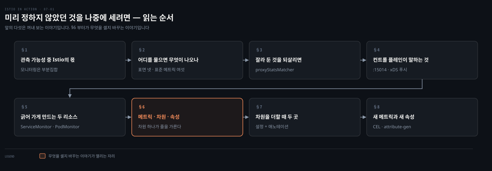
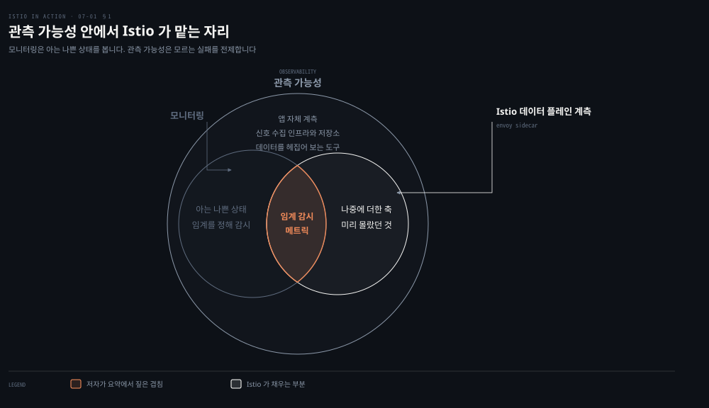
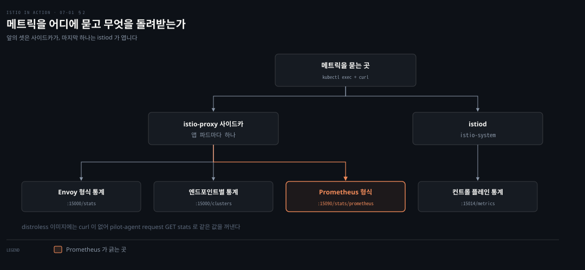
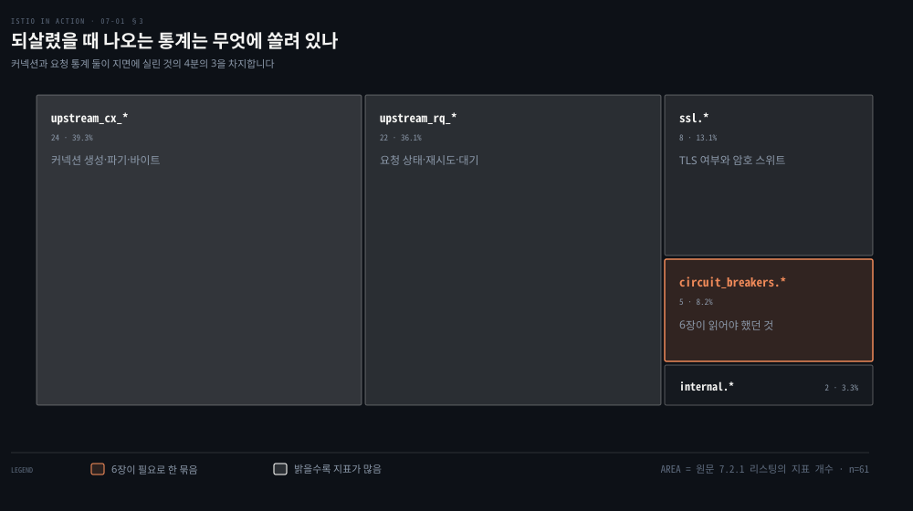
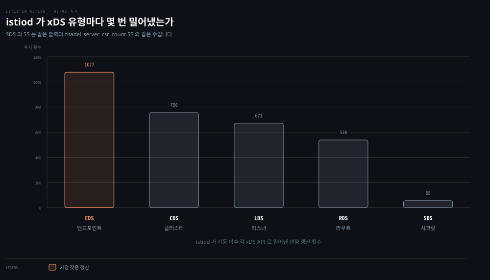
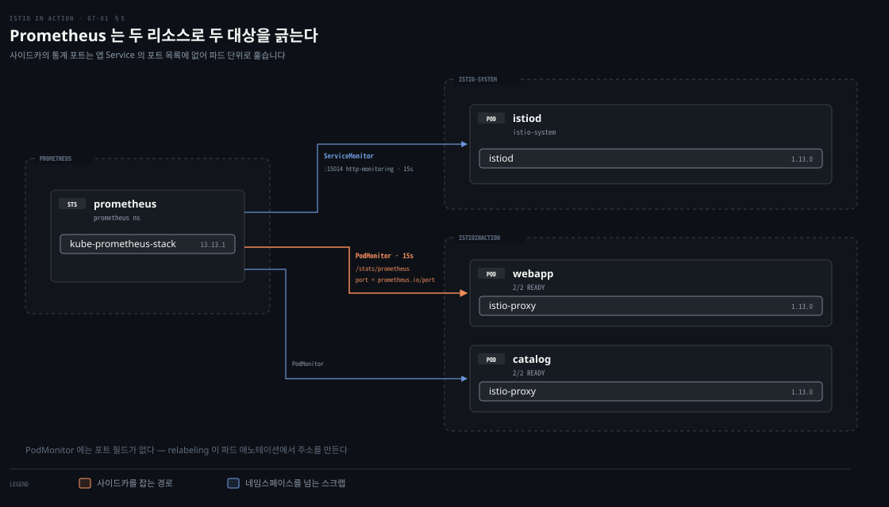
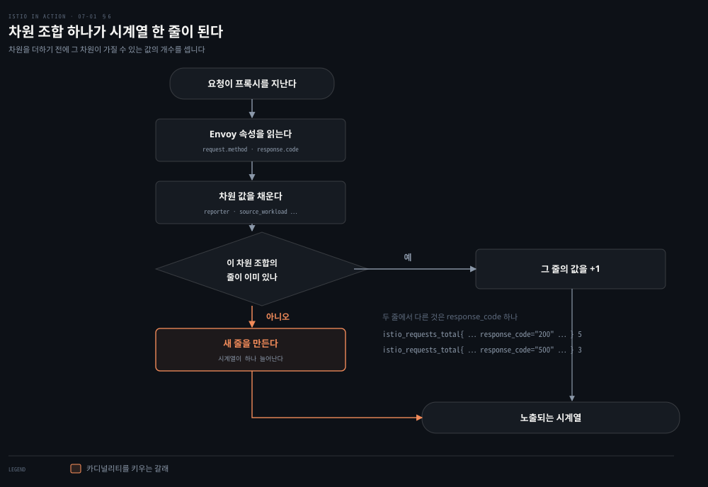
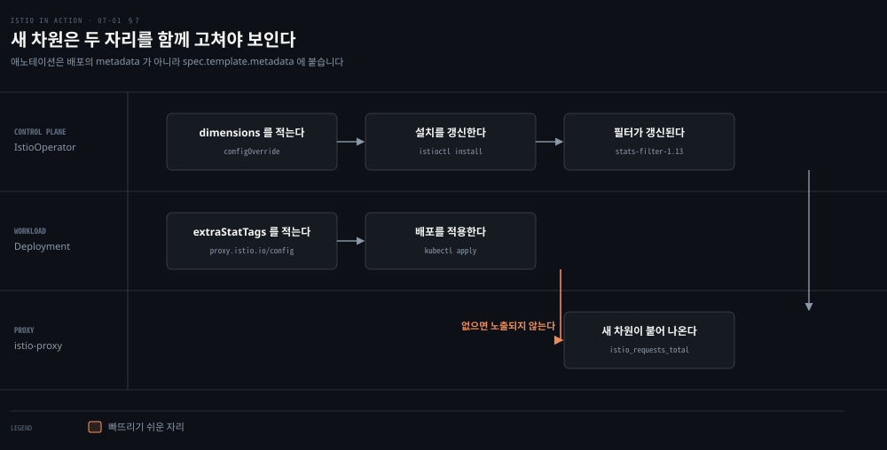
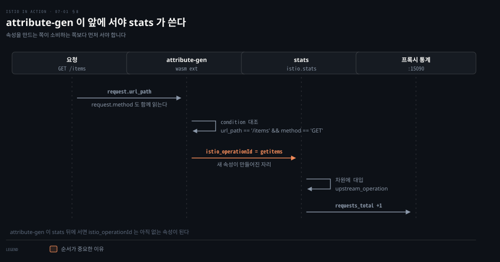

# 미리 정하지 않았던 것을 나중에 세려면

---

> 7장은 메시가 만들어 내는 메트릭을 다룹니다. 프록시와 컨트롤 플레인이 각각 무엇을 세고 있는지 보고, Prometheus가 그것을 긁어 가게 만듭니다. 그 다음 표준 메트릭에 차원을 더하거나 새 메트릭을 정의합니다. 저자는 관측 가능성이 도구 이름이 아니라 시스템의 성질이라는 말로 장을 엽니다.


## 핵심 요약

> 이 장 전체가 매달린 하나의 생각은 **관측 가능성이란 미리 알 수 없는 실패를 전제하는 태도이므로, 무엇을 셀지가 배포 시점에 굳으면 안 된다**는 것입니다. 저자가 장의 절반을 커스터마이즈에 쓰는 이유를 이 노트는 그렇게 읽습니다.

저자는 모니터링과 관측 가능성을 가릅니다. 모니터링은 아는 나쁜 상태를 감시하고, 관측 가능성은 모르는 실패 모드를 전제합니다. 그래서 고카디널리티 데이터까지 모아 두고 나중에 캐물어야 합니다. Istio는 그중 애플리케이션 계층 네트워크 계측 한 조각만 맡습니다.

그 한 조각 안에서도 프록시는 기본으로 대부분을 잘라 둡니다. 손잡이는 셋입니다. 잘라 둔 것을 되살리는 것, 표준 메트릭에 차원을 더하는 것, 아예 새 메트릭을 정의하는 것입니다. 셋 모두 두 곳을 함께 고쳐야 작동합니다. 컨트롤 플레인에서 무엇을 셀지 정하고, 워크로드에서 그것을 내보내도 좋다고 다시 허락해야 합니다.


## 학습 목표

이 내용을 읽고 나면:

1. 저자가 모니터링과 관측 가능성을 어떻게 가르는지, 그중 Istio가 맡는 부분이 어디까지인지 말할 수 있습니다.
2. 프록시와 컨트롤 플레인의 네 질의 표면을 구분하고 각각 무엇을 돌려주는지 압니다.
3. 프록시가 기본으로 잘라 둔 통계를 메시 전역과 워크로드별 중 어느 쪽으로 되살릴지 판단할 수 있습니다.
4. 메트릭·차원·속성 세 낱말을 구분하고, 차원 하나가 카디널리티에 무엇을 하는지 설명할 수 있습니다.
5. 차원을 더하거나 메트릭을 새로 만들 때 왜 설정을 두 군데 넣어야 하는지 압니다.

아래는 이 문서 전체를 읽는 순서로 이은 지도입니다. 칸마다 절 번호와 그 절이 답하는 질문 하나를 적었습니다. 색이 붙은 칸이 이 장의 나머지 절반을 여는 자리, 곧 무엇을 셀지 나중에 바꾸는 이야기가 시작되는 지점입니다.




## 이 문서가 다루지 않는 것

> 이 폴더 밖에 이미 관측 카테고리가 있습니다. 겹치는 것은 옮겨 적지 않고 링크로 넘깁니다.

`write/06_observability/`에는 마크다운 문서 86개가 있고 그중 `mastering_prometheus` 정독본 본편만 24편입니다. 7장이 다루는 내용 상당 부분이 그 안에 이미 SSOT를 갖고 있어, 이 노트는 그것을 되풀이하지 않습니다.

- 관측 가능성과 모니터링의 정의, Prometheus가 pull 방식을 고른 이유: [관측 가능성·모니터링·Prometheus의 자리](../../../06_observability/book/mastering_prometheus/01-01.%EA%B4%80%EC%B8%A1%20%EA%B0%80%EB%8A%A5%EC%84%B1%C2%B7%EB%AA%A8%EB%8B%88%ED%84%B0%EB%A7%81%C2%B7Prometheus%EC%9D%98%20%EC%9E%90%EB%A6%AC.md)
- kube-prometheus 스택 구성과 Prometheus Operator, `ServiceMonitor`·`PodMonitor` 리소스 자체: [Prometheus 배포](../../../06_observability/book/mastering_prometheus/02-01.Prometheus%20%EB%B0%B0%ED%8F%AC%20%E2%80%94%20%EC%8A%A4%ED%83%9D%20%EA%B5%AC%EC%84%B1%EC%9A%94%EC%86%8C%EC%99%80%20Operator.md)
- `relabelings` 문법과 `__meta_kubernetes_*` 라벨: [서비스 디스커버리와 relabeling](../../../06_observability/book/mastering_prometheus/04-01.%EC%84%9C%EB%B9%84%EC%8A%A4%20%EB%94%94%EC%8A%A4%EC%BB%A4%EB%B2%84%EB%A6%AC%EC%99%80%20relabeling.md)
- PromQL 질의: [PromQL 기초](../../../06_observability/book/mastering_prometheus/03-04.PromQL%20%EA%B8%B0%EC%B4%88.md)
- 골든 시그널·RED·USE: [시그널 모델](../../../06_observability/01_Foundations/01-03.%EC%8B%9C%EA%B7%B8%EB%84%90%20%EB%AA%A8%EB%8D%B8%20%E2%80%94%20Golden%20Signals%2C%20RED%2C%20USE.md)

남는 것은 **메시가 있어야만 생기는 이야기**입니다. 프록시가 요청 경로에 앉아 있어서 셀 수 있는 것, 그 프록시가 기본으로 감춰 둔 것, 그리고 애플리케이션 코드를 건드리지 않고 세는 축을 바꾸는 방법입니다.

Grafana·Jaeger·Kiali로 시각화하는 이야기는 8장이 맡고, 컨트롤 플레인 메트릭을 성능 튜닝에 쓰는 이야기는 11장이 맡습니다. 저자 자신이 두 장으로 미뤄 둔 부분이라 여기서 앞당기지 않습니다.


## 1. 관측 가능성이 요구하는 것 중 Istio의 몫
> 서비스가 수백 개로 늘면 시스템의 어느 부분인가는 늘 저하된 상태로 돌아갑니다. 저자는 이 상황을 전제로 두고 출발합니다. 애플리케이션을 더 견고하게 만드는 것만으로는 부족하고, 돌아가는 동안 무슨 일이 벌어지는지 이해할 도구가 함께 있어야 한다는 것입니다.



저자는 관측 가능성을 제어 이론에서 끌어옵니다. 외부 신호와 특성만 보고 시스템의 내부 상태를 이해하고 추론할 수 있는 정도가 관측 가능성이라는 정의입니다. 1960년 칼만(Rudolf E. Kálmán)의 논문 「On the General Theory of Control Systems」에 근거를 둡니다.

그 다음에 모니터링과의 관계를 못 박습니다. **모니터링은 관측 가능성의 부분집합입니다.** 모니터링은 메트릭을 모아 미리 정해 둔 나쁜 상태와 맞춰 보고 임계를 넘으면 알립니다. 디스크 사용량이 용량에 가까워지면 알림을 띄워 디스크를 늘리는 식입니다.

관측 가능성은 반대쪽에서 출발합니다. 시스템이 예측 불가능하고 가능한 실패 모드를 미리 다 알 수 없다고 가정합니다. 그래서 사용자 ID·요청 ID·출발지 IP처럼 조합이 기하급수로 커지는 고카디널리티 데이터까지 모아 두고, 나중에 그 데이터에 질문을 던질 도구가 필요합니다.

저자가 든 장면이 이 차이를 잘 보입니다. 사용자 ID 400000021번 John Doe가 결제 수단을 고르는 데 10초를 기다립니다. 그런데 디스크 사용량·큐 깊이·머신 건강 같은 미리 정해 둔 임계는 전부 정상입니다. 관측 가능성을 염두에 두고 설계했다면 그 요청이 지나간 정확한 경로를 여러 계층을 헤집어 찾아낼 수 있습니다.

Istio가 이 그림에서 차지하는 자리는 좁습니다. 저자는 관측 가능성이 기성품 솔루션이 아니라 여러 층이 얽힌 성질이라고 적고, 필요한 재료를 넷으로 셉니다.

- 애플리케이션 계측: 코드가 스스로 내보내는 신호
- 네트워크 계측: 요청이 오갈 때 관찰되는 신호
- 신호 수집 인프라와 데이터베이스: 그 신호를 모아 두는 곳
- 방대한 데이터를 헤집어 그림을 맞추는 방법

그리고 한 문장으로 범위를 못 박습니다. Istio는 그중 하나, 애플리케이션 수준 네트워크 계측을 돕습니다. 데이터 플레인 프록시가 서비스 사이 요청 경로에 앉아 있기 때문에 초당 요청 수·백분위로 나눈 지연·실패한 요청 수를 잡을 수 있습니다.

이 절이 뒤의 절반과 이어지는 지점은 저자의 다음 문장입니다. Istio는 **미리 생각하지 못했던 정보를 잡으려고 새 메트릭을 동적으로 추가하는 일**도 돕습니다. §6부터 §8이 그 문장을 설정으로 풀어낸 것입니다.

한 가지 실습 조건이 앞에 붙습니다. 저자는 2장에서 설치했던 샘플 애드온을 먼저 지웁니다. `samples/addons/`의 Prometheus·Grafana·Kiali는 데모용이므로, 이 장부터는 좀 더 현실에 가까운 구성을 따로 세웁니다.

```bash
cd istio-1.13.0
kubectl delete -f samples/addons/
```


## 2. 어디를 물으면 무엇이 나오는가
> 메트릭을 보려면 어디에 물어야 하는지부터 정해야 합니다. 프록시 하나에도 포트와 경로가 여럿이고, 같은 숫자가 다른 형식으로 두 번 나오기도 합니다.



저자가 이 장에서 두드리는 표면은 넷입니다. 앞의 셋은 데이터 플레인 프록시가 열어 두고, 마지막 하나는 컨트롤 플레인이 엽니다.

```bash
kubectl exec -it deploy/webapp -c istio-proxy -- curl localhost:15000/stats
kubectl exec -it deploy/webapp -c istio-proxy -- curl localhost:15000/clusters
kubectl exec -it deploy/webapp -c istio-proxy -- curl localhost:15090/stats/prometheus
kubectl exec -it -n istio-system deploy/istiod -- curl localhost:15014/metrics
```

`:15000`은 3장에서 본 Envoy Admin API입니다. `/stats`는 Envoy 자신의 형식으로, `:15090/stats/prometheus`는 Prometheus가 기대하는 형식으로 같은 계열의 값을 냅니다. Prometheus가 실제로 긁어 가는 곳은 뒤쪽입니다.

여기 실습에 걸리는 조건이 하나 있습니다. Istio는 보안을 위해 `pilot-agent`를 돌릴 최소 의존만 담은 distroless 이미지를 제공하는데, `curl`이 거기 들어가지 못합니다. 그래서 `pilot-agent`에 엔드포인트를 질의하는 최소 CLI가 붙어 있습니다.

```bash
kubectl exec -it deploy/webapp -c istio-proxy -- pilot-agent request GET stats
kubectl exec -it deploy/webapp -c istio-proxy -- pilot-agent request GET help
```

`/stats`를 그냥 두드리면 출력이 쏟아집니다. 대부분은 프록시가 컨트롤 플레인에 붙어 있는 상태, 클러스터·리스너 업데이트가 몇 번 일어났는지 같은 상위 통계입니다. 요청·응답 수준 메트릭도 그 안에 묻혀 있습니다.

묻혀 있는 한 줄은 이렇게 생겼습니다. 저자가 원문에서 잘라 보인 것을 줄여 옮깁니다.

```bash
reporter=.=destination;.;source_workload=.=istio-ingressgateway;.;
source_workload_namespace=.=istio-system;.;
destination_workload=.=webapp;.;destination_workload_namespace=.=istioinaction;.;
request_protocol=.=http;.;response_flags=.=-;.;
connection_security_policy=.=mutual_tls;.;response_code=.=200;.;
istio_requests_total: 2
```

이 줄에서 가장 중요한 것은 맨 끝의 `istio_requests_total: 2`입니다. 앞의 긴 꼬리는 전부 그 값을 한정하는 조건입니다. ingress 게이트웨이에서 webapp으로 들어온 요청이 지금까지 두 번이라는 뜻입니다.

저자는 이어서 튜닝 없이 얻는 표준 메트릭을 나열합니다. 그리고 장 뒤쪽 표 7.1에서 같은 목록을 타입과 함께 다시 냅니다. 두 목록이 서로 다릅니다.

| 메트릭 | 타입 | 뜻 |
|---|---|---|
| `istio_requests_total` | COUNTER | 프록시를 지나는 요청마다 증가 |
| `istio_request_duration_milliseconds` | DISTRIBUTION | 요청 처리 시간 분포 |
| `istio_request_bytes` | DISTRIBUTION | 요청 본문 크기 |
| `istio_response_bytes` | DISTRIBUTION | 응답 본문 크기 |
| `istio_request_messages_total` | COUNTER | gRPC에서 클라이언트가 보낸 메시지 |
| `istio_response_messages_total` | COUNTER | gRPC에서 서버가 보낸 메시지 |

> **원문 정오**: 7.2.1의 목록과 표 7.1이 어긋납니다. 7.2.1은 다섯을 나열하며 그것들을 "histograms"라 부르는데, 그 안에 `istio_request_duration`이 들어 있습니다. 공식 표준 메트릭 문서에 그런 이름은 없고 `istio_request_duration_milliseconds`만 있습니다.[^istio-metrics] 표 7.1에도 없습니다. 같은 문장의 "histograms"라는 표현도 맞지 않습니다. `istio_requests_total`은 표 7.1과 공식 문서 양쪽에서 COUNTER입니다. 위 표는 표 7.1과 공식 문서가 일치하는 여섯만 남긴 것입니다.


## 3. 기본으로 잘라 둔 것을 되살리면
> 표준 메트릭만으로 안 풀리는 문제가 있습니다. 6장에서 서킷 브레이킹이 실제로 끊었는지 확인하려면 `upstream_cx_overflow` 같은 Envoy 자체 통계를 봐야 했습니다. 그런데 프록시는 그런 통계 대부분을 기본으로 잘라 둡니다.



잘라 둔 것을 되살리는 손잡이는 `proxyStatsMatcher`이고, 넣을 자리는 둘입니다. 하나는 설치 시점의 메시 전역 설정입니다.

```yaml
apiVersion: install.istio.io/v1alpha1
kind: IstioOperator
metadata:
  name: control-plane
spec:
  profile: demo
  meshConfig:
    defaultConfig:
      proxyStatsMatcher:
        inclusionPrefixes:
        - "cluster.outbound|80||catalog.istioinaction"
```

저자는 이 방법에 곧바로 경고를 답니다. 메시 전체에서 수집 메트릭을 늘리면 수집 시스템이 과부하될 수 있으므로 신중해야 합니다. 더 나은 접근은 워크로드마다 애노테이션으로 지정하는 것입니다.

```yaml
metadata:
  annotations:
    proxy.istio.io/config: |
      proxyStatsMatcher:
        inclusionPrefixes:
        - "cluster.outbound|80||catalog.istioinaction"
```

되살린 뒤 `catalog`로 필터해 보면 무엇이 나오는지가 이 절의 내용입니다. 저자는 출력이 방대하다며 일부만 싣는데, 그 일부만 세어도 61개입니다. 위 도식의 면적이 그 61개의 묶음별 비중입니다.

- `circuit_breakers.*` 5개: 커넥션·요청 한계가 지금 열려 있는지
- `internal.*` 2개: 메시 안에서 온 요청 중 성공한 수
- `ssl.*` 8개: 업스트림으로 가는 트래픽이 TLS를 타는지, 어떤 암호 스위트와 곡선을 쓰는지
- `upstream_cx_*` 24개: 커넥션의 생성·파기·바이트 수
- `upstream_rq_*` 22개: 요청의 상태·재시도·대기·타임아웃

저자가 든 내부·외부 구분이 여기 한 번 나옵니다. Envoy는 메시 안에서 온 트래픽을 internal로, 메시 밖에서 들어온 트래픽을 external로 봅니다. ingress 게이트웨이로 들어오는 요청이 후자입니다.

`/clusters`는 같은 대상을 다른 단위로 봅니다. `/stats`가 클러스터 전체의 합이라면, `/clusters`는 그 클러스터에 속한 엔드포인트 하나하나를 보입니다.

```bash
outbound|80||catalog::10.1.0.71:3000::rq_success::1
outbound|80||catalog::10.1.0.71:3000::health_flags::healthy
outbound|80||catalog::10.1.0.71:3000::region::
outbound|80||catalog::10.1.0.71:3000::zone::
outbound|80||catalog::10.1.0.71:3000::success_rate::-1.0
```

6장에서 설정했던 것들이 여기 값으로 보입니다. `region`·`zone`·`sub_zone`은 지역 인식 로드밸런싱이 배분을 계산할 때 읽는 자리이고, `success_rate`는 이상치 감지가 판정에 쓰는 값입니다. 이 출력에서는 셋이 비어 있고 `success_rate`가 `-1.0`인데, 저자는 그 이유를 설명하지 않습니다.


## 4. 컨트롤 플레인이 자기에 대해 말하는 것
> 데이터 플레인만 보면 절반입니다. 설정이 프록시에 얼마나 빨리 닿는지, 인증서가 언제 만료되는지는 istiod 쪽에서만 알 수 있습니다.



`:15014/metrics`가 돌려주는 것 중 저자가 짚은 것은 다섯 계열입니다.

첫째는 인증서입니다. 워크로드 인증서 요청에 서명하는 루트 인증서가 언제 만료되는지, CSR이 몇 건 들어왔고 몇 건 발급됐는지가 나옵니다.

```bash
citadel_server_root_cert_expiry_timestamp 1.933249372e+09
citadel_server_csr_count 55
citadel_server_success_cert_issuance_count 55
```

둘째는 버전입니다. `istio_build{component="pilot",tag="1.13.0"} 1` 한 줄이 컨트롤 플레인이 어느 버전으로 도는지 알려 줍니다.

셋째가 이 계열에서 가장 중요합니다. 설정 변경이 프록시에 전파되어 수렴하기까지 걸린 시간의 분포입니다.

```bash
pilot_proxy_convergence_time_bucket{le="0.1"} 1101
pilot_proxy_convergence_time_bucket{le="0.5"} 1102
pilot_proxy_convergence_time_bucket{le="1"} 1102
pilot_proxy_convergence_time_sum 11.862998399999995
pilot_proxy_convergence_time_count 1102
```

누적 히스토그램이라 `le="0.1"`의 1101은 0.1 이하가 1101건이라는 뜻입니다. `le="0.5"`가 1102이므로 나머지 한 건이 0.1과 0.5 사이에 들어갑니다.

> **원문 정오**: 그 한 건을 설명하는 원문 주석이 본문과 어긋납니다. 본문은 "1,101건이 10분의 1초 미만"이라 적는데, 바로 아래 첫 번째 주석은 "0.1 밀리초 미만"이라 적습니다. 초가 맞습니다. Istio 소스의 이 메트릭 정의는 도움말을 "Delay in **seconds** between config change and a proxy receiving all required configuration"으로 두고 버킷을 `.1, .5, 1, 3, 5, 10, 20, 30`으로 잡습니다.[^convergence] 원문에 실린 버킷 경계가 이 여덟과 정확히 같으므로 같은 메트릭이고, 따라서 단위는 초입니다. 본문의 "10분의 1초"가 맞고 주석이 틀렸습니다.

넷째는 컨트롤 플레인이 아는 규모입니다. 서비스 14개, VirtualService 1개, 중복 도메인 0개, xDS로 붙어 있는 엔드포인트 4개가 나옵니다. 다섯째가 위 도식이 그린 xDS 유형별 푸시 횟수입니다.

| 유형 | 푸시 횟수 | 3장에서 본 이름 |
|---|---|---|
| EDS | 1,077 | 엔드포인트 디스커버리 |
| CDS | 756 | 클러스터 디스커버리 |
| LDS | 671 | 리스너 디스커버리 |
| RDS | 538 | 라우트 디스커버리 |
| SDS | 55 | 시크릿 디스커버리 |

EDS가 가장 많은 것이 3장의 설명과 맞습니다. 파드가 뜨고 지는 일은 리스너나 라우트가 바뀌는 일보다 훨씬 잦고, 그때마다 엔드포인트 목록이 다시 나갑니다. SDS의 55는 위 인증서 계열의 `csr_count 55`와 같은 숫자입니다.

이 계열을 성능 튜닝에 쓰는 방법은 11장의 몫이라 여기서는 이름과 자리만 잡아 둡니다.


## 5. Prometheus가 긁어 가게 만드는 두 리소스
> 프록시가 아무리 잘 세어도 서비스마다 들어가 `kubectl exec`로 꺼내 볼 수는 없습니다. 수집기가 대신 긁어 가야 합니다. 그런데 컨트롤 플레인과 데이터 플레인은 잡는 방법이 다릅니다.



저자는 데모용 애드온 대신 `kube-prometheus-stack` Helm 차트를 씁니다. 로컬 Docker Desktop을 감당할 수 있게 구성요소를 조금 덜어 낸 값 파일을 함께 넘깁니다.

```bash
helm repo add prometheus-community https://prometheus-community.github.io/helm-charts
helm repo update
kubectl create ns prometheus
helm install prom prometheus-community/kube-prometheus-stack \
  --version 13.13.1 -n prometheus -f ch7/prom-values.yaml
```

갓 배포한 Prometheus는 Istio 워크로드를 긁을 줄 모릅니다. 대상을 알려 주는 것이 Prometheus Operator의 두 커스텀 리소스입니다.[^prom-operator] 컨트롤 플레인에는 `ServiceMonitor`를 씁니다.

```yaml
apiVersion: monitoring.coreos.com/v1
kind: ServiceMonitor
metadata:
  name: istio-component-monitor
  namespace: prometheus
spec:
  targetLabels: [app]
  selector:
    matchExpressions:
    - {key: istio, operator: In, values: [pilot]}
  namespaceSelector:
    any: true
  endpoints:
  - port: http-monitoring
    interval: 15s
```

데이터 플레인에는 `PodMonitor`를 씁니다. 저자는 둘을 나란히 보이기만 하고 왜 갈리는지는 적지 않습니다. 이 노트는 두 리소스가 대상을 고르는 방식의 차이로 읽습니다. `ServiceMonitor`는 Service를 고른 뒤 그 Service가 이름 붙인 포트를 긁고, `PodMonitor`는 파드를 직접 훑습니다. 사이드카의 통계 포트는 애플리케이션 Service의 포트 목록에 들어 있지 않으므로 앞의 방식으로는 닿지 않습니다.

```yaml
apiVersion: monitoring.coreos.com/v1
kind: PodMonitor
metadata:
  name: envoy-stats-monitor
  namespace: prometheus
spec:
  selector:
    matchExpressions:
    - {key: istio-prometheus-ignore, operator: DoesNotExist}
  namespaceSelector:
    any: true
  podMetricsEndpoints:
  - path: /stats/prometheus
    interval: 15s
    relabelings:
    - action: keep
      sourceLabels: [__meta_kubernetes_pod_container_name]
      regex: "istio-proxy"
```

`relabelings`의 첫 규칙이 컨테이너 이름이 `istio-proxy`인 것만 남깁니다. 파드 단위로 훑되 사이드카 컨테이너만 골라내는 방식입니다. 셀렉터가 `istio-prometheus-ignore` 라벨이 **없는** 파드를 고르는 것도 같은 성격입니다. 기본이 수집이고 예외를 라벨로 빼는 구조입니다.

주의할 점이 하나 있습니다. 이 `PodMonitor`에는 포트를 적는 필드가 없습니다. 생략한 `relabelings` 규칙 하나가 `__address__`를 파드의 `prometheus.io/port` 애노테이션 값으로 바꿔 씁니다. 긁어 가는 포트는 이 설정이 아니라 주입된 애노테이션이 정하므로, §2에서 직접 두드린 `:15090`과 같은 포트라고 단정할 수 없습니다.

`relabelings` 나머지 규칙과 `__meta_kubernetes_*` 라벨의 의미는 이 노트의 범위 밖입니다. 앞서 링크한 relabeling 편이 그쪽 SSOT입니다.


## 6. 메트릭·차원·속성
> 여기부터 장의 성격이 바뀝니다. 앞의 다섯 절이 이미 있는 것을 꺼내 보는 이야기였다면, 남은 절은 무엇을 셀지 자체를 바꾸는 이야기입니다. 그러려면 낱말 세 개를 먼저 갈라야 합니다.



- **메트릭**: 서비스 호출 사이의 텔레메트리를 담는 counter·gauge·histogram
- **차원**: 그 메트릭을 쪼개는 축. inbound인지 outbound인지가 한 예
- **속성**: Envoy가 런타임에 들고 있는 값. 차원의 값이 여기서 나옵니다

`istio_requests_total`은 서비스로 들어오는 요청과 서비스에서 나가는 요청을 모두 셉니다. 그래서 한 서비스가 양쪽 트래픽을 다 가지면 이 메트릭이 두 줄로 보입니다. 방향은 차원 하나의 예일 뿐이고, 기본 차원은 20개가 넘습니다.

저자가 실은 기본 차원 목록에는 응답 코드, 메트릭을 기록한 관점, 호출한 쪽, 호출된 쪽이 섞여 있습니다. `reporter`가 그중 관점을 나타냅니다. 같은 호출을 보내는 쪽 프록시와 받는 쪽 프록시가 각각 기록하므로, 어느 쪽이 기록한 값인지 구분해야 합니다.

이 구조의 결과가 이 절의 요점입니다. **차원이 하나라도 다르면 같은 메트릭이 새 줄로 갈립니다.**

```bash
istio_requests_total{response_code="200", reporter="destination",
  source_workload="istio-ingressgateway", destination_workload="webapp",
  request_protocol="http", connection_security_policy="mutual_tls"} 5
istio_requests_total{response_code="500", reporter="destination",
  source_workload="istio-ingressgateway", destination_workload="webapp",
  request_protocol="http", connection_security_policy="mutual_tls"} 3
```

두 줄에서 다른 것은 `response_code` 하나입니다. 나머지가 전부 같아도 줄이 갈립니다. 차원을 하나 더할 때 시계열 수가 그 차원이 가질 수 있는 값의 개수만큼 곱해진다는 뜻이고, 저자가 차원을 더하는 예제마다 `tags_to_remove`를 함께 보이는 이유가 이것입니다.

차원의 값을 대는 속성은 두 곳에서 옵니다. 하나는 Envoy가 기본으로 들고 있는 것입니다. 저자가 표 7.2에 실은 요청 속성 11개는 현재 공식 문서에도 같은 이름으로 있습니다.[^envoy-attrs]

```bash
request.path        request.url_path     request.host      request.scheme
request.method      request.headers      request.referer   request.useragent
request.time        request.id           request.protocol
```

요청 말고도 응답·커넥션·업스트림·메타데이터와 필터 상태·Wasm 속성이 있습니다. 다른 하나는 Istio가 프록시에 넣어 둔 peer-metadata 필터가 보태는 것입니다. 파드 이름·네임스페이스·워크로드 라벨·소유자·프록시 버전·메시 ID·클러스터 ID 같은 것들이고, 쓸 때는 `upstream_peer` 또는 `downstream_peer`를 접두로 붙입니다.

호출한 쪽 프록시의 Istio 버전을 가리키려면 `downstream_peer.istio_version`이라 쓰고, 업스트림 서비스의 클러스터를 가리키려면 `upstream_peer.cluster_id`라 씁니다.


## 7. 차원을 더할 때는 두 곳을 고친다
> 이제 실제로 차원을 붙여 봅니다. 저자가 든 동기는 업그레이드 추적입니다. 업스트림 호출 상대의 프록시가 어느 버전인지, 어느 메시에 속하는지를 메트릭에 남겨 두려는 것입니다.



먼저 알아 둘 것이 있습니다. Istio 메트릭은 `stats`라는 프록시 플러그인이 만들고, 그 플러그인은 설치 때 함께 들어오는 `EnvoyFilter` 리소스로 설정됩니다.

```bash
kubectl get envoyfilter -n istio-system
# stats-filter-1.11  stats-filter-1.12  stats-filter-1.13
# tcp-stats-filter-1.11  tcp-stats-filter-1.12  tcp-stats-filter-1.13
```

`stats-filter-1.13`을 열어 보면 `istio.stats`라는 필터를 `envoy.filters.http.router` 앞에 끼워 넣는 패치가 들어 있습니다. 이 필터는 WebAssembly 플러그인인데, 실제로는 Envoy 코드베이스에 직접 컴파일되어 NULL VM에서 돕니다. 진짜 Wasm VM으로 돌리려면 설치 때 `values.telemetry.v2.prometheus.wasmEnabled=true`를 넘겨야 합니다.

차원을 더하는 설정은 `IstioOperator`에 들어갑니다. 주의할 점은 같은 내용을 세 면에 반복해야 한다는 것입니다.

```yaml
apiVersion: install.istio.io/v1alpha1
kind: IstioOperator
spec:
  profile: demo
  values:
    telemetry:
      v2:
        prometheus:
          configOverride:
            inboundSidecar:
              metrics:
              - name: requests_total
                dimensions:
                  upstream_proxy_version: upstream_peer.istio_version
                  source_mesh_id: node.metadata['MESH_ID']
                tags_to_remove:
                - request_protocol
            outboundSidecar:
              metrics:
              - name: requests_total
                dimensions:
                  upstream_proxy_version: upstream_peer.istio_version
                  source_mesh_id: node.metadata['MESH_ID']
                tags_to_remove:
                - request_protocol
```

메트릭 이름을 `requests_total`로 적은 것에 유의합니다. `istio_` 접두는 자동으로 붙습니다. `gateway` 면까지 세 곳에 같은 블록을 넣어야 게이트웨이가 기록하는 값에도 같은 차원이 붙습니다.

이것만으로는 새 차원이 보이지 않습니다. 프록시에 그 차원의 존재를 따로 알려야 합니다. 배포의 파드 템플릿에 애노테이션을 답니다.

```yaml
spec:
  template:
    metadata:
      annotations:
        proxy.istio.io/config: |
          extraStatTags:
          - "upstream_proxy_version"
          - "source_mesh_id"
```

저자가 이 지점에 밑줄을 긋습니다. 애노테이션은 `spec.template.metadata`의 파드 템플릿에 붙어야 하고, 배포 자신의 `metadata`에 붙이면 듣지 않습니다. 산문은 이 애노테이션을 `sidecar.istio.io/extraStatTags`라 부르는데 함께 실은 YAML은 `proxy.istio.io/config` 안의 `extraStatTags` 필드를 씁니다. 이 장의 다른 예제와 맞는 것은 뒤의 형태입니다.

둘을 다 넣고 호출하면 메트릭에 새 차원 둘이 나타납니다. 저자는 `tags_to_remove`로 뺀 `request_protocol`이 차원 목록에서 사라졌다고 적고, 이미 생성된 기존 메트릭에는 그 차원이 그대로 남아 있다는 단서를 답니다.

> **원문 정오**: 그런데 그 문장이 가리키는 출력 자체에 `request_protocol="http"`가 찍혀 있습니다. 출력과 산문이 어긋납니다. 저자가 단 단서대로 이 값이 설정 이전에 생성된 메트릭이라면 새 차원 둘도 함께 없어야 하는데, `upstream_proxy_version`과 `source_mesh_id`는 같은 블록에 들어 있습니다. 두 조건을 동시에 만족하는 출력은 없습니다. 설정을 적용하기 전의 출력에 새 차원만 손으로 얹은 것으로 읽힙니다.

전역 설정 대신 네임스페이스나 워크로드 하나에만 적용하고 싶으면 Telemetry API를 씁니다. Istio 1.12에 들어왔고 저자가 쓰던 1.13 시점에는 alpha였습니다. 지금은 `telemetry.istio.io/v1`로 안정 버전이 되었고 메트릭·추적·액세스 로깅 셋을 한 리소스에서 다룹니다.[^telemetry-api]


## 8. 새 메트릭과 새 속성
> 차원을 더하는 것으로 모자랄 때가 있습니다. 저자가 드는 질문은 구체적입니다. `catalog` 서비스의 `/items` 엔드포인트로 간 GET 호출만 세려면 어떻게 하느냐는 것입니다.



먼저 새 메트릭을 만드는 쪽입니다. `metrics` 대신 `definitions`를 씁니다.

```yaml
configOverride:
  inboundSidecar:
    definitions:
    - name: get_calls
      type: COUNTER
      value: "(request.method.startsWith('GET') ? 1 : 0)"
```

`value`는 CEL(Common Expression Language) 표현식이고, `COUNTER` 타입이면 정수를 반환해야 합니다. `GAUGE`와 `HISTOGRAM`도 고를 수 있습니다. 표현식이 다루는 대상이 §6에서 본 속성입니다.

노출하려면 여기서도 애노테이션을 한 번 더 답니다. 이번에는 `extraStatTags`가 아니라 `proxyStatsMatcher`입니다. §3에서 잘라 둔 통계를 되살릴 때 쓴 것과 같은 손잡이입니다. 여기서도 산문은 `sidecar.istio.io/statsInclusionPrefixes`라 부르고 YAML은 `proxy.istio.io/config` 안의 `proxyStatsMatcher`를 씁니다.

```yaml
annotations:
  proxy.istio.io/config: |
    proxyStatsMatcher:
      inclusionPrefixes:
      - "istio_get_calls"
```

그런데 이 메트릭은 시스템 전체의 GET 호출을 셀 뿐입니다. 특정 API로 좁히려면 속성 자체를 새로 만들어야 합니다. 여기서 두 번째 Wasm 확장인 `attribute-gen` 플러그인이 나옵니다.

이 플러그인은 `stats` 앞에 겹쳐 섭니다. 순서가 중요합니다. 앞에 서야 자기가 만든 속성을 뒤의 `stats`가 쓸 수 있습니다. 설정은 `EnvoyFilter`로 넣습니다.

```yaml
{
  "attributes": [
    {
      "output_attribute": "istio_operationId",
      "match": [
        { "value": "getitems",
          "condition": "request.url_path == '/items' && request.method == 'GET'" },
        { "value": "createitem",
          "condition": "request.url_path == '/items' && request.method == 'POST'" },
        { "value": "deleteitem",
          "condition": "request.url_path == '/items' && request.method == 'DELETE'" }
      ]
    }
  ]
}
```

기존 속성 둘을 조합해 `istio_operationId`라는 새 속성을 만드는 설정입니다. 경로와 메서드의 조합마다 짧은 이름을 붙였습니다. 저자는 이것을 webapp에서 나가는 호출에 붙여 `catalog`의 `/items` 호출을 추적합니다. 이 대목의 산문은 조합한 속성을 `request.path_url`이라 적는데, 실제 설정과 Envoy 문서의 이름은 `request.url_path`입니다.[^envoy-attrs]

만든 속성은 차원으로 써야 메트릭에 나타납니다.

```yaml
configOverride:
  outboundSidecar:
    metrics:
    - name: requests_total
      dimensions:
        upstream_operation: istio_operationId
```

그리고 §7과 똑같이 `extraStatTags`에 `upstream_operation`을 추가해야 합니다. 새 차원을 만들 때마다 두 곳을 고치는 규칙이 여기서도 그대로입니다.

> **원문 정오**: 이 절 끝의 최종 출력이 본문 설명과 어긋납니다. 저자는 "나가는 호출(outgoing calls)의 `istio_requests_total`"이라 소개하는데, 이어 붙인 값은 `reporter="destination"`, `source_workload="istio-ingressgateway"`, `destination_workload="webapp"`입니다. webapp이 목적지인 인바운드 항목이고, 나가는 호출이라면 목적지가 `catalog`여야 합니다. 같은 블록의 `upstream_proxy_version="1.9.2"`도 7.4.1의 `{1.13.0}`과 다릅니다. 이 장의 컨트롤 플레인은 1.13.0입니다. 판 사이에 남은 옛 출력을 그대로 옮긴 것으로 읽힙니다.

저자가 장을 닫으며 남긴 경계가 있습니다. Istio가 성공률·실패율·재시도 수·지연 같은 골든 시그널 네트워크 메트릭을 개발자 코드 없이 모아 준다고 해서 애플리케이션 메트릭과 비즈니스 메트릭이 필요 없어지지는 않습니다. 둘은 여전히 필요하고, Istio가 대신하는 것은 네트워크 쪽 수집뿐입니다.


## 심화 학습

> 책 밖의 보강만 둡니다. 각 항목은 공식 1차 자료로 확인한 것입니다.

**표준 메트릭 목록은 TCP까지 있습니다.** 저자의 표 7.1은 HTTP와 gRPC 여섯 개만 실었습니다. 공식 문서에는 TCP 트래픽용 네 개가 더 있고 모두 COUNTER입니다.[^istio-metrics]

- `istio_tcp_sent_bytes_total`
- `istio_tcp_received_bytes_total`
- `istio_tcp_connections_opened_total`
- `istio_tcp_connections_closed_total`

4장에서 본 TCP 라우팅이나 SNI 패스스루 트래픽을 볼 때 필요한 것들입니다.

**`proxyStatsMatcher`에는 접두사 말고 두 가지가 더 있습니다.** 저자는 `inclusionPrefixes`만 씁니다. 공식 API에는 `inclusionSuffixes`와 `inclusionRegexps`도 있습니다.[^proxy-config] 접두로 자르기 어려운 통계를 고를 때 쓸 수 있습니다.

**Envoy 속성은 저자가 실은 것보다 늘었습니다.** 표 7.2의 11개는 지금도 같은 이름으로 존재합니다. 여기에 `request.query`와 `request.headers_bytes`가 더해졌고, 요청이 끝난 뒤에만 값을 갖는 `request.duration`·`request.size`·`request.total_size`가 따로 있습니다.[^envoy-attrs] 저자가 든 갈래는 요청을 포함해 여섯인데 공식 문서는 설정 속성(configuration attributes)을 더해 일곱으로 셉니다.

**Telemetry API는 안정 버전이 되었습니다.** 저자는 1.13 시점의 alpha라고 적고 공식 문서로 넘깁니다. 현재는 `telemetry.istio.io/v1`이고, 메시·네임스페이스·워크로드 세 수준으로 계층 적용되며 Gateway나 Service를 대상으로 지정할 수도 있습니다.[^telemetry-api] 저자가 쓴 `IstioOperator` 방식은 전역 설정이므로, 새로 구성한다면 Telemetry API를 먼저 검토하는 편이 낫습니다.

**CEL의 정수 타입은 두 가지입니다.** 저자는 `COUNTER`가 정수를 반환해야 한다고만 적습니다. Envoy 문서는 CEL에서 `7`이 `int`이고 `7u`가 `uint`이며 둘 사이 산술 변환이 자동으로 일어나지 않는다고 명시합니다.[^envoy-attrs] 표현식이 조용히 값을 못 내는 원인이 될 수 있습니다.


## 결정 치트시트

> 저자가 본문에서 근거를 밝힌 것만 담습니다. 판단 근거가 원문에 없는 줄은 넣지 않았습니다.

| 상황 | 고를 것 | 저자가 댄 근거 |
|---|---|---|
| 통계를 더 보고 싶은데 대상이 서비스 하나 | 워크로드 애노테이션 `proxy.istio.io/config` | 메시 전역으로 늘리면 수집 시스템이 과부하될 수 있음 |
| 메시 전체에 같은 통계가 필요 | `meshConfig.defaultConfig.proxyStatsMatcher` | 설치 시점의 기본 프록시 설정으로 한 번에 적용 |
| 클러스터 전체의 합이 필요 | `:15000/stats` | 클러스터 단위 통계를 제공 |
| 엔드포인트 하나하나가 필요 | `:15000/clusters` | 엔드포인트별 지역·건강 플래그·성공률을 제공 |
| Prometheus 형식이 필요 | `:15090/stats/prometheus` | Prometheus가 기대하는 형식으로 노출 |
| 컨트롤 플레인을 긁어야 함 | `ServiceMonitor` | `istio: pilot` 셀렉터로 서비스를 고름 |
| 데이터 플레인을 긁어야 함 | `PodMonitor` | 사이드카는 모든 파드에 들어 있어 파드 단위로 훑음 |
| 기존 메트릭을 다른 축으로 쪼개고 싶음 | `dimensions` | 속성 값을 차원으로 매핑 |
| 세는 조건 자체가 새로움 | `definitions` + CEL | 표현식으로 셀 조건을 직접 씀 |
| 여러 속성을 조합한 축이 필요 | `attribute-gen` 플러그인 | `stats` 앞에 서서 만든 속성을 `stats`가 씀 |
| 적용 범위를 네임스페이스로 좁히고 싶음 | Telemetry API | `IstioOperator`는 전역 설정 |


## 적용 관점

> 실무 규칙 하나와 경계 하나가 남습니다. 차원을 더하기 전에 값의 개수를 세는 것, 그리고 Istio가 답하지 못하는 질문을 애플리케이션 계측에 넘기는 것입니다.

이 장에서 실무로 곧장 넘어가는 규칙은 하나입니다. **차원을 더하기 전에 그 차원이 가질 수 있는 값의 개수를 먼저 셉니다.** §6에서 본 대로 차원 하나가 다르면 시계열이 갈리므로, 값이 100가지인 차원을 더하면 그 메트릭의 시계열이 100배가 됩니다. 저자가 차원을 더하는 예제마다 `tags_to_remove`를 함께 보인 것이 이 계산을 하라는 신호로 읽힙니다.

Spring 애플리케이션 관점에서는 경계가 하나 생깁니다. Istio가 모아 주는 것은 네트워크 계층에서 관찰되는 것뿐이라, 요청이 애플리케이션 안에서 어디에 시간을 썼는지는 알 수 없습니다. 커넥션 풀 대기인지 쿼리인지 직렬화인지는 Micrometer 쪽 계측이 답합니다. 저자가 장 끝에서 애플리케이션 메트릭이 여전히 필요하다고 못 박은 부분이 여기에 해당합니다.

두 계측을 같이 쓸 때 유용한 지점은 이름이 겹치지 않는다는 것입니다. Istio 쪽은 `istio_` 접두를 자동으로 붙이므로, 애플리케이션이 내보내는 메트릭과 대시보드에서 나란히 두어도 충돌하지 않습니다.


## 면접에서 받을 만한 질문
> 답을 먼저 떠올린 뒤 아래 정답 절을 펼칩니다.

1. 이 장을 한 줄로 정의하면 무엇입니까?
2. 모니터링은 관측 가능성의 부분집합입니다 — 이것을 근거와 함께 설명해 보십시오.
3. 프록시는 통계 대부분을 기본으로 잘라 둡니다 — 이것을 근거와 함께 설명해 보십시오.
4. 차원을 더하거나 메트릭을 새로 만들 때는 두 곳을 고칩니다 — 이것을 근거와 함께 설명해 보십시오.
5. `reporter` 차원은 왜 있습니까.
6. `ServiceMonitor` 하나로 데이터 플레인까지 잡을 수 없습니까.
7. 새 메트릭을 정의했는데 프록시에 안 보입니다.
8. `istio_get_calls`로 정의했는데 이름이 안 맞습니다.


## 정답 (자답 후 펼치기)

### 정답 1 — 한 줄 정의

관측 가능성은 외부 신호만 보고 시스템 내부 상태를 추론할 수 있는 정도이고, Istio는 그중 애플리케이션 계층 네트워크 계측 한 조각을 맡습니다.

### 정답 2 — 핵심 포인트

모니터링은 관측 가능성의 부분집합입니다. 모니터링은 아는 나쁜 상태를 감시하고, 관측 가능성은 모르는 실패 모드를 전제해 고카디널리티 데이터까지 모아 둡니다.

### 정답 3 — 핵심 포인트

프록시는 통계 대부분을 기본으로 잘라 둡니다. 되살리는 손잡이는 `proxyStatsMatcher`이고, 메시 전역과 워크로드별 두 자리가 있으며 저자는 후자를 권합니다.

### 정답 4 — 핵심 포인트

차원을 더하거나 메트릭을 새로 만들 때는 두 곳을 고칩니다. 컨트롤 플레인 설정으로 무엇을 셀지 정하고, 워크로드 애노테이션으로 프록시에 그것을 내보내도 좋다고 알립니다.

### 정답 5 — `reporter` 차원은 왜 있습니까

같은 호출을 보내는 쪽 프록시와 받는 쪽 프록시가 각각 기록하기 때문입니다. 어느 관점에서 기록한 값인지 구분하지 않으면 같은 호출이 두 번 세어집니다.

### 정답 6 — `ServiceMonitor` 하나로 데이터 플레인까지 잡을 수 없습니까

`ServiceMonitor`는 Service가 이름 붙인 포트를 긁는데, 사이드카의 통계 포트는 애플리케이션 Service의 포트 목록에 없습니다. 그래서 파드 단위로 훑고 컨테이너 이름으로 거르는 `PodMonitor`를 씁니다. 저자는 이 이유를 적지 않고 두 리소스를 나란히 보이기만 합니다.

### 정답 7 — 새 메트릭을 정의했는데 프록시에 안 보입니다

정의만으로는 노출되지 않습니다. 워크로드의 파드 템플릿 애노테이션에서 `proxyStatsMatcher.inclusionPrefixes`에 그 이름을 넣어야 합니다. 애노테이션을 배포의 `metadata`에 붙이면 듣지 않습니다.

### 정답 8 — `istio_get_calls`로 정의했는데 이름이 안 맞습니다

정의에는 `get_calls`로 적습니다. `istio_` 접두는 자동으로 붙습니다.


## 핵심 개념 체크리스트

- [ ] 모니터링과 관측 가능성의 포함 관계를 저자의 정의로 설명할 수 있습니다.
- [ ] 관측 가능성에 필요한 재료 넷을 들고 그중 Istio의 몫을 짚을 수 있습니다.
- [ ] `:15000/stats`·`:15000/clusters`·`:15090/stats/prometheus`·`:15014/metrics`가 각각 무엇을 돌려주는지 압니다.
- [ ] distroless 이미지에서 통계를 꺼내는 방법을 압니다.
- [ ] 표준 Istio 메트릭 여섯의 이름과 타입을 말할 수 있습니다.
- [ ] `proxyStatsMatcher`를 넣는 두 자리와 각각의 대가를 압니다.
- [ ] `pilot_proxy_convergence_time`이 무엇을 재는지, 단위가 무엇인지 압니다.
- [ ] `ServiceMonitor`와 `PodMonitor`가 갈리는 이유를 말할 수 있습니다.
- [ ] 메트릭·차원·속성을 구분하고 차원과 카디널리티의 관계를 설명할 수 있습니다.
- [ ] 차원을 더할 때 고쳐야 하는 두 자리를 압니다.
- [ ] `attribute-gen`이 `stats` 앞에 서야 하는 이유를 압니다.


## 관련 문서

- [Envoy가 맡는 일과 Istio가 보태는 일](03-01.Envoy가%20맡는%20일과%20Istio가%20보태는%20일.md) — 이 장이 두드리는 `:15000` Admin API와 xDS 여섯 종
- [실패를 견디는 일을 프록시로 옮겼을 때](06-01.실패를%20견디는%20일을%20프록시로%20옮겼을%20때.md) — §3의 `circuit_breakers`·`upstream_cx` 통계를 실제로 읽는 장
- [Istio in Action 정독 인덱스](README.md)
- [관측 가능성·모니터링·Prometheus의 자리](../../../06_observability/book/mastering_prometheus/01-01.%EA%B4%80%EC%B8%A1%20%EA%B0%80%EB%8A%A5%EC%84%B1%C2%B7%EB%AA%A8%EB%8B%88%ED%84%B0%EB%A7%81%C2%B7Prometheus%EC%9D%98%20%EC%9E%90%EB%A6%AC.md) — 정의와 pull 방식의 SSOT
- [메트릭 — 수집 프로토콜·저장 아키텍처·exemplar](../../../06_observability/book/observability_with_grafana/05-01.%EB%A9%94%ED%8A%B8%EB%A6%AD%20%E2%80%94%20%EC%88%98%EC%A7%91%20%ED%94%84%EB%A1%9C%ED%86%A0%EC%BD%9C%C2%B7%EC%A0%80%EC%9E%A5%20%EC%95%84%ED%82%A4%ED%85%8D%EC%B2%98%C2%B7exemplar.md) — 메트릭 저장과 카디널리티


## 참고 자료

- 《Istio in Action》 7장 "Observability: Understanding the behavior of your services" — 이 노트의 1차 자료
- [Istio Standard Metrics](https://istio.io/latest/docs/reference/config/metrics/) — 표준 메트릭 이름과 타입
- [Envoy Attributes](https://www.envoyproxy.io/docs/envoy/latest/intro/arch_overview/advanced/attributes) — 속성 갈래와 이름
- [Istio Telemetry API](https://istio.io/latest/docs/reference/config/telemetry/) — 현재 안정 버전의 계층 적용 규칙
- [Prometheus Operator 설계 문서](https://github.com/prometheus-operator/prometheus-operator/blob/main/Documentation/api-reference/api.md) — `ServiceMonitor`·`PodMonitor` 규격


[^istio-metrics]: Istio — Standard Metrics. <https://istio.io/latest/docs/reference/config/metrics/>
[^envoy-attrs]: Envoy — Attributes. <https://www.envoyproxy.io/docs/envoy/latest/intro/arch_overview/advanced/attributes>
[^convergence]: istio/istio — `pilot/pkg/xds/monitoring.go`, `proxy_convergence_time` 정의. <https://github.com/istio/istio/blob/master/pilot/pkg/xds/monitoring.go>
[^telemetry-api]: Istio — Telemetry API (`telemetry.istio.io/v1`). <https://istio.io/latest/docs/reference/config/telemetry/>
[^proxy-config]: Istio — `ProxyConfig` 와 `ProxyStatsMatcher`. <https://istio.io/latest/docs/reference/config/istio.mesh.v1alpha1/>
[^prom-operator]: Prometheus Operator — API 레퍼런스. <https://github.com/prometheus-operator/prometheus-operator/blob/main/Documentation/api-reference/api.md>
