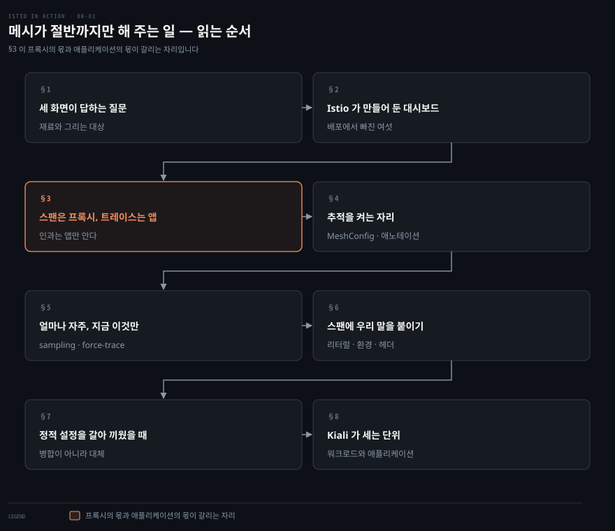
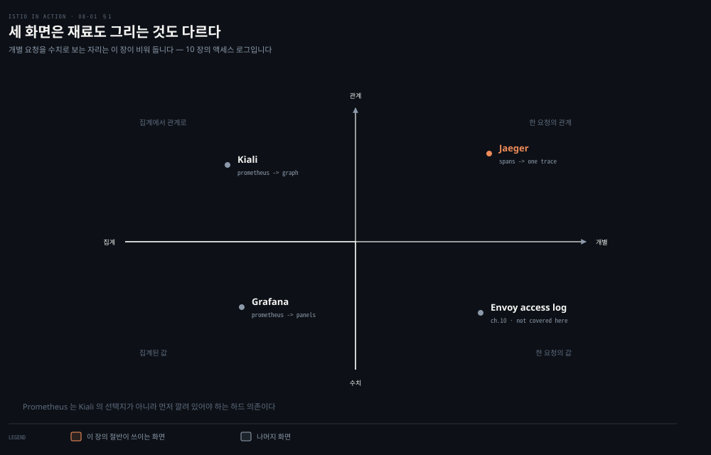
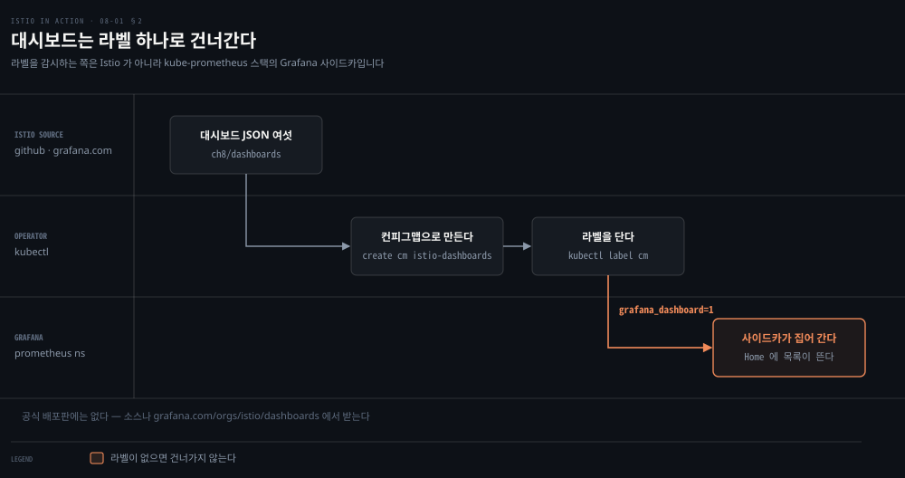
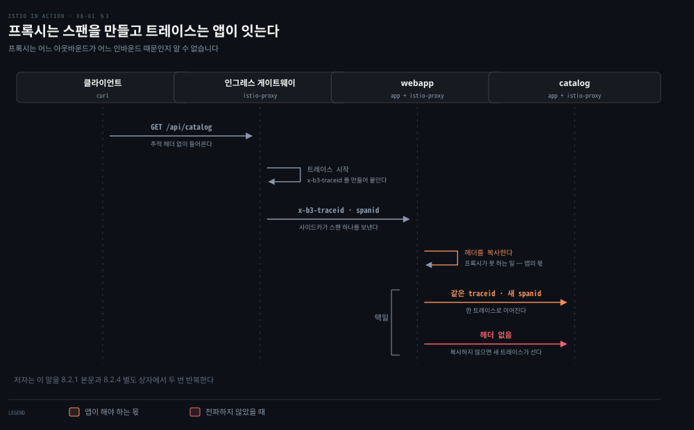
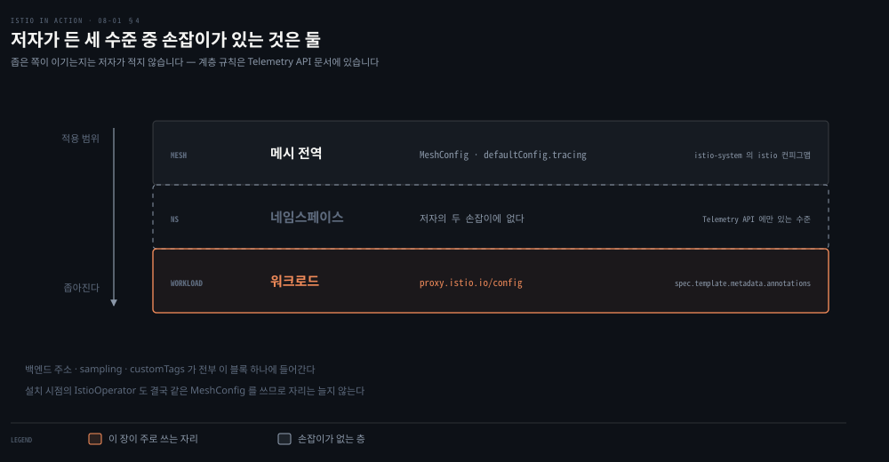
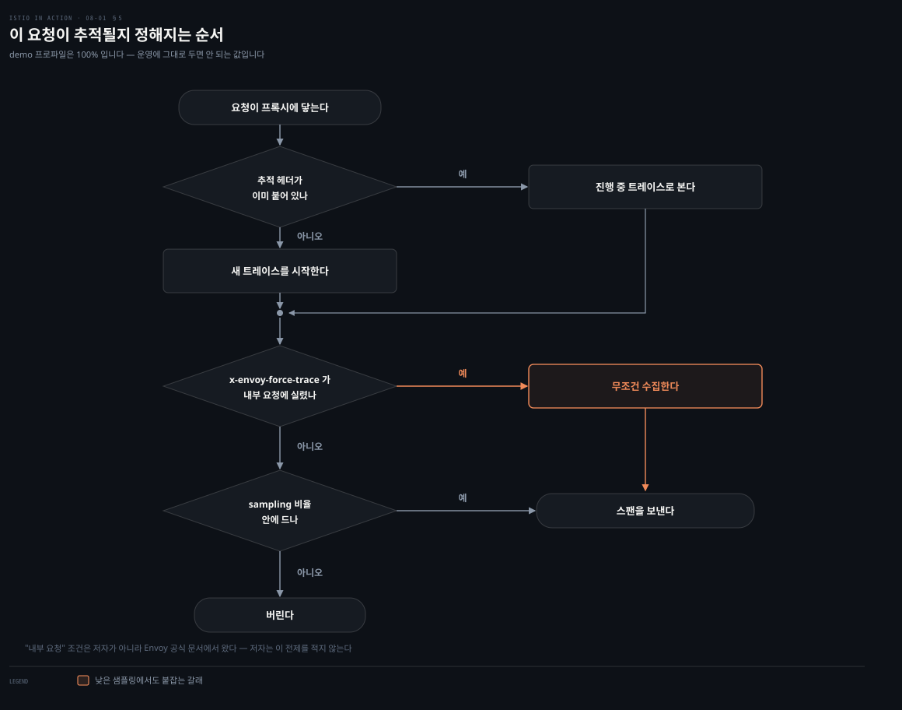
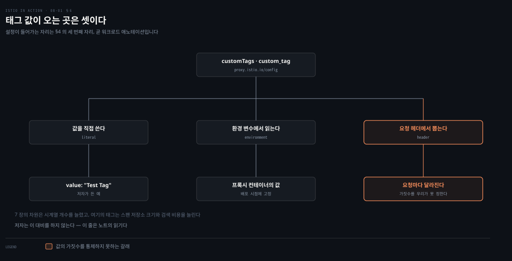
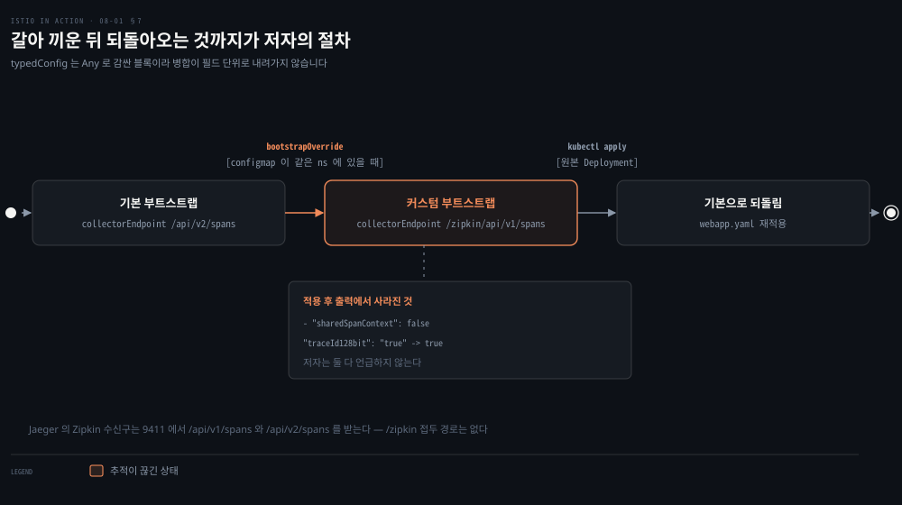
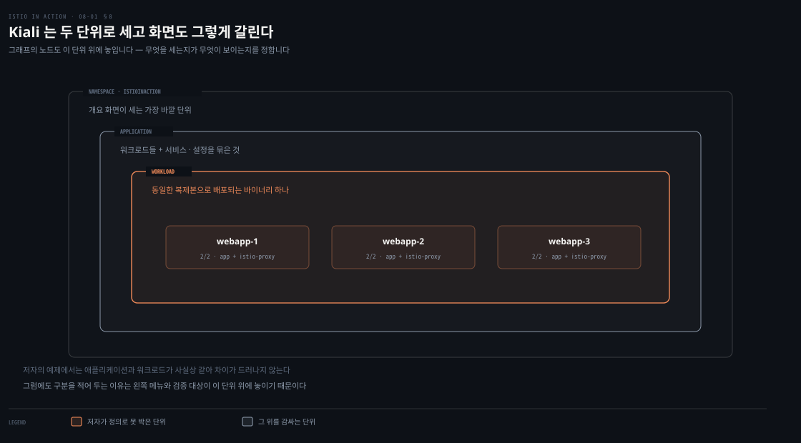

# 메시가 절반까지만 해 주는 일

---

> 8장은 7장이 모아 둔 신호를 화면으로 옮깁니다. Grafana로 메트릭을 그리고, Jaeger로 요청 하나가 지나간 길을 보고, Kiali로 서비스 사이의 방향 그래프를 봅니다. 셋을 나란히 켜는 장처럼 보이지만, 장의 절반이 분산 추적 하나에 쓰입니다. 프록시가 붙여 주는 것과 애플리케이션이 이어야 하는 것이 갈리는 자리이기 때문입니다.


## 핵심 요약

> 이 장 전체가 매달린 하나의 생각은 **보이게 만드는 일이 도구를 켜는 일이 아니라 질문마다 답할 수 있는 화면을 고르는 일이고, 그중 추적만은 메시가 절반까지만 해 준다**는 것입니다. 저자가 세 도구를 나열하지 않고 서로 무엇을 못 하는지로 가르는 이유를 이 노트는 그렇게 읽습니다.

화면 셋은 재료와 그리는 대상이 다릅니다. Grafana는 집계된 시계열을 수치로 그립니다. Kiali는 같은 시계열을 재료로 방향 그래프를 그리고, Jaeger는 개별 요청 하나가 지나간 홉을 그립니다. 저자가 Kiali를 소개하며 Grafana와의 차이부터 못 박는 것이 이 구분입니다.

추적에서 프록시가 하는 일은 절반입니다. 요청이 프록시를 지날 때 진행 중인 트레이스가 없으면 새로 시작하고 시작·끝 시각을 스팬으로 잡아 보냅니다. 그런데 들어온 요청과 나가는 호출의 인과는 프록시가 알 수 없습니다. 그 인과를 잇는 헤더 복사는 애플리케이션이 해야 합니다. 저자는 이 말을 장 안에서 두 번 반복합니다.

나머지 설정은 전부 같은 자리에 모입니다. 백엔드 주소도, 샘플링 비율도, 커스텀 태그도, 정적 부트스트랩 교체도 메시 전역의 `MeshConfig` 아니면 워크로드의 `proxy.istio.io/config` 애노테이션에 들어갑니다.


## 학습 목표

이 내용을 읽고 나면:

1. Grafana·Jaeger·Kiali가 각각 어떤 질문에 답하는 화면인지 재료와 그리는 대상으로 가를 수 있습니다.
2. 분산 추적에서 프록시가 하는 일과 애플리케이션이 해야 하는 일의 경계를 말할 수 있습니다.
3. 추적 설정을 넣는 자리 셋을 구분하고, 그중 저자가 실제로 쓸 수 있는 자리가 몇 개인지 압니다.
4. 샘플링 비율을 낮게 두고도 필요한 요청만 추적하는 방법과 그 전제를 설명할 수 있습니다.
5. `bootstrapOverride`가 병합이 아니라 대체인 이유를 저자의 출력에서 읽어 낼 수 있습니다.

아래는 이 문서 전체를 읽는 순서로 이은 지도입니다. 칸마다 절 번호와 그 절이 답하는 질문 하나를 적었습니다. 색이 붙은 칸이 이 장의 무게가 실린 자리, 곧 메시가 절반까지만 해 주는 일이 드러나는 지점입니다.




## 이 문서가 다루지 않는 것

> 관측 카테고리가 이 폴더 밖에 이미 있습니다. 7장과 같은 경계를 그대로 적용합니다.

`write/06_observability/`가 관측 도구 자체의 SSOT입니다. 8장이 다루는 것 중 상당 부분이 그쪽에 이미 있어 되풀이하지 않습니다.

- 스팬·트레이스·속성의 정의와 Jaeger 비교: [Grafana Tempo](../../../06_observability/02_LGTMStack/02-04.Grafana%20Tempo.md)
- 전파 헤더 네 형식(W3C·B3·Jaeger·OpenTelemetry)과 트레이스 구조: [Tempo 와 TraceQL](../../../06_observability/book/observability_with_grafana/06-01.Tempo%20%EC%99%80%20TraceQL%20%E2%80%94%20%EA%B5%AC%EC%A1%B0%20%EC%97%B0%EC%82%B0%EC%9E%90%C2%B7%EC%A0%84%ED%8C%8C%20%ED%97%A4%EB%8D%94%C2%B7%EC%95%84%ED%82%A4%ED%85%8D%EC%B2%98.md)
- 대시보드 JSON 모델, 프로비저닝, `grafana_dashboard` 라벨을 읽는 사이드카: [Grafana Core](../../../06_observability/02_LGTMStack/02-01.Grafana%20Core.md)
- 트레이스를 뒤져 병목을 찾는 작업 순서와 서비스 그래프: [Tempo 분산 트레이싱 시각화](../../../06_observability/03_Project/03-08.Tempo%20%EB%B6%84%EC%82%B0%20%ED%8A%B8%EB%A0%88%EC%9D%B4%EC%8B%B1%20%EC%8B%9C%EA%B0%81%ED%99%94.md)
- 관측 가능성과 모니터링의 정의: [관측 가능성·모니터링·Prometheus의 자리](../../../06_observability/book/mastering_prometheus/01-01.%EA%B4%80%EC%B8%A1%20%EA%B0%80%EB%8A%A5%EC%84%B1%C2%B7%EB%AA%A8%EB%8B%88%ED%84%B0%EB%A7%81%C2%B7Prometheus%EC%9D%98%20%EC%9E%90%EB%A6%AC.md)

남는 것은 **메시가 있어야만 생기는 이야기**입니다. 사이드카가 요청 경로에 앉아 있어서 코드 없이 붙여 주는 헤더, 그럼에도 애플리케이션이 해야 하는 몫, 그 몫을 설정으로 조절하는 자리, 그리고 메시의 리소스를 아는 화면이 그것입니다.

액세스 로그를 읽어 데이터 플레인을 진단하는 이야기는 10장이 맡고, 컨트롤 플레인 메트릭으로 성능을 튜닝하는 이야기는 11장이 맡습니다. 저자가 두 장으로 미뤄 둔 부분이라 여기서 앞당기지 않습니다.


## 1. 세 화면이 답하는 질문이 다르다
> 8장은 새 신호를 만들지 않습니다. 7장이 모아 둔 것을 그리는 장입니다. 그런데 저자는 도구 셋을 나란히 소개하는 대신 Kiali를 꺼내는 자리에서 Grafana와의 차이부터 못 박습니다.



저자의 문장은 이렇습니다. Kiali는 서비스가 서로 어떻게 상호작용하는지를 라이브로 갱신되는 방향 그래프로 만드는 데 집중한다는 점에서 Grafana와 다릅니다. Grafana는 게이지·카운터·차트를 얹은 대시보드에 강하지만, 클러스터 안 서비스의 상호작용을 그린 지도를 보여 주지는 않습니다.

이 문장에서 축 둘이 나옵니다. 무엇을 재료로 삼는가와 무엇을 그리는가입니다.

- **Grafana** — 집계된 시계열을 재료로 수치를 그립니다. 7장이 Prometheus에 쌓아 둔 것을 그대로 씁니다.
- **Kiali** — 재료는 같은 집계 시계열인데 그리는 것은 관계입니다. 트레이스도 Jaeger에서 끌어오지만 그래프를 만드는 재료는 메트릭입니다. 저자가 Kiali 설치 명령 뒤에 붙인 주의가 이 사실을 말합니다. Prometheus는 Kiali의 선택지가 아니라 먼저 깔려 있어야 하는 하드 의존입니다.
- **Jaeger** — 재료가 개별 요청입니다. 요청 하나가 지나간 홉과 각 홉이 쓴 시간을 그립니다.

네 번째 칸, 그러니까 개별 요청을 수치로 보는 자리는 이 장이 비워 둡니다. Envoy 액세스 로그가 그 자리이고 10장이 맡습니다. Kiali의 워크로드 화면에 Logs 탭이 있다는 사실만 이 장에서 스쳐 갑니다.

세 화면을 다 켜는 이유가 여기서 나옵니다. 같은 장애를 두고도 묻는 것이 다르기 때문입니다.

- 지금 오류율이 올랐나 — Grafana
- 누가 누구를 부르다 났나 — Kiali
- 그 요청은 어디서 시간을 썼나 — Jaeger

세 질문은 겹치지 않습니다. 화면은 그렇지 않습니다. §8에서 보듯 Kiali는 셋을 한 화면에 모으는 쪽으로 가고 있고, 저자 자신이 그 방향을 "앞으로의 가능성에 대한 약속"이라 낮춰 부릅니다.


## 2. Istio가 만들어 둔 대시보드 여섯
> Grafana를 켰다고 Istio가 보이지는 않습니다. 그릴 판을 따로 들여와야 합니다.



저자가 먼저 짚는 사실이 하나 있습니다. **이 대시보드들은 더 이상 공식 배포판에 들어 있지 않습니다.** GitHub의 Istio 소스에서 직접 받거나 커뮤니티 대시보드가 모인 `grafana.com/orgs/istio/dashboards`에서 가져와야 합니다. 책은 독자 편의를 위해 소스 코드의 `ch8/dashboards`에 넣어 두었습니다.

들여오는 절차는 두 단계입니다. JSON 파일 여섯을 하나의 컨피그맵으로 만들고, 그 컨피그맵에 라벨을 답니다.

```bash
kubectl -n prometheus create cm istio-dashboards \
  --from-file=pilot-dashboard.json=dashboards/pilot-dashboard.json \
  --from-file=istio-workload-dashboard.json=dashboards/istio-workload-dashboard.json \
  --from-file=istio-service-dashboard.json=dashboards/istio-service-dashboard.json \
  --from-file=istio-performance-dashboard.json=dashboards/istio-performance-dashboard.json \
  --from-file=istio-mesh-dashboard.json=dashboards/istio-mesh-dashboard.json \
  --from-file=istio-extension-dashboard.json=dashboards/istio-extension-dashboard.json

kubectl label -n prometheus cm istio-dashboards grafana_dashboard=1
```

라벨 하나가 손잡이입니다. 이 라벨을 감시하는 쪽은 Istio가 아니라 kube-prometheus 스택이 함께 띄운 Grafana 사이드카입니다. 그 규약 자체는 06_observability 쪽이 SSOT입니다.

저자는 라벨을 달라고만 하고 누가 그것을 집어 가는지는 적지 않습니다. 이 장 첫머리의 파드 목록에서 Grafana 파드가 `2/2`로 떠 있는 것을 그 사이드카로 읽었습니다.

저자가 대시보드 목록에서 짚는 것은 둘입니다. 컨트롤 플레인 대시보드에는 CPU·메모리·고루틴과 함께 설정 동기화 문제와 붙어 있는 데이터 플레인 연결 수가 나옵니다. 서비스 대시보드에서는 `webapp.istioinaction` 같은 서비스를 골라 7장의 표준 메트릭을 봅니다.

한 가지 습관을 저자가 권합니다. 그래프의 상세를 열고 Explore로 들어가 그 그래프를 만든 원쿼리를 보라는 것입니다. Pilot Push Time 패널을 그렇게 열어 보면 7장에서 다룬 `pilot_proxy_convergence_time`을 그리고 있습니다. 대시보드가 답을 주는 화면이 아니라 질의를 저장해 둔 화면이라는 것을 확인하는 절차로 읽힙니다.

새 메트릭이나 Envoy 자체 통계를 그리고 싶으면 대시보드를 고치기 전에 7장으로 돌아가야 합니다. 그리지 못하는 이유가 대개 패널이 아니라 프록시가 그 통계를 아직 내보내지 않아서이기 때문입니다.


## 3. 스팬은 프록시가 만들고 트레이스는 애플리케이션이 잇는다
> 이 장의 무게가 실린 자리입니다. 저자는 분산 추적의 출처부터 댑니다. 구글의 Dapper 논문(2010)이 상관관계 ID와 트레이스 ID로 서비스 사이 호출을 묶는 방식을 제시했습니다.



용어 둘이 먼저 필요합니다.

- **스팬(Span)** — 한 서비스나 컴포넌트 안에서 이루어진 작업 한 단위를 나타내는 데이터 묶음입니다. 시작 시각, 종료 시각, 연산 이름, 태그와 로그가 들어갑니다.
- **트레이스(Trace)** — 그 스팬들을 모아 만든 서비스 사이의 인과 관계입니다. 방향과 시간, 디버깅에 쓸 정보를 담습니다.

프록시가 하는 일은 분명합니다. 요청이 서비스 프록시를 지날 때 진행 중인 트레이스가 없으면 새로 시작합니다. 요청의 시작 시각과 끝 시각을 스팬으로 잡고, 뒤따르는 스팬을 하나의 트레이스로 묶을 수 있도록 HTTP 헤더를 붙입니다.

이미 추적 헤더를 달고 들어온 요청은 진행 중인 트레이스로 봅니다. 새로 만들지 않습니다. 알아보지 못하거나 외부에서 들어온 헤더는 제거합니다.

저자가 드는 헤더는 일곱입니다.

`x-request-id` · `x-b3-traceid` · `x-b3-spanid` · `x-b3-parentspanid` · `x-b3-sampled` · `x-b3-flags` · `x-ot-span-context`

프록시가 못 하는 일이 그다음에 옵니다. **프록시는 들어온 요청과 나가는 호출 사이의 인과를 모릅니다.** 어느 아웃바운드 호출이 어느 인바운드 요청 때문에 생겼는지는 애플리케이션 안에서만 알 수 있는 사실입니다. 그래서 애플리케이션이 들어온 요청의 헤더를 붙들었다가 자기가 내보내는 요청에 실어야 합니다.

저자는 이 말을 장 안에서 세 번 합니다. 8.2.1에서 한 번, 8.2.4의 별도 상자에서 또 한 번, 장 끝 요약에서 다시 한 번입니다. 두 번째에는 문장을 하나 더 답니다. 이 일은 프록시가 자동으로 해 줄 수 없습니다.

이 헤더 목록에는 성격이 다른 것이 섞여 있습니다. `x-request-id`는 B3 명세의 헤더가 아니라 Envoy가 만들어 붙이는 요청 식별자입니다. `x-ot-span-context`는 OpenTracing 쪽 헤더입니다. 저자는 일곱을 묶어 "Zipkin 추적 헤더"라 부릅니다.

지금 공식 문서가 요구하는 목록은 이와 다릅니다. 그 차이는 아래 심화 학습에 적었습니다.[^istio-tracing-faq]

헤더가 실제로 붙는지는 요청 헤더를 되돌려 주는 외부 서비스로 확인합니다. 저자는 인그레스 게이트웨이가 `httpbin.org`로 넘기도록 `VirtualService`를 하나 깔고 헤더를 받아 봅니다. 응답에 `X-B3-Sampled`, `X-B3-Spanid`, `X-B3-Traceid`가 들어 있습니다. 요청에 넣지 않은 헤더가 붙어 돌아온 것입니다.


## 4. 추적을 켜는 자리
> 붙일 헤더가 정해졌으면 스팬을 받을 곳과 그 주소를 정해야 합니다.



저자는 Jaeger를 샘플 all-in-one 배포로 세웁니다. 이유를 그대로 밝힙니다. Jaeger는 좀 더 복잡하고 데이터베이스를 필요로 하므로 이 책에서는 all-in-one으로 간다는 것입니다. 그리고 이 배포가 `zipkin`이라는 쿠버네티스 서비스를 함께 만들기 때문에 Istio의 기본값에 그대로 꽂힙니다.

```bash
kubectl apply -f istio-1.13.0/samples/addons/jaeger.yaml
```

만들어지는 것은 디플로이먼트 하나와 서비스 셋입니다. `tracing`, `zipkin`, `jaeger-collector`가 그것입니다. Jaeger가 Zipkin 형식과 호환되기 때문에 Istio는 Zipkin으로 설정하면서 실제로는 Jaeger에 보내게 됩니다.

> **원문 정오**: 저자는 8.2.2를 열며 "7.1.2 절에서 기본 샘플 앱(sample apps)을 지웠다"고 적습니다. 7장에서 지운 것은 샘플 앱이 아니라 샘플 애드온입니다. 명령도 `kubectl delete -f samples/addons/`였고, 같은 8장의 8.1 첫 문단은 "이전 장에서 샘플 Prometheus·Grafana 애드온을 지웠다"고 바르게 적습니다. 한 장 안에서 같은 사건을 두 이름으로 부릅니다. 샘플 애플리케이션인 `istioinaction` 네임스페이스의 서비스들은 지운 적이 없고, 이 장의 실습이 그 서비스로 트래픽을 보내므로 지워져 있으면 안 됩니다.

주소를 넣는 자리는 셋으로 소개됩니다. 설치 시점, 런타임의 메시 전역 설정, 그리고 워크로드 하나입니다.

첫째는 설치 시점의 `IstioOperator`입니다. `meshConfig.defaultConfig.tracing` 아래에 백엔드를 적습니다.

```yaml
spec:
  meshConfig:
    defaultConfig:
      tracing:
        zipkin:
          address: zipkin.istio-system:9411
```

둘째는 이미 설치한 뒤 고치는 자리입니다. `istio-system`의 `istio` 컨피그맵 안에 같은 `defaultConfig.tracing` 블록이 들어 있습니다. 여기를 고치면 메시 전역 기본값이 바뀝니다.

셋째는 워크로드입니다. 디플로이먼트의 파드 템플릿 애노테이션에 `proxy.istio.io/config`로 같은 블록을 넣습니다.

```yaml
spec:
  template:
    metadata:
      annotations:
        proxy.istio.io/config: |
          tracing:
            zipkin:
              address: zipkin.istio-system:9411
```

설치 시점과 런타임은 결국 같은 `MeshConfig`를 건드리므로 실제 자리는 둘입니다. 7장에서 본 모양이 그대로 돌아옵니다. 컨트롤 플레인 쪽 한 자리와 워크로드 쪽 한 자리입니다.

다만 7장에서는 둘을 **함께** 고쳐야 통계가 나왔습니다. 여기서는 둘 중 하나만 고쳐도 됩니다.

7장의 차원 추가가 서로 다른 두 부품을 건드렸기 때문입니다. 컨트롤 플레인은 `stats` 필터에 차원을 심었고, 워크로드는 `extraStatTags`로 그 이름을 노출 목록에 넣어야 했습니다. 여기서 넣는 것은 값 하나뿐입니다. 그 값은 프록시 설정 한 곳에만 들어갑니다.

저자는 둘이 부딪칠 때 무엇이 이기는지 적지 않습니다. 지금의 Telemetry API는 메시·네임스페이스·워크로드 세 수준을 두고 좁은 쪽이 이기도록 계층을 정해 두었습니다.[^telemetry-api]

저자가 절을 여는 문장에는 빈자리가 하나 남습니다. 전역 메시·네임스페이스·특정 워크로드의 여러 수준에서 설정할 수 있다고 적고, 그중 전역과 워크로드만 다루겠다고 밝힙니다. 두 진술 모두 참입니다.

다만 그가 드는 두 손잡이로는 네임스페이스 수준을 만들 수 없습니다. `MeshConfig`는 메시 전역이고 `proxy.istio.io/config`는 파드 템플릿에 붙는 워크로드 단위입니다. 그 수준은 저자가 같은 절의 주석에서 다루지 않겠다고 밝힌 Telemetry API에만 있습니다.[^telemetry-api] 원문의 오류가 아니라 독자가 메워야 할 자리이고, 이 두 문단이 노트가 메운 것입니다.


## 5. 얼마나 자주 볼 것인가, 지금 이것만 볼 것인가
> 추적은 공짜가 아닙니다. 저자는 분산 추적과 스팬 수집이 시스템에 상당한 성능 부담을 지울 수 있다고 적고, 서비스가 정상일 때는 수집 빈도를 제한하라고 권합니다.



2장에서 쓴 demo 프로파일은 샘플링을 100%로 둡니다. 실습에서 트레이스가 잘 보이는 이유이자, 운영에 그대로 두면 안 되는 이유입니다. 비율을 낮추는 자리는 §4에서 본 두 자리와 같습니다.

```yaml
tracing:
  sampling: 10
  zipkin:
    address: zipkin.istio-system:9411
```

메시 전역으로 넣으면 모든 워크로드가 10%가 되고, 워크로드 애노테이션에 넣으면 그 워크로드만 바뀝니다.

낮춰 두면 정작 보고 싶은 요청이 안 잡힙니다. 저자가 그 자리에 두는 것이 강제 추적입니다. 요청에 `x-envoy-force-trace` 헤더를 실으면 그 요청과 그 요청이 만든 호출 그래프 전체의 스팬을 잡습니다.

```bash
curl -H "x-envoy-force-trace: true" \
     -H "Host: webapp.istioinaction.io" http://localhost/api/catalog
```

저자가 그리는 운영 그림은 이렇습니다. 평소에는 샘플링을 최소로 둡니다. 문제가 생기면 그 워크로드만 올립니다.

그 위에 API 게이트웨이나 진단 서비스를 얹어 특정 요청에만 이 헤더를 주입하게 만들 수 있습니다. 그런 도구를 만드는 일은 이 책의 범위 밖이라고 저자가 못 박습니다.

위 도식은 저자가 세 자리에 나눠 적은 규칙을 요청 하나의 관점에서 이은 것입니다. 이미 추적 헤더를 달고 들어왔는지, 강제 추적 헤더가 실렸는지, 샘플링 비율 안에 드는지가 차례로 판단됩니다. 저자가 이 순서를 한 줄로 적은 곳은 없습니다.

강제 추적에는 전제가 하나 붙는데 저자는 적지 않습니다. Envoy는 이 헤더를 **내부 요청**에서만 존중하고, 그때 `x-request-id`를 고쳐서 수집을 강제합니다.[^envoy-headers]

같은 장 앞쪽에 인그레스 게이트웨이를 지난 요청이 내부로 표시된 출력이 있습니다. 헤더를 되돌려 받은 응답의 `X-Envoy-Internal: "true"`가 그것입니다. 다만 그 호출은 `httpbin.istioinaction.io`로 나가는 다른 경로이고, 강제 추적 예제는 `webapp.istioinaction.io`로 갑니다. 두 경로가 같은 판정을 받는다고 저자가 밝힌 곳은 없으므로, 이 연결은 노트의 읽기입니다.


## 6. 스팬에 우리 말을 붙이는 세 갈래
> 스팬에 담기는 것은 시각과 연산 이름만이 아닙니다. 태그를 붙이면 조직이나 애플리케이션 고유의 정보를 함께 실을 수 있습니다.



저자의 정의는 간단합니다. 태그는 키-값 쌍이고, 백엔드 추적 엔진으로 보내는 스팬에 덧붙습니다. 값을 끌어오는 갈래는 셋입니다.

- **리터럴** — 값을 그 자리에 직접 씁니다.
- **환경 변수** — 프록시 컨테이너의 환경 변수에서 읽습니다.
- **요청 헤더** — 들어온 요청의 헤더에서 뽑습니다.

설정이 들어가는 자리는 §4의 세 번째 자리와 같습니다. 워크로드의 파드 템플릿 애노테이션입니다.

```yaml
annotations:
  proxy.istio.io/config: |
    tracing:
      sampling: 100
      customTags:
        custom_tag:
          literal:
            value: "Test Tag"
      zipkin:
        address: zipkin.istio-system:9411
```

적용한 뒤 Jaeger UI에서 트레이스를 열고 해당 서비스의 스팬을 펼치면 Tags 항목에 값이 보입니다. 저자는 이 태그를 보고·필터링·탐색에 쓸 수 있다고 적고 세부는 공식 문서로 넘깁니다.

여기서 7장과 겹치는 위험이 하나 되살아납니다. 요청 헤더에서 값을 끌어오는 갈래는 값의 가짓수를 우리가 통제하지 못합니다. 다만 비용의 모양은 다릅니다. 7장의 차원은 시계열 개수를 늘렸고, 여기의 태그는 스팬 저장소의 크기와 검색 비용을 늘립니다. 저자는 이 대비를 하지 않습니다. 이 문단은 노트의 읽기입니다.


## 7. 정적 설정을 갈아 끼웠을 때
> 주소와 샘플링 위쪽에는 손대기 어려운 층이 하나 더 있습니다. 프록시가 뜰 때 읽는 부트스트랩 설정입니다.



기본값부터 확인합니다. `istioctl`로 부트스트랩을 뽑아 추적 부분만 봅니다.

```bash
istioctl pc bootstrap -n istioinaction deploy/webapp -o json | jq .bootstrap.tracing
```

```json
{
  "http": {
    "name": "envoy.tracers.zipkin",
    "typedConfig": {
      "@type": "type.googleapis.com/envoy.config.trace.v3.ZipkinConfig",
      "collectorCluster": "zipkin",
      "collectorEndpoint": "/api/v2/spans",
      "traceId128bit": true,
      "sharedSpanContext": false,
      "collectorEndpointVersion": "HTTP_JSON"
    }
  }
}
```

호스트와 포트만으로 부족할 때 이 블록을 바꿉니다. 방법은 두 단계입니다. 바꾸고 싶은 조각을 컨피그맵에 담고, 워크로드의 파드 템플릿에 `sidecar.istio.io/bootstrapOverride` 애노테이션으로 그 컨피그맵 이름을 가리킵니다.

저자가 담은 조각은 수집 엔드포인트를 `/zipkin/api/v1/spans`로 바꾼 것입니다. 적용한 뒤 같은 명령으로 다시 뽑으면 바뀐 값이 보입니다.

> **원문 정오**: 저자는 다시 뽑은 출력을 두고 "우리가 바꾼 것이 보인다"고만 적습니다. 그런데 그 출력에는 바꾸지 않은 필드 하나가 사라져 있습니다. 기본 출력에 있던 `sharedSpanContext`가 적용 후 출력에는 없습니다. 저자가 컨피그맵에 담은 조각에도 그 필드가 없었습니다. 한 가지가 더 있습니다. 컨피그맵에는 `"traceId128bit": "true"`를 문자열로 적었는데 출력은 불리언 `true`로 나옵니다. 저자는 둘 다 언급하지 않습니다.
>
> 이 노트의 읽기는 이렇습니다. `typedConfig`는 `Any`로 감싼 블록이라 병합이 필드 단위로 내려가지 않고 블록째 갈립니다. 그래서 `bootstrapOverride`는 조각을 얹는 병합이 아니라 그 블록의 대체입니다. 저자가 "튜닝하고 싶은 설정의 조각(snippet)"이라 부른 표현이 병합처럼 읽히지만, 그의 출력은 대체를 보여 줍니다.

저자는 곧바로 경고를 답니다. 커스텀 부트스트랩을 두고 든 조건이 넷입니다.

- 고급 시나리오다
- 그 아래에서 쓰이는 Envoy 버전에 묶인다
- 하위 호환은 보장되지 않는다
- 잘못 설정하면 서비스를 내릴 수 있다

그리고 방금 적용한 설정이 `webapp`의 추적을 깨뜨린다고 밝히면서 원상 복구 명령까지 붙입니다.

```bash
kubectl apply -f services/webapp/kubernetes/webapp.yaml
```

왜 깨지는지는 적지 않습니다. Jaeger 컬렉터의 Zipkin 호환 수신구는 9411 포트에서 `/api/v1/spans`와 `/api/v2/spans`를 받습니다.[^jaeger-zipkin] 공식 문서가 뒷받침하는 것은 여기까지입니다. `/zipkin` 접두가 붙은 경로가 그 목록에 없으니 스팬이 도착할 곳이 없다는 것이 이 노트의 읽기입니다. 예제로 고른 값이 실은 존재하지 않는 경로였던 셈입니다.


## 8. Kiali가 세는 단위와 그리는 그림
> 마지막 화면은 메시 자신을 아는 화면입니다.



설치부터 저자의 판단이 들어갑니다. Istio에 Kiali 샘플이 함께 오지만, 현실적인 배포에서는 Istio 팀과 Kiali 팀 모두 Kiali 오퍼레이터를 권합니다. 그래서 오퍼레이터를 헬름으로 깔고 `Kiali` 커스텀 리소스로 인스턴스를 만듭니다.

```bash
kubectl create ns kiali-operator
helm install \
  --set cr.create=true \
  --set cr.namespace=istio-system \
  --namespace kiali-operator \
  --repo https://kiali.org/helm-charts \
  --version 1.40.1 \
  kiali-operator kiali-operator
```

> **원문 정오**: 위 명령의 `cr.create=true`는 오퍼레이터가 `istio-system`에 `Kiali` 리소스를 **직접 만들게** 하는 옵션입니다. 차트의 `cr.namespace` 주석이 그 동작을 밝힙니다. "Kiali CR을 만들기로 했고(`--set cr.create=true`) 오퍼레이터가 모든 네임스페이스를 감시한다면, 여기가 CR이 만들어질 네임스페이스"라는 설명입니다.[^kiali-helm] 그런데 저자는 그다음 문단을 "이제 `istio-system` 네임스페이스에 Kiali 인스턴스를 만들 것이다"로 열고 `kubectl apply -f ch8/kiali.yaml`을 실행합니다. 만들라고 시켜 둔 리소스를 이어서 다시 만듭니다. 이름과 네임스페이스가 같아 실행 자체는 갱신으로 끝나지만, 앞의 플래그를 그대로 따라 한 독자는 자기 클러스터에 이미 떠 있는 기본 설정 Kiali를 보게 됩니다. `cr.create=false`로 두거나 뒤의 `apply`를 생략해야 문장과 명령이 맞습니다.

커스텀 리소스에서 저자가 채우는 것은 셋입니다. 익명 접근을 허용하는 인증 전략, 클러스터 안 Prometheus 주소, 그리고 클러스터 안 Jaeger 주소입니다.

```yaml
spec:
  auth:
    strategy: anonymous
  external_services:
    prometheus:
      url: "http://prom-kube-prometheus-stack-prometheus.prometheus:9090"
    tracing:
      enabled: true
      in_cluster_url: "http://tracing.istio-system:16685/jaeger"
      use_grpc: true
```

원문 PDF는 Prometheus 주소 줄이 오른쪽에서 잘려 `:90`까지만 보입니다. Prometheus의 기본 포트가 9090이라 위에서는 그 값으로 읽었습니다.

저자가 여기에 붙이는 단서가 하나 있습니다. Prometheus도 Jaeger도 기본 보안 전략을 갖고 있지 않고, 두 프로젝트 모두 앞에 리버스 프록시를 두라고 권합니다. Kiali 쪽에서는 TLS와 기본 인증으로 붙을 수 있지만 저자는 독자 연습으로 남깁니다. 이 실습이 익명 인증인 것은 편의이지 권고가 아닙니다.

그래프에서 읽는 것으로 저자가 드는 목록은 이렇습니다.

- 트래픽이 어디를 지나 어디로 가는가
- 바이트 수와 요청 수
- 버전이 여럿일 때의 여러 흐름, 곧 카나리 릴리스나 가중치 라우팅
- 초당 요청 수와 버전별 트래픽 비중
- 네트워크 트래픽에 근거한 애플리케이션 건강 상태
- HTTP 트래픽과 TCP 트래픽
- 빠르게 눈에 띄는 네트워크 실패

워크로드를 하나 고르면 탭이 여럿 열립니다.

- **Overview** — 파드, 적용된 Istio 설정, 상하류 그래프
- **Traffic** — 인바운드·아웃바운드 성공률
- **Logs** — 애플리케이션 로그와 Envoy 액세스 로그와 스팬을 한자리에
- **Inbound·Outbound Metrics** — 스팬과 짝지은 메트릭
- **Traces** — Jaeger가 보고한 트레이스
- **Envoy** — 그 워크로드에 적용된 클러스터·리스너·라우트

저자가 이 상관관계에 붙이는 값은 창을 옮겨 다니지 않아도 된다는 것입니다. 그래프마다 시간축이 같은지 네 번씩 확인할 필요가 없어집니다. 요청 시간에 스파이크가 있으면 그 자리에 짝지어진 트레이스가 있고, 그 트레이스가 새 버전이 서비스한 요청이었다는 사실을 보여 줄 수 있습니다. 다만 저자 자신이 이 기능을 "앞으로의 가능성에 대한 약속"이라고 낮춰 부릅니다.

Kiali가 세는 단위 둘은 이름이 비슷해 헷갈립니다. 저자가 가릅니다.

- **워크로드(workload)** — 동일한 복제본 집합으로 배포되는 실행 바이너리 하나입니다. 쿠버네티스라면 디플로이먼트에 속한 파드들이 여기 해당합니다.
- **애플리케이션(application)** — 워크로드들과 서비스·설정 같은 딸린 구성물을 묶은 것입니다. 서비스 하나와 다른 서비스 하나와 데이터베이스가 각각 워크로드이고, 셋을 합친 것이 하나의 애플리케이션입니다.

예제 애플리케이션에서는 둘이 사실상 같아서 차이가 드러나지 않습니다. 저자가 굳이 구분을 적어 두는 이유는 화면의 메뉴가 이 두 단위로 갈려 있기 때문입니다.

마지막으로 저자는 Kiali를 메시 운영자의 도구로도 소개합니다. 존재하지 않는 `Gateway`를 가리키는 `VirtualService`, 없는 목적지로 향하는 라우팅, 같은 호스트에 붙은 `VirtualService` 둘, 찾을 수 없는 서비스 서브셋 같은 설정 오류를 검증합니다. 이 쓰임은 10장에서 다시 나옵니다.


## 심화 학습

> 책 밖의 보강만 둡니다. 각 항목은 공식 1차 자료로 확인한 것입니다.

**전파해야 할 헤더 목록이 달라졌습니다.** 저자가 든 일곱 중 `x-ot-span-context`는 현재 공식 목록에 없습니다. 지금 Istio가 요구하는 것은 `x-request-id`와 W3C의 `traceparent`·`tracestate`이고, Zipkin을 쓰는 경우에 한해 `x-b3-*` 다섯과 단일 헤더 형식인 `b3`가 더해집니다.[^istio-tracing-faq] 같은 문서가 `x-request-id`를 B3 헤더가 아니라 Envoy가 생성한 요청 ID로 따로 설명합니다. 저자가 일곱을 묶어 "Zipkin 추적 헤더"라 부른 것은 당시의 통칭이었습니다.

**Telemetry API가 정본이 되었습니다.** 저자는 1.12에 들어온 alpha이고 제대로 동작하지 않는 문제가 있었다며 다루지 않습니다. 지금은 `telemetry.istio.io/v1`이고, 샘플링은 `randomSamplingPercentage` 필드로 정하며 기본값은 1%입니다.[^telemetry-api] 커스텀 태그의 세 갈래는 저자가 정리한 것과 같습니다. 공식 문서는 이 API를 쓸 때 `MeshConfig` 쪽 추적 설정을 `tracing: {}`로 꺼 두라고 권합니다.

**OpenTelemetry는 OpenTracing을 포함한 것이 아니라 흡수해 만든 것입니다.** 저자는 OpenTelemetry가 OpenTracing을 포함하는 커뮤니티 주도 프레임워크라고 적습니다. 공식 문서는 OpenTracing과 OpenCensus가 같은 문제를 각자 풀지 못해 2019년에 합쳐 OpenTelemetry가 되었다고 설명합니다.[^otel] 포함 관계가 아니라 합병입니다.

**강제 추적 헤더에는 조건이 붙습니다.** Envoy는 `x-envoy-force-trace`를 내부 요청에서만 존중하고, 그때 생성된 `x-request-id`를 고쳐 수집을 강제합니다.[^envoy-headers] 같은 문서가 `x-request-id`를 홉 사이로 전파해야 무작위 샘플링에서 안정적인 추적이 가능하다고 적습니다. 샘플링 비율을 낮게 두는 운영에서 `x-request-id` 전파가 특히 중요한 이유입니다.

**Jaeger all-in-one은 로컬 테스트용입니다.** 저자도 운영 배포는 Jaeger 문서를 보라고 넘깁니다. Jaeger 자신은 all-in-one을 빠른 로컬 테스트를 위해 설계된 실행 파일로 못 박습니다.[^jaeger-zipkin] 같은 문서가 Zipkin 호환 수신구를 9411 포트의 `/api/v1/spans`와 `/api/v2/spans`로 적습니다. 그 수신구는 기본으로 꺼져 있어 플래그로 켜야 합니다.


## 결정 치트시트

> 저자가 본문에서 근거를 밝힌 것만 담습니다. 판단 근거가 원문에 없는 줄은 넣지 않았습니다.

| 상황 | 고를 것 | 저자가 댄 근거 |
|---|---|---|
| 지금 오류율·지연이 어떤지 봐야 함 | Grafana 서비스 대시보드 | 게이지·카운터·차트로 표준 메트릭을 그림 |
| 누가 누구를 부르는지 봐야 함 | Kiali 그래프 | 방향 그래프를 라이브로 갱신 |
| 요청 하나가 어디서 시간을 썼는지 봐야 함 | Jaeger 트레이스 | 홉마다 스팬을 모아 트레이스로 묶음 |
| Istio 대시보드가 Grafana에 없음 | 소스에서 받아 컨피그맵 + `grafana_dashboard=1` | 공식 배포판에서 빠짐 |
| 그래프가 무엇을 그리는지 확인 | 패널 상세의 Explore | 원쿼리를 그대로 보여 줌 |
| 추적 백엔드를 메시 전체에 지정 | `MeshConfig`의 `defaultConfig.tracing` | 메시 전역 기본값 |
| 워크로드 하나만 다르게 | `proxy.istio.io/config` 애노테이션 | 해당 디플로이먼트에만 적용 |
| 추적 비용을 줄여야 함 | `sampling` 을 낮춤 | 스팬 수집은 상당한 성능 부담 |
| 낮춰 둔 채로 이 요청만 봐야 함 (내부 요청일 때) | `x-envoy-force-trace` 헤더 | 그 요청의 호출 그래프 전체를 수집 |
| 스팬에 조직 고유 정보를 실어야 함 | `customTags` | 리터럴·환경 변수·요청 헤더 셋 |
| 수집 엔드포인트까지 바꿔야 함 | `sidecar.istio.io/bootstrapOverride` | 정적 부트스트랩을 컨피그맵으로 교체 |
| Kiali를 현실적으로 배포해야 함 | Kiali 오퍼레이터 | Istio·Kiali 팀 모두의 권고 |


## 적용 관점

> 실무 규칙 하나와 Spring 쪽 경계 하나가 남습니다. 화면의 공백을 인프라 탓으로 돌리기 전에 헤더 전파를 확인하는 것, 그리고 그 전파가 프레임워크의 일이라는 것입니다.

이 장에서 실무로 곧장 넘어가는 규칙은 하나입니다. **트레이스가 끊겨 보일 때 샘플링과 백엔드보다 애플리케이션의 헤더 전파를 먼저 의심합니다.** 저자가 같은 말을 장 안에서 두 번 한 이유가 여기 있습니다. 프록시는 요청마다 스팬을 만들지만, 그 스팬들이 하나의 트레이스로 묶이는 것은 앱이 헤더를 옮겨 실었을 때뿐입니다. 샘플링을 100%로 올려도 전파가 없으면 조각난 트레이스가 개수만 늘어납니다.

Spring 애플리케이션에서는 이 몫이 대개 프레임워크로 넘어갑니다. Micrometer Tracing이 들어오면 들어온 요청의 컨텍스트를 붙들었다가 나가는 `RestClient`·`WebClient` 호출에 실어 줍니다. 확인할 것은 두 가지입니다. 전파 형식이 메시 쪽과 맞는지, 그리고 앱이 직접 만드는 스레드나 비동기 경계에서 컨텍스트가 끊기지 않는지입니다. 저자가 말한 "많은 RPC 프레임워크가 이 헤더를 자동으로 전파한다"가 이 이야기이고, 이어지는 "어느 쪽이든 애플리케이션이 전파를 보장해야 한다"가 확인의 책임을 다시 앱으로 돌려놓습니다.

한 가지 더 있습니다. Istio 쪽과 애플리케이션 쪽이 서로 다른 형식을 쓰면 두 계측이 각자 트레이스를 만들고 화면에서 만나지 않습니다. 7장의 메트릭에서는 `istio_` 접두 덕분에 충돌이 없었지만, 추적은 같은 트레이스에 들어가야 의미가 생기므로 형식을 맞추는 일이 먼저입니다.


## 면접에서 받을 만한 질문
> 답을 먼저 떠올린 뒤 아래 정답 절을 펼칩니다.

1. 이 장을 한 줄로 정의하면 무엇입니까?
2. Grafana·Kiali·Jaeger 는 각각 무엇을 재료로 무엇을 그립니까?
3. 분산 추적에서 프록시가 해 주는 데까지와 애플리케이션이 이어받아야 하는 것은 각각 무엇입니까?
4. 추적 설정은 어디에 모이며, 그 자리에 함께 들어가는 항목은 무엇입니까?
5. 샘플링을 100%로 올렸는데도 트레이스가 조각나 보입니다.
6. Kiali와 Grafana를 둘 다 써야 합니까.
7. 추적 백엔드로 Jaeger를 쓰는데 왜 설정에는 zipkin이라고 적습니까.
8. `bootstrapOverride`로 한 필드만 바꿀 수 있습니까.
9. 워크로드와 애플리케이션은 무엇이 다릅니까.


## 정답 (자답 후 펼치기)

> 위 §면접에서 받을 만한 질문 의 9 개에 *먼저 자답한 뒤* 읽으십시오. 자답 없이 먼저 읽으면 학습 효과가 0 입니다. 질문 번호와 1:1 로 대응합니다.

### 정답 1 — 한 줄 정의

Istio는 요청이 프록시를 지날 때 스팬을 만들고 추적 헤더를 붙여 주지만, 들어온 요청과 나가는 호출의 인과는 알 수 없어 헤더 전파는 애플리케이션의 몫으로 남습니다.

### 정답 2 — 세 화면은 각각 무엇을 재료로 무엇을 그립니까

세 화면은 재료와 그리는 대상이 다릅니다. Grafana는 집계 시계열을 수치로, Kiali는 같은 시계열을 방향 그래프로, Jaeger는 개별 요청을 홉으로 그립니다.

### 정답 3 — 추적에서 프록시의 몫과 애플리케이션의 몫은 무엇입니까

추적에서 프록시의 몫은 스팬 생성과 헤더 부착까지입니다. 인과를 잇는 헤더 복사는 애플리케이션이 하고, 프록시가 대신할 수 없습니다.

### 정답 4 — 추적 설정은 어디에 모입니까

추적 설정은 메시 전역 `MeshConfig`와 워크로드 애노테이션 두 자리에 모입니다. 백엔드 주소, 샘플링 비율, 커스텀 태그가 모두 같은 블록입니다.

### 정답 5 — 샘플링을 100%로 올렸는데도 트레이스가 조각나 보입니다

샘플링은 얼마나 자주 모을지만 정합니다. 조각이 하나로 묶이는 것은 애플리케이션이 들어온 요청의 추적 헤더를 나가는 호출에 실었을 때뿐입니다. 프록시는 어느 아웃바운드가 어느 인바운드 때문인지 모릅니다.

### 정답 6 — Kiali와 Grafana를 둘 다 써야 합니까

답하는 질문이 다릅니다. Grafana는 값의 추이를, Kiali는 서비스 사이의 관계를 그립니다. Kiali는 Prometheus의 메트릭을 재료로 쓰므로 Prometheus가 먼저 있어야 합니다.

### 정답 7 — 추적 백엔드로 Jaeger를 쓰는데 왜 설정에는 zipkin이라고 적습니까

Jaeger가 Zipkin 형식과 호환되기 때문입니다. Istio 샘플의 Jaeger 배포가 `zipkin`이라는 서비스를 함께 만들어 두어서 Istio 기본값이 그대로 맞습니다.

### 정답 8 — `bootstrapOverride`로 한 필드만 바꿀 수 있습니까

저자의 출력이 그렇지 않다고 보여 줍니다. 바꾸지 않은 `sharedSpanContext`가 적용 후 출력에서 사라집니다. `typedConfig`가 통째로 갈리는 블록이라 조각을 얹는 병합이 아니라 대체로 동작합니다.

### 정답 9 — 워크로드와 애플리케이션은 무엇이 다릅니까

워크로드는 동일한 복제본으로 배포되는 바이너리 하나이고, 애플리케이션은 그런 워크로드 여럿과 서비스·설정을 묶은 것입니다. 예제에서는 둘이 같아 보이지만 Kiali의 메뉴가 이 두 단위로 갈려 있습니다.


## 핵심 개념 체크리스트

- [ ] Grafana·Jaeger·Kiali가 각각 무엇을 재료로 무엇을 그리는지 말할 수 있습니다.
- [ ] Istio 대시보드가 공식 배포판에 없다는 사실과 들여오는 절차를 압니다.
- [ ] 스팬과 트레이스를 구분해 정의할 수 있습니다.
- [ ] 프록시가 하는 일과 애플리케이션이 해야 하는 일의 경계를 설명할 수 있습니다.
- [ ] 저자가 든 추적 헤더 일곱을 들고, 그중 B3가 아닌 것을 짚을 수 있습니다.
- [ ] 추적 설정을 넣는 두 자리와 각각의 적용 범위를 압니다.
- [ ] demo 프로파일의 샘플링 기본값과 운영에서 낮추는 이유를 압니다.
- [ ] `x-envoy-force-trace`가 하는 일과 내부 요청 조건을 압니다.
- [ ] 커스텀 태그의 세 갈래를 들 수 있습니다.
- [ ] `bootstrapOverride`가 병합이 아니라 대체인 근거를 출력에서 짚을 수 있습니다.
- [ ] Kiali의 워크로드와 애플리케이션을 구분할 수 있습니다.


## 관련 문서

- [미리 정하지 않았던 것을 나중에 세려면](07-01.미리%20정하지%20않았던%20것을%20나중에%20세려면.md) — 이 장이 그리는 메트릭을 모으는 장
- [Envoy가 맡는 일과 Istio가 보태는 일](03-01.Envoy가%20맡는%20일과%20Istio가%20보태는%20일.md) — 부트스트랩과 `x-request-id`를 처음 만나는 장
- [Istio in Action 정독 인덱스](README.md)
- [Grafana Tempo](../../../06_observability/02_LGTMStack/02-04.Grafana%20Tempo.md) — 스팬·트레이스 개념의 SSOT
- [Tempo 와 TraceQL](../../../06_observability/book/observability_with_grafana/06-01.Tempo%20%EC%99%80%20TraceQL%20%E2%80%94%20%EA%B5%AC%EC%A1%B0%20%EC%97%B0%EC%82%B0%EC%9E%90%C2%B7%EC%A0%84%ED%8C%8C%20%ED%97%A4%EB%8D%94%C2%B7%EC%95%84%ED%82%A4%ED%85%8D%EC%B2%98.md) — 전파 헤더 네 형식의 SSOT


## 참고 자료

- 《Istio in Action》 8장 "Observability: Visualizing network behavior with Grafana, Jaeger, and Kiali" — 이 노트의 1차 자료
- [Istio Distributed Tracing FAQ](https://istio.io/latest/faq/distributed-tracing/) — 지금 전파해야 하는 헤더 목록
- [Istio Telemetry API 로 분산 추적 설정하기](https://istio.io/latest/docs/tasks/observability/distributed-tracing/telemetry-api/) — 현재 정본 설정 방식
- [Envoy HTTP 헤더 레퍼런스](https://www.envoyproxy.io/docs/envoy/latest/configuration/http/http_conn_man/headers) — `x-request-id`와 `x-envoy-force-trace`
- [Jaeger Getting Started](https://www.jaegertracing.io/docs/1.62/getting-started/) — Zipkin 호환 수신구와 all-in-one 의 용도
- [kiali-operator Helm 차트 `values.yaml`](https://github.com/kiali/helm-charts/blob/master/kiali-operator/values.yaml) — `cr.create`·`cr.namespace` 의 동작


[^istio-tracing-faq]: Istio — Distributed Tracing FAQ, "Which HTTP headers are required for distributed tracing?". <https://istio.io/latest/faq/distributed-tracing/>
[^telemetry-api]: Istio — Distributed Tracing with the Telemetry API (`telemetry.istio.io/v1`, `randomSamplingPercentage`). <https://istio.io/latest/docs/tasks/observability/distributed-tracing/telemetry-api/>
[^envoy-headers]: Envoy — HTTP connection manager headers, `x-request-id` 와 `x-envoy-force-trace`. <https://www.envoyproxy.io/docs/envoy/latest/configuration/http/http_conn_man/headers>
[^otel]: OpenTelemetry — What is OpenTelemetry?, OpenTracing·OpenCensus 합병. <https://opentelemetry.io/docs/what-is-opentelemetry/>
[^jaeger-zipkin]: Jaeger — Getting Started, Zipkin 호환 수신구(9411 · `/api/v1/spans` · `/api/v2/spans`)와 all-in-one 의 용도. <https://www.jaegertracing.io/docs/1.62/getting-started/>
[^kiali-helm]: kiali-operator Helm 차트 `values.yaml` — `cr.create` 와 `cr.namespace`. <https://github.com/kiali/helm-charts/blob/master/kiali-operator/values.yaml>
