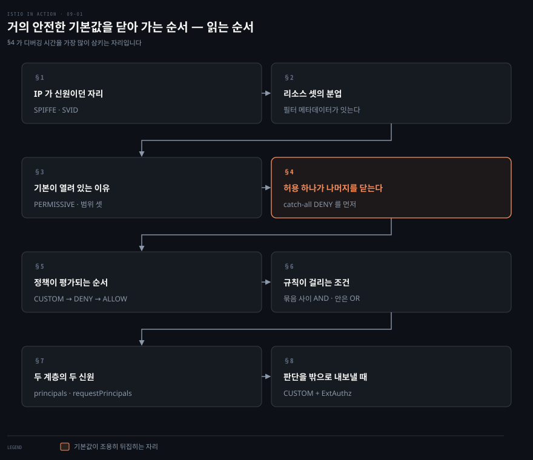
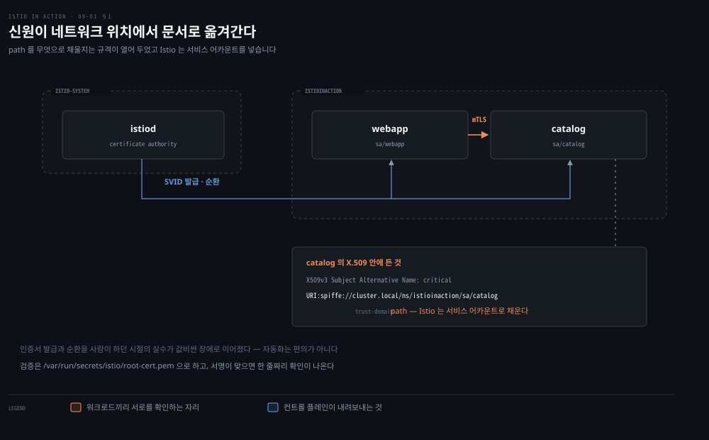
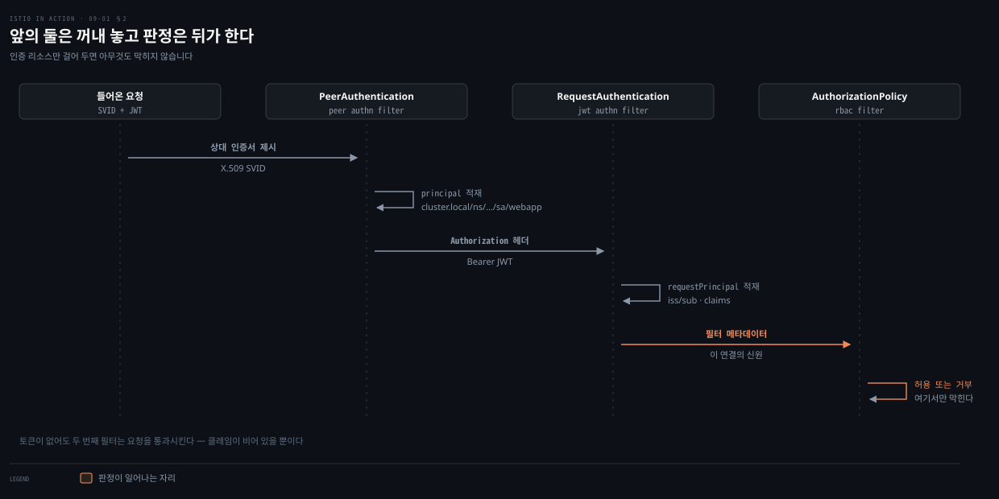
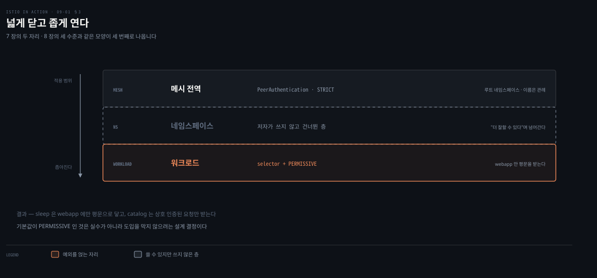
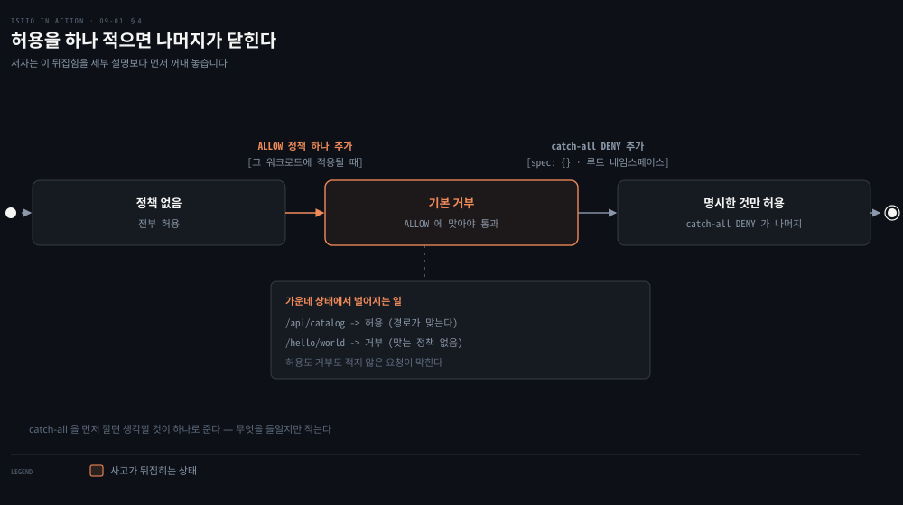
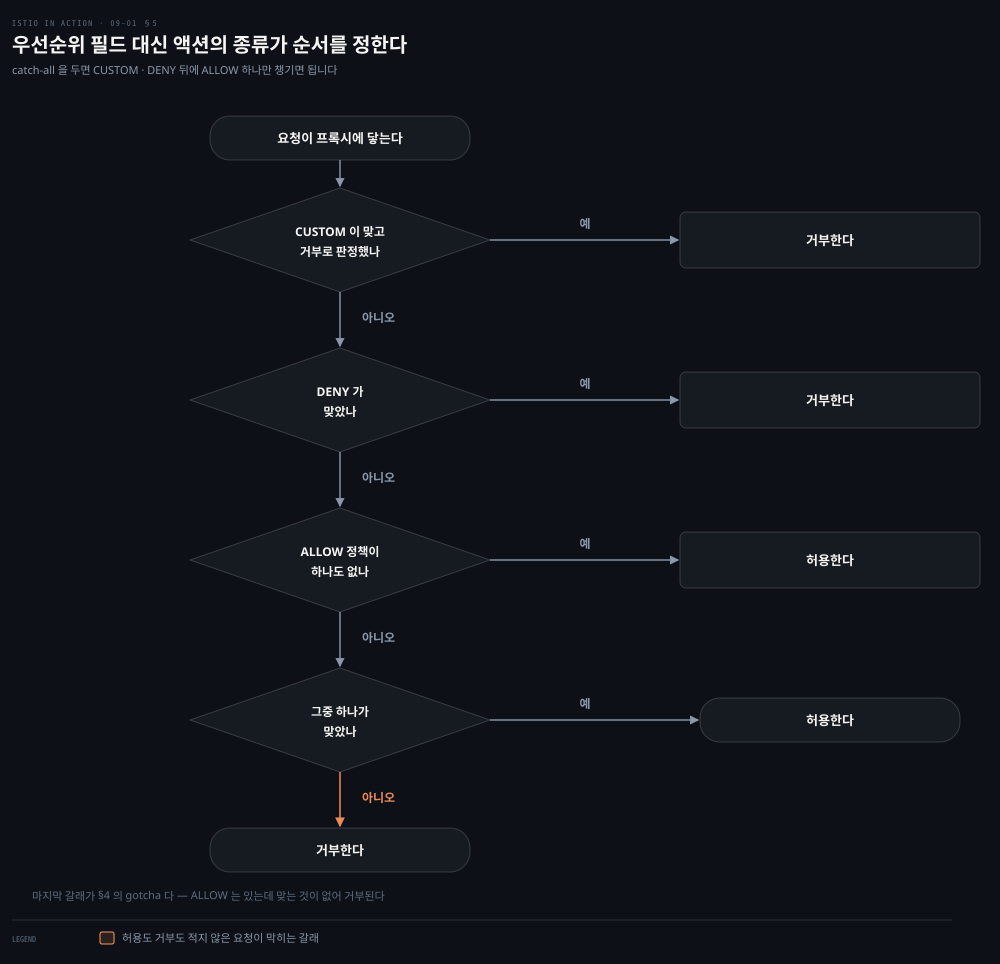
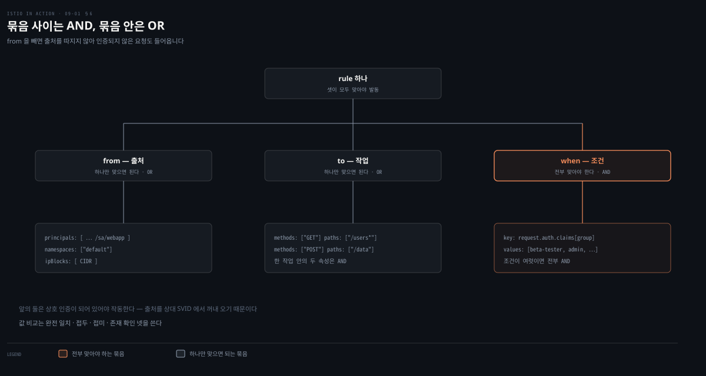
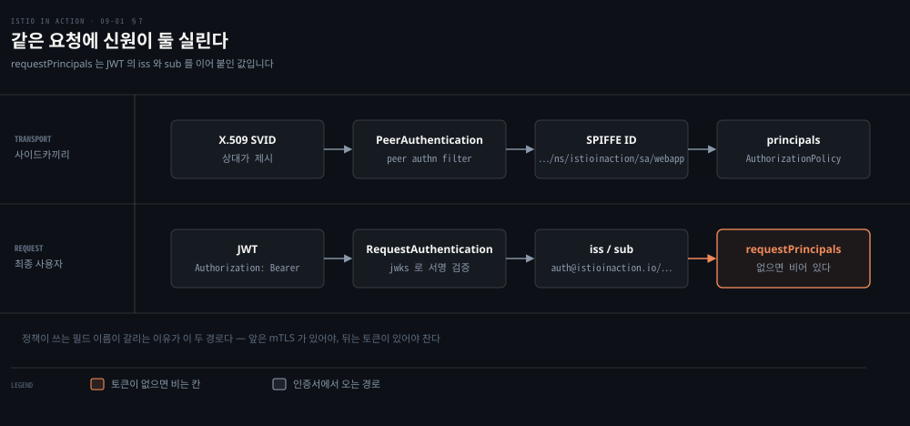
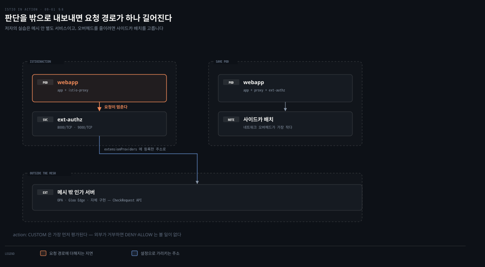

# 거의 안전한 기본값을 닫아 가는 순서

---

> 9장은 메시가 신원을 어디서 얻고 그 신원으로 무엇을 판정하는지를 다룹니다. 저자는 "Istio는 기본적으로 안전하다"로 장을 열었다가 9.2에서 "정확히는 거의 안전하다"로 물러섭니다. 그 사이의 거리가 이 장의 분량입니다.


## 핵심 요약
> 이 장 전체가 매달린 하나의 생각은 **신원을 네트워크 위치에서 워크로드가 들고 다니는 문서로 옮기면 "누가 무엇을"을 프록시가 판정할 수 있게 되지만, 그 판정을 켜는 순간 기본값이 뒤집힌다**는 것입니다. 저자가 열려 있는 기본값을 층층이 닫아 가는 순서로 장을 짠 이유를 이 노트는 그렇게 읽습니다.
>
> 신원의 근거가 바뀝니다. 정적 인프라에서는 IP가 쓸 만한 신원이었습니다. 서비스가 수백 개로 늘고 스케줄러가 서버를 옮겨 다니면 IP는 더 이상 누구인지를 말해 주지 않습니다. Istio는 SPIFFE 규격의 URI를 X.509 인증서에 넣어 워크로드에 쥐여 주고, 그 path를 쿠버네티스 서비스 어카운트로 채웁니다.
>
> 기본값은 열려 있습니다. 사이드카가 붙은 워크로드 사이는 자동으로 암호화되지만, 평문 요청도 함께 받습니다. 저자는 이것이 실수가 아니라 도입을 쉽게 하려는 설계 결정이라고 밝힙니다. 큰 조직에서 모든 서비스가 메시로 들어오는 데 몇 달에서 몇 년이 걸리기 때문입니다.
>
> 닫는 순간 규칙이 뒤집힙니다. 어떤 워크로드에 `ALLOW` 정책이 하나라도 붙으면 그 워크로드는 기본 거부가 됩니다. 저자는 이것을 "gotcha"라 부르며 디버깅에 몇 시간을 날리게 된다고 경고합니다. 처방은 catch-all `DENY`를 먼저 깔아 사고의 방향을 "허용할 것만 적는다"로 고정하는 것입니다.


## 학습 목표

이 내용을 읽고 나면:

1. IP가 신원으로 쓰이지 못하게 된 조건을 들고, SPIFFE ID의 두 조각이 각각 무엇을 가리키는지 말할 수 있습니다.
2. 보안 리소스 셋이 요청 하나를 두고 어떻게 분업하는지, 그 사이를 잇는 것이 무엇인지 압니다.
3. `PERMISSIVE`가 기본인 이유와 `STRICT`로 옮겨 가는 범위 세 층을 설명할 수 있습니다.
4. `ALLOW` 정책 하나가 워크로드의 기본값을 뒤집는 이유와 그 대처를 압니다.
5. `principals`와 `requestPrincipals`가 어디서 오는지 구분하고, `RequestAuthentication`만으로는 아무것도 막지 못하는 이유를 압니다.

아래는 이 문서 전체를 읽는 순서로 이은 지도입니다. 칸마다 절 번호와 그 절의 요점 하나를 적었습니다. 색이 붙은 칸이 실무에서 가장 많이 다치는 자리입니다.




## 이 문서가 다루지 않는 것

> 보안 기초는 이 폴더 밖에 이미 있습니다. 겹치는 것은 옮겨 적지 않고 링크로 넘깁니다.

저자 자신이 9.1을 "간단한 복습(brief refresher)"이라 부르고 상세는 부록 C로 넘깁니다. 이 노트도 같은 자리에서 넘깁니다.

- 인증과 인가의 정의, 401과 403의 경계, RBAC과 ABAC: [인증과 인가](../../../99_ETC/security/01_concepts/01_authentication-vs-authorization.md)
- JWT의 세 조각과 서명, `alg: none` 같은 검증 함정: [JWT 설계](../../../99_ETC/security/01_concepts/03_jwt-design.md)
- 인증 서버가 토큰을 발급하는 흐름과 OIDC: [OAuth2와 OIDC](../../../99_ETC/security/01_concepts/02_oauth2-oidc.md)
- X.509 인증서, CA가 서명을 보증하는 구조, TLS 핸드셰이크: [TLS로 컴포넌트 안전하게 연결하기](../container-security/11-01.TLS%EB%A1%9C%20%EC%BB%B4%ED%8F%AC%EB%84%8C%ED%8A%B8%20%EC%95%88%EC%A0%84%ED%95%98%EA%B2%8C%20%EC%97%B0%EA%B2%B0%ED%95%98%EA%B8%B0%20%E2%80%94%20%ED%82%A4%C2%B7%EC%9D%B8%EC%A6%9D%EC%84%9C%C2%B7CA%EC%9D%98%20%EC%97%AD%ED%95%A0.md)
- 쿠버네티스 자체의 인가, 곧 API 서버 앞의 RBAC: [RBAC — 인가를 설계하고 운영하는 법](../kubernetes-up-and-running/14-01.RBAC%20%E2%80%94%20%EC%9D%B8%EA%B0%80%EB%A5%BC%20%EC%84%A4%EA%B3%84%ED%95%98%EA%B3%A0%20%EC%9A%B4%EC%98%81%ED%95%98%EB%8A%94%20%EB%B2%95.md)

남는 것은 **메시가 있어야만 생기는 이야기**입니다. 인증서를 사람이 만들지 않아도 되게 만든 구조, 그 인증서가 담은 신원으로 프록시가 직접 판정하는 방식, 그리고 그 판정을 켜고 끄는 자리에서 기본값이 어떻게 움직이는지입니다.

CRD 필드의 전체 목록은 아래 각주가 가리키는 istio.io 레퍼런스가 SSOT입니다. 진단 도구로 정책 오류를 잡는 이야기는 10장이 맡습니다.


## 1. IP가 신원이던 자리를 무엇이 대신하는가
> 저자는 모놀리스와 마이크로서비스를 신원의 근거로 가릅니다. 둘 다 인증과 인가가 필요하다는 점은 같습니다. 다른 것은 무엇을 근거로 상대를 알아보느냐입니다.



정적 인프라에서는 IP가 쓸 만한 신원이었습니다. 서비스가 가상 머신이나 물리 서버에 고정돼 있으니 주소가 곧 누구인지를 말해 주었고, 인증서와 방화벽 규칙이 그 주소를 그대로 썼습니다.

마이크로서비스는 그 전제를 깹니다. 서비스가 수백에서 수천 개로 늘면 정적 환경에서 운영하는 일 자체가 버티지 못합니다. 그래서 클라우드와 컨테이너 오케스트레이션으로 옮겨 가는데, 거기서는 서비스가 여러 서버에 흩어져 스케줄링되고 수명이 짧습니다. IP는 더 이상 믿을 만한 신원의 출처가 아닙니다. 게다가 서비스들이 같은 네트워크 안에 있으리라는 보장도 없어, 여러 클라우드와 온프레미스에 걸칠 수 있습니다.

Istio가 그 자리에 놓는 것이 SPIFFE입니다. 형식은 RFC 3986을 따르는 URI 하나로 `spiffe://<trust-domain>/<path>` 꼴입니다.

`trust-domain`은 신원을 발급한 주체를 나타내고, `path`는 그 신뢰 도메인 안에서 워크로드를 유일하게 가리킵니다. **`path`를 무엇으로 채울지는 규격이 정하지 않고 구현자에게 열어 둡니다.** Istio는 여기를 워크로드가 띄워진 서비스 어카운트로 채웁니다.

`catalog` 워크로드라면 `spiffe://cluster.local/ns/istioinaction/sa/catalog`가 됩니다.

이 URI가 X.509 인증서에 실린 것을 SVID(SPIFFE Verifiable Identity Document)라 부릅니다. 컨트롤 플레인이 워크로드마다 발급합니다.

저자는 이 인증서를 `openssl`로 직접 열어 확인합니다. `X509v3 Subject Alternative Name` 항목에 위 URI가 들어 있습니다. `/var/run/secrets/istio/root-cert.pem`에 마운트된 루트 인증서로 서명을 검증하면 `OK`가 나옵니다.

여기서 자동화가 왜 중요한지를 저자가 못 박습니다. 인증서 발급과 순환을 사람이 관리하던 시절에는 실수가 잦았고, 그 실수가 피할 수 있었던 값비싼 장애로 이어졌습니다. 자동화가 편의가 아니라 장애 대책이라는 말입니다.


## 2. 리소스 셋이 요청 하나를 두고 하는 일
> 신원이 생기면 그것으로 판정할 수 있습니다. 저자는 메시 운영자의 관점으로 시점을 옮겨 리소스 셋을 소개합니다.



- **`PeerAuthentication`** — 서비스 사이 트래픽을 인증하도록 프록시를 설정합니다. 인증에 성공하면 상대 인증서에 담긴 정보를 꺼내 인가 판정에 쓸 수 있게 만듭니다.
- **`RequestAuthentication`** — 최종 사용자 자격 증명을 그것을 발급한 서버에 대조해 인증하도록 설정합니다. 성공하면 마찬가지로 자격 증명에 담긴 정보를 꺼내 둡니다.
- **`AuthorizationPolicy`** — 앞의 둘이 꺼내 둔 데이터를 근거로 요청을 허용하거나 거부합니다.

셋을 잇는 것은 **필터 메타데이터**입니다. SVID나 JWT에서 뽑아낸 값이 프록시 안에서 필터 사이를 오가는 키-값 쌍으로 저장되고, 그것이 그 연결의 신원이 됩니다. 저자는 이 값을 Istio 사용자에게는 대체로 구현 세부라고 적습니다.

순서가 중요합니다. 앞의 두 리소스는 **꺼내 놓기만** 하고 판정은 세 번째가 합니다.

이 분업을 놓치면 §7에서 볼 함정에 그대로 걸립니다. `RequestAuthentication`을 걸어 두면 토큰 검사가 되리라 기대하게 되는데, 그 리소스는 아무것도 막지 않습니다.

istiod가 이 리소스들을 Envoy 설정으로 바꿔 프록시에 밀어 넣는 경로도 저자가 짚습니다. `PeerAuthentication`은 리스너 디스커버리 서비스(LDS)로 내려가고, 설정된 정책은 들어오는 요청마다 평가됩니다.


## 3. 기본이 열려 있는 이유와 닫는 범위 셋
> 사이드카가 붙은 워크로드 사이의 트래픽은 기본으로 암호화되고 상호 인증됩니다. 그런데 평문 요청도 함께 받습니다.



저자는 이 지점에서 스스로 표현을 고칩니다. "기본적으로 안전하다"고 말했지만 정확히는 "거의 안전하다"이고, 메시를 더 안전하게 만드는 일은 여전히 우리 몫이라는 것입니다.

왜 설치 시점부터 막지 않는지도 밝힙니다. **메시 도입을 쉽게 하려는 설계 결정입니다.** 팀마다 자기 서비스를 관리하는 큰 조직에서는 모든 서비스가 메시로 들어오기까지 몇 달에서 몇 년이 걸릴 수 있습니다. 그동안 평문을 막아 두면 도입 자체가 멈춥니다.

닫는 손잡이가 `PeerAuthentication`이고, 모드는 넷입니다.

| 모드 | 하는 일 |
|---|---|
| `STRICT` | 상호 인증된 트래픽만 받습니다 |
| `PERMISSIVE` | 암호화된 것과 평문을 모두 받습니다 |
| `UNSET` | 상위 정책을 물려받습니다 |
| `DISABLE` | 터널링하지 않고 애플리케이션으로 바로 보냅니다 |

적용 범위는 셋입니다. 메시 전체, 네임스페이스, 그리고 셀렉터가 고른 워크로드입니다.

저자는 셋 중 둘만 적용합니다. 메시 전역에 `STRICT`를 깔아 평문을 전부 막고, `webapp` 하나에만 `PERMISSIVE`를 얹습니다. `catalog`는 `STRICT`로 남습니다. 가운데 네임스페이스 정책은 YAML까지 보인 뒤 "그러지는 말자"며 적용하지 않습니다. 네임스페이스 전체를 열면 `catalog`까지 함께 열려 공격 표면이 커지기 때문입니다.

여기서 걸기 쉬운 착각이 하나 있습니다. `PERMISSIVE`는 평문을 **보내는** `sleep`이 아니라 그것을 **받는** `webapp`에 겁니다. `sleep`에는 사이드카가 없어 정책을 걸 자리 자체가 없습니다.

> **원문 정오**: 저자는 메시 전역 정책의 조건을 둘이라고 적습니다. Istio 설치 네임스페이스에 있어야 하고, 이름이 `"default"`여야 한다는 것입니다. 그런데 **바로 다음 문단의 주석이 그 말을 뒤집습니다.** "메시 전역 리소스의 이름을 `default`로 두는 것은 요구사항이 아니라 관례이며, 메시 전역 `PeerAuthentication` 리소스가 하나만 만들어지도록 하기 위한 것"이라고 적혀 있습니다. 공식 레퍼런스도 메시 수준 정책에 대해 "설치에 맞는 루트 네임스페이스에 두라"고만 하고 이름은 요구하지 않습니다.[^peer-authn] 주석 쪽이 맞고 본문의 "두 조건"이 틀렸습니다.

암호화가 실제로 일어나는지는 저자가 `tcpdump`로 확인합니다. 프록시 컨테이너에 그 도구가 이미 들어 있지만 권한이 꺼져 있어, `values.global.proxy.privileged=true`로 다시 설치하고 파드를 새로 띄웁니다. 평문으로 들어온 `sleep`의 요청은 그대로 읽히고, 상호 인증된 `webapp`과 `catalog` 사이는 읽히지 않습니다.

저자가 바로 경고를 답니다. 권한이 올라간 프록시는 공격 벡터가 되므로 운영 클러스터에는 이렇게 설치하지 않습니다. 한 서비스만 급히 들여다봐야 하면 그 배포만 손으로 고칩니다.

> **원문 정오**: 저자는 9.3.2에서 이 상태를 정리하며 "그림 9.7을 보라"고 적습니다. 그런데 그림 9.7은 `tcpdump` 출력, 곧 평문이 그대로 읽히는 화면입니다. 이어지는 세 줄이 `sleep`·`webapp`·`catalog`가 각각 어떤 트래픽을 받는지를 적고 있으므로 가리켜야 할 것은 "webapp은 HTTP 트래픽을 받고 catalog는 상호 인증을 요구한다"는 캡션이 붙은 그림 9.6입니다. 앞 절에서 방금 만든 상태를 되짚는 자리라 번호가 하나 앞으로 밀린 것으로 읽힙니다.

여기서 이 폴더가 세 번째로 같은 모양을 만납니다. 7장의 두 자리, 8장의 세 수준, 9장의 세 범위가 모두 넓은 기본값 위에 좁은 예외를 얹는 구조입니다. Istio의 설정이 대체로 이 형태를 띤다는 신호로 읽힙니다.


## 4. 허용 하나가 나머지를 닫는다
> 이 장에서 실무가 가장 많이 다치는 자리입니다. 저자가 세부에 들어가기 **전에** 먼저 꺼내 놓습니다.



저자의 표현을 그대로 옮기면 이렇습니다. 미리 알아 둬야 할 "gotcha"가 하나 있고, 모르면 물리기 쉬우며 디버깅에 몇 시간을 날리게 된다는 것입니다. 내용은 한 문장입니다. **어떤 워크로드에 `ALLOW` 인가 정책이 하나 이상 적용되면, 그 워크로드로 가는 접근은 모든 트래픽에 대해 기본 거부가 됩니다.**

저자가 든 예가 이 뒤집힘을 정확히 보입니다. `webapp`에 `/api/catalog*` 경로를 허용하는 정책 하나를 붙이면 두 요청의 운명이 갈립니다.

- `webapp.istioinaction/api/catalog` — 경로가 맞아 허용됩니다.
- `webapp.istioinaction/hello/world` — **어떤 정책도 명시적으로 허용하지 않아 거부됩니다.**

두 번째가 눈썹을 들어 올리게 만든다고 저자는 적습니다. 허용도 거부도 하지 않은 요청이 왜 막히느냐는 것입니다. 답은 `ALLOW` 정책이 붙은 워크로드에만 적용되는 기본 거부 동작이라는 데 있습니다.

처방은 사고의 방향을 뒤집는 것입니다. 서비스마다 "여기에 `ALLOW` 정책이 붙어 있던가"를 되묻지 않으려면, 아무 정책도 걸리지 않을 때 발동하는 catch-all 거부 정책을 먼저 깝니다.

```yaml
apiVersion: security.istio.io/v1beta1
kind: AuthorizationPolicy
metadata:
  name: deny-all
  namespace: istio-system
spec: {}
```

빈 명세가 모든 요청을 거부한다는 것이 이 리소스의 규약입니다. 반대쪽도 있습니다. 규칙이 아예 없으면 아무것도 허용되지 않고, **빈 규칙이 하나 있으면 모두 허용됩니다.**

```yaml
spec:
  rules:
  - {}
```

`spec: {}`와 `rules: [{}]`가 정반대의 뜻이라는 것이 이 API에서 가장 헷갈리는 대목입니다. 공식 레퍼런스가 같은 구분을 명시합니다.[^authz-policy]

catch-all을 깔고 나면 생각할 것이 하나로 줄어듭니다. 무엇을 들일지만 적으면 됩니다.


## 5. 정책이 평가되는 순서
> 정책이 여러 개 붙기 시작하면 어느 것이 먼저인지가 문제가 됩니다. 많은 해법이 우선순위 필드를 두는데, Istio는 다른 길을 갑니다.



순서는 액션의 종류로 정해집니다.

1. `CUSTOM` 정책이 먼저 평가됩니다. 외부 인가 서버로 넘기는 §8의 방식이 여기 해당합니다.
2. `DENY` 정책이 다음입니다. 맞는 것이 있으면 거기서 끝납니다.
3. `ALLOW` 정책이 평가됩니다. 하나라도 맞으면 허용입니다.
4. 아무것도 맞지 않으면 catch-all 정책의 유무가 결정합니다. 없으면 `ALLOW` 정책 자체가 없을 때만 허용되고, `ALLOW` 정책이 있는데 맞는 것이 없으면 거부됩니다.

저자가 흐름도를 붙이며 덧붙이는 말이 이 절의 요점입니다. 흐름이 조금 복잡하지만 **catch-all `DENY`를 정의해 두면 훨씬 단순해집니다.** `CUSTOM`과 `DENY`가 거부하지 않았다면 `ALLOW` 하나만 챙기면 되기 때문입니다. §4의 처방이 여기서 다시 값을 합니다.

공식 레퍼런스의 다섯 단계도 같은 결론에 이릅니다. `ALLOW` 정책이 없으면 허용하고, 있는데 맞는 것이 없으면 거부합니다.[^authz-policy]


## 6. 규칙 하나가 걸리는 조건
> `AuthorizationPolicy`의 명세는 필드 셋으로 이루어집니다. `selector`가 적용 대상을 고르고, `action`이 `ALLOW`·`DENY`·`CUSTOM` 중 무엇인지 정하며, `rules`가 정책을 발동시킬 요청을 식별합니다. 복잡한 것은 마지막입니다.



규칙 하나는 세 부분으로 이루어집니다.

- **`from`** — 요청의 출처입니다. `principals`(SPIFFE ID 목록), `namespaces`(출처 네임스페이스), `ipBlocks`(IP 또는 CIDR) 셋 중 하나로 지정합니다. 앞의 둘은 **상호 인증이 되어 있어야만** 작동합니다. 출처 네임스페이스를 상대 SVID에서 꺼내 오기 때문입니다.
- **`to`** — 요청의 작업입니다. 호스트나 메서드 같은 것입니다.
- **`when`** — 규칙이 맞은 뒤에 추가로 만족해야 할 조건 목록입니다.

결합 방식이 이 절의 내용입니다. 저자의 서술을 그대로 옮기면, `from`에 정의된 출처 **하나**와 `to`에 정의된 작업 **하나**가 AND로 묶이고, 거기에 `when`의 조건 **전부**가 다시 AND로 묶입니다. 같은 묶음 안의 항목끼리는 OR입니다.

한 겹 더 들어갑니다. 작업(`operation`) 하나 안에 `methods`와 `paths`가 함께 있으면 그 둘은 AND입니다. 작업이 여럿이면 그중 하나만 맞으면 됩니다. 곧 **묶음 사이는 AND, 묶음 안은 OR, 작업 하나 안의 속성은 다시 AND**입니다.

값 비교는 정확히 같을 필요가 없습니다. 저자가 네 가지를 듭니다.

| 방식 | 예 | 맞는 것 |
|---|---|---|
| 완전 일치 | `GET` | 그 값만 |
| 접두 일치 | `/api/catalog*` | `/api/catalog/1` 같은 것 |
| 접미 일치 | `*.istioinaction.io` | `login.istioinaction.io` 같은 것 |
| 존재 확인 | `*` | 값은 상관없고 필드가 있기만 하면 |

`from` 없이 `to`만 적으면 어떻게 되는지도 저자가 실습으로 보입니다. 출처를 따지지 않으므로 **인증되지 않은 워크로드의 요청도 받습니다.** 사이드카가 없는 `sleep`을 통과시키려고 저자가 쓴 방법이 이것이고, 그러면서 권장하는 쪽은 따로 적습니다. `sleep`에 프록시를 주입해 신원을 갖게 하는 것이 먼저이고, 이 방법은 "팀 전체가 휴가 중이라" 어쩔 수 없을 때의 차선입니다.


## 7. 피어의 신원과 최종 사용자의 신원
> 같은 요청에 신원이 둘 실릴 수 있습니다. 하나는 전송 계층에서, 하나는 요청 안에서 옵니다.



저자가 별도 상자로 가릅니다. `principals`는 `PeerAuthentication`이 설정한 mTLS 연결의 상대이고, `requestPrincipals`는 `RequestAuthentication`이 처리하는 최종 사용자 쪽이며 JWT에서 옵니다.

`requestPrincipals`가 만들어지는 방식이 흥미롭습니다. 저자의 표현으로는 "어디서 초기화되는지 놀랄 수 있다"인데, **JWT의 `iss`와 `sub` 클레임을 `iss/sub` 형식으로 이어 붙인 것**입니다. 그래서 정책에 `auth@istioinaction.io/*`처럼 씁니다. §6의 값 비교로 보면 접두 일치이고, 발급자만 고정하고 주체는 무엇이든 받겠다는 뜻입니다.

`RequestAuthentication`이 하는 일은 검증과 추출까지입니다. 결과는 셋으로 갈립니다.

- 유효한 토큰을 가진 요청은 들어오고, 클레임이 필터 메타데이터에 담깁니다.
- 유효하지 않은 토큰을 가진 요청은 거부됩니다.
- **토큰이 없는 요청은 들어옵니다.** 다만 요청 신원이 없어 클레임도 없습니다.

세 번째가 함정입니다. 저자도 "혼란스럽다"고 적습니다. 토큰 없는 요청이 거부되리라 기대하지만 그렇지 않습니다. 프런트엔드를 서빙하는 것처럼 토큰이 없는 상황이 실제로 많기 때문이라는 것이 저자의 설명입니다. 공식 레퍼런스도 같은 말을 하며, 인증된 요청만 받으려면 인가 규칙을 함께 두라고 적습니다.[^request-authn]

막는 방법은 `AuthorizationPolicy`를 따로 세우는 것입니다.

```yaml
action: DENY
rules:
- from:
  - source:
      notRequestPrincipals: ["*"]
  to:
  - operation:
      hosts: ["webapp.istioinaction.io"]
```

요청 신원이 아무 값도 갖지 않는 출처를 전부 거부한다는 뜻입니다. 이 정책을 붙이기 전 200이던 토큰 없는 요청이 붙인 뒤 403이 됩니다.

클레임으로 권한을 가르는 것도 같은 자리에서 합니다. 일반 사용자에게는 `GET`만 열고, `group: admin` 클레임을 가진 토큰에는 전부 엽니다.

저자가 이 차이를 보이는 두 명령을 그대로 대조 실험으로 읽으면 안 됩니다. 일반 사용자 쪽은 `-XPOST localhost/api/catalog`로 보내 `RBAC: access denied`를 받고, 관리자 쪽은 `-XPOST localhost/api/catalog/items`로 보내 200을 받습니다. 토큰과 경로가 함께 바뀌었습니다.

결론 자체는 유지됩니다. 일반 사용자용 `ALLOW` 정책이 `methods: ["GET"]`으로 묶여 있어 어느 경로로 보내든 `POST`는 거부되기 때문입니다. 다만 그 판단은 정책 정의를 봐야 나오고 두 출력만으로는 나오지 않습니다.

> **원문 정오**: 실습에 쓰는 토큰과 등록한 발급자가 어긋납니다. 저자는 9.4.1에서 `ch9/enduser/user.jwt`를 디코드해 보이는데 그 출력의 `iss`는 `testing@secure.istio.io`입니다. 그런데 9.4.3의 `RequestAuthentication`은 발급자를 `auth@istioinaction.io` 하나만 등록합니다. 이어지는 "유효한 발급자의 토큰은 통과한다" 실습이 **같은 `user.jwt`로 200을 받습니다.** 앞의 디코드 출력이 맞다면 이 요청은 바로 다음 실습에서 잘못된 발급자에게 돌아온 `Jwt issuer is not configured`를 받아야 합니다. 두 자리 중 하나가 판 사이에 갱신되지 않은 것으로 읽힙니다.

저자가 이 일을 인그레스 게이트웨이에서 하라고 권하는 이유도 둘 댑니다. 잘못된 요청을 일찍 걷어 내 성능에 이롭고, Istio가 JWT를 요청에서 지워 뒤쪽 서비스가 실수로 흘리거나 재전송 공격에 쓰이지 않게 할 수 있기 때문입니다.


## 8. 판단을 밖으로 내보낼 때
> Istio의 인가는 Envoy에 이미 들어 있는 RBAC 기능 위에 세워집니다. 더 정교하거나 우리만의 방식이 필요하면 판단 자체를 다른 서비스로 넘길 수 있습니다.



프록시로 들어온 요청이 잠시 멈춥니다. 그동안 프록시가 외부 인가(`ExtAuthz`) 서비스를 호출해 허용인지 거부인지를 받아 옵니다.

그 서비스는 Envoy의 `CheckRequest` API를 구현하기만 하면 됩니다. 저자는 Open Policy Agent와 Gloo Edge Ext Auth를 포함해 넷을 예로 듭니다.

살 수 있는 자리는 셋입니다. 메시 안, 애플리케이션의 사이드카, 그리고 메시 밖입니다.

설정은 두 곳에 나뉩니다. 먼저 `istio` 컨피그맵의 `extensionProviders`에 이름과 주소를 등록합니다.

```yaml
extensionProviders:
- name: "sample-ext-authz-http"
  envoyExtAuthzHttp:
    service: "ext-authz.istioinaction.svc.cluster.local"
    port: "8000"
    includeHeadersInCheck: ["x-ext-authz"]
```

그다음 `AuthorizationPolicy`에서 `action: CUSTOM`으로 그 이름을 가리킵니다. 저자가 못 박는 대로 `provider.name`은 컨피그맵에 적은 이름과 정확히 같아야 합니다.

이 방식의 대가를 저자가 별도 상자로 적습니다. **호출이 요청 경로 안에서 일어나므로 지연이 늘어납니다.** Istio 내장 인가로 충분하고 유연할 것이며, 완전한 제어가 필요할 때만 그 성능 대가를 따져 보라는 것입니다. 네트워크 오버헤드를 줄이려면 `ExtAuthz`를 애플리케이션의 사이드카로 배포할 수 있다는 선택지도 함께 답니다.

여기서 §5의 순서가 다시 값을 합니다. `CUSTOM`이 가장 먼저 평가되므로, 외부 서비스가 거부하면 뒤의 `DENY`·`ALLOW`는 볼 일이 없습니다. 요청 경로에 외부 호출을 하나 끼워 넣는 결정이 그만큼 앞자리에 놓인다는 뜻입니다.


## 심화 학습

> 책 밖의 보강만 둡니다. 각 항목은 공식 1차 자료로 확인한 것입니다.

**API 버전이 올라갔습니다.** 저자의 예제는 전부 `security.istio.io/v1beta1`입니다. `PeerAuthentication`·`AuthorizationPolicy`·`RequestAuthentication` 셋 모두 현재 레퍼런스는 `security.istio.io/v1`을 씁니다.[^peer-authn][^authz-policy][^request-authn]

**`UNSET`은 물려받을 상위가 없으면 `PERMISSIVE`입니다.** 저자는 "상위 정책을 물려받는다"고만 적습니다. 공식 문서는 물려받을 것이 없을 때 `PERMISSIVE`로 취급된다고 이어 적습니다.[^peer-authn] 기본값이 열려 있다는 §3의 이야기가 이 규칙에서 나옵니다.

**루트 네임스페이스의 `PeerAuthentication`에는 셀렉터가 듣지 않습니다.** 공식 문서가 "루트 네임스페이스에 배포된 워크로드 셀렉터가 있는 `PeerAuthentication` 정책은 무시된다"고 명시합니다.[^peer-authn] 저자는 메시 전역 정책을 셀렉터 없이만 쓰므로 걸리지 않지만, 범위를 좁히려다 조용히 무시될 수 있는 자리입니다.

**액션에 `AUDIT`이 하나 더 있습니다.** 저자는 `ALLOW`·`DENY`·`CUSTOM` 셋만 듭니다. 공식 레퍼런스에는 요청을 기록할지 결정하는 `AUDIT`이 있고, 이 액션은 허용·거부 자체에는 영향을 주지 않습니다.[^authz-policy] 정책을 실제로 걸기 전에 무엇이 걸릴지 관찰하는 용도로 쓸 수 있습니다.

**JWKS를 넣는 자리는 둘이고 서로 배타적입니다.** 저자는 공개키 집합을 `jwks` 필드에 통째로 붙여 넣습니다. 공식 문서는 `jwks`와 `jwksUri` 중 하나만 써야 한다고 적습니다.[^request-authn] URL 쪽을 고르면 키가 순환할 때 리소스를 고치지 않아도 된다는 것이 이 노트의 읽기입니다.

**토큰을 뒤로 넘길지도 필드로 정합니다.** 저자가 "Istio가 JWT를 요청에서 지운다"고 적은 동작은 `forwardOriginalToken`의 기본값이 `false`인 데서 옵니다. 클레임만 뒤로 넘기고 싶으면 `outputPayloadToHeader`로 Base64 페이로드를 헤더에 실을 수 있습니다.[^request-authn]


## 결정 치트시트

> 저자가 본문에서 근거를 밝힌 것만 담습니다. 판단 근거가 원문에 없는 줄은 넣지 않았습니다.

| 상황 | 고를 것 | 저자가 댄 근거 |
|---|---|---|
| 메시 전체에서 평문을 막아야 함 | 루트 네임스페이스의 `PeerAuthentication` `STRICT` | 메시 전역 기본값 |
| 아직 못 들어온 워크로드에서 오는 요청이 있음 | 그 요청을 **받는** 워크로드만 `PERMISSIVE` | 공격 표면을 작게 유지 |
| 조직 전체 마이그레이션이 몇 년짜리 | `PERMISSIVE`로 시작 | 도입을 막지 않으려는 설계 결정 |
| 암호화 여부를 눈으로 봐야 함 | 프록시 안의 `tcpdump` | 도구가 이미 들어 있음 |
| 운영 클러스터 | 권한 올린 프록시 금지 | 공격 벡터가 됨 |
| 정책이 많아 판단이 어려움 | catch-all `DENY`를 먼저 | 허용할 것만 생각하면 됨 |
| 모든 요청을 거부 | `spec: {}` | 빈 명세는 전부 거부 |
| 모든 요청을 허용 | `rules: [{}]` | 빈 규칙은 전부 허용 |
| 출처를 신원으로 가려야 함 | `principals` 또는 `namespaces` | 상대 SVID에서 꺼내므로 mTLS 필요 |
| 사이드카 없는 워크로드를 들여야 함 | `from`을 뺀 규칙 | 출처를 따지지 않음 |
| 최종 사용자를 가려야 함 | `requestPrincipals` | `iss/sub`로 만들어짐 |
| 토큰 없는 요청을 막아야 함 | `notRequestPrincipals: ["*"]` `DENY` | `RequestAuthentication`은 강제하지 않음 |
| 인가 판단이 Istio 밖에 있음 | `action: CUSTOM` + `extensionProviders` | 요청 경로 지연을 대가로 |


## 적용 관점

> 실무 규칙 하나와 Spring 쪽 경계 하나가 남습니다. 정책을 켜기 전에 거부부터 깔아 두는 것, 그리고 메시가 가려 주는 신원과 애플리케이션이 봐야 하는 신원이 다르다는 것입니다.

이 장에서 실무로 곧장 넘어가는 규칙은 하나입니다. **`ALLOW` 정책을 처음 붙이기 전에 catch-all `DENY`를 먼저 깝니다.** 순서를 바꾸면 그 워크로드의 기본값이 조용히 뒤집힌 상태에서 정책을 하나씩 얹게 되고, 막힌 경로가 나올 때마다 원인이 정책인지 애플리케이션인지 가리는 데 시간을 씁니다. 저자가 이 뒤집힘을 세부 설명 앞에 먼저 꺼내 놓은 것이 그 신호로 읽힙니다.

디버깅에도 순서가 있습니다. §5의 평가 순서가 그대로 진단 순서입니다. 거부된 요청을 만나면 `CUSTOM` → `DENY` → `ALLOW` → catch-all 순으로 좁혀 갑니다.

응답 문구도 갈립니다. 어느 층에서 막혔는지가 거기 남습니다.

- 인가에서 막힘 — `RBAC: access denied`
- 토큰 발급자가 등록되지 않음 — `Jwt issuer is not configured`
- mTLS `STRICT`에 평문이 부딪힘 — 연결이 끊겨 `curl`이 종료 코드 56

Spring 애플리케이션 관점에서는 경계가 하나 생깁니다. 메시가 처리하는 것은 **누가 호출했는가**까지입니다. 그 사용자가 이 주문을 볼 자격이 있는지처럼 도메인 데이터를 봐야 하는 판단은 여전히 애플리케이션의 몫입니다. 인가 정책의 `when`으로 클레임을 볼 수는 있지만, 그것은 토큰에 이미 실린 값에 한합니다.

두 계측을 함께 쓸 때 유용한 지점은 토큰이 뒤로 넘어가지 않는다는 기본값입니다. 게이트웨이에서 검증을 마친 뒤 애플리케이션이 클레임을 다시 봐야 한다면 `forwardOriginalToken`이나 `outputPayloadToHeader`를 명시적으로 켜야 합니다. 켜지 않은 채 애플리케이션에서 `Authorization` 헤더를 찾으면 비어 있습니다.


## 면접에서 받을 만한 질문
> 답을 먼저 떠올린 뒤 아래 정답 절을 펼칩니다.

1. 이 장을 한 줄로 정의하면 무엇입니까?
2. 신원의 근거가 네트워크 위치에서 워크로드 문서로 옮겨집니다 — 이것을 근거와 함께 설명해 보십시오.
3. 기본은 열려 있습니다 — 이것을 근거와 함께 설명해 보십시오.
4. `ALLOW` 정책이 하나라도 붙으면 그 워크로드는 기본 거부로 바뀝니다 — 이것을 근거와 함께 설명해 보십시오.
5. mTLS를 켰는데 특정 서비스만 계속 막힙니다.
6. 정책을 하나도 안 걸었는데 왜 어떤 요청은 막힙니까.
7. `spec: {}`와 `rules: [{}]`는 무엇이 다릅니까.
8. `principals`와 `requestPrincipals`는 무엇이 다릅니까.
9. `RequestAuthentication`을 걸었는데 토큰 없는 요청이 통과합니다.
10. 외부 인가 서비스를 쓰면 무엇을 잃습니까.


## 정답 (자답 후 펼치기)

### 정답 1 — 한 줄 정의

Istio는 SPIFFE 신원을 담은 인증서를 워크로드마다 발급해 프록시가 상대를 알아보게 하고, 그 신원과 JWT 클레임을 근거로 요청을 허용하거나 거부합니다.

### 정답 2 — 핵심 포인트

신원의 근거가 네트워크 위치에서 워크로드 문서로 옮겨집니다. SPIFFE URI의 `path`를 Istio는 서비스 어카운트로 채우고, 그것을 X.509에 실어 SVID로 만듭니다.

### 정답 3 — 핵심 포인트

기본은 열려 있습니다. 사이드카 사이는 암호화되지만 평문도 함께 받으며, 이것은 도입을 쉽게 하려는 설계 결정입니다.

### 정답 4 — 핵심 포인트

`ALLOW` 정책이 하나라도 붙으면 그 워크로드는 기본 거부로 바뀝니다. catch-all `DENY`를 먼저 깔아 두면 허용할 것만 생각하면 됩니다.

### 정답 5 — mTLS를 켰는데 특정 서비스만 계속 막힙니다

그 서비스에 사이드카가 없을 가능성이 큽니다. 신원이 없어 상호 인증을 할 수 없기 때문입니다. 권장은 프록시를 주입하는 것이고, 차선은 그 대상 워크로드만 `PERMISSIVE`로 두는 것입니다.

### 정답 6 — 정책을 하나도 안 걸었는데 왜 어떤 요청은 막힙니까

같은 워크로드에 다른 `ALLOW` 정책이 걸려 있는지 봅니다. `ALLOW` 정책이 하나라도 있으면 그중 하나가 맞아야만 통과합니다.

### 정답 7 — `spec: {}`와 `rules: [{}]`는 무엇이 다릅니까

정반대입니다. 빈 명세는 규칙이 없어 아무것도 맞지 않으므로 전부 거부이고, 빈 규칙은 항상 맞으므로 전부 허용입니다.

### 정답 8 — `principals`와 `requestPrincipals`는 무엇이 다릅니까

앞의 것은 mTLS 연결 상대의 SPIFFE ID이고, 뒤의 것은 JWT의 `iss`와 `sub`를 이어 붙인 최종 사용자 식별자입니다. 앞의 것은 `PeerAuthentication`이, 뒤의 것은 `RequestAuthentication`이 채웁니다.

### 정답 9 — `RequestAuthentication`을 걸었는데 토큰 없는 요청이 통과합니다

그 리소스는 검증과 추출만 하고 강제하지 않습니다. 막으려면 `notRequestPrincipals: ["*"]`를 거부하는 `AuthorizationPolicy`를 따로 세웁니다.

### 정답 10 — 외부 인가 서비스를 쓰면 무엇을 잃습니까

지연입니다. 호출이 요청 경로 안에서 일어나므로, 저자는 내장 인가로 충분한지 먼저 따지고 완전한 제어가 필요할 때만 이 대가를 받아들이라고 적습니다.


## 핵심 개념 체크리스트

- [ ] IP가 신원으로 쓰이지 못하게 된 조건을 들 수 있습니다.
- [ ] SPIFFE URI의 두 조각과 Istio가 `path`를 무엇으로 채우는지 압니다.
- [ ] SVID가 무엇이고 어디에 실려 있는지 말할 수 있습니다.
- [ ] 보안 리소스 셋의 분업과 그것을 잇는 필터 메타데이터를 설명할 수 있습니다.
- [ ] mTLS 모드 넷을 들고 각각이 하는 일을 압니다.
- [ ] `PERMISSIVE`가 기본인 이유를 저자의 근거로 말할 수 있습니다.
- [ ] `ALLOW` 정책이 워크로드의 기본값을 뒤집는다는 사실과 그 대처를 압니다.
- [ ] `spec: {}`와 `rules: [{}]`의 차이를 압니다.
- [ ] 정책 평가 순서 넷을 순서대로 들 수 있습니다.
- [ ] 규칙의 AND·OR 결합 구조를 설명할 수 있습니다.
- [ ] `principals`와 `requestPrincipals`의 출처를 구분할 수 있습니다.
- [ ] `RequestAuthentication`만으로는 아무것도 막지 못하는 이유를 압니다.


## 관련 문서

- [메시가 절반까지만 해 주는 일](08-01.메시가%20절반까지만%20해%20주는%20일.md) — 이 장의 정책이 만드는 신호를 보는 장
- [문을 여는 일과 길을 내는 일을 가른다](04-01.문을%20여는%20일과%20길을%20내는%20일을%20가른다.md) — 최종 사용자 인증을 거는 인그레스 게이트웨이를 세운 장
- [Istio in Action 정독 인덱스](README.md)
- [인증과 인가](../../../99_ETC/security/01_concepts/01_authentication-vs-authorization.md) — 정의와 401·403의 SSOT
- [TLS로 컴포넌트 안전하게 연결하기](../container-security/11-01.TLS%EB%A1%9C%20%EC%BB%B4%ED%8F%AC%EB%84%8C%ED%8A%B8%20%EC%95%88%EC%A0%84%ED%95%98%EA%B2%8C%20%EC%97%B0%EA%B2%B0%ED%95%98%EA%B8%B0%20%E2%80%94%20%ED%82%A4%C2%B7%EC%9D%B8%EC%A6%9D%EC%84%9C%C2%B7CA%EC%9D%98%20%EC%97%AD%ED%95%A0.md) — X.509·CA의 SSOT


## 참고 자료

- 《Istio in Action》 9장 "Securing microservice communication" — 이 노트의 1차 자료
- [Istio PeerAuthentication 레퍼런스](https://istio.io/latest/docs/reference/config/security/peer_authentication/) — 모드 넷과 루트 네임스페이스 규칙
- [Istio AuthorizationPolicy 레퍼런스](https://istio.io/latest/docs/reference/config/security/authorization-policy/) — 평가 순서와 빈 명세·빈 규칙
- [Istio RequestAuthentication 레퍼런스](https://istio.io/latest/docs/reference/config/security/request_authentication/) — 강제하지 않는 성질과 JWKS 필드
- [SPIFFE 규격](https://spiffe.io/docs/latest/spiffe-about/overview/) — 신뢰 도메인과 SVID


[^peer-authn]: Istio — PeerAuthentication 레퍼런스. 메시 수준 정책의 루트 네임스페이스 배치, 상위가 없을 때 `PERMISSIVE`로 취급되는 `UNSET`, 루트 네임스페이스에서 무시되는 셀렉터. <https://istio.io/latest/docs/reference/config/security/peer_authentication/>
[^authz-policy]: Istio — AuthorizationPolicy 레퍼런스. 평가 순서 다섯 단계, `spec: {}`와 `rules: [{}]`의 차이, `AUDIT` 액션. <https://istio.io/latest/docs/reference/config/security/authorization-policy/>
[^request-authn]: Istio — RequestAuthentication 레퍼런스. 자격 증명 없는 요청의 수락과 인가 규칙 병행 권고, `jwksUri` 권장, `forwardOriginalToken`·`outputPayloadToHeader`. <https://istio.io/latest/docs/reference/config/security/request_authentication/>
