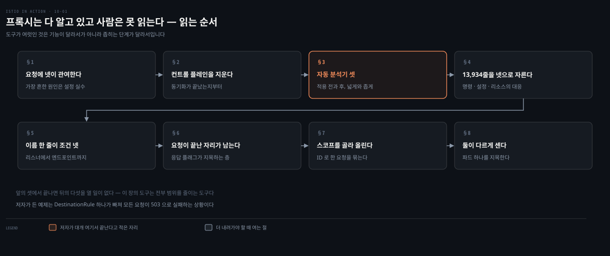
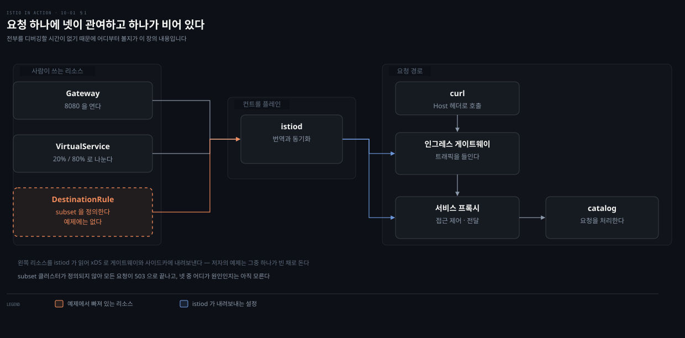
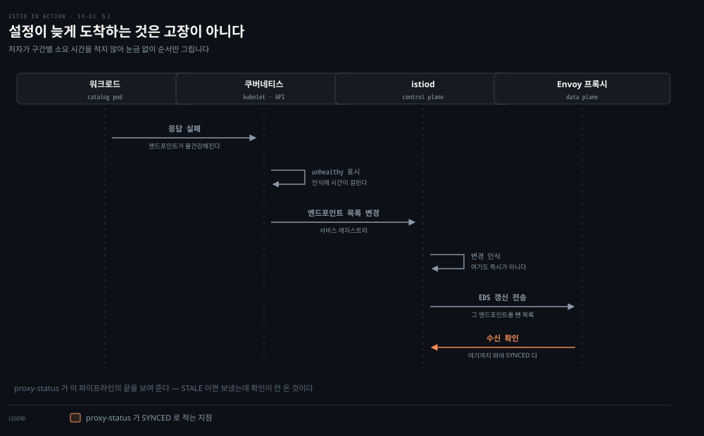
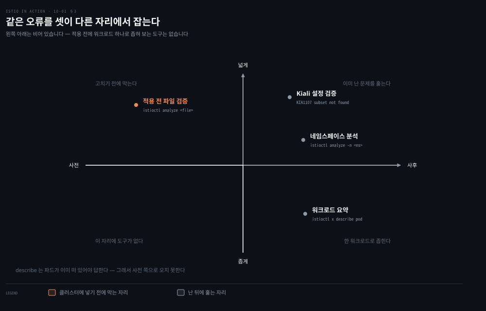
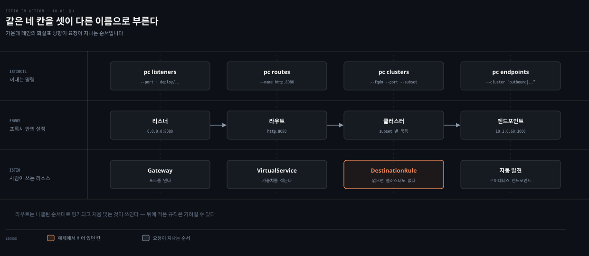
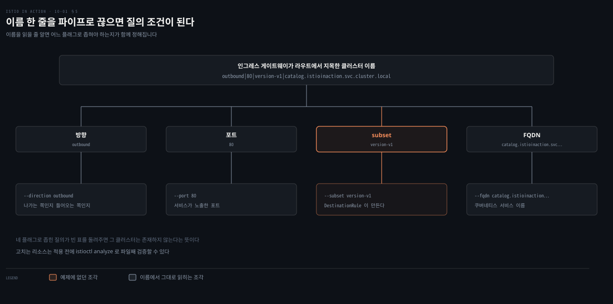
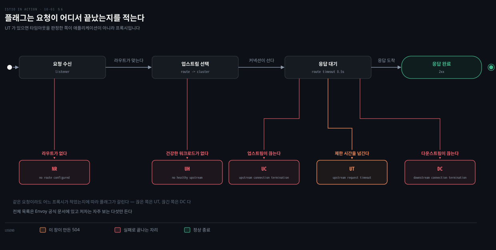
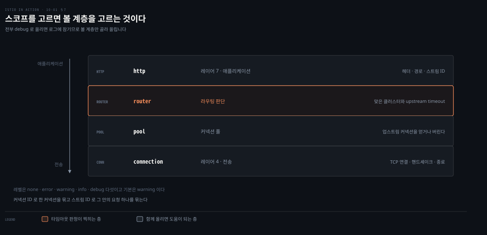
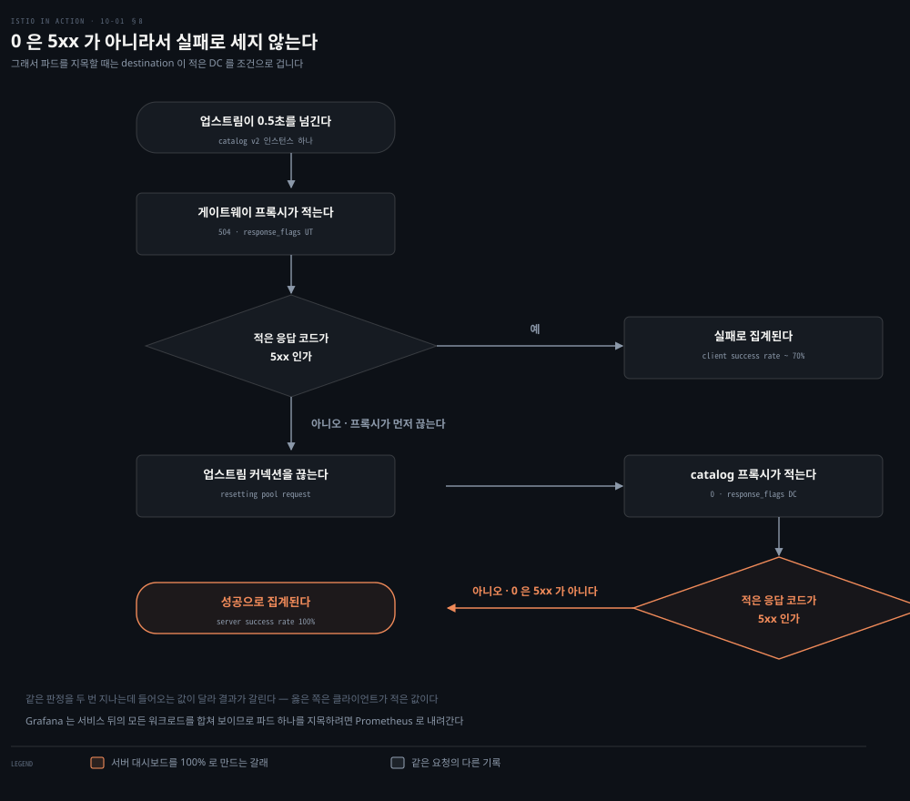

# 프록시는 다 알고 있고 사람은 못 읽는다

---

> 10장은 데이터 플레인이 기대대로 돌지 않을 때 무엇부터 보는지를 다룹니다. 저자가 꺼내는 도구는 여섯인데 기능이 서로 겹칩니다. 겹치지 않는 것은 각 도구가 의심 범위를 좁혀 주는 단계입니다.

## 핵심 요약
> 이 장 전체가 매달린 하나의 생각은 **프록시가 이미 답을 갖고 있고 문제는 그 답이 13,934줄이라는 것**입니다. 저자가 도구를 하나씩 꺼내는 순서를 이 노트는 그렇게 읽습니다.
>
> 시작점이 정해져 있습니다. 요청 하나에 관여하는 것이 넷이라 전부 뒤지면 시간이 걸리는데, 저자는 앱이 클러스터 전체에 영향을 주는 상황에는 그 시간이 없다고 적습니다. 그래서 가장 흔한 원인 하나를 먼저 못 박습니다. 리소스를 적용한 뒤 동작이 기대와 다르면 대개 그 리소스를 잘못 적은 것입니다.
>
> 배제가 먼저입니다. 데이터 플레인 설정은 설계상 나중에 일관해집니다. 그래서 "아직 안 왔다"와 "틀렸다"가 겉으로 같아 보입니다. `istioctl proxy-status`가 그 둘을 갈라 주고, 여기서 이상이 없어야 데이터 플레인을 파고들 자격이 생깁니다.
>
> 자동 분석기가 대부분을 끝냅니다. Kiali의 검증, `istioctl analyze`, `istioctl x describe`가 같은 오류를 다른 자리에서 잡습니다. 저자는 뒤의 둘이 흔한 오류를 짚고 고칠 방향까지 제시하기에 대개 충분하다고 적습니다.
>
> 안 잡히면 손으로 내려갑니다. 리스너에서 라우트로, 라우트에서 클러스터로, 클러스터에서 엔드포인트로 이어지는 체인을 하나씩 질의합니다. 그래도 설정이 멀쩡하면 액세스 로그와 로거 스코프로 내려가고, 마지막에 텔레메트리로 범위를 파드 하나까지 줄입니다.
>
> 마지막에 함정이 하나 있습니다. 같은 실패를 클라이언트 쪽 프록시와 서버 쪽 프록시가 다르게 기록합니다. 서버 대시보드가 성공률 100%를 보이는데도 실제로는 20~30%가 실패하고 있을 수 있습니다.


## 학습 목표

이 내용을 읽고 나면:

1. 데이터 플레인을 파고들기 전에 컨트롤 플레인을 배제하는 이유와 그 확인 방법을 설명할 수 있습니다.
2. `proxy-status`의 세 상태가 각각 무엇을 뜻하는지 말할 수 있습니다.
3. Kiali 검증과 `istioctl analyze`와 `istioctl x describe`가 서는 자리를 구분할 수 있습니다.
4. 리스너에서 엔드포인트까지 Envoy 설정 체인을 손으로 따라가고, 클러스터 이름 한 줄에서 질의 조건을 읽어낼 수 있습니다.
5. 액세스 로그의 응답 플래그로 요청이 어디서 끝났는지 판단하고, 클라이언트와 서버의 집계가 갈리는 이유를 압니다.

아래는 이 문서 전체를 읽는 순서로 이은 지도입니다. 칸마다 절 번호와 그 절이 좁혀 주는 것 하나를 적었습니다. 색이 붙은 칸이 저자가 대개 여기서 끝난다고 적은 자리입니다.




## 이 문서가 다루지 않는 것

> 진단에 쓰는 도구의 기초는 이 폴더 밖에 이미 있습니다. 겹치는 것은 옮겨 적지 않고 링크로 넘깁니다.

이 장은 도구를 여럿 부르지만 그 도구 자체를 가르치지는 않습니다. 노트도 같은 자리에서 넘깁니다.

- PromQL 질의 문법과 `irate`·`sum`·`sort_desc`: [PromQL 기초](../../../06_observability/book/mastering_prometheus/03-04.PromQL%20%EA%B8%B0%EC%B4%88.md)
- Prometheus 스택 구성과 Grafana 대시보드 모델: [Prometheus 배포](../../../06_observability/book/mastering_prometheus/02-01.Prometheus%20%EB%B0%B0%ED%8F%AC%20%E2%80%94%20%EC%8A%A4%ED%83%9D%20%EA%B5%AC%EC%84%B1%EC%9A%94%EC%86%8C%EC%99%80%20Operator.md)
- TCP의 3방향 핸드셰이크와 `SYN`·`ACK`·`FIN` 플래그: [Transport 계층 해부](../networking-and-kubernetes/01-02.HTTP%EC%97%90%EC%84%9C%20TCP%C2%B7TLS%C2%B7UDP%EA%B9%8C%EC%A7%80%20%E2%80%94%20Transport%20%EA%B3%84%EC%B8%B5%20%ED%95%B4%EB%B6%80.md)
- `tcpdump`와 Wireshark로 패킷을 잡아 읽는 실습: [패킷 캡처 실습](../networking-and-kubernetes/01-04.%ED%8C%A8%ED%82%B7%20%EC%BA%A1%EC%B2%98%20%EC%8B%A4%EC%8A%B5%20%E2%80%94%201%EC%9E%A5%20%EA%B0%9C%EB%85%90%EC%9D%84%20%EB%88%88%EC%9C%BC%EB%A1%9C%20%ED%99%95%EC%9D%B8%ED%95%98%EA%B8%B0.md)
- 계층 순서대로 네트워크를 진단하는 도구 선택: [Linux 네트워크 진단 도구](../networking-and-kubernetes/02-03.Linux%20%EB%84%A4%ED%8A%B8%EC%9B%8C%ED%81%AC%20%EC%A7%84%EB%8B%A8%20%EB%8F%84%EA%B5%AC%20%E2%80%94%20%EA%B3%84%EC%B8%B5%20%EC%88%9C%EC%84%9C%EB%8C%80%EB%A1%9C%20%EC%88%98%EC%82%AC%ED%95%98%EA%B8%B0.md)

같은 책 안에서도 나뉩니다. xDS와 리스너·라우트·클러스터의 정의는 3장이, 가중치 라우팅과 subset은 5장이, 타임아웃과 재시도 설정은 6장이, Kiali 설치와 화면 구성은 8장이 맡습니다. 컨트롤 플레인의 성능 튜닝은 저자 자신이 11장으로 미룹니다.

남는 것은 **프록시가 이미 들고 있는 사실을 사람이 읽을 수 있는 크기로 줄이는 방법**입니다.


## 1. 요청 하나에 넷이 관여한다
> 데이터 플레인이 이상할 때 막히는 지점은 "어디부터 보나"입니다. 저자는 관여하는 것이 넷이라는 그림을 먼저 그리고, 그중 가장 흔한 원인 하나를 못 박습니다.



요청 하나를 처리하는 데 참여하는 것은 넷입니다. 데이터 플레인을 원하는 상태로 동기화하는 `istiod`, 클러스터로 트래픽을 들이는 인그레스 게이트웨이, 접근 제어를 하고 다운스트림에서 로컬 애플리케이션으로 넘기는 서비스 프록시, 그리고 요청을 처리하고 다시 다른 서비스를 부를 수 있는 애플리케이션 자신입니다.

그래서 이상이 생기면 넷 중 어느 것이든 원인일 수 있습니다. 저자가 여기서 덧붙이는 조건이 이 장의 성격을 정합니다. 전부를 디버깅하면 시간이 오래 걸리는데, **앱이 클러스터나 시스템 전체에 영향을 주고 있을 때는 그 시간이 없습니다.**

그래서 확률이 가장 높은 곳부터 봅니다. Istio는 `VirtualService`나 `DestinationRule` 같은 사람이 읽을 수 있는 형식을 Envoy 설정으로 번역해 데이터 플레인에 적용합니다. 새 리소스를 적용한 뒤 데이터 플레인의 동작이 기대와 맞지 않으면, 저자가 드는 가장 흔한 원인은 **그 리소스를 잘못 적은 것**입니다.

이 장은 그 상황을 일부러 만들어 놓고 시작합니다. `Gateway`로 인그레스 게이트웨이를 열고, `VirtualService`로 요청의 20%를 `version-v1` subset으로 80%를 `version-v2` subset으로 보냅니다.

```bash
kubectl apply -f services/catalog/kubernetes/catalog.yaml
kubectl apply -f ch10/catalog-deployment-v2.yaml
kubectl apply -f ch10/catalog-gateway.yaml
kubectl apply -f ch10/catalog-virtualservice-subsets-v1-v2.yaml
```

여기까지는 그럴듯해 보이는데 빠진 것이 있습니다. `DestinationRule`이 없으면 인그레스 게이트웨이에는 두 subset에 해당하는 클러스터 정의가 없습니다. 클러스터가 없으니 **모든 요청이 실패합니다.**

```bash
for i in {1..100}; do curl http://localhost/items \
  -H "Host: catalog.istioinaction.io" \
  -w "\nStatus Code %{http_code}\n"; sleep .5s;
done
```

```bash
Status Code 503
```

`503 Service Unavailable`이 이 장이 계속 쫓아갈 증상입니다. 증상 하나에서 출발해 원인 하나까지 좁혀 가는 것이 남은 여덟 절의 내용입니다.


## 2. 컨트롤 플레인을 먼저 지운다
> 데이터 플레인 문제가 대부분이라는 사실 때문에 곧장 프록시를 파고드는 것이 습관이 되기 쉽습니다. 그 전에 배제해야 할 것이 하나 있습니다.



컨트롤 플레인의 주된 기능은 데이터 플레인을 최신 설정으로 동기화하는 것입니다. 그러니 첫 단계는 둘이 실제로 동기화돼 있는지 확인하는 일이 됩니다.

확인이 필요한 이유는 데이터 플레인 설정이 **설계상 나중에 일관해지기 때문**입니다. 서비스·엔드포인트·헬스의 변화나 설정 변경은 컨트롤 플레인과 동기화가 끝나기 전까지 데이터 플레인에 반영되지 않습니다.

저자가 드는 예가 위 도식입니다. 컨트롤 플레인은 서비스마다 개별 엔드포인트 IP를 데이터 플레인에 보내 둡니다. 그중 하나가 불건강해지면 쿠버네티스가 그것을 인식해 파드를 unhealthy로 표시하는 데 시간이 걸립니다. 어느 시점에 컨트롤 플레인도 그 문제를 알아채고 데이터 플레인에서 그 엔드포인트를 뺍니다. 그러면 다시 일관된 상태가 됩니다.

저자가 각 구간에 걸리는 시간을 적지는 않습니다. 대신 방향만 못 박습니다. **클러스터가 커져 워크로드와 이벤트가 늘면 동기화에 필요한 기간도 그에 비례해 늘어납니다.** 큰 클러스터에서 성능을 끌어올리는 이야기는 11장으로 미룹니다.

확인은 한 명령으로 끝납니다.

```bash
istioctl proxy-status
```

```bash
NAME                                     CDS      LDS      RDS
catalog.<...>.istioinaction              SYNCED   SYNCED   SYNCED
catalog.<...>.istioinaction              SYNCED   SYNCED   SYNCED
catalog.<...>.istioinaction              SYNCED   SYNCED   SYNCED
istio-egressgateway.<...>.istio-system   SYNCED   SYNCED   NOT SENT
istio-ingressgateway.<...>.istio-system  SYNCED   SYNCED   SYNCED
```

출력은 모든 워크로드를 xDS API별로 나열합니다. 저자는 가독성을 위해 EDS 열을 지웠다고 밝힙니다. `catalog` 행이 셋인 것은 그 서비스 뒤에 워크로드가 셋 있다는 뜻이고, §8에서 그중 하나만 실패를 보고하는 장면이 이 숫자와 이어집니다. 상태값은 셋입니다.

- **`SYNCED`**: 컨트롤 플레인이 마지막으로 보낸 설정을 Envoy가 받았다고 확인했습니다.
- **`NOT SENT`**: 컨트롤 플레인이 아무것도 보내지 않았습니다. 보낼 것이 없어서인 경우가 대부분입니다. 위 출력에서 `istio-egressgateway`의 RDS가 그렇습니다.
- **`STALE`**: 보냈는데 확인이 오지 않았습니다.

`STALE`은 셋 중 하나를 뜻합니다. 컨트롤 플레인이 과부하이거나, Envoy와 컨트롤 플레인 사이 연결이 없거나 끊겼거나, Istio 자체의 버그입니다. 현재 공식 문서도 같은 세 상태를 같은 뜻으로 적습니다.[^proxy-cmd]

위 출력에는 `STALE`이 없습니다. 그러면 문제가 컨트롤 플레인에 있을 가능성은 낮아지고, 데이터 플레인 쪽을 조사할 근거가 생깁니다. 이 확인을 건너뛰면 아직 도착하지 않은 설정을 틀린 설정으로 오해하게 됩니다.


## 3. 자동 분석기가 먼저 답하는 것
> 데이터 플레인 문제의 대부분은 워크로드를 잘못 설정한 것입니다. 그래서 설정을 직접 읽기 전에 대신 읽어 주는 도구부터 씁니다.



셋 다 같은 사실을 알려 줍니다. subset이 없다는 것입니다. 다른 것은 언제 보는가와 얼마나 넓게 보는가입니다.

Kiali부터 봅니다. 대시보드를 열면 `istioinaction` 네임스페이스에 문제가 하나 표시되고, 그것을 누르면 그 네임스페이스에 적용된 Istio 설정 목록으로 갑니다.

```bash
istioctl dashboard kiali
```

```bash
http://localhost:20001/kiali
```

잘못 설정된 리소스에는 알림이 붙습니다. `catalog-v1-v2` `VirtualService`가 그 경우입니다. 아이콘을 누르면 YAML 뷰로 가고, 편집기 안에서 문제가 되는 부분이 강조됩니다. 아이콘 위에 마우스를 올리면 `KIA1107 Subset not found`가 나옵니다.

Kiali 문서의 해당 항목에는 설명과 심각도와 해결 방법이 적혀 있습니다. 여기서 저자가 그대로 옮기는 문장이 정확히 무엇을 고치라는 것인지 말해 줍니다. 존재하지 않는 subset을 가리키는 라우트를 고치라는 것이고, subset 이름의 오타를 고치거나 `DestinationRule`에 빠진 subset을 정의하라는 것입니다.[^kiali]

> **원문 정오**: 그림 10.4의 캡션은 Kiali 개요 대시보드가 `istioinaction` 네임스페이스의 **error 하나**를 보인다고 적는데, 바로 다음 산문은 대시보드가 **warning**을 보인다고 적고 이후 문장도 계속 warning으로 부릅니다. 현재 공식 검증 목록은 `KIA1107`의 심각도를 Error로 분류합니다.[^kiali] 다만 이 문서는 지금 시점의 것이고 책은 2021년 판이라 그 사이에 심각도가 바뀌었을 수 있으므로, 캡션이 맞다고 단정하지는 않습니다. 확실한 것은 같은 절의 캡션과 산문이 서로 다른 심각도로 부른다는 사실입니다.

다음은 `istioctl analyze`입니다. 이 명령이 다른 둘과 갈리는 지점이 하나 있습니다. **이미 문제를 겪는 클러스터에 돌릴 수도 있고, 클러스터에 적용하기 전에 설정을 검증해 애초에 잘못 넣는 것을 막을 수도 있습니다.** 분석기 묶음을 돌리는 구조라 Istio가 진화하면서 함께 늘어납니다.

```bash
istioctl analyze -n istioinaction
```

```bash
Error [IST0101] (VirtualService catalog-v1-v2.istioinaction)
Referenced host+subset in destinationrule not found:
"catalog.istioinaction.svc.cluster.local+version-v1"
Error [IST0101] (VirtualService catalog-v1-v2.istioinaction)
Referenced host+subset in destinationrule not found:
"catalog.istioinaction.svc.cluster.local+version-v2"
```

메시지에 코드가 붙어 있어 공식 문서에서 원인과 해결책을 찾을 수 있습니다. `IST0101`의 공식 이름은 `ReferencedResourceNotFound`이고, 참조된 리소스가 존재하지 않는다는 뜻입니다.[^ist0101]

마지막은 `istioctl x describe`입니다. 워크로드 하나에 직접 또는 간접으로 영향을 주는 Istio 설정을 분석해 요약해 줍니다. 저자가 드는 질문 셋이 이 명령의 범위를 그대로 보여 줍니다. 이 워크로드가 메시의 일부인가, 어떤 `VirtualService`와 `DestinationRule`이 적용되는가, 상호 인증된 트래픽을 요구하는가입니다.

```bash
istioctl x describe pod catalog-68666d4988-vqhmb
```

```bash
Pod: catalog-68666d4988-q6w42
Pod Ports: 3000 (catalog), 15090 (istio-proxy)
--------------------
Service: catalog
   Port: http 80/HTTP targets pod port 3000
Exposed on Ingress Gateway http://13.91.21.16
VirtualService: catalog-v1-v2
   WARNING: No destinations match pod subsets (checked 1 HTTP routes)
      Warning: Route to subset version-v1 but NO DESTINATION RULE defining subsets!
      Warning: Route to subset version-v2 but NO DESTINATION RULE defining subsets!
```

> **원문 정오**: 명령의 인자는 `catalog-68666d4988-vqhmb`인데 출력 첫 줄의 파드 이름은 `catalog-68666d4988-q6w42`입니다. 같은 실행의 입력과 출력이 서로 다른 파드를 가리킵니다. 뒤에 나오는 정상 설정 예시의 출력도 `q6w42`이므로, 명령 줄의 이름 쪽이 다른 실행에서 섞여 들어온 것으로 읽힙니다.

저자는 대조를 위해 제대로 설정됐을 때의 출력도 함께 보입니다. 그쪽에는 세 줄이 더 붙습니다.

- 적용되는 `DestinationRule`의 이름
- 이 파드에 맞는 subset과 맞지 않는 subset의 구분
- 이 파드로 트래픽을 보내는 `VirtualService`의 가중치

두 하위 명령에 대한 저자의 결론이 이 장의 나머지를 성격 짓습니다. **`analyze`와 `describe`는 설정의 흔한 오류를 짚고 고칠 방향을 제시하기에 대개 충분합니다.** 그래도 드러나지 않거나 안내가 부족한 문제에만 더 깊이 파고듭니다.


## 4. 13,934줄을 네 칸으로 자른다
> 자동 분석기가 답을 못 줄 때 남은 방법은 Envoy 설정을 통째로 보는 것입니다. 그런데 그 통째가 사람이 읽을 크기가 아닙니다.



Envoy 관리 인터페이스는 프록시의 설정을 드러내고 로깅 레벨 같은 것을 바꾸는 기능도 함께 노출합니다. 모든 서비스 프록시에서 **포트 15000**으로 열려 있습니다.

```bash
istioctl dashboard envoy deploy/catalog -n istioinaction
```

여기서 `config_dump`를 누르면 프록시에 현재 올라간 설정이 전부 나옵니다. 저자는 누르기 전에 경고를 하나 답니다. 양이 어마어마합니다.

```bash
curl -s localhost:15000/config_dump | wc -l
```

```bash
13934
```

만 줄이 넘으면 사람이 읽는 문서가 아닙니다. 그래서 `istioctl`이 이 출력을 작은 덩어리로 걸러 주는 도구를 제공합니다.

거르는 축은 Envoy의 xDS API입니다. `istioctl proxy-config`의 하위 명령이 그 API 이름을 그대로 씁니다. `cluster`는 클러스터 설정을, `endpoint`는 엔드포인트 설정을, `listener`는 리스너 설정을, `route`는 라우트 설정을, `secret`은 시크릿 설정을 가져옵니다.

무엇을 질의할지 고르려면 그 API들이 요청을 어떻게 나눠 설정하는지 알아야 합니다. 저자가 3장의 내용을 짧게 되짚습니다.

- **리스너**: IP와 포트 같은 네트워킹 설정을 정의해 다운스트림 트래픽을 프록시 안으로 들입니다. 들어온 커넥션에는 HTTP 필터 체인이 만들어지고, 그중 가장 중요한 것이 고급 라우팅을 수행하는 라우터 필터입니다.
- **라우트**: 가상 호스트를 클러스터에 맞추는 규칙 묶음입니다. **나열된 순서대로 처리되고 처음 맞는 것이 쓰입니다.** 정적으로 둘 수도 있지만 Istio에서는 RDS로 동적으로 설정합니다.
- **클러스터**: 비슷한 워크로드의 엔드포인트 묶음을 하나씩 갖습니다. subset은 클러스터 안을 더 나눠 세밀한 트래픽 관리를 가능하게 합니다.
- **엔드포인트**: 요청을 실제로 처리하는 워크로드의 IP 주소입니다.

같은 네 칸을 사람이 쓰는 리소스 쪽에서도 부릅니다. 리스너는 `Gateway`가 엽니다. 라우트는 `VirtualService`가 정합니다. 클러스터는 자동으로 발견되거나 `DestinationRule`이 정의합니다. 이름이 셋으로 갈릴 뿐 가리키는 것은 같은 칸입니다.


## 5. 이름 한 줄이 질의 조건 넷이다
> 체인을 실제로 따라가 보면 중간에 멈추는 자리가 나옵니다. 어디서 멈췄는지 알려면 이름을 읽을 줄 알아야 합니다.



먼저 리스너입니다. localhost 80번 포트로 들어온 트래픽이 클러스터로 들어오는지부터 확인합니다.

```bash
istioctl proxy-config listeners deploy/istio-ingressgateway -n istio-system
```

```bash
ADDRESS PORT  MATCH DESTINATION
0.0.0.0 8080  ALL   Route: http.8080
0.0.0.0 15021 ALL   Inline Route: /healthz/ready*
0.0.0.0 15090 ALL   Inline Route: /stats/prometheus*
```

여기서 한 번 걸립니다. 80으로 요청을 보냈는데 리스너는 8080에 있습니다. 저자가 두 가지 이유를 댑니다. `istio-ingressgateway`라는 쿠버네티스 서비스가 80을 8080으로 넘겨 주고, 게이트웨이가 8080을 듣는 것은 그 포트가 제한된 포트가 아니기 때문입니다.

다음은 라우트입니다. 리스너가 지목한 `http.8080`이 어느 클러스터로 보내는지 봅니다.

```bash
istioctl pc routes deploy/istio-ingressgateway -n istio-system --name http.8080
```

```bash
NAME        DOMAINS                   MATCH  VIRTUAL SERVICE
http.8080   catalog.istioinaction.io  /*     catalog.istioinaction
```

요약만 보면 어느 `VirtualService`가 맡는지까지입니다. 그 뒤의 클러스터를 보려면 JSON으로 뽑아야 하고, 거기서 가중치가 붙은 클러스터 둘이 나옵니다. `outbound|80|version-v2|catalog.istioinaction.svc.cluster.local`이 80이고 `outbound|80|version-v1|...`이 20입니다.

이 이름이 이 절의 요점입니다. 클러스터는 백엔드마다 하나씩 만들어져 수가 많으므로 걸러 봐야 하는데, **거를 수 있는 플래그가 `direction`·`fqdn`·`port`·`subset` 넷이고 그 넷의 값이 전부 클러스터 이름 안에 들어 있습니다.** 파이프로 끊으면 그대로 질의 조건이 됩니다.

```bash
istioctl proxy-config clusters deploy/istio-ingressgateway.istio-system \
  --fqdn catalog.istioinaction.svc.cluster.local \
  --port 80 \
  --subset version-v1
```

```bash
SERVICE FQDN   PORT   SUBSET   DIRECTION   TYPE   DESTINATION RULE
```

머리글만 나오고 행이 없습니다. `version-v1`에 해당하는 클러스터가 없고 `version-v2`도 마찬가지입니다. 존재하지 않는 클러스터로 라우팅하고 있었으니 요청이 실패한 것이 당연합니다.

고치는 리소스는 `DestinationRule`입니다. 그런데 저자는 바로 적용하지 않고 §3의 명령을 다시 꺼냅니다. **파일을 클러스터에 넣기 전에 그것이 문제를 해결하는지 먼저 검증합니다.**

```bash
istioctl analyze ch10/catalog-destinationrule-v1-v2.yaml -n istioinaction
```

```bash
No validation issues found when analyzing ch10/catalog-destinationrule-v1-v2.yaml.
```

적용한 뒤 다시 질의하면 base 클러스터와 subset 둘이 나오고 타입은 모두 `EDS`입니다. JSON으로 보면 `edsClusterConfig`가 ADS를 통해 엔드포인트를 질의하도록 설정돼 있고, 필터로 쓰는 이름이 곧 클러스터 이름입니다.

마지막 칸은 엔드포인트입니다.

```bash
istioctl pc endpoints deploy/istio-ingressgateway -n istio-system \
  --cluster "outbound|80|version-v1|catalog.istioinaction.svc.cluster.local"
```

```bash
ENDPOINT         STATUS    OUTLIER CHECK   CLUSTER
10.1.0.60:3000   HEALTHY   OK              outbound|80|version-v1|catalog...
```

그 IP로 파드를 찾으면 실제 워크로드가 나옵니다. 리스너에서 시작해 엔드포인트까지 오는 체인이 여기서 닫힙니다. 저자의 표현으로는 긴 경로지만 몇 번 지나 보면 몸에 익습니다.


## 6. 요청이 끝난 자리가 로그에 남는다
> 설정이 맞는데도 응답이 이상할 때가 있습니다. 그때부터는 설정이 아니라 요청 하나하나를 봅니다.



저자는 문제를 하나 더 심어 놓고 시작합니다. `catalog` 워크로드를 간헐적으로 느리게 만들고, `VirtualService`에 0.5초 타임아웃을 겁니다.

```bash
kubectl patch vs catalog-v1-v2 -n istioinaction --type json \
  -p '[{"op": "add", "path": "/spec/http/0/timeout", "value": "0.5s"}]'
```

트래픽을 흘리면 일부가 느린 워크로드로 가서 타임아웃으로 끝납니다. 이번 증상은 `504 Gateway Timeout`입니다.

액세스 로그는 프록시가 처리한 모든 요청을 기록하므로 여기서부터 뒤집니다. 기본 포맷은 TEXT라 간결하지만 읽기 어렵습니다. 값만 늘어서 있고 이름이 없기 때문입니다.

```bash
[2020-08-22T16:20:20.049Z] "GET /items HTTP/1.1" 504 UT "-" "-" 0 24
501 - "192.168.65.3" "curl/7.64.1" "6f780bed-9996-9c95-a899-a5e293cd9fe4"
"catalog.istioinaction.io" "10.1.0.68:3000"
outbound|80|version-v2|catalog.istioinaction.svc.cluster.local
10.1.0.69:34488 10.1.0.69:8080 192.168.65.3:55962 - -
```

JSON으로 바꾸면 값마다 키가 붙습니다. 다만 대가가 있습니다. **이 설정은 메시 전체에 적용되어 모든 워크로드 프록시의 로그량을 크게 늘립니다.** 큰 클러스터에서는 로깅 인프라에 부담이 되므로 저자가 권하지 않습니다.

```bash
istioctl install --set profile=demo --set meshConfig.accessLogEncoding="JSON"
```

바꾸고 나면 눈에 들어오는 값이 둘입니다.

- **`response_flags`**: `UT`입니다. 저자의 풀이로는 타임아웃 설정에 비추어 업스트림이 지나치게 느렸다는 뜻입니다.
- **`upstream_host`**: `10.1.0.68:3000`입니다. 그 요청을 실제로 처리한 워크로드의 IP입니다.

앞의 것이 이 절의 핵심입니다. 응답 플래그가 붙어 있으면 **타임아웃을 판정한 쪽이 애플리케이션이 아니라 프록시라는 것**을 구분할 수 있습니다. 응답 코드만으로는 앱이 504를 돌려준 것인지 프록시가 끊은 것인지 갈리지 않습니다.

저자가 자주 보게 될 것으로 드는 플래그는 넷 더 있습니다.

- **`UH`**: 건강한 업스트림이 없습니다. 클러스터에 워크로드가 없는 경우입니다.
- **`NR`**: 라우트가 설정되지 않았습니다.
- **`UC`**: 업스트림이 커넥션을 끊었습니다.
- **`DC`**: 다운스트림이 커넥션을 끊었습니다.

전체 목록은 Envoy 공식 문서에 있습니다.[^envoy-log] 위 도식은 다섯이 각각 요청 경로의 어느 자리를 가리키는지 배치한 것입니다. 플래그를 외우는 것이 아니라 **요청이 어디까지 갔다가 멈췄는지를 읽는 것**이 목적입니다.

뒤의 값인 `upstream_host`는 범위를 좁혀 줍니다. 느린 애플리케이션이 어느 인스턴스인지 IP로 지목되므로, 남은 일은 그 IP를 가진 파드를 찾아 무엇이 잘못됐는지 보는 것뿐입니다.


## 7. 스코프를 골라 올려 한 요청을 따라간다
> 액세스 로그로 부족할 때가 있습니다. 로그를 더 받아야 하는데, 전부 올리면 이번에는 로그에 잠깁니다.



레벨을 올리기 전에 무엇을 올릴지부터 정해야 합니다. Envoy의 로거가 스코프마다 레벨을 따로 갖기 때문입니다. 현재 값은 명령으로 확인합니다.

```bash
istioctl proxy-config log deploy/istio-ingressgateway -n istio-system
```

```bash
active loggers:
connection: warning
conn_handler: warning
filter: warning
http: warning
http2: warning
jwt: warning
pool: warning
router: warning
stats: warning
# output is truncated
```

마지막 줄이 알려 주듯 이것도 잘린 목록입니다. `connection: warning`을 뜯으면 규칙이 보입니다. `connection`은 로깅 스코프이고 `warning`은 그 스코프의 레벨입니다. 곧 커넥션 관련 로그 중 warning 이상만 찍힙니다. 레벨은 `none`·`error`·`warning`·`info`·`debug` 다섯입니다.

스코프마다 레벨을 따로 정할 수 있다는 점이 이 구조의 값입니다. **Envoy가 뿜어내는 로그에 잠기지 않으면서 관심 있는 영역만 정확히 올릴 수 있습니다.** 저자가 이번 조사에 도움이 된다고 드는 스코프는 넷이고, 각각 다른 계층을 봅니다.

- **`connection`**: 레이어 4, 곧 전송 계층의 TCP 커넥션 상세입니다.
- **`http`**: 레이어 7, 곧 애플리케이션 계층의 HTTP 상세입니다.
- **`router`**: HTTP 요청의 라우팅입니다.
- **`pool`**: 커넥션 풀이 업스트림 호스트 커넥션을 얻거나 버리는 일입니다.

```bash
istioctl proxy-config log deploy/istio-ingressgateway -n istio-system \
  --level http:debug,router:debug,connection:debug,pool:debug
```

올려 놓고 504를 찾으면 커넥션 ID가 나옵니다. 저자의 경우 `C198`이었습니다. 그 ID로 로그를 걸러 내면 요청 하나의 일생이 순서대로 나옵니다.

1. `http` 스코프가 새 스트림을 열고 요청 헤더가 다 왔다고 적습니다.
2. `router` 스코프가 `/items`에 맞은 클러스터를 적습니다.
3. `connection` 스코프가 업스트림으로 새 커넥션 `C199`를 세우고 핸드셰이크를 끝냅니다.
4. `router` 스코프가 `upstream timeout`을 적고 풀 요청을 되돌립니다.
5. `http` 스코프가 504를 다운스트림으로 내보내고, `connection` 스코프가 커넥션이 닫히는 것을 적습니다.

커넥션 ID가 커넥션 하나를 묶고 스트림 ID가 그 안의 요청 하나를 묶습니다. 이 두 ID가 없으면 여러 요청의 로그가 뒤섞여 순서를 읽을 수 없습니다.

저자는 여기서 두 가지를 확인했다고 정리합니다. 느리게 응답하는 업스트림의 IP가 액세스 로그에서 얻은 IP와 일치하므로 오작동하는 인스턴스는 하나뿐이고, `client disconnected` 로그가 있으므로 커넥션을 끊은 쪽은 프록시입니다.

> **원문 정오**: 액세스 로그의 `upstream_host`는 `10.1.0.68:3000`인데 같은 절의 디버그 로그는 `[C199] connecting to 10.1.0.15:3000`으로 적습니다. 저자는 "느리게 응답하는 업스트림의 IP가 액세스 로그에서 얻은 IP와 일치한다"고 결론짓지만 인쇄된 두 값은 다릅니다. 두 로그가 서로 다른 실행에서 온 것으로 보이며, 결론 자체는 다른 근거로도 성립하지만 이 문장의 근거로는 쓸 수 없습니다.

> **원문 정오**: 한 커넥션의 로그로 제시된 발췌 안에 시각이 어긋나는 두 줄이 섞여 있습니다. 대부분이 `13:59:47`대인데 `client disconnected`와 `Sending local reply`는 `14:52:37`이고, 뒤의 줄은 스트림 ID도 `S17065302543775437839`으로 다릅니다. 발췌를 이어 붙이면서 다른 실행의 줄이 들어온 것으로 읽힙니다. 순서를 읽을 때는 타임스탬프가 아니라 저자가 붙인 번호를 따라가야 합니다.

한 층 더 내려가는 길도 있습니다. ksniff는 `tcpdump`로 파드의 네트워크 트래픽을 잡아 Wireshark로 넘겨 주는 `kubectl` 플러그인입니다.

```bash
kubectl sniff -n istioinaction $SLOW_POD -i lo
```

잡은 패킷을 `http contains "GET /items"`로 거른 뒤 TCP 스트림을 따라가면 네 지점이 보입니다.

1. 3방향 핸드셰이크로 커넥션이 섭니다.
2. 그 커넥션이 여러 요청에 재사용되고 전부 정상 처리됩니다.
3. 어느 요청의 응답이 0.5초를 넘깁니다.
4. 클라이언트가 `FIN`을 보내 종료를 시작하고 서버가 그것을 확인합니다.

저자 자신이 이 절의 성격을 밝힙니다. **Envoy 로그로 이미 확인했으므로 사실 필요하지 않고, 목적은 이 도구들을 손에 익히는 것**입니다. 노트도 같은 무게로 둡니다.


## 8. 클라이언트와 서버가 같은 사건을 다르게 센다
> 지금까지는 요청 하나를 쫓았습니다. 이것이 드문 일인지 급한 일인지는 숫자로 봐야 하는데, 그 숫자가 보는 쪽에 따라 달라집니다.



가장 빠른 방법은 Grafana의 기본 대시보드입니다. Istio Service Dashboard에서 `catalog` 서비스를 고르고 General 패널의 Client Success Rate 그래프를 봅니다. 저자의 화면에서는 약 30%가 실패하고 있습니다.

같은 시각의 서버 성공률은 100%입니다. 여기서 함정이 드러납니다. **Envoy 프록시는 다운스트림이 종료한 요청의 응답 코드를 0으로 표시하는데, 0은 5xx가 아니므로 실패율에 잡히지 않습니다.** 클라이언트 쪽은 같은 요청을 504로 적으므로 실패로 집계됩니다.

곧 같은 판정을 두 번 지나는데 들어오는 값이 달라 결과가 갈립니다. 옳은 쪽은 클라이언트가 적은 값이고, 저자의 기준으로 **20~30% 실패율은 즉시 대응해야 하는 수준**입니다. 서버 대시보드만 보고 있었다면 이 상황을 놓칩니다.

다만 Grafana는 `catalog` 서비스 뒤의 모든 워크로드를 합쳐서 보여 줍니다. 문제가 있는 인스턴스 하나를 지목하려면 더 잘게 나눈 출력이 필요합니다. 그때 Prometheus로 직접 내려가고, 거는 조건은 셋입니다.

- destination이 보고한 요청
- 목적지 서비스가 `catalog`인 요청
- 응답 플래그가 `DC`인 요청

```bash
sort_desc(sum(irate(
  istio_requests_total{
    reporter="destination",
    destination_service=~"catalog.istioinaction.svc.cluster.local",
    response_flags="DC"}[5m]))
by (response_code, kubernetes_pod_name, version))
```

조건에 `DC`가 오는 이유는 저자가 산문으로 풀지 않고 그림 10.16의 캡션으로만 답니다. 응답 플래그와 응답 코드가 클라이언트와 서버에서 다르게 설정된다는 문장입니다. 게이트웨이 쪽 액세스 로그에 `UT`가 찍히고 이 질의가 destination 쪽에서 `DC`를 찾는 것을 그 캡션과 함께 놓으면, 같은 사건을 두 프록시가 다른 플래그로 적는다고 읽힙니다. 이것은 노트의 읽기이고, 저자가 그렇게 적은 문장은 없습니다.

그래프를 보면 워크로드 하나만 실패를 보고합니다. 저자가 여기서 결론을 조심스럽게 답니다. 이 사실은 `version-v2` 배포 자체가 잘못됐다는 의심을 줄여 주지만 **완전히 배제하지는 못합니다.** 그것을 가리려면 조사가 더 필요합니다.

마지막으로 처치에 대한 권고가 하나 붙습니다. 문제가 있는 파드를 지우는 대신 **라벨을 떼는 편이 낫습니다.** 쿠버네티스 서비스의 셀렉터에 걸리지 않게 되어 엔드포인트에서 IP가 빠지고, `istiod`가 그 변화를 데이터 플레인으로 전파합니다. 파드는 남아 있으므로 안에 들어가 원인을 계속 조사할 수 있습니다.


## 심화 학습

> 책 밖의 보강만 둡니다. 각 항목은 공식 1차 자료로 확인한 것입니다.

**`proxy-config`의 하위 명령이 다섯이 아니라 열입니다.** 저자는 `cluster`·`endpoint`·`listener`·`route`·`secret` 다섯을 듭니다. 현재 레퍼런스에는 여기에 `all`·`bootstrap`·`ecds`·`log`·`rootca-compare`가 더 있습니다.[^istioctl] 저자가 §7에서 따로 소개한 `istioctl proxy-config log`도 사실 같은 명령의 하위이고, `bootstrap`은 8장에서 다룬 부트스트랩 설정이 실제로 어떻게 올라갔는지 보는 자리입니다.

**`describe`는 지금도 experimental입니다.** 책의 `istioctl x describe`가 현재도 승격되지 않아 `istioctl experimental describe`로만 존재하며, 하위는 `pod`과 `service` 둘입니다.[^istioctl] 명령 이름이 바뀔 수 있는 자리이므로 스크립트에 박아 두기 전에 확인하는 편이 낫습니다.

**액세스 로그를 켜는 권장 방법이 바뀌었습니다.** 저자는 `meshConfig.accessLogFile`을 설치 옵션으로 주어 메시 전체를 켭니다. 현재 공식 문서는 Telemetry API 사용을 권장한다고 명시하고 `telemetry.istio.io/v1`의 `Telemetry` 리소스를 먼저 보입니다.[^access-log] 저자가 §6에서 "워크로드 하나만 켜려면 Telemetry API"라고 적은 것이 이제 기본 경로가 된 셈입니다. `accessLogEncoding`으로 JSON과 TEXT를 고르는 것은 그대로입니다.

**액세스 로그 포맷에는 기본값이 문서화돼 있습니다.** 저자는 TEXT 출력을 "읽기 어렵다"고만 적고 각 자리가 무엇인지 풀지 않습니다. 공식 문서는 `accessLogFormat`을 지정하지 않았을 때 쓰이는 기본 포맷 문자열을 그대로 싣습니다.[^access-log] TEXT 로그를 계속 읽어야 하는 환경이라면 이 문자열과 대조하는 편이 JSON으로 바꾸는 것보다 쌉니다.

**`proxy-status`의 세 상태는 지금도 같습니다.** 공식 진단 문서의 `SYNCED`·`NOT SENT`·`STALE` 설명이 저자의 서술과 일치합니다.[^proxy-cmd] `STALE`의 원인으로 공식 문서는 Envoy와 istiod 사이의 네트워크 문제 또는 Istio 자체의 버그를 들고, 저자는 여기에 컨트롤 플레인 과부하를 하나 더 답니다.


## 결정 치트시트

> 저자가 본문에서 근거를 밝힌 것만 담습니다. 판단 근거가 원문에 없는 줄은 넣지 않았습니다.

| 상황 | 고를 것 | 저자가 댄 근거 |
|---|---|---|
| 데이터 플레인이 이상하다 | 먼저 `istioctl proxy-status` | 컨트롤 플레인을 빠르게 배제해야 함 |
| 상태가 `STALE`이다 | 데이터 플레인이 아니라 컨트롤 플레인을 본다 | 보냈는데 확인이 안 옴 |
| 상태가 `NOT SENT`다 | 대개 정상 | 보낼 것이 없는 경우가 대부분 |
| 워크로드가 기대대로 안 돈다 | Kiali 검증부터 | 첫 정거장이어야 함 |
| 리소스를 클러스터에 넣기 전 | `istioctl analyze <파일>` | 애초에 잘못 넣는 것을 막음 |
| 워크로드 하나의 설정을 알고 싶다 | `istioctl x describe pod` | 그 워크로드에 영향을 주는 설정만 요약 |
| 분석기가 못 잡는다 | `istioctl proxy-config`로 체인을 손으로 | 자동 도구가 부족할 때 |
| 설정 전체를 봐야 한다 | `config_dump` 대신 xDS별 하위 명령 | 13,934줄은 읽을 수 없음 |
| 클러스터를 좁혀 질의한다 | 클러스터 이름의 네 조각 | 네 플래그의 값이 이름 안에 다 있음 |
| 요청이 어디서 끝났는지 모른다 | 액세스 로그의 `response_flags` | 프록시가 판정했는지 앱이 했는지 갈림 |
| 로그가 부족하다 | 스코프를 골라 `--level` | 전부 올리면 로그에 잠김 |
| 여러 요청이 섞여 읽힌다 | 커넥션 ID와 스트림 ID로 묶는다 | 하나의 요청만 따라감 |
| 서버 성공률이 100%다 | 클라이언트 쪽 수치를 본다 | 응답 코드 0은 5xx가 아님 |
| 파드 하나를 지목해야 한다 | Prometheus에서 `reporter="destination"` | Grafana는 전부를 합쳐 보임 |
| 문제 파드를 빼야 한다 | 지우지 말고 라벨을 뗀다 | 안에 들어가 계속 조사 가능 |


## 적용 관점

> 실무 규칙 하나와 Spring 쪽 경계 하나가 남습니다. 진단을 순서대로 하는 것, 그리고 프록시가 만든 실패와 애플리케이션이 만든 실패를 가르는 것입니다.

이 장에서 실무로 곧장 넘어가는 규칙은 하나입니다. **범위를 좁히는 순서를 건너뛰지 않습니다.** 동기화 확인, 자동 분석기, 설정 체인, 액세스 로그, 로거 스코프, 텔레메트리 순서로 내려갑니다. 순서를 건너뛰고 `config_dump`부터 여는 것이 가장 흔한 낭비입니다. 아직 도착하지 않은 설정을 틀린 설정으로 오해하는 사고도 첫 단계를 건너뛸 때 생깁니다.

장애 대응 중에 특히 값이 나는 것은 세 번째 단계까지입니다. 저자가 `analyze`와 `describe`로 대개 충분하다고 적은 근거가 여기 있습니다. 두 명령은 클러스터 상태를 바꾸지 않고 몇 초 안에 끝나므로, 다른 가설을 세우기 전에 돌려 볼 비용이 거의 없습니다.

Spring 애플리케이션 관점에서는 경계가 하나 생깁니다. 504를 만났을 때 **그 판정을 누가 했는지**가 먼저입니다. 애플리케이션이 자신의 타임아웃으로 504를 돌려준 것과, 프록시가 `VirtualService`의 타임아웃으로 요청을 끊은 것은 고치는 자리가 다릅니다. 액세스 로그의 `UT`가 후자를 가리킵니다.

거꾸로 애플리케이션 로그만 보면 이 구분이 보이지 않습니다. 프록시가 끊은 요청은 애플리케이션 입장에서 클라이언트가 먼저 끊고 간 요청이기 때문입니다. 저자가 §8에서 보인 것은 `catalog` 쪽 프록시의 집계이지 애플리케이션 자신의 로그가 아니므로, 스프링 쪽 로그가 어떻게 남는지는 이 책의 범위 밖입니다. 확인할 방법은 하나입니다. 같은 요청을 두고 프록시의 액세스 로그와 애플리케이션 로그를 나란히 놓고 세어 보는 것입니다.

그래서 지연 문제를 다룰 때는 두 축을 함께 봅니다. 애플리케이션이 측정한 처리 시간과 액세스 로그의 `duration`입니다. 앞의 것만 보면 프록시가 끊은 요청이 통계에서 빠지고, 뒤의 것만 보면 애플리케이션 안의 어느 구간이 느린지 알 수 없습니다.

프록시 쪽 값을 고를 때 주의할 자리가 하나 있습니다. 저자가 옮겨 놓은 JSON 로그를 보면 `upstream_service_time`은 `-`이고 `duration`만 `503`으로 차 있습니다. 업스트림이 응답을 끝내지 못했으므로 업스트림 처리 시간이 잡히지 않은 것입니다. 타임아웃 요청을 셀 때 `upstream_service_time`을 기준으로 삼으면 그 요청들이 통째로 빠집니다.


## 면접에서 받을 만한 질문
> 답을 먼저 떠올린 뒤 아래 정답 절을 펼칩니다.

1. 이 장을 한 줄로 정의하면 무엇입니까?
2. 데이터 플레인을 파고들기 전에 컨트롤 플레인을 배제합니다 — 이것을 근거와 함께 설명해 보십시오.
3. 자동 분석기 셋은 서는 자리가 다릅니다 — 이것을 근거와 함께 설명해 보십시오.
4. 클러스터 이름 한 줄이 그대로 질의 조건이 됩니다 — 이것을 근거와 함께 설명해 보십시오.
5. `proxy-status`가 전부 `SYNCED`인데 요청이 실패합니다. 다음에 무엇을 봅니까.
6. 리스너가 8080에 있는데 요청은 80으로 보냈습니다. 설정이 틀린 것입니까.
7. 액세스 로그에서 `UT`와 `UC`는 무엇이 다릅니까.
8. 로그를 더 보고 싶은데 전부 `debug`로 올리면 안 되는 이유는 무엇입니까.
9. Grafana의 서버 성공률이 100%인데 사용자는 실패를 겪습니다.
10. 문제 있는 파드를 왜 지우지 말라고 합니까.


## 정답 (자답 후 펼치기)

### 정답 1 — 한 줄 정의

Istio의 진단 도구는 프록시가 이미 들고 있는 설정과 로그를 사람이 읽을 수 있는 크기로 줄여 주며, 도구들이 나뉘는 기준은 기능이 아니라 의심 범위를 좁히는 단계입니다.

### 정답 2 — 핵심 포인트

데이터 플레인을 파고들기 전에 컨트롤 플레인을 배제합니다. 데이터 플레인 설정은 설계상 나중에 일관해지므로 아직 도착하지 않은 설정과 틀린 설정이 겉으로 같아 보입니다.

### 정답 3 — 핵심 포인트

자동 분석기 셋은 서는 자리가 다릅니다. Kiali와 `analyze -n`은 적용된 뒤 넓게 봅니다. `analyze <파일>`은 적용 전에 막습니다. `describe`는 워크로드 하나로 좁힙니다.

### 정답 4 — 핵심 포인트

클러스터 이름 한 줄이 그대로 질의 조건이 됩니다. 파이프로 나뉜 네 조각이 `direction`·`port`·`subset`·`fqdn` 네 플래그의 값과 같기 때문입니다.

### 정답 5 — `proxy-status`가 전부 SYNCED인데 요청이 실패합니다

컨트롤 플레인 문제일 가능성이 낮아졌으므로 데이터 플레인의 설정을 봅니다. Kiali 검증과 `istioctl analyze`, `istioctl x describe`를 차례로 돌리고, 거기서 안 잡히면 `proxy-config`로 체인을 손으로 따라갑니다.

### 정답 6 — 리스너가 8080에 있는데 요청은 80입니다

틀린 것이 아닙니다. `istio-ingressgateway` 쿠버네티스 서비스가 80을 8080으로 넘겨 주고, 게이트웨이가 8080을 듣는 것은 그 포트가 제한된 포트가 아니기 때문입니다.

### 정답 7 — `UT`와 `UC`는 무엇이 다릅니까

`UT`는 타임아웃 설정에 비추어 업스트림이 느렸다는 뜻이라 커넥션을 끊은 쪽이 프록시입니다. `UC`는 업스트림이 커넥션을 끊었다는 뜻이라 끊은 쪽이 반대입니다.

### 정답 8 — 전부 `debug`로 올리면 안 되는 이유

Envoy가 뿜는 로그에 잠깁니다. 로거는 스코프마다 레벨을 따로 갖도록 되어 있으므로 관심 있는 계층만 골라 올립니다.

### 정답 9 — 서버 성공률이 100%인데 사용자는 실패를 겪습니다

프록시가 다운스트림 종료 요청의 응답 코드를 0으로 적는데 0은 5xx가 아니라 실패율에 잡히지 않기 때문입니다. 클라이언트 쪽 수치가 옳고, 파드별로 보려면 `reporter="destination"`과 `response_flags="DC"`로 Prometheus에 질의합니다.

### 정답 10 — 문제 파드를 왜 지우지 말라고 합니까

라벨만 떼면 쿠버네티스 서비스의 셀렉터에 걸리지 않아 엔드포인트에서 빠지고 `istiod`가 그 변화를 전파합니다. 파드는 살아 있으므로 안에 들어가 원인을 계속 조사할 수 있습니다.


## 핵심 개념 체크리스트

- [ ] 요청 하나에 관여하는 넷을 들고 각각의 역할을 말할 수 있습니다.
- [ ] 데이터 플레인 설정이 나중에 일관해진다는 것과 그것이 진단에 주는 함정을 압니다.
- [ ] `proxy-status`의 세 상태를 구분하고 `STALE`의 원인 셋을 들 수 있습니다.
- [ ] Kiali 검증·`analyze`·`describe`가 서는 자리를 구분할 수 있습니다.
- [ ] `istioctl analyze`가 적용 전 검증에도 쓰인다는 것을 압니다.
- [ ] `config_dump`가 왜 직접 읽을 대상이 아닌지 설명할 수 있습니다.
- [ ] 리스너에서 엔드포인트까지의 체인을 순서대로 질의할 수 있습니다.
- [ ] 클러스터 이름의 네 조각과 그에 대응하는 네 플래그를 압니다.
- [ ] 게이트웨이 리스너가 8080인 이유를 설명할 수 있습니다.
- [ ] 응답 플래그 다섯이 각각 가리키는 종료 지점을 말할 수 있습니다.
- [ ] 로거의 스코프와 레벨 구조, 그리고 스코프 넷의 계층을 압니다.
- [ ] 클라이언트와 서버의 성공률이 갈리는 이유를 설명할 수 있습니다.


## 관련 문서

- [거의 안전한 기본값을 닫아 가는 순서](09-01.%EA%B1%B0%EC%9D%98%20%EC%95%88%EC%A0%84%ED%95%9C%20%EA%B8%B0%EB%B3%B8%EA%B0%92%EC%9D%84%20%EB%8B%AB%EC%95%84%20%EA%B0%80%EB%8A%94%20%EC%88%9C%EC%84%9C.md) — 이 장이 진단하는 정책 오류를 만든 장
- [Envoy가 맡는 일과 Istio가 보태는 일](03-01.Envoy%EA%B0%80%20%EB%A7%A1%EB%8A%94%20%EC%9D%BC%EA%B3%BC%20Istio%EA%B0%80%20%EB%B3%B4%ED%83%9C%EB%8A%94%20%EC%9D%BC.md) — 리스너·라우트·클러스터와 xDS의 SSOT
- [메시가 절반까지만 해 주는 일](08-01.%EB%A9%94%EC%8B%9C%EA%B0%80%20%EC%A0%88%EB%B0%98%EA%B9%8C%EC%A7%80%EB%A7%8C%20%ED%95%B4%20%EC%A3%BC%EB%8A%94%20%EC%9D%BC.md) — Kiali와 Grafana 화면의 SSOT
- [Istio in Action 정독 인덱스](README.md)
- [PromQL 기초](../../../06_observability/book/mastering_prometheus/03-04.PromQL%20%EA%B8%B0%EC%B4%88.md) — §8 질의 문법의 SSOT
- [Transport 계층 해부](../networking-and-kubernetes/01-02.HTTP%EC%97%90%EC%84%9C%20TCP%C2%B7TLS%C2%B7UDP%EA%B9%8C%EC%A7%80%20%E2%80%94%20Transport%20%EA%B3%84%EC%B8%B5%20%ED%95%B4%EB%B6%80.md) — TCP 플래그의 SSOT


## 참고 자료

- 《Istio in Action》 10장 "Troubleshooting the data plane" — 이 노트의 1차 자료
- [istioctl 레퍼런스](https://istio.io/latest/docs/reference/commands/istioctl/) — `proxy-config` 하위 명령과 experimental 목록
- [Istio 프록시 진단 문서](https://istio.io/latest/docs/ops/diagnostic-tools/proxy-cmd/) — `proxy-status`의 세 상태
- [Istio 액세스 로그 작업 문서](https://istio.io/latest/docs/tasks/observability/logs/access-log/) — Telemetry API 권장과 기본 포맷
- [Istio 설정 분석 메시지 레퍼런스](https://istio.io/latest/docs/reference/config/analysis/) — `IST0101` 등의 코드
- [Kiali 검증 목록](https://kiali.io/docs/features/validations/) — `KIA1107`의 심각도와 해결 방법
- [Envoy 액세스 로그 문서](https://www.envoyproxy.io/docs/envoy/latest/configuration/observability/access_log/usage) — 응답 플래그 전체 목록


[^istioctl]: Istio — istioctl 레퍼런스. `proxy-config`의 하위 명령 열 개(`all`·`bootstrap`·`cluster`·`ecds`·`endpoint`·`listener`·`log`·`rootca-compare`·`route`·`secret`)와, `describe`가 `istioctl experimental` 아래에만 존재하며 하위가 `pod`·`service`라는 사실. <https://istio.io/latest/docs/reference/commands/istioctl/>
[^proxy-cmd]: Istio — 프록시 진단 문서. `SYNCED`·`NOT SENT`·`STALE`의 정의와 `STALE`의 원인. <https://istio.io/latest/docs/ops/diagnostic-tools/proxy-cmd/>
[^access-log]: Istio — 액세스 로그 활성화 작업 문서. "Use of the Telemetry API is recommended", `telemetry.istio.io/v1` 리소스, `accessLogFormat` 미지정 시의 기본 포맷, `accessLogEncoding`의 JSON·TEXT 선택. <https://istio.io/latest/docs/tasks/observability/logs/access-log/>
[^ist0101]: Istio — 설정 분석 메시지 IST0101. 이름은 `ReferencedResourceNotFound`이고 참조된 리소스가 존재하지 않는다는 뜻. <https://istio.io/latest/docs/reference/config/analysis/ist0101/>
[^kiali]: Kiali — 검증 목록. `KIA1107` "Subset not found"의 심각도는 Error이며 해결 방법은 존재하지 않는 subset을 가리키는 라우트를 고치는 것. <https://kiali.io/docs/features/validations/>
[^envoy-log]: Envoy — 액세스 로그 사용 문서. `%RESPONSE_FLAGS%` 명령 연산자와 그 값의 전체 목록. <https://www.envoyproxy.io/docs/envoy/latest/configuration/observability/access_log/usage>
