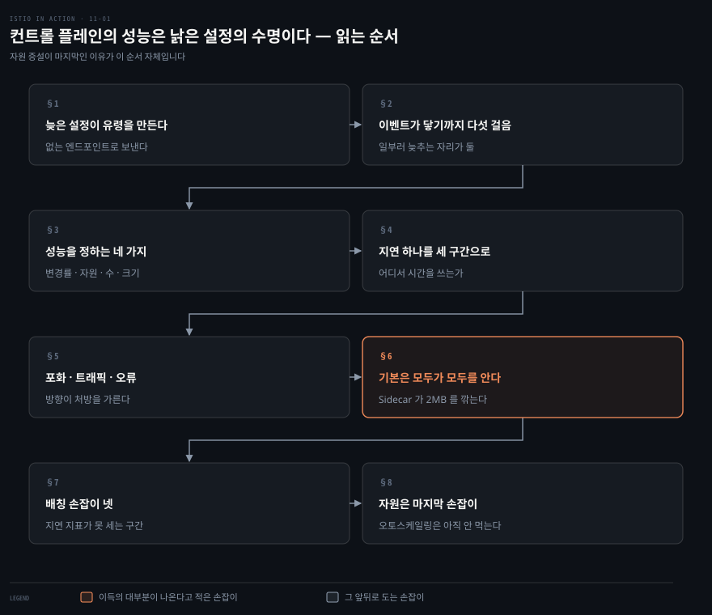
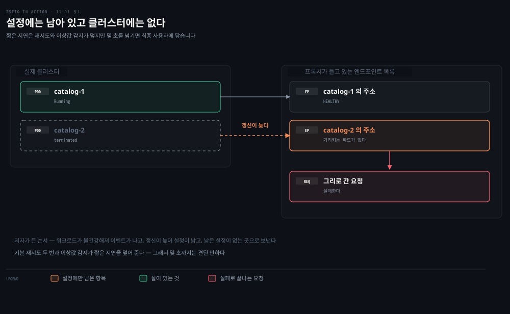
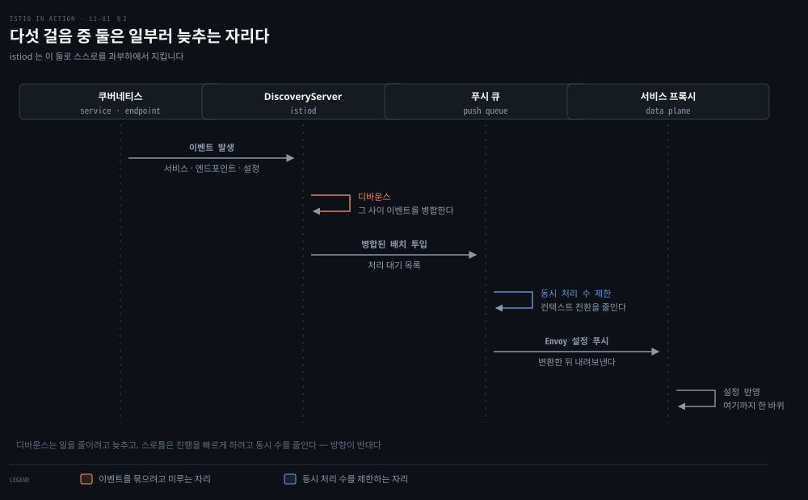
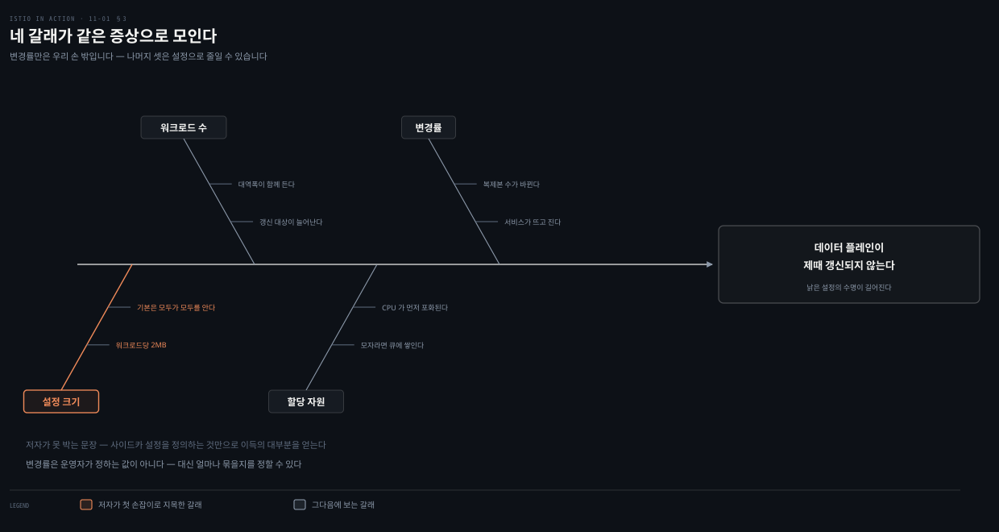
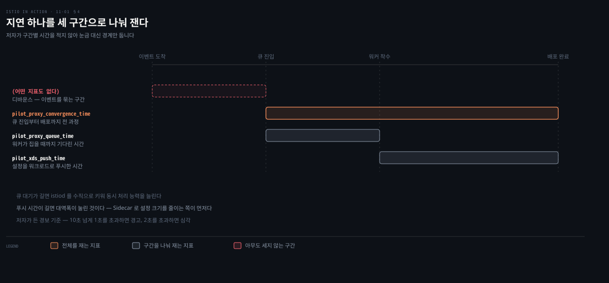
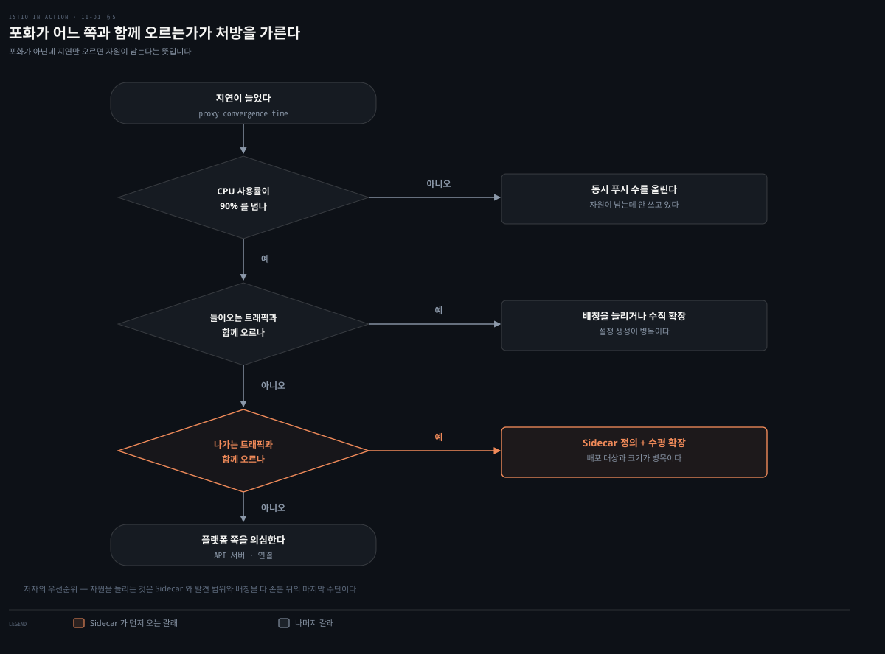
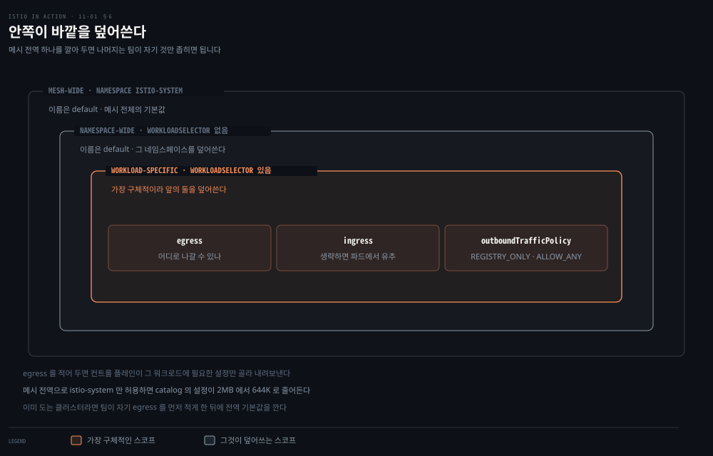
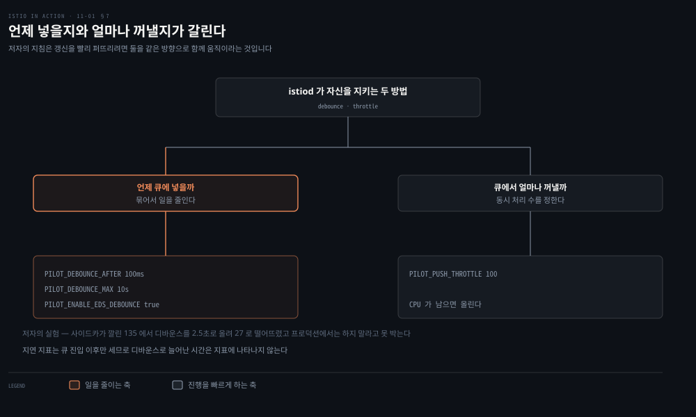
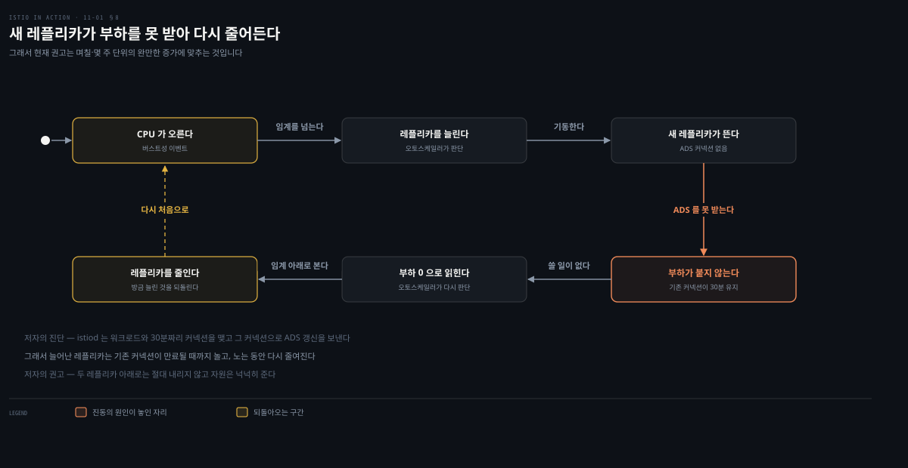

# 컨트롤 플레인의 성능은 낡은 설정의 수명이다

---

> 11장은 istiod가 느려질 때 무엇을 보고 무엇을 돌리는지를 다룹니다. 손잡이는 다섯인데 순서가 정해져 있습니다. 자원을 늘리는 것이 마지막인 이유가 이 장의 내용입니다.

## 핵심 요약
> 이 장 전체가 매달린 하나의 생각은 **컨트롤 플레인의 성능 문제가 "느리다"가 아니라 "데이터 플레인이 얼마나 오래 옛 설정으로 도는가"로 나타난다**는 것입니다. 저자가 증상을 지연이 아니라 유령 워크로드로 여는 이유가 그것입니다.

그 생각의 근거는 동기화 과정에 이미 적혀 있습니다. 이벤트가 프록시에 닿기까지 다섯 걸음이 있고 그중 둘만 istiod가 쥐고 있습니다. 갱신이 늦으면 프록시는 이미 사라진 엔드포인트로 트래픽을 보내고, 짧은 순간에도 요청이 실패합니다.

본문은 그것을 볼 것과 돌릴 것으로 나눕니다. 볼 것은 네 신호인데 지연은 나빠졌다는 사실만 알려 주고 포화와 트래픽 방향이 원인을 가릅니다. 돌릴 것은 일을 줄이는 손잡이부터 순서가 있습니다. 설정 범위를 좁힌 뒤 발견 범위를 좁히고, 이벤트를 묶은 다음, **자원은 마지막**입니다. 그것도 방향이 정해져 있고 오토스케일링은 아직 제대로 먹지 않습니다.


## 학습 목표

이 내용을 읽고 나면:

1. 유령 워크로드가 무엇이고 왜 몇 초의 지연이 문제가 되는지 설명할 수 있습니다.
2. 이벤트가 프록시에 닿기까지의 다섯 걸음을 들고, 그중 일부러 늦추는 두 자리를 짚을 수 있습니다.
3. 지연 메트릭 셋이 각각 어느 구간을 재는지 구분하고, 어떤 구간을 아무도 재지 않는지 압니다.
4. 포화가 어느 방향의 트래픽과 함께 오르는지로 처방을 가를 수 있습니다.
5. `Sidecar` 리소스의 세 스코프와 배칭 환경변수 넷을 알고, 자원 증설이 마지막인 이유를 말할 수 있습니다.

아래는 이 문서 전체를 읽는 순서로 이은 지도입니다. 칸마다 절 번호와 그 절이 답하는 것 하나를 적었습니다. 색이 붙은 칸이 저자가 이득의 대부분이 나온다고 적은 손잡이입니다.




## 이 문서가 다루지 않는 것

> 이 장이 쓰는 지표와 도구의 기초는 다른 곳에 이미 있습니다. 겹치는 것은 옮겨 적지 않고 링크로 넘깁니다.

이 장은 Grafana 대시보드를 읽고 Prometheus 메트릭을 세지만 그 도구 자체를 가르치지는 않습니다.

- 골든 시그널 넷의 정의와 RED·USE: [시그널 모델](../../../06_observability/01_Foundations/01-03.%EC%8B%9C%EA%B7%B8%EB%84%90%20%EB%AA%A8%EB%8D%B8%20%E2%80%94%20Golden%20Signals%2C%20RED%2C%20USE.md)
- Prometheus 스택 구성과 Operator: [Prometheus 배포](../../../06_observability/book/mastering_prometheus/02-01.Prometheus%20%EB%B0%B0%ED%8F%AC%20%E2%80%94%20%EC%8A%A4%ED%83%9D%20%EA%B5%AC%EC%84%B1%EC%9A%94%EC%86%8C%EC%99%80%20Operator.md)
- PromQL 질의 문법과 백분위 계산: [PromQL 기초](../../../06_observability/book/mastering_prometheus/03-04.PromQL%20%EA%B8%B0%EC%B4%88.md)

같은 책 안에서도 나뉩니다.

- xDS와 ADS의 정의: 3장
- `Sidecar` 리소스로 egress 트래픽을 통제하는 이야기: 5장
- 재시도와 이상값 감지: 6장
- Istio 표준 메트릭과 Prometheus 연동: 7장
- Grafana 대시보드 화면: 8장
- `proxy-status`와 `config_dump`: 10장

남는 것은 **컨트롤 플레인이 일을 덜 하게 만드는 방법과 그 순서**입니다.


## 1. 늦게 도착한 설정이 유령을 만든다
> 성능이라고 하면 초당 처리량을 떠올리게 되는데, 여기서 나빠지는 것은 그것이 아닙니다. 저자는 먼저 무엇이 실제로 깨지는지를 보입니다.



컨트롤 플레인은 운영자가 API를 두드리는 것만으로 움직이지 않습니다. 저자가 앞 장들에서 줄여 말했던 부분을 여기서 폅니다. 컨트롤 플레인은 **런타임 환경의 세부를 감춥니다.** 어떤 서비스가 있는지, 어느 것이 건강한지, 오토스케일링이 일어났는지 같은 것입니다.

그래서 이것은 한 번 하고 끝나는 일이 아니라 계속 도는 조정 과정입니다. 조정이 제때 일어나지 않으면 워크로드가 **이미 바뀐 상태에 맞춰 설정된 채로** 남습니다.

성능이 나빠질 때 흔히 나타나는 현상에 이름이 붙어 있습니다. **유령 워크로드**입니다. 서비스가 이미 오래전에 사라진 엔드포인트로 트래픽을 보내도록 설정돼 있고, 그래서 요청이 실패합니다. 저자가 든 순서는 셋입니다.

1. 불건강해지는 워크로드가 이벤트를 냅니다.
2. 갱신이 늦어 서비스들이 낡은 설정을 갖게 됩니다.
3. 그 낡은 설정 때문에 존재하지 않는 워크로드로 트래픽이 갑니다.

여기서 저자가 균형을 잡습니다. 데이터 플레인은 원래 나중에 일관해지도록 만들어졌으므로 **짧은 시간의 낡은 설정은 큰 문제가 아닙니다.** 다른 보호 장치가 덮어 주기 때문입니다. 네트워크 이유로 실패한 요청은 기본적으로 두 번 재시도되어 다른 건강한 엔드포인트가 받을 수 있고, 이상값 감지는 요청이 실패하는 엔드포인트를 클러스터에서 빼냅니다.

그러니 문제가 되는 것은 지연 자체가 아니라 그 길이입니다. 저자가 선을 긋는 지점이 **몇 초**입니다. 그것을 넘기면 최종 사용자에게 부정적으로 닿기 시작하고, 그것을 피하는 것이 이 장의 목적입니다.


## 2. 이벤트가 프록시에 닿기까지 다섯 걸음
> 지연을 줄이려면 시간이 어디서 드는지 알아야 합니다. 그런데 그 경로에는 일부러 늦추는 자리가 둘 들어 있습니다.



어디서 시간이 드는지 짚으려면 그 사이에 무엇이 있는지부터 알아야 합니다. 동기화는 한 걸음이 아닙니다. 컨트롤 플레인이 쿠버네티스에서 이벤트를 받고, 그것이 Envoy 설정으로 변환되어 데이터 플레인의 서비스 프록시로 푸시됩니다. 저자가 이 과정을 다섯으로 나눕니다.

1. 들어온 이벤트가 동기화를 촉발합니다.
2. istiod의 `DiscoveryServer`가 그 이벤트를 듣습니다. 성능을 위해 푸시 큐에 넣는 것을 정해진 시간만큼 미루어 그 사이의 이벤트를 묶습니다. 이것을 **디바운싱**이라 하고, 시간이 드는 작업이 너무 자주 일어나지 않게 합니다.
3. 지연 기간이 끝나면 병합된 이벤트를 푸시 큐에 넣습니다. 큐는 처리를 기다리는 푸시 목록을 들고 있습니다.
4. istiod는 동시에 처리하는 푸시 요청 수를 제한합니다. 처리 중인 항목이 더 빨리 끝나게 하고, 작업 사이를 오가는 컨텍스트 전환에 CPU를 낭비하지 않게 합니다.
5. 처리된 항목이 Envoy 설정으로 변환되어 워크로드로 푸시됩니다.

이 다섯에서 눈에 띄는 것은 istiod가 **스스로 과부하되지 않도록 두 가지를 쓴다**는 사실입니다. 디바운싱과 스로틀링이고, 둘 다 설정으로 조절할 수 있습니다.

두 방법이 노리는 것은 다릅니다. 디바운싱은 만들어 뿌릴 일 자체를 줄이고, 스로틀링은 진행 중인 것이 더 빨리 끝나게 합니다. 저자의 지침이 둘을 같은 방향으로 함께 움직이라고 적는 이유가 여기 있습니다. 갱신을 빨리 퍼뜨리는 것이 목적이면 배칭을 줄이면서 동시 푸시 수를 함께 올립니다.


## 3. 성능을 정하는 것은 네 가지다
> 어디를 손봐야 할지 정하려면 무엇이 성능을 정하는지부터 알아야 합니다. 저자는 넷을 듭니다.



- **변경률**: 변경이 잦을수록 데이터 플레인을 맞추는 처리가 늘어납니다.
- **할당 자원**: 수요가 istiod에 준 자원을 넘으면 일이 큐에 쌓이고, 그만큼 갱신 배포가 느려집니다.
- **갱신할 워크로드 수**: 더 많은 워크로드에 갱신을 뿌리려면 더 많은 처리 능력과 네트워크 대역폭이 듭니다.
- **설정 크기**: 큰 Envoy 설정을 뿌리는 데도 더 많은 처리 능력과 대역폭이 듭니다.

넷 중 하나는 성격이 다릅니다. **변경률은 운영자가 정하는 값이 아닙니다.** 서비스가 새로 뜨는 일도 복제본이 느는 일도 무언가가 불건강해지는 일도 컨트롤 플레인이 감지해 조정할 대상이지 막을 대상이 아닙니다. 대신 그 이벤트를 **얼마나 묶을지**는 정할 수 있습니다. 그것이 §7의 내용입니다.

나머지 셋은 손댈 수 있습니다. 워크로드 수와 설정 크기는 설정으로 줄이는 축이고, 할당 자원은 반대로 늘리는 축입니다. 그중 저자가 첫 손잡이로 지목하는 것이 설정 크기입니다. 장 끝에서 그는 사이드카 설정을 정의하는 것만으로 이득의 대부분을 얻는다고 적습니다. 그 근거가 §6에 나옵니다.


## 4. 지연 하나를 세 구간으로 나눠 잰다
> 지연이 늘었다는 사실만으로는 어디를 고쳐야 할지 정해지지 않습니다. 그래서 하나의 지연을 구간으로 쪼갠 보조 지표가 있습니다.



무엇을 볼지에서 먼저 막힙니다. istiod가 노출하는 메트릭이 너무 많아 저자 자신이 그 수를 압도적이라고 적습니다. 그래서 자원 사용률과 트래픽 부하와 오류율 가운데 중요한 것만 골라 골든 시그널 넷에 느슨하게 맞춥니다.

지연부터 봅니다. Istio 컨트롤 플레인에서 지연은 **컨트롤 플레인이 데이터 플레인에 갱신을 얼마나 빨리 뿌리는가**로 잽니다. 핵심 지표는 `pilot_proxy_convergence_time`이고, 시간이 어느 단계에서 들었는지는 보조 지표 둘이 가릅니다.

- `pilot_proxy_convergence_time`: 프록시 푸시 요청이 큐에 들어온 때부터 워크로드에 배포될 때까지 전 과정을 잽니다.
- `pilot_proxy_queue_time`: 푸시 요청이 워커에게 처리될 때까지 큐에서 기다린 시간을 잽니다. 여기에 시간이 많이 들면 istiod를 수직으로 키워 동시 처리 능력을 늘릴 만합니다.
- `pilot_xds_push_time`: Envoy 설정을 워크로드로 푸시하는 데 걸린 시간을 잽니다. 늘어나면 전송되는 데이터 양에 네트워크 대역폭이 눌린 것입니다.

경보 기준도 함께 제시합니다. 워크로드가 메시에 더 들어올수록 이 지표들이 조금씩 오르는 것은 자연스럽습니다. 그래서 작은 증가에는 놀랄 필요가 없다고 먼저 적어 둡니다. 대신 선은 긋습니다. **10초 넘게 1초를 초과하면 경고이고 2초를 초과하면 심각**입니다. 첫 경보는 당황할 일이 아니라 최적화가 필요하다는 신호입니다.

이 그림에 빈 구간이 하나 있습니다. 왼쪽 끝의 디바운스 구간을 **어떤 지표도 세지 않습니다.** 지연 지표의 시작점이 큐 진입이기 때문입니다. 이 사실이 §7에서 함정이 됩니다.


## 5. 포화가 어느 쪽과 함께 오르는지가 처방을 가른다
> 지연이 늘었다는 것까지는 알았습니다. 다음 질문은 자원을 늘릴지, 일을 줄일지입니다. 그 갈림은 트래픽의 방향이 정합니다.



CPU가 찼다는 것까지는 쉽게 보이는데 거기서 무엇을 해야 할지가 나오지 않습니다. 먼저 포화 지표를 봅니다. 자원이 얼마나 차 있는지를 보이고, 사용률이 90%를 넘으면 포화됐거나 곧 포화될 참입니다.

istiod가 포화되면 푸시 요청이 큐에서 더 오래 기다리므로 갱신 배포가 느려집니다. 가장 제한적인 자원이 먼저 차는데 **istiod는 CPU를 많이 쓰므로 대개 CPU가 먼저 포화됩니다.** 재는 지표는 둘입니다.

- `container_cpu_usage_seconds_total`: 쿠버네티스 컨테이너가 보고하는 값입니다.
- `process_cpu_seconds_total`: istiod 자체 계측이 보고하는 값입니다.

트래픽은 방향이 둘입니다. 컨트롤 플레인은 설정 변경의 형태로 트래픽을 받고, 변경을 데이터 플레인에 밀어내는 형태로 트래픽을 냅니다. 저자가 둘을 나눠 재라고 하는 이유가 여기 있습니다. 어느 쪽이 성능을 제한하는지에 따라 다른 방법을 씁니다.

들어오는 쪽을 재는 지표는 셋입니다.

- `pilot_inbound_updates`: istiod 인스턴스당 받은 설정 갱신 수입니다.
- `pilot_push_triggers`: 푸시를 촉발한 이벤트의 총수입니다. 유형은 `service`·`endpoint`·`config` 셋이고 마지막은 `Gateway`나 `VirtualService` 같은 Istio 커스텀 리소스를 말합니다.
- `pilot_services`: 파일럿이 아는 서비스 수입니다. 아는 서비스가 많을수록 들어온 이벤트 하나로 Envoy 설정을 만드는 처리가 늘어나므로, 저자는 이 지표가 들어오는 부하에서 큰 몫을 한다고 적습니다.

나가는 쪽도 셋입니다.

- `pilot_xds_pushes`: 리스너·라우트·클러스터·엔드포인트 갱신 등 컨트롤 플레인이 한 모든 푸시를 잽니다.
- `pilot_xds`: 파일럿 인스턴스당 다루는 워크로드 커넥션의 총수입니다.
- `envoy_cluster_upstream_cx_tx_bytes_total`: 네트워크로 전송된 설정 크기를 잽니다.

방향을 나누면 처방이 갈립니다. **들어오는 트래픽이 포화를 만들면 병목은 변경률이고 배칭을 늘리거나 수직 확장을 합니다. 나가는 트래픽과 상관되면 수평 확장으로 파일럿 하나가 맡는 인스턴스를 줄이고, 워크로드마다 `Sidecar` 리소스를 정의합니다.**

오류는 대개 포화의 결과로 따라옵니다. 저자가 꼽는 것은 셋입니다.

- `pilot_total_xds_rejects`: 거부된 설정 푸시의 수입니다. 이것을 API별로 쪼갠 지표들이 따로 있어 어느 푸시가 거부됐는지 범위를 좁힐 수 있습니다.
- `pilot_xds_write_timeout`: 푸시를 시작할 때의 오류와 타임아웃을 합한 값입니다.
- `pilot_xds_push_context_errors`: Envoy 설정을 만들다 난 오류의 수입니다. 저자는 이것을 대개 파일럿의 버그라고 적어 둡니다.


## 6. 기본값은 모두가 모두를 알게 한다
> 이제 손잡이를 돌립니다. 첫 손잡이는 자원이 아니라 프록시가 들고 있는 설정의 크기입니다.



마이크로서비스 환경에서 한 서비스가 다른 서비스에 의존하는 일은 흔하지만, 한 서비스가 **다른 모든 서비스에 접근해야 하는 일은 드뭅니다.** 그런데 Istio는 각 서비스가 어디에 접근해야 하는지를 스스로 알아낼 수 없습니다. 그래서 기본값으로 모든 서비스 프록시가 메시의 다른 모든 워크로드를 알도록 설정합니다.

저자가 그 대가를 재 봅니다. 재기 전에 클러스터를 일부러 무겁게 만들어 둔 상태라 뒤의 수치를 읽을 때 이 조건을 함께 봐야 합니다.

- `catalog`와 더미 워크로드 열 개에 게이트웨이 둘을 더해 istiod가 워크로드 열셋을 관리합니다.
- 여기에 더미 서비스 600개를 얹어 파일럿이 아는 서비스 수를 부풀렸습니다.

그 상태에서 `catalog` 워크로드의 설정 덤프가 **2MB**입니다. 워크로드 200개짜리 중간 규모 클러스터라면 400MB의 Envoy 설정이 되고, 그것이 사이드카마다 메모리에 올라갑니다.

```bash
kubectl -n istioinaction exec -ti $CATALOG_POD -c catalog \
  -- curl -s localhost:15000/config_dump > /tmp/config_dump
du -sh /tmp/config_dump
```

```bash
2M	/tmp/config_dump
```

이것을 깎는 리소스가 `Sidecar`입니다. 필드는 넷입니다.

- **`workloadSelector`**: 이 설정이 적용될 워크로드를 제한합니다.
- **`ingress`**: 애플리케이션으로 들어오는 트래픽의 처리를 정합니다.
- **`egress`**: 사이드카를 통해 밖으로 나가는 트래픽의 처리를 정합니다.
- **`outboundTrafficPolicy`**: 나가는 트래픽을 어떤 모드로 다룰지 정합니다.

`ingress`를 생략하면 Istio가 파드 정의를 보고 알아서 설정합니다. `egress`를 생략하면 더 일반적인 사이드카의 설정을 물려받고, 그것도 없으면 다른 모든 서비스로의 접근을 설정하는 기본 동작으로 돌아갑니다. `outboundTrafficPolicy`는 설정된 서비스로만 나갈 수 있게 하는 `REGISTRY_ONLY`와 어디로든 허용하는 `ALLOW_ANY` 중 하나입니다.

핵심은 `egress`입니다. 여기에 필요한 곳을 적어 두면 **컨트롤 플레인이 그 워크로드에 어떤 설정이 관련 있는지 가려낼 수 있습니다.** 그러면 다른 모든 서비스로 가는 법을 만들어 뿌릴 필요가 없어지므로 CPU와 메모리와 대역폭이 함께 줍니다.

가장 쉬운 출발점은 메시 전역 기본값을 까는 것입니다. `istio-system` 네임스페이스로 나가는 것만 허용하면 모든 프록시가 컨트롤 플레인에 붙을 최소 설정만 갖게 됩니다.

```yaml
apiVersion: networking.istio.io/v1beta1
kind: Sidecar
metadata:
  name: default
  namespace: istio-system
spec:
  egress:
  - hosts:
    - "istio-system/*"
    - "prometheus/*"
  outboundTrafficPolicy:
    mode: REGISTRY_ONLY
```

이것을 적용하면 `catalog`의 설정 크기가 줄어듭니다.

```bash
du -sh /tmp/config_dump
```

```bash
644K	/tmp/config_dump
```

> **노트의 읽기**: `du -sh` 출력은 `644K`인데 산문은 "2MB에서 600 KB로 줄었다"고 적습니다. 인쇄된 값보다 작은 쪽으로 느슨하게 반올림한 것이라 정오로 세지는 않았습니다. 인용할 값은 `2M`에서 `644K`이고, 그것만으로도 저자의 논지는 충분히 섭니다.

크기만 주는 것이 아닙니다. 컨트롤 플레인이 **어느 워크로드에 갱신이 필요하고 어느 것에 필요 없는지를 가릴 수 있게 되므로 푸시 횟수도 함께 줍니다.** 저자가 성능 테스트로 확인합니다. 서비스를 반복 생성해 부하를 만들고 푸시 수와 P99 지연을 재는 스크립트입니다. 사이드카를 깔기 전의 같은 테스트 결과가 기준선입니다.

```bash
./bin/performance-test.sh --reps 10 --delay 2.5
```

```bash
==============
Push count: 700
Latency in the last minute: 0.49 ms
```

이제 사이드카를 깐 뒤 같은 테스트를 다시 돌립니다.

```bash
./bin/performance-test.sh --reps 10 --delay 2.5
```

```bash
==============
Push count: 135
Latency in the last minute: 0.10 seconds
```

푸시가 700에서 135로 떨어졌습니다. 이것이 이 절의 근거입니다.

> **원문 정오**: 저자는 "푸시 수와 지연이 **둘 다** 떨어졌다"고 적는데, 인쇄된 값은 그렇게 읽히지 않습니다. 적용 전이 `0.49 ms`이고 적용 후가 `0.10 seconds`라 단위를 그대로 받으면 지연이 200배 늘어난 것이 됩니다. 두 실행의 단위 표기가 `ms`와 `seconds`로 갈려 있어 한쪽의 단위가 잘못 적힌 것으로 보입니다. 푸시 수가 줄었다는 결론은 그대로 서지만, 지연 쪽 수치는 근거로 쓸 수 없습니다.

스코프는 셋입니다. 메시 전역 사이드카는 Istio 설치 네임스페이스에 두고 관례상 이름을 `default`로 합니다. 네임스페이스 사이드카는 원하는 네임스페이스에 `workloadSelector` 없이 두며 역시 이름은 `default`이고, 메시 전역을 덮어씁니다. 워크로드 사이드카는 `workloadSelector`로 대상을 고르고 가장 구체적이라 앞의 둘을 모두 덮어씁니다.

마지막으로 저자가 운영상의 경고를 답니다. 이미 도는 클러스터라면 전역 기본값을 바로 깔면 서비스 장애가 납니다. **테넌트들이 자기 워크로드의 egress를 더 구체적인 `Sidecar`로 먼저 적게 한 뒤**에 기본값을 깔고, 언제나 사전 운영 환경에서 먼저 시험합니다.


## 7. 이벤트를 묶으면 푸시가 줄고 지연 지표는 침묵한다
> 다음 손잡이는 이벤트를 얼마나 묶을지입니다. 여기에는 지표가 알려 주지 않는 대가가 붙어 있습니다.



묶기 전에 해 볼 일이 하나 더 있습니다. 아예 듣지 않는 것입니다. 놀랍게도 Istio 컨트롤 플레인은 기본적으로 **모든 네임스페이스**에서 파드·서비스·리소스 생성 이벤트를 지켜봅니다. 큰 클러스터에서는 이것만으로 부담이 됩니다. Istio 1.10에 들어온 네임스페이스 발견 셀렉터가 그 범위를 좁혀 줍니다.

```yaml
apiVersion: install.istio.io/v1alpha1
kind: IstioOperator
metadata:
  namespace: istio-system
spec:
  meshConfig:
    discoverySelectors:
    - matchExpressions:
      - key: istio-exclude
        operator: NotIn
        values:
        - "true"
```

저자가 이것을 쓸 만한 두 상황을 듭니다. 메시 안의 워크로드가 결코 라우팅하지 않을 워크로드가 많은 클러스터이거나, Spark 잡처럼 끊임없이 떴다 지는 워크로드가 있는 클러스터입니다. 그런 이벤트는 컨트롤 플레인이 아예 무시하게 두는 편이 낫습니다.

발견 범위를 좁혔는데도 컨트롤 플레인이 포화라면 다음이 배칭입니다. 런타임에서 벌어지는 이벤트 자체는 운영자의 통제 밖이지만 **얼마나 미루고 묶을지는 통제할 수 있습니다.** 묶인 이벤트는 한 덩어리로 처리되어 하나의 Envoy 설정으로 만들어지고 한 번에 푸시됩니다.

환경변수는 넷이고, 앞의 셋은 언제 큐에 넣을지를, 마지막 하나는 큐에서 얼마나 꺼낼지를 정합니다.

- `PILOT_DEBOUNCE_AFTER`: 이벤트를 푸시 큐에 넣는 것을 미루는 시간입니다. 기본값 100ms이고, 이 기간에 또 이벤트가 오면 앞의 것과 병합하고 다시 미룹니다.
- `PILOT_DEBOUNCE_MAX`: 디바운싱이 허용되는 최대 시간입니다. 기본값 10초이고, 이 시간이 지나면 그때까지 병합된 것을 큐에 넣습니다.
- `PILOT_ENABLE_EDS_DEBOUNCE`: 엔드포인트 갱신도 디바운스 규칙을 따를지 아니면 우선권을 갖고 곧장 큐에 들어갈지입니다. 기본값 `true`라 엔드포인트 갱신도 미뤄집니다.
- `PILOT_PUSH_THROTTLE`: istiod가 동시에 처리하는 푸시 요청 수입니다. 기본값 100이고, CPU가 남는다면 올려서 갱신을 빠르게 할 수 있습니다.

저자가 효과를 보이려고 디바운스를 2.5초로 올립니다. 스스로 "터무니없는" 값이라 부르고 프로덕션에서 하지 말라고 못 박습니다.

```bash
istioctl install --set profile=demo \
  --set values.pilot.env.PILOT_DEBOUNCE_AFTER="2500ms"
```

```bash
==============
Push count: 27
Latency in the last minute: 0.10 seconds
```

푸시가 27회까지 떨어졌습니다. 비교할 기준선은 700이 아니라 **135**입니다. §6의 메시 전역 `Sidecar`가 아직 깔린 채이고 저자는 그것을 장 맨 끝에서야 걷어내기 때문입니다. 곧 디바운스가 준 몫은 135에서 27로, 다섯 배가량입니다. Envoy 설정을 만들어 워크로드로 뿌리는 일이 그만큼 사라진 만큼 CPU와 대역폭도 줍니다.

그런데 여기가 함정입니다. 저자가 절 하나를 따로 떼어 경고합니다. **지연 지표는 디바운스 구간을 세지 않습니다.** §4에서 봤듯 지연 지표가 재기 시작하는 시점은 푸시 요청이 큐에 들어간 뒤입니다. 디바운스가 도는 동안에는 갱신이 아예 전달되지 않았는데도 그 시간은 지표에 나타나지 않습니다.

> **원문 정오**: 이 경고를 여는 문장에서 저자는 "디바운스 기간을 늘린 뒤 지연 지표는 푸시 배포가 **10 ms** 걸렸다고 보였다"고 적습니다. 그러나 바로 위 출력은 `Latency in the last minute: 0.10 seconds`, 곧 100 ms입니다. 산문의 값과 인접 출력의 값이 열 배 어긋납니다. 지표가 실제 지연을 낮게 보인다는 논지 자체는 출력값으로도 그대로 성립합니다.

그래서 배칭은 조금씩 움직입니다. 디바운스를 너무 늘리면 성능이 나쁠 때와 똑같이 데이터 플레인이 낡은 설정을 갖게 되는데, 그것을 지표가 알려 주지 않습니다. 엔드포인트 갱신이 늦어 데이터 플레인이 자주 다치는 환경이라면 `PILOT_ENABLE_EDS_DEBOUNCE`를 `false`로 두어 엔드포인트만 디바운스를 건너뛰게 할 수 있습니다.


## 8. 자원은 마지막 손잡이다
> 앞의 손잡이를 다 돌리고도 모자랄 때 남는 것이 자원입니다. 그것도 방향이 정해져 있고, 자동화는 아직 제대로 먹지 않습니다.



`Sidecar`를 정의하고, 발견 셀렉터를 쓰고, 배칭을 조정하고 나면 남는 선택지는 자원을 더 주는 것뿐입니다. 방법은 둘이고 병목이 무엇이냐가 그것을 가릅니다.

- **수평 확장**: 나가는 트래픽이 병목일 때입니다. istiod 인스턴스 하나가 관리하는 워크로드가 너무 많은 경우이고, 인스턴스를 늘려 그 수를 나눕니다.
- **수직 확장**: 들어오는 트래픽이 병목일 때입니다. `Service`·`VirtualService`·`DestinationRule` 같은 리소스가 많아 Envoy 설정을 만드는 처리가 무거운 경우이고, 인스턴스마다 처리 능력을 더 줍니다.

```bash
istioctl install --set profile=demo \
  --set values.pilot.resources.requests.cpu=2 \
  --set values.pilot.resources.requests.memory=4Gi \
  --set values.pilot.replicaCount=3
```

CPU와 메모리를 요청으로 적으면 kubelet이 그만큼을 istiod에 예약합니다. 복제본 수를 올리면 워크로드 관리가 세 복제본에 나뉩니다.

여기서 저자가 별도 상자로 다루는 것이 오토스케일링입니다. istiod처럼 버스트성 워크로드에는 좋은 생각인데 **지금은 효과가 없습니다.** 이유가 구조에 있습니다. istiod는 워크로드와 30분짜리 커넥션을 맺고 그 커넥션으로 ADS를 써서 프록시를 설정하고 갱신합니다.

그래서 새로 뜬 istiod 복제본은 기존 프록시와 파일럿 사이의 커넥션이 만료될 때까지 **아무 부하도 받지 못합니다.** 부하를 못 받으니 오토스케일러가 다시 줄이고, 배포가 늘었다 줄었다를 반복하는 진동이 생깁니다. 현재로서 가장 나은 오토스케일링 설정은 며칠·몇 주·몇 달 단위의 완만한 증가에 맞추는 것입니다.

마지막으로 저자가 규모 감각을 하나 줍니다. Istio 팀은 릴리스마다 서비스 1,000개, 동기화 대상 워크로드 2,000개, 메시 전체 초당 요청 70,000건으로 시험하는데, 이 부하를 **가상 코어 하나와 메모리 1.5GB**를 쓰는 파일럿 인스턴스 하나가 감당합니다. 그래서 vCPU 둘과 메모리 2GB에 복제본 셋 정도면 대부분의 운영 클러스터에 충분하다고 적습니다.

튜닝 지침도 함께 남깁니다. 다섯입니다.

1. 이것이 정말 성능 문제인지 먼저 확인합니다. 데이터 플레인이 컨트롤 플레인에 닿는지, 쿠버네티스 API 서버가 건강한지, `Sidecar`가 정의돼 있는지를 봅니다.
2. 지연·포화·트래픽 지표로 병목을 특정합니다.
3. **10%에서 30% 범위로 조금씩** 바꾼 뒤 며칠 관찰하고 새 데이터로 판단합니다.
4. 안전한 쪽으로 틉니다. 파일럿은 메시 전체의 네트워크를 관리하므로 다운타임이 곧 장애입니다. **복제본을 둘 아래로는 내리지 않습니다.**
5. 버스트 가능한 VM을 고려합니다. 파일럿은 CPU를 계속 쓰지 않고 몰아 쓰는 성격이라 그런 인스턴스와 맞습니다. 오토스케일링이 아직 안 먹는 자리를 하드웨어 쪽에서 메우는 셈입니다.


## 심화 학습

> 책 밖의 보강만 둡니다. 각 항목은 공식 1차 자료로 확인한 것입니다.

**`Sidecar`의 API 버전이 올라갔고 필드도 하나 늘었습니다.** 저자의 예제는 `networking.istio.io/v1beta1`입니다. 현재 레퍼런스는 `networking.istio.io/v1`을 쓰고, 명세 필드도 저자가 든 넷에 `inboundConnectionPool`이 더해져 다섯입니다.[^sidecar] 마지막 것은 Envoy가 받아들이는 커넥션 양을 통제하는 설정이라 이 장의 주제와 이어집니다.

**같은 스코프의 사이드카가 겹칠 때의 동작이 이제 문서화됐습니다.** 저자는 "같은 스코프의 사이드카 정의가 여럿인 것은 지원되지 않고 예상 동작이 문서화돼 있지 않다"고 적습니다. 현재 레퍼런스는 그중 한 경우를 명시적으로 적어 둡니다. `workloadSelector`를 가진 `Sidecar` 설정 둘 이상이 같은 워크로드 인스턴스를 고르면 **시스템의 동작은 정의되지 않습니다.**[^sidecar] 다만 이 문장이 덮는 것은 워크로드 스코프끼리 겹치는 경우뿐입니다. 저자가 말한 메시 전역이나 네임스페이스 스코프에 `default`가 둘 이상 있는 경우는 여전히 문서에 없습니다.

**디바운스 환경변수 셋의 기본값은 지금도 같습니다.** `PILOT_DEBOUNCE_AFTER`는 100ms, `PILOT_DEBOUNCE_MAX`는 10s, `PILOT_ENABLE_EDS_DEBOUNCE`는 `true`입니다.[^pilot-env] `PILOT_ENABLE_EDS_DEBOUNCE`의 공식 설명은 저자의 서술과 같은 내용을 다른 방향에서 적습니다. 켜져 있으면 EDS 푸시도 앞의 두 변수가 정하는 디바운싱에 포함된다는 것입니다.

**`discoverySelectors`는 비워 두면 모든 네임스페이스를 처리합니다.** 공식 설명은 이 필드를 "사이드카 설정 갱신을 계산할 때 Istio가 고려하는 네임스페이스 집합"으로 정의하고, 생략하면 클러스터의 모든 네임스페이스를 처리하는 기본 동작을 쓴다고 적습니다.[^mesh-config] 셀렉터가 여럿이면 OR로 묶여 어느 하나에만 맞아도 포함되는데, 저자는 이 결합 규칙을 적지 않습니다.

**컨트롤 플레인 모니터링은 15014 포트입니다.** 저자가 메트릭을 한 번에 훑는 명령을 하나 주는데 PDF에서 줄 끝이 잘려 경로가 `localhost:15014/m`까지만 보입니다. 공식 포트 표가 15014를 컨트롤 플레인 모니터링 포트로 적고 있으므로, 이 포트로 메트릭 엔드포인트를 훑는 명령이라는 것은 확인됩니다.[^ports] 같은 표에서 사이드카 쪽은 15000이 Envoy 관리 포트, 15020이 병합된 Prometheus 텔레메트리, 15021이 헬스 체크, 15090이 Envoy Prometheus 텔레메트리입니다.


## 결정 치트시트

> 저자가 본문에서 근거를 밝힌 것만 담습니다. 판단 근거가 원문에 없는 줄은 넣지 않았습니다.

| 상황 | 고를 것 | 저자가 댄 근거 |
|---|---|---|
| 무엇부터 손볼지 모르겠다 | `Sidecar` 정의부터 | 이것만으로 이득의 대부분 |
| 프록시 설정이 크다 | 메시 전역 `Sidecar` + `REGISTRY_ONLY` | 2MB가 644K로 |
| 이미 도는 클러스터다 | 팀이 egress를 먼저 적게 한 뒤 전역 기본값 | 바로 깔면 장애 |
| 관련 없는 네임스페이스가 많다 | `discoverySelectors` | 이벤트를 아예 무시 |
| 워크로드가 끊임없이 떴다 진다 | `discoverySelectors`로 제외 | Spark 잡 같은 경우 |
| 포화인데 들어오는 트래픽과 함께 오른다 | 배칭을 늘리거나 수직 확장 | 병목이 변경률 |
| 포화인데 나가는 트래픽과 함께 오른다 | 수평 확장 + `Sidecar` | 파일럿당 관리 수를 줄임 |
| 포화가 아닌데 지연이 오른다 | 동시 푸시 수를 올린다 | 자원이 최적으로 안 쓰임 |
| 큐 대기 시간이 길다 | 수직 확장 | 동시 처리 능력 부족 |
| 푸시 시간이 길다 | 설정 크기를 줄인다 | 대역폭이 눌림 |
| 엔드포인트 갱신이 늦어 다친다 | `PILOT_ENABLE_EDS_DEBOUNCE=false` | 엔드포인트만 디바운스 제외 |
| 배칭을 바꿔야 한다 | 10~30% 범위로 조금씩 | 낡은 설정이 되기 쉬움 |
| 운영 클러스터의 기본 규모 | vCPU 둘 · 메모리 2GB · 복제본 셋 | 대부분에 충분 |
| 복제본 수 하한 | 둘 | 다운타임이 곧 장애 |
| 오토스케일링을 걸고 싶다 | 며칠·몇 주 단위 완만한 증가에만 | 30분 커넥션이 진동을 만듦 |


## 적용 관점

> 실무 규칙 하나와 Spring 쪽 경계 하나가 남습니다. 손잡이의 순서를 지키는 것, 그리고 프록시의 지연과 애플리케이션의 지연을 섞지 않는 것입니다.

이 장에서 실무로 곧장 넘어가는 규칙은 하나입니다. **자원을 늘리기 전에 일을 줄입니다.** 순서는 `Sidecar` 정의, 발견 범위 좁히기, 배칭 조정, 그리고 자원입니다. 순서를 뒤집으면 늘린 자원으로 여전히 필요 없는 설정을 만들어 필요 없는 프록시에 뿌리게 되고, 비용만 오른 채 같은 자리에 서게 됩니다.

측정에도 함정이 하나 있습니다. §7에서 봤듯 **디바운스로 늘어난 시간은 지연 지표에 나타나지 않습니다.** 그래서 배칭을 올린 뒤 지표가 좋아 보이는 것을 개선으로 읽으면 안 됩니다. 실제로 확인할 값은 지표가 아니라 데이터 플레인이 얼마나 오래 옛 설정으로 도는가입니다.

Spring 애플리케이션 관점에서는 경계가 하나 생깁니다. 이 장의 지연은 **설정이 전파되는 지연**이지 요청이 처리되는 지연이 아닙니다. 배포 직후 일부 요청이 실패하다가 저절로 멎는다면 애플리케이션의 기동 시간이 아니라 이쪽을 의심할 값이 있습니다. 프록시가 아직 옛 엔드포인트 목록을 들고 있는 구간이기 때문입니다.

그 구간을 애플리케이션 쪽에서 줄이는 방법도 있습니다. 종료 시점에 곧장 죽지 않고 새 요청만 거절하며 진행 중인 것을 마무리하는 우아한 종료를 두면, 컨트롤 플레인이 엔드포인트를 걷어낼 때까지의 시간을 벌 수 있습니다. 저자가 이 장에서 다루는 범위 밖이지만, §1의 유령 워크로드가 왜 생기는지를 알면 그 대응이 어디에 놓이는지도 함께 보입니다.

메시를 쓰는 팀이 짊어질 몫도 하나 늘어납니다. 메시 전역 `Sidecar` 기본값이 깔린 클러스터에서는 **자기 서비스가 어디로 나가는지를 직접 적어야 합니다.** 저자는 이것을 부담이 아니라 좋은 습관으로 놓습니다. 나가는 곳을 적을 수 없는 서비스는 대개 의존이 정리되지 않은 서비스이기 때문입니다.


## 면접에서 받을 만한 질문
> 답을 먼저 떠올린 뒤 아래 정답 절을 펼칩니다.

1. 이 장을 한 줄로 정의하면 무엇입니까?
2. 컨트롤 플레인의 성능 문제는 낡은 설정의 수명 문제입니다 — 이것을 근거와 함께 설명해 보십시오.
3. 손잡이의 순서는 일을 줄이는 것부터입니다 — 이것을 근거와 함께 설명해 보십시오.
4. 지연 지표는 디바운스 구간을 세지 않습니다 — 이것을 근거와 함께 설명해 보십시오.
5. 유령 워크로드가 무엇이고 왜 짧은 지연은 견딜 만합니까.
6. istiod가 포화입니다. 다음에 무엇을 봅니까.
7. `Sidecar` 리소스가 왜 성능 손잡이입니까.
8. 배칭을 늘렸더니 지연 지표가 좋아졌습니다. 개선입니까.
9. istiod에 오토스케일링을 걸면 왜 진동합니까.
10. 수평 확장과 수직 확장은 무엇으로 가릅니까.


## 정답 (자답 후 펼치기)

### 정답 1 — 한 줄 정의

컨트롤 플레인의 성능은 데이터 플레인이 낡은 설정을 들고 있는 시간으로 나타나며, 그것을 줄이는 손잡이는 일을 줄이는 것부터 자원을 늘리는 것까지 순서가 정해져 있습니다.

### 정답 2 — 핵심 포인트

컨트롤 플레인의 성능 문제는 낡은 설정의 수명 문제입니다. 갱신이 늦으면 프록시가 이미 사라진 엔드포인트로 트래픽을 보내고, 그 시간이 몇 초를 넘기면 최종 사용자에게 닿습니다.

### 정답 3 — 핵심 포인트

손잡이의 순서는 일을 줄이는 것부터입니다. `Sidecar` 정의, 발견 범위 좁히기, 배칭 조정을 다 해 본 뒤에 자원을 늘립니다. 저자는 첫 번째만으로 이득의 대부분을 얻는다고 적습니다.

### 정답 4 — 핵심 포인트

지연 지표는 디바운스 구간을 세지 않습니다. 재기 시작하는 시점이 푸시 요청이 큐에 들어간 뒤이기 때문에, 묶느라 늦어진 시간은 지표에 나타나지 않습니다.

### 정답 5 — 유령 워크로드가 무엇이고 왜 짧은 지연은 견딜 만합니까

이미 사라진 엔드포인트로 트래픽을 보내도록 설정이 남아 있는 상태입니다. 네트워크 이유로 실패한 요청은 기본적으로 두 번 재시도되고 이상값 감지가 실패하는 엔드포인트를 빼내므로, 짧은 지연은 그 장치들이 덮어 줍니다.

### 정답 6 — istiod가 포화입니다

트래픽의 방향을 봅니다. 들어오는 트래픽과 함께 오르면 병목이 변경률이므로 배칭을 늘리거나 수직 확장을 하고, 나가는 트래픽과 함께 오르면 수평 확장과 `Sidecar` 정의로 갑니다.

### 정답 7 — `Sidecar` 리소스가 왜 성능 손잡이입니까

기본값이 모든 프록시에 메시의 모든 워크로드를 알려 주기 때문입니다. `egress`를 적어 두면 컨트롤 플레인이 그 워크로드에 관련 있는 설정만 가려낼 수 있어 설정 크기와 푸시 횟수가 함께 줍니다.

### 정답 8 — 배칭을 늘렸더니 지연 지표가 좋아졌습니다

개선으로 읽으면 안 됩니다. 지표가 큐 진입 이후만 세므로 디바운스로 늘어난 시간이 빠져 있습니다. 실제로는 데이터 플레인이 낡은 설정을 더 오래 들고 있을 수 있습니다.

### 정답 9 — istiod에 오토스케일링을 걸면 왜 진동합니까

istiod가 워크로드와 30분짜리 커넥션을 맺고 그 커넥션으로 ADS 갱신을 보내기 때문입니다. 새 복제본은 기존 커넥션이 만료될 때까지 부하를 받지 못하고, 부하가 없으니 다시 줄여집니다.

### 정답 10 — 수평 확장과 수직 확장은 무엇으로 가릅니까

병목이 나가는 트래픽이면 수평 확장으로 인스턴스당 관리 워크로드 수를 줄이고, 들어오는 트래픽이면 수직 확장으로 설정 생성 능력을 올립니다.


## 핵심 개념 체크리스트

- [ ] 유령 워크로드가 생기는 세 단계를 순서대로 들 수 있습니다.
- [ ] 짧은 지연을 덮어 주는 두 장치를 말할 수 있습니다.
- [ ] 동기화의 다섯 걸음과 그중 일부러 늦추는 두 자리를 압니다.
- [ ] 디바운싱과 스로틀링의 방향이 왜 반대인지 설명할 수 있습니다.
- [ ] 성능을 정하는 네 요인을 들고 그중 통제 밖인 것을 구분할 수 있습니다.
- [ ] 지연 메트릭 셋이 각각 어느 구간을 재는지 압니다.
- [ ] 지연 경보의 두 임계를 말할 수 있습니다.
- [ ] 들어오는 트래픽과 나가는 트래픽의 지표를 구분할 수 있습니다.
- [ ] `Sidecar`의 네 필드와 `outboundTrafficPolicy`의 두 모드를 압니다.
- [ ] `Sidecar` 스코프 셋의 우선순위를 설명할 수 있습니다.
- [ ] 배칭 환경변수 넷과 각각의 기본값을 압니다.
- [ ] 오토스케일링이 진동하는 구조적 이유를 설명할 수 있습니다.


## 관련 문서

- [프록시는 다 알고 있고 사람은 못 읽는다](10-01.%ED%94%84%EB%A1%9D%EC%8B%9C%EB%8A%94%20%EB%8B%A4%20%EC%95%8C%EA%B3%A0%20%EC%9E%88%EA%B3%A0%20%EC%82%AC%EB%9E%8C%EC%9D%80%20%EB%AA%BB%20%EC%9D%BD%EB%8A%94%EB%8B%A4.md) — `proxy-status`와 `config_dump`의 SSOT
- [Envoy가 맡는 일과 Istio가 보태는 일](03-01.Envoy%EA%B0%80%20%EB%A7%A1%EB%8A%94%20%EC%9D%BC%EA%B3%BC%20Istio%EA%B0%80%20%EB%B3%B4%ED%83%9C%EB%8A%94%20%EC%9D%BC.md) — xDS와 ADS의 SSOT
- [미리 정하지 않았던 것을 나중에 세려면](07-01.%EB%AF%B8%EB%A6%AC%20%EC%A0%95%ED%95%98%EC%A7%80%20%EC%95%8A%EC%95%98%EB%8D%98%20%EA%B2%83%EC%9D%84%20%EB%82%98%EC%A4%91%EC%97%90%20%EC%84%B8%EB%A0%A4%EB%A9%B4.md) — Istio 메트릭과 Prometheus 연동의 SSOT
- [Istio in Action 정독 인덱스](README.md)
- [시그널 모델](../../../06_observability/01_Foundations/01-03.%EC%8B%9C%EA%B7%B8%EB%84%90%20%EB%AA%A8%EB%8D%B8%20%E2%80%94%20Golden%20Signals%2C%20RED%2C%20USE.md) — 골든 시그널의 SSOT


## 참고 자료

- 《Istio in Action》 11장 "Performance-tuning the control plane" — 이 노트의 1차 자료
- [Istio Sidecar 레퍼런스](https://istio.io/latest/docs/reference/config/networking/sidecar/) — 명세 필드와 겹칠 때의 동작
- [pilot-discovery 레퍼런스](https://istio.io/latest/docs/reference/commands/pilot-discovery/) — 디바운스 환경변수의 기본값
- [MeshConfig 레퍼런스](https://istio.io/latest/docs/reference/config/istio.mesh.v1alpha1/) — `discoverySelectors`의 정의
- [Istio 애플리케이션 요구사항](https://istio.io/latest/docs/ops/deployment/application-requirements/) — Istio가 쓰는 포트 표
- [Google SRE Book](https://sre.google/sre-book/table-of-contents/) — 저자가 인용한 골든 시그널의 출처


[^sidecar]: Istio — Sidecar 레퍼런스. 예제의 `apiVersion: networking.istio.io/v1`, 명세 필드 다섯(`workloadSelector`·`ingress`·`egress`·`inboundConnectionPool`·`outboundTrafficPolicy`), 그리고 `workloadSelector`를 가진 둘 이상의 설정이 같은 워크로드를 고를 때 "시스템의 동작은 정의되지 않는다"는 문장. <https://istio.io/latest/docs/reference/config/networking/sidecar/>
[^pilot-env]: Istio — pilot-discovery 레퍼런스. `PILOT_DEBOUNCE_AFTER` 기본 100ms, `PILOT_DEBOUNCE_MAX` 기본 10s, `PILOT_ENABLE_EDS_DEBOUNCE` 기본 true 와 각각의 설명. <https://istio.io/latest/docs/reference/commands/pilot-discovery/>
[^mesh-config]: Istio — MeshConfig 레퍼런스. `discoverySelectors`의 정의와 생략 시 모든 네임스페이스를 처리하는 기본 동작, 셀렉터가 여럿일 때의 OR 결합. <https://istio.io/latest/docs/reference/config/istio.mesh.v1alpha1/>
[^ports]: Istio — 애플리케이션 요구사항 문서의 "Ports used by Istio" 표. 15014 는 컨트롤 플레인 모니터링, 15000 은 Envoy 관리, 15020 은 병합된 Prometheus 텔레메트리, 15021 은 헬스 체크, 15090 은 Envoy Prometheus 텔레메트리. <https://istio.io/latest/docs/ops/deployment/application-requirements/>
