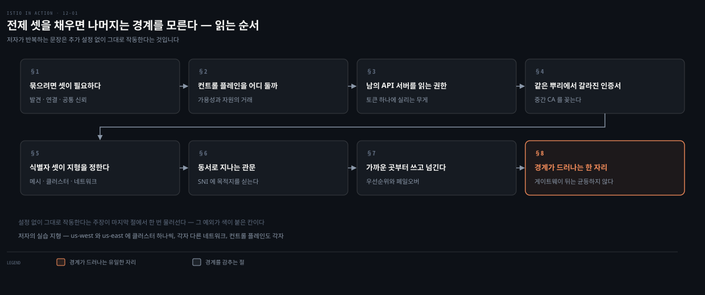
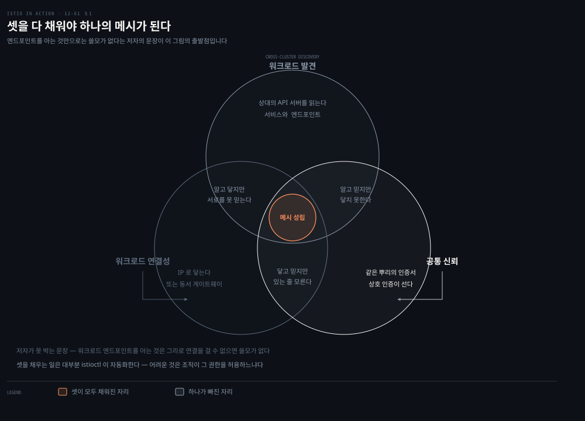
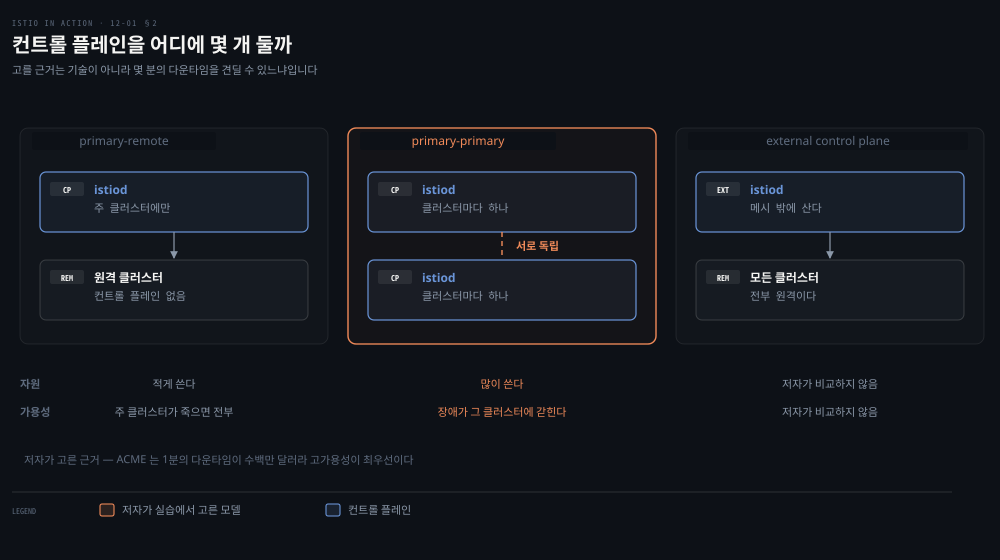
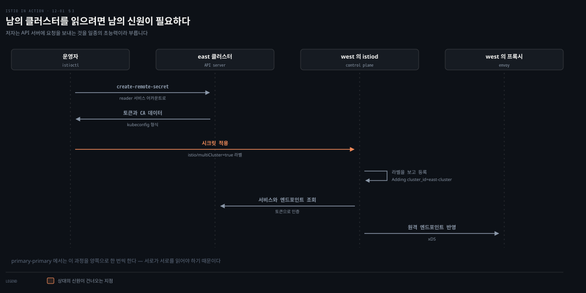
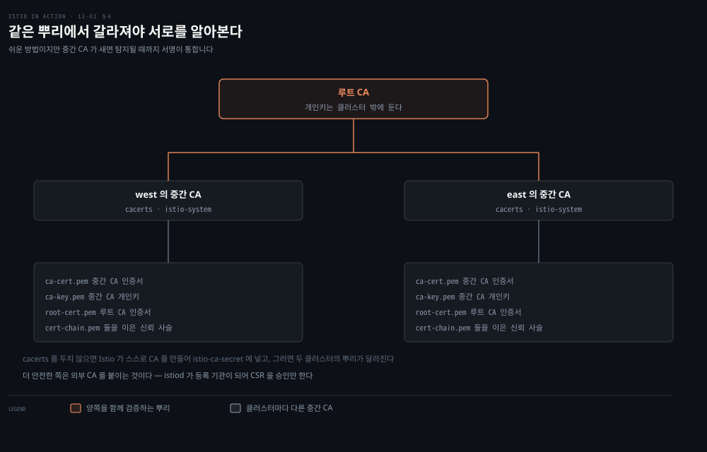
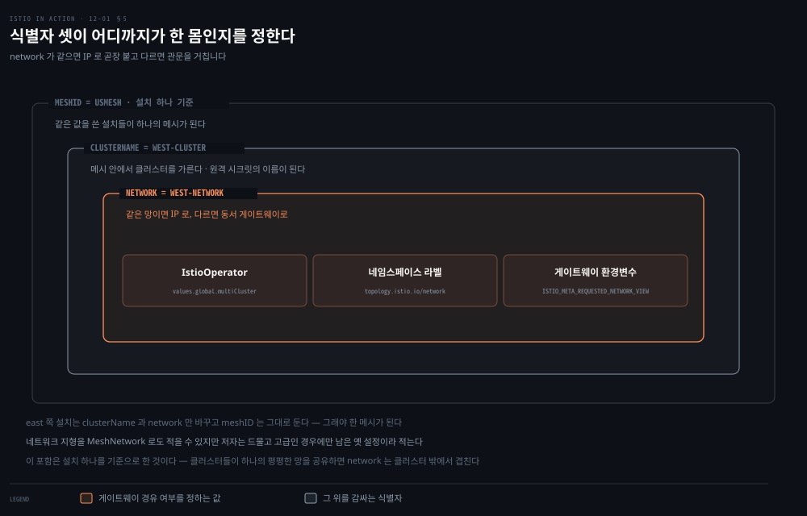
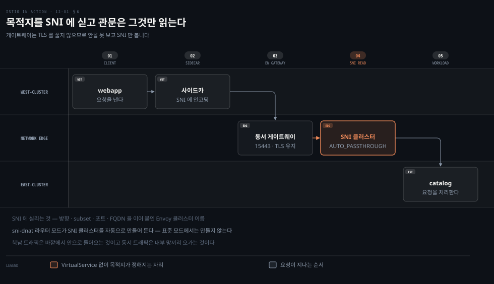
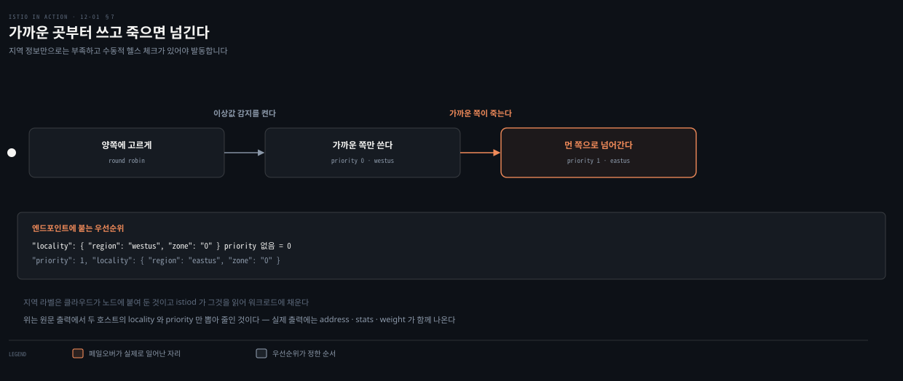
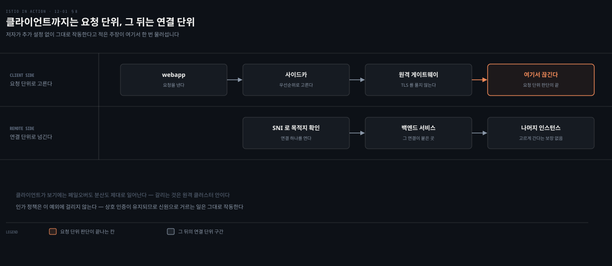

# 경계를 지우는 전제 셋과 남는 한 자리

---

> 12장은 메시를 여러 클러스터로 넓히는 일을 다룹니다. 저자가 반복하는 주장은 전제 셋만 채우면 나머지 기능이 클러스터 경계를 모른다는 것입니다. 그 주장이 마지막에 한 번 물러섭니다.

## 핵심 요약
> 이 장 전체가 매달린 하나의 생각은 **클러스터를 여럿으로 나눈 뒤에도 메시가 하나로 보이려면 발견·연결·공통 신뢰 셋을 채우면 되고, 그 셋은 순서가 아니라 조건**이라는 것입니다. 저자가 장을 그 셋으로 열고 요약도 그 셋으로 닫습니다.

나누는 이유가 먼저입니다. 격리, 장애 경계, 규제, 가용성과 성능, 멀티 클라우드는 전부 "무언가를 가두는 선"입니다. 그렇게 그은 선을 메시가 다시 덮는 것이 이 장의 일입니다. 셋 중 어느 하나가 빠지면 각각 다른 것이 안 됩니다. 발견이 없으면 상대가 있는 줄 모릅니다. 연결이 없으면 알아도 닿지 못하고, 공통 신뢰가 없으면 닿아도 서로를 인증하지 못합니다.

세우는 재료는 셋 다 이미 있는 것이라 **자리만 바뀝니다.** 쿠버네티스의 서비스 어카운트 토큰, 동서로 돌려 세운 인그레스 게이트웨이, 같은 루트가 서명한 중간 CA입니다. 그러고 나면 지역 우선 라우팅도 페일오버도 인가 정책도 경계를 모른 채 돕니다. 다만 예외가 하나 남고 저자도 숨기지 않습니다. 게이트웨이가 TLS를 종료하지 않으므로 요청 단위 로드밸런싱을 할 수 없고, 원격 클러스터 안의 인스턴스에 고르게 나뉜다는 보장이 사라집니다.


## 학습 목표

이 내용을 읽고 나면:

1. 여러 클러스터를 하나의 메시로 묶는 전제 셋을 들고, 하나가 빠졌을 때 각각 무엇이 안 되는지 말할 수 있습니다.
2. 배포 모델 셋의 차이를 자원과 가용성의 거래로 설명하고 고르는 근거를 댈 수 있습니다.
3. 교차 클러스터 발견이 왜 상대 클러스터의 서비스 어카운트 토큰을 필요로 하는지, 그 권한의 무게가 무엇인지 압니다.
4. 동서 게이트웨이가 SNI만 읽고도 목적지를 정하는 구조와 `sni-dnat`·`AUTO_PASSTHROUGH`의 역할을 설명할 수 있습니다.
5. 클러스터를 넘어도 그대로인 기능과 유일하게 달라지는 것을 구분할 수 있습니다.

아래는 이 문서 전체를 읽는 순서로 이은 지도입니다. 칸마다 절 번호와 그 절이 답하는 것 하나를 적었습니다. 색이 붙은 칸이 경계가 유일하게 드러나는 자리입니다.




## 이 문서가 다루지 않는 것

> 이 장이 조립하는 재료는 대부분 다른 곳에서 이미 다뤘습니다. 겹치는 것은 옮겨 적지 않고 링크로 넘깁니다.

저자 자신이 쿠버네티스 RBAC을 "이 책의 범위 밖"이라 적고 개념만 짚고 넘어갑니다. 노트도 같은 자리에서 넘깁니다.

- 서비스 어카운트·롤·클러스터롤과 쿠버네티스 인가: [RBAC — 인가를 설계하고 운영하는 법](../kubernetes-up-and-running/14-01.RBAC%20%E2%80%94%20%EC%9D%B8%EA%B0%80%EB%A5%BC%20%EC%84%A4%EA%B3%84%ED%95%98%EA%B3%A0%20%EC%9A%B4%EC%98%81%ED%95%98%EB%8A%94%20%EB%B2%95.md)
- X.509 인증서와 CA, 중간 CA의 신뢰 사슬: [TLS로 컴포넌트 안전하게 연결하기](../container-security/11-01.TLS%EB%A1%9C%20%EC%BB%B4%ED%8F%AC%EB%84%8C%ED%8A%B8%20%EC%95%88%EC%A0%84%ED%95%98%EA%B2%8C%20%EC%97%B0%EA%B2%B0%ED%95%98%EA%B8%B0%20%E2%80%94%20%ED%82%A4%C2%B7%EC%9D%B8%EC%A6%9D%EC%84%9C%C2%B7CA%EC%9D%98%20%EC%97%AD%ED%95%A0.md)
- JWT의 구조와 서명 검증: [JWT 설계](../../../99_ETC/security/01_concepts/2026-05-29_JWT%20%EC%84%A4%EA%B3%84%20%E2%80%94%20%EA%B5%AC%EC%A1%B0%C2%B7%EC%84%9C%EB%AA%85%C2%B7%EC%A0%80%EC%9E%A5%EA%B3%BC%20%ED%8F%90%EA%B8%B0%EC%9D%98%20%EB%94%9C%EB%A0%88%EB%A7%88.md)

같은 책 안에서도 나뉩니다.

- SNI 패스스루와 TLS 종료의 기초: 4장
- Envoy 클러스터 이름의 네 조각: 10장
- 이상값 감지와 지역 인식 로드밸런싱: 6장
- 워크로드가 서명된 인증서를 얻는 과정: 9장
- 컨트롤 플레인의 성능과 자원 배분: 11장

클라우드 인프라를 만드는 절차도 넘깁니다. 저자는 Azure CLI로 클러스터 둘을 만드는 스크립트를 주지만, 어느 사업자든 서로 다른 네트워크에 클러스터 둘만 있으면 따라올 수 있다고 적습니다.

남는 것은 **클러스터 경계를 메시가 어떻게 덮는가, 그리고 어디서 덮지 못하는가**입니다.


## 1. 묶으려면 셋이 필요하다
> 클러스터를 여럿으로 나눈 뒤에 막히는 지점은 "그래서 무엇을 해야 하나"입니다. 저자는 채워야 할 조건 셋을 먼저 세웁니다.



왜 나눴는지를 먼저 봐야 무엇을 다시 이어야 하는지가 정해집니다. 저자의 가상 회사는 큰 클러스터 하나로 시작했다가 곧 여러 개의 작은 클러스터로 방향을 바꿉니다. 이유는 다섯입니다.

- **격리**: 한 팀의 사고가 다른 팀에 미치지 않게 합니다.
- **장애 경계**: 클러스터 전체에 영향을 줄 수 있는 설정이나 작업에 선을 긋고, 하나가 죽었을 때 나머지에 미치는 충격을 줄입니다.
- **규제와 컴플라이언스**: 민감한 데이터를 다루는 서비스를 다른 부분에서 떼어 놓습니다.
- **가용성과 성능**: 리전을 나눠 돌리고 가까운 클러스터로 트래픽을 보내 지연을 줄입니다.
- **멀티·하이브리드 클라우드**: 다른 사업자나 온프레미스를 섞어 씁니다.

다섯이 전부 **선을 긋는 이유**입니다. 그렇게 그은 선 위로 트래픽 관리와 관측과 보안을 다시 이어 붙이는 것이 이 장의 일이고, 저자는 그것을 메시를 고른 주된 동기로 꼽습니다.

방법은 둘입니다. **멀티 클러스터 서비스 메시**는 메시 하나가 여러 클러스터에 걸치고 교차 클러스터 트래픽까지 `VirtualService`나 `DestinationRule` 같은 같은 리소스로 다룹니다. **메시 연합**은 별개의 메시 둘을 서로 노출해 통신하게 하는 것이라 자동화가 덜 되고 양쪽에 수동 설정이 필요합니다. 다만 메시를 다른 팀이 운영하거나 보안 격리 요구가 엄격할 때는 이쪽이 낫습니다. 이 장이 다루는 것은 앞쪽입니다.

앞쪽을 고르면 채워야 할 것이 셋입니다.

1. **교차 클러스터 워크로드 발견**: 컨트롤 플레인이 상대 클러스터의 워크로드를 발견해야 프록시를 설정할 수 있고, 그러려면 상대 클러스터의 API 서버에 닿아야 합니다.
2. **교차 클러스터 연결성**: 워크로드끼리 실제로 연결이 서야 합니다. 저자의 문장이 이 조건을 못 박습니다. **워크로드 엔드포인트를 아는 것은 그리로 연결을 걸 수 없으면 쓸모가 없습니다.**
3. **클러스터 간 공통 신뢰**: 교차 클러스터 워크로드가 상호 인증할 수 있어야 Istio의 보안 기능이 삽니다.

셋은 순서가 아니라 조건입니다. 하나가 빠지면 각각 다른 것이 안 되고, 셋이 모두 채워진 자리에서만 메시가 성립합니다.


## 2. 컨트롤 플레인을 어디에 몇 개 둘까
> 전제를 채우기로 했으면 다음 질문은 컨트롤 플레인의 자리입니다. 저자는 클러스터를 두 종류로 먼저 가릅니다.



컨트롤 플레인을 몇 개 둘지는 자원과 가용성을 맞바꾸는 결정이라 기본값이 없습니다. 고르려면 먼저 클러스터를 두 종류로 갈라야 합니다. **주 클러스터**는 Istio 컨트롤 플레인이 설치된 클러스터이고, **원격 클러스터**는 그 설치에서 멀리 있는 클러스터입니다. 이 둘을 어떻게 조합하느냐로 모델이 셋 나옵니다.

- **primary-remote**: 컨트롤 플레인 하나가 메시를 관리합니다. 그래서 단일 컨트롤 플레인 또는 공유 컨트롤 플레인 모델이라고도 부릅니다. 자원을 덜 쓰지만 **주 클러스터의 장애가 메시 전체에 미쳐 가용성이 낮습니다.**
- **primary-primary**: 컨트롤 플레인이 여럿이라 자원을 더 쓰는 대신 가용성이 높습니다. 장애가 그것이 난 클러스터 안으로 갇히기 때문입니다. 복제된 컨트롤 플레인 모델이라고도 부릅니다.
- **external control plane**: 모든 클러스터가 컨트롤 플레인에 대해 원격입니다. 클라우드 사업자가 Istio를 관리형 서비스로 제공할 수 있게 하는 모델입니다.

고르는 근거는 기술이 아니라 사업입니다. 저자의 가상 회사는 온라인 상점이 인기가 많아 1분의 다운타임이 수백만 달러이므로 고가용성이 최우선입니다. 그래서 실습은 primary-primary로 갑니다.

여기에 네트워크 조건이 하나 더 얹힙니다. 실습의 두 클러스터는 각자 다른 사설 네트워크에 있으므로 **네트워크를 잇는 동서 게이트웨이가 필요합니다.** 곧 실습의 지형은 멀티 클러스터이면서 멀티 네트워크이면서 멀티 컨트롤 플레인입니다.


## 3. 남의 API 서버를 읽는 권한이 필요하다
> 발견이라는 조건은 말이 조용한데 실제로는 무겁습니다. 상대 클러스터의 API 서버를 읽을 자격을 넘겨받아야 하기 때문입니다.



발견을 켜는 명령은 한 줄인데, 그 한 줄이 넘기는 것이 무엇인지 보면 가볍지 않습니다. 컨트롤 플레인은 프록시를 설정하려고 쿠버네티스 API 서버와 이야기해야 합니다. 서비스와 그 뒤의 엔드포인트 같은 것을 알아야 하기 때문입니다.

저자가 여기에 경고를 답니다. **API 서버에 요청을 보내는 것은 일종의 초능력입니다.** 그 자격으로 할 수 있는 일이 셋입니다.

- 리소스의 세부를 들여다봅니다.
- 민감한 정보를 조회합니다.
- 리소스를 고치거나 지워 클러스터를 되돌릴 수 없는 상태로 만듭니다.

쿠버네티스는 그 접근을 RBAC으로 지킵니다. 저자는 RBAC 자체를 책의 범위 밖으로 두고 교차 클러스터 발견에 쓰이는 개념만 짚습니다.

- **서비스 어카운트**: 사람이 아닌 클라이언트에 신원을 줍니다.
- **서비스 어카운트 토큰**: 그 신원 주장을 담아 JWT 형식으로 파드에 주입됩니다.
- **롤과 클러스터롤**: 그 신원이 무엇을 할 수 있는지 정합니다.

교차 클러스터 발견도 기술적으로는 같습니다. 다른 것은 **istiod에게 상대 클러스터의 서비스 어카운트 토큰을 쥐여 줘야 한다**는 점입니다. 안전한 연결을 위한 인증서도 함께입니다.

Istio는 설치할 때 `istio-reader-service-account`라는 서비스 어카운트를 최소 권한으로 만들어 둡니다. 다른 컨트롤 플레인이 그것으로 인증해 워크로드 정보를 조회하라는 자리입니다. `istioctl`이 그 자격을 시크릿으로 뽑아 줍니다.

```bash
ieast x create-remote-secret --name="east-cluster" | kwest apply -f -
```

```bash
secret/istio-remote-secret-east-cluster created
```

시크릿의 내용은 kubeconfig 형식입니다. 클러스터 주소와 CA 데이터, 서비스 어카운트 토큰, 컨텍스트가 들어 있어 `kubectl`이 API 서버에 붙을 때 쓰는 것과 같습니다. istiod도 같은 방식으로 원격 클러스터를 질의합니다.

시크릿에 붙는 `istio/multiCluster: "true"` 라벨이 방아쇠입니다. 컨트롤 플레인이 이 라벨을 감시하다가 새 클러스터를 등록하고, 그 사실이 로그에 남습니다.

```bash
kwest logs deploy/istiod -n istio-system | grep 'Adding cluster'
```

```bash
info    Adding cluster_id=east-cluster from
secret=istio-system/istio-remote-secret-east-cluster
```

primary-primary에서는 이 과정을 양쪽으로 한 번씩 합니다. 서로가 서로를 읽어야 하기 때문입니다.

저자가 이 절에 별도 상자를 하나 답니다. 클러스터마다 다른 모든 클러스터의 API에 접근할 수 있는 상태가 어떤 조직에는 **바람직하지 않은 보안 자세**일 수 있고, 그럴 때는 메시 연합이 나은 접근이라는 것입니다. 기술이 되는 것과 조직이 허용하는 것이 다르다는 이야기가 이 장에서 되풀이됩니다.


## 4. 같은 뿌리에서 갈라져야 서로를 알아본다
> 남은 조건은 신뢰입니다. 두 클러스터가 각자 만든 인증서로는 서로를 검증할 수 없습니다.



9장에서 워크로드가 서명된 인증서를 얻는 과정을 다룰 때 저자가 줄여 말한 사실이 하나 있습니다. **Istio는 설치할 때 인증서에 서명할 CA를 스스로 만듭니다.** 그것이 설치 네임스페이스의 `istio-ca-secret`이라는 시크릿에 담겨 istiod 복제본들이 나눠 씁니다.

두 클러스터가 각자 이 일을 하면 뿌리가 둘로 갈립니다. 그러면 서로의 워크로드 인증서를 검증할 수 없고 상호 인증이 서지 않습니다. 그래서 기본 동작을 덮어써야 합니다.

방법은 둘입니다. 첫째는 **플러그인 CA 인증서**로, 사용자가 직접 만든 인증서를 꽂는 것입니다. 둘째는 두 클러스터가 함께 쓰는 **외부 CA를 붙이는 것**입니다.

플러그인 방식은 설치 네임스페이스에 `cacerts`라는 이름의 시크릿을 두면 Istio가 새로 만드는 대신 그것을 집어 씁니다. 시크릿은 네 파일로 이루어집니다.

- **`ca-cert.pem`**: 중간 CA의 인증서입니다.
- **`ca-key.pem`**: 중간 CA의 개인키입니다.
- **`root-cert.pem`**: 그 중간 CA를 발급한 루트 CA의 인증서입니다. 루트 CA가 자기 중간 CA들이 발급한 인증서를 검증해 주므로 이것이 클러스터 간 상호 신뢰의 열쇠입니다.
- **`cert-chain.pem`**: 중간 CA 인증서와 루트 인증서를 이어 붙인 신뢰 사슬입니다.

```bash
kwest create secret generic cacerts -n istio-system \
  --from-file=ch12/certs/west-cluster/ca-cert.pem \
  --from-file=ch12/certs/west-cluster/ca-key.pem \
  --from-file=ch12/certs/root-cert.pem \
  --from-file=ch12/certs/west-cluster/cert-chain.pem
```

루트 CA의 개인키는 이 목록에 없습니다. 클러스터 밖에 안전하게 둡니다.

저자가 이 방식의 대가를 분명히 적습니다. 쉽지만 **중간 CA가 노출되면 위험합니다.** 공격자가 그것으로 서명한 인증서는 노출이 탐지되어 그 중간 CA가 폐기될 때까지 신뢰받습니다. 그래서 조직들이 중간 CA를 넘기기를 꺼립니다. 위험을 줄이는 방법은 중간 CA를 메모리에만 올리고 쿠버네티스 시크릿으로 `etcd`에 남기지 않는 것이고, 더 안전한 쪽은 외부 CA를 붙이는 것입니다.

외부 CA 방식에서는 istiod가 **등록 기관**이 되어 CSR을 검증하고 승인만 합니다. 승인된 CSR을 외부 CA로 넘기는 길은 둘인데, 하나는 cert-manager의 istio-csr를 쓰는 것이고 다른 하나는 승인된 CSR을 감시해 외부 CA로 보내는 컨트롤러를 직접 만드는 것입니다. 서명된 인증서는 CSR에 저장되고 istiod가 SDS로 워크로드에 전달합니다. 이 장은 초점을 흐리지 않으려고 플러그인 방식으로 갑니다.


## 5. 식별자 셋이 어디까지가 한 몸인지를 정한다
> 재료가 모였으면 설치할 차례인데, 설치 정의에 붙는 값 셋이 앞으로의 동작을 거의 다 정합니다.



설치 명령을 그냥 두 번 돌리면 메시가 둘로 갈립니다. 같은 메시가 되게 하려면 설치 전에 붙여야 할 것이 있습니다. 네트워크 정보부터입니다. 지형을 알면 Istio가 그것으로 워크로드를 설정하는데, 두 가지가 달라집니다. 워크로드가 지역 정보를 써서 가까운 곳으로 우선 보낼 수 있고, **다른 네트워크의 원격 클러스터로 갈 때 동서 게이트웨이를 쓰도록 설정됩니다.**

붙이는 방법은 설치 네임스페이스에 라벨을 다는 것입니다. 저자는 `MeshNetwork` 설정으로도 할 수 있지만 그것은 드물고 고급인 경우에만 남은 옛 설정이라고 적습니다.

```bash
kwest label namespace istio-system topology.istio.io/network=west-network
keast label namespace istio-system topology.istio.io/network=east-network
```

설치 정의에는 값이 셋 들어갑니다.

```yaml
apiVersion: install.istio.io/v1alpha1
kind: IstioOperator
metadata:
  name: istio-controlplane
  namespace: istio-system
spec:
  profile: demo
  components:
    egressGateways:
    - name: istio-egressgateway
      enabled: false
  values:
    global:
      meshID: usmesh
      multiCluster:
        clusterName: west-cluster
      network: west-network
```

`meshID`가 이 설치가 어느 메시에 속하는지를 정합니다. 저자가 이 값을 따로 설명하는 이유가 있습니다. 쿠버네티스 클러스터는 테넌트와 팀을 여럿 걸칠 수 있고 **Istio는 한 클러스터 안에 메시를 여럿 설치할 수 있게 하므로**, 팀마다 자기 메시를 따로 운영할 수 있습니다. `clusterName`은 멀티 클러스터 메시 안에서 클러스터를 가르고, 나중에 원격 시크릿의 이름이 됩니다. `network`는 이 설치가 일어나는 네트워크입니다.

east 쪽 정의는 `clusterName`과 `network`만 다르고 **`meshID`는 그대로 둡니다.** 두 컨트롤 플레인이 같은 메시를 이루어야 하기 때문입니다.

설치가 끝난 시점의 상태를 저자가 짚어 둡니다. 아직은 메시가 둘입니다. 각자 istiod 복제본 하나가 자기 클러스터의 서비스만 발견하고, 인그레스 트래픽용 게이트웨이가 하나씩 있을 뿐입니다.

워크로드를 올릴 때 한 가지 이상한 것이 나옵니다. `catalog`를 east에만 두는데도 west에 `catalog` 서비스를 만들어 둡니다. 저자가 이유를 답니다. 그것이 없으면 `webapp` 컨테이너가 FQDN을 어떤 IP로도 풀지 못해 **트래픽이 애플리케이션을 떠나 프록시로 넘어가기 전에 요청이 실패합니다.** 스텁 서비스를 두면 FQDN이 클러스터 IP로 풀리고, 애플리케이션이 시작한 트래픽이 Envoy로 리다이렉트되어 거기서 교차 클러스터 라우팅이 처리됩니다. 저자는 이것을 커뮤니티가 DNS 프록시를 손보면서 고칠 계획인 예외 사례라고 적습니다.


## 6. 동서로 지나는 관문은 SNI만 읽는다
> 발견이 됐어도 워크로드끼리 닿지 못하면 소용이 없습니다. 네트워크가 갈려 있을 때 그 사이를 잇는 장치가 필요합니다.



바깥에서 안으로 들어오는 트래픽을 북남 트래픽이라 부릅니다. 그와 대비되는 것이 내부 망끼리 오가는 **동서 트래픽**입니다. 클라우드 사업자들은 대개 가상 네트워크 피어링으로 이것을 쉽게 만들어 주지만, 주소 공간이 겹치면 안 되고 무엇보다 사업자마다 다른 기능입니다. 다른 사업자끼리나 온프레미스를 섞을 때 Istio가 주는 선택지가 **동서 게이트웨이**입니다.

동서 게이트웨이의 목표는 둘입니다. 클러스터를 넘는 세밀한 트래픽 관리가 되어야 하고, 암호화된 트래픽을 그대로 넘겨 워크로드끼리 상호 인증이 서야 합니다. 여기에 조건이 하나 더 붙습니다. **서비스 메시 운영자가 추가 리소스를 설정하지 않아도 돼야 합니다.** 클러스터 안으로 가는 것과 밖으로 가는 것에 차이가 없어야 하기 때문입니다.

그것을 가능하게 하는 것이 SNI 클러스터입니다. 보통의 Envoy 클러스터는 방향·subset·포트·FQDN으로 이루어져 비슷한 워크로드를 묶습니다. SNI 클러스터가 다른 점은 하나입니다. **그 클러스터 정보를 전부 SNI에 인코딩합니다.**

그래서 `webapp`이 원격의 `catalog`로 연결을 걸 때 자기가 겨냥한 클러스터를 SNI에 실어 보냅니다. 동서 게이트웨이는 그 값을 읽어 클라이언트가 의도한 워크로드로 트래픽을 넘깁니다. 게이트웨이는 TLS를 풀지 않으므로 안을 보지 못하고, 볼 필요도 없습니다.

게이트웨이가 SNI 클러스터를 갖게 하려면 라우터 모드를 `sni-dnat`으로 켜야 합니다. 켜지 않으면 표준 모드로 떨어져 SNI 클러스터를 만들지 않습니다.

```yaml
env:
- name: ISTIO_META_ROUTER_MODE
  value: "sni-dnat"
- name: ISTIO_META_REQUESTED_NETWORK_VIEW
  value: east-network
```

두 번째 변수도 함께 봅니다. `ISTIO_META_REQUESTED_NETWORK_VIEW`는 **이 게이트웨이가 트래픽을 어느 네트워크로 넘기는지**를 정합니다. east 클러스터의 게이트웨이라면 `east-network`입니다.

여기서 저자가 함정을 하나 짚습니다. **동서 게이트웨이의 `IstioOperator` 이름은 컨트롤 플레인 설치에 쓴 것과 달라야 합니다.** 같은 이름을 쓰면 앞의 설치를 덮어씁니다.

그다음이 노출입니다. 4장의 SNI 패스스루는 SNI 헤더를 보고 트래픽을 들이되, 들어온 트래픽을 어디로 보낼지는 운영자가 `VirtualService`로 적어야 했습니다. **SNI 자동 패스스루는 그 `VirtualService`를 요구하지 않습니다.** `sni-dnat`이 미리 만들어 둔 SNI 클러스터가 그 일을 대신하기 때문입니다.

```yaml
apiVersion: networking.istio.io/v1alpha3
kind: Gateway
metadata:
  name: cross-network-gateway
  namespace: istio-system
spec:
  selector:
    istio: eastwestgateway
  servers:
  - port:
      number: 15443
      name: tls
      protocol: TLS
    tls:
      mode: AUTO_PASSTHROUGH
    hosts:
    - "*.local"
```

포트 15443은 저자가 멀티 클러스터 mTLS 트래픽 전용으로 지정된 특별한 포트라고 적는 자리이고, `*.local`은 모든 쿠버네티스 서비스가 걸리는 표현입니다.

세워 놓고 확인하는 방법은 게이트웨이의 클러스터 설정을 뒤지는 것입니다.

```bash
ieast pc clusters deploy/istio-eastwestgateway.istio-system \
  | grep catalog | awk '{printf "CLUSTER: %s\n", $1}'
```

```bash
CLUSTER: catalog.istioinaction.svc.cluster.local
CLUSTER: outbound_.80_._.catalog.istioinaction.svc.cluster.local
```

두 번째 줄이 SNI 클러스터입니다. 이것이 생기는 순간 컨트롤 플레인은 교차 클러스터 트래픽이 지날 길이 생겼다고 판단하고, 모든 워크로드에 원격 클러스터의 새 엔드포인트를 반영합니다. 그래서 west의 `webapp`이 갖는 `catalog` 엔드포인트의 주소가 **east 동서 게이트웨이의 주소**가 됩니다.


## 7. 가까운 곳부터 쓰고 죽으면 넘긴다
> 전제 셋이 채워졌으면 이제 확인할 차례입니다. 클러스터를 넘어도 6장의 기능이 그대로 도는지가 첫 질문입니다.



저자는 같은 서비스를 두 클러스터에 하나씩 올리고 자기가 어느 클러스터에서 도는지를 응답에 담게 합니다. 기본 동작은 라운드 로빈이라 요청이 양쪽에 고르게 나뉩니다.

```bash
for i in {1..10}; do curl --max-time 5 -s $EXT_IP \
  -H "Host: simple-backend.istioinaction.io" | jq .body; done
```

```bash
"Hello from EAST"
"Hello from WEST"
```

여기서 성능을 더 낼 여지가 있습니다. 지역 인식 로드밸런싱을 쓰면 워크로드가 자기 지역 안의 워크로드로 먼저 보냅니다. 지역 정보는 클라우드 사업자가 노드에 라벨로 붙여 두고 istiod가 그것을 읽어 워크로드에 채웁니다.

그런데 지역 정보만으로는 발동하지 않습니다. 6장에서 나온 조건이 여기서 다시 필요합니다. **수동적 헬스 체크가 있어야 Istio가 지역 정보를 씁니다.** 그래서 이상값 감지를 켠 `DestinationRule`을 적용합니다.

적용하고 나면 엔드포인트에 `priority`가 붙습니다. 가장 높은 우선순위는 0이고 명시하지 않으면 그 값이라, 가까운 `westus` 쪽에는 아무것도 붙지 않고 `eastus` 쪽에 1이 붙습니다. 값이 클수록 낮은 우선순위이고, 높은 쪽이 쓸 수 없을 때 낮은 쪽으로 넘어갑니다.

```bash
"locality": { "region": "westus", "zone": "0" }
"priority": 1, "locality": { "region": "eastus", "zone": "0" }
```

위는 원문 출력에서 두 호스트의 `locality`와 `priority`만 뽑아 한 줄씩으로 줄인 것입니다. 실제 출력은 호스트마다 `address`·`stats`·`healthStatus`·`weight`가 함께 나오는 JSON입니다.

이 상태에서 요청을 다시 흘리면 전부 west로 갑니다. 트래픽을 라우팅하는 인그레스 게이트웨이에 가장 가까운 쪽이기 때문입니다.

페일오버는 west를 실패시켜 확인합니다. `ERROR_RATE`를 1로 두면 잠시 뒤 이상값 감지가 그 호스트를 불건강으로 보고, 두 번째 우선순위인 east로 트래픽이 넘어갑니다. 라우팅 판단이 전부 Envoy 안에서 일어나므로, 동작이 달라졌다는 것은 컨트롤 플레인이 설정을 고쳤다는 뜻입니다.

접근 제어도 그대로입니다. 저자가 인그레스 게이트웨이에서 온 트래픽만 허용하는 `AuthorizationPolicy`를 east에 걸고 west에서 임시 파드로 직접 부르면 `RBAC: access denied`가 돌아옵니다. 게이트웨이를 거친 요청은 통과합니다. 클러스터를 넘어 상호 인증이 서 있고, 그 인증서에 실린 신원으로 정책이 판정하고 있다는 증거입니다.

> **원문 정오**: 이 검증에서 저자는 "west-cluster의 워크로드에서 요청을 걸어 본다"고 적는데, 바로 아래 명령은 `kubectl run …`으로 컨텍스트를 지정하지 않습니다. 이 장의 다른 명령은 `kwest`·`keast` 별칭을 쓰거나 `--context`를 직접 넘겨 클러스터를 못 박는데 이 한 줄만 그러지 않습니다. 그리고 클러스터를 만드는 스크립트의 출력이 **east-cluster를 현재 컨텍스트로 남겨 두므로**, 이 명령은 그대로 실행하면 east에서 돕니다. 산문이 말한 west와 어긋납니다. 거부되는 결과 자체는 어느 쪽에서 걸어도 같아 논지는 서지만, 그 결과를 west에서 얻었다는 근거로는 쓸 수 없습니다.

> **원문 정오**: 같은 절에서 정책 파일의 이름이 산문과 명령에서 다릅니다. 산문은 `ch12/security/only-ingress-policy.yaml`이라 적고 명령은 `ch12/security/allow-only-ingress-policy.yaml`을 적용합니다. 만들어진 리소스의 이름이 `allow-only-ingress`이므로 명령 쪽이 맞는 것으로 읽힙니다.


## 8. 경계가 드러나는 한 자리
> 여기까지 저자는 설정 없이 그대로 작동한다는 문장을 여러 번 씁니다. 그 주장에 붙는 단서가 하나 있고, 저자는 그것을 §6에서 예고해 둔 뒤 여기서 각주로 풉니다.



교차 클러스터 트래픽은 상대 클러스터의 동서 게이트웨이를 지나며 SNI 패스스루로 다뤄집니다. 그 말은 이 호출이 SNI를 실은 TCP 연결이고 **게이트웨이가 TLS 연결을 종료하지 않는다**는 뜻입니다.

여기서 결과가 따라옵니다. 게이트웨이는 연결을 있는 그대로 백엔드 서비스로 넘기는 것밖에 할 수 없습니다. 그것은 게이트웨이에서 백엔드로 연결 하나를 여는 일이고, **요청 수준 로드밸런싱 능력이 없습니다.**

그래서 페일오버나 클러스터 간 분산에서 부하는 **클라이언트 관점에서만** 나뉩니다. 원격 클러스터의 모든 인스턴스에 고르게 나뉜다는 보장은 없습니다. 클라이언트 쪽 프록시는 우선순위를 보고 어느 클러스터로 갈지 요청마다 고르지만, 그 판단은 원격 게이트웨이에서 끝납니다.

이 예외가 어디까지 미치는지 선을 그어 두면 읽기가 쉬워집니다. 신원과 정책은 걸리지 않습니다. 상호 인증이 그대로 유지되므로 §7에서 본 `AuthorizationPolicy`는 클러스터를 넘어서도 같은 방식으로 판정합니다. 세밀한 트래픽 관리도 클라이언트 쪽에서는 그대로입니다. 갈리는 것은 **연결이 원격 게이트웨이를 지난 뒤 그 안에서 어떻게 퍼지는가** 하나뿐입니다.

저자가 이 장을 닫으며 세운 것을 셋으로 정리합니다. §1에서 세운 조건 셋이 그대로 돌아온 것입니다.

1. 교차 클러스터 발견은 서비스 어카운트 토큰과 인증서를 담은 kubeconfig로 해결했습니다.
2. 교차 클러스터 연결성은 동서 게이트웨이와 네트워크 라벨로 해결했습니다.
3. 클러스터 간 신뢰는 공통 루트가 발급한 중간 인증서로 해결했습니다.


## 심화 학습

> 책 밖의 보강만 둡니다. 각 항목은 공식 1차 자료로 확인한 것입니다.

**`create-remote-secret`이 experimental에서 승격됐습니다.** 저자는 `istioctl x create-remote-secret`으로 씁니다. 현재 레퍼런스에는 이것이 최상위 명령으로 올라와 있고 설명은 "Istio가 원격 쿠버네티스 API 서버에 접근하도록 자격 증명을 담은 시크릿을 만든다"입니다.[^istioctl] 등록된 원격 클러스터를 들여다보는 `istioctl remote-clusters` 명령도 최상위에 생겼습니다. 10장의 `describe`가 아직 experimental에 남아 있는 것과 대비되는 자리입니다.

**`primary-primary`는 공식 문서에서 `Multi-Primary`로 불립니다.** 저자는 primary-remote와 primary-primary와 external control plane 셋을 듭니다. 배포 모델 문서 본문은 주 클러스터와 원격 클러스터, 외부 컨트롤 플레인이라는 말로 같은 구분을 하고, **Multi-Primary**라는 이름은 그 문서가 거는 설치 가이드의 제목에서 나옵니다.[^deployment] 개념은 그대로이고 부르는 이름만 다른 것이므로, 공식 문서를 찾을 때는 이 이름으로 봐야 합니다.

**`Gateway`의 API 버전이 올라갔습니다.** 저자의 예제는 `networking.istio.io/v1alpha3`이고 현재 레퍼런스는 `networking.istio.io/v1`을 씁니다.[^gateway] `AUTO_PASSTHROUGH`의 공식 설명은 저자의 서술과 정확히 맞습니다. 패스스루와 비슷하되 SNI 값을 레지스트리의 서비스에 매핑하는 `VirtualService`를 요구하지 않으며, 서비스·subset·포트 같은 목적지 세부가 **SNI 값 안에 인코딩된다**고 적습니다.[^gateway]

**포트 15443은 공식 포트 표에 없습니다.** 저자는 이것을 Istio에서 멀티 클러스터 mTLS 트래픽 전용으로 지정된 특별한 포트라고 적습니다. Istio의 "Ports used by Istio" 표에는 이 포트가 없고, 컨트롤 플레인 쪽에는 xDS와 CA 서비스를 위한 15012가 있습니다.[^ports] 다만 이것은 그 표에 없다는 좁은 사실일 뿐입니다. 멀티 클러스터 관련 공식 문서는 동서 게이트웨이의 포트로 15443을 그대로 씁니다. 포트 표가 사이드카와 컨트롤 플레인의 상시 포트만 담고 있다고 읽는 편이 맞습니다.

**트러스트 도메인이 다르면 신뢰 번들까지 연합해야 합니다.** 저자는 메시 연합을 대안으로 소개하면서 그 절차를 Istio 문서로 넘깁니다. 공식 배포 모델 문서는 그 절차에 조건을 하나 답니다. 같은 트러스트 도메인을 공유하지 않는 두 메시를 연합할 때는 **신원과 신뢰 번들을 양쪽 사이에서 연합해야 한다**는 것입니다.[^deployment] 9장에서 본 SPIFFE의 trust-domain이 여기서 다시 걸립니다.


## 결정 치트시트

> 저자가 본문에서 근거를 밝힌 것만 담습니다. 판단 근거가 원문에 없는 줄은 넣지 않았습니다.

| 상황 | 고를 것 | 저자가 댄 근거 |
|---|---|---|
| 메시를 여러 클러스터로 넓힌다 | 멀티 클러스터 서비스 메시 | 교차 클러스터 트래픽까지 같은 리소스로 |
| 메시를 다른 팀이 운영한다 | 메시 연합 | 자동화는 덜 되지만 격리가 강함 |
| 클러스터가 서로의 API를 읽는 것이 부담이다 | 메시 연합 | 보안 자세가 바람직하지 않을 수 있음 |
| 다운타임 비용이 크다 | primary-primary | 장애가 그 클러스터에 갇힘 |
| 자원을 아껴야 한다 | primary-remote | 컨트롤 플레인 하나로 족함 |
| 관리형으로 맡기고 싶다 | external control plane | 사업자가 제공하는 모델 |
| 클러스터가 같은 망에 있다 | 동서 게이트웨이 불필요 | IP 로 곧장 붙음 |
| 클러스터가 다른 망에 있다 | 동서 게이트웨이 | 망 사이를 이어 줌 |
| 신뢰를 빨리 세워야 한다 | 플러그인 CA 인증서 | 단순함 |
| 중간 CA 를 넘길 수 없다 | 외부 CA 통합 | 노출 시 폐기까지 서명이 통함 |
| 중간 CA 를 꼭 써야 한다 | 메모리에만 올린다 | `etcd` 에 남기지 않음 |
| 게이트웨이에 SNI 클러스터가 필요하다 | `ISTIO_META_ROUTER_MODE=sni-dnat` | 표준 모드는 만들지 않음 |
| VirtualService 를 안 쓰고 라우팅한다 | `AUTO_PASSTHROUGH` | SNI 클러스터가 대신함 |
| 동서 게이트웨이를 설치한다 | `IstioOperator` 이름을 다르게 | 같으면 앞 설치를 덮어씀 |
| 지역 우선 라우팅을 켠다 | 이상값 감지를 함께 | 수동적 헬스 체크가 전제 |
| 원격 클러스터 안의 균등 분산이 필요하다 | 이 구조로는 보장되지 않음 | 게이트웨이가 TLS 를 종료하지 않음 |


## 적용 관점

> 실무 규칙 하나와 Spring 쪽 경계 하나가 남습니다. 되는 것과 허용되는 것을 가르는 것, 그리고 클러스터를 넘는 호출을 같은 것으로 취급하지 않는 것입니다.

이 장에서 실무로 곧장 넘어가는 규칙은 하나입니다. **기술이 되는 것과 조직이 허용하는 것을 따로 세웁니다.** 멀티 클러스터 메시는 각 클러스터가 다른 클러스터의 API 서버를 읽을 수 있어야 성립하는데, 저자 자신이 그것을 어떤 조직에는 바람직하지 않은 보안 자세라고 적습니다. 도입을 검토할 때 먼저 물을 것은 "되는가"가 아니라 "그 권한을 누가 승인하는가"입니다.

같은 이유로 신뢰 쪽도 승인이 먼저입니다. 플러그인 CA는 중간 CA의 개인키를 클러스터 시크릿으로 두는 일이라, 보안 조직이 그것을 허용하지 않으면 외부 CA 통합으로 방향을 잡아야 하고 그것은 컨트롤러를 만드는 일까지 갈 수 있습니다. 설계를 시작하기 전에 가릴 항목입니다.

Spring 애플리케이션 관점에서는 경계가 하나 생깁니다. **애플리케이션 코드에서는 클러스터를 넘는 호출과 안에서 도는 호출이 구분되지 않습니다.** 같은 FQDN으로 부르고 프록시가 알아서 보냅니다. 그 투명함이 이 장의 성과인데, 대가는 **지연의 성격이 호출마다 다를 수 있다**는 것입니다. 같은 코드 경로가 어떤 때는 같은 리전 안에서, 어떤 때는 리전을 건너 응답합니다.

그래서 타임아웃과 재시도를 정할 때 기준이 흔들립니다. 리전 안 왕복에 맞춰 짧게 잡아 두면 페일오버가 일어난 순간 그 값이 전부 걸립니다. 6장의 타임아웃 예산을 정할 때 **페일오버 상태의 왕복 시간도 함께 재 보는 것**이 이 장을 읽고 나서 생기는 숙제입니다.

스텁 서비스 이야기도 애플리케이션 쪽 이야기입니다. `catalog`가 east에만 있는데도 west에 같은 이름의 서비스를 만들어 둔 이유는 **애플리케이션이 FQDN을 풀지 못하면 요청이 프록시에 닿기도 전에 죽기 때문**입니다. 이름 해석은 여전히 애플리케이션과 플랫폼의 몫이고 메시가 대신해 주지 않는다는 것을, 이 예외가 보여 줍니다.


## 면접에서 받을 만한 질문
> 답을 먼저 떠올린 뒤 아래 정답 절을 펼칩니다.

1. 이 장을 한 줄로 정의하면 무엇입니까?
2. 클러스터 여럿을 하나의 메시로 묶으려면 갖춰야 하는 조건은 무엇입니까?
3. 동서 게이트웨이는 TLS 를 풀지 않고 어떻게 목적지를 정합니까?
4. 클러스터를 넘어가면 그대로가 아닌 것이 하나 있습니다. 무엇이고 왜 그렇습니까?
5. 발견·연결·신뢰 중 하나가 빠지면 각각 무엇이 안 됩니까.
6. primary-remote와 primary-primary는 무엇으로 고릅니까.
7. 왜 상대 클러스터의 서비스 어카운트 토큰이 필요합니까.
8. 플러그인 CA 방식의 위험은 무엇입니까.
9. `sni-dnat`을 켜지 않으면 무엇이 안 됩니까.
10. 지역 우선 라우팅이 지역 라벨만으로는 발동하지 않는 이유는 무엇입니까.


## 정답 (자답 후 펼치기)

> 위 §면접에서 받을 만한 질문 의 10 개에 *먼저 자답한 뒤* 읽으십시오. 자답 없이 먼저 읽으면 학습 효과가 0 입니다. 질문 번호와 1:1 로 대응합니다.

### 정답 1 — 한 줄 정의

여러 클러스터를 하나의 메시로 묶는 일은 교차 클러스터 발견과 연결성과 공통 신뢰 셋을 채우는 일이며, 그 셋만 채우면 나머지 기능은 클러스터 경계를 거의 모릅니다.

### 정답 2 — 클러스터를 하나의 메시로 묶으려면 무엇이 필요합니까

클러스터를 하나의 메시로 묶으려면 셋이 필요합니다. 컨트롤 플레인이 상대의 워크로드를 발견해야 합니다. 워크로드끼리 실제로 닿아야 합니다. 서로를 인증할 공통 신뢰가 있어야 합니다.

### 정답 3 — 동서 게이트웨이는 TLS 를 풀지 않고 어떻게 목적지를 정합니까

동서 게이트웨이는 TLS를 풀지 않고도 목적지를 정합니다. 클라이언트가 겨냥한 Envoy 클러스터를 SNI에 인코딩해 보내고, `sni-dnat`이 만들어 둔 SNI 클러스터가 그 값으로 목적지를 정하기 때문입니다.

### 정답 4 — 클러스터를 넘어가면 무엇이 달라집니까

클러스터를 넘어도 그대로인데 하나만 달라집니다. 게이트웨이가 TLS를 종료하지 않아 요청 단위 로드밸런싱을 못 하므로, 원격 클러스터 안의 인스턴스에 고르게 나뉜다는 보장이 없습니다.

### 정답 5 — 하나가 빠지면 각각 무엇이 안 됩니까

발견이 빠지면 상대가 있는 줄 모릅니다. 연결이 빠지면 알아도 닿지 못합니다. 공통 신뢰가 빠지면 닿아도 상호 인증이 서지 않아 보안 기능이 죽습니다.

### 정답 6 — primary-remote와 primary-primary는 무엇으로 고릅니까

자원과 가용성의 거래로 고릅니다. 앞의 것은 컨트롤 플레인 하나라 자원을 덜 쓰지만 그 클러스터가 죽으면 메시 전체가 영향을 받고, 뒤의 것은 자원을 더 쓰는 대신 장애가 그 클러스터 안에 갇힙니다.

### 정답 7 — 왜 상대 클러스터의 서비스 어카운트 토큰이 필요합니까

istiod가 프록시를 설정하려면 서비스와 엔드포인트를 쿠버네티스 API 서버에서 읽어야 하는데, 원격 클러스터의 API 서버는 그 클러스터가 발급한 신원으로만 인증을 받아 주기 때문입니다.

### 정답 8 — 플러그인 CA 방식의 위험은 무엇입니까

중간 CA가 노출되면 공격자가 그것으로 서명한 인증서가 노출 탐지와 폐기 전까지 신뢰받습니다. 메모리에만 올려 `etcd`에 남기지 않으면 위험이 줄고, 더 안전한 쪽은 외부 CA 통합입니다.

### 정답 9 — `sni-dnat`을 켜지 않으면 무엇이 안 됩니까

SNI 클러스터가 만들어지지 않아 표준 모드로 떨어집니다. 그러면 `AUTO_PASSTHROUGH`가 목적지를 정할 근거가 없어져 교차 클러스터 라우팅이 서지 않습니다.

### 정답 10 — 지역 라벨만으로는 왜 발동하지 않습니까

Istio가 지역 정보를 쓰려면 수동적 헬스 체크가 있어야 하기 때문입니다. 이상값 감지를 켠 `DestinationRule`을 적용해야 엔드포인트에 우선순위가 붙습니다.


## 핵심 개념 체크리스트

- [ ] 클러스터를 여럿으로 나누는 이유 다섯을 들 수 있습니다.
- [ ] 멀티 클러스터 메시와 메시 연합의 차이와 각각을 고르는 조건을 압니다.
- [ ] 전제 셋을 들고 하나가 빠졌을 때 무엇이 안 되는지 설명할 수 있습니다.
- [ ] 배포 모델 셋의 차이를 자원과 가용성으로 설명할 수 있습니다.
- [ ] 원격 시크릿에 무엇이 담기고 어떤 라벨이 방아쇠인지 압니다.
- [ ] `cacerts`의 네 파일과 각각의 역할을 말할 수 있습니다.
- [ ] 플러그인 CA와 외부 CA의 거래를 설명할 수 있습니다.
- [ ] `meshID`·`clusterName`·`network` 셋이 각각 무엇을 정하는지 압니다.
- [ ] 북남 트래픽과 동서 트래픽을 구분할 수 있습니다.
- [ ] SNI 클러스터가 보통의 Envoy 클러스터와 다른 점을 말할 수 있습니다.
- [ ] `sni-dnat`과 `AUTO_PASSTHROUGH`의 역할 분담을 압니다.
- [ ] 클러스터를 넘을 때 유일하게 달라지는 것과 그 이유를 설명할 수 있습니다.


## 관련 문서

- [컨트롤 플레인의 성능은 낡은 설정의 수명이다](11-01.%EC%BB%A8%ED%8A%B8%EB%A1%A4%20%ED%94%8C%EB%A0%88%EC%9D%B8%EC%9D%98%20%EC%84%B1%EB%8A%A5%EC%9D%80%20%EB%82%A1%EC%9D%80%20%EC%84%A4%EC%A0%95%EC%9D%98%20%EC%88%98%EB%AA%85%EC%9D%B4%EB%8B%A4.md) — 컨트롤 플레인을 늘릴지 정하는 근거의 SSOT
- [거의 안전한 기본값을 닫아 가는 순서](09-01.%EA%B1%B0%EC%9D%98%20%EC%95%88%EC%A0%84%ED%95%9C%20%EA%B8%B0%EB%B3%B8%EA%B0%92%EC%9D%84%20%EB%8B%AB%EC%95%84%20%EA%B0%80%EB%8A%94%20%EC%88%9C%EC%84%9C.md) — SPIFFE 신원과 인가 정책의 SSOT
- [문을 여는 일과 길을 내는 일을 가른다](04-01.%EB%AC%B8%EC%9D%84%20%EC%97%AC%EB%8A%94%20%EC%9D%BC%EA%B3%BC%20%EA%B8%B8%EC%9D%84%20%EB%82%B4%EB%8A%94%20%EC%9D%BC%EC%9D%84%20%EA%B0%80%EB%A5%B8%EB%8B%A4.md) — SNI 패스스루와 TLS 종료의 SSOT
- [Istio in Action 정독 인덱스](README.md)
- [RBAC — 인가를 설계하고 운영하는 법](../kubernetes-up-and-running/14-01.RBAC%20%E2%80%94%20%EC%9D%B8%EA%B0%80%EB%A5%BC%20%EC%84%A4%EA%B3%84%ED%95%98%EA%B3%A0%20%EC%9A%B4%EC%98%81%ED%95%98%EB%8A%94%20%EB%B2%95.md) — 서비스 어카운트와 롤의 SSOT


## 참고 자료

- 《Istio in Action》 12장 "Scaling Istio in your organization" — 이 노트의 1차 자료
- [Istio 배포 모델 문서](https://istio.io/latest/docs/ops/deployment/deployment-models/) — 멀티 클러스터 모델의 현재 이름과 트러스트 번들
- [Istio Gateway 레퍼런스](https://istio.io/latest/docs/reference/config/networking/gateway/) — `AUTO_PASSTHROUGH`의 정의
- [istioctl 레퍼런스](https://istio.io/latest/docs/reference/commands/istioctl/) — `create-remote-secret`과 `remote-clusters`
- [Istio 애플리케이션 요구사항](https://istio.io/latest/docs/ops/deployment/application-requirements/) — Istio 가 쓰는 포트 표


[^istioctl]: Istio — istioctl 레퍼런스. `create-remote-secret` 이 최상위 명령이며 설명은 "Create a secret with credentials to allow Istio to access remote Kubernetes apiservers", 그리고 `remote-clusters` 도 최상위에 있음. <https://istio.io/latest/docs/reference/commands/istioctl/>
[^deployment]: Istio — 배포 모델 문서. 멀티 클러스터 모델을 Primary-Remote · Multi-Primary · External Control Plane 으로 부르고, 트러스트 도메인이 다른 메시를 연합할 때 신원과 신뢰 번들을 연합해야 한다고 적음. <https://istio.io/latest/docs/ops/deployment/deployment-models/>
[^gateway]: Istio — Gateway 레퍼런스. 예제의 `apiVersion: networking.istio.io/v1`, 그리고 `AUTO_PASSTHROUGH` 가 "SNI 값을 레지스트리의 서비스로 매핑하는 VirtualService 를 요구하지 않으며 서비스·subset·포트 같은 목적지 세부가 SNI 값에 인코딩된다"는 설명. <https://istio.io/latest/docs/reference/config/networking/gateway/>
[^ports]: Istio — 애플리케이션 요구사항 문서의 "Ports used by Istio" 표. 15443 은 이 표에서 찾지 못했고, 컨트롤 플레인 쪽에 xDS 와 CA 서비스를 위한 15012 가 있음. <https://istio.io/latest/docs/ops/deployment/application-requirements/>
