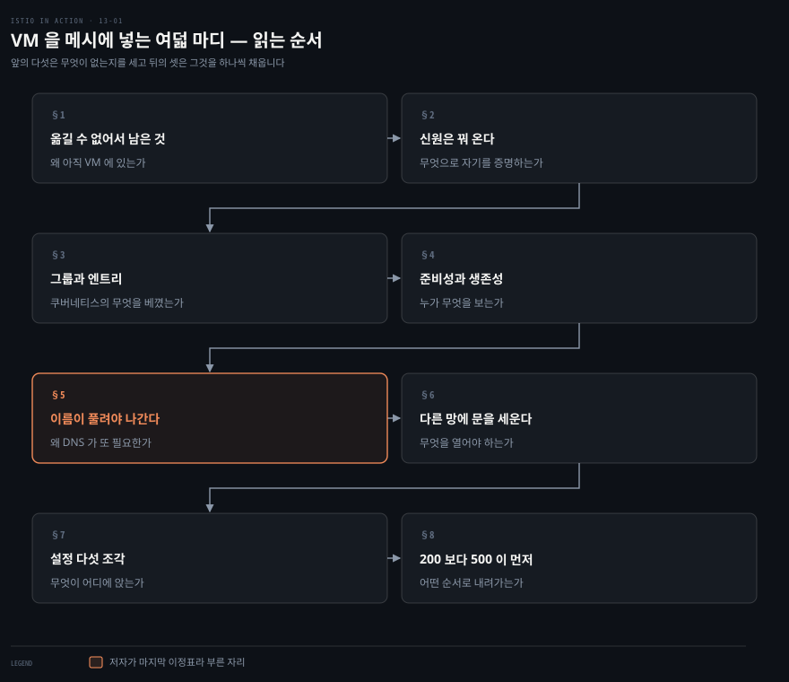
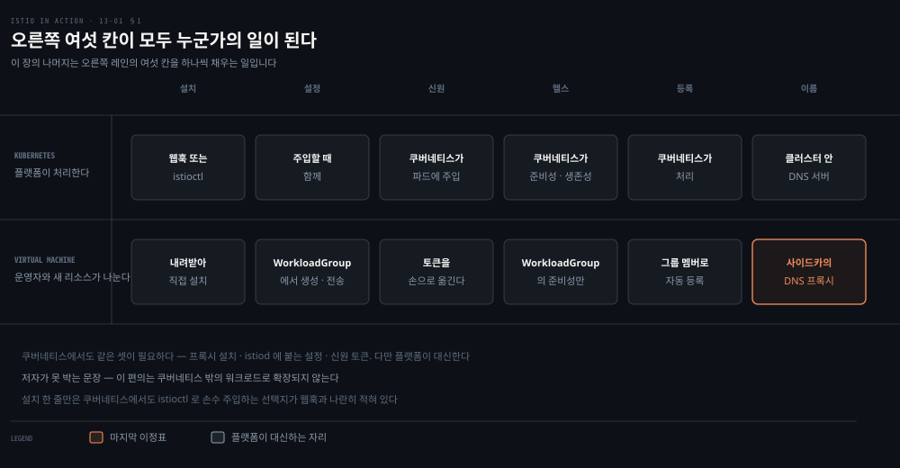
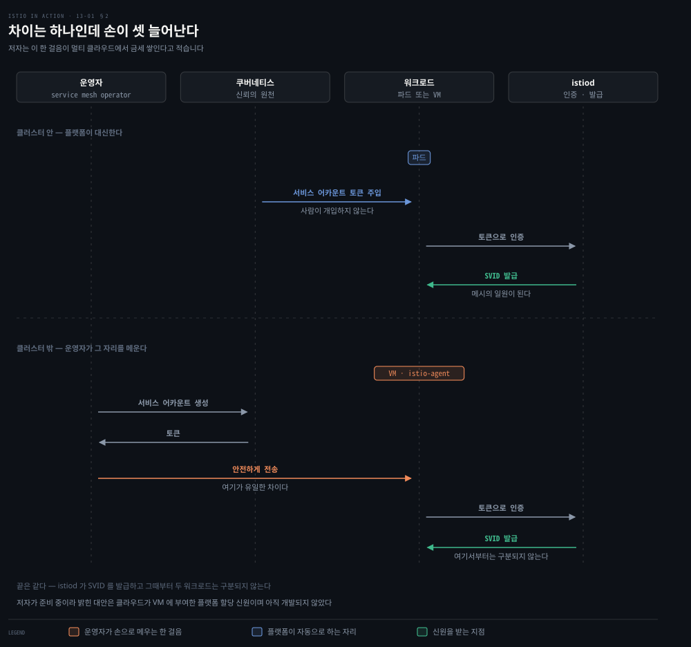
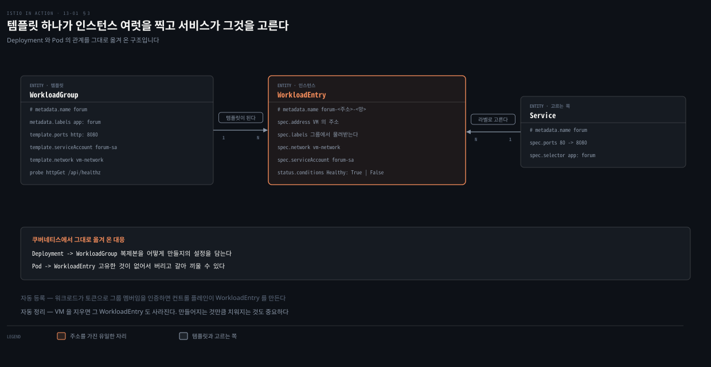
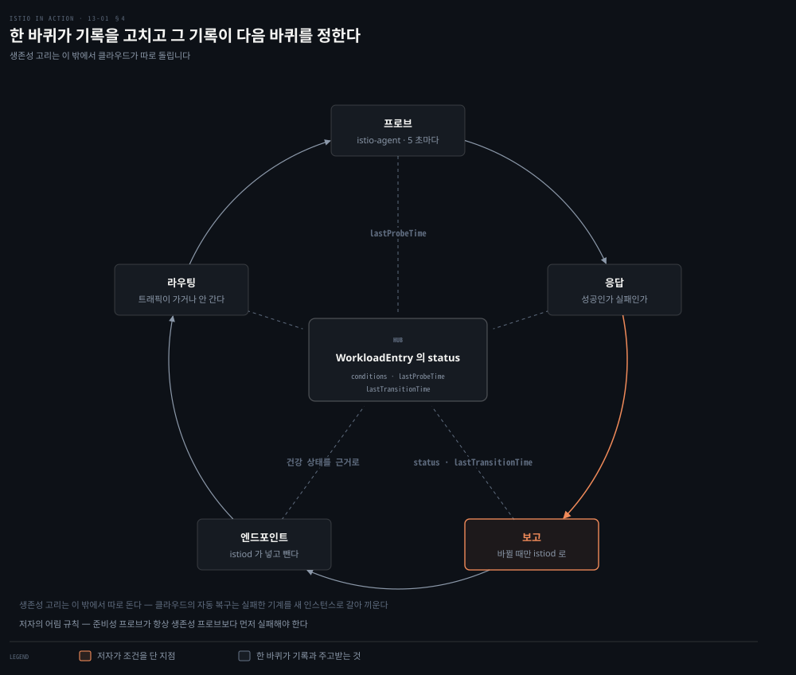
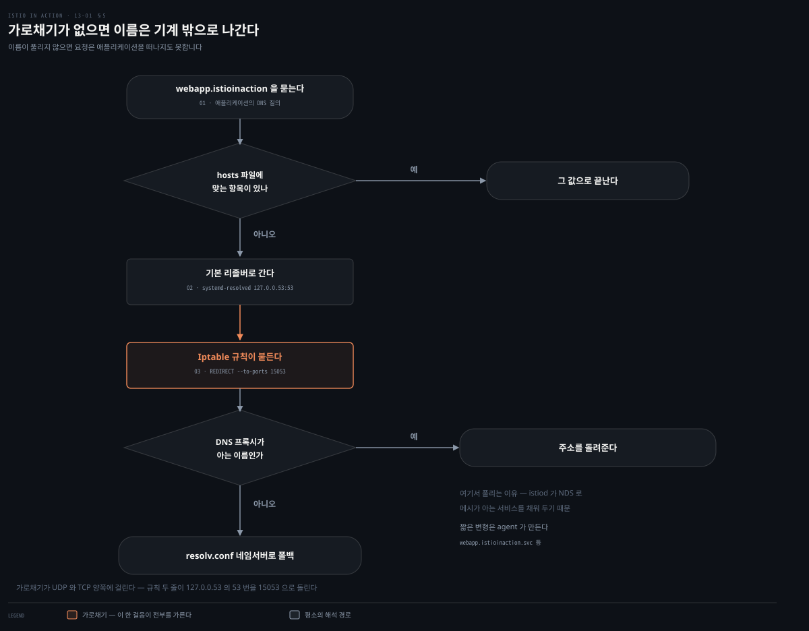
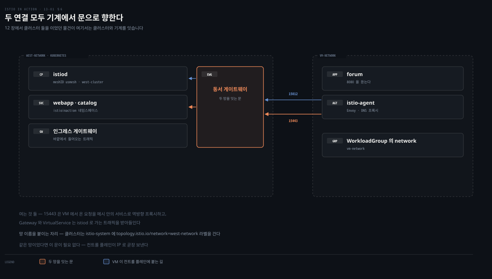
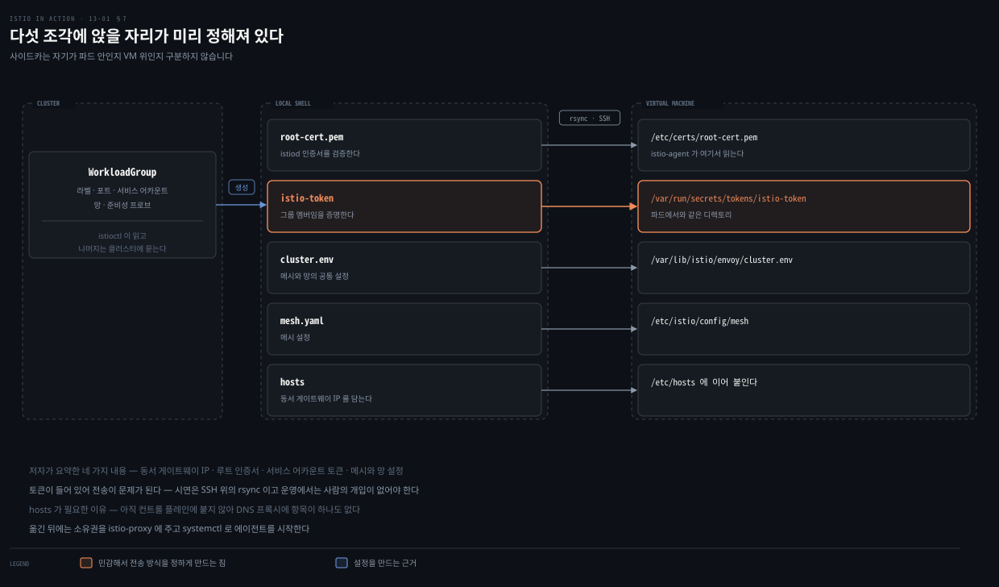
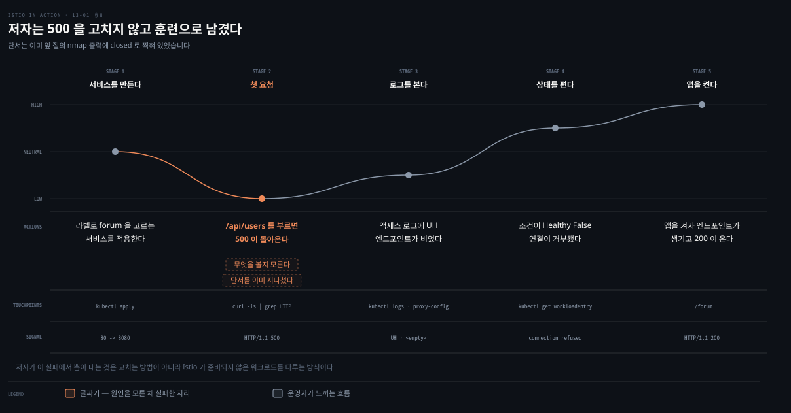

# 자동으로 되던 일이 목록이 되어 나타난다

---

> 13장은 가상 머신을 메시에 넣는 일을 다룹니다. 절차를 따라가다 보면 쿠버네티스가 말없이 해 주던 일이 하나씩 이름을 얻습니다. 그중 하나는 프록시를 다 세워 놓고도 트래픽이 나가지 못하게 만듭니다.

## 핵심 요약
> 이 장 전체가 매달린 하나의 생각은 **메시에 든다는 것이 기술의 문제가 아니라 그 일을 누가 하느냐의 문제**라는 것입니다. 저자가 장을 닫으며 놓는 표가 정확히 그 목록입니다.

쿠버네티스 안에서는 사이드카 주입도 신원 토큰도 이름 해석도 플랫폼이 대신합니다. VM에는 그 플랫폼이 없어서 같은 일이 사람의 손으로 넘어옵니다. 그래서 저자의 첫 권고는 넣는 방법이 아니라 **가능하면 넣지 말라**는 것이고, 규제와 의존성 지옥과 VM 고유 의존 셋만 예외로 듭니다.

넣기로 했다면 Istio가 메워 둔 자리가 셋입니다. `istioctl`이 설치와 설정을, `WorkloadGroup`과 `WorkloadEntry`가 고가용성을, 로컬 DNS 프록시가 이름 해석을 맡습니다. **그중 마지막이 가장 뜻밖입니다.** 프록시는 라우팅 설정을 이미 다 갖고 있는데도, 이름이 풀리지 않으면 요청이 애플리케이션을 떠나지 못해 가로챌 것 자체가 생기지 않습니다.

실습의 절정은 성공이 아니라 실패입니다. 클러스터에서 VM으로 첫 요청을 걸면 500이 오는데, 저자는 그것을 고치지 않고 훈련으로 남깁니다. 그리고 마지막에 남기는 경고는 기술이 아니라 운영에 관한 것입니다. 손으로 VM을 더하면 부서지기 쉬운 메시가 되고, 어느 순간 새벽 세 시에 호출됩니다.


## 학습 목표

이 내용을 읽고 나면:

1. 워크로드가 메시에 들기 위한 전제 셋을 들고, 쿠버네티스와 VM에서 그 셋을 각각 누가 처리하는지 말할 수 있습니다.
2. `WorkloadGroup`과 `WorkloadEntry`가 `Deployment`와 `Pod`의 어느 성질을 옮겨 온 것인지 설명할 수 있습니다.
3. 준비성 프로브와 생존성 프로브를 누가 수행해야 하는지 가르고, 두 임계값의 관계를 근거와 함께 댈 수 있습니다.
4. 프록시가 라우팅 설정을 다 갖고도 DNS 프록시가 필요한 이유를 설명할 수 있습니다.
5. VM에서 온 요청이 500으로 끝났을 때 추적할 순서를 댈 수 있습니다.

아래는 이 문서 전체를 읽는 순서로 이은 지도입니다. 칸마다 절 번호와 그 절이 답하는 것 하나를 적었습니다. 색이 붙은 칸이 저자가 마지막 이정표라고 부른 자리입니다.




## 이 문서가 다루지 않는 것

> 이 장은 앞선 장들과 다른 책의 재료를 그대로 가져다 씁니다. 겹치는 것은 옮겨 적지 않고 링크로 넘깁니다.

저자 자신이 두 곳을 부록으로 넘깁니다. 생성된 설정 파일의 내부는 부록 E로, 사이드카 주입 방식은 부록 B로 보냅니다. 이 노트도 같은 자리에서 멈춥니다.

쿠버네티스 쪽 기초는 다른 책의 노트가 SSOT입니다.

- `Deployment`와 `Pod`의 관계, 준비성·생존성 프로브의 기본 동작: [Kubernetes 네트워킹 모델 — Pod IP·레이아웃·Probe](../networking-and-kubernetes/04-01.Kubernetes%20%EB%84%A4%ED%8A%B8%EC%9B%8C%ED%82%B9%20%EB%AA%A8%EB%8D%B8%20%E2%80%94%20Pod%20IP%C2%B7%EB%A0%88%EC%9D%B4%EC%95%84%EC%9B%83%C2%B7Probe.md)
- 클러스터 안의 이름 해석과 그 한계: [NetworkPolicy와 DNS — 클러스터 안의 방화벽과 이름](../networking-and-kubernetes/04-03.NetworkPolicy%EC%99%80%20DNS%20%E2%80%94%20%ED%81%B4%EB%9F%AC%EC%8A%A4%ED%84%B0%20%EC%95%88%EC%9D%98%20%EB%B0%A9%ED%99%94%EB%B2%BD%EA%B3%BC%20%EC%9D%B4%EB%A6%84.md)
- 서비스 디스커버리가 DNS로 풀리지 않는 지점: [Service Discovery — DNS가 못 하는 일과 바깥을 잇는 법](../kubernetes-up-and-running/07-01.Service%20Discovery%20%E2%80%94%20DNS%EA%B0%80%20%EB%AA%BB%20%ED%95%98%EB%8A%94%20%EC%9D%BC%EA%B3%BC%20%EB%B0%94%EA%B9%A5%EC%9D%84%20%EC%9E%87%EB%8A%94%20%EB%B2%95.md)
- `iptables` 리디렉션이 트래픽을 가로채는 방식: [iptables·IPVS·eBPF — kube-proxy를 이해하는 세 기술](../networking-and-kubernetes/02-02.iptables%C2%B7IPVS%C2%B7eBPF%20%E2%80%94%20kube-proxy%EB%A5%BC%20%EC%9D%B4%ED%95%B4%ED%95%98%EB%8A%94%20%EC%84%B8%20%EA%B8%B0%EC%88%A0.md)
- `netstat`·`dig` 같은 진단 도구를 계층 순서로 쓰는 법: [Linux 네트워크 진단 도구 — 계층 순서대로 수사하기](../networking-and-kubernetes/02-03.Linux%20%EB%84%A4%ED%8A%B8%EC%9B%8C%ED%81%AC%20%EC%A7%84%EB%8B%A8%20%EB%8F%84%EA%B5%AC%20%E2%80%94%20%EA%B3%84%EC%B8%B5%20%EC%88%9C%EC%84%9C%EB%8C%80%EB%A1%9C%20%EC%88%98%EC%82%AC%ED%95%98%EA%B8%B0.md)
- VM 격리가 컨테이너보다 강하다고 말하는 근거: [가상머신 — 왜 VM 격리가 더 강하다고 하는가](../container-security/05-01.%EA%B0%80%EC%83%81%EB%A8%B8%EC%8B%A0%20%E2%80%94%20%EC%99%9C%20VM%20%EA%B2%A9%EB%A6%AC%EA%B0%80%20%EB%8D%94%20%EA%B0%95%ED%95%98%EB%8B%A4%EA%B3%A0%20%ED%95%98%EB%8A%94%EA%B0%80.md)

같은 책 안에서도 나뉩니다.

- 동서 게이트웨이의 SNI 구조와 `topology.istio.io/network` 라벨: [경계를 지우는 전제 셋과 남는 한 자리](12-01.%EA%B2%BD%EA%B3%84%EB%A5%BC%20%EC%A7%80%EC%9A%B0%EB%8A%94%20%EC%A0%84%EC%A0%9C%20%EC%85%8B%EA%B3%BC%20%EB%82%A8%EB%8A%94%20%ED%95%9C%20%EC%9E%90%EB%A6%AC.md)
- 액세스 로그 응답 플래그와 `istioctl proxy-config`로 내려가는 순서: [프록시는 다 알고 있고 사람은 못 읽는다](10-01.%ED%94%84%EB%A1%9D%EC%8B%9C%EB%8A%94%20%EB%8B%A4%20%EC%95%8C%EA%B3%A0%20%EC%9E%88%EA%B3%A0%20%EC%82%AC%EB%9E%8C%EC%9D%80%20%EB%AA%BB%20%EC%9D%BD%EB%8A%94%EB%8B%A4.md)
- SPIFFE 신원과 `PeerAuthentication`의 동작: [거의 안전한 기본값을 닫아 가는 순서](09-01.%EA%B1%B0%EC%9D%98%20%EC%95%88%EC%A0%84%ED%95%9C%20%EA%B8%B0%EB%B3%B8%EA%B0%92%EC%9D%84%20%EB%8B%AB%EC%95%84%20%EA%B0%80%EB%8A%94%20%EC%88%9C%EC%84%9C.md)
- 서비스 뒤의 인스턴스를 가중치로 옮기는 방법: [위험에 노출되는 트래픽을 줄여 가는 순서](05-01.%EC%9C%84%ED%97%98%EC%97%90%20%EB%85%B8%EC%B6%9C%EB%90%98%EB%8A%94%20%ED%8A%B8%EB%9E%98%ED%94%BD%EC%9D%84%20%EC%A4%84%EC%97%AC%20%EA%B0%80%EB%8A%94%20%EC%88%9C%EC%84%9C.md)


## 1. 옮길 수 없어서 남은 것들

> 메시에 VM을 넣는 방법을 묻기 전에, 왜 아직 VM에 있는지를 저자가 먼저 묻습니다. 그 답이 이 장의 범위를 정합니다.



저자는 장을 열면서 독자가 던질 질문을 먼저 적습니다. 레거시 워크로드를 그냥 현대화해서 쿠버네티스에 올리면 되지 않느냐는 것입니다. 그는 **가능하면 그 방법을 권한다**고 답하고, 비용까지 따졌을 때 그럴 수 없는 경우가 있다며 셋을 듭니다.

첫째는 조직의 사정입니다. 규제 준수 때문에 온프레미스에서 돌려야 하는데 쿠버네티스 클러스터를 세우고 운영할 전문성이 없는 경우입니다. 둘째는 애플리케이션의 사정입니다. 컨테이너화가 그렇게 간단하지 않아서, 어떤 앱은 재설계가 필요하고 어떤 앱은 갱신해야 할 의존성이 다른 의존성과 충돌합니다. 저자는 이것을 의존성 지옥이라고 부릅니다. 셋째는 기계의 사정입니다. 애플리케이션이 자기가 도는 VM에만 있는 무언가에 매여 있는 경우입니다.

셋 다 기술이 안 되는 이야기가 아니라 **지금 그 값을 치를 수 없다**는 이야기입니다. 그래서 이 장은 대안이 아니라 유예입니다.

넣기로 했다면 워크로드가 메시에 들기 위해 필요한 것이 정해져 있습니다. 프록시를 설치해 네트워크 트래픽을 맡깁니다. 그 프록시가 `istiod`에 붙어 설정을 받도록 구성합니다. `istiod`에 자기를 증명할 신원 토큰을 갖습니다. 저자는 이 셋이 쿠버네티스 워크로드에도 똑같이 필요하다고 못 박습니다. 다만 거기서는 웹훅이나 `istioctl`이 설치와 설정을 대신하고 토큰은 쿠버네티스가 파드에 자동으로 넣습니다.

**그 편의가 클러스터 밖으로 확장되지 않습니다.** VM 주인이 프록시를 직접 설치하고 설정하고 부트스트랩 토큰을 마련해야 하며, 그러고 나서야 워크로드가 메시의 일원이 됩니다.

위 도식의 여섯 줄은 저자가 장을 닫으며 놓는 표를 그대로 옮긴 것입니다. 설치·설정·신원·헬스 체크·등록·이름 해석 여섯 항목에서 쿠버네티스와 VM이 각각 무엇을 하는지 나란히 적습니다. **오른쪽 여섯 칸이 모두 누군가가 하거나 새 리소스가 대신해야 하는 일**입니다. 왼쪽은 대개 플랫폼의 이름인데, 설치 한 줄만은 쿠버네티스에서도 `istioctl`로 손수 주입하는 선택지를 웹훅과 나란히 답니다. 이 장의 나머지는 그 오른쪽 열을 하나씩 채우는 일입니다.

VM 지원 자체는 Istio 초기부터 있었지만, 저자의 표현으로는 컨트롤 플레인 바깥에서 우회와 자동화를 한 무더기 만들어야 했습니다. 핵심 기능들이 구현되고 API가 자리를 잡으면서 **Istio 1.9.0에서 베타로 승격**했습니다.


## 2. 신원은 쿠버네티스에서 꿔 온다

> 프록시를 깔아 놓아도 `istiod`가 상대를 모르면 설정을 주지 않습니다. VM은 클러스터 밖에 있는데 무엇으로 자기를 증명할까요.



Istio는 VM의 신원을 마련하는 데 **쿠버네티스를 신뢰의 원천으로 씁니다.** 쿠버네티스에서 토큰을 만들어 기계로 옮기고, 기계에 설치된 `istio-agent`가 그 토큰을 집어 `istiod`에 인증하는 방식입니다.

클러스터 안에서는 두 단계입니다. 파드에 서비스 어카운트 토큰이 주입되고 워크로드가 그 토큰으로 인증해 SVID를 받아 옵니다. VM에서는 세 단계가 됩니다. 서비스 어카운트를 만들고, 토큰을 VM으로 옮긴 뒤 그 토큰으로 인증해 SVID를 받습니다.

저자는 두 경로가 비슷하다고 적으면서 **차이가 딱 하나**라고 못 박습니다. 쿠버네티스는 토큰을 파드에 자동으로 넣어 주고, VM에서는 서비스 메시 운영자가 그 일을 해야 한다는 것입니다. 토큰은 안전하게 옮겨야 합니다.

차이는 하나인데 결과는 하나로 끝나지 않습니다. 저자가 곧바로 단점을 답니다. 운영자가 쿠버네티스에서 토큰을 만들고 VM으로 안전하게 옮기는 일을 **자동화해야** 하고, 이것 자체는 큰 노력이 아닐지 몰라도 조직이 멀티 클라우드 전략을 따르면 금세 쌓인다는 것입니다.

그래서 커뮤니티가 다른 답을 준비하고 있습니다. 클라우드 사업자가 VM에 부여한 **플랫폼 할당 신원**을 신뢰의 원천으로 삼아, `istio-agent`가 그것을 집어 `istiod`에 인증하는 방식입니다. 사업자별 토큰 검증을 설정할 API도 함께 나올 예정이라고 적습니다. 다만 저자는 이 방안이 **아직 개발되지 않았다**고 분명히 적고, 설계 문서 링크만 남긴 뒤 예제에서는 쿠버네티스를 원천으로 쓰고 토큰을 손으로 옮깁니다.

읽는 쪽에서 눈여겨볼 것은 이 절의 위치입니다. 신원 이야기가 설치 이야기보다 앞에 놓입니다. **프록시를 깔았다고 메시에 든 것이 아니라, `istiod`가 그 프록시를 알아본 순간부터 메시**이기 때문입니다.


## 3. `Deployment` 자리에 `WorkloadGroup`, `Pod` 자리에 `WorkloadEntry`

> 신원이 생겨도 VM 하나가 죽으면 서비스가 끊깁니다. 쿠버네티스는 이 문제를 오래전에 풀었는데, Istio는 그 답을 그대로 옮겨 옵니다.



VM 하나가 죽으면 그 위의 서비스도 함께 끊깁니다. 쿠버네티스는 이 문제를 인스턴스를 갈아 끼우는 쪽으로 풀었습니다. 그 방식은 두 리소스로 요약됩니다. `Deployment`는 상위 리소스로서 복제본을 어떻게 만들지의 설정을 담고, `Pod`는 그 설정에서 만들어진 복제본입니다. 저자가 짚는 핵심은 `Pod`의 성질입니다. **파드에는 고유한 것이 없어서**, 건강하지 않으면 버리고 갈아 끼울 수 있고 필요 없으면 줄일 수 있습니다.

Istio가 VM을 위해 들여온 두 리소스가 이 대응에 정확히 맞춰져 있습니다. `WorkloadGroup`은 자기가 관리하는 워크로드가 어떻게 구성되는지의 템플릿을 정의합니다. 애플리케이션이 노출된 포트, 인스턴스에 붙일 라벨, 메시에서 그 워크로드의 신원이 될 서비스 어카운트, 그리고 애플리케이션의 건강을 어떻게 검사할지가 여기 들어갑니다. `WorkloadEntry`는 실제 사용자 트래픽을 처리하는 **VM 하나**를 나타내고, 그룹이 정한 공통 속성에 더해 자기만의 것을 갖습니다. 인스턴스의 주소와 헬스 상태입니다.

`WorkloadEntry`는 손으로 만들 수도 있지만 권장되는 방법은 **워크로드 자동 등록**입니다. 워크로드가 자기에게 공급된 설정으로 컨트롤 플레인에 접속해 신원 토큰으로 `WorkloadGroup`의 멤버임을 인증하면, 컨트롤 플레인이 그 VM을 나타내는 `WorkloadEntry`를 만듭니다.

여기까지는 절차이고, 저자가 뒤이어 붙이는 문장이 이 절의 값어치입니다. VM이 `WorkloadEntry`로 표현되는 것이 왜 중요하냐면, **쿠버네티스 서비스나 Istio의 `ServiceEntry`가 라벨 셀렉터로 그것을 고를 수 있게 되기 때문**입니다. 실제 주소가 아니라 클러스터 안의 FQDN으로 워크로드를 고르게 되면, 건강하지 않은 워크로드를 버리거나 수요가 늘 때 새로 띄우는 일을 **클라이언트가 알지도 못하고 영향받지도 않은 채로** 할 수 있습니다.

이 구조는 이전으로도 이어집니다. 저자는 VM의 레거시 워크로드에서 클러스터의 현대화된 워크로드로 넘어갈 때의 위험을 줄이는 방법으로, 둘을 나란히 돌려 놓고 5장의 트래픽 시프팅으로 트래픽을 조금씩 옮기는 그림을 듭니다. 오류가 늘면 다시 VM 쪽으로 되돌릴 수 있습니다.

자동 등록의 짝은 자동 정리입니다. 저자는 장 끝에서 VM을 실제로 지우고 잠시 뒤 `kubectl get workloadentries`를 걸어 아무것도 남지 않은 것을 보여 줍니다. 만들어지는 것만큼 **치워지는 것도 중요하다**고 적는데, 클라우드 네이티브 워크로드의 수명이 짧기 때문입니다.


## 4. 준비성은 메시가 보고 생존성은 플랫폼이 본다

> 인스턴스를 갈아 끼우려면 누가 아픈지 알아야 합니다. 그런데 저자는 두 종류의 검사 중 하나를 메시의 일이 아니라고 잘라 말합니다.



메시의 일원이 된 워크로드는 트래픽을 받을 준비가 돼야 하고 헬스 체크로 검사받습니다. 저자는 고가용성을 유지하려면 두 종류가 필요하다고 적고, 쿠버네티스가 하는 방식과 같다고 덧붙입니다. **준비성 프로브**는 워크로드가 시작된 뒤 트래픽을 받을 준비가 됐는지 봅니다. **생존성 프로브**는 도는 중인 애플리케이션이 건강한지 보아 아니면 재시작합니다.

그러고 나서 문장 하나를 느낌표까지 붙여 놓습니다. **생존성 프로브는 서비스 메시의 관심사가 아니라는 것**입니다. 워크로드의 생존을 보장하는 일은 워크로드가 도는 **플랫폼의 기능**입니다. 쿠버네티스도 하나의 플랫폼으로서 `Deployment` 설정의 프로브로 생존성 검사를 수행합니다. 클라우드의 VM에서 워크로드를 돌린다면 클라우드의 기능으로 생존성 프로브를 구현하고 실패 시 새 인스턴스를 띄우는 식으로 고쳐야 합니다.

저자는 세 사업자의 해당 기능을 문서 링크와 함께 이름으로 짚어 둡니다. Azure의 VM 스케일 셋 자동 인스턴스 복구, AWS의 오토스케일 그룹 인스턴스 헬스 체크, GCP의 관리형 인스턴스 그룹 자동 복구입니다.

메시가 맡는 쪽은 준비성입니다. `istio-agent`가 `WorkloadGroup` 정의에 적힌 대로 애플리케이션의 준비 상태를 주기적으로 찌릅니다. 그리고 상태가 건강에서 불건강으로 또는 그 반대로 **바뀔 때** `istiod`에 보고합니다. 컨트롤 플레인은 그 상태로 트래픽을 그 워크로드에 보낼지를 정합니다. 건강하면 데이터 플레인에 그 VM의 엔드포인트가 설정되고, 불건강하면 엔드포인트가 데이터 플레인에서 빠집니다.

위 도식이 그 고리입니다. 한 바퀴 돌 때마다 `WorkloadEntry`의 `status`에 마지막 검사 시각과 마지막 전이 시각이 쌓이고, 그 기록이 다음 바퀴의 판단 근거가 됩니다. **고리 밖에 클라우드의 생존성 고리가 따로 돕니다.** 둘은 같은 애플리케이션을 보지만 실패했을 때 하는 일이 다릅니다. 하나는 트래픽을 끊고 하나는 기계를 죽입니다.

그래서 저자가 두 프로브를 다르게 설정하라고 권합니다. `istio-agent`가 수행하는 준비성 프로브는 **공격적이어야** 하고 오류를 돌려주는 인스턴스로 트래픽이 가지 않게 막아야 합니다. 클라우드 사업자가 수행하는 생존성 프로브는 **보수적이어야** 하고 VM에 회복할 시간을 줘야 합니다.

그가 남기는 어림 규칙은 한 줄로 외울 만합니다. **준비성 프로브가 항상 생존성 프로브보다 먼저 실패해야 합니다.** 인스턴스를 너무 성급히 죽이면 처리 중이던 요청이 유예 없이 끊기고, 그것은 최종 사용자에게 보이는 실패가 됩니다.


## 5. 이름이 풀리지 않으면 트래픽은 나가지도 못한다

> 프록시는 어디로 보낼지를 이미 다 압니다. 그런데도 VM에서는 이름 해석이 마지막 관문으로 남습니다. 저자가 이 모순을 스스로 꺼냅니다.



VM은 쿠버네티스 클러스터 바깥에 있으므로 클러스터 내부의 DNS 서버에 닿지 못합니다. 그래서 클러스터 서비스의 호스트명을 풀 수 없고, 저자는 이것을 VM을 메시에 넣는 **마지막 이정표**라고 부릅니다.

그러면서 독자가 품을 의문을 먼저 적습니다. 애플리케이션과 함께 배포된 서비스 프록시가 모든 워크로드로 트래픽을 보내는 설정을 이미 갖고 있지 않느냐는 것입니다. 그는 그 말이 맞다고 인정합니다. **프록시는 어떻게 라우팅할지의 설정을 갖고 있습니다.**

문제는 다른 데 있습니다. 저자의 표현으로는 **트래픽을 애플리케이션 밖으로 꺼내 프록시까지 보내는 일**이 걸립니다. 그 일이 일어나려면 호스트명이 먼저 풀려야 합니다. 풀리지 않으면 트래픽은 애플리케이션을 떠나지 않고, 떠나지 않으면 Envoy 프록시로 리디렉트될 수도 없습니다. 12장 노트의 마지막에 적어 둔 스텁 서비스 이야기와 같은 자리입니다. 이름 해석은 메시가 대신해 주지 않는 마지막 한 걸음입니다.

예전에는 우회로 풀었습니다. 모든 쿠버네티스 서비스가 설정된 사설 DNS 서버를 두고 VM이 그것을 네임서버로 쓰게 했습니다. 쿠버네티스의 워크로드가 계속 바뀌므로 그 DNS 서버를 채우는 일도 컨트롤러로 자동화해야 했고, `external-dns`가 그 일을 하는 오픈소스입니다. 저자는 이것을 **우회이지 서비스 메시 사용자가 원할 통합된 해법은 아니라고** 잘라 말합니다.

Istio 1.8부터 `istio-agent` 사이드카에 **로컬 DNS 프록시**가 들어왔습니다. 이 프록시는 Envoy 옆에서 돌고 `istiod`가 메시 안의 모든 서비스로 채워 줍니다. 애플리케이션의 DNS 질의는 `Iptable` 규칙으로 이 프록시에 돌려집니다. Istio가 트래픽을 가로채는 평소 방식 그대로이고, `istio-cni`를 쓰면 조금 달라집니다. 그리고 프록시를 계속 최신으로 유지하기 위해 **NDS**(Name Discovery Service)라는 API가 생겼습니다. 쿠버네티스 서비스나 `ServiceEntry`가 메시에 추가되면 컨트롤 플레인이 데이터 플레인의 DNS 항목을 동기화합니다.

저자는 이론으로만 이해하기보다 단계마다 확인하는 쪽을 택합니다. 위 도식의 다섯 단계가 그 확인의 순서입니다.

먼저 `iptables` 규칙이 `systemd-resolved`로 갈 질의를 가로채는지 봅니다.

```bash
sudo iptables-save | grep 'to-ports 15053'
```

```bash
-A OUTPUT -d 127.0.0.53/32 -p udp -m udp --dport 53 -j REDIRECT --to-ports 15053
-A ISTIO_OUTPUT -d 127.0.0.53/32 -p tcp -m tcp --dport 53 -j REDIRECT --to-ports 15053
```

Ubuntu의 기본 리졸버인 `systemd-resolved`는 루프백 주소 `127.0.0.53`의 53번 포트를 듣고 있습니다. 위 두 규칙이 그리로 가는 UDP와 TCP를 **15053번으로 돌립니다.**

다음은 그 포트를 실제로 누가 듣고 있는지입니다.

```bash
sudo netstat -ltunp
```

```bash
tcp  0  0 127.0.0.1:15053  LISTEN  1544/pilot-agent
udp  0  0 127.0.0.1:15053          1544/pilot-agent
tcp  0  0 127.0.0.53:53    LISTEN  850/systemd-resolve
```

위는 원문 출력에서 세 줄만 뽑은 것입니다. 실제 출력에는 Envoy가 듣는 `15021`·`15090`·`15000`·`15001`·`15006`과 `pilot-agent`의 `15020` 등이 함께 나옵니다. `pilot-agent`는 저자가 `istio-agent`를 부르는 또 하나의 이름입니다.

마지막으로 그 포트에 직접 물어봅니다.

```bash
dig +short @localhost -p 15053 webapp.istioinaction
```

```bash
10.0.183.159
```

여기서는 DNS 서버를 손으로 지정했지만 실제로는 그럴 필요가 없습니다. 애플리케이션이 이름을 풀 때 `Iptable` 규칙이 알아서 이 포트로 돌립니다.

DNS 프록시가 무엇을 알고 있는지는 `istiod`의 디버그 엔드포인트로 봅니다. `ndsz`에 워크로드 이름을 넘기면 그 사이드카의 NDS 설정이 나오는데, 출력에는 `webapp.istioinaction.svc.cluster.local` 같은 **FQDN만** 들어 있습니다. 그런데 앞의 `dig`는 짧은 이름으로도 답을 받았습니다.

저자가 이 간극을 짚고 답합니다. `istio-agent`가 NDS 설정을 받으면 **쿠버네티스 클러스터에서 설정됐을 법한 변형을 전부 만들어 낸다**는 것입니다. `webapp.istioinaction`, `webapp.istioinaction.svc`, `webapp.istioinaction.svc.cluster`가 모두 같은 주소 목록으로 풀립니다.


## 6. 다른 망에 있으면 문을 하나 세운다

> 개념이 끝났으니 실제로 세울 차례입니다. 첫 관문은 클러스터와 VM이 서로 다른 망에 있다는 사실입니다.



저자가 세우는 그림은 단순합니다. 쿠버네티스 클러스터에 `webapp`과 `catalog`가 있고, VM에 `forum`이 있습니다. 셋을 합치면 앞선 장들에서 계속 써 온 cool-store입니다.

**클러스터와 VM이 서로 다른 망에 있습니다.** 그래서 VM에서 클러스터 서비스로 가는 트래픽을 역방향 프록시할 동서 게이트웨이가 필요합니다. 12장에서 클러스터 둘을 이었던 그 물건이 여기서는 클러스터와 기계를 잇습니다.

망 정보는 설치 시점에 못 박습니다. `istio-system` 네임스페이스에 `topology.istio.io/network=west-network` 라벨을 붙입니다. 그리고 컨트롤 플레인 설치에 `meshID`는 `usmesh`, `clusterName`은 `west-cluster`, `network`는 `west-network`로 넣습니다.

VM 통합 기능은 베타 단계라 기본으로 켜져 있지 않습니다. `IstioOperator` 정의로 셋을 켭니다.

```yaml
meshConfig:
  defaultConfig:
    proxyMetadata:
      ISTIO_META_DNS_CAPTURE: "true"
values:
  pilot:
    env:
      PILOT_ENABLE_WORKLOAD_ENTRY_AUTOREGISTRATION: true
      PILOT_ENABLE_WORKLOAD_ENTRY_HEALTHCHECKS: true
```

첫째는 DNS 질의를 가로채 DNS 프록시로 돌리게 합니다. 둘째는 워크로드가 컨트롤 플레인에 자동 등록할 수 있게 하고, 셋째는 VM의 워크로드에 헬스 체크를 수행하게 합니다. 5절과 4절과 3절에서 각각 본 기능이 여기서 스위치 하나씩으로 나타납니다.

그러고 나서 문을 엽니다. 동서 게이트웨이를 설치하고 두 가지를 노출합니다. 하나는 **멀티 클러스터 mTLS 포트 15443**으로, VM에서 온 요청을 메시 안의 서비스로 역방향 프록시합니다. 다른 하나는 **`istiod`의 포트**로, `Gateway`와 `VirtualService`를 함께 적용해 트래픽을 받아들이고 `istiod`로 보냅니다.

VM 쪽 준비도 저자가 조건을 밝혀 둡니다. 운영체제는 Ubuntu 18.04인데, 이유가 붙습니다. **Istio는 데비안과 레드햇 배포판에 대해서만 바이너리를 릴리스**하므로 다른 배포판이면 `istio-agent`를 소스에서 빌드해야 합니다. 공개 IP를 주지만 시연용일 뿐입니다. 실제 환경에서는 망을 피어링해 사설 연결로 붙이라고 적습니다. SSH로 접근할 수 있게 두고, 애플리케이션 포트 8080을 열어 클러스터 서비스가 `forum`에 닿을 수 있게 합니다.

포트가 실제로 열렸는지는 `nmap`으로 확인합니다. 여기서 저자가 한 줄을 심어 둡니다. 출력의 포트 상태가 `closed`인데, 이것은 **현재 그 포트에서 패킷을 기다리는 애플리케이션이 없다**는 뜻이고 나중에 앱을 돌리면 달라진다는 것입니다. 8절에서 이 문장이 회수됩니다.


## 7. 설정 다섯 조각이 정해진 자리에 앉는다

> 문이 열렸으니 VM에 프록시를 세울 차례입니다. 손으로 하는 일이 가장 많은 절이고, 그래서 저자가 자동화를 당부하는 절이기도 합니다.



먼저 `WorkloadGroup`으로 VM들의 공통 속성을 정의합니다. 저자가 `forum` 워크로드를 위해 적는 정의는 이렇습니다.

```yaml
metadata:
  labels:
    app: forum
template:
  ports:
    http: 8080
  serviceAccount: forum-sa
  network: vm-network
probe:
  periodSeconds: 5
  initialDelaySeconds: 1
  httpGet:
    port: 8080
    path: /api/healthz
```

다섯 필드 중 셋을 저자가 따로 꼽아 설명합니다. `labels`는 쿠버네티스 서비스가 이 그룹에 등록한 워크로드 엔트리를 고를 수 있게 합니다. `network`는 컨트롤 플레인이 트래픽 경로를 정하는 근거입니다. **같은 망이면 IP 주소로 곧장 보내고, 아니면 그 망에 배포된 동서 게이트웨이를 거칩니다.** `serviceAccount`는 워크로드의 신원입니다. 이 그룹의 멤버로 등록하려면 그 서비스 어카운트에 대한 클레임을 제시해야 합니다.

남은 둘은 앞 절들이 이미 세워 둔 것입니다. `ports`는 애플리케이션이 듣는 자리이고, `probe`는 4절의 준비성 검사를 `istio-agent`가 어떻게 수행할지입니다.

네임스페이스와 서비스 어카운트를 만들고 이 정의를 적용하면, 이제 클러스터는 `forum-sa`의 유효한 토큰을 제시하는 워크로드를 자동으로 등록할 준비가 됩니다.

`WorkloadGroup`은 등록을 돕는 데 그치지 않고 **그 그룹에 속한 VM들의 공통 설정을 생성하는 데도 쓰입니다.** `istioctl`이 그룹의 정보를 읽고 필요한 나머지를 클러스터에 물어 설정 파일을 만듭니다.

```bash
istioctl x workload entry configure \
  --name forum \
  --namespace forum-services \
  --clusterID "west-cluster" \
  --externalIP $VM_IP \
  --autoregister \
  -o ./ch13/workload-files/
```

`--clusterID`는 Istio 설치 때 지정한 클러스터 이름과 같아야 합니다. `--externalIP`는 워크로드가 클러스터와 다른 망에 있을 때 필요하고, 지정하지 않으면 망이 할당한 사설 IP를 씁니다. `--autoregister`가 자동 등록을 켭니다.

저자는 생성된 파일에 무엇이 담기는지를 넷으로 요약합니다. `istiod`가 노출된 **동서 게이트웨이의 IP 주소**가 하나입니다. `istiod`가 제시하는 인증서의 진위를 검증할 **루트 인증서**가 둘입니다. `forum` `WorkloadGroup`의 멤버로 `istiod`에 인증할 **서비스 어카운트 토큰**이 셋입니다. 그룹에 정의된 대로의 **메시·망·공통 속성 설정**이 넷입니다. 이 넷이 다섯 개의 파일로 떨어지고, 파일마다 앉을 자리가 정해져 있습니다.

파일에는 민감한 데이터가 들어 있으므로 안전하게 옮겨야 합니다. 저자는 시연에서 노력이 가장 적게 드는 방법으로 SSH 위의 `rsync`를 쓰면서, **운영 환경에서는 이 과정이 자동화돼야 하고 사람의 개입을 요구해서는 안 된다**고 붙입니다.

VM 안에서는 순서가 정해져 있습니다. 데비안 패키지로 `istio-agent`를 내려받아 설치합니다. 파일을 정해진 경로로 옮기고 소유권을 준 뒤 서비스로 시작합니다. 파일이 앉는 자리 중 하나는 눈여겨볼 만합니다. **서비스 어카운트 토큰은 파드에서와 같은 디렉토리**를 씁니다. 사이드카는 자기가 파드 안에 있는지 VM 위에 있는지를 구분하지 않습니다.

`/etc/hosts`에 항목을 이어 붙이는 단계에서 저자가 스스로 묻습니다. DNS 프록시가 클러스터 호스트명을 풀어 주기로 하지 않았느냐는 것입니다. 답은 순서에 있습니다. **사이드카가 아직 컨트롤 플레인에 붙지 않은 이 시점에는 파일럿이 아는 DNS 항목이 없습니다.** 그래서 `istiod.istio-system.svc`를 동서 게이트웨이 IP로 푸는 항목을 정적으로 넣어 두고, 그 항목은 앞서 `istioctl`이 `hosts`라는 파일로 만들어 둔 것입니다. 이 방식이 곤란한 환경이라면 동서 게이트웨이 앞에 네트워크 로드밸런서를 세우라고 대안을 답니다.

에이전트를 시작한 뒤 확인할 곳도 정해져 있습니다. 표준 출력은 `/var/log/istio/istio.log`로, 표준 에러는 `/var/log/istio/istio.err.log`로 갑니다. 연결이 됐는지는 `xdsproxy` 스코프의 로그로 봅니다.

```bash
info xdsproxy Initializing with upstream address "istiod.istio-system.svc:15012" and cluster "west-cluster"
info xdsproxy connected to upstream XDS server: istiod.istio-system.svc:15012
```

로그 파일이 아예 없다면 서비스가 시작조차 못 한 경우이고, 그때는 `journalctl -f -u istio`로 systemd 쪽을 봅니다. 로그가 아니라 **로그의 부재**를 단서로 삼는 갈림길입니다.

에이전트의 동작은 나중에 바꿀 수 있습니다. `/var/lib/istio/envoy/sidecar.env`가 사이드카 전용 설정 파일입니다. 여기에 `ISTIO_AGENT_FLAGS="--log_output_level=dns:debug"`를 넣으면 DNS 프록시의 로그 수준이 올라갑니다. `SECRET_TTL="12h0m0s"`는 인증서 수명을 줄입니다. 서비스를 재시작해야 반영되고, 갱신된 인증서의 만료는 `/etc/certs/cert-chain.pem`에서 확인합니다.

> **원문 정오**: 호스트명을 `/etc/hosts`에 못 박는 명령이 인쇄된 그대로는 동작하지 않습니다. 저자는 이 절을 열면서 VM에서 실행하는 명령은 `azureuser@forum-vm:~$` 프롬프트로, 로컬 컴퓨터에서 실행하는 명령은 `$`만으로 표시한다고 규약을 밝힙니다. 그런데 이 명령만 `$`로 시작합니다. `hostname`을 읽어 그 기계의 `/etc/hosts`에 붙이는 일이므로 VM에서 돌아야 하고, 같은 절의 나머지 열네 개 명령은 모두 VM 프롬프트를 답니다. 게다가 앞 문단의 같은 꼴 명령이 `cat "${HOME}"/hosts | \`로 파이프와 줄 이음을 갖춘 것과 달리, 이 명령은 `$(hostname)"` 뒤에서 그냥 끊깁니다. 파이프 없이 그대로 치면 앞 절반이 화면에 찍히고 뒤 절반은 입력을 기다립니다.


## 8. 200보다 500이 먼저 온다

> 양방향이 다 되는지 확인할 차례입니다. 한쪽은 바로 되고 한쪽은 실패하는데, 저자는 그 실패를 고치지 않고 남겨 둡니다.



VM에서 클러스터로 가는 쪽은 바로 됩니다. VM 안에서 `curl webapp.istioinaction/api/catalog/items/1`을 걸면 상품 하나가 돌아옵니다. 저자는 성공을 확인한 뒤 그 사이에 무슨 일이 있었는지를 네 단계로 풉니다. 트래픽이 애플리케이션을 떠나려면 호스트명이 풀려야 하므로 DNS 질의가 먼저 DNS 프록시로 돌려집니다. 이름이 주소가 되면 애플리케이션이 요청을 내보내고, 그것이 `Iptable` 규칙으로 Envoy에 가로채입니다. Envoy가 동서 게이트웨이로 보내면 게이트웨이가 `webapp`에 넘깁니다. 5절과 6절에서 따로 세운 것들이 한 요청 안에서 순서대로 쓰입니다.

반대 방향은 다릅니다. 클러스터에서 VM의 서비스를 부르려면 주소가 아니라 이름이 필요하므로, 라벨로 인스턴스를 고르는 쿠버네티스 서비스를 만듭니다. 저자가 이유를 붙이는데 **쿠버네티스에서 파드의 고정 IP를 쓰지 않는 이유와 같습니다.** 플랫폼이 인스턴스를 갈아 끼울 수 있게 두려는 것입니다.

```yaml
spec:
  ports:
    - name: http
      port: 80
      protocol: TCP
      targetPort: 8080
  selector:
    app: forum
```

그리고 요청을 걸면 500이 돌아옵니다. 저자는 곧바로 되돌리지 않고 이렇게 적습니다. 무언가 잘못했다는 뜻이냐고 물은 뒤, **원인을 찾기 전에는 알 수 없다**고 답하고 이 훈련의 목적이 계획대로 되지 않았을 때를 위한 연습이라고 밝힙니다.

추적은 오류를 돌려준 인스턴스에서 시작합니다. `webapp`의 액세스 로그에 `UH`가 찍혀 있습니다. 10장에서 본 대로 이것은 **건강한 업스트림이 없다**는 뜻이며 클러스터에 트래픽을 보낼 건강한 엔드포인트가 하나도 없을 때만 나타납니다. 그렇다면 `webapp`에 `forum` 엔드포인트가 없어야 하고, `istioctl proxy-config endpoints`로 확인하면 실제로 비어 있습니다.

`WorkloadEntry`는 등록됐는데 엔드포인트가 없다면 남은 것은 헬스 체크입니다. 정의를 YAML로 펼치면 조건이 나옵니다.

```yaml
status:
  conditions:
    - message: 'Get "http://…:8080/api/healthz": … connect: connection refused'
      status: "False"
      type: Healthy
```

연결이 거부됐습니다. 그리고 여기서 6절의 `nmap` 출력이 회수됩니다. **포트 8080은 `closed`였고, 그것은 듣고 있는 애플리케이션이 없다는 뜻이었습니다.** 아직 VM에서 앱을 시작하지 않은 것입니다.

바이너리를 내려받아 실행하고 몇 초 기다리면 상태가 `True`로 바뀝니다. `istiod`가 데이터 플레인에 엔드포인트를 채우고, 같은 요청이 200으로 돌아옵니다.

저자가 여기서 뽑아 내는 것은 고치는 방법이 아니라 **Istio가 준비되지 않은 워크로드를 다루는 방식**입니다. 트래픽을 보내지 않으려고 따로 무언가를 하는 게 아니라, 그저 데이터 플레인에 그 엔드포인트를 설정하지 않습니다. 예제에서는 이득이 잘 보이지 않지만 운영 클러스터에서는 이것이 오류를 돌려주는 인스턴스로부터 클라이언트를 보호합니다.

VM이 메시 안에 들어오고 사이드카가 네트워크 트래픽을 관리하게 됐으므로, 이제 Istio의 API가 VM에도 그대로 걸립니다. 저자가 드는 예가 하나 있는데 앞에서 만든 구멍을 스스로 막는 것입니다. 시연을 위해 8080을 열어 뒀으므로 **거기에 닿을 수 있는 사람은 누구든 응답을 받습니다.** 메시에 들어 있지 않은 로컬 컴퓨터에서 VM 주소로 직접 요청하면 200이 옵니다. 메시 전역 `PeerAuthentication`으로 상호 인증된 트래픽만 받게 하면, 같은 요청이 `Recv failure: Connection reset by peer`로 끊기고 메시 안에서 오는 요청은 그대로 200입니다.

> **원문 정오**: 불건강 상태를 보여 주는 `WorkloadEntry` 출력 하나가 자기 안에서 어긋납니다. `name`은 `forum-10.0.0.4`인데 같은 객체의 `spec.address`는 `138.91.249.118`이고, 그 아래 헬스 체크 실패 메시지가 부르고 있는 주소는 또 다른 `40.85.149.87`입니다. 이름은 등록된 주소에서 만들어지므로 한 객체가 이 셋을 동시에 가질 수 없습니다. 같은 장의 다른 두 출력이 `forum-40.83.164.1-vm-network`와 `forum-138.91.249.118-vm-network`로 **주소와 망이 이름에 함께 들어가는 꼴**을 보여 주는데, 문제의 이름은 그 꼴도 아닙니다. 여러 번의 실행 결과가 한 블록으로 붙은 것으로 읽힙니다.

> **노트의 읽기**: 장 전체에서 같은 VM 하나가 다섯 개의 공개 주소로 나타납니다. systemd 상태의 `138.91.144.131`, 워크로드 엔트리 목록의 `40.83.164.1`, 헬스 메시지의 `40.85.149.87`, `spec.address`의 `138.91.249.118`, 엔드포인트 출력의 `52.160.67.232`입니다. 출력마다 다른 실행에서 가져온 것이므로 **한 주소를 장 전체에서 따라가려고 하면 안 됩니다.** 각 출력 안에서만 읽는 것이 맞습니다.

장을 닫으며 저자가 남기는 것은 기술이 아니라 운영에 관한 경고입니다. 이 장은 간결하게 보여 주려고 프록시를 손으로 설치하고 설정했지만, 실제 프로젝트에서는 이 과정이 자동화돼야 합니다. **손으로 VM을 더하면 아주 부서지기 쉬운 메시가 됩니다. 어느 순간 새벽 세 시에 호출돼 기계를 손으로 다시 짓고 메시에 등록해 서비스를 복구하게 됩니다.**

그러면서 그 말이 들리는 것만큼 무겁지 않다고 덧붙입니다. 요즘 프로젝트는 대개 Packer나 Ansible이나 Terraform으로 VM을 짓고 배포하는 자동화를 이미 갖고 있으므로, 할 일은 **그 스크립트에 사이드카 설치와 설정과 토큰 제공을 얹는 것**으로 줄어듭니다.


## 심화 학습

> 책 밖의 보강만 둡니다. 각 항목은 공식 1차 자료로 확인한 것입니다.

**VM 통합은 지금도 Beta입니다.** 저자는 VM 지원이 1.9.0에서 베타로 승격했다고 적습니다. 현재 기능 단계 문서에서도 Virtual Machine Integration은 Beta이고, VM용 자격 증명 배포도 Beta입니다. 그 문서가 Beta에 붙이는 정의는 장기적으로 약속하지 않은 채 운영에서 해법을 검증하는 단계이며 대상은 모든 사용자라는 것입니다.[^stages] `WorkloadEntry`와 `WorkloadGroup`은 그 표가 아니라 설정 리소스 목록에 실려 있어 단계 표시가 없습니다. 그래서 아래의 API 버전 이야기와 이 기능 단계는 따로 읽어야 합니다.

**`WorkloadGroup`의 API 버전이 `v1`입니다.** 저자의 예제는 `networking.istio.io/v1alpha3`이고 출력에 나오는 `WorkloadEntry`는 `v1beta1`입니다. 현재 레퍼런스는 `networking.istio.io/v1`을 씁니다.[^workloadgroup] 12장의 `Gateway`가 그랬듯 여기서도 알파·베타 표기는 옛 판본의 흔적입니다.

**준비성 프로브가 HTTP GET 말고도 셋을 더 받습니다.** 저자는 `httpGet`만 보여 주지만, 현재 레퍼런스의 `ReadinessProbe`는 **HTTP GET·TCP 소켓·exec 명령·gRPC 헬스 체크** 넷을 지원하고 각각에 초기 지연·타임아웃·주기·성공·실패 임계값을 붙일 수 있습니다.[^workloadgroup] 6절에서 애플리케이션 포트를 인프라 계층에서 열어야 했던 제약이 검사 방식에 따라 달라질 여지가 여기 있습니다.

**DNS 프록시는 사이드카 모드에서 여전히 기본이 아닙니다.** 저자가 켠 `ISTIO_META_DNS_CAPTURE`가 지금도 같은 스위치이고, 공식 문서는 이 기능이 **현재 기본으로 켜져 있지 않다**고 적습니다. 다만 앰비언트 모드에서는 Istio 1.25부터 기본으로 켜집니다.[^dnsproxy] 사이드카를 쓰는 한 6절의 스위치는 그대로 필요합니다.

**DNS 프록시가 여는 다른 기능 하나는 주소 자동 할당입니다.** 저자는 DNS 프록시가 VM에 한정되지 않고 여러 기능을 연다고만 적고 블로그로 넘깁니다. 그 자리의 내용 하나가 이것입니다. 주소를 명시하지 않은 `ServiceEntry`에 대해 DNS 프록시가 **`240.240.0.0/16` 대역의 라우팅되지 않는 VIP**를 자동으로 할당해, TCP 라우팅에서 여러 외부 서비스를 구분할 수 있게 합니다.[^dnsproxy] 이름 해석이 라우팅의 전제라는 5절의 논지가 클러스터 안쪽에서도 값을 낳는 자리입니다.

**`workload entry configure`는 아직 experimental입니다.** 12장의 `create-remote-secret`은 최상위 명령으로 올라왔는데, 이 명령은 여전히 `istioctl experimental` 아래에 있습니다.[^istioctl] 현재 VM 설치 가이드도 자동 등록을 `PILOT_ENABLE_WORKLOAD_ENTRY_AUTOREGISTRATION=true`로 **명시해서 켜라고** 적습니다.

생성되는 파일 다섯과 그 목적지도 책과 같습니다. `cluster.env`는 `/var/lib/istio/envoy/`로 가고 `istio-token`은 `/var/run/secrets/tokens/`로 갑니다. `mesh.yaml`은 `/etc/istio/config/mesh`, `root-cert.pem`은 `/etc/certs/`가 자리입니다. `hosts`는 옮기는 대신 시스템 `/etc/hosts`에 이어 붙입니다.[^vminstall]


## 결정 치트시트

> 저자가 본문에서 근거를 밝힌 것만 담습니다. 판단 근거가 원문에 없는 줄은 넣지 않았습니다.

| 상황 | 고를 것 | 저자가 댄 근거 |
|---|---|---|
| 레거시 워크로드를 메시에 넣고 싶다 | 먼저 컨테이너화를 검토 | 가능하면 그쪽을 권함 |
| 규제로 온프레미스인데 쿠버네티스 역량이 없다 | VM 편입 | 저자가 든 예외 |
| 컨테이너화가 재설계·의존성 충돌을 부른다 | VM 편입 | 저자가 든 예외 |
| VM에만 있는 것에 애플리케이션이 매여 있다 | VM 편입 | 저자가 든 예외 |
| VM과 클러스터가 같은 망에 있다 | 동서 게이트웨이 불필요 | IP 로 곧장 보냄 |
| 다른 망에 있다 | 동서 게이트웨이 | 그 망의 게이트웨이를 거침 |
| `WorkloadEntry` 를 만드는 방법 | 자동 등록 | 손으로도 되지만 권장은 자동 |
| VM 을 클라이언트에게 노출하는 방법 | 라벨 셀렉터 쿠버네티스 서비스 | 주소를 고정하지 않기 위해 |
| 생존성 프로브를 누가 하나 | 클라우드·플랫폼의 기능 | 서비스 메시의 관심사가 아님 |
| 준비성 프로브를 누가 하나 | `WorkloadGroup` 의 `probe` | 메시가 엔드포인트를 넣고 뺌 |
| 두 프로브의 임계값 | 준비성은 공격적, 생존성은 보수적 | 준비성이 먼저 실패해야 |
| VM 에서 클러스터 이름을 푼다 | 로컬 DNS 프록시 | 사설 DNS + `external-dns` 는 우회 |
| `istiod` 호스트명을 처음 푸는 법 | `/etc/hosts` 정적 항목 | 아직 붙지 않아 DNS 항목이 없음 |
| `/etc/hosts` 가 곤란한 환경이다 | 동서 게이트웨이 앞에 네트워크 LB | 저자가 든 대안 |
| 배포판이 데비안·레드햇이 아니다 | 소스에서 빌드 | 릴리스가 `.deb`·`.rpm` 뿐 |
| 클러스터에서 VM 호출이 500 이다 | 액세스 로그 → 엔드포인트 → `WorkloadEntry` 상태 | 저자가 밟은 추적 순서 |
| 에이전트 로그가 아예 없다 | `journalctl -f -u istio` | 서비스가 시작조차 못 한 경우 |
| 인증서 수명·로그 수준을 바꾼다 | `sidecar.env` 수정 후 재시작 | 사이드카 전용 설정 파일 |
| VM 편입을 운영에 올린다 | 기존 VM 자동화에 얹는다 | 손으로 하면 새벽에 호출됨 |


## 적용 관점

> 실무 규칙 하나와 Spring 쪽 경계 하나가 남습니다. 버릴 수 있는지를 먼저 정하는 것, 그리고 두 프로브를 코드에서부터 갈라 두는 것입니다.

이 장에서 실무로 곧장 넘어가는 규칙은 하나입니다. **메시에 넣기 전에 그 인스턴스를 버릴 수 있는지부터 정합니다.** 자동 등록과 `WorkloadEntry`가 가져오는 것은 결국 `Pod`의 성질, 곧 인스턴스에 고유한 것이 없어서 갈아 끼울 수 있다는 성질입니다. 갈아 끼울 수 없는 VM이라면 자동 등록을 켜도 고가용성은 생기지 않습니다. 그때 남는 소득은 관측과 정책이고, 그것만으로도 넣을 값어치가 있는지는 따로 판단할 문제입니다.

버릴 수 있게 만드는 일은 대개 메시 밖에서 끝납니다. 상태를 기계 안에 두지 않는 일, 기동 절차를 스크립트로 굳히는 일, 주소가 바뀌어도 아무도 놀라지 않게 만드는 일입니다. 그 준비가 안 된 채로 `WorkloadGroup`부터 쓰면 템플릿은 있는데 찍어 낼 수 없는 상태가 됩니다.

Spring 애플리케이션 관점에서는 4절의 규칙이 코드까지 내려옵니다. **준비성과 생존성은 애플리케이션이 먼저 갈라 놓아야 합니다.** Spring Boot Actuator는 두 상태를 헬스 그룹으로 나눠 `/actuator/health/liveness`와 `/actuator/health/readiness`로 따로 노출하고, 이 그룹들은 자동으로 켜집니다.[^actuator] `WorkloadGroup`의 `probe`가 겨눌 곳은 준비성 쪽입니다.

두 문서가 같은 위험을 다른 각도에서 말하는 것이 흥미로운 대목입니다. 저자는 준비성이 생존성보다 먼저 실패해야 한다고 적고, Spring 문서는 **생존성 검사가 외부 시스템의 상태에 의존해서는 안 된다**고 적습니다. 데이터베이스나 외부 API가 죽었을 때 그것을 생존성에 넣어 두면 쿠버네티스가 모든 인스턴스를 재시작해 연쇄 실패를 만든다는 것입니다.[^actuator] VM에서는 재시작하는 주체가 쿠버네티스가 아니라 클라우드의 인스턴스 복구 기능일 뿐, 구조는 같습니다.

마지막으로 1장의 약속이 여기서 값을 치릅니다. [서비스 메시는 무엇을 인프라로 밀어냈는가](01-01.%EC%84%9C%EB%B9%84%EC%8A%A4%20%EB%A9%94%EC%8B%9C%EB%8A%94%20%EB%AC%B4%EC%97%87%EC%9D%84%20%EC%9D%B8%ED%94%84%EB%9D%BC%EB%A1%9C%20%EB%B0%80%EC%96%B4%EB%83%88%EB%8A%94%EA%B0%80.md)에서 저자는 프록시가 애플리케이션 밖에 살기 때문에 기존 시스템을 바꾸지 않고 편입시킬 수 있다고 적었습니다. 13장은 그 문장이 참임을 보이는 동시에 **그 대가가 절차의 길이라는 것**도 보여 줍니다. 애플리케이션 코드는 한 줄도 바뀌지 않았지만, 그 대신 설치와 전송과 배치와 기동이 사람의 목록으로 남았습니다. 브라운필드 편입을 검토할 때 견줄 것은 코드 변경량이 아니라 이 목록의 자동화 비용입니다.


## 면접에서 받을 만한 질문
> 답을 먼저 떠올린 뒤 아래 정답 절을 펼칩니다.

1. 이 장을 한 줄로 정의하면 무엇입니까?
2. 워크로드가 메시에 들려면 갖춰야 하는 것은 무엇이며, 쿠버네티스와 VM 에서 그것을 각각 누가 합니까?
3. 프록시가 라우팅 설정을 다 갖고 있는데도 VM 에 DNS 프록시가 필요한 이유는 무엇입니까?
4. 생존성 프로브는 누가 맡습니까? 메시가 맡는 쪽은 무엇입니까?
5. `WorkloadGroup`과 `WorkloadEntry`는 각각 무엇에 대응합니까.
6. VM을 주소가 아니라 서비스로 부르면 무엇을 얻습니까.
7. 준비성 프로브와 생존성 프로브의 임계값은 어떤 관계여야 합니까.
8. `/etc/hosts`에 `istiod` 항목을 정적으로 넣는 이유는 무엇입니까.
9. 클러스터에서 VM 서비스를 불렀는데 500이 왔습니다. 어떤 순서로 봅니까.
10. 저자가 장을 닫으며 남기는 경고는 무엇이고 그 대안은 무엇입니까.


## 정답 (자답 후 펼치기)

> 위 §면접에서 받을 만한 질문 의 10 개에 *먼저 자답한 뒤* 읽으십시오. 자답 없이 먼저 읽으면 학습 효과가 0 입니다. 질문 번호와 1:1 로 대응합니다.

### 정답 1 — 한 줄 정의

VM을 메시에 넣는 일은 쿠버네티스가 플랫폼으로서 대신해 주던 여섯 가지를 사람과 새 리소스가 나눠 맡는 일이며, 그 목록의 마지막 항목인 이름 해석이 없으면 앞의 다섯을 다 갖춰도 트래픽이 애플리케이션 밖으로 나가지 못합니다.

### 정답 2 — 워크로드가 메시에 들려면 무엇이 필요합니까

워크로드가 메시에 들려면 셋이 필요합니다. 네트워크 트래픽을 맡을 프록시가 설치돼야 합니다. 그 프록시가 `istiod`에 붙어 설정을 받도록 구성돼야 합니다. `istiod`에 자기를 증명할 신원 토큰을 가져야 합니다. 쿠버네티스에서는 웹훅과 플랫폼이 셋을 대신하고 VM에서는 운영자가 합니다.

### 정답 3 — 라우팅 설정이 다 있는데도 DNS 프록시가 필요한 이유는 무엇입니까

프록시가 라우팅 설정을 다 갖고도 DNS 프록시가 필요합니다. 문제는 어디로 보낼지가 아니라 트래픽을 애플리케이션 밖으로 꺼내는 일이고, 이름이 풀리지 않으면 요청이 애플리케이션을 떠나지 않아 프록시로 가로챌 것 자체가 생기지 않기 때문입니다.

### 정답 4 — 생존성 프로브는 누가 맡습니까

생존성 프로브는 서비스 메시의 일이 아닙니다. 워크로드의 생존을 보장하는 것은 그 워크로드가 도는 플랫폼의 기능이고, 쿠버네티스는 `Deployment`의 프로브로, 클라우드 VM은 인스턴스 자동 복구 기능으로 그 일을 하기 때문입니다. 메시가 맡는 것은 트래픽을 보낼지 정하는 준비성 쪽입니다.

### 정답 5 — 무엇에 대응합니까

`WorkloadGroup`은 `Deployment`에 대응하고 그룹에 속한 워크로드의 템플릿을 정의합니다. 포트, 라벨, 서비스 어카운트, 준비성 검사가 여기 들어갑니다. `WorkloadEntry`는 `Pod`에 대응하고 VM 하나를 나타내며, 공통 속성에 더해 주소와 헬스 상태라는 고유 속성을 갖습니다.

### 정답 6 — 서비스로 부르면 무엇을 얻습니까

인스턴스를 갈아 끼울 자유를 얻습니다. 라벨 셀렉터로 고르면 건강하지 않은 워크로드를 버리거나 수요에 맞춰 새로 띄우는 일을 클라이언트가 알지도 못하고 영향받지도 않은 채로 할 수 있습니다. 파드에 고정 IP를 쓰지 않는 이유와 같습니다.

### 정답 7 — 두 임계값의 관계

준비성은 공격적으로, 생존성은 보수적으로 잡습니다. 준비성 프로브가 항상 생존성 프로브보다 먼저 실패해야 합니다. 인스턴스를 성급히 죽이면 처리 중이던 요청이 유예 없이 끊겨 최종 사용자에게 보이는 실패가 되기 때문입니다.

### 정답 8 — `/etc/hosts` 정적 항목의 이유

그 시점에는 사이드카가 아직 컨트롤 플레인에 붙지 않아 DNS 프록시에 파일럿이 아는 항목이 하나도 없습니다. `istiod`의 호스트명을 풀 방법이 DNS 프록시밖에 없다면 붙을 수가 없으므로, 동서 게이트웨이 IP로 가는 항목을 정적으로 심어 첫 연결을 만듭니다.

### 정답 9 — 500 의 추적 순서

오류를 돌려준 인스턴스의 액세스 로그부터 봅니다. `UH`가 있으면 건강한 업스트림이 없다는 뜻이므로 `istioctl proxy-config endpoints`로 엔드포인트가 비었는지 확인합니다. 등록은 됐는데 엔드포인트가 없으면 `WorkloadEntry`의 `status.conditions`에서 헬스 상태와 실패 메시지를 읽습니다.

### 정답 10 — 저자의 마지막 경고

손으로 VM을 메시에 더하면 부서지기 쉬운 메시가 되고 새벽 세 시에 호출돼 기계를 손으로 다시 짓게 된다는 것입니다. 대안은 새로 만드는 자동화가 아니라, 이미 있는 Packer·Ansible·Terraform 자동화에 사이드카 설치와 설정과 토큰 제공을 얹는 것입니다.


## 핵심 개념 체크리스트

- [ ] 저자가 VM 편입을 예외로 두는 세 경우를 들 수 있습니다.
- [ ] 메시 편입의 전제 셋과 쿠버네티스·VM에서의 담당자를 가를 수 있습니다.
- [ ] VM의 신원이 쿠버네티스에서 오는 경로와 그 단점을 설명할 수 있습니다.
- [ ] `WorkloadGroup`과 `WorkloadEntry`의 대응 관계와 각자의 속성을 압니다.
- [ ] 워크로드 자동 등록이 무엇을 가능하게 하는지 말할 수 있습니다.
- [ ] 준비성과 생존성의 담당자와 임계값 관계를 설명할 수 있습니다.
- [ ] DNS 프록시가 필요한 이유를 라우팅 설정과 구분해 말할 수 있습니다.
- [ ] 이름 해석 다섯 단계와 `15053`의 역할을 압니다.
- [ ] 동서 게이트웨이가 VM 편입에서 무엇을 잇는지 압니다.
- [ ] 생성된 설정 파일 다섯과 각자의 자리를 말할 수 있습니다.
- [ ] `UH`에서 시작하는 추적 순서를 밟을 수 있습니다.
- [ ] 저자의 자동화 경고와 그 실현 방법을 설명할 수 있습니다.


## 관련 문서

- [경계를 지우는 전제 셋과 남는 한 자리](12-01.%EA%B2%BD%EA%B3%84%EB%A5%BC%20%EC%A7%80%EC%9A%B0%EB%8A%94%20%EC%A0%84%EC%A0%9C%20%EC%85%8B%EA%B3%BC%20%EB%82%A8%EB%8A%94%20%ED%95%9C%20%EC%9E%90%EB%A6%AC.md) — 동서 게이트웨이와 `topology.istio.io/network`의 SSOT
- [프록시는 다 알고 있고 사람은 못 읽는다](10-01.%ED%94%84%EB%A1%9D%EC%8B%9C%EB%8A%94%20%EB%8B%A4%20%EC%95%8C%EA%B3%A0%20%EC%9E%88%EA%B3%A0%20%EC%82%AC%EB%9E%8C%EC%9D%80%20%EB%AA%BB%20%EC%9D%BD%EB%8A%94%EB%8B%A4.md) — 액세스 로그 응답 플래그와 `proxy-config` 추적의 SSOT
- [거의 안전한 기본값을 닫아 가는 순서](09-01.%EA%B1%B0%EC%9D%98%20%EC%95%88%EC%A0%84%ED%95%9C%20%EA%B8%B0%EB%B3%B8%EA%B0%92%EC%9D%84%20%EB%8B%AB%EC%95%84%20%EA%B0%80%EB%8A%94%20%EC%88%9C%EC%84%9C.md) — SPIFFE 신원과 `PeerAuthentication`의 SSOT
- [위험에 노출되는 트래픽을 줄여 가는 순서](05-01.%EC%9C%84%ED%97%98%EC%97%90%20%EB%85%B8%EC%B6%9C%EB%90%98%EB%8A%94%20%ED%8A%B8%EB%9E%98%ED%94%BD%EC%9D%84%20%EC%A4%84%EC%97%AC%20%EA%B0%80%EB%8A%94%20%EC%88%9C%EC%84%9C.md) — 트래픽 시프팅으로 인스턴스를 옮기는 방법의 SSOT
- [컨트롤 플레인의 성능은 낡은 설정의 수명이다](11-01.%EC%BB%A8%ED%8A%B8%EB%A1%A4%20%ED%94%8C%EB%A0%88%EC%9D%B8%EC%9D%98%20%EC%84%B1%EB%8A%A5%EC%9D%80%20%EB%82%A1%EC%9D%80%20%EC%84%A4%EC%A0%95%EC%9D%98%20%EC%88%98%EB%AA%85%EC%9D%B4%EB%8B%A4.md) — 설정 범위를 좁혀 컨트롤 플레인 부담을 줄이는 방법
- [Istio in Action 정독 인덱스](README.md)
- [Kubernetes 네트워킹 모델 — Pod IP·레이아웃·Probe](../networking-and-kubernetes/04-01.Kubernetes%20%EB%84%A4%ED%8A%B8%EC%9B%8C%ED%82%B9%20%EB%AA%A8%EB%8D%B8%20%E2%80%94%20Pod%20IP%C2%B7%EB%A0%88%EC%9D%B4%EC%95%84%EC%9B%83%C2%B7Probe.md) — `Deployment`·`Pod`와 프로브의 SSOT
- [Service Discovery — DNS가 못 하는 일과 바깥을 잇는 법](../kubernetes-up-and-running/07-01.Service%20Discovery%20%E2%80%94%20DNS%EA%B0%80%20%EB%AA%BB%20%ED%95%98%EB%8A%94%20%EC%9D%BC%EA%B3%BC%20%EB%B0%94%EA%B9%A5%EC%9D%84%20%EC%9E%87%EB%8A%94%20%EB%B2%95.md) — 서비스 디스커버리와 이름 해석의 SSOT


## 참고 자료

- 《Istio in Action》 13장 "Incorporating virtual machine workloads into the mesh" — 이 노트의 1차 자료
- [Istio WorkloadGroup 레퍼런스](https://istio.io/latest/docs/reference/config/networking/workload-group/) — API 버전과 `ReadinessProbe`가 받는 네 방식
- [Istio DNS 프록시 문서](https://istio.io/latest/docs/ops/configuration/traffic-management/dns-proxy/) — 기본값과 주소 자동 할당
- [Istio 가상 머신 설치 가이드](https://istio.io/latest/docs/setup/install/virtual-machine/) — 생성 파일 다섯과 목적지
- [Istio 기능 단계 문서](https://istio.io/latest/docs/releases/feature-stages/) — VM 통합과 두 리소스의 현재 단계
- [istioctl 레퍼런스](https://istio.io/latest/docs/reference/commands/istioctl/) — `workload entry configure`의 위치
- [Spring Boot Actuator 엔드포인트 문서](https://docs.spring.io/spring-boot/reference/actuator/endpoints.html) — 생존성·준비성 헬스 그룹


[^stages]: Istio — 기능 단계 문서. Virtual Machine Integration 과 VM: Service Credential Distribution 이 Beta 이고, Beta 의 정의는 "장기적으로 약속하지 않은 채 운영에서 해법을 검증하는 단계, 대상은 모든 사용자". Workload Entry · Workload Group 은 단계 표가 아니라 Reference Configuration 목록에만 있어 단계 표시가 없음. <https://istio.io/latest/docs/releases/feature-stages/>
[^workloadgroup]: Istio — WorkloadGroup 레퍼런스. `apiVersion: networking.istio.io/v1`, `spec` 은 `metadata`·`template`·`probe` 셋이며 `probe` 는 HTTP GET·TCP 소켓·exec·gRPC 네 방식과 초기 지연·타임아웃·주기·성공·실패 임계값을 받음. <https://istio.io/latest/docs/reference/config/networking/workload-group/>
[^dnsproxy]: Istio — DNS 프록시 문서. `meshConfig.defaultConfig.proxyMetadata.ISTIO_META_DNS_CAPTURE: "true"` 로 켜며 사이드카 모드에서는 "현재 기본으로 켜져 있지 않다", 앰비언트 모드는 1.25 부터 기본. 주소 자동 할당은 주소를 정의하지 않은 `ServiceEntry` 에 `240.240.0.0/16` 대역의 라우팅 불가 VIP 를 배정함. <https://istio.io/latest/docs/ops/configuration/traffic-management/dns-proxy/>
[^istioctl]: Istio — istioctl 레퍼런스. `workload entry configure` 가 `istioctl experimental` 아래에 남아 있음. <https://istio.io/latest/docs/reference/commands/istioctl/>
[^vminstall]: Istio — 가상 머신 설치 가이드. `istioctl x workload entry configure` 로 설정을 만들고 `cluster.env`·`istio-token`·`mesh.yaml`·`root-cert.pem`·`hosts` 다섯을 각각 `/var/lib/istio/envoy/`·`/var/run/secrets/tokens/`·`/etc/istio/config/mesh`·`/etc/certs/`·`/etc/hosts` 로 보냄. 자동 등록은 `--set values.pilot.env.PILOT_ENABLE_WORKLOAD_ENTRY_AUTOREGISTRATION=true` 로 명시해서 켬. <https://istio.io/latest/docs/setup/install/virtual-machine/>
[^actuator]: Spring Boot — Actuator 엔드포인트 문서. 생존성·준비성 상태가 헬스 그룹으로 `/actuator/health/liveness` 와 `/actuator/health/readiness` 에 노출되고 자동으로 켜지며, "생존성 프로브는 외부 시스템에 대한 헬스 체크에 의존해서는 안 된다 — 외부 시스템이 실패하면 쿠버네티스가 모든 인스턴스를 재시작해 연쇄 실패를 만들 수 있다"고 적음. <https://docs.spring.io/spring-boot/reference/actuator/endpoints.html>
