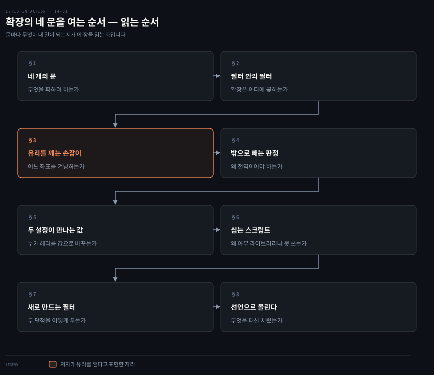
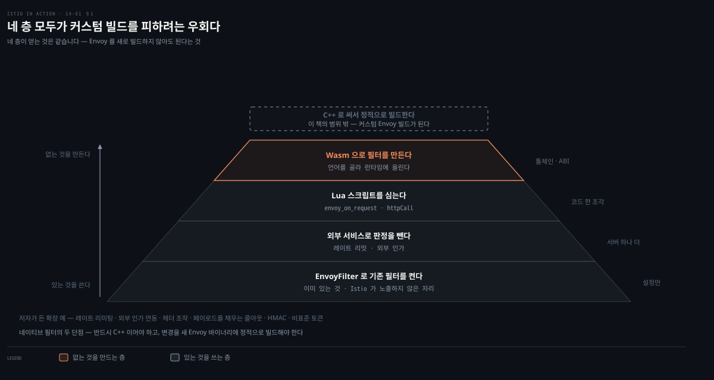
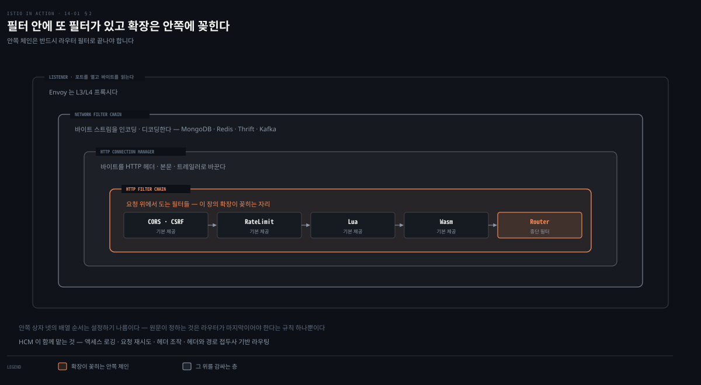
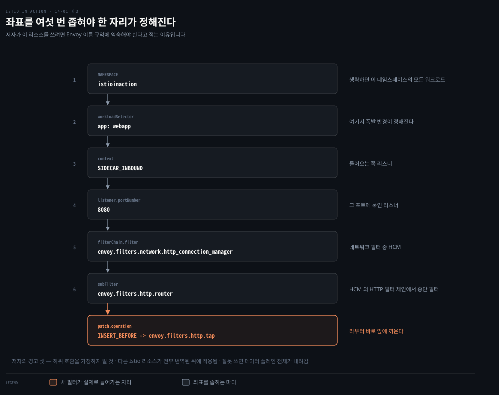
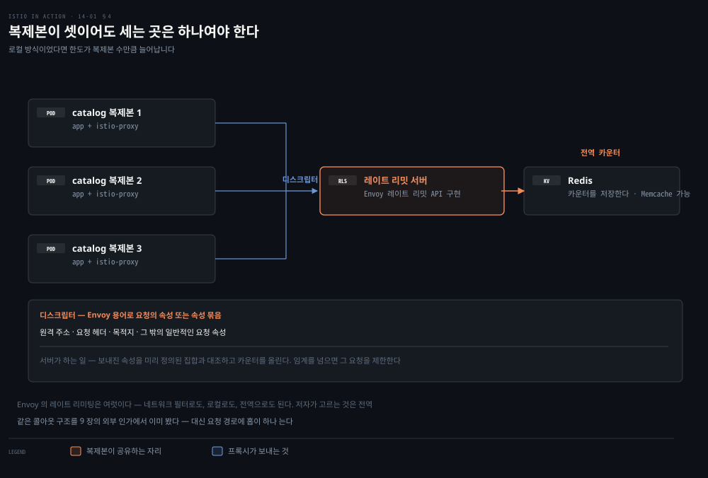
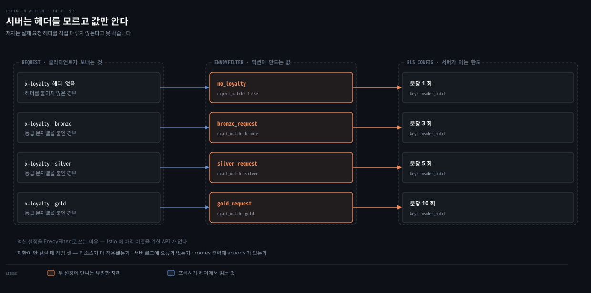
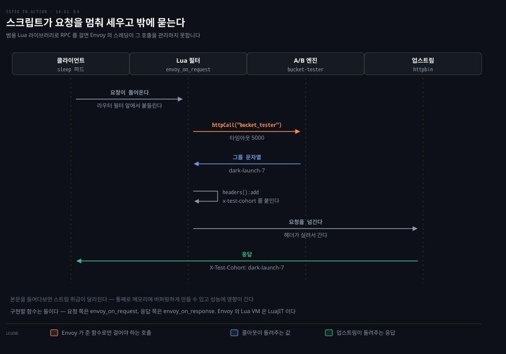
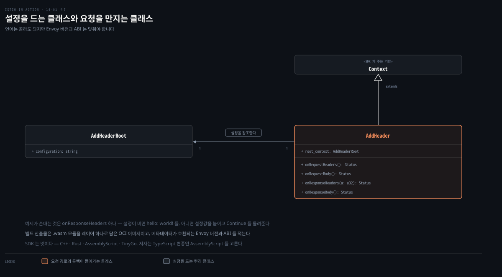
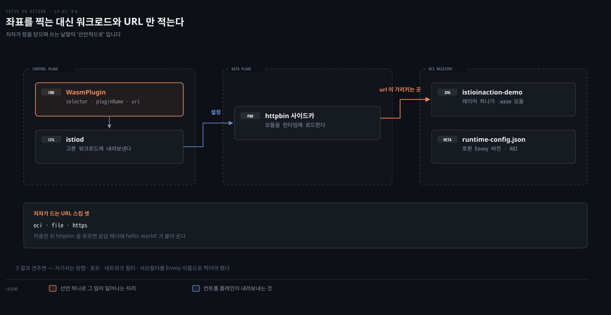

# Envoy를 새로 빌드하지 않으려고 낸 네 개의 문

---

> 14장은 Istio가 기본으로 채우지 못하는 것을 직접 채우는 장입니다. 방법이 넷인데, 넷 다 같은 것을 피하려고 만들어졌습니다. 그리고 피한 자리마다 다른 값을 치릅니다.

## 핵심 요약
> 이 장 전체가 매달린 하나의 생각은 **확장의 방법 넷이 기능으로 갈리는 게 아니라 "커스텀 Envoy 빌드를 피한 대가"로 갈린다**는 것입니다.

필터를 직접 쓰는 길은 이미 열려 있습니다. Istio의 프록시 자신과 Gloo Edge가 그 길로 갔습니다. 다만 그 길은 C++을 요구하고 유지할 Envoy 빌드를 하나 더 만듭니다. 이 장의 넷은 전부 그 두 가지를 피하려는 우회입니다.

넷은 이렇게 갈립니다. `EnvoyFilter`는 이미 있는 필터를 켜되 Istio의 보증 밖으로 나갑니다. 콜아웃은 판정을 밖으로 빼되 요청 경로에 홉과 운영할 서버를 더합니다. Lua는 스크립트를 심되 프록시의 스레딩 규칙을 따라야 하고, Wasm은 필터를 새로 만들되 실험 단계와 툴체인을 안습니다. 그래서 읽는 축은 "무엇을 할 수 있는가"가 아니라 **"이 문을 열면 무엇이 내 일이 되는가"**입니다.


## 학습 목표

이 내용을 읽고 나면:

1. 리스너·네트워크 필터·HCM·HTTP 필터·라우터 필터의 포함 관계를 그릴 수 있습니다.
2. `EnvoyFilter`가 겨냥하는 좌표를 읽고, 저자가 왜 그것을 유리 깨기라 부르는지 설명할 수 있습니다.
3. 전역 레이트 리미팅이 로컬 방식과 무엇이 다른지 근거와 함께 말할 수 있습니다.
4. Lua 스크립트에서 외부 호출에 `httpCall()`을 써야 하는 이유를 댈 수 있습니다.
5. Wasm이 네이티브 필터의 두 단점을 각각 어떻게 푸는지 설명할 수 있습니다.

아래는 이 문서 전체를 읽는 순서로 이은 지도입니다. 칸마다 절 번호와 그 절이 답하는 것 하나를 적었습니다. 색이 붙은 칸이 저자가 유리를 깬다고 표현한 자리입니다.




## 이 문서가 다루지 않는 것

> 이 장은 Envoy의 내부로 한 겹 더 들어갑니다. 그 아래의 기초는 다른 노트가 갖습니다.

저자 자신이 두 곳에서 멈춥니다. C++로 네이티브 필터를 쓰는 일은 "이 책의 범위 밖"이라 적고, 타임아웃과 재시도의 동작은 6장과 Envoy 문서로 넘깁니다. 이 노트도 같은 자리에서 멈춥니다.

- 리스너·라우트·클러스터의 정의와 xDS: [Envoy가 맡는 일과 Istio가 보태는 일](03-01.Envoy%EA%B0%80%20%EB%A7%A1%EB%8A%94%20%EC%9D%BC%EA%B3%BC%20Istio%EA%B0%80%20%EB%B3%B4%ED%83%9C%EB%8A%94%20%EC%9D%BC.md)
- 타임아웃·재시도·서킷 브레이킹의 동작: [실패를 견디는 일을 프록시로 옮겼을 때](06-01.%EC%8B%A4%ED%8C%A8%EB%A5%BC%20%EA%B2%AC%EB%94%94%EB%8A%94%20%EC%9D%BC%EC%9D%84%20%ED%94%84%EB%A1%9D%EC%8B%9C%EB%A1%9C%20%EC%98%AE%EA%B2%BC%EC%9D%84%20%EB%95%8C.md)
- 외부 인가 서비스와 `AuthorizationPolicy`: [거의 안전한 기본값을 닫아 가는 순서](09-01.%EA%B1%B0%EC%9D%98%20%EC%95%88%EC%A0%84%ED%95%9C%20%EA%B8%B0%EB%B3%B8%EA%B0%92%EC%9D%84%20%EB%8B%AB%EC%95%84%20%EA%B0%80%EB%8A%94%20%EC%88%9C%EC%84%9C.md)
- 프록시가 붙여 주는 헤더와 애플리케이션이 전파해야 하는 헤더: [메시가 절반까지만 해 주는 일](08-01.%EB%A9%94%EC%8B%9C%EA%B0%80%20%EC%A0%88%EB%B0%98%EA%B9%8C%EC%A7%80%EB%A7%8C%20%ED%95%B4%20%EC%A3%BC%EB%8A%94%20%EC%9D%BC.md)
- `istioctl proxy-config`로 프록시 설정을 캐는 순서: [프록시는 다 알고 있고 사람은 못 읽는다](10-01.%ED%94%84%EB%A1%9D%EC%8B%9C%EB%8A%94%20%EB%8B%A4%20%EC%95%8C%EA%B3%A0%20%EC%9E%88%EA%B3%A0%20%EC%82%AC%EB%9E%8C%EC%9D%80%20%EB%AA%BB%20%EC%9D%BD%EB%8A%94%EB%8B%A4.md)

책 밖의 기초는 다른 정독본이 SSOT입니다.

- HTTP/1.1·HTTP/2와 그 아래 전송 계층: [HTTP에서 TCP·TLS·UDP까지 — Transport 계층 해부](../networking-and-kubernetes/01-02.HTTP%EC%97%90%EC%84%9C%20TCP%C2%B7TLS%C2%B7UDP%EA%B9%8C%EC%A7%80%20%E2%80%94%20Transport%20%EA%B3%84%EC%B8%B5%20%ED%95%B4%EB%B6%80.md)
- L7 프록시가 클러스터에서 놓이는 자리: [Ingress와 Service Mesh — L7의 두 층](../networking-and-kubernetes/05-03.Ingress%EC%99%80%20Service%20Mesh%20%E2%80%94%20L7%EC%9D%98%20%EB%91%90%20%EC%B8%B5.md)
- OCI 이미지의 층 구조와 식별자: [컨테이너 이미지 해부 — 두 부분과 층과 식별자](../container-security/06-01.%EC%BB%A8%ED%85%8C%EC%9D%B4%EB%84%88%20%EC%9D%B4%EB%AF%B8%EC%A7%80%20%ED%95%B4%EB%B6%80%20%E2%80%94%20%EB%91%90%20%EB%B6%80%EB%B6%84%EA%B3%BC%20%EC%B8%B5%EA%B3%BC%20%EC%8B%9D%EB%B3%84%EC%9E%90.md)


## 1. 필터를 직접 쓰는 길과 그것을 피하는 넷

> 저자는 부족한 기능을 나열하며 장을 열지 않습니다. 부족할 때 사람들이 실제로 무엇을 했는지부터 적습니다.



Istio를 도입하는 조직에는 Istio가 기본으로 채우지 못하는 제약이나 전제가 있기 마련이고, 그래서 그 제약에 맞게 Istio의 능력을 넓혀야 할 일이 생깁니다. 저자가 예로 드는 것은 다섯입니다. 레이트 리미팅이나 외부 인가 서비스와의 연동, 헤더를 더하고 지우고 고치는 일, 요청 페이로드를 채우려고 다른 서비스를 부르는 일, HMAC 서명과 검증 같은 커스텀 프로토콜 구현, 그리고 비표준 보안 토큰 처리입니다.

Envoy는 **확장되도록 지어졌습니다.** 저자는 API 설계에 많은 고민이 들어갔고 인기의 큰 이유가 남들이 써 놓은 확장이라고 적습니다. 확장의 큰 축이 필터 확장입니다.

길은 이미 열려 있습니다. 사용자가 자기 필터를 써서 Envoy 코어를 하나도 바꾸지 않고 프록시 위에 얹을 수 있습니다. Istio의 프록시가 바로 그렇게 만들어졌고 Gloo Edge 같은 다른 오픈소스도 같은 길을 갑니다. **그런데 그 길에는 대가가 둘 붙습니다.** 저자가 뒤에서 정리하는 문장으로는, 반드시 C++이어야 하고 변경을 새 Envoy 바이너리에 정적으로 빌드해야 해서 사실상 Envoy의 커스텀 빌드가 됩니다. 유지할 것이 많아집니다.

그래서 Envoy는 바이너리를 다시 컴파일하지 않고 HTTP 능력을 넓히라고 HTTP 필터 셋을 남겨 두었습니다. **External processing, Lua, Wasm**입니다. 이 필터들로 외부 서비스 호출을 설정하거나, Lua 스크립트를 돌리거나, 커스텀 코드를 돌려 HCM이 요청과 응답을 처리하는 능력을 넓힙니다.

셋 중 첫째에는 저자가 각주 같은 NOTE를 답니다. **Envoy에 범용 처리를 위해 외부 서비스를 부르는 필터가 있기는 한데, 코드베이스에 존재만 할 뿐 집필 시점에는 아무것도 하지 않는다**는 것입니다. 그래서 외부 서비스를 부르는 이야기는 전역 레이트 리미팅 필터로 대신합니다.

이 장이 실제로 밟는 것은 넷입니다. Istio API의 `EnvoyFilter` 리소스로 Envoy HTTP 필터를 설정하기, 레이트 리밋 서버로 호출을 빼기, Lua 스크립트를 구현해 Lua HTTP 필터에 싣기, Wasm 모듈을 구현해 Wasm HTTP 필터에 올리기입니다. 위 도식의 네 층이 그것이고, 층 위로 갈수록 할 수 있는 일이 늘고 손이 많이 갑니다.


## 2. 리스너는 바이트를 읽고 필터가 그것을 나눠 맡는다

> 어디를 확장할 수 있는지 알려면 무엇이 무엇 안에 들어 있는지부터 봐야 합니다. 이 절에서 한 겹이 더 드러납니다.



3장에서 리스너와 라우트와 클러스터를 소개했지만 그때는 상위 개념이었고, 저자가 세부는 이 장에서 다루겠다고 미뤄 두었습니다. 여기서 초점은 리스너 하나입니다.

Envoy의 리스너는 **네트워크 인터페이스에 포트를 열고 들어오는 트래픽을 듣기 시작하는 방법**입니다. 저자가 곧바로 못 박는 문장이 이 절의 바탕입니다. Envoy는 결국 L3와 L4 프록시이며, 네트워크 연결에서 바이트를 떼어 내 어떤 식으로든 처리합니다.

여기서 첫 부품이 나옵니다. **필터**입니다. 리스너는 네트워크 스트림에서 바이트를 읽어 여러 필터, 곧 여러 단계의 기능을 통과시킵니다.

가장 기본이 되는 것은 **네트워크 필터**로, 인코딩이든 디코딩이든 바이트 스트림 위에서 동작합니다. 하나 이상을 순서로 묶어 스트림을 처리하게 할 수 있고 그 순서를 **필터 체인**이라 부릅니다. 그 체인들로 프록시의 기능이 구현됩니다. 기본으로 딸려 오는 네트워크 필터에는 MongoDB, Redis, Thrift, Kafka, 그리고 `HttpConnectionManager`가 있습니다.

가장 많이 쓰이는 것이 `HttpConnectionManager`입니다. 줄여서 HCM이라 부르는 이 필터는 바이트 스트림을 HTTP 헤더와 본문과 트레일러로 바꾸는 세부를 감춥니다. HTTP/1.1, HTTP/2, gRPC, 그리고 최근에는 HTTP/3까지가 대상입니다. HCM은 HTTP 요청 처리와 함께 액세스 로깅, 요청 재시도, 헤더 조작, 그리고 헤더와 경로 접두사 같은 요청 속성 기반 라우팅도 맡습니다.

이 절의 요점은 그다음 문장입니다. **HCM 자신도 필터 기반 아키텍처를 갖습니다.** HTTP 요청 위에서 동작하는 HTTP 필터들을 순서로, 곧 또 하나의 필터 체인으로 묶을 수 있습니다. 필터 안에 필터가 있는 구조이고, 확장이 실제로 꽂히는 자리가 안쪽 체인입니다.

기본으로 딸려 오는 HTTP 필터에는 CORS, CSRF 방지, `ExternalAuth`, `RateLimit`, 결함 주입, gRPC/JSON 트랜스코딩, Gzip, Lua, RBAC, Tap, Router, 그리고 Wasm이 있습니다.

체인에는 규칙이 하나 있습니다. **HTTP 필터들은 반드시 요청을 업스트림 클러스터로 보내는 종단 필터로 끝나야 하고**, 그 일을 하는 것이 라우터 필터입니다. 라우터 필터는 요청을 업스트림 클러스터에 매칭하며 타임아웃과 재시도 파라미터를 설정할 수 있습니다.


## 3. 유리를 깨는 손잡이가 겨냥하는 좌표

> 첫째 문입니다. 확장을 시작하기 전에 저자가 먼저 시키는 일은 만드는 게 아니라 찾아보는 것입니다.



데이터 플레인을 넓히는 첫 단계는 **원하는 확장을 이룰 만한 필터가 Envoy에 이미 있는지 알아보는 것**입니다. 있으면 `EnvoyFilter` 리소스로 데이터 플레인을 직접 설정하면 됩니다.

Istio의 API는 보통 그 아래의 Envoy 설정을 감춥니다. `VirtualService`도 `DestinationRule`도 `AuthorizationPolicy`도 결국 Envoy 설정으로 번역되고, 필터 체인의 특정 HTTP 필터를 설정하기도 합니다. 다만 **Istio는 아래 프록시의 가능한 모든 필터와 설정을 노출하려 하지 않습니다.** 그래서 Envoy를 직접 설정해야 하는 경우가 남습니다.

`EnvoyFilter`는 그 자리를 위한 것입니다. 상위 API가 노출하지 않는 부분을 조정하거나 설정해야 하는 고급 용도이고, 몇 가지 제한을 빼면 리스너·라우트·클러스터·필터 등 Envoy의 거의 무엇이든 설정할 수 있습니다.

저자는 곧바로 경고를 셋 붙입니다. 이 리소스는 Istio의 고급 사용이며 **유리를 깨는 해법**입니다. 아래의 Envoy API는 Istio 릴리스 사이에 언제든 바뀔 수 있으니 배포하는 `EnvoyFilter`를 반드시 검증해야 하고, **하위 호환을 가정하지 말아야** 합니다. 이 API로 잘못 설정하면 Istio 데이터 플레인 전체를 내릴 수 있습니다.

성질도 셋입니다. 첫째, `EnvoyFilter`는 **선언된 네임스페이스의 모든 워크로드에 적용됩니다.** `istio-system`에 만들면 메시의 모든 워크로드에 걸립니다. 좁히려면 `workloadSelector`를 씁니다. 둘째, **다른 Istio 리소스가 모두 번역되고 설정된 뒤에 적용됩니다.** 셋째, Envoy의 이름 규약과 설정 세부에 익숙해야 합니다.

저자의 예제는 `webapp` 워크로드를 지나는 요청을 표본으로 흘려 보는 것입니다. 커스텀 필터를 쓸 수도 있지만 충분히 찾아보면 Envoy에 이미 Tap 필터가 있고, Istio API가 노출하지 않으므로 `EnvoyFilter`로 설정합니다.

```yaml
spec:
  workloadSelector:
    labels:
      app: webapp
  configPatches:
    - applyTo: HTTP_FILTER
      match:
        context: SIDECAR_INBOUND
        listener:
          portNumber: 8080
          filterChain:
            filter:
              name: "envoy.filters.network.http_connection_manager"
              subFilter:
                name: "envoy.filters.http.router"
      patch:
        operation: INSERT_BEFORE
        value:
          name: envoy.filters.http.tap
```

위 도식이 그 좌표를 읽는 순서입니다. 인바운드 리스너의 HTTP 필터를 고른 뒤, 그중 8080 포트에 묶인 HCM을 고르고, 그 HCM의 HTTP 필터 체인에서 라우터 필터를 고릅니다. 라우터를 고른 이유는 새 필터를 **바로 그 앞에** 끼우기 위해서입니다. 2절에서 본 "체인은 종단 필터로 끝난다"는 규칙이 여기서 좌표가 됩니다.

설정이 실제로 들어갔는지는 프록시에서 확인합니다.

```bash
istioctl pc listener deploy/webapp.istioinaction --port 15006 --address 0.0.0.0 -o yaml
```

```bash
- name: envoy.filters.http.tap
- name: envoy.filters.http.router
```

위는 원문 출력에서 필터 이름 두 줄만 뽑은 것입니다. 실제 출력에는 각 필터의 `typedConfig`와 `@type`이 함께 나옵니다. **포트 15006을 보는 이유는 그것이 사이드카 프록시의 기본 인그레스 포트이고 다른 모든 포트가 이 리스너로 다시 라우팅되기 때문**입니다.

tap이 실제로 도는지는 창을 둘 띄워 봅니다. 한쪽에서 관리 엔드포인트를 로컬로 포워딩해 두고 `x-app-tap` 헤더가 `true`인 요청에 매칭하는 설정을 `curl`로 밀어 넣으면, 그 조건에 맞는 요청이 올 때마다 tap 필터가 요청을 스트리밍해 내보냅니다. 이 예제에서 받는 쪽은 콘솔입니다.


## 4. 복제본이 몇이든 한도는 하나여야 한다

> 둘째 문입니다. 필터가 스스로 판정하지 않고 밖에 묻는 방식인데, 왜 밖이어야 하는지가 이 절의 논점입니다.



필터는 자기가 본 요청만 셉니다. 복제본이 셋이면 각자 셋씩 세고 한도는 조용히 세 배가 되는데, 필터 안에서는 그것을 막을 방법이 없습니다. 앞 절은 기본 HTTP 필터에 이미 있는 기능으로 데이터 플레인을 넓혔는데, 기본 필터 중에는 **콜아웃으로 존재하는 기능**도 있습니다. 이 필터들은 외부 서비스를 불러 어떤 일을 시키고, 그 결과로 요청을 계속할지 어떻게 계속할지를 정합니다.

Envoy에서 레이트 리미팅을 하는 방법은 여럿입니다. 네트워크 필터로도, 로컬로도, 전역으로도 됩니다. 저자가 고르는 것은 **전역** 방식이고 이유가 분명합니다. 전역이면 특정 워크로드의 모든 Envoy 프록시가 같은 레이트 리밋 서비스를 부르고, 그 서비스가 백엔드의 전역 키-값 저장소를 부릅니다. 이 구조라면 **서비스의 복제본이 몇 개든 한도가 강제됩니다.**

레이트 리밋 서버는 Envoy 커뮤니티의 것을 씁니다. 더 정확히는 Envoy의 레이트 리미팅 API를 구현한 서버이고, 백엔드 Redis 캐시와 이야기하며 카운터를 Redis에 저장합니다. Memcache를 쓸 수도 있습니다.

동작을 이해하는 열쇠는 낱말 하나입니다. **디스크립터**입니다. 레이트 리밋 필터가 HTTP 요청을 처리할 때 요청에서 특정 속성들을 뽑아 서버로 보내 평가받는데, Envoy의 레이트 리미팅 용어는 그 속성이나 속성 묶음을 디스크립터라 부릅니다. 원격 주소, 요청 헤더, 목적지, 그 밖의 일반적인 요청 속성이 여기 들어갑니다.

서버 쪽 일은 대조와 셈입니다. 요청의 일부로 보내진 속성들을 미리 정의된 속성 집합과 대조하고 해당하는 카운터를 올립니다. 속성이나 속성 집합이 서버의 정의와 맞으면 그 한도의 카운트가 올라가고, 카운트가 임계를 넘으면 **그 요청이 제한됩니다.** 요청 속성은 무엇을 셀지 정하기 위해 묶이거나 트리로 정의될 수 있습니다.

같은 콜아웃 방식을 9장에서 이미 한 번 봤습니다. 외부 인가가 그것입니다. 판정을 요청 경로 위의 다른 서비스에 맡긴다는 점에서 구조가 같고, 대신 요청 경로에 홉이 하나 늘어납니다.


## 5. 한도와 액션을 따로 적고 값에서 만난다

> 설정이 둘로 나뉘고 서로 다른 곳에 삽니다. 둘을 잇는 것은 문자열 하나입니다.



레이트 리밋 서버는 `x-loyalty`라는 헤더를 모릅니다. 한도를 아는 쪽과 요청을 보는 쪽이 갈려 있기 때문입니다. 저자의 예제가 그 나눔을 드러냅니다. 고객 등급별 한도인데 `x-loyalty` 헤더로 등급을 가려서, gold는 분당 10회, silver는 5회, bronze는 3회를 허용하고, **등급을 알 수 없으면 분당 1회 뒤부터 제한**이 걸립니다.

서버 쪽 설정은 이렇게 적습니다.

```yaml
domain: catalog-ratelimit
descriptors:
  - key: header_match
    value: no_loyalty
    rate_limit:
      unit: MINUTE
      requests_per_unit: 1
  - key: header_match
    value: gold_request
    rate_limit:
      unit: MINUTE
      requests_per_unit: 10
```

위는 원문 설정에서 네 항목 중 둘만 남긴 것입니다. 실제 `ConfigMap`에는 `silver_request`가 5, `bronze_request`가 3으로 함께 들어 있습니다.

여기서 저자가 못 박는 문장이 이 절의 핵심입니다. **실제 요청 헤더를 직접 다루지 않고, 요청의 일부로 보내진 속성만 다룹니다.** 서버는 `x-loyalty`라는 헤더를 모릅니다. 아는 것은 `gold_request` 같은 값뿐입니다.

그러면 헤더를 값으로 바꾸는 일은 누가 할까요. 데이터 플레인입니다. 특정 요청 경로에 대해 어떤 속성을 보낼지를 Envoy 용어로 **레이트 리밋 액션**이라 하고, 그것은 특정 Envoy 라우트 설정의 `rate_limit` 항목으로 지정합니다. 그런데 **Istio에는 아직 이것을 위한 API가 없어서** 다시 `EnvoyFilter`를 씁니다.

```yaml
- applyTo: VIRTUAL_HOST
  patch:
    operation: MERGE
    value:
      rate_limits:
        - actions:
            - header_value_match:
                descriptor_value: no_loyalty
                expect_match: false
                headers:
                  - name: "x-loyalty"
        - actions:
            - header_value_match:
                descriptor_value: gold_request
                headers:
                  - name: "x-loyalty"
                    exact_match: gold
```

위도 네 액션 중 둘만 남긴 것입니다. 첫 액션이 눈여겨볼 만합니다. `expect_match: false`이므로 **`x-loyalty` 헤더가 없을 때** `no_loyalty` 값을 만들어 보냅니다. 나머지 셋은 `exact_match`로 등급 문자열을 봅니다.

두 설정이 만나는 자리를 표로 두면 이렇습니다.

| 등급 | 요청 헤더 | 데이터 플레인이 만드는 값 | 서버가 아는 한도 |
|---|---|---|---|
| 없음 | `x-loyalty` 부재 | `no_loyalty` | 분당 1 |
| bronze | `x-loyalty: bronze` | `bronze_request` | 분당 3 |
| silver | `x-loyalty: silver` | `silver_request` | 분당 5 |
| gold | `x-loyalty: gold` | `gold_request` | 분당 10 |

배포하면 `istioinaction` 네임스페이스에 레이트 리밋 서버와 Redis 파드가 하나씩 늘어납니다. 확인은 `sleep` 앱에서 `catalog`를 부르는 방식인데, 헤더 없이 부르면 **대략 분당 한 번만** 통과합니다.

제한이 안 걸릴 때 저자가 시키는 점검은 셋입니다. `EnvoyFilter` 리소스가 전부 적용됐는지, 서버가 로그에 오류 없이 떠 있는지, 그리고 아래 프록시 설정에 액션이 실제로 들어갔는지입니다.

```bash
istioctl proxy-config routes deploy/catalog.istioinaction -o json | grep actions
```

`actions`가 여러 줄 나와야 하고, 안 나오면 무언가 제대로 적용되지 않은 것입니다.


## 6. 스크립트를 심을 때 언어보다 스레드가 걸린다

> 셋째 문입니다. 기본 필터에 없는 로직을 직접 써 넣되, 프록시의 규칙을 따라야 합니다.



기본 필터를 아무리 뒤져도 원하는 기능이 없습니다. 기존 필터를 설정하는 일은 편하지만 거기까지입니다. 그러면 요청 경로에 로직을 직접 써 넣어야 하는데, 그때 첫 후보가 Lua 필터입니다. **Lua 스크립트를 써서 프록시에 주입하면** 요청이나 응답 경로의 동작을 바꿀 수 있고, 헤더를 조작하거나 본문을 들여다볼 수 있습니다.

Lua는 시스템의 능력을 넓히는 데 쓰는 강력한 임베더블 스크립팅 언어입니다. 동적 타입에 인터프리터로 돌고 메모리는 Lua VM이 자동으로 관리하는데, Envoy에서 그 VM은 LuaJIT입니다.

구현할 함수는 둘입니다. 요청을 보고 고치려면 `envoy_on_request()`를, 응답 쪽이면 `envoy_on_response()`를 구현합니다.

**규칙이 하나 붙습니다.** Lua 안에서 다른 서비스를 불러야 한다면 Envoy가 제공하는 함수를 써야 합니다. 저자는 범용 Lua 라이브러리로 RPC를 걸어서는 안 된다고 적고 이유를 답니다. **Envoy가 자기 논블로킹 스레딩 아키텍처로 그 호출을 올바로 관리해야 하기 때문**입니다. 외부 서비스와 통신할 때 쓰는 함수가 `httpCall()`입니다.

비용 이야기도 하나 답니다. **본문을 들여다보면 스트림이 프록시에서 취급되는 방식이 달라질 수 있습니다.** 본문 위에서 도는 연산이 그것을 통째로 메모리에 버퍼링하게 만들 수 있고, 성능에 영향이 갑니다.

예제는 A/B 테스트 코호트 배정입니다. 들어오는 모든 요청을 A/B 그룹의 일부로 다루고 싶은데 어느 그룹인지는 **런타임에 요청의 특성으로만** 정할 수 있습니다. 그래서 A/B 테스트 엔진을 불러 그룹을 받아 오고, 그 응답을 헤더로 요청에 붙입니다. 그러면 업스트림의 어떤 서비스든 그 헤더로 라우팅을 판단할 수 있습니다.

```lua
function envoy_on_request(request_handle)
  local headers, test_bucket = request_handle:httpCall(
    "bucket_tester",
    { [":method"] = "GET", [":path"] = "/", [":scheme"] = "http" }, "", 5000)
  request_handle:headers():add("x-test-cohort", test_bucket)
end
```

위는 원문 스크립트에서 `:authority`와 `accept` 헤더 두 줄을 줄인 것입니다. 마지막 인자 `5000`이 타임아웃입니다. 스크립트는 `EnvoyFilter`의 `inlineCode`로 실려 들어가고, 꽂히는 자리는 3절과 같은 좌표입니다. 라우터 필터 앞에 `envoy.lua`를 `INSERT_BEFORE`로 끼웁니다.

적용한 뒤 `httpbin`을 부르면 응답에 콜아웃의 결과가 실려 있습니다.

```bash
"X-Test-Cohort": "dark-launch-7"
```

> **노트의 읽기**: 원문에 인쇄된 `EnvoyFilter`의 `inlineCode`는 `-- some code here` 주석만 든 **자리표시자**입니다. 위 스크립트는 그 앞 페이지에 따로 실려 있고, 저자가 자세한 것은 소스 저장소의 `ch14/lua-filter.yaml`을 보라고 적습니다. 인쇄된 YAML만 그대로 적용하면 필터는 붙지만 아무 일도 하지 않습니다. 같은 리소스의 이름이 `webapp-lua-extension`인데 `workloadSelector`는 `app: httpbin`을 고르는 것도 함께 눈에 걸립니다.


## 7. 필터를 새로 만들되 Envoy는 그대로 둔다

> 넷째 문입니다. 앞의 셋이 있는 것을 쓰는 일이었다면 이것은 없는 것을 만드는 일입니다.



WebAssembly는 **환경 사이를 옮겨 다니도록 의도된 이진 명령 형식**입니다. 여러 프로그래밍 언어에서 컴파일할 수 있고 VM에서 돕니다. 원래는 브라우저 안 웹 앱의 CPU 집약 연산을 빠르게 하고, 브라우저 기반 앱을 JavaScript 아닌 언어로도 지원하려고 개발됐습니다. 2019년에 W3C 권고가 됐고 주요 브라우저가 모두 지원합니다.

성질이 셋입니다. 크기와 로드 발자국이 작습니다. 거의 네이티브에 가까운 속도로 실행됩니다. 호스트 애플리케이션에 심어도 안전합니다. 안전한 이유는 메모리 안전하고 샌드박스 실행 환경에서 돌기 때문인데, 저자가 그 경계를 한 문장으로 못 박습니다. **Wasm 모듈은 호스트 시스템이 허용한 메모리와 기능에만 접근합니다.**

여기서 1절의 두 단점이 회수됩니다. 자기 Envoy 필터를 네이티브로 쓰려면 C++이어야 하고, 변경을 새 Envoy 바이너리에 정적으로 빌드해야 해서 사실상 커스텀 빌드가 됩니다. **Envoy는 WebAssembly 실행 엔진을 품고 있습니다.** 그래서 Wasm이 지원하는 어떤 언어로든 필터를 쓰고 런타임에 프록시로 동적으로 로드할 수 있습니다. Istio가 주는 기본 Envoy 프록시를 그대로 쓰면서 커스텀 필터를 런타임에 올린다는 뜻입니다.

만들기 전에 정해야 할 것이 있습니다. 어떤 언어를 쓸지, 어떤 Envoy 버전인지, 그 버전이 지원하는 **Envoy 추상 이진 인터페이스(ABI)**가 무엇인지입니다. 그다음 맞는 언어 SDK를 고르고 빌드와 의존성 툴체인을 제대로 세웁니다. 집필 시점의 Wasm SDK는 넷입니다. C++, Rust, AssemblyScript, TinyGo입니다. 저자는 TypeScript의 변종이라 JavaScript 개발자에게 익숙할 AssemblyScript를 고릅니다.

저자가 여기에도 NOTE를 답니다. **Envoy의 WebAssembly 지원은 실험 단계로 간주되며 바뀔 수 있습니다.** 운영 환경에 넣기 전에 만든 Wasm 모듈을 충분히 테스트하라고 적습니다.

프로젝트를 띄우면 초기 구현이 든 `index.ts`가 생기고 거기 클래스가 둘 있습니다. 위 도식이 그 뼈대입니다. `AddHeaderRoot`는 모듈의 커스텀 설정을 맡고, `AddHeader`가 요청 경로를 실제로 처리하는 콜백 구현이 들어가는 자리입니다. 예제는 `onResponseHeaders`를 구현해 응답에 헤더를 하나 붙입니다. 설정이 비어 있으면 `hello: world!`를, 아니면 설정값을 붙이고 `Continue`를 돌려줍니다.

요청과 응답을 다루는 콜백은 넷입니다. `onRequestHeaders`, `onRequestBody`, `onResponseHeaders`, `onResponseBody`입니다.

빌드 결과가 눈여겨볼 만합니다. 툴이 언어에 맞는 툴체인 설정을 대신해 줍니다. 그리고 **빌드 산출물은 `.wasm` 모듈을 레이어 하나로 담은 OCI 규격 이미지**입니다. 로컬 저장소를 열어 보면 `filter.wasm` 바이너리와 함께 메타데이터 파일들이 있고, 그것들이 OCI 이미지와 **그 필터에 호환되는 Envoy 버전과 ABI**를 적어 둡니다. 이미지 기반 패키징의 의도는 기존 OCI 레지스트리에 그대로 저장하고 그것을 지원하는 빌드 도구를 세우는 것입니다.

다만 저자가 그 자리에 조건을 답니다. Wasm 모듈을 OCI 이미지로 패키징하는 명세는 Istio 커뮤니티가 아직 작업하는 중이고, Solo.io가 기여한 작업에 기반합니다. 그리고 이 영역은 **계속 바뀌며 집필 시점에 자리를 잡지 못했다**고 적습니다.

> **원문 정오**: 도구의 이름이 절 사이에서 바뀝니다. 14.5.3은 "Solo.io 사람들이 만든 `wasme`라는 오픈소스 개발자 도구를 쓴다"고 두 번에 걸쳐 소개하는데, 바로 다음 절의 제목부터 마지막까지 열 번 넘게 나오는 이름은 `meshctl`이고 설치 URL도 `run.solo.io/meshctl/install`입니다. 도구가 개명되면서 앞 절의 산문만 옛 이름으로 남은 것으로 읽힙니다. 따라 하려면 `meshctl` 쪽이 맞습니다.

> **원문 정오**: 워크스루의 태그가 중간에 갈립니다. 빌드는 `istioinaction-demo:0.1`로 하고 `meshctl wasm list` 출력도 `0.1`을 보여 주는데, 푸시는 `:1.0`으로 하고 8절의 `WasmPlugin`이 당겨 오는 URL도 `:1.0`입니다. 그 사이에 태그를 다시 붙이는 단계는 없습니다. 산문은 "앞 절에서 이미 레지스트리에 발행했다"고 이어 가므로, 절차를 그대로 밟으면 발행한 것과 당겨 오는 것의 태그가 어긋납니다.


## 8. 선언으로 올리고 무엇을 치렀는지 센다

> 마지막은 만든 것을 메시에 올리는 일입니다. 그러고 나면 네 문이 각각 무엇을 요구했는지가 보입니다.



만들어 발행한 모듈은 아직 어떤 워크로드에도 붙어 있지 않습니다. 앞 절에서 모듈을 만들고 빌드해 패키징하고 레지스트리에 발행했지만 그것을 메시에 올리는 일이 남았습니다. 그 일을 하는 것이 Istio의 `WasmPlugin` 리소스입니다.

```yaml
spec:
  selector:
    matchLabels:
      app: httpbin
  pluginName: add_header
  url: oci://webassemblyhub.io/ceposta/istioinaction-demo:1.0
```

`selector`가 워크로드를 고르고 `url`이 모듈의 위치를 가리킵니다. 저자가 드는 스킴은 셋으로 `oci`와 `file`과 `https`입니다. 이 예제는 OCI 규격 레지스트리에서 모듈을 **곧장 프록시로 당겨 옵니다.**

적용한 뒤 `httpbin`을 부르면 응답 헤더에 `hello: world!`가 붙어 옵니다. 3절의 `EnvoyFilter`가 좌표를 손으로 찍어야 했던 것과 견주면, 여기서는 워크로드를 고르고 URL을 적는 것으로 끝납니다.

저자가 장을 닫으며 남기는 문장이 이 노트의 축과 같습니다. WebAssembly로는 **언어를 골라** Envoy 프록시를 확장하고 모듈을 런타임에 동적으로 로드할 수 있으며, Istio에서는 `WasmPlugin`으로 그것을 **선언적으로** 싣습니다.

그러면 네 문이 각각 무엇을 요구했는지 세어 볼 수 있습니다. 아래 표의 근거는 전부 저자가 본문에서 밝힌 문장입니다.

| 문 | 하는 일 | 저자가 밝힌 대가 |
|---|---|---|
| `EnvoyFilter` | 이미 있는 Envoy 필터를 켠다 | 유리를 깨는 해법 · 하위 호환 없음 · 잘못 쓰면 데이터 플레인 전체를 내림 |
| 외부 콜아웃 | 판정을 밖의 서비스에 맡긴다 | 서버와 백엔드 저장소를 따로 운영 · 액션 설정에도 `EnvoyFilter` 가 필요 |
| Lua | 스크립트를 요청 경로에 심는다 | 외부 호출은 `httpCall()` 로만 · 본문 검사는 통째 버퍼링을 부를 수 있음 |
| Wasm | 필터를 새로 만들어 올린다 | 실험 단계로 간주됨 · 언어 SDK 와 ABI 호환을 맞춰야 함 · 패키징 명세가 유동적 |

네 줄 모두에서 얻는 것은 같습니다. **Envoy를 새로 빌드하지 않아도 된다는 것**입니다. 다른 것은 그 대신 무엇이 내 일이 되느냐입니다.


## 심화 학습

> 책 밖의 보강만 둡니다. 각 항목은 공식 1차 자료로 확인한 것입니다.

**`EnvoyFilter`만 아직 `v1alpha3`입니다.** 4장의 `Gateway`도 13장의 `WorkloadGroup`도 `networking.istio.io/v1`로 올라갔는데, `EnvoyFilter`의 현재 레퍼런스는 여전히 `networking.istio.io/v1alpha3`을 씁니다.[^envoyfilter] 저자가 이 리소스에 붙인 "유리를 깨는 해법"이라는 규정이 API 버전으로도 남아 있는 셈입니다.

**공식 문서의 하위 호환 문장은 저자보다 좁습니다.** 저자는 하위 호환을 가정하지 말라고 적습니다. 레퍼런스의 NOTE 1은 갈라서 적습니다. **`EnvoyFilter` API 자체는 하위 호환을 유지하지만**, 이 방식으로 준 Envoy 설정은 Istio 프록시 버전 업그레이드마다 주의 깊게 감시해 폐기된 필드를 제거하고 적절히 교체해야 한다는 것입니다.[^envoyfilter] 껍데기가 아니라 그 안에 담아 넣은 Envoy 설정이 위험하다는 뜻이고, 저자의 경고도 "아래의 Envoy API"를 가리키므로 둘은 어긋나지 않습니다.

**`WasmPlugin`은 저자의 예제보다 훨씬 자란 리소스입니다.** 저자는 `selector`·`pluginName`·`url` 셋만 씁니다. 현재 스펙에는 `sha256`과 `imagePullPolicy`와 `imagePullSecret`이 있습니다. `pluginConfig`·`failStrategy`·`vmConfig`·`match`·`targetRefs`·`type`도 있고, 무엇보다 `phase`와 `priority`가 있습니다.[^wasmplugin] 그중 `phase`가 눈여겨볼 만합니다.

**그 `phase`의 기본값이 3절에서 손으로 찍던 자리입니다.** 공식 설명은 기본값이 "컨트롤 플레인이 삽입 위치를 정하며, 대체로 필터 체인의 끝, 곧 Router 바로 앞"이라고 적습니다.[^wasmplugin] 3절에서 `EnvoyFilter`로 라우터 필터를 찾아 `INSERT_BEFORE` 했던 바로 그 좌표입니다. 게다가 `AUTHN`은 Istio 인증 필터 앞, `AUTHZ`는 인증 뒤이자 인가 앞이라고 이름으로 지정할 수 있습니다. 좌표를 Envoy 이름으로 찍던 일이 Istio의 낱말로 올라온 자리입니다.

**URL 스킴 설명이 갱신됐습니다.** 저자는 `oci`·`file`·`https` 셋을 나란히 듭니다. 현재 문서는 유효한 스킴으로 프록시 컨테이너 안의 로컬 파일을 가리키는 `file://`과 원격 호스팅을 가리키는 `http[s]://`를 적고, **스킴을 쓰지 않으면 OCI 이미지로 보아 `oci://`가 기본**이라고 적습니다.[^wasmplugin]

**비워 둔 자리가 채워졌습니다.** 저자는 Envoy의 외부 처리 필터가 "코드베이스에 존재하지만 집필 시점에는 아무것도 하지 않는다"고 NOTE를 달고 전역 레이트 리미팅으로 대신합니다. 현재 Envoy 문서는 이 필터가 외부 프로세서라 부르는 서비스를 필터 체인에 잇는다고 적습니다. **양방향 gRPC 스트림**으로 `ProcessingRequest`와 `ProcessingResponse`를 주고받습니다.

그 프로세서는 각 메시지의 헤더·본문·트레일러를 검사하고 수정하거나 아예 새 응답을 돌려줄 수 있습니다.[^extproc] 이 장이 다루지 못한 다섯째 문이 그사이에 열린 셈입니다.


## 결정 치트시트

> 저자가 본문에서 근거를 밝힌 것만 담습니다. 판단 근거가 원문에 없는 줄은 넣지 않았습니다.

| 상황 | 고를 것 | 저자가 댄 근거 |
|---|---|---|
| 확장이 필요하다 | 기존 Envoy 필터부터 찾는다 | 첫 단계가 그것 |
| 원하는 필터가 Istio API 에 없다 | `EnvoyFilter` | Istio 는 모든 필터를 노출하지 않음 |
| `EnvoyFilter` 의 범위를 좁힌다 | `workloadSelector` | 없으면 네임스페이스 전체 |
| 메시 전체에 걸고 싶다 | `istio-system` 에 만든다 | 그러면 모든 워크로드 |
| 필터를 라우터 앞에 끼운다 | `INSERT_BEFORE` + 라우터 서브필터 지정 | 체인은 종단 필터로 끝남 |
| 사이드카의 인바운드 설정을 본다 | 포트 `15006` 리스너 | 다른 포트가 전부 여기로 다시 라우팅됨 |
| 복제본이 여럿인데 한도는 하나 | 전역 레이트 리미팅 | 복제본 수와 무관하게 강제됨 |
| 레이트 리밋 카운터를 둘 곳 | Redis(또는 Memcache) | 서버가 그것과 이야기함 |
| 어떤 속성으로 셀지 정한다 | 레이트 리밋 액션 | Istio 에 아직 API 가 없어 `EnvoyFilter` |
| 헤더가 없을 때를 센다 | `expect_match: false` | 부재를 값으로 만듦 |
| 제한이 안 걸린다 | 리소스 적용 · 서버 로그 · `routes \| grep actions` | 저자가 든 점검 셋 |
| 기본 필터에 없는 로직이 필요하다 | Lua 필터 | 스크립트를 주입해 경로를 바꿈 |
| Lua 에서 다른 서비스를 부른다 | `httpCall()` | Envoy 가 논블로킹으로 관리해야 함 |
| Lua 에서 본문을 본다 | 비용을 먼저 잰다 | 통째 버퍼링을 부를 수 있음 |
| 새 필터가 필요한데 C++ 이 싫다 | Wasm | 지원 언어 아무거나 · 런타임 동적 로드 |
| Wasm 을 만들기 전에 정할 것 | 언어 · Envoy 버전 · ABI | 그다음 SDK 와 툴체인 |
| Wasm 을 운영에 넣는다 | 충분히 테스트한다 | 지원이 실험 단계로 간주됨 |
| Wasm 모듈을 메시에 올린다 | `WasmPlugin` | 선언적으로 실음 |


## 적용 관점

> 실무 규칙 하나와 Spring 쪽 경계 하나가 남습니다. 문을 열기 전에 무엇이 내 일이 되는지 적어 두는 것, 그리고 프록시가 붙여 준 것을 누가 이어 나르는지 가르는 것입니다.

이 장에서 실무로 곧장 넘어가는 규칙은 하나입니다. **`EnvoyFilter`를 쓰기로 한 순간부터 Istio 업그레이드가 내 일이 됩니다.** 저자의 경고 셋을 운영 규칙으로 옮기면 할 일이 정해집니다. 업그레이드 전에 그 리소스만 따로 검증합니다. `workloadSelector`를 반드시 붙여 폭발 반경을 좁히고, 되돌릴 경로를 먼저 정해 둡니다.

기본 범위가 넓다는 성질은 이 책에서 되풀이됩니다. 11장의 `Sidecar`가 없으면 모든 워크로드가 메시 전체를 알았습니다. 이 장의 `EnvoyFilter`는 셀렉터가 없으면 네임스페이스 전체에 걸립니다. **Istio의 기본값은 대체로 넓은 쪽**이고, 좁히는 것이 사용자의 일입니다.

레이트 리미팅에는 자리 판단이 하나 붙습니다. 애플리케이션 안에 리미터를 두면 인스턴스마다 따로 세므로 **복제본 수만큼 실효 한도가 늘어납니다.** 저자가 전역 방식을 고르며 든 이유가 정확히 그것입니다. 반대로 메시에 두면 요청 경로에 홉이 하나 늘고 그 서버와 저장소가 새로운 장애점이 됩니다. 어느 쪽이든 **한도를 어디서 세는지가 설계 결정**이지 구현 취향이 아닙니다.

Spring 애플리케이션 관점에서는 8장의 경계가 여기서 되풀이됩니다. Lua나 Wasm으로 헤더를 붙이는 일은 애플리케이션 코드를 한 줄도 고치지 않고 됩니다. 그런데 **그 헤더를 읽고 다음 홉으로 이어 나르는 일은 여전히 애플리케이션의 몫**입니다. `x-test-cohort` 같은 값을 프록시가 요청에 붙여 줘도, 서비스가 다른 서비스를 부를 때 그것을 실어 보내지 않으면 콜 그래프의 두 번째 홉부터는 코호트를 모릅니다. 8장에서 트레이스 헤더에 대해 한 이야기와 같은 자리이고, 대상만 바뀝니다.

마지막으로 이 장 전체를 도입 검토에 쓰는 방법이 하나 있습니다. 확장이 필요해 보일 때 **먼저 몇 번째 문인지를 적어 봅니다.** 첫째 문이면 설정 문제입니다. 둘째 문이면 운영할 서비스가 하나 느는 문제이고, 셋째와 넷째 문이면 그 코드를 누가 유지할지가 먼저 정해져야 합니다. 저자가 든 확장 예 다섯을 이 축에 놓아 보면 갈리는 자리가 보입니다. 레이트 리미팅과 외부 인가는 둘째 문에서 끝나지만 HMAC 서명이나 비표준 토큰 처리는 셋째나 넷째 문으로 갑니다. 이 배치는 원문의 분류가 아니라 노트의 읽기입니다.


## 면접에서 받을 만한 질문
> 답을 먼저 떠올린 뒤 아래 정답 절을 펼칩니다.

1. 이 장을 한 줄로 정의하면 무엇입니까?
2. Envoy 확장 방법 넷이 공통으로 피하려는 것은 무엇이며, 왜 그것을 피합니까?
3. 리스너에서 HTTP 필터까지의 층을 순서대로 짚고, HCM 이 어느 자리에 있는지 말해 보십시오.
4. 전역 레이트 리미팅은 로컬 레이트 리미팅과 무엇이 다릅니까?
5. `EnvoyFilter`를 저자가 유리 깨기라 부르는 이유 셋을 드십시오.
6. HTTP 필터 체인이 반드시 라우터 필터로 끝나야 하는 이유는 무엇입니까.
7. 레이트 리밋 서버는 `x-loyalty` 헤더를 압니까.
8. Lua에서 범용 라이브러리로 RPC를 걸면 왜 안 됩니까.
9. Wasm이 네이티브 필터의 두 단점을 각각 어떻게 풉니까.
10. `WasmPlugin`의 `url`이 가리킬 수 있는 곳은 어디입니까.


## 정답 (자답 후 펼치기)

> 위 §면접에서 받을 만한 질문 의 10 개에 *먼저 자답한 뒤* 읽으십시오. 자답 없이 먼저 읽으면 학습 효과가 0 입니다. 질문 번호와 1:1 로 대응합니다.

### 정답 1 — 한 줄 정의

Istio를 요청 경로에서 확장하는 일은 결국 Envoy를 확장하는 일이며, 방법 넷은 기능이 아니라 커스텀 Envoy 빌드를 피한 대가로 갈립니다.

### 정답 2 — 확장 방법 넷이 공통으로 피하려는 것은 무엇입니까

확장 방법이 넷인데 넷 다 같은 것을 피합니다. 자기 필터를 네이티브로 쓰면 C++이어야 하고 변경을 새 Envoy 바이너리에 정적으로 빌드해야 해서 사실상 커스텀 빌드가 되기 때문입니다. `EnvoyFilter`·콜아웃·Lua·Wasm은 전부 그 빌드 없이 같은 목적에 닿으려는 우회입니다.

### 정답 3 — 리스너에서 HTTP 필터까지 어떤 층을 지납니까

HCM은 필터인데 그 안에 또 필터가 있습니다. 리스너가 바이트를 읽어 네트워크 필터 체인으로 넘기고 HCM이 그 체인의 한 필터로서 바이트를 HTTP로 바꾸는데, HCM 자신도 필터 기반 아키텍처를 가져 HTTP 요청 위에서 도는 HTTP 필터 체인을 품기 때문입니다.

### 정답 4 — 전역 레이트 리미팅은 로컬과 무엇이 다릅니까

전역 레이트 리미팅은 특정 워크로드의 모든 Envoy가 같은 레이트 리밋 서비스를 부르고 그 서비스가 백엔드 전역 키-값 저장소를 봅니다. 그래서 서비스의 복제본이 몇 개든 한도가 강제됩니다.

### 정답 5 — 유리 깨기라 부르는 이유

아래의 Envoy API가 Istio 릴리스 사이에 언제든 바뀔 수 있어 배포하는 것을 반드시 검증해야 합니다. 하위 호환을 가정할 수 없습니다. 잘못 설정하면 Istio 데이터 플레인 전체를 내릴 수 있습니다.

### 정답 6 — 라우터 필터로 끝나야 하는 이유

HTTP 필터들은 요청을 업스트림 클러스터로 보내는 종단 필터로 끝나야 하고, 그 일을 하는 것이 라우터 필터이기 때문입니다. 라우터 필터가 요청을 업스트림 클러스터에 매칭하며 타임아웃과 재시도 파라미터를 설정합니다.

### 정답 7 — 서버는 헤더를 압니까

모릅니다. 저자가 실제 요청 헤더를 직접 다루지 않고 요청의 일부로 보내진 속성만 다룬다고 못 박습니다. 헤더를 `gold_request` 같은 디스크립터 값으로 바꾸는 일은 데이터 플레인의 레이트 리밋 액션이 하고, 서버는 그 값과 한도만 압니다.

### 정답 8 — 범용 라이브러리로 RPC를 걸면 안 되는 이유

Envoy가 자기 논블로킹 스레딩 아키텍처로 그 호출을 올바로 관리해야 하기 때문입니다. 그래서 Envoy가 제공하는 `httpCall()`을 씁니다.

### 정답 9 — Wasm이 두 단점을 푸는 방식

Envoy가 WebAssembly 실행 엔진을 품고 있으므로, 언어 제약은 Wasm이 지원하는 어떤 언어로도 필터를 쓸 수 있게 되어 풀립니다. 커스텀 빌드 제약은 모듈을 런타임에 동적으로 로드해 Istio가 주는 기본 Envoy를 그대로 쓰는 것으로 풀립니다.

### 정답 10 — `url`이 가리킬 수 있는 곳

저자가 드는 것은 `oci`와 `file`과 `https` 셋입니다. OCI 규격 레지스트리의 이미지, 프록시 안의 파일, 원격 호스팅된 모듈을 가리킬 수 있습니다.


## 핵심 개념 체크리스트

- [ ] 저자가 든 확장 예 다섯을 들 수 있습니다.
- [ ] 네이티브 필터의 두 단점을 말할 수 있습니다.
- [ ] 리스너·네트워크 필터·HCM·HTTP 필터·라우터의 포함 관계를 그릴 수 있습니다.
- [ ] `EnvoyFilter`의 세 성질과 세 경고를 각각 들 수 있습니다.
- [ ] `EnvoyFilter`가 좌표를 좁혀 가는 순서를 읽을 수 있습니다.
- [ ] 포트 `15006`을 보는 이유를 압니다.
- [ ] 전역 레이트 리미팅이 로컬과 다른 점을 설명할 수 있습니다.
- [ ] 디스크립터가 무엇이고 누가 만드는지 압니다.
- [ ] 두 설정이 어디서 만나는지 말할 수 있습니다.
- [ ] `httpCall()`을 써야 하는 이유를 댈 수 있습니다.
- [ ] Wasm의 성질 셋과 그 안전성의 근거를 압니다.
- [ ] `WasmPlugin`이 `EnvoyFilter`보다 덜 요구하는 것이 무엇인지 설명할 수 있습니다.


## 관련 문서

- [Envoy가 맡는 일과 Istio가 보태는 일](03-01.Envoy%EA%B0%80%20%EB%A7%A1%EB%8A%94%20%EC%9D%BC%EA%B3%BC%20Istio%EA%B0%80%20%EB%B3%B4%ED%83%9C%EB%8A%94%20%EC%9D%BC.md) — 리스너·라우트·클러스터와 xDS의 SSOT
- [실패를 견디는 일을 프록시로 옮겼을 때](06-01.%EC%8B%A4%ED%8C%A8%EB%A5%BC%20%EA%B2%AC%EB%94%94%EB%8A%94%20%EC%9D%BC%EC%9D%84%20%ED%94%84%EB%A1%9D%EC%8B%9C%EB%A1%9C%20%EC%98%AE%EA%B2%BC%EC%9D%84%20%EB%95%8C.md) — 타임아웃·재시도와 레질리언스 설정의 SSOT
- [메시가 절반까지만 해 주는 일](08-01.%EB%A9%94%EC%8B%9C%EA%B0%80%20%EC%A0%88%EB%B0%98%EA%B9%8C%EC%A7%80%EB%A7%8C%20%ED%95%B4%20%EC%A3%BC%EB%8A%94%20%EC%9D%BC.md) — 프록시가 붙이는 것과 애플리케이션이 이어 나르는 것의 SSOT
- [거의 안전한 기본값을 닫아 가는 순서](09-01.%EA%B1%B0%EC%9D%98%20%EC%95%88%EC%A0%84%ED%95%9C%20%EA%B8%B0%EB%B3%B8%EA%B0%92%EC%9D%84%20%EB%8B%AB%EC%95%84%20%EA%B0%80%EB%8A%94%20%EC%88%9C%EC%84%9C.md) — 외부 인가 콜아웃과 인가 정책의 SSOT
- [프록시는 다 알고 있고 사람은 못 읽는다](10-01.%ED%94%84%EB%A1%9D%EC%8B%9C%EB%8A%94%20%EB%8B%A4%20%EC%95%8C%EA%B3%A0%20%EC%9E%88%EA%B3%A0%20%EC%82%AC%EB%9E%8C%EC%9D%80%20%EB%AA%BB%20%EC%9D%BD%EB%8A%94%EB%8B%A4.md) — `proxy-config`로 프록시 설정을 캐는 순서의 SSOT
- [컨트롤 플레인의 성능은 낡은 설정의 수명이다](11-01.%EC%BB%A8%ED%8A%B8%EB%A1%A4%20%ED%94%8C%EB%A0%88%EC%9D%B8%EC%9D%98%20%EC%84%B1%EB%8A%A5%EC%9D%80%20%EB%82%A1%EC%9D%80%20%EC%84%A4%EC%A0%95%EC%9D%98%20%EC%88%98%EB%AA%85%EC%9D%B4%EB%8B%A4.md) — 설정 범위를 좁히는 손잡이와 기본값이 넓다는 성질
- [자동으로 되던 일이 목록이 되어 나타난다](13-01.%EC%9E%90%EB%8F%99%EC%9C%BC%EB%A1%9C%20%EB%90%98%EB%8D%98%20%EC%9D%BC%EC%9D%B4%20%EB%AA%A9%EB%A1%9D%EC%9D%B4%20%EB%90%98%EC%96%B4%20%EB%82%98%ED%83%80%EB%82%9C%EB%8B%A4.md) — 메시 밖 워크로드를 편입하는 절차
- [Istio in Action 정독 인덱스](README.md)
- [컨테이너 이미지 해부 — 두 부분과 층과 식별자](../container-security/06-01.%EC%BB%A8%ED%85%8C%EC%9D%B4%EB%84%88%20%EC%9D%B4%EB%AF%B8%EC%A7%80%20%ED%95%B4%EB%B6%80%20%E2%80%94%20%EB%91%90%20%EB%B6%80%EB%B6%84%EA%B3%BC%20%EC%B8%B5%EA%B3%BC%20%EC%8B%9D%EB%B3%84%EC%9E%90.md) — OCI 이미지의 층과 식별자의 SSOT


## 참고 자료

- 《Istio in Action》 14장 "Extending Istio on the request path" — 이 노트의 1차 자료
- [Istio EnvoyFilter 레퍼런스](https://istio.io/latest/docs/reference/config/networking/envoy-filter/) — API 버전과 하위 호환 문장
- [Istio WasmPlugin 레퍼런스](https://istio.io/latest/docs/reference/config/proxy_extensions/wasm-plugin/) — 필드 목록과 `phase` 기본값
- [Envoy External Processing 필터 문서](https://www.envoyproxy.io/docs/envoy/latest/configuration/http/http_filters/ext_proc_filter) — 저자가 비워 둔 자리의 현재


[^envoyfilter]: Istio — EnvoyFilter 레퍼런스. 예제의 `apiVersion` 이 `networking.istio.io/v1alpha3` 이고, NOTE 1 이 "EnvoyFilter API 자체는 하위 호환을 유지하지만 이 방식으로 제공된 Envoy 설정은 Istio 프록시 버전 업그레이드 전반에 걸쳐 주의 깊게 감시해 폐기된 필드를 제거하고 적절히 교체해야 한다"고 적음. 셀렉터를 생략하면 같은 네임스페이스의 모든 워크로드에, 설정 루트 네임스페이스에 있으면 모든 네임스페이스의 해당 워크로드에 적용된다고도 적음. <https://istio.io/latest/docs/reference/config/networking/envoy-filter/>
[^wasmplugin]: Istio — WasmPlugin 레퍼런스. `apiVersion: extensions.istio.io/v1alpha1`. 필드에 `selector`·`targetRefs`·`url`·`sha256`·`imagePullPolicy`·`imagePullSecret`·`pluginConfig`·`pluginName`·`phase`·`priority`·`failStrategy`·`vmConfig`·`match`·`type` 이 있음. `phase` 기본값은 "컨트롤 플레인이 삽입 위치를 정하며 대체로 필터 체인의 끝, Router 바로 앞", `AUTHN` 은 Istio 인증 필터 앞, `AUTHZ` 는 인증 뒤·인가 앞. 유효한 스킴은 `file://` 과 `http[s]://` 이고 스킴이 없으면 OCI 이미지로 보아 `oci://` 가 기본. <https://istio.io/latest/docs/reference/config/proxy_extensions/wasm-plugin/>
[^extproc]: Envoy — External Processing 필터 문서. "외부 프로세서라 부르는 외부 서비스를 필터 체인에 잇는다. 처리 서비스는 gRPC 인터페이스를 구현해 HTTP 요청·응답 수명주기의 이벤트에 응답하며 각 메시지의 헤더·본문·트레일러를 검사하고 수정하거나 완전히 새로운 응답을 돌려줄 수 있다", "프로토콜 자체는 양방향 gRPC 스트림 기반이며 Envoy 가 ProcessingRequest 를 보내면 프로세서가 ProcessingResponse 로 답해야 한다". <https://www.envoyproxy.io/docs/envoy/latest/configuration/http/http_filters/ext_proc_filter>
