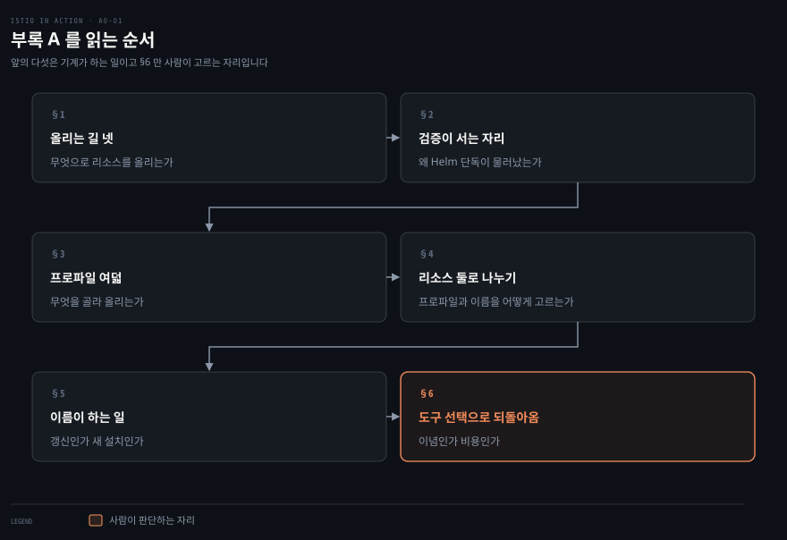
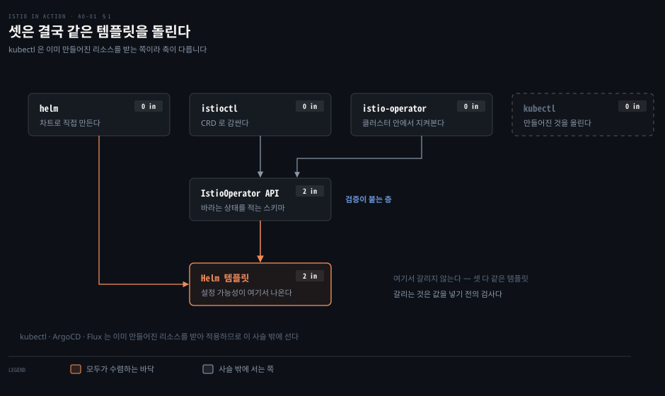
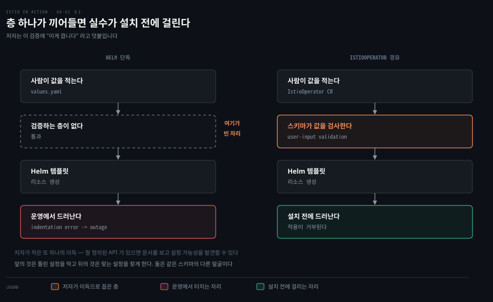
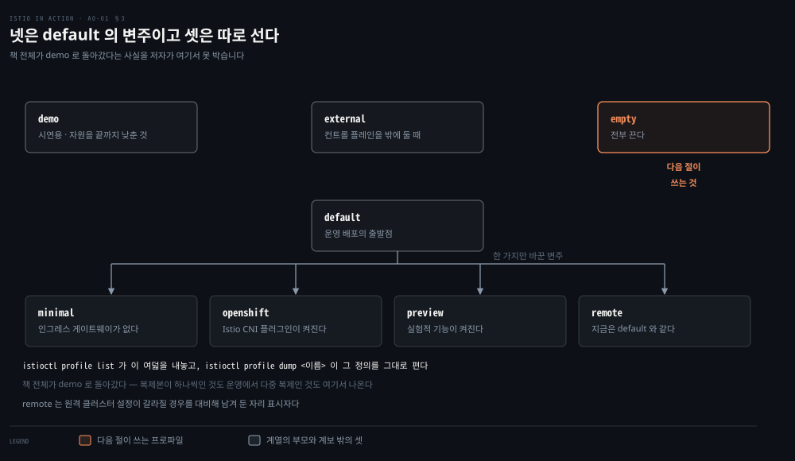
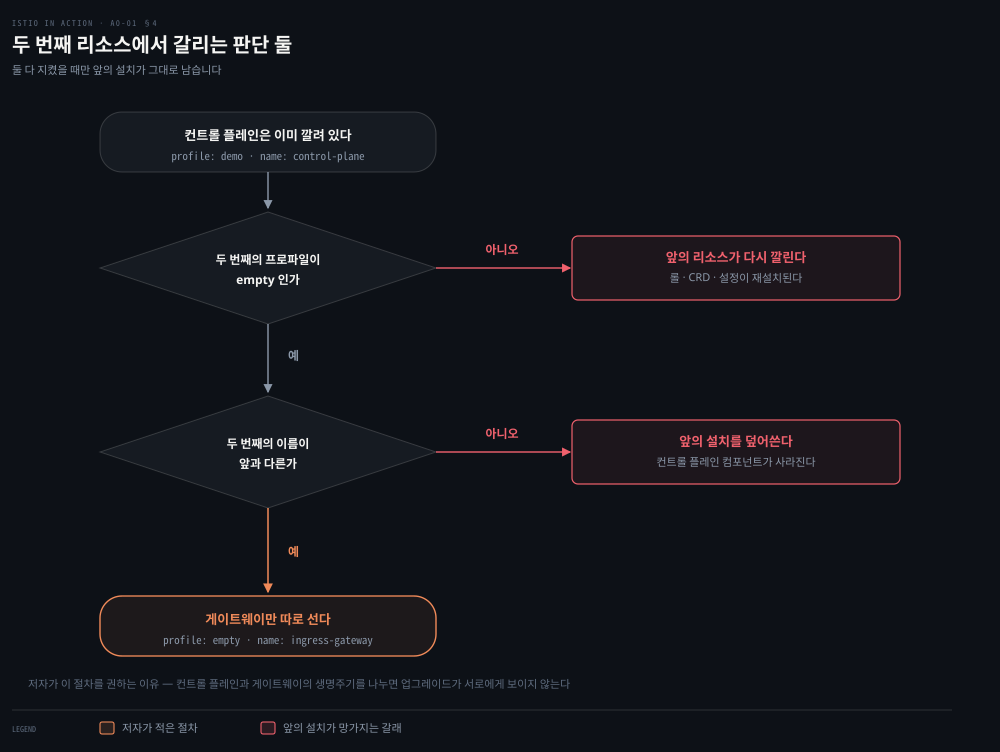
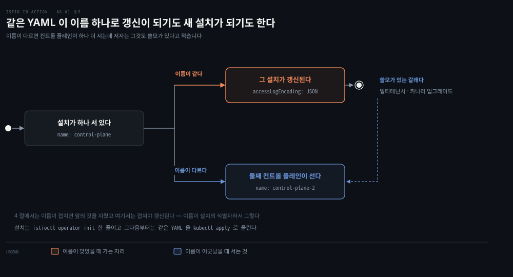
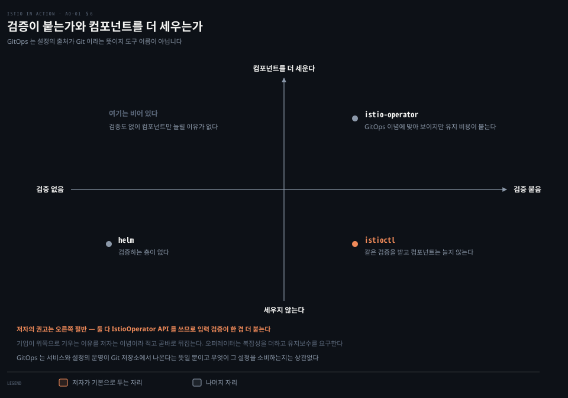

# 부록 — 설치를 고르는 API 와 프로파일 여덟

---

> 2장은 `istioctl install --set profile=demo -y` 한 줄로 설치를 끝내고 넘어갑니다. 이 부록은 그 한 줄이 무엇을 고른 것인지를 뒤집어 봅니다. 설치 도구가 넷이고 프로파일이 여덟인데, 그중 무엇을 고르느냐가 나중에 업그레이드를 어떻게 할 수 있는지까지 정합니다.


## 핵심 요약

> "Installing Istio is easy peasy: you apply the Istio resources to a Kubernetes cluster, and that's it." (부록 A 도입)

저자는 설치가 쉽다고 말하고 시작합니다. 그런데 부록 전체가 그 뒤에 붙는 단서를 다룹니다. 클라우드 제공자가 다르고 네트워크 지형이 다르고 보안 요구가 다르면 설정이 금세 복잡해지기 때문입니다. 쉬운 것은 리소스를 올리는 행위이고, 어려운 것은 어떤 리소스를 올릴지 정하는 일입니다.

그 어려움을 Istio는 두 겹으로 덜어 냅니다. 아래층은 `IstioOperator` API로, 무엇을 설정할 수 있는지를 스키마로 못 박아 오타와 들여쓰기 실수를 설치 전에 잡습니다. 위층은 프로파일 여덟로, 자주 쓰는 조합을 미리 묶어 둡니다. 이 부록의 실습 하나는 그 둘을 써서 컨트롤 플레인과 게이트웨이의 생명주기를 떼어 놓는 일이고, 저자는 그것을 권장 사례라고 적습니다.


## 학습 목표

이 문서를 읽고 나면 다음을 할 수 있습니다.

- Istio 리소스를 클러스터에 올리는 네 가지 길을 구분하고, 각각이 `IstioOperator` API와 어떤 관계인지 말할 수 있습니다.
- Helm 단독 설치가 왜 물러났는지를 사용자 입력 검증이라는 축으로 설명할 수 있습니다.
- 프로파일 여덟을 용도별로 가르고, `empty` 프로파일이 왜 따로 있는지 말할 수 있습니다.
- 컨트롤 플레인과 게이트웨이를 별도 `IstioOperator` 리소스로 나누는 절차를 적고, 두 번째 리소스에서 프로파일과 이름을 왜 그렇게 골라야 하는지 설명할 수 있습니다.
- `istio-operator`와 `istioctl` 중 무엇을 고를지 저자의 기준으로 판단할 수 있습니다.



절 다섯이 좁은 데서 넓은 데로 갑니다. 앞의 둘은 "무엇으로 올리는가"를 세웁니다. 셋째는 "무엇을 골라 올리는가"를 세웁니다. 넷째가 그 둘을 써서 실제 구성을 하나 만들고, 마지막이 도구 선택으로 되돌아옵니다.


## 이 문서가 다루지 않는 것

> 설치 절차 자체와 Helm 문법, 그리고 여러 클러스터에 걸친 설치는 각각 다른 자리가 맡습니다.

설치 자체의 절차와 확인 명령은 [2장 §1](./02-01.배포와%20릴리스를%20가르는%20첫%20실습.md)이 SSOT입니다. `istioctl x precheck`와 `istioctl verify-install`이 거기 있습니다.

Helm의 템플릿 문법과 차트 구조는 이 폴더 밖입니다. Istio 설치가 Helm 템플릿 위에 서 있다는 사실만 여기서 적고, 문법은 Helm 공식 문서로 넘깁니다.

여러 클러스터에 걸친 설치와 `external` 프로파일이 쓰이는 배치 모델은 [12장](./12-01.경계를%20지우는%20전제%20셋과%20남는%20한%20자리.md)이 다룹니다. 이 부록은 프로파일 목록에서 그 이름을 짚는 데서 멈춥니다.

게이트웨이 업그레이드 절차는 저자도 공식 문서로 넘깁니다. 이 노트도 같은 자리에서 멈추고 링크만 남깁니다.


## 1. 리소스를 클러스터에 올리는 길 넷

> Istio 설치는 결국 쿠버네티스 리소스를 클러스터에 적용하는 일입니다. 그 일을 하는 도구가 넷이고, 셋은 같은 API 위에 서 있습니다.



저자가 드는 도구는 넷입니다. `helm`은 쿠버네티스 패키지 관리자의 CLI로 Istio 리소스를 만들어 클러스터에 적용합니다. `istioctl`은 `IstioOperator` CRD를 써서 더 단순하고 안전한 API를 내놓습니다. 다만 **속으로는 Helm을 써서 리소스를 만듭니다**.

`istio-operator`는 클러스터 안에서 도는 오퍼레이터로, 같은 `IstioOperator` API로 설치를 관리합니다. `kubectl`은 이미 만들어진 쿠버네티스 리소스를 받아 클러스터에 적용합니다. ArgoCD 나 Flux 같은 도구도 같은 자리에 섭니다.

여기서 짚을 것은 이 넷이 대등한 선택지가 아니라는 점입니다. 저자의 문장은 Istio 설치의 모든 커스터마이징 가능성이 Helm 템플릿에서 나온다고 말합니다. 그러니까 `istioctl`도 `istio-operator`도 마지막에는 같은 템플릿을 돌립니다. 갈리는 것은 그 템플릿에 값을 넣기 전에 **무엇이 값을 검사하느냐**입니다.


## 2. Helm 이 남긴 문제와 IstioOperator 가 답한 것

> 처음에는 Helm이 주 도구였습니다. 설정 항목이 늘면서 검증 없는 입력이 문제가 됐습니다.



저자가 적은 진단은 구체적입니다. Helm에는 사용자 입력을 검증하는 층이 없어서 오류가 너무 많이 났습니다. 잘해야 성가신 정도였지만 최악의 경우 들여쓰기 실수 하나가 운영 장애를 부르는 것은 시간 문제였다는 것입니다.

설정이 안 먹으면 소스 코드를 파고들어 설정 가능성을 역으로 짐작해야 했고, 그러고 나서야 원인이 오타나 들여쓰기였음을 알게 되는 식이었습니다.

`IstioOperator` API는 쿠버네티스 CRD로, 설치의 **바라는 상태**를 적는 자리입니다. 사용자는 상태를 적고, 현재 설치에서 — 아직 설치가 없다면 없는 상태에서 — 그 상태로 어떻게 갈지는 `istioctl`이나 `istio-operator` 같은 도구가 알아냅니다.

저자가 꼽는 이득은 둘입니다. 하나는 사용자 입력 검증이고, 저자는 여기에 "이게 큽니다(this is big!)"라고 덧붙입니다. 다른 하나는 잘 정의된 API가 있으면 문서를 보고 설정 가능성을 **발견할 수 있다**는 것입니다. 앞의 것은 틀린 설정을 막습니다. 뒤의 것은 맞는 설정을 찾게 해 줍니다. 둘은 같은 스키마에서 나오는 다른 얼굴입니다.


## 3. 프로파일 여덟

> API가 생겨도 처음부터 다 적으려면 설정이 여전히 많습니다. 프로파일은 그 출발점을 미리 묶어 둔 것입니다.



`istioctl profile list`가 내놓는 여덟은 이렇습니다.

| 프로파일 | 저자의 설명 |
|---|---|
| `default` | 운영 배포의 출발점. 오토스케일링이 켜지고 istiod·게이트웨이·프록시에 자원이 더 주어진다 |
| `demo` | 시연용. 로컬에서 돌릴 때 자원을 적게 쓰도록 값을 끝까지 낮춰 둔 것 |
| `empty` | 전부 끈다. 다른 프로파일을 출발점으로 삼지 않는 커스텀 설정의 출발점 |
| `external` | 자기가 관리하는 클러스터(데이터 플레인) 바깥에 컨트롤 플레인을 설치할 때 |
| `minimal` | `default`와 같되 인그레스 게이트웨이가 없다 |
| `openshift` | `default`와 같되 Istio CNI 플러그인이 켜진다 — OpenShift 의 요구 사항 |
| `preview` | `default`와 같되 실험적 기능이 켜진다 |
| `remote` | 현재로서는 `default`와 같다. 원격 클러스터 설정이 갈라질 경우를 대비한 자리 표시자 |

이 목록에서 두 가지를 읽을 수 있습니다. 첫째, **책 전체가 `demo`로 돌아갔다는 사실**입니다. 저자는 그 점을 여기서 못 박습니다. 2장 노트가 "복제본이 하나씩인 것은 demo 프로파일이고 운영에서는 다중 복제가 의도된 형태"라고 적은 근거가 이 표의 첫 두 줄입니다.

둘째, `empty`가 왜 따로 있는지입니다. 나머지 일곱은 무언가를 켜 둔 상태에서 출발하는데, `empty`만 전부 끈 상태에서 출발합니다. 다음 절이 그 쓰임을 보여 줍니다.

어떤 프로파일이든 정의를 열어 볼 수 있습니다. `istioctl profile dump demo`가 그 프로파일에 해당하는 `IstioOperator` 리소스를 그대로 내놓습니다. `demo`의 경우 이그레스 게이트웨이 하나와 인그레스 게이트웨이 하나가 `enabled: true`로 들어 있는 것이 보입니다.


## 4. 컨트롤 플레인과 게이트웨이를 떼는 이유

> 둘의 생명주기를 나누면 설치가 단순해지고 컨트롤 플레인 업그레이드가 데이터 플레인에 보이지 않게 됩니다. 저자는 이것을 권장 사례라고 적습니다.



떼려면 `IstioOperator` 커스텀 리소스가 둘 필요합니다. 첫째가 컨트롤 플레인 컴포넌트를 맡고, 둘째가 데이터 플레인 컴포넌트를 맡습니다.

첫째는 `demo`를 출발점으로 삼고 게이트웨이 둘을 끕니다.

```yaml
apiVersion: install.istio.io/v1alpha1
kind: IstioOperator
metadata:
  name: control-plane
spec:
  profile: demo
  components:
    egressGateways:
    - name: istio-egressgateway
      enabled: false
    ingressGateways:
    - name: istio-ingressgateway
      enabled: false
```

```bash
istioctl install -f appendices/demo-profile-without-gateways.yaml
```

둘째에서 판단이 하나 생깁니다. 어떤 프로파일을 출발점으로 삼을 것인가입니다. `demo`를 다시 쓰면 앞서 적용한 리소스가 전부 다시 깔립니다 — 롤과 롤 바인딩, 커스텀 리소스 정의, 설정까지 재설치되어 앞의 설치를 방해합니다. 그래서 `empty`를 씁니다. 전부 꺼진 데서 시작해 인그레스 게이트웨이 하나만 골라 켭니다.

```yaml
apiVersion: install.istio.io/v1alpha1
kind: IstioOperator
metadata:
  name: ingress-gateway
spec:
  profile: empty
  components:
    ingressGateways:
    - name: ingressgateway
      namespace: istio-system
      enabled: true
      label:
        istio: ingressgateway
      k8s:
        resources:
          requests:
            cpu: 100m
            memory: 160Mi
```

`metadata.name`이 앞의 것과 **달라야 한다**고 저자는 주석으로 못 박습니다. 같으면 앞의 설치를 덮어써서 컨트롤 플레인 컴포넌트를 걷어내 버립니다. 이름이 식별자 노릇을 하는 것인데, 이 성질은 다음 절에서 한 번 더 나옵니다.

> **노트의 읽기** — 원문은 이 절차의 이득을 "게이트웨이를 관리하고 업그레이드할 때 통제력이 커지는 첫걸음"이라고만 적습니다. 왜 통제력이 커지는지는 적지 않습니다. 리소스가 하나면 게이트웨이만 바꾸려 해도 컨트롤 플레인 정의를 건드리게 되고, 둘로 나뉘면 각자 따로 움직일 수 있다는 것이 노트의 읽기입니다. 이 문장은 원문의 주장이 아닙니다.


## 5. istio-operator 를 쓸 때 이름이 하는 일

> 오퍼레이터는 클러스터 안에서 `IstioOperator` 리소스의 이벤트를 지켜보다가 설치를 그 정의에 맞춥니다. 이때 리소스 이름이 무엇을 갱신할지를 정합니다.



쿠버네티스 오퍼레이터는 특정 소프트웨어에 대한 운영 지식을 담은 컨트롤러이고, 그 소프트웨어의 관리를 커스텀 리소스로 노출합니다. `istio-operator`는 클러스터 안의 Istio 설치를 관리합니다.

동작은 단순합니다. 오퍼레이터는 클러스터 안에 있으므로 쿠버네티스 RBAC으로 API 서버에 인증하고, `IstioOperator` 리소스의 이벤트를 지켜봅니다. 새 리소스가 생기면 그 정의대로 Istio를 설치합니다. 기존 리소스가 갱신되면 설치를 새 정의에 맞춥니다.

설치는 `istioctl operator init` 한 줄이고, 그다음부터는 앞 절과 같은 YAML을 `kubectl apply`로 올리면 됩니다. 도구가 바뀌었을 뿐 정의는 그대로입니다.

갱신할 때 이름이 다시 중요해집니다. 컨트롤 플레인의 액세스 로그를 JSON으로 바꾸려면 `meshConfig.accessLogEncoding: JSON`을 더한 정의를 올리는데, 이때 `metadata.name`이 **갱신하려는 설치의 이름과 맞아야** 합니다. 맞지 않으면 오퍼레이터는 컨트롤 플레인을 하나 더 세우려는 의도로 받아들입니다. 저자는 그것도 쓸모가 있다고 덧붙입니다 — 멀티테넌시와 카나리 업그레이드가 그 경우입니다.

같은 이름이 4절에서는 "겹치면 앞의 것을 지운다"였고 여기서는 "겹쳐야 갱신된다"입니다. 모순이 아니라 같은 규칙의 양면입니다. 이름이 설치의 식별자이므로, 겹치면 같은 설치를 다시 정의하는 것이고 다르면 새 설치를 만드는 것입니다.


## 6. 저자의 권고와 GitOps 의 정의

> 넷 중 무엇을 쓸 것인가. 저자는 둘로 좁히고, 그 둘 사이의 선택은 이념이 아니라 비용으로 판단하라고 적습니다.



저자의 권고는 `istio-operator` 아니면 `istioctl`입니다. 둘 다 `IstioOperator` API를 쓰므로 사용자 입력 검증이라는 안전장치가 한 겹 더 붙기 때문입니다.

그다음이 이 절의 논점입니다. 저자는 기업들이 `istio-operator` 쪽으로 기우는 것을 자주 본다고 적으면서, 그 이유를 **GitOps 접근이고 그쪽 이념에 더 맞아서**라고 씁니다. 그리고 곧바로 뒤집습니다. 실제로는 오퍼레이터가 복잡성을 더하고 유지보수를 요구합니다. `istioctl`을 쓰면서도 GitOps 를 지킬 수 있다는 것입니다.

근거는 GitOps의 정의를 좁게 잡는 데 있습니다. 저자의 실용적 정의로 GitOps는 서비스와 그 설정의 운영이 Git 저장소에서 나온다는 뜻일 뿐입니다. 그 설정을 무엇이 소비하는지는 상관없습니다. `istioctl`이든 Ansible 이든 다른 무엇이든 됩니다.

오퍼레이터가 컴포넌트를 하나 더 늘린다는 걱정에 대해서도 저자는 "솔직히 그 말이 맞습니다"라고 인정하고 시작합니다. 유지해야 하고 버그가 숨을 자리가 하나 더 생기는 것은 사실이고, 오퍼레이터의 약속은 그 단점을 이득이 넘어선다는 것입니다. 그러니까 이 선택은 "옳은 도구"가 아니라 "감당할 복잡성"의 문제로 놓입니다.


## 결정 치트시트

| 상황 | 고를 것 | 이유 |
|---|---|---|
| 처음 깔아 보고 익힐 때 | `istioctl` + `demo` | 자원을 적게 쓰고 게이트웨이가 함께 선다 |
| 운영에 처음 세울 때 | `istioctl` + `default` | 오토스케일링이 켜지고 자원이 더 주어진다 |
| 커스텀을 밑바닥부터 짤 때 | `empty` | 다른 프로파일을 출발점으로 쓰지 않겠다는 선언 |
| 이미 깐 위에 컴포넌트만 더할 때 | `empty` + 다른 `metadata.name` | `demo`를 다시 쓰면 앞의 리소스를 재설치해 방해한다 |
| 기존 설치를 고칠 때 | 같은 `metadata.name` | 이름이 다르면 컨트롤 플레인이 하나 더 선다 |
| 설정을 Git 에 두고 굴리고 싶을 때 | 둘 다 가능 | GitOps 는 설정의 출처가 Git 이라는 뜻이지 도구 이름이 아니다 |
| 인그레스 게이트웨이가 필요 없을 때 | `minimal` | `default`에서 인그레스만 뺀 것 |


## 적용 관점

> 컴포넌트를 나중에 더할 때 지켜야 하는 규칙 하나와, Spring 의 프로파일에 견줄 때 어디까지 통하는지를 적습니다.

규칙 하나를 남깁니다. **컴포넌트를 나중에 더할 때는 `empty` 프로파일과 새 이름을 함께 씁니다.** 둘 중 하나만 지키면 앞의 설치가 망가집니다. 프로파일만 `empty`로 두고 이름을 그대로 두면 앞의 설치를 덮어써서 컨트롤 플레인이 사라지고, 이름만 바꾸고 `demo`를 다시 쓰면 롤·CRD·설정이 재설치되어 앞의 설치를 방해합니다.

Spring 관점에서 대응을 찾자면 프로파일과 오버라이드의 관계가 `application.yml`의 프로파일과 닮았습니다. `spring.profiles.active=demo`가 기본값 묶음을 고르고 그 위에 개별 프로퍼티가 얹히듯, `spring.profiles.include`로 묶음을 더할 때 이름이 겹치면 뒤가 앞을 덮습니다. 다만 이 비유는 값의 병합에서만 통합니다. `IstioOperator`의 이름은 값이 아니라 **설치 인스턴스의 식별자**여서, 겹칠 때 값이 병합되는 것이 아니라 설치 전체가 하나로 취급됩니다. 이 차이가 4절과 5절의 결과를 갈랐습니다.

> 위 문단의 Spring 대응은 책 밖 보강이고, 원문은 Spring 을 언급하지 않습니다.


## 면접에서 받을 만한 질문

1. Istio 를 설치하는 도구가 넷인데, 그중 셋이 결국 같은 것 위에 서 있습니다. 무엇 위에 서 있고, 그렇다면 셋을 가르는 것은 무엇입니까?
2. Helm 단독 설치가 물러난 이유를 저자는 어떤 축으로 설명합니까? 최악의 경우로 무엇을 듭니까?
3. `empty` 프로파일은 왜 따로 있습니까? 나머지 일곱과 무엇이 다릅니까?
4. 컨트롤 플레인을 깐 뒤 인그레스 게이트웨이를 따로 더할 때, 프로파일과 이름을 각각 어떻게 골라야 하고 잘못 고르면 무슨 일이 납니까?
5. 저자는 `istio-operator` 가 GitOps 에 더 맞는다는 통념을 어떻게 반박합니까?


## 정답 (자답 후 펼치기)

<details>
<summary>1. 무엇 위에 서 있는가</summary>

Helm 템플릿 위입니다. 저자는 Istio 설치의 모든 커스터마이징 가능성이 Helm 템플릿에서 나온다고 적습니다. `istioctl`은 속으로 Helm 을 써서 리소스를 만들고, `istio-operator`도 같은 `IstioOperator` API 를 씁니다.

그렇다면 셋을 가르는 것은 템플릿에 값을 넣기 **전에** 무엇이 값을 검사하느냐입니다. `helm` 단독에는 그 층이 없고, `istioctl`과 `istio-operator`에는 `IstioOperator` API 의 스키마 검증이 있습니다. `kubectl`은 이미 만들어진 리소스를 올리는 쪽이라 축이 다릅니다.

</details>

<details>
<summary>2. Helm 단독 설치가 물러난 이유</summary>

사용자 입력 검증이 없다는 축입니다. 설정 항목이 늘면서 오류가 너무 많이 났고, 설정이 안 먹으면 소스 코드를 파고들어 설정 가능성을 역으로 짐작해야 했습니다.

최악의 경우로 저자가 드는 것은 **들여쓰기 실수 하나가 운영 장애를 부르는 것**이고, 그것이 시간 문제였다고 적습니다.

</details>

<details>
<summary>3. empty 프로파일이 따로 있는 이유</summary>

나머지 일곱은 무언가를 켜 둔 상태에서 출발하지만 `empty`는 전부 끈 상태에서 출발합니다. 다른 프로파일을 출발점으로 삼지 않는 커스텀 설정을 위한 자리입니다.

실제 쓰임은 이미 설치가 있는 클러스터에 컴포넌트를 더할 때 드러납니다. 다른 프로파일을 쓰면 그 프로파일에 든 리소스가 전부 다시 깔려 앞의 설치를 방해하는데, `empty`는 켜 둔 것이 없어 그런 일이 없습니다.

</details>

<details>
<summary>4. 프로파일과 이름을 고르는 법</summary>

프로파일은 `empty`, 이름은 앞의 설치와 **다르게** 골라야 합니다.

잘못 고르면 이렇습니다. `demo` 같은 프로파일을 다시 쓰면 롤과 롤 바인딩, 커스텀 리소스 정의, 설정이 전부 재설치되어 앞의 설치를 방해합니다. 이름을 같게 두면 앞의 설치를 덮어써서 컨트롤 플레인 컴포넌트를 걷어내 버립니다.

</details>

<details>
<summary>5. GitOps 통념에 대한 반박</summary>

GitOps 의 정의를 좁게 잡는 방식입니다. 저자의 실용적 정의로 GitOps 는 서비스와 그 설정의 운영이 Git 저장소에서 나온다는 뜻일 뿐이고, 그 설정을 무엇이 소비하는지는 상관없습니다. `istioctl`이든 Ansible 이든 됩니다.

그래서 오퍼레이터를 고르는 근거가 "GitOps 라서"일 수는 없고, 남는 것은 비용 비교입니다. 저자는 오퍼레이터가 복잡성을 더하고 유지보수를 요구한다고 적습니다.

</details>


## 핵심 개념 체크리스트

- [ ] 설치 도구 넷과 그중 셋이 공유하는 것 — `helm` · `istioctl` · `istio-operator` · `kubectl`, 공유하는 것은 Helm 템플릿
- [ ] `IstioOperator` API 의 이득 둘 — 사용자 입력 검증, 문서로 설정 가능성을 발견할 수 있음
- [ ] 프로파일 여덟 — `default` · `demo` · `empty` · `external` · `minimal` · `openshift` · `preview` · `remote`
- [ ] `istioctl profile list` 와 `istioctl profile dump <이름>`
- [ ] 컨트롤 플레인과 게이트웨이를 떼는 이유와 절차
- [ ] `metadata.name` 이 식별자로 하는 일 — 겹치면 갱신, 다르면 새 설치
- [ ] `istioctl operator init` 와 `meshConfig.accessLogEncoding: JSON`
- [ ] GitOps 의 실용적 정의와 그것이 도구 선택에 주는 함의


## 관련 문서

- [2장 — 배포와 릴리스를 가르는 첫 실습](./02-01.배포와%20릴리스를%20가르는%20첫%20실습.md) — 설치 절차와 확인 명령의 SSOT
- [12장 — 경계를 지우는 전제 셋과 남는 한 자리](./12-01.경계를%20지우는%20전제%20셋과%20남는%20한%20자리.md) — `external` 프로파일이 쓰이는 배치 모델
- [부록 — 사이드카를 이루는 넷과 VM 이 받는 다섯 파일](./a0-02.부록%20—%20사이드카를%20이루는%20넷과%20VM%20이%20받는%20다섯%20파일.md) — 설치가 끝난 뒤 데이터 플레인이 생기는 경로
- [정독 인덱스](./README.md)


## 참고 자료

- 《Istio in Action》 부록 A "Customizing the Istio installation"
- [IstioOperator API 레퍼런스](https://istio.io/latest/docs/reference/config/istio.operator.v1alpha1/)
- [설치 프로파일 공식 문서](https://istio.io/latest/docs/setup/additional-setup/config-profiles/)
- [게이트웨이 관리와 업그레이드](https://istio.io/latest/docs/setup/additional-setup/gateway/) — 저자가 넘긴 자리
