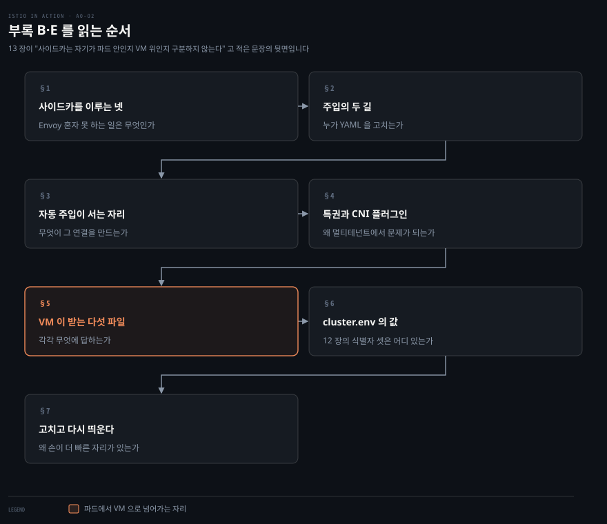
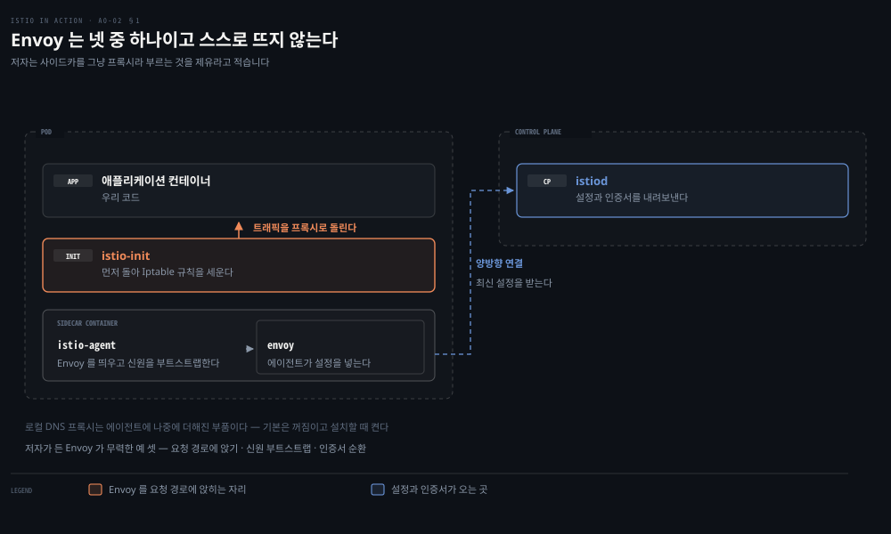
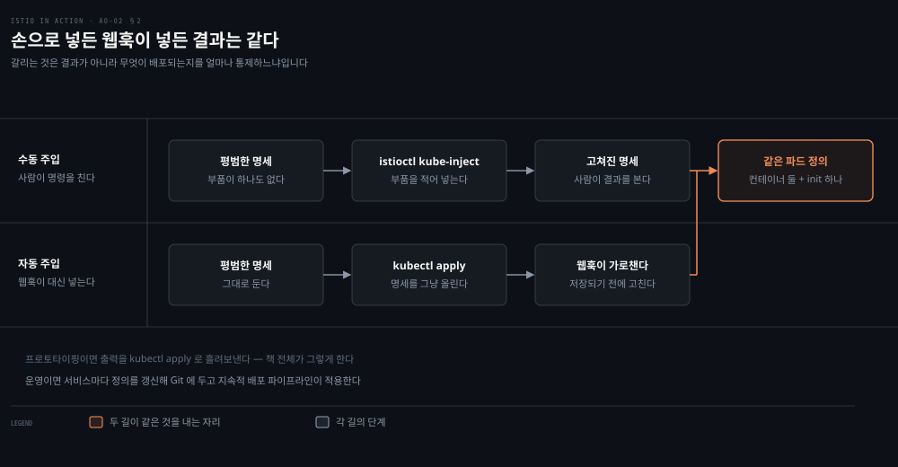
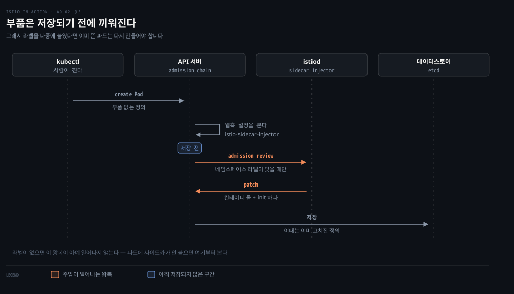
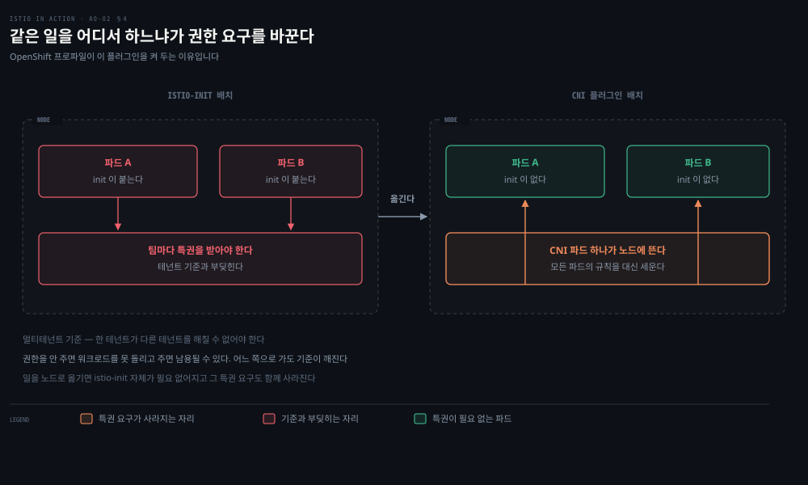
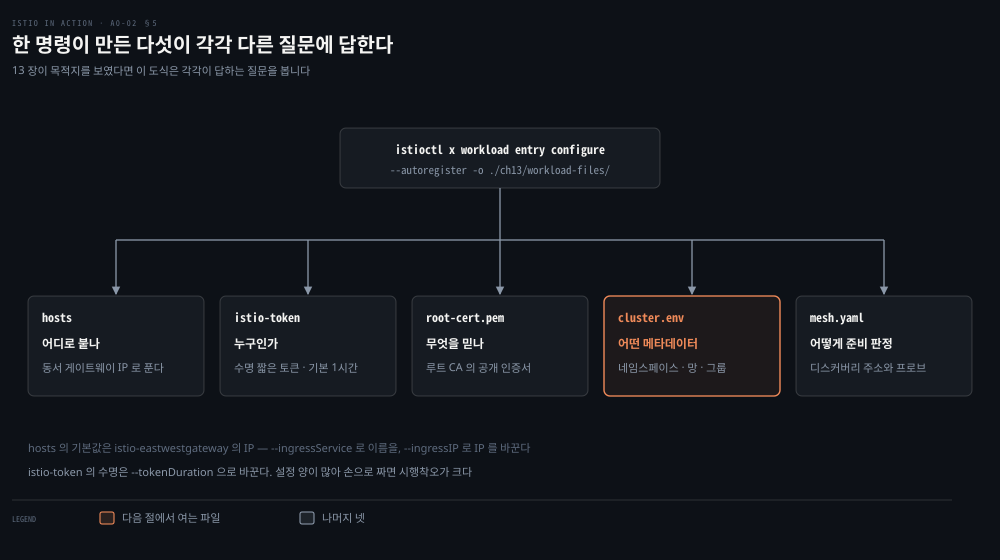
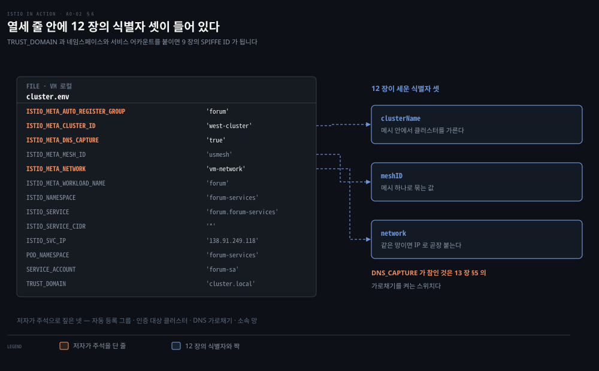
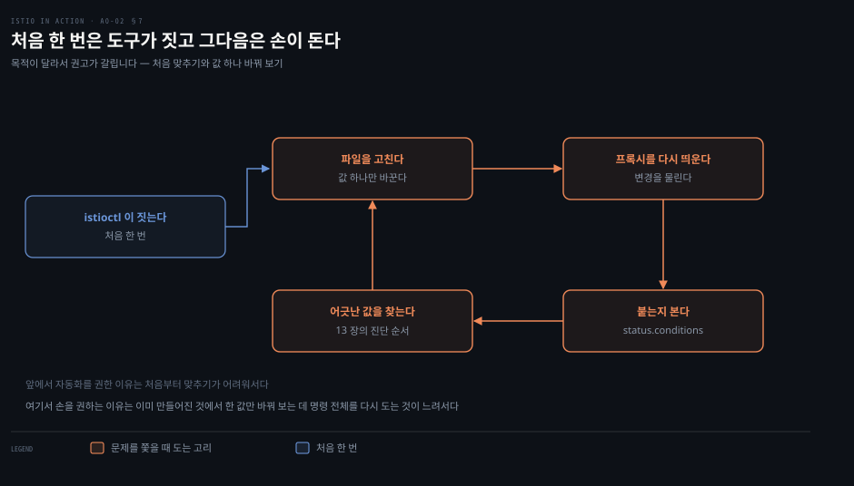

# 부록 — 사이드카를 이루는 넷과 VM 이 받는 다섯 파일

---

> 부록 둘을 한 편에 묶습니다. 둘 다 같은 질문에 답하기 때문입니다. **프록시는 자기 설정을 어떻게 받는가.** 파드에서는 주입이 그 일을 하고 VM 에서는 파일 다섯이 합니다. 13장이 "사이드카는 자기가 파드 안인지 VM 위인지 구분하지 않는다"고 적은 문장의 뒷면입니다.


## 핵심 요약

> "We synecdochically refer to Istio's sidecar as the service proxy or Envoy proxy. … Yet this is not a one-person show." (부록 B 도입)

저자는 제유(synecdoche)라는 낱말로 시작합니다. 사이드카를 그냥 "프록시"라 부르는 관행이 자연스럽긴 하지만 정확하지는 않다는 뜻입니다. Envoy 혼자서는 자기를 요청 경로에 앉히지도 못하고 신원을 부트스트랩하지도 못하며 인증서를 순환시키지도 못합니다. 그 일들을 하는 부품이 따로 있습니다.

그래서 이 부록 둘이 답하는 것은 하나입니다. Envoy 를 둘러싼 부품이 무엇이고, 그것들이 어떤 경로로 워크로드에 들어가는가입니다. 파드에서는 주입이라는 경로가 있습니다. 사람이 `istioctl`로 넣거나 웹훅이 자동으로 넣습니다. VM 에서는 `istioctl`이 만들어 준 파일 다섯이 그 자리를 대신합니다. 마지막에 저자는 자동화를 권하면서도 문제를 쫓을 때는 파일을 직접 고치라고 덧붙입니다.


## 학습 목표

이 문서를 읽고 나면 다음을 할 수 있습니다.

- 사이드카를 이루는 부품 넷을 이름과 역할로 구분하고, 그중 어느 것이 Envoy 를 요청 경로에 앉히는지 말할 수 있습니다.
- 수동 주입과 자동 주입이 결과적으로 같은 변경을 낸다는 점과, 그럼에도 조직이 둘 중 하나를 고르는 이유를 설명할 수 있습니다.
- 자동 주입이 쿠버네티스의 어떤 기능 위에 서 있고 어느 리소스가 그 연결을 만드는지 말할 수 있습니다.
- `istio-init` 이 특권을 요구하는 이유와 Istio CNI 플러그인이 그 요구를 어떻게 없애는지 설명할 수 있습니다.
- VM 에 생성되는 파일 다섯이 각각 무엇에 답하는지 말하고, `cluster.env` 의 값에서 메시·클러스터·망을 짚을 수 있습니다.



앞의 넷이 파드 쪽이고 뒤의 셋이 VM 쪽입니다. 같은 질문에 두 환경이 다른 답을 내놓는 구조라 순서를 그렇게 두었습니다.


## 이 문서가 다루지 않는 것

> 주입된 뒤의 이야기와 VM 등록 절차 자체는 다른 자리가 맡습니다.

사이드카가 설정을 받은 **뒤** 무슨 일을 하는지는 [3장](./03-01.Envoy가%20맡는%20일과%20Istio가%20보태는%20일.md)이 SSOT 입니다. 리스너·라우트·클러스터와 xDS 가 거기 있습니다.

VM 을 메시에 등록하는 절차, `WorkloadGroup`과 `WorkloadEntry`, 자동 등록과 동서 게이트웨이는 [13장](./13-01.자동으로%20되던%20일이%20목록이%20되어%20나타난다.md)이 맡습니다. 이 부록은 그 절차가 만들어 낸 파일의 **내부**만 봅니다.

`istio-agent` 가 도는 DNS 프록시의 동작과 `NDS` 는 13장 §5 가 다룹니다. 여기서는 그것이 사이드카의 부품 중 하나라는 사실만 짚습니다.

Istio CNI 플러그인의 설치와 운영은 저자도 공식 문서로 넘깁니다. 이 노트도 같은 자리에서 멈추고 링크만 남깁니다.


## 1. 사이드카는 한 사람의 무대가 아니다

> 사이드카는 부품 넷으로 이뤄집니다. Envoy 는 그중 하나이고, 나머지가 Envoy 가 못 하는 일을 합니다.



저자가 드는 부품은 넷입니다.

**Istio 에이전트**는 흔히 파일럿 에이전트라 불립니다. 사이드카 컨테이너 안에서 Envoy 프로세스를 띄우고 그 신원을 부트스트랩합니다. 그다음에는 컨트롤 플레인과 양방향 연결을 유지하면서 최신 메시 설정을 받아 Envoy 에 적용합니다.

**로컬 DNS 프록시**는 에이전트에 나중에 더해진 부품입니다. VM 을 메시에 넣거나 여러 클러스터를 하나의 메시로 묶을 때 클러스터 호스트명을 풀어 줍니다. 기본값은 꺼짐이고 설치할 때 켤 수 있습니다.

**Envoy 프록시**는 사이드카 컨테이너 안에서 프로세스로 뜨고, 그 설정은 Istio 에이전트가 넣어 줍니다. 스스로 뜨는 것이 아니라 에이전트가 띄운다는 점이 이 절의 핵심입니다.

**`istio-init` 컨테이너**는 파드 환경을 고쳐 애플리케이션의 인바운드·아웃바운드 트래픽을 서비스 프록시로 돌립니다. 쿠버네티스의 **init 컨테이너** 기능을 써서 다른 어떤 컨테이너보다 먼저 돌고, 그 결과 트래픽이 애플리케이션에 닿기 전에 Iptable 규칙을 세워 Envoy 를 요청 경로에 끼워 넣습니다.

저자가 든 "Envoy 가 무력한 경우"의 예가 셋입니다. 자기를 요청 경로에 앉히는 일, 신원을 부트스트랩하는 일, 인증서를 순환시키는 일입니다. 앞의 하나는 `istio-init` 이 하고 뒤의 둘은 에이전트가 합니다.


## 2. 주입은 YAML 을 고쳐 넣는 일

> 사이드카 주입은 쿠버네티스 애플리케이션 명세에 데이터 플레인 부품을 더하는 일입니다. 손으로 고쳐도 되지만 저자는 그것을 오류가 잦다고 적습니다.



출발점은 부품이 하나도 없는 평범한 디플로이먼트입니다. 컨테이너 하나에 포트 하나가 전부입니다.

```yaml
apiVersion: apps/v1
kind: Deployment
metadata:
  name: httpbin
spec:
  selector:
    matchLabels:
      app: httpbin
  template:
    metadata:
      labels:
        app: httpbin
    spec:
      containers:
      - image: docker.io/kennethreitz/httpbin
        name: httpbin
        ports:
        - containerPort: 80
```

여기에 부품을 손으로 적어 넣을 수도 있습니다. 저자는 그것을 "YAML 을 고치는 일은 오류가 잦기로 악명 높다"고 적고 더 단순한 선택지를 내놓습니다.

**수동 주입**은 명세를 `istioctl`에 넘겨 부품을 대신 넣게 하는 방식입니다.

```bash
istioctl kube-inject -f deployment.yaml
```

저자는 여기서 자기 이름 붙이기를 한 번 뒤집습니다. "다시 생각해 보면 이 과정도 그렇게 수동은 아니군요"라고 적습니다. 사람이 하는 일은 명령을 한 번 치는 것뿐이고 실제 편집은 도구가 합니다.

쓰는 방식은 목적에 따라 갈립니다. 프로토타이핑 중이라면 출력을 `kubectl apply`로 흘려보내면 됩니다 — 책 전체가 그렇게 합니다. 실제 운영 클러스터라면 서비스마다 정의를 갱신하고 그 변경을 Git 저장소에 두어, 지속적 배포 파이프라인이 클러스터에 적용하게 합니다.


## 3. 자동 주입이 서는 자리

> 자동 주입은 쿠버네티스의 뮤테이팅 어드미션 웹훅 위에 섭니다. 파드 정의가 데이터스토어에 저장되기 **전에** 부품이 끼워집니다.



자동 주입이 내는 변경은 `istioctl`을 쓸 때와 **같습니다**. 다른 것은 사람이 명세를 건드리지 않아도 된다는 점뿐입니다. 애플리케이션 정의를 있는 그대로 적용하면 웹훅이 부품을 자동으로 넣습니다.

이 기능은 옵트인이고 네임스페이스 단위로 켭니다. 네임스페이스에 `istio-injection=enabled` 라벨을 붙이는 것이 그 스위치입니다.

```bash
kubectl create namespace istioinaction
kubectl label namespace istioinaction istio-injection=enabled
kubectl config set-context $(kubectl config current-context) \
  --namespace=istioinaction
```

이 뒤로 그 네임스페이스에서 만들어지는 파드에는 데이터 플레인 부품이 들어갑니다. 확인해 보면 파드 정의에 컨테이너가 둘 있습니다. 애플리케이션과 `istio-proxy` 이고, `initContainers`에는 `istio-init` 이 하나 붙습니다. 프록시와 init 컨테이너 모두 같은 이미지(`docker.io/istio/proxyv2:1.13.0`)에서 나오고 인자만 다릅니다.

쿠버네티스가 파드 생성 이벤트를 컨트롤 플레인으로 보내도록 만드는 것은 `MutatingWebhookConfiguration` 리소스입니다. API 서버가 이 리소스를 보고 어떤 이벤트를 외부 서비스로 보낼지 정합니다.

```bash
kubectl get MutatingWebhookConfiguration
```

사이드카를 넣는 것은 `istio-sidecar-injector` 라는 이름의 설정이고, 저자가 보인 출력에서는 웹훅이 넷 들어 있습니다. 자세한 내용을 보면 어떤 리소스와 어떤 작업이 맞아야 요청이 istiod 로 가는지가 적혀 있습니다.

저자는 선택을 조직에 맡깁니다. 자동 주입을 택하는 조직을 자주 보는데 더 쉽고 모든 서비스 정의를 손으로 갱신하지 않아도 되기 때문입니다. 그렇다고 수동 주입이 드문 것도 아니고, 그쪽을 고르는 이유는 **무엇이 배포되는지를 완전히 통제할 수 있어서**입니다.


## 4. istio-init 이 요구하는 특권과 CNI 플러그인

> 트래픽을 돌리려면 `istio-init` 에 높은 권한이 필요합니다. 여러 팀이 나눠 쓰는 클러스터에서는 그 요구가 보안 기준과 부딪힙니다.



`istio-init` 컨테이너는 Envoy 프록시로 트래픽을 돌리는 설정을 하기 위해 **높은 권한**을 요구합니다. 어떤 조직에서는 그 요구가 보안 기준에 어긋납니다.

저자가 짚는 자리는 구체적입니다. 여러 테넌트가 나눠 쓰는 큰 클러스터에서, 그리고 일반적으로 모든 멀티테넌트 환경에서 중요한 보안 기준 하나가 있습니다. **한 테넌트가 다른 테넌트를 해칠 수 없어야 한다**는 것입니다.

그러면 딜레마가 생깁니다. 특권 컨테이너를 돌릴 권한이 없으면 애플리케이션 팀은 `istio-init` 이 든 워크로드를 아예 돌릴 수 없습니다. 그렇다고 권한을 주면 그 권한이 남용되어 다른 테넌트를 해칠 수 있습니다. 어느 쪽으로 가도 기준이 깨집니다.

Istio CNI 플러그인이 그 딜레마를 없앱니다. `istio-init` 컨테이너가 하던 일을 **노드마다 도는 중앙화된 파드**로 옮겨, 그 파드가 모든 파드의 트래픽 리디렉션 규칙을 설정하게 합니다. 그러면 `istio-init` 컨테이너 자체가 필요 없어지고, 그것을 돌리는 데 필요하던 높은 권한도 함께 사라집니다.

`a0-01` 에서 본 `openshift` 프로파일이 이 플러그인을 켜 둔 것입니다. OpenShift 가 특권 컨테이너를 제한하기 때문에 그쪽에서는 요구 사항이었습니다.


## 5. VM 이 받는 다섯 파일

> 파드에서 주입이 하던 일을 VM 에서는 파일 다섯이 합니다. 13장이 그 파일들의 목적지를 보였다면 이 부록은 그 안을 엽니다.



13장에서 친 명령이 이 파일들을 만들었습니다.

```bash
istioctl x workload entry configure \
  --name forum \
  --namespace forum-services \
  --clusterID "west-cluster" \
  --externalIP $VM_IP \
  --autoregister \
  -o ./ch13/workload-files/
```

저자가 이 자동화를 두는 이유를 한 문장으로 적습니다. 만들어진 설정의 양이 상당하고 구조가 복잡해서, 사용자가 직접 짜야 한다면 제대로 맞추기까지 시행착오가 많이 필요하다는 것입니다.

파일 다섯은 각각 다른 질문에 답합니다.

`hosts` 는 **어디로 붙나**에 답합니다. `istiod.istio-system.svc` 라는 호스트 항목이 들어 있고 그것이 동서 게이트웨이의 IP 로 풉니다. 기본값은 `istio-eastwestgateway` 라는 이름의 게이트웨이 IP 이고, `--ingressService` 로 이름을 바꾸거나 `--ingressIP` 로 IP 를 직접 지정할 수 있습니다.

`istio-token` 은 **누구인가**에 답합니다. 워크로드가 istiod 에 자기를 밝힐 때 쓰는 수명 짧은 토큰이고 기본 수명은 한 시간입니다. `--tokenDuration` 으로 바꿉니다.

`root-cert.pem` 은 **무엇을 믿나**에 답합니다. 루트 인증 기관의 공개 인증서이고, 이것이 있어야 워크로드가 컨트롤 플레인의 인증서를 검증할 수 있습니다.

`cluster.env` 는 **어떤 메타데이터를 지고 있나**에 답합니다. 네임스페이스·서비스 어카운트·망·소속 워크로드 그룹 같은 것들이 들어갑니다. 다음 절이 그 안을 봅니다.

`mesh.yaml` 은 **어떻게 준비를 판정하나**에 답합니다. 디스커버리 주소와, 사이드카가 애플리케이션의 트래픽 수신 준비를 시험하는 프로브를 설정합니다.


## 6. cluster.env 가 담는 것

> 열세 줄 안에 메시·클러스터·망이라는 12장의 식별자 셋이 그대로 들어 있습니다.



파일을 열면 이렇습니다.

```bash
ISTIO_META_AUTO_REGISTER_GROUP='forum'
ISTIO_META_CLUSTER_ID='west-cluster'
ISTIO_META_DNS_CAPTURE='true'
ISTIO_META_MESH_ID='usmesh'
ISTIO_META_NETWORK='vm-network'
ISTIO_META_WORKLOAD_NAME='forum'
ISTIO_NAMESPACE='forum-services'
ISTIO_SERVICE='forum.forum-services'
ISTIO_SERVICE_CIDR='*'
ISTIO_SVC_IP='138.91.249.118'
POD_NAMESPACE='forum-services'
SERVICE_ACCOUNT='forum-sa'
TRUST_DOMAIN='cluster.local'
```

저자가 주석으로 짚는 것은 넷입니다. 워크로드가 `forum` 그룹에 자동 등록된다는 것, `west-cluster` 에 자기를 인증한다는 것, DNS 가로채기가 켜져 있어 메시 안 서비스로 트래픽이 제대로 간다는 것, 그리고 워크로드가 `vm-network` 에 있다는 것입니다.

이 넷을 12장의 어휘로 읽으면 바로 이어집니다. `ISTIO_META_MESH_ID` 가 메시 식별자이고 `ISTIO_META_CLUSTER_ID` 가 클러스터를, `ISTIO_META_NETWORK` 가 망을 가릅니다. 12장이 "식별자 셋이 어디까지가 한 몸인지를 정한다"고 적은 그 셋이, VM 쪽에서는 이 파일의 환경변수로 내려와 있습니다.

`ISTIO_META_DNS_CAPTURE` 가 참인 것도 13장과 이어집니다. 이 값이 13장 §5 의 가로채기 — Iptable 규칙이 DNS 질의를 사이드카 안의 DNS 프록시로 돌리는 것 — 를 켜는 스위치입니다.

`TRUST_DOMAIN='cluster.local'` 은 9장의 SPIFFE ID 앞 조각입니다. VM 워크로드의 신원도 `spiffe://cluster.local/ns/forum-services/sa/forum-sa` 형태가 됩니다.

> **노트의 읽기** — 위 문단의 SPIFFE ID 조합은 원문이 적지 않습니다. `TRUST_DOMAIN`·`ISTIO_NAMESPACE`·`SERVICE_ACCOUNT` 세 값과 9장의 형식을 붙여 본 것입니다.


## 7. 트러블슈팅 때는 파일을 직접 고친다

> 저자는 자동 생성을 권하면서도 예외를 하나 둡니다. 문제를 쫓을 때는 파일을 직접 고치는 편이 빠르다는 것입니다.



부록 E 의 마지막 문장이 이 절의 전부입니다. 설정을 만들 때는 항상 `istioctl` 을 쓰는 편이 낫지만, 워크로드가 메시에 붙지 않는 이유를 쫓을 때는 파일을 직접 고치고 서비스 프록시를 다시 띄워 변경을 물리는 쪽이 **반복이 빠르다**는 것입니다.

이 조언이 앞의 문장과 모순처럼 보이지만 그렇지 않습니다. 앞에서 자동화를 권한 이유는 처음부터 맞추기가 어려워서이고, 여기서 손을 권하는 이유는 이미 만들어진 것에서 한 값만 바꿔 보는 데는 명령 전체를 다시 도는 것이 느려서입니다. 목적이 다릅니다.

13장의 진단 순서와 함께 보면 자리가 분명해집니다. 13장은 `UH` 플래그에서 시작해 엔드포인트 목록으로 내려가고 마지막에 `status.conditions` 를 봤습니다. 그 마지막 자리에서 값이 어긋난 것이 보이면, 고칠 대상이 바로 이 다섯 파일 중 하나입니다.


## 결정 치트시트

| 상황 | 고를 것 | 이유 |
|---|---|---|
| 프로토타이핑 중 | `istioctl kube-inject` + `kubectl apply` | 명령 하나로 끝나고 책 전체가 그렇게 한다 |
| 운영 클러스터 · 배포를 통제하고 싶을 때 | 수동 주입 + Git | 무엇이 배포되는지를 완전히 통제할 수 있다 |
| 운영 클러스터 · 손을 덜고 싶을 때 | 자동 주입 (`istio-injection=enabled`) | 서비스 정의를 손으로 갱신하지 않아도 된다 |
| 여러 팀이 나눠 쓰는 큰 클러스터 | Istio CNI 플러그인 | `istio-init` 과 그 특권 요구가 함께 사라진다 |
| OpenShift | `openshift` 프로파일 | CNI 플러그인이 켜진 채로 온다 |
| VM 설정을 처음 만들 때 | `istioctl x workload entry configure` | 손으로 짜면 시행착오가 많이 든다 |
| VM 이 메시에 안 붙는 원인을 쫓을 때 | 파일을 직접 고치고 프록시 재시작 | 값 하나 바꿔 보는 반복이 빠르다 |


## 적용 관점

> 이 부록에서 실무로 가져갈 규칙 하나와, Spring 쪽에서 견줄 만한 자리를 적습니다.

규칙 하나를 남깁니다. **파드에 사이드카가 안 붙으면 네임스페이스 라벨부터 봅니다.** 자동 주입은 옵트인이고 스위치는 `istio-injection=enabled` 하나입니다. 라벨이 없으면 웹훅이 그 파드를 아예 건드리지 않으므로, 애플리케이션 정의를 아무리 들여다봐도 원인이 안 보입니다.

Spring 관점에서 견줄 자리는 자동 주입의 시점입니다. 뮤테이팅 웹훅은 파드 정의가 데이터스토어에 **저장되기 전에** 그것을 고칩니다. 빈이 등록되기 전에 정의를 고치는 `BeanFactoryPostProcessor` 와 자리가 같습니다. 이미 만들어진 빈을 감싸는 `BeanPostProcessor` 쪽이 아닙니다. 그래서 주입 결과를 보려면 이미 뜬 파드가 아니라 **새로 만들어지는** 파드를 봐야 하고, 라벨을 나중에 붙였다면 기존 파드는 다시 만들어야 합니다.

> 위 문단의 Spring 대응은 책 밖 보강이고, 원문은 Spring 을 언급하지 않습니다.


## 면접에서 받을 만한 질문

1. 사이드카를 그냥 "프록시"라고 부르는 것이 왜 정확하지 않습니까? Envoy 가 혼자 못 하는 일로 저자가 드는 예를 셋 말해 보십시오.
2. `istio-init` 은 어떤 쿠버네티스 기능 위에 서 있고, 왜 하필 그 기능이어야 합니까?
3. 수동 주입과 자동 주입이 내는 결과가 같다면 조직은 무엇을 보고 둘 중 하나를 고릅니까?
4. `istio-init` 이 요구하는 특권이 멀티테넌트 클러스터에서 왜 딜레마가 됩니까? CNI 플러그인은 그 딜레마를 어떻게 없앱니까?
5. VM 에 만들어지는 다섯 파일 중 `cluster.env` 하나만 열어도 12장의 식별자 셋을 다 짚을 수 있습니다. 각각 어느 변수입니까?


## 정답 (자답 후 펼치기)

<details>
<summary>1. 제유가 부정확한 이유</summary>

사이드카가 부품 넷으로 이뤄져 있고 Envoy 는 그중 하나이기 때문입니다. 나머지는 Istio 에이전트(파일럿 에이전트), 로컬 DNS 프록시, `istio-init` 컨테이너입니다.

저자가 드는 "Envoy 가 무력한" 예 셋은 자기를 요청 경로에 앉히는 일, 신원을 부트스트랩하는 일, 인증서를 순환시키는 일입니다. 앞의 하나는 `istio-init` 이 Iptable 규칙으로 하고 뒤의 둘은 에이전트가 합니다.

</details>

<details>
<summary>2. istio-init 이 선 자리</summary>

쿠버네티스의 **init 컨테이너** 기능입니다.

그 기능이어야 하는 이유는 순서 때문입니다. init 컨테이너는 다른 어떤 컨테이너보다 먼저 돌므로, 트래픽이 애플리케이션에 닿기 **전에** Iptable 규칙을 세워 Envoy 를 요청 경로에 끼워 넣을 수 있습니다. 애플리케이션과 나란히 뜨는 컨테이너였다면 그 순서를 보장할 수 없습니다.

</details>

<details>
<summary>3. 수동과 자동을 가르는 기준</summary>

저자는 결과가 같다고 못 박습니다. 웹훅이 내는 변경은 `istioctl` 을 쓸 때와 같습니다.

갈리는 것은 두 가지입니다. 자동 주입은 더 쉽고 모든 서비스 정의를 손으로 갱신하지 않아도 됩니다. 수동 주입은 **무엇이 배포되는지를 완전히 통제**할 수 있습니다. 저자는 자동 쪽을 자주 보지만 수동을 고르는 조직도 드물지 않다고 적습니다.

</details>

<details>
<summary>4. 특권 딜레마와 CNI 플러그인</summary>

딜레마인 이유는 어느 쪽으로 가도 기준이 깨져서입니다. 특권 컨테이너를 돌릴 권한을 안 주면 애플리케이션 팀이 `istio-init` 이 든 워크로드를 돌릴 수 없고, 주면 그 권한이 남용되어 다른 테넌트를 해칠 수 있습니다. 멀티테넌트 환경의 기준은 한 테넌트가 다른 테넌트를 해칠 수 없어야 한다는 것입니다.

CNI 플러그인은 `istio-init` 이 하던 일을 **노드마다 도는 중앙화된 파드**로 옮깁니다. 그 파드가 모든 파드의 리디렉션 규칙을 설정하므로 `istio-init` 자체가 필요 없어지고, 그것을 돌리는 데 필요하던 권한도 함께 사라집니다.

</details>

<details>
<summary>5. cluster.env 안의 식별자 셋</summary>

`ISTIO_META_MESH_ID='usmesh'` 가 메시, `ISTIO_META_CLUSTER_ID='west-cluster'` 가 클러스터, `ISTIO_META_NETWORK='vm-network'` 가 망입니다.

12장이 "같은 meshID 를 가진 설치들이 하나의 메시가 되고 그 안에서 clusterName 이 클러스터를 가르며 network 가 어느 망에 있는지를 알린다"고 적은 셋이, VM 쪽에서는 이 세 환경변수로 내려옵니다.

</details>


## 핵심 개념 체크리스트

- [ ] 사이드카의 부품 넷 — Istio 에이전트 · 로컬 DNS 프록시 · Envoy 프록시 · `istio-init`
- [ ] 에이전트가 하는 일 — Envoy 기동 · 신원 부트스트랩 · 컨트롤 플레인과 양방향 연결 · 설정 적용
- [ ] `istio-init` 이 init 컨테이너여야 하는 이유 — 트래픽이 닿기 전에 Iptable 규칙을 세운다
- [ ] `istioctl kube-inject` 와 `istio-injection=enabled` 라벨
- [ ] `MutatingWebhookConfiguration` 과 `istio-sidecar-injector`
- [ ] 멀티테넌시 기준과 Istio CNI 플러그인이 없애는 것
- [ ] VM 파일 다섯과 각각이 답하는 것 — `hosts` · `istio-token` · `root-cert.pem` · `cluster.env` · `mesh.yaml`
- [ ] `cluster.env` 안의 메시·클러스터·망과 `ISTIO_META_DNS_CAPTURE`
- [ ] `--ingressService` · `--ingressIP` · `--tokenDuration` 이 바꾸는 것


## 관련 문서

- [3장 — Envoy가 맡는 일과 Istio가 보태는 일](./03-01.Envoy가%20맡는%20일과%20Istio가%20보태는%20일.md) — 사이드카가 설정을 받은 뒤의 이야기
- [13장 — 자동으로 되던 일이 목록이 되어 나타난다](./13-01.자동으로%20되던%20일이%20목록이%20되어%20나타난다.md) — VM 등록 절차와 다섯 파일의 목적지
- [부록 — 설치를 고르는 API 와 프로파일 여덟](./a0-01.부록%20—%20설치를%20고르는%20API%20와%20프로파일%20여덟.md) — `openshift` 프로파일이 CNI 를 켜 두는 자리
- [정독 인덱스](./README.md)


## 참고 자료

- 《Istio in Action》 부록 B "Istio's sidecar and its injection options"
- 《Istio in Action》 부록 E "How the virtual machine is configured to join the mesh"
- [Istio CNI 플러그인 공식 문서](https://istio.io/latest/docs/setup/additional-setup/cni/) — 저자가 넘긴 자리
- [쿠버네티스 init 컨테이너](https://kubernetes.io/docs/concepts/workloads/pods/init-containers/)
