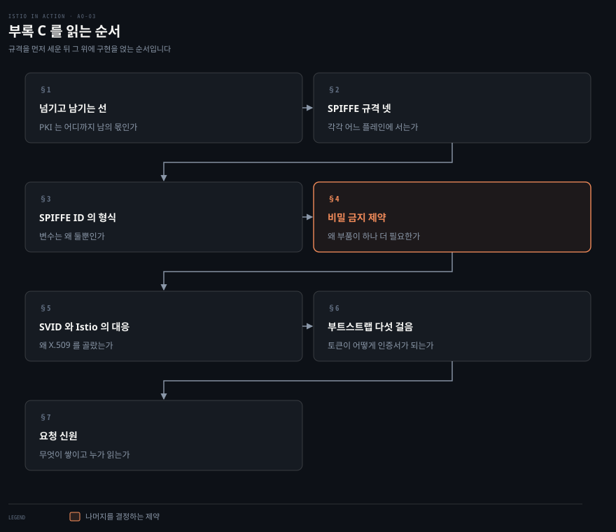
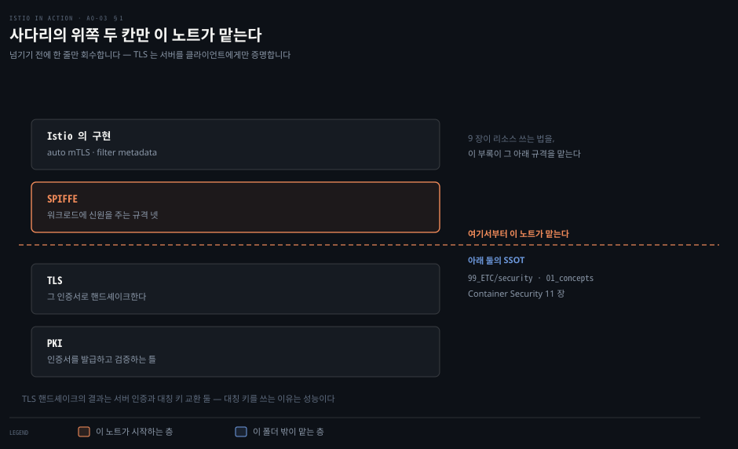
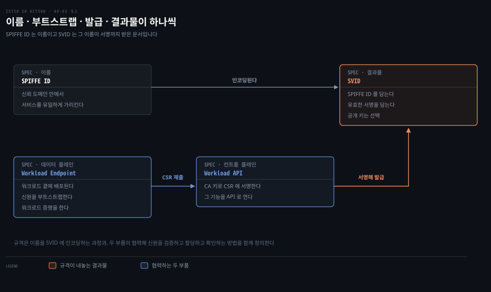
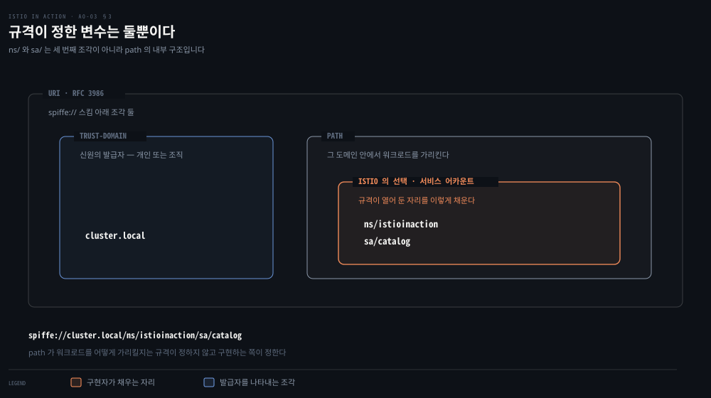
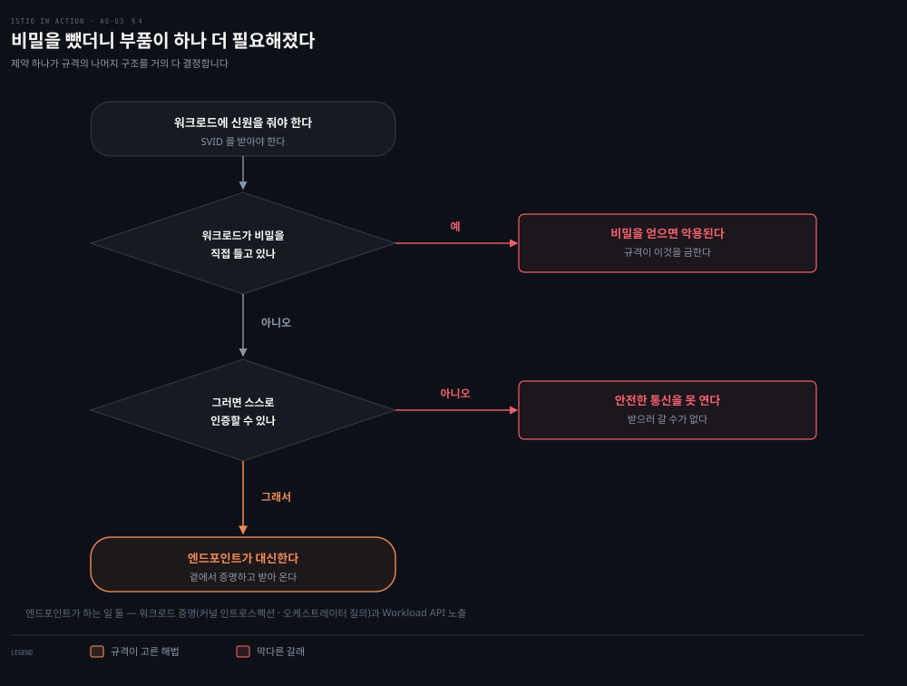
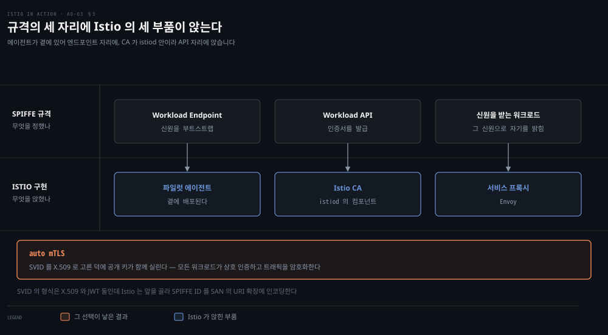
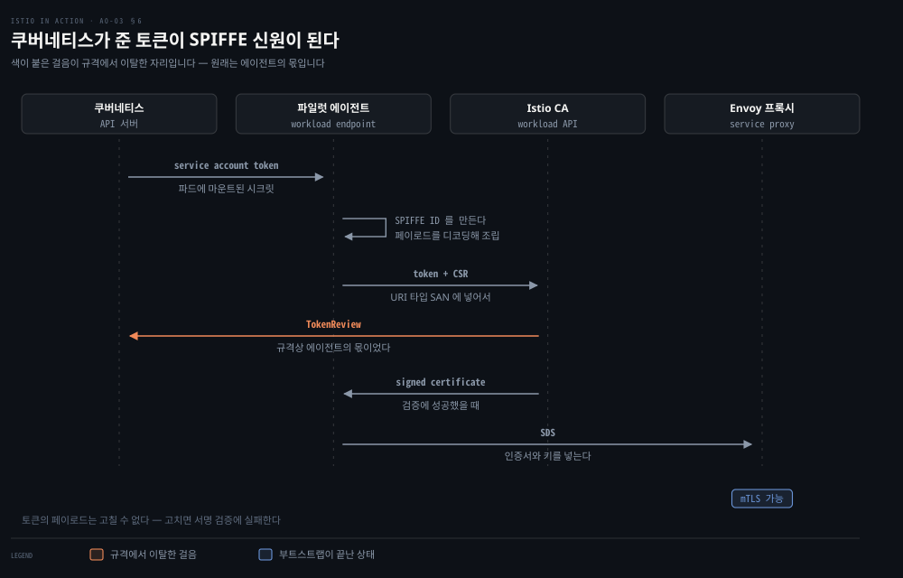
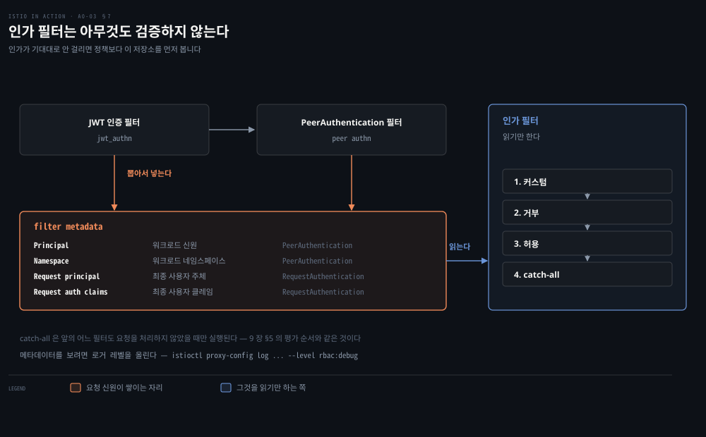

# 부록 — 신원을 문서로 만드는 네 규격

---

> 9장은 SPIFFE 를 "간단한 복습"으로만 짚고 상세를 이 부록으로 넘겼습니다. 넘어온 자리에서 볼 것은 규격 넷이 어떻게 맞물려 워크로드에 신원을 주는가입니다. 규격 하나가 건 제약 — **워크로드는 자기 신원을 정의하는 비밀을 가져서는 안 된다** — 이 나머지 구조를 거의 다 결정합니다.


## 핵심 요약

> "The specification sets a restriction that workloads must not possess secrets or other information that defines their identity." (부록 C.2.2)

SPIFFE 는 규격 넷으로 이뤄집니다. 워크로드를 가리키는 이름이 SPIFFE ID 입니다. 그 이름을 부트스트랩하는 데이터 플레인 쪽 부품이 Workload Endpoint 이고, 인증서를 서명해 발급하는 컨트롤 플레인 쪽 부품이 Workload API 입니다. 그 결과로 나오는 문서가 SVID 입니다.

넷이 이렇게 갈린 이유가 위 제약입니다. 워크로드가 자기 신원을 정의하는 비밀을 들고 있으면 그 비밀을 얻은 공격자가 시스템을 악용할 수 있습니다. 그래서 비밀을 뺐는데, 그러면 워크로드에는 자기를 인증할 수단이 없어져 Workload API 와 안전한 통신을 시작할 수도 없습니다. 그 공백을 메우려고 규격은 Workload Endpoint 를 따로 정의합니다. 제약 하나가 부품 하나를 낳은 구조입니다.

Istio 는 이 규격을 구현하면서 한 곳에서 비켜섭니다. 워크로드 증명을 규격대로라면 엔드포인트(Istio 에이전트)가 해야 하는데, Istio 에서는 CA 가 `TokenReview` API 로 대신합니다. 저자 자신이 그것을 "규격에서의 작은 이탈"이라고 적습니다.


## 학습 목표

이 문서를 읽고 나면 다음을 할 수 있습니다.

- SPIFFE 규격 넷을 이름과 역할로 구분하고, 각각이 데이터 플레인 쪽인지 컨트롤 플레인 쪽인지 말할 수 있습니다.
- SPIFFE ID 의 형식을 적고, `path` 를 무엇으로 채울지가 왜 열려 있는지 설명할 수 있습니다.
- "워크로드는 비밀을 가질 수 없다"는 제약이 왜 Workload Endpoint 라는 부품을 낳는지 유도할 수 있습니다.
- Istio 의 어느 컴포넌트가 규격의 어느 자리에 대응하는지 말하고, 규격에서 어긋난 한 곳을 짚을 수 있습니다.
- 요청 신원이 filter metadata 로 쌓이는 과정과 필터가 도는 순서를 말할 수 있습니다.



앞의 넷이 규격이고 뒤의 셋이 Istio 의 구현입니다. 규격을 먼저 세운 뒤 그 위에 구현을 얹는 순서라 그렇게 두었습니다.


## 이 문서가 다루지 않는 것

> 부록 C 의 앞 절반은 이 폴더 밖이 SSOT 입니다. 여기 남기는 것은 SPIFFE 부터입니다.

부록 C.1 은 PKI 와 TLS 핸드셰이크를 여섯 걸음으로 설명합니다. 그 내용은 이 폴더가 맡지 않습니다. 인증과 인가의 기초는 `write/99_ETC/security/01_concepts/` 가, X.509 와 CA 는 같은 폴더의 [『Container Security』 11장](../container-security/11-01.TLS%EB%A1%9C%20%EC%BB%B4%ED%8F%AC%EB%84%8C%ED%8A%B8%20%EC%95%88%EC%A0%84%ED%95%98%EA%B2%8C%20%EC%97%B0%EA%B2%B0%ED%95%98%EA%B8%B0%20%E2%80%94%20%ED%82%A4%C2%B7%EC%9D%B8%EC%A6%9D%EC%84%9C%C2%B7CA%EC%9D%98%20%EC%97%AD%ED%95%A0.md)이 SSOT 입니다.

판별 기준은 README 의 것과 같습니다. **"이 문장이 Istio 를 쓸 줄 아는 사람에게도 새로운가."** TLS 핸드셰이크의 여섯 걸음은 새롭지 않으므로 넘깁니다.

`RequestAuthentication`·`PeerAuthentication`·`AuthorizationPolicy` 를 **쓰는 법**은 [9장](./09-01.거의%20안전한%20기본값을%20닫아%20가는%20순서.md)이 맡습니다. 이 부록은 그 리소스들이 무엇을 남기고 어떤 순서로 도는지만 봅니다.

JWT 설계와 OAuth2·OIDC 도 `99_ETC/security` 쪽입니다. 여기서는 JWT 가 SVID 의 두 형식 중 하나라는 사실만 짚습니다.


## 1. PKI·TLS 를 넘기고 남기는 것

> 부록 C 는 PKI 에서 시작해 SPIFFE 로 올라갑니다. 이 노트는 그 사다리의 위쪽 두 칸만 다룹니다.



넘기기 전에 한 줄만 회수합니다. TLS 핸드셰이크의 결과는 클라이언트가 서버를 **인증했고** 대칭 키를 안전하게 **교환했다**는 두 가지입니다. 그 대칭 키로 이후 트래픽을 암호화하는데, 비대칭 암호화보다 성능이 좋기 때문입니다.

저자가 이 대목에서 짚는 비대칭이 하나 있습니다. TLS 는 **서버를 클라이언트에게** 증명하는 데까지만 옵니다. 최종 사용자를 서버에게 인증하는 일은 애플리케이션의 몫입니다. 방법은 여럿이지만 모두 사용자가 비밀번호를 알고 그 대가로 세션 쿠키나 JWT 를 받는 형태로 수렴합니다. Istio 는 그중 JWT 쪽을 지원하고, 9장 §4 가 그것을 보였습니다.

이 두 문장이 나머지를 여는 열쇠입니다. **서비스끼리는 무엇으로 서로를 증명하는가.** 사람에게는 비밀번호가 있지만 워크로드에는 없습니다. SPIFFE 가 그 자리에 답합니다.


## 2. SPIFFE 규격 넷

> SPIFFE 는 동적이고 이질적인 환경에서 워크로드에 신원을 주기 위한 오픈소스 표준 묶음입니다. 규격 넷이 서로 다른 자리를 맡습니다.



저자가 나열하는 넷은 이렇습니다.

**SPIFFE ID** 는 신뢰 도메인 안에서 서비스를 유일하게 가리킵니다. 이름입니다.

**Workload Endpoint** 는 워크로드의 신원을 부트스트랩합니다. 데이터 플레인 쪽 부품입니다.

**Workload API** 는 SPIFFE ID 가 담긴 인증서를 서명해 발급합니다. 컨트롤 플레인 쪽 부품입니다.

**SVID**(SPIFFE Verifiable Identity Document)는 Workload API 가 발급한 인증서로 표현됩니다. 결과물입니다.

넷을 한 문장으로 묶으면 이렇습니다. 규격은 SPIFFE ID 형식으로 워크로드에 신원을 발급해 SVID 에 인코딩하는 과정을 정의하고, 그 과정에서 컨트롤 플레인 부품과 데이터 플레인 부품이 어떻게 협력해 신원을 검증하고 할당하고 확인하는지도 정의합니다. 이름·발급자·부트스트랩·결과물이 각각 하나씩 있는 셈입니다.


## 3. SPIFFE ID — URI 하나에 발급자와 워크로드

> 형식은 RFC 3986 을 따르는 URI 입니다. 변수는 둘뿐이고, 그중 하나는 일부러 열어 두었습니다.



형식은 `spiffe://trust-domain/path` 입니다.

`trust-domain` 은 **신원의 발급자**를 나타냅니다. 개인일 수도 조직일 수도 있습니다.

`path` 는 그 신뢰 도메인 안에서 워크로드를 유일하게 가리킵니다.

여기서 규격이 한 걸음 물러섭니다. `path` 가 워크로드를 **어떻게** 가리킬지는 열린 채로 두고, 규격을 구현하는 쪽이 정하게 합니다. Istio 는 그 자리에 쿠버네티스 서비스 어카운트를 넣습니다.

그래서 9장에서 본 `spiffe://cluster.local/ns/istioinaction/sa/catalog` 가 나옵니다. `cluster.local` 이 신뢰 도메인이고 나머지 전부가 `path` 입니다. `ns/...` 와 `sa/...` 는 `path` 의 **내부 구조**이지 세 번째, 네 번째 조각이 아닙니다. 규격의 변수는 둘뿐입니다.


## 4. 워크로드가 비밀을 못 가진다는 제약이 낳은 구조

> Workload API 의 두 기능부터 봅니다. 그중 하나가 제약을 만들고, 그 제약이 부품 하나를 더 부릅니다.



Workload API 는 SPIFFE 규격의 컨트롤 플레인 쪽 부품이고, 워크로드가 자기 신원을 정의하는 인증서를 SVID 형식으로 가져갈 수 있게 엔드포인트를 노출합니다. 주 기능은 둘입니다. CA 개인 키로 워크로드의 인증서 서명 요청(CSR)에 서명해 인증서를 발급하는 것, 그리고 그 기능을 워크로드 엔드포인트가 쓸 수 있도록 API 로 노출하는 것입니다.

여기서 규격이 제약을 하나 겁니다. **워크로드는 비밀이나 자기 신원을 정의하는 정보를 가져서는 안 됩니다.** 그렇지 않으면 그 비밀에 접근한 악의적 사용자가 시스템을 쉽게 악용할 수 있기 때문입니다.

그 제약의 결과가 곧 공백입니다. 비밀이 없으면 워크로드에는 **자기를 인증할 수단이 없고**, 그러면 Workload API 와 안전한 통신을 시작할 수도 없습니다. 신원을 받으러 가야 하는데 신원이 없어서 못 가는 상태입니다.

이 상황을 풀려고 규격은 **Workload Endpoint** 를 정의합니다. 데이터 플레인 쪽 부품으로, 워크로드 곁에 함께 배포되어 신원 부트스트랩에 필요한 모든 활동을 대신합니다. Workload API 와 안전한 통신을 시작하고 SVID 를 가져오되, 도청과 중간자 공격에 노출되지 않는 방식으로 합니다.

엔드포인트가 하는 일은 둘로 적혀 있습니다. **워크로드 증명**은 커널 인트로스펙션이나 오케스트레이터 질의 같은 방법으로 워크로드의 신원을 검증하는 일입니다. **Workload API 노출**은 그 API 와 안전한 통신을 시작하고 유지하는 일이고, 그 통신으로 SVID 를 가져오고 순환시킵니다.

발급 과정은 세 걸음입니다. 엔드포인트가 워크로드의 무결성을 검증합니다. 즉 워크로드 증명을 하고, SPIFFE ID 를 인코딩한 CSR 을 만듭니다. 그 CSR 을 Workload API 에 서명해 달라고 제출합니다. Workload API 가 서명해서, SAN 의 URI 확장에 SPIFFE ID 가 든 인증서로 응답합니다. 그 인증서가 SVID 입니다.


## 5. SVID 와 Istio 가 규격에 대응시킨 것

> SVID 는 형식이 둘인데 Istio 는 그중 하나를 고릅니다. 그 선택이 auto mTLS 를 가능하게 합니다.



SVID 는 검증 가능한 워크로드 신원을 나타내는 문서입니다. **검증 가능하다**는 것이 가장 중요한 성질인데, 그렇지 않으면 받는 쪽이 그 신원을 믿을 수 없기 때문입니다.

규격은 그 조건을 만족하는 문서 형식 둘을 정의합니다. X.509 인증서와 JWT 입니다. 둘 다 다음을 갖추기 때문입니다 — 워크로드 신원을 나타내는 SPIFFE ID, SPIFFE ID 가 변조되지 않았음을 보장하는 유효한 서명, 그리고 선택 사항으로 워크로드 사이에 안전한 통신 채널을 세울 공개 키입니다.

Istio 는 **X.509 인증서** 쪽을 구현합니다. SPIFFE ID 를 Subject Alternative Name 확장의 URI 로 인코딩하는 방식입니다. 이 선택에는 덤이 붙습니다. X.509 를 쓰면 워크로드끼리 **상호 인증하고 트래픽을 암호화할 수 있습니다.** 규격을 구현한 덕에 모든 워크로드가 신원을 자동으로 받고 그 증명으로 인증서를 받게 되며, 그 인증서가 서비스 간 통신 전체의 상호 인증과 암호화에 쓰입니다. 그래서 이 기능의 이름이 **auto mTLS** 입니다.

Istio 의 부품이 규격의 자리에 어떻게 앉는지는 셋으로 정리됩니다.

| SPIFFE 규격의 자리 | Istio 의 부품 | 하는 일 |
|---|---|---|
| Workload Endpoint | Istio 파일럿 에이전트 | 신원을 부트스트랩한다 |
| Workload API | Istio CA (istiod 의 컴포넌트) | 인증서를 발급한다 |
| 신원을 받는 워크로드 | 서비스 프록시 | 그 신원으로 자기를 밝힌다 |

에이전트가 워크로드 곁에 배포되기 때문에 엔드포인트 자리에 앉고, CA 가 istiod 안에 있기 때문에 Workload API 자리에 앉습니다. [부록 B](./a0-02.부록%20—%20사이드카를%20이루는%20넷과%20VM%20이%20받는%20다섯%20파일.md)에서 본 "에이전트가 Envoy 의 신원을 부트스트랩한다"는 문장의 규격 쪽 이름이 이것입니다.


## 6. 부트스트랩 다섯 걸음

> 쿠버네티스가 파드마다 마운트해 주는 시크릿 하나에서 시작합니다. 그 안의 토큰이 출발점입니다.



기본적으로 쿠버네티스에서 초기화되는 모든 파드에는 `/var/run/secrets/kubernetes.io/serviceaccount/` 경로에 시크릿이 마운트됩니다. 안에는 API 서버와 안전하게 이야기하는 데 필요한 것이 다 들어 있습니다. `ca.crt` 는 API 서버가 발급한 인증서를 검증합니다. `namespace` 는 파드의 위치를 나타내고, 서비스 어카운트 토큰은 그 파드를 대표하는 서비스 어카운트의 클레임 묶음을 담습니다.

신원 부트스트랩에서 가장 중요한 것은 **토큰**입니다. 쿠버네티스 API 가 발급한 것이라 페이로드를 고칠 수 없습니다 — 고치면 서명 검증에 실패합니다. 그 페이로드에 애플리케이션을 식별하는 데이터가 들어 있습니다.

```json
{
  "iss": "kubernetes/serviceaccount",
  "kubernetes.io/serviceaccount/namespace": "istioinaction",
  "kubernetes.io/serviceaccount/service-account.name": "default",
  "sub": "system:serviceaccount:istioinaction:default"
}
```

파일럿 에이전트가 이 토큰을 디코딩해 페이로드로 SPIFFE ID 를 만듭니다. `spiffe://cluster.local/ns/istioinaction/sa/default` 같은 형태이고, 그것이 CSR 에 URI 타입 SAN 확장으로 들어갑니다. 토큰과 CSR 둘 다 Istio CA 로 보내져 인증서 발급을 요청합니다.

CA 는 서명하기 전에 `TokenReview` API 로 그 토큰이 쿠버네티스 API 가 발급한 것인지 검증합니다. 검증에 성공하면 CSR 에 서명하고 그 결과 인증서를 에이전트에 돌려줍니다. 에이전트는 **Secrets Discovery Service**(SDS)로 인증서와 키를 Envoy 프록시에 전달하고, 거기서 부트스트랩이 끝납니다. 프록시는 이제 클라이언트에게 자기를 밝히고 상호 인증된 커넥션을 시작할 수 있습니다.

> **원문이 스스로 짚는 이탈** — 저자는 `TokenReview` 검증을 CA 가 하는 것에 대해 "규격에서의 작은 이탈"이라고 괄호로 덧붙입니다. 규격대로라면 워크로드 증명은 **워크로드 엔드포인트(Istio 에이전트)** 가 해야 합니다. 4절에서 본 엔드포인트의 두 기능 중 하나가 여기서 CA 쪽으로 넘어가 있습니다.


## 7. 요청 신원 — filter metadata 와 필터 순서

> 워크로드 신원이 SVID 라면 **요청** 신원은 filter metadata 입니다. 인증 필터가 검증해 남긴 것을 인가 필터가 읽습니다.



요청 신원은 요청의 filter metadata 에 저장된 값들로 표현됩니다. 이 메타데이터는 JWT 나 피어 인증서에서 **뽑아낸** 사실 또는 클레임이라 믿을 수 있습니다. 9장에서 JWT 안의 정보를 검증하려면 `RequestAuthentication` 이 필요하다고 했습니다. 클라이언트 워크로드 정보도 마찬가지입니다. 어느 네임스페이스에서 왔는지 같은 것을 인증하려면 워크로드끼리 상호 인증해야 합니다. `PeerAuthentication` 이 워크로드에 상호 인증만 쓰도록 강제할 수 있습니다.

JWT 가 검증되거나 워크로드가 상호 인증되고 나면, 그 안에 든 정보가 filter metadata 로 저장됩니다. 저장되는 것 중 넷을 저자가 나열합니다.

| 이름 | 무엇 | 어느 리소스가 정의하나 |
|---|---|---|
| Principal | 워크로드 신원 | `PeerAuthentication` |
| Namespace | 워크로드 네임스페이스 | `PeerAuthentication` |
| Request principal | 최종 사용자 요청 주체 | `RequestAuthentication` |
| Request authentication claims | 최종 사용자 토큰에서 뽑은 클레임 | `RequestAuthentication` |

이 메타데이터는 눈으로 볼 수 있습니다. Envoy 의 `rbac` 로거는 기본적으로 메타데이터를 로그에 찍지 않으므로 레벨을 `debug` 로 올립니다.

```bash
istioctl proxy-config log deploy/istio-ingressgateway \
  -n istio-system --level rbac:debug
```

그다음 관리자 토큰으로 요청을 몇 번 보내면 인그레스 게이트웨이 로그에 `dynamicMetadata` 가 나옵니다. `filter_metadata` 아래 `envoy.filters.http.jwt_authn` 키가 있고 그 안에 발급자별로 클레임이 들어 있습니다. 저자의 예에서 발급자는 `auth@istioinaction.io` 이고 클레임은 `exp`·`group`·`iat`·`iss`·`sub` 입니다.

`RequestAuthentication` 필터가 최종 사용자 토큰의 클레임을 검증해 filter metadata 로 저장했다는 증거입니다. 정책은 이제 그 메타데이터를 근거로 판단할 수 있습니다.

워크로드로 가는 모든 요청은 필터 셋을 지납니다. **JWT 인증 필터**는 인증 정책의 JWT 명세에 따라 JWT 를 검증하고 인증 클레임과 커스텀 클레임을 뽑아 filter metadata 에 저장합니다. **PeerAuthentication 필터**는 서비스 인증 요구를 강제하고 인증된 속성을 뽑습니다. 출발지 네임스페이스와 주체 같은 피어 신원입니다. **인가 필터**는 앞의 두 필터가 모은 메타데이터를 확인해 워크로드에 적용된 정책으로 요청을 인가합니다.

`webapp` 으로 가는 요청 하나를 따라가면 이렇습니다. 요청이 JWT 인증 필터를 지나며 토큰에서 클레임이 뽑혀 filter metadata 에 저장됩니다 — 이 시점에 요청이 신원을 갖습니다. 인그레스 게이트웨이와 `webapp` 사이에 피어 인증이 일어나고, 그 필터가 클라이언트의 신원 데이터를 뽑아 metadata 에 저장합니다. 마지막으로 인가 필터가 순서대로 실행됩니다 — 커스텀, 거부, 허용, 그리고 앞의 어느 필터도 요청을 처리하지 않았을 때만 도는 마지막 catch-all 입니다.

이 마지막 순서가 9장 §5 의 `eval-order` 와 같은 것입니다. 9장은 그 순서를 "우선순위 필드 대신 액션의 종류가 순서를 정한다"는 각도에서 봤고, 여기서는 그 앞에 인증 필터 둘이 먼저 선다는 것이 더해집니다.


## 결정 치트시트

| 알고 싶은 것 | 볼 자리 | 근거 |
|---|---|---|
| 이 워크로드가 누구인가 | SVID 의 SAN URI | SPIFFE ID 가 거기 인코딩된다 |
| 신뢰 도메인이 어디까지인가 | `spiffe://` 뒤 첫 조각 | 발급자를 나타낸다 |
| `path` 가 왜 이 모양인가 | 구현체의 선택 | 규격이 열어 두었고 Istio 는 서비스 어카운트를 쓴다 |
| 워크로드가 왜 스스로 못 받나 | 비밀 금지 제약 | 인증 수단이 없어 엔드포인트가 대신한다 |
| Istio 에서 누가 증명하나 | Istio CA 의 `TokenReview` | 규격상 엔드포인트의 몫인데 여기서만 다르다 |
| 인증서가 프록시에 어떻게 들어가나 | SDS | 에이전트가 그 경로로 전달한다 |
| 요청 신원이 어디 쌓이나 | filter metadata | 인증 필터가 넣고 인가 필터가 읽는다 |
| 그 메타데이터를 어떻게 보나 | `rbac:debug` 로그 | 기본 레벨에서는 찍히지 않는다 |


## 적용 관점

> 이 부록에서 실무로 가져갈 규칙 하나와, Spring Security 에 견줄 때 어디까지 통하는지를 적습니다.

규칙 하나를 남깁니다. **인가 정책이 기대대로 안 걸리면 정책부터 보지 말고 filter metadata 부터 봅니다.** 인가 필터는 자기가 아무것도 검증하지 않고 앞선 필터가 남긴 것만 읽습니다. `PeerAuthentication` 이 없어 피어 신원이 안 쌓였다면, 네임스페이스로 거르는 정책은 정책이 맞아도 걸릴 근거가 없습니다. `rbac:debug` 로 실제로 무엇이 쌓였는지 먼저 확인하는 편이 빠릅니다.

Spring Security 에 견줄 자리는 이 분업입니다. 인증 필터가 `SecurityContext` 에 `Authentication` 을 채우고 그 뒤 인가 결정이 그것을 읽는 구조와 자리가 같습니다. 컨텍스트가 비면 `AccessDeniedException` 이 나듯, filter metadata 가 비면 인가 필터가 거를 근거를 못 찾습니다.

다만 비유가 멈추는 자리가 있습니다. Spring 의 인증은 **애플리케이션 안**에서 일어나고 코드가 그 결과를 볼 수 있지만, 여기서는 프록시 안에서 일어나고 애플리케이션은 그 과정을 아예 모릅니다. 그래서 디버깅 도구도 갈립니다 — 스택 트레이스가 아니라 프록시 로거의 레벨을 올려야 합니다.

> 위 문단의 Spring Security 대응은 책 밖 보강이고, 원문은 Spring 을 언급하지 않습니다.


## 면접에서 받을 만한 질문
> 답을 먼저 떠올린 뒤 아래 정답 절을 펼칩니다.

1. SPIFFE 규격 넷을 들고, 각각이 데이터 플레인 쪽인지 컨트롤 플레인 쪽인지 말해 보십시오.
2. `spiffe://cluster.local/ns/istioinaction/sa/catalog` 에서 규격이 정한 변수는 몇 개이고 어디까지입니까?
3. "워크로드는 비밀을 가질 수 없다"는 제약에서 Workload Endpoint 라는 부품이 나오는 과정을 유도해 보십시오.
4. Istio 가 SVID 로 JWT 가 아니라 X.509 를 고른 결과 무엇이 가능해졌습니까?
5. Istio 의 구현이 SPIFFE 규격에서 비켜선 자리는 어디이고, 규격대로라면 누가 했어야 합니까?


## 정답 (자답 후 펼치기)

> 위 §면접에서 받을 만한 질문 의 5 개에 *먼저 자답한 뒤* 읽으십시오. 자답 없이 먼저 읽으면 학습 효과가 0 입니다. 질문 번호와 1:1 로 대응합니다.

### 정답 1 — 규격 넷과 각각의 자리

**SPIFFE ID** 는 신뢰 도메인 안에서 서비스를 유일하게 가리키는 이름이고, 어느 플레인에도 속하지 않는 형식 규정입니다.

**Workload Endpoint** 는 데이터 플레인 쪽입니다. 워크로드 곁에 배포되어 신원을 부트스트랩합니다.

**Workload API** 는 컨트롤 플레인 쪽입니다. CSR 에 서명해 인증서를 발급합니다.

**SVID** 는 그 결과로 나오는 문서입니다.

### 정답 2 — 변수의 개수와 경계

둘입니다. `trust-domain` 이 `cluster.local`, `path` 가 `ns/istioinaction/sa/catalog` 전부입니다.

`ns/...` 와 `sa/...` 는 `path` 의 내부 구조이지 세 번째·네 번째 조각이 아닙니다. 그 구조를 무엇으로 채울지는 규격이 열어 두었고 Istio 가 쿠버네티스 서비스 어카운트로 채운 것입니다.

### 정답 3 — 제약에서 부품이 나오는 과정

세 걸음입니다.

워크로드가 자기 신원을 정의하는 비밀을 들고 있으면 그 비밀을 얻은 공격자가 시스템을 악용할 수 있습니다. 그래서 규격이 비밀 소지를 금합니다.

그 결과 워크로드에는 자기를 인증할 수단이 없어집니다. 인증 수단이 없으면 Workload API 와 안전한 통신을 시작할 수 없습니다. 신원을 받으러 가야 하는데 신원이 없어 못 가는 상태입니다.

그 공백을 메우려고 규격이 Workload Endpoint 를 정의합니다. 워크로드 곁에서 증명을 하고, 도청과 중간자 공격에 노출되지 않는 방식으로 Workload API 와 통신해 SVID 를 가져옵니다.

### 정답 4 — X.509 를 고른 결과

워크로드끼리 **상호 인증하고 트래픽을 암호화할 수 있게** 됩니다. SVID 에 공개 키가 들어가기 때문입니다.

규격 구현의 결과로 모든 워크로드가 신원을 자동으로 받고 그 증명인 인증서를 받으며, 그 인증서가 서비스 간 통신 전체의 상호 인증과 암호화에 쓰입니다. 그래서 이 기능의 이름이 auto mTLS 입니다.

### 정답 5 — 규격에서 비켜선 자리

워크로드 증명입니다. Istio 에서는 **Istio CA** 가 `TokenReview` API 로 토큰이 쿠버네티스 API 가 발급한 것인지 검증합니다.

규격대로라면 그 일은 **워크로드 엔드포인트**, 즉 Istio 파일럿 에이전트가 했어야 합니다. 저자 자신이 이것을 "규격에서의 작은 이탈"이라고 괄호로 덧붙입니다.


## 핵심 개념 체크리스트

- [ ] SPIFFE 규격 넷 — SPIFFE ID · Workload Endpoint · Workload API · SVID
- [ ] `spiffe://trust-domain/path` 와 변수가 둘뿐이라는 사실
- [ ] 비밀 금지 제약 → 인증 수단 부재 → Workload Endpoint 라는 유도
- [ ] 워크로드 증명의 방법 — 커널 인트로스펙션 · 오케스트레이터 질의
- [ ] SVID 의 두 형식과 Istio 의 선택, 그리고 auto mTLS
- [ ] 규격 자리 ↔ Istio 부품 — 엔드포인트=파일럿 에이전트 · API=Istio CA · 워크로드=서비스 프록시
- [ ] 부트스트랩 다섯 걸음과 SDS
- [ ] 규격에서 어긋난 한 곳 — `TokenReview` 를 CA 가 한다
- [ ] filter metadata 넷과 그것을 채우는 리소스
- [ ] 필터 순서 — JWT 인증 → 피어 인증 → 인가(커스텀 · 거부 · 허용 · catch-all)


## 관련 문서

- [9장 — 거의 안전한 기본값을 닫아 가는 순서](./09-01.거의%20안전한%20기본값을%20닫아%20가는%20순서.md) — 리소스를 쓰는 법과 평가 순서의 SSOT
- [부록 — 사이드카를 이루는 넷과 VM 이 받는 다섯 파일](./a0-02.부록%20—%20사이드카를%20이루는%20넷과%20VM%20이%20받는%20다섯%20파일.md) — 에이전트가 신원을 부트스트랩한다는 문장의 부품 쪽 설명
- [『Container Security』 11장](../container-security/11-01.TLS%EB%A1%9C%20%EC%BB%B4%ED%8F%AC%EB%84%8C%ED%8A%B8%20%EC%95%88%EC%A0%84%ED%95%98%EA%B2%8C%20%EC%97%B0%EA%B2%B0%ED%95%98%EA%B8%B0%20%E2%80%94%20%ED%82%A4%C2%B7%EC%9D%B8%EC%A6%9D%EC%84%9C%C2%B7CA%EC%9D%98%20%EC%97%AD%ED%95%A0.md) — X.509 와 CA 의 SSOT
- [정독 인덱스](./README.md)


## 참고 자료

- 《Istio in Action》 부록 C "Istio security: SPIFFE"
- [SPIFFE 개념 문서](https://spiffe.io/docs/latest/spiffe-about/spiffe-concepts/)
- [쿠버네티스 TokenReview API](https://kubernetes.io/docs/reference/kubernetes-api/authentication-resources/token-review-v1/)
