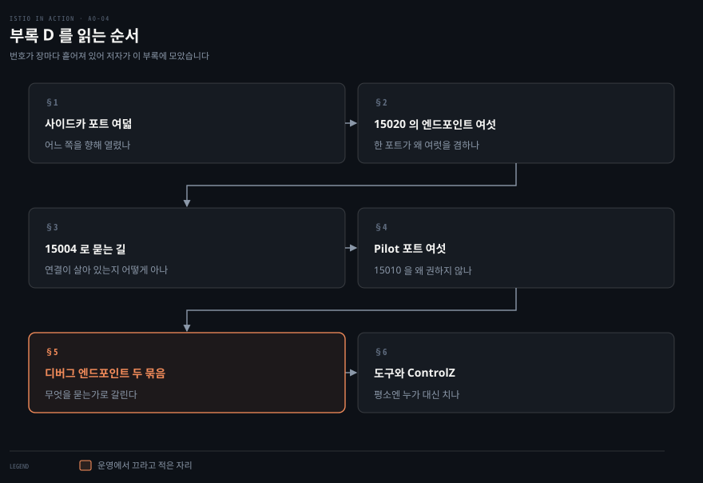
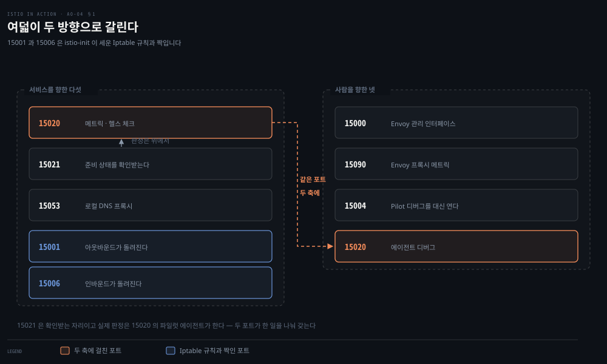
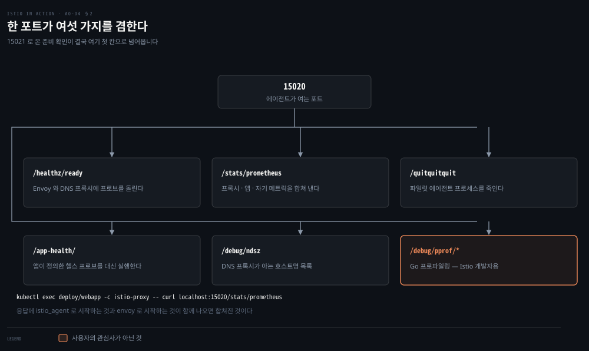
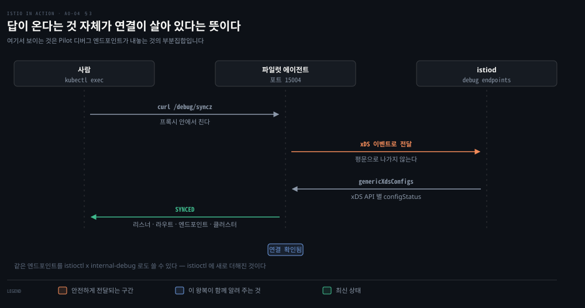
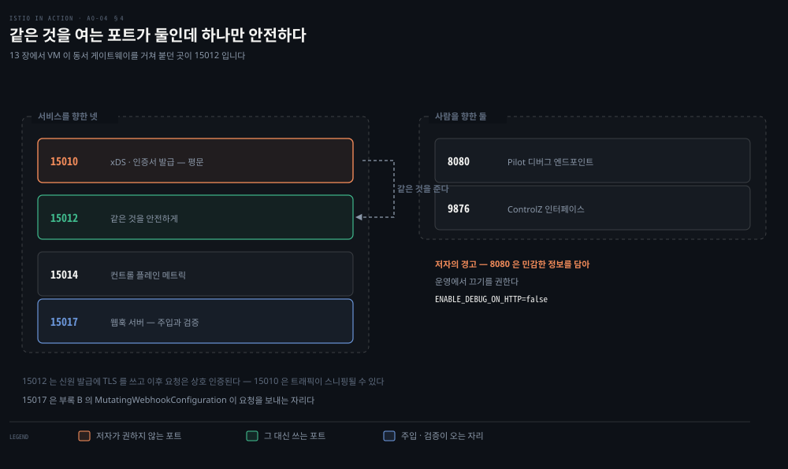
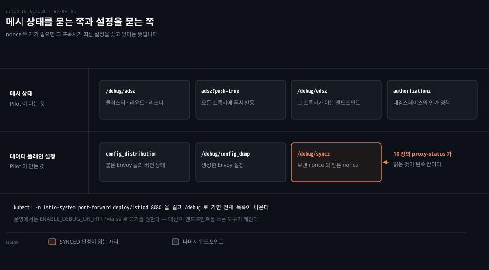
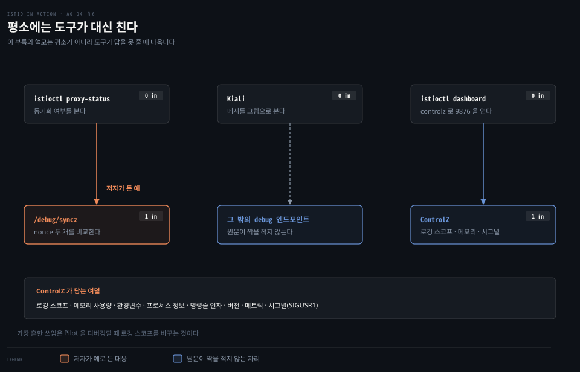

# 부록 — 포트 열넷과 디버그 엔드포인트 지도

---

> 책 전체가 프록시와 Pilot 에 질의를 던지는데 그 포트 번호가 장마다 흩어져 나옵니다. 저자 자신이 그것을 문제로 적고 이 부록에 모았습니다. 이 노트는 그 지도를 한자리에 옮기고, 각 포트가 **누구를 향해** 열려 있는지로 다시 갈랐습니다.


## 핵심 요약

> "These queries are shown on a use-case by use-case basis and are scattered throughout the book, making it difficult for the reader to recall what port 15000, 15020, or any of the other ports are." (부록 D 도입)

저자가 이 부록을 두는 이유를 스스로 적습니다. 앞선 장들이 필요할 때마다 포트를 하나씩 꺼내 썼기 때문에, 읽는 사람이 15000 이 무엇이고 15020 이 무엇인지 떠올리기 어렵다는 것입니다.

모아 놓고 보면 축이 하나 드러납니다. 포트는 **다른 서비스를 향해 열린 것**과 **사람이 들여다보려고 열린 것**으로 갈립니다. 앞쪽은 메시가 돌아가는 데 필요하고, 뒤쪽은 없어도 메시는 돕니다. 이 구분이 실무에서 중요한 이유는 뒤쪽 일부가 민감한 정보를 담고 있어 저자가 운영에서 끄기를 권하기 때문입니다.

에이전트 쪽이 여덟, Pilot 쪽이 여섯입니다. 그중 15020 하나만 두 축에 걸쳐 있습니다.


## 학습 목표

이 문서를 읽고 나면 다음을 할 수 있습니다.

- 사이드카가 여는 포트 여덟을 용도별로 가르고, 어느 것이 Iptable 규칙과 짝인지 말할 수 있습니다.
- 15020 이 왜 여러 기능을 겸하는지, 15021 과 어떻게 협력하는지 설명할 수 있습니다.
- 15020 이 여는 엔드포인트 여섯을 들고, 그중 어느 것이 Istio 개발자용인지 가릴 수 있습니다.
- Pilot 이 여는 포트 여섯을 가르고, 15010 을 권하지 않는 이유를 말할 수 있습니다.
- Pilot 디버그 엔드포인트를 두 묶음으로 나누고, 어느 도구가 그중 무엇을 대신 쓰는지 짚을 수 있습니다.



앞의 셋이 에이전트 쪽이고 뒤의 셋이 Pilot 쪽입니다. 양쪽 다 "서비스를 향한 포트 → 사람을 향한 포트 → 그 안의 엔드포인트" 순서로 내려갑니다.


## 이 문서가 다루지 않는 것

> 각 포트로 무엇을 **하는지**는 해당 장이 맡습니다. 여기서는 번호와 용도의 대응만 세웁니다.

Envoy 관리 인터페이스(15000)로 설정을 읽고 로거 스코프를 바꾸는 실제 절차는 [10장](./10-01.프록시는%20다%20알고%20있고%20사람은%20못%20읽는다.md)이 SSOT 입니다. 저자도 이 부록에서 그쪽을 가리킵니다.

컨트롤 플레인 메트릭(15014)을 어떤 축으로 읽는지는 [11장](./11-01.컨트롤%20플레인의%20성능은%20낡은%20설정의%20수명이다.md)이 맡습니다. 여기서는 그 포트가 그것을 연다는 사실까지입니다.

사이드카 주입 웹훅(15017)의 동작은 [부록 B](./a0-02.부록%20—%20사이드카를%20이루는%20넷과%20VM%20이%20받는%20다섯%20파일.md)가 다룹니다.

`pprof` 프로파일링 엔드포인트의 사용법은 Go 공식 문서 쪽입니다. 저자도 그것이 Istio 개발자용이지 사용자의 관심사가 아니라고 적습니다.


## 1. 사이드카가 여는 포트 여덟

> 하나의 사이드카가 여덟 개를 엽니다. 나열만 하면 압도적이지만 두 축으로 가르면 다섯과 넷으로 정리됩니다.



실제로 세어 보는 명령이 있습니다.

```bash
kubectl -n istioinaction exec -it deploy/webapp \
  -c istio-proxy -- netstat -tnl
```

저자는 그 출력을 보고 "다 나열하면 압도적으로 보일 수 있다"고 적습니다. 그래서 향하는 방향으로 가릅니다.

**다른 서비스를 향해 열린 것 다섯**입니다.

| 포트 | 무엇을 하나 |
|---|---|
| 15020 | Envoy(15090)·애플리케이션·자기 자신의 메트릭을 모아 노출한다 · Envoy 와 DNS 프록시를 헬스 체크한다 · 파일럿 에이전트 디버그 엔드포인트도 연다 |
| 15021 | 사이드카가 주입된 파드가 트래픽 수신 준비를 확인받는 자리 |
| 15053 | istiod 가 설정한 로컬 DNS 프록시 |
| 15001 | 애플리케이션의 아웃바운드 트래픽이 Iptable 규칙으로 리디렉션되는 자리 |
| 15006 | 애플리케이션으로 오는 인바운드가 리디렉션되는 자리 |

**사람이 들여다보려고 열린 것 넷**입니다.

| 포트 | 무엇을 하나 |
|---|---|
| 15000 | Envoy 프록시 관리 인터페이스 |
| 15090 | Envoy 프록시 메트릭 — xDS·커넥션·HTTP·이상값·헬스 체크·서킷 브레이커 통계 |
| 15004 | 에이전트를 통해 Istio Pilot 디버그 엔드포인트를 연다. Pilot 과의 연결 문제를 볼 때 쓴다 |
| 15020 | 파일럿 에이전트 디버그 엔드포인트 |

15020 이 두 표에 다 나오는 것이 눈에 띕니다. 저자도 그 점을 짚고 "여러 기능을 제공한다"며 다음 절에서 따로 봅니다.

15021 과 15020 의 관계도 한 줄로 적혀 있습니다. 파드는 15021 에서 준비 상태를 확인받는데, Envoy 가 그 헬스 체크를 15020 의 파일럿 에이전트로 **넘겨** 실제 판정은 거기서 일어납니다. 두 포트가 하나의 일을 나눠 갖고 있습니다.

15001 과 15006 은 [부록 B](./a0-02.부록%20—%20사이드카를%20이루는%20넷과%20VM%20이%20받는%20다섯%20파일.md)의 `istio-init` 과 짝입니다. init 컨테이너가 세운 Iptable 규칙이 트래픽을 이 두 포트로 돌립니다.


## 2. 15020 이 여는 엔드포인트 여섯

> 한 포트가 준비 판정·메트릭·프로세스 종료·앱 프로브 대행·DNS 목록·프로파일링을 겸합니다.



저자가 나열하는 여섯은 이렇습니다.

`/healthz/ready` 는 Envoy 와 DNS 프록시에 일련의 프로브를 돌려 워크로드가 클라이언트 요청을 처리할 준비가 됐는지 확인합니다. 1절에서 본 15021 이 결국 이 자리로 넘어옵니다.

`/stats/prometheus` 는 Envoy 프록시와 애플리케이션의 메트릭을 자기 것과 **합쳐** 스크랩용으로 노출합니다.

`/quitquitquit` 은 파일럿 에이전트 프로세스를 죽입니다.

`/app-health/` 는 애플리케이션의 헬스 프로브를 대신 실행합니다. 애플리케이션이 쿠버네티스 헬스 프로브를 정의하면 istiod 의 뮤테이팅 웹훅이 그 정보를 뽑아 `ISTIO_KUBE_APP_PROBERS` 환경변수로 사이드카에 설정하고, 에이전트가 그 경로의 질의를 애플리케이션으로 돌립니다.

`/debug/ndsz` 는 istiod 가 **Name Discovery Service**(NDS) API 로 DNS 프록시에 설정한 호스트명 목록을 보여 줍니다. 13장 §5 의 DNS 프록시가 무엇을 아는지 확인하는 자리입니다.

`/debug/pprof/*` 는 Go 프로파일링 엔드포인트입니다. 저자는 이것이 **Istio 개발자에게 유효하지 사용자의 관심사는 아니라고** 못 박습니다.

접근은 `kubectl exec` 로 HTTP 요청을 던지는 것이 가장 쉽습니다.

```bash
kubectl exec deploy/webapp -c istio-proxy -- \
  curl localhost:15020/stats/prometheus
```

응답을 보면 `istio_agent` 로 시작하는 메트릭과 `envoy` 로 시작하는 메트릭이 함께 나옵니다. 에이전트에서 나온 것과 프록시에서 나온 것이 합쳐졌다는 증거입니다.


## 3. 15004 — 에이전트를 거쳐 컨트롤 플레인을 묻는다

> 에이전트가 istiod 의 디버그 엔드포인트 일부를 대신 열어 줍니다. 그 요청은 xDS 이벤트로 안전하게 전달됩니다.



에이전트는 기본적으로 15004 에서 istiod 디버그 엔드포인트 몇을 노출합니다. 그 엔드포인트로 온 요청은 **xDS 이벤트로 istiod 에 안전하게 전달**되고, 그래서 이 경로 자체가 에이전트에서 컨트롤 플레인으로 가는 연결이 살아 있는지 확인하는 좋은 방법이 됩니다.

예로 저자가 드는 것은 워크로드의 동기화 상태를 묻는 일입니다. 프록시 하나에 셸로 들어가 15004 의 `/debug/syncz` 를 칩니다.

```bash
curl -v localhost:15004/debug/syncz
```

응답에는 워크로드 ID 와 함께 `genericXdsConfigs` 가 오고, 그 안에 xDS API 별로 `configStatus` 가 붙습니다. 리스너·라우트 설정·엔드포인트(`ClusterLoadAssignment`)·클러스터 넷이 각각 `SYNCED` 면 최신 상태로 동기화된 것입니다.

여기서 노출되는 정보는 Pilot 디버그 엔드포인트가 내놓는 것의 **부분집합**입니다. 같은 엔드포인트를 `istioctl x internal-debug` 명령으로도 쓸 수 있는데, 저자는 그것을 `istioctl` 에 새로 더해진 것이라고 적습니다.


## 4. Pilot 이 여는 포트 여섯

> istiod 쪽도 같은 축으로 갈립니다. 워크로드를 향한 넷과 사람을 향한 둘입니다.



세어 보는 명령은 같은 모양입니다.

```bash
kubectl -n istio-system exec -it deploy/istiod -- netstat -tnl
```

**서비스를 향한 넷**입니다.

| 포트 | 무엇을 하나 |
|---|---|
| 15010 | xDS API 와 인증서 발급을 **평문**으로 연다. 트래픽이 스니핑될 수 있어 저자가 권하지 않는다 |
| 15012 | 같은 것을 안전하게 연다. 신원 발급에 TLS 를 쓰고 이후 요청은 상호 인증된다 |
| 15014 | 컨트롤 플레인 메트릭 — 11장이 다룬 것들 |
| 15017 | 쿠버네티스 API 서버가 부르는 웹훅 서버. 새 파드에 사이드카를 주입하고 `Gateway`·`VirtualService` 같은 Istio 리소스를 검증한다 |

**디버깅과 인트로스펙션용 둘**입니다.

| 포트 | 무엇을 하나 |
|---|---|
| 8080 | Istio Pilot 디버그 엔드포인트 |
| 9876 | istiod 프로세스의 인트로스펙션 정보 — ControlZ 인터페이스 |

15010 과 15012 의 관계가 이 표의 논점입니다. 둘은 **같은 것을 노출하고** 보안만 다릅니다. 그래서 선택지가 아니라 권고 하나로 정리됩니다 — 15012 를 씁니다. 13장에서 VM 이 동서 게이트웨이를 거쳐 15012 로 붙던 것이 이 포트입니다.

15017 은 [부록 B](./a0-02.부록%20—%20사이드카를%20이루는%20넷과%20VM%20이%20받는%20다섯%20파일.md)의 `MutatingWebhookConfiguration` 이 요청을 보내는 자리입니다. 부록 B 는 "istiod 로 간다"까지 적었고, 그 포트 번호가 여기 있습니다.


## 5. Pilot 디버그 엔드포인트 두 묶음

> 8080 이 여는 엔드포인트는 메시의 상태를 묻는 쪽과 데이터 플레인 설정을 묻는 쪽으로 갈립니다.



접근하려면 istiod 인스턴스 하나를 로컬로 포트포워딩합니다.

```bash
kubectl -n istio-system port-forward deploy/istiod 8080
```

그리고 `http://localhost:8080/debug` 로 가면 전체 목록이 나옵니다.

> **저자의 경고** — 이 디버그 엔드포인트들은 민감한 정보를 담고 있어 노출되면 악용될 수 있습니다. 저자는 **운영에서 끄기를 권하고**, 방법은 설치할 때 `ENABLE_DEBUG_ON_HTTP` 환경변수를 `false` 로 두는 것입니다. 끄면 그 엔드포인트에 의존하는 도구들의 기능이 깨지지만, 앞으로는 이 엔드포인트가 xDS 위에서 안전하게 노출될 예정이라고 덧붙입니다.

**Pilot 이 아는 메시 상태를 묻는 쪽**입니다.

| 엔드포인트 | 무엇을 내놓나 |
|---|---|
| `/debug/adsz` | 클러스터·라우트·리스너 설정 |
| `/debug/adsz?push=true` | 이 Pilot 이 관리하는 모든 프록시에 푸시를 발동시킨다 |
| `/debug/edsz=proxyID=<pod>.<namespace>` | 그 프록시가 아는 엔드포인트 |
| `/debug/authorizationz` | 네임스페이스에 적용된 인가 정책 목록 |

**Pilot 이 아는 데이터 플레인 설정을 묻는 쪽**입니다.

| 엔드포인트 | 무엇을 내놓나 |
|---|---|
| `/debug/config_distribution` | 이 Pilot 인스턴스에 붙은 모든 Envoy 의 버전 상태 |
| `/debug/config_dump?proxyID=<pod>.<namespace>` | 현재 알려진 상태에 따라 생성한 Envoy 설정 |
| `/debug/syncz` | 이 Pilot 이 관리하는 프록시들. 프록시에 보낸 마지막 nonce 와 확인받은 마지막 nonce 를 함께 보인다 |

`/debug/syncz` 의 nonce 두 개가 같으면 그 프록시가 최신 설정을 갖고 있다는 뜻입니다. 10장에서 `proxy-status` 로 본 `SYNCED` 판정의 근거가 이 값입니다.


## 6. 도구가 대신 쓰는 자리와 ControlZ

> 메시 운영자는 보통 이 엔드포인트들을 직접 치지 않습니다. 도구가 대신 칩니다.



저자의 문장이 이 절의 요지입니다. 서비스 메시 운영자로서 보통은 이 엔드포인트들을 Kiali 나 `istioctl` 같은 **다른 도구를 통해 간접적으로** 씁니다. 예로 드는 것이 `istioctl proxy-status` 인데, 그 명령이 프록시들의 동기화 여부를 확인할 때 `/debug/syncz` 엔드포인트를 씁니다.

그다음에 조건이 붙습니다. 도구가 주는 정보로 부족할 때는 디버그 엔드포인트를 직접 파고들 수 있습니다. 즉 이 부록의 쓸모는 평소가 아니라 **도구가 답을 못 줄 때** 나옵니다.

**ControlZ** 는 Istio Pilot 에 함께 딸려 오는 관리용 웹 인터페이스입니다. Pilot 프로세스의 현재 상태를 들여다보고 소소한 설정을 바꿀 수 있습니다.

```bash
istioctl dashboard controlz deploy/istiod.istio-system
```

담고 있는 것은 로깅 스코프, 메모리 사용량(Go 런타임에서 수집), 환경변수, 프로세스 정보, 명령줄 인자, 버전 정보(바이너리와 Go 런타임), 메트릭, 그리고 시그널입니다. 시그널 항목은 도는 프로세스에 `SIGUSR1` 을 보낼 수 있게 합니다.

저자가 꼽는 가장 흔한 쓰임은 하나입니다. **Istio Pilot 을 디버깅해야 할 때 로깅 스코프를 바꾸는 것**입니다. 로깅이 스코프 단위로 정리돼 있어 스코프마다 레벨을 따로 설정할 수 있기 때문입니다. 10장에서 Envoy 쪽 로거 스코프를 바꾼 것과 같은 일을 컨트롤 플레인 쪽에서 하는 자리입니다.


## 결정 치트시트

| 알고 싶은 것 | 어디를 보나 |
|---|---|
| 프록시가 최신 설정을 받았나 | `istioctl proxy-status`, 안 되면 8080 의 `/debug/syncz` |
| 프록시 안에서 그 판정만 보고 싶다 | 프록시의 15004 `/debug/syncz` |
| 프록시가 실제로 무슨 설정을 들고 있나 | 15000 (10장이 SSOT) 또는 8080 의 `/debug/config_dump` |
| 메트릭이 왜 안 나오나 | 15020 의 `/stats/prometheus`, 프록시 쪽만 보려면 15090 |
| 파드가 왜 준비 안 됐다고 나오나 | 15021 → 실제 판정은 15020 의 `/healthz/ready` |
| DNS 프록시가 무슨 이름을 아나 | 15020 의 `/debug/ndsz` |
| 컨트롤 플레인이 느린가 | 15014 (11장이 SSOT) |
| istiod 로그를 더 보고 싶다 | 9876 의 ControlZ 에서 로깅 스코프 변경 |
| 워크로드가 컨트롤 플레인에 붙었나 | 15004 로 질의가 되면 연결이 살아 있다 |


## 적용 관점

> 이 지도에서 실무로 가져갈 규칙 하나와, Spring 쪽에서 견줄 자리를 적습니다.

규칙 하나를 남깁니다. **디버그 엔드포인트는 운영에서 끄되, 끄면 무엇이 깨지는지 먼저 셉니다.** 저자는 `ENABLE_DEBUG_ON_HTTP=false` 를 권하면서 그 엔드포인트에 의존하는 도구들의 기능이 깨진다고 곧바로 덧붙입니다. `istioctl proxy-status` 가 `/debug/syncz` 를 쓰는 것이 바로 그 예입니다. 끄는 결정과 함께 "그러면 동기화 상태를 무엇으로 볼 것인가"를 정해 두지 않으면, 장애가 났을 때 평소 쓰던 명령이 안 먹습니다.

Spring 관점에서 견줄 자리는 Actuator 입니다. 관리 포트를 애플리케이션 포트와 분리하고 엔드포인트를 선택적으로 노출하는 구조가, 여기서 서비스용 포트와 디버그용 포트를 가르고 `ENABLE_DEBUG_ON_HTTP` 로 후자를 여닫는 것과 자리가 같습니다. Spring 쪽 스위치는 `management.server.port` 와 `management.endpoints.web.exposure.include` 입니다.

다만 비유가 멈추는 자리가 있습니다. Actuator 는 애플리케이션이 자기 상태를 내놓는 것이라 애플리케이션이 죽으면 함께 죽습니다. 여기서는 프록시와 컨트롤 플레인이 **애플리케이션과 별개 프로세스**라, 애플리케이션이 아무 말이 없어도 프록시 쪽 포트는 계속 답합니다. 10장이 "프록시는 다 알고 있고 사람은 못 읽는다"고 적은 상황이 그래서 가능합니다.

> 위 문단의 Actuator 대응은 책 밖 보강이고, 원문은 Spring 을 언급하지 않습니다.


## 면접에서 받을 만한 질문
> 답을 먼저 떠올린 뒤 아래 정답 절을 펼칩니다.

1. 사이드카가 여는 포트를 두 축으로 가르면 무엇과 무엇입니까? 그 경계에 걸치는 포트가 하나 있는데 어느 것입니까?
2. 파드의 준비 상태는 15021 에서 확인받는데 실제 판정은 어디서 일어납니까? 왜 그렇게 나눠 두었을까요?
3. 15010 과 15012 는 무엇이 같고 무엇이 다릅니까? 저자의 권고는 무엇입니까?
4. 디버그 엔드포인트를 운영에서 끄라고 하면서 저자가 함께 덧붙이는 단서는 무엇입니까?
5. `/debug/syncz` 가 프록시의 최신 여부를 어떻게 판정합니까?


## 정답 (자답 후 펼치기)

> 위 §면접에서 받을 만한 질문 의 5 개에 *먼저 자답한 뒤* 읽으십시오. 자답 없이 먼저 읽으면 학습 효과가 0 입니다. 질문 번호와 1:1 로 대응합니다.

### 정답 1 — 두 축과 걸치는 포트

**다른 서비스를 향해 열린 것**(15020·15021·15053·15001·15006)과 **사람이 들여다보려고 열린 것**(15000·15090·15004·15020)입니다.

걸치는 포트는 **15020** 입니다. 메트릭을 모아 노출하고 헬스 체크를 하는 서비스용 기능과, 파일럿 에이전트 디버그 엔드포인트라는 인트로스펙션용 기능을 함께 가집니다. 저자도 "여러 기능을 제공한다"고 짚고 따로 한 절을 씁니다.

### 정답 2 — 준비 판정이 일어나는 자리

15020 입니다. 사이드카가 주입된 파드는 15021 에서 준비 상태를 확인받도록 설정되는데, Envoy 가 그 헬스 체크를 15020 의 파일럿 에이전트로 넘기고 실제 판정은 거기서 일어납니다.

왜 그런지는 원문이 적지 않습니다. 다만 15020 이 이미 Envoy 와 DNS 프록시를 헬스 체크하는 자리이므로, 판정 로직이 거기 모여 있는 것으로 읽힙니다.

### 정답 3 — 15010 과 15012

**같은 것을 노출합니다.** xDS API 와 인증서 발급입니다.

다른 것은 보안입니다. 15010 은 평문이라 트래픽이 스니핑될 수 있고, 15012 는 신원 발급에 TLS 를 쓰며 이후 요청은 상호 인증됩니다.

저자의 권고는 15010 을 쓰지 말라는 것입니다. 같은 것을 안전하게 주는 포트가 있으므로 선택지가 아니라 권고 하나로 정리됩니다.

### 정답 4 — 끄라고 하면서 붙이는 단서

**그 엔드포인트에 의존하는 도구들의 기능이 깨진다**는 것입니다.

`istioctl proxy-status` 가 `/debug/syncz` 를 쓰는 것이 그 예입니다. 저자는 다만 앞으로는 이 엔드포인트들이 xDS 위에서 안전하게 노출될 예정이라고 덧붙입니다.

### 정답 5 — syncz 의 판정 근거

**nonce 두 개**입니다. `/debug/syncz` 는 이 Pilot 이 관리하는 프록시들과 함께, 프록시에 보낸 마지막 nonce 와 프록시가 확인해 준 마지막 nonce 를 보입니다. 둘이 같으면 그 프록시가 최신 설정을 갖고 있다는 뜻입니다.


## 핵심 개념 체크리스트

- [ ] 에이전트 포트 여덟과 두 축 — 서비스용 다섯(15020·15021·15053·15001·15006), 인트로스펙션용 넷(15000·15090·15004·15020)
- [ ] 15021 과 15020 의 분업 — 확인받는 자리와 판정하는 자리
- [ ] 15001·15006 과 `istio-init` 의 Iptable 규칙이 짝이라는 것
- [ ] 15020 의 엔드포인트 여섯과 그중 개발자용인 `/debug/pprof/*`
- [ ] 15004 로 던진 질의가 xDS 이벤트로 전달된다는 것
- [ ] Pilot 포트 여섯 — 서비스용 넷(15010·15012·15014·15017), 디버그용 둘(8080·9876)
- [ ] 15010 이 평문이고 15012 가 같은 것을 안전하게 준다는 것
- [ ] 디버그 엔드포인트 두 묶음 — 메시 상태 / 데이터 플레인 설정
- [ ] `ENABLE_DEBUG_ON_HTTP` 와 끄면 깨지는 것
- [ ] ControlZ 의 여덟 항목과 가장 흔한 쓰임(로깅 스코프 변경)


## 관련 문서

- [10장 — 프록시는 다 알고 있고 사람은 못 읽는다](./10-01.프록시는%20다%20알고%20있고%20사람은%20못%20읽는다.md) — 15000 과 로거 스코프의 SSOT
- [11장 — 컨트롤 플레인의 성능은 낡은 설정의 수명이다](./11-01.컨트롤%20플레인의%20성능은%20낡은%20설정의%20수명이다.md) — 15014 가 여는 메트릭의 SSOT
- [부록 — 사이드카를 이루는 넷과 VM 이 받는 다섯 파일](./a0-02.부록%20—%20사이드카를%20이루는%20넷과%20VM%20이%20받는%20다섯%20파일.md) — 15001·15006 과 15017 의 반대쪽
- [정독 인덱스](./README.md)


## 참고 자료

- 《Istio in Action》 부록 D "Troubleshooting Istio components"
- [Istio 배포 요구 사항 — 포트 목록](https://istio.io/latest/docs/ops/deployment/requirements/)
- [Go 프로파일링 문서](https://go.dev/doc/diagnostics#profiling) — 저자가 넘긴 자리
