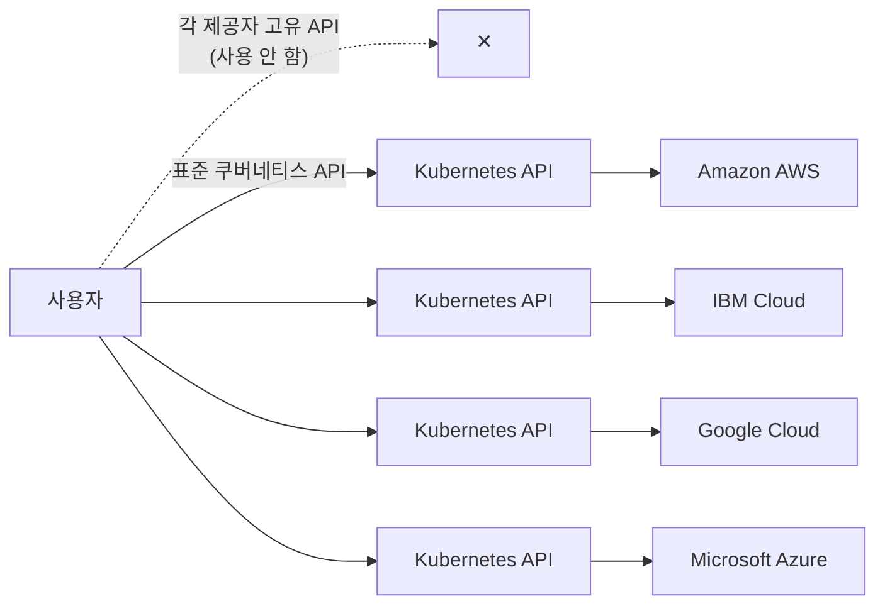
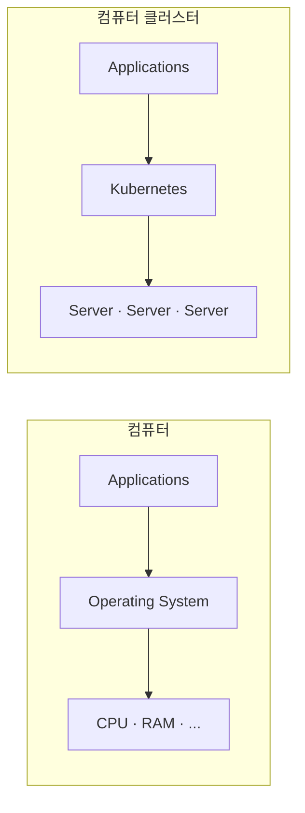
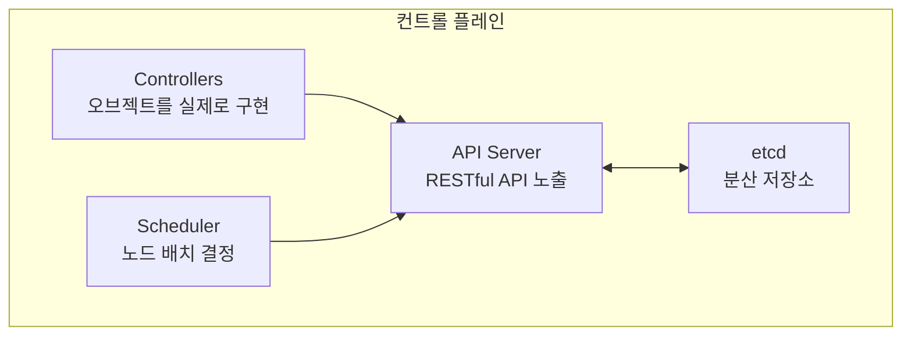
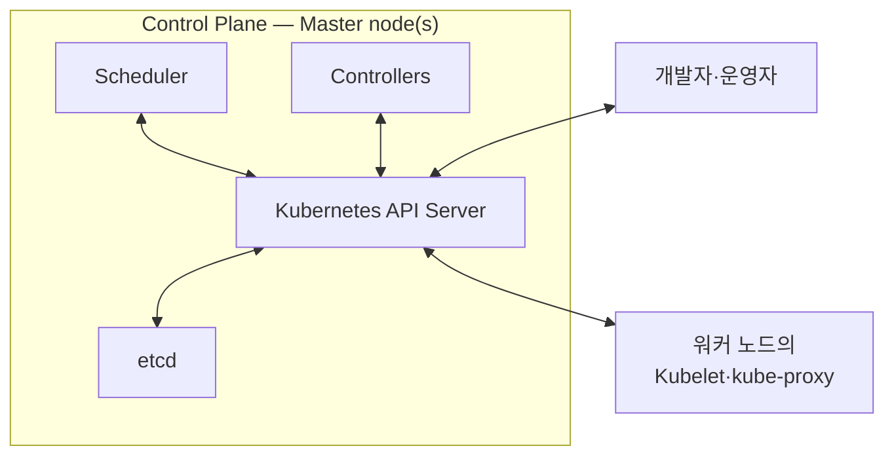
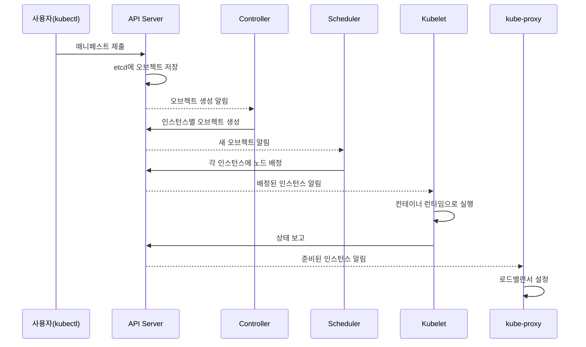

# 쿠버네티스란 무엇인가 — 기원과 아키텍처
---
> 쿠버네티스는 컨테이너로 감싼 애플리케이션 배포·관리를 자동화하는 API와 컨트롤러 집합입니다. 이 편에서는 이 이름이 왜 붙었는지, 왜 이렇게까지 널리 쓰이게 됐는지, 그리고 클러스터 안에서 실제로 어떤 컴포넌트들이 무슨 역할을 나눠 맡는지를 정리합니다.

## 진입 — 이 문서를 읽고 나면 무엇을 할 수 있는가

> 이 문서를 읽고 나면 쿠버네티스가 왜 만들어졌고 무엇을 자동화하는지 한 문단으로 설명하고, 컨트롤 플레인과 워커 노드가 각각 어떤 컴포넌트를 갖고 어떤 역할을 나누는지 그림 없이 말할 수 있습니다.

이 개념은 완전히 새로운 발상이 아닙니다. Docker Compose나 전통적인 VM 관리와 같은 공간에서 동작하되, 사람이 매일 반복하던 일(스케줄링, 재시작, 네트워킹, 설정 배포)을 자동화 범위로 흡수한 것에 가깝습니다. 다만 이 자동화의 단위가 "명령을 순서대로 실행"이 아니라 "원하는 상태를 선언하면 시스템이 알아서 그 상태를 만들고 유지"하는 방식이라는 점이 다릅니다.

## 1. 이름의 유래와 어원

> 쿠버네티스라는 이름은 "조타수"를 뜻하는 그리스어이며, 선장의 지시를 받아 배를 모는 조타수처럼 쿠버네티스도 사람이 정한 방향으로 애플리케이션을 조종합니다.

쿠버네티스(Kubernetes)는 "조타수(helmsman)"를 뜻하는 그리스어입니다. 배를 조종하는 사람이라는 뜻인데, 선장(captain)과는 역할이 다릅니다. 선장은 배 전체의 책임자이고, 조타수는 그 선장의 지시를 받아 실제로 배를 모는 사람입니다.

이 비유는 쿠버네티스가 하는 일과 정확히 겹칩니다. 조타수가 배의 항로를 유지하고, 선장의 지시를 실행하고, 배의 현재 방향을 보고하는 것처럼, 쿠버네티스는 여러분의 애플리케이션을 조종하고 그 상태를 보고하며, 여러분(선장)은 시스템이 어디로 가야 하는지만 결정합니다.

발음은 그리스어 원음으로는 "키에베르니테스"에 가깝지만, 실무 대화에서는 보통 "쿠버네티스" 또는 "쿠버네이테이스"로 부릅니다. 줄여서 **Kube** 또는 **K8s**(케이츠, K와 s 사이 8글자를 생략했다는 뜻)라고도 부릅니다.

## 2. 구글의 사내 시스템에서 오픈소스 프로젝트로

> 쿠버네티스는 하늘에서 뚝 떨어진 설계가 아니라, 구글이 이미 수년간 대규모로 컨테이너를 운영하며 쌓은 경험의 산물입니다.

구글은 2014년 기준으로 매주 20억 개 이상의 컨테이너를 실행한다고 밝힌 바 있습니다. 초당 3,000개가 넘는 컨테이너를 전 세계 수십 개 데이터센터, 수천 대의 컴퓨터에 분산시켜 띄우는 규모입니다. 이 정도 규모를 사람이 수동으로 배치하고 관리하는 것은 애초에 불가능합니다. 자동화가 선택이 아니라 전제 조건이 되고, 이 규모에서는 그 자동화가 거의 완벽에 가까워야 합니다.

이 문제를 풀기 위해 구글은 내부적으로 **Borg**, 그리고 뒤이어 **Omega**라는 시스템을 만들었습니다. 두 시스템 모두 애플리케이션 개발자와 운영자가 수천 개의 소프트웨어 컴포넌트를 관리 가능한 수준으로 다룰 수 있게 도왔습니다. 부수 효과로 인프라 활용률도 크게 개선됐는데, 수십만 대 규모의 장비를 운영하는 조직에서는 활용률 몇 퍼센트 차이가 곧 수백만 달러 단위의 비용 차이로 이어지기 때문에, 이런 시스템을 만들 유인은 명확했습니다.

데이터센터는 시간이 지나며 계속 늘어나고 진화합니다. 새로 짓는 데이터센터는 항상 이전 것과 인프라 구성이 조금씩 다릅니다. 그런데도 애플리케이션을 배포하는 방식 자체는 데이터센터마다 달라지면 안 됩니다. 특히 리전 장애가 서비스 전체 다운타임으로 이어지지 않도록 여러 존·리전에 걸쳐 배포하는 경우에는, 배포 방식의 일관성이 더더욱 중요해집니다.

구글은 Borg·Omega를 개발하며 쌓은 경험을 바탕으로 2014년 **쿠버네티스를 오픈소스로 공개**했습니다. 1.0 버전이 나오기도 전부터 Red Hat을 비롯한 여러 회사가 빠르게 프로젝트에 합류했고, 지금은 CNCF(Cloud Native Computing Foundation, 리눅스 재단 산하) 우산 아래 수십 개 조직과 수천 명이 기여하는 프로젝트로 성장했습니다. CNCF가 주최하는 KubeCon+CloudNativeCon에는 2023년 기준 3만 명 이상이 참가했습니다.

## 3. 왜 이렇게까지 널리 쓰이게 됐는가

> 쿠버네티스의 확산은 기술 자체보다 마이크로서비스 전환·DevOps 협업·클라우드 표준화라는 세 가지 산업 흐름과 맞물린 결과입니다.

쿠버네티스가 널리 채택된 이유는 기술 자체의 우수함만으로는 설명되지 않습니다. 애플리케이션을 개발하는 방식이 바뀐 흐름과 맞물렸기 때문입니다.

1. **마이크로서비스 관리 자동화.** 예전에는 대부분의 애플리케이션이 하나의 프로세스로 묶인 모놀리스였습니다. 배포는 단순했지만, 수평 확장이 거의 불가능해 용량을 늘리려면 하드웨어를 업그레이드(수직 확장)해야 했습니다. 마이크로서비스 패러다임이 들어오면서 모놀리스는 수십에서 수백 개의 독립 프로세스로 쪼개졌고, 각 마이크로서비스는 자기만의 개발·배포 주기를 갖게 됐습니다. 문제는 서비스마다 의존 라이브러리 버전이 달라지면서 같은 OS에서 여러 서비스를 함께 운영하기가 어려워졌다는 점입니다. 컨테이너가 이 문제 자체는 해결해 주지만, 그 대신 관리해야 할 애플리케이션 개수가 폭증합니다. 컴포넌트 100개가 넘는 배포가 흔해진 지금, 자동화된 관리 없이는 이 규모를 감당할 수 없습니다.
2. **개발과 운영의 경계를 좁힘.** 예전에는 개발팀이 소프트웨어를 만들어 운영팀에 "던지고" 나면 그 이후는 운영팀 책임이었습니다. DevOps 패러다임이 자리 잡으면서 두 팀은 소프트웨어 전체 생애주기에 걸쳐 훨씬 밀접하게 협업하게 됐고, 개발팀도 자신이 만든 것이 어떤 인프라 위에서 도는지 알아야 하는 상황이 됐습니다. 개발자 입장에서는 비즈니스 로직 구현에 집중하고 싶지, 서버의 세부 사항까지 다루고 싶지는 않습니다. 쿠버네티스는 그 세부 사항을 감춰 줍니다.
3. **클라우드 사용 방식의 표준화.** 지난 10~20년 사이 많은 조직이 자체 서버에서 클라우드로 이전했습니다. 다만 클라우드 제공자마다 API가 다르므로, 특정 벤더에 종속되지 않으려면 인프라·API를 추상화하는 별도 작업이 필요합니다. 쿠버네티스의 인기가 높아지면서 주요 클라우드 제공자들이 앞다퉈 쿠버네티스를 자사 제품에 통합했고, 그 결과 고객은 표준화된 쿠버네티스 API 하나로 어느 클라우드에든 애플리케이션을 배포할 수 있게 됐습니다. 애플리케이션을 특정 벤더의 고유 API가 아니라 쿠버네티스 API 위에 지으면, 다른 제공자로 옮기는 일도 상대적으로 쉬워집니다.

같은 매니페스트 하나로 AWS든 GCP든 배포할 수 있는 이유가 바로 이것입니다. 각 클라우드 제공자의 고유 API를 직접 배우고 그 위에 배포 로직을 짤 필요 없이, 쿠버네티스 API라는 공통 레이어 하나만 배우면 됩니다.

## 4. 쿠버네티스가 컴퓨터 클러스터를 어떻게 바꾸는가

> 쿠버네티스를 서버 위에 올리는 순간, 그 서버 묶음을 바라보는 관점 자체가 바뀝니다. 개별 컴퓨터가 아니라 하나의 배포 공간이 됩니다.

쿠버네티스는 클러스터용 운영체제에 비유할 수 있습니다. 운영체제가 CPU에 프로세스를 스케줄링하고 애플리케이션과 하드웨어 사이 인터페이스 역할을 하듯이, 쿠버네티스는 분산 애플리케이션의 각 구성 요소를 클러스터 안의 개별 컴퓨터에 스케줄링하고 애플리케이션과 클러스터 사이 인터페이스 역할을 합니다.

왼쪽은 이미 익숙한 그림입니다. 애플리케이션은 운영체제를 거쳐야 CPU·RAM 같은 하드웨어에 닿을 수 있고, 운영체제가 그 사이를 중개합니다. 오른쪽은 이 구조를 컴퓨터 한 대에서 컴퓨터 여러 대(클러스터)로 그대로 확장한 것입니다. 애플리케이션은 개별 서버가 아니라 쿠버네티스를 거쳐 클러스터 자원에 닿고, 어느 서버가 실제로 그 자원을 내주는지는 알 필요가 없습니다.

이 덕분에 애플리케이션 개발자는 다음과 같은 인프라 관련 메커니즘을 직접 구현할 필요가 없어집니다.

1. **서비스 디스커버리** — 애플리케이션이 다른 애플리케이션을 찾아 그 서비스를 이용하게 해주는 메커니즘입니다.
2. **수평 확장** — 부하 변동에 맞춰 애플리케이션 복제본 수를 조절합니다.
3. **로드밸런싱** — 여러 복제본에 부하를 고르게 분산합니다.
4. **셀프힐링** — 실패한 애플리케이션을 자동으로 재시작하고, 노드 자체가 죽으면 다른 정상 노드로 옮겨 시스템을 건강하게 유지합니다.
5. **리더 선출** — 여러 인스턴스 중 하나만 활성 상태로 동작하고, 나머지는 대기하다가 활성 인스턴스가 죽으면 그 자리를 넘겨받는 메커니즘입니다.

클러스터를 실제로 구성할 때는 장비를 **컨트롤 플레인**과 **워커 노드** 두 그룹으로 나눕니다. 컨트롤 플레인 노드는 클러스터를 통제하는 두뇌 역할이고, 워커 노드는 여러분의 애플리케이션(워크로드)이 실제로 도는 워크로드 플레인을 이룹니다. 프로덕션이 아닌 클러스터는 컨트롤 플레인 노드 1대로도 충분하지만, 고가용성을 요구하는 클러스터는 최소 3대의 물리 컨트롤 플레인 노드를 둡니다.

쿠버네티스가 설치되고 나면 개별 컴퓨터를 신경 쓸 필요가 없어집니다. 워커 노드가 몇 대이든, 그 노드들은 애플리케이션을 배포하는 **하나의 공간**이 됩니다. 다만 이것이 "거대한 애플리케이션 하나를 여러 작은 머신에 걸쳐 쪼개 실행"할 수 있다는 뜻은 아닙니다. 각 애플리케이션은 여전히 워커 노드 한 대 안에 들어갈 만큼 작아야 합니다.

실제로 바뀌는 것은 "이 애플리케이션이 어느 노드에 배치되는지는 신경 쓰지 않아도 된다"는 점입니다. 쿠버네티스는 나중에 애플리케이션을 다른 노드로 옮길 수도 있고, 여러분은 그 이동을 눈치채지 못할 수도 있습니다 — 그리고 눈치챌 필요도 없습니다.

## 5. 컨트롤 플레인과 워커 노드의 컴포넌트

> 컨트롤 플레인은 클러스터의 상태를 쥐고 통제하지만 애플리케이션을 직접 실행하지는 않습니다. 실제 실행은 워커 노드의 몫입니다.

컨트롤 플레인은 다음 컴포넌트로 이뤄집니다.

1. **API Server**는 RESTful 쿠버네티스 API를 노출합니다. 클러스터를 쓰는 엔지니어와 다른 쿠버네티스 컴포넌트 모두 이 API로 오브젝트를 만듭니다.
2. **etcd**는 API로 만들어진 오브젝트를 영속화하는 분산 데이터스토어입니다. API 서버 자체는 상태를 갖지 않으므로(stateless), etcd와 직접 대화하는 컴포넌트는 API 서버뿐입니다.
3. **Scheduler**는 각 애플리케이션 인스턴스를 어느 워커 노드에서 실행할지 결정합니다.
4. **Controllers**는 API로 만들어진 오브젝트를 실제로 살아 움직이게 합니다. 대부분은 단순히 다른 오브젝트를 만드는 역할이지만, 일부는 클라우드 제공자 API처럼 외부 시스템과도 통신합니다.

워커 노드에서는 다음 컴포넌트가 함께 돕니다.

1. **Kubelet**은 API 서버와 통신하며 자기 노드에서 도는 애플리케이션을 관리하는 에이전트입니다. 애플리케이션과 노드의 상태를 API로 보고합니다.
2. **컨테이너 런타임**은 Docker이거나 쿠버네티스와 호환되는 다른 런타임이며, Kubelet의 지시에 따라 컨테이너로 애플리케이션을 실행합니다.
3. **kube-proxy**는 애플리케이션 사이의 네트워크 트래픽을 로드밸런싱합니다.

이 외에 DNS 서버, 네트워크 플러그인, 로깅 에이전트 같은 애드온 컴포넌트도 대부분의 클러스터에 들어갑니다. 보통 워커 노드에서 돌지만, 컨트롤 플레인 노드에서 돌도록 설정할 수도 있습니다.

여기서 놓치기 쉬운 구조적 사실이 하나 있습니다. 워커 노드의 컴포넌트는 **API 서버하고만 통신**하고, 서로 직접 통신하지 않습니다. Kubelet도 kube-proxy도 API 서버를 거쳐 오브젝트 상태를 읽고 씁니다.

이 구조가 왜 중요할까요? 컨트롤 플레인 컴포넌트끼리도, 워커 노드 컴포넌트끼리도 **직접 연결되지 않고** 항상 API 서버를 거칩니다. 그래서 API 서버 하나만 고가용성으로 지키면, 나머지 컴포넌트는 각자 API 서버와의 연결만 재시도하면 됩니다. 컴포넌트 사이 직접 연결이 N개씩 얽혀 있었다면 장애 지점이 훨씬 늘어났을 것입니다.

## 6. 애플리케이션을 배포하면 실제로 무슨 일이 일어나는가

> 매니페스트 하나를 제출하는 순간부터, 여러 컴포넌트가 순서대로 반응하며 애플리케이션을 실제로 띄웁니다.

쿠버네티스의 모든 것은 **오브젝트**로 표현됩니다. 오브젝트는 API로 만들고 조회합니다. 애플리케이션은 여러 종류의 오브젝트로 구성되는데, 하나는 애플리케이션 배포 전체를 나타내고, 다른 하나는 애플리케이션의 실행 중인 인스턴스나 그 인스턴스들이 제공하는 서비스를 하나의 IP로 묶어 나타내는 식입니다. 이 오브젝트들은 보통 YAML이나 JSON 형식의 매니페스트 파일 하나 또는 여러 개로 정의합니다.

매니페스트를 제출하면 다음 순서로 일이 진행됩니다.

1. 매니페스트를 API에 제출하면 API 서버가 그 안의 오브젝트들을 etcd에 씁니다.
2. 컨트롤러가 새로 생긴 오브젝트를 감지하고, 애플리케이션 인스턴스마다 새 오브젝트를 만듭니다.
3. 스케줄러가 각 인스턴스에 노드를 배정합니다.
4. Kubelet이 자기 노드에 배정된 인스턴스를 감지하고, 컨테이너 런타임에 지시해 실제로 실행합니다.
5. kube-proxy가 인스턴스가 연결을 받을 준비가 됐음을 감지하고 로드밸런서를 구성합니다.
6. Kubelet과 컨트롤러들은 계속 시스템을 모니터링하며 애플리케이션이 계속 돌도록 유지합니다.

여기서 중요한 것은 컨트롤러 대부분이 **직접 실행하지 않는다**는 점입니다 — API로 다른 오브젝트만 만듭니다. 예를 들어 배포를 담당하는 컨트롤러는 인스턴스 개수만큼 오브젝트를 만들 뿐이고, 실제로 컨테이너를 띄우는 것은 각 노드의 Kubelet입니다. 이 간접성 덕분에 컨트롤 플레인은 특정 노드 장애와 분리돼 계속 클러스터 전체 상태를 조율할 수 있습니다.

## Spring 앱 배포 관점에서

> Spring Boot 앱을 배포하면 이 문서에서 다룬 여섯 단계(매니페스트 제출→오브젝트 생성→스케줄링→Kubelet 실행)가 그대로 재현되며, 애플리케이션 코드는 그 사실을 몰라도 됩니다.

Spring Boot 앱을 배포한다고 하면, 이 여섯 단계는 다음과 같이 나타납니다. `Deployment` 매니페스트를 `kubectl apply`로 제출하면, ReplicaSet 컨트롤러가 지정한 replica 수만큼 Pod 오브젝트를 만들고, 스케줄러가 각 Pod를 워커 노드에 배정하며, Kubelet이 그 노드에서 Spring Boot 애플리케이션이 든 컨테이너를 실제로 시작합니다. 이때 애플리케이션 코드 자체는 자신이 쿠버네티스 위에서 도는지 전혀 몰라도 됩니다 — `application.yml`의 포트 설정과 헬스체크 엔드포인트만 맞춰 두면, 나머지 배치·재시작·트래픽 라우팅은 전부 쿠버네티스가 떠맡습니다.

## 관련 문서

> 이 문서는 쿠버네티스라는 시스템 전체의 기원과 아키텍처를 다룹니다. 실습으로 이어지는 다음 편(도입 판단)과, 이미 정리해 둔 로컬 클러스터·워크로드 개념 노트로 이어집니다.

- [01-02.쿠버네티스 도입 판단](./01-02.%EC%BF%A0%EB%B2%84%EB%84%A4%ED%8B%B0%EC%8A%A4%20%EB%8F%84%EC%9E%85%20%ED%8C%90%EB%8B%A8.md) — 이 책 1장의 나머지 절(온프레미스·클라우드·직접 관리 여부 판단)
- [01-01.로컬 클러스터 구성](../../kubernetes/01_foundation/01-01.%EB%A1%9C%EC%BB%AC%20%ED%81%B4%EB%9F%AC%EC%8A%A4%ED%84%B0%20%EA%B5%AC%EC%84%B1.md) — 이 편에서 설명한 컨트롤 플레인·워커 노드 구조를 실제로 손으로 만들어 보는 편
- [01-02.핵심 워크로드](../../kubernetes/01_foundation/01-02.%ED%95%B5%EC%8B%AC%20%EC%9B%8C%ED%81%AC%EB%A1%9C%EB%93%9C.md) — 이 편에서 다룬 오브젝트 배포 흐름 중 Pod·Deployment·Service의 구체적 동작을 깊게 다룬 편
- [Kubernetes 공식 문서 — Components of Kubernetes](https://kubernetes.io/docs/concepts/overview/components/) — 컨트롤 플레인·노드 컴포넌트의 최신 공식 설명
