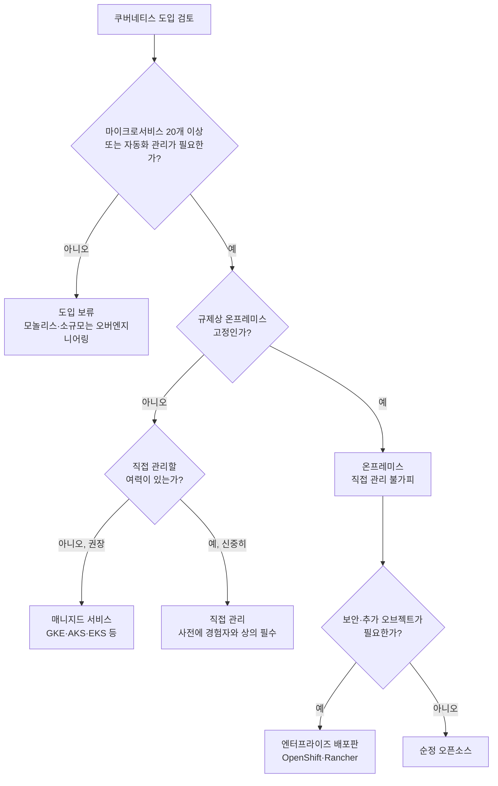

# 쿠버네티스 도입 판단
---
> 쿠버네티스를 조직에 들이기로 했다면, 어디서 돌릴지·누가 관리할지·어떤 배포판을 쓸지, 그리고 애초에 도입이 맞는 선택인지까지 네 갈래의 판단이 남습니다.

## 진입 — 이 문서를 읽고 나면 무엇을 할 수 있는가

> 이 문서를 읽고 나면 온프레미스·클라우드·하이브리드 중 무엇을 고를지, 쿠버네티스를 직접 관리할지 매니지드 서비스를 쓸지, 그리고 팀 규모·마이크로서비스 개수 기준으로 도입 여부를 판단할 수 있습니다.

이 판단은 새로운 기술을 도입할 때 늘 하던 "직접 운영 vs 위탁"의 저울질과 같은 발상입니다. 다만 쿠버네티스는 그 위탁 비용과 직접 운영 난이도의 격차가 유독 크다는 점이 다릅니다.

아래 네 갈래 판단은 서로 독립적이지 않고 순서대로 좁혀집니다. 위치(§1)를 정하면 관리 주체(§2) 선택지가 갈리고, 관리 주체를 정하면 배포판(§3) 선택지가 갈리며, 이 모든 판단에 앞서 애초에 쿠버네티스가 필요한지(§4)를 먼저 자문해야 합니다.

## 1. 온프레미스·클라우드·하이브리드 중 어디서 돌릴 것인가

> 규제·비용·확장성의 조합이 위치를 결정하며, 클라우드의 탄력적 확장과 온프레미스의 통제력을 절충한 하이브리드도 정당한 선택지입니다.

쿠버네티스를 어디에 둘지는 규제·비용·확장성의 조합으로 결정됩니다.

1. **온프레미스** — 규정상 애플리케이션을 사내에서만 돌려야 한다면 사실상 유일한 선택지입니다. 
   - 이 경우 쿠버네티스 자체도 직접 관리해야 하는 경우가 많습니다. 
   - 베어메탈이나 사내 VM 위에서 돌릴 수 있지만, 클라우드 제공 VM만큼 손쉽게 확장하기는 어렵습니다.
2. **클라우드** — 사내 인프라가 없다면 클라우드에서 돌리는 수밖에 없습니다. 
   - 언제든 필요할 때 빠르게 클러스터를 확장할 수 있다는 장점이 있습니다. 쿠버네티스는 클러스터 용량이 부족해지면 클라우드 제공자 API로 VM을 추가로 프로비저닝하도록 요청할 수 있고, 워크로드가 줄면 반대로 VM을 없애 비용을 줄일 수도 있습니다. 
   - 이 탄력성이 클라우드에서 쿠버네티스를 돌리는 가장 큰 이점 중 하나입니다.
3. **하이브리드** — 평소에는 온프레미스에서 돌리되, 사내 데이터센터 용량을 초과하는 순간에만 클라우드로 흘러넘치도록(spill over) 구성할 수 있습니다. 
   - 평소 비용은 VM 대여 없이 낮게 유지하면서, 연중 몇 차례뿐인 트래픽 급증 구간만 클라우드 자원으로 흡수하는 절충안입니다. 
   - 여러 클라우드 제공자에 걸쳐, 또는 온프레미스와 여러 클라우드를 섞어 운영할 수도 있으며, 이때는 컨트롤 플레인을 하나로 두거나 위치마다 따로 둘 수 있습니다.

## 2. 직접 관리할 것인가, 매니지드 서비스를 쓸 것인가

> 조직에 쿠버네티스를 들일 때 가장 중요한 질문은 "직접 관리할 것인가, 남에게 맡길 것인가"입니다.

이미 온프레미스에서 애플리케이션을 운영 중이고 프로덕션급 쿠버네티스 클러스터를 돌릴 하드웨어가 충분하다면, 직접 관리하고 싶은 마음이 먼저 들 수 있습니다. 하지만 쿠버네티스 커뮤니티에 이게 좋은 생각인지 물어보면 거의 예외 없이 "아니오"라는 답을 듣게 됩니다.

앞 편(01-01)에서 본 배포 흐름 그림 자체가 이미 상당한 복잡도를 보여줍니다. 쿠버네티스는 API 서버·etcd·스케줄러·컨트롤러·Kubelet·kube-proxy처럼 그 자체로 여러 컴포넌트가 맞물려 도는 시스템이라 추가 복잡성을 가져오고, 클러스터를 운영하려는 사람은 그 내부 동작을 속속들이 알아야 합니다. 프로덕션급 쿠버네티스 클러스터 관리는 그 자체로 수십억 달러 규모 산업입니다.

직접 관리를 결정하기 전에 이미 이 일을 해 본 엔지니어와 상의해 대부분의 팀이 어떤 문제에 부딪히는지 알아 두는 것이 중요합니다. 그렇게 하지 않으면 스스로 실패를 자초하는 셈이 될 수 있습니다. 다만 프로덕션이 아닌 용도로 쿠버네티스를 시험해 보거나, 매니지드 클러스터를 쓰는 것은 이보다 훨씬 부담이 적습니다.

주요 클라우드 제공자는 대부분 **쿠버네티스-as-a-Service**를 제공합니다. 이들이 쿠버네티스와 그 컴포넌트 관리를 대신 맡아 주므로, 사용자는 다른 API를 쓰듯 쿠버네티스 API만 쓰면 됩니다. 

- 대표적인 매니지드 서비스로는 Google Kubernetes Engine(GKE), Azure Kubernetes Service(AKS), Amazon Elastic Kubernetes Service(EKS), IBM Cloud Kubernetes Service, Red Hat OpenShift Online/Dedicated, VMware Cloud PKS, Alibaba Cloud Container Service for Kubernetes(ACK) 등이 있습니다. 
- 쿠버네티스를 "쓰는 것"은 "관리하는 것"보다 열 배는 쉽습니다.

## 3. 순정 쿠버네티스를 쓸 것인가, 확장 배포판을 쓸 것인가

> 순정은 최신이지만 안정성·보안 기본값이 약하고, 상용 배포판은 그 대신 오브젝트 타입 확장과 경화된 기본값을 제공하는 대가로 업스트림보다 뒤처집니다.

### 3.1 순정 오픈소스 쿠버네티스

순정(vanilla) 오픈소스 쿠버네티스는 커뮤니티가 유지하며 최신 개발 흐름을 가장 먼저 반영합니다. 그만큼 다른 선택지보다 안정성이 떨어질 수 있고, 보안 기본값도 충분하지 않을 수 있습니다. 프로덕션에 쓰려면 상당한 튜닝이 필요합니다.

### 3.2 엔터프라이즈급 배포판

엔터프라이즈급 배포판(OpenShift, Rancher 등)은 더 나은 기본값으로 보안·성능을 높이는 동시에, 순정 API에는 없는 오브젝트 타입을 추가로 제공합니다. 예를 들어 순정 쿠버네티스에는 클러스터 사용자를 표현하는 오브젝트 타입이 없지만, 상용 배포판에는 있습니다. 잘 알려진 서드파티 애플리케이션을 쿠버네티스 위에 배포·관리하는 추가 도구도 함께 제공하는 경우가 많습니다. 다만 이런 확장·경화(hardening) 작업에는 시간이 걸리므로, 상용 배포판은 보통 업스트림 쿠버네티스보다 한두 버전 뒤처집니다.

## 4. 애초에 쿠버네티스를 써야 하는가

> 마이크로서비스 개수(5개 미만/20개 이상 기준)와 학습·초기 비용을 감당할 여력이 도입 여부를 가르는 실질적 기준입니다.

**워크로드가 자동화된 관리를 필요로 하는가**를 가장 먼저 솔직하게 따져야 합니다. 애플리케이션이 커다란 모놀리스 하나라면 쿠버네티스는 거의 필요 없습니다.

마이크로서비스로 나눠 배포하더라도, 그 수가 아주 적다면 쿠버네티스가 최선이 아닐 수 있습니다. 정확한 임계값을 말하긴 어렵지만(다른 요인도 작용하므로), 마이크로서비스가 5개 미만이면 쿠버네티스를 끼워 넣는 것은 대체로 좋은 생각이 아닙니다. 20개가 넘어가면 쿠버네티스 도입에서 확실히 이득을 봅니다. 그 사이 어딘가라면 다음 두 요인을 더 따져야 합니다.

**학습 시간 투자 여유**를 먼저 봐야 합니다. 쿠버네티스는 애플리케이션이 자신이 쿠버네티스 위에서 돈다는 사실조차 모르게 설계돼 있어, 애플리케이션 코드 자체를 수정할 필요는 없습니다. 하지만 개발 엔지니어들도 결국 쿠버네티스 사용법을 배우는 데 상당한 시간을 쓰게 됩니다. 실제로 그 지식이 필요한 쪽은 운영자뿐인데도 그렇습니다 — "운영팀만 쿠버네티스를 배우게 하겠다"고 말해 놓고 개발팀은 배우지 않게 막기는 현실적으로 어렵습니다.

**초기 비용 감당 여력**도 함께 봐야 합니다. 쿠버네티스는 장기적으로 운영 비용을 낮추지만, 도입 초기에는 교육·신규 채용·도구 구축과 구매, 경우에 따라 추가 하드웨어까지 비용이 늘어납니다. 쿠버네티스 자체도 애플리케이션이 쓰는 자원 외에 추가 컴퓨팅 자원을 요구합니다.

## 관련 문서

> 앞 편(01-01)이 쿠버네티스가 무엇이고 어떻게 동작하는지를 다뤘다면, 이 편은 그것을 실제로 도입할지 판단하는 결정 축을 다룹니다.

- [01-01.쿠버네티스란 무엇인가 — 기원과 아키텍처](./01-01.%EC%BF%A0%EB%B2%84%EB%84%A4%ED%8B%B0%EC%8A%A4%EB%9E%80%20%EB%AC%B4%EC%97%87%EC%9D%B8%EA%B0%80%20%E2%80%94%20%EA%B8%B0%EC%9B%90%EA%B3%BC%20%EC%95%84%ED%82%A4%ED%85%8D%EC%B2%98.md) — 이 편에서 전제로 삼는 아키텍처·컴포넌트 설명
- [01-01.로컬 클러스터 구성](../../kubernetes/00_overview/00-01.%EB%A1%9C%EC%BB%AC%20%ED%81%B4%EB%9F%AC%EC%8A%A4%ED%84%B0%20%EA%B5%AC%EC%84%B1.md) — 이 편에서 언급한 "매니지드 vs 직접 관리" 판단 이전에, 학습용으로 로컬에 먼저 띄워 보는 편
- [Manning — Kubernetes in Action, 2nd Edition](https://www.manning.com/books/kubernetes-in-action-second-edition) — 이 책의 공식 페이지
