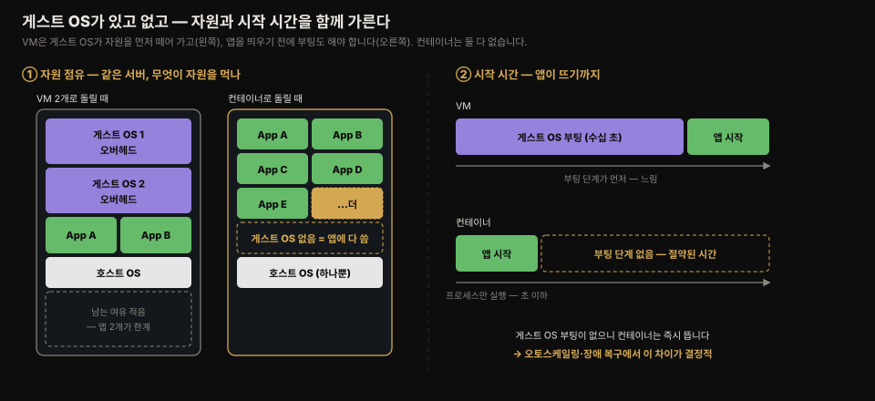
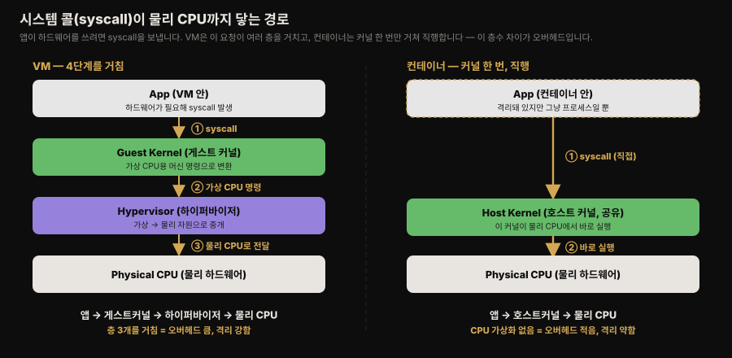
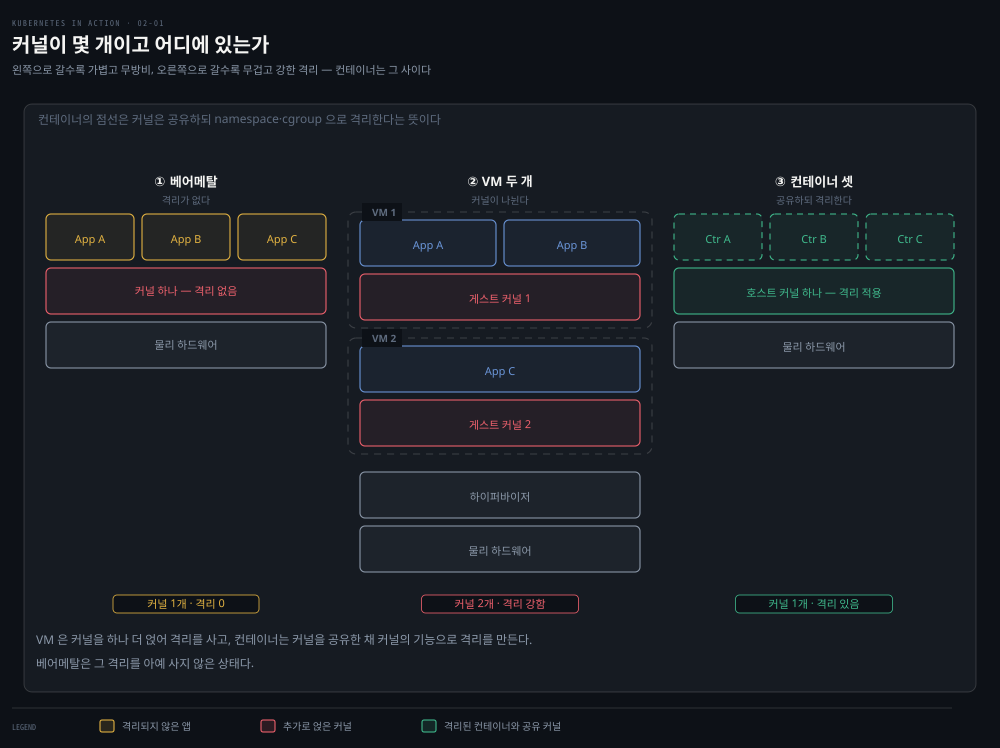
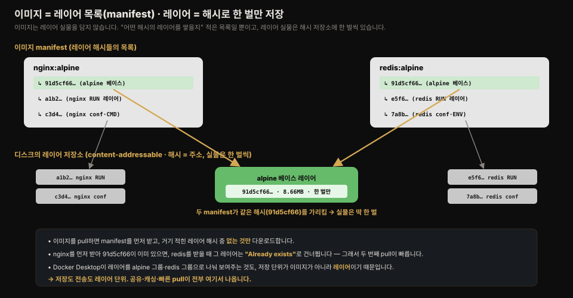
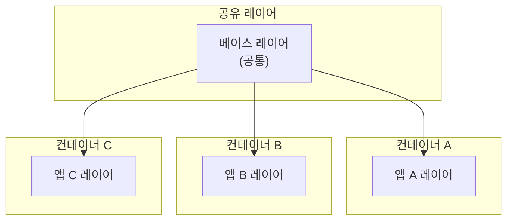
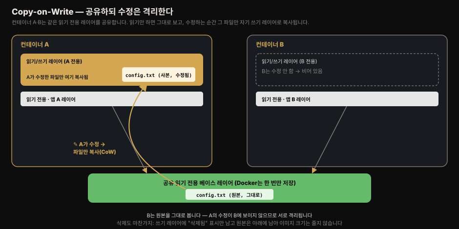
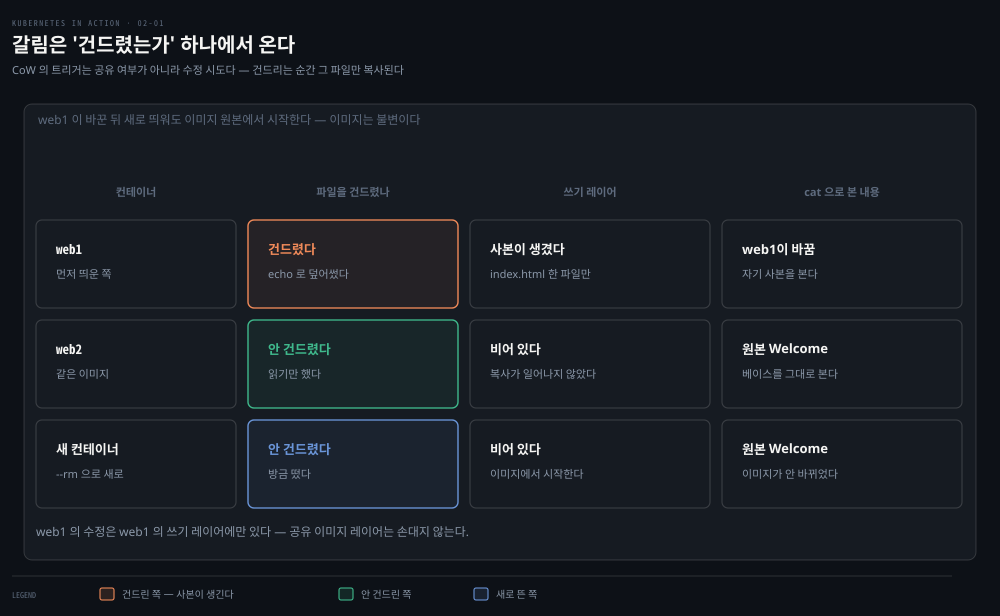
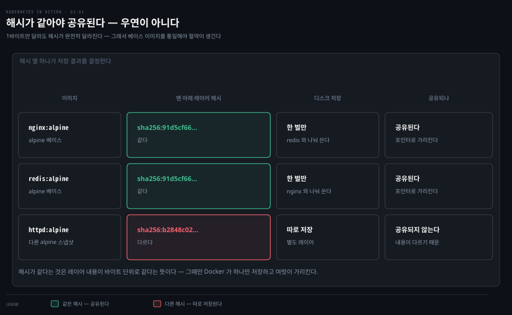

# 컨테이너와 가상머신
---
> 컨테이너는 격리된 프로세스일 뿐, VM처럼 별도의 운영체제를 통째로 띄우지 않습니다. 이 편에서는 그 차이가 자원·시작 시간·격리 수준에서 구체적으로 무엇을 가르는지, 그리고 Docker가 이미지·레지스트리·컨테이너 세 개념으로 이를 어떻게 다루는지 정리합니다.


## 진입 — 이 문서를 읽고 나면 무엇을 할 수 있는가

> 이 문서를 읽고 나면 컨테이너가 VM과 자원·시작 시간·격리 측면에서 왜 다른지 설명하고, 이미지·레지스트리·컨테이너의 관계와 레이어·CoW 메커니즘을 그림 없이 말할 수 있습니다.

이 개념은 완전히 새로운 격리 방식이 아닙니다. 리눅스 프로세스는 원래도 서로 다른 사용자 권한, 메모리 공간을 갖고 격리돼 있었습니다. 컨테이너는 그 격리를 몇 단계 더 밀어붙여서 "파일시스템도, 네트워크도, 호스트명도 나만 보이게" 만든 것에 가깝습니다.


## 1. 마이크로서비스가 VM 하나씩 쓰기 부담스러운 이유

> 마이크로서비스가 수백 개로 늘어나면 서비스마다 VM을 배정하는 방식은 하드웨어 비용과 관리 인력 양쪽에서 감당하기 어려워집니다.

1장에서 마이크로서비스마다 서로 충돌하는 라이브러리 버전을 요구할 수 있다는 문제를 봤습니다. 서비스 몇 개 규모라면 서비스마다 전용 VM을 하나씩 배정하고 각자 자기 운영체제 안에서 돌게 해도 괜찮습니다. 문제는 애플리케이션이 수백 개로 늘어나는 순간입니다. 하드웨어 비용을 낮게 유지하려면 애플리케이션마다 VM 하나씩 배정하기가 버거워집니다.

문제는 하드웨어 자원 낭비만이 아닙니다. VM 하나하나를 개별적으로 설정하고 관리해야 하므로, VM 수가 늘어날수록 필요한 인력과 자동화 시스템의 복잡도도 함께 늘어납니다. 마이크로서비스 아키텍처로의 전환, 즉 배포된 애플리케이션 인스턴스가 수백 개에 이르는 시스템이 늘면서, VM보다 더 적합한 대안을 찾는 흐름이 생겼고 여기서 컨테이너가 등장합니다.


## 2. 컨테이너와 VM의 차이

> 컨테이너는 오버헤드·시작 시간에서 VM을 압도하지만, 커널을 공유하기 때문에 격리 수준은 VM보다 약합니다.

대부분의 개발·운영팀은 이제 개별 마이크로서비스(또는 소프트웨어 프로세스 일반)의 환경을 격리할 때 VM 대신 컨테이너를 선호합니다. 컨테이너는 같은 호스트 컴퓨터에서 여러 서비스를 동시에 돌리면서도 서로 격리된 상태를 유지합니다 — VM과 비슷하지만 오버헤드가 훨씬 적습니다.

> 먼저 용어를 짚습니다. 
>
> - **호스트 OS**는 물리 컴퓨터에 직접 설치돼 도는 운영체제입니다. 
> - **게스트 OS**는 그 위에서 VM 안에 따로 설치돼 도는 운영체제입니다. 
>
> VM 하나를 띄운다는 것은 호스트 OS 위에 게스트 OS를 통째로 하나 더 부팅한다는 뜻이라, 게스트 OS의 커널과 시스템 프로세스가 자원을 별도로 잡아먹습니다. 반면 컨테이너는 게스트 OS 없이 **호스트 OS의 커널을 그대로 공유**하므로, 이 중복이 없습니다 — 컨테이너가 가벼운 근본 이유가 여기 있습니다.

VM은 각각 별도의 운영체제와 여러 시스템 프로세스를 통째로 돌리는 반면, 컨테이너 안의 프로세스는 기존 호스트 운영체제 안에서 그대로 실행됩니다. 

- 운영체제가 하나뿐이므로 중복된 시스템 프로세스가 존재하지 않습니다. 모든 애플리케이션 프로세스가 같은 운영체제에서 돌지만 환경은 격리됩니다 
- 다만 별도 VM으로 돌릴 때만큼 완전하지는 않습니다. 컨테이너 안에서 도는 프로세스 입장에서는, 이 격리 덕분에 자신이 시스템 전체에서 유일한 프로세스인 것처럼 보입니다.

### 오버헤드

VM은 저마다 게스트 OS와 그에 딸린 시스템 프로세스 세트를 통째로 돌립니다. 이 게스트 OS가 사용자 애플리케이션과 무관하게 CPU·메모리를 상당히 잡아먹습니다. 반면 컨테이너는 호스트 OS에서 도는 프로세스 하나일 뿐이라, 이 추가 비용이 없습니다.

같은 물리 서버 두 대를 비교하면 차이가 분명해집니다.

- 한 대는 앱을 **VM 2개**에 나눠 돌립니다. 이 서버는 OS를 셋(호스트 1 + 게스트 2) 돌리므로, 게스트 OS 둘이 자원을 먼저 떼어 갑니다.
- 다른 한 대는 앱마다 **컨테이너**로 돌립니다. 이 서버는 OS를 하나만 돌리므로, 게스트 OS에 쓸 자원이 통째로 남아 **더 많은 앱을 촘촘히** 올릴 수 있습니다.

이 밀도 차이가 곧 비용입니다. VM은 오버헤드 때문에 앱마다 하나씩 내주기 부담스러워 여러 앱을 한 VM에 몰아넣곤 합니다. 컨테이너는 오버헤드가 없으니 앱마다 별도 컨테이너를 자유롭게 만들 수 있습니다.

> 실제로 **한 컨테이너에는 애플리케이션 하나만** 돌립니다. 여러 개를 함께 넣으면 컨테이너 안의 프로세스 관리가 어려워지고, 쿠버네티스를 비롯한 컨테이너 도구 대부분이 "컨테이너 하나 = 애플리케이션 하나"를 전제로 설계돼 있어 이를 거스르면 나중에 문제가 됩니다.

### 시작 시간

같은 이유로 컨테이너는 **시작도 빠릅니다**. VM은 앱을 띄우기 전에 게스트 OS를 먼저 부팅해야 하지만, 컨테이너는 그 부팅 단계가 없습니다. 애플리케이션 프로세스 하나만 시작하면 됩니다. 그래서 VM이 수십 초 걸릴 부팅을 컨테이너는 프로세스 실행 수준(초 이하)으로 끝냅니다 — 오토스케일링이나 장애 복구처럼 "빠르게 새 인스턴스를 띄워야 하는" 상황에서 이 차이가 크게 벌어집니다.



### 격리 수준

자원 활용 면에서는 컨테이너가 확실히 우세하지만, 단점도 있습니다. 

- VM에서 애플리케이션을 돌리면 각 VM이 자기만의 운영체제와 커널을 돌립니다. 그 VM들 아래에는 하이퍼바이저(경우에 따라 추가 운영체제도)가 있어, 물리 하드웨어 자원을 VM마다 더 작은 가상 자원 단위로 쪼갭니다. 
- VM 안에서 도는 애플리케이션은 VM의 게스트 OS 커널에 시스템 콜(syscall)을 보내고, 그 커널이 가상 CPU에서 실행하는 머신 명령은 하이퍼바이저를 거쳐 호스트의 물리 CPU로 전달됩니다.

> 참고 — 하이퍼바이저는 두 종류입니다. **타입 1**은 호스트 OS 없이 직접 하드웨어 위에서 돌고, **타입 2**는 호스트 OS 위에서 돕니다.

반대로 컨테이너는 모두 호스트 OS에서 도는 단일 커널에 시스템 콜을 보냅니다. 이 단일 커널만이 호스트의 CPU에서 명령을 실행하므로, CPU 가상화 자체가 필요 없습니다.



- VM에서는 syscall이 <u>게스트 커널 → 하이퍼바이저 → 물리 CPU</u>의 세 층을 거치지만, 컨테이너에서는 <u>호스트 커널</u> 하나만 거쳐 물리 CPU에 닿습니다. 이 층수 차이가 곧 오버헤드 차이입니다 — 대신 VM은 그 층 덕분에 격리가 더 강합니다.

베어메탈에서 애플리케이션 세 개를 직접 돌리는 경우, VM 두 개에 나눠 돌리는 경우, 컨테이너 세 개에 나눠 돌리는 경우를 비교하면 다음과 같습니다.



- 베어메탈에서는 세 애플리케이션이 같은 커널을 쓰고 전혀 격리되지 않습니다. 
- VM 두 개 사례에서는 애플리케이션 A·B가 같은 VM에서 돌아 커널을 공유하고, 애플리케이션 C는 자기만의 커널을 쓰므로 나머지 둘과 격리됩니다. 
- 컨테이너 세 개 사례에서는 셋 다 같은 커널을 쓰지만 서로 격리돼 있고, 서로의 존재를 알지 못합니다.

이 격리는 커널 자체가 제공합니다. 각 애플리케이션은 물리 하드웨어의 일부만 보고, 같은 OS에서 돌면서도 자신이 그 OS의 유일한 프로세스인 것처럼 동작합니다.

### 컨테이너 격리 - 보안

**보안 관점**을 짚고 넘어가야 합니다. VM이 컨테이너보다 나은 가장 큰 지점은 완전한 격리입니다. VM은 저마다 자기만의 리눅스 커널을 갖지만, 컨테이너는 모두 같은 커널을 씁니다.

- 이는 분명 보안 위험이 될 수 있습니다. **커널에 버그가 있다면, 한 컨테이너의 애플리케이션이 그 버그를 이용해 다른 컨테이너 애플리케이션의 메모리를 읽어낼 수도 있습니다.** 
- 애플리케이션이 서로 다른 VM에서 돌아 하드웨어만 공유한다면 이런 공격의 확률은 훨씬 낮아집니다. 물론 완전한 격리는 물리적으로 분리된 머신에서 애플리케이션을 돌릴 때만 달성됩니다.

컨테이너는 메모리 공간도 공유합니다. 

- VM은 저마다 자기만의 메모리 조각을 쓰는 것과 대비됩니다. 
- 그래서 컨테이너가 쓸 수 있는 메모리양을 제한하지 않으면, 다른 컨테이너가 메모리 부족에 빠지거나 데이터가 디스크로 스왑아웃될 수 있습니다.

### 격리 강도는 스펙트럼입니다 — 컨테이너와 VM 사이

"보안이 중요하니 무조건 VM"이 정답은 아닙니다. 격리 강도와 가벼움은 트레이드오프이고, 그 사이를 메우는 선택지가 있습니다.

- **일반 컨테이너**
  - 가볍지만 호스트 커널을 공유합니다. 커널에 취약점이 있으면 한 컨테이너가 그 버그로 커널 권한을 얻어 다른 컨테이너나 호스트로 **탈출(container escape)**할 수 있습니다. 
  - `--privileged` 옵션 남용이나 `docker.sock` 마운트도 격리를 무너뜨리는 대표적 경로입니다.

- **샌드박스 컨테이너**
  - 컨테이너의 사용성은 유지하면서 커널 경계를 세우는 절충안입니다. 
  - **gVisor**는 앱과 호스트 커널 사이에 유저공간에서 도는 가짜 커널을 끼워, 앱이 호스트 커널을 직접 부르지 못하게 하고 걸러진 syscall만 넘깁니다.
  -  **Kata Containers**는 컨테이너를 경량 VM 안에 넣어 컨테이너마다 진짜 별도 커널을 줍니다. 둘 다 커널 탈출을 근본적으로 막지만, 그만큼 약간의 오버헤드가 생깁니다.

- **VM** — 앱마다 커널이 완전히 분리됩니다. 가장 무겁지만 가장 강한 격리입니다.

> 그래서 금융권처럼 서로 다른 신뢰 경계의 워크로드를 한 물리 서버에 올려야 한다면, "컨테이너로 격리하면 된다"는 **불충분**합니다. 커널 공유가 위협 모델에 걸리므로, VM 분리 또는 gVisor·Kata 같은 샌드박스 컨테이너로 커널 경계를 세워야 합니다. 
>
> 반대로 신뢰할 수 있는 자기 팀 서비스끼리라면 일반 컨테이너로 충분합니다 — 위협 모델에 맞춰 격리 강도를 고르는 것이 핵심입니다.

> 💡 직접 확인 — "커널은 하나, 유저랜드는 제각각"은 명령 두 줄로 실측할 수 있습니다. 
>
> - `docker run --rm alpine uname -r`과 `docker run --rm ubuntu uname -r`은 **같은 호스트 커널 버전**(예: `6.10.14-linuxkit`)을 출력합니다. 반면 `cat /etc/os-release`는 각각 `Alpine Linux`·`Ubuntu`로 **다르게** 나옵니다. 
> - 즉 컨테이너는 이미지마다 다른 유저랜드(파일·명령어·라이브러리)를 입지만 커널은 호스트 것 하나를 공유합니다. "우분투 컨테이너"가 우분투처럼 보이는 건 유저랜드 때문이고, 그 몸통(커널)은 우분투 커널이 아닙니다. 
> - 리눅스 커널 호환성이 좋아 대부분 잘 돌지만, 특정 커널 버전·모듈을 요구하는 앱은 호스트 커널이 맞지 않으면 실패합니다 — 이것이 §4 "이식성의 한계"에서 말하는 커널 함정의 실체입니다.


## 3. Docker 컨테이너 플랫폼

> Docker는 이미지·레지스트리·컨테이너 세 개념으로 애플리케이션과 그 실행 환경 전체를 패키징·배포·실행하는 표준을 만들었습니다.

컨테이너 기술 자체는 오래전부터 있었지만, Docker의 등장과 함께 비로소 널리 알려졌습니다. Docker는 서로 다른 컴퓨터 사이에서 컨테이너를 쉽게 이식할 수 있게 만든 최초의 컨테이너 시스템입니다. 애플리케이션과 그 의존성을 하나의 패키지로 묶어 Docker가 설치된 어느 컴퓨터에든 배포할 수 있게 해줍니다.

### 컨테이너, 이미지, 레지스트리

Docker는 애플리케이션을 패키징·배포·실행하는 플랫폼입니다. 애플리케이션과 그 실행 환경 전체를 함께 패키징할 수 있는데, 여기에는 앱이 필요로 하는 몇 개의 동적 링크 라이브러리만 담길 수도 있고, 운영체제와 함께 보통 딸려 오는 파일 전부가 담길 수도 있습니다. Docker는 이 패키지를 공개 저장소로 다른 Docker 사용 컴퓨터에 배포할 수 있게 해줍니다.


1. **컨테이너 이미지**는 애플리케이션과 그 환경을 담은 패키지 번들입니다. 
   - zip이나 tarball과 비슷하며, 애플리케이션에 필요한 파일시스템 전체와 함께 어떤 실행 파일을 돌릴지·어느 포트를 리스닝할지 같은 메타데이터를 포함합니다.
2. **이미지 레지스트리**는 서로 다른 사람·컴퓨터 사이에서 컨테이너 이미지를 저장하고 공유하는 저장소입니다. 
   - 이미지를 빌드한 뒤 로컬에서 바로 돌릴 수도 있고, 레지스트리에 업로드(push)한 다음 다른 컴퓨터에서 다운로드(pull)할 수도 있습니다. 
   - 어떤 레지스트리는 누구나 pull할 수 있게 공개돼 있고, 어떤 레지스트리는 인증 자격이 있는 개인·조직·컴퓨터만 접근할 수 있게 비공개로 운영됩니다.
3. **컨테이너**는 컨테이너 이미지로부터 만들어져 호스트 운영체제에서 일반 프로세스로 돕니다. 
   - 다만 그 환경은 호스트나 다른 프로세스로부터 격리돼 있습니다. 컨테이너의 파일시스템은 이미지에서 파생되지만, 추가 파일시스템을 컨테이너 안에 마운트할 수도 있습니다. 
   - 컨테이너는 보통 CPU·메모리 같은 특정량의 자원만 할당받고 그 한도를 넘길 수 없습니다.


## 4. 이미지 레이어와 Copy-on-Write

> 이미지는 읽기 전용 레이어를 여러 이미지가 공유하고, 컨테이너마다 자기만의 쓰기 레이어를 갖는 Copy-on-Write로 격리됩니다.

VM 이미지와 달리, 컨테이너 이미지는 여러 이미지에 걸쳐 재사용될 수 있는 얇은 레이어들로 구성됩니다. 이 특성 덕분에 이미지를 효율적으로 전송할 수 있습니다. 다른 이미지의 일부로 이미 다운로드된 레이어가 있다면, 나머지 레이어만 새로 받으면 되기 때문입니다.

레이어는 이미지 배포를 효율적으로 만들 뿐 아니라 이미지의 저장 공간도 줄여 줍니다. Docker는 각 레이어를 단 한 번만 저장합니다. 같은 레이어 집합을 포함하는 이미지 두 개로 만든 컨테이너 두 개는 같은 파일을 공유합니다.

이것이 가능한 이유는 **저장 단위가 이미지가 아니라 레이어**이기 때문입니다. 

- 이미지는 레이어 실물을 통째로 담은 덩어리가 아니라, **"어떤 해시의 레이어를 순서대로 쌓을지" 적은 목록(manifest)**입니다. 
- 레이어 실물은 해시로 식별되는 저장소에 딱 한 벌씩 있고, 여러 이미지의 manifest가 같은 해시 레이어를 함께 가리킵니다(content-addressable, 내용의 해시가 곧 주소).



- Docker Desktop이 `redis:alpine`의 레이어를 `alpine:3.23` 그룹과 `redis:8-alpine` 그룹으로 나눠 "Layers (14)"처럼 보여주는 것도 이 때문입니다
- 저장·조회 단위가 레이어라, 어느 레이어가 어느 베이스에서 왔는지까지 드러납니다. 그래서 이미지를 pull할 때도 manifest를 먼저 받고 **거기 적힌 레이어 중 없는 것만** 다운로드하며, 이미 받아 둔 레이어는 `Already exists`로 건너뜁니다. 저장·전송·공유가 모두 레이어 단위로 이뤄지는 것입니다.



- 컨테이너 A·B는 이미지 레이어 하나를 공유합니다. 즉 애플리케이션 A·B가 같은 파일 일부를 읽습니다. 그리고 이 둘은 컨테이너 C와도 아래쪽 레이어를 공유합니다.

그런데 세 컨테이너가 같은 파일에 접근한다면, 어떻게 완전히 격리될 수 있을까요? 애플리케이션 A가 공유 레이어의 파일을 바꾼 내용이 애플리케이션 B에도 보이지는 않을까요? **그렇지 않습니다.** 이유는 다음과 같습니다.

파일시스템은 **Copy-on-Write(CoW)** 메커니즘으로 격리됩니다. 

- 컨테이너의 파일시스템은 컨테이너 이미지에서 온 읽기 전용 레이어들과, 그 위에 쌓인 추가 읽기/쓰기 레이어로 이뤄집니다. 
- 컨테이너 A에서 도는 애플리케이션이 읽기 전용 레이어 안의 파일을 바꾸면, 그 파일 전체가 컨테이너의 읽기/쓰기 레이어로 복사되고 그 사본에서 내용이 바뀝니다. 각 컨테이너가 자기만의 쓰기 레이어를 가지므로, 공유 파일에 대한 변경은 다른 컨테이너에 보이지 않습니다.



- 핵심은 **"수정하는 순간에만 복사한다"**는 것입니다. A와 B는 같은 읽기 전용 베이스 레이어를 공유하다가, A가 그 안의 `config.txt`를 바꾸는 순간 그 파일만 A의 쓰기 레이어로 복사되고 사본이 수정됩니다. 
- B는 여전히 원본을 보므로, A의 변경이 B에 새어 나가지 않습니다 — 공유로 얻는 효율과 격리를 동시에 얻는 장치입니다.

파일을 삭제하면 읽기/쓰기 레이어에 "삭제됨"으로만 표시될 뿐, 그 아래 레이어에는 여전히 남아 있습니다. 즉 **이미지 크기는 줄지 않습니다**.

> ⚠️ 주의 — 파일 권한이나 소유자를 바꾸는 것처럼 겉보기에 무해한 작업도 파일 전체가 읽기/쓰기 레이어에 새로 복사되는 결과를 낳습니다. 큰 파일이나 많은 파일에 이런 작업을 하면 이미지 크기가 크게 부풀 수 있습니다.

### 실제 확인 — CoW가 실행 중에 일어나는 걸 보기

같은 이미지로 컨테이너 두 개를 띄우고 하나만 파일을 수정하면, 그 변경이 다른 컨테이너와 이미지 원본에 새어 나가지 않는 걸 눈으로 볼 수 있습니다.

```bash
docker run -d --name web1 nginx:alpine
docker run -d --name web2 nginx:alpine

# web1 안에서만 index.html 수정
docker exec web1 sh -c 'echo "web1이 바꿈" > /usr/share/nginx/html/index.html'

docker exec web1 cat /usr/share/nginx/html/index.html   # → web1이 바꿈
docker exec web2 cat /usr/share/nginx/html/index.html   # → 원본 nginx Welcome 페이지
```



- `web1`은 바뀐 내용을, `web2`는 원본 Welcome 페이지를 그대로 봅니다. 같은 이미지에서 나온 두 컨테이너인데 web1의 수정이 web2에 보이지 않는 것은, **수정하는 순간 그 파일만 web1의 쓰기 레이어로 복사**됐기 때문입니다. 
- 이어서 `docker run --rm nginx:alpine cat /usr/share/nginx/html/index.html`로 **새 컨테이너**를 띄워 보면 여전히 원본이 나옵니다 — 이미지 레이어는 읽기 전용이라 web1이 몇 번을 바꿔도 **이미지 자체는 불변**입니다.

> 여기서 CoW의 트리거가 분명해집니다. web1은 파일을 **건드렸기 때문에** 복사가 일어났고, web2는 **건드리지 않아서** 원본을 봅니다. 
>
> 즉 CoW는 "공유라서" 발동하는 게 아니라, **읽기 전용 파일을 수정하려는 시도 그 자체**가 트리거입니다
>
> - 컨테이너가 하나뿐이어도, 이미지 파일을 수정하면 똑같이 복사가 일어납니다. 
> - 앞의 레이어 공유(효율)와 이 CoW(격리)가 합쳐져 "가볍게 나눠 쓰되 서로 섞이지 않는" 컨테이너 파일시스템이 완성됩니다.

### 실제 분석 — `docker history nginx:alpine` 읽기

>  직접 확인 — `docker history nginx:alpine`은 이미지가 어떤 레이어로 쌓였는지 보여줍니다. 
>
> **Dockerfile의 각 명령(`ADD`·`RUN`·`COPY`)이 레이어 하나**를 만들고, 그 명령이 파일시스템에 남긴 변화분이 곧 그 레이어입니다. 
>
> - `ENV`·`CMD`·`EXPOSE`처럼 파일을 안 바꾸는 명령은 **크기 0인 레이어**(메타데이터만)가 됩니다. 
> - `docker inspect <이미지> --format '{{range .RootFS.Layers}}{{println .}}{{end}}'`로는 각 레이어의 `sha256` 해시를 볼 수 있습니다.

> ⚠️ 주의 — 레이어 공유는 **바이트가 완전히 동일한 레이어일 때만** 일어납니다. 
>
> 파일 내용이 1바이트만 달라도 해시가 달라져 다른 레이어로 취급됩니다. 그래서 `nginx:alpine`이 alpine rootfs를 직접 `ADD`했다면, 그 베이스 레이어 해시가 `alpine:latest`와 반드시 같지는 않습니다. 
>
> 저장·전송 절감을 실제로 얻으려면 팀이 **같은 베이스 이미지를 `FROM`으로 통일**해야 합니다 — 제각각이면 "공통 재활용"이 성립하지 않습니다.

alpine 계열 이미지 세 개를 받아 베이스 레이어 해시를 대조하면, 공유가 실제로 일어나는지 눈으로 확인할 수 있습니다.

```bash
# 두 번째·세 번째 pull에서 "Already exists"로 건너뛰는 레이어가 보입니다 (이미 받은 것 재사용)
docker pull nginx:alpine && docker pull redis:alpine && docker pull httpd:alpine

for img in nginx:alpine redis:alpine httpd:alpine; do
  echo "=== $img ==="
  docker inspect $img --format '{{range .RootFS.Layers}}{{println .}}{{end}}' | head -1
done
```

출력의 **맨 아래(첫 번째) 레이어 해시**를 비교하면 이렇게 나옵니다.

```
nginx:alpine  →  sha256:91d5cf66...  ┐ 같다!
redis:alpine  →  sha256:91d5cf66...  ┘ → Docker가 이 레이어를 한 벌만 저장
httpd:alpine  →  sha256:b2848c02...    → 다르다 → 별도 저장
```



여기서 **해시가 곧 레이어의 지문**임이 드러납니다. 

- Docker는 레이어 내용을 SHA256으로 해싱해, **같은 해시 = 같은 내용**으로 보고 디스크에 한 벌만 저장한 뒤 여러 이미지가 그것을 가리키게(포인터) 합니다. 
- nginx와 redis는 같은 alpine 스냅샷을 베이스로 써서 해시(`91d5cf66`)가 같으므로 그 레이어를 공유하고, httpd는 다른 alpine 스냅샷을 써서 해시(`b2848c02`)가 달라 별도로 저장됩니다. 
- 내용이 1바이트만 달라도 해시가 완전히 달라지므로, "공유"는 우연이 아니라 **바이트 단위로 동일할 때만** 성립합니다 — 그래서 팀이 베이스 이미지를 통일해야 이 절약을 실제로 얻습니다.

`docker history`의 출력은 **아래(오래됨)에서 위(최신)** 순으로 쌓인 레이어입니다. 거꾸로(아래→위) 읽으면 빌드 순서가 됩니다.

```bash
IMAGE          CREATED BY                                   SIZE      해설
─────────────────────────────────────────────────────────────────────────
(맨 아래 = 가장 먼저 쌓임)
<missing>      ADD alpine-minirootfs-3.23.5-aarch64.tar.gz   8.66MB   # ← ① alpine 베이스 OS 파일
<missing>      ENV NGINX_VERSION=1.31.2                       0B      # ← 메타데이터 (파일 없음)
<missing>      RUN addgroup ... (nginx 설치)                 4.51MB     # ← ② nginx 유저·패키지 파일
<missing>      COPY docker-entrypoint.sh /                   1.62kB    #┐
<missing>      COPY 10-listen-on-ipv6-by-default.sh ...       2.12kB   # ├ ③ 실행 스크립트
<missing>      COPY 15-local-resolvers.envsh ...              389B     #  │   (각각 별도 레이어)
<missing>      COPY 20-envsubst-on-templates.sh ...           3.03kB   # │
<missing>      COPY 30-tune-worker-processes.sh ...           4.62kB   # ┘
<missing>      ENTRYPOINT ["/docker-entrypoint.sh"]           0B       # ┐
<missing>      EXPOSE map[80/tcp:{}]                          0B       # ├ 실행 메타데이터
<missing>      CMD ["nginx" "-g" "daemon off;"]               0B       # ┘   (전부 0B)
92271ec46f10   RUN /bin/sh -c set -x && apkArch=...           48.4MB   #  ← ④ 아키텍처별 빌드 (가장 큼)
(맨 위 = 가장 나중)
```

이 출력에서 세 가지가 드러납니다.

1. **레이어는 명령의 "결과 파일"을 담습니다.** 
   - `RUN`·`ADD`의 SIZE가 큰 이유는 그 명령이 파일시스템에 실제 파일(OS 파일 8.66MB, nginx 4.51MB, 빌드 산출물 48.4MB)을 만들었기 때문입니다. 
   - 명령어 텍스트 자체는 몇 글자지만, 담기는 건 그 명령이 남긴 파일 전체입니다.
2. **`ENV`·`CMD`·`EXPOSE`·`ENTRYPOINT`는 전부 0B**입니다. 
   - 이들은 "어떻게 실행할지"를 기록하는 설정 메타데이터일 뿐 파일을 만들지 않으므로, 여러 개 있어도 이미지 크기에 영향이 없습니다.
3. **COPY 스크립트 4개가 각각 별도 레이어**입니다(1.62kB·2.12kB·389B·4.62kB). 
   - 이 중 하나만 바뀌어 다시 빌드해도, 무거운 ①②④ 레이어는 캐시에서 재사용되고 바뀐 그 작은 레이어만 새로 빌드·전송됩니다
   - 레이어 분리가 배포를 빠르게 만드는 이유가 여기서 눈에 보입니다.

> 정리하면 **이미지 크기 = 쌓인 파일의 총합**이지 명령 개수가 아닙니다. 
>
> `ENV` 100개를 써도 이미지는 안 무겁고, `RUN apk add` 한 줄이 이미지를 수십 MB 불립니다. 그래서 이미지를 가볍게 하려면 "명령을 줄이는" 게 아니라 "**파일을 적게 남기는**" 방향(불필요한 패키지 제거, `--no-cache`, 멀티스테이지 빌드)으로 가야 합니다.


### 이식성의 한계

이론상 Docker 기반 컨테이너 이미지는 Docker가 설치된 어느 리눅스 컴퓨터에서든 돌 수 있지만, 한 가지 작은 함정이 있습니다. 리눅스 커널 자체는 이미지에 함께 담기지 않기 때문입니다. 컨테이너화된 애플리케이션이 특정 커널 버전을 요구한다면, 모든 컴퓨터에서 동작하지 않을 수 있습니다. 컴퓨터가 다른 버전의 커널을 돌리거나 필요한 커널 모듈을 로드하지 않았다면, 그 애플리케이션은 그 컴퓨터에서 돌 수 없습니다.

커널만이 문제가 되는 것도 아닙니다. 특정 하드웨어 아키텍처용으로 빌드된 컨테이너화 앱은 같은 아키텍처의 컴퓨터에서만 돌 수 있습니다. x86 CPU 아키텍처용으로 컴파일한 애플리케이션을 컨테이너에 담아, Docker가 설치돼 있다는 이유만으로 ARM 기반 컴퓨터에서 돌리려 하면 안 됩니다. 이런 경우에는 x86 아키텍처를 에뮬레이션하는 VM이 필요합니다.


## Spring 앱 배포 관점에서

> 이미지 레이어 분리는 빌드 캐시 효율을, 컨테이너 격리는 JVM의 자원 인식 방식을, 베이스 이미지 선택은 공격 표면을 각각 좌우합니다 — Spring Boot 컨테이너화에서 이 세 가지가 실무적으로 가장 자주 부딪히는 지점입니다.

Spring Boot 애플리케이션을 컨테이너로 패키징할 때, 이미지 레이어 구조는 실제로 빌드 속도에 영향을 줍니다. 

- `spring-boot:build-image`나 buildpacks 기반 빌드는 애플리케이션 의존성(거의 안 바뀜)과 애플리케이션 클래스(자주 바뀜)를 서로 다른 레이어로 분리합니다. 
- 그래서 코드 한 줄만 고쳐 다시 빌드해도, 의존성 레이어는 캐시에서 재사용되고 애플리케이션 클래스 레이어만 새로 빌드·전송됩니다. 레이어를 하나로 뭉쳐 버리면(예: 단순히 fat jar 전체를 COPY) 코드 한 줄 변경에도 이미지 전체를 다시 받아야 해 배포 파이프라인이 느려집니다.

이 편 §2의 **커널 공유 원리**는 JVM 힙 설정에도 영향을 줍니다. 

- JDK 10 이전에는 JVM이 cgroup 자원 제한을 인식하지 못해, 컨테이너 메모리 한도가 512MB여도 JVM이 호스트 전체 메모리를 기준으로 힙을 잡아 OOMKilled로 죽는 사고가 흔했습니다. 
- JDK 10부터 `-XX:+UseContainerSupport`(JDK 11+는 기본값)가 cgroup 한도를 읽어 힙 상한을 자동 계산합니다. `docker run --memory="512m"`로 컨테이너를 제한했다면, JVM도 그 512MB 안에서 힙·메타스페이스·스레드 스택을 나눠 써야 한다는 뜻이고, 이 계산이 어긋나면 컨테이너가 애플리케이션 로그 없이 죽는(exit code 137) 상황이 됩니다.

**베이스 이미지 선택**은 크기뿐 아니라 공격 표면도 좌우합니다. 

- `eclipse-temurin:21-jre-alpine`처럼 JRE만 담은 이미지는 `openjdk:21`(전체 JDK) 대비 이미지가 작고, 컴파일러·디버거 같은 불필요한 도구가 없어 공격 표면이 좁습니다. 
- 더 나아가 Google의 `distroless` 이미지는 셸조차 없애 `docker exec`로 셸을 얻는 침투 경로 자체를 차단합니다 — 다만 그만큼 디버깅이 어려워지므로, 운영 환경과 트러블슈팅용 이미지를 분리하는 팀도 있습니다. 
- 컨테이너를 비루트 사용자로 돌리는 것(`USER` 지시문)도 이 편 §2 "왜 하나의 컨테이너에 앱 하나만" 원칙과 같은 결의 최소 권한 실천입니다.


## 관련 문서

> 이 편은 컨테이너와 VM의 개념적 차이, Docker의 이미지·레지스트리·컨테이너 모델을 다룹니다. 다음 편(02-02)에서 이 개념을 실제 Dockerfile·빌드·실행으로 이어갑니다.

- [02-02.Kiada 애플리케이션 빌드와 배포](./02-02.Kiada%20%EC%95%A0%ED%94%8C%EB%A6%AC%EC%BC%80%EC%9D%B4%EC%85%98%20%EB%B9%8C%EB%93%9C%EC%99%80%20%EB%B0%B0%ED%8F%AC.md) — 이 편의 개념을 실제 Dockerfile 작성·이미지 빌드·컨테이너 실행으로 이어가는 편
- [커널과 컨테이너](../../../02_os/kernel/01-01.%EC%BB%A4%EB%84%90%EA%B3%BC%20%EC%BB%A8%ED%85%8C%EC%9D%B4%EB%84%88.md) — 이 편에서 다룬 "컨테이너=격리된 프로세스"의 커널 메커니즘(네임스페이스·cgroup)을 깊게 다룬 편
- [Docker 공식 문서 — Docker overview](https://docs.docker.com/get-started/docker-overview/) — 이미지·레지스트리·컨테이너 개념의 최신 공식 설명
