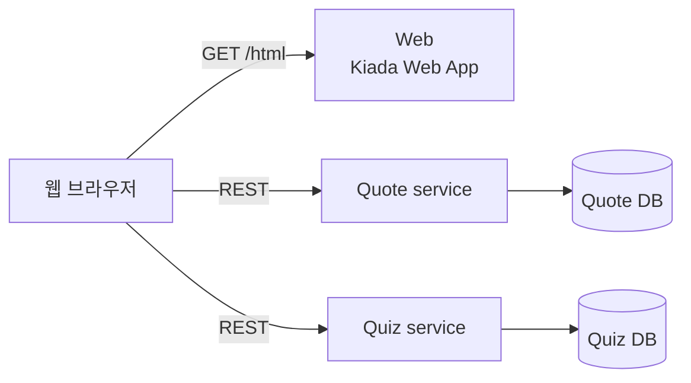
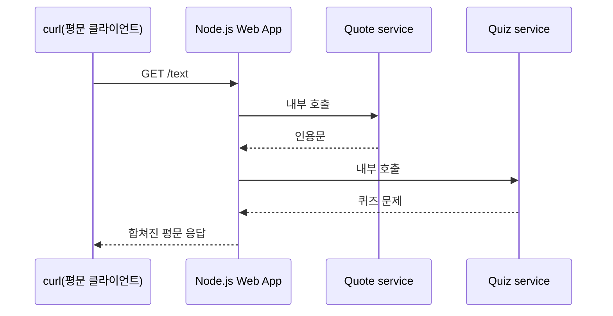
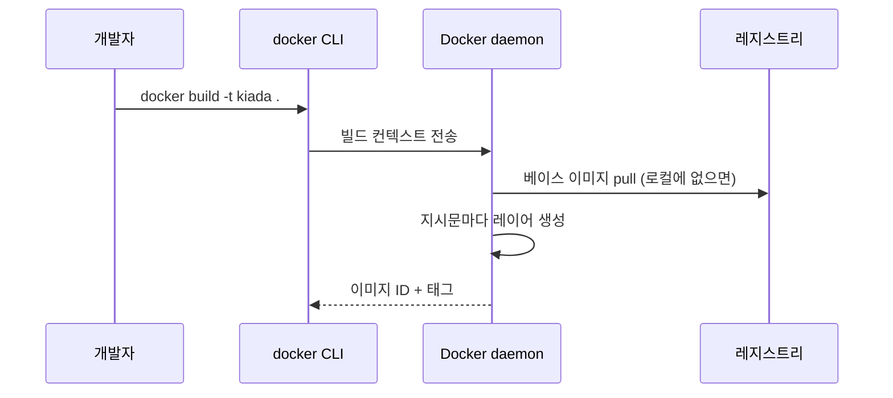

# Kiada 애플리케이션 빌드와 배포
---
> 이 책 전체에서 반복해서 확장할 예제 애플리케이션 Kiada를 소개하고, Docker로 그 첫 버전을 이미지로 빌드해 실행·배포하는 전체 사이클을 손으로 따라갑니다.


## 진입 — 이 문서를 읽고 나면 무엇을 할 수 있는가

> 이 문서를 읽고 나면 Dockerfile을 작성해 이미지를 빌드하고, `docker run`으로 컨테이너를 띄운 뒤 로그·상태를 조회하고, 이미지를 레지스트리에 태그·푸시해 다른 호스트에서 재현할 수 있습니다.

이 개념은 소스 코드를 빌드해 배포 아티팩트를 만들고 저장소에 올리는 익숙한 흐름과 같은 발상입니다. Maven이 소스를 jar로 묶어 Nexus에 올리듯, Docker는 애플리케이션과 그 실행 환경 전체를 이미지로 묶어 레지스트리에 올립니다. 다만 jar가 애플리케이션 코드만 담는 것과 달리, 컨테이너 이미지는 그 코드가 도는 파일시스템 전체를 함께 담습니다.


## 1. Kiada 애플리케이션 소개

> Kiada는 HTML·평문 두 모드를 지원하는 마이크로서비스 예제 앱이며, 두 모드는 Quote·Quiz 서비스를 클러스터 안팎 어디서 호출하는지가 갈립니다.

이 책에서는 예제로 **Kiada**(Kubernetes in Action Demo Application)라는 마이크로서비스 기반 웹 애플리케이션을 만듭니다. 책 인용문, 쿠버네티스 지식을 점검하는 퀴즈, 관련 외부 링크 목록을 보여 주는 앱입니다.

HTML은 Node.js 서버가 서빙하고, 클라이언트 쪽 자바스크립트가 Quote·Quiz라는 두 개의 RESTful 서비스에서 인용문과 퀴즈 문제를 각각 가져옵니다. 브라우저는 세 서비스와 직접 통신합니다. API 게이트웨이가 따로 없는데, 이는 마이크로서비스 아키텍처에 익숙한 독자라면 의아할 수 있습니다. 이 책에서는 쿠버네티스에 여러 서비스를 배포하는 상황(꼭 같은 API 게이트웨이 뒤에 있지 않아도 되는 서비스들)에서 생기는 문제와 해법을 보여 주려는 의도로 게이트웨이를 일부러 넣지 않았습니다.



Kiada는 터미널에서도 쓸 수 있도록 **평문(plain-text) 모드**도 제공합니다. 쿠버네티스는 대부분 터미널로 다루므로, 브라우저와 터미널을 계속 오가지 않아도 되게 하려는 목적입니다. `curl` 같은 도구로 접근하면 응답이 다음과 같은 평문으로 옵니다.

```text
==== TIP OF THE MINUTE
Liveness probes can only be used in the pod's regular containers.

==== REQUEST INFO
Request processed by Kubia 1.0 running in pod "kiada-ssl" on node "kind-worker".
```

여기서 HTML 모드와 평문 모드의 중요한 차이가 하나 있습니다. HTML 모드에서는 브라우저가 Quote·Quiz 서비스를 클러스터 **바깥에서** 직접 호출합니다. 반면 평문 모드에서는 Node.js 애플리케이션이 그 서비스들을 클러스터 **안에서** 대신 호출하고, 그 결과를 하나로 합쳐 응답합니다.



이 차이는 네트워킹 관점에서도 중요합니다. Quote·Quiz 서비스가 평문 모드에서는 클러스터 **내부**에서, HTML 모드에서는 클러스터 **외부**에서 접근되므로, 두 서비스는 내부·외부 양쪽으로 노출돼야 합니다. 이 책의 첫 버전(이 편에서 다루는 버전)은 아직 이 서비스들과 연결되지 않고, 앱 정보와 요청 정보만 보여 줍니다.


## 2. 초기 버전 만들기

> Dockerfile 작성부터 빌드·실행·레지스트리 배포·생명주기 관리까지, Kiada 0.1을 컨테이너 하나로 완성하는 전체 사이클을 다룹니다.

이 편에서 만들 첫 버전은 HTML·평문 모드를 모두 지원하지만, 인용문과 퀴즈는 아직 보여 주지 않습니다. 대신 애플리케이션 버전, 요청을 처리한 서버의 네트워크 호스트명, 클라이언트 IP만 보여 줍니다. 평문 응답은 다음과 같습니다.

```text
Kiada version 0.1. Request processed by "<server-hostname>". Client IP: <client-IP>
```

애플리케이션 소스는 이 책의 GitHub 저장소 `Chapter02/kiada-0.1` 디렉터리에 있습니다. 자바스크립트 코드는 `app.js`, HTML과 그 외 리소스는 `html/` 서브디렉터리에 있습니다. Node.js를 로컬에 설치해 직접 테스트할 수도 있지만, 이미 Docker가 설치돼 있으니 컨테이너 이미지로 패키징해 컨테이너에서 돌리는 편이 더 낫습니다. 이렇게 하면 아무것도 별도로 설치할 필요가 없고, 다음 장에서 쿠버네티스로 같은 이미지를 그대로 재사용할 수 있습니다.

### Dockerfile 작성

이미지로 패키징하려면 `Dockerfile`이라는 파일이 필요합니다. 이 파일은 이미지를 빌드할 때 Docker가 순서대로 수행할 지시문 목록을 담습니다.

```dockerfile
FROM node:23-alpine
COPY app.js /app.js
COPY html/ /html
ENTRYPOINT ["node", "app.js"]
```

- `FROM` — 베이스 이미지를 지정합니다. `node:23-alpine`은 Node.js 실행에 필요한 것을 이미 다 담고 있으므로, Fedora·Ubuntu 같은 배포판 이미지를 받아 Node.js를 처음부터 설치하는 것보다 낫습니다. 조직에 따라 특정 베이스 이미지 사용이 정책으로 강제되는 경우도 있습니다.
- `COPY` — 로컬 디렉터리의 파일을 이미지의 루트 디렉터리로 복사합니다. `app.js`와 `html/` 두 줄이 각각 애플리케이션 코드와 정적 리소스를 담습니다.
- `ENTRYPOINT` — 컨테이너를 시작할 때 실행할 명령을 지정합니다. 여기서는 `node app.js`입니다.

### 이미지 빌드

`Dockerfile`, `app.js`, `html/` 디렉터리만 있으면 이미지를 빌드할 수 있습니다.

```bash
# -t 는 이미지 이름:태그, 마지막 . 은 빌드 컨텍스트(현재 디렉터리)
docker build -t kiada:latest .
```

빌드 과정에서 Docker는 베이스 이미지(`node:23-alpine`)를 로컬에 없으면 pull하고, 그 이미지로 컨테이너를 만들어 `Dockerfile`의 다음 지시문을 차례로 실행합니다. 각 지시문이 새 이미지 레이어 하나를 만들고, 마지막 이미지에 `-t`로 지정한 태그가 붙습니다.



빌드는 `docker` CLI 도구가 직접 수행하지 않습니다. 현재 디렉터리 전체 내용이 Docker daemon으로 업로드되고, 실제 빌드는 daemon이 합니다. macOS·Windows에서는 CLI가 호스트 OS에 있고 daemon은 리눅스 VM 안에서 돕니다. 원격 컴퓨터의 daemon을 쓸 수도 있습니다.

> ⚠️ 주의 — 빌드 디렉터리에 불필요한 파일을 두지 않아야 합니다. daemon이 원격에 있다면 빌드 속도가 특히 느려집니다.

이미지의 레이어를 확인하려면 `docker history`를 씁니다. `COPY`·`ENTRYPOINT` 지시문마다 새 레이어가 생겼고, 그 아래는 베이스 이미지의 레이어들입니다.

```bash
docker history kiada:latest
```

> ⚠️ 주의 — 각 지시문이 새 레이어를 만들므로, 파일을 지워도 새 레이어에 "삭제됨"으로만 표시될 뿐 아래 레이어에는 남습니다. `RUN` 지시문으로 만든 임시 파일은 그 **같은** `RUN` 지시문 안에서 지워야 합니다. 다음 `RUN` 지시문에서 지우면 이미지 크기를 줄이는 효과가 없습니다.

### 컨테이너 실행

```bash
docker run --name kiada-container -p 1234:8080 -d kiada
```

- `--name kiada-container` — 컨테이너 이름을 지정합니다.
- `-p 1234:8080` — 호스트 포트 1234를 컨테이너 포트 8080에 매핑합니다. `http://localhost:1234`로 접근할 수 있게 됩니다.
- `-d` — 컨테이너를 백그라운드(detached)로 돌립니다.

```bash
curl localhost:1234
# Kiada version 0.1. Request processed by "44d76963e8e1". Client IP: ::ffff:172.17.0.1
```

여기 나온 `44d76963e8e1`은 컨테이너의 호스트명이자 컨테이너 ID입니다. 실행 중인 컨테이너 목록은 `docker ps`, 더 자세한 정보는 `docker inspect`, 표준 출력·오류로 남긴 로그는 `docker logs`로 확인합니다.

```bash
docker ps
docker inspect kiada-container
docker logs kiada-container
```

### 이미지 배포

지금까지 빌드한 이미지는 로컬에만 있습니다. 다른 컴퓨터에서 돌리려면 먼저 외부 이미지 레지스트리로 push해야 합니다. Docker Hub 같은 공개 레지스트리를 쓰면 별도로 프라이빗 레지스트리를 구축할 필요가 없습니다.

```bash
# 1. Docker Hub 네이밍 규칙에 맞춰 재태깅 (yourid는 본인 Docker Hub ID)
docker tag kiada luksa/kiada:0.1

# 2. 로그인 후 push
docker login -u yourid docker.io
docker push luksa/kiada:0.1

# 3. 다른 호스트에서 그대로 실행
docker run --name kiada-container -p 1234:8080 -d luksa/kiada:0.1
```

`docker tag`로 태그를 추가해도 이미지가 두 개가 되는 것이 아닙니다. `docker images`로 확인하면 `kiada`와 `luksa/kiada:0.1` 둘 다 같은 이미지 ID를 가리킵니다 — 이름만 두 개인 이미지 하나입니다.

### 컨테이너 생명주기

```bash
docker stop kiada-container    # 정지 — 종료 신호 전송, 응답 없으면 kill
docker start kiada-container   # 재개 — 정지된 상태 그대로 다시 시작
docker rm kiada-container      # 삭제 — 상태 완전 제거, 이미지는 그대로 남음
docker rmi kiada:latest        # 이미지 삭제 — 디스크 공간 회수
```

`docker stop`은 컨테이너 안의 메인 프로세스에 종료 신호를 보내 정상 종료를 유도합니다. 프로세스가 응답하지 않거나 제때 종료하지 않으면 Docker가 강제로 kill합니다. 컨테이너는 삭제되기 전까지는 멈춘 상태로 남아 있으므로, `docker start`로 다시 시작할 수 있습니다. `docker rm`은 컨테이너 자체를 완전히 지우지만, 그 컨테이너가 쓰던 이미지는 디스크에 그대로 남아 있어 다시 컨테이너를 만들 때 재사용됩니다.


## Spring 앱 배포 관점에서

> Kiada의 단일 Dockerfile 패턴은 Spring Boot에서 멀티스테이지 빌드로 확장되고, `docker run`의 헬스체크·레지스트리 push 흐름은 실무의 CI 파이프라인·프라이빗 레지스트리로 그대로 이어집니다.

Kiada가 Node.js 앱을 위해 `node:23-alpine`을 베이스로 삼듯, Spring Boot 앱은 보통 `eclipse-temurin:21-jre-alpine` 같은 JRE 이미지를 베이스로 씁니다. 이 편의 Dockerfile은 `FROM`·`COPY`·`ENTRYPOINT` 세 줄로 끝나지만, Spring Boot는 보통 **멀티스테이지 빌드**를 씁니다.

```dockerfile
# 1단계: Gradle/Maven으로 빌드 (빌드 도구·소스는 최종 이미지에 남지 않음)
FROM eclipse-temurin:21-jdk-alpine AS build
WORKDIR /workspace
COPY . .
RUN ./gradlew bootJar

# 2단계: JRE만 담은 이미지에 결과물만 복사
FROM eclipse-temurin:21-jre-alpine
COPY --from=build /workspace/build/libs/*.jar /app.jar
ENTRYPOINT ["java", "-jar", "/app.jar"]
```

1단계는 Gradle·소스 코드·중간 산출물까지 다 담긴 무거운 이미지지만, `COPY --from=build`로 최종 이미지에는 jar 파일 하나만 넘어갑니다. 최종 이미지에 빌드 도구가 남지 않아 이미지가 작아지고, 공격 표면도 줄어듭니다. 의존성·클래스 레이어 분리(캐시 효율)는 02-01 §Spring 앱 배포 관점에서 다룬 내용과 이어집니다.

`docker run --name kiada-container -p 1234:8080 -d kiada`처럼 컨테이너를 띄운 뒤 이 책은 `curl`로 상태를 확인했지만, Spring Boot는 Actuator의 `/actuator/health` 엔드포인트로 애플리케이션이 실제로 요청을 받을 준비가 됐는지 확인합니다. `docker run`에 `--health-cmd="curl -f localhost:8080/actuator/health || exit 1"`을 추가하면 `docker ps`의 `STATUS` 열에 `healthy`/`unhealthy`가 나타나, 이 편의 "컨테이너가 Running이면 끝" 가정과 달리 애플리케이션 준비 상태까지 검증됩니다.

이 편은 Docker Hub에 `docker push`하는 흐름을 보여 주지만, 실무 조직에서는 대개 사내·클라우드 프라이빗 레지스트리(ECR, GCR, Harbor, Nexus 등)를 씁니다. 태깅 규칙도 `luksa/kiada:0.1`처럼 사용자 ID 기반이 아니라, `harbor.internal/team/kiada:${GIT_SHA}`처럼 커밋 해시나 CI 빌드 번호를 태그에 박아 어느 이미지가 어느 커밋에서 왔는지 추적 가능하게 만드는 경우가 많습니다.


## 관련 문서

> 이 편은 컨테이너와 이미지 개념(02-01)을 실제 Dockerfile·빌드·실행·배포로 이어가는 실습 편입니다. 다음 편(02-03)에서는 이 컨테이너가 내부적으로 어떤 커널 메커니즘으로 격리되는지를 다룹니다.

- [02-01.컨테이너와 가상머신](./02-01.%EC%BB%A8%ED%85%8C%EC%9D%B4%EB%84%88%EC%99%80%20%EA%B0%80%EC%83%81%EB%A8%B8%EC%8B%A0.md) — 이 편에서 실습한 이미지·레지스트리·컨테이너 개념을 다룬 편
- [02-03.네임스페이스와 cgroup으로 보는 컨테이너 격리](./02-03.%EB%84%A4%EC%9E%84%EC%8A%A4%ED%8E%98%EC%9D%B4%EC%8A%A4%EC%99%80%20cgroup%EC%9C%BC%EB%A1%9C%20%EB%B3%B4%EB%8A%94%20%EC%BB%A8%ED%85%8C%EC%9D%B4%EB%84%88%20%EA%B2%A9%EB%A6%AC.md) — 방금 실행한 컨테이너가 커널 안에서 어떻게 격리되는지 다루는 다음 편
- [Kubernetes in Action 2판 예제 코드 (luksa/kubernetes-in-action-2nd-edition)](https://github.com/luksa/kubernetes-in-action-2nd-edition) — Kiada 앱 소스(`Chapter02/kiada-0.1`)
