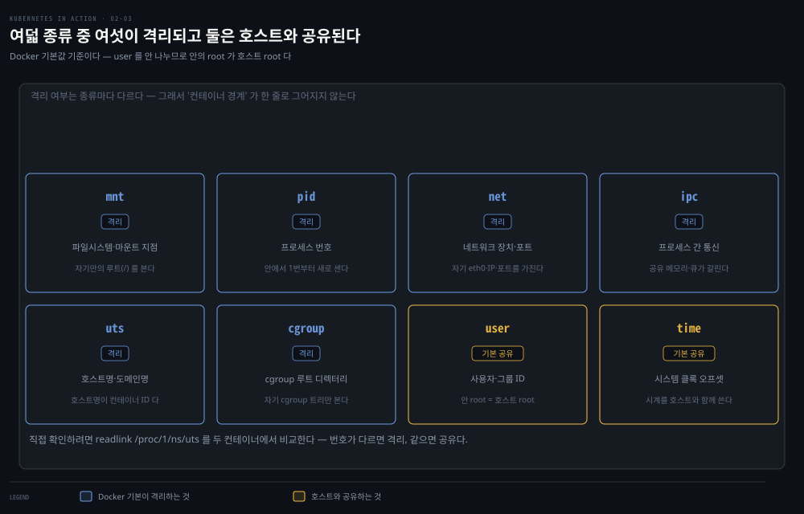
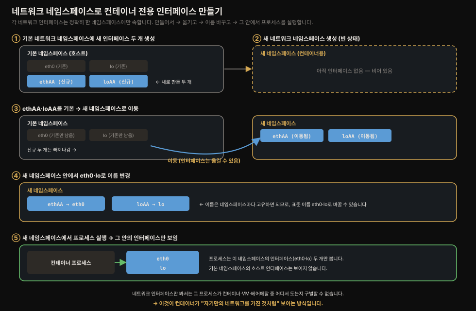
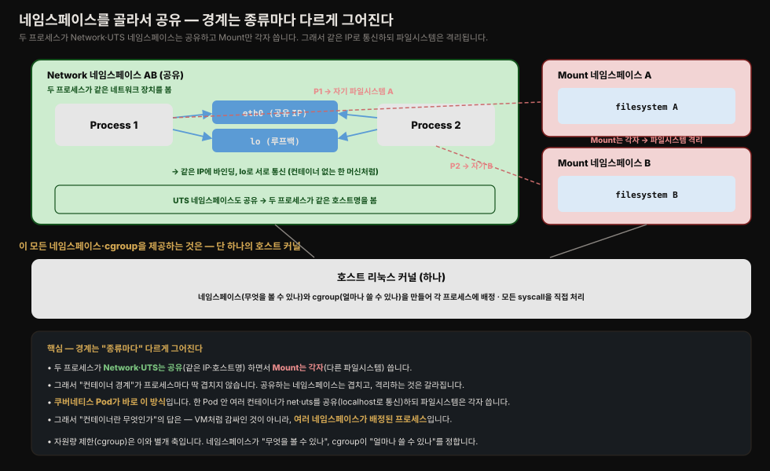
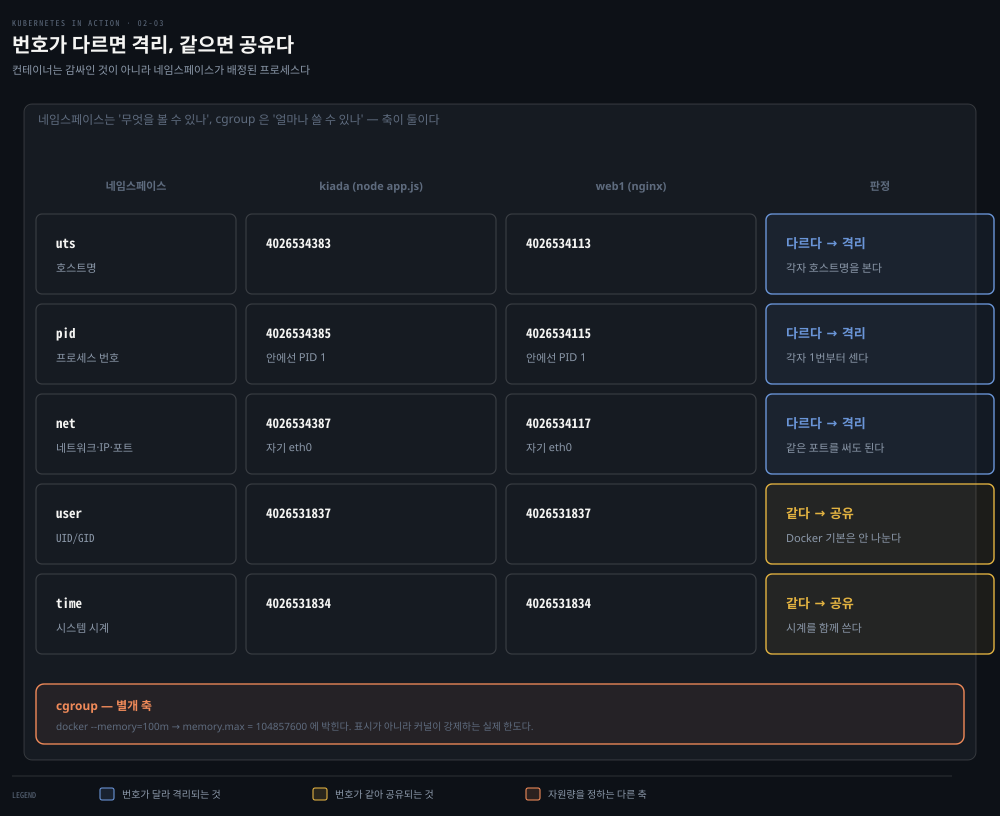
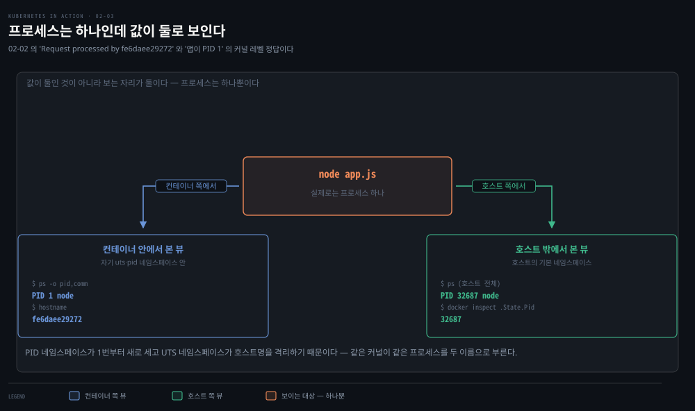

# 네임스페이스와 cgroup으로 보는 컨테이너 격리
---
> 앞 두 편에서 "컨테이너는 격리된 프로세스일 뿐"이라고 여러 번 말했습니다. 이 편에서는 그 격리가 리눅스 커널의 어떤 기능으로 실제 구현되는지, 이 책이 짚는 범위 안에서 정리합니다.


## 진입 — 이 문서를 읽고 나면 무엇을 할 수 있는가

> 이 문서를 읽고 나면 네임스페이스가 컨테이너에 "자기만의 시스템"이라는 착각을 어떻게 만드는지, **cgroup**이 자원 사용량을 어떻게 제한하는지, 그리고 두 메커니즘만으로는 왜 완전한 격리가 아닌지 설명할 수 있습니다.

이 개념은 리눅스 프로세스가 원래 갖고 있던 격리(자기만의 메모리 공간, 사용자 권한)를 몇 단계 더 세분화한 것입니다.

- 프로세스는 이미 다른 프로세스의 메모리를 직접 들여다볼 수 없었습니다.
- 네임스페이스는 여기에 "파일시스템도, 네트워크 인터페이스도, 호스트명도 나만 보이게"를 추가하는 발상입니다.


## 1. 리눅스 네임스페이스 — 프로세스마다 다른 시스템 뷰

> 네임스페이스는 리눅스 시스템 자원을 8종류로 쪼개 프로세스마다 다른 뷰를 보여 주며, 일부 네임스페이스만 골라 공유하면 "컨테이너"라는 경계 자체가 유연해집니다.

**리눅스 네임스페이스**(커널 네임스페이스라고도 함)는 각 프로세스가 시스템을 자기만의 뷰로 보게 만듭니다. 컨테이너 안에서 도는 프로세스는 시스템의 파일·프로세스·네트워크 인터페이스 일부만 보고, 시스템 호스트명조차 다르게 봅니다 — 별도 VM에서 도는 것처럼요.

원래 리눅스 OS의 모든 시스템 자원(파일시스템, 프로세스 ID, 사용자 ID, 네트워크 인터페이스 등)은 모든 프로세스가 함께 보고 쓰는 하나의 그릇에 담겨 있습니다. 리눅스 커널은 이 자원들을 **네임스페이스**라는 더 작은 그릇으로 나누고, 각 그릇을 프로세스 하나 또는 그룹에만 보이게 할 수 있습니다.

이 책이 언급하는 네임스페이스 종류는 다음과 같습니다.

1. **Mount(mnt)** — 마운트 지점(파일시스템)을 격리합니다.
2. **Process ID(pid)** — 프로세스 ID를 격리합니다.
3. **Network(net)** — 네트워크 장치·스택·포트를 격리합니다.
4. **IPC(ipc)** — 프로세스 간 통신(메시지 큐, 공유 메모리 등)을 격리합니다.
5. **UTS** — 시스템 호스트명과 NIS 도메인명을 격리합니다.
6. **User(user)** — 사용자·그룹 ID를 격리합니다.
7. **Time** — 컨테이너마다 시스템 클록에 다른 오프셋을 줄 수 있습니다.
8. **Cgroup** — cgroup 루트 디렉터리를 격리합니다.

> 이 8종류의 세부 동작과 `unshare` 실습은 [namespace 실습 — 8가지 격리와 unshare](../../../02_os/kernel/01-05.namespace%20%EC%8B%A4%EC%8A%B5%20%E2%80%94%208%EA%B0%80%EC%A7%80%20%EA%B2%A9%EB%A6%AC%EC%99%80%20unshare.md)가 정본입니다. 여기서는 이 책이 예시로 든 네트워크·UTS 네임스페이스 두 가지만 짚습니다.

8종류가 각각 무엇을 격리하는지, 그리고 Docker 기본 설정에서 무엇이 격리되고 무엇이 호스트와 공유되는지를 한 장으로 보면 다음과 같습니다.



### 네트워크 네임스페이스로 컨테이너 전용 인터페이스 만들기

프로세스가 도는 네트워크 네임스페이스가 그 프로세스에 보이는 네트워크 인터페이스를 결정합니다. 각 네트워크 인터페이스는 정확히 하나의 네임스페이스에 속하지만, 한 네임스페이스에서 다른 네임스페이스로 옮길 수 있습니다.



과정을 요약하면, 처음에는 기본 네트워크 네임스페이스만 있습니다.

- 컨테이너용으로 새 네트워크 인터페이스 두 개와 새 네트워크 네임스페이스를 만들고, 그 인터페이스들을 기본 네임스페이스에서 새 네임스페이스로 옮깁니다. 이름은 네임스페이스마다 고유하기만 하면 되므로, 옮긴 뒤 표준 이름(`eth0`, `lo`)으로 바꿀 수 있습니다.
- 마지막으로 프로세스를 이 새 네트워크 네임스페이스에서 시작하면, 그 네임스페이스 안의 인터페이스 두 개만 보게 됩니다.

**네트워크 인터페이스만 봐서는** 그 프로세스가 컨테이너에서 도는지, VM에서 도는지, 베어메탈 OS에서 직접 도는지 구별할 수 없습니다.

### UTS 네임스페이스로 전용 호스트명 주기

먼저 호스트명이 리눅스에서 무엇인지부터 짚습니다. 호스트명은 파일이 아니라 **커널이 메모리에 들고 있는 그 시스템의 이름 문자열 하나**입니다.

- `hostname` 명령이나 `uname -n`은 커널에게 `gethostname()` 시스템 콜로 "네 이름이 뭐냐"고 묻는 것이고, 셸 프롬프트(`user@호스트명`)·로그 앞머리·클러스터 식별이 모두 이 값을 씁니다. 원래는 한 리눅스에 호스트명이 하나뿐입니다.

**UTS 네임스페이스**는 리눅스 커널이 제공하는 가상화 기술로, **프로세스가 바라보는 시스템의 호스트명과 도메인명을 독립적으로 격리하는 역할을 합니다.** 커널은 "묻는 프로세스가 어느 UTS 네임스페이스에 있는가"를 보고 그 네임스페이스의 호스트명을 돌려줍니다. 그래서 같은 커널인데도 호스트에서는 `hostname`이 `my-laptop`, kiada 컨테이너 안에서는 `fe6daee29272`로 답이 갈립니다.

- 단일 물리 시스템(OS) 내에서 서로 다른 UTS 네임스페이스를 할당받은 프로세스들은 각자 고유한 호스트명을 인식하게 됩니다. 이를 통해 프로세스들은 동일한 자원을 공유하면서도, 마치 서로 다른 독립된 컴퓨터에서 실행되는 것과 같은 격리된 환경을 제공받게 됩니다.
- 이 기술은 도커(Docker) 등 컨테이너 환경에서 각 컨테이너가 고유한 시스템 식별자를 가질 수 있도록 지원하는 핵심 기반이 됩니다.

### 네임스페이스는 완전히 나누지 않고 골라서 공유할 수 있다

관련 컨테이너끼리는 특정 자원을 공유해야 할 때가 있습니다.

예를 들어 프로세스 **두 개가 같은 네트워크 인터페이스와 호스트·도메인명은 공유하면서 파일시스템만 각자 쓰는 경우가 있습니다.**



- 두 프로세스는 같은 네트워크 네임스페이스를 쓰므로 같은 두 네트워크 장치(`eth0`, `lo`)를 보고 씁니다. 덕분에 같은 IP 주소에 바인딩하고 루프백 장치로 서로 통신할 수 있습니다
- 컨테이너를 쓰지 않는 머신에서 돌 때와 마찬가지로요. 두 프로세스는 같은 UTS 네임스페이스도 쓰므로 같은 시스템 호스트명을 봅니다. 반면 각자 자기만의 마운트 네임스페이스를 쓰므로 파일시스템은 서로 다릅니다.

이 지점에서 **"그렇다면 컨테이너란 정확히 무엇인가"**라는 질문이 나옵니다. "컨테이너 안에서 도는" 프로세스는 VM에서처럼 무언가에 진짜로 감싸여 있는 것이 아닙니다. 그저 여러 네임스페이스(종류마다 하나씩)가 배정된 프로세스일 뿐입니다. 일부 네임스페이스는 다른 프로세스와 공유되므로, 프로세스 사이의 경계가 항상 딱 겹치지는 않습니다.

지금까지의 네임스페이스 개념을 하나의 그림으로 모으면 다음과 같습니다. 두 컨테이너가 같은 커널 위에서 각자 네임스페이스를 갖되, 일부는 격리하고 일부는 공유합니다.



### 실제 확인 — 네임스페이스가 정말 격리·공유되는가

이 격리는 살아 있는 컨테이너로 직접 눈으로 볼 수 있습니다. 먼저 **PID·UTS 네임스페이스**부터 봅니다. 같은 프로세스가 컨테이너 안과 밖에서 다른 값으로 보입니다.

```bash
# 컨테이너 '안'에서 본 PID
docker exec kiada-container ps -o pid,comm
#   PID 1  node   ← 자기가 첫 프로세스

# 호스트 '밖'에서 본 같은 프로세스의 PID
docker inspect --format '{{.State.Pid}}' kiada-container
#   32687          ← 호스트 전체에서는 3만 번대

# 컨테이너의 호스트명 = 컨테이너 ID 앞 12자리
docker exec kiada-container hostname
#   fe6daee29272   ← 02-02의 "Request processed by ..." 그 값
```



- 같은 node 프로세스 하나인데, 컨테이너 안에서는 **PID 1**·호스트명 `fe6daee29272`로 보이고 호스트에서는 **PID 32687**로 보입니다.
- PID 네임스페이스가 프로세스 번호를 1번부터 새로 세고, UTS 네임스페이스가 호스트명을 격리하기 때문입니다. 02-02에서 미뤄 둔 "호스트명이 왜 컨테이너 ID인가"의 답이 바로 UTS 네임스페이스입니다. 그리고 앱이 PID 1로 도는 것이 뒤 §Spring에서 다룰 "PID 1 함정"의 원인입니다.

다음으로 **네임스페이스가 종류마다 격리·공유가 갈린다**는 것을 두 컨테이너를 대조해 확인합니다. **각 네임스페이스에는 고유 번호가 붙어 있어, 번호가 다르면 격리, 같으면 공유입니다.**

```bash
docker exec kiada-container sh -c 'for ns in uts pid net user time; do echo "$ns -> $(readlink /proc/1/ns/$ns)"; done'
docker exec web1          sh -c 'for ns in uts pid net user time; do echo "$ns -> $(readlink /proc/1/ns/$ns)"; done'
```

```
              kiada              web1              판정
  uts    [4026534383]     [4026534113]        다름 → 격리 (각자 호스트명)
  pid    [4026534385]     [4026534115]        다름 → 격리 (각자 PID 1)
  net    [4026534387]     [4026534117]        다름 → 격리 (각자 eth0·IP)
  ────────────────────────────────────────────────────────────
  user   [4026531837]     [4026531837]        같음 → 공유 (호스트 것)
  time   [4026531834]     [4026531834]        같음 → 공유 (호스트 것)
```

- 위 세 개(uts·pid·net)는 두 컨테이너의 번호가 **다르므로 격리**됐고, 아래 두 개(user·time)는 번호가 **같으므로 공유**됩니다.
- 이것이 앞서 말한 "완전히 나누지 않고 골라서 공유"의 실물입니다. Docker 기본 설정은 user·time 네임스페이스를 새로 만들지 않고 호스트 것을 그대로 씁니다.
- 그래서 컨테이너 안 root가 호스트 root와 같은 UID를 갖고(user 공유), 시스템 시계도 공유됩니다(time 공유). time이 공유라는 점은 뒤 §3에서 다룰 "악성 컨테이너가 시스템 클록을 바꾸면?"의 위험이 실재하는 이유입니다.

user 공유는 편의를 위한 기본값이지만 보안 대가가 따릅니다.

- 컨테이너 안 root(UID 0)가 호스트 root(UID 0)와 **같은 사용자**이므로, 공격자가 컨테이너를 탈출(container escape)하면 이미 호스트 root 권한을 쥐고 나옵니다.
- user 네임스페이스를 격리하면 "컨테이너 안 root → 호스트에선 무권한 일반 사용자(예: UID 100000)"로 매핑해 이 위험을 낮출 수 있지만, Docker 기본은 파일 권한·호환성 마찰 때문에 이를 켜지 않습니다.
- 이 "격리하면 더 안전한데도 기본값이 아닌" 지점이 §3에서 다룰 "네임스페이스·cgroup만으로 부족한 격리"의 대표적인 예입니다.

> 💡 번호의 크기도 단서입니다. `40265318xx`대(낮은 번호)는 호스트가 부팅 때 만든 기본 네임스페이스이고, `40265343xx`·`40265341xx`대(높은 번호)는 컨테이너를 만들며 새로 생성한 네임스페이스입니다. user·time이 낮은 번호인 것이 "새로 안 만들고 호스트 것을 씀"의 표시입니다.


## 2. cgroup — 자원 사용량 제한

> 네임스페이스가 "무엇을 볼 수 있는가"를 정한다면, cgroup은 "얼마나 쓸 수 있는가"를 정해 한 프로세스가 CPU·메모리를 독차지하지 못하게 막습니다.

네임스페이스는 프로세스가 호스트 자원의 일부만 접근하게 만들지만, 한 자원을 얼마나 쓸 수 있는지는 제한하지 않습니다.

- 예를 들어 네임스페이스로 특정 네트워크 인터페이스만 보이게 할 수는 있어도, 그 프로세스가 쓸 네트워크 대역폭을 제한할 수는 없습니다.
- CPU 시간이나 메모리도 마찬가지입니다. 하지만 한 프로세스가 CPU 시간을 독차지해 중요한 시스템 프로세스가 제대로 돌지 못하게 막을 필요는 있습니다.

**리눅스 Control Groups(cgroup)**가 이 역할을 합니다. CPU, 메모리, 디스크·네트워크 대역폭 같은 시스템 자원을 제한·계량·격리합니다. **cgroup**을 쓰면 프로세스(또는 그룹)가 할당된 CPU 시간·메모리·네트워크 대역폭만 쓸 수 있고, 다른 프로세스에 예약된 자원을 가로챌 수 없습니다.

```bash
# CPU 1·2번 코어만 쓰도록 제한
docker run --cpuset-cpus="1,2" ...

# CPU 코어의 절반만 쓰도록 제한
docker run --cpus="0.5" ...

# 메모리 사용량을 100MB로 제한
docker run --memory="100m" ...
```

- 이 옵션들은 모두 내부적으로 해당 프로세스의 cgroup을 설정할 뿐이고, 실제로 한도를 강제하는 것은 커널입니다.

### 실제 확인 — `--memory` 옵션이 커널 파일에 박힌다

`--memory` 옵션이 표시용 숫자가 아니라 커널이 강제하는 실제 한도임을, cgroup 파일로 직접 볼 수 있습니다. 메모리 100MB로 컨테이너를 띄우고 세 곳의 값을 대조합니다.

```bash
docker run -d --name cg-test --memory="100m" nginx:alpine

# Docker가 기록한 한도
docker inspect --format '{{.HostConfig.Memory}}' cg-test
#   104857600            ← 100MB를 바이트로

# 컨테이너 안에서 커널이 강제하는 실제 한도
docker exec cg-test cat /sys/fs/cgroup/memory.max
#   104857600            ← 같은 값!
```

- `docker run --memory="100m"` → `docker inspect`의 `104857600` → 컨테이너 안 `/sys/fs/cgroup/memory.max`의 `104857600`, 세 값이 정확히 일치합니다(100MB = 104857600 바이트). 즉 내가 건 옵션이 그대로 **커널의 cgroup 파일에 기록되고, 커널이 그 파일을 보고 메모리 사용을 강제**합니다.
- 네임스페이스를 `/proc/<pid>/ns/*`로 확인했듯, cgroup 제한은 `/sys/fs/cgroup/*`로 확인합니다 — "무엇을 볼 수 있나(네임스페이스)"와 "얼마나 쓸 수 있나(cgroup)"가 서로 다른 커널 파일로 갈라져 있는 것입니다.

> 이 `memory.max`가 뒤 §Spring에서 다룰 "JVM 힙 vs cgroup 한도" 함정의 핵심입니다. JVM이 이 한도를 인식하지 못하고 호스트 전체 메모리 기준으로 힙을 잡으면, 100MB를 넘는 순간 커널이 `memory.max`로 프로세스를 강제 종료합니다(OOMKilled).

> cgroup의 세부 계층 구조·v2 차이·PSI 지표는 [cgroup v2 깊이](../../../02_os/kernel/01-02.cgroup%20v2%20%EA%B9%8A%EC%9D%B4.md)와 [제어 그룹(cgroups) — 자원 제한과 격리](../container-security/03-01.Control%20Group%20%E2%80%94%20%EC%9E%90%EC%9B%90%EC%9D%84%20%EC%A0%9C%ED%95%9C%ED%95%B4%20%EA%B5%B6%EA%B8%B0%EA%B8%B0%EB%A5%BC%20%EB%A7%89%EB%8B%A4.md)가 정본입니다.


## 3. 네임스페이스·cgroup만으로는 부족한 격리

> 컨테이너가 같은 커널을 공유하는 한 완전한 격리는 아니므로, capabilities·seccomp·SELinux/AppArmor가 그 틈을 최소 권한 원칙으로 메웁니다.

네임스페이스와 cgroup은 컨테이너의 환경을 나누고, 한 컨테이너가 다른 컨테이너의 컴퓨팅 자원을 굶기지 못하게 막습니다. 하지만 이 컨테이너들은 **같은 시스템 커널**을 씁니다. 그래서 완전히 격리됐다고 말할 수는 없습니다. 악의적인 컨테이너가 악의적인 시스템 콜로 이웃 컨테이너에 영향을 줄 수도 있습니다.

한 노드에서 여러 컨테이너가 도는 상황을 가정해 보면, 각 컨테이너는 자기만의 네트워크 장치·파일을 갖고 제한된 CPU·메모리만 씁니다. 언뜻 보면 한 컨테이너의 악성 프로그램이 다른 컨테이너에 해를 끼칠 수 없어 보입니다. 하지만 그 악성 프로그램이 모든 컨테이너가 공유하는 **시스템 클록**을 바꾼다면 어떨까요?

애플리케이션에 따라 시간 변경 정도는 큰 문제가 아닐 수도 있지만, 커널에 임의의 시스템 콜을 허용하면 사실상 무엇이든 할 수 있게 됩니다. 시스템 콜은 커널 메모리를 바꾸거나 커널 모듈을 추가·제거하는 등, 컨테이너가 원래 하면 안 되는 일들을 가능하게 만듭니다.

이 문제를 다루는 세 번째 기술 묶음이 있습니다. 이 책은 이를 간단히 소개만 합니다.

1. **전체 권한 컨테이너(privileged container)** — 애플리케이션이 상승된 권한을 요구하고 그 제공자를 신뢰한다면 전체 권한 컨테이너로 돌릴 수 있습니다. 다만 이 컨테이너의 프로세스는 제약 없이 어떤 시스템 콜도 실행할 수 있으므로, 꼭 필요할 때만 신중하게 써야 합니다.
2. **Capabilities** — 권한 전체를 주는 대신, 커널은 권한을 `CAP_NET_ADMIN`(네트워크 관련 작업 허용), `CAP_NET_BIND_SERVICE`(1024 미만 포트 바인딩 허용), `CAP_SYS_TIME`(시스템 클록 변경 허용) 같은 단위로 쪼갭니다. Docker와 쿠버네티스는 기본적으로 일반 애플리케이션에 필요한 것만 남기고 나머지 capability를 모두 제거합니다.
3. **seccomp** — 프로그램이 만들 수 있는 시스템 콜을 더 세밀하게 통제하려면 seccomp(Secure Computing Mode)을 씁니다. 허용할 시스템 콜 목록을 JSON 프로필로 만들어 컨테이너 생성 시 Docker에 전달합니다.
4. **AppArmor·SELinux** — 강제 접근 제어(MAC) 메커니즘입니다. SELinux는 파일·시스템 자원·사용자·프로세스에 라벨을 붙이고, 그 라벨들이 정책에 맞을 때만 접근을 허용합니다. AppArmor는 라벨 대신 파일 경로를 쓰고 사용자보다 프로세스에 초점을 맞춘다는 점이 다릅니다.

> 원칙은 **최소 권한**입니다. 컨테이너에 필요하지 않은 capability는 주지 않아야 공격자가 호스트 운영체제에 접근하는 경로를 줄일 수 있습니다.


## Spring 앱 운영 관점에서

> cgroup 메모리·CPU 제한은 JVM 힙·스레드 풀 설정과 직접 맞물리고, PID 네임스페이스는 컨테이너 안에서 죽은 프로세스가 밖에서는 안 보이는 함정을 만듭니다.

### 메모리 한도와 JVM 힙

Spring Boot 앱을 담은 컨테이너에 `docker run --memory="512m"`처럼 메모리 상한을 걸면, JVM이 그 상한 안에서 힙 크기를 잡도록 신경 써야 합니다. cgroup이 강제하는 메모리 한도와 JVM의 `-Xmx` 설정이 어긋나면 컨테이너가 OOMKilled로 죽는 상황이 생기는데, 이 사례는 [OOMKilled 사례 분석](../../kubernetes/09_operations/09-02.OOMKilled%20%EC%82%AC%EB%A1%80%20%EB%B6%84%EC%84%9D.md)에 이미 정리돼 있습니다.

### CPU 제한과 스레드 풀 크기

cgroup CPU 제한도 힙 못지않게 자주 놓치는 지점입니다. `docker run --cpus="1"`로 CPU를 1코어로 제한하면, JVM은 여전히 컨테이너 밖 호스트의 전체 코어 수를 기준으로 기본 스레드 풀 크기(예: `ForkJoinPool.commonPool()`의 병렬도, Tomcat의 기본 워커 스레드 수)를 계산할 수 있습니다. 실제로는 1코어만 쓸 수 있는데 스레드 풀이 8개 코어 기준으로 잡히면, 스레드가 CPU 시간을 할당받으려고 서로 경쟁하며 스로틀링(cgroup CFS quota 초과로 인한 강제 대기)이 걸려 응답 시간이 들쭉날쭉해집니다. `application.yml`의 `server.tomcat.threads.max`나 커스텀 스레드 풀 크기를 cgroup 한도에 맞춰 명시적으로 잡아야 하는 이유입니다.

### PID 네임스페이스와 시그널 처리

PID 네임스페이스는 컨테이너 안에서 프로세스가 어떻게 죽는지에 영향을 줍니다. Spring Boot 앱이 PID 1로 도는 컨테이너에서, 애플리케이션이 좀비 프로세스를 남기거나 시그널을 제대로 처리하지 못하면 `docker stop`이 타임아웃 후 강제 kill로 이어질 수 있습니다. `java -jar` 대신 `tini`나 `dumb-init` 같은 초기화 프로세스를 PID 1로 앞세우는 관행은 이 문제(좀비 리핑, 시그널 전달)를 해결하려는 것입니다.


## 관련 문서

> 이 편은 앞 두 편(02-01·02-02)에서 다룬 "컨테이너=격리된 프로세스"를 커널 메커니즘 층위에서 마무리합니다. 네임스페이스·cgroup의 깊은 내용은 이미 전용 카테고리에 정리돼 있어 여기서는 이 책의 서술과 예시만 다뤘습니다.

- [02-02.Kiada 애플리케이션 빌드와 배포](./02-02.Kiada%20%EC%95%A0%ED%94%8C%EB%A6%AC%EC%BC%80%EC%9D%B4%EC%85%98%20%EB%B9%8C%EB%93%9C%EC%99%80%20%EB%B0%B0%ED%8F%AC.md) — 이 편에서 격리 원리를 설명한 그 컨테이너를 실제로 빌드·실행한 편
- [namespace 실습 — 8가지 격리와 unshare](../../../02_os/kernel/01-05.namespace%20%EC%8B%A4%EC%8A%B5%20%E2%80%94%208%EA%B0%80%EC%A7%80%20%EA%B2%A9%EB%A6%AC%EC%99%80%20unshare.md) — 이 편에서 짚은 네임스페이스 8종류를 손으로 직접 만들어 보는 전용 실습 편
- [cgroup v2 깊이](../../../02_os/kernel/01-02.cgroup%20v2%20%EA%B9%8A%EC%9D%B4.md) — 이 편에서 예시로만 다룬 CPU·메모리 제한의 v2 내부 동작·QoS·PSI 지표를 깊게 다룬 편
- [제어 그룹(cgroups) — 자원 제한과 격리](../container-security/03-01.Control%20Group%20%E2%80%94%20%EC%9E%90%EC%9B%90%EC%9D%84%20%EC%A0%9C%ED%95%9C%ED%95%B4%20%EA%B5%B6%EA%B8%B0%EA%B8%B0%EB%A5%BC%20%EB%A7%89%EB%8B%A4.md) — cgroup을 보안 관점(fork bomb 방지 등)에서 다룬 편
