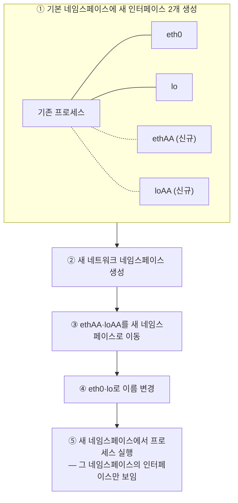
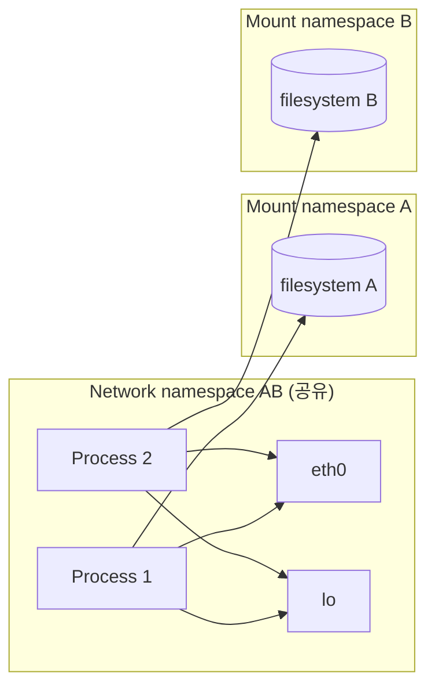

# 네임스페이스와 cgroup으로 보는 컨테이너 격리
---
> 앞 두 편에서 "컨테이너는 격리된 프로세스일 뿐"이라고 여러 번 말했습니다. 이 편에서는 그 격리가 리눅스 커널의 어떤 기능으로 실제 구현되는지, 이 책이 짚는 범위 안에서 정리합니다.


## 진입 — 이 문서를 읽고 나면 무엇을 할 수 있는가

> 이 문서를 읽고 나면 네임스페이스가 컨테이너에 "자기만의 시스템"이라는 착각을 어떻게 만드는지, cgroup이 자원 사용량을 어떻게 제한하는지, 그리고 두 메커니즘만으로는 왜 완전한 격리가 아닌지 설명할 수 있습니다.

이 개념은 리눅스 프로세스가 원래 갖고 있던 격리(자기만의 메모리 공간, 사용자 권한)를 몇 단계 더 세분화한 것입니다. 프로세스는 이미 다른 프로세스의 메모리를 직접 들여다볼 수 없었습니다. 네임스페이스는 여기에 "파일시스템도, 네트워크 인터페이스도, 호스트명도 나만 보이게"를 추가하는 발상입니다.


## 1. 리눅스 네임스페이스 — 프로세스마다 다른 시스템 뷰

> 네임스페이스는 리눅스 시스템 자원을 8종류로 쪼개 프로세스마다 다른 뷰를 보여 주며, 일부 네임스페이스만 골라 공유하면 "컨테이너"라는 경계 자체가 유연해집니다.

**리눅스 네임스페이스**(커널 네임스페이스라고도 함)는 각 프로세스가 시스템을 자기만의 뷰로 보게 만듭니다. 컨테이너 안에서 도는 프로세스는 시스템의 파일·프로세스·네트워크 인터페이스 일부만 보고, 시스템 호스트명조차 다르게 봅니다 — 별도 VM에서 도는 것처럼요.

원래 리눅스 OS의 모든 시스템 자원(파일시스템, 프로세스 ID, 사용자 ID, 네트워크 인터페이스 등)은 모든 프로세스가 함께 보고 쓰는 하나의 그릇에 담겨 있습니다. 리눅스 커널은 이 자원들을 **네임스페이스**라는 더 작은 그릇으로 나누고, 각 그릇을 프로세스 하나 또는 그룹에만 보이게 할 수 있습니다.

이 책이 언급하는 네임스페이스 종류는 다음과 같습니다.

1. **Mount(mnt)** — 마운트 지점(파일시스템)을 격리합니다.
2. **Process ID(pid)** — 프로세스 ID를 격리합니다.
3. **Network(net)** — 네트워크 장치·스택·포트를 격리합니다.
4. **IPC(ipc)** — 프로세스 간 통신(메시지 큐, 공유 메모리 등)을 격리합니다.
5. **UTS** — 시스템 호스트명과 NIS 도메인명을 격리합니다.
6. **User(user)** — 사용자·그룹 ID를 격리합니다.
7. **Time** — 컨테이너마다 시스템 클록에 다른 오프셋을 줄 수 있습니다.
8. **Cgroup** — cgroup 루트 디렉터리를 격리합니다.

> 이 8종류의 세부 동작과 `unshare` 실습은 [namespace 실습 — 8가지 격리와 unshare](../../../02_os/kernel/01-05.namespace%20%EC%8B%A4%EC%8A%B5%20%E2%80%94%208%EA%B0%80%EC%A7%80%20%EA%B2%A9%EB%A6%AC%EC%99%80%20unshare.md)가 정본입니다. 여기서는 이 책이 예시로 든 네트워크·UTS 네임스페이스 두 가지만 짚습니다.

### 네트워크 네임스페이스로 컨테이너 전용 인터페이스 만들기

프로세스가 도는 네트워크 네임스페이스가 그 프로세스에 보이는 네트워크 인터페이스를 결정합니다. 각 네트워크 인터페이스는 정확히 하나의 네임스페이스에 속하지만, 한 네임스페이스에서 다른 네임스페이스로 옮길 수 있습니다.



과정을 요약하면, 처음에는 기본 네트워크 네임스페이스만 있습니다. 컨테이너용으로 새 네트워크 인터페이스 두 개와 새 네트워크 네임스페이스를 만들고, 그 인터페이스들을 기본 네임스페이스에서 새 네임스페이스로 옮깁니다. 이름은 네임스페이스마다 고유하기만 하면 되므로, 옮긴 뒤 표준 이름(`eth0`, `lo`)으로 바꿀 수 있습니다. 마지막으로 프로세스를 이 새 네트워크 네임스페이스에서 시작하면, 그 네임스페이스 안의 인터페이스 두 개만 보게 됩니다.

**네트워크 인터페이스만 봐서는** 그 프로세스가 컨테이너에서 도는지, VM에서 도는지, 베어메탈 OS에서 직접 도는지 구별할 수 없습니다.

### UTS 네임스페이스로 전용 호스트명 주기

또 다른 예시가 UTS 네임스페이스입니다. 이 네임스페이스 안에서 도는 프로세스가 보는 호스트명·도메인명을 결정합니다. 서로 다른 UTS 네임스페이스 두 개를 두 프로세스에 배정하면, 두 프로세스가 서로 다른 시스템 호스트명을 보게 만들 수 있습니다. 두 프로세스 입장에서는 마치 서로 다른 컴퓨터에서 도는 것처럼 보입니다.

### 네임스페이스는 완전히 나누지 않고 골라서 공유할 수 있다

관련 컨테이너끼리는 특정 자원을 공유해야 할 때가 있습니다. 예를 들어 프로세스 두 개가 같은 네트워크 인터페이스와 호스트·도메인명은 공유하면서 파일시스템만 각자 쓰는 경우가 있습니다.



두 프로세스는 같은 네트워크 네임스페이스를 쓰므로 같은 두 네트워크 장치(`eth0`, `lo`)를 보고 씁니다. 덕분에 같은 IP 주소에 바인딩하고 루프백 장치로 서로 통신할 수 있습니다 — 컨테이너를 쓰지 않는 머신에서 돌 때와 마찬가지로요. 두 프로세스는 같은 UTS 네임스페이스도 쓰므로 같은 시스템 호스트명을 봅니다. 반면 각자 자기만의 마운트 네임스페이스를 쓰므로 파일시스템은 서로 다릅니다.

이 지점에서 "그렇다면 컨테이너란 정확히 무엇인가"라는 질문이 나옵니다. "컨테이너 안에서 도는" 프로세스는 VM에서처럼 무언가에 진짜로 감싸여 있는 것이 아닙니다. 그저 여러 네임스페이스(종류마다 하나씩)가 배정된 프로세스일 뿐입니다. 일부 네임스페이스는 다른 프로세스와 공유되므로, 프로세스 사이의 경계가 항상 딱 겹치지는 않습니다.


## 2. cgroup — 자원 사용량 제한

> 네임스페이스가 "무엇을 볼 수 있는가"를 정한다면, cgroup은 "얼마나 쓸 수 있는가"를 정해 한 프로세스가 CPU·메모리를 독차지하지 못하게 막습니다.

네임스페이스는 프로세스가 호스트 자원의 일부만 접근하게 만들지만, 한 자원을 얼마나 쓸 수 있는지는 제한하지 않습니다. 예를 들어 네임스페이스로 특정 네트워크 인터페이스만 보이게 할 수는 있어도, 그 프로세스가 쓸 네트워크 대역폭을 제한할 수는 없습니다. CPU 시간이나 메모리도 마찬가지입니다. 하지만 한 프로세스가 CPU 시간을 독차지해 중요한 시스템 프로세스가 제대로 돌지 못하게 막을 필요는 있습니다.

**리눅스 Control Groups(cgroup)**가 이 역할을 합니다. CPU, 메모리, 디스크·네트워크 대역폭 같은 시스템 자원을 제한·계량·격리합니다. cgroup을 쓰면 프로세스(또는 그룹)가 할당된 CPU 시간·메모리·네트워크 대역폭만 쓸 수 있고, 다른 프로세스에 예약된 자원을 가로챌 수 없습니다.

```bash
# CPU 1·2번 코어만 쓰도록 제한
docker run --cpuset-cpus="1,2" ...

# CPU 코어의 절반만 쓰도록 제한
docker run --cpus="0.5" ...

# 메모리 사용량을 100MB로 제한
docker run --memory="100m" ...
```

이 옵션들은 모두 내부적으로 해당 프로세스의 cgroup을 설정할 뿐이고, 실제로 한도를 강제하는 것은 커널입니다.

> cgroup의 세부 계층 구조·v2 차이·PSI 지표는 [cgroup v2 깊이](../../../02_os/kernel/01-02.cgroup%20v2%20%EA%B9%8A%EC%9D%B4.md)와 [제어 그룹(cgroups) — 자원 제한과 격리](../../../02_os/book/container-security/03-01.%EC%A0%9C%EC%96%B4%20%EA%B7%B8%EB%A3%B9(cgroups)%20%E2%80%94%20%EC%9E%90%EC%9B%90%20%EC%A0%9C%ED%95%9C%EA%B3%BC%20%EA%B2%A9%EB%A6%AC.md)가 정본입니다.


## 3. 네임스페이스·cgroup만으로는 부족한 격리

> 컨테이너가 같은 커널을 공유하는 한 완전한 격리는 아니므로, capabilities·seccomp·SELinux/AppArmor가 그 틈을 최소 권한 원칙으로 메웁니다.

네임스페이스와 cgroup은 컨테이너의 환경을 나누고, 한 컨테이너가 다른 컨테이너의 컴퓨팅 자원을 굶기지 못하게 막습니다. 하지만 이 컨테이너들은 **같은 시스템 커널**을 씁니다. 그래서 완전히 격리됐다고 말할 수는 없습니다. 악의적인 컨테이너가 악의적인 시스템 콜로 이웃 컨테이너에 영향을 줄 수도 있습니다.

한 노드에서 여러 컨테이너가 도는 상황을 가정해 보면, 각 컨테이너는 자기만의 네트워크 장치·파일을 갖고 제한된 CPU·메모리만 씁니다. 언뜻 보면 한 컨테이너의 악성 프로그램이 다른 컨테이너에 해를 끼칠 수 없어 보입니다. 하지만 그 악성 프로그램이 모든 컨테이너가 공유하는 **시스템 클록**을 바꾼다면 어떨까요?

애플리케이션에 따라 시간 변경 정도는 큰 문제가 아닐 수도 있지만, 커널에 임의의 시스템 콜을 허용하면 사실상 무엇이든 할 수 있게 됩니다. 시스템 콜은 커널 메모리를 바꾸거나 커널 모듈을 추가·제거하는 등, 컨테이너가 원래 하면 안 되는 일들을 가능하게 만듭니다.

이 문제를 다루는 세 번째 기술 묶음이 있습니다. 이 책은 이를 간단히 소개만 합니다.

1. **전체 권한 컨테이너(privileged container)** — 애플리케이션이 상승된 권한을 요구하고 그 제공자를 신뢰한다면 전체 권한 컨테이너로 돌릴 수 있습니다. 다만 이 컨테이너의 프로세스는 제약 없이 어떤 시스템 콜도 실행할 수 있으므로, 꼭 필요할 때만 신중하게 써야 합니다.
2. **Capabilities** — 권한 전체를 주는 대신, 커널은 권한을 `CAP_NET_ADMIN`(네트워크 관련 작업 허용), `CAP_NET_BIND_SERVICE`(1024 미만 포트 바인딩 허용), `CAP_SYS_TIME`(시스템 클록 변경 허용) 같은 단위로 쪼갭니다. Docker와 쿠버네티스는 기본적으로 일반 애플리케이션에 필요한 것만 남기고 나머지 capability를 모두 제거합니다.
3. **seccomp** — 프로그램이 만들 수 있는 시스템 콜을 더 세밀하게 통제하려면 seccomp(Secure Computing Mode)을 씁니다. 허용할 시스템 콜 목록을 JSON 프로필로 만들어 컨테이너 생성 시 Docker에 전달합니다.
4. **AppArmor·SELinux** — 강제 접근 제어(MAC) 메커니즘입니다. SELinux는 파일·시스템 자원·사용자·프로세스에 라벨을 붙이고, 그 라벨들이 정책에 맞을 때만 접근을 허용합니다. AppArmor는 라벨 대신 파일 경로를 쓰고 사용자보다 프로세스에 초점을 맞춘다는 점이 다릅니다.

> 원칙은 **최소 권한**입니다. 컨테이너에 필요하지 않은 capability는 주지 않아야 공격자가 호스트 운영체제에 접근하는 경로를 줄일 수 있습니다.


## Spring 앱 운영 관점에서

> cgroup 메모리·CPU 제한은 JVM 힙·스레드 풀 설정과 직접 맞물리고, PID 네임스페이스는 컨테이너 안에서 죽은 프로세스가 밖에서는 안 보이는 함정을 만듭니다.

### 메모리 한도와 JVM 힙

Spring Boot 앱을 담은 컨테이너에 `docker run --memory="512m"`처럼 메모리 상한을 걸면, JVM이 그 상한 안에서 힙 크기를 잡도록 신경 써야 합니다. cgroup이 강제하는 메모리 한도와 JVM의 `-Xmx` 설정이 어긋나면 컨테이너가 OOMKilled로 죽는 상황이 생기는데, 이 사례는 [OOMKilled 사례 분석](../../kubernetes/05_operations/05-12.OOMKilled%20%EC%82%AC%EB%A1%80%20%EB%B6%84%EC%84%9D.md)에 이미 정리돼 있습니다.

### CPU 제한과 스레드 풀 크기

cgroup CPU 제한도 힙 못지않게 자주 놓치는 지점입니다. `docker run --cpus="1"`로 CPU를 1코어로 제한하면, JVM은 여전히 컨테이너 밖 호스트의 전체 코어 수를 기준으로 기본 스레드 풀 크기(예: `ForkJoinPool.commonPool()`의 병렬도, Tomcat의 기본 워커 스레드 수)를 계산할 수 있습니다. 실제로는 1코어만 쓸 수 있는데 스레드 풀이 8개 코어 기준으로 잡히면, 스레드가 CPU 시간을 할당받으려고 서로 경쟁하며 스로틀링(cgroup CFS quota 초과로 인한 강제 대기)이 걸려 응답 시간이 들쭉날쭉해집니다. `application.yml`의 `server.tomcat.threads.max`나 커스텀 스레드 풀 크기를 cgroup 한도에 맞춰 명시적으로 잡아야 하는 이유입니다.

### PID 네임스페이스와 시그널 처리

PID 네임스페이스는 컨테이너 안에서 프로세스가 어떻게 죽는지에 영향을 줍니다. Spring Boot 앱이 PID 1로 도는 컨테이너에서, 애플리케이션이 좀비 프로세스를 남기거나 시그널을 제대로 처리하지 못하면 `docker stop`이 타임아웃 후 강제 kill로 이어질 수 있습니다. `java -jar` 대신 `tini`나 `dumb-init` 같은 초기화 프로세스를 PID 1로 앞세우는 관행은 이 문제(좀비 리핑, 시그널 전달)를 해결하려는 것입니다.


## 관련 문서

> 이 편은 앞 두 편(02-01·02-02)에서 다룬 "컨테이너=격리된 프로세스"를 커널 메커니즘 층위에서 마무리합니다. 네임스페이스·cgroup의 깊은 내용은 이미 전용 카테고리에 정리돼 있어 여기서는 이 책의 서술과 예시만 다뤘습니다.

- [02-02.Kiada 애플리케이션 빌드와 배포](./02-02.Kiada%20%EC%95%A0%ED%94%8C%EB%A6%AC%EC%BC%80%EC%9D%B4%EC%85%98%20%EB%B9%8C%EB%93%9C%EC%99%80%20%EB%B0%B0%ED%8F%AC.md) — 이 편에서 격리 원리를 설명한 그 컨테이너를 실제로 빌드·실행한 편
- [namespace 실습 — 8가지 격리와 unshare](../../../02_os/kernel/01-05.namespace%20%EC%8B%A4%EC%8A%B5%20%E2%80%94%208%EA%B0%80%EC%A7%80%20%EA%B2%A9%EB%A6%AC%EC%99%80%20unshare.md) — 이 편에서 짚은 네임스페이스 8종류를 손으로 직접 만들어 보는 전용 실습 편
- [cgroup v2 깊이](../../../02_os/kernel/01-02.cgroup%20v2%20%EA%B9%8A%EC%9D%B4.md) — 이 편에서 예시로만 다룬 CPU·메모리 제한의 v2 내부 동작·QoS·PSI 지표를 깊게 다룬 편
- [제어 그룹(cgroups) — 자원 제한과 격리](../../../02_os/book/container-security/03-01.%EC%A0%9C%EC%96%B4%20%EA%B7%B8%EB%A3%B9(cgroups)%20%E2%80%94%20%EC%9E%90%EC%9B%90%20%EC%A0%9C%ED%95%9C%EA%B3%BC%20%EA%B2%A9%EB%A6%AC.md) — cgroup을 보안 관점(fork bomb 방지 등)에서 다룬 편
