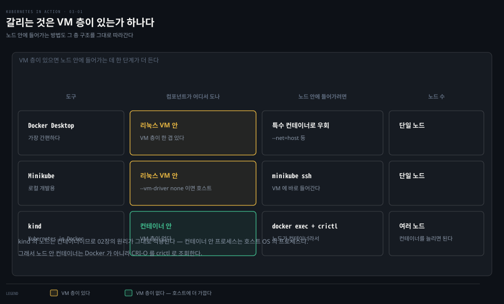
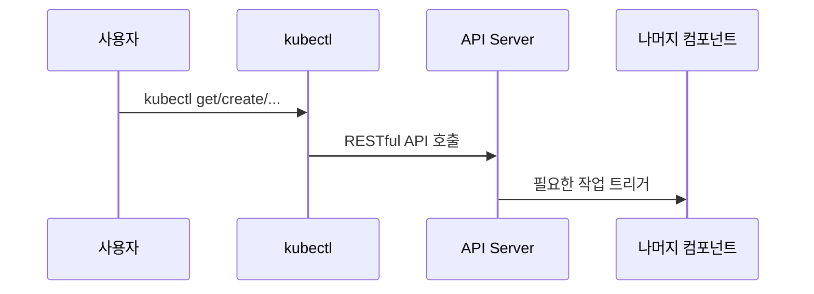

# 쿠버네티스 클러스터 실행하기
---
> 로컬 개발용 단일 노드 클러스터부터 클라우드의 정식 매니지드 클러스터까지, 쿠버네티스를 실제로 띄우는 다섯 가지 방법과 `kubectl`을 설정하는 법을 정리합니다.


## 진입 — 이 문서를 읽고 나면 무엇을 할 수 있는가

> 이 문서를 읽고 나면 Docker Desktop·Minikube·kind·GKE·EKS 각각의 아키텍처 차이를 설명하고, `kubectl` 별칭·탭 완성·`kubeconfig` 설정까지 마칠 수 있습니다.

이 개념은 로컬 개발 환경을 고르는 익숙한 저울질과 같은 발상입니다. 로컬 DB를 Docker 컨테이너로 띄울지, VM으로 띄울지, 매니지드 클라우드 DB를 쓸지 고르는 것처럼, 쿠버네티스도 "내 컴퓨터 안에 얼마나 진짜에 가깝게 재현할 것인가"와 "관리 부담을 얼마나 클라우드에 넘길 것인가"를 저울질해서 고릅니다.


## 1. 클러스터를 어디에 어떻게 띄울 것인가

> 처음이라면 Docker Desktop·Minikube·kind·GKE 중 하나로 시작하는 편이 안전하고, 처음부터 멀티 노드를 직접 설치하는 시도는 권하지 않습니다.

멀티 노드 쿠버네티스 클러스터를 제대로 세팅하는 일은 간단하지 않습니다. 특히 리눅스·네트워크 관리에 익숙하지 않다면 더욱 그렇습니다. 제대로 된 쿠버네티스 설치는 여러 물리·가상 머신에 걸쳐 있고, 클러스터 안의 모든 컨테이너가 서로 통신할 수 있도록 제대로 된 네트워크 구성도 필요합니다.

쿠버네티스를 노트북, 조직의 인프라, 클라우드 제공자의 VM 위에 직접 설치할 수도 있고, 클라우드 제공자가 클러스터 관리를 대신하게 할 수도 있습니다. 널리 쓰이는 매니지드 쿠버네티스 옵션으로는 GKE(Google), EKS(Amazon), AKS(Microsoft Azure), IBM Cloud Kubernetes Service, Oracle Cloud Infrastructure Container Engine, DigitalOcean Kubernetes, Alibaba Cloud Container Service 등이 있습니다.

쿠버네티스를 설치하고 관리하는 일은 그저 쓰는 것보다 훨씬 어렵습니다. 특히 아키텍처와 동작 방식에 익숙해지기 전까지는요. 처음이라면 다음 네 옵션 중 하나로 시작하는 편이 낫습니다.

1. Docker Desktop
2. Minikube
3. Kind(Kubernetes in Docker)
4. Google Kubernetes Engine


## 2. 로컬 옵션 세 가지 비교

> 세 로컬 옵션의 핵심 차이는 "쿠버네티스 컴포넌트가 어디서 도는가"입니다 — VM 안, VM 없이 호스트, 또는 컨테이너 안.

Docker Desktop과 Minikube는 리눅스 VM 하나를 만들어 그 안에서 컨트롤 플레인과 Kubelet을 돌리지만, kind는 VM 없이 노드마다 컨테이너 하나를 씁니다. 이 차이가 실제로 어떻게 갈리는지 아래에서 한눈에 비교합니다.



### Docker Desktop

macOS·Windows에서 2장 실습을 위해 이미 Docker Desktop을 설치했다면, 그 설정 대화상자에서 쿠버네티스를 바로 켤 수 있습니다. 가장 쉬운 시작점이지만, 쿠버네티스 버전이 다른 옵션보다 최신이 아닐 수 있습니다.

Docker Desktop은 리눅스 VM을 하나 만들어 그 안에서 Docker Daemon과 모든 컨테이너를 돌립니다. 이 VM은 Kubelet(노드를 관리하는 쿠버네티스 에이전트)도 함께 돌립니다. 컨트롤 플레인 컴포넌트는 컨테이너로 돌고, 배포하는 애플리케이션도 마찬가지입니다.

VM 안을 직접 들여다보고 싶다면, VM의 네임스페이스를 그대로 쓰는 특수 컨테이너로 셸을 얻을 수 있습니다.

```bash
docker run --net=host --ipc=host --uts=host --pid=host --privileged \
  --security-opt=seccomp=unconfined -it --rm -v /:/host alpine chroot /host
```

- `--net`·`--ipc`·`--uts`·`--pid` — 컨테이너가 샌드박스 대신 호스트(VM)의 네임스페이스를 쓰게 합니다.
- `--privileged`·`--security-opt` — 모든 시스템 콜에 무제한 접근을 줍니다.
- `-v /:/host` + `chroot /host` — 호스트의 루트 디렉터리를 컨테이너 안 `/host`에 마운트하고, 그 디렉터리를 컨테이너의 루트로 바꿉니다.

이 명령을 실행하면 실제로 SSH로 VM에 들어간 것과 사실상 같은 셸을 얻습니다. `ps aux`로 프로세스를 나열하거나 `ip addr`로 네트워크 인터페이스를 살펴볼 수 있습니다.

### Minikube

Minikube가 배포하는 쿠버네티스 버전은 보통 Docker Desktop보다 최신입니다. 단일 노드 클러스터로, 쿠버네티스를 테스트하거나 로컬에서 애플리케이션을 개발하기에 적합합니다. 보통 리눅스 VM 안에서 쿠버네티스를 돌리지만, 컴퓨터가 리눅스 기반이라면 Docker로 호스트 OS에 직접 배포할 수도 있습니다.

```bash
minikube start
```

`minikube status`로 호스트(VM)·Kubelet·API 서버가 모두 도는지 확인합니다. `minikube ssh`로 VM에 로그인해 내부를 들여다볼 수 있습니다.

> 리눅스라면 `minikube start --vm-driver none`으로 VM 없이 호스트에 직접 배포해 자원 요구량을 줄일 수 있습니다.

### kind (Kubernetes in Docker)

Minikube의 대안으로, kind는 각 쿠버네티스 클러스터 노드를 VM이 아니라 **컨테이너 안**에서 돌립니다. Minikube와 달리 이 방식 덕분에 컨테이너 여러 개를 띄워 멀티 노드 클러스터를 쉽게 만들 수 있습니다. 실제 배포한 애플리케이션 컨테이너는 이 노드 컨테이너들 **안**에서 돕니다.

2장에서 컨테이너 안의 프로세스가 실제로는 호스트 OS에서 돈다고 설명했습니다. 즉 kind로 쿠버네티스를 돌리면, 모든 쿠버네티스 컴포넌트가 호스트 OS에서 돕니다. 배포하는 애플리케이션도 마찬가지입니다. 이 덕분에 kind는 개발·테스트에 적합합니다 — 모든 것이 로컬에서 돌고, 컨테이너 밖에서 돌릴 때만큼 쉽게 실행 중인 프로세스를 디버깅할 수 있기 때문입니다.

```bash
# 단일 노드
kind create cluster

# 멀티 노드 (설정 파일 필요)
kind create cluster --config kind-multi-node.yaml
```

```yaml
kind: Cluster
apiVersion: kind.sigs.k8s.io/v1alpha4
nodes:
- role: control-plane
- role: worker
- role: worker
```

```bash
kind get nodes          # 워커 노드 목록
docker exec -it kind-control-plane bash   # 노드 로그인 (docker exec 사용)
```

kind로 만든 노드는 Docker 대신 **CRI-O** 컨테이너 런타임을 씁니다(2장에서 다룬 경량 대안). `crictl ps`가 그 안에서 `docker ps`에 대응합니다.

> 로컬 클러스터 셋업의 세부 아키텍처(desired state·reconcile loop, control plane/worker 역할 분리, kubeconfig·context, 디버깅 루틴)는 [로컬 클러스터 구성](../../kubernetes/01_foundation/01-01.%EB%A1%9C%EC%BB%AC%20%ED%81%B4%EB%9F%AC%EC%8A%A4%ED%84%B0%20%EA%B5%AC%EC%84%B1.md)이 정본입니다. 여기서는 이 책이 다루는 세 도구(Docker Desktop·Minikube·kind)의 서술만 짚었습니다.


## 3. 클라우드 매니지드 클러스터 — GKE·EKS

> GKE·EKS는 컨트롤 플레인을 클라우드가 관리하고 워커 노드 VM만 사용자 계정에 생기며, 처음부터 직접 설치하는 것보다 훨씬 안전한 시작점입니다.

### Google Kubernetes Engine

```bash
gcloud config set compute/zone europe-west3-c
gcloud container clusters create kiada --num-nodes 3
```

GKE 클러스터를 만들면 워커 노드마다 Google Compute Engine(GCE) VM이 하나씩 생성됩니다. **컨트롤 플레인은 그 VM 밖**에서 돕니다 — Google이 관리하는 별도 인프라입니다. 그래서 컨트롤 플레인 노드에는 직접 접근할 수 없습니다.

```bash
gcloud compute instances list          # 워커 노드 VM 목록
gcloud container clusters resize kiada --size 0   # 0으로 스케일 — 비용 절감
gcloud compute ssh <node-name>         # 워커 노드 로그인
```

클러스터를 0으로 스케일해도 만든 오브젝트(배포한 애플리케이션 포함)는 지워지지 않습니다. 다만 워커 노드가 없으므로 애플리케이션이 돌 곳이 없어질 뿐이고, 다시 스케일 업하면 재배포됩니다. 워커 노드가 0개여도 API와는 계속 상호작용할 수 있습니다(오브젝트 생성·수정·삭제).

### Amazon Elastic Kubernetes Service

```bash
eksctl create cluster --name kiada --region eu-central-1 --nodes 3 --ssh-access
```

`--ssh-access` 플래그를 주면 SSH 공개키가 노드에 임포트되어, 로그인 후 `docker ps`로 실행 중인 컨테이너를 살펴볼 수 있습니다.

### 처음부터 직접 멀티 노드 클러스터 설치하기

쿠버네티스를 깊이 이해하기 전까지는 멀티 노드 클러스터를 처음부터 직접 설치하는 시도를 권하지 않습니다. `kubeadm`으로 한두 번 클러스터를 배포해 본 뒤에는, Kelsey Hightower의 *Kubernetes the Hard Way* 튜토리얼(`github.com/kelseyhightower/kubernetes-the-hard-way`)로 완전히 수동 설치를 시도해 볼 수 있습니다. 여러 문제에 부딪히겠지만, 그걸 해결하는 과정 자체가 좋은 학습 경험이 됩니다.


## 4. kubectl 설정하기

> 설치·별칭·탭 완성·kubeconfig 네 가지를 갖추면 `kubectl`이 API 서버와 통신하는 유일한 창구로서 준비를 마칩니다.

`kubectl`(발음은 쿠브-컨트롤, 쿠브-씨-티-엘, 또는 쿠브-커들)은 쿠버네티스 API 서버와 통신하는 명령줄 도구입니다.



### 설치

`kubectl`은 실행 파일 하나이므로 다운로드해서 PATH에 넣기만 하면 됩니다.

```bash
# Linux — 최신 안정 버전
curl -LO "https://dl.k8s.io/release/$(curl -L -s https://dl.k8s.io/release/stable.txt)/bin/linux/amd64/kubectl"
chmod +x kubectl
sudo mv kubectl /usr/local/bin/

# macOS — 같은 방식(URL의 linux를 darwin으로) 또는 Homebrew
brew install kubectl
```

Windows에서는 `kubectl.exe`를 받아 PATH에 등록합니다. 설치를 확인하려면 `kubectl --help`를 실행합니다 — 이때 클러스터에 연결이 안 돼 있어도(kubeconfig 미설정) 실행 자체는 됩니다.

> `gcloud`로 클러스터를 만들었다면 `gcloud`가 `kubectl`을 함께 설치해 주므로 이 단계를 건너뛸 수 있습니다.

### 별칭과 탭 완성

`kubectl`을 자주 타이핑하게 되므로 짧은 별칭을 만들어 둡니다. 대부분 `k`를 씁니다.

```bash
# ~/.bashrc 또는 동등 파일에 추가
alias k=kubectl

# bash 탭 완성 활성화
source <(kubectl completion bash)

# 별칭(k)에도 탭 완성 적용
complete -o default -F __start_kubectl k
```

> `gcloud`로 클러스터를 만들었다면 별칭이 필요 없을 수도 있습니다 — `gcloud`가 `kubectl`과 함께 `k` 바이너리도 설치하기 때문입니다.

### kubeconfig 설정

`kubectl`은 `~/.kube/config`에서 설정을 읽습니다. Docker Desktop·Minikube·GKE로 클러스터를 배포했다면 이 파일이 자동으로 생성됩니다. kind처럼 다른 위치에 파일을 쓰는 도구도 있는데, 파일을 기본 위치로 옮기는 대신 환경 변수로 지정할 수 있습니다.

```bash
export KUBECONFIG=/path/to/custom/kubeconfig
```

### 클러스터 확인

```bash
kubectl cluster-info    # API 서버·KubeDNS 등의 URL 확인
kubectl get nodes       # 클러스터 노드 목록
kubectl describe node <node-name>   # 노드 상세 정보
```

`kubectl get`은 지정한 타입의 오브젝트 목록을 API에서 가져와 요약 정보만 보여 줍니다. 더 자세히 보려면 `kubectl describe`를 씁니다. 오브젝트 이름을 생략하면 그 타입의 오브젝트 전체 정보가 출력되는데, 타입당 오브젝트가 하나뿐일 때 이름을 일일이 타이핑하지 않아도 되니 편리합니다. 어떤 `kubectl` 명령이든 뒤에 `--help`를 붙이면 더 자세한 사용법을 볼 수 있습니다.


## 5. 웹 대시보드로 상호작용하기

> 그래픽 UI를 선호한다면 쿠버네티스도 웹 대시보드를 제공합니다. 다만 기능은 `kubectl`보다 뒤처질 수 있습니다.

쿠버네티스 웹 대시보드는 배포된 여러 리소스를 맥락 속에서 보여 주므로, 쿠버네티스의 주요 리소스 타입이 무엇이고 서로 어떻게 연결되는지 감을 잡는 좋은 출발점이 될 수 있습니다. 대시보드에서 배포된 오브젝트를 수정할 수도 있고, 각 동작에 대응하는 `kubectl` 명령을 함께 보여 주는 기능도 있어 초보자에게 특히 유용합니다.

### Docker Desktop에서 대시보드 접근하기

Docker Desktop은 기본으로 쿠버네티스 대시보드를 설치하지 않습니다. 접근도 간단하지 않지만 다음 순서로 할 수 있습니다.

```bash
# 1. 대시보드 설치
kubectl apply -f https://raw.githubusercontent.com/kubernetes/dashboard/v2.0.0-rc5/aio/deploy/recommended.yaml

# 2. API 서버로 가는 로컬 프록시 실행 (계속 켜 둠)
kubectl proxy
```

프록시가 도는 동안 브라우저로 다음 URL을 엽니다.

```text
http://localhost:8001/api/v1/namespaces/kubernetes-dashboard/services/https:kubernetes-dashboard:/proxy/
```

인증 페이지가 뜨면, 다음 명령으로 토큰을 조회해 붙여넣습니다.

```powershell
kubectl -n kubernetes-dashboard describe secret $(kubectl -n kubernetes-dashboard get secret | sls admin-user | ForEach-Object { $_ -Split '\s+' } | Select -First 1)
```

> ⚠️ 이 명령은 Windows PowerShell 전용입니다. 출력에서 `kubernetes-dashboard-token-xyz` 아래 토큰을 찾아 인증 페이지에 붙여넣습니다. 다 쓰고 나면 `kubectl proxy` 프로세스를 `Ctrl-C`로 종료합니다.

### Minikube·다른 환경에서 대시보드 접근하기

Minikube는 훨씬 간단합니다.

```bash
minikube dashboard
```

이 명령 하나로 기본 브라우저에 대시보드가 열립니다.

GKE는 더 이상 오픈소스 쿠버네티스 대시보드에 대한 접근을 제공하지 않고, 대신 자체 웹 콘솔을 제공합니다. 다른 클라우드 제공자도 마찬가지이므로, 각 제공자 문서에서 확인해야 합니다. 자체 인프라에서 클러스터를 돌린다면 공식 가이드를 따라 대시보드를 직접 배포할 수 있습니다.


## Spring 앱 개발 관점에서

> 로컬 클러스터는 빠른 반복 주기와 원격 디버깅에, 매니지드 클러스터는 운영 환경에 가까운 통합 검증에 강점이 있고, 여러 클러스터를 오갈 때는 kubeconfig 컨텍스트 관리가 실무 마찰의 핵심입니다.

로컬 개발 중인 Spring Boot 앱을 어느 클러스터에 올릴지는 반복 주기와 직결됩니다. kind는 컨테이너 안에서 노드가 돌므로, IDE의 원격 디버거를 컨테이너 포트에 그대로 연결하기 쉽고 이미지 재빌드·재배포 사이클이 짧습니다. 반면 GKE·EKS 같은 매니지드 클러스터는 실제 운영 환경과 네트워크·IAM 구성이 가장 가깝기 때문에, Spring Cloud Config나 클라우드 제공자의 시크릿 관리자를 연동하는 통합 테스트는 로컬 클러스터보다 매니지드 클러스터에서 훨씬 신뢰도 높게 검증됩니다.

**이미지 재빌드 대기 시간**은 Spring Boot 로컬 개발에서 특히 뼈아픕니다. JVM 앱은 Node.js보다 빌드·이미지 생성이 무거워서, 매 코드 변경마다 `gradle build` → `docker build` → `kubectl apply` 전체 사이클을 돌면 반복 주기가 길어집니다. Skaffold나 Tilt 같은 도구는 로컬 클러스터(특히 kind·Minikube)에 파일 변경을 감지해 변경분만 다시 빌드·동기화하는 핫 리로드 워크플로를 제공하는데, 이 편에서 다룬 "kind는 호스트에 가까워 디버깅이 쉽다"는 특성과 잘 맞물립니다.

여러 클러스터를 오갈 때는 **`kubeconfig` 컨텍스트 전환**이 실무 마찰 지점입니다. 로컬 kind 클러스터와 사내 GKE 개발 클러스터를 동시에 쓰는 팀이라면, `kubectl config get-contexts`로 등록된 클러스터를 확인하고 `kubectl config use-context <name>`으로 전환합니다. Spring Boot 앱을 잘못된 컨텍스트(예: 운영 클러스터)에 실수로 배포하는 사고를 막으려면, `kubectx`·`kube-ps1` 같은 도구로 현재 컨텍스트를 셸 프롬프트에 항상 표시해 두는 것이 안전합니다.


## 관련 문서

> 이 편은 클러스터를 실제로 띄우고 `kubectl`을 설정하는 준비 단계를 다룹니다. 다음 편(03-02)에서 이 클러스터에 첫 애플리케이션을 배포합니다.

- [03-02.첫 애플리케이션 배포와 스케일링](./03-02.%EC%B2%AB%20%EC%95%A0%ED%94%8C%EB%A6%AC%EC%BC%80%EC%9D%B4%EC%85%98%20%EB%B0%B0%ED%8F%AC%EC%99%80%20%EC%8A%A4%EC%BC%80%EC%9D%BC%EB%A7%81.md) — 이 편에서 준비한 클러스터에 Kiada를 배포하는 다음 편
- [로컬 클러스터 구성](../../kubernetes/01_foundation/01-01.%EB%A1%9C%EC%BB%AC%20%ED%81%B4%EB%9F%AC%EC%8A%A4%ED%84%B0%20%EA%B5%AC%EC%84%B1.md) — minikube·kind·k3d 비교와 desired-state/reconcile loop 아키텍처를 깊게 다룬 편
- [Kubernetes 공식 문서 — Install kubectl](https://kubernetes.io/docs/tasks/tools/) — 플랫폼별 최신 설치 절차
