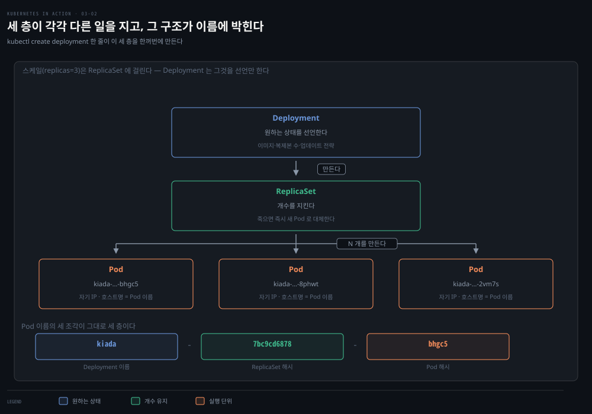
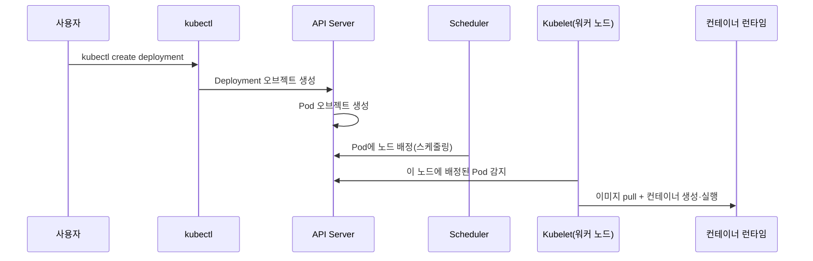
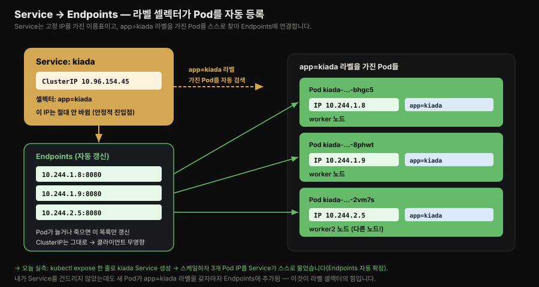
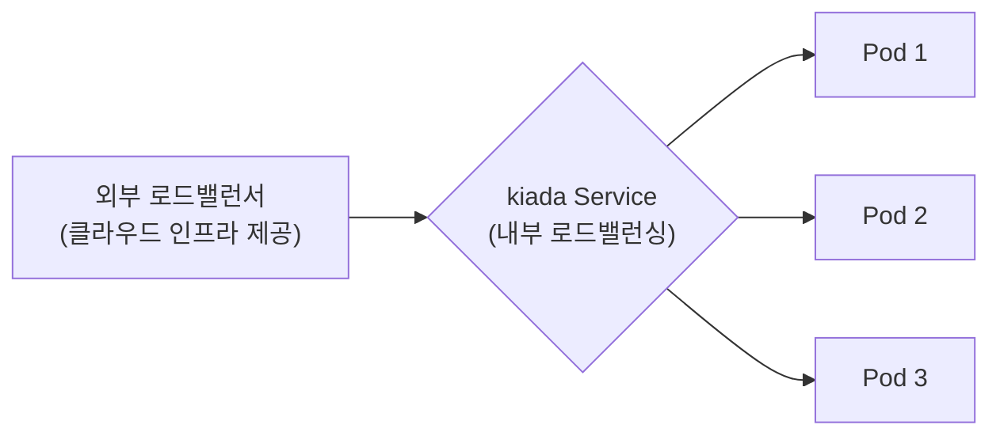
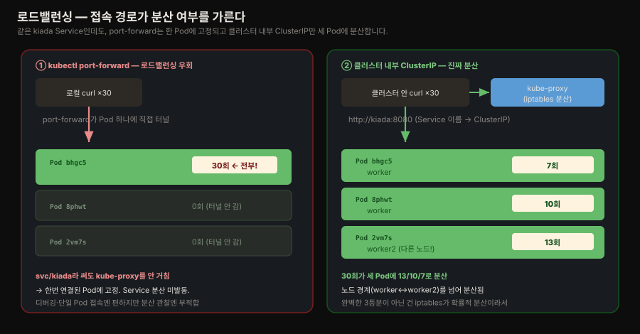
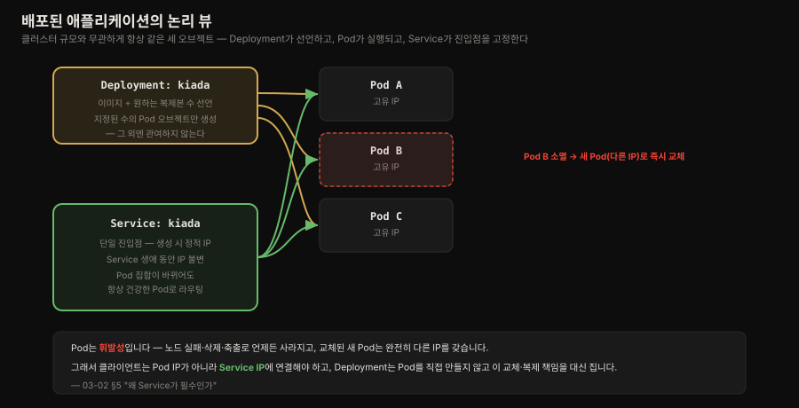

# 첫 애플리케이션 배포와 스케일링
---
> 명령 한 줄로 Kiada 앱을 클러스터에 배포하고, Service로 외부에 노출하고, 복제본을 늘려 스케일 아웃하는 전체 흐름을 따라가며, 그 뒤에서 Deployment·Pod·Service 오브젝트가 어떻게 맞물리는지 정리합니다.


## 진입 — 이 문서를 읽고 나면 무엇을 할 수 있는가

> 이 문서를 읽고 나면 `kubectl create deployment`부터 `kubectl scale`까지 명령형 배포 흐름을 재현하고, Deployment·Pod·Service 세 오브젝트가 왜 각자 필요한지, 그리고 Service가 왜 필수인지(Pod의 휘발성)를 설명할 수 있습니다.

이 개념은 "선언한 배포 아티팩트를 오케스트레이터에 맡기고, 실제 배치는 오케스트레이터가 알아서 하게 둔다"는 익숙한 발상입니다. CI 서버에 "이 버전을 배포해 줘"라고 지시만 하고 어느 서버에 올라갈지는 신경 쓰지 않는 것과 비슷합니다. 다만 쿠버네티스는 그 위임의 단위가 서버가 아니라 클러스터 전체입니다.


## 1. 명령형으로 Kiada 배포하기

> `kubectl create deployment` 한 줄이 만드는 Deployment 오브젝트는 원하는 상태의 선언이고, 실제 상태를 그 선언과 일치시키는 것은 쿠버네티스의 몫입니다.

애플리케이션을 배포하는 정석은 YAML/JSON 매니페스트를 준비해 클러스터에 적용하는 **선언적** 방식이지만, 처음 배포해 본다면 한 줄짜리 **명령형** 명령으로 시작하는 편이 쉽습니다.

```bash
kubectl create deployment kiada --image=luksa/kiada:0.1
```

이 명령은 세 가지를 지정합니다.

1. Deployment 오브젝트를 만듭니다.
2. 그 오브젝트 이름을 `kiada`로 합니다.
3. 컨테이너 이미지로 `luksa/kiada:0.1`을 씁니다.

이미지는 기본적으로 Docker Hub에서 pull되지만, 이미지 이름에 레지스트리를 명시할 수도 있습니다(예: `quay.io/luksa/kiada:0.1`). Deployment 오브젝트가 API에 저장되는 순간, 그 존재 자체가 "이 이미지의 컨테이너가 클러스터에서 돌아야 한다"는 **원하는 상태**를 선언한 것입니다. 쿠버네티스는 이제 실제 상태가 그 선언과 일치하도록 만듭니다.

```bash
kubectl get deployments
# NAME    READY   UP-TO-DATE   AVAILABLE   AGE
# kiada   0/1     1            0           6s
```

- `UP-TO-DATE`는 1이지만 `AVAILABLE`은 아직 0입니다. `READY` 열이 보여 주듯 컨테이너가 아직 준비되지 않았기 때문입니다.

### 실제 확인 — kind에 로컬 이미지를 배포할 때의 `imagePullPolicy` 함정

책은 Docker Hub의 `luksa/kiada:0.1`을 쓰지만, 앞 편(02-02)에서 직접 빌드한 로컬 `kiada` 이미지를 kind 클러스터에 배포하면 함정에 걸립니다. kind 노드는 로컬 Docker 이미지를 자동으로 보지 못하므로 `kind load`로 노드에 넣어야 하는데, 그것만으로는 부족했습니다.

처음에 `kiada:latest`로 배포하자 Pod가 `ErrImagePull`로 죽었습니다.

```bash
kubectl create deployment kiada --image=kiada:latest
kubectl describe pod -l app=kiada | grep -A3 Failed
#   Failed to pull image "kiada:latest": ... "docker.io/library/kiada:latest"
#   ... pull access denied ... insufficient_scope: authorization failed
```

원인은 `imagePullPolicy`입니다. 태그가 `:latest`이면 쿠버네티스 기본 정책이 **`Always`**가 되어 로컬에 이미지가 있어도 무시하고 레지스트리(Docker Hub)에서 새로 받으려 합니다. kiada는 Hub에 없으니 `pull access denied`가 납니다.

`:0.1` 태그로 바꾸고 정책을 `IfNotPresent`로 패치해도 여전히 실패했습니다. 노드 안 이미지를 직접 확인하니 원인이 드러났습니다.

```bash
docker exec k8s-lab-worker crictl images | grep kiada
#   docker.io/library/kiada   latest   87bce88f30a87   163MB    ← 0.1이 없다!
```

`kind load docker-image kiada:latest`로 **`latest` 태그만** 노드에 넣었는데 배포는 `:0.1`을 참조했으니, `IfNotPresent`가 "로컬에 `0.1`이 있나?"를 확인 → 없음 → Hub로 감 → 실패였습니다. `:0.1`도 노드에 로드하니 곧바로 해결됐습니다.

```bash
kind load docker-image kiada:0.1 --name k8s-lab
kubectl rollout restart deployment kiada
#   → Container image "kiada:0.1" already present on machine  (Hub로 안 감)
```

정리하면 kind에서 로컬 이미지를 쓰려면 **세 가지가 모두 맞아야** 합니다.

| 조건 | 어긋나면 |
|------|----------|
| ① `kind load`로 노드에 이미지 적재 | 노드에 이미지 없음 → Hub 시도 |
| ② 배포 태그 = 로드한 태그 (정확히 일치) | `latest`만 로드 + `:0.1` 배포 → 불일치 → Hub 시도 |
| ③ `imagePullPolicy: IfNotPresent` (`:latest`는 기본 `Always`라 주의) | `Always` → 로컬 무시하고 Hub 시도 |

셋 중 하나만 어긋나도 kubelet은 `docker.io/library/...`로 나가 `pull access denied`를 만납니다. 이 세 층은 책의 클라우드(GKE) 실습에는 안 나오는, 로컬 kind 환경 특유의 관문입니다.


## 2. Pod — 배포의 최소 단위

> 쿠버네티스는 컨테이너가 아니라 Pod를 배포하며, Pod는 네트워크·UTS 네임스페이스를 공유하는 컨테이너 하나 이상의 묶음으로 스케줄러가 배정한 노드에서만 돕니다.

`kubectl get containers`를 시도하면 이런 오류가 납니다.

```text
error: the server doesn't have a resource type "containers"
```

쿠버네티스에는 "Container"라는 오브젝트 타입이 없습니다. 컨테이너가 쿠버네티스에서 배포의 최소 단위가 아니기 때문입니다. 대신 쿠버네티스는 서로 밀접하게 연관된 컨테이너 묶음, 즉 **Pod**(콩깍지처럼 서로 붙어 있다는 뜻)를 배포합니다.

Pod는 같은 워커 노드에서 함께 돌고, 서로 더 가깝게 상호작용할 수 있도록 특정 리눅스 네임스페이스를 공유하는 컨테이너 하나 이상의 그룹입니다. 

- 2장에서 네트워크·UTS 네임스페이스를 공유하는 프로세스 두 개 예시를 봤는데, 같은 Pod 안의 컨테이너들이 정확히 이렇게 동작합니다.
- 같은 네트워크·UTS 네임스페이스(그리고 Pod 명세에 따라 다른 네임스페이스도)를 씁니다.

각 Pod는 자기만의 IP·호스트명·프로세스·네트워크 인터페이스를 갖습니다. 같은 Pod에 속한 컨테이너는 자신이 그 컴퓨터의 유일한 프로세스라고 생각합니다. 같은 노드에 있어도 다른 Pod의 프로세스는 보이지 않습니다.

그런데 이 Pod는 어디서 왔을까요. `kubectl create deployment` 한 줄이 곧바로 Pod를 만든 게 아니라, 세 층을 거칩니다. Deployment가 ReplicaSet을 만들고, ReplicaSet이 Pod를 만듭니다. 이 계층은 Pod 이름에 그대로 드러납니다.



`kiada-7bc9cd6878-bhgc5`라는 Pod 이름에서 `kiada`는 Deployment명, `7bc9cd6878`은 ReplicaSet 해시, `bhgc5`는 Pod 해시입니다. 세 층이 각각 다른 일을 합니다 — Deployment는 "어떤 이미지가 몇 개 돌아야 하나"라는 원하는 상태를 선언하고, ReplicaSet은 그 개수를 감시해 부족하면 새 Pod로 채우며, Pod는 실제 컨테이너를 실행합니다. 뒤에서 다룰 `kubectl scale`은 이 중 ReplicaSet의 복제본 수를 바꾸는 것입니다.

```bash
kubectl get pods
# NAME                     READY     STATUS    RESTARTS   AGE
# kiada-9d785b578-p449x    0/1       Pending   0          1m
```

- `STATUS`가 아직 `Pending`인 이유는, Pod가 배정된 워커 노드가 컨테이너 이미지를 먼저 다운로드해야 하기 때문입니다. 
- 다운로드가 끝나면 Pod의 컨테이너가 만들어지고 `Running` 상태가 됩니다. 이미지를 pull할 수 없다면 `STATUS` 열에 그 사실이 나타납니다.

문제를 더 자세히 보려면 `kubectl describe pod`로 하단의 이벤트 로그를 확인합니다.

```text
Type    Reason     Age   From                    Message
----    ------     ----  ----                    -------
Normal  Scheduled  25s   default-scheduler       Successfully assigned ... to kind-worker2
Normal  Pulling    23s   kubelet, kind-worker2   Pulling image "luksa/kiada:0.1"
Normal  Pulled     21s   kubelet, kind-worker2   Successfully pulled image
Normal  Created    21s   kubelet, kind-worker2   Created container kiada
Normal  Started    21s   kubelet, kind-worker2   Started container kiada
```



> **스케줄링**은 Pod를 어느 노드에 배정할지 결정하는 것을 말합니다. 
>
> Pod는 미래의 어느 시점이 아니라 즉시 돕니다. OS의 CPU 스케줄러가 프로세스를 어느 CPU에서 돌릴지 고르듯, 쿠버네티스의 스케줄러는 각 컨테이너를 어느 워커 노드에서 실행할지 결정합니다. 
>
> 다만 CPU 프로세스와 달리, 한 번 노드에 배정된 Pod는 그 노드에서만 돕니다. 실패해도 이 Pod 인스턴스가 다른 노드로 옮겨지는 일은 없고, 대신 그 자리를 대신할 새 Pod 인스턴스가 만들어질 수 있습니다.

> Pod·Deployment·컨테이너 관계의 세부(라이프사이클, ReplicaSet 필드, RollingUpdate 전략)는 [핵심 워크로드](../../kubernetes/01_foundation/01-02.%ED%95%B5%EC%8B%AC%20%EC%9B%8C%ED%81%AC%EB%A1%9C%EB%93%9C.md)가 정본입니다.


## 3. Service로 외부에 노출하기

> `kubectl expose`로 만든 LoadBalancer Service는 클라우드 인프라가 실제 로드밸런서를 프로비저닝하고, 로컬 클러스터에서는 노드 포트로 그 역할을 대신합니다.

각 Pod는 자기만의 IP를 갖지만, 이 IP는 클러스터 내부용이라 외부에서 접근할 수 없습니다. 외부에서 접근 가능하게 하려면 **Service** 오브젝트를 만들어야 합니다.

```bash
kubectl expose deployment kiada --type=LoadBalancer --port 8080
```

이 명령은 다음을 요청합니다.

1. `kiada` Deployment에 속한 모든 Pod를 새 Service로 노출합니다.
2. 이 Pod들을 로드밸런서로 클러스터 외부에서 접근 가능하게 합니다.
3. 애플리케이션이 8080 포트를 리스닝하므로, 그 포트로 접근합니다.

```bash
kubectl get svc
# NAME         TYPE          CLUSTER-IP     EXTERNAL-IP   PORT(S)         AGE
# kubernetes   ClusterIP     10.19.240.1    <none>        443/TCP         34m
# kiada        LoadBalancer  10.19.243.17   <pending>     8080:30838/TCP  4s
```

> 대부분의 리소스 타입에는 축약 이름이 있습니다 — `svc`(services), `po`(pods), `no`(nodes), `deploy`(deployments). `kubectl api-resources`로 전체 목록을 볼 수 있습니다.

### LoadBalancer Service의 동작

쿠버네티스는 `LoadBalancer` 타입 Service를 만들 수 있게 해주지만, 로드밸런서 자체를 제공하지는 않습니다. 클러스터가 클라우드에 배포돼 있다면, 쿠버네티스는 클라우드 인프라에 로드밸런서 프로비저닝을 요청하고 트래픽을 클러스터로 전달하도록 설정합니다. 인프라는 그 로드밸런서의 IP를 쿠버네티스에 알려 주고, 이것이 Service의 외부 주소가 됩니다.

```bash
kubectl get svc kiada
# NAME        TYPE          CLUSTER-IP    EXTERNAL-IP    PORT(S)         AGE
# kiada       LoadBalancer  10.19.243.17  35.246.179.22  8080:30838/TCP  82s

curl 35.246.179.22:8080
# Kiada version 0.1. Request processed by "kiada-9d785b578-p449x". Client IP: ::ffff:1.2.3.4
```

로드밸런서 없이 로컬 클러스터를 쓴다면(Minikube·kind), `EXTERNAL-IP`가 `<pending>`으로 남습니다. 이때는 Service 생성 시 함께 할당되는 **노드 포트**로 접근합니다.

```bash
kubectl get nodes -o wide   # 노드 IP 확인
curl <노드 IP>:30838        # PORT(S) 열의 두 번째 숫자가 노드 포트
```

> Minikube라면 `minikube service kiada`로 브라우저를 서비스 URL로 바로 열 수 있습니다.

### 실제 확인 — Service가 라벨 셀렉터로 Pod를 자동 등록한다

Service가 어떻게 Pod를 찾는지, kind에서 직접 확인했습니다. `kubectl expose`로 Service를 만들면 고정된 ClusterIP가 할당되고, Service는 `app=kiada` 라벨을 가진 Pod를 스스로 찾아 **Endpoints**에 등록합니다.

```bash
kubectl expose deployment kiada --port=8080 --target-port=8080
kubectl get svc kiada
#   kiada   ClusterIP   10.96.154.45   <none>   8080/TCP   ← 이 IP는 안 바뀜
kubectl get endpoints kiada
#   kiada   10.244.1.8:8080            ← Service가 물고 있는 실제 Pod
```



핵심은 두 가지입니다. 첫째, **ClusterIP(`10.96.154.45`)는 Pod가 죽고 새로 떠서 IP가 바뀌어도 변하지 않습니다** — 그래서 클라이언트는 이 IP 하나만 알면 됩니다. 둘째, Service는 라벨 셀렉터로 대상 Pod를 **자동으로** 찾습니다. 뒤에서 Pod를 3개로 스케일하면, 내가 Service를 건드리지 않았는데도 새 Pod 두 개가 `app=kiada` 라벨을 갖자마자 Endpoints에 추가되어 목록이 세 개(`10.244.1.8`, `10.244.1.9`, `10.244.2.5`)로 늘어납니다. Endpoint 하나(`10.244.2.5`)는 다른 노드(worker2)의 Pod였는데도 자동 등록됐습니다. "Pod 집합이 바뀌어도 진입점은 고정"이라는 Service의 존재 이유가 여기서 실증됩니다.


## 4. 수평 스케일링

> `kubectl scale`은 원하는 복제본 수만 선언할 뿐이고, 그 수만큼 Pod를 만들고 노드에 분산 배치하는 실행은 전적으로 쿠버네티스가 맡습니다.

애플리케이션 인스턴스가 하나로는 부하를 감당 못 할 때, 인스턴스를 늘려 부하를 분산하는 것을 **스케일 아웃**이라고 합니다. 쿠버네티스에서는 사소한 일입니다.

```bash
kubectl scale deployment kiada --replicas=3
```

여기서 중요한 것은 **"지시"가 아니라는 점**입니다. "복제본 2개를 추가하라"고 명령한 게 아니라, 그저 새로운 원하는 복제본 수를 설정했을 뿐이고, 쿠버네티스가 그 상태에 도달하기 위해 무엇을 해야 하는지 스스로 파악합니다.

이것이 쿠버네티스의 가장 근본적인 원칙 중 하나입니다. 무엇을 하라고 지시하는 대신, 시스템의 새로운 원하는 상태를 설정하면 쿠버네티스가 현재 상태를 살핍니다. 그리고 원하는 상태와 비교해 차이를 찾아내, 그 차이를 없애기 위해 해야 할 일을 스스로 결정합니다.

```bash
kubectl get deploy
# NAME    READY   UP-TO-DATE   AVAILABLE   AGE
# kiada   3/3     3            3           18m

kubectl get pods
# NAME                    READY   STATUS    RESTARTS   AGE
# kiada-9d785b578-58vhc   1/1     Running   0          17s
# kiada-9d785b578-jmnj8   1/1     Running   0          17s
# kiada-9d785b578-p449x   1/1     Running   0          18m
```

Pod 3개는 컨테이너 하나씩을 담은 **별개의 Pod**입니다(같은 Pod 안의 컨테이너 3개가 아닙니다). `-o wide` 옵션으로 각 Pod가 어느 노드에 배정됐는지 볼 수 있습니다.

```bash
kubectl get pods -o wide
```

어느 노드가 어떤 Pod를 호스팅하는지는 대체로 신경 쓸 필요가 없습니다. 모든 인스턴스가 같은 컨테이너 이미지에서 만들어지므로 OS 환경이 동일하고(유일하게 다를 수 있는 건 커널 버전·모듈뿐 — 2장 참고), 각 Pod는 자기만의 IP를 가지므로 같은 노드든 다른 랙이든 다른 데이터센터든 다른 Pod와 통신하는 방식이 똑같습니다. 그래서 `kubectl get pods` 기본 출력에는 워커 노드 정보가 나오지 않습니다.

> 애플리케이션 자체가 수평 확장을 지원해야 합니다. 쿠버네티스가 마법처럼 앱을 확장 가능하게 만들어 주지는 않고, 그저 이미 확장 가능한 앱을 복제하기 쉽게 만들어 줄 뿐입니다.

### Service가 하는 로드밸런싱 확인하기

Pod가 여러 개인 상태에서 Service URL로 반복 요청을 보내면, 매번 다른 Pod가 응답합니다.

```bash
curl 35.246.179.22:8080   # kiada-9d785b578-58vhc
curl 35.246.179.22:8080   # kiada-9d785b578-p449x
curl 35.246.179.22:8080   # kiada-9d785b578-jmnj8
```



이 로드밸런싱은 **Service 자체**가 제공하는 것이고, GKE 같은 클라우드 인프라가 제공하는 추가 로드밸런서와는 다른 층입니다. Minikube처럼 외부 로드밸런서가 없어도, Service는 여전히 세 Pod에 요청을 분산합니다. GKE라면 실제로 로드밸런서가 두 겹입니다 — 인프라의 로드밸런서가 노드 사이에 요청을 분산하고, Service가 그 뒤에서 다시 Pod 사이에 분산합니다.

### 실제 확인 — `port-forward`는 로드밸런싱을 우회한다

kind에는 클라우드 로드밸런서가 없어 `LoadBalancer` Service의 External-IP가 `<pending>`으로 남습니다. 그래서 `kubectl port-forward`로 접속하는데, 여기에 함정이 있습니다. Pod를 3개로 스케일한 뒤 port-forward한 주소로 30번 요청하자 **응답이 전부 같은 Pod 하나**에서만 왔습니다.

```bash
kubectl scale deployment kiada --replicas=3
kubectl port-forward svc/kiada 18080:8080 &

for i in $(seq 1 30); do curl -s localhost:18080/ | grep -oE 'kiada-[a-z0-9-]+'; done | sort | uniq -c
#   30 kiada-7bc9cd6878-bhgc5     ← 한 Pod만! 분산이 안 됨
```

이름은 `svc/kiada`지만, `port-forward`는 Service의 endpoint 중 **Pod 하나를 골라 그 Pod에 직접 터널**을 뚫습니다. 한번 연결되면 그 Pod에 고정되어, kube-proxy가 수행하는 Service 로드밸런싱을 거치지 않습니다.

로드밸런싱을 제대로 보려면 **클러스터 안에서 Service 이름(ClusterIP)으로** 요청해야 합니다. 임시 curl Pod를 클러스터 안에 띄워 확인했습니다.

```bash
kubectl run curl-test --image=curlimages/curl --rm -it --restart=Never -- \
  sh -c 'for i in $(seq 1 30); do curl -s http://kiada:8080/ | grep -oE "kiada-[a-z0-9-]+"; done | sort | uniq -c'
#   13 kiada-7bc9cd6878-2vm7s    (worker2)
#   10 kiada-7bc9cd6878-8phwt    (worker)
#    7 kiada-7bc9cd6878-bhgc5    (worker)
```

이번에는 30번 요청이 **세 Pod에 13/10/7로 분산**됐고, 그중 하나는 **다른 노드(worker2)**에 있었습니다 — Service가 노드 경계를 넘어 분산한다는 증거입니다. 완벽한 3등분(10/10/10)이 아닌 이유는 kube-proxy의 분산이 라운드로빈이 아니라 확률적(iptables random)이기 때문입니다.



| 접속 방식 | 실제 경로 | 로드밸런싱 |
|-----------|----------|-----------|
| `kubectl port-forward svc/...` | Pod 하나에 직접 터널 | ❌ 한 Pod 고정 (30번 모두 같은 Pod) |
| 클러스터 내부에서 ClusterIP·Service 이름 | kube-proxy → endpoints 분산 | ✅ 여러 Pod (13/10/7) |

즉 "Service로 요청했는데 왜 한 Pod만 응답하나"의 답은 대개 **port-forward로 접속했기 때문**입니다. Service의 로드밸런싱을 보려면 클러스터 안에서 ClusterIP로 요청해야 합니다. 이 구분은 책의 클라우드(GKE External-IP) 실습에서는 드러나지 않는, 로컬 kind 특유의 관찰입니다.


## 5. 배포된 애플리케이션 — 논리 뷰와 물리 뷰

> 물리 뷰는 클러스터마다 다르지만, Deployment·Pod·Service 세 오브젝트로 이뤄진 논리 뷰는 클러스터 규모와 무관하게 항상 같습니다.

이 시스템을 두 가지 관점으로 볼 수 있습니다. **물리 뷰**는 지금까지 본 것 — 워커 노드 여러 대(Minikube라면 한 대)에 걸쳐 도는 컨테이너 몇 개와, 클라우드라면 인프라가 만든 로드밸런서입니다. 클러스터마다 물리 뷰는 다르지만, **논리 뷰**는 소규모 개발 클러스터든 수천 노드짜리 프로덕션 클러스터든 항상 같습니다.



논리 뷰는 세 오브젝트로 이뤄집니다.

1. **Deployment** — 애플리케이션 배포 자체를 나타냅니다. 어느 컨테이너 이미지를 쓸지, 몇 개의 복제본을 돌릴지 명시합니다. 각 복제본은 Pod 오브젝트로 표현됩니다.
2. **Pod** — Deployment를 기반으로 자동 생성됩니다. Pod 오브젝트가 존재하는 한, 쿠버네티스는 그 안의 컨테이너들이 계속 돌도록 최선을 다합니다. Pod 오브젝트가 삭제될 때만 컨테이너를 종료합니다.
3. **Service** — 이 복제본들로 가는 단일 통신 진입점을 나타냅니다.

엄밀히 말하면 Deployment는 지정된 수의 Pod 오브젝트를 만드는 것 말고는 아무 일도 하지 않습니다. Pod를 직접 만들 수도 있지만, 그러면 복제본마다 고유한 이름을 직접 지정하고 만들어야 하고, Pod가 갑자기 사라지거나 그 Pod가 도는 노드가 실패할 때 계속 지켜보다가 교체해야 합니다. Deployment를 쓰는 이유가 바로 여기 있습니다.

### 왜 Service가 필수인가

Pod는 **휘발성**입니다. 호스트 노드가 실패하거나, 누군가 실수로 삭제하거나, 더 중요한 다른 Pod에 자리를 내주려고 축출될 때 언제든 사라질 수 있습니다. Deployment로 만든 Pod가 사라지면 즉시 새 Pod로 교체되지만, 그 새 Pod는 사라진 Pod와 **같지 않습니다** — 완전히 새로운 Pod이고, 새로운 IP를 갖습니다.

Service를 쓰지 않고 클라이언트가 원래 Pod의 IP에 직접 연결하도록 설정했다면, 새 Pod의 IP로 모든 클라이언트를 재설정해야 합니다. Service를 쓰면 이럴 필요가 없습니다. Pod와 달리 Service는 휘발성이 아닙니다 — 생성 시 정적 IP를 할당받고, 그 IP는 Service의 생애 동안 절대 바뀌지 않습니다.

클라이언트는 Pod가 아니라 Service의 IP에 연결해야 합니다. 이렇게 하면 Service 뒤의 Pod 집합이 계속 바뀌더라도 연결이 항상 건강한 Pod로 라우팅됩니다. Deployment를 수평으로 스케일링할 때도 부하가 모든 Pod에 고르게 분산되게 해줍니다.

> ⚠️ **혼동 주의 — "네임스페이스"가 두 가지입니다.** Pod IP가 "자기 네임스페이스 것"이라 할 때의 네임스페이스는 02-03의 **리눅스 네트워크 네임스페이스**(커널이 Pod에 주는 격리된 네트워크 뷰)입니다. `kubectl get pods -n default`의 `default`는 전혀 다른 **쿠버네티스 네임스페이스**(오브젝트를 논리적으로 묶는 그룹)입니다. 서로 다른 리눅스 net 네임스페이스를 가진 Pod들이 그래도 통신되는 것은 클러스터 네트워크(CNI)가 모든 Pod IP를 라우팅 가능하게 이어 주기 때문이고, ClusterIP는 그 위에 얹혀 kube-proxy가 실제 Pod IP로 번역하는 가상 IP입니다. Pod 네트워크의 리눅스 기반과 Service·kube-proxy의 동작 원리는 [Pod 네트워크와 Linux 기반](../../kubernetes/02_networking/02-02.Pod%20%EB%84%A4%ED%8A%B8%EC%9B%8C%ED%81%AC%EC%99%80%20Linux%20%EA%B8%B0%EB%B0%98.md)과 [11-01. Service 기초](./11-01.Service%20%EA%B8%B0%EC%B4%88%20%E2%80%94%20%ED%8C%8C%EB%93%9C%20%ED%86%B5%EC%8B%A0%C2%B7ClusterIP%C2%B7%EC%84%B8%EC%85%98%20%EC%96%B4%ED%94%BC%EB%8B%88%ED%8B%B0.md)가 정본입니다.


## Spring 앱 배포 관점에서

> 스케일 아웃은 세션 위치·종료 시점·트래픽 라우팅 세 가지를 다시 생각하게 만듭니다 — Pod가 독립 JVM이고 언제든 사라질 수 있다는 이 편의 전제가 Spring 앱 설계에 직접 영향을 주기 때문입니다.

Spring Boot 앱을 `kubectl scale deployment myapp --replicas=3`으로 스케일 아웃하면, 각 Pod가 완전히 독립된 JVM 인스턴스로 돕니다. 이때 세션을 인메모리에 저장하는 방식(`HttpSession` 기본 구현)은 위험합니다 — Service의 로드밸런싱이 요청마다 다른 Pod로 보낼 수 있어, 로그인 세션이 Pod A에는 있고 Pod B에는 없는 상황이 생기기 때문입니다. Spring Session + Redis 같은 외부 세션 저장소로 세션을 Pod 밖에 두거나, 애초에 세션을 쓰지 않는 stateless 인증(JWT 등)으로 설계해야 스케일 아웃이 실제로 효과를 냅니다.

Pod가 **휘발성**이라는 이 편 §5의 논리는 종료 시점에도 그대로 적용됩니다. `kubectl scale`로 replica 수를 줄이거나 롤링 업데이트가 일어나면, 쿠버네티스는 종료할 Pod에 `SIGTERM`을 보내고 일정 유예 시간(`terminationGracePeriodSeconds`, 기본 30초) 뒤 강제 종료합니다.

Spring Boot 기본 설정은 `SIGTERM`을 받으면 즉시 컨텍스트를 닫아 진행 중인 요청이 끊길 수 있습니다. `server.shutdown=graceful`과 `spring.lifecycle.timeout-per-shutdown-phase`를 설정하면 처리 중인 요청을 마저 끝낸 뒤 종료합니다. 다만 이 유예 시간 안에서도 **트래픽 차단 시점**과 **애플리케이션 종료 시점** 사이에 경쟁이 생길 수 있어, `preStop` 훅으로 몇 초 대기를 두는 패턴이 함께 쓰입니다.

Service의 로드밸런싱이 건강한 Pod로만 라우팅한다는 이 편의 원칙은 **Readiness Probe**에 의존합니다. Spring Boot 앱이 시작 중이거나(예: 커넥션 풀 초기화, 캐시 워밍업) 일시적으로 다운스트림 의존성에 연결하지 못하는 동안에는, Actuator의 `/actuator/health/readiness` 엔드포인트가 `DOWN`을 반환하도록 설정해야 합니다. 이 신호가 없으면 아직 준비되지 않은 Pod에도 Service가 트래픽을 보내 클라이언트가 오류를 받게 됩니다.


## 관련 문서

> 이 편은 앞 편(03-01)에서 준비한 클러스터에 실제로 Kiada를 배포하고 스케일링하는 실습 편입니다. Deployment·Pod·Service의 세부 필드·전략은 이미 전용 개념 노트에 정리돼 있어, 여기서는 이 책의 명령형 흐름과 원하는 상태 원칙만 다뤘습니다.

- [03-01.쿠버네티스 클러스터 실행하기](./03-01.%EC%BF%A0%EB%B2%84%EB%84%A4%ED%8B%B0%EC%8A%A4%20%ED%81%B4%EB%9F%AC%EC%8A%A4%ED%84%B0%20%EC%8B%A4%ED%96%89%ED%95%98%EA%B8%B0.md) — 이 편에서 배포한 클러스터를 실행하는 이전 편
- [04-01.쿠버네티스 API와 오브젝트 매니페스트 구조](./04-01.%EC%BF%A0%EB%B2%84%EB%84%A4%ED%8B%B0%EC%8A%A4%20API%EC%99%80%20%EC%98%A4%EB%B8%8C%EC%A0%9D%ED%8A%B8%20%EB%A7%A4%EB%8B%88%ED%8E%98%EC%8A%A4%ED%8A%B8%20%EA%B5%AC%EC%A1%B0.md) — 이 편에서 만든 Deployment·Pod·Service 오브젝트를 API 관점에서 다루는 다음 편
- [핵심 워크로드](../../kubernetes/01_foundation/01-02.%ED%95%B5%EC%8B%AC%20%EC%9B%8C%ED%81%AC%EB%A1%9C%EB%93%9C.md) — 이 편에서 다룬 Pod·Deployment·Service의 필드·전략·probe를 깊게 다룬 편
- [11-01. Service 기초 — 파드 통신·ClusterIP·세션 어피니티](./11-01.Service%20%EA%B8%B0%EC%B4%88%20%E2%80%94%20%ED%8C%8C%EB%93%9C%20%ED%86%B5%EC%8B%A0%C2%B7ClusterIP%C2%B7%EC%84%B8%EC%85%98%20%EC%96%B4%ED%94%BC%EB%8B%88%ED%8B%B0.md) — "왜 파드 IP를 직접 쓰면 안 되는가"·label selector·ClusterIP를 다루는 같은 책 Service 전용 편
- [Service와 EndpointSlice](../../kubernetes/02_networking/02-04.Service%EC%99%80%20EndpointSlice.md) — Service·Endpoints·kube-proxy의 로드밸런싱 원리 정본
- [Pod 네트워크와 Linux 기반](../../kubernetes/02_networking/02-02.Pod%20%EB%84%A4%ED%8A%B8%EC%9B%8C%ED%81%AC%EC%99%80%20Linux%20%EA%B8%B0%EB%B0%98.md) — Pod IP와 리눅스 네트워크 네임스페이스·CNI의 관계
- [Kubernetes 공식 문서 — Deployments](https://kubernetes.io/docs/concepts/workloads/controllers/deployment/) — Deployment 오브젝트의 최신 공식 명세
