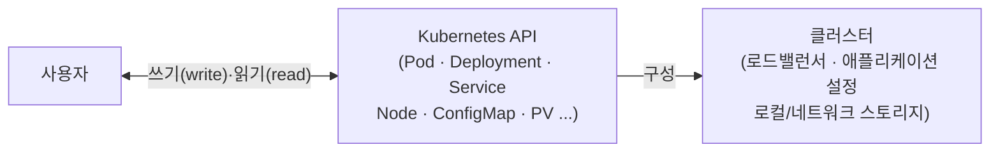
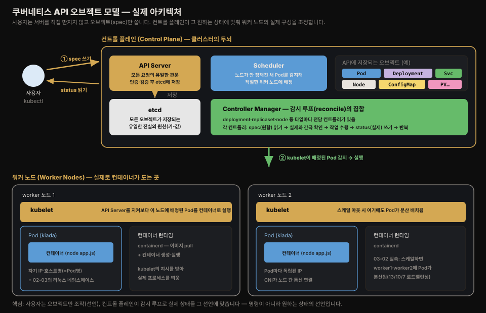
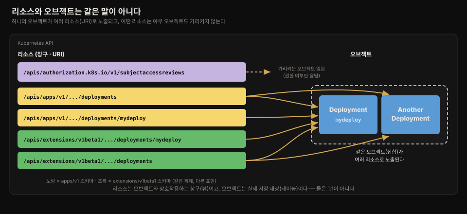
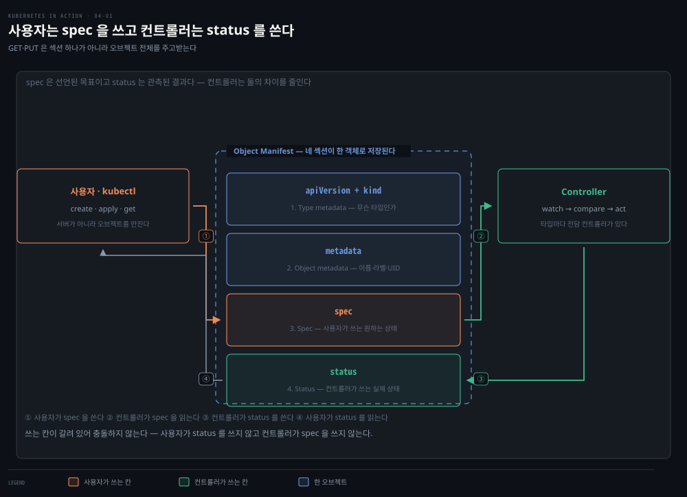

# 쿠버네티스 API와 오브젝트 매니페스트 구조
---
> 사용자든 쿠버네티스 컴포넌트든 클러스터와 상호작용하는 유일한 창구는 API입니다. 이 편에서는 그 API가 REST 스타일이라는 것이 실무에서 무엇을 뜻하는지, 리소스와 오브젝트가 왜 같은 말이 아닌지, 그리고 오브젝트 매니페스트를 이루는 네 개 섹션이 각각 누구의 책임인지를 정리합니다.


## 진입 — 이 문서를 읽고 나면 무엇을 할 수 있는가

> 이 문서를 읽고 나면 리소스와 오브젝트의 차이를 예시로 설명하고, 오브젝트 매니페스트의 type metadata·object metadata·spec·status 네 섹션이 각각 무엇을 담는지, 그리고 spec은 누가 쓰고 status는 누가 쓰는지를 그림 없이 말할 수 있습니다.

이 개념은 완전히 새로운 발상이 아닙니다. REST API로 리소스를 CRUD하는 것은 웹 백엔드 개발에서 이미 익숙한 패턴입니다. 다만 쿠버네티스는 그 리소스가 "저장된 데이터"가 아니라 "컨트롤러가 계속 감시하며 실제로 만들어 가는 목표 상태"라는 점이 다릅니다. 이 차이가 spec과 status를 나누는 이유이자, 이번 편 전체의 핵심입니다.


## 1. 쿠버네티스 API — REST 스타일의 클러스터 설정 창구

> 클러스터의 모든 설정(애플리케이션, 로드밸런서, 서버, 스토리지, 보안 권한 등)은 사용자와 쿠버네티스 컴포넌트가 API 오브젝트를 조작하는 것으로 이뤄집니다.

쿠버네티스 클러스터 안에서는 사용자든 쿠버네티스 컴포넌트든 API를 통해 오브젝트를 조작하는 방식으로 클러스터와 상호작용합니다. 이 오브젝트들이 클러스터 전체의 설정을 나타냅니다. 

클러스터에서 도는 애플리케이션과 그 설정, 클러스터 안팎으로 노출하는 로드밸런서, 애플리케이션이 쓰는 서버와 스토리지, 사용자·애플리케이션의 보안 권한을 비롯한 수많은 인프라 세부사항이 모두 여기 포함됩니다.



이 상호작용을 조금 더 구체적으로 펼쳐 보면, API 안에는 Pod·Deployment·Service·Node·ConfigMap·PersistentVolume처럼 서로 다른 종류의 오브젝트가 있고, 이들이 각각 클러스터 노드 안의 실제 구성 요소(로드밸런서·애플리케이션 설정·실행 중인 애플리케이션·로컬/네트워크 스토리지)를 나타냅니다. 아래 그림은 사용자가 개별 서버를 직접 만지는 대신 API 오브젝트를 조작하면 쿠버네티스가 실제 구성을 그 상태에 맞춘다는 관계를 종합해 보여줍니다.



쿠버네티스 API는 HTTP 기반의 RESTful API입니다. 상태는 리소스로 표현되고, 이 리소스에 대한 CRUD(create·read·update·delete) 작업은 POST·GET·PUT/PATCH·DELETE 같은 표준 HTTP 메서드로 수행됩니다.

> **REST**는 Representational State Transfer의 줄임말로, Roy Thomas Fielding이 박사 학위 논문에서 설명한 아키텍처 스타일입니다. 웹 서비스를 통해 컴퓨터 시스템 사이의 상호운용성을 상태 없는(stateless) 방식으로 구현합니다.

클러스터 설정을 조작한다는 것은 결국 이 리소스(오브젝트)를 조작한다는 뜻입니다. 클러스터 관리자와 애플리케이션을 배포하는 엔지니어는 이 오브젝트를 조작함으로써 클러스터 설정에 영향을 미칩니다. 쿠버네티스 커뮤니티에서는 "리소스"와 "오브젝트"가 흔히 같은 뜻으로 쓰이지만, 미묘한 차이가 있어 짚고 넘어갈 필요가 있습니다.


## 2. 리소스와 오브젝트는 같은 말이 아니다

> 하나의 오브젝트가 여러 리소스로 노출될 수 있고, 반대로 어떤 리소스는 오브젝트를 전혀 만들지 않기도 합니다 — 관계형 DB의 테이블과 뷰에 비유할 수 있는 차이입니다.

RESTful API의 핵심 개념은 리소스이며, **각 리소스에는 고유하게 식별하는 URI(Uniform Resource Identifier)가 붙습니다**. 예를 들어 쿠버네티스 API에서 애플리케이션 배포는 deployment 리소스로 표현됩니다. 여기서 소문자 `deployments`는 URI에 붙는 **API 리소스 이름**이고, 대문자 `Deployment`는 그 리소스가 가리키는 **오브젝트 타입(kind)**입니다 — 이 구분을 잡아 두면 아래 설명이 헷갈리지 않습니다.

- 클러스터의 모든 deployment 모음은 `/api/v1/deployments`에 노출되는 REST 리소스입니다. 이 URI에 GET 메서드로 HTTP 요청을 보내면 클러스터의 모든 deployment 인스턴스 목록을 응답으로 받습니다. 
- 각 개별 deployment 인스턴스도 자기만의 고유한 URI를 가지며, 그 URI로 개별 조작이 가능합니다. GET 요청으로 정보를 조회하고, PUT 요청으로 수정합니다.

**즉 하나의 오브젝트가 하나 이상의 리소스로 노출될 수 있습니다.** 

- 이름이 `mydeploy`인 Deployment 오브젝트 인스턴스는, 컬렉션(`/deployments`)을 조회할 때는 그 목록의 한 요소로 돌아오고, 개별 리소스 URI를 직접 조회할 때는 단일 오브젝트로 돌아옵니다.

여기에 더해, 한 오브젝트 타입에 여러 API 버전이 존재하면 같은 오브젝트 인스턴스가 여러 리소스로 노출되기도 합니다. 쿠버네티스 1.15 버전까지는 Deployment 오브젝트의 두 가지 표현이 API에 함께 노출됐습니다. 

- `apps/v1` 버전(`/apis/apps/v1/deployments`)
- 더 오래된 `extensions/v1beta1` 버전(`/apis/extensions/v1beta1/deployments`)

이 두 리소스는 서로 다른 Deployment 오브젝트 집합을 나타내는 게 아니라, 스키마에 작은 차이가 있는 **하나의 집합을 두 가지 방식으로** 표현한 것입니다. 첫 번째 URI로 Deployment 오브젝트 인스턴스를 만들고, 두 번째 URI로 그 인스턴스를 다시 읽어올 수 있었습니다.

**어떤 경우에는 리소스가 아예 어떤 오브젝트도 나타내지 않습니다.** 한 예로 쿠버네티스 API는 어떤 주체(사람 또는 서비스)가 특정 API 작업을 수행할 권한이 있는지 검증하는 방법을 제공합니다. 

- `/apis/authorization.k8s.io/v1/subjectaccessreviews` 리소스에 POST 요청을 보내면, 그 응답이 요청 본문에 명시한 작업을 수행할 권한이 있는지 알려줍니다. 
- 여기서 중요한 점은 이 POST 요청이 **어떤 오브젝트도 만들지 않는다**는 것입니다.

관계형 데이터베이스에 익숙하다면, 리소스와 오브젝트 타입을 뷰(view)와 테이블(table)에 비유할 수 있습니다. 리소스는 오브젝트와 상호작용하는 **창구**입니다.

이 "하나의 오브젝트 → 여러 리소스"는 **서브리소스**에서도 나타납니다. 같은 Deployment 오브젝트가 `deployments`(오브젝트 전체) 외에 `deployments/scale`·`deployments/status` 같은 서브리소스로도 노출됩니다. 앞 편(03-02)에서 쓴 `kubectl scale`은 오브젝트 전체가 아니라 `scale` 서브리소스만 조작해 복제본 수를 바꾼 것입니다. 이처럼 리소스는 오브젝트와 1:1이 아니라, 하나의 오브젝트를 여러 창구로 들여다보거나 부분만 조작하는 통로가 됩니다.

> **용어 표기 원칙** — "리소스"라는 용어는 CPU·메모리 같은 컴퓨팅 자원을 가리킬 때도 쓰이므로 혼동을 피하기 위해, 이 책 전체에서 API 리소스를 가리킬 때는 "오브젝트"라는 용어를 씁니다.



맨 위 `subjectaccessreviews` 리소스는 어떤 저장된 오브젝트와도 연결되지 않고, 나머지 네 리소스가 같은 오브젝트(`mydeploy` 등)를 서로 다른 방식으로 가리키는 것을 볼 수 있습니다. 노란 두 리소스는 `apps/v1` 스키마, 초록 두 리소스는 `extensions/v1beta1` 스키마로, 같은 객체를 다른 표현으로 노출합니다.


## 3. 오브젝트는 JSON 또는 YAML로 표현된다

> GET 요청의 기본 응답 형식은 JSON이지만 YAML도 요청할 수 있고, 오브젝트를 갱신할 때도 같은 형식으로 새 상태 전체를 보냅니다.

리소스에 GET 요청을 보내면 쿠버네티스 API 서버는 구조화된 텍스트 형태로 오브젝트를 반환합니다. 기본 데이터 모델은 JSON이지만, 서버에 YAML로 반환하도록 요청할 수도 있습니다. POST나 PUT 요청으로 오브젝트를 갱신할 때도 새로운 상태를 JSON이나 YAML로 명시합니다.

매니페스트의 개별 필드는 오브젝트 타입마다 다르지만, 전체 구조와 많은 필드는 모든 쿠버네티스 API 오브젝트가 공유합니다.


## 4. 오브젝트 매니페스트의 네 가지 섹션

> 대부분의 쿠버네티스 API 오브젝트 매니페스트는 type metadata·object metadata·spec·status 네 섹션으로 이뤄지며, 이 구조를 먼저 익혀 두면 수백 줄짜리 매니페스트도 길을 잃지 않고 읽을 수 있습니다.

대부분의 쿠버네티스 API 오브젝트 매니페스트는 다음 네 섹션으로 구성됩니다.

1. **Type metadata** (YAML 키 `apiVersion` + `kind`) — 매니페스트가 설명하는 오브젝트의 타입 정보를 담습니다. 오브젝트 타입, 그 타입이 속한 그룹, API 버전을 명시합니다.
2. **Object metadata** (YAML 키 `metadata`) — 오브젝트 인스턴스의 기본 정보(이름, 생성 시각, 소유자 등 식별 정보)를 담습니다. 이 필드들은 모든 오브젝트 타입에서 동일합니다.
3. **Spec** (YAML 키 `spec`) — 오브젝트의 **원하는 상태**를 명시하는 부분입니다. 오브젝트 타입마다 필드가 다릅니다. Pod라면 컨테이너·스토리지 볼륨 등 동작에 관련된 정보를 여기 적습니다.
4. **Status** (YAML 키 `status`) — 오브젝트의 현재 **실제 상태**를 담습니다. Pod라면 Pod의 상태, 각 컨테이너의 상태, IP 주소, 도는 노드 등 Pod에 무슨 일이 일어나고 있는지 보여주는 정보가 여기 들어갑니다.

> ⚠️ **키는 5개인데 섹션은 4개입니다.** `apiVersion`과 `kind` 두 키가 묶여 ① Type metadata 한 섹션을 이룹니다.
>
> **Type metadata에는 `metadata` 키가 들어가지 않습니다.** `metadata` 키는 ② Object metadata 전용입니다. 이름이 둘 다 "metadata"라 착각하기 쉽지만, "이게 무슨 타입인가"는 `apiVersion`+`kind`가, "이 인스턴스가 누구인가"는 `metadata`가 담습니다.



사용자는 spec에 쓰고 status를 읽습니다. 다만 실제로는 GET 요청을 보낼 때 API 서버가 항상 오브젝트 **전체**를 반환하고, 오브젝트를 갱신할 때도 PUT 요청에 오브젝트 전체를 담아 보냅니다 — spec만 따로 쓰거나 status만 따로 읽는 부분 접근은 없습니다.


## 5. spec은 누가 쓰고, status는 누가 쓰는가

> 사용자가 spec을 쓰고 status를 읽는다면, 그 반대는 누구일까요? 답은 컨트롤러입니다 — 대부분의 오브젝트 타입마다 전담 컨트롤러가 하나씩 있습니다.

앞서 본 것처럼 오브젝트에서 가장 중요한 두 부분은 **spec**과 **status**입니다. 사용자는 spec으로 오브젝트의 원하는 상태를 지정하고, status에서 오브젝트의 실제 상태를 읽습니다. 그렇다면 spec을 읽고 status를 쓰는 쪽은 누구일까요?

쿠버네티스 컨트롤 플레인은 **컨트롤러**라 부르는 여러 컴포넌트를 돌리며, 이들이 사용자가 만든 오브젝트를 관리합니다. 각 컨트롤러는 보통 하나의 오브젝트 타입만 책임집니다. 예를 들어 deployment 컨트롤러는 Deployment 오브젝트를 관리합니다.

이 컨트롤러의 동작은 §4의 그림 오른쪽 절반에 이미 담겨 있습니다. 컨트롤러의 역할은 오브젝트의 Spec 섹션에서 원하는 상태를 읽고, 그 상태를 이루기 위해 필요한 작업을 클러스터 안팎에서 수행한 뒤, 오브젝트의 Status 섹션에 실제 상태를 다시 써서 보고하는 것입니다.

정리하면, 사용자는 API 오브젝트를 만들고 갱신함으로써 쿠버네티스에게 무엇을 해야 하는지 알려줍니다. 쿠버네티스 컨트롤러는 같은 API 오브젝트를 이용해 자신이 무엇을 했고 그 작업의 상태가 어떤지 사용자에게 알려줍니다. 거의 모든 오브젝트 타입에는 그에 대응하는 컨트롤러가 있고, 이 컨트롤러가 spec을 읽고 status를 씁니다 — 이 한 문장이 이번 편의 핵심입니다.

### 실제 확인 — 살아있는 Deployment로 네 섹션과 spec·status 분리 보기

앞 편(03-02)에서 배포한 `kiada` Deployment를 `kubectl get -o yaml`로 열면, 이 네 섹션이 실물로 그대로 나옵니다. 최상위 키만 추려 봅니다.

```bash
kubectl get deployment kiada -o yaml | grep -nE "^(apiVersion|kind|metadata|spec|status):"
#   1:apiVersion: apps/v1     ← ① type metadata (그룹 apps, 버전 v1)
#   2:kind: Deployment        ← ① type metadata (타입)
#   3:metadata:               ← ② object metadata (이름·uid·생성시각)
#   14:spec:                  ← ③ 원하는 상태 (내가 선언)
#   45:status:                ← ④ 실제 상태 (컨트롤러가 채움)
```

`apiVersion`+`kind`가 type metadata, `metadata`가 object metadata, `spec`·`status`가 원하는/실제 상태입니다. 이어서 spec과 status를 나란히 대조하면 "누가 무엇을 쓰는가"가 드러납니다.

```bash
# ③ spec — 내가 선언한 원하는 상태
kubectl get deployment kiada -o yaml | grep -E "^  replicas:|image:"
#   replicas: 3          ← kubectl scale 로 내가 선언
#   - image: kiada:0.1   ← 내가 지정한 이미지

# ④ status — deployment 컨트롤러가 채운 실제 상태
kubectl get deployment kiada -o yaml | grep -E "availableReplicas:|readyReplicas:|updatedReplicas:"
#   availableReplicas: 3
#   readyReplicas: 3     ← 실제로 준비된 복제본 수
#   updatedReplicas: 3
```

`spec.replicas: 3`(내가 원함)과 `status.readyReplicas: 3`(실제로 준비됨)이 **일치**하므로 배포가 성공한 상태입니다. 만약 이미지가 깨졌다면 spec은 3인데 `readyReplicas`는 0으로 벌어졌을 것입니다 — 이 **간극이 곧 배포 진행 상태**이고, `kubectl rollout status`가 확인하는 것도 바로 이 spec↔status 일치 여부입니다. 흥미로운 점은 `status`에도 `replicas` 필드가 있다는 것입니다. `spec.replicas`(내가 원하는 수)와 `status.replicas`(컨트롤러가 관측한 실제 수)는 이름이 같지만 **작성 주체가 달라서**, 같은 필드가 양쪽에 놓여 "원함 vs 실제"를 대조하도록 설계돼 있습니다.


## 6. 모든 오브젝트가 spec·status를 갖지는 않는다

> **spec과 status가 없는 오브젝트도 있습니다.**
>
> 정적인 데이터만 담고 있고 대응하는 컨트롤러가 없어, 원하는 상태와 실제 상태를 구분할 필요가 없는 경우입니다.

모든 쿠버네티스 API 오브젝트는 두 metadata 섹션을 갖지만, 모두가 spec과 status를 갖는 것은 아닙니다. 갖지 않는 오브젝트는 보통 정적인 데이터만 담고 있고, 대응하는 컨트롤러가 없어 원하는 상태와 실제 상태를 구분할 필요가 없습니다.

이런 오브젝트의 한 예가 **Event** 오브젝트입니다. 어떤 컨트롤러가 관리 중인 오브젝트에 무슨 일이 일어나고 있는지 추가 정보를 제공하려고 여러 컨트롤러가 만드는 오브젝트입니다. Event 오브젝트는 다음 편(04-02)에서 자세히 다룹니다.

이것으로 오브젝트의 전체 윤곽을 살펴봤습니다. 다음 편에서는 실제 Node·Event 오브젝트의 매니페스트를 열어 개별 필드를 하나씩 확인합니다.


## Spring 앱 개발 관점에서

> Spring Boot 앱이 쿠버네티스 API와 직접 마주치는 지점은 드물지만, Deployment의 spec-status 분리 원칙은 Actuator의 readiness/liveness 개념과 정확히 같은 발상을 공유합니다.

Spring Boot 앱을 배포한 Deployment 오브젝트를 생각해 보면, 개발자가 `kubectl apply`로 제출하는 YAML은 전부 spec입니다. 이미지, replica 수, 리소스 요청량, probe 설정까지 전부 "원하는 상태"의 선언입니다.

반대로 `kubectl get deployment myapp -o yaml`로 조회했을 때 나오는 status의 `availableReplicas`, `readyReplicas` 같은 필드는 deployment 컨트롤러가 실시간으로 채워 넣는 "실제 상태"입니다. 

애플리케이션 코드 자체는 이 spec/status 분리를 전혀 알 필요가 없지만, CI/CD 파이프라인에서 배포 성공 여부를 판단할 때는 이 구분이 중요해집니다. `kubectl rollout status deployment/myapp`이 확인하는 것도 결국 **spec(원하는 replica 수)과 status(실제 준비된 replica 수)가 일치하는지**입니다.

Actuator의 `/actuator/health/readiness`·`/actuator/health/liveness` 엔드포인트도 같은 패턴의 축소판입니다. Kubelet(컨트롤러 역할)이 Pod의 readiness probe 설정(spec에 해당)을 주기적으로 확인해 컨테이너 상태(status에 해당)를 판단하는 구조는, 이 편에서 본 "컨트롤러가 spec을 읽고 status를 쓴다"는 원칙이 Pod 단위로 축소된 형태입니다.


## 관련 문서

> 이 편은 쿠버네티스 API의 아키텍처 스타일과 오브젝트 매니페스트의 네 섹션 구조를 다룹니다. 다음 편(04-02)에서 이 구조를 Node·Event 오브젝트의 실제 YAML로 확인합니다.

- [04-02.Node와 Event 오브젝트로 보는 필드 실습](./04-02.Node%EC%99%80%20Event%20%EC%98%A4%EB%B8%8C%EC%A0%9D%ED%8A%B8%EB%A1%9C%20%EB%B3%B4%EB%8A%94%20%ED%95%84%EB%93%9C%20%EC%8B%A4%EC%8A%B5.md) — 이 편의 매니페스트 구조를 실제 Node·Event 오브젝트로 확인하는 다음 편
- [핵심 워크로드](../../kubernetes/01_foundation/01-02.%ED%95%B5%EC%8B%AC%20%EC%9B%8C%ED%81%AC%EB%A1%9C%EB%93%9C.md) — 이 편에서 예시로 든 Deployment 오브젝트의 세부 필드를 깊게 다룬 편
- [Kubernetes 공식 문서 — API Reference](https://kubernetes.io/docs/reference/) — 오브젝트 타입별 전체 필드 명세
