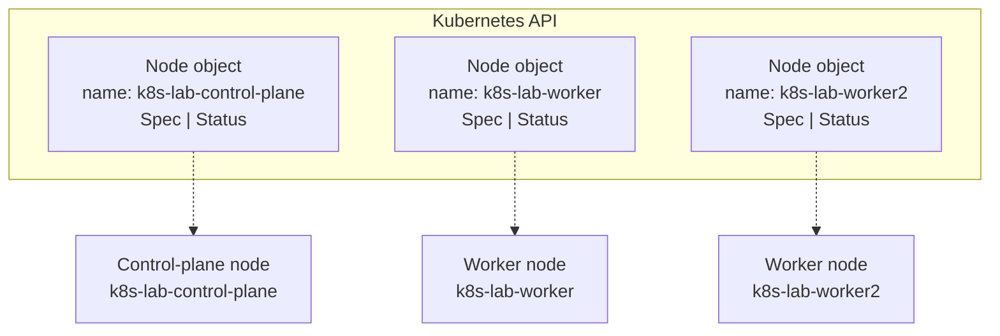
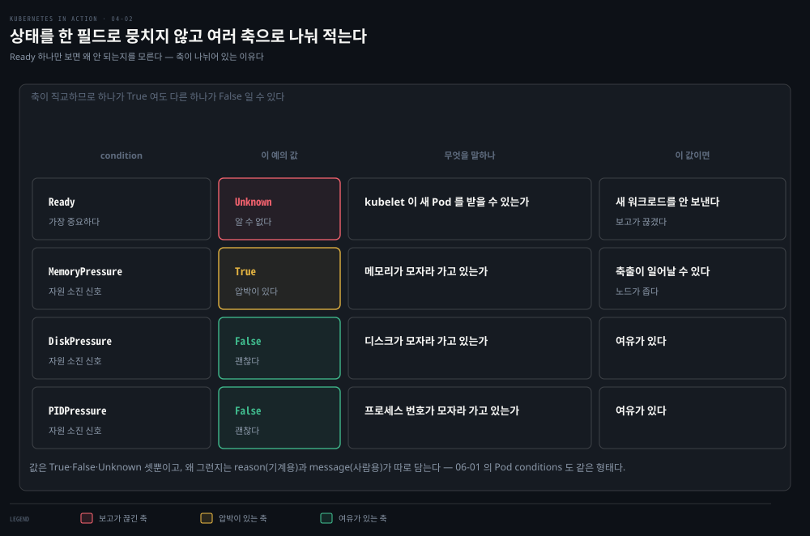
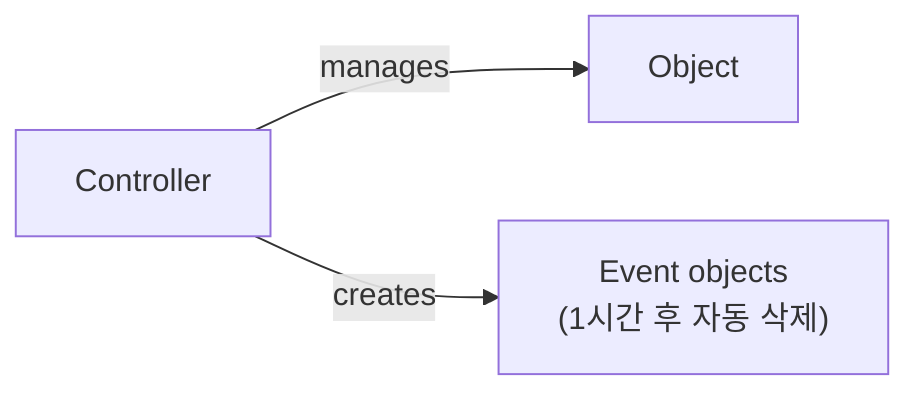

# Node와 Event 오브젝트로 보는 필드 실습
---
> 앞 편에서 오브젝트 매니페스트의 네 섹션 구조를 개념으로 익혔다면, 이 편에서는 손에 잡히는 두 예시 — 클러스터의 컴퓨터를 나타내는 Node 오브젝트와 컨트롤러가 무슨 일을 했는지 알려주는 Event 오브젝트 — 로 그 구조를 직접 확인합니다.


## 진입 — 이 문서를 읽고 나면 무엇을 할 수 있는가

> 이 문서를 읽고 나면 `kubectl get node -o yaml`로 Node 매니페스트를 읽고 네 섹션을 구분하며, `kubectl explain`으로 필드 문서를 조회하고, status conditions가 왜 단일 필드 대신 리스트로 설계됐는지, 그리고 **Event 오브젝트가 왜 매니페스트가 지저분해 보이는지 설명할 수 있습니다.**

이 개념은 앞 편에서 다룬 spec-status 원칙을 실제 오브젝트에 대입해 보는 작업입니다. Node 오브젝트는 여러분이 이미 아는 대상(클러스터를 이루는 컴퓨터 한 대)을 가리키므로, 추상적인 구조를 구체적인 필드값으로 확인하기에 알맞은 예시입니다.


## 1. Node 오브젝트 — 클러스터를 이루는 컴퓨터 한 대

> 클러스터의 각 컴퓨터는 정확히 하나의 Node 오브젝트로 표현되며, 그 spec에는 호스트 설정 일부가, status에는 호스트의 실제 상태가 담깁니다.



kind 도구로 만든 클러스터는 컨트롤 플레인 하나, 워커 둘로 총 세 노드를 가질 수 있습니다. 이 노드들은 API에서 세 개의 Node 오브젝트로 표현됩니다. `kubectl get nodes`로 이 오브젝트를 조회할 수 있습니다.

```bash
kubectl get nodes
# NAME                    STATUS   ROLES           AGE   VERSION
# k8s-lab-control-plane   Ready    control-plane   44h   v1.35.0
# k8s-lab-worker          Ready    <none>          44h   v1.35.0
# k8s-lab-worker2         Ready    <none>          44h   v1.35.0
```

> 노드 이름은 `kind create cluster --name <이름>`으로 지정한 클러스터 이름을 접두어로 씁니다. 이 학습에서는 `k8s-lab` 클러스터를 만들었으므로 접두어가 `k8s-lab-`입니다. 이름은 클러스터마다 다르므로, 아래 실습 명령의 노드 이름은 자기 환경에 맞춰 바꿔 읽으면 됩니다. 참고로 최신 버전에서는 `ROLES`가 `master`가 아니라 `control-plane`으로 표기됩니다(`master`는 2020년 이후 비권장 용어로 대체됨).

각 Node 오브젝트 인스턴스는 호스트 한 대를 나타냅니다. 각 인스턴스에서 spec 섹션은 그 호스트 설정의 일부를, status 섹션은 그 호스트의 상태를 담습니다.

> Node 오브젝트는 다른 오브젝트와 조금 다릅니다. 보통 사용자가 아니라 **Kubelet**(클러스터 노드에서 도는 노드 에이전트)이 만들기 때문입니다. 
>
> 머신을 클러스터에 추가하면 Kubelet이 그 호스트를 나타내는 Node 오브젝트를 만들며 등록합니다. 이후 사용자는 spec 섹션의 (일부) 필드를 편집할 수 있습니다.


## 2. Node 오브젝트의 전체 매니페스트 훑어보기

> `kubectl get node <name> -o yaml`로 받은 매니페스트는 실제로 apiVersion·kind부터 시작해 metadata·spec·status 순서로 나타나며, 이 순서가 우연히 알파벳 순과 겹쳐 읽기 편합니다.

`kubectl get nodes`로 노드 목록을 확인한 뒤, 조회하려는 노드 하나를 골라 `kubectl get node <node-name> -o yaml`을 실행합니다.

```yaml
apiVersion: v1                                   # Type metadata
kind: Node                                       # Type metadata

metadata:                                        # Object metadata 시작
  annotations: ...
  creationTimestamp: "2020-05-03T15:09:17Z"
  labels: ...
  name: k8s-lab-control-plane                       # 오브젝트 이름(노드 이름)
  resourceVersion: "3220054"
  selfLink: /api/v1/nodes/k8s-lab-control-plane
  uid: 16dc1e0b-8d34-4cfb-8ade-3b0e91ec838b
  
spec:                                            # Spec — 원하는 상태 시작
  podCIDR: 10.244.0.0/24                         # 이 노드에 배정된 Pod IP 범위
  podCIDRs:
  - 10.244.0.0/24
  taints:
  - effect: NoSchedule
    key: node-role.kubernetes.io/master
    
status:                                          # Status — 실제 상태 시작
  addresses:                                     # 노드의 IP·호스트명
  - address: 172.18.0.2
    type: InternalIP
  - address: k8s-lab-control-plane
    type: Hostname
  allocatable: ...
  capacity:                                      # 노드가 제공할 수 있는 컴퓨팅 자원량
    cpu: "8"
    ephemeral-storage: 401520944Ki
    hugepages-1Gi: "0"
    hugepages-2Mi: "0"
    memory: 32720824Ki
    pods: "110"
  conditions: ...
  daemonEndpoints:
    kubeletEndpoint:
      Port: 10250
  images:                                        # 노드에 캐시된 컨테이너 이미지 목록
  - names:
    - k8s.gcr.io/etcd:3.4.3-0
    sizeBytes: 289997247
    ...
  nodeInfo:                                      # OS와 쿠버네티스 컴포넌트 버전 정보
    architecture: amd64
    bootID: 233a359f-5897-4860-863d-06546130e1ff
    containerRuntimeVersion: containerd://1.3.3-14-g449e9269
    kernelVersion: 5.5.10-200.fc31.x86_64
    kubeProxyVersion: v1.35.0
    kubeletVersion: v1.35.0
    machineID: 74b74e389bb246e99abdf731d145142d
    operatingSystem: linux
    osImage: Ubuntu 19.10
    systemUUID: 8749f818-8269-4a02-bdc2-84bf5fa21700
```

> `-o json` 옵션을 주면 YAML 대신 JSON으로 표시됩니다.

### 각 섹션 다시 짚기

- **Type metadata** — `apiVersion`과 `kind`로 시작합니다. `apiVersion`은 이 오브젝트를 설명하는 스키마입니다. 
  - 앞 편에서 본 것처럼 한 오브젝트 타입이 여러 스키마와 연결될 수 있지만, 보통은 타입마다 스키마가 하나뿐입니다. 
  - 여기서는 `v1`이지만, Deployment 오브젝트라면 `apps/v1`처럼 API 그룹까지 포함됩니다. 
  - Node 오브젝트는 **core API 그룹**에 속하는데, 이 그룹은 관례상 `apiVersion`에 표기하지 않습니다.

- **Object metadata** — 인스턴스 이름과 labels·annotations 같은 추가 속성, 그리고 `resourceVersion`·`managedFields` 같은 저수준 필드를 담습니다.
- **Spec** — Node 오브젝트는 다른 타입에 비해 상대적으로 짧습니다. `podCIDR` 필드는 이 노드에 배정된 Pod IP 범위이고, 이 노드에서 도는 Pod는 이 범위에서 IP를 할당받습니다. `taints` 필드는 지금 단계에서는 중요하지 않습니다.
- **Status** — Node의 IP 주소·호스트명, 컴퓨팅 자원 제공 용량, 현재 condition들, 이미 다운로드해 캐시해 둔 컨테이너 이미지, OS·쿠버네티스 컴포넌트 버전 정보를 보여줍니다.

### API를 직접 호출하기

`kubectl` 대신 API를 직접 호출해 볼 수도 있습니다. 쿠버네티스 API는 웹 기반이므로 브라우저나 `curl`로 조작할 수 있지만, API 서버는 TLS를 쓰므로 보통 클라이언트 인증서나 토큰이 필요합니다. `kubectl`이 제공하는 프록시를 쓰면 이 인증을 대신 처리해 주므로, 프록시를 거쳐 평범한 HTTP로 API와 대화할 수 있습니다.

```bash
kubectl proxy
# Starting to serve on 127.0.0.1:8001
```

이제 `http://127.0.0.1:8001/api/v1/nodes/k8s-lab-control-plane`을 열면 Node 오브젝트를 바로 확인할 수 있습니다.


## 3. kubectl explain으로 필드 문서 찾아보기

> API 레퍼런스 문서를 웹에서 찾아보는 대신, `kubectl explain`으로 커맨드라인에서 바로 필드 설명을 조회할 수 있습니다.

개별 필드에 대해 더 알고 싶다면 `http://kubernetes.io/docs/reference/`의 API 레퍼런스 문서를 참고하거나, `kubectl explain` 명령을 씁니다.

```bash
kubectl explain nodes
# KIND:     Node
# VERSION:  v1
#
# DESCRIPTION:
#      Node is a worker node in Kubernetes. Each node will have a unique
#      identifier in the cache (i.e. in etcd).
#
# FIELDS:
#    apiVersion   <string>
#      APIVersion defines the versioned schema of this representation of an
#      object. ...
#    kind <string>
#      Kind is a string value representing the REST resource this object
#      represents. ...
#    metadata     <Object>
#      Standard object's metadata. ...
#    spec <Object>
#      Spec defines the behavior of a node...
#    status       <Object>
#      Most recently observed status of the node. Populated by the system.
#      Read-only. ...
```

이 명령은 오브젝트의 기본 설명과 함께 최상위 필드 목록을 보여줍니다. 여기서 더 깊이 들어가 특정 필드 아래의 하위 필드를 찾아볼 수 있습니다.

```bash
kubectl explain node.spec
# KIND:     Node
# VERSION:  v1
#
# RESOURCE: spec <Object>
#
# DESCRIPTION:
#      Spec defines the behavior of a node.
#      NodeSpec describes the attributes that a node is created with.
#
# FIELDS:
#    configSource <Object>
#      ...
#    externalID   <string>
#      Deprecated. ...
#    podCIDR      <string>
#      PodCIDR represents the pod IP range assigned to the node.
```

- 출력 맨 위에 표시되는 API 버전에 주의합니다. 앞서 설명했듯 같은 타입에 여러 버전이 존재할 수 있고, 버전마다 필드나 기본값이 다를 수 있습니다. 
- 다른 버전을 보고 싶다면 `--api-version` 옵션으로 지정합니다.

> 오브젝트의 전체 구조(설명 없이 계층적 필드 목록 전체)를 보고 싶다면 `kubectl explain pods --recursive`를 씁니다.


## 4. status conditions — 왜 단일 필드가 아니라 리스트인가

> spec과 status의 필드 구성은 오브젝트 타입마다 다르지만, `conditions` 필드는 많은 타입에서 공통으로 나타나며 문제 진단에 특히 유용합니다.



Node 오브젝트의 status에서 `conditions` 필드만 따로 떼어 보면 다음과 같습니다.

```yaml
status:
  conditions:
  - lastHeartbeatTime: "2020-05-17T13:03:42Z"
    lastTransitionTime: "2020-05-03T15:09:17Z"
    message: kubelet has sufficient memory available
    reason: KubeletHasSufficientMemory
    status: "False"                # 메모리 부족 아님
    type: MemoryPressure
  - lastHeartbeatTime: "2020-05-17T13:03:42Z"
    lastTransitionTime: "2020-05-03T15:09:17Z"
    message: kubelet has no disk pressure
    reason: KubeletHasNoDiskPressure
    status: "False"                # 디스크 공간 부족 아님
    type: DiskPressure
  - lastHeartbeatTime: "2020-05-17T13:03:42Z"
    lastTransitionTime: "2020-05-03T15:09:17Z"
    message: kubelet has sufficient PID available
    reason: KubeletHasSufficientPID
    status: "False"                # 사용 가능한 PID 소진 아님
    type: PIDPressure
  - lastHeartbeatTime: "2020-05-17T13:03:42Z"
    lastTransitionTime: "2020-05-03T15:10:15Z"
    message: kubelet is posting ready status
    reason: KubeletReady
    status: "True"                 # 노드가 준비됨
    type: Ready
```

> `jq` 도구를 쓰면 오브젝트 구조의 일부만 골라 볼 수 있어 편리합니다. 
>
> - 예를 들어 `kubectl get node <name> -o json | jq .status.conditions`로 conditions만 뽑아볼 수 있습니다. YAML용 동등 도구는 `yq`입니다.

위 네 condition이 각각 무엇을 감시하는지 정리하면 다음과 같습니다. 이름의 `Pressure`는 "자원이 쪼들리는 압박"을 뜻하므로, 앞의 세 개는 **`status: "False"`가 정상**(압박 없음)이고 `Ready`만 **`status: "True"`가 정상**(준비됨)입니다. 방향이 반대라는 점이 처음에는 헷갈리기 쉽습니다.

| type | 무엇을 감시하나 | 정상값 | `True`(비정상)가 되면 |
|------|----------------|--------|----------------------|
| `MemoryPressure` | 노드의 **메모리(RAM)** 여유 | `False` | 메모리 부족 — kubelet이 Pod를 축출(evict)하기 시작 |
| `DiskPressure` | 노드의 **디스크 공간**·inode 여유 | `False` | 디스크 부족 — 이미지를 못 받아 새 Pod를 못 띄움 |
| `PIDPressure` | 노드의 **프로세스 ID(PID)** 여유 | `False` | PID 고갈 — 컨테이너가 새 프로세스를 못 만듦 |
| `Ready` | 위를 종합해 **Pod를 받을 준비**가 됐나 | `True` | (`False`면) 스케줄러가 이 노드에 새 Pod를 배치하지 않음 |

앞의 세 `Pressure`는 02-03에서 본 자원 격리와 이어집니다 — `MemoryPressure`는 cgroup 메모리 한계, `PIDPressure`는 PID 네임스페이스의 그 PID입니다. 노드 전체에서 해당 자원이 쪼들리면 kubelet이 이 condition을 `True`로 올리고, 심하면 Pod를 쫓아냅니다. `Ready`는 이 셋을 포함한 여러 신호를 종합한 최종 판정이라, 실무에서 `kubectl get nodes`의 `STATUS` 열에 그대로 반영됩니다.

#### PIDPressure는 형식적 지표가 아니다 — PID 고갈은 실제로 일어난다

`MemoryPressure`·`DiskPressure`는 직관적이지만 `PIDPressure`는 낯설 수 있습니다. 리눅스는 PID를 무한정 주지 않기 때문에 실제로 고갈됩니다. 흔한 시나리오는 셋입니다.

- **프로세스 누수** — 자식 프로세스를 만들고 회수(`wait`)하지 않아 좀비가 쌓이는 경우입니다. 무한 재시도 루프가 서브프로세스를 계속 만드는 경우도 같습니다.
- **스레드 폭증** — 리눅스에서는 **스레드도 PID를 소비**합니다. JVM 앱이 `ExecutorService`를 요청마다 만들고 `shutdown()`하지 않으면 수만 개 태스크로 한도에 부딪힙니다.
- **컨테이너 밀도** — 노드 하나에 Pod가 최대 110개까지 뜹니다(위 `capacity.pods`). 한 Pod의 프로세스 누수가 노드 전체 PID를 잠식해 다른 Pod까지 새 프로세스를 못 만듭니다.

실제 한도를 우리 클러스터의 worker 노드에서 확인하면, **번호 공간과 실제 태스크 한도가 다르다**는 점이 드러납니다.

```bash
# kind 노드는 도커 컨테이너이므로 그 안의 커널 값을 직접 조회
docker exec k8s-lab-worker cat /proc/sys/kernel/pid_max      # 4194304  (PID 번호 공간, 2^22)
docker exec k8s-lab-worker cat /proc/sys/kernel/threads-max  # 15742    (동시 태스크 실제 상한)
docker exec k8s-lab-worker sh -c 'ls -d /proc/[0-9]* | wc -l' # 29      (현재 사용 — 거의 놀고 있음)
```

`pid_max`(419만)는 PID **번호**가 wrap around하는 한계일 뿐이고, 실제 병목은 대개 `threads-max`(여기서는 15,742)입니다. 이 값은 노드 메모리에 비례해 커널이 자동 설정하므로 메모리가 큰 실서버일수록 커집니다 — 스레드마다 커널 스택 메모리를 쓰기 때문입니다.

현재 29개만 쓰고 있어 `PIDPressure`가 뜰 여지가 없습니다. 다만 스레드 누수 앱이 이 값을 `threads-max` 근처까지 끌어올리면 kubelet이 `PIDPressure: True`로 올리고 스케줄러가 이 노드를 회피합니다.

방어선은 02-03의 cgroup입니다. kubelet의 `--pod-max-pids`로 **Pod당 PID 상한**을 걸면 cgroup `pids.max`로 강제돼, 한 Pod가 노드 전체 PID를 잡아먹는 것을 막습니다. 요약하면 `PIDPressure`는 **fork 폭탄·스레드 누수로 노드가 마비되는 실제 장애를 막는 안전장치**입니다.

**노드 상태를 드러내는 조건이 네 가지 있습니다.** 

- 각 condition은 `type`과 `status` 필드를 가지며 `status`는 `True`·`False`·`Unknown` 중 하나입니다. 
- condition은 마지막 전환의 기계 판독용 사유(`reason`)와 사람이 읽을 메시지(`message`)도 함께 담을 수 있습니다. 
- `lastTransitionTime`은 이 condition이 한 상태에서 다른 상태로 바뀐 시각을, `lastHeartbeatTime`은 컨트롤러가 이 condition에 대한 갱신을 마지막으로 받은 시각을 나타냅니다.

이 절 머리의 그림이 Node 오브젝트의 status 안에 conditions가 어떻게 자리 잡는지, 그리고 각 condition의 type과 상태값(True/False/Unknown)이 색으로 어떻게 구분되는지 보여줍니다.

- 목록의 마지막 항목이지만, 가장 먼저 봐야 할 것은 `Ready` condition입니다. 이 condition이 노드가 새 워크로드(Pod)를 받아들일 준비가 됐는지를 알려주기 때문입니다. 
- 나머지 세 condition(`MemoryPressure`·`DiskPressure`·`PIDPressure`)은 노드가 자원을 소진해 가는지를 알려줍니다. 노드가 이상하게 동작하기 시작하면(예: 애플리케이션이 자원 부족으로 죽기 시작하면) 이 condition들을 확인해야 합니다.

> condition은 보통 **직교적(orthogonal)** 입니다 — 서로 무관한 상태의 측면을 각각 나타낸다는 뜻입니다.

다른 여러 오브젝트 타입도 Node와 마찬가지로 condition 리스트를 씁니다. 만약 오브젝트 상태를 단일 필드 하나로 표현했다면, 나중에 새로운 값을 추가하기가 몹시 어려웠을 것입니다. 그 상태를 감시하고 그에 따라 동작하는 모든 클라이언트를 함께 갱신해야 하기 때문입니다. 일부 오브젝트 타입은 원래 이런 단일 필드를 썼고 지금도 일부는 그렇지만, 대부분은 이제 condition 리스트를 씁니다.

> 연습 삼아 지금까지 만든 다른 오브젝트(Deployment·Service·Pod)에도 `kubectl get <kind> <name> -o yaml`을 실행해 구조를 직접 확인해 볼 수 있습니다.

### 실제 확인 — 살아있는 노드의 conditions와 4섹션

앞 편들에서 쓴 `k8s-lab` 클러스터의 실제 worker 노드로 확인하면, 책의 옛 예제와 같은 구조가 지금 버전에서도 그대로 나옵니다. 먼저 4섹션 뼈대입니다.

```bash
kubectl get node k8s-lab-worker -o yaml | grep -nE "^(apiVersion|kind|metadata|spec|status):"
#   1:apiVersion: v1     ← Deployment는 apps/v1 이었지만 Node는 코어 그룹 v1
#   2:kind: Node
#   3:metadata:
#   17:spec:
#   22:status:
```

`apiVersion`이 Deployment의 `apps/v1`과 달리 Node는 `v1`(코어 그룹)입니다 — type metadata가 타입마다 다르다는 04-01 개념이 여기서 보입니다. 이어서 이 편의 핵심인 conditions를 뽑아 봅니다.

```bash
kubectl get node k8s-lab-worker \
  -o jsonpath='{range .status.conditions[*]}{.type}{"\t"}{.status}{"\t"}{.reason}{"\n"}{end}'
#   MemoryPressure  False   KubeletHasSufficientMemory
#   DiskPressure    False   KubeletHasNoDiskPressure
#   PIDPressure     False   KubeletHasSufficientPID
#   Ready           True    KubeletReady
```

4개의 condition이 각각 독립적으로 나옵니다. 왜 단일 `healthy: true` 하나가 아니라 이렇게 나눴을까요? 노드가 문제일 때 **"왜" 문제인지**를 구분하기 위해서입니다.

만약 `Ready`가 `False`로 떨어졌다면, 나머지 조건을 보고 "메모리 압박(`MemoryPressure: True`) 때문"인지 "디스크 부족" 때문인지 원인을 짚을 수 있습니다. 단일 boolean이면 "안 좋다"만 알고 이유를 모릅니다.

각 condition의 `reason`(`KubeletHasSufficientMemory` 등)은 사람이 아니라 **기계가 읽는 사유 코드**라, 모니터링·알림 자동화가 이 값을 근거로 동작합니다. kubelet이 이 status를 실시간으로 갱신한다는 점에서, 이것은 04-01의 "컨트롤러가 status를 쓴다"의 구체적 사례입니다.


## 5. kubectl describe — 더 읽기 좋은 오브젝트 조회

> `kubectl describe`는 YAML 매니페스트와 같은 정보를, 때로는 그보다 더 많은 정보를 사람이 읽기 좋은 형태로 보여줍니다.

이번에는 컨트롤 플레인 대신 워커 노드 하나를 `kubectl describe`로 조회해 봅니다.

```bash
kubectl describe node k8s-lab-worker2
# Name:               k8s-lab-worker2
# Roles:              <none>
# Labels:             beta.kubernetes.io/arch=amd64
#                     ...
# Taints:             <none>
# Conditions:
#   Type             Status  ...  Reason                       Message
#   ----             ------  ---  ------                       -------
#   MemoryPressure   False   ...  KubeletHasSufficientMemory   ...
#   DiskPressure     False   ...  KubeletHasNoDiskPressure     ...
#   PIDPressure      False   ...  KubeletHasSufficientPID      ...
#   Ready            True    ...  KubeletReady                 ...
# Addresses:
#   InternalIP:  172.18.0.4
#   Hostname:    k8s-lab-worker2
# Capacity:
#   cpu:                8
#   memory:             32720824Ki
#   pods:               110
# Non-terminated Pods:          (2 in total)
#   Namespace     Name               CPU Requests  CPU Limits  ...
#   ---------     ----               ------------  ----------  ...
#   kube-system   kindnet-4xmjh      100m (1%)     100m (1%)   ...
#   kube-system   kube-proxy-dgkfm   0 (0%)        0 (0%)      ...
# Allocated resources:
#   (Total limits may be over 100 percent, i.e., overcommitted.)
#   Resource           Requests   Limits
#   --------           --------   ------
#   cpu                100m (1%)  100m (1%)
#   memory             50Mi (0%)  50Mi (0%)
# Events:
#   Type    Reason                   Age    From                      Message
#   ----    ------                   ----   ----                      -------
#   Normal  Starting                 3m50s  kubelet, k8s-lab-worker2     ...
#   Normal  NodeHasSufficientMemory  3m50s  kubelet, k8s-lab-worker2     ...
```

`kubectl describe`는 YAML 매니페스트에서 본 정보를 더 읽기 좋은 형태로 보여줍니다. 이름·IP 주소·호스트명은 물론, condition과 사용 가능한 용량도 확인할 수 있습니다.

Node 오브젝트 자체에 담긴 정보 외에, `kubectl describe`는 그 노드에서 도는 Pod 목록(`Non-terminated Pods`)과 할당된 컴퓨팅 자원 총량(`Allocated resources`)도 함께 보여줍니다.

여기서 눈여겨볼 것은 "Total limits may be over 100 percent, i.e., overcommitted"라는 주석입니다. 노드에 배정된 Pod들의 리소스 limit 합계가 노드 용량의 100%를 넘을 수 있다는 뜻으로, 모든 Pod가 동시에 한도까지 쓰지는 않는다는 가정 아래 노드를 오버커밋해 활용률을 높이는 것이 허용됩니다.

그 아래로는 이 노드와 관련된 이벤트 목록이 나타납니다.

이 추가 정보는 Node 오브젝트 자체에 들어 있는 것이 아니라 `kubectl` 도구가 다른 API 오브젝트에서 수집한 것입니다. 예를 들어 이 노드에서 도는 Pod 목록은 pods 리소스로 Pod 오브젝트를 조회해서 얻습니다.

직접 `describe` 명령을 실행했는데 이벤트가 하나도 안 뜬다면, 최근에 발생한 이벤트만 표시되기 때문입니다. Node 오브젝트라면 노드에 자원 문제가 없는 한, 최근에 그 노드를 (재)시작했을 때만 이벤트가 보입니다.

사실상 모든 API 오브젝트 타입에 이벤트가 연결됩니다. 클러스터를 디버깅할 때 결정적인 역할을 하므로, 다른 오브젝트를 살펴보기 전에 이벤트를 자세히 짚고 넘어갈 필요가 있습니다.


## 6. Event 오브젝트로 클러스터에서 일어난 일 관찰하기

> 컨트롤러가 오브젝트의 원하는 상태를 실제 상태와 맞춰 가는 과정에서 무엇을 했는지 알려주는 것이 이벤트이며, Normal과 Warning 두 타입이 있습니다.



컨트롤러가 오브젝트의 spec에 명시된 원하는 상태와 실제 상태를 조정(reconcile)하는 작업을 수행하면서, 자신이 무엇을 했는지 드러내기 위해 이벤트를 생성합니다. 

이벤트에는 **Normal**과 **Warning** 두 타입이 있습니다. 후자는 보통 컨트롤러가 오브젝트를 조정하지 못하게 막는 무언가가 있을 때 생성됩니다. 이 타입의 이벤트를 지켜보면 클러스터에서 발생한 문제를 빠르게 알아챌 수 있습니다.

쿠버네티스의 다른 모든 것과 마찬가지로 이벤트도 쿠버네티스 API를 통해 만들어지고 읽히는 **Event 오브젝트**로 표현됩니다. 이 오브젝트는 오브젝트에 무슨 일이 있었는지, 그 이벤트의 출처가 무엇인지 정보를 담습니다. 다만 다른 오브젝트와 달리 각 Event 오브젝트는 생성된 지 한 시간 뒤에 삭제되는데, 쿠버네티스 API 오브젝트의 데이터 저장소인 etcd에 가해지는 부담을 줄이기 위해서입니다.

> 이벤트를 보관하는 시간은 API 서버의 커맨드라인 옵션으로 설정할 수 있습니다.

### kubectl get events로 이벤트 나열하기

`kubectl describe`가 보여주는 이벤트는 그 명령의 대상으로 지정한 오브젝트에 관련된 것만입니다. **이벤트는 본질적으로 짧은 시간에 한 오브젝트에 대해 여러 개가 만들어질 수 있어 오브젝트 자체의 일부가 아닙니다.** 노드나 지금까지 본 다른 오브젝트처럼 독립적으로 존재하므로, YAML 매니페스트 안에서는 찾을 수 없습니다.

이벤트가 독립된 오브젝트이므로 `kubectl get events`로 나열할 수 있습니다.

```bash
kubectl get ev
# LAST
# SEEN  TYPE    REASON                   OBJECT             MESSAGE
# 48s   Normal  Starting                 node/k8s-lab-worker2  Starting kubelet.
# 48s   Normal  NodeAllocatableEnforced  node/k8s-lab-worker2  Updated Node A...
# 48s   Normal  NodeHasSufficientMemory  node/k8s-lab-worker2  Node kind-work...
# 48s   Normal  NodeHasNoDiskPressure    node/k8s-lab-worker2  Node kind-work...
# 48s   Normal  NodeHasSufficientPID     node/k8s-lab-worker2  Node kind-work...
# 47s   Normal  Starting                 node/k8s-lab-worker2  Starting kube-...
```

> `ev`는 `events`의 축약 이름입니다.

일부 이벤트는 노드의 status conditions와 짝을 이루지만, 그 외의 추가 이벤트도 볼 수 있습니다. `Starting`이라는 사유(`reason`)를 가진 두 이벤트가 그 예입니다. 여기서는 Kubelet과 kube-proxy 컴포넌트가 노드에서 시작됐음을 알려줍니다.

> ⚠️ **`kubectl get events`가 "모든 이벤트"를 보여주지 않는 두 가지 이유.** 방금 배포·스케일을 한참 했는데도 이벤트가 몇 개만 뜨는 것은 정상입니다.
>
> 1. **이벤트는 기본 1시간 뒤 사라집니다(TTL).** 이벤트는 영구 저장이 아니라 etcd에 임시로만 남고, 기본 보존 시간(`--event-ttl`, 기본 1시간)이 지나면 자동 삭제됩니다. 그래서 한 시간 전에 한 kiada 배포 이벤트는 이미 만료돼 없고, 최근 것(예: `RegisteredNode`)만 남습니다. **진짜 이벤트 소싱과 달리 감사 로그로는 못 쓰며**, 오래 보관하려면 별도 시스템으로 내보내야 합니다.
> 2. **기본은 현재 네임스페이스만 봅니다.** `kubectl get events`는 `default` 네임스페이스의 이벤트만 나열합니다. `kube-system` 등 다른 네임스페이스의 이벤트까지 보려면 `-A`(`--all-namespaces`)를 붙입니다.
>
> ```bash
> kubectl get events -A --sort-by='.lastTimestamp'   # 전체 네임스페이스, 시간순
> ```
>
> 즉 `get events`의 출력은 "모든 이벤트"가 아니라 "최근 1시간 + 지정한 네임스페이스"입니다.

### Event 오브젝트가 담고 있는 정보

다른 오브젝트와 마찬가지로 `kubectl get` 명령은 가장 중요한 데이터만 기본으로 보여줍니다. 추가 정보를 보려면 `-o wide` 옵션을 씁니다.

| 속성 | 설명 |
|------|------|
| Name | 이 Event 오브젝트 인스턴스의 이름. API에서 이 오브젝트를 다시 조회할 때만 유용 |
| Type | 이벤트 타입. `Normal` 또는 `Warning` |
| Reason | 이벤트가 왜 발생했는지 기계 판독용으로 설명 |
| Source | 이 이벤트를 보고한 컴포넌트. 보통 컨트롤러 |
| Object | 이 이벤트가 가리키는 오브젝트 인스턴스(예: `node/xyz`) |
| Sub-object | 이 이벤트가 가리키는 하위 오브젝트(예: Pod의 어느 컨테이너인지) |
| Message | 사람이 읽을 이벤트 설명 |
| First seen | 이 이벤트가 처음 발생한 시각. 각 Event 오브젝트는 일정 시간 뒤 삭제되므로, 실제 첫 발생 시각과 다를 수 있음 |
| Last seen | 이벤트가 마지막으로 발생한 시각(이벤트는 반복 발생하는 경우가 많음) |
| Count | 이 이벤트가 발생한 횟수 |

> 이 책 전체를 따라가며 오브젝트를 변경할 때마다 `kubectl get events`를 함께 실행해 보면, 표면 아래에서 무슨 일이 일어나는지 이해하는 데 도움이 됩니다.

### Warning 이벤트만 걸러 보기

`kubectl describe`는 지정한 오브젝트에 관련된 이벤트만 보여주지만, `kubectl get events`는 모든 이벤트를 보여줍니다. 신경 써야 할 이벤트가 있는지 확인할 때 유용합니다. `Normal` 타입은 무시하고 `Warning`에만 집중하고 싶을 수 있습니다.

API는 **필드 셀렉터**로 오브젝트를 걸러내는 방법을 제공합니다. 지정한 필드가 지정한 셀렉터 값과 일치하는 오브젝트만 반환됩니다. `kubectl get` 명령에서 `--field-selector` 옵션으로 이를 지정합니다.

```bash
kubectl get ev --field-selector type=Warning
# No resources found in default namespace.
```

이벤트가 출력되지 않는다면 최근 클러스터에 경고가 기록되지 않은 것입니다. 그렇다면 필드 셀렉터에 쓸 정확한 필드 이름과 값은 어떻게 알까요? 이벤트도 평범한 API 오브젝트이므로, `kubectl explain events` 명령으로 Event 오브젝트 구조 문서를 조회하면 됩니다. 여기서 `type` 필드가 `Normal` 또는 `Warning` 두 값만 가질 수 있다는 것을 알 수 있습니다.


## 7. Event 오브젝트 YAML — spec·status가 없어 지저분해 보이는 이유

> Event 오브젝트는 spec과 status 섹션이 없어, 필드가 다른 오브젝트만큼 깔끔하게 정리돼 있지 않습니다. 필드가 알파벳순으로만 나열되기 때문입니다.

클러스터의 이벤트를 확인하는 데는 `kubectl describe`와 `kubectl get events`로 충분합니다. Event 오브젝트의 전체 YAML을 볼 일은 거의 없겠지만, API가 반환하는 쿠버네티스 오브젝트 매니페스트의 성가신 특징 하나를 짚어볼 기회로 삼아 봅니다.

`kubectl explain`으로 Event 오브젝트 구조를 살펴보면 spec이나 status 섹션이 없다는 것을 알 수 있습니다. 아쉽게도 이는 필드들이 Node 오브젝트만큼 잘 정리돼 있지 않다는 뜻입니다.

```yaml
apiVersion: v1                              # apiVersion은 쉽게 찾을 수 있음
count: 1
eventTime: null
firstTimestamp: "2020-05-17T18:16:40Z"
involvedObject:
  kind: Node
  name: k8s-lab-worker2
  uid: k8s-lab-worker2
kind: Event                                 # kind는 찾기 어려움
lastTimestamp: "2020-05-17T18:16:40Z"
message: Starting kubelet.
metadata:                                   # 오브젝트 metadata는 여기서 시작
  creationTimestamp: "2020-05-17T18:16:40Z"
  name: k8s-lab-worker2.160fe38fc0bc3703       # 오브젝트 이름은 여기 숨어 있음
  namespace: default
  resourceVersion: "3528471"
  selfLink: /api/v1/namespaces/default/events/k8s-lab-worker2.160f...
  uid: da97e812-d89e-4890-9663-091fd1ec5e2d
reason: Starting
reportingComponent: ""
reportingInstance: ""
source:
  component: kubelet
  host: k8s-lab-worker2
type: Normal
```

이 YAML의 필드는 뒤죽박죽으로 보입니다. 사람이 읽기 좋게 의미 있는 그룹으로 묶인 게 아니라 알파벳순으로 나열돼 있기 때문입니다. 많은 사람들이 쿠버네티스의 YAML·JSON 매니페스트를 다루기 싫어하는 것도 무리가 아닙니다 — 둘 다 이 문제를 그대로 안고 있습니다.

반대로 앞서 본 Node 오브젝트의 YAML 매니페스트는 상대적으로 읽기 쉬웠습니다. 최상위 필드 순서(`apiVersion`·`kind`·`metadata`·`spec`·`status`)가 사람이 기대하는 순서와 우연히 일치했기 때문입니다. 이 다섯 필드의 알파벳 순서가 마침 의미 있는 순서와 겹친 것뿐이고, 그 아래 하위 필드들은 똑같이 알파벳순 문제를 안고 있습니다.

YAML은 원래 읽기 쉽게 설계됐지만, 쿠버네티스 YAML의 알파벳순 필드 정렬이 이를 깨뜨립니다. 다행히 대부분의 오브젝트는 spec과 status 섹션을 가지므로 적어도 최상위 필드는 잘 정리돼 있습니다. 그 외의 경우는 쿠버네티스 매니페스트를 다룰 때의 어쩔 수 없는 특징으로 받아들여야 합니다.

### 실제 확인 — Event엔 spec·status가 없다

`k8s-lab` 클러스터의 실제 Event 하나를 열어 최상위 키만 뽑아 보면, Deployment·Node와 달리 **`spec`도 `status`도 없습니다.**

```bash
kubectl get events -A -o jsonpath='{.items[0]}' \
  | tr ',' '\n' | grep -oE '"(apiVersion|kind|metadata|spec|status|reason|message|type|involvedObject)"' | sort -u
#   "apiVersion"  "kind"  "metadata"     ← 04-01의 세 섹션은 있지만
#   "involvedObject"  "message"  "reason"  "type"   ← reason·message·type이 최상위에 바로
#   (spec·status 없음)
```

04-01 §6이 말한 "정적 데이터만 담고, 대응하는 컨트롤러가 없어 원함/실제를 구분할 필요가 없는 오브젝트"가 정확히 이 모양입니다.

Deployment는 spec(원함)↔status(실제)로 나뉘었지만, Event는 "이미 일어난 사실"이라 나눌 게 없어서 `reason`·`message`·`type`이 최상위에 바로 놓입니다. 실제로 클러스터에서 이런 Event를 잡을 수 있었습니다.

```bash
kubectl get events -A --sort-by='.lastTimestamp' | grep Warning
#   kube-system  Warning  Unhealthy  pod/coredns-...  Readiness probe failed: ... context deadline exceeded
```

`involvedObject`(이 이벤트가 관한 오브젝트 = `pod/coredns-...`), `reason`(`Unhealthy`), `message`(probe 실패 상세)가 Event의 뼈대입니다 — "무엇에 관해, 왜, 무슨 일이"를 담습니다. CoreDNS는 클러스터 DNS인데, kind 로컬 환경에서 리소스 압박 시 readiness probe가 일시적으로 timeout 나는 것은 흔한 일입니다. 치명적이지는 않지만, "Event가 클러스터의 문제 신호를 어떻게 기록하는가"의 실례가 됩니다.

### spec·status를 가르는 진짜 기준 — Event만 특수한 게 아니다

Event에 spec·status가 없는 것을 "Event는 예외"로 외우면 놓치는 게 있습니다. 진짜 기준은 **"이 오브젝트를 감시하며 실제 상태를 맞추는 컨트롤러가 있는가"** 입니다. 있으면 원함(spec)과 실제(status)의 간극이 생기므로 두 섹션이 필요하고, 없으면 적은 게 곧 최종값이라 간극 자체가 없어 그냥 데이터입니다. 같은 부류로 **ConfigMap**을 열어 보면 확인됩니다.

```bash
kubectl create configmap demo --from-literal=DB_URL=jdbc:foo
kubectl get configmap demo -o yaml | grep -nE "^(apiVersion|kind|metadata|data|spec|status):"
#   1:apiVersion: v1
#   2:data:            ← 설정값은 여기 (spec 아님)
#   4:kind: ConfigMap
#   5:metadata:
#   (spec·status 없음)
kubectl delete configmap demo
```

ConfigMap의 `DB_URL=...`은 "원하는 값"처럼 보이지만 spec이 아닙니다. spec은 *내가 원하지만 아직 실제가 아닐 수 있는* 상태인데, ConfigMap 데이터는 적는 순간 그게 전부라 미래에 맞춰질 게 없습니다. 그래서 spec도 status도 아니고 `data`입니다. 정리하면 이렇게 갈립니다.

| 컨트롤러가 실제를 맞추나 | 예시 | 최상위 구조 |
|---|---|---|
| **예** (원함↔실제 간극 있음) | Deployment · Pod · Node | `spec` / `status` |
| **아니오** (적은 게 곧 최종) | Event · ConfigMap · Secret | `data` 또는 필드가 최상위에 바로 |

Event가 지저분해 보이는 이유는 "예외라서"가 아니라, **맞춰야 할 실제 상태가 없어 나눌 필요가 없기 때문**입니다.


## Spring 앱 운영 관점에서

> `kubectl describe pod`의 Events 섹션은 Spring Boot 앱이 배포에 실패했을 때 가장 먼저 봐야 할 곳이고, status conditions의 직교성 원칙은 Actuator의 헬스 인디케이터 설계와 같은 논리를 공유합니다.

Spring Boot 앱을 담은 Pod가 `CrashLoopBackOff`나 `ImagePullBackOff` 상태에 빠졌을 때, 로그(`kubectl logs`)만 보고 원인을 못 찾는 경우가 많습니다. 이때 `kubectl describe pod <name>`의 맨 아래 Events 섹션이 실질적인 1차 진단 창구가 됩니다.

이미지 pull 실패, 리소스 부족으로 인한 스케줄링 실패, liveness probe 연속 실패로 인한 재시작 같은 사건이 여기 시간순으로 기록되기 때문입니다. 애플리케이션 코드가 정상이어도 이 편에서 다룬 `Warning` 타입 이벤트를 놓치면 배포 실패 원인을 로그에서 찾느라 헛수고할 수 있습니다.

status conditions가 단일 필드 대신 여러 개의 직교적인 condition으로 나뉘어 있다는 이 편의 설계 원칙은, Spring Boot Actuator의 **HealthIndicator** 설계와 정확히 같은 발상입니다. `/actuator/health`는 데이터베이스·디스크·커스텀 체크마다 별도의 `HealthIndicator`를 등록해 각각 `UP`/`DOWN`/`UNKNOWN` 상태를 독립적으로 보고합니다.

Node의 `MemoryPressure`·`DiskPressure`·`Ready`가 서로 독립적으로 상태를 보고하는 것과 같은 이유입니다. 한쪽 상태가 나빠져도 전체를 하나의 필드로 뭉뚱그리면 어느 부분이 문제인지 클라이언트가 구분할 수 없기 때문입니다.


## 관련 문서

> 이 편은 앞 편(04-01)에서 익힌 오브젝트 매니페스트 구조를 Node·Event 오브젝트로 직접 확인하는 실습 편입니다. Node·Pod의 세부 필드는 이미 전용 개념 노트에 정리돼 있어, 여기서는 이 책의 조회 명령과 예시만 다뤘습니다.

- [04-01.쿠버네티스 API와 오브젝트 매니페스트 구조](./04-01.%EC%BF%A0%EB%B2%84%EB%84%A4%ED%8B%B0%EC%8A%A4%20API%EC%99%80%20%EC%98%A4%EB%B8%8C%EC%A0%9D%ED%8A%B8%20%EB%A7%A4%EB%8B%88%ED%8E%98%EC%8A%A4%ED%8A%B8%20%EA%B5%AC%EC%A1%B0.md) — 이 편에서 실습한 spec-status 구조를 개념으로 정리한 이전 편
- [05-01.Pod 이해 — 컨테이너 그룹화와 사이드카](./05-01.Pod%20%EC%9D%B4%ED%95%B4%20%E2%80%94%20%EC%BB%A8%ED%85%8C%EC%9D%B4%EB%84%88%20%EA%B7%B8%EB%A3%B9%ED%99%94%EC%99%80%20%EC%82%AC%EC%9D%B4%EB%93%9C%EC%B9%B4.md) — 이 편의 오브젝트 모델 위에서 가장 중요한 오브젝트인 Pod를 본격적으로 다루는 다음 편
- [로컬 클러스터 구성](../../kubernetes/00_overview/00-01.%EB%A1%9C%EC%BB%AC%20%ED%81%B4%EB%9F%AC%EC%8A%A4%ED%84%B0%20%EA%B5%AC%EC%84%B1.md) — 이 편에서 조회한 Node 오브젝트가 실제 클러스터 노드로 어떻게 등록되는지 다룬 편
- [Kubernetes 공식 문서 — API Reference](https://kubernetes.io/docs/reference/) — Node·Event 오브젝트의 전체 필드 명세
