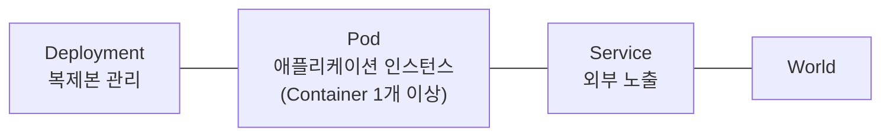
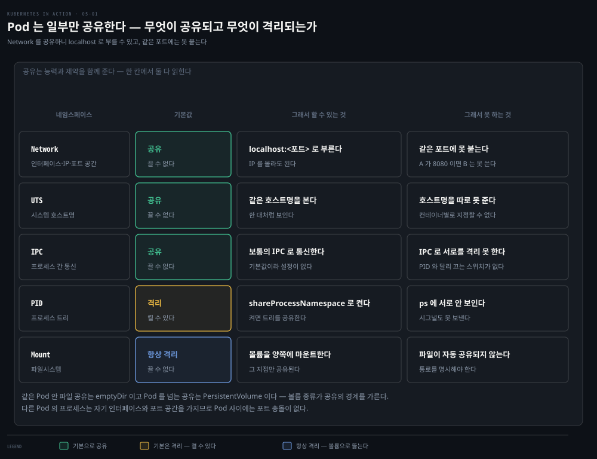
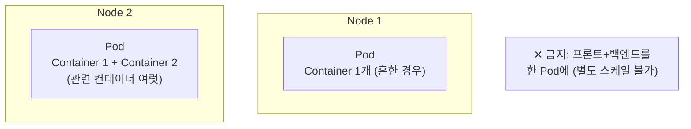
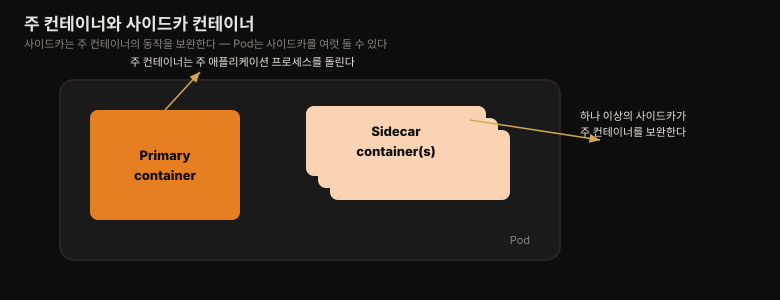
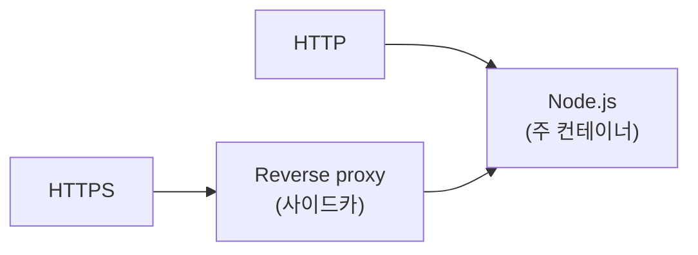

# Pod 이해 — 컨테이너 그룹화와 사이드카
---
> Pod는 쿠버네티스에서 가장 중심이 되는 개념이자 배포·스케일링의 최소 단위입니다. 이 편에서는 컨테이너 하나에 프로세스를 몰아넣으면 안 되는 이유, 그럼에도 관련된 컨테이너를 함께 묶어야 할 때 Pod가 어떻게 네임스페이스 공유로 그 둘을 하나처럼 다루는지, 그리고 언제 컨테이너를 같은 Pod에 두고 언제 나눠야 하는지를 정리합니다.

## 진입 — 이 문서를 읽고 나면 무엇을 할 수 있는가

> 이 문서를 읽고 나면 왜 컨테이너 하나에 프로세스 하나만 두는지, Pod가 어떤 네임스페이스를 공유해 컨테이너를 하나처럼 묶는지, 그리고 프론트엔드·백엔드를 같은 Pod에 두면 안 되는 이유와 사이드카 패턴을 쓸 판단 기준을 설명할 수 있습니다.

이 개념은 "관련된 프로세스를 한 컴퓨터에 함께 둔다"는 익숙한 발상에서 출발합니다. 다만 쿠버네티스는 그 "한 컴퓨터"를 물리 서버가 아니라 Pod라는 논리 단위로 두고, 그 안의 컨테이너들이 일부 리눅스 네임스페이스만 골라 공유하게 만든다는 점이 다릅니다.

## 1. Pod는 배포·스케일링의 최소 단위

> Pod는 함께 배치되는 컨테이너 그룹이며, 컨테이너를 개별로 배포하지 않고 Pod 단위로 배포·관리합니다.

3장에서 배포한 최소 애플리케이션은 세 오브젝트로 이뤄졌습니다. Deployment는 애플리케이션의 복제본을 하나 이상 관리하고, 각 인스턴스는 Pod 안에서 돌며, Service는 그 인스턴스들을 외부에 노출합니다.

Pod는 함께 배치되는(co-located) 컨테이너 그룹이자 쿠버네티스의 기본 빌딩 블록입니다. 컨테이너를 개별로 배포하는 대신, 컨테이너 그룹을 하나의 단위(Pod)로 배포·관리합니다. Pod가 여러 컨테이너를 담을 수 있지만, 컨테이너 하나만 두고 도는 경우가 흔합니다. Pod에 컨테이너가 여럿일 때 그 모두는 같은 워커 노드에서 돕니다 — 한 Pod 인스턴스가 여러 노드에 걸치는 일은 결코 없습니다.

## 2. 왜 컨테이너 하나에 프로세스를 몰면 안 되는가

> 컨테이너 도구와 쿠버네티스는 "컨테이너 하나에 프로세스 하나"를 전제로 설계됐기 때문에, 여러 프로세스를 한 컨테이너에 두면 로그와 재시작 관리가 무너집니다.

여러 프로세스로 이뤄진 애플리케이션을 한 컨테이너에 다 담을 수는 있지만, 그렇게 하면 컨테이너 관리가 훨씬 어려워집니다. 컨테이너는 자식 프로세스를 제외하면 프로세스 하나만 돌리도록 설계됐고, 컨테이너 도구와 쿠버네티스 모두 이 사실 위에 만들어졌습니다.

**로그**가 뒤엉키는 것이 한 이유입니다. 컨테이너 안 프로세스는 자기 로그를 표준 출력(standard output)에 쓰도록 기대됩니다. 로그를 표시하는 Docker·쿠버네티스 명령은 이 출력에서 잡아낸 것만 보여줍니다. 프로세스가 하나면 그 프로세스가 유일한 기록자이지만, 여러 프로세스를 돌리면 모두 같은 출력에 쓰므로 로그가 뒤엉켜 어느 줄이 어느 프로세스 것인지 구분하기 어렵습니다.

**재시작** 관리가 무너지는 것이 또 다른 이유입니다. 컨테이너 런타임은 컨테이너의 루트 프로세스가 죽을 때만 컨테이너를 재시작합니다. 이 루트 프로세스가 만든 자식 프로세스에는 관심이 없습니다.

자식 프로세스를 띄웠다면 그 모두를 살려 두는 책임은 오롯이 루트 프로세스에게 있습니다. 컨테이너 런타임이 제공하는 기능을 온전히 누리려면 각 컨테이너에 프로세스 하나만 두는 것을 고려해야 합니다.

## 3. Pod는 네임스페이스 공유로 컨테이너를 하나처럼 묶는다

> 한 컨테이너에 프로세스를 몰 수 없다면 관련된 프로세스를 함께 돌릴 상위 구조가 필요하고, 그 구조가 바로 Pod입니다 — 일부 네임스페이스를 공유해 "거의 같은 환경"을 만듭니다.

한 컨테이너에 여러 프로세스를 두면 안 되므로, 여러 컨테이너로 나뉘어 있어도 관련된 프로세스를 함께 돌릴 상위 구조가 필요합니다. 이 프로세스들은 보통의 컴퓨터에서처럼 서로 통신할 수 있어야 합니다. 그래서 Pod가 도입됐습니다.

Pod를 쓰면 밀접하게 관련된 프로세스를 함께 돌리면서, 마치 모두 한 컨테이너에서 도는 것과 (거의) 같은 환경을 줄 수 있습니다. 이 프로세스들은 어느 정도 격리돼 있지만 완전히는 아닙니다 — 일부 자원을 공유합니다. 컨테이너가 주는 모든 기능을 쓰면서도 프로세스들이 함께 일하도록 허용하는, 두 세계의 장점을 모두 취하는 방식입니다.

2장에서 컨테이너는 자기만의 리눅스 네임스페이스를 쓰지만 일부를 다른 컨테이너와 공유할 수도 있다고 배웠습니다. 바로 이 네임스페이스 공유가 쿠버네티스와 컨테이너 런타임이 컨테이너를 Pod로 묶는 방식입니다. Pod 안의 모든 컨테이너는 같은 **Network 네임스페이스**를 공유하므로, 거기 속한 네트워크 인터페이스·IP 주소·포트 공간을 함께 씁니다.

포트 공간을 공유하기 때문에, 같은 Pod 안 컨테이너의 프로세스들은 같은 포트 번호에 바인딩할 수 없습니다. 반면 다른 Pod의 프로세스는 자기만의 네트워크 인터페이스와 포트 공간을 가지므로 서로 다른 Pod 사이에는 포트 충돌이 없습니다. Pod 안 모든 컨테이너는 **UTS 네임스페이스**도 공유해 같은 시스템 호스트명을 보고, **IPC 네임스페이스**도 공유해 보통의 IPC 메커니즘으로 통신할 수 있습니다. 모든 컨테이너가 단일 **PID 네임스페이스**를 쓰도록 설정하면 하나의 프로세스 트리를 공유하게 만들 수도 있는데, 이는 Pod마다 명시적으로 켜야 합니다.

> 같은 Pod의 컨테이너들이 별도 PID 네임스페이스를 쓰면, 서로의 프로세스를 볼 수 없고 SIGTERM·SIGINT 같은 프로세스 시그널도 주고받을 수 없습니다.

반대로 각 컨테이너는 **항상 자기만의 Mount 네임스페이스**를 가져 자기 파일시스템을 갖습니다. 두 컨테이너가 파일시스템 일부를 공유해야 하면 Pod에 볼륨을 추가해 양쪽에 마운트합니다. 두 컨테이너는 여전히 별도 Mount 네임스페이스를 쓰지만, 공유 볼륨만 양쪽에 마운트되는 것입니다(볼륨은 8장에서 다룹니다).

## 4. 컨테이너를 Pod로 나누는 기준

> Pod는 자원 오버헤드가 거의 없으므로, 애플리케이션을 한 Pod에 몰지 말고 밀접하게 관련된 프로세스끼리만 묶어 나눠야 합니다.

각 Pod를 별도 컴퓨터라고 생각할 수 있습니다. 여러 애플리케이션을 담는 VM과 달리, 보통 Pod 하나에는 애플리케이션 하나만 돌립니다. Pod는 자원 오버헤드가 거의 없으므로 필요한 만큼 많이 만들 수 있고, 모든 애플리케이션을 한 Pod에 욱여넣을 이유가 없습니다.

### 다중 계층 스택을 여러 Pod로 나누기

프론트엔드 웹 서버와 백엔드 데이터베이스로 이뤄진 시스템을 생각해 봅니다. 둘을 같은 컨테이너에 두면 안 된다는 것은 §2에서 봤습니다. 그렇다면 같은 Pod 안 별도 컨테이너로 두는 것은 어떨까요? 이것도 최선이 아닙니다. Pod의 모든 컨테이너는 항상 함께 배치되는데, 웹 서버와 데이터베이스가 꼭 같은 컴퓨터에서 돌아야 할 이유는 없습니다 — 네트워크로 쉽게 통신할 수 있으니까요.

둘을 같은 Pod에 두면 둘 다 같은 클러스터 노드에서 돕니다. 노드가 두 대인데 Pod를 하나만 만들면 워커 노드 한 대만 쓰게 되어 두 번째 노드의 CPU·메모리·디스크·대역폭이 낭비됩니다. 컨테이너를 두 Pod로 나누면 쿠버네티스가 프론트엔드 Pod를 한 노드에, 백엔드 Pod를 다른 노드에 배치할 수 있어 하드웨어 활용률이 높아집니다.

### 개별 스케일링을 위해 나누기

Pod는 배포의 최소 단위일 뿐 아니라 **스케일링의 최소 단위**이기도 합니다. 쿠버네티스는 Pod 안 컨테이너를 복제하지 않고 Pod 전체를 복제합니다.

프론트엔드와 백엔드는 보통 스케일링 요구가 다릅니다. 둘을 한 Pod에 담아 복제하면 프론트엔드와 백엔드 컨테이너가 함께 여러 개로 늘어나는데, 이는 대개 원하는 바가 아닙니다. 데이터베이스 같은 상태 있는(stateful) 백엔드는 상태 없는(stateless) 프론트엔드만큼 쉽게 스케일링되지 않습니다. 어떤 컨테이너를 다른 컴포넌트와 별도로 스케일링해야 한다면, 그것은 별도 Pod에 배포해야 한다는 분명한 신호입니다.

## 5. 사이드카 컨테이너 — 언제 같은 Pod에 두는가

> 여러 컨테이너를 한 Pod에 두는 것은 주 프로세스를 보조하는 프로세스가 있을 때만 적절하며, 이 보조 컨테이너를 사이드카라 부릅니다.

여러 컨테이너를 한 Pod에 두는 것은, 애플리케이션이 주(primary) 프로세스 하나와 그 동작을 보완하는 프로세스 하나 이상으로 이뤄질 때만 적절합니다. 이 보완 프로세스가 도는 컨테이너를 **사이드카 컨테이너**라 부릅니다. 오토바이 사이드카가 오토바이를 안정시키고 승객을 더 태우듯 주 컨테이너를 보조한다는 뜻입니다. 오토바이와 달리 Pod는 사이드카를 여럿 둘 수 있습니다.

보완 프로세스의 대표적 예는 다음과 같습니다.

첫째, **프로토콜 변환 프록시**입니다. 2장에서 배포한 Node.js 애플리케이션은 HTTP만 지원합니다. HTTPS를 지원하려면 자바스크립트 코드를 더 넣을 수도 있지만, 기존 애플리케이션을 전혀 건드리지 않고 리버스 프록시 컨테이너를 Pod에 추가해 HTTPS를 HTTP로 변환해 Node.js 컨테이너로 넘기게 할 수도 있습니다. 이때 Node.js가 주 컨테이너, 프록시가 사이드카입니다.

둘째, **콘텐츠 전달 에이전트**입니다. 주 컨테이너가 webroot 디렉터리의 파일을 서빙하는 웹 서버이고, 다른 컨테이너가 외부에서 주기적으로 콘텐츠를 내려받아 그 webroot에 저장하는 에이전트인 경우입니다. 두 컨테이너는 볼륨을 공유해 파일을 주고받고, webroot 디렉터리가 그 볼륨에 위치합니다. 이 밖에 로그 로테이터·수집기, 데이터 프로세서, 통신 어댑터 등도 사이드카의 예입니다.

애플리케이션 기존 코드를 고치는 것과 달리 사이드카를 추가하면 Pod의 자원 요구량이 늘어납니다. 프로세스가 하나 더 도니까요. 하지만 레거시 애플리케이션에 코드를 더하는 것은 몹시 어려울 수 있습니다 — 코드 수정이 까다롭거나, 빌드 환경 구성이 어렵거나, 소스 코드 자체가 사라졌을 수 있습니다. 프로세스를 하나 더 붙여 애플리케이션을 확장하는 것이 더 싸고 빠른 선택일 때가 있습니다.

### 같은 Pod에 둘지 판단하는 다섯 질문

사이드카 패턴을 써서 컨테이너를 한 Pod에 둘지, 별도 Pod에 둘지 결정할 때 다음을 자문합니다.

1. 이 컨테이너들이 반드시 같은 호스트에서 돌아야 하는가?
2. 이들을 하나의 단위로 관리하고 싶은가?
3. 독립적인 컴포넌트가 아니라 하나의 통합된 전체를 이루는가?
4. 함께 스케일링돼야 하는가?
5. 단일 노드가 이들의 합산 자원 요구를 감당할 수 있는가?

모든 답이 "예"라면 같은 Pod에 둡니다. 경험칙은 특정 이유로 같은 Pod에 있어야 하는 경우가 아니라면, 항상 컨테이너를 **별도 Pod에 두는 것**입니다.

## Spring 앱 배포 관점에서

> Spring Boot 앱에서 사이드카는 코드를 건드리지 않고 TLS 종료·서비스 메시·로그 수집을 붙이는 표준 수단이고, "프로세스 하나=컨테이너 하나" 원칙은 JVM 앱을 컨테이너화할 때 특히 명확하게 지켜집니다.

Spring Boot 앱을 컨테이너화할 때 "컨테이너 하나에 프로세스 하나" 원칙은 JVM 특성상 자연스럽게 지켜집니다. `java -jar app.jar` 하나가 컨테이너의 루트 프로세스가 되고, 이 JVM이 내부적으로 수많은 스레드를 돌리지만 별도 프로세스로 갈라지지 않으므로 로그도 표준 출력 한 곳으로 모입니다. 문제는 배치 스케줄러나 별도 데몬을 같은 컨테이너에서 `&`로 백그라운드 실행하려는 유혹인데, 이렇게 하면 그 데몬이 죽어도 컨테이너 런타임은 루트 JVM만 지켜보므로 재시작되지 않습니다 — §2의 재시작 원칙이 그대로 적용됩니다.

사이드카 패턴은 Spring 생태계에서 특히 자주 쓰입니다. §5의 리버스 프록시 예시(HTTPS 종료)는 실무에서 Envoy나 Nginx 사이드카로 그대로 나타나고, Istio·Linkerd 같은 **서비스 메시**는 아예 이 사이드카 주입을 자동화한 것입니다 — 애플리케이션 Pod마다 Envoy 사이드카를 자동으로 붙여 mTLS·트래픽 라우팅·관측성을 Spring 코드 변경 없이 제공합니다. 로그 수집 사이드카(Fluent Bit 등)도 Spring Boot의 `logback` 출력을 표준 출력으로 흘려보내면 사이드카가 수집해 중앙 로깅 시스템으로 전달하는 식으로 쓰입니다. 반대로 데이터베이스는 §4 원칙대로 절대 앱과 같은 Pod에 두지 않고 별도 Pod(또는 매니지드 DB)로 분리해, 상태 없는 Spring 앱만 자유롭게 스케일 아웃되게 합니다.

## 관련 문서

> 이 편은 Pod의 개념·네임스페이스 공유·사이드카 판단 기준을 다룹니다. 다음 편(05-02)에서 이 Pod를 실제 YAML로 만들고 상호작용하는 법으로 이어집니다.

- [05-02.Pod 생성과 상호작용](./05-02.Pod%20%EC%83%9D%EC%84%B1%EA%B3%BC%20%EC%83%81%ED%98%B8%EC%9E%91%EC%9A%A9.md) — 이 편에서 이해한 Pod를 실제 매니페스트로 만들고 로그·exec·port-forward로 다루는 다음 편
- [04-02.Node와 Event 오브젝트로 보는 필드 실습](./04-02.Node%EC%99%80%20Event%20%EC%98%A4%EB%B8%8C%EC%A0%9D%ED%8A%B8%EB%A1%9C%20%EB%B3%B4%EB%8A%94%20%ED%95%84%EB%93%9C%20%EC%8B%A4%EC%8A%B5.md) — Pod도 이 편에서 본 spec-status 구조를 따르는 오브젝트임을 다룬 이전 편
- [핵심 워크로드](../../kubernetes/01_foundation/01-02.%ED%95%B5%EC%8B%AC%20%EC%9B%8C%ED%81%AC%EB%A1%9C%EB%93%9C.md) — Pod·Deployment·Service의 필드·전략·probe를 깊게 다룬 편
- [Kubernetes 공식 문서 — Pods](https://kubernetes.io/docs/concepts/workloads/pods/) — Pod 개념·멀티 컨테이너·네임스페이스 공유의 최신 공식 설명
