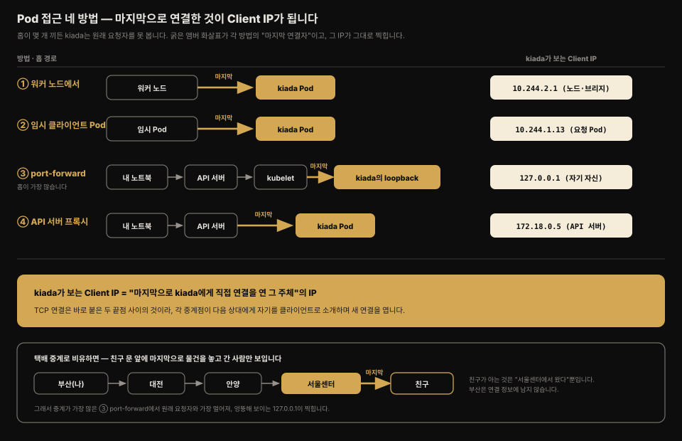
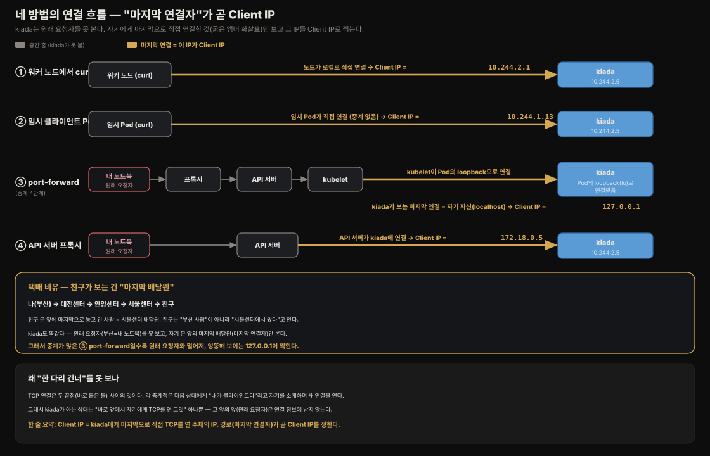
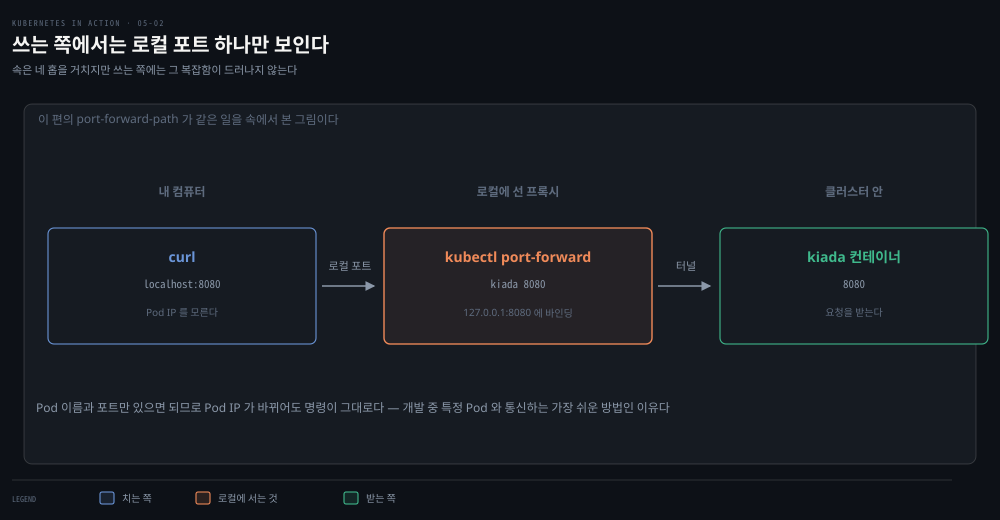
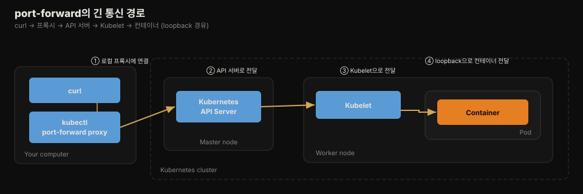
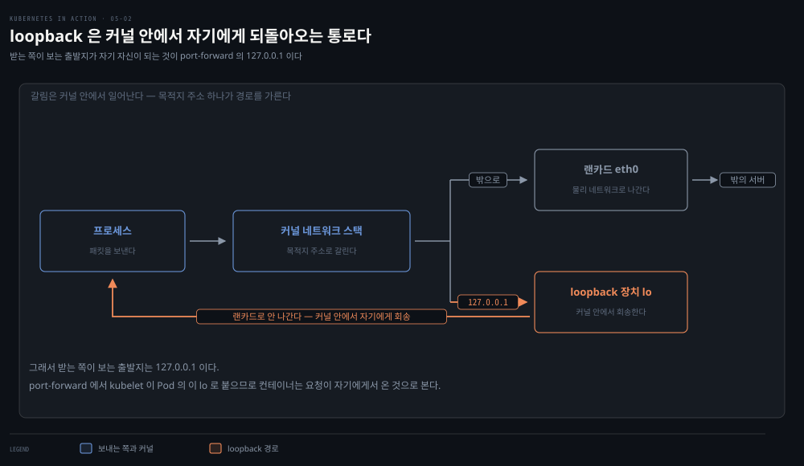
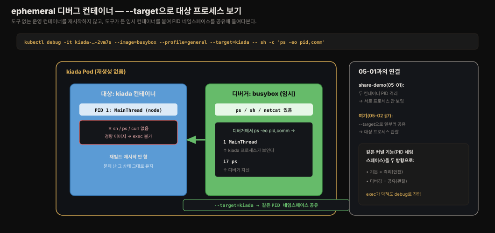

# Pod 생성과 상호작용
---
> **Pod는 보통 명령형 명령이 아니라 YAML 매니페스트를 API에 제출해 만듭니다.** 
>
> 이 편에서는 Pod 매니페스트를 처음부터 작성해 `kubectl apply`로 배포하고, 그 안의 애플리케이션과 통신하고 로그를 보고 컨테이너 안에서 명령을 실행하는 여러 방법을 정리합니다.


## 진입 — 이 문서를 읽고 나면 무엇을 할 수 있는가

> 이 문서를 읽고 나면 Pod YAML 매니페스트를 작성해 `kubectl apply`로 배포하고, `kubectl logs`·`kubectl exec`·`kubectl port-forward`·ephemeral 컨테이너로 애플리케이션과 통신하고 디버깅하는 법을 설명할 수 있습니다.

이 개념은 "인프라를 코드로 선언하고 버전 관리한다"는 익숙한 발상과 같습니다. 매니페스트 파일을 Git에 두면 배포가 재현 가능해지고 변경 이력이 남습니다. 다만 쿠버네티스는 그 선언을 API에 제출하는 순간부터 컨트롤러가 실제 상태를 그 선언에 맞춘다는 점이 셸 스크립트 배포와 다릅니다.


## 1. YAML 매니페스트로 Pod 만들기

> Pod는 명령형 `kubectl create`로도 만들 수 있지만, 보통 JSON·YAML 매니페스트를 작성해 API에 제출합니다 — 파일을 버전 관리하면 배포가 재현 가능해지고 변경 이력이 남습니다.

3장에서는 명령형 명령 `kubectl create`로 Pod를 만들었지만, Pod를 비롯한 쿠버네티스 오브젝트는 보통 JSON·YAML 매니페스트 파일을 만들어 API에 제출하는 방식으로 만듭니다. YAML과 JSON 중 무엇을 쓸지는 자유지만, 대부분 YAML을 선호합니다 — 사람이 읽기 조금 더 편하고 주석을 달 수 있기 때문입니다.

다음은 기본 Pod 매니페스트입니다.

```yaml
apiVersion: v1        # v1 API 버전으로 오브젝트 정의
kind: Pod             # 오브젝트 종류는 Pod
metadata:
  name: kiada         # Pod 이름
spec:
  containers:
  - name: kiada       # 컨테이너 이름
    image: luksa/kiada:0.1   # 컨테이너를 만들 이미지
    ports:
    - containerPort: 8080    # 앱이 리스닝하는 포트
```

4장에서 본 거대한 Node 오브젝트 매니페스트보다 훨씬 이해하기 쉽습니다. 다만 이 매니페스트가 짧은 것은, API를 거쳐 생성되기 전이라 Pod 오브젝트가 갖게 될 모든 필드를 아직 담고 있지 않기 때문입니다. 예를 들어 metadata에 필드가 하나뿐이고 status 섹션은 통째로 빠져 있습니다. 일단 이 매니페스트로 오브젝트를 만들면 그렇지 않게 됩니다.

> 매니페스트를 처음부터 손으로 쓰는 대신, 다음 명령으로 골격을 만든 뒤 필드를 채울 수도 있습니다: 
>
> `kubectl run kiada --image=luksa/kiada:0.1 --dry-run=client -o yaml > mypod.yaml`. `--dry-run=client` 플래그는 실제로 오브젝트를 만들지 않고 정의만 출력하라는 뜻입니다. 각 필드의 의미나 추가 가능한 필드는 `kubectl explain pods`로 확인합니다.


## 2. 매니페스트를 클러스터에 적용하기

> 매니페스트를 API에 제출하는 것은 "이 매니페스트를 클러스터에 적용하라"는 지시이므로, 이 일을 하는 하위 명령이 `apply`입니다.

매니페스트를 API에 제출한다는 것은 쿠버네티스에게 그 매니페스트를 클러스터에 적용하라고 지시하는 것입니다. 그래서 이 일을 하는 `kubectl` 하위 명령이 `apply`입니다.

```bash
kubectl apply -f pod.kiada.yaml
# pod "kiada" created
```

`kubectl apply`는 오브젝트를 만들 때뿐 아니라 기존 오브젝트를 수정할 때도 씁니다. 나중에 Pod를 바꾸고 싶으면 `pod.kiada.yaml` 파일을 편집하고 `apply`를 다시 실행하면 됩니다. 일부 필드는 변경할 수 없어 업데이트가 실패할 수 있는데, 그럴 때는 Pod를 지우고 다시 만들면 됩니다.

생성된 Pod의 전체 매니페스트는 API에서 다시 읽어올 수 있습니다.

```bash
kubectl get po kiada -o yaml
```

이 명령을 실행하면 매니페스트가 `pod.kiada.yaml`에 비해 상당히 커진 것을 볼 수 있습니다. metadata 섹션이 훨씬 커졌고 status 섹션이 생겼으며 spec에도 여러 필드가 추가됐습니다.


## 3. 생성된 Pod 확인하기

> `kubectl get`으로 Pod 상태를 빠르게 요약해 보고, `kubectl describe`와 이벤트로 그 아래에서 무슨 일이 일어났는지 확인합니다.

Pod 오브젝트는 만들어졌지만 그 안의 컨테이너가 실제로 도는지 어떻게 알까요? `kubectl get`으로 요약을 봅니다.

```bash
kubectl get pod kiada
# NAME     READY   STATUS    RESTARTS   AGE
# kiada    1/1     Running   0          32s
```

Pod가 돌고 있다는 것 외에 더 알고 싶으면 `kubectl get pod -o wide`나 `kubectl describe` 명령을 씁니다. `kubectl describe pod kiada`는 전체 매니페스트를 출력할 때 보이는 정보 거의 전부를 읽기 좋은 형태로 보여줍니다.

4장에서 Node를 `describe`했을 때처럼, `describe pod`도 출력 맨 아래에 Pod 관련 이벤트를 보여줍니다. Pod를 만든 뒤 기록된 이벤트를 `kubectl get events`로 보면 다음과 같습니다.

```bash
# kubectl get events

LAST SEEN   TYPE     REASON      OBJECT      MESSAGE
<unknown>   Normal   Scheduled   pod/kiada   Successfully assigned ... to kind-worker2
5m          Normal   Pulling     pod/kiada   Pulling image luksa/kiada:0.1
5m          Normal   Pulled      pod/kiada   Successfully pulled image
5m          Normal   Created     pod/kiada   Created container kiada
5m          Normal   Started     pod/kiada   Started container kiada
```

- 이벤트는 시간순으로 출력되며 가장 최근 것이 맨 아래입니다. Pod가 먼저 워커 노드에 배정되고, 이미지가 pull되고, 컨테이너가 생성돼 마지막으로 시작됐음을 볼 수 있습니다. Warning 이벤트가 없으니 모든 게 정상입니다.


## 4. Pod 안 애플리케이션에 요청 보내기

> 개발·테스트·디버깅에는 Service를 거치지 않고 특정 Pod와 직접 통신하고 싶을 때가 있으며, 이를 위한 네 가지 방법이 있습니다.

2장에서는 `kubectl expose`로 Service를 만들어 로드밸런서를 통해 Pod와 통신했습니다. 개발·테스트·디버깅 목적으로는 무작위로 선택되는 Pod로 연결을 넘기는 Service 대신, 특정 Pod와 직접 통신하고 싶을 때가 있습니다.

각 Pod는 자기 IP를 갖고 클러스터 안 다른 모든 Pod에서 그 IP로 접근할 수 있습니다. 이 IP는 보통 클러스터 내부용이라 로컬 컴퓨터에서는 접근할 수 없습니다(kind나 VM 없는 Minikube 같은 특정 배포 방식은 예외). Pod IP는 전체 YAML의 status 섹션 `podIP` 필드에서 확인하거나 `kubectl get pod -o wide`로 IP 열을 봅니다.

아래 그림은 이어지는 네 방법을 한눈에 정리한 것입니다. Pod IP가 클러스터 내부 전용이라 밖에서 직접 못 닿는다는 공통 전제 위에서, ①②는 클러스터 안에서, ③④는 밖에서 우회로를 뚫어 특정 Pod에 직접 닿습니다.

| 방법                  | 경로                                         | kiada가 보는 Client IP              |
| --------------------- | -------------------------------------------- | ----------------------------------- |
| ① 워커 노드에서       | 노드 → Pod (로컬)                            | 노드/브리지 IP (`10.244.2.1` 등)    |
| ② 임시 클라이언트 Pod | Pod → Pod (클러스터 안)                      | **요청한 Pod의 IP** (`10.244.1.13`) |
| ③ port-forward        | 로컬 → 프록시 → API → kubelet → **loopback** | **`127.0.0.1`** (직접 터널)         |
| ④ API 서버 프록시     | 로컬 → API 서버 → Pod                        | **API 서버 IP** (`172.18.0.5`)      |



Client IP가 방법마다 다른 이유를 한 문장으로 꿰면 이렇습니다 — **kiada가 보는 Client IP는 "마지막으로 kiada에게 직접 연결을 연 그 주체"의 IP입니다.** 

중간에 프록시나 터널이 몇 개 끼든, kiada는 원래 요청자(내 노트북)가 아니라 **바로 앞에서 자기에게 붙은 것**만 봅니다. ②는 그 임시 Pod가, ③은 kubelet이 loopback을 통해, ④는 API 서버가, ①은 노드가 각각 kiada에 마지막으로 연결하므로, 그 주체의 IP가 그대로 Client IP로 찍힙니다. 프록시·터널의 특성이 여기 있습니다 — **각 홉이 다음 홉에게 자기를 클라이언트로 보여주고**, 최종 목적지는 맨 앞의 원래 요청자를 알 수 없습니다.

**택배 중계로 비유하면 분명해집니다.** 부산에서 서울 친구에게 택배를 보내는데 대전·안양·서울센터를 거친다고 합시다. 친구 문 앞에 마지막으로 물건을 놓고 간 사람은 **서울센터 배달원**이지, 부산의 나가 아닙니다. 친구가 "누가 갖다줬어?"라고 물으면 "서울센터에서 왔어"라고 답하지 부산은 모릅니다 — 바로 앞의 배달원만 봤으니까요. kiada도 똑같습니다. 원래 요청자(부산=내 노트북)를 못 보고 자기 문 앞의 마지막 배달원(마지막 연결자)만 봅니다. 그래서 중계가 가장 많은 ③ port-forward에서 원래 요청자와 가장 멀어져, 엉뚱해 보이는 `127.0.0.1`이 찍히는 것입니다.

이렇게 되는 근본 이유는 **TCP 연결이 "바로 붙은 두 끝점" 사이의 것**이기 때문입니다. 각 중계점은 다음 상대에게 "내가 클라이언트다"라고 자기를 소개하며 **새 연결을 엽니다.** 그래서 kiada가 아는 상대는 "바로 앞에서 자기에게 TCP를 연 그것" 하나뿐이고, 그 앞의 앞(원래 요청자)은 연결 정보에 남지 않습니다. 아래 그림이 네 방법의 홉 경로를 단계별로 보여줍니다 — 굵은 앰버 화살표가 각 방법에서 "kiada에게 마지막으로 연결한 것"이고, 그 IP가 곧 Client IP입니다.



### 왜 Pod 정의에 컨테이너 포트를 명시하는가

Pod 정의에 포트를 명시하는 것은 **순전히 정보 제공용**입니다. 명시하지 않아도 클라이언트가 Pod 포트에 연결하는 데는 아무 지장이 없습니다. 컨테이너가 자기 IP에 바인딩된 포트로 연결을 받으면, spec에 포트가 없거나 잘못된 번호가 적혀 있어도 누구든 연결할 수 있습니다. 그래도 포트를 항상 명시하는 것이 좋습니다 — 클러스터에 접근하는 사람이 각 Pod가 어떤 포트를 노출하는지 볼 수 있고, 포트에 이름을 붙이면 Service로 Pod를 노출할 때 특히 유용하기 때문입니다.

### 방법 ① 워커 노드에서 접근

쿠버네티스 네트워크 모델은 각 Pod가 다른 모든 Pod에서 접근 가능하고, 각 노드가 클러스터 안 어느 노드의 어느 Pod든 도달할 수 있음을 규정합니다. 그래서 워커 노드에 로그인해 거기서 Pod와 통신할 수 있습니다.

```bash
# kind: docker exec -it kind-worker bash / Minikube: minikube ssh / GKE: gcloud compute ssh <node>

curl 10.244.2.4:8080
# Kiada version 0.1. Request processed by "kiada". Client IP: ::ffff:10.244.2.1
```

통신 문제가 있어 가장 짧은 경로부터 시험해 원인을 찾을 때 유용합니다. Pod가 있는 노드에 로그인해 `curl`을 실행하면 통신이 로컬에서 일어나 성공 확률이 가장 높습니다.

### 방법 ② 일회성 클라이언트 Pod에서 접근

다른 Pod가 이 Pod에 접근할 수 있는지 시험할 때는 전용 Pod를 만들어 그 안에서 `curl`을 돌립니다.

```bash
kubectl run --image=curlimages/curl -it --restart=Never --rm client-pod curl 10.244.2.4:8080
# Kiada version 0.1. Request processed by "kiada". Client IP: ::ffff:10.244.2.5
# pod "client-pod" deleted
```

`-it`는 콘솔을 컨테이너 표준 입출력에 붙이고, `--restart=Never`는 `curl`이 끝나면 Pod를 Completed로 간주하게 하며, `--rm`은 끝에 Pod를 삭제합니다. 네트워크가 완벽해도 정책으로 Pod 간 통신이 막혀 있을 수 있으므로, Pod 대 Pod 연결을 시험할 때 유용합니다.

### 방법 ③ kubectl port-forward

> 개발 중 특정 Pod와 통신하는 가장 쉬운 방법은 `kubectl port-forward`로, **로컬 컴퓨터의 포트에 바인딩된 프록시를 통해 Pod와 통신합니다.**

Pod IP를 찾을 필요 없이 이름과 포트만 지정하면 됩니다.

```bash
kubectl port-forward kiada 8080
# ... Forwarding from 127.0.0.1:8080 -> 8080

# 다른 터미널에서
curl localhost:8080
# Kiada version 0.1. Request processed by "kiada". Client IP: ::ffff:127.0.0.1
```



가장 쉬운 방법이지만, 내부적으로는 가장 복잡합니다. 통신이 여러 컴포넌트를 거치므로 경로 어딘가가 깨지면 Pod 자체는 정상이어도 통신이 안 될 수 있습니다. 아래 그림은 `curl` 프로세스에서 애플리케이션까지 패킷이 흐르는 유난히 긴 경로를 보여줍니다.



`curl` 프로세스가 프록시에 연결하고, 프록시가 API 서버에, API 서버가 Pod를 호스팅하는 노드의 Kubelet에, Kubelet이 Pod의 loopback 장치(localhost)를 통해 컨테이너에 연결합니다.

> **loopback**은 컴퓨터가 자기 자신에게 말을 거는 네트워크 통로로, 주소가 `127.0.0.1`이고 이름이 `localhost`입니다. 
>
> 보통의 통신은 랜카드를 거쳐 밖으로 나가지만, loopback으로 보낸 패킷은 물리 네트워크로 나가지 않고 커널 안에서 곧바로 자기에게 되돌아옵니다(loop back = 되돌아옴). port-forward에서 kubelet이 Pod의 이 loopback 장치를 통해 컨테이너에 붙기 때문에, 컨테이너 입장에서는 요청이 **자기 자신에게서 온 것처럼** 보여 Client IP가 `127.0.0.1`로 찍힙니다.



> 애플리케이션이 loopback 장치의 포트에 바인딩돼 있어야 Kubelet이 도달할 수 있습니다. Pod의 `eth0` 인터페이스에만 리스닝하면 `kubectl port-forward`로 도달할 수 없습니다.

### 방법 ④ API 서버를 통한 접근

덜 알려졌지만 빠른 방법으로, `kubectl get --raw`가 API 서버에 요청을 보내고 API 서버가 그것을 Pod로 프록시합니다. 추가 명령이나 port-forward 설정이 필요 없습니다.

```bash
kubectl get --raw /api/v1/namespaces/default/pods/kiada/proxy/
# Kiada version 0.1. Request processed by "kiada". Client IP: ::ffff:172.18.0.5
```

### 실제 확인 — 접근 방법마다 kiada가 보는 Client IP가 다르다

`k8s-lab` 클러스터의 살아있는 kiada Pod(`10.244.2.5`)에 방법별로 접근하면, kiada가 응답에 찍는 `Client IP`가 방법마다 달라집니다. **누가 요청한 것으로 보이는가**가 경로에 따라 바뀌기 때문입니다.

```bash
# 먼저: 내 노트북(클러스터 밖)에서 Pod IP로 직접 curl → 안 닿음
curl -s --max-time 5 http://10.244.2.5:8080   # (타임아웃) 내부 전용 네트워크라 밖에서 못 감


# 방법②: 클러스터 안 임시 Pod에서 같은 IP로 curl → 닿음
kubectl run tmp-client --image=curlimages/curl \
  --rm \                  # curl 끝나면 이 임시 Pod를 자동 삭제 (찌꺼기 안 남김)
  -it \                   # 콘솔을 컨테이너 표준 입출력에 붙여 결과를 바로 봄
  --restart=Never \       # curl 종료 시 Pod를 Completed로 간주 (재시작 정책 끔)
  -- curl -s http://10.244.2.5:8080     # -- 뒤가 컨테이너에서 실행할 명령
#   Client IP: ::ffff:10.244.1.13   ← 요청한 임시 Pod의 IP (kiada 입장에서 이 Pod가 클라이언트)


# 방법③: port-forward 후 로컬에서 curl
kubectl port-forward kiada-7bc9cd6878-2vm7s 18080:8080 &
curl -s http://localhost:18080
#   Client IP: ::ffff:127.0.0.1     ← 직접 터널이라 kiada가 자기 localhost로 봄
```

- 방법③의 Client IP가 `127.0.0.1`인 것은 03-02에서 본 "port-forward는 로드밸런싱을 우회한다"와 같은 이유입니다.
- kubelet이 Pod의 **loopback 장치를 통해 직접** 연결하므로, kiada 입장에서는 요청이 자기 localhost에서 온 것처럼 보입니다. 그래서 **특정 Pod로 정확히** 연결됩니다(Service처럼 무작위 분배되지 않음).

> ⚠️ **`kubectl port-forward`는 세션을 넘어 살아남습니다.** 백그라운드(`&`)로 띄운 port-forward는 터미널을 닫거나 다른 작업으로 넘어가도 계속 살아, 나중에 같은 로컬 포트를 다시 쓰려 하면 `Unable to listen on port ... address already in use`로 조용히 실패합니다. 
>
> 실습 중 "분명 특정 Pod를 지정했는데 다른 Pod가 응답하는" 혼란은 대개 이전에 띄운 `svc/...` 대상 port-forward가 그 포트를 점유하고 있어서입니다. 실습을 마치면 `pkill -f "kubectl port-forward"`로 정리하는 것이 안전합니다.


## 5. 애플리케이션 로그 보기

> 컨테이너화된 애플리케이션은 보통 파일이 아니라 표준 출력·표준 오류로 로그를 쓰고, `kubectl logs`로 그 로그를 봅니다.

**컨테이너화된 애플리케이션은 로그를 파일에 쓰는 대신 표준 출력(stdout)·표준 오류(stderr)로 씁니다.** 그러면 컨테이너 런타임이 그 출력을 가로채 일관된 위치(보통 `/var/log/containers`)에 저장하므로, 각 애플리케이션이 로그 파일을 어디에 두는지 몰라도 접근할 수 있습니다.

```bash
kubectl logs kiada              # 로그 조회
kubectl logs kiada -f           # 실시간 스트리밍(--follow)
kubectl logs kiada --timestamps=true   # 각 줄에 타임스탬프
kubectl logs kiada --since=2m          # 최근 2분
kubectl logs kiada --since-time=2020-02-01T09:50:00Z   # 특정 시각 이후(RFC3339)
kubectl logs kiada --tail=10           # 마지막 10줄
kubectl logs kiada -p                  # 이전(재시작 전) 컨테이너 로그(--previous)
```

- 타임스탬프는 컨테이너 런타임이 각 줄에 붙여 주므로, 애플리케이션이 타임스탬프를 안 남겨도 `--timestamps`로 볼 수 있고 시간 기반 필터링도 가능합니다. 
- Boolean 옵션은 값 없이 이름만 써도 true가 됩니다.

### 로그 가용성의 한계

쿠버네티스는 컨테이너마다 별도 로그 파일을 두며 보통 노드의 `/var/log/containers`에 저장합니다. 컨테이너가 재시작되면 로그가 새 파일에 쓰이므로, `kubectl logs -f`로 따라가던 중 컨테이너가 재시작되면 명령이 끝나 다시 실행해야 합니다. Pod를 삭제하면 그 로그 파일도 **모두 삭제**됩니다. 로그를 영구 보관하려면 중앙 집중식 클러스터 전역 로깅 시스템을 구축해야 합니다.


## 6. 컨테이너 안에서 상호작용하기 — attach·exec·cp

> `kubectl attach`는 표준 입출력에 붙고, `kubectl exec`는 컨테이너 안에서 명령을 실행하며, `kubectl cp`는 파일을 주고받습니다.

`kubectl attach`는 애플리케이션의 표준·오류 출력에 연결해 로그를 스트리밍하고, 표준 입력에도 붙어 이 메커니즘으로 상호작용할 수 있게 합니다. 애플리케이션이 표준 입력을 읽으려면 Pod 매니페스트 컨테이너 정의에서 `stdin: true`를 설정해야 합니다 — 그러지 않으면 애플리케이션이 표준 입력을 읽을 때 항상 EOF를 받습니다.

```yaml
spec:
  containers:
  - name: kiada
    image: luksa/kiada:0.2
    stdin: true          # 표준 입력 버퍼 할당
```

```bash
kubectl attach -i kiada-stdin   # -i 는 표준 입력을 컨테이너로 전달
```

`kubectl exec`는 컨테이너 파일시스템에 있는 어떤 바이너리든 실행합니다. SSH로 원격 시스템에서 명령을 실행하는 것과 크게 다르지 않습니다.

```bash
kubectl exec kiada -- ps aux           # 단일 명령 실행(-- 뒤가 명령)
kubectl exec kiada -- curl -s localhost:8080
kubectl exec -it kiada -- bash         # 대화형 셸(-i 표준입력 + -t 터미널)
```

`kubectl cp`는 로컬과 컨테이너 사이에서 파일을 복사합니다. 컨테이너에 `tar` 바이너리가 있어야 합니다.

```bash
kubectl cp kiada:html/index.html /tmp/index.html -c kiada   # 컨테이너 → 로컬
kubectl cp /tmp/index.html kiada:html/ -c kiada             # 로컬 → 컨테이너
```

> 컨테이너가 하나뿐이거나 기본 컨테이너에서 복사할 때는 `-c`를 생략할 수 있습니다. 기본 컨테이너는 Pod의 `kubectl.kubernetes.io/default-container` 어노테이션으로 지정합니다.


## 7. ephemeral 컨테이너로 디버깅하기

> 운영 컨테이너는 공격 표면을 줄이려 셸조차 없는 경우가 많은데, ephemeral 컨테이너를 붙이면 Pod를 다시 만들지 않고 디버깅 도구를 투입할 수 있습니다.

배포하는 컨테이너 이미지에 필요한 디버깅 도구가 다 들어 있지는 않습니다. 

운영 컨테이너는 이미지를 작게 하고 보안을 높이려 주 프로세스에 필요한 것 외의 바이너리를 두지 않는 경우가 많아, 셸이나 도구를 실행할 수 없습니다. 이때 **ephemeral 컨테이너**를 붙여 실행 중인 컨테이너를 디버깅할 수 있습니다 — Pod를 다시 만들 필요가 없습니다.

> **ephemeral**은 "잠깐 있다 사라지는, 일시적인"이라는 뜻입니다(반대말은 persistent = 영속적). ephemeral 컨테이너는 디버깅할 때만 잠깐 붙였다 떼는 임시 컨테이너로, 앱의 정식 구성원이 아니라 잠깐 온 손님이라는 성격을 이름에 못박은 것입니다. 그래서 05-01의 사이드카(Pod와 함께 사는 persistent 구성원)와 대비됩니다.

```bash
kubectl debug kiada \        # debug: 실행 중인 Pod(kiada)에 새 컨테이너를 붙임
  -it \                      # 붙인 컨테이너의 셸에 대화형으로 접속
  --image nicolaka/netshoot  # 붙일 디버그 컨테이너의 이미지 (도구가 든 것)
# Defaulting debug container name to debugger-d6hdd.
# kiada > ~ >   (이 안에서 tcpdump, netcat 등 실행 가능)
```

- `kubectl debug`는 **실행 중인 Pod에 "임시 디버그 컨테이너(ephemeral container)"를 하나 더 붙이는** 명령입니다. `kubectl exec`가 *이미 있는* 컨테이너 안으로 들어가는 것과 달리, `debug`는 **없던 컨테이너를 새로 추가**합니다. 그래서 대상 컨테이너에 셸조차 없어도 상관없습니다. 
- `--image`로 지정한 이미지(도구가 든 것)로 새 컨테이너가 뜨고, 그 컨테이너가 대상 Pod에 합류해 같은 네트워크(그리고 뒤에서 볼 `--target` 옵션이면 같은 PID 네임스페이스)를 공유합니다. 이 디버그 컨테이너는 Pod에 영구히 추가되지 않고 디버깅용으로만 존재합니다.

- `nicolaka/netshoot` 이미지가 인기 있는 선택입니다. 붙인 뒤 그 안에서 `tcpdump -i any`로 네트워크 트래픽을 잡을 수 있습니다. 
- 이미지를 다시 빌드하거나 애플리케이션을 재배포하지 않고 문제의 바로 그 Pod를 즉시 디버깅할 수 있다는 것이 큰 장점입니다.

> **ephemeral 컨테이너는 사이드카가 아닙니다.** 둘 다 "같은 Pod에 컨테이너를 추가로 붙인다"는 점이 같아 헷갈리기 쉽지만 목적과 수명이 정반대입니다. 
>
> 05-01의 **사이드카**(로그 수집기·프록시)는 Pod를 만들 때 spec에 미리 선언하는 **영구 구성원**으로, Pod가 복제되면 함께 복제되고 죽으면 재시작됩니다 — 앱 운영을 상시 거드는 역할입니다. 반면 ephemeral 컨테이너는 **이미 돌고 있는 Pod에 나중에 붙이는 일시적 방문자**로, 디버깅이 끝나면 의미가 없고 복제·재시작 대상도 아닙니다. 
>
> 비유하면 사이드카는 **같이 사는 가족**이고 debug 컨테이너는 **잠깐 온 수리기사**입니다. 그래서 사이드카를 바꾸려면 Pod를 재배포해야 하지만, debug 컨테이너는 재배포 없이 그 자리에서 붙습니다. 다만 둘 다 05-01에서 본 "같은 Pod = 네임스페이스 공유"를 활용한다는 점은 같습니다
>
> 사이드카는 localhost·볼륨으로 앱과 **협력**하고, debug는 `--target`으로 PID 네임스페이스를 공유해 앱을 **관찰**합니다(같은 메커니즘, 다른 목적).

### 프로세스 네임스페이스 공유로 다른 컨테이너 프로세스 보기

기본적으로 각 컨테이너는 자기 PID 네임스페이스를 써서 ephemeral 컨테이너에서 다른 컨테이너의 프로세스를 볼 수 없습니다. Pod spec에 `shareProcessNamespace: true`를 설정하면 모든 컨테이너가 단일 프로세스 트리를 공유합니다.

```yaml
spec:
  shareProcessNamespace: true   # 모든 컨테이너가 같은 프로세스 트리를 공유
  containers:
  ...
```

이렇게 하면 디버그 컨테이너에서 `ps aux`로 Pod 안 모든 컨테이너의 프로세스(예: `node app.js`, `envoy`, `pause`)를 볼 수 있습니다. PID 1의 `pause`는 다른 컨테이너가 없어도 Pod를 유지하는 no-op 프로세스입니다.

### 실제 확인 — spec 수정 없이 `--target`으로 대상 프로세스 보기

위 `shareProcessNamespace: true`는 **Pod 전체**가 프로세스 트리를 공유하게 하며 Pod를 다시 만들어야 적용됩니다. 

그런데 디버깅만 목적이라면, 이미 돌고 있는 Pod를 재생성하지 않고 `kubectl debug`의 `--target` 옵션만으로 **특정 컨테이너 하나와만** 프로세스 네임스페이스를 공유할 수 있습니다.

```bash
kubectl debug -it kiada-7bc9cd6878-2vm7s \  # 대상 Pod에 디버그 컨테이너를 붙임
  --image=busybox \        # 디버그 컨테이너 이미지 (ps 같은 도구가 든 것)
  --profile=general \      # 디버깅에 적합한 권한·네임스페이스 프로파일 (legacy 경고 회피)
  --target=kiada \         # kiada 컨테이너와 PID 네임스페이스를 공유 (핵심)
  -- sh -c 'ps -eo pid,comm'      # 디버그 컨테이너에서 실행할 명령
#   PID   COMMAND
#     1   MainThread   ← kiada(node 앱)의 프로세스가 디버거에서 보인다
#    17   ps           ← 디버거(busybox) 자신
```

`--target=kiada`가 디버그 컨테이너(busybox)를 kiada 컨테이너와 같은 PID 네임스페이스에 넣어, busybox의 `ps`에 **kiada의 프로세스(`MainThread`, PID 1)가 그대로 보입니다.** 이것이 05-01에서 본 PID 네임스페이스의 실무 활용입니다 — `share-demo`에서는 두 컨테이너가 PID 격리라 서로 안 보였지만, 여기서는 `--target`으로 **일부러 공유**해 도구 없는 대상을 밖에서 들여다봅니다. kiada를 재빌드하거나 재시작하지 않고, 문제가 난 바로 그 컨테이너를 그대로 관찰한다는 점이 핵심입니다.



> `--profile=general`을 명시하는 것이 좋습니다. 생략하면 `--profile=legacy`가 기본으로 쓰이는데, 이는 deprecated 경고를 냅니다. `general` 프로파일은 디버깅에 적합한 권한·네임스페이스 설정을 제공합니다.

### `CrashLoopBackOff` — exec가 통하지 않는 컨테이너 디버깅

지금까지의 `exec`·`debug --target`은 모두 **컨테이너가 살아 있다**는 전제 위에 있습니다. 그런데 `CrashLoopBackOff`(컨테이너가 시작하자마자 죽고 재시작을 반복하는 상태)에서는 이 전제가 깨집니다 — 들어가려는 순간 컨테이너가 죽어버려 `exec`로 잡기 어렵습니다. 이때는 두 단계로 접근합니다.

**① 죽기 직전 로그부터** — `--previous`(`-p`)로 재시작 전 컨테이너가 남긴 로그를 봅니다. `CrashLoopBackOff`는 대개 죽은 이유(예외, 설정 오류)가 여기 찍혀 있습니다.

```bash
kubectl logs <pod> --previous     # -p, 재시작되기 전 컨테이너의 마지막 로그
```

**② 안 죽는 복제본을 만들어 조사** — 로그로 부족하면 `kubectl debug --copy-to`로 **원본을 복사하되 죽는 원인을 무력화**합니다. 앱 명령을 `sleep`으로 바꾸면 앱이 돌지 않아 컨테이너가 죽지 않으므로, 그 안에 들어가 환경을 천천히 살펴볼 수 있습니다.

```bash
kubectl debug <죽는-pod> --copy-to=debug-pod \  # 원본은 그대로, 별도 복제 Pod 생성
  --set-image='*=busybox' \      # 컨테이너 이미지를 도구 든 것으로 교체
  -- sleep infinity              # 앱 대신 안 죽는 명령을 돌림 → 컨테이너가 살아있음
kubectl exec -it debug-pod -- sh    # 이제 들어가서 설정·볼륨·환경변수 확인
kubectl delete pod debug-pod        # 조사 끝나면 복제본 정리
```

원본은 계속 죽지만 복제본은 **같은 조건인데 안 죽게** 만들어, "죽기 직전 상태"를 무한정 늘려 조사하는 것입니다. 순간이라 `exec`로 못 잡던 상태를, 복제본에서 붙잡아 둡니다.

> **debug 컨테이너의 수명 차이.** `--target`으로 원본 Pod에 붙인 ephemeral 컨테이너는 명령이 끝나면 멈추지만 Pod의 `ephemeralContainers` 기록에는 남아, 완전히 사라지려면 Pod 자체를 재생성해야 합니다(쿠버네티스는 ephemeral 컨테이너 개별 삭제를 지원하지 않습니다). 반면 `--copy-to`로 만든 복제본은 독립된 Pod라 `kubectl delete pod`로 깨끗이 정리됩니다. 그래서 원본을 오염시키고 싶지 않을 때는 `--copy-to`가 안전합니다.


## Spring 앱 개발 관점에서

> Spring Boot 앱 디버깅에서 `kubectl logs`는 logback 출력을, `kubectl port-forward`는 Actuator 엔드포인트 직접 접근을, ephemeral 컨테이너는 distroless 이미지의 셸 부재 문제를 각각 해결합니다.

Spring Boot 앱을 쿠버네티스에서 디버깅할 때 `kubectl logs`가 1차 도구입니다. 

- `logback`이나 `log4j2`가 콘솔 appender로 표준 출력에 로그를 쓰도록 설정하면(컨테이너 환경의 표준 설정), `kubectl logs -f`로 실시간 로그를, `kubectl logs -p`로 `OutOfMemoryError`로 죽기 직전 컨테이너의 로그를 볼 수 있습니다. 
- 파일 appender로 컨테이너 안 파일에만 쓰면 이 편에서 본 "Pod 삭제 시 로그도 삭제" 함정에 그대로 걸리므로, 컨테이너에서는 표준 출력 로깅이 정석입니다.

`kubectl port-forward`는 Spring Boot Actuator 디버깅에 특히 유용합니다. `/actuator/health`·`/actuator/metrics`·`/actuator/heapdump` 같은 관리 엔드포인트를 외부에 노출하지 않고 `kubectl port-forward myapp 8080`으로 로컬에서만 접근해 상태를 점검할 수 있습니다. 운영 클러스터에서 Actuator를 Service로 노출하지 않는 보안 관행과도 잘 맞습니다.

ephemeral 컨테이너는 Spring Boot 앱을 **distroless 이미지**(02-01 §Spring 관점에서 다룬)로 빌드했을 때 진가를 발휘합니다. distroless는 셸이 없어 `kubectl exec -it -- bash`가 통하지 않는데, `kubectl debug --image nicolaka/netshoot`로 도구가 든 컨테이너를 붙이고 `shareProcessNamespace`로 JVM 프로세스를 관찰하면, 이미지를 무겁게 만들지 않고도 스레드 덤프·힙 분석·네트워크 추적을 할 수 있습니다.


## 관련 문서

> 이 편은 Pod를 매니페스트로 만들고 로그·exec·port-forward·ephemeral 컨테이너로 다루는 법을 다룹니다. 다음 편(05-03)에서 멀티 컨테이너 Pod와 init·네이티브 사이드카, 그리고 오브젝트 삭제로 이어집니다.

- [05-03.멀티 컨테이너·init·네이티브 사이드카와 삭제](./05-03.%EB%A9%80%ED%8B%B0%20%EC%BB%A8%ED%85%8C%EC%9D%B4%EB%84%88%C2%B7init%C2%B7%EB%84%A4%EC%9D%B4%ED%8B%B0%EB%B8%8C%20%EC%82%AC%EC%9D%B4%EB%93%9C%EC%B9%B4%EC%99%80%20%EC%82%AD%EC%A0%9C.md) — Envoy 사이드카를 붙인 멀티 컨테이너 Pod와 init 컨테이너를 다루는 다음 편
- [05-01.Pod 이해 — 컨테이너 그룹화와 사이드카](./05-01.Pod%20%EC%9D%B4%ED%95%B4%20%E2%80%94%20%EC%BB%A8%ED%85%8C%EC%9D%B4%EB%84%88%20%EA%B7%B8%EB%A3%B9%ED%99%94%EC%99%80%20%EC%82%AC%EC%9D%B4%EB%93%9C%EC%B9%B4.md) — 이 편에서 만드는 Pod의 개념·네임스페이스 공유를 다룬 이전 편
- [04-01.쿠버네티스 API와 오브젝트 매니페스트 구조](./04-01.%EC%BF%A0%EB%B2%84%EB%84%A4%ED%8B%B0%EC%8A%A4%20API%EC%99%80%20%EC%98%A4%EB%B8%8C%EC%A0%9D%ED%8A%B8%20%EB%A7%A4%EB%8B%88%ED%8E%98%EC%8A%A4%ED%8A%B8%20%EA%B5%AC%EC%A1%B0.md) — 이 편에서 작성한 매니페스트의 spec-status 구조를 개념으로 다룬 편
- [Kubernetes 공식 문서 — Debug Running Pods](https://kubernetes.io/docs/tasks/debug/debug-application/) — logs·exec·ephemeral 컨테이너의 최신 공식 설명
