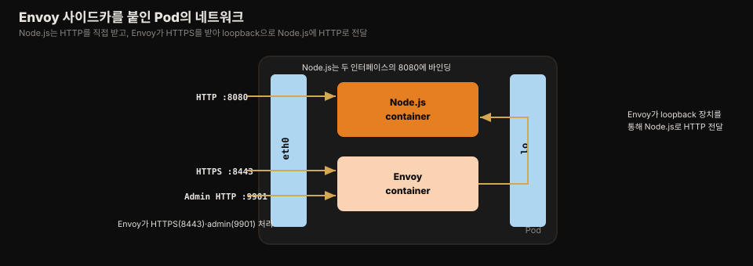
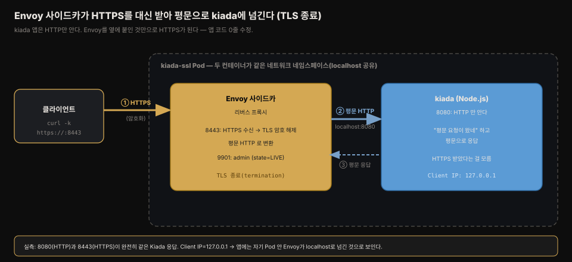
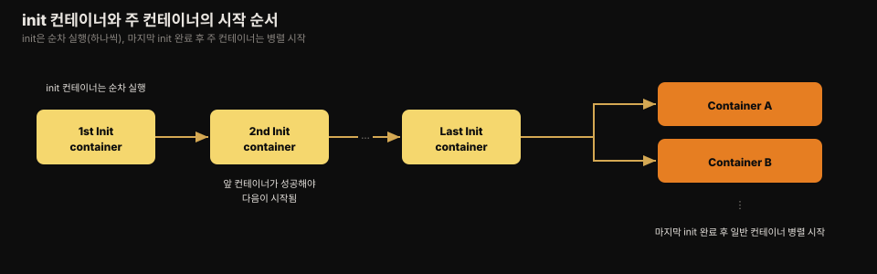
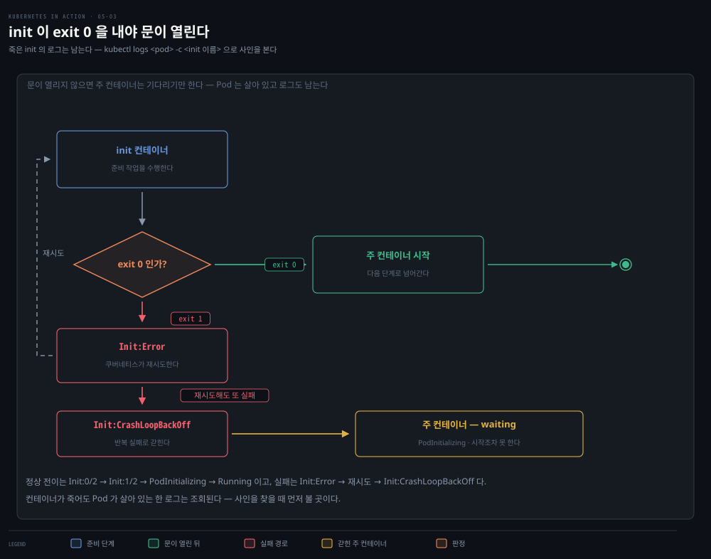
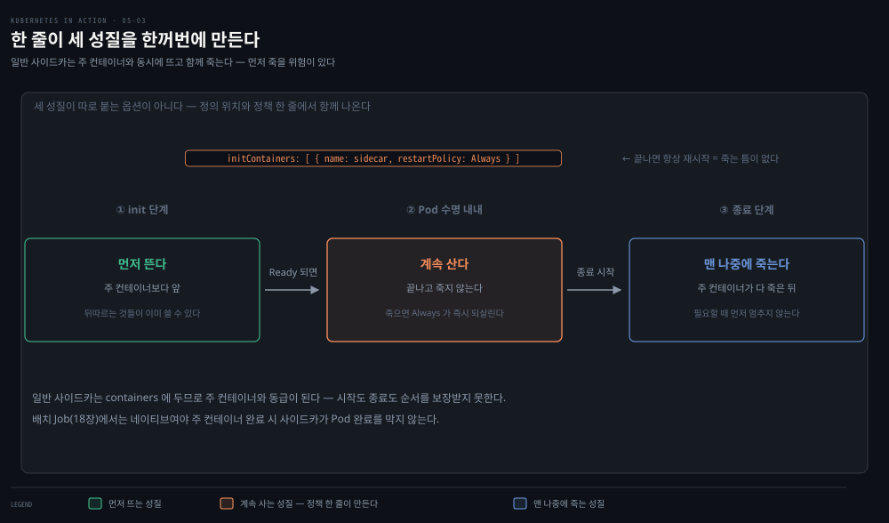
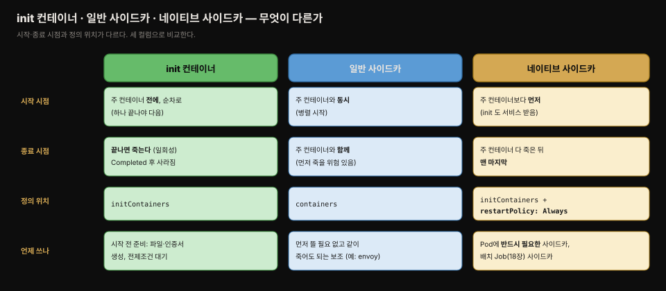
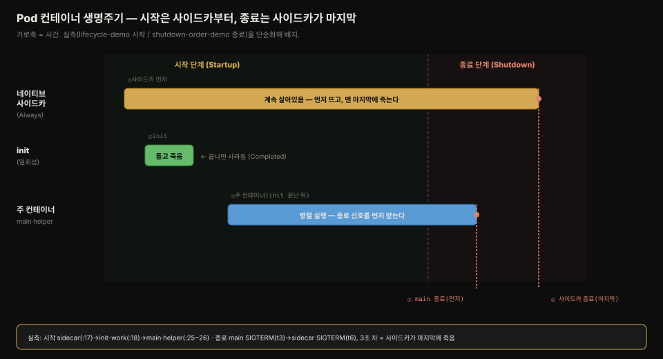

# 멀티 컨테이너·init·네이티브 사이드카와 삭제
---
> Pod 하나에 컨테이너를 여럿 두면 이들은 병렬로 시작되지만, **주 컨테이너보다 먼저 순차적으로 돌려야 할 초기화 작업은 init 컨테이너로, 주 컨테이너 전체 수명 동안 살아 있어야 할 보조는 네이티브 사이드카로 다룹니다.** 
>
> 이 편에서는 Envoy 사이드카를 붙인 멀티 컨테이너 Pod, init 컨테이너, 1.28부터의 네이티브 사이드카, 그리고 오브젝트 삭제 방법을 정리합니다.


## 진입 — 이 문서를 읽고 나면 무엇을 할 수 있는가

> 이 문서를 읽고 나면 Envoy 프록시를 사이드카로 붙인 멀티 컨테이너 Pod를 만들고, init 컨테이너로 주 컨테이너 시작 전 초기화를 수행하고, 네이티브 사이드카(`restartPolicy: Always`)와 일반 사이드카를 구분하고, Pod와 다른 오브젝트를 여러 방법으로 삭제할 수 있습니다.

이 개념은 "본 작업 전에 준비 단계를 순서대로 돌린다"는 익숙한 발상입니다. 다만 쿠버네티스는 그 준비 단계(init 컨테이너)와 보조 서비스(사이드카)를 컨테이너 단위로 나누고, 시작·종료 순서까지 세밀하게 제어한다는 점이 다릅니다.


## 1. Pod에 두 번째 컨테이너 붙이기 — Envoy 사이드카

> Kiada 애플리케이션은 HTTP만 지원하는데, 코드를 전혀 건드리지 않고 Envoy 프록시를 사이드카로 붙여 HTTPS를 처리하게 할 수 있습니다.

05-02의 Kiada는 HTTP만 지원합니다. `app.js`에 코드를 넣어 TLS를 지원하게 할 수도 있지만, 코드를 전혀 건드리지 않는 더 쉬운 방법이 있습니다. **Envoy** 리버스 프록시를 사이드카 컨테이너로 Node.js 옆에 두고 HTTPS 요청을 대신 처리하게 하는 것입니다. Envoy는 Lyft가 만들어 CNCF에 기부한 고성능 오픈소스 서비스 프록시입니다.

새 아키텍처에서 Pod는 컨테이너 둘(Node.js·Envoy)을 갖습니다. Node.js는 HTTP 요청을 직접 처리하고, HTTPS 요청은 Envoy가 받습니다. 들어오는 HTTPS 요청마다 Envoy가 새 HTTP 요청을 만들어 loopback 장치(localhost)를 통해 Node.js로 보냅니다.



애플리케이션 안에서 직접 TLS를 구현하면 네트워크 홉이 없어 자원을 덜 쓰고 지연도 낮지만, Envoy를 붙이는 것이 더 빠르고 쉬운 해법일 수 있습니다. Envoy가 제공하는 많은 기능(관리 인터페이스 등)을 코드로 직접 구현할 필요 없이 얻는 출발점도 됩니다.

멀티 컨테이너 Pod 매니페스트는 컨테이너를 `containers` 리스트에 나란히 둡니다.

```yaml
apiVersion: v1
kind: Pod
metadata:
  name: kiada-ssl
spec:
  containers:
  - name: kiada                    # Node.js 서버, 포트 8080
    image: luksa/kiada:0.2
    ports:
    - name: http
      containerPort: 8080
  - name: envoy                    # Envoy 프록시, 8443(HTTPS)·9901(admin)
    image: luksa/kiada-ssl-proxy:0.1
    ports:
    - name: https
      containerPort: 8443
    - name: admin
      containerPort: 9901
```

포트에 이름(`http`·`https`·`admin`)을 붙인 것은 매니페스트를 읽는 사람이 각 포트 번호의 의미를 이해할 수 있게 하기 위해서입니다.

### Envoy가 무엇이고 왜 사이드카로 붙이는가

**Envoy는 네트워크 프록시입니다.** 프록시는 클라이언트와 실제 서버 사이에 끼어 요청을 대신 받아 전달하고 응답을 되돌려주는 중개자입니다. Envoy는 Lyft가 만들어 CNCF에 기부한 고성능 오픈소스 프록시로, 쿠버네티스 생태계에서 프록시라고 하면 사실상 Envoy를 가리킵니다.

kiada 앱은 HTTP만 알고 HTTPS를 처리하는 코드가 없습니다. 두 갈래가 있습니다 — 앱 코드에 TLS 암호화를 직접 넣거나, 아니면 Envoy를 앞에 세워 **HTTPS를 대신 받게** 하는 것입니다. 후자를 택하면 kiada는 그대로 두고, Envoy가 HTTPS 요청의 암호를 풀어(TLS 종료) 평문 HTTP로 바꾼 뒤 같은 Pod 안 kiada에 넘깁니다. **앱 코드를 한 줄도 고치지 않고 HTTPS가 붙는** 것입니다.



> **서비스 메시로 가는 출발점.** 여기서는 Envoy에게 "TLS 종료" 하나만 시켰지만, Envoy는 로드밸런싱·재시도·회로 차단·인증(mTLS)을 코드 수정 없이 붙일 수 있습니다. 
>
> 이렇게 모든 Pod에 사이드카 프록시를 붙여 통신을 일괄 제어하는 구조가 **서비스 메시**(Istio 등)이고, Envoy가 그 데이터플레인 엔진입니다. 개념은 `서비스 메시 기초` <!-- 링크 끊김(2026-08): ../../service-mesh/01_foundation/01-01.서비스 메시 기초.md -->와 `프록시 아키텍처` <!-- 링크 끊김(2026-08): ../../service-mesh/01_foundation/02-01.프록시 아키텍처.md -->에서, 게이트웨이·mesh 라우팅은 [13-03(mesh)](./13-03.TLS%C2%B7%EA%B8%B0%ED%83%80%20%ED%94%84%EB%A1%9C%ED%86%A0%EC%BD%9C%C2%B7%ED%81%AC%EB%A1%9C%EC%8A%A4%20%EB%84%A4%EC%9E%84%EC%8A%A4%ED%8E%98%EC%9D%B4%EC%8A%A4%C2%B7mesh.md)에서 다룹니다. 네트워크 내부(라우팅·CNI)는 11장 이후에서 이어집니다.

### 실제 확인 — Envoy가 HTTPS를 대신 처리한다

`k8s-lab` 클러스터에 kiada(Node.js) + Envoy 두 컨테이너를 한 Pod로 띄우고 세 포트로 접근하면, Envoy가 TLS를 종료해 앱 코드 수정 없이 HTTPS가 처리됩니다.

```bash
curl localhost:8080              # HTTP — Node.js 직접
# Kiada version 0.2. Request processed by "kiada-ssl". Client IP: ::ffff:127.0.0.1

curl -k https://localhost:8443   # HTTPS — Envoy가 TLS 종료 후 8080으로 중계
# Kiada version 0.2. Request processed by "kiada-ssl". Client IP: ::ffff:127.0.0.1  ← 완전히 동일!

curl -s localhost:9901/server_info   # Envoy admin
# "state": "LIVE"  (프록시가 실제로 살아있음)
```

**8080(HTTP)과 8443(HTTPS)이 완전히 같은 응답**을 냅니다. kiada는 HTTP만 아는데 HTTPS가 되는 것은 Envoy가 TLS 껍데기를 벗겨 평문으로 넘겼기 때문입니다. `Client IP`가 `127.0.0.1`인 것도 두 컨테이너가 **같은 네트워크 네임스페이스에서 localhost로 통신**한다는 05-01 개념 그대로입니다 — kiada 입장에서 요청은 자기 Pod 안 Envoy에서 온 것으로 보입니다.

> ⚠️ **실습 환경 주의 — 이미지 아키텍처.** 책의 `luksa/kiada-ssl-proxy` 이미지는 x86(amd64) 전용이라 Apple Silicon(ARM) 맥에서 `rosetta error: bss_size overflow`(exit 133)로 죽습니다. 
>
> 이 실습은 ARM 네이티브를 포함한 공식 멀티아키텍처 이미지 `envoyproxy/envoy`로 대체하고, 인증서·Envoy config는 initContainer가 emptyDir에 생성하도록 구성했습니다(ConfigMap은 08-02에서 다루므로 여기서는 initContainer만 사용). 또 이 이미지의 ENTRYPOINT가 `/docker-entrypoint.sh`라 `args`만 주면 envoy가 실행되지 않으므로, `command: ["envoy", "-c", ...]`로 entrypoint를 우회해야 합니다. 매니페스트는 실습 저장소 `k8s-in-action/05-pods/pod-kiada-ssl.yaml`에 있습니다.


## 2. 멀티 컨테이너 Pod와 상호작용하기

> 컨테이너가 여럿이므로 로그·exec 명령에 `-c`로 대상 컨테이너를 지정해야 하고, port-forward는 여러 포트를 동시에 넘길 수 있습니다.

`kubectl port-forward`는 여러 포트를 동시에 넘길 수 있습니다.

```bash
kubectl port-forward kiada-ssl 8080 8443 9901

curl localhost:8080              # HTTP
curl https://localhost:8443 --insecure   # HTTPS (Envoy가 처리)
```

- `--insecure`(또는 `-k`)를 쓰는 이유는 두 가지입니다. Envoy가 쓰는 인증서가 `example.com` 도메인용 자체 서명(self-signed) 인증서인데, `localhost`로 접근하므로 호스트명이 인증서 이름과 맞지 않고, 자체 서명이라 curl이 유효한 것으로 받아들이지 않습니다. 
- 이름을 맞추고 인증서를 검증하려면 `--resolve`·`--cacert` 플래그를 써야 하는데, 타이핑이 많아 보통 `--insecure`를 씁니다.

컨테이너가 둘이므로 로그·exec에는 대상 컨테이너를 지정합니다.

```bash
kubectl logs kiada-ssl -c kiada          # kiada 컨테이너 로그
kubectl logs kiada-ssl -c envoy          # envoy 컨테이너 로그
kubectl logs kiada-ssl --all-containers  # 두 컨테이너 로그 모두
kubectl exec -it kiada-ssl -c envoy -- bash   # envoy 컨테이너에서 셸
```

> 이름을 주지 않으면 `kubectl exec`는 매니페스트에 처음 지정된 컨테이너를 기본으로 씁니다.


## 3. init 컨테이너 — 주 컨테이너 시작 전 초기화

> Pod의 여러 컨테이너는 병렬로 시작되지만, 그 전에 순차적으로 실행돼 모두 성공해야 주 컨테이너가 시작되는 특수 컨테이너가 init 컨테이너입니다.

**Pod에 컨테이너가 여럿이면 모두 병렬로 시작됩니다.** 쿠버네티스는 컨테이너 간 시작 순서 의존성을 지정하는 메커니즘을 제공하지 않습니다. 대신 주 컨테이너가 시작되기 전에 Pod를 초기화하는 컨테이너 시퀀스를 돌릴 수 있는데, 이것이 **init 컨테이너**입니다. init 컨테이너는 하나씩 차례로 돌고, 모두 성공적으로 끝나야 주 컨테이너가 시작됩니다.



init 컨테이너는 보통 다음 목적으로 씁니다.

1. **볼륨의 파일 초기화** — 인증서·개인 키를 안전한 저장소에서 가져오거나, 설정 파일 생성, 데이터 다운로드 등.
2. **Pod 네트워킹 초기화** — 모든 컨테이너가 같은 네트워크 네임스페이스를 공유하므로, init 컨테이너가 바꾼 설정이 주 컨테이너에도 적용됨.
3. **전제 조건 충족까지 시작 지연** — 주 컨테이너가 의존하는 서비스가 준비될 때까지 init 컨테이너가 대기.
4. **외부 서비스에 Pod 시작 통지** — 새 인스턴스가 시작됨을 외부 시스템에 알림.

이 작업을 주 컨테이너에서 직접 할 수도 있지만 init 컨테이너를 쓰면 이점이 있습니다. 주 컨테이너 이미지를 다시 빌드하지 않아도 되고, 같은 init 컨테이너 이미지를 여러 애플리케이션에서 재사용할 수 있습니다.

**보안**도 중요한 이유입니다. 공격자가 악용할 수 있는 도구나 데이터(예: 외부 시스템 등록용 비밀 토큰)를 주 컨테이너에서 init 컨테이너로 옮기면, 주 컨테이너의 공격 표면이 줄어듭니다. 주 컨테이너에 취약점이 있어 임의 파일을 읽을 수 있어도, 토큰이 init 컨테이너 파일시스템에만 있으면 탈취하기 어렵습니다.

init 컨테이너는 spec의 `initContainers` 필드에 정의합니다.

```yaml
spec:
  initContainers:                  # init 컨테이너는 여기 정의
  - name: init-demo                # 먼저 실행
    image: luksa/init-demo:0.1
  - name: network-check           # 앞 것이 끝난 뒤 실행
    image: luksa/network-connectivity-checker:0.1
  containers:                      # 주 컨테이너들 — 병렬 실행
  - name: kiada
    image: luksa/kiada:0.2
    ...
```

> 컨테이너 이름은 init 컨테이너와 일반 컨테이너 전체에서 유일해야 합니다.

Pod가 시작될 때 상태 전이는 `Init:0/2`(첫 init 실행) → `Init:1/2`(첫 init 완료, 둘째 실행) → `PodInitializing`(모든 init 완료, 주 컨테이너 이미지 pull) → `Running`(주 컨테이너 실행) 순으로 나타납니다.

### init 컨테이너 점검

일반 컨테이너처럼 `kubectl logs`로 로그를, `kubectl exec`로 명령을 실행할 수 있습니다. 단 `kubectl exec`는 init 컨테이너가 종료되기 전에만 가능합니다.

```bash
kubectl logs kiada-init -c network-check   # init 컨테이너 로그
kubectl exec -it kiada-init-slow -c init-demo -- sh   # 실행 중 init 컨테이너 진입
```

보통 init 컨테이너는 정상 동작 시 `kubectl exec`를 실행하기도 전에 종료되므로, 진입은 주로 init 컨테이너가 제때 끝나지 못해 원인을 찾을 때만 합니다.

### 실제 확인 — init이 실패하면 주 컨테이너는 시작조차 못 한다

"init이 성공해야 주 컨테이너가 시작된다"는 규칙을, init을 일부러 실패(`exit 1`)시켜 뒤집어 확인합니다. init이 성공하지 못하면 주 컨테이너는 `Running`도 `Error`도 아닌 **대기 상태에 갇힙니다.**

```bash
kubectl get pod init-fail-demo
# NAME             READY   STATUS       RESTARTS      AGE
# init-fail-demo   0/1     Init:Error   2 (39s ago)   47s

kubectl get pod init-fail-demo \
  -o jsonpath='{.status.containerStatuses[0].state}'
# {"waiting":{"reason":"PodInitializing"}}   ← 주 컨테이너는 '시작조차 못 함'
```

주 컨테이너 상태가 `waiting`(`reason: PodInitializing`)입니다 — init이 끝나지 못해 **초기화 단계를 넘어가지 못한** 것입니다. `RESTARTS`가 늘어나는 것은 쿠버네티스가 실패한 init을 재시도한다는 뜻이고, 반복 실패하면 `Init:CrashLoopBackOff`가 됩니다. 죽은 init의 로그는 `kubectl logs -c`로 여전히 조회되므로(05-02 §7의 `logs -c`와 같은 기법) 실패 원인을 찾을 수 있습니다.




## 4. 네이티브 사이드카 컨테이너 (쿠버네티스 1.28+)

> init 컨테이너가 제공하는 서비스를 다른 init 컨테이너나 주 컨테이너가 필요로 할 때, `restartPolicy: Always`를 준 init 컨테이너 — 네이티브 사이드카 — 가 그 자리를 메웁니다.

일반 사이드카는 주 컨테이너와 병렬로 시작돼 서비스를 보완하지만, 몇 가지 한계가 있습니다. 

- 사이드카가 제공하는 서비스를 init 컨테이너도 필요로 하면 어떻게 할까요? 사이드카가 주 컨테이너보다 먼저 시작되고 나중에 멈추도록 보장하고 싶으면요? 
- init 컨테이너는 일반 컨테이너보다 먼저, 그리고 하나씩 순차로 도는데, 아직 시작도 안 된 사이드카가 어떻게 init 컨테이너에 서비스를 줄 수 있을까요?

버전 1.28부터 쿠버네티스는 사이드카를 네이티브로 지원합니다. init 컨테이너의 `restartPolicy`를 `Always`로 설정하면 그 컨테이너가 **네이티브 사이드카**가 됩니다. 이런 컨테이너는 진짜 init 컨테이너는 아니지만 Pod의 init 단계에서 시작되므로 `initContainers` 리스트에 정의합니다.

`restartPolicy: Always`가 왜 "계속 살아있음"을 만드는지는 재시작의 결과로 이해할 수 있습니다. 일반 init은 작업이 끝나면(exit 0) 죽은 채로 남지만, `Always`가 붙으면 **끝나는 순간 즉시 되살아나기를 반복**합니다. 죽음과 부활 사이의 틈이 0이라 바깥에서 보면 한 번도 죽지 않은 상시 실행 컨테이너가 됩니다. 즉 새 필드를 만드는 대신 기존 `restartPolicy: Always`를 재활용해 "끝나도 계속 되살아나는 = 사실상 안 죽는 사이드카"를 한 줄로 표현한 것입니다.



네이티브 사이드카는 자기 차례가 오면 다른 init 컨테이너처럼 시작되지만, 쿠버네티스가 그것이 끝나기를 기다리지 않고 나머지 init 컨테이너를, 그다음 주 컨테이너를 시작합니다. 사이드카는 Pod의 전체 수명 동안 계속 돌면서 주 컨테이너뿐 아니라 그 뒤에 오는 모든 init 컨테이너에도 서비스를 제공할 수 있습니다.

`restartPolicy`에 따라 쿠버네티스는 사이드카가 종료되면 언제든 재시작합니다. 사이드카는 Pod가 도는 내내 서비스를 제공해야 하므로, 보통 이것이 원하는 동작입니다.

**종료 순서**도 달라집니다. 일반 컨테이너는 쿠버네티스가 모두 동시에 종료 신호를 보내므로 사이드카가 다른 컨테이너보다 먼저 멈출 수 있습니다.

하지만 네이티브 사이드카는 다르게 다뤄집니다.

- 쿠버네티스가 먼저 일반 컨테이너에 종료 신호를 보내고, 그다음에야 네이티브 사이드카에 종료 신호를 보냅니다. 사이드카가 아직 필요할 때 멈추지 않도록 보장하는 것입니다. 
- 예를 들어 네트워크 연결을 제공하는 사이드카는 다른 모든 컨테이너가 멈출 때까지 멈추면 안 되고, 로그 처리 사이드카는 다른 컨테이너의 로그를 처음부터 끝까지 처리해야 합니다.

> 쿠버네티스는 네이티브 사이드카를 `initContainers` 리스트에 나온 역순으로 종료합니다.

```yaml
spec:
  initContainers:
  - name: init-demo
    image: luksa/init-demo:0.1
  - name: traffic-meter                     # 네이티브 사이드카
    image: luksa/network-traffic-meter:0.1
    restartPolicy: Always                   # 이 한 줄이 네이티브 사이드카로 만듦
  - name: network-check
    image: luksa/network-connectivity-checker:0.1
  containers:
  - name: kiada
    ...
```

사이드카를 `network-check` init 컨테이너보다 **앞에** 둔 것은, 사이드카가 네트워크 체커의 트래픽까지 측정하도록 하기 위해서입니다.

### 일반 사이드카로 둘지 네이티브 사이드카로 둘지

`kiada-native-sidecar` Pod는 컨테이너 셋을 돌립니다 — 주 컨테이너 `kiada`, 그리고 사이드카 `envoy`와 `traffic-meter`입니다. `envoy`는 진짜 네이티브 사이드카가 아니고 `traffic-meter`만 네이티브 사이드카입니다.

차이는 이렇습니다. `envoy`는 `kiada`보다 먼저 시작될 필요가 없고 `kiada`와 동시에 종료돼도 되므로 일반 컨테이너로 둡니다. 반면 Pod가 동작하는 데 사이드카가 **반드시 필요하면** 네이티브 사이드카로 정의해야 합니다.

> 18장에서 다룰 배치 처리 Pod는 무한정 돌지 않고 작업을 마치면 완료됩니다. 이런 Pod에 사이드카를 추가할 때는 반드시 네이티브 사이드카로 둬야, 주 컨테이너가 작업을 마쳤을 때 사이드카가 Pod의 완료를 막지 않습니다.

세 종류 컨테이너의 생명주기를 한눈에 비교하면 다음과 같습니다.



### 실제 확인 — 시작은 사이드카부터, 종료는 사이드카가 마지막

네이티브 사이드카(`restartPolicy: Always`) + 일반 init + 주 컨테이너를 한 Pod에 두고 시작·종료 순서를 관찰합니다.

**시작 순서** — 컨테이너별 상태를 보면 사이드카가 먼저 뜨고(init 단계), 일반 init은 끝나면 죽고, 주 컨테이너는 병렬로 시작됩니다.

```bash
kubectl get pod lifecycle-demo \
  -o jsonpath='{range .status.initContainerStatuses[*]}{.name}: {.state}{"\n"}{end}'
# sidecar: {"running":...}                          ← 네이티브 사이드카: 계속 running
# init-work: {"terminated":...,"reason":"Completed"} ← 일반 init: 끝나면 죽음
```

실측 시각으로는 sidecar(:17)가 먼저 뜨고 → init-work(:18)가 그 뒤에 돌고 → main·helper(:25~26)가 병렬로 시작했습니다. 사이드카가 init보다 먼저 떠서, init이 도는 동안에도 살아있다는 점이 핵심입니다.

**종료 순서** — Pod를 삭제하며 각 컨테이너가 종료 신호(SIGTERM)를 받는 시각을 로그로 잡으면, 주 컨테이너가 먼저 죽고 사이드카가 마지막에 죽습니다.

```bash
# 각 컨테이너에 preStop 훅으로 종료 시각을 로그에 남긴 뒤 Pod 삭제
kubectl delete pod shutdown-order-demo --wait=false
# t=3s | main:    [main] SIGTERM 받음(종료)      ← 주 컨테이너가 먼저
# t=6s | sidecar: [sidecar] SIGTERM 받음(종료)   ← 3초 뒤, 사이드카가 마지막
```

`main`이 t=3s에 종료 신호를 받고, `sidecar`는 t=6s에야 받습니다. 3초 차이는 우연이 아니라 **주 컨테이너가 완전히 죽은 뒤에야 쿠버네티스가 사이드카에 종료 신호를 보내기 때문**입니다. 사이드카가 아직 필요할 때(로그 처리·네트워크 유지) 먼저 멈추지 않도록 보장하는 것입니다.



> **상태 이름을 성공/실패로 읽지 않기.** 위 실측에서 init-work가 `terminated`로 보이지만 이는 실패가 아니라 **"실행이 끝남"**일 뿐이고, 성공/실패는 그 안의 `exitCode`(0=성공)와 `reason`(`Completed` vs `Error`)이 결정합니다 — init 컨테이너는 `terminated/Completed`가 정상 결과입니다. 마찬가지로 init이 실패해도 Pod의 phase는 `Failed`가 아니라 `Pending`인데, phase는 성공/실패 판정이 아니라 **생애 단계**(아직 준비 중)를 뜻하기 때문입니다. 컨테이너 상태 3종(`waiting`/`running`/`terminated`)과 Pod phase의 정의·판정 기준은 [06-01. Pod 상태](./06-01.Pod%20%EC%83%81%ED%83%9C%20%E2%80%94%20phase%C2%B7conditions%C2%B7%EC%BB%A8%ED%85%8C%EC%9D%B4%EB%84%88%20%EC%83%81%ED%83%9C.md)가 SSOT입니다.


## 5. Pod와 오브젝트 삭제하기

> Pod를 삭제하면 컨테이너가 종료·제거되고, Deployment를 삭제하면 그 Pod들이 삭제되며, `all` 키워드로 여러 종류를 한 번에 지울 수 있습니다.

가장 쉬운 삭제는 이름으로 지우는 것입니다.

```bash
kubectl delete po kiada                    # 이름으로 단일 Pod 삭제
kubectl delete po kiada-init kiada-init-slow   # 여러 Pod를 공백으로 구분해 삭제
```

Pod를 삭제하면 그 Pod나 컨테이너가 더는 존재하지 않기를 원한다고 선언하는 것입니다. Kubelet이 컨테이너를 종료하고 로그 파일 등 연관 자원을 제거한 뒤 API 서버에 알리면 Pod 오브젝트가 제거됩니다. 삭제 중에는 상태가 `Terminating`으로 바뀝니다.

> `kubectl delete`는 기본적으로 오브젝트가 완전히 사라질 때까지 기다립니다. 기다리지 않으려면 `--wait=false`를 씁니다.
> Docker와 달리 Pod는 멈췄다 다시 시작할 수 없습니다. 완전히 제거하고 나중에 다시 만드는 것만 가능합니다.

매니페스트 파일이나 디렉터리로도 삭제할 수 있습니다.

```bash
kubectl delete -f pod.kiada-ssl.yaml            # 파일로 삭제
kubectl delete -f pod.kiada.yaml,pod.kiada-ssl.yaml   # 여러 파일(쉼표 구분)
kubectl delete -f Chapter05/                     # 디렉터리 전체(하위는 -R 필요)
```

`--all`로 특정 종류의 모든 인스턴스를, `all`로 여러 종류를 한 번에 지울 수 있습니다.

```bash
kubectl delete po --all       # 모든 Pod 삭제
kubectl delete all --all      # 모든 종류의 모든 인스턴스 삭제
```

여기서 주의할 점이 있습니다. Deployment가 관리하는 Pod를 삭제하면, Deployment 컨트롤러가 원하는 복제본 수를 맞추려고 **즉시 교체 Pod를 만듭니다**. `kubectl delete po --all`을 실행해도 새 Pod가 계속 생기는 이유입니다. 이 Pod들을 없애려면 Deployment를 0으로 스케일하거나 Deployment 오브젝트 자체를 삭제해야 합니다.

`kubectl delete all --all`의 첫 `all`은 모든 종류를, `--all`은 각 종류의 모든 인스턴스를 뜻합니다. Pod·Deployment·Service·ReplicaSet까지 지워집니다. 다만 `all` 키워드가 **모든 종류를 포함하지는 않습니다** — 중요한 정보를 담은 오브젝트를 실수로 지우지 않게 하는 예방책입니다. Event 오브젝트가 그 예로, `all`에 포함되지 않습니다.

> 내장 `kubernetes` Service도 삭제되지만 잠시 후 자동으로 다시 만들어지므로 걱정하지 않아도 됩니다.


## Spring 앱 배포 관점에서

> Spring Boot 앱에서 init 컨테이너는 DB 마이그레이션·설정 주입에, 네이티브 사이드카는 서비스 메시 프록시에 쓰이고, "Deployment가 삭제한 Pod를 즉시 되살린다"는 원리는 롤링 업데이트의 기반이 됩니다.

init 컨테이너는 Spring Boot 앱 배포에서 자주 쓰입니다. 대표적으로 **DB 스키마 마이그레이션**입니다. 

- Flyway나 Liquibase를 주 애플리케이션 시작 시 돌리면 여러 replica가 동시에 마이그레이션을 시도해 충돌할 수 있는데, 마이그레이션을 init 컨테이너로 빼면 주 컨테이너 시작 전에 한 번만 실행되도록 순서를 보장할 수 있습니다. §3의 "전제 조건 충족까지 대기" 용도도 흔합니다.
- 앱이 의존하는 DB나 Kafka가 준비될 때까지 init 컨테이너가 연결을 재시도하며 블록하면, Spring 앱이 시작 직후 커넥션 실패로 죽는 `CrashLoopBackOff`를 줄일 수 있습니다.

네이티브 사이드카(1.28+)는 서비스 메시 환경에서 특히 중요합니다. Istio의 Envoy 프록시를 일반 사이드카로 주입하면, 프록시가 아직 준비되지 않은 사이에 Spring 앱이 외부 호출을 시도해 실패하거나, 종료 시 프록시가 먼저 죽어 앱의 마지막 요청이 네트워크에 닿지 못하는 문제가 있었습니다. 프록시를 네이티브 사이드카로 두면 §4의 시작·종료 순서 보장(프록시가 먼저 뜨고 나중에 죽음) 덕분에 이 경쟁이 사라집니다. 특히 18장에서 다룰 배치성 Spring `Job`에서는 네이티브 사이드카가 필수인데, 일반 사이드카로 두면 주 배치 작업이 끝나도 사이드카가 계속 돌아 Job이 완료되지 않기 때문입니다.

§5의 "Deployment가 삭제된 Pod를 즉시 되살린다"는 원리는 Spring 앱의 무중단 배포 기반입니다. `kubectl delete pod`로 특정 Pod를 지워도 컨트롤러가 새 Pod를 만들어 원하는 replica 수를 유지하므로, 이 메커니즘 위에서 롤링 업데이트(구 Pod를 하나씩 새 Pod로 교체)가 동작합니다. 그래서 개별 Pod를 직접 지우는 대신 Deployment 이미지 태그를 바꿔 `kubectl apply`하는 것이 정석입니다.


## 관련 문서

> 이 편은 멀티 컨테이너 Pod·init 컨테이너·네이티브 사이드카·오브젝트 삭제를 다루며 5장을 마무리합니다. Deployment·ReplicaSet의 세부는 이미 전용 개념 노트에 정리돼 있어, 여기서는 이 책의 서술과 예시만 다뤘습니다.

- [05-02.Pod 생성과 상호작용](./05-02.Pod%20%EC%83%9D%EC%84%B1%EA%B3%BC%20%EC%83%81%ED%98%B8%EC%9E%91%EC%9A%A9.md) — 이 편에서 확장한 단일 컨테이너 Pod를 만들고 다루는 이전 편
- [06-01.Pod 상태 — phase·conditions·컨테이너 상태](./06-01.Pod%20%EC%83%81%ED%83%9C%20%E2%80%94%20phase%C2%B7conditions%C2%B7%EC%BB%A8%ED%85%8C%EC%9D%B4%EB%84%88%20%EC%83%81%ED%83%9C.md) — 이 편에서 만든 Pod들의 상태를 status 섹션에서 읽는 법을 다루는 다음 편
- [05-01.Pod 이해 — 컨테이너 그룹화와 사이드카](./05-01.Pod%20%EC%9D%B4%ED%95%B4%20%E2%80%94%20%EC%BB%A8%ED%85%8C%EC%9D%B4%EB%84%88%20%EA%B7%B8%EB%A3%B9%ED%99%94%EC%99%80%20%EC%82%AC%EC%9D%B4%EB%93%9C%EC%B9%B4.md) — 이 편의 사이드카 패턴을 개념으로 다룬 편
- [핵심 워크로드](../../kubernetes/01_workloads/01-01.%ED%95%B5%EC%8B%AC%20%EC%9B%8C%ED%81%AC%EB%A1%9C%EB%93%9C.md) — 이 편에서 언급한 Deployment·ReplicaSet의 복제본 관리·롤링 업데이트를 깊게 다룬 편
- `서비스 메시 기초` <!-- 링크 끊김(2026-08): ../../service-mesh/01_foundation/01-01.서비스 메시 기초.md --> — §1의 Envoy 사이드카를 클러스터 전체 통신 제어(서비스 메시)로 확장한 편
- `프록시 아키텍처` <!-- 링크 끊김(2026-08): ../../service-mesh/01_foundation/02-01.프록시 아키텍처.md --> — Envoy 같은 사이드카 프록시가 트래픽을 가로채 처리하는 구조를 다룬 편
- [Kubernetes 공식 문서 — Init Containers](https://kubernetes.io/docs/concepts/workloads/pods/init-containers/) — init 컨테이너의 최신 공식 설명
- [Kubernetes 공식 문서 — Sidecar Containers](https://kubernetes.io/docs/concepts/workloads/pods/sidecar-containers/) — 네이티브 사이드카(1.28+)의 최신 공식 설명
