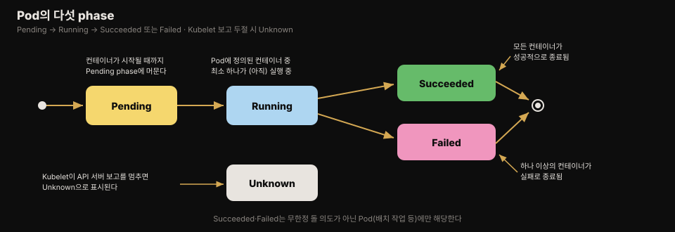
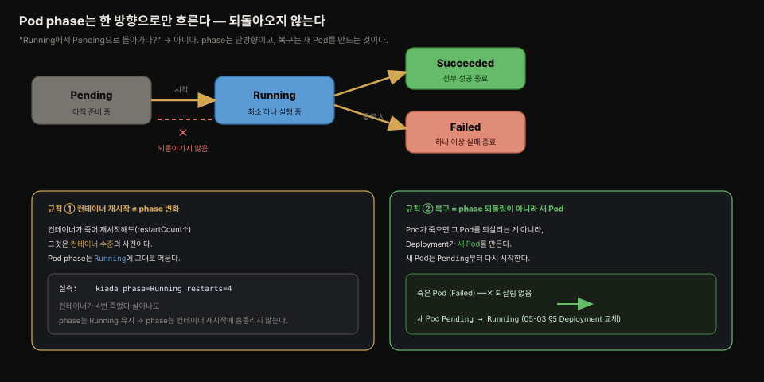
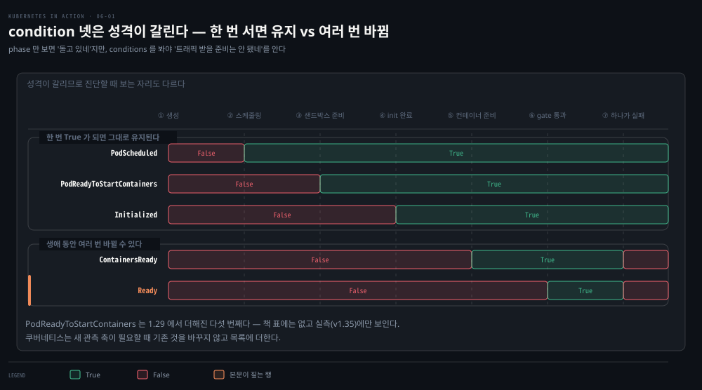
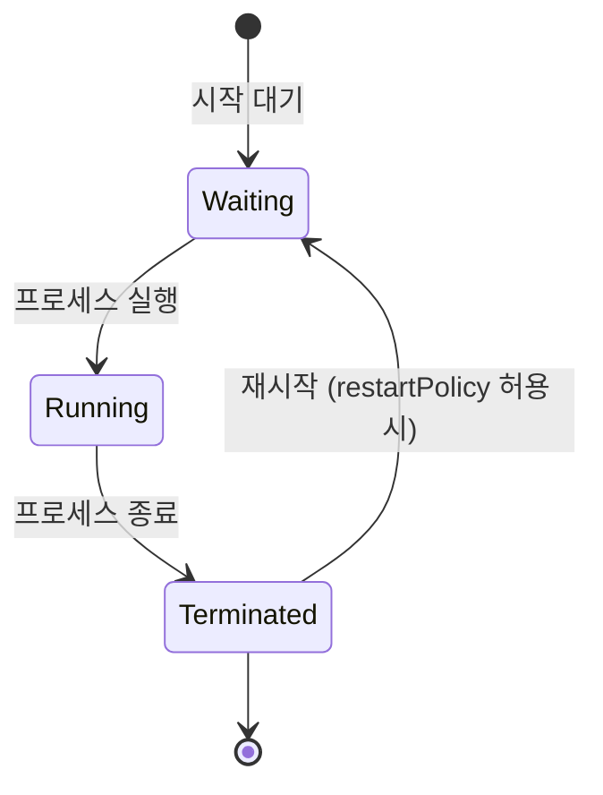
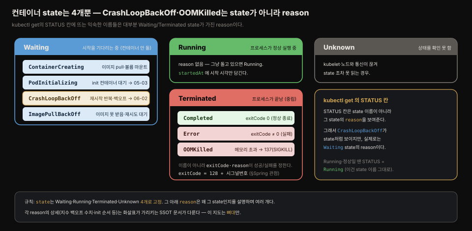
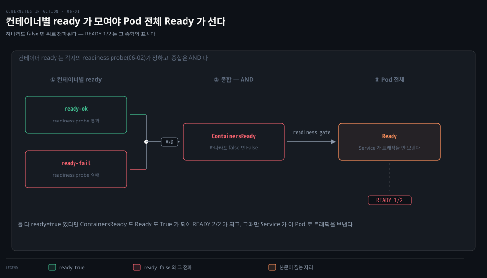

# Pod 상태 — phase·conditions·컨테이너 상태
---
> **Pod 오브젝트의 status 섹션은 phase(다섯 단계 요약), conditions(도달한 상태와 이유)**, 그리고 컨테이너별 상태라는 세 층위로 Pod에 무슨 일이 일어나는지 알려줍니다. 이 편에서는 각 층위가 무엇을 말해 주고 어떻게 조회하는지를 정리합니다.


## 진입 — 이 문서를 읽고 나면 무엇을 할 수 있는가

> 이 문서를 읽고 나면 Pod의 다섯 phase와 네 condition이 각각 무엇을 뜻하는지, 컨테이너의 네 가지 state와 그 하위 필드(exitCode·restartCount 등)를 어디서 읽는지, 그리고 `kubectl get`의 STATUS 열이 phase와 언제 다른지 설명할 수 있습니다.

이 개념은 4장에서 본 spec-status 구조의 status 쪽을 Pod에 대입해 깊이 파는 작업입니다. Node 오브젝트의 conditions를 읽어 본 경험이 그대로 이어집니다 — Pod도 자기만의 condition 타입 집합을 가지며, 범용 `Ready` condition을 공유합니다.


## 1. Pod status 섹션에 담기는 것들

> Pod의 status에는 IP·시작 시각·QoS 클래스와 함께, 생애주기를 이해하는 데 핵심인 phase·conditions·컨테이너별 상태가 담깁니다.

Pod 오브젝트를 만들어 실행한 뒤 API에서 다시 읽으면 status 섹션에서 다음 정보를 볼 수 있습니다.

1. Pod와 그것을 호스팅하는 워커 노드의 IP 주소
2. Pod가 시작된 시각
3. Pod의 QoS(quality-of-service) 클래스
4. Pod가 현재 속한 **phase**
5. Pod의 **conditions**
6. 개별 **컨테이너의 상태**

IP 주소와 시작 시각은 추가 설명이 필요 없고 QoS 클래스는 지금 단계에서 중요하지 않습니다. 생애주기를 이해하는 데 중요한 것은 phase·conditions·컨테이너 상태 세 가지입니다.


## 2. Pod phase — 다섯 단계 요약

> phase는 Pod에 무슨 일이 일어나고 있는지 한 단어로 요약하며, 생애의 어느 시점이든 Pod는 다섯 phase 중 정확히 하나에 속합니다.

Pod는 생애의 어느 순간이든 다섯 phase 중 하나에 있습니다.



| Phase | 의미 |
|-------|------|
| Pending | Pod 오브젝트 생성 직후의 초기 phase. Pod가 노드에 스케줄링되고 컨테이너 이미지가 pull되어 시작될 때까지 이 phase에 머뭅니다 |
| Running | Pod의 컨테이너 중 최소 하나가 실행 중입니다 |
| Succeeded | 무한정 돌 의도가 아닌 Pod에서, 모든 컨테이너가 성공적으로 완료됐습니다 |
| Failed | 무한정 돌 의도가 아닌 Pod에서, 최소 하나의 컨테이너가 실패로 종료됐습니다 |
| Unknown | Kubelet이 API 서버와의 통신 보고를 멈춰 Pod의 상태를 알 수 없습니다. 워커 노드 장애나 네트워크 단절 가능성이 있습니다 |

phase는 다음 명령들로 확인합니다.

```bash
kubectl get po kiada -o yaml | grep phase        # phase: Running
kubectl get po kiada -o json | jq .status.phase  # jq로 필드만 추출
kubectl describe po kiada                        # Status: 행에 표시
```

`kubectl get pods`의 STATUS 열이 phase를 보여 주는 것처럼 보이지만, 이는 **건강한 Pod에만** 해당합니다. 문제가 있는 Pod에서는 STATUS 열이 phase 대신 무엇이 잘못됐는지(예: `CrashLoopBackOff`)를 표시합니다.

### phase는 단방향이다 — 재시작은 컨테이너 사건, 복구는 새 Pod

phase는 `Pending → Running → Succeeded`(또는 `Failed`)로 **한 방향으로만 흐르며 되돌아가지 않습니다.** `Running`에 도달한 Pod는 `Pending`으로 돌아가지 않습니다. 그렇다면 컨테이너가 죽어 재시작하면 어떻게 될까요 — 그때도 phase는 `Running`에 머뭅니다. 컨테이너 재시작은 **컨테이너 수준의 사건**이지 Pod phase를 바꾸지 않기 때문입니다.

```bash
kubectl get pod -l app=kiada \
  -o jsonpath='{range .items[*]}{.metadata.name}  phase={.status.phase}  restarts={.status.containerStatuses[0].restartCount}{"\n"}{end}'
# kiada-...  phase=Running  restarts=4   ← 컨테이너가 4번 죽었다 살아나도 phase는 Running
```

컨테이너가 네 번 재시작했는데도 phase는 `Running` 그대로입니다. 그럼 죽은 Pod의 "복구"는 무엇일까요 — phase를 되돌리는 게 아니라, Deployment가 **새 Pod**를 만들어 `Pending`부터 다시 시작시키는 것입니다(05-03 §5). 즉 쿠버네티스는 Pod를 고쳐 쓰지 않고 새로 만들어 교체합니다.



### 실제 확인 — init·사이드카가 `running`이어도 phase는 아직 `Pending`

`Running` phase의 기준은 오직 **주 컨테이너(`containers`)가 시작됐는가**입니다. init 컨테이너나 네이티브 사이드카(`initContainers`)가 아무리 `running` state로 돌고 있어도, 주 컨테이너가 아직 안 떴으면 Pod phase는 `Pending`입니다. init이 도는 동안 phase를 찍어 보면 이 구분이 드러납니다.

```bash
for i in 1 2 3 4 5 6; do
  kubectl get pod lifecycle-demo -o jsonpath="t=${i} phase={.status.phase} \
    sidecar={.status.initContainerStatuses[?(@.name=='sidecar')].state} \
    main={.status.containerStatuses[?(@.name=='main')].state}{\"\n\"}"
  sleep 1
done

# t=3  phase=Pending  sidecar=waiting/PodInitializing  main=waiting/PodInitializing
# t=4  phase=Pending  sidecar=running                  main=waiting/PodInitializing  ← ★
# t=6  phase=Pending  sidecar=running                  main=waiting/PodInitializing
```

- t=4가 핵심입니다 — **네이티브 사이드카는 `running`인데 phase는 여전히 `Pending`**이고, 주 컨테이너 `main`은 아직 `PodInitializing`(시작 전)입니다. 사이드카가 `initContainers`에 있어 phase 판정에 들어가지 않기 때문입니다. init이 모두 끝나 `main`이 시작되는 순간에야 phase가 `Running`으로 넘어갑니다. 
- 즉 **컨테이너별 state와 Pod 전체 phase는 별개로 움직입니다** — 개별 컨테이너가 `running`이라고 Pod phase가 `Running`이 되는 게 아니라, "주 컨테이너가 떴는가"만이 phase Running의 기준입니다.


## 3. Pod conditions — 어떤 상태에 도달했고 왜인가

> phase가 한 단어 요약이라면 **conditions는 Pod가 특정 상태에 도달했는지와 그 이유를 여러 축으로 알려주며, Pod는 항상 여러 condition을 동시에 가집니다.**

phase만으로는 Pod의 상태를 자세히 알기 어렵습니다. 4장에서 Node 오브젝트에 했던 것처럼 condition 목록을 보면 더 많은 것을 알 수 있습니다. 현재 Pod에는 네 가지 condition 타입이 있습니다.

| Condition | 의미 |
|-----------|------|
| PodScheduled | Pod가 노드에 스케줄링됐는지를 나타냅니다 |
| Initialized | Pod의 init 컨테이너가 모두 성공적으로 완료됐습니다 |
| ContainersReady | Pod의 모든 컨테이너가 준비됐다고 보고하고 있습니다. Pod 전체가 준비되기 위한 필요조건이지만 충분조건은 아닙니다 |
| Ready | Pod가 클라이언트에 서비스를 제공할 준비가 됐습니다. 컨테이너들과 Pod의 readiness gate(11장에서 설명)가 모두 준비를 보고한 상태입니다 |

네 condition의 시간에 따른 전이는 성격이 갈립니다. `PodScheduled`와 `Initialized`는 충족되지 않은 상태로 시작하지만 곧 충족되고 Pod의 남은 생애 동안 **그대로 유지**됩니다. 반면 `Ready`와 `ContainersReady`는 생애 동안 **여러 번 바뀔 수 있습니다**.



Node 오브젝트의 condition(MemoryPressure·DiskPressure·PIDPressure·Ready)을 기억한다면, 오브젝트 종류마다 자기만의 condition 타입 집합을 갖되 "이 오브젝트에 전반적으로 문제가 없는가"를 나타내는 범용 `Ready` condition을 공통으로 두는 패턴을 볼 수 있습니다.

conditions는 다음처럼 조회합니다.

```bash
kubectl describe po kiada
# Conditions:
#   Type              Status
#   Initialized       True
#   Ready             True
#   ContainersReady   True
#   PodScheduled      True
```

`kubectl describe`는 각 condition의 True/False만 보여줍니다. condition이 False인 **이유**를 알려면 매니페스트의 `status.conditions` 필드를 봐야 합니다.

```bash
kubectl get po kiada -o json | jq .status.conditions
# [
#   {
#     "lastProbeTime": null,
#     "lastTransitionTime": "2020-02-02T11:42:59Z",
#     "status": "True",
#     "type": "Initialized"
#   },
#   ...
```

각 condition의 `status` 필드는 `True`·`False`·`Unknown` 중 하나입니다. `reason` 필드는 마지막 상태 변화의 기계 판독용 사유를, `message` 필드는 그 변화를 자세히 설명합니다. `lastTransitionTime`은 변화가 일어난 시각을, `lastProbeTime`은 이 condition을 마지막으로 점검한 시각을 나타냅니다.

### 실제 확인 — phase는 Running인데 Ready는 False

conditions가 phase와 별개로 왜 필요한지는, **컨테이너 하나만 readiness에 실패한** Pod에서 분명해집니다. 컨테이너 둘 중 하나는 readiness probe를 통과시키고 하나는 일부러 실패시켜 `k8s-lab` 클러스터에 띄우면, phase는 `Running`인데 `Ready` condition은 `False`가 됩니다.

```bash
kubectl get pod readiness-demo
# NAME             READY   STATUS    RESTARTS   AGE
# readiness-demo   1/2     Running   0          11s   ← phase는 Running인데 READY는 1/2

kubectl get pod readiness-demo \
  -o jsonpath='{range .status.conditions[*]}{.type}{"\t"}{.status}{"\t"}{.reason}{"\n"}{end}'
# PodReadyToStartContainers  True
# Initialized                True
# Ready                      False  ContainersNotReady   ← Pod 전체는 아직 not-ready
# ContainersReady            False  ContainersNotReady
# PodScheduled               True
```

phase만 보면 "돌고 있네"지만, conditions를 봐야 "돌긴 하는데 **트래픽 받을 준비는 안 됐네**"를 압니다 — `Ready: False`이므로 Service가 이 Pod로 요청을 보내지 않습니다. 그리고 `reason: ContainersNotReady`가 **왜** False인지까지 알려줍니다(4장 Node conditions의 그 `reason`과 같은 역할). 이것이 phase 한 단어로는 담을 수 없는, conditions가 존재하는 이유입니다.

> ⚠️ **라이브 클러스터에서는 condition이 5개로 보입니다.** 위 표는 책 기준 4개지만, 실측(v1.35)에서는 맨 위에 `PodReadyToStartContainers`가 하나 더 나옵니다. 
>
> 이는 1.29에서 추가된 것으로, "샌드박스(Pod 네트워크 등)가 준비돼 컨테이너를 시작할 수 있다"는 뜻입니다. 쿠버네티스가 새 관측 축이 필요할 때 **기존 것을 바꾸지 않고 condition을 리스트에 추가**하는 그 확장 방식(4장에서 본 open-closed)의 실례입니다.


## 4. 컨테이너 상태 — 개별 컨테이너 들여다보기

> Pod status에는 컨테이너별 상태도 담기며, 현재 상태(state)뿐 아니라 이전 컨테이너가 어떻게 끝났는지(lastState)와 재시작 횟수까지 보여줍니다.

**Pod status는 각 컨테이너의 상태도 담습니다.** `state` 필드는 컨테이너의 현재 상태를, `lastState` 필드는 종료된 이전 컨테이너의 상태를 보여줍니다. 컨테이너의 내부 ID(`containerID`), 실행 중인 `image`와 `imageID`, 준비 여부(`ready`), 재시작 횟수(`restartCount`)도 담깁니다.

컨테이너는 다음 네 가지 state 중 하나에 있습니다.



| Container state | 의미 |
|-----------------|------|
| Waiting | 컨테이너가 시작을 기다리고 있습니다. `reason`·`message` 필드가 왜 이 상태인지 알려줍니다 |
| Running | 컨테이너가 만들어졌고 프로세스가 그 안에서 돌고 있습니다. `startedAt` 필드가 시작 시각을 나타냅니다 |
| Terminated | 컨테이너에서 돌던 프로세스가 종료됐습니다. `startedAt`·`finishedAt`이 시작·종료 시각을, `exitCode`가 메인 프로세스의 종료 코드를 담습니다 |
| Unknown | 컨테이너 상태를 확인할 수 없습니다 |

#### state는 4개뿐 — CrashLoopBackOff·OOMKilled는 state가 아니라 reason

여기서 헷갈리기 쉬운 지점이 있습니다. `kubectl get pods`의 STATUS 칸에서 자주 보는 `CrashLoopBackOff`, `ImagePullBackOff`, `OOMKilled` 같은 이름들은 **state가 아닙니다.** state는 위 표의 네 가지(Waiting·Running·Terminated·Unknown)로 고정돼 있고, 저 익숙한 이름들은 그중 `Waiting`이나 `Terminated` state가 가진 **`reason` 필드 값**입니다. STATUS 칸이 state 이름 대신 reason을 보여주기 때문에 마치 별도 상태처럼 보일 뿐입니다.



state별 대표 reason을 한눈에 정리하면 이렇습니다. 각 reason의 상세 동작은 그 개념을 본격적으로 다루는 문서가 따로 있어 링크로 잇습니다. 이 표는 어떤 이름이 어느 state 아래 걸리는지를 보여주는 뼈대입니다.

| state | 대표 reason | 무슨 뜻인가 | 상세(SSOT) |
|-------|------------|------------|-----------|
| Waiting | `ContainerCreating` | 이미지를 pull하거나 볼륨을 마운트하는 중 | — |
| Waiting | `PodInitializing` | init 컨테이너가 끝나길 기다리는 중 | [05-03](./05-03.%EB%A9%80%ED%8B%B0%20%EC%BB%A8%ED%85%8C%EC%9D%B4%EB%84%88%C2%B7init%C2%B7%EB%84%A4%EC%9D%B4%ED%8B%B0%EB%B8%8C%20%EC%82%AC%EC%9D%B4%EB%93%9C%EC%B9%B4%EC%99%80%20%EC%82%AD%EC%A0%9C.md) |
| Waiting | `CrashLoopBackOff` | 재시작을 반복해 지수 백오프로 대기 중 | [06-02 §3](./06-02.liveness%C2%B7startup%20probe%EB%A1%9C%20%EC%BB%A8%ED%85%8C%EC%9D%B4%EB%84%88%20%EA%B1%B4%EA%B0%95%20%EC%9C%A0%EC%A7%80.md) |
| Waiting | `ImagePullBackOff` | 이미지를 못 받아 재시도를 기다리는 중 | — |
| Terminated | `Completed` | `exitCode: 0` — 정상 종료 | — |
| Terminated | `Error` | `exitCode ≠ 0` — 비정상 종료 | — |
| Terminated | `OOMKilled` | 메모리 한도 초과로 커널이 죽임(`137` = SIGKILL) | [§Spring 관점](#spring-앱-운영-관점에서) |

이름이 `Terminated`라고 해서 실패가 아닙니다 — 성공/실패는 이름이 아니라 `exitCode`(와 `reason`)가 정합니다. `Completed`는 성공이고 `Error`·`OOMKilled`는 실패입니다. 이 구분은 05-03에서도 다룬 "상태 이름을 성공/실패로 읽지 않기"와 같은 원칙입니다.

`kubectl get pods`의 목록은 각 Pod의 컨테이너 개수와 준비된 개수만 보여줍니다. 개별 컨테이너 상태는 `kubectl describe`로 봅니다.

```bash
kubectl describe po kiada
# Containers:
#   kiada:
#     Container ID:   docker://c64944a684d57faacfced0be1af44686...
#     Image:          luksa/kiada:0.1
#     ...
#     State:          Running                          # 현재 상태와 시작 시각
#       Started:      Sun, 02 Feb 2020 12:43:03 +0100
#     Ready:          True                             # 서비스 제공 준비 여부
#     Restart Count:  0                                # 재시작 횟수
```

> jq로도 볼 수 있습니다: `kubectl get po kiada -o json | jq .status.containerStatuses`

init 컨테이너의 상태도 status 섹션에 있지만, 일반 컨테이너와 달리 `initContainerStatuses` 필드에 담깁니다. 5장에서 만든 kiada-init Pod를 다시 만들어 phase·conditions와 일반 컨테이너 둘·init 컨테이너 둘의 상태를 `kubectl describe`와 `kubectl get po kiada-init -o json | jq .status`로 직접 확인해 보면 좋은 연습이 됩니다.

### 실제 확인 — 컨테이너별 `ready`가 모여 Pod 전체 `Ready`가 된다

`kubectl get pods`의 `READY` 열(`1/2` 같은)이 §3의 `Ready` condition과 어떻게 이어지는지는 컨테이너별 `ready` 필드를 보면 드러납니다. 앞의 `readiness-demo`에서 컨테이너 상태를 보면 이렇습니다.

```bash
kubectl get pod readiness-demo \
  -o jsonpath='{range .status.containerStatuses[*]}{.name}: ready={.ready}{"\n"}{end}'
# ready-ok:   ready=true    ← readiness probe 통과
# ready-fail: ready=false   ← readiness probe 실패
```

컨테이너 하나가 `ready=false`라 준비된 컨테이너는 둘 중 하나 → `READY 1/2`입니다. 그리고 **하나라도 `ready=false`이면** §3에서 본 `ContainersReady`가 `False`가 되고, 따라서 Pod 전체 `Ready` condition도 `False`가 됩니다. 즉 컨테이너별 `ready`를 **모두 종합**해야 Pod 전체가 준비됐는지가 정해집니다 — 개별 컨테이너 상태(§4)와 Pod 전체 condition(§3)이 이렇게 맞물립니다. 각 컨테이너의 `ready`를 무엇이 결정하는지, 즉 readiness probe는 6장 뒷부분(06-02)에서 다룹니다.




## Spring 앱 운영 관점에서

> Spring Boot 앱의 배포 실패를 진단할 때 phase → conditions → containerStatuses 순서로 내려가면, "왜 트래픽이 안 오는가"와 "왜 계속 재시작되는가"를 구분해 짚을 수 있습니다.

Spring Boot 앱 Pod가 이상할 때 이 편의 세 층위는 진단 순서 그대로 쓰입니다. 먼저 phase가 `Pending`이면 스케줄링·이미지 pull 단계 문제(리소스 부족, 레지스트리 인증 실패)이고, `Running`인데도 트래픽이 안 오면 conditions로 내려갑니다. `ContainersReady`가 `False`라면 readiness probe가 실패하고 있다는 뜻인데, Spring Boot에서는 Actuator의 `/actuator/health/readiness`가 `DOWN`을 반환하는 경우 — 예를 들어 커넥션 풀 초기화 지연이나 다운스트림 연결 실패 — 가 대표적입니다. conditions의 `reason`·`message` 필드가 4장에서 본 것처럼 기계용·사람용 설명을 나눠 담으므로, `jq .status.conditions`로 False인 condition의 message를 읽는 것이 지름길입니다.

containerStatuses의 `lastState`는 재시작 원인 추적에 특히 유용합니다. Spring 앱이 `OutOfMemoryError`나 OOMKilled로 죽었다면 `lastState.terminated.exitCode`(137이면 KILL 시그널)와 `reason`(OOMKilled)이 남아 있어, 현재 컨테이너가 멀쩡해 보여도 직전 죽음의 사인을 확인할 수 있습니다. `restartCount`가 0이 아니라면 `kubectl logs -p`로 이전 컨테이너의 마지막 로그를 함께 봐야 합니다 — 이 조합이 6장 뒷부분(06-02)에서 다룰 liveness probe 튜닝의 출발점이 됩니다.

> **`exitCode`가 128보다 크면 시그널로 죽은 것입니다.** 컨테이너가 시그널에 의해 종료되면 `exitCode = 128 + 시그널번호`가 됩니다. 그래서 `137 = 128 + 9`는 SIGKILL(강제 종료, 주로 OOMKilled), `143 = 128 + 15`는 SIGTERM(정상 종료 요청)입니다. 
>
> 05-03에서 Envoy가 ARM 에뮬레이션 실패로 죽을 때 본 `133 = 128 + 5`도 SIGTRAP이었습니다. 큰 `exitCode`를 보면 **128을 빼서 시그널 번호**를 구하는 것이 사인 파악의 첫걸음이고, 정상 완료는 `exitCode: 0`입니다.


## 관련 문서

> 이 편은 Pod status의 세 층위(phase·conditions·컨테이너 상태)를 다룹니다. 다음 편(06-02)에서 이 상태를 건강하게 유지하는 자동 재시작과 probe로 이어집니다.

- [06-02.liveness·startup probe로 컨테이너 건강 유지](./06-02.liveness%C2%B7startup%20probe%EB%A1%9C%20%EC%BB%A8%ED%85%8C%EC%9D%B4%EB%84%88%20%EA%B1%B4%EA%B0%95%20%EC%9C%A0%EC%A7%80.md) — 이 편에서 본 상태를 건강하게 유지하는 재시작·probe 메커니즘을 다루는 다음 편
- [05-03.멀티 컨테이너·init·네이티브 사이드카와 삭제](./05-03.%EB%A9%80%ED%8B%B0%20%EC%BB%A8%ED%85%8C%EC%9D%B4%EB%84%88%C2%B7init%C2%B7%EB%84%A4%EC%9D%B4%ED%8B%B0%EB%B8%8C%20%EC%82%AC%EC%9D%B4%EB%93%9C%EC%B9%B4%EC%99%80%20%EC%82%AD%EC%A0%9C.md) — 이 편에서 상태를 조회한 Pod(kiada-init 등)를 만든 이전 편
- [핵심 워크로드](../../kubernetes/01_foundation/01-02.%ED%95%B5%EC%8B%AC%20%EC%9B%8C%ED%81%AC%EB%A1%9C%EB%93%9C.md) — Pod 라이프사이클·probe의 개념 정리 편
- [Kubernetes 공식 문서 — Pod Lifecycle](https://kubernetes.io/docs/concepts/workloads/pods/pod-lifecycle/) — phase·conditions·컨테이너 상태의 최신 공식 명세
