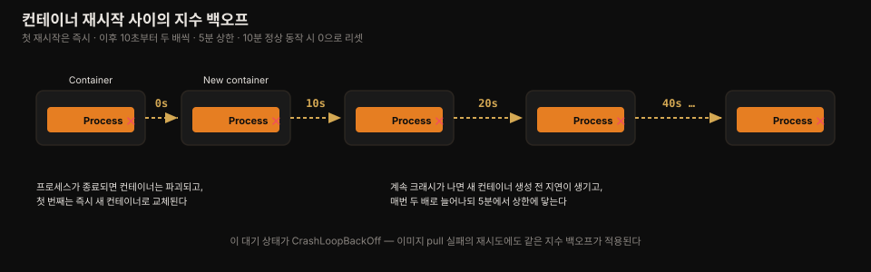
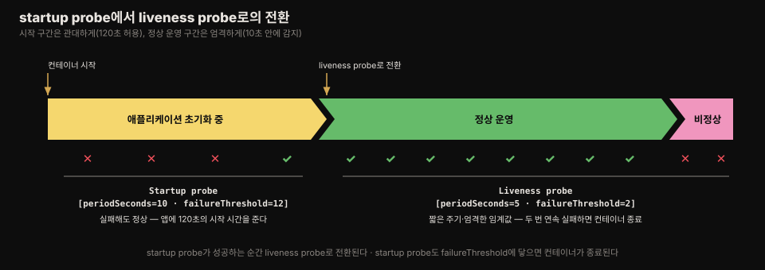

# liveness·startup probe로 컨테이너 건강 유지
---
> 프로세스가 죽으면 쿠버네티스가 알아서 재시작하지만, 프로세스가 살아 있으면서 응답하지 않는 상태는 밖에서 찔러 봐야만 알 수 있습니다. 
>
> **이 편에서는 자동 재시작과 지수 백오프의 동작, liveness probe 세 종류, 느리게 시작하는 앱을 위한 startup probe, 그리고 probe 핸들러를 잘못 만들면 생기는 사고를 정리합니다.**


## 진입 — 이 문서를 읽고 나면 무엇을 할 수 있는가

> 이 문서를 읽고 나면 restartPolicy 세 종류와 지수 백오프의 정확한 수치를 말하고, httpGet·tcpSocket·exec probe를 설정 필드 다섯 개와 함께 작성하며, startup probe가 왜 필요한지와 liveness 핸들러가 절대 하면 안 되는 일(외부 의존성 체크)을 설명할 수 있습니다.

이 개념은 "감시 대상이 스스로 죽으면 다시 띄우고, 살아 있어도 주기적으로 안부를 물어 이상하면 갈아 끼운다"는 익숙한 헬스체크 발상입니다. 다만 쿠버네티스는 그 안부 묻기(probe)의 방식·주기·실패 판정 기준을 컨테이너 단위로 선언하게 하고, 재시작 자체도 "같은 컨테이너 재가동"이 아니라 "새 컨테이너 생성"이라는 점이 다릅니다.


## 1. 컨테이너 자동 재시작 — 재시작은 사실 재생성이다

> Kubelet은 Pod 오브젝트가 존재하는 한 컨테이너를 계속 살려 두며, **메인 프로세스가 죽으면 컨테이너를 버리고 새로 만듭니다** — 파일시스템에 쓴 데이터는 사라집니다.

Pod가 노드에 스케줄링되면 그 노드의 Kubelet이 컨테이너를 시작하고, Pod 오브젝트가 존재하는 한 계속 돌게 유지합니다. 컨테이너의 메인 프로세스가 어떤 이유로든 종료되면 Kubelet이 컨테이너를 재시작합니다. 애플리케이션의 버그로 크래시가 나도 쿠버네티스가 자동으로 다시 띄우므로, 애플리케이션에 특별한 것을 넣지 않아도 쿠버네티스에서 돌리는 것만으로 자기 치유 능력이 생깁니다.

5장의 kiada-ssl Pod에서 Envoy의 관리 인터페이스로 프로세스를 종료시켜 보면 이 동작을 관찰할 수 있습니다.

```bash
curl -X POST http://localhost:9901/quitquitquit
# OK

kubectl get po -w
# NAME        READY   STATUS     RESTARTS   AGE
# kiada-ssl   2/2     Running    0          1s
# kiada-ssl   1/2     NotReady   0          9m33s     ← envoy 종료
# kiada-ssl   2/2     Running    1          9m34s     ← 재시작 완료, RESTARTS=1
```

Pod의 컨테이너 하나가 실패해도 나머지 컨테이너는 계속 돕니다. 이때 이벤트를 보면 `Created container envoy`가 다시 찍히는데, 이것이 중요한 사실을 드러냅니다. 쿠버네티스는 컨테이너를 절대 "재시작"하지 않습니다 — 기존 컨테이너를 버리고 **새 컨테이너를 만듭니다**. 관례상 이를 재시작이라 부를 뿐입니다.

> ⚠️ 프로세스가 컨테이너 파일시스템에 쓴 데이터는 컨테이너가 재생성될 때 사라집니다. 데이터를 보존하려면 Pod에 스토리지 볼륨을 추가해야 합니다(다음 장).Pod에 init 컨테이너가 정의돼 있어도, 일반 컨테이너가 재시작될 때 init 컨테이너는 다시 실행되지 않습니다.


## 2. restartPolicy — 언제 재시작할 것인가

> 기본값은 종료 코드와 무관하게 항상 재시작하는 Always이며, 이 정책은 컨테이너별이 아니라 Pod 수준에서 한 번만 정합니다.

기본적으로 쿠버네티스는 컨테이너 안 프로세스가 종료 코드 0(성공)으로 끝나든 0이 아닌 코드(실패)로 끝나든 상관없이 컨테이너를 재시작합니다. 이 동작은 Pod spec의 `restartPolicy` 필드로 바꿀 수 있습니다.

| restartPolicy | 동작 |
|---------------|------|
| Always | 종료 코드와 무관하게 항상 재시작합니다. 기본값입니다 |
| OnFailure | 프로세스가 0이 아닌 종료 코드로 끝날 때만 재시작합니다 |
| Never | 실패해도 절대 재시작하지 않습니다 |

> 의외로 재시작 정책은 Pod 수준에서 설정되며 모든 컨테이너에 일괄 적용됩니다. 컨테이너별로 따로 설정할 수 없습니다.


## 3. 지수 백오프 — 재시작 사이의 대기 시간

> 첫 종료는 즉시 재시작되지만 그다음부터 10초에서 시작해 매번 두 배로 늘어나며 5분에서 멈춥니다 — CrashLoopBackOff가 바로 이 대기 상태입니다.

Envoy의 `/quitquitquit`을 여러 번 호출해 보면 매번 컨테이너 재시작이 더 오래 걸리는 것을 볼 수 있습니다. 

첫 종료 때는 즉시 재시작되지만, 다음번에는 쿠버네티스가 10초를 기다린 뒤 재시작합니다. 이 지연은 이후 종료마다 20초·40초·80초·160초로 두 배씩 늘어나고, 그 뒤로는 5분으로 유지됩니다. 시도 사이에 두 배씩 늘어나는 이 지연을 **지수 백오프(exponential back-off)** 라 부릅니다.



최악의 경우 컨테이너가 최대 5분 동안 시작하지 못할 수 있습니다. 지연은 컨테이너가 10분 동안 정상적으로 돌면 **0으로 리셋**되어, 그 뒤에 재시작이 필요해지면 즉시 재시작됩니다.

대기 중인 컨테이너의 상태를 매니페스트에서 확인하면 다음과 같습니다.

```bash
kubectl get po kiada-ssl -o json | jq .status.containerStatuses
# "state": {
#   "waiting": {
#     "message": "back-off 40s restarting failed container=envoy ...",
#     "reason": "CrashLoopBackOff"
```

컨테이너가 재시작을 기다리는 동안 state는 `Waiting`이고 reason은 `CrashLoopBackOff`입니다. `message` 필드가 얼마나 기다려야 재시작되는지 알려줍니다.

> Envoy에 종료를 지시하면 종료 코드 0으로 끝나므로 크래시가 아닙니다. 그런데도 상태는 CrashLoopBackOff로 표시됩니다 — 이 이름은 오해를 부를 수 있습니다.

### 실제 확인 — 백오프는 처음부터 안 벌어지고, 크래시가 쌓인 뒤에 벌어진다

liveness가 항상 실패하는 Pod(`livenessProbe.exec: cat /tmp/never-exists`, `failureThreshold: 1`)를 띄워 `kubectl get pod -w`로 재시작을 지켜보면, 교과서의 `10초 → 20초 → 40초`가 곧바로 보이지 않습니다. 실측 재시작 시각(AGE에서 `X ago`를 빼 계산)은 이렇습니다.

```bash
kubectl get pod liveness-fail -w
# RESTARTS  AGE      X ago    → 실제 재시작 시각   직전과 간격
#   1       39s      3s          36s
#   2       74s      2s          72s              36s
#   3       110s     2s          108s             36s
#   4       2m26s    2s          144s             36s   ← 여기까지 간격 36초 고정
#   5       4m1s     61s         180s                   ← X ago가 갑자기 61초로 커짐
#   7       7m56s    2m47s       309s                   ← X ago가 2분 47초까지 커짐
```

- 앞의 1~4번은 간격이 정확히 **36초로 일정**합니다. 이건 백오프가 아니라 **컨테이너 한 사이클의 자연 수명**입니다. `initialDelaySeconds 3초 + 첫 실패까지 몇 초 + 종료·재생성 오버헤드`가 합쳐져 매번 36초가 걸리고, 컨테이너가 그만큼 "살아 있다가" 죽으므로 kubelet은 백오프를 거의 붙이지 않습니다.

지수 백오프가 실제로 드러나는 지점은 `X ago` 값이 커지는 순간입니다. 처음엔 `2~3초 ago`(즉시 재시작)였다가, 크래시가 누적되자 `61초 ago`, `2분 47초 ago`로 벌어졌습니다. 

- 이 벌어진 시간이 바로 재시작 사이의 대기이며, `kubectl get`의 STATUS 칸에 `CrashLoopBackOff`로, `state`의 `message`에 `back-off 40s restarting...`으로 나타납니다. 
- 즉 **교과서 수치(10s→20s→40s)는 크래시 카운트가 쌓인 뒤에야 눈에 보입니다** — probe 주기가 짧고 컨테이너가 매번 수십 초를 살아버리면, 초기 몇 번은 백오프가 리셋되어 일정 간격처럼 보입니다.

이 실습에서 `lastState.terminated`의 `exitCode`는 `137`이었습니다. `137 = 128 + 9`, 즉 SIGKILL입니다([06-01](./06-01.Pod%20%EC%83%81%ED%83%9C%20%E2%80%94%20phase%C2%B7conditions%C2%B7%EC%BB%A8%ED%85%8C%EC%9D%B4%EB%84%88%20%EC%83%81%ED%83%9C.md#spring-%EC%95%B1-%EC%9A%B4%EC%98%81-%EA%B4%80%EC%A0%90%EC%97%90%EC%84%9C)의 `exitCode = 128 + 시그널번호` 공식). liveness가 실패하자 kubelet이 컨테이너를 SIGKILL로 강제 종료했다는 뜻입니다.

> 같은 "liveness 실패 → 종료"인데도 §6의 Envoy 예시는 `exitCode 0`(Completed)이고 이 실습은 `exitCode 137`입니다. 차이는 **앱이 SIGTERM에 반응하느냐**입니다. kubelet은 컨테이너를 종료할 때 먼저 SIGTERM을 보내고 유예 시간(기본 30초)을 줍니다. Envoy는 SIGTERM을 받아 스스로 곱게 종료(`exit 0`)하지만, 이 실습의 `sleep 100000`은 SIGTERM을 무시하므로 유예가 지나 SIGKILL(`exit 137`)로 강제 종료됩니다. 즉 종료 코드가 "곱게 끝났나(`0`·`143`) vs 강제로 죽었나(`137`)"를 그대로 드러냅니다.


## 4. liveness probe — 살아 있지만 응답하지 않는 상태 잡아내기

> 프로세스는 살아 있는데 응답하지 않는 경우(무한 루프·데드락)를 잡으려면 밖에서 상태를 확인해야 하며, 그 장치가 liveness probe입니다.

프로세스가 종료되면 쿠버네티스가 재시작해 주지만, 애플리케이션은 종료되지 않은 채 응답 불능이 될 수도 있습니다. 예를 들어 메모리 누수가 있는 Java 애플리케이션은 `OutOfMemoryError`를 뱉기 시작하지만 JVM 프로세스는 계속 돕니다. 애플리케이션이 스스로 오류를 잡아 종료할 수도 있지만, 무한 루프나 데드락에 빠져 스스로 감지할 수 없다면 어떻게 할까요? 이런 경우에도 재시작되게 하려면 애플리케이션의 상태를 밖에서 확인해야 합니다.

**liveness probe**를 정의하면 쿠버네티스가 애플리케이션이 살아 있는지 확인합니다. Pod의 각 컨테이너마다 지정할 수 있고, 쿠버네티스가 주기적으로 probe를 실행합니다. 애플리케이션이 응답하지 않거나, 오류가 나거나, 응답이 부정적이면 컨테이너는 비정상으로 간주돼 종료되고, restartPolicy가 허용하면 재시작됩니다.

> liveness probe는 Pod의 일반 컨테이너에만 쓸 수 있습니다. init 컨테이너에는 정의할 수 없습니다.

쿠버네티스는 세 가지 메커니즘으로 컨테이너를 찔러 봅니다.

1. **HTTP GET probe** — 컨테이너 IP의 지정한 포트·경로로 GET 요청을 보냅니다. 응답 코드가 오류가 아니면(2xx·3xx) 성공, 오류 코드를 반환하거나 제때 응답하지 않으면 실패입니다.
2. **TCP Socket probe** — 지정한 포트로 TCP 연결을 시도합니다. 연결이 수립되면 성공, 제때 수립되지 않으면 실패입니다.
3. **Exec probe** — 컨테이너 안에서 명령을 실행하고 종료 코드를 확인합니다. 0이면 성공, 0이 아니거나 제때 끝나지 않으면 실패입니다.

> liveness probe 외에 startup probe(§6)와 readiness probe(11장)도 있습니다.

### liveness vs readiness — 실패했을 때 무슨 일이 일어나는가

세 종류 probe 중 liveness와 readiness는 자주 헷갈리지만, **실패했을 때의 결과가 정반대**입니다. 이 차이만 짚고 readiness의 상세 동작은 Service를 다루는 11장에 맡깁니다.

| | liveness probe | readiness probe |
|---|---------------|-----------------|
| 실패하면 | 컨테이너를 **재시작**한다 | 컨테이너는 그대로 두고 **트래픽만 끊는다** |
| 무엇을 묻나 | "살아 있나? 죽었으면 다시 태어나라" | "지금 요청을 받을 준비가 됐나? 아니면 잠깐 빠져 있어라" |
| 관측되는 신호 | `RESTARTS` 증가, `CrashLoopBackOff` | `READY` 열이 `0/1`(재시작 없음), Service의 엔드포인트에서 제외 |

- liveness는 앞 실습에서 봤듯 실패하면 컨테이너를 죽이고 재시작합니다. readiness는 다릅니다 — 실패해도 컨테이너를 죽이지 않고, 그저 이 Pod를 Service의 로드밸런싱 대상에서 빼서 트래픽을 안 보냅니다(06-01에서 `READY 1/2`, `Ready=False`로 관찰한 그 상태). 
- 준비가 되면 다시 대상에 넣습니다. **"죽었으니 다시 태어나라"(liveness)와 "잠깐 빠져 있어라"(readiness)** 로 기억하면 됩니다. readiness가 Service·EndpointSlice와 어떻게 맞물리는지는 11장이 다룹니다.


## 5. HTTP GET liveness probe 작성하기

> 최소 구성은 path와 port 두 줄이면 되고, 세부 튜닝은 initialDelaySeconds·periodSeconds·timeoutSeconds·failureThreshold 네 필드로 합니다.

kiada-ssl Pod의 두 컨테이너 모두 HTTP를 이해하므로 HTTP GET probe가 적합합니다. Node.js 애플리케이션은 명시적 헬스체크 엔드포인트가 없지만 Envoy는 있습니다 — 실무에서는 두 경우를 모두 만나게 됩니다.

```yaml
apiVersion: v1
kind: Pod
metadata:
  name: kiada-liveness
spec:
  containers:
  - name: kiada
    image: luksa/kiada:0.1
    ports:
    - name: http
      containerPort: 8080
    livenessProbe:            # 최소 구성 — 기본값 사용
      httpGet:
        path: /
        port: 8080
  - name: envoy
    image: luksa/kiada-ssl-proxy:0.1
    ports:
    - name: https
      containerPort: 8443
    - name: admin
      containerPort: 9901
    livenessProbe:
      httpGet:
        path: /ready          # Envoy 관리 인터페이스의 헬스 엔드포인트
        port: admin           # 포트는 번호 대신 이름으로도 지정 가능
      initialDelaySeconds: 10
      periodSeconds: 5
      timeoutSeconds: 2
      failureThreshold: 3
```

- kiada 컨테이너의 probe는 HTTP 기반 애플리케이션용 probe의 가장 단순한 형태입니다. 포트 8080의 `/` 경로로 GET 요청을 보내 컨테이너가 여전히 요청을 처리할 수 있는지 확인하고, 응답이 200~399면 건강한 것으로 봅니다. 
- 다른 필드를 지정하지 않았으므로 기본 설정이 적용됩니다 — 첫 요청은 컨테이너 시작 10초 후에 보내지고 5초마다 반복되며, 2초 안에 응답이 없으면 그 시도는 실패로, 세 번 연속 실패하면 컨테이너가 비정상으로 간주돼 종료됩니다.

envoy 컨테이너의 probe에 붙은 네 필드의 의미는 다음과 같습니다.

| 필드 | 의미 |
|------|------|
| initialDelaySeconds | 컨테이너 시작 후 첫 probe 실행까지 지연할 시간 |
| periodSeconds | 연속한 두 probe 실행 사이의 간격 |
| timeoutSeconds | 응답을 얼마나 기다린 뒤 그 시도를 실패로 볼지 |
| failureThreshold | 몇 번 실패해야 컨테이너를 비정상으로 판정할지 |


## 6. probe 실패를 관찰하기 — 이벤트·exit code·이전 로그

> probe 성공은 어디에도 표시되지 않지만, 실패는 Warning 이벤트로 남고 failureThreshold에 닿으면 Killing 이벤트와 함께 컨테이너가 교체됩니다.

probe가 성공하는 동안은 Pod status에도 이벤트에도 아무 표시가 없습니다. 유일한 흔적은 컨테이너 로그입니다 — kiada 컨테이너의 Node.js 앱은 요청마다 로그를 남기므로 probe 요청도 보입니다. Envoy의 관리 인터페이스는 HTTP 요청을 표준 출력이 아니라 컨테이너 안 `/tmp/envoy.admin.log` 파일에 남기므로 `kubectl exec ... -- tail -f`로 봅니다.

Envoy의 헬스체크를 강제로 실패시키면 실제 동작을 볼 수 있습니다.

```bash
curl -X POST localhost:9901/healthcheck/fail

kubectl get events -w
# Warning  Unhealthy  Liveness probe failed: HTTP probe failed with code 503
# Warning  Unhealthy  Liveness probe failed: HTTP probe failed with code 503
# Warning  Unhealthy  Liveness probe failed: HTTP probe failed with code 503
# Normal   Killing    Container envoy failed liveness probe, will be restarted
# Normal   Pulled     Container image already present on machine
# Normal   Created    Created container envoy
# Normal   Started    Started container envoy
```

failureThreshold가 3이므로 한 번 실패로는 컨테이너가 계속 돌고(`healthcheck/ok`로 빨리 되돌리면 재시작을 피할 수 있습니다), 세 번 연속 실패하면 컨테이너가 중지·재시작됩니다.

재시작된 컨테이너가 곱게 종료됐는지 강제로 죽었는지는 `kubectl describe`의 `Last State`로 확인합니다.

```bash
kubectl describe po kiada-liveness
#   envoy:
#     State:          Running          ← 새 컨테이너
#     Last State:     Terminated       ← 이전 컨테이너의 마지막 상태
#       Reason:       Completed
#       Exit Code:    0                ← 스스로 곱게 종료함
```

종료 코드 0은 프로세스가 스스로 정상 종료했다는 뜻입니다. 강제로 죽었다면 137이었을 것입니다.

> 종료 코드 128+n은 외부 시그널 n으로 종료됐음을 뜻합니다. **137 = 128+9(KILL)** — 컨테이너가 강제로 죽을 때마다 보게 되는 코드입니다. **143 = 128+15(SIGTERM)** — 보통 셸이 곱게 종료될 때 보입니다.

이전 컨테이너의 로그는 `--previous`(`-p`) 플래그로 봅니다. Envoy 로그를 확인하면 SIGTERM을 받아 스스로 종료했음을 볼 수 있습니다 — 스스로 끝내지 않았다면 쿠버네티스가 강제로 죽였을 것입니다.

```bash
kubectl logs kiada-liveness -c envoy -p
# ...[warning][main] caught SIGTERM
# ...[info][main] shutting down server instance
# ...[info][main] exiting
```


## 7. tcpSocket·exec probe

> HTTP 헬스 엔드포인트가 없는 애플리케이션에는 TCP 연결 수립 여부를 보는 tcpSocket probe나 컨테이너 안 명령의 종료 코드를 보는 exec probe를 씁니다.

HTTP가 아닌 TCP 연결을 받는 애플리케이션에는 tcpSocket probe를 설정합니다.

```yaml
    livenessProbe:
      tcpSocket:
        port: 1234        # 이 TCP 포트로 연결 시도
      periodSeconds: 2    # 2초마다 실행
      failureThreshold: 1 # 한 번 실패로 재시작
```

TCP 연결조차 받지 않는 애플리케이션이 상태 확인용 명령을 제공한다면 exec probe를 씁니다. 명령은 컨테이너 안에서 실행되므로 컨테이너 파일시스템에 존재해야 합니다.

```yaml
    livenessProbe:
      exec:
        command:
        - /usr/bin/healthcheck   # 컨테이너 안에서 실행할 명령
      periodSeconds: 2
      timeoutSeconds: 1          # 1초 안에 반환해야 함
      failureThreshold: 1
```

명령이 종료 코드 0을 반환하면 건강한 것이고, 0이 아니거나 timeoutSeconds 안에 끝나지 않으면 컨테이너가 종료됩니다.


## 8. startup probe — 느리게 시작하는 앱을 위한 별도 관문

> 기본 liveness 설정은 앱에 20~30초의 시작 시간만 주므로, 시작이 느린 앱은 startup probe로 시작 구간만 관대하게 지켜보고 그 뒤에 엄격한 liveness로 전환합니다.

**기본 liveness probe 설정은 애플리케이션에 20~30초 안에 probe 요청에 응답하기 시작할 것을 요구합니다.** 더 오래 걸리면 재시작되고, 두 번째 시작도 그만큼 걸리면 또 재시작됩니다 — liveness probe가 성공하는 상태에 영영 도달하지 못하고 끝없는 재시작 루프에 갇힙니다.

`initialDelaySeconds`·`periodSeconds`·`failureThreshold`를 키워 긴 시작 시간을 감안할 수도 있지만, 정상 운영에 악영향이 있습니다. `periodSeconds × failureThreshold`가 클수록 앱이 비정상이 됐을 때 재시작까지 오래 걸리기 때문입니다. 이 시작 구간과 정상 운영 구간의 요구 차이를 메우는 것이 **startup probe**입니다.

컨테이너에 startup probe가 정의돼 있으면 시작 시점에는 startup probe만 실행됩니다. startup probe가 성공하면 쿠버네티스가 liveness probe로 전환하고, liveness probe는 비정상을 빠르게 감지하도록 짧게 설정합니다.

```yaml
  containers:
  - name: kiada
    image: luksa/kiada:0.1
    ports:
    - name: http
      containerPort: 8080
    startupProbe:
      httpGet:
        path: /               # 보통 liveness와 같은 엔드포인트 사용
        port: http
      periodSeconds: 10       # 10초 × 12회
      failureThreshold: 12    # = 시작에 120초 허용
    livenessProbe:
      httpGet:
        path: /
        port: http
      periodSeconds: 5        # 시작 후에는 5초마다 확인,
      failureThreshold: 2     # 두 번 실패하면 재시작
```



- liveness probe와 달리 startup probe는 **실패하는 것이 지극히 정상**입니다. 실패는 앱이 아직 완전히 시작되지 않았다는 뜻일 뿐입니다. 
- 다만 startup probe도 failureThreshold에 닿을 만큼 실패하면 liveness probe가 실패한 것처럼 컨테이너가 종료됩니다. startup probe도 httpGet 대신 exec나 tcpSocket으로 설정할 수 있습니다.


## 9. 좋은 liveness 핸들러 만들기

> 모든 Pod에 liveness probe를 정의하되, 핸들러는 내부 컴포넌트만 확인하고(외부 의존성 금지), 가볍게 유지하고, 재시도 루프를 넣지 않아야 합니다.

liveness probe는 모든 Pod에 정의해야 합니다. 없으면 쿠버네티스는 프로세스 종료 말고는 앱이 살아 있는지 알 방법이 없습니다. 다만 핸들러를 잘못 구현하면 오히려 사고가 됩니다 — 앱이 건강한데도 부정적 응답을 반환하는 probe는 불필요한 재시작을 일으킵니다.

많은 쿠버네티스 사용자가 이것을 뼈아프게 배웁니다. **앱이 비정상이 될 때 프로세스가 스스로 종료하도록 보장할 수 있다면, liveness probe를 정의하지 않는 편이 더 안전할 수도 있습니다.**

**무엇을 확인할 것인가.** kiada 컨테이너의 probe는 루트 URI에 대한 단순 HTTP 응답만 확인하지만, 이런 단순한 probe도 서버가 HTTP 요청에 응답하지 않게 됐을 때(그것이 서버의 본업이므로) 재시작을 일으키니 없는 것보다 훨씬 낫습니다. 더 나은 확인을 위해 웹 애플리케이션은 보통 `/healthz` 같은 전용 헬스체크 엔드포인트를 노출하고, 호출되면 내부 주요 컴포넌트의 상태를 점검합니다.

> `/healthz` 엔드포인트에 인증을 걸지 않아야 합니다. 인증이 걸려 있으면 probe가 항상 실패해 컨테이너가 계속 재시작됩니다.

앱은 **자기 내부 컴포넌트만 확인**하고 외부 요인에 영향받는 것은 확인하지 않아야 합니다. 예를 들어 프론트엔드 서비스의 헬스체크가 백엔드 연결 실패 때 실패를 반환하면 안 됩니다. 백엔드가 죽었을 때 프론트엔드를 재시작해도 문제는 해결되지 않고, 재시작 후에도 probe가 다시 실패해 백엔드가 고쳐질 때까지 컨테이너가 반복 재시작됩니다. 서비스가 이렇게 서로 얽혀 있으면 서비스 하나의 실패가 시스템 전체의 연쇄 실패(cascading failure)로 번질 수 있습니다.

**가볍게 유지.** probe 핸들러는 컴퓨팅 자원을 많이 쓰거나 오래 걸리면 안 됩니다. probe는 기본적으로 꽤 자주 실행되고 1초 안에 끝나야 합니다. 핸들러가 쓰는 CPU·메모리는 컨테이너의 자원 쿼터에 포함되므로, 무거운 핸들러는 애플리케이션 메인 프로세스가 쓸 CPU 시간을 깎아 먹습니다.

> Java 애플리케이션이라면 JVM을 통째로 새로 띄우는 exec probe 대신 HTTP GET probe를 쓰는 편이 낫습니다. 상당한 자원을 요구하는 명령이라면 마찬가지입니다.

**재시도 루프 금지.** 핸들러 안에 재시도 루프를 구현하지 말고, `failureThreshold`를 높여 여러 번 실패해야 비정상으로 판정되게 하십시오. 핸들러 자체 재시도는 헛수고이자 또 하나의 잠재적 실패 지점입니다.


## Spring 앱 운영 관점에서

> Spring Boot에서는 Actuator의 liveness/readiness 그룹이 이 편의 원칙을 프레임워크 수준에서 구현해 주며, "외부 의존성 체크 금지" 원칙이 기본 설정에 이미 반영돼 있습니다.

Spring Boot 2.3+의 Actuator는 이 편의 원칙을 그대로 담은 전용 엔드포인트를 제공합니다. `management.endpoint.health.probes.enabled=true`(쿠버네티스 환경에서는 자동 활성화)를 켜면 `/actuator/health/liveness`와 `/actuator/health/readiness`가 열리는데, 중요한 것은 liveness 그룹에는 기본적으로 DB·외부 서비스 인디케이터가 **포함되지 않는다**는 점입니다. 이는 §9의 "외부 요인을 liveness에서 확인하지 말라"는 원칙의 프레임워크 구현입니다 — DB가 잠깐 죽었다고 앱을 재시작해 봐야 연쇄 재시작만 일어나기 때문입니다. DB 연결 상태는 readiness 그룹에 넣어 트래픽만 차단하고, liveness는 애플리케이션 컨텍스트의 내부 상태(`LivenessState.CORRECT`)만 봅니다.

**startup probe는 JVM 앱에서 특히 실용적입니다.** Spring Boot 앱은 클래스 로딩·빈 초기화·커넥션 풀 워밍업으로 시작에 수십 초가 걸리는 일이 흔한데, 이 시간을 liveness의 `initialDelaySeconds`로 때우면 정상 운영 중 장애 감지도 그만큼 느려집니다. §8의 패턴대로 startup probe(`periodSeconds: 10` × `failureThreshold: 12`)로 시작 구간을 분리하면, 무거운 배치성 초기화가 있는 앱도 재시작 루프에 갇히지 않으면서 운영 중에는 5~10초 안에 비정상을 잡을 수 있습니다. exec probe로 `java -jar healthcheck.jar` 같은 것을 돌리는 안티패턴은 §9의 경고 그대로입니다 — probe마다 JVM을 새로 띄우면 그 비용이 컨테이너 자원 쿼터를 갉아먹습니다.

**`CrashLoopBackOff`와 exit code 137의 조합은 Spring 운영에서 가장 흔한 장애 신호입니다.** `kubectl describe`의 `Last State`에서 exit code 137 + reason OOMKilled면 메모리 한도 문제(02-01의 cgroup·힙 설정 참고)이고, exit code 1이면 애플리케이션 예외(시작 실패)이므로 `kubectl logs -p`로 이전 컨테이너의 스택트레이스를 봐야 합니다. 지수 백오프 때문에 "5분째 안 뜨는" 것처럼 보여도 실제로는 대기 중일 수 있으니, `message` 필드의 back-off 시간을 먼저 확인하는 습관이 진단 시간을 줄여 줍니다.


## 관련 문서

> 이 편은 자동 재시작·지수 백오프·liveness/startup probe를 다룹니다. 다음 편(06-03)에서 컨테이너 시작·종료 시점에 동작을 끼워 넣는 lifecycle hook과 Pod 생애주기 전체로 이어집니다.

- [06-03.lifecycle hook과 Pod 생애주기 전체](./06-03.lifecycle%20hook%EA%B3%BC%20Pod%20%EC%83%9D%EC%95%A0%EC%A3%BC%EA%B8%B0%20%EC%A0%84%EC%B2%B4.md) — probe와 함께 컨테이너 생애를 구성하는 hook·종료 시퀀스를 다루는 다음 편
- [06-01.Pod 상태 — phase·conditions·컨테이너 상태](./06-01.Pod%20%EC%83%81%ED%83%9C%20%E2%80%94%20phase%C2%B7conditions%C2%B7%EC%BB%A8%ED%85%8C%EC%9D%B4%EB%84%88%20%EC%83%81%ED%83%9C.md) — 이 편에서 probe 실패가 어떻게 상태로 드러나는지의 기반이 되는 이전 편
- [핵심 워크로드](../../kubernetes/01_workloads/01-01.%ED%95%B5%EC%8B%AC%20%EC%9B%8C%ED%81%AC%EB%A1%9C%EB%93%9C.md) — probe 3종의 개념 요약을 담은 편
- [Kubernetes 공식 문서 — Configure Liveness, Readiness and Startup Probes](https://kubernetes.io/docs/tasks/configure-pod-container/configure-liveness-readiness-startup-probes/) — probe 설정의 최신 공식 가이드
