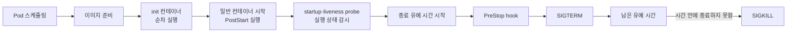
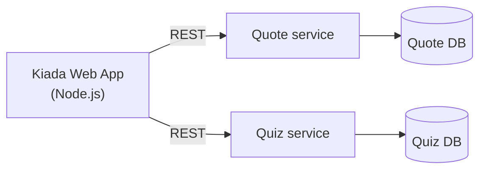
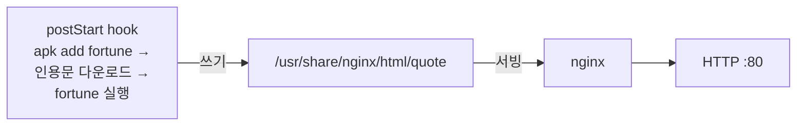
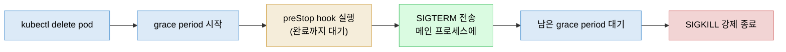

# lifecycle hook과 Pod 생애주기 전체
---
> 컨테이너가 시작될 때와 멈추기 직전에 동작을 끼워 넣는 장치가 PostStart·PreStop hook입니다. 이 편에서는 초기화 → 시작 → 실행 → 종료로 이어지는 Pod 생애주기와 SIGTERM이 앱에 닿지 않는 원인까지 연결해 설명합니다.


## 1. Pod 생애주기 전체 지도

> Pod는 이미지 준비와 init 컨테이너를 거쳐 시작되고, 실행 중 probe의 감시를 받다가 PreStop → SIGTERM → SIGKILL 순서로 종료됩니다.

이 문서를 읽고 나면 PostStart hook이 컨테이너 상태와 후속 컨테이너 생성에 미치는 영향을 설명하고, 종료 유예 시간의 시작점을 구분할 수 있습니다. Pod 삭제가 기본 유예 시간인 30초씩 걸릴 때는 SIGTERM 전달과 처리 여부를 따라가며 원인을 진단할 수 있습니다.



Lifecycle hook은 애플리케이션 서버의 시작 스크립트·종료 훅과 같은 발상입니다. 쿠버네티스에서는 애플리케이션 코드나 이미지를 고치지 않고 Pod 매니페스트에 동작을 선언합니다. 종료 유예 시간은 PreStop보다 먼저 시작되며, hook 실행과 SIGTERM 이후의 정리 시간을 모두 포함합니다.


## 2. lifecycle hook — 컨테이너 시작·종료 시점의 동작

> **PostStart hook은 컨테이너가 시작될 때**, **PreStop hook은 멈추기 직전에 실행되며**, init 컨테이너와 달리 Pod가 아니라 컨테이너 단위로 지정합니다.

init 컨테이너가 Pod 생애의 시작에 컨테이너를 돌리는 장치라면, 각 컨테이너가 시작하거나 멈출 때 추가 동작을 넣는 장치가 **lifecycle hook**입니다. PostStart hook은 컨테이너가 시작될 때, PreStop hook은 컨테이너가 멈추기 직전에 실행됩니다.

lifecycle hook은 Pod 수준에 지정하는 init 컨테이너와 달리 **컨테이너별로** 지정합니다. liveness probe처럼 컨테이너 안에서 명령을 실행(exec)하거나 HTTP GET 요청을 보낼 수 있습니다.

> lifecycle hook은 일반 컨테이너와 네이티브 사이드카에 지정할 수 있습니다. 완료 후 종료되는 일반 init 컨테이너에는 지정할 수 없으며, probe와 달리 tcpSocket handler는 지원하지 않습니다.


## 3. 초기화 단계 — 이미지 pull과 init 컨테이너

> 초기화 단계에서는 imagePullPolicy에 따라 이미지를 준비하고 init 컨테이너를 순차 실행합니다.

Pod가 워커 노드에 스케줄링되면 컨테이너 이미지를 준비합니다. `imagePullPolicy`는 레지스트리를 매번 조회할지, 로컬 이미지를 재사용할지 결정합니다.


| imagePullPolicy | 레지스트리 조회 | 로컬 캐시 조건 | 동작 |
|-----------------|-----------------|----------------|------|
| 미지정 | 태그에 따라 결정 | 태그에 따라 결정 | `:latest`면 Always, 그 외 태그면 IfNotPresent가 기본값입니다 |
| Always | 매번 조회 | digest가 같으면 재사용 | 컨테이너가 (재)시작될 때마다 레지스트리에서 이미지 digest를 확인합니다 |
| IfNotPresent | 로컬에 없을 때만 조회 | 이미지가 있으면 재사용 | 노드에 이미지가 없을 때만 pull합니다 |
| Never | 조회하지 않음 | 로컬 이미지 필수 | 노드에 이미지가 없으면 컨테이너를 시작하지 못합니다 |

> ⚠️ imagePullPolicy가 Always인데 레지스트리가 오프라인이면, 같은 이미지가 로컬에 있어도 컨테이너가 돌지 못합니다. 레지스트리 장애가 애플리케이션의 (재)시작을 막을 수 있다는 뜻입니다.

일반 init 컨테이너는 정의된 순서대로 완료되어야 다음 단계로 넘어갑니다. 실패 시 재시작 여부는 Pod 수준의 `restartPolicy`가 결정합니다. 컨테이너 수준의 `restartPolicy: Always`는 일반 init 컨테이너가 아니라 네이티브 사이드카를 뜻합니다.

재시작 규칙과 멱등성, 네이티브 사이드카의 상세 동작은 [05-03](./05-03.%EB%A9%80%ED%8B%B0%20%EC%BB%A8%ED%85%8C%EC%9D%B4%EB%84%88%C2%B7init%C2%B7%EB%84%A4%EC%9D%B4%ED%8B%B0%EB%B8%8C%20%EC%82%AC%EC%9D%B4%EB%93%9C%EC%B9%B4%EC%99%80%20%EC%82%AD%EC%A0%9C.md)에 위임합니다.

`imagePullPolicy`는 CI/CD에서도 중요한 선택입니다. `:latest` 태그는 기본값이 Always이므로 레지스트리 장애가 재시작 실패로 이어질 수 있습니다. 반대로 고정 태그를 덮어쓰면서 IfNotPresent를 사용하면 노드가 캐시된 이전 이미지를 계속 실행할 수 있습니다. 커밋 해시 태그와 IfNotPresent를 함께 사용하면 두 문제를 피할 수 있습니다.


## 4. 시작 단계 — PostStart hook으로 초기화 끼워 넣기

> PostStart hook은 컨테이너 생성 직후 메인 프로세스와 병렬로 실행되지만, kubelet은 hook이 끝날 때까지 해당 컨테이너의 시작 관리를 완료하지 않습니다.

PostStart hook은 컨테이너가 만들어진 직후 호출됩니다. `exec` 타입은 추가 프로세스를 실행하고, `httpGet` 타입은 HTTP 요청으로 초기화나 워밍업을 시도합니다.

직접 만들지 않은 애플리케이션에 초기화 동작을 붙여야 할 때 유용합니다. 애플리케이션 코드나 이미지를 바꾸지 않고 매니페스트만으로 동작을 추가할 수 있기 때문입니다.

### Quote 서비스 예제 — fortune + Nginx

Kiada 스위트는 Node.js 앱 외에 Quote·Quiz 두 서비스를 갖게 됩니다.



Quote 서비스의 첫 버전은 유닉스의 `fortune` 명령으로 만듭니다. `fortune`은 표준 출력에만 인용문을 찍고 HTTP를 서빙하지 못하므로 Nginx와 결합합니다. 새 이미지를 빌드하는 대신 `nginx:alpine` 이미지에 PostStart hook으로 설치와 파일 생성을 끼워 넣습니다.

> 이 매니페스트는 lifecycle hook 동작을 관찰하기 위한 일회성 실습입니다. 운영 환경에서는 실행 중 패키지를 설치하거나 검증되지 않은 파일을 내려받지 말고, 버전과 digest를 고정해 빌드한 이미지를 사용합니다.



```yaml
apiVersion: v1
kind: Pod
metadata:
  name: quote-poststart
spec:
  containers:
  - name: nginx
    image: nginx:alpine
    ports:
    - name: http
      containerPort: 80
    lifecycle:
      postStart:
        exec:
          command:
          - sh          # hook에는 명령을 하나만 정의할 수 있어
          - -c          # 셸을 메인 명령으로 삼고
          - |           # 여러 명령을 멀티라인 문자열로 넘긴다
            apk add --no-cache fortune && \
            curl -fSL --connect-timeout 5 --max-time 30 -O https://luksa.github.io/kiada/book-quotes.txt && \
            curl -fSL --connect-timeout 5 --max-time 30 -O https://luksa.github.io/kiada/book-quotes.txt.dat && \
            fortune book-quotes.txt > /usr/share/nginx/html/quote
```

lifecycle hook에는 명령 여러 개를 직접 나열할 수 없으므로 `sh -c "명령 문자열"` 패턴을 씁니다. YAML의 파이프(`|`) 문자로 멀티라인 문자열을 만들면 가독성을 유지할 수 있습니다. hook이 완료되면 fortune이 고른 인용문이 `/usr/share/nginx/html/quote`에 저장되고 Nginx가 이를 서빙합니다.

> `kubectl port-forward quote-poststart 80`은 OS가 0~1023 포트 바인딩을 막으면 실패합니다. `kubectl port-forward quote-poststart 1080:80`처럼 로컬 포트를 높은 번호로 바꾸면 됩니다.

### PostStart hook이 컨테이너에 미치는 영향

이름의 “post”는 메인 프로세스가 완전히 시작된 뒤라는 인상을 줍니다. 실제로는 컨테이너가 만들어진 직후 메인 프로세스와 거의 동시에 실행됩니다. 여기서 병렬 실행과 kubelet의 관리 대기를 구분해야 합니다.

hook 호출이 완료될 때까지 컨테이너는 `Waiting` 상태(reason `ContainerCreating`)에 머물고 Pod의 phase는 `Pending`입니다. 이 동안 `kubectl logs`와 `kubectl port-forward`는 동작하지 않지만, 메인 프로세스는 이미 실행 중일 수 있습니다(`kubectl exec ... -- ps x`로 확인 가능).

hook 명령을 실행할 수 없거나 0이 아닌 종료 코드를 반환하면 **컨테이너 전체가 재시작**됩니다. Pod 이벤트에는 `FailedPostStartHook` Warning과 종료 코드, 명령의 표준·오류 출력이 남습니다.

> Pod의 상태는 빠르게 바뀌므로 특정 순간의 status만 보면 전모를 놓칠 수 있습니다. 상태 조회보다 Pod 이벤트 검토가 전체 그림을 잡는 더 나은 방법입니다.

hook 명령이 **성공**하면 그 출력은 어디에도 기록되지 않습니다. 출력을 보려면 명령이 표준 출력 대신 파일에 로그를 남기게 하고 `kubectl exec my-pod -- cat logfile.txt`로 확인해야 합니다.

> hook 로그에는 토큰이나 인증 정보 같은 비밀값을 남기지 않습니다. 파일을 조회할 수 있는 `pods/exec` 권한도 필요한 운영자에게만 부여합니다.

### httpGet PostStart hook과 그 함정

exec 대신 httpGet PostStart hook으로 컨테이너 시작 시 HTTP GET 요청을 보낼 수 있습니다. 두 handler는 상호 배타적이며 요청 대상은 컨테이너 자신, Pod의 다른 컨테이너 또는 외부 호스트가 될 수 있습니다.

```yaml
    lifecycle:
      postStart:
        httpGet:
          host: myservice.example.com   # 생략하면 Pod IP가 기본값
          port: 80
          path: /container-started
```

`host`·`port`·`path` 외에 `scheme`(HTTP/HTTPS)과 `httpHeaders`도 지정할 수 있습니다. `host`를 `localhost`로 두면 안 됩니다 — 요청은 컨테이너 안이 아니라 **호스트 노드에서** 보내지기 때문입니다.

노드에서 요청한다는 특성 때문에 내부 주소나 클라우드 메타데이터 endpoint를 대상으로 사용하면 안 됩니다. 허용된 목적지만 지정하고 민감한 값을 `httpHeaders`에 넣지 않으며, 신뢰하지 않는 사용자가 lifecycle hook을 선언하지 못하도록 admission 정책과 RBAC로 제한합니다.

> ⚠️ httpGet PostStart hook은 컨테이너를 끝없는 재시작 루프에 빠뜨릴 수 있습니다.
>
> hook을 자기 컨테이너(또는 같은 Pod의 다른 컨테이너)로 향하게 하면, 메인 프로세스가 아직 요청을 받을 준비가 안 됐을 때 hook이 실패해 컨테이너가 재시작되고, 다음 실행에서도 같은 일이 반복됩니다. 자기 자신이나 같은 Pod의 컨테이너를 대상으로 삼지 마십시오.

또 하나의 함정은 서버가 404 Not Found 같은 상태 코드로 응답해도 쿠버네티스가 hook을 실패로 취급하지 **않는다**는 점입니다. URI를 잘못 적으면 hook이 과녁을 빗나간 것을 눈치채지도 못할 수 있습니다.

### 실제 확인 — 메인은 이미 도는데 Pod는 Pending에 붙들린다

앞의 `quote-poststart`를 직접 띄워 두 가지를 눈으로 확인했습니다. `kubectl apply` 직후 상태를 보면 이렇습니다.

```text
$ kubectl get pod quote-poststart
NAME              READY   STATUS    RESTARTS   AGE
quote-poststart   0/1     Pending   0          0s
```

STATUS가 `Pending`(READY 0/1)입니다 — 아직 `Running`이 아닙니다. 그런데 같은 순간 컨테이너 안을 들여다보면 메인 프로세스는 **이미 돌고 있습니다**.

```text
$ kubectl exec quote-poststart -- ps aux | grep nginx
    1 root      nginx: master process nginx -g daemon off;
   40 nginx     nginx: worker process
   41 nginx     nginx: worker process
```

nginx master와 worker가 떠 있는데도 Pod는 `Pending`입니다. hook(`apk add fortune`)이 아직 끝나지 않았기 때문입니다. STATUS 칸의 Pod phase는 `Pending`, 컨테이너 state는 `Waiting`(reason `ContainerCreating`)으로 표시됩니다. 메인 프로세스의 실행 여부와 Kubernetes가 보고하는 시작 완료 상태가 같지 않다는 점이 드러납니다.

hook이 끝나면 `Running`으로 넘어가고, hook이 저장한 인용문이 서빙됩니다.

```bash
kubectl exec quote-poststart -- cat /usr/share/nginx/html/quote
# If you use Docker Desktop, the VM running Kubernetes can't be reached ...
```

이 결과는 hook이 출력을 `/usr/share/nginx/html/quote` 파일에 저장했기 때문에 확인할 수 있습니다. 매니페스트는 실습 저장소의 `06-status/pod-quote-poststart.yaml`에 있습니다.


## 5. 실행 단계 — 병렬 실행과 kubelet의 관리 대기

> PostStart hook은 같은 컨테이너의 메인 프로세스와 병렬로 실행되지만, kubelet의 컨테이너 관리 절차는 hook이 끝날 때까지 대기합니다.

모든 init 컨테이너가 성공하면 Pod의 일반 컨테이너들이 만들어집니다. 이때 “병렬”이라는 말은 무엇과 무엇을 비교하는지에 따라 뜻이 달라집니다.

- **컨테이너 내부**: 같은 컨테이너의 메인 프로세스와 PostStart handler는 동시에 실행될 수 있습니다.
- **kubelet의 관리 절차**: kubelet은 handler가 끝날 때까지 해당 컨테이너의 시작 관리를 완료하지 않습니다.
- **일반 컨테이너 사이**: 현재 구현에서는 이 대기가 뒤에 정의된 컨테이너의 생성을 늦출 수 있지만, 이를 시작 순서 보장으로 사용하면 안 됩니다.

종료할 때는 일반 컨테이너들의 종료 절차가 함께 시작됩니다. 각 컨테이너 안에서는 PreStop 완료 후 SIGTERM을 보내지만, 한 컨테이너의 긴 PreStop이 다른 컨테이너의 PreStop 실행까지 막지는 않습니다. 네이티브 사이드카에는 별도의 종료 순서가 적용됩니다.

컨테이너별로 이미지 pull → 컨테이너 시작(PostStart hook 병렬 실행) → startup probe → liveness probe 순서가 진행됩니다. probe가 `failureThreshold`에 도달하면 컨테이너를 종료하고 restartPolicy에 따라 재시작합니다.


startup probe는 느리게 뜨는 앱이 시작될 때까지 liveness 감시를 미루는 관문입니다. 정의했다면 **성공한 뒤에야** liveness로 넘어가고, 정의하지 않았다면 곧장 liveness를 시작합니다.

`Always`·`OnFailure`면 이미지 pull부터 다시 돌고, `Never`면 `Terminated`로 남습니다. probe의 startup·liveness 구분과 threshold 동작은 [06-02](./06-02.liveness%C2%B7startup%20probe%EB%A1%9C%20%EC%BB%A8%ED%85%8C%EC%9D%B4%EB%84%88%20%EA%B1%B4%EA%B0%95%20%EC%9C%A0%EC%A7%80.md)가 SSOT입니다.

> 이미지 pull에 실패해도 Pod의 다른 컨테이너들은 시작될 수 있습니다. pull 시간이 다르면 컨테이너별 시작 시점도 달라질 수 있으므로 일반 컨테이너의 선언 순서에 의존하면 안 됩니다.
>
> 의외의 동작 하나: restartPolicy가 Never이고 PostStart hook이 실패하면, hook이 실패했는데도 Pod 상태가 `Completed`로 표시됩니다.

### 실제 확인 — 시작 시각을 비교하면

주 컨테이너 둘과 네이티브 사이드카 하나를 한 Pod에 담고 시작 시각을 기록했습니다. `kubectl logs ... --timestamps` 결과를 시각순으로 정렬해 비교합니다.

```bash
kubectl logs hooks-lifecycle --all-containers --prefix --timestamps | sort -k1
# ── 시작 ──
# 05:22:17  sidecar STARTED         ← 사이드카가 맨 먼저(주 컨테이너보다 2초 앞)
# 05:22:19  main-a STARTED
# 05:22:19  main-a POST-START hook   ← main-a 시작 0.025초 뒤(시작 '직후')
# 05:22:20  main-b STARTED           ← 1초 차이며 시작 순서를 보장하지 않음
```

네이티브 사이드카는 주 컨테이너보다 먼저 시작했습니다. 반면 `main-a`와 `main-b`의 1초 차이는 kubelet의 생성 시차일 뿐이며, 이 관찰만으로 일반 컨테이너의 병렬성이나 시작 순서를 보장할 수 없습니다.


## 6. 종료 단계 — PreStop hook에서 SIGTERM까지

> PreStop hook은 SIGTERM보다 먼저 실행되고 완료될 때까지 SIGTERM 전송을 미루지만, hook이 실패해도 컨테이너 종료는 그대로 진행됩니다.

프로세스를 종료할 때는 보통 SIGTERM을 보내 “하던 일을 마치고 내려가라”고 알립니다. 컨테이너에 PreStop hook이 설정돼 있으면 쿠버네티스가 hook을 먼저 실행하고, 완료될 때까지 SIGTERM 전송을 미룹니다. hook 실행 중 프로세스가 이미 종료되면 SIGTERM은 보내지 않습니다.

> **시그널(signal)이란** 운영체제가 실행 중인 프로세스에 보내는 짧은 알림입니다.
> **SIGTERM**(terminate)은 “정리하고 내려가라”는 부탁이라 프로세스가 열린 연결을 닫고 스스로 종료할 수 있으며, 원한다면 처리를 미룰 수도 있습니다.
> 반면 **SIGKILL**(kill)은 프로세스가 가로채거나 무시할 수 없는 강제 명령입니다.
> 쿠버네티스가 SIGTERM 뒤에 유예 시간을 두고 마지막에 SIGKILL을 보내는 이유가 이 차이에 있습니다.
>
> 프로세스가 시그널에 죽으면 종료 코드는 `128 + 시그널 번호`가 되어, SIGTERM(15)에 죽으면 `143`, SIGKILL(9)에 죽으면 `137`이 됩니다 — [06-01](./06-01.Pod%20%EC%83%81%ED%83%9C%20%E2%80%94%20phase%C2%B7conditions%C2%B7%EC%BB%A8%ED%85%8C%EC%9D%B4%EB%84%88%20%EC%83%81%ED%83%9C.md)에서 본 `OOMKilled`의 `137`이 바로 SIGKILL로 죽은 경우입니다.

> 컨테이너 종료가 시작되면 liveness를 비롯한 probe는 더 이상 호출되지 않습니다.

Quote Pod의 Nginx는 SIGTERM을 받으면 열린 연결을 즉시 끊고 종료합니다. `nginx -s quit`은 새 연결을 받지 않고 진행 중인 요청을 처리한 뒤 종료하므로, 이 명령을 PreStop hook으로 실행합니다.

```yaml
    lifecycle:
      preStop:
        exec:
          command:
          - nginx
          - -s
          - quit
```

PostStart hook과 달리 PreStop hook의 결과와 **무관하게** 컨테이너는 종료됩니다. 명령 실행 실패나 0이 아닌 종료 코드가 종료를 막지 않으며, 실패하면 `FailedPreStopHook` Warning 이벤트가 남습니다. 종료 전 정리가 중요하다면 Pod 상태만 보지 말고 이벤트와 애플리케이션 상태로 실제 실행 여부를 확인해야 합니다.

PreStop에도 httpGet을 쓸 수 있고, 세 번째 동작으로 `sleep`을 지정해 종료 전에 정해진 시간만큼 기다릴 수 있습니다.

PreStop hook은 컨테이너가 종료를 **요청받았을 때**만 호출됩니다. liveness probe 실패나 Pod 종료가 여기에 해당하며, 컨테이너 안 프로세스가 스스로 종료할 때는 호출되지 않습니다.

### 실제 확인 — PreStop은 SIGTERM보다 먼저 실행된다

`kubectl delete`를 실행했을 때 PreStop hook과 SIGTERM의 순서는 다음과 같습니다.



핵심은 **PreStop hook이 SIGTERM보다 앞**이고, hook이 끝날 때까지 SIGTERM 전송이 미뤄진다는 점입니다. busybox 컨테이너에서 메인 프로세스와 hook이 각각 실행 시각을 기록하게 한 뒤 `kubectl delete`를 실행했습니다. hook에는 `sleep 2`를 넣었습니다.

```text
[06:30:42] 메인 시작 — 대기 중
[06:31:03] === pre-stop hook 실행 (SIGTERM 아직 안 옴) ===   ← 먼저
[06:31:05] >>> SIGTERM 받음 (메인 프로세스)                   ← 2초 뒤
```

PreStop은 `06:31:03`에 실행되고 SIGTERM은 2초 뒤인 `06:31:05`에 도착했습니다. `sleep 2`가 끝날 때까지 쿠버네티스가 SIGTERM 전송을 미룬 결과입니다. 매니페스트는 실습 저장소의 `06-status/pod-prestop.yaml`에 있습니다.

### 왜 내 애플리케이션은 SIGTERM을 못 받는가

앱이 SIGTERM을 받지 못하면 PreStop hook으로 시그널을 직접 보내고 싶어집니다. 하지만 근본 원인은 시그널 전송이 아니라 컨테이너 안의 셸이 시그널을 **삼키는** 데 있을 수 있습니다. Dockerfile의 `ENTRYPOINT`·`CMD`에는 두 형식이 있습니다.

```dockerfile
ENTRYPOINT ["/myexecutable", "1st-arg"]   # exec form — 실행 파일이 곧 루트 프로세스
ENTRYPOINT /myexecutable 1st-arg          # shell form — 셸이 루트, 실행 파일은 자식
```

shell form을 쓰면 셸이 루트 프로세스가 되어 SIGTERM을 받지만 자식 프로세스에 전달하지 않습니다. 올바른 해법은 PreStop hook 추가가 아니라 **exec form 사용**입니다. 셸 스크립트로 앱을 띄운다면 시그널을 전달하거나 `exec`로 앱을 실행해야 합니다.

### hook은 Pod가 아니라 컨테이너를 대상으로 한다

PreStop hook은 컨테이너가 종료돼야 할 **때마다** 실행됩니다. Pod가 내려갈 때만 호출되는 hook이 아니므로 Pod 생애 동안 여러 번 실행될 수 있습니다. “Pod 전체가 내려갈 때 한 번” 수행해야 하는 동작을 PreStop hook에 두면 안 됩니다.


## 7. Pod 삭제 — grace period와 느린 종료 고치기

> Pod를 삭제하면 일반 컨테이너들의 종료 절차가 함께 시작되고, deletionGracePeriodSeconds 안에 멈추지 않은 프로세스는 SIGKILL로 강제 종료됩니다.

Pod 오브젝트를 삭제하면 컨테이너 종료가 시작되고 상태가 `Terminating`으로 바뀝니다. 이때 Pod의 **deletion grace period**가 적용됩니다. 값은 `metadata.deletionGracePeriodSeconds`에 기록되며, 처음에는 `spec.terminationGracePeriodSeconds`에서 가져오지만 `kubectl delete`에서 다르게 지정할 수 있습니다.


일반 컨테이너들의 종료 절차는 함께 시작됩니다. 각 컨테이너 안에서는 PreStop hook → SIGTERM → 유예 시간 만료 시 SIGKILL 순서가 독립적으로 진행되고, 모든 컨테이너가 멈추면 Pod 오브젝트가 삭제됩니다.

위 그림은 세 가지 결과를 보여줍니다. A는 PreStop hook 실행 중 프로세스가 종료되어 SIGTERM을 보내지 않은 경우이고, B는 hook이 없어 SIGTERM을 바로 보낸 경우입니다. C는 유예 시간 안에 멈추지 않아 SIGKILL로 종료된 경우입니다.

```bash
kubectl delete po kiada-ssl --grace-period 10   # 이 삭제에만 10초 유예 적용
```

실습 전에는 `kubectl config current-context`와 namespace를 확인합니다. grace period를 0으로 설정하면 PreStop hook과 정상적인 정리 절차를 건너뛸 수 있으므로, 운영 환경에서는 긴급 강제 삭제가 필요한 경우에만 사용합니다.

### kiada-ssl이 30초씩 걸려 삭제되는 이유

kiada-ssl Pod를 삭제하면 최소 30초가 걸립니다. 두 컨테이너 모두 PreStop hook이 없으므로 삭제 직후 SIGTERM을 받지만, 그중 하나가 응답하지 않아 기본 종료 유예 시간 30초를 모두 사용합니다. `terminationGracePeriodSeconds: 5`로 낮췄을 때 5초 만에 끝나는 것으로 이를 확인할 수 있습니다.

> grace period를 줄이는 것이 필요한 경우는 드뭅니다. 오히려 애플리케이션이 곱게 내려가는 데 시간이 더 필요하다면 늘리는 것이 바람직합니다.

어느 컨테이너가 범인인지는 삭제 전에 두 컨테이너의 로그를 스트리밍해 보면 드러납니다. Envoy는 시그널을 잡아 즉시 종료하지만 Node.js 애플리케이션은 반응하지 않습니다. 해법은 grace period 단축이 아니라 **앱에 SIGTERM 핸들러를 추가**하는 것입니다.

```javascript
process.on('SIGTERM', function () {
  console.log("Received SIGTERM. Server shutting down...");
  server.close(function () {
    process.exit(0);      // 열린 연결을 정리한 뒤 종료
  });
});
```

이 코드를 넣은 kiada:0.3 이미지로 배포하면 SIGTERM을 받는 즉시 종료가 시작되어 Pod 삭제가 눈에 띄게 빨라집니다.

> init 컨테이너도 SIGTERM을 처리하게 만들어야 합니다. 초기화 도중 Pod를 삭제해도 즉시 내려갈 수 있어야 합니다.

Pod에 네이티브 사이드카가 있으면 일반 컨테이너가 전부 종료된 **뒤에** 사이드카가 종료되며, 여러 사이드카는 `initContainers` 목록의 역순으로 내려갑니다.

```text
# 05:22:45  main-a PRE-STOP hook     ← SIGTERM보다 먼저
# 05:22:46  main-b got SIGTERM
# 05:22:47  main-a got SIGTERM       ← PreStop(sleep 2)이 끝난 뒤 도착
# 05:22:48  sidecar got SIGTERM      ← 주 컨테이너가 종료된 뒤 도착
```


이 순서 보장은 네이티브 사이드카에만 적용됩니다. 사이드카를 일반 `containers` 항목에 두면 주 컨테이너와 동급이 되어 시작·종료 순서를 보장받지 못합니다. 네이티브 사이드카는 프록시의 늦은 시작이나 로그 수집기의 이른 종료처럼 컨테이너 간 순서 때문에 생기는 문제를 줄입니다.


## 8. Spring 앱 운영 관점

> Spring Boot의 graceful shutdown 설정은 이 편의 SIGTERM 규약 위에 서 있으며, 30초씩 걸리는 Pod 삭제·롤링 업데이트 중 요청 유실은 대부분 이 편의 세 가지(shell form, SIGTERM 미처리, grace period 설정)로 설명됩니다.

### JVM에 SIGTERM 전달하기

Node.js에서 본 SIGTERM 문제는 Spring Boot에서도 형태만 바꿔 나타납니다. `java -jar`를 exec form으로 실행하면 JVM이 SIGTERM을 직접 받습니다. 반면 `ENTRYPOINT java -jar app.jar` 같은 shell form이나 시그널을 전달하지 않는 시작 스크립트는 셸에서 SIGTERM을 가로막을 수 있습니다.

Dockerfile에는 `ENTRYPOINT ["java", "-jar", "app.jar"]`처럼 exec form을 사용합니다. 시작 스크립트가 필요하면 마지막 명령을 `exec java -jar app.jar`로 실행해 JVM이 컨테이너의 루트 프로세스가 되게 합니다.

### 종료 시간의 예산 맞추기

SIGTERM이 JVM에 도착해도 Spring Boot가 처리 중인 요청을 마칠 시간은 별도로 확보해야 합니다. `server.shutdown=graceful`을 켜고 `spring.lifecycle.timeout-per-shutdown-phase=20s`처럼 애플리케이션의 종료 제한 시간을 설정합니다.

이 시간은 Pod의 `terminationGracePeriodSeconds`보다 짧아야 합니다. 기본 유예 시간이 30초라면 Spring이 20초 안에 정리를 끝내고, 남은 시간은 hook 실행이나 런타임 지연을 흡수하는 여유로 둡니다. 두 값을 같게 잡으면 정리를 마치는 순간 SIGKILL을 받을 수 있습니다.

### 엔드포인트 전파 시간을 확보하기

Pod 종료가 시작돼도 Service 엔드포인트에서 해당 Pod가 빠지기까지 전파 지연이 생길 수 있습니다. 애플리케이션이 SIGTERM을 받고 먼저 내려가기 시작하면 그 사이 도착한 새 요청이 실패합니다.

`preStop: { sleep: { seconds: 5 } }`는 SIGTERM 전송을 잠시 늦춰 엔드포인트 변경이 전파될 시간을 확보합니다. 다만 sleep 시간도 전체 종료 유예 시간에 포함되므로 Spring의 graceful shutdown 시간과 합쳐 `terminationGracePeriodSeconds` 안에 들어와야 합니다.

PostStart hook으로 JVM을 워밍업할 때는 애플리케이션이 이미 요청을 받을 수 있다고 가정하지 않아야 합니다. 자기 컨테이너에 보내는 `httpGet`은 서버 준비보다 먼저 실행될 수 있으므로, 시작 순서에 의존하지 않는 `exec` 작업만 두는 편이 안전합니다.


## 9. 관련 문서

> 이 편은 lifecycle hook과 Pod 생애주기 네 단계(초기화·시작·실행·종료)를 다루며 6장을 마무리합니다. init 컨테이너·네이티브 사이드카의 정의는 05-03에서, 컨테이너 상태와 probe는 06-01·06-02에서 다뤘습니다.

- [06-01.Pod 상태 — phase·conditions·컨테이너 상태](./06-01.Pod%20%EC%83%81%ED%83%9C%20%E2%80%94%20phase%C2%B7conditions%C2%B7%EC%BB%A8%ED%85%8C%EC%9D%B4%EB%84%88%20%EC%83%81%ED%83%9C.md) — hook 전후에 관찰되는 Pod phase와 컨테이너 상태를 설명한 편
- [06-02.liveness·startup probe로 컨테이너 건강 유지](./06-02.liveness%C2%B7startup%20probe%EB%A1%9C%20%EC%BB%A8%ED%85%8C%EC%9D%B4%EB%84%88%20%EA%B1%B4%EA%B0%95%20%EC%9C%A0%EC%A7%80.md) — 실행 단계에서 컨테이너 건강을 감시하는 probe를 다룬 이전 편
- [07-01.namespace로 클러스터를 가상 분할하기](./07-01.namespace%EB%A1%9C%20%ED%81%B4%EB%9F%AC%EC%8A%A4%ED%84%B0%EB%A5%BC%20%EA%B0%80%EC%83%81%20%EB%B6%84%ED%95%A0%ED%95%98%EA%B8%B0.md) — 늘어나는 Pod와 오브젝트를 namespace·label로 조직하는 다음 편
- [05-03.멀티 컨테이너·init·네이티브 사이드카와 삭제](./05-03.%EB%A9%80%ED%8B%B0%20%EC%BB%A8%ED%85%8C%EC%9D%B4%EB%84%88%C2%B7init%C2%B7%EB%84%A4%EC%9D%B4%ED%8B%B0%EB%B8%8C%20%EC%82%AC%EC%9D%B4%EB%93%9C%EC%B9%B4%EC%99%80%20%EC%82%AD%EC%A0%9C.md) — 초기화 단계에서 도는 init 컨테이너·네이티브 사이드카를 정의한 편
- [핵심 워크로드](../../kubernetes/01_workloads/01-01.%ED%95%B5%EC%8B%AC%20%EC%9B%8C%ED%81%AC%EB%A1%9C%EB%93%9C.md) — Pod 라이프사이클의 개념 요약을 담은 편
- [Kubernetes 공식 문서 — Container Lifecycle Hooks](https://kubernetes.io/docs/concepts/containers/container-lifecycle-hooks/) — PostStart·PreStop hook의 최신 공식 명세
