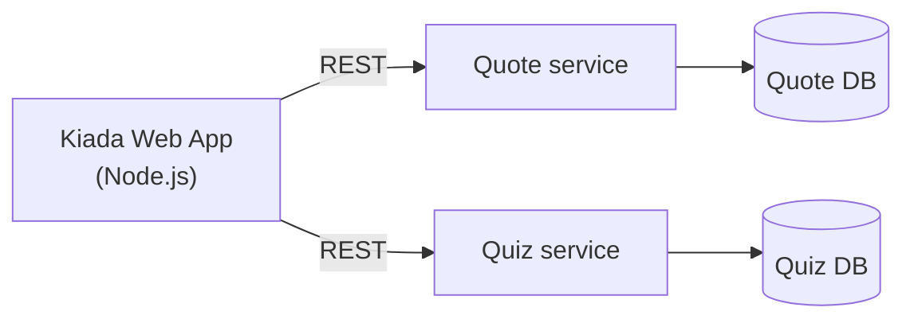
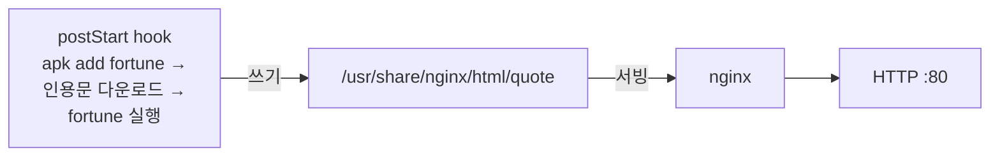
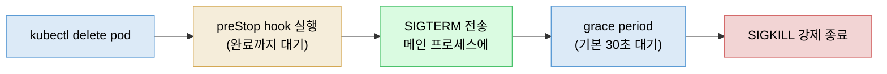
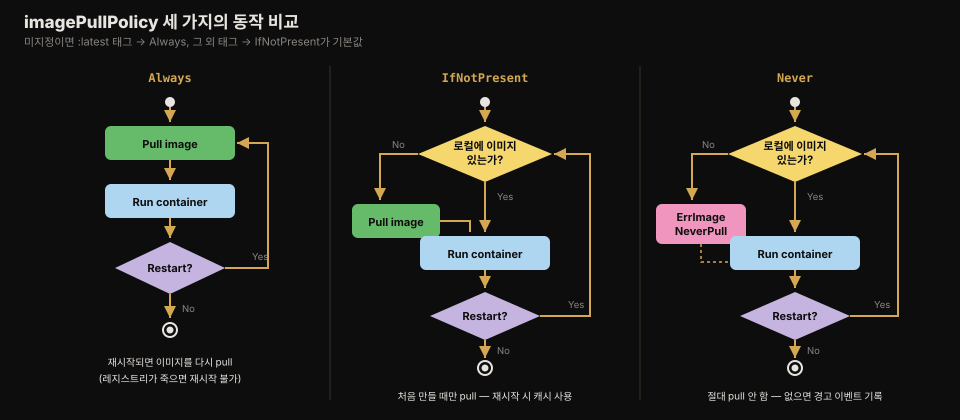
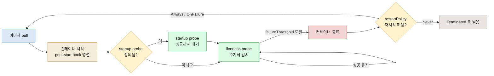
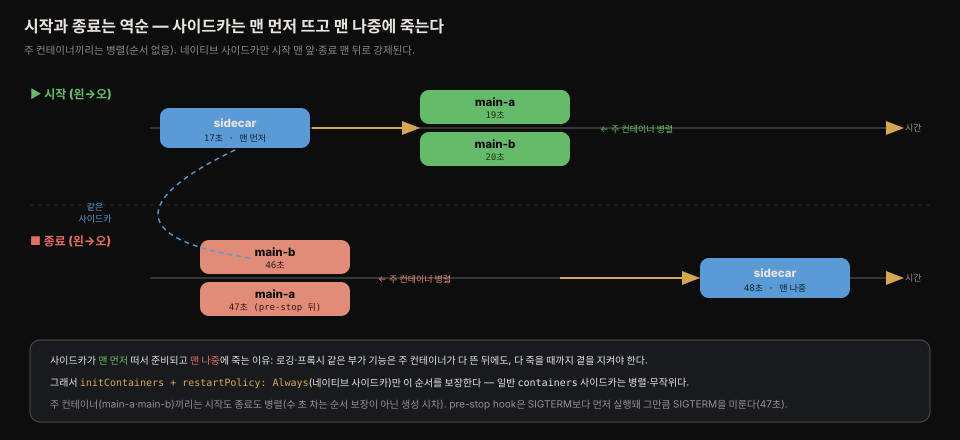
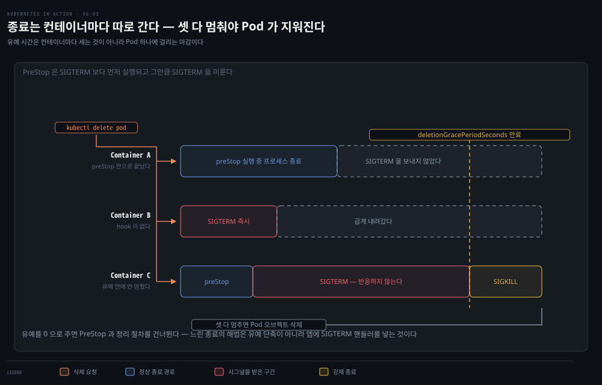

# lifecycle hook과 Pod 생애주기 전체
---
> 컨테이너가 시작될 때와 멈추기 직전에 동작을 끼워 넣는 장치가 post-start·pre-stop hook입니다. 이 편에서는 두 hook의 동작과 함정, 그리고 초기화 → 실행 → 종료로 이어지는 Pod 생애주기 전체 — imagePullPolicy, 종료 시퀀스(preStop→SIGTERM→KILL), SIGTERM이 앱에 안 닿는 고전적 원인까지 — 를 정리합니다.


## 진입 — 이 문서를 읽고 나면 무엇을 할 수 있는가

> 이 문서를 읽고 나면 post-start hook이 컨테이너 상태와 후속 컨테이너 생성에 미치는 영향을 설명하고, 종료 시퀀스의 grace period 타이머가 언제 시작되는지 말하며, Pod 삭제가 30초씩 걸리는 원인(SIGTERM 미처리)을 진단하고 고칠 수 있습니다.

이 개념은 애플리케이션 서버의 시작 스크립트·종료 훅과 같은 발상입니다. 다만 쿠버네티스는 그 훅을 애플리케이션 코드나 이미지를 건드리지 않고 Pod 매니페스트 선언만으로 끼워 넣게 하고, 종료를 "부탁(SIGTERM) → 유예 → 강제(KILL)"의 시간 규약으로 표준화한다는 점이 다릅니다.


## 1. lifecycle hook — 컨테이너 시작·종료 시점의 동작

> **post-start hook은 컨테이너가 시작될 때**, **pre-stop hook은 멈추기 직전에 실행되며**, init 컨테이너와 달리 Pod가 아니라 컨테이너 단위로 지정합니다.

init 컨테이너가 Pod 생애의 시작에 컨테이너를 돌리는 장치라면, 각 컨테이너가 시작할 때마다·멈추기 직전마다 추가 프로세스를 돌리고 싶을 때는 컨테이너에 **lifecycle hook**을 답니다. 두 종류가 있습니다.

1. **Post-start hook** — 컨테이너가 시작될 때 실행됩니다.
2. **Pre-stop hook** — 컨테이너가 멈추기 직전에 실행됩니다.

lifecycle hook은 Pod 수준에 지정하는 init 컨테이너와 달리 **컨테이너별로** 지정합니다. liveness probe처럼 컨테이너 안에서 명령을 실행(exec)하거나 HTTP GET 요청을 보낼 수 있습니다.

> lifecycle hook도 probe처럼 일반 컨테이너에만 적용할 수 있고 init 컨테이너에는 달 수 없습니다. probe와 달리 tcpSocket 핸들러는 지원하지 않습니다.


## 2. post-start hook — 이미지를 안 고치고 초기화 끼워 넣기

> post-start hook은 컨테이너 생성 직후 메인 프로세스와 병렬로 실행되며, 완료될 때까지 컨테이너는 Waiting 상태에 머물고 실패하면 컨테이너가 재시작됩니다.

post-start hook은 컨테이너가 만들어진 직후에 호출됩니다. exec 타입으로 메인 프로세스가 시작될 때 추가 프로세스를 실행하거나, httpGet 타입으로 컨테이너 안 애플리케이션에 초기화·워밍업 요청을 보낼 수 있습니다. 애플리케이션 작성자라면 같은 일을 코드 안에서 할 수 있지만, 직접 만들지 않은 기존 애플리케이션에 붙일 때는 애플리케이션이나 이미지를 바꾸지 않아도 되는 post-start hook이 간단한 대안이 됩니다.

### Quote 서비스 예제 — fortune + Nginx

Kiada 스위트는 Node.js 앱 외에 Quote·Quiz 두 서비스를 갖게 됩니다.



Quote 서비스의 첫 버전은 유닉스의 `fortune` 명령으로 만듭니다. `fortune`은 표준 출력에만 인용문을 찍고 HTTP를 서빙하지 못하므로 Nginx와 결합합니다. 새 이미지를 빌드하는 대신, `nginx:alpine` 이미지에 post-start hook으로 fortune 설치 → 인용문 파일 다운로드 → 실행 결과를 Nginx web-root에 저장하는 작업을 끼워 넣습니다.



```yaml
apiVersion: v1
kind: Pod
metadata:
  name: quote-poststart
spec:
  containers:
  - name: nginx
    image: nginx:alpine
    ports:
    - name: http
      containerPort: 80
    lifecycle:
      postStart:
        exec:
          command:
          - sh          # hook에는 명령을 하나만 정의할 수 있어
          - -c          # 셸을 메인 명령으로 삼고
          - |           # 여러 명령을 멀티라인 문자열로 넘긴다
            apk add fortune && \
            curl -O https://luksa.github.io/kiada/book-quotes.txt && \
            curl -O https://luksa.github.io/kiada/book-quotes.txt.dat && \
            fortune book-quotes.txt > /usr/share/nginx/html/quote
```

- lifecycle hook에는 명령 여러 개를 직접 나열할 수 없으므로 `sh -c "명령 문자열"` 패턴을 씁니다. YAML의 파이프(`|`) 문자로 멀티라인 문자열을 만들어 가독성을 유지합니다. 
- hook이 완료되면 fortune이 고른 인용문이 `/usr/share/nginx/html/quote` 파일에 저장돼 Nginx가 서빙할 수 있게 됩니다.

> `kubectl port-forward quote-poststart 80`은 OS가 0~1023 포트 바인딩을 막으면 실패합니다. `kubectl port-forward quote-poststart 1080:80`처럼 로컬 포트를 높은 번호로 바꾸면 됩니다.

### post-start hook이 컨테이너에 미치는 영향

hook 이름의 "post"는 오해를 부릅니다 — hook은 메인 프로세스가 완전히 시작된 **뒤**가 아니라 컨테이너가 만들어지자마자, 메인 프로세스와 거의 같은 시점에 **병렬로** 실행됩니다. 그런데도 컨테이너에 두 가지 영향을 줍니다.

1. 첫째, hook 호출이 완료될 때까지 컨테이너는 `Waiting` 상태(reason `ContainerCreating`)에 머물고 Pod의 phase는 `Pending`입니다. 
   - 이 동안 `kubectl logs`는 로그 표시를 거부하고 `kubectl port-forward`도 포트 전달을 거부합니다.
   - 실제로는 메인 프로세스가 이미 돌고 있는데도 그렇습니다(`kubectl exec ... -- ps x`로 확인 가능).

2. 둘째, hook의 명령을 실행할 수 없거나 0이 아닌 종료 코드를 반환하면 **컨테이너 전체가 재시작**됩니다. 
   - Pod 이벤트에 `FailedPostStartHook` Warning 이벤트가 남고, 종료 코드와 명령이 표준·오류 출력에 찍은 내용이 담깁니다.

> Pod의 상태는 빠르게 바뀌므로 특정 순간의 status만 보면 전모를 놓칠 수 있습니다. 상태 조회보다 Pod 이벤트 검토가 전체 그림을 잡는 더 나은 방법입니다.

hook 명령이 **성공**하면 그 출력은 어디에도 기록되지 않습니다. 출력을 보려면 명령이 표준 출력 대신 파일에 로그를 남기게 하고 `kubectl exec my-pod -- cat logfile.txt`로 확인해야 합니다.

### httpGet post-start hook과 그 함정

exec 대신 httpGet post-start hook으로 컨테이너 시작 시 HTTP GET 요청을 보내게 할 수 있습니다(둘은 상호 배타적 — 하나만 지정 가능). 요청 대상은 컨테이너 자신, Pod의 다른 컨테이너, 아예 다른 호스트일 수 있습니다.

```yaml
    lifecycle:
      postStart:
        httpGet:
          host: myservice.example.com   # 생략하면 Pod IP가 기본값
          port: 80
          path: /container-started
```

`host`·`port`·`path` 외에 `scheme`(HTTP/HTTPS)과 `httpHeaders`도 지정할 수 있습니다. `host`를 `localhost`로 두면 안 됩니다 — 요청은 컨테이너 안이 아니라 **호스트 노드에서** 보내지기 때문입니다.

> ⚠️ httpGet post-start hook은 컨테이너를 끝없는 재시작 루프에 빠뜨릴 수 있습니다. 
>
> hook을 자기 컨테이너(또는 같은 Pod의 다른 컨테이너)로 향하게 하면, 메인 프로세스가 아직 요청을 받을 준비가 안 됐을 때 hook이 실패해 컨테이너가 재시작되고, 다음 실행에서도 같은 일이 반복됩니다. 자기 자신이나 같은 Pod의 컨테이너를 대상으로 삼지 마십시오.

또 하나의 함정은 서버가 404 Not Found 같은 상태 코드로 응답해도 쿠버네티스가 hook을 실패로 취급하지 **않는다**는 점입니다. URI를 잘못 적으면 hook이 과녁을 빗나간 것을 눈치채지도 못할 수 있습니다.

### 실제 확인 — 메인은 이미 도는데 Pod는 Pending에 붙들린다

앞의 `quote-poststart`를 직접 띄워 두 가지를 눈으로 확인했습니다. `kubectl apply` 직후 상태를 보면 이렇습니다.

```text
$ kubectl get pod quote-poststart
NAME              READY   STATUS    RESTARTS   AGE
quote-poststart   0/1     Pending   0          0s
```

STATUS가 `Pending`(READY 0/1)입니다 — 아직 `Running`이 아닙니다. 그런데 같은 순간 컨테이너 안을 들여다보면 메인 프로세스는 **이미 돌고 있습니다**.

```text
$ kubectl exec quote-poststart -- ps aux | grep nginx
    1 root      nginx: master process nginx -g daemon off;
   40 nginx     nginx: worker process
   41 nginx     nginx: worker process
```

- nginx master와 worker가 버젓이 떠 있는데도 Pod는 `Pending`입니다. hook(`apk add fortune`)이 아직 안 끝났기 때문입니다
- **post-start hook은 메인과 병렬로 실행되지만, hook이 끝날 때까지 쿠버네티스는 컨테이너를 "아직 준비 안 됨"으로 취급**합니다. "post"라는 이름과 달리 메인 뒤가 아니라 메인과 거의 동시에 도는 것이 여기서 드러납니다. (STATUS 칸의 표시는 이 순간 Pod phase인 `Pending`으로 나오는데, 그 아래 컨테이너 state는 Waiting(reason `ContainerCreating`)입니다.

hook이 끝나면 `Running`으로 넘어가고, hook이 저장한 인용문이 서빙됩니다.

```bash
kubectl exec quote-poststart -- cat /usr/share/nginx/html/quote
# If you use Docker Desktop, the VM running Kubernetes can't be reached ...
```

- 이 인용문을 볼 수 있는 이유는 hook이 결과를 `> /usr/share/nginx/html/quote` **파일에 저장**했기 때문입니다. hook 명령이 성공하면 그 표준 출력은 어디에도 기록되지 않으므로, 만약 그냥 stdout으로 흘렸다면 이 문장은 사라졌을 것입니다. 
- **성공한 hook의 출력을 남기려면 파일로 빼야 한다**는 원칙이 실물로 확인됩니다. (매니페스트: 실습 저장소 `06-status/pod-quote-poststart.yaml`)


## 3. pre-stop hook — SIGTERM 전에 실행되는 마지막 기회

> pre-stop hook은 SIGTERM보다 먼저 실행되고 완료될 때까지 SIGTERM 전송을 미루지만, hook이 실패해도 컨테이너 종료는 그대로 진행됩니다.

프로세스를 종료할 때는 보통 SIGTERM 시그널을 보내 "하던 일을 마치고 내려가라"고 알립니다. 컨테이너도 마찬가지로, 멈추거나 재시작해야 할 때 메인 프로세스에 SIGTERM이 갑니다. 그 전에 컨테이너에 pre-stop hook이 설정돼 있으면 쿠버네티스가 **먼저 hook을 실행**하고, hook이 완료될 때까지 SIGTERM을 보내지 않습니다(hook 실행 자체로 프로세스가 이미 종료된 경우는 예외).

> **시그널(signal)이란** 운영체제가 실행 중인 프로세스에 보내는 짧은 알림입니다. 종료와 관련된 두 가지가 중요합니다. 
>
> - **SIGTERM**(terminate)은 "정리하고 내려가라"는 **부탁**이라, 프로세스가 이 시그널을 받아 열린 연결을 닫고 저장한 뒤 스스로 종료할 수 있고, 원한다면 무시하거나 처리를 미룰 수도 있습니다. 
> - **SIGKILL**(kill)은 "지금 즉시 죽어라"는 **강제 명령**이라, 프로세스가 가로채거나 무시할 수 없고 커널이 그 자리에서 없앱니다. 쿠버네티스의 종료가 SIGTERM을 먼저 보내고(정중히 부탁) grace period만큼 기다렸다가 그래도 안 내려가면 SIGKILL로 끝내는(강제) 2단 구조인 이유가 여기 있습니다. 
>
> 프로세스가 시그널에 죽으면 종료 코드는 `128 + 시그널 번호`가 되어, SIGTERM(15)에 죽으면 `143`, SIGKILL(9)에 죽으면 `137`이 됩니다 — [06-01](./06-01.Pod%20%EC%83%81%ED%83%9C%20%E2%80%94%20phase%C2%B7conditions%C2%B7%EC%BB%A8%ED%85%8C%EC%9D%B4%EB%84%88%20%EC%83%81%ED%83%9C.md)에서 본 `OOMKilled`의 `137`이 바로 SIGKILL로 죽은 경우입니다.

> 컨테이너 종료가 시작되면 liveness를 비롯한 probe는 더 이상 호출되지 않습니다.

Quote Pod의 Nginx는 SIGTERM을 받으면 열린 연결을 즉시 끊고 종료합니다 — 처리 중이던 클라이언트 요청이 완료되지 못하니 이상적이지 않습니다. `nginx -s quit` 명령을 쓰면 새 연결을 받지 않고 진행 중 요청을 다 처리한 뒤 종료하므로, 이를 pre-stop hook으로 겁니다.

```yaml
    lifecycle:
      preStop:
        exec:
          command:
          - nginx
          - -s
          - quit
```

- post-start hook과 달리, pre-stop hook의 결과와 **무관하게** 컨테이너는 종료됩니다 — 명령 실행 실패나 0이 아닌 종료 코드가 종료를 막지 않습니다. 
- 실패 시 `FailedPreStopHook` Warning 이벤트가 남지만, Pod 상태만 지켜보고 있으면 실패를 놓칠 수 있습니다. pre-stop hook의 성공이 시스템 동작에 중요하다면 실제로 실행되는지 꼭 확인해야 합니다 — hook이 아예 실행되지 않았는데 엔지니어들이 모르고 지나간 사례가 실제로 있습니다.

pre-stop에도 httpGet을 쓸 수 있고(설정은 post-start와 동일), 세 번째 동작으로 `sleep`을 지정해 종료 전에 지정한 초만큼 컨테이너를 재우는 것도 가능합니다.

pre-stop hook은 컨테이너가 종료를 **요청받았을 때**(liveness probe 실패, Pod 종료)만 호출되고, 컨테이너 안 프로세스가 스스로 종료할 때는 호출되지 않습니다.

### 실제 확인 — pre-stop은 SIGTERM보다 먼저 실행된다

`kubectl delete`를 쳤을 때 pre-stop hook과 SIGTERM 중 무엇이 먼저인지, 종료 과정 전체를 그림으로 보면 이렇습니다.



핵심은 **pre-stop hook이 SIGTERM보다도 앞**이고, hook이 끝날 때까지 SIGTERM 전송이 미뤄진다는 점입니다. 이를 busybox 컨테이너로 직접 찍어 확인했습니다 — 메인 프로세스가 SIGTERM을 `trap`해 받은 시각을 로그에 남기고, pre-stop hook도 실행 시각을 남기게 한 뒤 `kubectl delete`를 쳤습니다(hook 안에 `sleep 2`를 둠).

```text
[06:30:42] 메인 시작 — 대기 중
[06:31:03] === pre-stop hook 실행 (SIGTERM 아직 안 옴) ===   ← 먼저
[06:31:05] >>> SIGTERM 받음 (메인 프로세스)                   ← 2초 뒤
```

pre-stop이 `06:31:03`에 실행되고, SIGTERM은 정확히 2초 뒤인 `06:31:05`에 도착했습니다. 이 2초는 hook 안의 `sleep 2`가 만든 지연입니다 — 즉 **hook이 완전히 끝날 때까지 쿠버네티스가 SIGTERM을 붙들고 있다가, 끝난 직후에야 보냈다**는 뜻입니다. "pre-stop은 SIGTERM 전에 실행되는 마지막 기회"라는 이 편의 제목이 타임스탬프로 증명된 셈입니다. (매니페스트: 실습 저장소 `06-status/pod-prestop.yaml`)

### 왜 내 애플리케이션은 SIGTERM을 못 받는가

pre-stop hook으로 앱에 SIGTERM을 직접 보내는 개발자가 많습니다 — 앱이 SIGTERM을 영영 못 받는다는 것을 발견하고서요. 근본 원인은 시그널이 안 보내지는 것이 아니라 컨테이너 안 무언가가 **삼키는** 것입니다. Dockerfile의 `ENTRYPOINT`·`CMD`에는 두 형식이 있습니다.

```dockerfile
ENTRYPOINT ["/myexecutable", "1st-arg"]   # exec form — 실행 파일이 곧 루트 프로세스
ENTRYPOINT /myexecutable 1st-arg          # shell form — 셸이 루트, 실행 파일은 자식
```

shell form을 쓰면 셸이 루트 프로세스가 되어 SIGTERM을 받는데, 셸은 이 시그널을 자식 프로세스에 전달하지 않습니다. 올바른 해법은 pre-stop hook 추가가 아니라 **exec form 사용**입니다. 컨테이너에서 셸 스크립트로 앱을 띄우는 경우도 같은 문제가 생기므로, 스크립트에서 시그널을 가로채 전달하거나 `exec` 셸 명령으로 앱을 실행해야 합니다.

### hook은 Pod가 아니라 컨테이너를 대상으로 한다

pre-stop hook은 컨테이너가 종료돼야 할 **때마다** 실행됩니다 — Pod가 내려갈 때만이 아닙니다. Pod 생애 동안 여러 번 일어날 수 있으므로, "Pod 전체가 내려갈 때 한 번" 수행돼야 하는 동작을 pre-stop hook에 두면 안 됩니다.


## 4. Pod 생애주기 ① 초기화 단계 — 이미지 pull과 init 컨테이너

> Pod 생애는 초기화 → 실행 → 종료 세 단계로 나뉘며, 초기화 단계에서는 imagePullPolicy에 따라 이미지를 받고 init 컨테이너를 순차 실행합니다.

Pod 오브젝트를 만들면 쿠버네티스가 워커 노드에 스케줄링하고, 그 노드가 컨테이너를 돌립니다. Pod 생애는 세 단계로 나뉩니다 — init 컨테이너가 도는 **초기화 단계**, 일반 컨테이너가 도는 **실행 단계**, 컨테이너들이 종료되는 **종료 단계**입니다.

각 init 컨테이너가 시작되기 전에 그 이미지가 워커 노드로 pull됩니다. 컨테이너 정의의 `imagePullPolicy` 필드가 매번 받을지, 처음만 받을지, 아예 안 받을지 결정합니다.



| imagePullPolicy | 동작 |
|-----------------|------|
| 미지정 | 이미지 태그가 `:latest`면 Always, 그 외 태그면 IfNotPresent가 기본값이 됩니다 |
| Always | 컨테이너가 (재)시작될 때마다 pull합니다. 로컬 캐시가 레지스트리와 일치하면 다시 다운로드하지는 않지만 레지스트리 접속은 필요합니다 |
| Never | 레지스트리에서 절대 pull하지 않습니다. 이미지가 노드에 미리 있어야 합니다 |
| IfNotPresent | 노드에 없을 때만 pull합니다 — 처음 필요할 때 한 번만 받게 됩니다 |

> ⚠️ imagePullPolicy가 Always인데 레지스트리가 오프라인이면, 같은 이미지가 로컬에 있어도 컨테이너가 돌지 못합니다. 레지스트리 장애가 애플리케이션의 (재)시작을 막을 수 있다는 뜻입니다.

첫 init 컨테이너의 이미지가 받아지면 컨테이너가 시작되고, 완료되면 다음 init 컨테이너의 이미지 pull과 시작이 이어집니다 — 모든 init 컨테이너가 성공할 때까지 반복됩니다. 실패한 init 컨테이너는 restartPolicy가 `Always`나 `OnFailure`면 재시작됩니다. `Never`면 후속 init 컨테이너와 일반 컨테이너가 영영 시작되지 않고 Pod 상태가 `Init:Error`로 무한히 표시됩니다 — Pod를 지우고 다시 만들어야 합니다.

> 재시작 시 imagePullPolicy가 Always면 이미지를 다시 pull하므로, 오류를 고친 새 이미지를 같은 태그로 push하면 Pod를 재생성하지 않아도 재시작 때 반영됩니다.

init 컨테이너는 보통 한 번만 실행되고, 일반 컨테이너가 나중에 재시작돼도 다시 실행되지 않습니다. 하지만 쿠버네티스가 Pod 전체를 재시작해야 하는 예외적 상황에서는 다시 실행될 수 있으므로, **init 컨테이너의 작업은 멱등(idempotent)해야** 합니다.

> init 컨테이너의 restartPolicy가 Always면 그것은 네이티브 사이드카이며 종료가 기대되지 않습니다. 이 경우 사이드카가 완전히 시작된 뒤에 다음 init 컨테이너가 시작됩니다(05-03 참고).


## 5. Pod 생애주기 ② 실행 단계 — 시작은 순차, 종료는 병렬

> 일반 컨테이너는 이론상 독립적으로 병렬 실행되지만, 실제로는 Kubelet이 정의 순서대로 동기적으로 만들며 post-start hook이 후속 컨테이너의 생성을 막습니다.

모든 init 컨테이너가 성공하면 Pod의 일반 컨테이너들이 만들어집니다. **이론상 각 컨테이너의 생애는 서로 독립이지만, 완전히 그렇지는 않습니다. Kubelet은 컨테이너를 동시에 시작하지 않고 spec에 정의된 순서대로 동기적으로 만듭니다.** 

컨테이너에 post-start hook이 정의돼 있으면 hook 자체는 메인 프로세스와 병렬로 돌지만, hook 핸들러의 실행이 **후속 컨테이너의 생성·시작을 막습니다**(이는 구현 세부사항이라 앞으로 바뀔 수 있습니다). 반대로 **종료는 병렬**로 수행됩니다 — 오래 걸리는 pre-stop hook은 자기 컨테이너의 종료만 늦출 뿐, 다른 컨테이너의 종료를 막지 않으며 모든 컨테이너의 pre-stop hook이 동시에 호출됩니다.

컨테이너별로는 다음 시퀀스가 독립적으로 진행됩니다. 이미지 pull → 컨테이너 시작(post-start hook 병렬 실행) → startup probe(정의됐다면) → 성공 시 liveness probe로 전환 → probe가 failureThreshold에 닿으면 종료 → restartPolicy에 따라 재시작.



startup probe는 "느리게 뜨는 앱이 다 뜰 때까지 liveness 감시를 미루는" 관문이라, 정의됐으면 **성공한 뒤에야** liveness로 넘어갑니다(정의 안 됐으면 곧장 liveness). liveness가 `failureThreshold`에 닿으면 컨테이너를 종료하고, 그다음은 `restartPolicy`가 갈림길입니다 — `Always`·`OnFailure`면 이미지 pull부터 다시 돌고, `Never`면 `Terminated`로 남습니다. probe의 startup·liveness 구분과 threshold 동작은 [06-02](./06-02.liveness%C2%B7startup%20probe%EB%A1%9C%20%EC%BB%A8%ED%85%8C%EC%9D%B4%EB%84%88%20%EA%B1%B4%EA%B0%95%20%EC%9C%A0%EC%A7%80.md)가 SSOT입니다.

> 이미지 pull에 실패해도 Pod의 다른 컨테이너들은 그대로 시작됩니다. pull이 오래 걸리면 어떤 컨테이너는 다른 컨테이너들보다 한참 늦게 시작될 수 있으니, 컨테이너 간 의존이 있다면 유의해야 합니다.
> 의외의 동작 하나: restartPolicy가 Never이고 post-start hook이 실패하면, hook이 실패했는데도 Pod 상태가 `Completed`로 표시됩니다.

컨테이너를 종료해야 할 때의 시퀀스는 이렇습니다. pre-stop hook 호출 → 완료되면(또는 hook이 없으면) 메인 프로세스에 SIGTERM 전송 → 앱에 `terminationGracePeriodSeconds`(기본 30초)의 시간이 주어짐 → 타이머는 pre-stop hook 호출 시점(hook이 없으면 SIGTERM 시점)에 시작 → 유예 시간이 지나도 프로세스가 살아 있으면 KILL 시그널로 강제 종료.

> 컨테이너를 멈출 때 보낼 시그널을 바꾸려면 컨테이너 정의의 `lifecycle.stopSignal` 필드를 설정합니다.

종료된 컨테이너는 restartPolicy가 허용하면 재시작되고, 아니면 `Terminated` 상태로 남되 다른 컨테이너들은 Pod 전체가 내려가거나 자기도 실패할 때까지 계속 돕니다.

### 실제 확인 — 시작·종료 순서를 타임스탬프로 찍어 보면

주 컨테이너 둘(`main-a`·`main-b`)과 네이티브 사이드카 하나(`initContainers` + `restartPolicy: Always`)를 한 Pod에 담고, 각 컨테이너가 시작·종료할 때 시각을 로그로 남기게 한 뒤 `kubectl logs ... --timestamps`를 시각순으로 정렬하면 순서가 드러납니다. pre-stop hook과 SIGTERM 로그도 함께 찍어 hook 타이밍까지 봅니다.

```bash
kubectl logs hooks-lifecycle --all-containers --prefix --timestamps | sort -k1
# ── 시작 ──
# 05:22:17  sidecar STARTED         ← 사이드카가 맨 먼저(주 컨테이너보다 2초 앞)
# 05:22:19  main-a STARTED
# 05:22:19  main-a POST-START hook   ← main-a 시작 0.025초 뒤(시작 '직후')
# 05:22:20  main-b STARTED           ← 주 컨테이너끼리는 1초 차, 사실상 병렬
# ── 종료(kubectl delete) ──
# 05:22:45  main-a PRE-STOP hook     ← SIGTERM보다 먼저
# 05:22:46  main-b got SIGTERM
# 05:22:47  main-a got SIGTERM       ← pre-stop(sleep 2)이 끝난 뒤에야 SIGTERM 도착
# 05:22:48  sidecar got SIGTERM      ← 사이드카가 맨 나중(주 컨테이너 전부 종료된 뒤)
```

세 가지가 눈에 보입니다. 첫째, **사이드카는 시작 맨 앞·종료 맨 뒤**입니다 — 시작(17초)과 종료(48초)에서 위치가 정반대이므로 시작과 종료가 서로 **역순**입니다. `initContainers`에 있어 주 컨테이너보다 먼저 뜨고, 네이티브 사이드카라 주 컨테이너가 전부 종료된 뒤에야 종료되기 때문입니다(§6 note의 "일반 컨테이너 종료 뒤 사이드카 종료"를 실측으로 확인한 셈입니다). 둘째, **주 컨테이너끼리(`main-a`·`main-b`)는 시작도 종료도 병렬**입니다 — 1초 차는 순서 보장이 아니라 kubelet의 생성 시차일 뿐입니다. 셋째, **pre-stop hook은 SIGTERM보다 먼저** 실행되며(45초 hook → 47초 SIGTERM), hook 안의 `sleep 2`만큼 SIGTERM이 미뤄집니다 — §3의 "hook이 완료될 때까지 SIGTERM이 지연된다"는 규약이 그대로 드러납니다.



이 순서 보장은 **네이티브 사이드카에 한정**됩니다. 사이드카를 `initContainers`가 아니라 그냥 `containers`에 나란히 두면(일반 사이드카), 주 컨테이너와 동급이 되어 시작도 종료도 병렬·무작위가 됩니다 — 프록시가 주 컨테이너보다 늦게 떠서 초기 요청이 실패하거나, 로그 수집기가 먼저 죽어 마지막 로그가 유실되는 문제가 여기서 나옵니다. 네이티브 사이드카(`restartPolicy: Always`)는 바로 이 문제를 없애려고 "먼저 떠서 준비되고 맨 나중에 죽어 마무리를 돕는다"는 순서를 보장하는 장치입니다(정의는 05-03).


## 6. Pod 생애주기 ③ 종료 단계 — grace period와 느린 삭제 고치기

> Pod를 삭제하면 모든 컨테이너의 종료가 병렬로 시작되고, deletionGracePeriodSeconds 안에 스스로 멈추지 않은 프로세스는 KILL로 강제 종료됩니다.

Pod 오브젝트를 삭제하면 모든 컨테이너의 종료가 시작되고 상태가 `Terminating`으로 바뀝니다. 각 컨테이너의 종료는 liveness probe 실패 때와 같은 시퀀스를 따르되, termination grace period 대신 Pod의 **deletion grace period**가 적용됩니다. 이 값은 `metadata.deletionGracePeriodSeconds` 필드에 담기며, 삭제 시점에 `spec.terminationGracePeriodSeconds`에서 초기화되지만 `kubectl delete`에서 다른 값을 줄 수 있습니다.



Pod의 컨테이너들은 **병렬로** 종료됩니다. 컨테이너마다 pre-stop hook 호출 → SIGTERM 전송 → grace period 만료 시 KILL 순서가 독립적으로 진행되고, 모든 컨테이너가 멈추면 Pod 오브젝트가 삭제됩니다. 위 그림의 세 컨테이너가 세 가지 경우를 보여줍니다 — pre-stop hook만으로 프로세스가 종료돼 SIGTERM이 아예 전송되지 않는 경우(A), hook이 없어 SIGTERM이 즉시 가는 경우(B), 유예 시간 안에 멈추지 않아 KILL당하는 경우(C)입니다.

```bash
kubectl delete po kiada-ssl --grace-period 10   # 이 삭제에만 10초 유예 적용
```

> grace period를 0으로 주면 pre-stop hook이 실행되지 않습니다.

### kiada-ssl이 30초씩 걸려 삭제되는 이유

kiada-ssl Pod를 삭제하면 최소 30초가 걸립니다. 두 컨테이너 모두 pre-stop hook이 없으므로 삭제 즉시 SIGTERM을 받았을 텐데, 30초는 기본 termination grace period와 일치합니다 — 즉 컨테이너 중 하나가 SIGTERM을 받고도 멈추지 않아 유예 만료 후 강제 종료된 것입니다. `terminationGracePeriodSeconds: 5`로 낮추면 5초 만에 종료되는 것으로 이를 확인할 수 있습니다.

> grace period를 줄이는 것이 필요한 경우는 드뭅니다. 오히려 애플리케이션이 곱게 내려가는 데 시간이 더 필요하다면 늘리는 것이 바람직합니다.

어느 컨테이너가 범인인지는 삭제 전에 두 컨테이너의 로그를 스트리밍해 보면 드러납니다. Envoy는 시그널을 잡아 즉시 종료하지만 Node.js 애플리케이션은 반응하지 않습니다. 해법은 grace period 단축이 아니라 **앱에 SIGTERM 핸들러를 추가**하는 것입니다.

```javascript
process.on('SIGTERM', function () {
  console.log("Received SIGTERM. Server shutting down...");
  server.close(function () {
    process.exit(0);      // 열린 연결을 정리한 뒤 종료
  });
});
```

이 코드를 넣은 kiada:0.3 이미지로 배포하면 SIGTERM을 받는 즉시 종료가 시작되어 Pod 삭제가 눈에 띄게 빨라집니다.

> init 컨테이너도 SIGTERM을 처리하게 만들어야 합니다 — 초기화 도중 Pod 오브젝트를 삭제해도 즉시 내려가도록요.
> Pod에 네이티브 사이드카가 있으면 일반 컨테이너가 전부 종료된 **뒤에** 사이드카가 종료되며, 순서는 initContainers 리스트의 역순입니다.


## Spring 앱 운영 관점에서

> Spring Boot의 graceful shutdown 설정은 이 편의 SIGTERM 규약 위에 서 있으며, 30초씩 걸리는 Pod 삭제·롤링 업데이트 중 요청 유실은 대부분 이 편의 세 가지(shell form, SIGTERM 미처리, grace period 설정)로 설명됩니다.

이 편의 Node.js SIGTERM 문제는 Spring Boot에서 형태만 바꿔 반복됩니다. `java -jar` 자체는 exec form으로 실행하면 JVM이 SIGTERM을 잘 받지만, Dockerfile에서 `ENTRYPOINT java -jar app.jar`(shell form)나 시그널을 전달하지 않는 시작 스크립트를 쓰면 §3의 "셸이 시그널을 삼키는" 문제가 그대로 재현됩니다 — `ENTRYPOINT ["java", "-jar", "app.jar"]` exec form이 정석입니다. 시그널이 닿아도 Spring Boot 기본 동작은 즉시 컨텍스트 종료라 처리 중 요청이 끊길 수 있으므로, `server.shutdown=graceful` + `spring.lifecycle.timeout-per-shutdown-phase=20s`처럼 애플리케이션의 종료 유예를 쿠버네티스의 terminationGracePeriodSeconds(기본 30초)보다 **짧게** 잡아야 KILL 전에 스스로 마무리할 수 있습니다.

pre-stop `sleep` hook은 Spring 앱 롤링 업데이트에서 실전적으로 중요합니다. Pod 종료가 시작돼도 Service 엔드포인트에서 그 Pod가 빠지는 데는 전파 지연이 있어, SIGTERM을 받은 앱이 이미 내려가기 시작했는데 새 요청이 몇 초간 계속 들어올 수 있습니다. `preStop: { sleep: { seconds: 5 } }`로 종료 시작을 몇 초 늦추면 엔드포인트 제거가 먼저 전파돼 요청 유실이 줄어듭니다 — §3의 "hook 완료까지 SIGTERM이 미뤄진다"는 규약을 활용하는 패턴입니다. post-start hook의 워밍업 용도(§2)도 JVM에 잘 맞습니다 — JIT 컴파일 전 첫 요청이 느린 문제를 httpGet hook 대신(자기 컨테이너 대상 금지 함정 때문에) exec hook으로 로컬 워밍업 호출을 도는 방식이 안전합니다.

`imagePullPolicy`는 CI/CD에서 사고 지점입니다. 개발 환경에서 `:latest` 태그를 쓰면 기본값이 Always가 되어 레지스트리 장애가 곧 재시작 불능(§4 경고)으로 이어지고, 반대로 고정 태그에 IfNotPresent인 채 같은 태그로 이미지를 덮어쓰면 노드 캐시 때문에 새 이미지가 반영되지 않습니다. 커밋 해시 태그(02-02에서 다룬 `:${GIT_SHA}`) + IfNotPresent 조합이 두 함정을 모두 피합니다.


## 관련 문서

> 이 편은 lifecycle hook과 Pod 생애주기 세 단계(초기화·실행·종료)를 다루며 6장을 마무리합니다. init 컨테이너·네이티브 사이드카의 정의는 5장에서, probe는 06-02에서 다뤘습니다.

- [06-02.liveness·startup probe로 컨테이너 건강 유지](./06-02.liveness%C2%B7startup%20probe%EB%A1%9C%20%EC%BB%A8%ED%85%8C%EC%9D%B4%EB%84%88%20%EA%B1%B4%EA%B0%95%20%EC%9C%A0%EC%A7%80.md) — 실행 단계에서 컨테이너 건강을 감시하는 probe를 다룬 이전 편
- [07-01.namespace로 클러스터를 가상 분할하기](./07-01.namespace%EB%A1%9C%20%ED%81%B4%EB%9F%AC%EC%8A%A4%ED%84%B0%EB%A5%BC%20%EA%B0%80%EC%83%81%20%EB%B6%84%ED%95%A0%ED%95%98%EA%B8%B0.md) — 늘어나는 Pod와 오브젝트를 namespace·label로 조직하는 다음 편
- [05-03.멀티 컨테이너·init·네이티브 사이드카와 삭제](./05-03.%EB%A9%80%ED%8B%B0%20%EC%BB%A8%ED%85%8C%EC%9D%B4%EB%84%88%C2%B7init%C2%B7%EB%84%A4%EC%9D%B4%ED%8B%B0%EB%B8%8C%20%EC%82%AC%EC%9D%B4%EB%93%9C%EC%B9%B4%EC%99%80%20%EC%82%AD%EC%A0%9C.md) — 초기화 단계에서 도는 init 컨테이너·네이티브 사이드카를 정의한 편
- [핵심 워크로드](../../kubernetes/01_workloads/01-01.%ED%95%B5%EC%8B%AC%20%EC%9B%8C%ED%81%AC%EB%A1%9C%EB%93%9C.md) — Pod 라이프사이클의 개념 요약을 담은 편
- [Kubernetes 공식 문서 — Container Lifecycle Hooks](https://kubernetes.io/docs/concepts/containers/container-lifecycle-hooks/) — post-start·pre-stop hook의 최신 공식 명세
