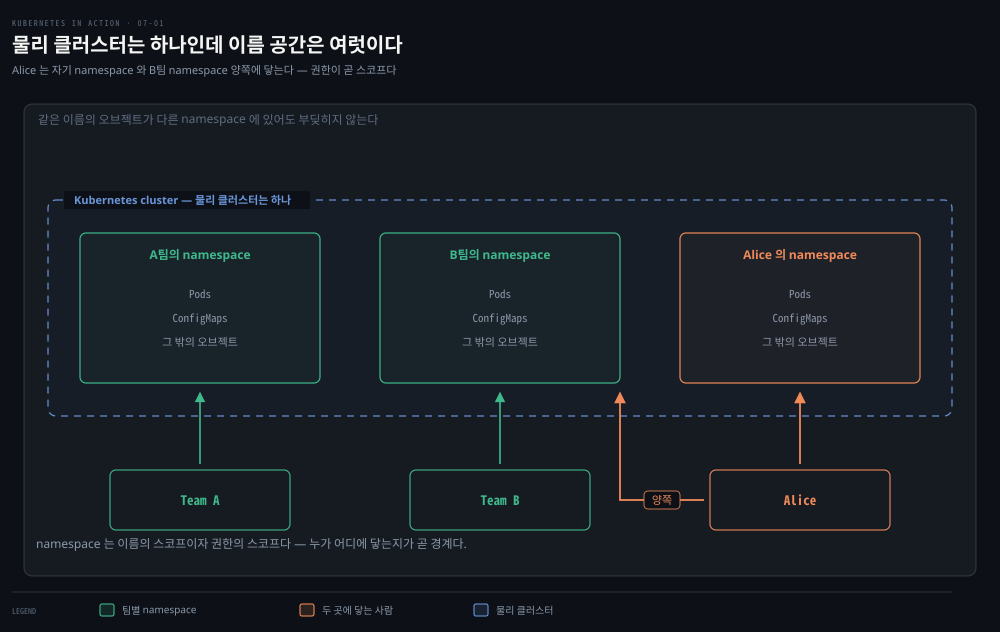
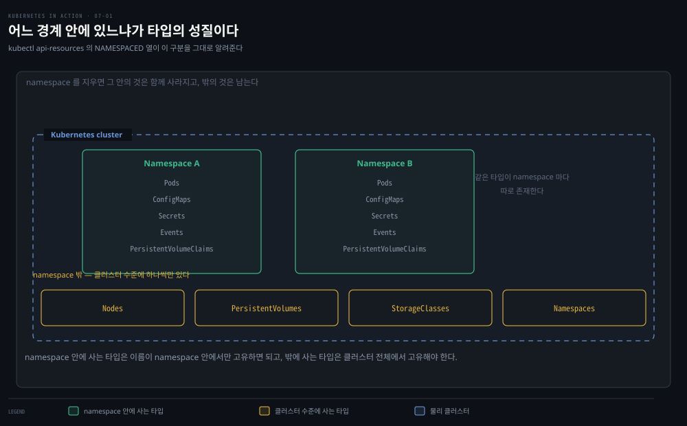
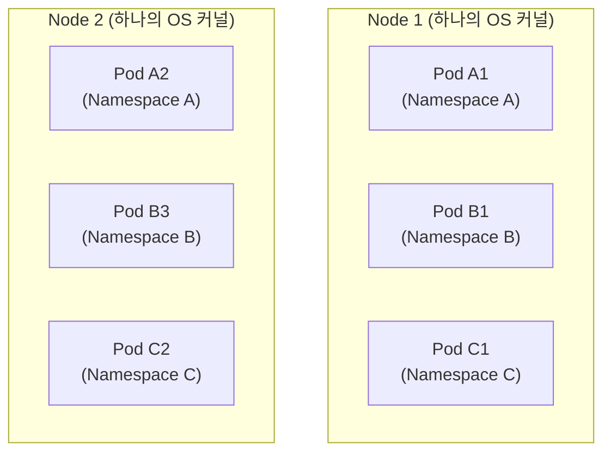

# namespace로 클러스터를 가상 분할하기
---
> 여러 팀이 한 클러스터를 쓸 때 서로의 오브젝트를 건드리지 않게 하는 장치가 namespace입니다. 이 편에서는 물리 클러스터 하나를 여러 가상 클러스터로 나누는 namespace의 생성·조회·전환과, "가상"이라는 말이 어디까지만 참인지(런타임·네트워크 격리의 부재), 그리고 삭제가 Terminating에 멈추는 고전적 문제의 진단법을 정리합니다.


## 진입 — 이 문서를 읽고 나면 무엇을 할 수 있는가

> 이 문서를 읽고 나면 namespaced/cluster-scoped 오브젝트를 구분하고, kubectl의 현재 namespace를 전환하며, namespace가 제공하는 격리와 제공하지 않는 격리를 나눠 설명하고, Terminating에 멈춘 namespace의 원인을 status conditions로 짚을 수 있습니다.

이 개념은 2장에서 배운 리눅스 네임스페이스와 이름만 같을 뿐 전혀 다릅니다. 리눅스 네임스페이스가 한 컨테이너의 프로세스를 다른 컨테이너로부터 격리하는 커널 기능이라면, 쿠버네티스 namespace는 API 오브젝트를 **겹치지 않는 그룹으로 조직**하는 논리 장치입니다.


## 1. namespace가 푸는 문제 — 이름 충돌과 권한 경계

> **namespace는 오브젝트 이름의 스코프를 제공하므로, 서로 다른 팀이 같은 이름의 오브젝트를 각자의 namespace에 만들 수 있습니다.**



한 조직이 쿠버네티스 클러스터 하나를 여러 엔지니어링 팀이 쓰는 상황을 생각해 봅니다. 각 팀이 Kiada 애플리케이션 스위트 전체를 배포해 개발·테스트한다면, 각 팀은 **자기 인스턴스**만 다루고 싶어 합니다 — 자기가 만든 오브젝트만 보이고 다른 팀 것은 안 보이길 원합니다. 이를 위해 오브젝트를 별도의 namespace에 만듭니다.

**namespace는 물리 클러스터 하나를 여러 가상 클러스터로 나눕니다.** 모두가 한 곳에 오브젝트를 만드는 대신, 팀마다 하나 이상의 namespace를 받아 그 안에 오브젝트를 만듭니다. namespace가 오브젝트 이름의 **스코프**를 제공하므로, 서로 다른 팀이 각자의 namespace에서 같은 이름을 쓸 수 있습니다. 일부 namespace는 여러 팀이나 사용자가 공유할 수도 있습니다.

여러 namespace를 쓰면 컴포넌트가 많은 복잡한 시스템을 팀별로 관리되는 작은 그룹으로 나눌 수 있습니다. 멀티테넌트 환경에서 오브젝트를 분리하는 데도 씁니다 — 고객마다 별도 namespace(또는 namespace 그룹)를 만들어 그 고객용 애플리케이션 스위트 전체를 거기 배포하는 식입니다.

namespace는 **사용자 권한의 스코프**이기도 합니다. 어떤 사용자는 한 namespace의 오브젝트만 관리할 권한을 갖고 다른 namespace에는 권한이 없을 수 있습니다. 여러 사용자·팀이 공유하는 프로덕션 클러스터에서 특히 중요한 성질입니다.

### namespaced 타입과 cluster-scoped 타입

대부분의 오브젝트 타입은 namespaced이지만, 아닌 것도 있습니다.



| 구분 | 오브젝트 타입 |
|------|--------------|
| namespaced | Pod · ConfigMap · Secret · PersistentVolumeClaim · Event 등 |
| cluster-scoped | Node · PersistentVolume · StorageClass · Namespace 자신 등 |

> 어떤 리소스가 namespaced인지 cluster-scoped인지는 `kubectl api-resources` 출력의 NAMESPACED 열로 확인합니다.


## 2. namespace 조회 — 클러스터에 이미 있는 것들

> 모든 클러스터에는 default와 kube- 접두사가 붙은 시스템 namespace가 기본으로 존재하며, 지금까지 만든 오브젝트는 전부 default에 만들어졌습니다.

namespace는 Namespace 오브젝트로 표현되므로 다른 오브젝트처럼 `kubectl get`으로 나열합니다.

```bash
kubectl get namespaces      # 축약형은 ns
# NAME                 STATUS   AGE
# default              Active   1h
# kube-node-lease      Active   1h
# kube-public          Active   1h
# kube-system          Active   1h
# local-path-storage   Active   1h
```

> `kube-` 접두사가 붙은 namespace는 쿠버네티스 시스템용으로 예약돼 있습니다.

지금까지는 `default` namespace에서 작업해 왔습니다. 오브젝트를 만들 때마다 그 namespace에 만들어졌고, `kubectl get`으로 나열할 때도 그 namespace의 오브젝트만 표시됐습니다. 다른 namespace의 오브젝트는 `--namespace`(축약 `-n`) 옵션으로 봅니다.

```bash
kubectl get pods --namespace kube-system
# NAME                        READY   STATUS    RESTARTS   AGE
# coredns-558bd4d5db-4n5zg    1/1     Running   0          1h
# etcd-kind-control-plane     1/1     Running   0          1h
# ...
```

이름 그대로 쿠버네티스 시스템 Pod들입니다. 별도 namespace에 있어 깔끔하게 구분되고, 직접 만든 Pod와 섞여 있었다면 무엇이 어디 속하는지 구분하기 어렵고 시스템 오브젝트를 실수로 지울 수도 있었을 겁니다.

namespace 구분 없이 클러스터 전체를 보려면 `--all-namespaces`(축약 `-A`)를 씁니다. 오브젝트가 어느 namespace에 있는지 기억나지 않을 때도 유용합니다.

```bash
kubectl get pods --all-namespaces
# NAMESPACE     NAME                        READY   STATUS    RESTARTS   AGE
# default       kiada-ssl                   2/2     Running   0          6m3s
# kube-system   kube-dns-5f6d887967-6sg6m   4/4     Running   0          21h
# ...
```


## 3. namespace 생성과 오브젝트 배치

> namespace는 명령 한 줄 또는 Namespace 매니페스트로 만들고, 오브젝트는 -n 옵션이나 매니페스트의 metadata.namespace 필드로 특정 namespace에 배치합니다.

가장 빠른 생성 방법은 `kubectl create namespace`입니다.

```bash
kubectl create namespace kiada-test1
# namespace/kiada-test1 created
```

> 대부분의 오브젝트 이름은 RFC 1123 DNS 서브도메인 명명 규칙을 따라야 합니다 — 소문자 영숫자·하이픈·점만 쓸 수 있고 영숫자로 시작·끝나야 합니다. namespace도 같지만 **점은 쓸 수 없습니다**.

Namespace도 오브젝트이므로 YAML 매니페스트로도 만들 수 있습니다.

```yaml
apiVersion: v1
kind: Namespace
metadata:
  name: kiada-test2
```

개발자는 보통 이렇게 만들지 않지만 운영자는 이 방식을 씁니다. 여러 namespace에 걸쳐 배포될 애플리케이션 스위트의 매니페스트 세트를 만들 때 Namespace 오브젝트를 매니페스트에 포함하면, namespace를 먼저 만들고 나서 적용하는 두 단계를 거치지 않아도 됩니다.

오브젝트를 특정 namespace에 만드는 방법은 두 가지입니다. 첫째, apply에 `-n`을 붙입니다.

```bash
kubectl apply -f kiada-ssl.yaml -n kiada-test1
kubectl -n kiada-test1 get pods     # 생성 확인
```

둘째, 매니페스트의 `metadata.namespace` 필드에 지정합니다.

```yaml
apiVersion: v1
kind: Pod
metadata:
  name: kiada-ssl
  namespace: kiada-test2    # 이 매니페스트를 적용하면 kiada-test2에 생성됨
spec:
...
```

이때 `-n` 옵션을 함께 주면 매니페스트의 namespace와 일치해야 합니다. 다르면 kubectl이 오류를 냅니다 — `the namespace from the provided object "kiada-test2" does not match the namespace "kiada-test1"`.

### kubectl의 기본 namespace 바꾸기

새 namespace를 만들고 나면 그 안에서 많은 명령을 실행하게 됩니다. 현재 namespace는 kubeconfig 파일에 설정된 현재 kubectl 컨텍스트의 속성이므로, 컨텍스트를 갱신해 전환합니다.

```bash
kubectl config set-context --current --namespace kiada-test1
# Context "kind-kind" modified.
```

이제부터 모든 kubectl 명령이 kiada-test1 namespace를 씁니다.

> 자주 전환한다면 `alias kns='kubectl config set-context --current --namespace '` 별칭을 만들거나, 같은 일을 하는 kubectl 플러그인(github.com/ahmetb/kubectx)을 설치하면 편합니다.


## 4. namespace 격리의 실체 — 이름은 나누지만 커널은 못 나눈다

> namespace는 이름 충돌 없이 오브젝트를 만들게 해 줄 뿐, 같은 노드에 올라간 다른 namespace의 Pod는 같은 OS 커널을 공유하며 네트워크도 기본적으로 서로 열려 있습니다.



여러 namespace에 같은 이름의 Pod를 만들어 보면 격리의 첫 번째 얼굴이 보입니다.

```bash
kubectl get pods -A
# NAMESPACE     NAME        READY   STATUS    RESTARTS   AGE
# default       kiada-ssl   2/2     Running   0          8h    ← 같은 이름의 Pod가
# kiada-test1   kiada-ssl   2/2     Running   0          2m    ← 세 namespace에
# kiada-test2   kiada-ssl   2/2     Running   0          1m    ← 하나씩
```

이름이 같은 Pod 세 개가 문제없이 공존합니다. 하지만 "가상 클러스터"라는 말은 이름 충돌 없이 오브젝트를 만들 수 있다는 **지점까지만** 참입니다. 물리 클러스터의 노드는 모든 사용자가 공유합니다.

서로 다른 namespace의 두 Pod가 같은 노드에 스케줄링되면 둘은 **같은 OS 커널에서** 돕니다. 컨테이너 기술로 서로 격리돼 있긴 하지만, 컨테이너를 탈출하거나 노드 자원을 과도하게 쓰는 애플리케이션은 다른 애플리케이션의 동작에 영향을 줄 수 있습니다 — 여기서 쿠버네티스 namespace는 아무 역할도 하지 않습니다.

**네트워크 격리도 기본적으로 없습니다.** 명시적으로 설정하지 않는 한, 한 namespace의 애플리케이션은 다른 namespace의 애플리케이션과 통신할 수 있습니다. 어느 namespace의 애플리케이션이 어디에 연결할 수 있는지 제한하려면 NetworkPolicy 오브젝트를 씁니다.

이런 이유로 namespace로 물리 클러스터 하나를 **프로덕션·스테이징·개발 환경으로 나누면 안 됩니다**. 진짜 격리가 아니기 때문입니다. 환경마다 별도의 물리 클러스터를 두는 것이 훨씬 안전한 접근입니다.


## 5. namespace 삭제 — Terminating에 멈추면 finalizer를 의심하라

> Namespace 오브젝트를 삭제하면 그 안의 오브젝트가 전부 자동 삭제되지만, 어떤 오브젝트의 finalizer가 제거되지 않으면 삭제가 Terminating 상태에 영영 멈춥니다.

Namespace 오브젝트를 삭제하면 그 안에 만든 오브젝트가 모두 자동으로 삭제됩니다 — 먼저 지울 필요가 없습니다.

```bash
kubectl delete ns kiada-test2
# namespace "kiada-test2" deleted
```

이 명령은 namespace 안 모든 것과 namespace 자체가 삭제될 때까지 블록합니다. 도중에 중단하고 목록을 보면 상태가 `Terminating`으로 표시됩니다.

```bash
kubectl get ns
# NAME          STATUS        AGE
# kiada-test2   Terminating   2h
```

> `--wait=false` 옵션을 주면 삭제 완료를 기다리지 않고 즉시 반환합니다.

언젠가는 이 삭제가 **영영 끝나지 않는** 상황을 만나게 됩니다. namespace가 삭제되지 못하는 이유는 그 안에 만들어진 오브젝트 하나 이상이 삭제되지 못하기 때문입니다. "그럼 `kubectl get all`로 남은 오브젝트를 봐야지"라고 생각하기 쉽지만 보통 도움이 되지 않습니다. `kubectl get all`은 일부 타입만 나열하며 Secret 같은 것은 보여주지 않습니다 — 아무것도 안 나와도 namespace가 비었다는 뜻이 아닙니다.

이렇게 멈추는 경우의 대부분은 **커스텀 오브젝트와 그 커스텀 컨트롤러**가 오브젝트의 삭제를 처리하지 않아 finalizer가 제거되지 않은 것이 원인입니다. 어느 오브젝트 때문인지는 Namespace 오브젝트의 status conditions로 확인합니다 — `kubectl describe`가 namespace의 status를 안 보여주는 문제가 있어(집필 시점 기준) YAML로 직접 봅니다.

```bash
kubectl get ns kiada-test2 -o yaml
# status:
#   conditions:
#   ...
#   - message: All content successfully deleted, may be waiting on finalization
#     reason: ContentDeleted
#     type: NamespaceDeletionContentFailure       # 삭제 표시는 됐으나 완료 안 됨
#   - message: 'Some resources are remaining: pods. has 1 resource instances'
#     reason: SomeResourcesRemain
#     status: "True"
#     type: NamespaceContentRemaining             # Pod 하나가 남아 있음
#   - message: 'Some content in the namespace has finalizers remaining:
#               xyz.xyz/xyz-finalizer in 1 resource instances'
#     reason: SomeFinalizersRemain
#     status: "True"
#     type: NamespaceFinalizersRemaining          # finalizer가 제거되지 않은 것이 원인
#   phase: Terminating
```

이 출력을 읽으면 namespace 안 오브젝트가 모두 삭제 표시는 됐지만, Pod 하나가 finalizer 때문에 완전히 삭제되지 못했음을 알 수 있습니다(위 출력은 상황을 재현해 만든 가상 예시입니다 — 정상 삭제에서는 보이지 않습니다).

### 붙잡힌 finalizer를 손으로 떼어 해소하기

원인 오브젝트를 conditions로 짚었다면, 원래는 그 finalizer를 담당하는 컨트롤러가 정리를 끝내고 스스로 표식을 떼야 삭제가 완료됩니다. 그런데 그 컨트롤러가 죽었거나 아예 없어서 표식이 영영 안 떨어질 때는, 사람이 `kubectl patch`로 해당 오브젝트의 `finalizers` 목록을 직접 비웁니다. 목록이 비는 순간 "삭제 금지"가 풀려 오브젝트가 지워지고, namespace 안이 비면 namespace도 곧바로 사라집니다.

```bash
# 원인 오브젝트(예: configmap)의 finalizers를 빈 배열로 덮어써 표식을 제거한다
kubectl patch configmap <이름> -n <namespace> \
  -p '{"metadata":{"finalizers":[]}}' --type=merge

# 잠시 뒤 확인하면 namespace가 사라져 있다(GC가 도는 데 몇 초 걸린다)
kubectl get ns <namespace>   # NotFound가 나오면 해소된 것
```

> ⚠️ finalizer를 손으로 떼는 것은 **최후의 수단**입니다. finalizer는 원래 "오브젝트를 지우기 전에 외부 리소스(클라우드 디스크·로드밸런서 등)를 먼저 정리하라"는 안전장치이므로, 강제로 떼면 그 뒷정리를 건너뛰어 클라우드에 고아 리소스가 남을 수 있습니다. 진짜 finalizer라면 떼기 전에 "왜 담당 컨트롤러가 표식을 안 떼고 있는가"부터 확인하는 것이 순서입니다.


## Spring 앱 운영 관점에서

> namespace는 Spring 마이크로서비스 조직에서 팀·제품 경계로 쓰이지만, "환경 분리는 물리 클러스터로"라는 이 편의 원칙이 Spring 프로파일 관행과 헷갈리기 쉬운 지점입니다.

Spring 개발자에게 익숙한 `application-dev.yml`·`application-prod.yml` 프로파일 분리를 쿠버네티스로 옮길 때, "dev namespace / prod namespace로 나누면 되겠다"는 발상이 자연스럽게 나옵니다. [§4](#4-namespace-격리의-실체--이름은-나누지만-커널은-못-나눈다)가 바로 그 발상을 경계합니다.

namespace에는 자원 격리가 없으니, dev에서 폭주한 배치 작업이 같은 노드의 prod Pod를 굶길 수 있습니다.

환경 분리는 물리 클러스터로 합니다. namespace는 같은 환경 안에서 팀·제품·마이크로서비스 그룹을 나누는 데 쓰는 것이 안전합니다. 실무에서 dev/staging을 한 클러스터의 namespace로 두는 조직도 있지만, 그때도 prod만큼은 분리하는 것이 일반적입니다.

`kubectl config set-context --current --namespace`로 기본 namespace를 바꾸는 §3의 방법은 여러 서비스 namespace를 오가는 마이크로서비스 팀의 일상입니다. 05-02에서 다룬 "잘못된 컨텍스트에 배포하는 사고"와 같은 결입니다. 현재 namespace를 셸 프롬프트에 표시하는 kube-ps1 같은 도구와 kubens(kubectx 패키지)를 함께 쓰면 "prod namespace인 줄 모르고 kubectl delete"하는 사고를 줄일 수 있습니다.

또 Spring 앱이 다른 namespace의 서비스를 호출할 일이 있다면 §4의 "네트워크 격리 없음"이 양날의 검이 됩니다. 기본으로는 `http://quiz.other-namespace.svc`처럼 자유롭게 부를 수 있어 편합니다. 하지만 보안 경계가 필요한 순간에는 NetworkPolicy를 명시적으로 깔아야 합니다.


## 면접에서 받을 만한 질문

> 먼저 스스로 답을 소리 내어 말해 본 뒤, 아래 정답 섹션을 펼쳐 맞춰 봅니다.

1. namespace는 무슨 문제를 풉니까? "이름의 스코프"와 "권한의 스코프"라는 두 축으로 설명해 보세요.
2. 모든 오브젝트가 namespace에 속합니까? namespaced와 cluster-scoped를 예를 들어 구분해 보세요.
3. namespace가 "가상 클러스터"라는 말은 어디까지만 참입니까? 무엇을 격리하고 무엇을 격리하지 못합니까?
4. 그래서 프로덕션·개발 환경을 namespace로 나누면 왜 안 됩니까?
5. namespace 삭제가 `Terminating`에서 영영 멈췄습니다. 원인은 무엇이고 어떻게 진단합니까?

### 빈칸 채우기 — 조회·전환·진단 명령

클러스터 전체 namespace의 오브젝트를 한 번에 보려면 `kubectl get pods 1____`(축약 `-A`)를 씁니다. kubectl의 현재 namespace를 바꾸는 명령은 `kubectl config 2____ --current --namespace X`입니다. 삭제가 멈춘 namespace의 원인을 짚으려면 `kubectl get ns X 3____`로 status conditions를 직접 읽고, `NamespaceFinalizersRemaining`이 보이면 남은 오브젝트의 `4____`를 의심합니다.


## 정답 (자답 후 펼치기)

### 정답 1 — namespace가 푸는 문제

namespace는 오브젝트 이름의 스코프를 제공하므로, 서로 다른 팀이 같은 이름의 오브젝트를 각자의 namespace에 만들어도 충돌하지 않습니다. 동시에 사용자 권한(RBAC)의 스코프이기도 해서, 어떤 사용자에게 한 namespace의 오브젝트만 관리할 권한을 주고 다른 namespace에는 권한을 주지 않을 수 있습니다. 여러 팀이 한 클러스터를 공유하는 환경에서 특히 중요합니다.

### 정답 2 — namespaced vs cluster-scoped

대부분의 오브젝트는 namespaced입니다. Pod·ConfigMap·Secret·PersistentVolumeClaim·Event가 그 예로, 특정 namespace 안에 존재합니다.

반면 클러스터 수준에 존재하는 cluster-scoped 타입도 있습니다. Node·PersistentVolume·StorageClass, 그리고 Namespace 자신이 그렇습니다. 어느 쪽인지는 `kubectl api-resources`의 NAMESPACED 열로 확인합니다.

### 정답 3 — "가상 클러스터"의 한계

"가상 클러스터"라는 말은 이름 충돌 없이 오브젝트를 만들 수 있다는 지점까지만 참입니다. namespace는 이름과 권한을 나눌 뿐, 런타임과 네트워크는 나누지 못합니다. 같은 노드에 스케줄된 다른 namespace의 Pod는 같은 OS 커널을 공유하고, 네트워크도 기본적으로 서로 열려 있습니다(제한하려면 NetworkPolicy가 필요합니다).

### 정답 4 — 환경을 namespace로 나누면 안 되는 이유

자원 격리가 없기 때문입니다. dev namespace에서 폭주한 작업이 같은 노드의 prod Pod를 굶길 수 있습니다. 이건 진짜 격리가 아니므로, 환경(프로덕션·스테이징·개발) 분리는 별도의 물리 클러스터로 하는 것이 안전합니다. namespace는 같은 환경 안에서 팀·제품·마이크로서비스 그룹을 나누는 데 씁니다.

### 정답 5 — Terminating에서 멈춘 삭제

namespace 안 오브젝트 하나 이상이 삭제되지 못해서입니다. 대부분 커스텀 오브젝트의 finalizer가 제거되지 않은 것이 원인입니다. `kubectl get all`은 일부 타입만 보여줘 도움이 안 되므로, `kubectl get ns X -o yaml`로 status conditions를 직접 읽습니다. `NamespaceFinalizersRemaining` condition이 어느 오브젝트의 어느 finalizer가 남았는지 짚어 줍니다.

### 정답 빈칸 — 1 `--all-namespaces` · 2 `set-context` · 3 `-o yaml` · 4 `finalizers`

클러스터 전체는 `--all-namespaces`(`-A`)로 보고, 현재 namespace는 `kubectl config set-context --current --namespace X`로 바꿉니다.

삭제가 멈춘 namespace는 `kubectl describe`가 status를 안 보여줘 `-o yaml`로 직접 읽고, `NamespaceFinalizersRemaining`이 뜨면 남은 오브젝트의 `finalizers` 목록이 비워지지 않은 것을 의심합니다.


## 관련 문서

> 이 편은 오브젝트를 겹치지 않는 그룹으로 나누는 namespace를 다룹니다. 다음 편(07-02)에서 같은 namespace 안 오브젝트를 조직하는 label과 selector로 이어집니다.

- [07-02.label과 label selector로 오브젝트 조직하기](./07-02.label%EA%B3%BC%20label%20selector%EB%A1%9C%20%EC%98%A4%EB%B8%8C%EC%A0%9D%ED%8A%B8%20%EC%A1%B0%EC%A7%81%ED%95%98%EA%B8%B0.md) — namespace 안에서 오브젝트를 라벨로 조직·필터링하는 다음 편
- [06-03.lifecycle hook과 Pod 생애주기 전체](./06-03.lifecycle%20hook%EA%B3%BC%20Pod%20%EC%83%9D%EC%95%A0%EC%A3%BC%EA%B8%B0%20%EC%A0%84%EC%B2%B4.md) — 6장을 마무리한 이전 편
- [핵심 워크로드](../../kubernetes/01_workloads/01-01.%ED%95%B5%EC%8B%AC%20%EC%9B%8C%ED%81%AC%EB%A1%9C%EB%93%9C.md) — namespace 안에 배치되는 Pod·Deployment·Service의 개념 정리 편
- [Kubernetes 공식 문서 — Namespaces](https://kubernetes.io/docs/concepts/overview/working-with-objects/namespaces/) — namespace의 최신 공식 설명
